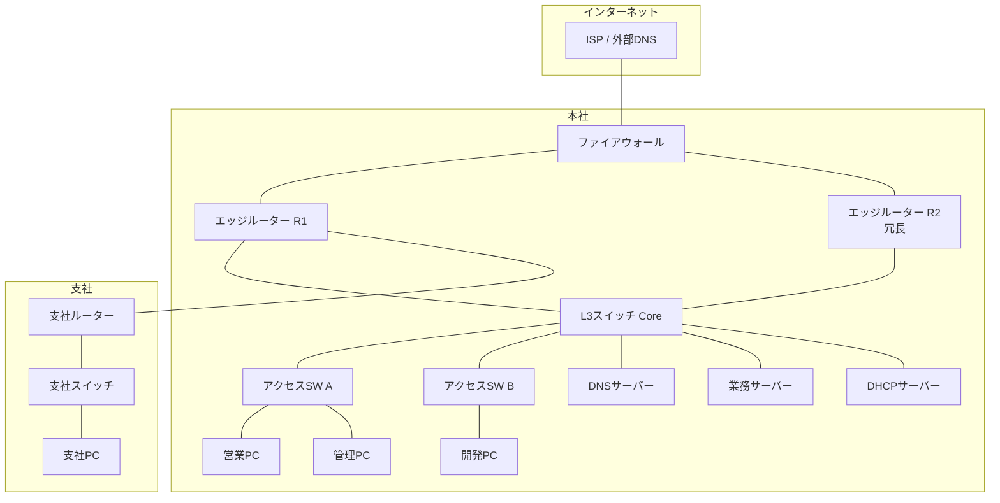

# CCNAレベル 実務向けネットワーク解説書

## 本書の目的

読者がネットワークの基本原理を理解し、構成図や設定を読み解き、基本的な設計・構築・障害対応を行える状態になることを目指す。

資格試験の暗記ではなく、「なぜその技術が必要か」「実際のシステムでどう使われるか」を軸に説明する。

## 想定読者

- ITインフラを初めて学ぶ人
- サーバーエンジニア、クラウドエンジニアを目指す人
- CCNA相当のネットワーク知識を身につけたい人
- 用語は知っているが、技術同士の関係を説明できない人

## 通貫シナリオ

本書では、次の小規模企業ネットワークを一貫して用いる。

- 本社と支社を持つ小規模企業
- 営業部、開発部、管理部をVLANで分離
- 各部署からインターネットへ接続
- 部署間通信をACLで制限
- DHCPでクライアントにIPアドレスを配布
- DNSサーバーと業務サーバーを社内に配置
- ネットワーク機器を冗長化
- 一部の通信障害を想定して切り分ける

概略構成は次のとおりである。

VLANの割り当て方針（後章で詳細化する）。

| VLAN | 名称 | 用途 | 本社サブネット例 |
|------|------|------|------------------|
| 10 | Sales | 営業部 | 10.10.10.0/24 |
| 20 | Dev | 開発部 | 10.10.20.0/24 |
| 30 | Mgmt | 管理部・サーバー | 10.10.30.0/24 |
| 99 | Native | トランクのネイティブVLAN | 未使用推奨 |
| 100 | WAN | 本社-支社間など | 10.10.100.0/30 |

---

## 詳細目次と各章の到達目標

### 第1章 ネットワークの全体像

**到達目標**

1. コンピューターネットワークの目的を、業務システムの具体例で説明できる
2. LAN、WAN、インターネットの違いを、スコープと管理主体で区別できる
3. クライアント、サーバー、スイッチ、ルーター、ファイアウォールの役割を、通信経路上の位置と結びつけて説明できる
4. 1回のHTTP通信が成立するまでの流れを、名前解決から応答返却まで順に追える
5. OSI参照モデルとTCP/IPモデルを対応づけ、各層のPDU名称を正しく使える
6. カプセル化と非カプセル化を、送信側と受信側の処理として説明できる

**節構成**

1. この章で学ぶこと
2. 技術が必要になった背景
3. コンピューターネットワークの目的
4. LAN、WAN、インターネット
5. 主要なネットワーク装置の役割
6. 通信が成立するまでの全体的な流れ
7. OSI参照モデル
8. TCP/IPモデル
9. カプセル化と非カプセル化
10. PDU、フレーム、パケット、セグメント
11. 構成例（通貫シナリオの俯瞰）
12. 確認コマンド例
13. よくある誤解
14. 代表的な障害と切り分け
15. 設計・運用上の注意点
16. 要点まとめ
17. 章末問題と解答
18. 演習

---

### 第2章 EthernetとLAN

**到達目標**

1. EthernetがLANの事実上の標準である理由を、歴史と現在の利用形態から説明できる
2. MACアドレスの構造と、フレーム転送における役割を説明できる
3. スイッチのMACアドレス学習、転送、フラッディングを動作として説明できる
4. コリジョンドメインとブロードキャストドメインの違いを、装置境界で説明できる
5. 全二重、半二重、オートネゴシエーションの失敗パターンを切り分けできる

**節構成**

1. Ethernetの基本
2. MACアドレスとEthernetフレーム
3. ユニキャスト、ブロードキャスト、マルチキャスト
4. スイッチの学習とMACアドレステーブル
5. フラッディング
6. コリジョンドメインとブロードキャストドメイン
7. 全二重、半二重、オートネゴシエーション
8. Cisco設定・確認、ホスト側確認
9. 誤解、障害、設計注意点
10. 章末問題、演習

---

### 第3章 IPアドレスとサブネット

**到達目標**

1. IPv4アドレスをネットワーク部とホスト部に分解できる
2. サブネットマスクとCIDR表記を相互に変換できる
3. プライベートIPとグローバルIP、ネットワークアドレスとブロードキャストアドレスを区別できる
4. サブネット分割とVLSMを、途中式を省略せず計算できる
5. IPv6の基本構造と主要アドレス種別を、IPv4との対比で説明できる

**節構成**

1. IPv4アドレスの構造
2. サブネットマスクとCIDR
3. アドレス種別（プライベート、グローバル、特殊アドレス）
4. サブネット分割の手順（複数例題・途中式あり）
5. VLSM
6. IPv6の基本
7. 設定・確認、誤解、障害、設計注意点
8. 章末問題、演習

---

### 第4章 TCP、UDP、主要プロトコル

**到達目標**

1. TCPとUDPの選択基準を、信頼性・遅延・用途から判断できる
2. 3ウェイハンドシェイク、シーケンス番号、確認応答、フロー制御の役割を説明できる
3. ポート番号とウェルノウンポートを、サービス識別の仕組みとして使える
4. ARP、ICMP、DNS、DHCPの役割を、通信成立の順序の中で説明できる
5. HTTP/HTTPS、SSH、NTP、SNMP、Syslogの運用上の位置づけを説明できる

**節構成**

1. トランスポート層の役割
2. TCPとUDP
3. コネクション確立と信頼性制御
4. ポート番号
5. ARP、ICMP、DNS、DHCP
6. アプリケーション層の主要プロトコル
7. 設定・確認、誤解、障害、設計注意点
8. 章末問題、演習

---

### 第5章 VLANとスイッチング

**到達目標**

1. VLANの目的を、ブロードキャスト抑制とセキュリティ分離の両面から説明できる
2. アクセスポートとトランクポート、IEEE 802.1Q、ネイティブVLANを設定・確認できる
3. VLAN間ルーティングを、Router on a StickとL3スイッチの両方で説明できる
4. DTPがベンダー固有機能であることを踏まえ、運用上の扱いを判断できる
5. 通貫シナリオの部署分離を、VLAN設計として落とし込める

**節構成**

1. VLANの目的と背景
2. アクセス／トランク、802.1Q、ネイティブVLAN
3. VLAN間ルーティング
4. DTPの概要（Cisco固有）
5. VLAN設計上の注意点
6. 設定と確認コマンド
7. 誤解、障害、設計注意点
8. 章末問題、演習

---

### 第6章 ルーティング

**到達目標**

1. ルーティングテーブルの見方と、ロンゲストマッチによる経路選択を説明できる
2. スタティックルートとデフォルトルートを設計・設定できる
3. ディスタンスベクターとリンクステートの違いを説明できる
4. OSPFの基本動作（ネイバー、エリア、メトリック）を説明できる
5. Administrative DistanceとECMPを、経路選択の流れの中で使える

**節構成**

1. ルーティングの役割
2. ルーティングテーブルとロンゲストマッチ
3. スタティック／デフォルトルート
4. ダイナミックルーティングの分類
5. OSPFの基本とエリア
6. メトリック、AD、ECMP
7. 経路選択の流れ
8. 設定・確認、誤解、障害、設計注意点
9. 章末問題、演習

---

### 第7章 冗長化とループ防止

**到達目標**

1. レイヤー2ループとブロードキャストストームの発生条件を説明できる
2. STP／RSTPのルートブリッジ、ポートロール、ポート状態を説明できる
3. EtherChannelとLACPの目的と設定要点を説明できる
4. HSRPとVRRPの違いを、標準／ベンダー固有の観点で区別できる
5. 本社コアの冗長化方針を、L2とL3に分けて設計できる

**節構成**

1. L2ループの問題
2. STP／RSTP
3. EtherChannel／LACP
4. HSRP、VRRP
5. 冗長化構成の考え方
6. 設定・確認、誤解、障害、設計注意点
7. 章末問題、演習

---

### 第8章 NAT、ACL、ネットワークセキュリティ

**到達目標**

1. スタティックNAT、ダイナミックNAT、PATの使い分けを説明・設定できる
2. 標準ACLと拡張ACLを、評価順序と暗黙のdenyを踏まえて設計できる
3. 最小権限の原則を、部署間ACLに適用できる
4. ポートセキュリティ、DHCP Snooping、DAIの防御対象を説明できる
5. 管理プレーン保護の基本方針を説明できる

**節構成**

1. NATの種類と用途
2. ACLの種類と評価
3. スイッチ側セキュリティ機能
4. 代表的な攻撃と対策
5. 管理プレーンの保護
6. 設定・確認、誤解、障害、設計注意点
7. 章末問題、演習

---

### 第9章 無線LAN

**到達目標**

1. IEEE 802.11、周波数帯、チャネル、SSID、APの関係を説明できる
2. WPA2／WPA3と認証方式の違いを説明できる
3. 電波干渉の典型原因を挙げ、設計時の回避策を説明できる
4. 有線VLAN設計と無線SSID設計を対応づけられる

**節構成**

1. 無線LANの位置づけ
2. 802.11、周波数、チャネル、SSID、AP
3. セキュリティと認証
4. 干渉と設計の基本
5. 確認、誤解、障害、設計注意点
6. 章末問題、演習

---

### 第10章 ネットワーク運用とトラブルシューティング

**到達目標**

1. ping、traceroute、各種ホストコマンド、Cisco showコマンドを目的別に使い分けられる
2. パケットキャプチャ（Wireshark／tcpdump）の基本的な使い方を説明できる
3. レイヤー別切り分けの順序を、疎通不可の現場で実行できる
4. DNS、VLAN、ルーティング障害の切り分け手順を説明できる
5. 遅延・パケットロスの調査観点を整理できる
6. 通貫シナリオの障害事例を、設計から復旧まで一連で扱える

**節構成**

1. 運用で使う確認コマンド群
2. パケットキャプチャ
3. レイヤー別切り分け
4. 典型障害パターン別手順
5. 通貫シナリオの障害対応演習
6. 章末問題、総合演習

---

## 執筆方針（本書全体）

- 初出の略語には正式名称と日本語の意味を併記する
- 設定コマンドには、目的と主要パラメータの意味を付記する
- IPv4を中心に説明し、IPv6との相違点も扱う
- ベンダー固有機能と標準技術を明示して区別する
- 正常時の動作に加え、代表的な障害と切り分けを各章で扱う
- 各章末に理解度確認問題（5問）と実務演習を置く

## 読み方

1. 第1章で「通信の全体像」と層モデルの地図を掴む
2. 第2〜4章でデータリンク、ネットワーク、トランスポートの土台を固める
3. 第5〜8章で企業LANの設計・制御・セキュリティに進む
4. 第9章で無線を有線設計の延長として位置づける
5. 第10章で運用コマンドと切り分け手順を統合する

## 執筆状態

**完了**（第1章〜第10章、[合本](./BOOK_FULL.md)、[完了チェックリスト](./COMPLETE.md) を含む）

## 本文ファイル

| 章 | ファイル |
|----|----------|
| 目次 | [00_mokuji.md](./00_mokuji.md) |
| 第1章 | [01_network_overview.md](./01_network_overview.md) |
| 第2章 | [02_ethernet_lan.md](./02_ethernet_lan.md) |
| 第3章 | [03_ip_subnet.md](./03_ip_subnet.md) |
| 第4章 | [04_tcp_udp_protocols.md](./04_tcp_udp_protocols.md) |
| 第5章 | [05_vlan_switching.md](./05_vlan_switching.md) |
| 第6章 | [06_routing.md](./06_routing.md) |
| 第7章 | [07_redundancy.md](./07_redundancy.md) |
| 第8章 | [08_nat_acl_security.md](./08_nat_acl_security.md) |
| 第9章 | [09_wireless_lan.md](./09_wireless_lan.md) |
| 第10章 | [10_operations_troubleshooting.md](./10_operations_troubleshooting.md) |
| 合本 | [BOOK_FULL.md](./BOOK_FULL.md) |
| 完了確認 | [COMPLETE.md](./COMPLETE.md) |
