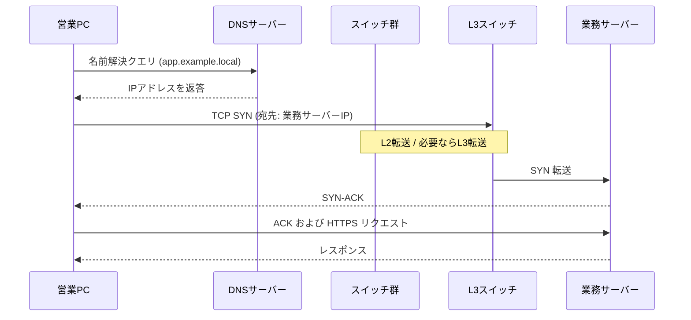

# 第1章 ネットワークの全体像

## 学習目標

この章を終えると、次のことができる。

1. コンピューターネットワークの目的を、業務システムの具体例で説明できる
2. LAN、WAN、インターネットの違いを、スコープと管理主体で区別できる
3. クライアント、サーバー、スイッチ、ルーター、ファイアウォールの役割を、通信経路上の位置と結びつけて説明できる
4. Webブラウザが社内ポータルを開くまでの処理を、名前解決から応答返却まで順に追える
5. OSI参照モデルとTCP/IPモデルを対応づけ、各層で扱うデータの呼び名を正しく使える
6. カプセル化と非カプセル化を、送信側と受信側の処理として説明できる

---

## 1.1 この章で学ぶこと

ネットワークの学習が難しく感じる理由のひとつは、用語が先に並び、全体像が後回しになることにある。

スイッチ、ルーター、IPアドレス、ポート番号。いずれもあとで詳しく扱う。先に必要なのは、「ある端末から別の端末へデータが届く」という出来事を、どの装置がどの順番で扱うかという地図である。

本章では、その地図を作る。

通貫シナリオの本社ネットワークを例に、営業PCが社内の業務サーバーへアクセスし、さらにインターネット上のサービスへも到達するまでの流れを追う。層モデルは、この流れを整理するための道具として導入する。

---

## 1.2 技術が必要になった背景

単独のコンピューターは、計算と保存はできる。しかし業務は、複数の人が同じデータとサービスを共有することで成り立つ。

営業担当が顧客情報を参照し、開発担当が同じ社内システムにログインし、管理部が権限を制御する。これらは、端末同士が規則に従ってデータをやり取りできて初めて成立する。

初期の接続は、2台をケーブルで直結するだけでも足りた。台数が増え、拠点が増え、インターネットが業務の前提になると、次の問題が一気に表面化する。

- どの相手に送るか（宛先の識別）
- どう届けるか（経路の選択）
- 途中で壊れていないか（誤り検出）
- 誰に見せてよいか（アクセス制御）
- 障害時にどこを疑うか（切り分け単位）

ネットワーク技術は、これらの問題を「役割ごとに分離した層」と「装置の分担」で解いてきた。OSI参照モデルやTCP/IPモデルは、その分離を共通言語にした枠組みである。

---

## 1.3 基本概念

### 1.3.1 コンピューターネットワークの目的

**コンピューターネットワーク**とは、複数のコンピューターやネットワーク装置を接続し、規則（プロトコル）に従ってデータを交換する仕組みである。

目的は次の3点に集約できる。

1. **資源の共有**：プリンター、ファイル、業務アプリケーション、インターネット回線を共有する
2. **コミュニケーション**：メール、チャット、Web会議、API連携を成立させる
3. **可用性の向上**：単一拠点・単一装置に依存しない構成を可能にする

通貫シナリオでは、営業・開発・管理の各PCが、社内のDNSサーバーと業務サーバーを共有し、必要に応じてインターネットへ出る。ネットワークがなければ、各端末に同じデータを複製し、人手で同期するしかない。

### 1.3.2 LAN、WAN、インターネット

スコープの違いを、管理の境界で捉えると迷いが減る。

| 用語 | 正式名称・意味 | 典型的な範囲 | 誰が設計・運用するか |
|------|----------------|--------------|----------------------|
| **LAN** | Local Area Network（構内ネットワーク） | 同一建物、同一フロア、同一キャンパス | 自社または委託先のインフラ担当 |
| **WAN** | Wide Area Network（広域ネットワーク） | 拠点間を結ぶ広域回線 | 自社設計＋通信キャリアの回線 |
| **インターネット** | 世界規模の相互接続されたネットワーク群 | 組織を超えた全世界 | 多数の組織が相互接続して成立 |

本社ビル内のスイッチ配線はLANである。本社と支社を専用線やVPNで結ぶ部分はWANである。社員が外部のSaaSへアクセスする先はインターネットである。

```text
[本社LAN] ----(WAN/VPN)---- [支社LAN]
    |
    +---- ファイアウォール ---- インターネット
```

「社内はLAN、社外はWAN」と覚えると粗い。支社接続は社外回線でもWANであり、クラウド上のVPC内は地理的に離れていても、設計上はLAN相当の論理ネットワークとして扱うことが多い。見るべきは地理距離そのものより、**アドレス空間の設計単位と管理主体**である。

### 1.3.3 クライアント、サーバー、主要装置

通信の登場人物を、役割で分ける。

#### クライアントとサーバー

- **クライアント**：サービスを要求する側。営業PCのブラウザなど。
- **サーバー**：サービスを提供する側。業務サーバー、DNSサーバー、DHCPサーバーなど。

役割は相対的である。あるサーバーが、別のサーバーに対してクライアントになることもある。業務サーバーがDNS問い合わせを出す場面がその例である。

#### スイッチ

**スイッチ**は、主に同一ネットワーク（同一ブロードキャストドメイン内）で、MACアドレスを手がかりにフレームを転送する装置である。OSIでいうデータリンク層（レイヤー2）の装置として説明されることが多い。

本書の本社では、アクセススイッチがPCを収容し、コアスイッチ（またはL3スイッチ）が部署VLANを集約する。

#### ルーター

**ルーター**は、IPアドレスを手がかりに、異なるネットワーク間でパケットを転送する装置である。OSIでいうネットワーク層（レイヤー3）の装置である。

本社と支社、社内とインターネットの境界で経路を判断する。

#### ファイアウォール

**ファイアウォール**は、あらかじめ定めたポリシーに基づき、通過させる通信と拒否する通信を制御する装置（またはソフトウェア）である。

ルーターが「届け方」を担うのに対し、ファイアウォールは「通してよいか」を担う。実機ではルーター機能とファイアウォール機能を一体で持つ製品も多い。概念上は役割を分けて考える。

#### 役割の対応関係

```text
PC -- アクセスSW -- L3スイッチ/ルーター -- ファイアウォール -- インターネット
         ^                ^                     ^
     同一LAN内転送     ネットワーク間転送      ポリシー制御
```

---

## 1.4 通信や処理の流れ

ここでは、営業PC（クライアント）が社内業務サーバー上のWebアプリを開く流れを追う。前提は次のとおりとする。

- 営業PCはすでにIPアドレス、サブネットマスク、デフォルトゲートウェイ、DNSサーバーの情報を持っている（DHCPの詳細は第4章）
- 業務サーバー名は `app.example.local`
- 営業VLANとサーバーVLANは分かれており、L3スイッチがVLAN間ルーティングを行う（詳細は第5章）

### 1.4.1 全体手順

1. ユーザーがブラウザで `https://app.example.local` を開く
2. PCはDNSサーバーへ名前解決を依頼し、業務サーバーのIPアドレスを得る
3. PCはTCPのコネクション確立（3ウェイハンドシェイク）を行う
4. TLSハンドシェイクのあと、HTTPリクエストを送る
5. 途中のスイッチはMACアドレスでフレームを転送する
6. L3スイッチまたはルーターは、必要ならIPヘッダを見てネットワーク間転送を行う
7. 業務サーバーが応答し、逆経路でPCへ戻る

名前解決に失敗すれば、そもそもサーバーのIPがわからない。デフォルトゲートウェイが誤っていれば、別VLANへ出られない。スイッチのVLAN設定が誤っていれば、同一フロアでも届かない。障害切り分けは、この順序を逆にたぐる作業になる。

### 1.4.2 1ホップ内とネットワークを越える場合

同一VLAN内の通信では、おおむね次が起きる。

1. 送信側が宛先IPを知る
2. 同一サブネットと判断したら、ARPで宛先MACを解決する（ARPは第4章）
3. Ethernetフレームを組み立て、スイッチがMACテーブルに基づき転送する

別VLANやインターネット向けでは、宛先MACは「最終宛先」ではなく「次ホップ（デフォルトゲートウェイ等）」になる。IPの宛先は最終サーバーのまま、Ethernetの宛先だけが経路上の隣接装置に付け替わる。これがレイヤー2とレイヤー3の役割分担である。



---

## 1.5 OSI参照モデル

**OSI参照モデル**（Open Systems Interconnection Reference Model：開放型システム間相互接続参照モデル）は、ISOが定めた7層の通信機能モデルである。現在のインターネット実装の主軸はTCP/IPだが、現場の会話、ドキュメント、障害切り分けではOSIの層番号が共通言語として使われ続ける。

| 層 | 名称 | 主な役割 | 現場で出てくる例 |
|----|------|----------|------------------|
| 7 | アプリケーション | ユーザー向けサービス | HTTP、DNS、SSH |
| 6 | プレゼンテーション | データの表現、暗号化の概念整理 | TLSをここで語る説明もある |
| 5 | セッション | セッションの管理 | 実務ではTCP/アプリに吸収されがち |
| 4 | トランスポート | エンド間の信頼性・ポート | TCP、UDP |
| 3 | ネットワーク | 論理アドレスと経路選択 | IP、ルーター |
| 2 | データリンク | 隣接ノード間のフレーム転送 | Ethernet、スイッチ、MAC |
| 1 | 物理 | 電気・光・無線の信号 | ケーブル、NIC、電波 |

実務では、次のように使う。

- 「L1障害」：リンクダウン、ケーブル抜け、SFP故障
- 「L2障害」：VLAN不一致、MACフラッディング、STPループ
- 「L3障害」：ルーティング欠落、サブネット設計ミス
- 「L4以上」：ポート閉塞、アプリ設定、DNS、証明書

厳密な学術分類と現場の俗称は完全一致しない。たとえばTLSをレイヤー6と呼ぶか、アプリケーションの話題として扱うかは文脈次第である。重要なのは、切り分けのときに「今どの問題を疑っているか」を共有できることである。

---

## 1.6 TCP/IPモデル

**TCP/IPモデル**（またはTCP/IPプロトコルスイートの層構造）は、インターネット実装に即した層分けである。資料により4層または5層で書かれる。

本書では、学習と切り分けのしやすさから次の対応で扱う。

| TCP/IP（本書の扱い） | 対応するOSI | 代表プロトコル／技術 |
|----------------------|-------------|----------------------|
| アプリケーション層 | OSI 5〜7 | HTTP、DNS、SSH、DHCP |
| トランスポート層 | OSI 4 | TCP、UDP |
| インターネット層 | OSI 3 | IP、ICMP、ARP※ |
| ネットワークインターフェース層 | OSI 1〜2 | Ethernet、Wi-Fi |

※ ARPの層归属には議論がある。IPアドレスからMACアドレスを解決する補助プロトコルとして、インターネット層の周辺で扱う説明が多い。本書もその立場を取る。

OSIは「機能の整理」、TCP/IPは「実装の束」と覚えるとよい。試験対策でも現場説明でも、両方の層名が出る。片方だけ暗記すると、ドキュメントを読み違える。

```text
OSI                TCP/IP（本書）
7 アプリケーション ┐
6 プレゼンテーション┼─ アプリケーション層
5 セッション       ┘
4 トランスポート ──── トランスポート層
3 ネットワーク   ──── インターネット層
2 データリンク   ┐
1 物理           ┴─ ネットワークインターフェース層
```

---

## 1.7 カプセル化と非カプセル化

### 1.7.1 カプセル化（送信側）

**カプセル化**（encapsulation）とは、上位層のデータを下位層がヘッダ（必要ならトレイラ）で包み、送信用の形へ変換していく処理である。

営業PCがHTTPリクエストを送る場合のイメージは次のとおりである。

1. アプリケーションデータ（HTTPリクエスト）を作る
2. トランスポート層がTCPヘッダを付与する → **セグメント**
3. インターネット層がIPヘッダを付与する → **パケット**
4. データリンク層がEthernetヘッダ／トレイラを付与する → **フレーム**
5. 物理層がビット列として媒体へ送出する

```text
[HTTPデータ]
   ↓ + TCPヘッダ
[TCPヘッダ|HTTPデータ]          ← セグメント
   ↓ + IPヘッダ
[IPヘッダ|TCPヘッダ|HTTPデータ] ← パケット
   ↓ + Ethernetヘッダ/FCS
[Eth|IP|TCP|HTTP|FCS]           ← フレーム
```

各装置は、自分の役割に必要なヘッダだけを見て処理する。スイッチは基本的にEthernetヘッダのMACを見る。ルーターはIPヘッダのネットワークアドレスを見る。ブラウザはHTTPの内容を扱う。

### 1.7.2 非カプセル化（受信側）

**非カプセル化**（decapsulation）は、受信側が下位層から順にヘッダを剥がし、上位層へデータを渡す処理である。

業務サーバー側では、フレーム受信 → Ethernet検査 → IP検査 → TCP検査 → HTTP処理、という順になる。途中でチェックに失敗すれば、その層で破棄またはエラー応答が発生し、上位まで届かない。

### 1.7.3 中間装置での再カプセル化

ルーターがパケットを次のネットワークへ転送するとき、IPパケットの中身（上位データ）は保持しつつ、出ていくインターフェースに合わせて新しいEthernetヘッダを付ける。

つまり中間のルーターは、「完全にアプリまで上がる」のではなく、主にレイヤー3まで処理して再カプセル化する。この理解がないと、「ルーターを通るとMACアドレスが変わるのはなぜか」が説明できない。

---

## 1.8 PDU、フレーム、パケット、セグメント

**PDU**（Protocol Data Unit：プロトコルデータユニット）は、ある層で扱うデータの単位を指す一般名称である。層ごとに慣用の呼び名がある。

| 層 | 慣用名称 | 中身のイメージ |
|----|----------|----------------|
| トランスポート | **セグメント**（TCP）／データグラム（UDP） | TCP/UDPヘッダ＋アプリデータ |
| ネットワーク | **パケット** | IPヘッダ＋セグメント |
| データリンク | **フレーム** | Ethernetヘッダ＋パケット＋FCS |
| 物理 | ビット | 電気・光・無線の信号 |

現場では「パケット」を総称として使うことも多い。切り分けや設計レビューでは、今どこの話をしているかを明確にするため、可能な限り層に応じた呼び名を使う。

「フレームが届かない」と言えばL2までを疑う。「パケットが届かない」と言えばL3の経路やACLを疑う。言葉が粗いと、調査範囲が無駄に広がる。

---

## 1.9 構成例

通貫シナリオの本社を、装置役割だけで簡略化する。

```text
                    +------------------+
                    |   インターネット  |
                    +--------+---------+
                             |
                    +--------+---------+
                    |  ファイアウォール |
                    +--------+---------+
                             |
              +--------------+--------------+
              |                             |
       +------+------+               +------+------+
       | ルーター R1 |               | ルーター R2 |
       +------+------+               +------+------+
              |                             |
              +--------------+--------------+
                             |
                    +--------+---------+
                    |  L3スイッチ Core |
                    +---+-----+-----+--+
                        |     |     |
              +---------+  +--+--+  +-----------+
              |            |     |              |
        +-----+-----+ +----+--+ +----+----+ +---+----+
        | Access SW | | DNS  | | 業務SRV | | DHCP   |
        +-----+-----+ +------+ +---------+ +--------+
              |
     +--------+--------+
     |        |        |
  営業PC   開発PC   管理PC
  (VLAN10) (VLAN20) (VLAN30)
```

この図から読み取れる設計意図は次である。

- PCはアクセススイッチに接続する（L2収容）
- 部署間とサーバーアクセスはL3スイッチがルーティングする
- インターネット境界にファイアウォールを置く
- エッジルーターを冗長化する（詳細は第7章）

第1章の時点では、まだVLANやOSPF、HSRPの設定値は出てこない。まず「誰が何を担当するか」を固定する。

---

## 1.10 Cisco IOSの設定例

第1章では、装置の「存在確認」と「基本識別」に留める。VLANやルーティングの本設定は後章で扱う。

### ホスト名と管理用の基本設定

```cisco
! 装置を識別する名前を付ける
Router(config)# hostname R1

! 特権EXECモードのパスワード（学習環境例。本番はAAA等を検討）
R1(config)# enable secret Str0ngP@ss

! コンソール回線の基本設定
R1(config)# line console 0
R1(config-line)# password ConsolePass
R1(config-line)# login
R1(config-line)# logging synchronous
R1(config-line)# exit

! 遠隔管理用にSSHを使う前提の最低限（詳細はセキュリティ章）
R1(config)# ip domain-name example.local
R1(config)# crypto key generate rsa modulus 2048
R1(config)# username admin privilege 15 secret AdminPass
R1(config)# line vty 0 4
R1(config-line)# transport input ssh
R1(config-line)# login local
```

主要パラメータの意味は次のとおりである。

- `hostname`：ログやプロンプトで装置を識別する
- `enable secret`：特権モードへ入るためのパスワード（secretは暗号化保存）
- `logging synchronous`：コンソール入力中にログが割り込んで見にくくなるのを防ぐ
- `transport input ssh`：VTYへはSSHのみ許可する（Telnetを避ける）

### インターフェースのリンク確認

```cisco
R1# show ip interface brief
! 各IFのIP、状態（Status/Protocol）を一覧する

R1# show interfaces GigabitEthernet0/0
! リンク状態、速度、デュプレックス、エラーカウンタを確認する
```

`Status` が `up` で `Protocol` が `down` の場合、物理的には何かしら見えていても、データリンク相当の確立に失敗している可能性がある。まずケーブル、対向設定、shutdown有無を疑う。

---

## 1.11 LinuxおよびWindowsでの確認例

エンドホスト側でも、自分の位置づけを確認できる。

### Windows

```bat
:: IPアドレス、サブネットマスク、デフォルトゲートウェイ、DNSを確認
ipconfig /all

:: 疎通確認（ICMPエコー）
ping 10.10.30.10

:: 経路上のホップを確認
tracert 10.10.30.10
```

### Linux

```bash
# 現行のIPとルート情報（ディストリにより ip コマンド推奨）
ip addr show
ip route show

# 疎通確認
ping -c 4 10.10.30.10

# 経路確認
traceroute 10.10.30.10
# または
tracepath 10.10.30.10
```

第1章で確認したいのは、次の3点である。

1. 自分のIPとマスクが設計どおりか
2. デフォルトゲートウェイが正しいか
3. 同一サブネット／別サブネットの代表アドレスへ ping が通るか

アプリの話（HTTP 500など）に進む前に、IP到達性を切り分ける習慣が、以降の全章の土台になる。

---

## 1.12 よくある誤解

1. **「スイッチとルーターは速さの違い」**  
   本質は速さではない。見るアドレス（MACかIPか）と、転送する範囲（同一ネットワーク内かネットワーク間か）の違いである。

2. **「OSIは古いから不要」**  
   実装の主軸はTCP/IPでも、障害票・設計レビュー・ベンダー資料ではL1〜L7の言葉が残る。共通言語として必要である。

3. **「ファイアウォールがあればルーターは不要」**  
   多くのファイアウォールはルーティングも行う。それでも、経路制御の設計と、ポリシー制御の設計は別問題として扱う必要がある。

4. **「pingが通れば業務は動く」**  
   pingは主にICMPの到達性確認である。TCP 443がACLで落ちていれば、pingは通ってもHTTPSは失敗する。

5. **「クラウドならネットワーク知識は不要」**  
   VPC、サブネット、ルートテーブル、セキュリティグループは、本書のLAN／WAN／ACLと同じ考え方の上にある。

---

## 1.13 代表的な障害

第1章の範囲で出会う典型例を挙げる。

| 症状 | ありがちな原因 | まず疑う層 |
|------|----------------|------------|
| リンクランプが消灯 | ケーブル断、ポートshutdown、NIC障害 | L1 |
| 同一VLANなのに不通 | VLAN未割り当て、ケーブルが別SWへ誤配線 | L2 |
| 同一フロアで部署サーバーだけ不通 | VLAN間ルーティング欠落、ゲートウェイ誤り | L3 |
| 名前を入れると失敗、IP直打ちは成功 | DNS設定ミス、DNSサーバー不通 | アプリ／基盤サービス |
| 社内は通るがインターネットだけ不通 | デフォルトルート、NAT、FWポリシー | L3＋境界制御 |

---

## 1.14 トラブルシューティング手順

疎通できないとき、第1章の知識だけでも次の順で切り分けられる。

1. **物理確認**：ケーブル、リンクランプ、対向ポートの up/down
2. **自ホスト確認**：`ipconfig` / `ip addr` でIP・マスク・ゲートウェイ・DNS
3. **同一セグメント確認**：同一VLAN内の別ホストへ ping
4. **ゲートウェイ確認**：デフォルトゲートウェイへ ping
5. **遠隔ネットワーク確認**：別VLANや支社、外部への ping / traceroute
6. **名前解決確認**：IP直打ちとホスト名指定の差を見る
7. **サービス確認**：ポート到達（後章の `Test-NetConnection` や `ss`/`nc`）

下位層が壊れているのに上位のアプリログだけを見ても、原因には辿り着きにくい。必ず下から、または「今どの層が成立しているか」を確認しながら進む。

---

## 1.15 設計・運用上の注意点

1. **構成図を最新に保つ**  
   障害対応の初動は、正しい構成図の有無で大きく変わる。論理図（VLAN/IP）と物理図（ケーブリング）を分ける。

2. **アドレス設計を先に決める**  
   場当たり的なIP追加は、後の要約ルートやACLを壊す。通貫シナリオのように部署単位でまとめる。

3. **管理用通信経路を確保する**  
   本番データプレーンが落ちても、装置へログインできる経路（アウトオブバンドなど）を検討する。

4. **標準とベンダー固有を混同しない**  
   例：EthernetやIPは標準、DTPやHSRPはCisco色が強い（後章）。資料を読むとき、どちらなのかを先に確認する。

5. **変更は検証可能な単位で行う**  
   「VLANもルーティングもFWも同時変更」は切り分け不能を招く。

---

## 1.16 要点まとめ

- ネットワークの目的は、資源共有、コミュニケーション、可用性向上である
- LAN／WAN／インターネットは、スコープと管理主体で区別する
- スイッチはMAC、ルーターはIP、ファイアウォールはポリシーを主に扱う
- 通信は、名前解決 → 到達性 → トランスポート → アプリケーションの順で積み上がる
- OSIは機能整理、TCP/IPは実装の束。両方を対応づけて使う
- カプセル化は送信側の包み込み、非カプセル化は受信側の剥離である
- PDUの呼び名（セグメント／パケット／フレーム）は、切り分け範囲を共有する言葉である

---

## 1.17 章末問題

### 問題1

本社の営業PCから支社PCへ通信するとき、LAN、WAN、インターネットのどれを経由し得るか。通貫シナリオの構成を前提に説明せよ。

### 問題2

スイッチとルーターの違いを、「参照するアドレス」と「接続するネットワークの関係」の2点で述べよ。

### 問題3

OSIのレイヤー2障害とレイヤー3障害の切り分け例を、それぞれ1つ挙げよ。

### 問題4

送信側ホストで、HTTPデータがフレームになるまでのカプセル化の順序を述べよ。

### 問題5

`ping` は成功するがブラウザで社内Webが開けないとき、第1章の範囲で疑うべき点を2つ挙げよ。

---

## 1.18 解答と解説

### 解答1

営業PC（本社LAN）から支社PC（支社LAN）へは、本社と支社を結ぶWAN（専用線やVPNなど）を経由する。インターネットを経由する構成もあり得るが、通貫シナリオの基本形は本社エッジと支社ルーターを結ぶWAN経路である。支社内のスイッチ配線部分はそれぞれのLANである。

### 解答2

スイッチは主にMACアドレスを参照し、同一ネットワーク内でフレームを転送する。ルーターはIPアドレスを参照し、異なるネットワーク間でパケットを転送する。

### 解答3

例：レイヤー2は「アクセスポートのVLAN ID不一致で同一フロアなのに不通」。レイヤー3は「デフォルトゲートウェイ誤り、またはVLAN間ルート欠落で別部署サーバーに届かない」。

### 解答4

アプリケーションデータ → TCPヘッダ付与（セグメント） → IPヘッダ付与（パケット） → Ethernetヘッダ／FCS付与（フレーム） → 物理信号として送出。

### 解答5

例：(1) DNSによる名前解決の失敗（IP直打ちでは成功し得る）。(2) ICMPは許可されているがTCP 443がACLやファイアウォールで拒否されている。

---

## 1.19 実機またはシミュレーター演習

Cisco Packet Tracer、GNS3、CML、実機のいずれかを使い、最小構成を作る。

### 演習A：3台の基本疎通

1. PC-A、PC-B、スイッチを接続する
2. PC-Aに `192.168.1.10/24`、PC-Bに `192.168.1.20/24` を設定する
3. 相互に ping し、成功を確認する
4. PC-BのIPを `192.168.2.20/24` に変更し、pingが失敗することを確認する
5. 失敗の理由を、ネットワーク部が異なるためL2だけでは届かない（ゲートウェイが必要）という観点から説明し、レポートに書く

### 演習B：層の言葉で症状を書く

1. ケーブルを抜いて ping を実行する
2. ケーブルを戻し、意図的にPCのゲートウェイを誤設定して ping する
3. それぞれの失敗を、「L1の問題」「L3の問題」として障害票風に1行で記録する

記録例：

```text
[障害票]
症状: PC-AからPC-Bへping不可
確認: PC-Aのnicリンクランプ消灯
判断: L1（物理リンクダウン）を先に復旧する
```

### 演習C：通貫シナリオの図を自分の言葉で再描画する

1. 本章の構成図を見ずに、本社のクライアント／サーバー／SW／ルータ／FWの関係を描く
2. 「営業PCが業務サーバーへHTTPSする」経路を太線で示す
3. その経路上で、各装置が主に見るヘッダ（MAC／IP／ポリシー）を書き込む

この演習が終わった時点で、第2章以降のEthernet、IP、TCP、VLANの話が「どこに刺さる知識か」が見えている状態になる。

---

## 次章への橋渡し

同一LAN内で、スイッチはどのように宛先へフレームを届けるのか。

その答えの中心が、EthernetとMACアドレスである。第2章では、スイッチの学習と転送、フラッディング、ブロードキャストドメインを扱う。
