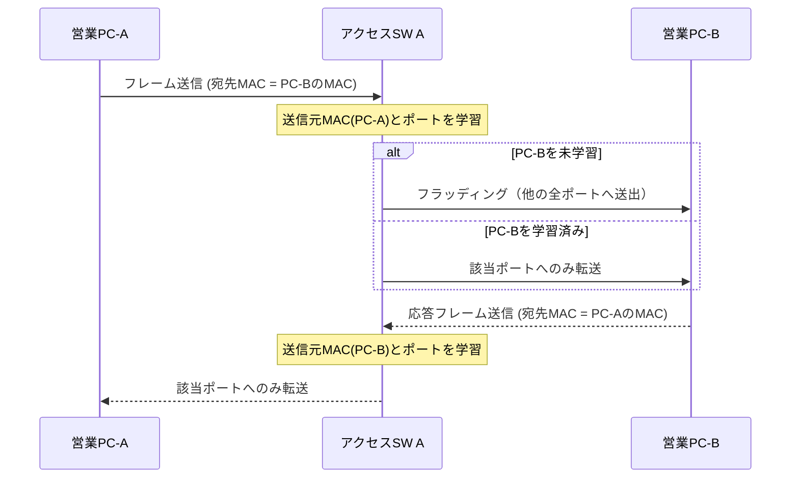

# 第2章 EthernetとLAN

## 学習目標

この章を終えると、次のことができる。

1. EthernetがLANの事実上の標準になった理由を、歴史的経緯と現在の利用形態から説明できる
2. MACアドレスの構造と、Ethernetフレームの各フィールドの役割を説明できる
3. ユニキャスト、ブロードキャスト、マルチキャストの違いを、宛先MACアドレスの形式で区別できる
4. スイッチのMACアドレス学習、転送、フラッディングの動作を、MACアドレステーブルの状態変化として追える
5. コリジョンドメインとブロードキャストドメインの違いを、装置境界と設定で説明できる
6. 全二重、半二重、オートネゴシエーションの仕組みと、デュプレックスミスマッチの症状を切り分けできる

---

## 2.1 この章で学ぶこと

第1章では、PCからサーバーへ届くまでの流れを、装置の役割ごとに大づかみに整理した。

その中で、スイッチは「同一ネットワーク内でMACアドレスを手がかりにフレームを転送する装置」とだけ説明した。

ここからは、その説明を分解する。

MACアドレスとは何か、Ethernetフレームはどんな形をしているか、スイッチはどうやってMACアドレスを覚え、どこへ転送するかを、通貫シナリオのアクセススイッチとPCの関係で具体的に追う。

第1章の図でいえば、営業PCと管理PCを収容するアクセスSW Aの内部で、実際に何が起きているかを見る章である。

---

## 2.2 技術が必要になった背景

複数の端末を1本の共有媒体につなぐ発想は、Ethernetより前から存在した。

初期のEthernet（同軸ケーブルを使うバス型構成）では、すべての端末が同じ電気信号の通り道を共有していた。

共有媒体では、複数の端末が同時に送信すると信号が衝突し、データが壊れる。

この衝突（コリジョン）を検出し、再送する仕組みとして生まれたのが、CSMA/CD（Carrier Sense Multiple Access with Collision Detection：搬送波感知多重アクセス／衝突検出）である。

端末が増えるほど、衝突の確率は上がり、実効的な通信性能は下がっていく。

この問題を緩和するために、ケーブル配線はバス型からスター型へ移り、集線装置もハブからスイッチへ置き換わっていった。

ハブは電気信号をそのまま全ポートへ再送出するだけの装置であり、衝突ドメインを分割しない。

スイッチは、宛先ごとに必要なポートだけへフレームを転送できるため、衝突ドメインを大幅に縮小し、全二重通信を実用的にした。

現在の企業LANでは、PCとスイッチの間、スイッチとスイッチの間のほとんどが専用の全二重リンクであり、古典的な意味での衝突はほぼ発生しない。

それでも「コリジョンドメイン」という考え方自体は、ケーブル配線ミスや設定ミスによる異常を理解するうえで、いまも有効な整理軸である。

もう一つの背景として、「同じネットワーク内の端末をどう識別するか」という問題がある。

IPアドレスは管理者が割り当てる論理的な住所だが、Ethernetの世界では、機器を出荷した時点で一意な識別子が必要になる。

この要求に応えるのがMACアドレスであり、ベンダーごとに割り当てられる番号体系によって、世界中でほぼ重複しない識別が可能になっている。

---

## 2.3 基本概念

### 2.3.1 Ethernetの基本

**Ethernet**（イーサネット）は、IEEE 802.3として標準化された、LANにおけるデータリンク層（レイヤー2）の技術群である。

配線方式、信号方式、フレーム形式を含む標準の集合体であり、特定のベンダーに属さない標準技術である。

現在主流のツイストペアケーブル（UTP／STPケーブル）を使うEthernetでは、送信線と受信線が物理的に分かれているため、双方向を同時に使える全二重通信が前提になっている。

速度規格は、10BASE-T（10Mbps）から始まり、100BASE-TX（100Mbps）、1000BASE-T（1Gbps）、10GBASE-T（10Gbps）などへと拡張されてきた。

規格名の数字部分がおおよその速度を表し、末尾の文字がケーブル種別や信号方式を表すという命名規則を知っておくと、機器の仕様書を読みやすくなる。

企業LANの設計者にとって重要なのは規格そのものの歴史よりも、「アクセス層はどの速度で統一するか」「上位のアップリンクはどれだけ帯域を確保するか」という設計判断である。

通貫シナリオでは、アクセスSW A／Bの各ポートは1000BASE-Tで統一し、コアスイッチへのアップリンクにはより高速なリンクを割り当てる、という設計方針を前提にする。

### 2.3.2 MACアドレス

**MACアドレス**（Media Access Control address：メディアアクセス制御アドレス）は、Ethernetにおいてネットワークインターフェースを一意に識別するための48ビットの識別子である。

表記は、`00:1A:2B:3C:4D:5E` のように、16進数2桁を6組コロンまたはハイフンで区切る形式が一般的である。

Cisco機器では `001A.2B3C.4D5E` のように4桁ずつドットで区切る表記もよく使われる。

MACアドレスの上位24ビットは、**OUI**（Organizationally Unique Identifier：組織固有識別子）と呼ばれ、IEEEが製造ベンダーへ割り当てる番号である。

下位24ビットは、そのベンダーが製品ごとに割り当てるシリアル部分であり、原則として世界で重複しない値になる。

MACアドレスは、工場出荷時にNIC（Network Interface Card：ネットワークインターフェースカード）へ焼き込まれることから「バーンドインアドレス」とも呼ばれるが、OSやドライバの設定でソフトウェア的に上書き（MACアドレス偽装）することも技術的には可能である。

IPアドレスが「どのネットワークの、どの端末か」を表す論理的な住所であるのに対し、MACアドレスは「どの物理インターフェースか」を表す識別子であり、ネットワークをまたいでも変わらない点が異なる。

### 2.3.3 Ethernetフレームの構造

**Ethernetフレーム**は、データリンク層でやり取りされるデータの単位であり、IPパケットをEthernetヘッダとトレイラで包んだものである。

代表的なフレーム形式（Ethernet II）の主なフィールドは次のとおりである。

| フィールド | 長さの目安 | 役割 |
|------------|------------|------|
| 宛先MACアドレス | 6バイト | フレームの受信対象を指定する |
| 送信元MACアドレス | 6バイト | フレームの送信元を示す |
| タイプ（EtherType） | 2バイト | 上位プロトコルの種別（IPv4なら`0x0800`など）を示す |
| データ（ペイロード） | 46〜1500バイト | 上位層のパケットが入る部分 |
| FCS（Frame Check Sequence） | 4バイト | 誤り検出用のチェックサム（CRC） |

**FCS**は、送信側がフレームの内容から計算した誤り検出符号であり、受信側は同じ計算を行って値が一致するかを確認する。

一致しなければ、そのフレームは壊れているとみなされ、破棄される。

一般的なEthernetフレームは、ペイロード部分の最大長（MTU：Maximum Transmission Unit）が1500バイトに制限されており、これより大きなデータは上位層で分割されるか、ジャンボフレームのような拡張機能を使う必要がある。

フレーム全体の最小長は64バイトと定められており、これより短いフレームは衝突による断片とみなされ、不正フレーム（ランツ・フレーム）として扱われる。

### 2.3.4 ユニキャスト、ブロードキャスト、マルチキャスト

宛先MACアドレスの形式によって、フレームの届く範囲が変わる。

**ユニキャスト**（unicast）は、1台の特定の受信者へ宛てた通信である。

宛先MACアドレスは、特定の1つのインターフェースを指す通常のMACアドレスであり、日常のPC間通信、PCとサーバー間の通信のほとんどはユニキャストである。

**ブロードキャスト**（broadcast）は、同一ネットワーク内のすべての端末へ宛てた通信である。

Ethernetのブロードキャストアドレスは `FF:FF:FF:FF:FF:FF` と定められており、スイッチはこの宛先を受け取ったポート以外のすべてのポートへフレームを送出する。

ARP要求（第4章で扱う）やDHCP要求の一部は、ブロードキャストとして送られる代表例である。

**マルチキャスト**（multicast）は、あらかじめ登録された特定のグループの端末へ宛てた通信である。

Ethernetのマルチキャストアドレスは、先頭バイトの特定のビットが1に設定された範囲のアドレスとして識別され、OSPF（第6章）のようなルーティングプロトコルのやり取りや、映像配信などで使われる。

ブロードキャストは「全員に配る」、マルチキャストは「希望者だけに配る」という整理をすると、両者の使い分けが理解しやすくなる。

### 2.3.5 スイッチのMACアドレス学習とMACアドレステーブル

**スイッチ**は、受信したフレームの送信元MACアドレスと、受信したポート番号の対応関係を記録することで、宛先へ効率よく転送できるようになる。

この対応表を**MACアドレステーブル**（CAM：Content Addressable Memoryとも呼ばれる）という。

学習の流れは次のとおりである。

1. スイッチのポートにフレームが届く
2. フレームの送信元MACアドレスを見て、「このMACアドレスは、このポートの先にいる」とMACアドレステーブルへ登録する
3. フレームの宛先MACアドレスを見て、MACアドレステーブルに一致するエントリがあれば、そのポートだけへ転送する
4. 一致するエントリがなければ、後述のフラッディングを行う

MACアドレステーブルのエントリには通常、有効期限（エージングタイム）が設定されており、一定時間（Cisco機器の初期値は300秒であることが多い）フレームを受信しないエントリは自動的に削除される。

これにより、PCの接続位置が変わったり、機器が撤去されたりしても、古い情報がいつまでも残り続けることを防いでいる。

同じMACアドレスが短時間に別のポートから学習し直される現象は「MACアドレスのフラッピング」と呼ばれ、多くの場合、配線ミスによるループや、意図しない二重接続の兆候である。

### 2.3.6 フラッディング

**フラッディング**（flooding）は、宛先MACアドレスがMACアドレステーブルに存在しない場合に、受信したポート以外のすべてのポートへフレームを送出する動作である。

スイッチ起動直後や、長時間通信のなかった端末宛のフレームでは、宛先がまだ学習されていないため、フラッディングが発生する。

ブロードキャストフレームとマルチキャストフレーム（未登録の場合）も、同様に該当VLAN内の全ポートへ送出される。

フラッディングは異常ではなく、スイッチの正常な動作の一部である。

ただし、フラッディングされる範囲が広すぎると、無駄なトラフィックが増え、機器の処理負荷も上がるため、ブロードキャストドメインの設計（VLAN分割、第5章）が重要になる。

### 2.3.7 コリジョンドメインとブロードキャストドメイン

**コリジョンドメイン**（collision domain：衝突ドメイン）とは、送信したフレームが他の端末の送信と衝突する可能性がある範囲を指す。

ハブで接続された区間は、すべての端末が同じコリジョンドメインに属する。

スイッチは、ポートごとに独立したコリジョンドメインを作る。

さらに、現在主流の全二重リンクでは、送信と受信が別の信号線を使うため、理論上は衝突そのものが発生しない。

**ブロードキャストドメイン**（broadcast domain）とは、ブロードキャストフレームが届く範囲を指す。

スイッチは、標準の状態ではブロードキャストドメインを分割しない。

同一VLAN内であれば、複数のスイッチをまたいでいても、同じブロードキャストドメインに属する。

ブロードキャストドメインを分割するのは、ルーター（またはL3スイッチ）とVLANの境界である。

| 観点 | コリジョンドメイン | ブロードキャストドメイン |
|------|---------------------|--------------------------|
| 分割する装置 | スイッチのポート単位（ハブは分割しない） | ルーター、L3スイッチ、VLAN境界 |
| 全二重リンクでの扱い | 実質的にほぼ消滅する | 全二重かどうかとは無関係に存在する |
| 広すぎる場合の問題 | 衝突増加、性能劣化（現在は稀） | ブロードキャストの氾濫、CPU負荷、障害波及範囲の拡大 |

通貫シナリオでは、アクセスSW Aの各ポートがそれぞれ独立したコリジョンドメインであり、VLAN10（営業）全体が1つのブロードキャストドメインになる。

### 2.3.8 全二重、半二重、オートネゴシエーション

**半二重**（half duplex）は、送信と受信を同時に行えず、どちらか一方向ずつ交互に通信する方式である。

古い同軸ケーブルのEthernetや、一部の無線通信は半二重を前提とする。

**全二重**（full duplex）は、送信と受信を独立した信号線（または周波数帯）で同時に行える方式である。

現在のツイストペアEthernetのスイッチポートは、ほとんどの場合全二重で動作する。

**オートネゴシエーション**（auto-negotiation）は、リンクの両端が、対応可能な速度とデュプレックス（全二重／半二重）を自動的に検出し、双方が対応できる最良の組み合わせに合わせる仕組みであり、IEEE 802.3で標準化された機能である。

オートネゴシエーションが正しく機能しない、または片側だけを固定設定にしてしまうと、**デュプレックスミスマッチ**（duplex mismatch）と呼ばれる状態が起きる。

デュプレックスミスマッチでは、片方が半二重、もう片方が全二重で動作してしまい、リンク自体は「アップ」しているのに、通信が極端に遅くなったり、特定のサイズ以上の通信でエラーが多発したりする。

この現象は、リンクランプが点灯しているため物理層の問題には見えにくく、切り分けを誤りやすい典型例である。

---

## 2.4 通信や処理の流れ

営業PCから、同一VLAN内の別の営業PCへEthernetフレームが届くまでの流れを、スイッチ内部の視点で追う。

前提として、両方のPCはアクセスSW Aの異なるポートに接続されており、送信元は宛先のMACアドレスをすでに知っているものとする（実際の解決方法は第4章のARPで扱う）。

1. 送信元PCが、宛先MACアドレスを指定したEthernetフレームを組み立てて送出する
2. アクセスSW Aが、送信元PCの接続ポートでフレームを受信する
3. スイッチは、フレームの送信元MACアドレスとポート番号をMACアドレステーブルへ記録（未登録なら追加、既登録なら更新）する
4. スイッチは、フレームの宛先MACアドレスをMACアドレステーブルで検索する
5. 一致するエントリが見つかれば、そのポートだけへフレームを転送する（それ以外のポートには送らない）
6. 一致するエントリが見つからなければ、受信ポート以外の全ポートへフラッディングする
7. 宛先PCがフレームを受信し、必要であれば同様の手順で応答を返す

同一スイッチ内で完結する通信では、上位のL3スイッチやルーターは一切関与しない。

これは、第1章で説明した「同一ネットワーク内はレイヤー2で完結する」という原則の具体的な中身である。

MACアドレステーブルが空の状態（スイッチ起動直後や、久しぶりに通信する端末宛）では、最初の1〜数フレームはフラッディングされ、応答を受け取った時点で双方向のエントリが揃う。



---

## 2.5 構成例

コリジョンドメインとブロードキャストドメインの範囲を、通貫シナリオの本社アクセス層で図示する。

```text
                         +------------------+
                         |   L3スイッチ Core |
                         +---------+--------+
                                   |
                          +--------+--------+
                          |   アクセスSW A   |
                          +---+----+----+---+
                              |    |    |
                        +-----+  +-+--+  +-----+
                        |        |    |        |
                     営業PC-A  営業PC-B      管理PC
                    (VLAN10)  (VLAN10)     (VLAN30)

  コリジョンドメイン: 各スイッチポートごとに独立（全二重前提でほぼ実害なし）
  ブロードキャストドメイン: VLAN10全体で1つ、VLAN30は別の1つ
```

この図で押さえておきたい点は次のとおりである。

- アクセスSW Aのポート単位では、それぞれが独立したコリジョンドメインである
- 同じVLAN10に属する営業PC-AとPC-Bは、同じブロードキャストドメインに属する
- VLAN30（管理）は別のブロードキャストドメインであり、VLAN10のブロードキャストは届かない
- VLAN間の通信にはL3スイッチの介在が必要である（VLAN間ルーティングは第5章で扱う）

現時点ではアクセスSW Aを単一VLANの延長のように描いているが、実際には1台のスイッチが複数VLANを収容し、ポートごとに所属VLANを割り当てる。

その具体的な設定方法は第5章のアクセスポート／トランクポートで扱う。

---

## 2.6 Cisco IOSの設定例

Ethernetに関連する基本的な確認・設定コマンドを示す。

VLANそのものの設定は第5章で扱うため、ここではインターフェース単位の物理・データリンク層の設定に絞る。

### 速度とデュプレックスの設定

```cisco
! インターフェースの説明を残す（運用上、非常に重要）
SW-A(config)# interface GigabitEthernet1/0/1
SW-A(config-if)# description Sales-PC-A

! 速度とデュプレックスを固定する場合の例
SW-A(config-if)# speed 1000
SW-A(config-if)# duplex full

! オートネゴシエーションに任せる場合（多くの現場での既定）
SW-A(config-if)# speed auto
SW-A(config-if)# duplex auto
```

主要パラメータの意味は次のとおりである。

- `description`：ポートの用途を記録する。障害対応や棚卸しの効率が大きく変わる
- `speed` / `duplex`：明示的に固定すると、対向機器も同じ設定でなければデュプレックスミスマッチの原因になる
- `speed auto` / `duplex auto`：対向機器も自動設定であれば、通常はこちらを推奨する

固定設定は「意図的に固定したい」明確な理由（古い機器との相性、監視ツールの都合など）がある場合に限定し、両端を必ず揃えることが原則である。

### MACアドレステーブルの確認

```cisco
SW-A# show mac address-table
! VLAN、MACアドレス、種別（DYNAMIC/STATIC）、ポートの一覧を表示する

SW-A# show mac address-table interface GigabitEthernet1/0/1
! 特定ポートで学習しているMACアドレスのみ表示する

SW-A# show mac address-table count
! 学習エントリの総数を確認する（CAMテーブルの上限管理に使う）
```

出力例のイメージは次のとおりである。

```text
Vlan    Mac Address       Type        Ports
----    -----------       --------    -----
  10    0011.2233.4455    DYNAMIC     Gi1/0/1
  10    0011.2233.66aa    DYNAMIC     Gi1/0/2
  30    0011.2233.7788    DYNAMIC     Gi1/0/10
```

同じMACアドレスが短時間で別のポートに移動する（前のエントリが消え、別ポートに現れる）場合は、ループやMACアドレス詐称の可能性を疑う材料になる。

### インターフェースの状態とエラーカウンタ

```cisco
SW-A# show interfaces GigabitEthernet1/0/1
! Duplex、Speedの実際の折衝結果、入出力エラー、CRCエラー数などを確認する

SW-A# show interfaces status
! 全ポートの接続状態、VLAN、Duplex、Speedを一覧できる
```

`show interfaces` の出力中、`late collision`（レイトコリジョン）や `CRC errors` が継続的に増加している場合は、ケーブル不良かデュプレックスミスマッチを疑う代表的なサインである。

---

## 2.7 LinuxおよびWindowsでの確認例

エンドホスト側でも、Ethernetインターフェースの状態を確認できる。

### Windows

```powershell
# ネットワークアダプタの一覧、リンク速度、状態を確認
Get-NetAdapter

# 物理アドレス（MACアドレス）を含む詳細情報
ipconfig /all

# アダプタの詳細プロパティ（速度・デュプレックスの設定確認）
Get-NetAdapterAdvancedProperty -Name "イーサネット"
```

### Linux

```bash
# インターフェース一覧とMACアドレス（link/ether）の確認
ip link show

# 特定インターフェースのリンク速度・デュプレックス・オートネゴシエーション状態
ethtool eth0

# インターフェースの統計情報（エラー、ドロップ数など）
ip -s link show eth0
```

`ethtool` の出力にある `Speed`、`Duplex`、`Auto-negotiation` の3項目は、スイッチ側の `show interfaces status` の結果と必ず突き合わせて確認する。

片方だけを見て「正常」と判断すると、デュプレックスミスマッチのようなリンクの両端で不整合が起きている障害を見逃す。

---

## 2.8 よくある誤解

1. **「スイッチはハブと同じで、全ポストに転送する」**  
   スイッチはMACアドレステーブルに基づき、宛先ポートだけへ転送する。フラッディングが起きるのは、宛先が未学習のブロードキャスト、マルチキャスト、または未知のユニキャストの場合に限られる。

2. **「全二重にすればコリジョンドメインの話は不要になる」**  
   全二重では衝突自体はほぼ起きないが、コリジョンドメインという概念は、機器境界を理解するための整理として今でも有効である。ブロードキャストドメインとの混同を避けるためにも、両者を分けて理解する必要がある。

3. **「MACアドレスは変更できない」**  
   工場出荷時の値は変更できないが、OSやドライバの設定でソフトウェア的に上書きできる場合がある。これはトラブルシューティングだけでなく、セキュリティ上の注意点でもある。

4. **「オートネゴシエーションは常に信頼できる」**  
   古い機器や一部の光ファイバーモジュールでは、オートネゴシエーションがうまく機能しないことがある。リンクアップしていても速度・デュプレックスの不整合が起きうる。

5. **「リンクランプが点灯していれば通信は正常」**  
   リンクランプは主に物理層のリンク確立を示すだけであり、デュプレックスミスマッチやMTU不一致のような、上位層の性能問題までは保証しない。

---

## 2.9 代表的な障害

| 症状 | ありがちな原因 | 確認の切り口 |
|------|----------------|--------------|
| 通信は成立するが極端に遅い | デュプレックスミスマッチ | 両端の `show interfaces` / `ethtool` の速度・デュプレックスを突き合わせる |
| 特定ポートでCRCエラーが増え続ける | ケーブル不良、コネクタ劣化、ノイズ | ケーブル交換、配線経路（電源線との並走など）を確認する |
| 同じ端末のMACが複数ポートを行き来する | 配線ループ、二重接続 | `show mac address-table` の変化履歴、STP状態（第7章）を確認する |
| 特定VLANだけ通信が極端に遅い、または全断する | ブロードキャストストーム（ループに起因） | CPU使用率、ブロードキャストトラフィック量、ループ箇所の特定 |
| 新しく接続した端末が全く見えない | ポートのshutdown、ケーブル未結線、NIC故障 | `show interfaces status` のポート状態確認 |

---

## 2.10 トラブルシューティング手順

Ethernetレベルの疎通トラブルは、次の順で切り分けると効率がよい。

1. **物理層の確認**：リンクランプ、ケーブル種別、コネクタの状態を確認する
2. **ポート状態の確認**：`show interfaces status` でconnected/notconnect/err-disabledのいずれかを確認する
3. **速度・デュプレックスの突き合わせ**：スイッチ側とホスト側の設定・折衝結果が一致しているかを確認する
4. **エラーカウンタの確認**：CRCエラー、コリジョン、ランツ、ジャイアントの有無を確認する
5. **MACアドレステーブルの確認**：期待する端末のMACが正しいポートで学習されているかを確認する
6. **同一VLAN内での基本疎通確認**：同一ブロードキャストドメイン内の別端末とpingが通るかを確認する
7. **ループの疑いがあれば構成図と実配線を突き合わせる**：意図しない二重配線がないかを確認する（詳細な防止策は第7章）

デュプレックスミスマッチは、pingは通るのに大きなファイル転送だけが極端に遅い、という形で現れることが多く、単純な疎通確認だけでは見逃しやすい障害の代表例である。

---

## 2.11 設計・運用上の注意点

1. **速度・デュプレックスの設定方針を統一する**  
   固定設定と自動設定が混在すると、機器交換のたびにミスマッチのリスクが生まれる。特別な理由がない限り、両端ともオートネゴシエーションに統一する。

2. **ポートの説明（description）を必ず入力する**  
   接続先が分かるだけで、障害対応時の初動が大きく短縮される。

3. **CAMテーブルのサイズを意識する**  
   大規模なフラットL2ネットワークでは、MACアドレステーブルの上限に達し、想定外のフラッディングが増える場合がある。VLAN分割やアクセス層の設計で範囲を制御する。

4. **不要なブロードキャストドメインの肥大化を避ける**  
   1つのVLANに端末を詰め込みすぎると、ブロードキャストの影響範囲が広がる。部署やフロア単位でVLANを分割する方針は第5章で扱う。

5. **エラーカウンタを定期的に監視する**  
   CRCエラーやコリジョンの増加は、障害が顕在化する前の予兆であることが多い。監視の仕組み（第4章のSNMP、第10章の運用）とあわせて設計する。

---

## 2.12 要点まとめ

- Ethernetは、IEEE 802.3で標準化されたレイヤー2の技術群であり、特定ベンダーに依存しない
- MACアドレスは48ビットの識別子で、上位24ビットがベンダーを表すOUI、下位24ビットが製品固有の番号である
- Ethernetフレームは、宛先/送信元MACアドレス、タイプ、データ、FCSから構成される
- ユニキャストは1対1、ブロードキャストは同一ネットワーク内全員、マルチキャストは登録グループ宛の通信である
- スイッチは送信元MACアドレスとポートを学習し、MACアドレステーブルに基づいて転送する
- 宛先未学習のフレームは、受信ポート以外の全ポートへフラッディングされる
- コリジョンドメインはスイッチポート単位で分割され、ブロードキャストドメインはVLAN境界（ルーター／L3スイッチ）で分割される
- デュプレックスミスマッチは、リンクアップしたまま性能劣化やエラー増加を引き起こす典型的な障害である

---

## 2.13 章末問題

### 問題1

ハブとスイッチの違いを、コリジョンドメインの観点から説明せよ。

### 問題2

同一VLAN内の2台のPC間で、片方のMACアドレスがまだ学習されていない場合、スイッチはどう動作するか。

### 問題3

コリジョンドメインとブロードキャストドメインを、それぞれどの装置・境界が分割するかを対比して説明せよ。

### 問題4

デュプレックスミスマッチが起きたとき、リンクの状態と通信の症状はそれぞれどうなるか。

### 問題5

`show mac address-table` で、同じMACアドレスが短時間に別のポートへ移動している場合、まず何を疑うべきか。

---

## 2.14 解答と解説

### 解答1

ハブは受信した信号をすべてのポートへそのまま流すため、接続されたすべての端末が1つのコリジョンドメインを共有する。スイッチはポートごとにMACアドレステーブルを用いて宛先ポートだけへ転送するため、各ポートが独立したコリジョンドメインになる。

### 解答2

宛先MACアドレスがMACアドレステーブルに存在しないため、スイッチは受信ポート以外のすべてのポートへフラッディングする。宛先PCが応答すれば、その送信元MACアドレスとポートが新たに学習され、以降は該当ポートへのみ転送されるようになる。

### 解答3

コリジョンドメインは、スイッチのポート単位（ハブは分割しない）で分割される。ブロードキャストドメインは、ルーターやL3スイッチ、およびVLANの境界で分割される。同じスイッチ内でも、VLANが異なればブロードキャストドメインは別になる。

### 解答4

物理的なリンクアップ自体は成立するため、リンクランプは点灯し、`show interfaces` 上も `up/up` に見えることが多い。一方で、片方が半二重、もう片方が全二重で動作するため、通信は成立しつつ極端に遅くなったり、特定のトラフィック量でエラーが急増したりする。

### 解答5

配線ループや意図しない二重接続の可能性を疑う。STPが正しく機能していない、または未導入の環境で物理的なループが存在すると、同じ端末のフレームが複数の経路から到達し、MACアドレスの学習先が短時間で入れ替わる現象（フラッピング）が起きる。

---

## 2.15 実機またはシミュレーター演習

Cisco Packet Tracer、GNS3、CML、実機のいずれかを使う。

### 演習A：MACアドレステーブルの観察

1. スイッチに3台のPCを接続し、同一VLAN・同一サブネットのIPアドレスを設定する
2. スイッチ起動直後に `show mac address-table` を実行し、エントリが空であることを確認する
3. PC-AからPC-Bへ ping を実行した直後に再度 `show mac address-table` を確認し、エントリが増えた様子を記録する
4. PC-Cからも通信を発生させ、3台分のエントリが揃うことを確認する

### 演習B：フラッディングとブロードキャストの観察

1. PC-AからPC-B宛にpingを送る前に、あらかじめPC-Bを長時間通信させず、スイッチのMACテーブルからPC-Bのエントリをエージングアウトさせる（または `clear mac address-table dynamic` を使う）
2. 直後にPC-AからPC-Bへpingを送り、フラッディングが発生する（他のポートにも一時的にトラフィックが流れる）ことを、パケットキャプチャまたはシミュレーターの可視化機能で確認する
3. ARP要求（ブロードキャスト）がどのポートまで届くかも合わせて観察する

### 演習C：デュプレックスミスマッチの再現

1. スイッチのポートと対向PCのNICで、片方を `duplex full` 固定、もう片方を `duplex half` 固定にする（可能な環境の場合）
2. 大きめのファイル転送やpingの連続実行で、エラーカウンタ（`show interfaces` のcollisionsやCRC errors）の増加を観察する
3. 両端を `auto` に戻し、症状が解消することを確認し、障害票の形式で記録する

```text
[障害票]
症状: 特定PCとの通信が異常に遅い、pingは成功
確認: スイッチ側duplex full固定、PC側duplex half固定
判断: デュプレックスミスマッチ。両端をautoに統一して解消
```

---

## 次章への橋渡し

同一ネットワーク内での転送はMACアドレスで完結するが、異なるネットワーク同士をどう識別し、どう区切るかにはIPアドレスの構造が関わる。

第3章では、IPv4アドレスの構造、サブネットマスク、サブネット分割の計算手順を扱う。
