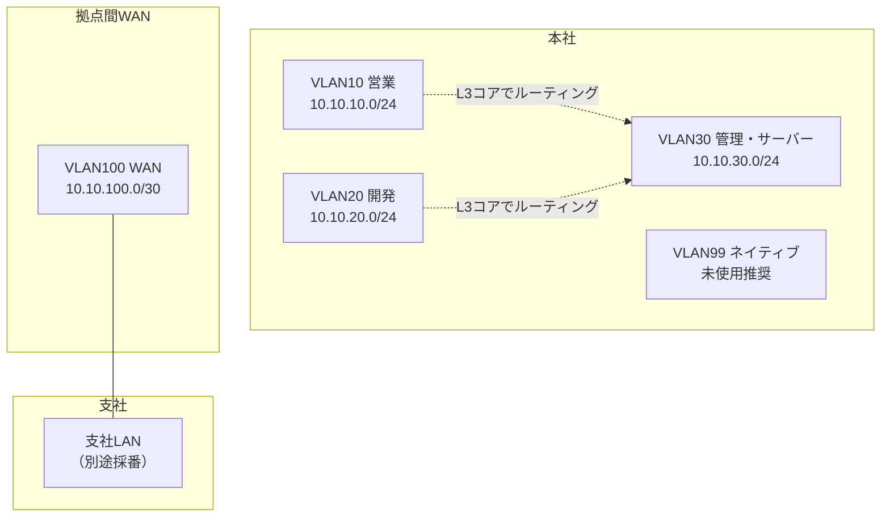

# 第3章 IPアドレスとサブネット

## 学習目標

この章を終えると、次のことができる。

1. IPv4アドレスをネットワーク部とホスト部に分解し、その境界の意味を説明できる
2. サブネットマスクとCIDR表記を、相互に変換できる
3. プライベートIPアドレスとグローバルIPアドレス、ネットワークアドレスとブロードキャストアドレスを区別できる
4. サブネット分割とVLSMを、途中の2進数計算を省略せず自力で計算できる
5. IPv6の基本構造と主要なアドレス種別を、IPv4との対比で説明できる

---

## 3.1 この章で学ぶこと

第2章では、同一ネットワーク内でスイッチがMACアドレスを使ってフレームを届ける仕組みを扱った。

同一ネットワーク内という前提そのものが、ここからの主題になる。

「同一ネットワークかどうか」を判定しているのはIPアドレスとサブネットマスクであり、この判定を誤ると、第1章で説明した「別VLANやインターネット向けでは宛先MACが次ホップに変わる」という分岐そのものが正しく機能しない。

通貫シナリオでは、営業部（VLAN10）、開発部（VLAN20）、管理部・サーバー（VLAN30）にそれぞれ10.10.10.0/24、10.10.20.0/24、10.10.30.0/24というアドレス空間が割り当てられている。

この章では、これらのアドレス表記が何を意味し、どうやって設計時に計算されたのかを、手順として身につける。

---

## 3.2 技術が必要になった背景

IPアドレスは、単なる番号ではなく、ネットワーク上の位置を示す階層的な住所である。

初期のインターネットでは、IPアドレスは**クラスフルアドレッシング**と呼ばれる、クラスA・B・Cという固定的な区分で扱われていた。

クラスAは先頭8ビットがネットワーク部、クラスBは16ビット、クラスCは24ビットという具合に、区分ごとにネットワーク部とホスト部の境界が固定されていた。

この方式には大きな無駄があった。

たとえば300台の端末を持つ組織にクラスCを1つ割り当てると254台分しか収容できず不足する一方、クラスBを1つ割り当てると65534台分の空間のうち大半が使われずに残ってしまう。

インターネットが急速に拡大するなかで、この無駄はIPv4アドレスの枯渇を早める要因になった。

そこで登場したのが、ネットワーク部とホスト部の境界を自由な位置に設定できる**CIDR**（Classless Inter-Domain Routing：クラスレスドメイン間ルーティング）である。

CIDRにより、組織の規模に応じて必要な分だけアドレス空間を切り出せるようになり、アドレスの利用効率が大きく改善した。

さらに、1つの組織内でも部署ごとに必要な台数は異なる。

営業部に200台、管理部に20台といった非対称な要件に、すべて同じサイズのサブネットで応えようとすると、やはり無駄が生じる。

この問題に対応するのが、サブネットごとに異なるマスク長を使う**VLSM**（Variable Length Subnet Mask：可変長サブネットマスク）である。

通貫シナリオでは、部署ごとに/24を均等に割り当てているが、これは学習のしやすさを優先した単純化であり、実務では拠点規模やIPアドレスの在庫状況に応じて、VLSMでより細かく最適化することが多い。

---

## 3.3 基本概念

### 3.3.1 IPv4アドレスの構造とネットワーク部/ホスト部

**IPv4アドレス**は32ビットの数値であり、8ビットずつ4つに区切り、それぞれを10進数で表記した「ドット付き10進表記」（例：`10.10.10.1`）で扱われる。

IPv4アドレスは、上位ビット側の**ネットワーク部**と、下位ビット側の**ホスト部**に分かれる。

ネットワーク部は「どのネットワークに属するか」を示し、ホスト部は「そのネットワーク内のどの端末か」を示す。

この境界の位置を決めているのが、次に説明するサブネットマスクである。

境界の位置が変われば、同じIPアドレスでも所属するネットワークの範囲の解釈が変わる。

したがって、IPアドレス単体では所属ネットワークを判断できず、必ずサブネットマスクとセットで扱う必要がある。

### 3.3.2 サブネットマスク

**サブネットマスク**は、32ビットのうち、どこまでがネットワーク部で、どこからがホスト部かを示すビット列である。

ネットワーク部に該当するビットは1、ホスト部に該当するビットは0で表され、`255.255.255.0` のように、IPアドレスと同じドット付き10進表記で書かれる。

`255.255.255.0` を2進数で表すと `11111111.11111111.11111111.00000000` であり、先頭24ビットが1（ネットワーク部）、残り8ビットが0（ホスト部）であることを示している。

IPアドレスとサブネットマスクの各ビットをAND演算することで、そのアドレスが属するネットワークアドレスを求められる。

このAND演算は、ホストがパケットを送信する際に「宛先が同一ネットワークか、別ネットワークか」を判断するために、実際に行われている処理である。

### 3.3.3 CIDR表記

**CIDR表記**は、サブネットマスクを `255.255.255.0` のような形式ではなく、ネットワーク部のビット数を使って `/24` のように表す方法である。

`10.10.10.0/24` は、「`10.10.10.0` というアドレスで、先頭24ビットがネットワーク部である」ことを表す。

サブネットマスクとCIDR表記の対応関係の一部を示す。

| CIDR | サブネットマスク | ホスト部のビット数 | 割り当て可能ホスト数（理論値） |
|------|------------------|----------------------|-------------------------------|
| /8 | 255.0.0.0 | 24 | 16,777,214 |
| /16 | 255.255.0.0 | 16 | 65,534 |
| /24 | 255.255.255.0 | 8 | 254 |
| /25 | 255.255.255.128 | 7 | 126 |
| /26 | 255.255.255.192 | 6 | 62 |
| /27 | 255.255.255.224 | 5 | 30 |
| /28 | 255.255.255.240 | 4 | 14 |
| /29 | 255.255.255.248 | 3 | 6 |
| /30 | 255.255.255.252 | 2 | 2 |

割り当て可能ホスト数は「2のホストビット数乗マイナス2」で求める。

マイナス2をする理由は、そのサブネット内でホストへ割り当てられないネットワークアドレスとブロードキャストアドレスが、必ず1つずつ存在するためである（詳細は3.3.5で扱う）。

/30は通貫シナリオのWANリンク（10.10.100.0/30）のように、両端2台だけを収容する点対点回線で使われる典型的なサイズである。

### 3.3.4 プライベートIPアドレスとグローバルIPアドレス

**プライベートIPアドレス**は、組織内部のネットワークで自由に使ってよいアドレス空間として、RFC 1918で予約された範囲である。

| 範囲 | CIDR表記 |
|------|----------|
| 10.0.0.0 〜 10.255.255.255 | 10.0.0.0/8 |
| 172.16.0.0 〜 172.31.255.255 | 172.16.0.0/12 |
| 192.168.0.0 〜 192.168.255.255 | 192.168.0.0/16 |

プライベートIPアドレスは、インターネット上では経路が広告されず、直接到達できない。

インターネットへ出るには、ファイアウォールやルーターがNAT（Network Address Translation：ネットワークアドレス変換、詳細は第8章）を行い、プライベートIPアドレスをグローバルIPアドレスへ変換する必要がある。

**グローバルIPアドレス**は、インターネット上で一意になるように、地域インターネットレジストリ（RIR）を通じて割り当てられるアドレスである。

通貫シナリオでは、社内の全端末とサーバーにプライベートIPアドレス（10.10.0.0/16の範囲）を使い、インターネットとの境界にあるファイアウォールが、プロバイダから割り当てられたグローバルIPアドレスへ変換する。

### 3.3.5 ネットワークアドレスとブロードキャストアドレス

**ネットワークアドレス**は、あるサブネットの中で、ホスト部のビットがすべて0になるアドレスであり、そのネットワーク自体を指し示すために使われる。

**ブロードキャストアドレス**は、ホスト部のビットがすべて1になるアドレスであり、そのサブネット内の全端末へ送信するために使われる。

`10.10.10.0/24` の場合、ネットワークアドレスは `10.10.10.0`、ブロードキャストアドレスは `10.10.10.255` であり、この2つはホストへ割り当てることができない。

実際に端末へ割り当てられる**ホストアドレス**は、ネットワークアドレスの次から、ブロードキャストアドレスの1つ前まで（この例では `10.10.10.1` から `10.10.10.254`）である。

ネットワークアドレスやブロードキャストアドレスを誤ってホストへ設定してしまうミスは、実務でも起こりやすい典型的な設定ミスである。

### 3.3.6 その他の特殊アドレス

IPv4には、上記以外にもいくつかの特殊なアドレスがある。

- **ループバックアドレス**（`127.0.0.0/8`、一般に `127.0.0.1` が代表）：自分自身を指すアドレスであり、ローカルのサービス確認に使う
- **リンクローカルアドレス**（`169.254.0.0/16`）：DHCPによるIP取得に失敗した端末が自動的に割り当てる、その場限りのアドレス
- **APIPA**（Automatic Private IP Addressing：自動プライベートIPアドレッシング、Windowsでの呼び名）：リンクローカルアドレスの自動割り当て機能そのものを指すことが多い

端末に `169.254.x.x` が設定されているのを見つけたら、DHCPサーバーへの到達性か、DHCPサーバー自体の稼働状況を疑う、というのが実務での典型的な読み方である（DHCPの詳細は第4章）。

### 3.3.7 サブネット分割の考え方

**サブネット分割**（subnetting）とは、1つの大きなネットワークを、ホスト部の一部をネットワーク部に転用することで、複数の小さなネットワークへ分割する操作である。

ホスト部から借用するビット数を増やすほど、作れるサブネットの数は増えるが、1つのサブネットに収容できるホスト数は減る。

この「サブネット数」と「サブネットあたりのホスト数」はトレードオフの関係にあり、設計時にはこの2つのバランスを、現在の必要数と将来の増加見込みの両方から決める。

### 3.3.8 VLSMの考え方

均等なサブネット分割は計算が単純だが、部署やリンクごとに必要なホスト数が大きく異なる場合、無駄なアドレス消費につながる。

**VLSM**は、1つの大きなアドレスブロックの中で、要件ごとに異なる長さのマスクを使い分けて分割する手法である。

VLSMを使う際の基本方針は、「必要台数が多い要件から先に、大きなブロックを割り当てる」という順序で進めることである。

小さい要件を先に割り当ててしまうと、後から大きな要件のための連続した空きブロックが確保できなくなることがある。

具体的な計算手順は3.4節の例題3で扱う。

### 3.3.9 IPv6の基本構造とアドレス種別

**IPv6**（Internet Protocol version 6）は、IPv4のアドレス枯渇問題に対応するために設計された、128ビットのアドレス体系を持つプロトコルである。

128ビットのアドレス空間は、16ビットずつ8つのグループに分け、それぞれを16進数で表記し、コロンで区切って書く。

```text
2001:0db8:0000:0010:0000:0000:0000:0001
```

表記を簡潔にするため、次の省略ルールが使える。

- 各グループの先頭の0は省略できる（`0db8` → `db8`）
- 連続する全ゼロのグループは、アドレス中で1か所に限り `::` へ省略できる

上記の例は、省略ルールを適用すると次のように書ける。

```text
2001:db8:0:10::1
```

IPv6のプレフィックス長も、IPv4のCIDRと同じ考え方で `/64` のように表記する。

LANセグメントには `/64` を割り当てるのが一般的な慣行であり、IPv4のように部署ごとの規模に合わせて細かく計算する場面はIPv4よりも少ない。

IPv6の主要なアドレス種別は次のとおりである。

| 種別 | 範囲・代表例 | 用途 |
|------|--------------|------|
| グローバルユニキャストアドレス | `2000::/3` | インターネット上で一意に到達可能な通常のアドレス（IPv4のグローバルIPに相当） |
| リンクローカルアドレス | `fe80::/10` | 同一リンク内のみで有効。IPv6ではほぼすべてのインターフェースに自動設定される |
| ユニークローカルアドレス | `fc00::/7`（実運用は主に`fd00::/8`） | 組織内で閉じた通信に使う（IPv4のプライベートIPに相当する位置づけ） |
| マルチキャストアドレス | `ff00::/8` | 複数の宛先への配信に使う |
| ループバックアドレス | `::1` | 自分自身を指す（IPv4の`127.0.0.1`に相当） |
| 未指定アドレス | `::` | アドレス未設定を示す |

IPv6には、IPv4のようなブロードキャストアドレスという概念が存在しない。

同様の役割は、マルチキャストアドレス（たとえば、その リンク上の全ノードへ送る `ff02::1`）で代替される。

IPv6では、1つのインターフェースに複数のIPv6アドレス（リンクローカルとグローバルユニキャストなど）が同時に設定されるのが標準的な状態であり、IPv4の「1インターフェース1アドレス」という感覚とは異なる。

---

## 3.4 サブネット計算の手順と例題

### 3.4.1 計算手順の基本

サブネット計算は、次の手順を機械的に繰り返すことで、暗記に頼らず解ける。

1. 必要なサブネット数、または必要なホスト数を確認する
2. 必要数を満たす最小のビット数（サブネットビット数、またはホストビット数）を求める
3. 新しいサブネットマスク（プレフィックス長）を決める
4. 「ブロックサイズ」（`256 - 該当オクテットのマスク値`）を計算する
5. ブロックサイズ刻みで、ネットワークアドレスを列挙する
6. 各サブネットのネットワークアドレス、ブロードキャストアドレス、使用可能なホスト範囲を求める

以降の例題では、この手順を毎回、途中式を省略せずになぞる。

### 3.4.2 例題1：/24ネットワークを均等に分割する

**問題**：`192.168.10.0/24` を、4つの均等なサブネットに分割せよ。

**手順**

1. 必要なサブネット数は4である
2. 4つのサブネットを作るには、2進数で4通り（`00`、`01`、`10`、`11`）を表現できるビット数が必要であり、これは2ビットである（$2^2 = 4$）
3. 元のプレフィックスは/24なので、ホスト部から2ビットを借用し、新しいプレフィックスは `/24 + 2 = /26` になる
4. `/26` のサブネットマスクは `255.255.255.192` である。第4オクテットを2進数にすると `11000000` であり、10進数では192になる
5. ブロックサイズは `256 - 192 = 64` である
6. 第4オクテットを64刻みで列挙すると、`0, 64, 128, 192` の4つになる

各サブネットの詳細は次のとおりである。

| サブネット | ネットワークアドレス | ホスト範囲 | ブロードキャストアドレス |
|------------|----------------------|------------|--------------------------|
| 1 | 192.168.10.0/26 | 192.168.10.1 〜 192.168.10.62 | 192.168.10.63 |
| 2 | 192.168.10.64/26 | 192.168.10.65 〜 192.168.10.126 | 192.168.10.127 |
| 3 | 192.168.10.128/26 | 192.168.10.129 〜 192.168.10.190 | 192.168.10.191 |
| 4 | 192.168.10.192/26 | 192.168.10.193 〜 192.168.10.254 | 192.168.10.255 |

検算として、2番目のサブネットの第4オクテットを2進数で確認する。

```text
ネットワークアドレス   64 = 01000000
ブロードキャスト      127 = 01111111
                          （ホスト部6ビットがすべて1）
```

ホスト部6ビットがすべて1になったとき、10進数は `01000000` の下位6ビットをすべて1にした `01111111 = 127` であり、表と一致する。

### 3.4.3 例題2：非/24ネットワークを分割する

**問題**：`172.20.0.0/20` というアドレスブロックを、部署ごとに`/24`のサブネットとして使いたい。いくつのサブネットができるか、そのうち先頭から3つを求めよ。

**手順**

1. 元のプレフィックスは`/20`、目標のプレフィックスは`/24`である
2. 借用するビット数は `24 - 20 = 4` ビットである
3. 作られるサブネット数は $2^4 = 16$ である
4. `/24` のサブネットマスクは `255.255.255.0` であり、着目すべきオクテットは第3オクテットである
5. `/24` の第3オクテットのマスク値は255なので、ブロックサイズは `256 - 255 = 1` である
6. 第3オクテットを1刻みで列挙すると、`0, 1, 2, ...` と続く

まず、`172.20.0.0/20` そのものがどの範囲を表すかを確認しておく。

`/20` のマスクは `255.255.240.0` であり、第3オクテットのマスク値240を2進数にすると `11110000` である。

このマスクでは、第3オクテットの上位4ビットがネットワーク部に含まれるため、`172.20.0.0/20` がカバーする第3オクテットの範囲は `0000` から `1111`、つまり10進数で `0` から `15` である。

したがって `172.20.0.0/20` は `172.20.0.0` から `172.20.15.255` までを表す。

この範囲を、先ほど求めたブロックサイズ1（第3オクテット単位）で`/24`に区切ると、次のようになる。

| サブネット | ネットワークアドレス | ホスト範囲 | ブロードキャストアドレス |
|------------|----------------------|------------|--------------------------|
| 1 | 172.20.0.0/24 | 172.20.0.1 〜 172.20.0.254 | 172.20.0.255 |
| 2 | 172.20.1.0/24 | 172.20.1.1 〜 172.20.1.254 | 172.20.1.255 |
| 3 | 172.20.2.0/24 | 172.20.2.1 〜 172.20.2.254 | 172.20.2.255 |

以降、`172.20.15.0/24` まで、第3オクテットを1ずつ増やしながら合計16個のサブネットが続く。

この例で重要なのは、「着目すべきオクテットは、新しいプレフィックス長がまたぐ位置で決まる」という点である。

`/24`への分割では第3オクテットが境界になるため、計算はここまでの2つの例題より単純になる。

### 3.4.4 例題3：VLSMで複数サイズの要件を満たす

**問題**：新設する小規模拠点に、`10.20.0.0/22` というアドレスブロックが割り当てられている。この拠点には、営業チーム（最大200台）、開発チーム（最大100台）、管理・サーバー（最大50台）、本社とのWANリンク（点対点、2台）がある。VLSMを用いて、無駄なく割り当てよ。

この例題は通貫シナリオの本社アドレス設計（部署ごとに均等な/24）とは別に、VLSMの技法そのものを確認するための独立した設計課題として扱う。

**手順1：各要件に必要な最小のホストビット数を求める**

必要ホスト数を満たす最小のホストビット数 $h$ は、$2^h - 2 \geq$ 必要台数、を満たす最小の$h$である。

| 要件 | 必要台数 | 条件を満たす最小のh | 該当プレフィックス |
|------|----------|----------------------|---------------------|
| 営業チーム | 200 | $2^8-2=254 \geq 200$ → $h=8$ | /24 |
| 開発チーム | 100 | $2^7-2=126 \geq 100$ → $h=7$ | /25 |
| 管理・サーバー | 50 | $2^6-2=62 \geq 50$ → $h=6$ | /26 |
| WANリンク | 2 | $2^2-2=2 \geq 2$ → $h=2$ | /30 |

**手順2：必要台数が多い順に、先頭から連続してブロックを割り当てる**

まず、割り当て可能な空間全体を確認する。

`10.20.0.0/22` のホスト部は $32-22=10$ ビットであり、全体で $2^{10}=1024$ 個のアドレス、`10.20.0.0` から `10.20.3.255` までをカバーする。

最も要件の大きい営業チーム（/24）から順に割り当てる。

1. **営業チーム（/24）**：先頭から割り当てる。`10.20.0.0/24`（`10.20.0.0` 〜 `10.20.0.255`）を使用する。ホスト範囲は `10.20.0.1` 〜 `10.20.0.254`、ブロードキャストは `10.20.0.255`。
2. **開発チーム（/25）**：営業チームの直後、`10.20.1.0` から割り当てる。/25のブロックサイズは第4オクテットで `256-128=128` である。`10.20.1.0/25`（`10.20.1.0` 〜 `10.20.1.127`）を使用する。ホスト範囲は `10.20.1.1` 〜 `10.20.1.126`、ブロードキャストは `10.20.1.127`。
3. **管理・サーバー（/26）**：開発チームの直後、`10.20.1.128` から割り当てる。/26のブロックサイズは `256-192=64` である。`10.20.1.128/26`（`10.20.1.128` 〜 `10.20.1.191`）を使用する。ホスト範囲は `10.20.1.129` 〜 `10.20.1.190`、ブロードキャストは `10.20.1.191`。
4. **WANリンク（/30）**：管理・サーバーの直後、`10.20.1.192` から割り当てる。/30のブロックサイズは `256-252=4` である。`10.20.1.192/30`（`10.20.1.192` 〜 `10.20.1.195`）を使用する。ホスト範囲は `10.20.1.193` 〜 `10.20.1.194`、ブロードキャストは `10.20.1.195`。

割り当て結果をまとめる。

| 要件 | サブネット | 使用範囲 |
|------|------------|----------|
| 営業チーム | 10.20.0.0/24 | 10.20.0.0 〜 10.20.0.255 |
| 開発チーム | 10.20.1.0/25 | 10.20.1.0 〜 10.20.1.127 |
| 管理・サーバー | 10.20.1.128/26 | 10.20.1.128 〜 10.20.1.191 |
| WANリンク | 10.20.1.192/30 | 10.20.1.192 〜 10.20.1.195 |

割り当て後、`10.20.1.196` から `10.20.3.255` までが未使用のまま残り、将来の拡張に使える。

もし均等な/24を4つ使っていたら、WANリンクだけのために254台分のアドレス空間を消費していたところであり、VLSMによって大幅に無駄を削減できていることがわかる。

### 3.4.5 例題4：IPアドレスから所属サブネットを逆算する

**問題**：ホストのIPアドレスが `172.16.85.100/20` と設定されていた。このホストが属するサブネットのネットワークアドレス、ブロードキャストアドレス、使用可能なホスト範囲を求めよ。

**手順**

1. `/20` のサブネットマスクは `255.255.240.0` である
2. 着目すべきオクテットは第3オクテットであり、マスク値は240である
3. IPアドレスの第3オクテット `85` を2進数にすると `01010101` である
4. マスク値240を2進数にすると `11110000` である
5. 両者をビットごとにAND演算する

```text
IPアドレス第3オクテット   01010101  (85)
サブネットマスク         11110000  (240)
-------------------------------------------
AND演算結果              01010000  (80)
```

6. AND演算の結果、第3オクテットのネットワーク部は `80` になる
7. ブロックサイズは `256 - 240 = 16` である
8. `80` はブロックサイズ16の倍数（`80 = 16 × 5`）なので、このサブネットの第3オクテットの範囲は `80` から `80 + 16 - 1 = 95` までである

結果は次のとおりである。

| 項目 | 値 |
|------|-----|
| ネットワークアドレス | 172.16.80.0 |
| ブロードキャストアドレス | 172.16.95.255 |
| 使用可能なホスト範囲 | 172.16.80.1 〜 172.16.95.254 |

第1、第2オクテットはマスクがすべて1（255.255.x.x）なのでそのまま `172.16` が引き継がれ、第4オクテットはマスクがすべて0なので、ホスト部として `0` 〜 `255` の全範囲が使える。

このAND演算こそが、3.5節で説明する「送信元ホストが宛先を同一ネットワークと判断する処理」の実体である。

---

## 3.5 通信や処理の流れ

ホストが、宛先IPアドレスへパケットを送る前に行っている判断の流れを確認する。

1. 送信元ホストは、自分のIPアドレスとサブネットマスクから、自分が属するネットワークアドレスを計算する（3.3.2、3.4.5のAND演算）
2. 送信元ホストは、同じサブネットマスクを宛先IPアドレスにも適用し、宛先が属するネットワークアドレスを計算する
3. 2つのネットワークアドレスが一致すれば、「宛先は同一サブネット内」と判断し、宛先IPアドレス自体のMACアドレスをARP（第4章）で解決してEthernetフレームを送る
4. 一致しなければ、「宛先は別ネットワーク」と判断し、設定されているデフォルトゲートウェイのMACアドレスを解決し、そこへ向けてフレームを送る

この判断は、OSやネットワークスタックが自動的に行っており、利用者が意識することはほとんどない。

しかし、サブネットマスクの設定を誤ると、この判断自体が狂う。

たとえば、本来は別サブネットの管理サーバー（10.10.30.10/24）へ通信すべき営業PCに、誤って `255.255.0.0` のような広すぎるマスクを設定してしまうと、本来は別ネットワークのはずの管理部やDMZまで「同一サブネット」と誤認し、ARP要求を不必要に広い範囲へ送ってしまう。

逆に狭すぎるマスクを設定すると、本来同一サブネット内のはずの端末を「別ネットワーク」と誤認し、必要のないゲートウェイ経由の通信になったり、到達性そのものが失われたりする。

サブネットマスクの誤設定は、pingが一部の宛先には通り、一部には通らないという、原因の絞り込みにくい症状を引き起こしやすい。

---

## 3.6 構成例

通貫シナリオのIPアドレス設計を、部署とリンク単位で整理する。



この設計から読み取れる方針は次のとおりである。

- 部署ごとのVLANには、学習と運用のわかりやすさを優先して均等な/24を割り当てている
- WANのような点対点リンクには、無駄を避けるため最小の/30を割り当てている
- VLAN99はネイティブVLAN専用とし、通常のホストは配置しない（詳細は第5章）

均等な/24を部署ごとに割り当てる設計は、アドレス利用効率よりも、運用のしやすさ（サブネットマスクが常に`/24`で統一され、覚えやすく、ミスが減る）を優先した判断である。

拠点数やホスト数が多い環境では、3.4.4のVLSM例題のように、要件に応じて細かく最適化する設計もよく使われる。

---

## 3.7 Cisco IOSの設定例

VLANインターフェース（SVI：Switch Virtual Interface）へのIPアドレス設定と、経路確認コマンドの例を示す。

VLANそのものの作成やトランクの設定は第5章で扱うため、ここではIPアドレス設定に絞る。

### インターフェースへのIPアドレス設定

```cisco
! 営業部門VLANのSVIにIPアドレスを設定する（VLAN10のゲートウェイ）
L3SW(config)# interface Vlan10
L3SW(config-if)# ip address 10.10.10.1 255.255.255.0
L3SW(config-if)# no shutdown

! 管理・サーバー部門VLANも同様に設定する
L3SW(config)# interface Vlan30
L3SW(config-if)# ip address 10.10.30.1 255.255.255.0
L3SW(config-if)# no shutdown

! 拠点間WANリンク（/30）の設定例
R1(config)# interface GigabitEthernet0/1
R1(config-if)# ip address 10.10.100.1 255.255.255.252
R1(config-if)# no shutdown
```

主要パラメータの意味は次のとおりである。

- `ip address`：IPアドレスとサブネットマスクをドット付き10進表記で指定する（CIDR形式では直接書けないため、対応表で変換する）
- `no shutdown`：インターフェースを有効化する。初期状態では多くのルーテッドインターフェースがshutdown状態になっている
- `/30`（255.255.255.252）：点対点リンクでの標準的な選択であり、ホストアドレスが2つだけ必要な用途に適している

### 経路とインターフェースの確認

```cisco
L3SW# show ip interface brief
! 各インターフェースのIPアドレスとステータスを一覧表示する

L3SW# show ip route connected
! 自分に直接設定されているサブネットの経路（Cのマーク）を確認する

R1# show ip route
! ルーティングテーブル全体を確認する。ロンゲストマッチの原則は第6章で扱う
```

`show ip route connected` で見えるサブネットは、そのルーターやL3スイッチに正しくIPアドレスが設定され、インターフェースがupしている場合にのみ表示される。

設計どおりのサブネットが一覧に現れない場合、インターフェースのshutdown、ケーブル未接続、IPアドレスの入力ミスのいずれかを疑う。

---

## 3.8 LinuxおよびWindowsでの確認例

### Windows

```powershell
# IPアドレス、サブネットマスク、デフォルトゲートウェイを確認
ipconfig /all

# より詳細な形式（プレフィックス長付き）で確認
Get-NetIPAddress -AddressFamily IPv4

# 特定のIPが所属するはずのネットワークへの疎通確認
ping 10.10.30.10
```

### Linux

```bash
# IPアドレスとプレフィックス長（CIDR形式）を確認
ip addr show

# ルーティングテーブルの確認
ip route show

# サブネット計算を補助するツール（多くのディストリで別途インストールが必要）
ipcalc 10.10.10.0/24
```

`ipcalc` のようなツールは検算に便利だが、試験や設計レビューの現場では手計算での検証が必要になる場面も多いため、3.4節の手順は道具に頼らず再現できるようにしておく。

ホスト側で確認すべき最重要ポイントは、「設定されているプレフィックス長（マスク）が、設計書のサブネット設計と一致しているか」である。

IPアドレス自体が正しくても、マスクが一致しないと、3.5節で説明した同一ネットワーク判定そのものが狂う。

---

## 3.9 よくある誤解

1. **「/24なら256台使える」**  
   256個のアドレスのうち、ネットワークアドレスとブロードキャストアドレスの2つはホストに使えないため、実際に割り当てられるのは254台分である。

2. **「サブネットは細かく切るほど良い」**  
   サブネットを細かくするほど、1つあたりのホスト収容数は減る。将来の増加余地や、ルーティングテーブルの経路数増加とのバランスを考える必要がある。

3. **「プライベートIPアドレスだから安全」**  
   プライベートIPアドレスは、あくまでインターネット上で経路広告されないアドレス空間の区分であり、それ自体はアクセス制御やセキュリティ機能ではない。ファイアウォールやACL（第8章）と役割が異なる。

4. **「IPv6はまだ先の話で、当面IPv4だけで十分」**  
   IPv4アドレスの新規割り当ては枯渇が進んでおり、多くのISPやクラウド事業者がIPv6対応を標準機能として提供している。設計知識としては、IPv4と並行して理解しておく必要がある。

5. **「VLSMは複雑なだけで実務では使わない」**  
   拠点規模や回線種別が多様な実務環境では、アドレス空間を無駄なく使うためにVLSMは日常的に使われる。特に点対点リンクへの/30、/31の割り当ては典型例である。

---

## 3.10 代表的な障害

| 症状 | ありがちな原因 | 確認の切り口 |
|------|----------------|--------------|
| 一部の端末とだけping不通 | サブネットマスクの誤設定による同一/別ネットワーク判定のずれ | 送信元・宛先双方のIP・マスクからネットワークアドレスを計算し直す |
| 新規端末がネットワークに参加できない | ネットワークアドレスやブロードキャストアドレスを誤ってホストに設定 | 設計書のホスト範囲と実際の設定値を照合する |
| 同一VLAN内なのに到達できない端末がある | VLSMで作った隣接サブネットとマスクの取り違え | 各端末のマスクが設計どおりの長さになっているか確認する |
| WANリンクが不安定、または片側だけ疎通 | /30の両端で異なるサブネットを設定（アドレス範囲の重複・不一致） | 両端のIP・マスクからネットワークアドレスが一致するか検算する |
| IPv6が有効な端末で意図しない自動接続が発生 | リンクローカルアドレスやSLAACによる自動設定の影響 | インターフェースに設定されている全アドレス種別を確認する |

---

## 3.11 トラブルシューティング手順

IPアドレス・サブネットに起因する疎通トラブルは、次の順で切り分ける。

1. **自ホストの設定確認**：IPアドレス、サブネットマスク（プレフィックス長）、デフォルトゲートウェイを確認する
2. **ネットワークアドレスの再計算**：3.4節の手順で、自分と宛先のネットワークアドレスを実際に計算し直す
3. **設計書との照合**：計算結果が、部署・拠点ごとの設計台帳と一致しているかを確認する
4. **同一サブネット内の疎通確認**：同一ネットワークと判断される別端末とpingが通るかを確認する
5. **ゲートウェイの妥当性確認**：デフォルトゲートウェイのIPアドレスが、自分の属するサブネット内にあるかを確認する
6. **中継機器側の設定確認**：L3スイッチやルーターのインターフェースに設定されているIPアドレス・マスクを確認する（3.7節のコマンド）
7. **経路情報の確認**：目的のサブネットへの経路が、ルーティングテーブルに存在するかを確認する（詳細な経路選択は第6章）

サブネット関連の障害は、pingコマンド1つの成否だけでは原因を特定しにくいことが多く、必ず手計算による検算を挟むことで、思い込みによる見落としを減らせる。

---

## 3.12 設計・運用上の注意点

1. **アドレス設計台帳を維持する**  
   部署、拠点、VLAN、用途ごとに、割り当て済みのサブネットを一覧化しておく。台帳がなければ、新規サブネットの割り当てのたびに重複リスクが生じる。

2. **将来の成長を見込んだサイズにする**  
   ちょうど現在の台数に合わせたサブネットは、増員のたびにサブネットの再設計を招く。ある程度の余裕を持たせる。

3. **ルーティングの要約を意識した割り当てにする**  
   隣接するサブネットをまとめて要約できるように連続したアドレスブロックを割り当てておくと、後のルーティング設計（第6章のルート集約）が容易になる。

4. **ネットワークアドレス・ブロードキャストアドレスの割り当てミスを防ぐ**  
   IPAM（IP Address Management）ツールやDHCPの除外設定を使い、人手によるミスの入り込む余地を減らす。

5. **IPv6の導入方針を早めに決める**  
   後付けでIPv6を導入する場合、既存のIPv4設計と整合させる作業が発生する。デュアルスタック運用を前提にするか、当面IPv4のみとするかを設計段階で明確にしておく。

---

## 3.13 要点まとめ

- IPv4アドレスは32ビットで、サブネットマスクによってネットワーク部とホスト部の境界が決まる
- CIDR表記（`/24`など）は、サブネットマスクをビット数で簡潔に表す方法である
- プライベートIPアドレスは組織内で自由に使える範囲、グローバルIPアドレスはインターネット上で一意な範囲である
- ネットワークアドレスとブロードキャストアドレスは、そのサブネット内でホストに割り当てられない
- サブネット計算は「必要数からビット数を求め、ブロックサイズを求め、刻んで列挙する」という手順で機械的に解ける
- VLSMは、要件ごとに異なるマスク長を使い分け、アドレス空間の無駄を減らす手法である
- IPv6は128ビットのアドレス空間を持ち、ブロードキャストの代わりにマルチキャストを使う
- ホストは送信前に、送信元と宛先のネットワークアドレスを比較し、同一サブネットか別サブネットかを判断している

---

## 3.14 章末問題

### 問題1

`192.168.5.0/24` を8つの均等なサブネットに分割せよ。新しいプレフィックス長、ブロックサイズ、最初の3つのサブネットのネットワークアドレスを、途中式を示しながら求めよ。

### 問題2

`10.30.0.0/18` を `/22` のサブネットに分割すると、いくつのサブネットができるか。着目すべきオクテットとブロックサイズも示して説明せよ。

### 問題3

ある拠点に `192.168.100.0/24` が割り当てられている。この拠点内に、80台収容の部署Aと、30台収容の部署B、点対点のWANリンクが1本ある。VLSMを用いて割り当てを設計し、途中式を示せ。

### 問題4

ホストのIPアドレスが `192.168.44.130/27` のとき、このホストが属するネットワークアドレス、ブロードキャストアドレス、使用可能なホスト範囲を、2進数でのAND演算を示しながら求めよ。

### 問題5

サブネットマスクを本来より広く（ホスト部を多く）設定してしまった場合、ホストの通信判断にどのような影響が出るか説明せよ。

---

## 3.15 解答と解説

### 解答1

8つのサブネットを作るには $2^3=8$ より3ビットの借用が必要であり、新しいプレフィックス長は `/24+3=/27` である。`/27` のマスクは `255.255.255.224` であり、第4オクテットのブロックサイズは `256-224=32` である。第4オクテットを32刻みで列挙すると、最初の3つのサブネットは `192.168.5.0/27`、`192.168.5.32/27`、`192.168.5.64/27` になる。

### 解答2

借用ビット数は `22-18=4` ビットであり、作られるサブネット数は $2^4=16$ である。`/18`は着目オクテットが第2オクテットの範囲にまたがる大きな空間だが、`/22`への分割では境界が第3オクテットに現れるため、着目すべきオクテットは第3オクテットになる。`/22` のマスクの第3オクテット値は `252`（11111100）であり、ブロックサイズは `256-252=4` である。

### 解答3

必要ホストビット数は、部署Aが $2^7-2=126\geq80$ より `/25`、部署Bが $2^6-2=62\geq30$ より `/26`、WANリンクが `/30` である。要件の大きい順に、部署A（/25）に `192.168.100.0/25`（`.0`〜`.127`）、部署B（/26）に `192.168.100.128/26`（`.128`〜`.191`）、WANリンク（/30）に `192.168.100.192/30`（`.192`〜`.195`）を割り当てる。

### 解答4

`/27` のマスクは `255.255.255.224` であり、第4オクテットのマスク値は `11100000`（224）である。IPアドレスの第4オクテット `130` は `10000010` であり、AND演算すると `10000000`（128）になる。ブロックサイズは `256-224=32` なので、このサブネットの範囲は `128`から`128+32-1=159`までである。したがって、ネットワークアドレスは `192.168.44.128`、ブロードキャストアドレスは `192.168.44.159`、使用可能なホスト範囲は `192.168.44.129` 〜 `192.168.44.158` である。

### 解答5

サブネットマスクを本来より広く設定すると、ホストは本来「別ネットワーク」であるはずの宛先まで「同一ネットワーク」と誤認する。その結果、本来はデフォルトゲートウェイ経由で届けるべき宛先に対して、直接ARP要求を送ろうとして応答が得られず、通信が失敗する（あるいは、応答が返らないまま無駄なARP要求だけが増える）。

---

## 3.16 実機またはシミュレーター演習

Cisco Packet Tracer、GNS3、CML、実機、または手計算のみのいずれでも実施できる。

### 演習A：均等分割の手計算と実機検証

1. 任意の/24アドレスを選び、6つの均等なサブネットに分割する計算を手で行う（必要なビット数、ブロックサイズ、各サブネットの範囲を導出する）
2. L3スイッチまたはルーターの2つのインターフェースに、計算した中の異なる2つのサブネットのアドレスを設定する
3. 同一サブネット内のPC同士、および異なるサブネットのPC同士でpingを実行し、期待どおりの結果になることを確認する

### 演習B：VLSM設計の実践

1. 任意の/23程度のアドレスブロックを1つ用意する
2. 台数の異なる3つの部署（例：120台、40台、10台）と、1本の点対点WANリンクを想定する
3. 3.4.4の手順にならい、必要ビット数の計算から、実際のサブネット割り当てまでを表にまとめる
4. 結果をルーターまたはL3スイッチに設定し、各サブネットの`show ip route connected`が設計どおりに表示されることを確認する

### 演習C：意図的な誤設定からの復旧

1. あるPCのサブネットマスクを、意図的に設計より広い値（例：本来`/24`のところを`/16`）に変更する
2. 同一VLAN内の別端末、および本来別サブネットのはずの端末それぞれへpingを実行し、症状の違いを記録する
3. マスクを正しい値に戻し、症状が解消することを確認する
4. 障害票の形式で、症状と判断根拠を1行でまとめる

```text
[障害票]
症状: 特定サブネット宛の通信のみ失敗、ARP要求が異常に多い
確認: 送信元PCのサブネットマスクが設計値より広い(/16)
判断: 同一ネットワーク判定の誤りによるもの。正しいマスクへ修正して解消
```

---

## 次章への橋渡し

IPアドレスによって、送信元と宛先が「どのネットワークの、どの端末か」までは特定できる。

ただし、同じ端末上で動く複数のアプリケーション（Webサーバーとメールサーバーなど）を区別し、通信の信頼性を確保する仕組みは、まだ登場していない。

第4章では、TCPとUDPの違い、ポート番号、そしてARP、DNS、DHCPをはじめとする主要プロトコルを扱う。
