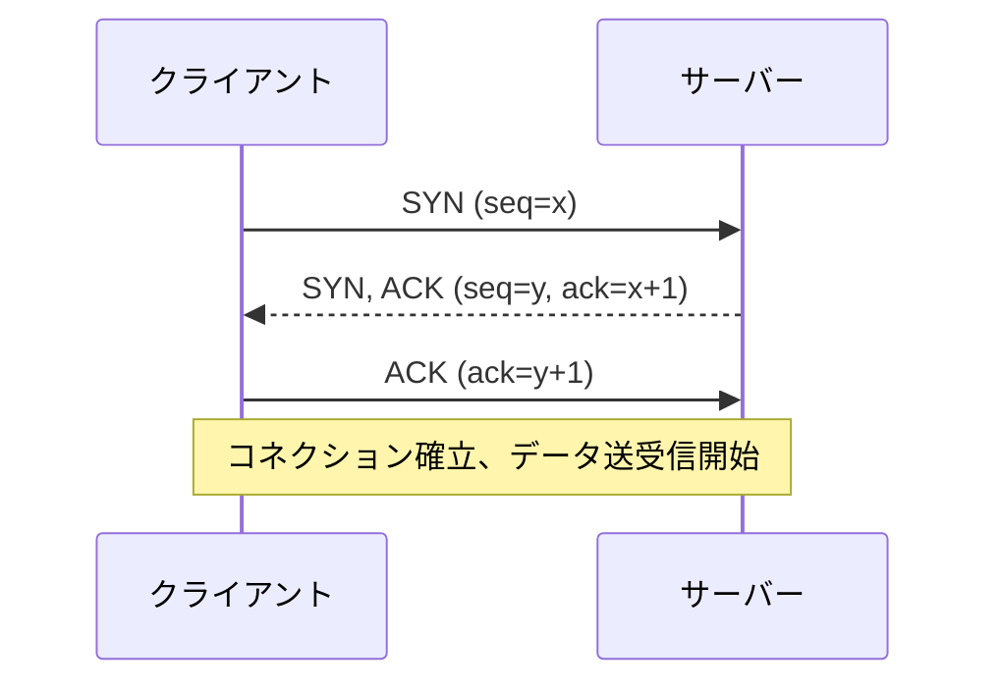
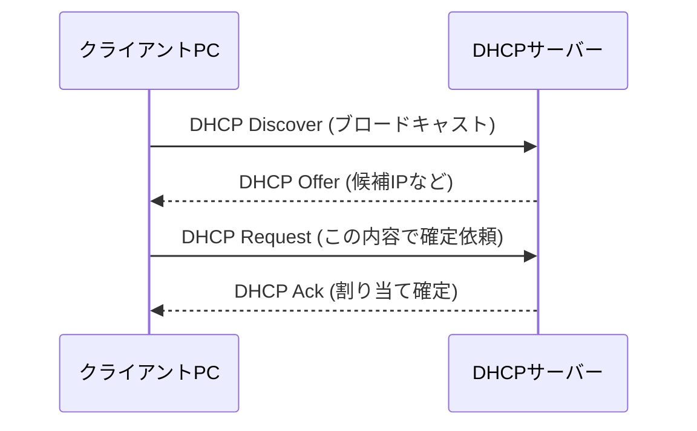
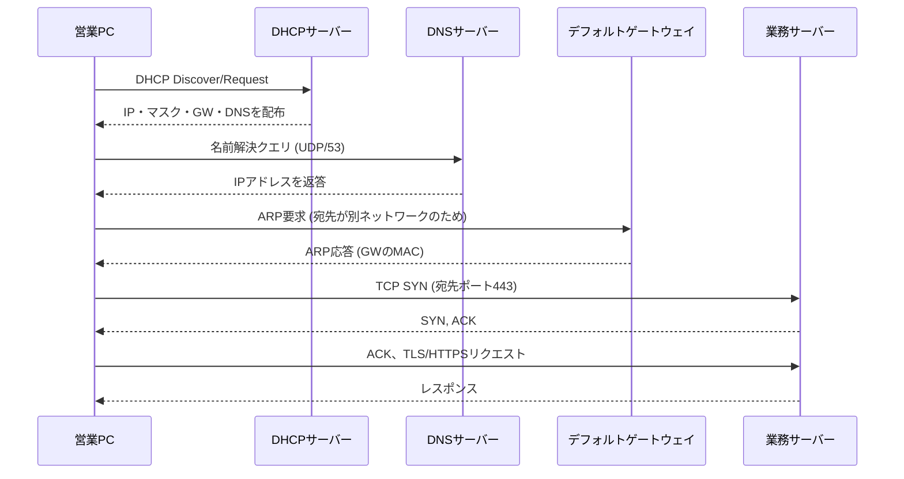

# 第4章 TCP、UDPと主要プロトコル

## 学習目標

この章を終えると、次のことができる。

1. TCPとUDPの違いを、信頼性・遅延・用途の観点から選択理由とともに説明できる
2. 3ウェイハンドシェイク、シーケンス番号、確認応答、フロー制御の役割を、通信の流れとして説明できる
3. ポート番号とウェルノウンポートを、通信の宛先を特定する仕組みとして使える
4. ARP、ICMP、DNS、DHCPの役割を、通信が成立するまでの順序の中で説明できる
5. HTTP/HTTPS、SSH、NTP、SNMP、Syslogの運用上の位置づけを説明できる

---

## 4.1 この章で学ぶこと

第3章までで、IPアドレスによって「どのネットワークの、どの端末か」を特定できるようになった。

しかし、1台のサーバーは、Webサービス、メールサービス、リモート管理など、複数のサービスを同時に提供していることが多い。

同じIPアドレス宛の通信を、どのサービスへ振り分けるかという問題は、まだ解決されていない。

さらに、第1章の通信手順では「PCはすでにIPアドレスやDNSサーバーの情報を持っている」という前提を置いていたが、その情報自体がどうやって手に入るのかにも触れていなかった。

この章では、ポート番号によるサービスの識別、TCPとUDPという2つのトランスポート層プロトコルの違い、そしてARP、DNS、DHCPをはじめとする、通信の土台を支える主要プロトコル群を扱う。

これらは、通貫シナリオの営業PCが起動してから業務サーバーへ到達するまでの、第1章では省略していた部分を埋める内容になる。

---

## 4.2 技術が必要になった背景

IPによる到達性の確保だけでは、実用的な通信サービスは成立しない。

いくつかの未解決の問題を、順に見ていく。

第一に、**信頼性**の問題がある。

ネットワークは、途中の輻輳やエラーによって、パケットが失われたり、順序が入れ替わったりすることを前提に設計されている。

ファイル転送やWebアクセスのように、データの欠落や順序の乱れが許されない用途では、失われたデータを検出し、再送する仕組みが必要になる。

一方で、映像や音声のリアルタイム配信のように、多少のデータ欠落よりも、遅延の小ささが優先される用途もある。

この2つの異なる要求に応えるために、信頼性を重視するTCPと、速度と単純さを重視するUDPという、性質の異なる2つのトランスポート層プロトコルが用意されている。

第二に、**サービスの識別**の問題がある。

1台のサーバーが複数のサービスを提供する以上、IPアドレスだけでは「Webサービス宛か、メールサービス宛か」を区別できない。

この区別のために導入されたのが、ポート番号である。

第三に、**アドレス解決と設定の自動化**の問題がある。

IPアドレスからMACアドレスを求める仕組み（ARP）、名前からIPアドレスを求める仕組み（DNS）、端末にIPアドレスそのものを自動で配る仕組み(DHCP)がなければ、管理者はすべての端末に、IPアドレスからMACアドレスの対応表まで手作業で設定しなければならない。

台数が数十台を超えた時点で、これは現実的ではなくなる。

第四に、**運用上の可視性**の問題がある。

障害対応や監視のためには、機器の時刻を揃え（NTP）、状態を収集し（SNMP）、記録を残す（Syslog）仕組みが必要になる。

これらは華やかな機能ではないが、欠けていると、障害発生時に「いつ、どこで、何が起きたか」を再構成できなくなる。

---

## 4.3 基本概念

### 4.3.1 トランスポート層の役割

**トランスポート層**（OSI第4層）は、送信元と宛先のアプリケーション同士を結びつけ、必要に応じて信頼性やデータ整形を提供する層である。

ネットワーク層（IP）が「端末から端末への到達性」を担うのに対し、トランスポート層は「端末上の、どのアプリケーションから、どのアプリケーションへか」を担う。

この役割分担があるため、同じIPアドレスの端末でも、Webブラウザとメールクライアントが同時に別々の通信を行える。

### 4.3.2 TCPとUDPの違い

**TCP**（Transmission Control Protocol：伝送制御プロトコル）は、コネクション型で信頼性を重視するトランスポート層プロトコルである。

**UDP**（User Datagram Protocol：ユーザーデータグラムプロトコル）は、コネクションレス型で、信頼性よりも低遅延と単純さを重視するトランスポート層プロトコルである。

| 観点 | TCP | UDP |
|------|-----|-----|
| コネクション | 事前に確立する（3ウェイハンドシェイク） | 確立しない。いきなりデータを送る |
| 信頼性 | 確認応答と再送により保証する | 保証しない（上位アプリで補う場合がある） |
| 順序保証 | あり（シーケンス番号で並べ替える） | なし |
| 速度・オーバーヘッド | ヘッダが大きく、制御のやり取りがある分オーバーヘッドが大きい | ヘッダが小さく、オーバーヘッドが小さい |
| 代表的な用途 | Web（HTTP/HTTPS）、メール、ファイル転送、SSH | DNS問い合わせ、DHCP、音声・映像通話、NTP |

どちらが優れているという関係ではなく、アプリケーションの要求に応じて使い分けるものである。

Web閲覧でページの一部が欠けたり文字化けしたりしては困るため、TCPが選ばれる。

一方、音声通話で数十ミリ秒遅れたパケットが再送されて届いても、その時点ではもう聞くタイミングを過ぎており、再送よりも次のデータを送り続ける方が実用的なため、UDPが選ばれる。

DNSの問い合わせのように、1往復で完結し、失敗すれば単純に再送すればよい軽量な通信も、UDPが好まれる典型例である（ただし、大きな応答データを扱う場合など、DNSがTCPを使う場面もある）。

### 4.3.3 3ウェイハンドシェイク

**3ウェイハンドシェイク**（three-way handshake）は、TCPがコネクションを確立するために行う、3回のやり取りである。

1. クライアントがサーバーへ **SYN**（同期：Synchronize）フラグを立てたセグメントを送る
2. サーバーが **SYN/ACK**（同期と確認応答）フラグを立てたセグメントを返す
3. クライアントが **ACK**（確認応答：Acknowledgement）フラグを立てたセグメントを送り、コネクションが確立する



この3回のやり取りによって、双方が「相手も通信の準備ができている」ことを確認し合う。

コネクションを終了する際にも、通常はFIN（終了：Finish）フラグを使った同様のやり取りが行われるが、CCNAレベルではまず、確立側の3ウェイハンドシェイクを理解しておけば十分である。

### 4.3.4 シーケンス番号とACK

**シーケンス番号**（sequence number）は、TCPが送信するデータの各バイトに割り振る通し番号であり、受信側がデータを正しい順序に並べ替えるために使われる。

**ACK（確認応答）番号**は、受信側が「ここまでのデータを受け取った」ことを送信側へ知らせるために使う番号であり、次に受信を期待するシーケンス番号を示す。

途中でセグメントが失われると、受信側は期待するシーケンス番号のデータが届かないことに気づき、送信側は一定時間ACKが返ってこないことをもって再送のタイミングを判断する。

この仕組みによって、途中経路でパケットが失われたり、順序が入れ替わったりしても、アプリケーション側には正しい順序で欠落のないデータが届く。

UDPにはこの仕組みが存在しないため、順序の乱れやデータの欠落が発生した場合、必要であればアプリケーション層が独自に対処する。

### 4.3.5 フロー制御

**フロー制御**（flow control）は、受信側の処理能力を超えるペースでデータが送られてくることを防ぐ仕組みである。

TCPは、**ウィンドウサイズ**（受信バッファの空き容量）を相手に通知し合うことで、送信側が一度に送ってよいデータ量を調整する。

受信側の処理が追いつかず、バッファが埋まってきた場合には、通知するウィンドウサイズを小さくすることで、送信側にペースを落とすよう伝える。

この仕組みがなければ、高速なサーバーが低速な端末へデータを送り続け、受信側のバッファ溢れによってデータが失われる、という状況が起きやすくなる。

似た名前の概念として、経路上の輻輳に応じて送信量を調整する「輻輳制御」もあるが、これは受信側の能力ではなく、ネットワーク全体の混雑状況に着目した制御であり、フロー制御とは目的が異なる。

### 4.3.6 ポート番号とソケット

**ポート番号**は、0から65535までの数値で、トランスポート層においてどのアプリケーション（プロセス）宛の通信かを識別するための番号である。

送信元IPアドレス、送信元ポート番号、宛先IPアドレス、宛先ポート番号、プロトコル種別（TCP/UDP）の組み合わせを**ソケット**（socket）と呼び、この5つの組み合わせによって、1つの通信セッションが一意に識別される。

同じPCから同じWebサーバーへ、複数のタブでアクセスしても通信が混ざらないのは、送信元ポート番号がタブ（正確には接続）ごとに異なる値になるためである。

### 4.3.7 ウェルノウンポート

ポート番号は、用途に応じて次のように区分される。

| 区分 | 範囲 | 説明 |
|------|------|------|
| **ウェルノウンポート**（Well-known ports） | 0〜1023 | 標準化された主要サービス用に予約された番号 |
| **登録済みポート**（Registered ports） | 1024〜49151 | 特定のアプリケーションが登録して使う番号 |
| **動的ポート**（Dynamic/Private ports） | 49152〜65535 | クライアント側が接続のたびに一時的に使う番号 |

代表的なウェルノウンポートを挙げる。

| ポート番号 | プロトコル | サービス |
|------------|------------|----------|
| 20 / 21 | TCP | FTP（データ／制御） |
| 22 | TCP | SSH |
| 23 | TCP | Telnet |
| 25 | TCP | SMTP |
| 53 | TCP/UDP | DNS |
| 67 / 68 | UDP | DHCP（サーバー／クライアント） |
| 80 | TCP | HTTP |
| 123 | UDP | NTP |
| 161 / 162 | UDP | SNMP（問い合わせ／トラップ） |
| 443 | TCP | HTTPS |
| 514 | UDP | Syslog |

クライアント側は、通信のたびに動的ポートを送信元ポートとして使い、宛先側のウェルノウンポートへ接続する、という組み合わせが基本形である。

ファイアウォールのアクセス制御（第8章）は、多くの場合この宛先ポート番号を基準にルールを組み立てる。

### 4.3.8 ICMP

**ICMP**（Internet Control Message Protocol：インターネット制御メッセージプロトコル）は、IP通信の状態やエラーを通知するためのプロトコルである。

`ping` コマンドは、ICMPのエコー要求（Echo Request）を送り、エコー応答（Echo Reply）が返るかどうかで到達性を確認する。

`traceroute`（Windowsでは`tracert`）は、TTL（Time To Live：生存時間）を1から順に増やしながらパケットを送り、途中のルーターがTTL超過を通知するICMPメッセージ（Time Exceeded）を利用して、経路上のホップを1つずつ特定する。

ICMPはトランスポート層のプロトコルではなく、IPと同じネットワーク層に位置づけられる制御用プロトコルであり、ポート番号を使わない点がTCP/UDPと異なる。

セキュリティ上の理由から、ICMPの一部または全部をファイアウォールで制限する運用も多いが、これは第1章で触れたとおり、「pingが通らない」ことと「業務通信が失敗する」ことが必ずしも一致しない一因になる。

### 4.3.9 ARP

**ARP**（Address Resolution Protocol：アドレス解決プロトコル）は、同一ネットワーク内で、IPアドレスに対応するMACアドレスを解決するためのプロトコルである。

動作の流れは次のとおりである。

1. 送信元端末が、宛先IPアドレスに対応するMACアドレスをまだ知らない場合、ブロードキャストでARP要求（「このIPアドレスを持っているのは誰か」）を送る
2. 該当するIPアドレスを持つ端末だけが、自分のMACアドレスを含むARP応答をユニキャストで返す
3. 送信元端末は、得られた対応関係を**ARPキャッシュ**（ARPテーブル）へ一定時間保持する

ARPは同一ネットワーク内でのみ有効であり、別ネットワーク宛の通信では、3.5節で説明したとおり、宛先IPそのものではなくデフォルトゲートウェイのMACアドレスをARPで解決する。

ARPキャッシュの内容は一定時間で失効するため、端末のNICを交換したり、IPアドレスの割り当てが変わったりした場合でも、一定時間経過後には新しい情報に更新される。

### 4.3.10 DNS

**DNS**（Domain Name System：ドメインネームシステム）は、`app.example.local` のような人間にわかりやすいホスト名と、IPアドレスを相互に変換する仕組みである。

第1章の通信手順で最初に行われていた「名前解決」が、まさにDNSへの問い合わせである。

DNSは階層構造を持ち、社内向けの名前解決には社内DNSサーバーを、インターネット上の名前解決には、社内DNSサーバーが上位のDNSサーバーへ問い合わせを中継する（再帰的な問い合わせ）、という形が一般的である。

DNSは主にUDPポート53を使うが、応答データが大きい場合や、ゾーン転送のような特定の操作ではTCPポート53が使われる。

DNSサーバーが不通、または誤って設定されていると、ホスト名を使ったアクセスだけが失敗し、IPアドレスを直接指定したアクセスは成功する、という第1章でも触れた特徴的な症状が現れる。

### 4.3.11 DHCP

**DHCP**（Dynamic Host Configuration Protocol：動的ホスト構成プロトコル）は、端末の起動時に、IPアドレス、サブネットマスク、デフォルトゲートウェイ、DNSサーバーなどの設定情報を自動的に配布する仕組みである。

代表的な流れ（DORAプロセスと呼ばれる）は次のとおりである。

1. **Discover**：クライアントが、ブロードキャストでDHCPサーバーを探す
2. **Offer**：DHCPサーバーが、割り当て候補のIPアドレスなどを提示する
3. **Request**：クライアントが、提示された内容を使いたいと要求する
4. **Acknowledge**：DHCPサーバーが、割り当てを確定し、正式に通知する



DHCPはブロードキャストを使うため、標準では同一ブロードキャストドメイン内でしか機能しない。

VLANが分かれ、DHCPサーバーが別のVLAN（通貫シナリオではVLAN30）にある場合、ルーターやL3スイッチにDHCPリレー機能（Cisco IOSでは`ip helper-address`）を設定し、クライアントからのブロードキャスト要求をDHCPサーバーへユニキャストで中継する必要がある。

割り当てられたIPアドレスには有効期限（リース期間）があり、期限が近づくとクライアントは同じDHCPサーバーへ更新を要求する。

### 4.3.12 HTTP/HTTPS

**HTTP**（HyperText Transfer Protocol）は、Webブラウザとサーバーの間で、Webページやデータをやり取りするためのアプリケーション層プロトコルである。

**HTTPS**（HTTP Secure）は、HTTPの通信をTLS（Transport Layer Security）で暗号化したものであり、通信内容の盗聴や改ざんへの耐性を持つ。

HTTPはTCPポート80、HTTPSはTCPポート443を標準的に使う。

HTTPS化によって守られるのは、主に通信経路上の盗聴・改ざんへの耐性であり、サーバー自体の脆弱性や、アプリケーションの認可設定の不備までは守ってくれない点に注意が必要である。

### 4.3.13 SSH

**SSH**（Secure Shell：セキュアシェル）は、リモートの機器へ暗号化された通信路を通じてログインし、コマンドを実行するためのプロトコルである。

TCPポート22を使い、通信内容全体（認証情報を含む）が暗号化される。

かつて広く使われていた**Telnet**は、通信内容が平文であり、パスワードを含むすべてのやり取りが盗聴されうるため、現在の実務では管理アクセスにSSHを使うことが標準的な方針になっている。

第1章の設定例で `transport input ssh` としていたのは、この理由による。

### 4.3.14 NTP

**NTP**（Network Time Protocol：ネットワークタイムプロトコル）は、ネットワーク機器やサーバーの時刻を、基準となる時刻源に同期させるためのプロトコルである。

UDPポート123を使う。

時刻のずれは、ログの前後関係を追えなくする、証明書の有効期限判定を誤らせる、認証プロトコルの時刻検証に失敗させるなど、一見地味だが影響範囲の広い問題を引き起こす。

複数の機器のログを突き合わせて障害を調査する場面では、すべての機器で時刻が揃っていることが大前提になる。

### 4.3.15 SNMP

**SNMP**（Simple Network Management Protocol：簡易ネットワーク管理プロトコル）は、ネットワーク機器の状態（インターフェースの使用率、CPU負荷、エラーカウンタなど）を、監視システムが収集するためのプロトコルである。

主にUDPポート161（問い合わせ）とUDPポート162（トラップと呼ばれる、機器側からの自発的な通知）を使う。

SNMPv1やSNMPv2cは、認証に「コミュニティ名」と呼ばれる、実質的にはパスワードに近い平文の文字列を使う方式であり、盗聴に弱いという課題がある。

SNMPv3では、認証と暗号化の仕組みが強化されており、新規に監視基盤を設計する場合は、SNMPv3を優先的に検討することが望ましい。

### 4.3.16 Syslog

**Syslog**は、機器やサーバーが生成するログメッセージを、指定した収集サーバーへ転送するためのプロトコルおよび仕組みである。

標準ではUDPポート514を使うが、信頼性を高めるためにTCPで送信する実装や設定も存在する。

各機器にログを分散させたままにしておくと、障害発生時にすべての機器へ個別にログインしてログを確認する必要があり、時間がかかる。

Syslogサーバーへ集約しておけば、複数機器のログを時系列で横断的に検索でき、これは4.3.14のNTPによる時刻同期があって初めて意味を持つ運用である。

---

## 4.4 通信や処理の流れ

第1章では省略していた部分を含め、営業PCが起動してから業務サーバーのWebアプリへアクセスするまでの流れを、本章で扱ったプロトコルで再構成する。

1. **起動とDHCP**：営業PCが起動し、DHCP Discoverをブロードキャストする。DHCPサーバー（通貫シナリオではVLAN30に設置、VLAN10からはL3スイッチのDHCPリレーを経由）が、IPアドレス、サブネットマスク、デフォルトゲートウェイ、DNSサーバーのアドレスを配布する
2. **名前解決**：ユーザーが `https://app.example.local` を開くと、PCはDNSサーバーへ問い合わせ、業務サーバーのIPアドレスを得る
3. **同一／別ネットワーク判定**：PCは、自分と業務サーバーのIPアドレスから、同一サブネットか別サブネットかを判断する（第3章の手順）。別サブネットであれば、デフォルトゲートウェイ宛にARPを行う
4. **ARPによるMACアドレス解決**：ARP要求を送り、対象（同一サブネット内の端末、または別サブネットの場合はデフォルトゲートウェイ）のMACアドレスを得る
5. **TCP 3ウェイハンドシェイク**：業務サーバーのIPアドレス、TCPポート443に対して、SYN、SYN/ACK、ACKのやり取りを行い、コネクションを確立する
6. **TLSハンドシェイクとHTTPSリクエスト**：暗号化のための鍵交換を行った後、HTTPリクエストを暗号化して送信する
7. **応答とシーケンス管理**：業務サーバーからの応答は、TCPのシーケンス番号とACKによって順序と完全性が保証される
8. **通信終了**：やり取りが終わると、TCPコネクションは終了処理（FINを使ったやり取り）によって解放される



障害発生時には、この手順のどこで止まっているかを特定することが、切り分けの中心作業になる。

DHCPで止まればIPアドレス自体がない状態、DNSで止まれば名前解決の失敗、ARPで止まれば同一セグメント内の到達性の問題、TCPハンドシェイクで止まればポートやファイアウォールの問題、というように、止まった段階によって疑うべき領域が変わる。

---

## 4.5 構成例

通貫シナリオにおける、主要プロトコルとサーバーの配置を整理する。

```text
                    +--------------------+
                    |   L3スイッチ Core   |
                    +----+-----+-----+---+
                         |     |     |
              +----------+  +-+---+  +----------+
              |             |     |             |
        +-----+-----+ +-----+-+ +-+-----+  +----+----+
        | Access SW | | DNS   | | 業務  |  | DHCP    |
        |  A / B    | | :53   | | :443  |  | :67/68  |
        +-----+-----+ +-------+ +-------+  +---------+
              |
    +---------+---------+
    |         |         |
 営業PC    開発PC     管理PC
(VLAN10)  (VLAN20)  (VLAN30)
```

この配置での確認ポイントは次のとおりである。

- DHCPサーバーはVLAN30にあるため、VLAN10・VLAN20からの要求は、L3スイッチの`ip helper-address`によるリレーが必要になる
- DNSサーバーもVLAN30にあり、全VLANからUDP/TCPポート53への到達性が必要になる
- 業務サーバーへのHTTPSアクセスには、全VLANからTCPポート443への到達性が必要になる
- 管理用のSSH（TCPポート22）は、運用担当者の端末やVLANからのみ許可する、という制限をファイアウォールやACL（第8章）で行うのが一般的である

---

## 4.6 Cisco IOSの設定例

トランスポート層関連の直接的な設定は限られるため、本章で扱ったプロトコル群（DHCPリレー、NTP、SNMP、Syslog、SSH）の設定例を示す。

### DHCPリレー（ip helper-address）

```cisco
! VLAN10のSVIに、DHCPサーバー(VLAN30側)への転送を設定する
L3SW(config)# interface Vlan10
L3SW(config-if)# ip helper-address 10.10.30.20

! VLAN20についても同様に設定する
L3SW(config)# interface Vlan20
L3SW(config-if)# ip helper-address 10.10.30.20
```

`ip helper-address` は、指定したVLANで受信したDHCPなど特定のブロードキャストを、指定したユニキャストアドレスへ転送するCisco IOSの機能である。

これにより、DHCPサーバーを各VLANに1台ずつ用意しなくても、中央のDHCPサーバー1台で複数VLANのクライアントに対応できる。

### NTP

```cisco
! 上位のNTPサーバーを指定する
R1(config)# ntp server 10.10.30.5

! 自身のタイムゾーンを設定する（UTCとの差分を明示する）
R1(config)# clock timezone JST 9

! 同期状態の確認
R1# show ntp status
R1# show ntp associations
```

`ntp server` で指定した相手と時刻を同期する。

`show ntp status` の出力で `Clock is synchronized` と表示されない場合、NTPサーバーへの到達性（UDP/123）や、指定したIPアドレスの誤りを疑う。

### SNMP

```cisco
! SNMPv2c（学習環境向けの最小構成例。実務ではSNMPv3を推奨）
R1(config)# snmp-server community R0nlyStr1ng RO
R1(config)# snmp-server location HQ-Core
R1(config)# snmp-server contact netops@example.local

! SNMPv3を使う場合の例（認証・暗号化を有効化）
R1(config)# snmp-server group NETOPS-GROUP v3 priv
R1(config)# snmp-server user monitor NETOPS-GROUP v3 auth sha AuthPass123 priv aes 128 PrivPass123
```

`RO`（Read Only）を指定することで、監視システムからの読み取りのみを許可し、設定変更（Read Write）を防ぐ。

コミュニティ名は、推測されにくい文字列にし、可能であればアクセス元をACLで制限する。

### Syslog

```cisco
! Syslogサーバーへログを転送する
R1(config)# logging host 10.10.30.30
R1(config)# logging trap informational

! ログにタイムスタンプを付与する（NTPと組み合わせて初めて意味を持つ）
R1(config)# service timestamps log datetime msec localtime
```

`logging trap` で指定した重大度以上のログが、指定したSyslogサーバーへ送られる。

タイムスタンプの精度と正確さは、4.3.14で説明したNTPによる時刻同期が前提になる。

### SSHの有効化（Telnetの無効化）

```cisco
R1(config)# ip domain-name example.local
R1(config)# crypto key generate rsa modulus 2048
R1(config)# ip ssh version 2
R1(config)# line vty 0 4
R1(config-line)# transport input ssh
```

`transport input ssh` により、VTY（仮想端末）回線への接続をSSHのみに限定し、平文であるTelnetでのアクセスを排除する。

---

## 4.7 LinuxおよびWindowsでの確認例

### Windows

```powershell
# 特定のTCPポートへの到達性を確認する（pingより詳細な確認ができる）
Test-NetConnection -ComputerName app.example.local -Port 443

# 名前解決の確認
nslookup app.example.local

# ARPキャッシュの確認
arp -a

# 現在のTCP/UDP接続とリスニングポートの一覧
netstat -ano

# 時刻同期状態の確認（Windowsのタイムサービス）
w32tm /query /status
```

### Linux

```bash
# 特定ポートへのTCP到達性確認（ncがある場合）
nc -vz app.example.local 443

# 名前解決の詳細確認
dig app.example.local
# または
nslookup app.example.local

# ARPキャッシュの確認
ip neigh show

# リスニングポートと接続状態の一覧
ss -tunlp

# 時刻同期状態の確認（chronyの場合）
chronyc tracking

# ログの確認（journalctlを使うディストリの場合）
journalctl -xe
```

`ping` が成功しても、`Test-NetConnection` や `nc` によるポート単位の確認が失敗する場合、ICMPは許可されているがTCP/UDPの特定ポートがファイアウォールやACLで拒否されている可能性が高い。

第1章から繰り返し述べているとおり、到達性の確認は「ICMPレベル」と「アプリケーションが使うポートレベル」を分けて行う必要がある。

---

## 4.8 よくある誤解

1. **「UDPは信頼性がないから使うべきではない」**  
   UDPは信頼性を持たない設計だが、それは欠陥ではなく、低遅延を優先した意図的な選択である。音声・映像のようにリアルタイム性が重要な用途では、再送による遅延の方が有害になる場合がある。

2. **「pingが通ればアプリも通る」**  
   ICMPとTCP/UDPは別の仕組みであり、ファイアウォールで個別に制御されることが多い。ICMPが許可され、特定のTCPポートだけが拒否されている状況は珍しくない。

3. **「ポート番号を変えれば安全性が上がる」**  
   非標準ポートへの変更は、単純なスキャンや自動化された攻撃をわずかに遅らせる効果はあるが、認証や暗号化の代わりにはならない。これは「隠蔽によるセキュリティ」であり、根本的な対策ではない。

4. **「ARPはインターネット上の通信でも直接使われる」**  
   ARPは同一ネットワーク内でのみ機能する。別ネットワーク宛の通信では、ARPで解決するのはあくまで次ホップ（デフォルトゲートウェイなど）のMACアドレスである。

5. **「HTTPSにすれば通信は完全に安全」**  
   HTTPSは通信経路上の盗聴・改ざんへの耐性を提供するものであり、サーバー側の脆弱性、認可設定の不備、フィッシングのような利用者側の問題までは防げない。

---

## 4.9 代表的な障害

| 症状 | ありがちな原因 | 確認の切り口 |
|------|----------------|--------------|
| 起動直後の端末にIPアドレスが割り当たらない（169.254.x.x） | DHCPサーバー不通、リレー設定漏れ、スコープ枯渇 | `ip helper-address`設定確認、DHCPサーバーの空きアドレス数確認 |
| ホスト名でアクセスできないがIP直打ちは成功 | DNSサーバー不通、DNS設定誤り | `nslookup`/`dig`でDNSサーバーへの到達性と応答内容を確認 |
| pingは通るがWebアクセスだけ失敗 | TCPポート443がACL/ファイアウォールで拒否 | `Test-NetConnection`/`nc`でポート単位の到達性を確認 |
| ログの時刻がずれていて障害の前後関係が追えない | NTP未設定、NTPサーバー不通 | `show ntp status`、`chronyc tracking`で同期状態を確認 |
| 監視システムが特定機器の情報を取得できない | SNMPコミュニティ名の不一致、ACLによる制限 | 機器側のSNMP設定と監視側の設定を突き合わせる |
| 同一セグメント内なのに特定端末とだけ通信できない | ARPキャッシュの不整合、MACアドレス重複 | `arp -a`/`ip neigh show`のエントリを確認、キャッシュクリア |

---

## 4.10 トラブルシューティング手順

トランスポート層以上の問題は、4.4節で整理した通信の各段階に沿って切り分けると効率がよい。

1. **IPアドレス取得の確認**：DHCPで正しいIPアドレス、マスク、ゲートウェイ、DNSが取得できているかを確認する
2. **同一セグメント内の到達性確認**：`ping`とARPキャッシュで、基本的なL2/L3疎通を確認する
3. **名前解決の確認**：`nslookup`/`dig`でDNSが正しいIPアドレスを返すかを確認する
4. **ICMPレベルの到達性確認**：宛先IPアドレスへの`ping`を確認する（ただしICMPブロック環境では正常でも失敗しうる点に注意する）
5. **ポートレベルの到達性確認**：`Test-NetConnection`や`nc`で、実際にアプリケーションが使うTCP/UDPポートへの到達性を確認する
6. **アプリケーション応答の確認**：ポートは開いているが応答がおかしい場合、アプリケーションログやサーバー側の状態を確認する
7. **時刻・ログの整合性確認**：複数機器のログを突き合わせる場合、NTP同期状況を先に確認しておく

この手順は、第1章のトラブルシューティング手順をより詳細化したものであり、「どの層、どのプロトコルまでが成立しているか」を1段階ずつ確定させながら進める考え方は共通している。

---

## 4.11 設計・運用上の注意点

1. **DHCPは冗長化とスコープ監視を行う**  
   DHCPサーバーの単一障害点化や、スコープ枯渇（払い出せるアドレスがなくなる状態）は、新規端末の接続不能という形で顕在化する。空き数の監視としきい値アラートを設定する。

2. **DNSは内部・外部の切り分けを明確にする**  
   社内向け名前解決と、インターネット向け名前解決の設計（フォワーダーの設定、権威サーバーの範囲）を明確にし、どちらの問題かをすぐ判断できるようにしておく。

3. **ファイアウォールルールはポート単位で管理する**  
   ICMPの許可・拒否と、TCP/UDPの各ポートの許可・拒否は別のルールとして管理し、変更履歴を残す。

4. **NTPをネットワーク設計の初期段階で組み込む**  
   ログ分析、証明書の有効期限判定、認証プロトコルの動作は、正確な時刻に依存する。後から追加するより、初期構築時に組み込む方が手戻りが少ない。

5. **SNMP、Syslogは認証・転送経路のセキュリティも設計する**  
   古いバージョン（SNMPv1/v2c、平文Syslog）を使う場合は、少なくとも到達元をACLで制限し、可能であれば暗号化に対応したバージョンへの移行を検討する。

---

## 4.12 要点まとめ

- TCPは信頼性重視のコネクション型、UDPは低遅延重視のコネクションレス型であり、用途に応じて使い分ける
- 3ウェイハンドシェイクは、TCPコネクション確立のための3回のやり取りである
- シーケンス番号とACKにより、TCPはデータの順序と完全性を保証し、フロー制御によって受信側の処理能力を超えないよう調整する
- ポート番号は、同一IPアドレス上の複数サービスを識別するために使われ、ウェルノウンポートは主要サービス用に予約されている
- ARPは同一ネットワーク内のMACアドレス解決、DNSは名前解決、DHCPはIPアドレスなどの自動配布を担う
- HTTP/HTTPS、SSHはユーザー向け・管理向けの代表的なアプリケーション層プロトコルであり、平文（HTTP、Telnet）と暗号化（HTTPS、SSH）の違いを理解する必要がある
- NTP、SNMP、Syslogは、直接ユーザーの目には触れないが、運用と障害対応を支える基盤プロトコルである
- 通信障害の切り分けは、DHCP、DNS、ARP、TCPハンドシェイク、アプリケーションという段階のどこで止まっているかを特定する作業である

---

## 4.13 章末問題

### 問題1

TCPとUDPのどちらを使うべきか、次の2つの用途についてそれぞれ理由とともに述べよ：(1) 社内ファイルサーバーへの大容量ファイル転送、(2) 社内向けビデオ会議の音声・映像ストリーム。

### 問題2

3ウェイハンドシェイクの3つのステップを、フラグ名を含めて順に説明せよ。

### 問題3

同一VLAN内の通信と、別VLAN宛の通信で、ARPが解決する対象がどう異なるかを説明せよ。

### 問題4

`ping`は成功するが、ブラウザで社内Webアプリ（HTTPS）が開けない場合に、どのコマンドを使ってどこまで切り分けを進めるべきか、手順を述べよ。

### 問題5

複数のネットワーク機器のログを突き合わせて障害調査を行う前に、なぜNTPの同期状態を確認しておく必要があるのか説明せよ。

---

## 4.14 解答と解説

### 解答1

(1) ファイル転送はデータの欠落や順序の乱れが許されないため、確認応答と再送、順序保証を持つTCPが適している。(2) 音声・映像のストリームは、多少のデータ欠落よりも低遅延・途切れないリアルタイム性が優先されるため、再送を待たずに送り続けられるUDPが適している。

### 解答2

(1) クライアントがSYNフラグを立てたセグメントを送信する。(2) サーバーがSYNとACKの両フラグを立てたセグメントを返す。(3) クライアントがACKフラグを立てたセグメントを送り、コネクションが確立する。

### 解答3

同一VLAN内の通信では、ARPは宛先端末そのもののIPアドレスに対応するMACアドレスを解決する。別VLAN宛の通信では、送信元は宛先が別ネットワークであると判断し、宛先IPそのものではなく、デフォルトゲートウェイのIPアドレスに対応するMACアドレスをARPで解決する。

### 解答4

まず`Test-NetConnection`（Windows）や`nc`（Linux）で、宛先のTCP443ポートへ到達できるかを確認する。到達できなければ、ファイアウォールやACLでポートが拒否されている可能性を疑う。ポートへの到達は確認できるがブラウザで開けない場合は、`nslookup`/`dig`で名前解決の結果が正しいIPアドレスを返しているか、証明書やアプリケーション側の設定に問題がないかを確認する。

### 解答5

ログのタイムスタンプが機器ごとにずれていると、複数機器のログを時系列で並べたときに、実際に起きた出来事の前後関係を正しく再構成できなくなる。NTPで全機器の時刻を揃えておくことで、初めて「どの機器で何が、どの順番で起きたか」を信頼できる形で追跡できる。

---

## 4.15 実機またはシミュレーター演習

Cisco Packet Tracer、GNS3、CML、実機のいずれかを使う。

### 演習A：3ウェイハンドシェイクの観察

1. PCとサーバー役の端末を用意し、サーバー側で簡単なWebサービス（または疑似的なTCPリスナー）を起動する
2. PCからサーバーへアクセスし、パケットキャプチャ（Wireshark等）でSYN、SYN/ACK、ACKの3つのパケットを実際に確認する
3. 各パケットのシーケンス番号とACK番号の関係を記録する

### 演習B：DHCPリレーの構築

1. VLANを2つ用意し、一方にクライアントPC、もう一方にDHCPサーバーを配置する
2. L3スイッチまたはルーターに`ip helper-address`を設定する
3. クライアントPCがDHCPサーバーからIPアドレスを取得できることを確認する
4. `ip helper-address`をあえて削除し、クライアントがIPアドレスを取得できなくなる（APIPA相当のアドレスになる）ことを確認する

### 演習C：ポートレベルの障害切り分け

1. サーバー役の端末でHTTPSサービス（TCP443）を動かす
2. 中間のルーターまたはファイアウォール相当の設定で、TCP443宛の通信のみを拒否するルールを追加する（ICMPは許可のままにする）
3. クライアントから`ping`は成功するが、`Test-NetConnection`や`nc`によるポート443の確認が失敗することを確認する
4. 障害票の形式で記録する

```text
[障害票]
症状: pingは成功、HTTPSアクセスのみ失敗
確認: Test-NetConnectionでTCP443が失敗、ICMPは成功
判断: ファイアウォール/ACLでTCP443のみ拒否されている可能性が高い
```

---

## 次章への橋渡し

ここまでで、同一ネットワーク内の転送（第2章）、ネットワークの識別と分割（第3章）、アプリケーション間の通信（第4章）という土台が揃った。

次は、これらの土台の上で、1台のスイッチを部署ごとに論理的に分割し、必要な範囲だけ相互に通信させる仕組みを扱う。

第5章では、VLANの目的、アクセスポートとトランクポート、VLAN間ルーティングを扱う。
