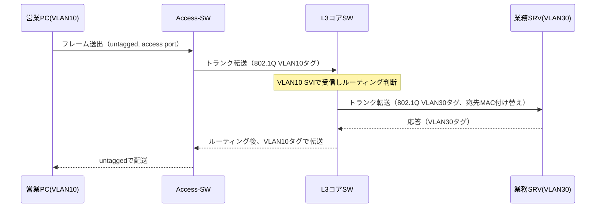
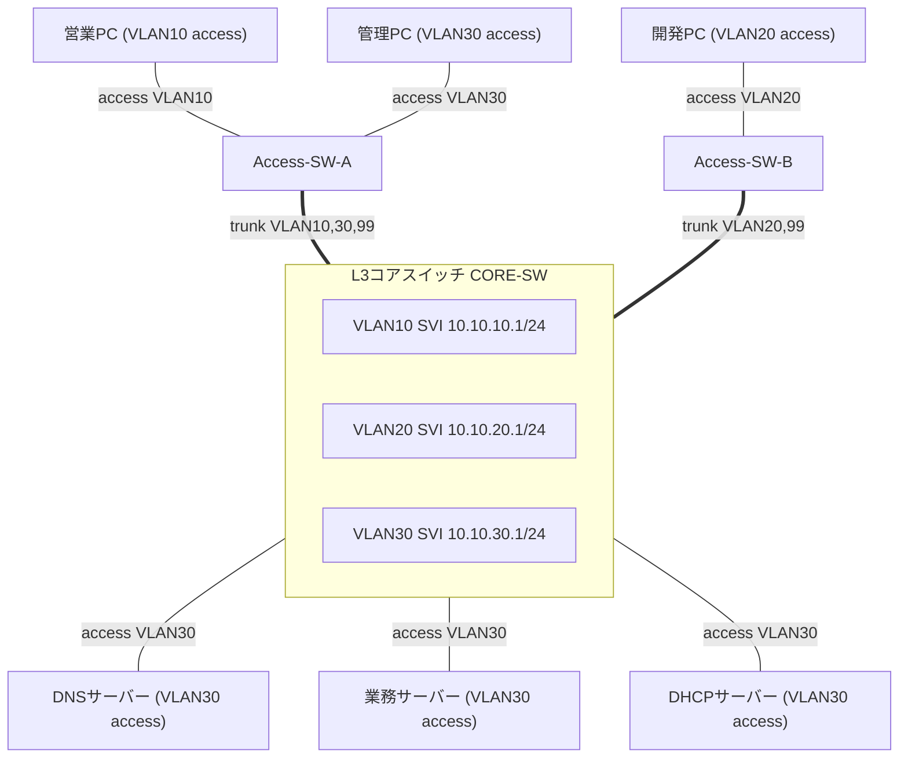

# 第5章 VLANとスイッチング

## 学習目標

この章を終えると、次のことができる。

1. VLAN（Virtual Local Area Network：仮想LAN）の目的を、ブロードキャスト抑制とセキュリティ分離の両面から説明できる
2. アクセスポートとトランクポートの違いを、IEEE 802.1Qのタグ付け方式と結びつけて説明できる
3. ネイティブVLANの役割と、設計上注意すべき点を説明できる
4. VLAN間ルーティングを、Router on a StickとL3スイッチ（SVI）の両方式で比較しながら説明できる
5. DTP（Dynamic Trunking Protocol）がCisco固有機能であることを踏まえ、運用上どう扱うべきか判断できる
6. 通貫シナリオの部署分離を、具体的なVLAN設計とスイッチ設定として構成できる

---

## 5.1 この章で学ぶこと

第2章までで、スイッチが同一ネットワーク内でMACアドレスを学習し、フレームを転送する仕組みを扱った。

そこで前提にしていたのは、「1つのスイッチ、1つのブロードキャストドメイン」という単純な構成である。

しかし通貫シナリオの本社には、営業部、開発部、管理部という、業務上は分離したい複数の部署が存在する。

全員を同じ物理スイッチの同じネットワークに収容すると、ある部署のブロードキャストが他部署にまで届き、ある部署の端末が他部署のサーバーへ無制限にアクセスできてしまう。

かといって、部署ごとに専用の物理スイッチを用意するのは、配線とコストの面で現実的ではない。

この章では、1台の物理スイッチ設備の上に複数の論理ネットワークを作るVLANの仕組みと、部署をまたぐ通信を成立させるVLAN間ルーティングを扱う。

通貫シナリオでは、VLAN10（営業、10.10.10.0/24）、VLAN20（開発、10.10.20.0/24）、VLAN30（管理・サーバー、10.10.30.0/24）、VLAN99（ネイティブ、未使用推奨）、VLAN100（WAN、10.10.100.0/30）という設計をすでに提示している。

この設計を、実際のスイッチ設定として組み立てていく。

---

## 5.2 VLANが必要になった背景

初期のLANでは、部署やセキュリティレベルの異なる端末を分離しようとすると、物理的に別のスイッチと別の配線を用意するしかなかった。

この方式には、いくつもの限界があった。

- 部署の増員や移動のたびに、配線やスイッチポートの物理的な組み替えが発生する
- フロア配置と部署の境界が一致しないと、配線が複雑化する
- 1つの物理スイッチ内で複数のブロードキャストドメインを作れないため、スイッチの利用効率が悪い
- ある部署の端末が別部署のセグメントに物理的に接続さえされていれば、意図せず到達できてしまう

VLANは、この問題を「物理的な配線」ではなく「論理的なグループ分け」で解決する技術として登場した。

同じ物理スイッチの各ポートに異なるVLAN IDを割り当てることで、1台のスイッチの中に複数の独立したブロードキャストドメインを作れる。

端末の物理的な設置場所とは無関係に、所属する部署やセキュリティ要件に応じてポートを割り当てられるようになったことが、VLANが企業ネットワークの標準的な設計要素になった理由である。

---

## 5.3 基本概念

### 5.3.1 VLANの目的

**VLAN**（Virtual Local Area Network：仮想LAN）とは、1台または複数の物理スイッチ上に、論理的に分離した複数のブロードキャストドメインを作る技術である。

VLANの目的は、大きく2つに整理できる。

1. **ブロードキャストドメインの分割**：ブロードキャストトラフィックが届く範囲を、業務単位や部署単位に限定し、無関係な端末への負荷を減らす
2. **論理的なセキュリティ分離**：異なるVLAN間の通信には、原則としてL3の転送（ルーティング）が必要になるため、部署間の通信を制御しやすくする

通貫シナリオでは、営業部の端末が発するARPブロードキャストは、同じVLAN10内の端末にしか届かない。

開発部や管理部には、そもそもそのブロードキャストが到達しない。

これにより、部署ごとのトラフィックが互いに干渉しにくくなり、後述するACL（アクセスコントロールリスト、詳細は第8章）と組み合わせることで、部署間アクセスを意図的に制御できるようになる。

VLANはあくまで論理的な区画を作る技術であり、それ自体がアクセス制御機能を持つわけではない点に注意する。

VLANを分けただけでは、VLAN間ルーティングを行うL3装置がACLを持たない限り、部署間の通信は素通りする。

### 5.3.2 アクセスポートとトランクポート

スイッチのポートは、役割によって大きく2種類に分けられる。

#### アクセスポート

**アクセスポート**とは、1つのVLANにのみ所属するポートである。

PCやプリンター、サーバーなど、単一のVLANに属する端末を接続する際に使う。

アクセスポートに接続された端末は、VLANタグの存在を意識しない。

端末が送出するフレームはタグなし（untagged）のままスイッチに入り、スイッチの内部処理でのみ、そのポートに割り当てられたVLAN IDと関連付けられる。

#### トランクポート

**トランクポート**とは、複数のVLANのフレームを、1本の物理リンク上でまとめて運ぶポートである。

スイッチ同士の接続や、スイッチとルーターの接続など、複数VLANのトラフィックを一括して運ぶ必要がある区間で使う。

トランクポートを通過するフレームには、どのVLANに属するかを示すタグが付与される（ネイティブVLANの扱いは後述する）。

通貫シナリオでは、アクセススイッチとL3コアスイッチの間がトランクとなり、VLAN10、20、30、99のフレームがこの1本のリンクの上でまとめて運ばれる。

```text
[営業PC]---access(VLAN10)---[Access-SW]
[開発PC]---access(VLAN20)---[Access-SW]
[管理PC]---access(VLAN30)---[Access-SW]
                                  |
                          trunk（VLAN10,20,30,99）
                                  |
                            [L3コアスイッチ]
```

### 5.3.3 IEEE 802.1Qによるタグ付け

**IEEE 802.1Q**は、トランクリンク上を流れるEthernetフレームに、所属VLANを示す4バイトのタグを挿入する標準規格である。

IEEE（Institute of Electrical and Electronics Engineers：米国電気電子学会）が定めた標準であり、ベンダーを問わず相互運用できる。

802.1Qタグには、主に次の情報が含まれる。

| フィールド | 内容 |
|------------|------|
| TPID（Tag Protocol Identifier） | 802.1Qタグであることを示す固定値 |
| PCP（Priority Code Point） | フレームの優先度（802.1pに相当する3ビット） |
| DEI（Drop Eligible Indicator） | 輻輳時の廃棄優先度を示す1ビット |
| VLAN ID | 所属VLANを識別する12ビットの値 |

VLAN IDは12ビットで表現されるため、理論上は0から4095までの値を取り得るが、0と4095は予約されており、実運用で使えるのは1から4094である。

さらにVLAN 1は多くのCisco機器で管理用の既定VLANとして予約的に扱われるため、設計上は意図的に使わないことが多い（詳細は5.11節で扱う）。

タグが付与されることでフレームのサイズは4バイト増加する。

古い機器や一部の設計では、この増加分を考慮したMTU設計が必要になる場合がある。

### 5.3.4 ネイティブVLAN

**ネイティブVLAN**とは、トランクポート上で唯一、タグを付けずに（untaggedのまま）転送されるVLANのことである。

トランクの両端で、このネイティブVLANの番号を一致させておく必要がある。

一致していないと、片方のスイッチが「タグなしフレームはネイティブVLAN Xに属する」と解釈するのに対し、もう片方は「ネイティブVLAN Yに属する」と解釈してしまい、意図しないVLAN間でフレームが漏れる。

このネイティブVLANの不一致は、CDP（Cisco Discovery Protocol）の警告ログに現れることが多く、現場でも見落とされがちな設定ミスの1つである。

また、ネイティブVLANを本来の業務VLAN（VLAN10や20など）に設定すると、細工されたフレームによって意図しないVLANへ通信が漏れ出す、いわゆる**VLANホッピング**という手法の起点になり得る。

このため、業務で使わない専用のVLAN（通貫シナリオではVLAN99）をネイティブVLANとして確保し、そこには一切端末を接続しないという設計が広く推奨されている。

### 5.3.5 VLAN間ルーティングの必要性

VLANは、それぞれが独立したブロードキャストドメインであり、同時に独立したIPサブネットとして設計されることが一般的である。

営業部（VLAN10、10.10.10.0/24）の端末が、開発部（VLAN20、10.10.20.0/24）や管理部・サーバー（VLAN30、10.10.30.0/24）と通信するには、異なるネットワーク間の転送、すなわちルーティングが必要になる。

スイッチだけでは、この転送はできない。

L2スイッチはMACアドレスに基づいてVLAN内のフレームを転送するだけであり、VLANという境界を越える判断はL3（ネットワーク層）の役割である。

VLAN間ルーティングを実現する方式として、代表的に次の2つがある。

1. Router on a Stick（外部ルーターとトランクリンクを使う方式）
2. L3スイッチによるSVI（Switched Virtual Interface）を使う方式

### 5.3.6 Router on a Stick

**Router on a Stick**とは、1本の物理リンクをスイッチとルーターの間のトランクとして使い、ルーター側にVLANの数だけサブインターフェースを作ってVLAN間ルーティングを行う方式である。

物理インターフェースは1つのままで、論理的なサブインターフェース（例：`GigabitEthernet0/0.10`）ごとに異なるVLANとIPアドレスを割り当てる。

```text
        [スイッチ]
   trunk(VLAN10,20,30)
           |
   [ルーター 物理IF]
     ├ サブIF .10 → VLAN10 用 IP
     ├ サブIF .20 → VLAN20 用 IP
     └ サブIF .30 → VLAN30 用 IP
```

この方式は、既存のルーターにポートを追加せずにVLAN間ルーティングを実現できる利点がある一方、次のような制約がある。

- すべてのVLAN間トラフィックが、1本の物理リンクの帯域を共有する
- ルーターのソフトウェア処理（機種によってはCPU処理）でルーティングするため、L3スイッチのハードウェア転送に比べて性能面で不利になりやすい
- ルーターとスイッチ間を経由する分、同一機器内で完結するL3スイッチ方式よりわずかに遅延が増える

小規模拠点や、既存の単一ルーターにVLANをあとから追加する場合など、専用のL3スイッチを用意しにくい状況で採用されることが多い方式である。

### 5.3.7 L3スイッチとSVI

**L3スイッチ**とは、L2のスイッチング機能に加えて、IPアドレスに基づくルーティング機能を持つスイッチである。

L3スイッチ上でVLANごとに作成する仮想的なルーテッドインターフェースを、**SVI**（Switched Virtual Interface：スイッチ仮想インターフェース）と呼ぶ。

SVIには、そのVLANのデフォルトゲートウェイとなるIPアドレスを設定する。

```text
        [L3コアスイッチ]
   VLAN10 SVI: 10.10.10.1/24
   VLAN20 SVI: 10.10.20.1/24
   VLAN30 SVI: 10.10.30.1/24
           |
     ASIC等によるハードウェア転送でVLAN間を中継
```

L3スイッチ方式は、Router on a Stickのようにトランクリンクの帯域制約を受けにくく、多くの機種で専用ハードウェア（ASIC）による高速なルーティングが可能である。

このため、企業内の基幹（コア、ディストリビューション）スイッチとしては、L3スイッチによるSVI方式が広く使われている。

通貫シナリオでも、本社のL3コアスイッチがこの方式でVLAN10、20、30間のルーティングを担当する構成を採用する。

Router on a Stickは、方式そのものを理解するための比較対象として押さえつつ、実装は主にL3スイッチ側で行う。

### 5.3.8 DTP（Cisco固有機能）

**DTP**（Dynamic Trunking Protocol：ダイナミックトランキングプロトコル）は、隣接するスイッチポート同士が、アクセスポートにするかトランクポートにするかを自動的にネゴシエーションするCisco固有のプロトコルである。

標準規格であるIEEE 802.1Qとは異なり、DTPはCisco製スイッチ間でのみ動作する。

DTPには、主に次のモードがある。

| モード | 動作 |
|--------|------|
| `dynamic desirable` | 積極的にトランクへの昇格を提案する |
| `dynamic auto` | 相手から提案されればトランクになるが、自分からは提案しない |
| `trunk` | 常にトランクとして動作し、可能ならDTPで相手にもトランク化を促す |
| `access` | 常にアクセスポートとして動作する |

DTPは便利に見える一方、運用上は次のリスクがある。

- 誤って未使用ポートが `dynamic desirable` のままだと、そこに悪意のある機器を接続してDTPネゴシエーションを成立させ、トランクポートを不正に確立される可能性がある（VLANホッピングの一手法）
- 他ベンダーのスイッチとの接続では、DTP自体が存在しないため、ネゴシエーションが成立せずリンクの扱いが不定になることがある

このため、実運用ではポートの役割（アクセスかトランクか）を明示的に固定し、`switchport nonegotiate` コマンドでDTPネゴシエーションそのものを無効化することが推奨される。

DTPを使うかどうかは設計判断であり、CCNAの学習としては「これはCisco固有機能であり、標準のIEEE 802.1Qとは別物である」という区別を正しく持っておくことが重要である。

---

## 5.4 通信・処理の流れ

営業部の端末（VLAN10、10.10.10.10）から、管理部・サーバーVLAN（VLAN30）にある業務サーバー（10.10.30.10）へHTTPS通信を行う場合を例に、フレームとパケットの流れを追う。

1. 営業PCは、宛先が自分の属するサブネット（10.10.10.0/24）の外にあると判断し、デフォルトゲートウェイ（L3コアスイッチのVLAN10 SVI、10.10.10.1）宛にARPで問い合わせる（初回のみ、以降はARPキャッシュを使う）
2. 営業PCは、宛先MACをゲートウェイのMACアドレスに、宛先IPを業務サーバーのIP（10.10.30.10）にしたフレームを送出する
3. アクセススイッチは、このフレームをアクセスポートで受け取り、内部的にVLAN10のフレームとして扱う
4. アクセススイッチは、フレームをL3コアスイッチへのトランクポートへ転送する。このときフレームには802.1QのVLAN10タグが付与される
5. L3コアスイッチは、トランク経由でタグ付きフレームを受信し、タグからVLAN10のフレームであると判断してVLAN10のSVIで受け取る
6. L3コアスイッチは、IPヘッダの宛先（10.10.30.10）を見てルーティングテーブルを参照し、VLAN30のSVIから転送すべきと判断する
7. L3コアスイッチは、VLAN30側で宛先MAC（業務サーバーのMAC、ARPで既知）を持つ新しいEthernetヘッダを付け直し、VLAN30のタグを付けてトランク経由でサーバー側へ転送する
8. 業務サーバーがフレームを受信し、TCPの3ウェイハンドシェイクとTLSハンドシェイクへ進む

この流れで重要なのは、VLANをまたいだ時点でEthernetヘッダ（MACアドレス）は付け替えられるが、IPヘッダの送信元・宛先アドレスは変化しない、という点である。

これは第1章で扱ったカプセル化・再カプセル化の考え方が、VLAN環境でも成立していることを示している。



同一VLAN内の通信（例：営業PC同士）であれば、手順6・7のルーティング処理は発生せず、アクセススイッチとトランクの区間だけでL2転送が完結する。

---

## 5.5 構成例

通貫シナリオの本社ネットワークを、VLANとポートの役割に焦点を当てて整理する。



この図から読み取れる設計判断は次のとおりである。

- 各部署の端末はアクセススイッチに収容し、アクセスポートで単一VLANに割り当てる
- アクセススイッチとコアスイッチの間はトランクとし、必要なVLANだけを明示的に許可する
- サーバー群はVLAN30に集約し、コアスイッチへ直接アクセスポートで接続する（サーバー室の配線構成によっては専用のサーバー用アクセススイッチを挟む設計も一般的である）
- VLAN99はどのポートにも端末を接続せず、ネイティブVLAN専用として確保する

R1・R2やインターネットへの経路は第6章・第7章で扱うため、本章の構成例はL2〜VLAN間ルーティングの範囲に絞っている。

---

## 5.6 Cisco IOSの設定例

通貫シナリオの部署分離を、実際のCisco IOSコマンドで構成する。

### VLANの作成（Access-SW-A、Access-SW-B、CORE-SWで共通）

```cisco
! VLANデータベースにVLANを登録する
Switch(config)# vlan 10
Switch(config-vlan)# name Sales
Switch(config-vlan)# exit

Switch(config)# vlan 20
Switch(config-vlan)# name Dev
Switch(config-vlan)# exit

Switch(config)# vlan 30
Switch(config-vlan)# name Mgmt-Server
Switch(config-vlan)# exit

Switch(config)# vlan 99
Switch(config-vlan)# name Native-Unused
Switch(config-vlan)# exit
```

VLANはトランクの両端、および経路上のすべてのスイッチで一致している必要がある。

一部のスイッチにだけVLANが登録されていないと、そのVLANのフレームが途中で破棄される。

### Access-SW-A：アクセスポートとトランクの設定

```cisco
Access-SW-A(config)# interface GigabitEthernet1/0/1
Access-SW-A(config-if)# description Sales-PC
Access-SW-A(config-if)# switchport mode access
Access-SW-A(config-if)# switchport access vlan 10
Access-SW-A(config-if)# switchport nonegotiate
Access-SW-A(config-if)# spanning-tree portfast
Access-SW-A(config-if)# exit

Access-SW-A(config)# interface GigabitEthernet1/0/2
Access-SW-A(config-if)# description Mgmt-PC
Access-SW-A(config-if)# switchport mode access
Access-SW-A(config-if)# switchport access vlan 30
Access-SW-A(config-if)# switchport nonegotiate
Access-SW-A(config-if)# spanning-tree portfast
Access-SW-A(config-if)# exit

Access-SW-A(config)# interface GigabitEthernet1/0/24
Access-SW-A(config-if)# description Uplink-to-CORE-SW
Access-SW-A(config-if)# switchport trunk encapsulation dot1q
Access-SW-A(config-if)# switchport mode trunk
Access-SW-A(config-if)# switchport trunk native vlan 99
Access-SW-A(config-if)# switchport trunk allowed vlan 10,30,99
Access-SW-A(config-if)# switchport nonegotiate
```

主要パラメータの意味は次のとおりである。

- `switchport mode access` / `switchport mode trunk`：ポートの役割を明示的に固定する
- `switchport access vlan 10`：このアクセスポートが所属するVLANを指定する
- `switchport trunk encapsulation dot1q`：タグ付け方式としてIEEE 802.1Qを使うことを明示する（機種によっては802.1Qのみ対応で省略可）
- `switchport trunk native vlan 99`：ネイティブVLANをVLAN99に固定する（両端で一致させる）
- `switchport trunk allowed vlan 10,30,99`：このトランクで許可するVLANを明示的に限定する（不要なVLANは通さない）
- `switchport nonegotiate`：DTPによる自動ネゴシエーションを無効化し、設定どおりの役割で固定する
- `spanning-tree portfast`：アクセスポートでSTPの初期状態遷移を高速化する設定（詳細は第7章）

Access-SW-Bも同様に、VLAN20用のアクセスポートと、`switchport trunk allowed vlan 20,99` としたトランクを設定する。

### CORE-SW：トランクとSVI（VLAN間ルーティング）の設定

```cisco
CORE-SW(config)# ip routing
! L3スイッチとしてルーティング機能を有効化する（機種によっては既定で有効）

CORE-SW(config)# interface GigabitEthernet1/0/1
CORE-SW(config-if)# description Downlink-to-Access-SW-A
CORE-SW(config-if)# switchport trunk encapsulation dot1q
CORE-SW(config-if)# switchport mode trunk
CORE-SW(config-if)# switchport trunk native vlan 99
CORE-SW(config-if)# switchport trunk allowed vlan 10,30,99
CORE-SW(config-if)# switchport nonegotiate
CORE-SW(config-if)# exit

CORE-SW(config)# interface GigabitEthernet1/0/2
CORE-SW(config-if)# description Downlink-to-Access-SW-B
CORE-SW(config-if)# switchport trunk encapsulation dot1q
CORE-SW(config-if)# switchport mode trunk
CORE-SW(config-if)# switchport trunk native vlan 99
CORE-SW(config-if)# switchport trunk allowed vlan 20,99
CORE-SW(config-if)# switchport nonegotiate
CORE-SW(config-if)# exit

CORE-SW(config)# interface Vlan10
CORE-SW(config-if)# description Sales-Gateway
CORE-SW(config-if)# ip address 10.10.10.1 255.255.255.0
CORE-SW(config-if)# no shutdown
CORE-SW(config-if)# exit

CORE-SW(config)# interface Vlan20
CORE-SW(config-if)# description Dev-Gateway
CORE-SW(config-if)# ip address 10.10.20.1 255.255.255.0
CORE-SW(config-if)# no shutdown
CORE-SW(config-if)# exit

CORE-SW(config)# interface Vlan30
CORE-SW(config-if)# description Mgmt-Server-Gateway
CORE-SW(config-if)# ip address 10.10.30.1 255.255.255.0
CORE-SW(config-if)# no shutdown
```

`ip routing` は、L3スイッチをVLAN間ルーティングとして機能させるための前提条件である。

これが無効なままだと、SVIにIPアドレスを設定していても、VLANをまたぐ転送は行われない。

`interface Vlan10` のようなSVIは、物理ポートではなく論理インターフェースであり、対応するVLANが存在し、かつそのVLANに属する物理ポートが最低1つupしていないと、SVI自体もdownのままになる点に注意する。

### Router on a Stickの参考構成（比較用）

L3スイッチを使わず、既存ルーターの1ポートでVLAN間ルーティングを行う場合の参考例を示す。

```cisco
R(config)# interface GigabitEthernet0/0
R(config-if)# no ip address
R(config-if)# no shutdown
R(config-if)# exit

R(config)# interface GigabitEthernet0/0.10
R(config-subif)# encapsulation dot1Q 10
R(config-subif)# ip address 10.10.10.1 255.255.255.0
R(config-subif)# exit

R(config)# interface GigabitEthernet0/0.20
R(config-subif)# encapsulation dot1Q 20
R(config-subif)# ip address 10.10.20.1 255.255.255.0
R(config-subif)# exit

R(config)# interface GigabitEthernet0/0.99
R(config-subif)# encapsulation dot1Q 99 native
R(config-subif)# exit
```

`encapsulation dot1Q 99 native` は、このサブインターフェースをネイティブVLAN用として扱う指定である。

通貫シナリオ本体では、この構成ではなくL3スイッチ方式を採用するため、以降の章もCORE-SWのSVI構成を前提に進める。

### 確認コマンド

```cisco
! VLANの登録状況とポートの割り当てを確認する
Switch# show vlan brief

! トランクポートの状態、ネイティブVLAN、許可VLANを確認する
Switch# show interfaces trunk

! 特定ポートのスイッチポート設定（mode、access vlan、trunkの詳細）を確認する
Switch# show interfaces GigabitEthernet1/0/1 switchport

! SVIの状態とIPアドレスを確認する
CORE-SW# show ip interface brief

! ルーティングテーブルでVLAN間経路（直接接続）を確認する
CORE-SW# show ip route
```

`show interfaces trunk` の出力で、両端のスイッチの「Allowed VLANs」と「Native VLAN」が一致しているかを必ず確認する。

ここが一致していないことが、後述する障害の代表例になる。

---

## 5.7 LinuxおよびWindowsでの確認

通常、アクセスポートに接続されたホストはVLANタグを意識しない。

OSやNICの設定でVLANを扱う必要があるのは、1つの物理NICで複数VLANを扱いたいサーバーや仮想化ホストなど、トランクポートに直接接続するケースである。

### Windows（一般的なクライアント端末）

```bat
:: 現在のIPアドレス、サブネットマスク、ゲートウェイを確認する
ipconfig /all

:: 自分の属するVLANのゲートウェイ（SVI）へ疎通確認する
ping 10.10.10.1

:: 別VLANのサーバーへの到達性を確認する（ルーティングが機能していれば成功する）
ping 10.10.30.10
```

営業PCから10.10.10.1（VLAN10のゲートウェイ）へのpingが失敗する場合、アクセスポートのVLAN割り当てやトランクの許可VLANに問題がある可能性が高い。

10.10.10.1へは届くが10.10.30.10へは届かない場合は、VLAN間ルーティング側（SVIの状態やルーティングテーブル、後述のACL）を疑う。

### Linux（トランクポートに接続する場合の例）

一般的なサーバーでは不要だが、仮想化基盤のホストなど、1本のNICで複数VLANを扱いたい場合は、802.1Qのサブインターフェースを作成する。

```bash
# VLANモジュールのロード（ディストリビューションにより既定で有効な場合もある）
sudo modprobe 8021q

# eth0上にVLAN10用のサブインターフェースを作成する
sudo ip link add link eth0 name eth0.10 type vlan id 10
sudo ip addr add 10.10.10.50/24 dev eth0.10
sudo ip link set eth0.10 up

# 現在のVLANサブインターフェースとIPを確認する
ip -d link show eth0.10
ip addr show

# 疎通確認
ping -c 4 10.10.10.1
```

この場合、対向のスイッチポートはアクセスポートではなくトランクポートとして設定し、少なくともVLAN10を許可VLANに含めておく必要がある。

対向がアクセスポートのままだと、Linux側でタグ付きフレームを送っても、スイッチ側で想定外のタグとして扱われ通信できない。

---

## 5.8 よくある誤解

1. **「VLANを分ければセキュリティは万全になる」**
   VLANが分離するのはブロードキャストドメインであり、それ自体にアクセス制御機能はない。部署間の通信可否を制御するには、L3装置上のACLが別途必要である（詳細は第8章）。

2. **「トランクポートは複数の物理ケーブルを束ねたもの」**
   トランクは1本の論理リンク上に複数VLANのタグ付きフレームを流す技術であり、物理ケーブルの本数とは無関係である。複数の物理リンクを束ねる技術はEtherChannel（第7章）であり、別の概念である。

3. **「ネイティブVLANは初期設定のVLAN1のままでよい」**
   VLAN1は多くの機種で管理系トラフィックの既定値として特別扱いされており、そのままネイティブVLANにしておくと、意図しない情報の混入やVLANホッピングのリスクが高まる。業務で使わない専用VLANに変更するのが望ましい。

4. **「DTPは標準機能なので、どのベンダーの機器でも同じように動く」**
   DTPはCisco固有のプロトコルである。他ベンダーのスイッチとの接続では、DTPによるネゴシエーションは成立しない。混在環境では、双方の設定を手動で固定するのが基本である。

5. **「Router on a StickとL3スイッチは、どちらを使っても性能は同じ」**
   Router on a Stickは1本の物理リンクの帯域をすべてのVLAN間通信で共有し、ソフトウェア処理に依存する部分が大きい。L3スイッチはハードウェア転送を利用でき、一般に高いスループットが得られる。

---

## 5.9 代表的な障害

| 症状 | ありがちな原因 |
|------|----------------|
| 特定のPCだけ、同一部署内の他PCと通信できない | アクセスポートに誤ったVLANが割り当てられている |
| アクセススイッチ配下は正常だが、他部署やサーバーに一切届かない | トランクの `allowed vlan` に該当VLANが含まれていない |
| 一部の通信だけ不安定、またはループのような症状が出る | トランク両端でネイティブVLANが不一致になっている |
| SVIが `administratively down` ではないのに他VLANへ届かない | `ip routing` が無効、またはVLANに属する物理ポートが1つもupしていない |
| 新設ポートの設定直後に動作が不安定になる | DTPのネゴシエーション結果、意図しないtrunk/accessモードになっている |

---

## 5.10 トラブルシューティング手順

VLAN関連の疎通問題は、次の順で切り分けると効率的である。

1. **端末側の設定確認**：IPアドレス、サブネットマスク、デフォルトゲートウェイが設計どおりか（`ipconfig` / `ip addr`）
2. **アクセスポートの確認**：`show interfaces <port> switchport` で、モードと割り当てVLANを確認する
3. **VLANデータベースの確認**：`show vlan brief` で、該当VLANがそのスイッチに存在し、対象ポートが正しいVLANに列挙されているか確認する
4. **トランクの確認**：`show interfaces trunk` で、経路上のすべてのトランクについて、Allowed VLANとNative VLANが両端で一致しているか確認する
5. **SVIの確認**：L3スイッチで `show ip interface brief` を実行し、対象VLANのSVIがup/upであるか確認する
6. **ルーティングの確認**：`show ip route` で、宛先VLANのサブネットが直接接続として認識されているか確認する
7. **ゲートウェイへの疎通確認**：端末から自分のVLANのSVIへping、次に相手VLANのSVIへpingし、どこで途切れるかを特定する

同一VLAN内のみで不通ならL2の設定（アクセスポート、VLAN登録）を、ゲートウェイまでは届くが別VLANに届かないならL3側の設定やACLを重点的に疑う。

---

## 5.11 設計・運用上の注意点

1. **VLAN1を業務利用しない**
   VLAN1は既定値として特別に扱われることが多いため、業務VLANやネイティブVLANとしての利用を避け、未使用のまま残す設計が安全である。

2. **ネイティブVLANは専用の未使用VLANにする**
   通貫シナリオのVLAN99のように、端末を一切接続しない専用VLANをネイティブVLANとして確保する。

3. **トランクのAllowed VLANは必要最小限に絞る**
   デフォルトの「すべてのVLANを許可」のままにせず、実際に必要なVLANだけを明示的に許可する。不要なVLANのブロードキャストがリンクを無駄に消費することを防ぐ。

4. **DTPを無効化し、モードを明示的に固定する**
   `switchport nonegotiate` と、`switchport mode access` / `trunk` の明示指定を組み合わせ、意図しないモード変化を防ぐ。

5. **部署間通信の可否は、VLAN設計とは別にACLで明文化する**
   通貫シナリオでは、営業・開発・管理の間でどの通信を許可するかを、VLAN設計の段階から意識しておき、実装は第8章のACLで行う。VLANを分けた時点で「安全になった」と誤認しないようにする。

6. **VLAN命名とID採番のルールを統一する**
   VLAN名（Sales、Devなど）とVLAN IDの対応をドキュメント化し、拠点をまたいで一貫させる。将来の拠点追加やVLAN追加を見据え、ID体系にある程度の余裕を持たせる。

---

## 5.12 要点まとめ

- VLANは、1台の物理スイッチ上に複数の論理的なブロードキャストドメインを作る技術である
- アクセスポートは単一VLAN専用、トランクポートは複数VLANのタグ付きフレームを運ぶ
- IEEE 802.1Qは標準のタグ付け規格であり、ベンダーを問わず相互運用できる
- ネイティブVLANはトランク上でタグなしのまま扱われるVLANであり、両端で一致させ、業務で使わない専用VLANにするのが望ましい
- VLANをまたぐ通信にはL3装置による転送が必要であり、Router on a StickとL3スイッチ（SVI）という2つの実現方式がある
- DTPはCisco固有機能であり、標準規格のIEEE 802.1Qとは区別して扱う
- VLANの分離自体はセキュリティ制御ではなく、部署間アクセス制御にはACLが別途必要である

---

## 5.13 章末問題

### 問題1

アクセスポートとトランクポートの違いを、扱うVLANの数とタグ付けの有無の観点から説明せよ。

### 問題2

ネイティブVLANの不一致が起きると、どのような問題が起こり得るか。また、この問題を避けるための一般的な設計上の対策を1つ挙げよ。

### 問題3

Router on a StickとL3スイッチによるVLAN間ルーティングを比較し、それぞれの利点と制約を1つずつ挙げよ。

### 問題4

DTPがCisco固有機能であることを踏まえ、他ベンダーのスイッチと接続する際に注意すべき点を述べよ。

### 問題5

営業PCから業務サーバー（別VLAN）へのpingが失敗している。SVIまでは届くが、それより先に届かないことがわかっている場合、次に確認すべき項目を2つ挙げよ。

---

## 5.14 解答と解説

### 解答1

アクセスポートは単一のVLANにのみ所属し、フレームにタグは付与しない。トランクポートは複数のVLANのフレームを1本のリンクで運び、ネイティブVLAN以外のフレームにはIEEE 802.1Qのタグを付与して、どのVLANに属するかを識別できるようにする。

### 解答2

ネイティブVLANが不一致だと、片方のスイッチが送信したタグなしフレームを、もう片方のスイッチが意図しないVLANのフレームとして解釈し、本来届くべきでないVLANへ通信が漏れる可能性がある。対策としては、業務で使わない専用のVLAN（通貫シナリオのVLAN99など）をネイティブVLANとして確保し、トランクの両端で一致させることが挙げられる。

### 解答3

Router on a Stickは、既存のルーターに追加ハードウェアを用意せずVLAN間ルーティングを実現できる利点があるが、単一の物理リンクの帯域をすべてのVLAN間通信で共有し、ソフトウェア処理に依存しやすいという制約がある。L3スイッチは、ハードウェア転送により高いスループットを得やすい利点があるが、L3スイッチ自体の導入コストが必要になる。

### 解答4

DTPはCisco固有のプロトコルであり、他ベンダーのスイッチとの間ではネゴシエーションが成立しない。混在環境では、双方のポートモード（アクセスかトランクか）を手動で明示的に固定し、DTPのネゴシエーションに依存しない設計にする必要がある。

### 解答5

例：(1) 宛先VLAN（サーバー側VLAN）のSVIがup/upであり、かつそのVLANに属する物理ポートが少なくとも1つupしているかを確認する。(2) L3スイッチのルーティングテーブルに宛先サブネットが正しく存在するか、また部署間通信を制限するACLが誤って該当トラフィックを拒否していないかを確認する。

---

## 5.15 実機またはシミュレーター演習

Cisco Packet Tracer、GNS3、CML、実機のいずれかを使い、通貫シナリオの部署分離を再現する。

### 演習A：VLANとアクセスポートの基本

1. スイッチ1台に、VLAN10、VLAN20、VLAN30を作成する
2. PC-Sales（VLAN10）、PC-Dev（VLAN20）、PC-Mgmt（VLAN30）をそれぞれ別のアクセスポートに接続する
3. 各PCに10.10.10.10/24、10.10.20.10/24、10.10.30.10/24を設定する
4. 同一VLAN内でのみpingが通り、異なるVLAN間ではpingが失敗することを確認し、その理由を記録する

### 演習B：トランクとVLAN間ルーティング

1. 演習Aの構成に、L3スイッチ（またはRouter on a Stick用ルーター）を追加する
2. スイッチとL3装置の間をトランクとして構成し、VLAN10、20、30、99を許可する
3. L3装置側にVLAN10、20、30のSVI（またはサブインターフェース）を作成し、10.10.X.1/24を割り当てる
4. 各PCのデフォルトゲートウェイを対応するSVIのIPに設定する
5. 異なるVLAN間でpingが成功することを確認する

### 演習C：ネイティブVLAN不一致の再現

1. トランクの片方をネイティブVLAN99、もう片方をネイティブVLAN1のまま（意図的に不一致）に設定する
2. CDPの警告ログや、意図しない通信の混入がないかを確認する
3. 両端を同じネイティブVLANに揃え、警告が解消することを確認する
4. 障害票の形式で、症状・確認内容・対処をまとめる

---

## 次章への橋渡し

VLAN間ルーティングによって、本社内の部署を越える通信は成立するようになった。

残る課題は、本社と支社、さらにインターネットという、より広い範囲での経路の決め方である。

第6章では、ルーティングテーブルの構造とロンゲストマッチ、スタティックルートとダイナミックルーティング、そしてOSPFの基本動作を扱う。
