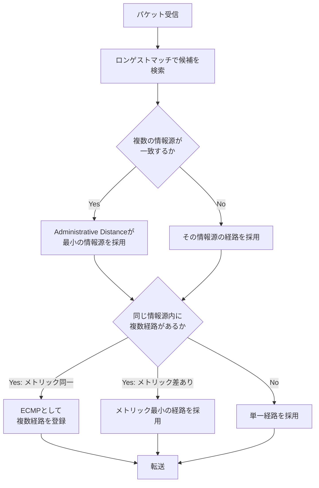
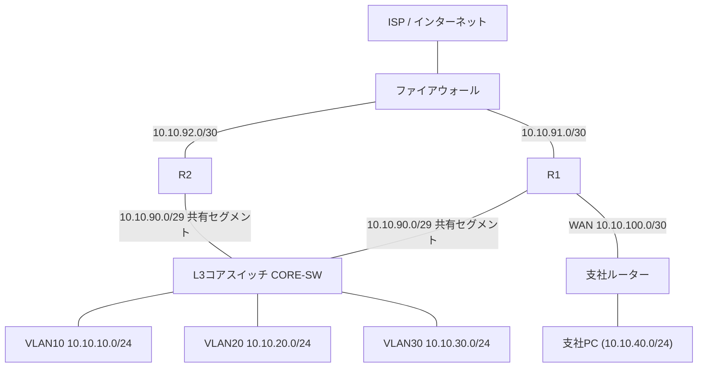

# 第6章 ルーティング

## 学習目標

この章を終えると、次のことができる。

1. ルーティングテーブルの構造と、ロンゲストマッチによる経路選択の仕組みを説明できる
2. スタティックルートとデフォルトルートを、用途に応じて設計・設定できる
3. ディスタンスベクター型とリンクステート型のダイナミックルーティングの違いを説明できる
4. OSPF（Open Shortest Path First）の基本動作を、ネイバー、エリア、メトリックの観点から説明できる
5. Administrative Distance（AD）とECMP（Equal-Cost Multi-Path）を、経路選択の流れの中で正しく使える
6. 本社、支社、インターネットにまたがる経路を、実際のルーティング設定として構成できる

---

## 6.1 この章で学ぶこと

第5章では、本社内の部署（VLAN）をまたぐ通信を、L3コアスイッチのSVIとルーティングによって実現した。

しかし通貫シナリオには、本社の中だけでは完結しない通信がまだ残っている。

支社の端末が本社の業務サーバーにアクセスする通信、本社と支社の端末がインターネット上のサービスへアクセスする通信である。

これらは、本社と支社を結ぶWANリンク、そしてインターネットとの境界を越える経路の判断が必要になる。

この章では、ルーターがパケットの転送先を決めるための土台となるルーティングテーブルの構造、経路を教える方法としてのスタティックルートとダイナミックルーティング、そして企業ネットワークで広く使われるOSPFを扱う。

最終的に、本社のL3コアスイッチ、エッジルーターR1・R2、支社ルーターの間で、部署ネットワーク、支社ネットワーク、インターネット向けのデフォルトルートがどのように行き交うかを、具体的な設定として組み立てる。

---

## 6.2 ルーティングが必要になった背景

VLANによってブロードキャストドメインを分割すると、当然の帰結として、ネットワークの数がそのまま増える。

営業、開発、管理・サーバー、支社、そしてインターネットの先にある無数のネットワーク。

これらすべてを1つのフラットなネットワークとして運用することは、規模が大きくなるほど非現実的になる。

ネットワークを分割しつつ、必要な通信は成立させるためには、「このネットワーク宛のパケットは、どちらの方向へ送ればよいか」を判断する仕組みが必要になる。

小規模な構成であれば、管理者がすべての経路を手作業で設定しても運用できる。

しかし、拠点数やネットワーク数が増え、リンク障害による経路変更が頻繁に起こるようになると、手作業での経路管理は破綻しやすくなる。

ルーティングは、この「経路を決める」という課題に対し、手動での設定（スタティックルート）と、装置同士が自動的に経路情報を交換する仕組み（ダイナミックルーティング）という、2つの手段を用意することで応えてきた。

---

## 6.3 基本概念

### 6.3.1 ルーティングの役割

**ルーティング**とは、ルーターやL3スイッチが、受け取ったパケットの宛先IPアドレスを見て、どのインターフェースへ転送すべきかを判断し、実際に転送する処理である。

ルーティングを行う装置は、内部に**ルーティングテーブル**（経路表）を持ち、パケットが届くたびにこの表を参照して転送先を決定する。

第1章で触れたとおり、ルーティングはOSI参照モデルのネットワーク層（レイヤー3）の役割であり、スイッチが担うMACアドレスに基づく転送（レイヤー2）とは扱う情報も判断基準も異なる。

### 6.3.2 ルーティングテーブルの構造

ルーティングテーブルの各エントリには、主に次の情報が含まれる。

| 項目 | 意味 |
|------|------|
| 宛先ネットワーク | 経路が対象とするネットワークアドレスとプレフィックス長（例：10.10.40.0/24） |
| 出力インターフェース | パケットを送り出すインターフェース |
| ネクストホップ | 直接接続先ではない場合に、パケットを渡す隣接ルーターのIPアドレス |
| ソース（経路の由来） | 直接接続（C）、スタティック（S）、OSPF（O）など、その経路情報がどこから得られたかを示す種別 |
| メトリック | 同じソース内で経路の優劣を比較するための数値 |

CiscoのIOSでは、`show ip route` の出力の先頭に付く記号（C、S、O、S*など）で、経路の由来を読み取る。

たとえば `O 10.10.40.0/24 [110/2] via 10.10.90.1` は、「OSPFで学習した経路であり、Administrative Distanceが110、メトリックが2、ネクストホップが10.10.90.1である」ことを示している。

### 6.3.3 ロンゲストマッチ

パケットが届いたとき、ルーティングテーブルに宛先ネットワークとして複数のエントリが一致することがある。

たとえば、宛先が10.10.40.5であり、テーブルに `10.10.40.0/24` と `0.0.0.0/0`（デフォルトルート）の両方が存在する場合、どちらも「一致」する。

この場合にルーターが選ぶのは、**ロンゲストマッチ**（最長一致：Longest Prefix Match）、すなわちプレフィックス長がより長い、より具体的な経路である。

この例では `/24` のほうが `/0` より具体的であるため、`10.10.40.0/24` の経路が優先される。

ロンゲストマッチは、経路のソース（スタティックかダイナミックか）やAdministrative Distanceよりも先に評価される、ルーティングの最も基本的な選択則である。

具体的な経路が存在しない宛先だけが、最終的にデフォルトルートに落ちてくる、という関係を理解しておくことが重要である。

### 6.3.4 デフォルトルート

**デフォルトルート**とは、ルーティングテーブル上のどの具体的なエントリにも一致しなかったパケットを転送するための経路であり、`0.0.0.0/0` という宛先ネットワークで表現される。

インターネット上には無数のネットワークが存在し、そのすべてを個々のルーターが経路情報として保持することは現実的ではない。

企業ネットワークの多くは、インターネット向けの経路をすべて個別に持つのではなく、「それ以外はすべてファイアウォール（またはISP側のルーター）へ送る」というデフォルトルートを1本持つことで、内部のルーティングテーブルを簡潔に保っている。

通貫シナリオでも、R1・R2からファイアウォール方向へのデフォルトルートを設定し、インターネット向けの通信をまとめて処理する。

### 6.3.5 スタティックルート

**スタティックルート**（静的経路）とは、管理者が手動でルーティングテーブルに登録する経路情報である。

Cisco IOSでは `ip route` コマンドで設定する。

スタティックルートの特徴は次のとおりである。

- 設定した経路は、対象のネットワークやネクストホップが到達可能である限り、常にルーティングテーブルに残る
- 経路情報の交換にプロトコルのオーバーヘッド（帯域、CPU）がかからない
- ネットワーク構成が変化しても、管理者が手動で修正しない限りテーブルは更新されない

小規模で変化の少ないネットワーク、あるいは1本のリンクしか経路がないスタブ拠点（末端拠点）では、スタティックルートだけで十分に運用できることが多い。

通貫シナリオの支社は、本社への経路が1本のWANリンクしかないため、スタティックなデフォルトルートだけで運用する設計とする。

### 6.3.6 ダイナミックルーティングの分類

**ダイナミックルーティング**（動的経路制御）とは、ルーター同士がプロトコルを使って経路情報を自動的に交換し、ルーティングテーブルを動的に構築・更新する仕組みである。

リンク障害やネットワーク構成の変化があった場合、管理者が手動で設定を変更しなくても、ルーター同士が新しい経路情報を交換し、テーブルを自動的に更新する。

ダイナミックルーティングプロトコルは、経路計算の方式によって大きく2つに分類される。

#### ディスタンスベクター型

**ディスタンスベクター**型のプロトコルは、隣接するルーターに対して、自分が知っている経路とその距離（メトリック、多くはホップ数など）を伝え合うことで経路を構築する。

各ルーターは、ネットワーク全体の詳細なトポロジーを把握しているわけではなく、「この宛先へは、この隣人経由で、これくらいの距離」という情報のみを保持する。

代表例としてRIP（Routing Information Protocol）が挙げられる。

構成がシンプルな一方、経路変化の収束（コンバージェンス）に時間がかかりやすく、ループ防止のための仕組み（スプリットホライズンなど）が必要になる。

#### リンクステート型

**リンクステート**型のプロトコルは、各ルーターがネットワーク全体のリンク状態（トポロジー情報）を交換し、それぞれが独自にネットワーク全体の地図を構築したうえで、最短経路を計算する。

代表例としてOSPFやIS-ISが挙げられる。

各ルーターが同じトポロジー情報を持つため、経路変化に対する収束が速く、大規模なネットワークにも対応しやすい一方、必要とするメモリやCPU資源、設計の複雑さはディスタンスベクター型より大きくなる傾向がある。

CCNAの学習範囲では、企業内ネットワークの標準的な選択肢としてOSPFを中心に扱う。

### 6.3.7 OSPFの基本

**OSPF**（Open Shortest Path First）は、リンクステート型のダイナミックルーティングプロトコルであり、IETF（Internet Engineering Task Force）によって標準化された、ベンダーに依存しないプロトコルである。

OSPFの基本的な動作は、次の流れで進む。

1. 隣接するルーター同士が**Helloパケット**を交換し、**ネイバー**（隣接関係）を確立する
2. ネイバー間で、自分が知っているリンクの情報（LSA：Link State Advertisement）を交換する
3. 各ルーターは、受け取ったLSAをもとに**リンクステートデータベース**（LSDB）を構築する。同じエリア内のルーターは、最終的に同じLSDBを持つ
4. 各ルーターは、LSDBをもとにSPF（Shortest Path First）アルゴリズム（ダイクストラ法）を実行し、自分を起点とした最短経路ツリーを計算する
5. 計算結果がルーティングテーブルに反映される

#### エリア

OSPFは、ネットワークを**エリア**という単位に分割して管理できる。

エリア0は**バックボーンエリア**と呼ばれ、他のすべてのエリアはバックボーンエリアに接続される必要がある。

エリアを分割する目的は、LSDBの規模を抑え、SPF計算の負荷やLSAの再送範囲を局所化することで、大規模ネットワークでもスケールしやすくすることである。

通貫シナリオの規模であれば、本社と支社をまとめて単一のエリア0で構成しても十分に運用できる。

拠点数が増え、経路情報の量やSPF計算の負荷が問題になる段階で、拠点ごとに別エリアへ分割することを検討する。

#### メトリック

OSPFのメトリックは**コスト**と呼ばれ、既定では基準帯域幅（デフォルト100Mbps）をインターフェースの帯域幅で割った値をもとに計算される。

帯域が大きいインターフェースほどコストが小さくなり、経路として選ばれやすくなる。

ここで実務上の注意点がある。

既定の基準帯域幅100Mbpsのままだと、100Mbpsを超えるインターフェース（1Gbpsや10Gbpsなど)はすべて計算上のコストが同じ値（多くの場合コスト1）に丸められてしまい、実際の帯域差が経路選択に反映されなくなる。

このため、ギガビット以上のリンクが混在する環境では、基準帯域幅を `auto-cost reference-bandwidth` コマンドで大きな値に変更しておくことが推奨される。

### 6.3.8 Administrative Distance

**Administrative Distance**（AD：管理距離）とは、同じ宛先ネットワークについて、複数の異なる経路情報源（直接接続、スタティック、OSPF、EIGRPなど)から経路が得られた場合に、どの情報源を信頼するかを決めるための優先度の値である。

値が小さいほど信頼度が高く、ルーティングテーブルに採用されやすい。

Ciscoの既定値の一部を示す。

| 経路の種別 | 既定のAdministrative Distance |
|------------|-------------------------------|
| 直接接続（Connected） | 0 |
| スタティックルート | 1 |
| EIGRP（内部） | 90 |
| OSPF | 110 |
| RIP | 120 |
| 未知の送信元からの経路 | 255（採用されない） |

Administrative Distanceは、**異なるプロトコル間**で経路を選ぶための基準であり、**同じプロトコル内**で複数の経路を比較する際の基準（メトリック）とは役割が異なる点に注意する。

たとえば、ある宛先に対してスタティックルート（AD 1）とOSPFで学習した経路（AD 110）の両方がルーターに存在する場合、値の小さいスタティックルートがルーティングテーブルに採用され、OSPF経路は破棄される。

これは、テスト用に入れたままの古いスタティックルートが、意図せずOSPFの経路を上書きしてしまうという、現場でよくある障害の原因にもなる。

### 6.3.9 ECMP

**ECMP**（Equal-Cost Multi-Path：等コストマルチパス）とは、同じ宛先ネットワークに対して、同じAdministrative Distance、同じメトリックを持つ複数の経路が存在する場合に、それらすべてをルーティングテーブルに登録し、負荷分散に使う仕組みである。

通貫シナリオでは、後述するように、R1とR2の両方がOSPFで同じコストのデフォルトルートを本社コアスイッチへ広告することで、コアスイッチから見てインターネット向けの経路が2本、等コストで存在する状態を作れる。

ECMPが有効な状態では、ルーターは宛先や送信元の組み合わせ（フローハッシュ）などをもとに、パケットをどちらの経路に振り分けるかを決める。

ここで実務上重要な注意点がある。

ECMPによって同じ通信の往路と復路が異なる経路（異なるルーター）を通ると、途中にステートフルなファイアウォールが存在する場合、戻りのパケットがそのファイアウォールのセッションテーブルと一致せず、破棄されてしまうことがある。

このような非対称経路の問題があるため、インターネット境界のようにステートフルな装置が絡む区間では、ECMPによる負荷分散ではなく、後述するHSRPやVRRPによるActive/Standby構成（常に1つの経路だけを使う構成）があえて選ばれることも多い。

この点は、第7章の冗長化の設計判断の中で、具体的な理由とともに扱う。

---

## 6.4 経路選択の流れ

ルーターがパケットを受け取ってから転送するまでの判断は、次の順序で行われる。

1. **ロンゲストマッチの検索**：ルーティングテーブルの中から、宛先IPアドレスに一致するプレフィックスのうち、最も長い（具体的な）ものを探す
2. **Administrative Distanceの比較**：同じ宛先ネットワークに対して、異なる情報源（スタティック、OSPFなど）から複数の経路が候補として存在する場合、Administrative Distanceが最小のものを採用する
3. **メトリックの比較**：採用された情報源（例：OSPF）の中で、複数の経路が存在する場合、メトリック（コスト）が最小のものを選ぶ
4. **ECMPの適用**：メトリックまで完全に同じ経路が複数存在する場合、それらすべてをルーティングテーブルに登録し、負荷分散の対象とする
5. **転送**：決定したネクストホップ、出力インターフェースに従い、パケットを転送する。必要に応じてARPで次ホップのMACアドレスを解決する

この順序を理解しておくと、「なぜOSPFで正しく経路を学習しているはずなのに、古いスタティックルートが優先されてしまうのか」といった障害の原因を、手順2の観点から説明できるようになる。



---

## 6.5 構成例

通貫シナリオの本社、支社、インターネットにまたがる経路を、装置とネットワークの単位で整理する。



この構成における各区間のIPアドレス設計をまとめる。

| 区間 | ネットワーク | 備考 |
|------|--------------|------|
| R1〜FW | 10.10.91.0/30 | R1のインターネット側インターフェース |
| R2〜FW | 10.10.92.0/30 | R2のインターネット側インターフェース |
| R1・R2・CORE-SW 共有セグメント | 10.10.90.0/29 | OSPFのマルチアクセスネットワーク、第7章のHSRPでも使用 |
| R1〜支社ルーター | 10.10.100.0/30 | 通貫シナリオのVLAN100（WAN） |
| 支社LAN | 10.10.40.0/24 | 支社PCの収容ネットワーク |
| VLAN10／20／30 | 10.10.10.0/24 ほか | 第5章のとおり |

R1、R2、CORE-SW、支社ルーターは、それぞれ次の役割を担う。

- **CORE-SW**：VLAN10・20・30のSVIを持ち、部署間ルーティングを行う。インターネット・支社向けの経路はR1・R2からOSPFで学習する
- **R1**：本社と支社を結ぶWANリンクを収容し、支社ルーターとの間でOSPFネイバーを確立する。ファイアウォール方向へのデフォルトルートを持つ
- **R2**：R1と同じ共有セグメントに参加し、OSPFでCORE-SWと隣接する。ファイアウォール方向へのデフォルトルートを持つが、支社への直接リンクは持たない
- **支社ルーター**：支社LANを収容し、R1とのWANリンク経由でOSPFに参加する

---

## 6.6 Cisco IOSの設定例

### CORE-SW、R1、R2の共有セグメントとOSPFの基本設定

```cisco
CORE-SW(config)# interface Vlan90
CORE-SW(config-if)# description Edge-Transit-Segment
CORE-SW(config-if)# ip address 10.10.90.4 255.255.255.248
CORE-SW(config-if)# exit

CORE-SW(config)# router ospf 1
CORE-SW(config-router)# router-id 10.10.90.4
CORE-SW(config-router)# network 10.10.10.0 0.0.0.255 area 0
CORE-SW(config-router)# network 10.10.20.0 0.0.0.255 area 0
CORE-SW(config-router)# network 10.10.30.0 0.0.0.255 area 0
CORE-SW(config-router)# network 10.10.90.0 0.0.0.7 area 0
```

```cisco
R1(config)# interface GigabitEthernet0/1
R1(config-if)# description Edge-Transit-Segment
R1(config-if)# ip address 10.10.90.1 255.255.255.248
R1(config-if)# exit

R1(config)# interface GigabitEthernet0/2
R1(config-if)# description WAN-to-Branch
R1(config-if)# ip address 10.10.100.1 255.255.255.252
R1(config-if)# exit

R1(config)# interface GigabitEthernet0/0
R1(config-if)# description To-Firewall
R1(config-if)# ip address 10.10.91.2 255.255.255.252
R1(config-if)# exit

R1(config)# router ospf 1
R1(config-router)# router-id 10.10.90.1
R1(config-router)# network 10.10.90.0 0.0.0.7 area 0
R1(config-router)# network 10.10.100.0 0.0.0.3 area 0

! インターネット向けのデフォルトルートをOSPFへ広告する
R1(config-router)# default-information originate
R1(config-router)# exit

R1(config)# ip route 0.0.0.0 0.0.0.0 10.10.91.1
```

```cisco
R2(config)# interface GigabitEthernet0/1
R2(config-if)# description Edge-Transit-Segment
R2(config-if)# ip address 10.10.90.2 255.255.255.248
R2(config-if)# exit

R2(config)# interface GigabitEthernet0/0
R2(config-if)# description To-Firewall
R2(config-if)# ip address 10.10.92.2 255.255.255.252
R2(config-if)# exit

R2(config)# router ospf 1
R2(config-router)# router-id 10.10.90.2
R2(config-router)# network 10.10.90.0 0.0.0.7 area 0
R2(config-router)# default-information originate
R2(config-router)# exit

R2(config)# ip route 0.0.0.0 0.0.0.0 10.10.92.1
```

```cisco
BR(config)# interface GigabitEthernet0/0
BR(config-if)# description WAN-to-HQ
BR(config-if)# ip address 10.10.100.2 255.255.255.252
BR(config-if)# exit

BR(config)# interface GigabitEthernet0/1
BR(config-if)# description Branch-LAN
BR(config-if)# ip address 10.10.40.1 255.255.255.0
BR(config-if)# exit

BR(config)# router ospf 1
BR(config-router)# router-id 10.10.100.2
BR(config-router)# network 10.10.100.0 0.0.0.3 area 0
BR(config-router)# network 10.10.40.0 0.0.0.255 area 0
```

主要パラメータの意味は次のとおりである。

- `router ospf 1`：OSPFプロセスを起動する。`1` はルーター内部だけで意味を持つプロセスIDであり、他ルーターと一致させる必要はない
- `router-id`：OSPF内でルーターを一意に識別するID。明示的に設定しない場合、最大のループバックIPやインターフェースIPから自動選出される
- `network 10.10.90.0 0.0.0.7 area 0`：指定したアドレス範囲（ワイルドカードマスク）に属するインターフェースをOSPFに参加させ、エリア0に所属させる
- `default-information originate`：自分が持つデフォルトルート（`0.0.0.0/0`）をOSPF経由で他のルーターへ広告する。これがないと、R1・R2以外の装置はインターネット向けの経路を学習できない
- `ip route 0.0.0.0 0.0.0.0 10.10.91.1`：ファイアウォール方向への静的なデフォルトルート

この設定により、CORE-SWはOSPFを通じて、R1経由・R2経由の2本の等コストなデフォルトルートと、支社ルーター経由の支社LAN（10.10.40.0/24）向けの経路を学習する。

### スタティックルートのみで支社を構成する場合の参考例

支社側の設計として、OSPFを使わずスタティックルートのみで運用することもできる。

```cisco
BR(config)# ip route 0.0.0.0 0.0.0.0 10.10.100.1
```

```cisco
R1(config)# ip route 10.10.40.0 255.255.255.0 10.10.100.2
```

支社が1本のリンクしか持たないスタブ拠点であれば、この構成でも十分に機能する。

本書ではOSPFの学習を兼ねて支社もOSPFに参加させているが、実務では回線費用や運用体制に応じて、スタティックルートのみの構成を選ぶことも一般的である。

### 確認コマンド

```cisco
! ルーティングテーブル全体を確認する
R1# show ip route

! OSPFのネイバー関係が確立しているか確認する
R1# show ip ospf neighbor

! OSPFで学習した経路だけを絞り込んで確認する
R1# show ip route ospf

! インターフェースごとのOSPFコストや状態を確認する
R1# show ip ospf interface brief
```

`show ip route` の出力で、`O*E2` のような表記が見えることがある。

これは、OSPFで学習した外部経路（デフォルトルートなど、`redistribute` や `default-information originate` によってOSPFに持ち込まれた経路）を示す表記であり、通常の内部OSPF経路（`O`）とは区別される。

---

## 6.7 LinuxおよびWindowsでの確認

エンドホストやサーバーからも、経路の到達性やホップ数を確認できる。

### Windows

```bat
:: 現在のルーティングテーブルを確認する
route print

:: 経路上のホップを確認する（支社PCから本社業務サーバーへの経路など）
tracert 10.10.30.10

:: 特定ポートへの到達性を確認する（後章のツールと合わせて利用）
Test-NetConnection -ComputerName 10.10.30.10 -Port 443
```

### Linux

```bash
# ルーティングテーブルを確認する
ip route show

# 経路上のホップを確認する
traceroute 10.10.30.10

# ICMPが制限されている環境向けの代替
tracepath 10.10.30.10
```

支社PCから本社の業務サーバーへの `tracert` / `traceroute` の結果に、支社ルーター、R1、CORE-SWのIPアドレスが順に現れれば、設計どおりの経路をたどっていることが確認できる。

途中で想定と異なるIPアドレスが現れる場合、ECMPによって別経路（R2側）を通っている可能性、あるいは経路設定に誤りがある可能性を考える。

---

## 6.8 よくある誤解

1. **「デフォルトルートさえあれば、他の経路設定は不要」**
   デフォルトルートは、より具体的な経路が存在しない場合の最終手段である。社内の各サブネットへの経路は、直接接続またはOSPFなどで別途学習・保持する必要がある。

2. **「メトリックが小さい経路は、常にAdministrative Distanceより優先される」**
   実際は逆であり、まずAdministrative Distanceで情報源を選び、同じ情報源内で複数経路がある場合にのみメトリックで比較する。

3. **「OSPFのエリアを分けないと動作しない」**
   単一エリア（エリア0のみ）でも問題なく動作する。エリア分割は、大規模ネットワークにおけるスケーラビリティ向上のための手段であり、必須要件ではない。

4. **「ECMPが有効なら、常に通信は均等に2つの経路に分散される」**
   多くの実装は、フロー単位（送信元・宛先の組み合わせなど）でハッシュを取って経路を固定するため、個々のパケット単位で交互に振り分けられるわけではない。特定のフローは常に同じ経路を通ることが多い。

5. **「スタティックルートは古い技術であり、ダイナミックルーティングだけで十分」**
   スタティックルートは、経路が単純で変化の少ない区間（デフォルトルートやスタブ拠点など）では、むしろシンプルで障害点の少ない選択肢になる。両者は排他的ではなく、適材適所で組み合わせる。

---

## 6.9 代表的な障害

| 症状 | ありがちな原因 |
|------|----------------|
| 支社から本社の特定VLANだけ届かない | CORE-SWまたはR1でOSPFのネットワークステートメントに該当サブネットが含まれていない |
| インターネットにだけ出られない | `default-information originate` の設定漏れ、またはR1・R2のデフォルトルート自体の誤り |
| OSPFネイバーが確立しない | エリア番号の不一致、Helloタイマー／Deadタイマーの不一致、インターフェースのサブネット不一致 |
| 特定の宛先だけ、意図しないルーターを経由する | 古いスタティックルートがAdministrative Distanceの差でOSPF経路より優先されている |
| 通信が時々失敗する（ステートフルFW配下） | ECMPによる非対称経路と、ファイアウォールのセッションテーブル不一致 |

---

## 6.10 トラブルシューティング手順

1. **端末側の経路確認**：`route print` / `ip route show` で、デフォルトゲートウェイと想定経路を確認する
2. **直接接続経路の確認**：ルーターで `show ip route connected` を実行し、物理的な到達性の土台を確認する
3. **OSPFネイバーの確認**：`show ip ospf neighbor` で、期待するネイバーがFULL状態になっているか確認する
4. **ルーティングテーブルの確認**：`show ip route` で、対象宛先の経路が存在するか、どの情報源（C/S/O）から来ているかを確認する
5. **Administrative Distanceの確認**：同じ宛先に対して複数の情報源が競合していないか、意図しないスタティックルートが残っていないかを確認する
6. **traceroute によるホップの特定**：どのホップで経路が途切れる、または想定外の方向に進んでいるかを確認する
7. **ACL・ファイアウォールの確認**：経路自体は正しいのに通信が失敗する場合、経路上のACLやファイアウォールポリシー（第8章）を疑う

経路が「存在しない」のか、経路は正しいが「途中で拒否されている」のかを区別することが、切り分けの初期段階で最も重要である。

---

## 6.11 設計・運用上の注意点

1. **デフォルトルートの発生源を1箇所に限定する**
   複数の装置がそれぞれ独自にデフォルトルートを生成すると、意図しない経路の逆流や非対称経路が発生しやすくなる。通貫シナリオではR1・R2のみがデフォルトルートの発生源とする。

2. **OSPFのネットワークステートメントは、意図した範囲だけに絞る**
   広すぎるワイルドカードマスクの指定は、意図しないインターフェースをOSPFに参加させ、想定外のネイバー関係を作る原因になる。

3. **AD・メトリックの競合を意識した移行計画を立てる**
   スタティックルートからOSPFへ移行する際、移行期間中に両方が存在する状態を想定し、Administrative Distanceの差による意図しない経路切り替えが起きないか事前に確認する。

4. **ECMPを使う区間と使わない区間を明確に分ける**
   ステートフルなファイアウォールが絡む区間では、非対称経路の問題を避けるため、ECMPではなく後述のHSRP/VRRPによるActive/Standby構成を採用するかどうかを、設計段階で決めておく。

5. **基準帯域幅の設定を回線速度の実態に合わせる**
   ギガビット以上のリンクが混在する場合、OSPFの `auto-cost reference-bandwidth` を見直し、実際の帯域差がメトリックに反映されるようにする。

6. **エリア設計は将来の拡張を見据えて検討する**
   現時点で単一エリアでも問題がなくても、拠点数の増加を見越して、将来のエリア分割方針をあらかじめ検討しておくと、移行がスムーズになる。

---

## 6.12 要点まとめ

- ルーティングは、宛先IPアドレスに基づきパケットを転送するレイヤー3の処理であり、ルーティングテーブルを介して行われる
- 経路選択はロンゲストマッチが最優先され、次いでAdministrative Distance、そしてメトリックの順で評価される
- デフォルトルートは、具体的な経路が存在しない宛先の受け皿であり、`0.0.0.0/0` で表現される
- スタティックルートは手動設定、ダイナミックルーティングは自動的な経路交換であり、それぞれ適した状況が異なる
- OSPFはリンクステート型の標準プロトコルであり、ネイバー確立、LSAの交換、SPF計算という流れで経路を構築する
- Administrative Distanceは異なる情報源間の優先順位、メトリックは同じ情報源内での優劣を決める
- ECMPは等コストな複数経路を並行して使う仕組みだが、ステートフルな装置がある区間では非対称経路に注意が必要である

---

## 6.13 章末問題

### 問題1

ルーティングテーブルに `10.10.40.0/24` と `0.0.0.0/0` の両方の経路が存在するとき、宛先 `10.10.40.5` 宛のパケットはどちらの経路で転送されるか、その理由とともに述べよ。

### 問題2

Administrative Distanceとメトリックの役割の違いを説明せよ。

### 問題3

ディスタンスベクター型とリンクステート型のルーティングプロトコルの違いを、各ルーターが保持する情報の観点から述べよ。

### 問題4

OSPFにおいて、`default-information originate` を設定する目的を説明せよ。

### 問題5

ECMPを使ってインターネット向けの通信を負荷分散している構成で、通信が時々失敗する現象が発生している。考えられる原因を1つ挙げよ。

---

## 6.14 解答と解説

### 解答1

`10.10.40.0/24` の経路で転送される。ロンゲストマッチの原則により、プレフィックス長がより長い（より具体的な）経路が優先されるため、`/24` の経路が `/0`（デフォルトルート）より優先される。

### 解答2

Administrative Distanceは、異なる経路情報源（スタティック、OSPFなど）から同じ宛先への経路が複数存在する場合に、どの情報源を信頼するかを決める基準である。メトリックは、同じ情報源内で複数の経路が存在する場合に、どちらがより良い経路かを比較する基準である。

### 解答3

ディスタンスベクター型は、隣接ルーターに対して経路とその距離のみを伝え合い、ネットワーク全体のトポロジーは把握しない。リンクステート型は、各ルーターがリンク状態の情報を交換し合い、全ルーターが同じネットワーク全体のトポロジー情報（LSDB）を保持したうえで、それぞれが最短経路を計算する。

### 解答4

自分が持つデフォルトルート（`0.0.0.0/0`）を、OSPFを通じて他のルーターへ広告するためである。これを設定しないと、そのルーター以外の装置は、インターネットなどの外部向けの経路を学習できない。

### 解答5

例：ECMPにより、ある通信の往路と復路が異なるルーター（R1経由とR2経由）を通ってしまい、経路上のステートフルなファイアウォールが戻りパケットをセッションテーブルと照合できず破棄している可能性が考えられる。

---

## 6.15 実機またはシミュレーター演習

Cisco Packet Tracer、GNS3、CML、実機のいずれかを使い、本社・支社間のルーティングを再現する。

### 演習A：スタティックルートによる支社接続

1. 本社ルーターと支社ルーターをWANリンクで接続する
2. 双方に、相手側のLANへ到達するためのスタティックルートを設定する
3. 双方のLAN上のPCから、相手側LANのPCへpingが成功することを確認する
4. WANリンクを意図的にshutdownし、pingが失敗することと、`show ip route` から経路が消えることを確認する

### 演習B：OSPFへの移行

1. 演習Aの構成から、双方のルーターでOSPFプロセスを起動し、WANリンクとLANをエリア0に参加させる
2. `show ip ospf neighbor` でネイバーがFULLになることを確認する
3. スタティックルートを削除し、OSPFのみで到達性が維持されることを確認する
4. スタティックルートを一時的に復活させ、Administrative Distanceの差によりOSPF経路より優先される様子を `show ip route` で観察する

### 演習C：デフォルトルートとECMP

1. 2台のルーター（R1、R2相当）をそれぞれ別のリンクでファイアウォール役の装置に接続する
2. 双方に静的なデフォルトルートを設定し、OSPFで `default-information originate` を使って内部へ広告する
3. コアスイッチ相当の装置で `show ip route` を実行し、デフォルトルートが2本、等コストで登録されていることを確認する
4. 一方のルーターのアップリンクをshutdownし、経路が1本に収束することを確認する

---

## 次章への橋渡し

ここまでの設計では、OSPFによる経路の冗長化を扱った。

しかし、経路の冗長化だけでは対応しきれない問題も残っている。

物理的なリンクを冗長化した際に発生するレイヤー2のループ、そしてR1・R2のようなゲートウェイ機器そのものの障害に対して、エンドホスト側の設定を変えずに素早く切り替える仕組みである。

第7章では、STPによるループ防止、EtherChannelによるリンク集約、そしてHSRP・VRRPによるゲートウェイ冗長化を扱う。
