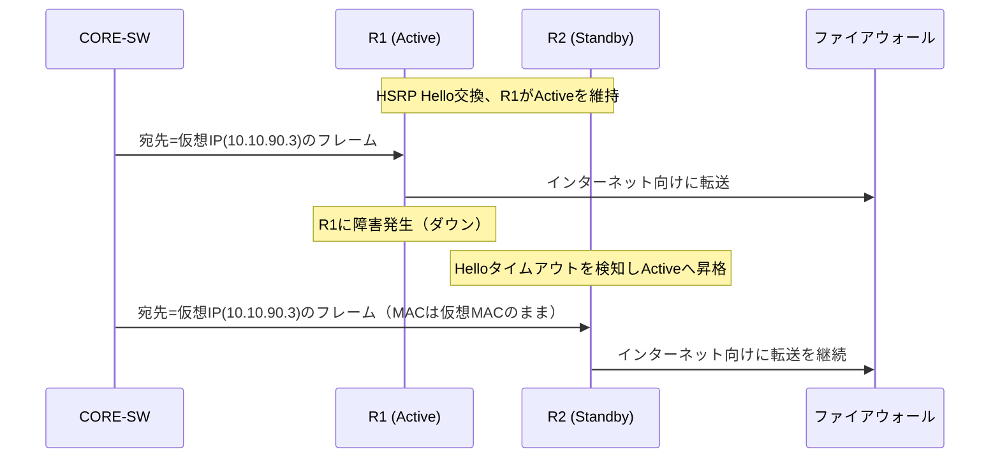
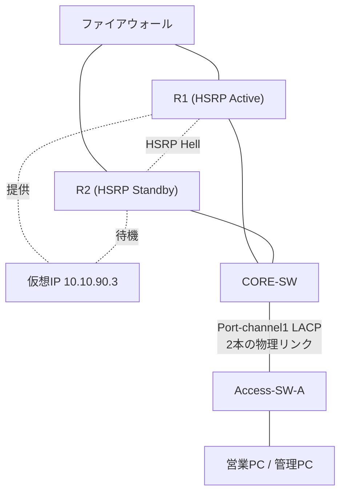

# 第7章 冗長化とループ防止

## 学習目標

この章を終えると、次のことができる。

1. レイヤー2ループとブロードキャストストームが発生する条件を説明できる
2. STP（Spanning Tree Protocol）とRSTP（Rapid Spanning Tree Protocol）を、ルートブリッジ、ポートロール、ポート状態の観点から説明できる
3. EtherChannelとLACP（Link Aggregation Control Protocol）の目的と設定要点を説明できる
4. HSRP（Hot Standby Router Protocol）とVRRP（Virtual Router Redundancy Protocol）の違いを、ベンダー固有か標準かという観点で区別できる
5. 本社R1・R2のゲートウェイ冗長化を、具体的な設計と設定として構成できる

---

## 7.1 この章で学ぶこと

第6章では、OSPFによってR1・R2の両方が経路情報を提供し、経路レベルでの冗長性を確保した。

しかし、冗長化には経路計算とは別の側面もある。

1つは、物理的なリンクを冗長化したときに新たに生まれる、レイヤー2の**ループ**という問題である。

もう1つは、R1やR2そのものが停止したときに、末端の機器や設定を変更することなく、瞬時に代替経路へ切り替える仕組みである。

OSPFによる経路の再計算にも一定の時間がかかり、また、すべての機器がOSPFのようなダイナミックルーティングに対応しているとは限らない。

この章では、L2の冗長化を支えるSTP・RSTPと、帯域集約とループ回避を両立するEtherChannel、そしてL3のデフォルトゲートウェイを冗長化するHSRP・VRRPを扱う。

最終的に、本社のR1・R2を使った具体的なゲートウェイ冗長化構成を組み立てる。

---

## 7.2 冗長化が必要になった背景

単一の機器や単一のリンクだけに依存したネットワークは、故障がそのままサービス停止に直結する。

この単一障害点（Single Point of Failure）をなくすための素朴な発想は、「重要な区間は物理的に2本以上のリンクや機器で構成する」というものである。

ところが、レイヤー2のネットワークでこれを単純に行うと、新たな問題が生じる。

スイッチは、宛先MACアドレスが不明なフレームやブロードキャストフレームを、受信ポート以外のすべてのポートへ送り出す（フラッディングする）。

もしスイッチ間に物理的な冗長リンクがあり、それがループ状に接続されていると、フラッディングされたフレームが行き場を失わず、ネットワーク内を永久に回り続けてしまう。

さらに、そのフレームがループするたびに複製され、ネットワーク全体の帯域とスイッチのCPU資源を急速に消費し尽くす、**ブロードキャストストーム**という状態に陥る。

L2の冗長化には、「物理的には複数の経路を用意しつつ、論理的には常に1つのループのない経路だけを使う」という仕組みが必要であり、これがSTPが生まれた背景である。

一方、L3側では、デフォルトゲートウェイとなるルーターが1台しかない構成では、そのルーターの故障がネットワーク全体の外部通信を止めてしまう。

多くの端末は、静的に設定された1つのデフォルトゲートウェイしか認識できない。

この制約の中でゲートウェイを冗長化するために生まれたのが、HSRPやVRRPである。

---

## 7.3 基本概念

### 7.3.1 L2ループとブロードキャストストーム

**L2ループ**とは、スイッチ間の物理的な接続が環状（ループ状）になっている状態である。

ループが存在すると、次の3つの問題が同時に発生し得る。

1. **ブロードキャストストーム**：ブロードキャストフレームがループ内を回り続け、複製されながら帯域を消費し尽くす
2. **MACアドレステーブルの不安定化**：同じ送信元MACアドレスを持つフレームが、複数のポートから交互に到着するように見え、スイッチがMACアドレステーブルを頻繁に書き換え続ける
3. **フレームの重複配信**：同じフレームの複数のコピーが、異なる経路を経由して受信側に到着する

これらは、冗長化のために意図的に用意した複数のリンクが、対策なしにそのまま有効化された場合に起こる。

STPは、この問題に対して「物理的な冗長リンクは残しつつ、論理的には特定のリンクを一時的に非使用（ブロッキング）状態にすることで、常にループのない木構造（スパニングツリー）を維持する」という解決策を取る。

### 7.3.2 STP

**STP**（Spanning Tree Protocol：スパニングツリープロトコル）は、IEEE 802.1Dで標準化された、L2ネットワークにおけるループ防止プロトコルである。

STPは、次の手順でループのない論理トポロジーを構築する。

1. **ルートブリッジの選出**：ネットワーク内のすべてのスイッチが、ブリッジID（プライオリティ値とMACアドレスの組み合わせ）を交換し、最も小さいブリッジIDを持つスイッチを**ルートブリッジ**として選出する
2. **ルートポートの決定**：ルートブリッジ以外の各スイッチは、ルートブリッジまでの経路コストが最小になるポートを**ルートポート**として選ぶ
3. **指定ポートの決定**：各セグメント（リンク）ごとに、ルートブリッジへの経路コストが最小のポートを**指定ポート**として選び、そのセグメント上でのフレーム転送を担当させる
4. **非指定ポートのブロッキング**：ルートポートにも指定ポートにも選ばれなかったポートは、フレームを転送しない状態（ブロッキング）にする

この結果、ネットワーク全体が、ルートブリッジを根とする、ループのない論理的な木構造として動作する。

STPの大きな欠点は、トポロジー変化（リンク障害やスイッチ追加）に対する収束の遅さである。

既定のタイマー設定では、ポートがブロッキングからフォワーディングへ遷移するまでに、30秒から50秒程度かかることがある。

### 7.3.3 RSTP

**RSTP**（Rapid Spanning Tree Protocol：高速スパニングツリープロトコル）は、STPの収束の遅さを改善したプロトコルであり、当初IEEE 802.1wとして標準化され、その後IEEE 802.1D-2004に統合され、現在はIEEE 802.1Q規格群の一部として扱われている。

RSTPは、STPと同じくルートブリッジを選出し、ループのない木構造を作るという基本原理は共通しているが、次の点で高速化を実現している。

- タイマーによる待機ではなく、隣接スイッチ間の**提案・合意（Proposal/Agreement）**の仕組みによって、条件が整い次第すぐにポートをフォワーディング状態へ遷移させる
- ポート状態を、STPの5状態（Disabled、Blocking、Listening、Learning、Forwarding）から、Discarding、Learning、Forwardingの3状態に整理している
- 待機系のポートに、後述する**代替ポート**と**バックアップポート**という役割を新たに定義し、障害時にすぐ使えるよう準備しておく

現在のCisco製スイッチの多くは、既定でRSTP、またはRSTPをベースにVLANごとに独立したインスタンスを持たせたPVST+/Rapid PVST+で動作する。

CCNAの学習としては、「STPが基本原理、RSTPがその高速化版」という関係を押さえておく。

### 7.3.4 ルートブリッジ、ポートロール、ポート状態

#### ルートブリッジ

**ルートブリッジ**は、STP/RSTPのトポロジー計算における基準点となるスイッチである。

ブリッジID（プライオリティ+MACアドレス）が最も小さいスイッチが自動的に選ばれるが、実運用では、意図したスイッチ（多くはコアやディストリビューション層のスイッチ）を確実にルートブリッジにするため、プライオリティ値を明示的に下げて設定することが一般的である。

#### ポートロール（役割）

| ポートロール | 意味 |
|--------------|------|
| ルートポート | 非ルートブリッジ上で、ルートブリッジまでの最小コスト経路となるポート（1台につき1つ） |
| 指定ポート | 各セグメントでフレームを転送する担当となるポート |
| 代替ポート（RSTP） | ルートポートの代替候補となる非転送ポート |
| バックアップポート（RSTP） | 同一セグメント上の指定ポートの代替候補となる非転送ポート |
| ブロッキングポート（STP） | どの役割にも選ばれず、転送を行わないポート |

#### ポート状態

| STPの状態 | RSTPの状態 | 転送 | MAC学習 |
|-----------|------------|------|---------|
| Blocking | Discarding | しない | しない |
| Listening | Discarding | しない | しない |
| Learning | Learning | しない | する |
| Forwarding | Forwarding | する | する |

RSTPはBlockingとListeningを区別せず、まとめてDiscardingとして扱うことで、状態遷移の判断を単純化し、高速化を実現している。

### 7.3.5 EtherChannelとLACP

**EtherChannel**とは、複数の物理リンクを束ねて、1本の論理的なリンクとして扱うCiscoの用語である。

複数リンクを束ねる目的は大きく2つある。

1. **帯域の集約**：複数の物理リンクの帯域を合算して使える
2. **冗長性の確保**：束ねた中の1本が故障しても、残りのリンクで通信を継続できる

STPは、EtherChannelを1本の論理ポートとして認識するため、束ねたリンクの一部がSTPによってブロッキングされることはない。

これにより、単純な冗長リンクでは片方が常にブロッキングされ帯域が無駄になっていた状況を避け、複数リンクをすべてアクティブに使いながら、ループも防止できる。

EtherChannelを構成するリンク同士のネゴシエーションには、次の方式がある。

| 方式 | 標準／固有 | 概要 |
|------|-----------|------|
| LACP（Link Aggregation Control Protocol） | IEEE標準（元々802.3ad、現在は802.1AXの一部） | 双方が動的にネゴシエーションしてチャネルを形成する |
| PAgP（Port Aggregation Protocol） | Cisco固有 | LACPと同様の役割をCisco独自の方式で実現する |
| static（on モード） | ベンダー非依存の静的設定 | ネゴシエーションを行わず、双方を強制的にチャネル化する |

LACPはIEEEによる標準規格であるため、他ベンダーの機器との相互接続でも利用できる。

このため、実務ではPAgPよりもLACPが選ばれることが多い。

`on` モードによる静的な構成は、ネゴシエーションが一切行われないため、片方の設定ミスに気づきにくく、意図しないループや誤ったチャネル構成につながりやすい。

### 7.3.6 HSRP（Cisco固有）

**HSRP**（Hot Standby Router Protocol：ホットスタンバイルータプロトコル）は、複数のルーター（またはL3スイッチ）が、共通の仮想IPアドレスと仮想MACアドレスを共有し、1台をActive、残りをStandbyとして動作させることで、デフォルトゲートウェイを冗長化するプロトコルである。

HSRPはCisco固有のプロトコルであり、参考情報としてRFC 2281が存在するが、これはIETFの標準化トラック（Standards Track）ではなく、Informational（情報提供）扱いの文書である。

HSRPの基本動作は次のとおりである。

1. 複数台のルーターが、同じHSRPグループ番号と、共通の仮想IPアドレスを設定する
2. 各ルーターがHelloメッセージを交換し、プライオリティが最も高いルーターが**Active**になる
3. Activeルーターだけが、仮想IP・仮想MACアドレス宛のトラフィックを実際に処理する
4. 残りのルーターは**Standby**（またはListen）状態で待機し、Activeルーターの障害を検知すると、次にプライオリティの高いルーターが新たにActiveへ昇格する

端末側は、デフォルトゲートウェイとして仮想IPアドレスだけを設定しておけばよく、実際にどちらの物理ルーターが応答しているかを意識する必要がない。

`preempt` を設定しておくと、一度Standbyへ回った旧Activeルーターが復旧した際、プライオリティに従って再びActiveへ戻ることができる。

また、`track` 機能を使うと、特定のインターフェース（たとえばインターネット側の回線）がダウンした際にプライオリティを自動的に下げ、実際にインターネットへ到達できるルーターの方をActiveにする、といった制御も可能である。

### 7.3.7 VRRP（標準）

**VRRP**（Virtual Router Redundancy Protocol：仮想ルータ冗長プロトコル）は、HSRPと同様の目的、すなわちデフォルトゲートウェイの冗長化を実現する、IETFによる標準プロトコルである。

VRRPv2はRFC 3768、VRRPv3はRFC 5798で標準化されており、ベンダーを問わず利用できる。

VRRPとHSRPは概念的に似ているが、用語や一部の動作が異なる。

| 概念 | HSRP（Cisco固有） | VRRP（標準） |
|------|--------------------|---------------|
| 主系の呼び名 | Active | Master |
| 副系の呼び名 | Standby | Backup |
| グループ識別子 | グループ番号 | 仮想ルータID（VRID） |
| 仮想IPアドレス | 常に実在インターフェースとは別の仮想アドレス | 条件によっては、Masterの実インターフェースIPそのものを仮想IPとして使える（IPアドレスオーナー） |
| 相互運用性 | Cisco機器間のみ | 標準規格のため異なるベンダー間でも利用可能 |

複数ベンダーの機器が混在する環境や、標準規格への準拠が求められる環境ではVRRPが選ばれ、Cisco機器のみで構成され、`track` などCisco独自の付加機能を積極的に使いたい場合はHSRPが選ばれる、という使い分けが一般的である。

CCNAの学習としては、「HSRPはCisco固有、VRRPは標準」という区別を明確に持っておくことが重要である。

---

## 7.4 冗長化構成の考え方と通信の流れ

通貫シナリオでは、次の2種類の冗長化を組み合わせる。

1. **L2の冗長化**：アクセススイッチとコアスイッチの間に物理的な冗長リンクを用意し、STP/RSTPでループを防ぎつつ、EtherChannelで両方のリンクを有効活用する
2. **L3の冗長化**：R1・R2が共有セグメント上でHSRPを構成し、コアスイッチのデフォルトルートの次ホップとなる仮想IPアドレスを常に到達可能に保つ

### L2側の考え方

第5章の構成では、Access-SW-AとCORE-SWの間は1本のトランクリンクだけであった。

単一リンクは、そのリンク自体が単一障害点になる。

そこで、Access-SW-AからCORE-SWへ2本目の物理リンクを追加することを考える。

2本の独立したトランクリンクをそのまま有効化すると、L2ループが発生してしまうため、次のいずれかの対策を取る。

- 何もしなければSTP/RSTPが自動的に片方をブロッキングし、ループを防ぐ（ただし片方の帯域は使われない）
- 2本のリンクをEtherChannelとして束ね、1本の論理リンクとして扱う（両方の帯域を使いながらループも防げる）

通貫シナリオでは、後者のEtherChannel（LACP）による構成を採用する。

### L3側の考え方

第6章では、R1・R2がそれぞれ独立にOSPFのデフォルトルートを広告し、ECMPによってCORE-SWから見て2本の等コストな経路が存在する状態を作った。

これは経路レベルでは有効だが、ステートフルなファイアウォールが絡む区間では非対称経路の問題が生じ得ることを第6章で述べた。

このため、実際の設計としては、CORE-SWからインターネット方向への経路を、ECMPによる分散ではなく、HSRPによる常に1つのActive経路への集約に切り替える。

具体的には、R1・R2が共有セグメント（10.10.90.0/29）上でHSRPグループを構成し、仮想IP（10.10.90.3）をActiveなルーターだけが応答する。

CORE-SWは、OSPFで2本の経路を学習するのではなく、この仮想IPを次ホップとする単一の静的デフォルトルートを持つ構成に変更する。

これにより、通常時は常に同じルーター（例：R1）を経由し、往路と復路が一致する対称的な経路が維持される。

R1に障害が発生した場合は、HSRPのフェイルオーバーによって、端末側やCORE-SW側の設定を一切変更することなく、数秒以内にR2が仮想IPの処理を引き継ぐ。



CORE-SW側は、宛先MACアドレスとしてHSRPの仮想MACアドレスを使い続けているだけであり、実際にどちらの物理ルーターが応答しているかを意識しない。

これが、HSRPが端末やL3スイッチの設定変更なしに冗長化を実現できる理由である。

---

## 7.5 構成例

L2とL3、両方の冗長化を反映した構成を示す。



この構成の設計意図は次のとおりである。

- CORE-SWのデフォルトルートは、R1・R2個別のIPではなく、HSRPの仮想IP（10.10.90.3）を次ホップとする
- Access-SW-AとCORE-SW間の物理リンクは2本用意し、EtherChannel（LACP）で1本の論理リンクとして扱う
- OSPFは、部署間・支社向けの経路情報の交換には引き続き利用し、インターネット向けのデフォルトルートについてはHSRPによるActive/Standby構成へ切り替える

---

## 7.6 Cisco IOSの設定例

### Access-SW-AとCORE-SW間のEtherChannel（LACP）

```cisco
Access-SW-A(config)# interface range GigabitEthernet1/0/23-24
Access-SW-A(config-if-range)# channel-group 1 mode active
Access-SW-A(config-if-range)# exit

Access-SW-A(config)# interface Port-channel1
Access-SW-A(config-if)# switchport trunk encapsulation dot1q
Access-SW-A(config-if)# switchport mode trunk
Access-SW-A(config-if)# switchport trunk native vlan 99
Access-SW-A(config-if)# switchport trunk allowed vlan 10,30,99
Access-SW-A(config-if)# switchport nonegotiate
```

```cisco
CORE-SW(config)# interface range GigabitEthernet1/0/1-2
CORE-SW(config-if-range)# channel-group 1 mode active
CORE-SW(config-if-range)# exit

CORE-SW(config)# interface Port-channel1
CORE-SW(config-if)# switchport trunk encapsulation dot1q
CORE-SW(config-if)# switchport mode trunk
CORE-SW(config-if)# switchport trunk native vlan 99
CORE-SW(config-if)# switchport trunk allowed vlan 10,30,99
CORE-SW(config-if)# switchport nonegotiate
```

主要パラメータの意味は次のとおりである。

- `channel-group 1 mode active`：LACPを使い、能動的にネゴシエーションを行ってEtherChannelを形成する（`passive` は相手からの提案を待つ受動モード）
- `interface Port-channel1`：束ねた物理リンクを表す論理インターフェース。トランク設定はこの論理インターフェースに対して行う
- 物理インターフェース側（`GigabitEthernet1/0/1` など）に個別のswitchport設定を残すと、論理インターフェース側の設定と競合する可能性があるため、通常はPort-channel側にまとめる

両端で `channel-group` の番号自体を一致させる必要はないが、モード（activeとactive、またはactiveとpassiveの組み合わせ）や、トランクの許可VLAN・ネイティブVLANの設定は一致させる必要がある。

### STPのルートブリッジ指定（参考、EtherChannel適用後の残りのループ対策）

```cisco
CORE-SW(config)# spanning-tree vlan 10,20,30,99 priority 4096
```

コアスイッチのプライオリティ値を明示的に下げることで、意図的にCORE-SWをルートブリッジに固定する。

プライオリティ値は4096刻みで設定でき、値が小さいほど優先される。

### HSRPの設定（R1、R2）

```cisco
R1(config)# interface GigabitEthernet0/1
R1(config-if)# ip address 10.10.90.1 255.255.255.248
R1(config-if)# standby 10 ip 10.10.90.3
R1(config-if)# standby 10 priority 150
R1(config-if)# standby 10 preempt
R1(config-if)# standby 10 track GigabitEthernet0/0 20
```

```cisco
R2(config)# interface GigabitEthernet0/1
R2(config-if)# ip address 10.10.90.2 255.255.255.248
R2(config-if)# standby 10 ip 10.10.90.3
R2(config-if)# standby 10 priority 100
R2(config-if)# standby 10 preempt
```

主要パラメータの意味は次のとおりである。

- `standby 10 ip 10.10.90.3`：HSRPグループ10の仮想IPアドレスを指定する。両ルーターで同じグループ番号・同じ仮想IPを指定する
- `standby 10 priority 150`：プライオリティ値。値が大きいほど優先され、Activeになりやすい。R1を通常時のActiveにするため、既定値100より高い150を設定している
- `standby 10 preempt`：自分がより高いプライオリティを持つと判断した場合、既にActiveが存在していても、そのActiveの座を奪い返す動作を許可する
- `standby 10 track GigabitEthernet0/0 20`：R1のインターネット側インターフェース（GigabitEthernet0/0）がダウンした場合、プライオリティを20下げる。これにより、R1のインターネット側リンクが切れた際、R1のプライオリティが130まで下がり、R2（100）より低くなればR2にActiveが移る、という制御ができる（下げ幅は実際のプライオリティ差を踏まえて設計する）

CORE-SW側のデフォルトルートは、次のように仮想IPを次ホップとする静的経路に変更する。

```cisco
CORE-SW(config)# no ip route 0.0.0.0 0.0.0.0
CORE-SW(config)# ip route 0.0.0.0 0.0.0.0 10.10.90.3
```

### 確認コマンド

```cisco
! EtherChannelの状態、束ねているポート、プロトコル（LACP）を確認する
Switch# show etherchannel summary

! STPのルートブリッジ、ポートロール、ポート状態を確認する
Switch# show spanning-tree vlan 10

! HSRPのグループ状態（Active/Standby）、仮想IP、プライオリティを確認する
R1# show standby brief
R1# show standby GigabitEthernet0/1
```

`show standby brief` で `State` が `Active` になっているルーターが、実際に仮想IP宛のトラフィックを処理しているルーターである。

`show etherchannel summary` の出力で、ポートの状態が `P`（bundled、正常に束ねられている）になっているかを必ず確認する。

`I`（individual）のままの場合、ネゴシエーションが成立せず、そのポートは論理リンクに参加できていない。

### VRRPの参考設定（標準プロトコルとしての比較）

```cisco
R1(config-if)# vrrp 10 ip 10.10.90.3
R1(config-if)# vrrp 10 priority 150
R1(config-if)# vrrp 10 preempt
```

コマンド体系はHSRPとよく似ているが、キーワードが `standby` ではなく `vrrp` になる。

VRRPでは、Masterルーターの実インターフェースIPそのものを仮想IPとして使う「IPアドレスオーナー」という構成も可能であり、この点がHSRPとの設計上の違いの1つである。

---

## 7.7 LinuxおよびWindowsでの確認

エンドホストからは、実際にどちらの物理ルーターが応答しているかを直接知ることはできないが、疎通性とMACアドレスの変化から間接的に確認できる。

### Windows

```bat
:: デフォルトゲートウェイ（仮想IP）への疎通確認
ping 10.10.90.3

:: ARPキャッシュを確認し、ゲートウェイの仮想MACアドレスを確認する
arp -a

:: フェイルオーバー前後でMACアドレスが変わらないことを確認する
```

HSRP/VRRPでは、Active/Standbyが切り替わっても仮想MACアドレスは変わらないため、端末のARPキャッシュを更新する必要がなく、切り替えが高速に行える。

### Linux

```bash
# デフォルトゲートウェイへの疎通確認
ping -c 4 10.10.90.3

# ARP／近隣キャッシュを確認する
ip neigh show

# ルーティングテーブル上のデフォルトゲートウェイを確認する
ip route show default
```

フェイルオーバーの検証を行う場合、Active側のルーターをshutdownし、`ping` が数パケット失敗した後に自動的に再開すること、`ip neigh` 上の仮想IPに対応するMACアドレスが変化しないことを確認するとよい。

---

## 7.8 よくある誤解

1. **「冗長リンクを増やせば増やすほど、ネットワークは安定する」**
   ループ防止の仕組み（STP/RSTP）やリンク集約（EtherChannel）を適切に設計しなければ、リンクを増やすこと自体がブロードキャストストームのリスクを高める。

2. **「EtherChannelを組めば、STPは不要になる」**
   EtherChannelはSTPが不要になるわけではなく、束ねたリンクをSTPから見て1本の論理ポートとして扱わせることで、ブロッキングによる帯域の無駄を避ける仕組みである。EtherChannelの外側に別の物理冗長リンクがあれば、STPは引き続き必要である。

3. **「HSRPとVRRPはコマンドが違うだけで、完全に同じもの」**
   基本的な目的と動作原理は似ているが、HSRPはCisco固有、VRRPは標準規格であり、ベンダー間の相互運用性や、仮想IPの扱い（IPアドレスオーナーの有無）など、細部の設計に違いがある。

4. **「Active/Standby構成では、Standby側のルーターは何もしていない」**
   Standby側もHelloメッセージの送受信やOSPFなどのルーティングプロトコル処理は継続しており、仮想IP宛のトラフィック処理だけを行っていない状態である。障害検知や経路計算自体は通常どおり動作している。

5. **「STPさえ動いていれば、ループは絶対に起きない」**
   誤ったポートの `spanning-tree portfast` 設定や、STPが正しく動作しないハブなどの中間装置が混在すると、STPの前提が崩れ、ループが発生し得る。STPは万能ではなく、設計と設定の正しさが前提になる。

---

## 7.9 代表的な障害

| 症状 | ありがちな原因 |
|------|----------------|
| ネットワーク全体が急激に重くなり、スイッチのCPU使用率が急上昇する | 冗長リンクにおけるSTPの機能不全、またはSTPが無効化された状態でのループ |
| EtherChannelを組んだはずのポートが、片方しか使われていない | 両端のモード不一致（`active`と`on`の組み合わせなど）や、許可VLAN・ネイティブVLANの不一致 |
| HSRPのActiveが想定外のルーターになっている | プライオリティ設定の誤り、`preempt` の設定漏れ |
| インターネット回線障害時にActiveが切り替わらない | `track` の対象インターフェースの設定漏れ、または下げ幅の設計不足 |
| STPの収束後、特定のポートだけがずっとブロッキングのまま | ルートブリッジやパスコストの設計ミスにより、意図しないポートが非指定ポートになっている |

---

## 7.10 トラブルシューティング手順

1. **物理層の確認**：冗長化対象のリンクがすべてup/upであるかを確認する
2. **STPの状態確認**：`show spanning-tree vlan X` で、ルートブリッジがどのスイッチになっているか、各ポートの役割・状態を確認する
3. **EtherChannelの状態確認**：`show etherchannel summary` で、対象ポートがbundled状態か、除外されているポートがないかを確認する
4. **HSRP/VRRPの状態確認**：`show standby brief`（または `show vrrp brief`）で、期待するルーターがActive/Masterになっているかを確認する
5. **フェイルオーバーの検証**：意図的にActive側をshutdownし、Standby側が正しく昇格するか、切り替え時間が許容範囲かを確認する
6. **上位層の疎通確認**：L2・L3の冗長化構成が正常でも、上位のACLやルーティング設定に問題がないかを合わせて確認する

冗長化構成の障害は、「冗長化していたはずなのに実際には片系しか機能していなかった」というケースが多いため、平常時から定期的にフェイルオーバー試験を行うことが重要である。

---

## 7.11 設計・運用上の注意点

1. **ルートブリッジの位置を明示的に固定する**
   自動選出に任せず、コアやディストリビューション層のスイッチに低いプライオリティを設定し、意図したトポロジーを確実に作る。

2. **未使用ポートにはPortFastを使わない**
   `spanning-tree portfast` は、STPの初期状態遷移を高速化するが、スイッチ同士を接続するポートに誤って設定すると、ループ検出が遅れる原因になる。エンドホスト専用のアクセスポートにのみ使用する。

3. **EtherChannelのモードは両端で整合させる**
   `active`同士、または`active`と`passive`の組み合わせを使い、`on`モードによる強制構成は極力避ける。

4. **HSRP/VRRPのプライオリティとpreemptの組み合わせを明文化する**
   どちらの機器を通常時のActiveにするか、障害復旧後に自動的に戻すかどうかを設計段階で決め、ドキュメント化しておく。

5. **track機能の下げ幅は実際のプライオリティ差を踏まえて設計する**
   下げ幅が小さすぎると、リンク障害時にもActiveが切り替わらないままになる。

6. **フェイルオーバーは定期的に実機で検証する**
   設定上は冗長化されていても、実際に切り替わるかどうかは、定期的な訓練や保守作業のタイミングで検証しておく。

---

## 7.12 要点まとめ

- L2の冗長リンクは、対策なしではループとブロードキャストストームを引き起こす
- STPはIEEE 802.1Dの標準であり、ルートブリッジ、ポートロール、ポート状態によってループのない論理トポロジーを構築する
- RSTPはSTPを高速化したプロトコルであり、提案・合意の仕組みで秒単位の収束を実現する
- EtherChannelは複数の物理リンクを1本の論理リンクとして扱い、帯域集約とループ回避を両立する。LACPは標準規格、PAgPはCisco固有である
- HSRPはCisco固有、VRRPは標準のゲートウェイ冗長化プロトコルであり、いずれも仮想IP・仮想MACによってActive/Standby（Master/Backup）を切り替える
- OSPFによるECMPは経路レベルの冗長化に有効だが、ステートフルな装置がある区間ではHSRP/VRRPによるActive/Standby構成が選ばれることがある
- 冗長化構成は、設定しただけでなく、定期的なフェイルオーバー検証によって実効性を確認する必要がある

---

## 7.13 章末問題

### 問題1

L2ループが存在する場合に起こり得る問題を2つ挙げよ。

### 問題2

STPにおけるルートポートと指定ポートの違いを説明せよ。

### 問題3

EtherChannelを組んでも、なおSTPが必要になる理由を説明せよ。

### 問題4

HSRPとVRRPの違いを、標準化の観点と用語の違いの2点から述べよ。

### 問題5

R1がHSRPのActiveであるにもかかわらず、R1のインターネット側回線が障害を起こしてもActiveの座がR2に移らない。考えられる設定上の原因を1つ挙げよ。

---

## 7.14 解答と解説

### 解答1

例：(1) ブロードキャストフレームがループ内を回り続け複製されることによるブロードキャストストーム。(2) 同じ送信元MACアドレスが複数のポートから交互に見えることによる、MACアドレステーブルの不安定化。

### 解答2

ルートポートは、非ルートブリッジのスイッチにおいて、ルートブリッジまでの経路コストが最小になるポートであり、1台のスイッチにつき1つ選ばれる。指定ポートは、各セグメント（リンク）ごとに、そのセグメント上でフレーム転送を担当するポートとして選ばれる。

### 解答3

EtherChannelの外側に、束ねられていない別の物理冗長リンクが存在する可能性があるためである。EtherChannel自体は束ねたリンクをSTPから見て1本の論理ポートとして扱わせる仕組みであり、ネットワーク全体のループ防止を代替するものではない。

### 解答4

標準化の観点では、HSRPはCisco固有のプロトコル（RFC 2281はInformational扱い）であるのに対し、VRRPはIETFによる標準プロトコル（RFC 3768／RFC 5798）である。用語の面では、HSRPの主系・副系はActive／Standbyと呼ばれるのに対し、VRRPではMaster／Backupと呼ばれる。

### 解答5

`standby track` の設定が行われていない、またはトラック対象のインターフェースが誤っている、あるいは下げ幅がR1とR2のプライオリティ差より小さく、回線障害時にもR1のプライオリティがR2を下回らないことが考えられる。

---

## 7.15 実機またはシミュレーター演習

Cisco Packet Tracer、GNS3、CML、実機のいずれかを使い、L2・L3双方の冗長化を再現する。

### 演習A：STPによるループ防止の観察

1. 3台のスイッチをループ状（三角形）に接続する
2. `show spanning-tree vlan 1` で、どのスイッチがルートブリッジになっているか、どのポートがブロッキングになっているかを確認する
3. ルートブリッジのプライオリティを明示的に変更し、ルートブリッジが切り替わることを確認する

### 演習B：EtherChannelの構成と検証

1. 2台のスイッチ間を2本の物理リンクで接続する
2. 両端で `channel-group X mode active` を設定し、Port-channelインターフェースとしてトランクを構成する
3. `show etherchannel summary` で、両ポートがbundled状態になっていることを確認する
4. 1本のリンクを意図的に切断し、残りのリンクだけで通信が継続することを確認する

### 演習C：HSRPのフェイルオーバー検証

1. 2台のルーターを同一セグメントに接続し、HSRPグループを構成する（仮想IP、プライオリティを演習用に設定する）
2. PCのデフォルトゲートウェイを仮想IPに設定し、pingを継続しながらActive側のルーターをshutdownする
3. pingが数パケット失敗した後に再開すること、`arp -a` 上のMACアドレスが変化しないことを確認する
4. shutdownを解除し、`preempt` の設定有無によってActiveの座が元のルーターに戻るかどうかの違いを確認する

---

## 次章への橋渡し

ここまでで、部署ごとのVLAN分離、本社・支社・インターネット間の経路、そしてL2・L3の冗長化という、通信を「成立させ、かつ止めない」ための土台が整った。

残る課題は、成立した通信の中で、どの通信を許可し、どの通信を拒否するかという制御である。

第8章では、NAT（Network Address Translation）による内部アドレスの変換と、ACL（Access Control List）による部署間・拠点間のアクセス制御、そしてスイッチ側のセキュリティ機能を扱う。
