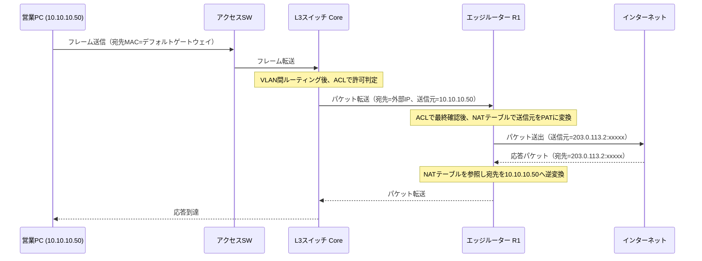
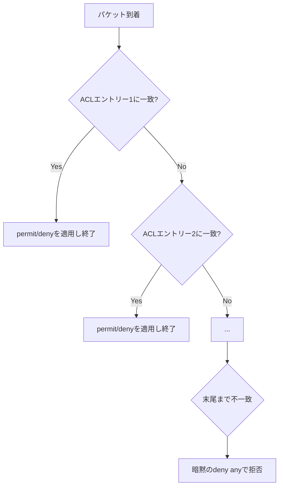

# 第8章 NAT、ACL、ネットワークセキュリティ

## 学習目標

この章を終えると、次のことができる。

1. スタティックNAT、ダイナミックNAT、PATの違いを、内部アドレスと外部アドレスの対応関係で説明し、通貫シナリオに適用できる
2. 標準ACLと拡張ACLを、評価順序と暗黙のdenyを踏まえて設計・設定できる
3. 最小権限の原則に基づき、部署間の通信を許可と拒否に分けて設計できる
4. ポートセキュリティ、DHCP Snooping、Dynamic ARP Inspectionが防ぐ攻撃を、それぞれ具体的に説明できる
5. 管理プレーンを保護するための基本的な設定方針を説明できる
6. NATとACLが絡む障害を、設定と通信方向の両面から切り分けられる

---

## 8.1 この章で学ぶこと

営業部のPCがインターネット上のSaaSへアクセスするとき、10.10.10.0/24という私設アドレスのまま外部へ出ることはできない。

インターネット上のルーターは、プライベートアドレスを宛先とする経路を持たないためである。

この変換を担うのがNAT（Network Address Translation：ネットワークアドレス変換）である。

一方、開発部のPCが営業部のファイルサーバーへ自由にアクセスできる状態は、部署分離の目的に反する。

この制御を担うのがACL（Access Control List：アクセス制御リスト）である。

この章では、通貫シナリオの本社ネットワークを題材に、外向き通信のアドレス変換（NAT）と、内向き・部署間通信の制御（ACL）を扱う。

あわせて、アクセススイッチが受け付ける不正な機器やパケットを防ぐポートセキュリティ、DHCP Snooping、Dynamic ARP Inspection（DAI）と、ネットワーク機器そのものへの不正アクセスを防ぐ管理プレーン保護を扱う。

いずれも、第5章のVLANによる論理分離、第6章のルーティング、第7章の冗長化の上に積み重なる制御である。

---

## 8.2 技術が必要になった背景

IPv4アドレスは32ビットであり、理論上の総数は約43億個である。

インターネットの商用化と端末数の急増により、この数は1990年代のうちに不足が現実的な懸念となった。

対策として、RFC 1918がプライベートアドレス空間（10.0.0.0/8、172.16.0.0/12、192.168.0.0/16）を定め、組織内部はこの範囲を自由に使い、外部との通信時にだけグローバルアドレスへ変換する運用が広まった。

この変換の仕組みがNATであり、現在では単なる延命策を超えて、内部アドレス構成を外部から隠す副次的な効果も実務上重視されている。

同時に、ネットワークが拡大するほど、「誰から誰への通信を許可するか」を明示する必要が高まった。

初期のネットワークは性善説に近い前提で運用されていたが、部署ごとに扱う情報の機密度が異なる企業では、部署間の通信を無条件に許可する設計はリスクになる。

ACLは、ルーターやL3スイッチを通過するパケットに対し、送信元・宛先・プロトコル・ポート番号などの条件で許可／拒否を判定する仕組みとして標準的に使われている。

さらに、スイッチのアクセスポートは、物理的に接続すれば誰でも通信を開始できる。

不正な機器の接続、偽のDHCPサーバー、ARPを悪用した盗聴といった攻撃は、L2の信頼関係を前提にした設計の弱点を突く。

ポートセキュリティ、DHCP Snooping、DAIは、この弱点を補うためにCisco IOSに実装された機能である。

---

## 8.3 基本概念

### 8.3.1 NATの種類と用途

NATは、パケットのIPヘッダに含まれる送信元または宛先のIPアドレスを、別のIPアドレスへ書き換える技術である。

用語を先に整理する。

- **インサイドローカルアドレス**：内部ネットワークで使われるプライベートアドレス（例：10.10.10.100）
- **インサイドグローバルアドレス**：内部ホストが外部から見えるときのグローバルアドレス（例：203.0.113.2）
- **アウトサイドローカルアドレス**：外部ホストが内部から見えるときのアドレス（多くの構成でグローバルアドレスと同一）
- **アウトサイドグローバルアドレス**：外部ホスト本来のグローバルアドレス

用途別に3種類を区別する。

**スタティックNAT**は、1つのインサイドローカルアドレスと1つのインサイドグローバルアドレスを固定的に1対1で対応づける。

通貫シナリオでは、業務サーバー（10.10.30.20）を取引先向けAPIとして公開する場合に使う。

外部から見た宛先アドレスが常に一定になるため、外部からの着信が必要なサーバー公開に向く。

**ダイナミックNAT**は、あらかじめ用意したグローバルアドレスのプール（複数個）から、内部ホストの通信発生時にアドレスを1つ割り当てる方式である。

1対1変換である点はスタティックNATと同じだが、対応関係は通信のたびに変わり得る。

グローバルアドレスの数だけしか同時通信できないため、内部ホスト数がグローバルアドレス数を超える環境では実務上あまり使われない。

CCNAの学習範囲としては重要だが、小規模拠点のインターネット接続では次に説明するPATが主流である。

**PAT**（Port Address Translation：ポートアドレス変換、NATオーバーロードとも呼ばれる）は、複数のインサイドローカルアドレスを、1つ（または少数）のインサイドグローバルアドレスに、送信元ポート番号を変えることで多重化する方式である。

営業・開発・管理の3部署、合計で数十台のPCが、1つのグローバルIPアドレスを共有してインターネットへ出られるのは、このポート番号による多重化のおかげである。

通貫シナリオの本社では、VLAN10・VLAN20・VLAN30からインターネットへの通信を、エッジルーターのPATで処理する設計を基本とする。

| 種別 | 対応関係 | グローバルアドレス消費 | 主な用途 |
|------|----------|------------------------|----------|
| スタティックNAT | 1対1（固定） | ホスト数分 | サーバー公開、外部からの着信 |
| ダイナミックNAT | 1対1（プールから動的） | ホスト数分（プール上限あり） | 学習用途、限定的な実運用 |
| PAT | 多対1（ポートで多重化） | 1個（または少数）で足りる | 拠点からのインターネット接続全般 |

### 8.3.2 ACLの種類と評価順序

ACLは、ルーターやL3スイッチのインターフェースを通過するパケットを、上から順に定義した条件（エントリー）と照合し、最初に一致したエントリーの許可（permit）または拒否（deny）を適用する仕組みである。

**標準ACL**は、送信元IPアドレスだけを条件にできる。

番号は1〜99、1300〜1999を使う。

宛先やポート番号を区別できないため、「特定のネットワーク全体からの通信をまとめて許可・拒否する」といった粗い制御に向く。

配置は、フィルタしたい対象にできるだけ近い場所、具体的には宛先に近いインターフェースが基本とされる。

送信元しか見えないため、ルーターの入口近くに置くと、本来届けたい別の宛先への通信まで巻き込みやすいからである。

**拡張ACL**は、送信元・宛先IPアドレス、プロトコル（TCP、UDP、ICMPなど）、ポート番号まで条件にできる。

番号は100〜199、2000〜2699を使う。

細かい制御ができる分、条件を送信元に近い場所に置いても意図どおりに絞り込める。

配置は、送信元にできるだけ近い場所が基本とされる。

不要な通信を早い段階で捨てれば、そのあとの経路やほかのACLに無駄な負荷をかけずに済む。

ACLの評価順序には、CCNA学習者がつまずきやすい3つの原則がある。

1. **上から順に評価**：エントリーはリストの先頭から順に照合され、最初に一致した時点で処理が確定する。それより下のエントリーは評価されない。
2. **暗黙のdeny**：どのエントリーにも一致しなかったパケットは、リストの末尾にある明示されていない `deny any` によって拒否される。これは表示されないが必ず存在する。
3. **方向とインターフェースの指定**：ACLはインターフェース単位、かつ`in`（入ってくる方向）または`out`（出ていく方向）を指定して初めて効力を持つ。作成しただけでは何も制御しない。

これら3原則を軽視すると、「許可したはずの通信が拒否される」「特定の1台だけ意図せず遮断される」といった障害の温床になる。

**最小権限の原則**は、業務上必要な通信だけを明示的に許可し、それ以外は拒否する設計方針である。

「疑わしい通信だけを拒否する」設計ではなく、「許可した通信以外はすべて拒否する」設計を基本にする。

通貫シナリオでは、次のような方針を例とする。

| 送信元 | 宛先 | 通信 | 方針 |
|--------|------|------|------|
| 営業部（VLAN10） | インターネット | HTTP/HTTPS、DNS | 許可 |
| 開発部（VLAN20） | 営業部（VLAN10） | 全般 | 原則拒否 |
| 開発部（VLAN20） | 業務サーバー（10.10.30.20） | TCP 443のみ | 限定許可 |
| 営業部・開発部 | DNSサーバー（10.10.30.10） | DNS（UDP/TCP 53） | 許可 |
| 営業部・開発部 | 管理部VLAN（VLAN30）全般 | 全般 | 原則拒否 |
| 管理部（VLAN30） | 全VLAN | 全般 | 許可（運用・監視のため） |

### 8.3.3 スイッチのアクセス層セキュリティ機能

ACLはL3の制御である一方、アクセススイッチのポートそのものを悪用する攻撃には、L2に近い層での対策が必要になる。

**ポートセキュリティ**は、スイッチの1ポートで許可するMACアドレスの数や種類を制限する機能である。

学習するMACアドレス数の上限を設定し、超過や未許可のMACアドレスからのフレームを検知した際の動作（違反アクション）を選べる。

未使用のハブや無許可のスイッチを勝手に増設し、多数の端末をぶら下げる行為や、MACアドレスを偽装した攻撃の抑止に使う。

**DHCP Snooping**は、スイッチがポートを「信頼（trusted）」と「非信頼（untrusted）」に分け、非信頼ポートからのDHCPサーバー応答（DHCPOFFER、DHCPACK）を破棄する機能である。

正規のDHCPサーバーへの経路にあるアップリンクポートだけを信頼ポートにする。

PCが接続するアクセスポートはすべて非信頼のままにする。

これにより、PCに接続された偽のDHCPサーバーが誤ったゲートウェイやDNSサーバーを配布する攻撃（ローグDHCP）を防ぐ。

DHCP Snoopingは、パケットの送信元IP・MAC・ポート・VLANの対応をバインディングテーブルとして記録する。

このテーブルは、次に説明するDAIが正当な通信かどうかを判定する際の根拠にもなる。

**DAI**（Dynamic ARP Inspection：動的ARP検査）は、ARPパケットの送信元IPアドレスとMACアドレスの対応が、DHCP Snoopingのバインディングテーブルと一致するかを検証し、一致しないARPパケットを破棄する機能である。

ARPには本来、要求に対する正当性の検証機構がなく、任意のホストが「このIPのMACは私です」と主張するARP応答を送りつけられる。

これを悪用したARPスプーフィング（ARPポイズニング）は、中間者攻撃（通信の盗聴・改ざん）の典型的な入口になる。

DAIは、DHCP Snoopingと組み合わせて、正規に払い出されたIP・MACの対応から外れるARP通信を遮断する。

これら3機能は独立しているが、実務ではセットで有効化することが多い。

DHCP Snoopingが土台となり、DAIがその情報を利用する構造を理解しておくと、設定順序や障害時の依存関係を追いやすい。

### 8.3.4 代表的なネットワーク攻撃

企業LANで想定すべき代表的な攻撃を整理する。

| 攻撃 | 概要 | 主な対策 |
|------|------|----------|
| MACアドレスフラッディング | 大量の偽MACアドレスを送りつけ、スイッチのMACアドレステーブルを溢れさせ、以降のフレームをフラッディング（全ポート送出）させて盗聴する | ポートセキュリティ |
| DHCP枯渇攻撃 | 偽の送信元MACで大量のDHCPDISCOVERを送り、アドレスプールを枯渇させる | DHCP Snooping、ポートセキュリティ |
| ローグDHCPサーバー | 不正なDHCPサーバーが誤ったゲートウェイ・DNSを配布し、通信を横取りする | DHCP Snooping |
| ARPスプーフィング | 偽のARP応答でMACアドレスの対応を書き換え、通信を中継・盗聴する | DAI |
| VLANホッピング | トランクネゴシエーションの悪用や二重タグ付けにより、本来所属しないVLANへフレームを送り込む | 未使用ポートのアクセスVLAN固定、ネイティブVLANの変更、DTPの無効化（第5章） |
| 総当たり・辞書攻撃 | 管理者アカウントのパスワードを機械的に試行する | 強固なパスワード、AAA、ログイン試行制限、SSH限定 |
| サービス拒否攻撃（DoS）／分散型サービス拒否攻撃（DDoS） | 大量の通信や不正なパケットで機器やリンクの処理能力を枯渇させる | ACLによるフィルタ、レート制限、上流ISP・クラウド型対策サービスとの連携 |
| 盗聴（スニッフィング） | 経路上のパケットを収集し、平文の認証情報などを取得する | 暗号化通信（SSH、HTTPS）、DAIによる中間者攻撃対策 |

DoSとDDoSはD（Denial of Service：サービス拒否）の頭文字を持ち、DDoSはそれが多数の送信元（Distributed：分散）から行われる形態である。

この章の範囲では、L2〜L3で完結する攻撃と対策を中心に扱い、上位層のアプリケーション攻撃（SQLインジェクションなど）は範囲外とする。

### 8.3.5 管理プレーンの保護

ここまでの制御は、主に利用者の通信（データプレーン）を対象にしてきた。

一方、ルーターやスイッチそのものへのログイン、設定変更の経路は**管理プレーン**と呼ばれ、乗っ取られた場合の被害がデータプレーンより大きくなりやすい。

管理プレーンを保護する基本方針は次のとおりである。

1. **暗号化された管理経路を使う**：Telnetは通信内容が平文であり、パスワードもそのまま流れる。SSH（Secure Shell）に統一し、VTY回線で`transport input ssh`を設定する（第1章で導入済み）。
2. **管理アクセス元を制限する**：標準ACLをVTY回線に適用し、管理部VLAN（10.10.30.0/24）など許可されたネットワークからのみログインを受け付ける。
3. **認証を個人単位にする**：共有の`enable`パスワードだけに頼らず、`username`ごとのローカルアカウント、または AAA（Authentication, Authorization, Accounting：認証・認可・アカウンティング）によるRADIUSやTACACS+サーバーとの連携を検討する。TACACS+とRADIUSはいずれも標準化された認証プロトコルだが、コマンド単位の認可記録に強いTACACS+はCisco環境で好まれてきた経緯がある。
4. **不要なサービスを止める**：`ip http server`など使わない管理インターフェースは無効化し、攻撃面を減らす。
5. **変更と状態を記録する**：syslogサーバーへログを転送し、NTP（第4章）で時刻を同期しておく。時刻がずれていると、複数機器のログを突き合わせた障害調査が成立しない。
6. **権限を段階化する**：Cisco IOSの特権レベル（privilege level）や、参照専用アカウントの用意により、すべての管理者に最上位権限を渡さない。

これらは個々の機能というより運用方針である。

次節以降のACL設定例は、この方針をVTYアクセス制限という形で具体化したものである。

---

## 8.4 通信や処理の流れ

営業部PC（10.10.10.50）が外部サイト（203.0.113.80など）へHTTPS通信するときの、NATとACLの処理順序を追う。



ここで押さえるべき順序が2つある。

第一に、ACLとNATがともに設定されている場合、パケットがインターフェースを通過する際の内部処理順序は、Cisco IOSの実装として、発信方向では「ルーティング判断 → 発信側ACL（outbound）評価 → NAT変換」に近い扱いになる場面が多いが、設計者が意識すべき実務上の要点は、**ACLの送信元／宛先アドレスを、変換前（インサイドローカル）と変換後（インサイドグローバル）のどちらで書くべきかを、設定するインターフェースとACLの適用方向に応じて正しく判断すること**である。

内部インターフェースに`ip nat inside`を、外部インターフェースに`ip nat outside`を設定し、ACLは変換対象を決める「トラフィック分類」として使う場面と、フィルタとして使う場面を区別して考えると混乱しにくい。

第二に、応答パケットが戻ってきたとき、ルーターはNATテーブル（変換テーブル）を参照して宛先を書き戻す。

このテーブルにエントリーがなければ、応答パケットは内部ホストへ届けようがない。

PATでは、この対応がポート番号込みで管理されるため、同一の内部ホストが複数の宛先へ同時に通信していても混線しない。

ACLの評価では、パケットは上から順に条件と照合され、最初に一致したエントリーで確定する。



この評価順序を理解していないと、「上に書いた広い条件が、下に書いた個別の許可条件を先に飲み込んでしまう」という典型的な設定ミスに気づけない。

---

## 8.5 構成例

通貫シナリオの本社に、NATとACLの適用点を書き込む。

```text
                         インターネット
                               |
                       203.0.113.1 (ISP)
                               |
                +--------------+--------------+
                |                             |
        203.0.113.2/28                203.0.113.3/28
        +-------+-------+             +-------+-------+
        | エッジR1 (Act)|<--- HSRP --->| エッジR2 (Sby)|
        +-------+-------+  仮想IP     +-------+-------+
                |         10.10.200.1          |
                |    10.10.200.0/28（Uplink）  |
                +--------------+---------------+
                               |
                        10.10.200.10
                     +---------+---------+
                     |  L3スイッチ Core  |
                     |  （VLAN間ルーティング、ACL適用点）
                     +--+------+------+--+
                        |      |      |
                 VLAN10 |VLAN20|VLAN30|
             10.10.10.1 |10.10.20.1|10.10.30.1
                        |      |      |
                  営業PC群  開発PC群  DNS/業務SRV/DHCP/管理PC
```

NATの適用点はエッジルーター（R1、R2）である。

`ip nat inside`はL3スイッチ側インターフェース、`ip nat outside`はISP側インターフェースに設定する。

ACLの適用点は主にL3スイッチのVLANインターフェース（SVI）であり、部署間通信を許可・拒否するフィルタとして働く。

VTYアクセス制限のACLは、各機器のVTY回線に個別に適用する。

支社（10.10.40.0/24）は、本社とのWAN／VPN経由でインターネットへ出る設計もあり得るが、通貫シナリオでは、支社ルーター（R_BR）が本社エッジルーターへの経路のみを持ち、インターネット向け通信は本社を経由してNATされる集約型の設計を採る。

これにより、インターネット出口を本社1か所に集約し、ACLとNATの管理点を最小化できる。

---

## 8.6 Cisco IOSの設定例

### 8.6.1 PAT（インターネット接続の基本形）

目的は、VLAN10・VLAN20・VLAN30の内部ホストが、エッジルーターの外部インターフェースアドレスを共有してインターネットへ出られるようにすることである。

```cisco
! 変換対象とする内部ネットワークを標準ACLで定義する
R1(config)# access-list 1 permit 10.10.10.0 0.0.0.255
R1(config)# access-list 1 permit 10.10.20.0 0.0.0.255
R1(config)# access-list 1 permit 10.10.30.0 0.0.0.255

! 内部側インターフェースを inside として宣言する
R1(config)# interface GigabitEthernet0/0
R1(config-if)# description to L3SW (Uplink VLAN)
R1(config-if)# ip address 10.10.200.2 255.255.255.240
R1(config-if)# ip nat inside
R1(config-if)# exit

! 外部側インターフェースを outside として宣言する
R1(config)# interface GigabitEthernet0/1
R1(config-if)# description to ISP
R1(config-if)# ip address 203.0.113.2 255.255.255.240
R1(config-if)# ip nat outside
R1(config-if)# exit

! ACL1に一致する送信元を、外部インターフェースのアドレスでオーバーロード変換する
R1(config)# ip nat inside source list 1 interface GigabitEthernet0/1 overload
```

主要パラメータの意味は次のとおりである。

- `access-list 1`：PAT対象とする「変換してよい内部ネットワーク」を指定する。ACLをフィルタではなく、NATの対象範囲を選ぶための分類として使っている点に注意する。
- `ip nat inside` / `ip nat outside`：そのインターフェースが内部側か外部側かをルーターに教える。この宣言がないと、NATはどちらの方向の変換か判断できない。
- `overload`：1つの外部アドレスを、ポート番号で多重化して複数ホストに共有させる。これがPATの実体である。

### 8.6.2 スタティックNAT（サーバー公開）

目的は、業務サーバー（10.10.30.20）を、取引先向けに固定のグローバルアドレスで公開することである。

```cisco
! インサイドローカル 10.10.30.20 を、インサイドグローバル 203.0.113.10 に固定で対応づける
R1(config)# ip nat inside source static 10.10.30.20 203.0.113.10

! 公開する範囲をポート単位に絞る場合（HTTPS のみ公開する例）
R1(config)# ip nat inside source static tcp 10.10.30.20 443 203.0.113.10 443 extendable
```

`extendable`は、同一の内部アドレスに対し、ポート単位のスタティックNATを複数併用する際にIOSが内部的に必要とするキーワードである。

ポート単位の公開と組み合わせることで、「HTTPSだけを外部公開し、それ以外の管理ポートは公開しない」という最小権限の考え方をNATの設定にも反映できる。

実務では、このNATだけで安全になるわけではなく、次項の拡張ACLで許可プロトコル・ポートをさらに絞り込む。

### 8.6.3 ダイナミックNAT(学習用途としての位置づけ)

目的は、限られた台数のグローバルアドレスプールを、通信の発生順に内部ホストへ割り当てることである。

```cisco
! グローバルアドレスのプールを定義する
R1(config)# ip nat pool DYNPOOL 203.0.113.11 203.0.113.14 netmask 255.255.255.240

! 変換対象とする内部ネットワークを定義する
R1(config)# access-list 2 permit 10.10.30.0 0.0.0.255

! ACL2に一致する送信元を、プールから1対1で動的に割り当てる
R1(config)# ip nat inside source list 2 pool DYNPOOL
```

この方式は、4個のグローバルアドレスに対し5台目のホストが通信しようとすると変換できず失敗するという制約を体感的に理解するために有用である。

実運用では、グローバルアドレスの調達コストとホスト数の関係から、ほとんどの拠点でPATが選ばれる。

ダイナミックNATは、CCNAの出題範囲としては重要だが、「なぜ実務でPATが主流なのか」を理解するための比較対象として位置づけると納得感がある。

### 8.6.4 標準ACL（管理アクセスの制限）

目的は、ルーターへのSSHログインを管理部VLANからのみ許可することである。

```cisco
R1(config)# access-list 10 permit 10.10.30.0 0.0.0.255
R1(config)# access-list 10 deny any log

R1(config)# line vty 0 4
R1(config-line)# access-class 10 in
R1(config-line)# transport input ssh
R1(config-line)# login local
```

`deny any log`は省略しても暗黙のdenyが働くが、明示して`log`キーワードを付けることで、拒否されたアクセス試行をログに残せる。

不正アクセスの試行を後から追跡する際、この記録の有無が調査効率を大きく左右する。

`access-class`は、VTY回線に標準ACLまたは拡張ACLを適用するためのコマンドであり、通常のインターフェースに使う`ip access-group`とは別のコマンドである点に注意する。

### 8.6.5 拡張ACL（部署間通信の制御）

目的は、次の方針をL3スイッチのSVIに実装することである。

- 開発部（VLAN20）から営業部（VLAN10）への通信は、原則拒否する
- 開発部から業務サーバー（10.10.30.20）へのTCP 443のみを許可する
- 全部署からDNSサーバー（10.10.30.10）へのDNS通信は許可する
- 開発部・営業部から管理部VLAN（VLAN30）全般への通信は、上記以外は拒否する

```cisco
L3SW(config)# ip access-list extended DEV_TO_MGMT_SALES
L3SW(config-ext-nacl)# remark 開発部から業務サーバーへのHTTPSのみ許可
L3SW(config-ext-nacl)# permit tcp 10.10.20.0 0.0.0.255 host 10.10.30.20 eq 443
L3SW(config-ext-nacl)# remark 全部署からDNSサーバーへの名前解決を許可
L3SW(config-ext-nacl)# permit udp 10.10.20.0 0.0.0.255 host 10.10.30.10 eq 53
L3SW(config-ext-nacl)# permit tcp 10.10.20.0 0.0.0.255 host 10.10.30.10 eq 53
L3SW(config-ext-nacl)# remark 管理部VLANへのそれ以外の通信、営業部VLANへの通信を拒否
L3SW(config-ext-nacl)# deny ip 10.10.20.0 0.0.0.255 10.10.30.0 0.0.0.255
L3SW(config-ext-nacl)# deny ip 10.10.20.0 0.0.0.255 10.10.10.0 0.0.0.255
L3SW(config-ext-nacl)# remark それ以外（インターネット向け等）は許可
L3SW(config-ext-nacl)# permit ip any any

L3SW(config)# interface Vlan20
L3SW(config-if)# ip access-group DEV_TO_MGMT_SALES in
```

主要パラメータの意味は次のとおりである。

- `remark`：ACLエントリーの意図をコメントとして残す。番号や条件式だけでは、後任者が設計意図を読み取れないことが多い。
- `permit tcp ... eq 443`：TCPかつ宛先ポート443（HTTPS）だけを許可する。プロトコルとポートまで指定できるのは拡張ACLの特徴である。
- `ip access-group ... in`：VLAN20のSVIに、VLAN20から入ってくる方向（in）のパケットへACLを適用する。方向を誤ると、意図した通信が制御対象から外れる。

最後の`permit ip any any`を書き忘れると、暗黙のdenyにより、この拡張ACLで言及していないあらゆる通信（インターネットアクセスを含む）まで拒否されてしまう。

拡張ACLを部署VLANの入口に置く設計では、この「言及していない通信をどう扱うか」を必ず明示する。

### 8.6.6 ポートセキュリティ

目的は、アクセスポートに接続してよい端末を1台に限定し、意図しない機器の増設や、MACアドレス詐称を検知することである。

```cisco
SW_A(config)# interface range GigabitEthernet1/0/1 - 24
SW_A(config-if-range)# switchport mode access
SW_A(config-if-range)# switchport port-security
SW_A(config-if-range)# switchport port-security maximum 1
SW_A(config-if-range)# switchport port-security mac-address sticky
SW_A(config-if-range)# switchport port-security violation restrict
```

主要パラメータの意味は次のとおりである。

- `maximum 1`：そのポートで学習を許可するMACアドレス数の上限。PC1台と決め打つなら1、IP電話配下にPCをぶら下げるなら2にするなど、実際の接続形態に合わせる。
- `mac-address sticky`：動的に学習した最初のMACアドレスを、あたかも静的設定のように保存する。再起動後も同じMACアドレスを正規として扱える。
- `violation restrict`：違反時にフレームを破棄しつつポートは生かし続け、ログとカウンタに記録する。`shutdown`（デフォルト、ポートを完全に停止しerr-disable状態にする）や`protect`（破棄のみでログを残さない）との違いを理解して選ぶ。

### 8.6.7 DHCP SnoopingとDAI

目的は、正規のDHCPサーバー（10.10.30.5）からの応答だけを許可し、アクセスポート側からの不正なDHCP応答やARP応答を遮断することである。

```cisco
! DHCP Snoopingをグローバルで有効化し、対象VLANを指定する
L3SW(config)# ip dhcp snooping
L3SW(config)# ip dhcp snooping vlan 10,20,30

! DHCPサーバーへの経路にあるアップリンクポートを信頼する
L3SW(config)# interface GigabitEthernet1/1/1
L3SW(config-if)# description Uplink to DHCP server side
L3SW(config-if)# ip dhcp snooping trust

! DAIを対象VLANで有効化する（DHCP Snoopingのバインディングテーブルを利用する）
L3SW(config)# ip arp inspection vlan 10,20,30

! DAIも同じアップリンクポートを信頼する
L3SW(config)# interface GigabitEthernet1/1/1
L3SW(config-if)# ip arp inspection trust
```

アクセススイッチ側でも同様に、PC収容ポートは`trust`を設定せず、非信頼のままにしておく。

信頼設定を誤ってPC収容ポートに適用すると、そのポートを経由した不正なDHCP応答やARP応答を検査対象から外してしまい、機能そのものが無力化する。

---

## 8.7 LinuxおよびWindowsでの確認例

NATとACLの効果は、ホスト側からも一部確認できる。

### Windows

```bat
:: 自ホストのIPアドレスを確認する（NAT前のインサイドローカルアドレス）
ipconfig

:: 特定ポートへの到達性を確認する（Windows PowerShell）
Test-NetConnection -ComputerName 10.10.30.20 -Port 443

:: 拒否されている場合、TcpTestSucceeded が False になる
```

### Linux

```bash
# 自ホストのIPアドレスを確認する
ip addr show

# 特定ポートへの到達性を確認する
nc -vz 10.10.30.20 443

# ICMPは通るがTCPだけ拒否される状況を切り分ける
ping -c 2 10.10.30.20
nc -vz 10.10.30.20 22
```

ホスト側から見えるのは「その通信が通ったか失敗したか」までであり、NATで変換された後のグローバルアドレスや、ACLでどの条件により拒否されたかまでは分からない。

変換後のアドレスやACLの一致状況は、ルーターやL3スイッチ側の確認コマンドで見る。

```cisco
! 現在のNAT変換テーブルを確認する
R1# show ip nat translations

! NAT統計（ヒット数、アクティブな変換数）を確認する
R1# show ip nat statistics

! ACLの内容と、各エントリーに何件マッチしたかを確認する
L3SW# show access-lists DEV_TO_MGMT_SALES

! インターフェースに適用されているACLを確認する
L3SW# show ip interface Vlan20 | include access list
```

`show access-lists`で表示されるマッチ件数（matches）は、ACLが実際に機能しているかを確認する最も基本的な手がかりである。

意図した拒否エントリーのマッチ件数が0のままなら、そもそもそのACLに到達する前に別の場所で処理が終わっている可能性を疑う。

---

## 8.8 よくある誤解

1. **「NATを設定すればセキュリティも確保される」**
   NATはアドレス変換であり、アクセス制御ではない。内部アドレスが外部から直接見えにくくなる副次効果はあるが、ACLやファイアウォールの代替にはならない。

2. **「ACLは1つ書けば双方向に効く」**
   ACLは適用したインターフェースと方向（in/out）にのみ効く。往路と復路を意図した場合は、通信の性質（ステートフルかどうか）と方向を個別に検討する必要がある。

3. **「拡張ACLは標準ACLより常に近くに置くべき」**
   より正確には、標準ACLは宛先に近く、拡張ACLは送信元に近く配置するのが基本原則である。「拡張だから常に送信元」という言葉だけを覚えると、標準ACLの配置原則を取り違える。

4. **「暗黙のdenyは、明示的にdenyを書いたときだけ働く」**
   暗黙のdenyは、ACLを1行でも作成すれば常に末尾に存在する。何も一致しなければ、書いていなくても拒否される。

5. **「ポートセキュリティを設定すれば、DHCP SnoopingやDAIは不要」**
   ポートセキュリティはMACアドレス単位の制御であり、正規のMACアドレスを使った攻撃(たとえば正規端末からのARPスプーフィング)は防げない。防御対象が異なるため、組み合わせて使う。

---

## 8.9 代表的な障害

| 症状 | ありがちな原因 | まず疑う設定 |
|------|----------------|--------------|
| 社内は通るがインターネットに全く出られない | `ip nat inside`／`outside`の設定漏れ、NAT用ACLの範囲誤り | インターフェースへのNAT宣言、NAT用ACL |
| 一部の部署だけインターネットに出られない | NAT用ACLに、その部署のネットワークが含まれていない | `access-list`の対象ネットワーク |
| 特定の相手先だけ通信できない | 拡張ACLの条件（ポート、プロトコル）の記述誤り | ACLのエントリー順序と条件 |
| 許可したはずの通信が拒否される | 広い条件のdenyがpermitより上に書かれている | ACLエントリーの順序 |
| 外部から公開サーバーへ到達できない | スタティックNATの設定漏れ、または拡張ACLでポートを許可していない | スタティックNAT、拡張ACLの双方 |
| 新しく増設したハブ配下の端末が使えない | ポートセキュリティのmaximum超過でerr-disable | `show interface status`、port-security違反カウンタ |
| DHCPでアドレスが取得できない | DHCP Snoopingの信頼ポート設定漏れで正規応答まで破棄 | `ip dhcp snooping trust`の付与先 |
| 同一VLAN内で突然通信不安定・盗聴の疑い | ARPスプーフィングの発生、DAI未導入 | DAIの有効化状況、`show ip arp inspection` |

---

## 8.10 トラブルシューティング手順

「社内は通るがインターネットに出られない」という典型的な訴えを例に、切り分け手順を示す。

1. **物理・L2確認**：該当ホストのリンク状態、VLAN所属を確認する（第2〜5章の範囲）。
2. **IP到達性の確認**：ホストからデフォルトゲートウェイへ`ping`が通るかを確認する。通らなければNAT/ACL以前のL3問題である。
3. **ゲートウェイから先の到達性確認**：L3スイッチやエッジルーターから、直接インターネット側の代表アドレスへ`ping`が通るかを確認する（ルーター自身の通信はNATの影響を受けない場合が多く、経路そのものの生死を先に切り分けられる）。
4. **NAT設定の確認**：`show running-config | section ip nat`で、`inside`/`outside`インターフェース宣言とNATルールの有無を確認する。
5. **NAT変換テーブルの確認**：問題のホストから通信を発生させた直後に`show ip nat translations`を確認し、変換エントリーが生成されているかを見る。生成されていなければ、対象ネットワークがNAT用ACLに含まれていない可能性が高い。
6. **ACLの確認**：`show access-lists`で、経路上のACLに意図しないdenyがヒットしていないかを確認する。
7. **戻りの経路確認**：外部から見た応答パケットが、正しくエッジルーターへ戻ってきているかを、ISP側のルーティングや非対称経路の有無も含めて確認する（第7章のHSRP切替と絡む場合は第10章のケーススタディも参照する）。

この順序は、「まず自分に近い層から、遠い層へ」という切り分けの基本方針(第1章)に、NAT/ACL特有の確認コマンドを組み込んだものである。

---

## 8.11 設計・運用上の注意点

1. **NAT対象ネットワークとACLの対象を、台帳として一元管理する**
   NAT用ACL、フィルタ用ACL、VTY用ACLが増えると、どのACLが何のために存在するかが分からなくなりやすい。`remark`の活用に加え、変更管理台帳を別途持つ。

2. **最小権限は「広く許可してから絞る」のではなく「狭く許可してから広げる」**
   最初から`permit ip any any`に近い設定をして後から制限するより、必要な通信を1つずつ許可し、最後に必要に応じて広い許可を足す方が、抜け漏れに気づきやすい。

2つの文で説明した設計思想は、拡張ACLの記述順序そのものに直結する。

3. **冗長構成のエッジルーターでは、NATの状態が同期されない前提で設計する**
   HSRPで default gateway を冗長化しても、PATの変換テーブルは各ルーターが個別に保持する。系切り替え時に、既存のセッションは切断される場合があることを運用者に周知する(詳細は第10章)。

4. **スタティックNATで公開する範囲は、ポート単位まで絞る**
   ホスト単位のスタティックNATだけに頼ると、意図しないポートまで到達可能になる。拡張ACLと組み合わせて、公開するサービスを明示する。

5. **DHCP SnoopingとDAIは、VLAN追加時に設定漏れが起きやすい**
   新しい部署VLANを追加した際、`ip dhcp snooping vlan`や`ip arp inspection vlan`の対象リストに追記し忘れると、そのVLANだけ保護が効かない状態になる。VLAN追加のチェックリストに組み込む。

---

## 8.12 要点まとめ

- NATはアドレス変換であり、スタティック（1対1固定）、ダイナミック（1対1動的）、PAT（多対1、ポート多重化）の3種類がある
- 拠点のインターネット接続では、グローバルアドレスを節約できるPATが主流であり、ダイナミックNATは比較として理解する
- ACLは標準（送信元のみ）と拡張（送信元・宛先・プロトコル・ポート）に分かれ、上から順に評価され、末尾に暗黙のdenyを持つ
- 最小権限の原則は、必要な通信だけを明示的に許可し、それ以外を拒否する設計方針である
- ポートセキュリティはMACアドレス数の制限、DHCP Snoopingは不正なDHCP応答の遮断、DAIはARPスプーフィングの検知に対応する
- 管理プレーンの保護は、SSH限定、アクセス元制限、個人単位の認証、不要サービスの停止、ログとNTPによる記録が基本になる
- NATとACLが絡む障害は、NAT変換テーブルとACLのマッチ件数を、ホストに近い側と遠い側の両方から確認して切り分ける

---

## 8.13 章末問題

### 問題1

スタティックNAT、ダイナミックNAT、PATのうち、通貫シナリオの本社が複数部署のインターネット接続に使うべき方式はどれか。理由とともに述べよ。

### 問題2

標準ACLと拡張ACLの違いを、条件に指定できる項目と、推奨される配置場所の観点から説明せよ。

### 問題3

拡張ACLで「開発部から業務サーバーへのHTTPSのみを許可し、それ以外の開発部から管理部VLANへの通信を拒否する」設定を行うとき、`permit`と`deny`のエントリーをどの順序で書くべきか、理由とともに述べよ。

### 問題4

ポートセキュリティ、DHCP Snooping、DAIがそれぞれ防ぐ攻撃を1つずつ挙げ、3機能の依存関係を説明せよ。

### 問題5

「社内のPCからインターネットのWebサイトにアクセスできない」という報告を受けたとき、NAT関連の設定を確認する前に、先に確認すべき項目を2つ挙げよ。

---

## 8.14 解答と解説

### 解答1

PATが適する。複数部署、多数のホストが存在する一方、グローバルアドレスは限られた数(この章の例では1〜数個)しか持たないためである。スタティックNATはサーバー公開など個別の固定対応に、ダイナミックNATはグローバルアドレスとホスト数がおおむね釣り合う限定的な場面に向く。

### 解答2

標準ACLは送信元IPアドレスのみを条件にでき、宛先に近い場所に配置するのが基本である。拡張ACLは送信元・宛先IPアドレス、プロトコル、ポート番号まで条件にでき、送信元に近い場所に配置するのが基本である。粗い制御か細かい制御かという条件の解像度と、配置場所の考え方が対応している。

### 解答3

先にHTTPSを許可する`permit`エントリーを書き、そのあとに管理部VLAN全般への`deny`エントリーを書く。ACLは上から順に評価され最初に一致したエントリーで確定するため、広い条件のdenyを先に書くと、あとに続く個別の許可(HTTPS)が一切評価されなくなる。

### 解答4

ポートセキュリティはMACアドレスフラッディングや無許可機器の増設を防ぐ。DHCP Snoopingはローグ DHCPサーバーによる誤ったネットワーク情報の配布を防ぐ。DAIはARPスプーフィングによる中間者攻撃を防ぐ。DAIはDHCP Snoopingが作成するバインディングテーブルを検証の根拠にするため、DHCP Snoopingが有効であることが前提になる。

### 解答5

例：(1) 該当PCがデフォルトゲートウェイへ`ping`できるか(L3到達性の確認)。(2) DNSによる名前解決が成功しているか(IP直打ちなら到達するかの切り分け)。この2点を先に確認しないと、NATやACLの問題と、それ以前の問題を混同しやすい。

---

## 8.15 実機またはシミュレーター演習

### 演習A：PATによるインターネット接続

1. 3つのVLAN(10、20、30)を持つL3スイッチと、エッジルーター1台を接続する
2. エッジルーターの外部インターフェースにグローバルアドレスを模したIPアドレスを設定する
3. PAT用のACLとNATコマンドを設定する
4. 各VLANのPCから外部代表アドレスへ`ping`し、`show ip nat translations`で変換エントリーを確認する

### 演習B：部署間ACLの設計と検証

1. VLAN10とVLAN20の間で、特定のポート(例：TCP 80)のみを許可し、それ以外を拒否する拡張ACLを設計する
2. VLAN20のSVIに適用し、許可対象・拒否対象それぞれで通信を試す
3. `show access-lists`のマッチ件数が、実際の通信結果と一致することを確認する
4. `permit`と`deny`の順序を意図的に入れ替え、結果がどう変わるかを記録する

### 演習C：DHCP SnoopingとDAIの効果確認

1. VLANにDHCP Snoopingを有効化し、正規DHCPサーバー側のポートのみ信頼設定する
2. 意図的に別のポートへ簡易DHCPサーバー機能を持つ端末を接続し、非信頼ポートからの応答が拒否されることを確認する
3. DAIを有効化し、ARPテーブルを手動で偽装するツール(学習用途に限る)を使って、検知・破棄の挙動を確認する
4. 検証結果を、障害票の形式(症状／確認／判断)でまとめる

---

## 次章への橋渡し

ここまでのACLとNATは、有線ポートに接続された端末を前提にしてきた。

営業部や開発部の担当者がノートPCやスマートフォンで社内ネットワークへつながる場合、物理ポートの代わりに電波が接続点になる。

第9章では、IEEE 802.11の無線LAN技術を、有線VLAN設計の延長として位置づけ、SSIDとVLANの対応づけ、WPA2/WPA3による認証と暗号化を扱う。
