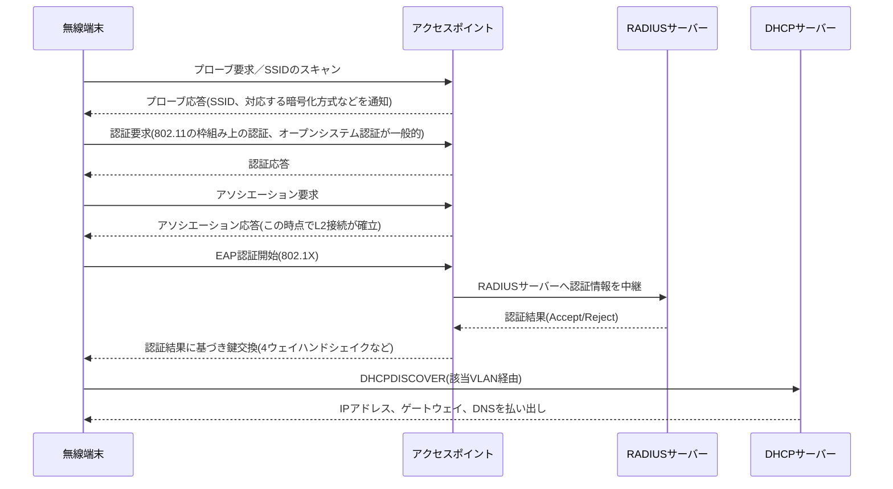

# 第9章 無線LAN

## 学習目標

この章を終えると、次のことができる。

1. IEEE 802.11の主要規格、周波数帯、チャネルの関係を説明できる
2. SSID、BSSID、ESSID、アクセスポイントの役割を区別し、有線VLANと対応づけて設計できる
3. WPA2とWPA3の違い、Personal（PSK）とEnterprise（802.1X）の違いを説明できる
4. 電波干渉の典型的な原因を挙げ、設計時の回避策を説明できる
5. 無線LANに特有の障害を、有線側の設定と電波環境の両面から切り分けられる

---

## 9.1 この章で学ぶこと

支社のPC_BRは有線接続だが、本社の営業担当がノートPCを会議室に持ち込むと、有線ポートは足りない。

来訪した取引先にもインターネットだけを提供したいが、社内VLANへは触れさせたくない。

こうした要求に応えるのが無線LAN(Wireless LAN、WLAN)であり、電波を媒体として使う点を除けば、これまでの章で扱ったVLAN、DHCP、ACLの考え方がそのまま適用される。

この章では、IEEE 802.11の規格、周波数帯とチャネル、SSIDとアクセスポイント(AP)の関係を整理したうえで、WPA2/WPA3による認証と暗号化、電波干渉、そして有線VLAN設計と無線SSID設計の対応づけを扱う。

無線LANを「有線とは別の独立した技術」として学ぶと、VLANやACLとの接続点を見落としやすい。

この章は、有線設計の延長として無線を位置づける構成を取る。

---

## 9.2 技術が必要になった背景

有線LANは、ケーブルの届く範囲、そしてポート数の範囲でしか端末を収容できない。

ノートPC、スマートフォン、タブレットの普及により、「その場でケーブルを挿す」という前提自体が崩れた。

会議室、来訪者エリア、フリーアドレス化されたオフィスでは、固定の有線ポートを人数分用意すること自体が非現実的になる。

IEEE(Institute of Electrical and Electronics Engineers：米国電気電子学会)は、この需要に対し、1997年に802.11として無線LANの標準規格を策定した。

以降、802.11b、802.11a、802.11g、802.11n、802.11ac、802.11axと世代を重ね、速度と効率が向上してきた。

無線特有の課題も同時に生まれた。

電波は壁を隔てても届く一方、暗号化なしでは誰でも傍受できる。

複数のAPが同じ電波空間を共有すれば、干渉によって速度が落ちる。

そのため、無線LANの標準化は速度の向上だけでなく、セキュリティ(WEP、WPA、WPA2、WPA3)と、電波の効率的な利用(チャネル管理、干渉回避)の両輪で進んできた。

---

## 9.3 基本概念

### 9.3.1 IEEE 802.11の規格と周波数帯

**IEEE 802.11**は、無線LANの物理層とデータリンク層(の一部)を規定する標準規格群の総称である。

主要な規格を整理する。

| 規格 | 通称(Wi-Fi Alliance) | 周波数帯 | 理論最大速度の目安 | 備考 |
|------|------------------------|----------|--------------------|------|
| 802.11b | - | 2.4GHz | 11Mbps | 現在はほぼ現役端末なし |
| 802.11a | - | 5GHz | 54Mbps | 2.4GHzのgと同時期 |
| 802.11g | - | 2.4GHz | 54Mbps | bとの互換性維持が課題になった |
| 802.11n | Wi-Fi 4 | 2.4GHz/5GHz | 600Mbps | MIMO(複数アンテナ)を導入 |
| 802.11ac | Wi-Fi 5 | 5GHzのみ | 数Gbps | MU-MIMO、広いチャネル幅 |
| 802.11ax | Wi-Fi 6 / Wi-Fi 6E | 2.4GHz/5GHz/6GHz | 9.6Gbps(理論値) | OFDMAによる多重化効率向上、6EはUS/日本等で6GHz帯を追加利用 |
| 802.11be | Wi-Fi 7 | 2.4GHz/5GHz/6GHz | さらに高速 | 策定・普及が進行中の世代 |

**Wi-Fi**という呼称は、Wi-Fi Allianceという業界団体が、相互接続性を認証した機器に与えるブランド名である。

規格名(802.11ax)とブランド名(Wi-Fi 6)が併存するのは、標準化団体(IEEE)と相互接続性認証団体(Wi-Fi Alliance)が別組織であるためである。

周波数帯には次の3つがある。

- **2.4GHz帯**：障害物を回り込みやすく到達距離が伸びやすいが、利用機器が多く混雑しやすい。日本ではチャネル1〜13(802.11bのみ14も使用可)が使える。
- **5GHz帯**：2.4GHz帯より直進性が強く障害物に弱いが、利用可能なチャネル数が多く高速化しやすい。日本ではW52、W53、W56という3つのチャネル群に分かれる。
- **6GHz帯**：Wi-Fi 6E以降で利用可能になった比較的新しい帯域であり、他の無線システムとの干渉が少ない反面、対応機器はまだ2.4GHz/5GHzほど普及していない。

日本国内での周波数帯の利用は電波法に基づく規制の対象であり、屋外利用可否やチャネルごとの制約は国・地域によって異なる。

### 9.3.2 チャネルと電波干渉

**チャネル**は、周波数帯をさらに細かく区切った、実際に通信に使う帯域の単位である。

2.4GHz帯では、隣接するチャネル同士が周波数的に重なり合うため、日本国内で実務上よく使われる**非重複チャネル**は1、6、11の3つに限られる。

チャネル1と2のように近接したチャネルを別々のAPに割り当てると、電波が重なり合って干渉する(**隣接チャネル干渉**)。

5GHz帯は、次のように帯域が分かれる。

| 帯域名 | チャネル例 | 特徴 |
|--------|-----------|------|
| W52 | 36、40、44、48 | 屋内外の利用条件は国内規制の改定を確認する必要がある |
| W53 | 52、56、60、64 | DFS(Dynamic Frequency Selection：動的周波数選択)への対応が必須 |
| W56 | 100〜140の一部 | チャネル数が多く、DFS対応が必須 |

**DFS**は、気象レーダーなど既存の無線システムと周波数を共用する帯域で、レーダー波を検知した場合に自動的に別チャネルへ切り替える仕組みである。

DFS対象チャネルを使うAPは、切り替えの数秒〜数十秒間、通信が一時的に途切れることがある。

会議室でビデオ会議中に無線が瞬断する場合、DFSによるチャネル切り替えが一因になっていることがある。

電波干渉には、Wi-Fi同士の干渉と、Wi-Fi以外の機器による干渉がある。

- **同一チャネル干渉**：近接する複数のAPが同じチャネルを使い、電波空間を奪い合う
- **隣接チャネル干渉**：周波数が近いチャネル同士が部分的に重なる
- **非Wi-Fi干渉**：電子レンジ(2.4GHz帯)、Bluetooth機器、コードレス電話、金属製の什器や壁による反射・減衰(マルチパスフェージング)

これらは、電波を可視化するスペクトラムアナライザや、AP自身が持つ無線環境レポート機能で調査する。

### 9.3.3 SSID、BSSID、ESSID、アクセスポイント

**SSID**(Service Set Identifier：サービスセット識別子)は、無線ネットワークを識別する名前であり、端末が接続先を選ぶときに表示される文字列である。

**BSSID**(Basic Service Set Identifier)は、1台のAPが提供する1つの無線セルを識別する識別子であり、実体はそのAP無線インターフェースのMACアドレスである。

**ESSID**(Extended Service Set Identifier、実務では単にSSIDと呼ばれることが多い)は、同一のSSID名を複数のAPに設定し、端末が移動してもシームレスに接続を維持できるようにする拡張構成を指す。

利用者から見えるのはSSID名だけだが、実際には複数のAP(複数のBSSID)が、同じSSID名の裏で協調して1つの無線ネットワークを構成している。

**アクセスポイント**(Access Point：AP)は、無線端末からの電波を受け、有線LAN側へフレームを中継する装置である。

APの動作方式には大きく2種類ある。

- **自律型AP(Autonomous AP)**：AP単体で無線設定、認証、暗号化のすべてを保持し、独立して動作する。小規模拠点向け。
- **コントローラー方式(Lightweight AP + WLC)**：AP自体は電波の送受信に専念し、SSID設定や認証ポリシーはWLC(Wireless LAN Controller：無線LANコントローラー、Cisco製品での呼称)が集中管理する。AP-WLC間は**CAPWAP**(Control And Provisioning of Wireless Access Points)というIETF標準プロトコルのトンネルで結ばれる。

WLCという製品名や、Cisco Mobility Express、Catalyst 9800といった具体的な製品はCisco固有の実装だが、CAPWAPというプロトコル自体は標準化されている。

中規模以上の拠点では、AP数が増えるほど1台ずつ個別設定する自律型APの運用負荷が大きくなるため、コントローラー方式が選ばれる傾向にある。

### 9.3.4 有線VLANと無線SSIDの対応

無線LANは、電波区間を通り過ぎれば、有線LANと同じEthernetフレームとして扱われる。

つまり、SSIDごとに異なるVLANへ振り分けることで、有線側の部署分離をそのまま無線にも適用できる。

通貫シナリオでは、次のような対応づけを設計する。

| SSID | 用途 | マッピング先VLAN | サブネット |
|------|------|-------------------|-----------|
| Corp-Sales | 営業部の無線端末 | VLAN10 | 10.10.10.0/24 |
| Corp-Dev | 開発部の無線端末 | VLAN20 | 10.10.20.0/24 |
| Corp-Guest | 来訪者向け | VLAN90(新設、ゲスト専用) | 10.10.90.0/24 |

ゲスト用VLANは、既存のVLAN10〜30とは独立させ、インターネットアクセスのみを許可し、社内VLANへのアクセスは拒否するACLを適用する(第8章の最小権限の考え方をそのまま適用する)。

この対応づけにより、APを接続するスイッチポートは、複数VLANのタグ付きフレームを通す**トランクポート**として設定する(第5章)。

APは、受信したフレームのSSIDに応じて、802.1QのVLANタグを付け分けて有線側へ転送する。

### 9.3.5 セキュリティと認証方式

無線LANのセキュリティは、暗号化方式と認証方式の2つの軸で理解する。

暗号化方式の変遷は次のとおりである。

| 世代 | 名称 | 暗号化方式 | 現状 |
|------|------|------------|------|
| 第1世代 | WEP(Wired Equivalent Privacy) | RC4ベース、鍵長が短い | 既知の脆弱性により非推奨、実質使用不可と考えてよい |
| 第2世代 | WPA(Wi-Fi Protected Access) | TKIP | WEPの代替として一時的に使われたが現在は非推奨 |
| 第3世代 | WPA2 | AES-CCMP | 長らく事実上の標準。2017年公表のKRACK攻撃など理論的弱点も指摘される |
| 第4世代 | WPA3 | AES-CCMP(Personal)、192ビット相当のスイート(Enterprise) | 新規導入時の推奨。SAEにより鍵交換の弱点を改善 |

WPA3は、**SAE**(Simultaneous Authentication of Equals)という鍵交換方式を採用し、WPA2のPSK方式が抱えていたオフライン辞書攻撃への耐性を高めている。

認証方式は、Personal(個人向け)とEnterprise(組織向け)に分かれる。

- **Personal(PSK方式)**：全端末が同一の事前共有鍵(Pre-Shared Key：PSK)を使う。家庭や小規模拠点、ゲストネットワークに向く。鍵が漏えいすると全端末に影響する。
- **Enterprise(802.1X/EAP方式)**：端末(サプリカント)、AP(オーセンティケータ)、認証サーバー(RADIUSサーバー)の3者で構成される**IEEE 802.1X**フレームワークに基づき、ユーザーごとの認証情報(証明書やID/パスワード)で認証する。**EAP**(Extensible Authentication Protocol：拡張認証プロトコル)は、この認証のやり取りを実現する枠組みであり、具体的な方式にはEAP-TLS(証明書ベース)やPEAP(ID/パスワードをトンネルで保護)などがある。

社内の営業部・開発部SSIDは、ユーザーごとのアクセス制御と、退職者アカウントの即時無効化ができるEnterprise方式が望ましい。

一方、ゲストSSIDは、来訪者に個別アカウントを発行する運用が現実的でないことが多く、PSKまたはキャプティブポータル(Web認証画面を経由させる方式)による簡易認証が使われることが多い。

WPA3ではさらに、認証なしで接続する開放型ネットワークでも通信内容を暗号化する**Enhanced Open**(OWE：Opportunistic Wireless Encryption)という技術も規定されている。

---

## 9.4 通信や処理の流れ

無線端末が電源投入からIP通信可能になるまでの流れを、Enterprise認証(802.1X)のSSIDを例に追う。



**アソシエーション**は、無線端末とAPの間でL2的な接続関係を確立する手続きであり、有線でいうリンクアップに近い。

アソシエーションが成立しても、Enterprise認証を使うSSIDでは、802.1XによるEAP認証が完了しなければ実際の通信(DHCPを含む)は許可されない。

「SSIDには接続できているのにインターネットが使えない」という症状は、多くの場合、このアソシエーションと認証完了の間で止まっている状態を指す。

複数APによるESSID構成では、端末が別のAPの電波エリアへ移動すると、**ローミング**と呼ばれる、接続先APの切り替えが発生する。

ローミング時、SSIDとVLANの対応が全APで統一されていれば、端末はIPアドレスを維持したまま通信を継続できる。

VLANの対応がAPごとに食い違っていると、ローミングのたびにIPアドレスが変わり、通話やビデオ会議が切断される原因になる。

---

## 9.5 構成例

通貫シナリオの本社フロアに、無線LANを追加した構成を示す。

```text
                    L3スイッチ Core
                    (VLAN10/20/30/90 の SVI)
                          |
                 +--------+--------+
                 |     トランク     |
                 |   (VLAN10,20,90 |
                 |    タグ付き通過) |
           +-----+-----+     +-----+-----+
           | アクセスSW |     | アクセスSW |
           +-----+-----+     +-----+-----+
                 |                 |
           +-----+-----+     +-----+-----+
           |   AP-1    |     |   AP-2    |
           | (会議室)  |     | (執務エリア)|
           +-----------+     +-----------+
                 SSID: Corp-Sales / Corp-Dev / Corp-Guest（両APで共通）
```

APを接続するスイッチポートはトランクポートとし、許可VLANをCorp-Sales(VLAN10)、Corp-Dev(VLAN20)、Corp-Guest(VLAN90)に限定する。

ネイティブVLANは、第5章の方針どおり未使用のVLAN(例：VLAN99)に固定し、AP自体の管理通信は別途管理VLANまたは専用の管理アドレスで扱う。

ゲストVLAN(VLAN90)は、L3スイッチ上でインターネット向けの経路のみを持たせ、拡張ACLで社内VLAN(10.10.10.0/24、10.10.20.0/24、10.10.30.0/24)への通信を拒否する。

---

## 9.6 Cisco設定例

無線LANの実機運用では、WLCのGUI(Webベースの管理画面)からSSIDやポリシーを設定する形態が広く使われている。

この章では、GUIで設定する項目の要点と、自律型APにおけるCLI設定例の両方を示す。

### 9.6.1 WLC(コントローラー方式)での設定項目の要点

WLCのGUIでは、おおむね次の順序でSSID(WLANと呼ばれる単位)を作成する。

1. **WLAN(SSID)の作成**：SSID名(例：Corp-Dev)を指定する
2. **インターフェース/VLANのマッピング**：そのSSIDに割り当てるVLAN(例：VLAN20)を指定する
3. **セキュリティポリシーの設定**：WPA2/WPA3、Personal/Enterpriseを選択する
4. **RADIUSサーバーの登録**：Enterprise方式の場合、認証サーバーのIPアドレスと共有鍵を登録する
5. **APグループへの適用**：作成したWLANを、どのAP群に配信するかを指定する

GUI操作の詳細は製品やソフトウェアバージョンにより異なるため、実務では公式のコンフィギュレーションガイドを都度参照する。

CCNAの学習範囲としては、「SSID、VLAN、セキュリティポリシー、RADIUSサーバーをどう対応づけるか」という設定の骨格を理解しておくことが重要である。

### 9.6.2 自律型APでのCLI設定例(小規模拠点や学習用途)

目的は、支社のような小規模拠点で、自律型APに開発部向けSSIDをWPA2-Enterprise方式で設定することである。

```cisco
! 無線インターフェースの基本識別子を設定する
AP(config)# dot11 ssid Corp-Dev
AP(config-ssid)# vlan 20
AP(config-ssid)# authentication open eap eap_methods
AP(config-ssid)# authentication network-eap eap_methods
AP(config-ssid)# guest-mode
AP(config-ssid)# exit

! RADIUSサーバーを登録する
AP(config)# radius-server host 10.10.30.15 auth-port 1812 acct-port 1813 key RadiusSharedKey
AP(config)# aaa new-model
AP(config)# aaa authentication login eap_methods group radius

! 無線インターフェース(2.4GHz帯)にSSIDを割り当てる
AP(config)# interface Dot11Radio0
AP(config-if)# ssid Corp-Dev
AP(config-if)# encryption mode ciphers aes-ccm
AP(config-if)# exit

! 有線側インターフェースはトランクとして複数VLANを通す
AP(config)# interface FastEthernet0
AP(config-if)# switchport mode trunk
AP(config-if)# switchport trunk allowed vlan 10,20,90
```

主要パラメータの意味は次のとおりである。

- `dot11 ssid`：APが広告するSSIDと、対応づけるVLANを定義する
- `authentication open eap` / `network-eap`：802.1X/EAPによる認証方式を有効にする
- `radius-server host ... key`：認証を委任するRADIUSサーバーのアドレスと共有鍵を指定する。鍵はAP側とRADIUSサーバー側で完全に一致させる必要がある
- `encryption mode ciphers aes-ccm`：WPA2で使われるAES-CCMP暗号化を有効にする

ゲストSSID(Corp-Guest)は、同様の手順でVLAN90に割り当て、`authentication open`のみ(802.1Xなし)とPSKまたはキャプティブポータルを組み合わせる。

### 9.6.3 確認コマンド

```cisco
! 現在アソシエーションしているクライアントの一覧
AP# show dot11 associations

! 無線インターフェースの状態、チャネル、送信電力
AP# show controllers dot11Radio 0

! WLC環境ではクライアントごとの詳細情報を確認する
WLC# show wireless client summary
WLC# show wireless client detail <MACアドレス>
```

クライアントが「アソシエーションはしているが認証未完了」なのか、「そもそもアソシエーションしていない」のかを、この出力で切り分けられる。

---

## 9.7 LinuxおよびWindowsでの確認例

### Windows

```bat
:: 現在接続中の無線インターフェースの状態(SSID、信号強度、認証方式)を確認する
netsh wlan show interfaces

:: 周辺で見えているSSID一覧を確認する
netsh wlan show networks mode=bssid

:: 接続後のIPアドレス、ゲートウェイ、DNSを確認する
ipconfig /all
```

`netsh wlan show interfaces`の出力にある`Signal`(信号品質、パーセント表示)と`Radio type`(使用中の規格)、`Channel`は、電波品質の一次切り分けに使う。

### Linux

```bash
# 無線インターフェースの一覧と状態を確認する(NetworkManager環境)
nmcli device wifi list

# 現在接続中のSSID、信号強度、周波数、ビットレートを確認する
nmcli device show wlan0

# より詳細な無線統計(古典的なツール、ディストリビューションにより別途インストールが必要)
iwconfig wlan0

# 接続後のIPアドレスとルート情報を確認する
ip addr show wlan0
ip route show
```

無線特有の確認観点として、次の3点を押さえる。

1. **信号強度(RSSI)**：一般に-67dBmより弱いと、音声やビデオ会議の品質が不安定になりやすいとされる
2. **使用チャネルと帯域**：2.4GHzか5GHzか、混雑したチャネルを使っていないか
3. **リンク速度(ビットレート)**：規格上の理論値と、実際に確立されているビットレートの乖離

これらはホスト側のコマンドだけで完結する情報であり、AP側やWLC側の情報と突き合わせることで、端末側の問題か、無線環境側の問題かを切り分けられる。

---

## 9.8 よくある誤解

1. **「5GHzは常に2.4GHzより速い」**
   規格上の理論値は5GHzが有利だが、直進性が強く壁や床に弱いため、APから離れた場所や障害物が多い環境では、実効速度が2.4GHzを下回ることがある。

2. **「SSIDを隠せば安全になる」**
   SSIDのブロードキャストを止めても、通信自体にSSID名は平文で含まれており、専用ツールで容易に把握できる。実質的なセキュリティ向上にはならず、むしろ接続設定の手間だけが増える。

3. **「WPA2を使っていれば十分安全」**
   WPA2自体に安全な実装は可能だが、PSK方式は鍵の使い回しや強度不足のパスワードにより突破され得る。新規導入では、可能な限りWPA3または802.1X/EAPを選ぶ。

4. **「電波強度(アンテナ本数の表示)が強ければ通信品質も良い」**
   強度(RSSI)が高くても、同じチャネルを使う他のAPや端末が多ければ、電波を奪い合って実効速度は落ちる。品質は強度だけでなく、干渉や輻輳の状況にも左右される。

5. **「無線LANはVLANと無関係の別ネットワーク」**
   SSIDは有線VLANへのタグ付けを通じて接続されており、VLAN設計の一部として扱う必要がある。無線だけを独立して設計すると、ACLやDHCPの部署分離が崩れる。

---

## 9.9 代表的な障害

| 症状 | ありがちな原因 | まず疑う箇所 |
|------|----------------|--------------|
| SSIDが見えない | AP電源断、AP設定でSSIDブロードキャスト無効化、電波到達範囲外 | AP稼働状況、設置場所 |
| SSIDは見えるが接続できない | 暗号化方式・認証方式の不一致、パスワード誤り | 端末側のセキュリティ設定 |
| 接続はできるがIPアドレスを取得できない | AP-スイッチ間トランクのVLAN許可漏れ、DHCPサーバーへの経路異常 | トランクの許可VLAN、DHCPリレー設定 |
| Enterprise認証のSSIDだけ接続できない | RADIUSサーバー不通、共有鍵不一致、証明書期限切れ | RADIUSサーバーの疎通、AP-RADIUS間の鍵 |
| 特定エリアだけ切断が頻発する | 電波干渉、AP設置密度不足、DFSによるチャネル切替 | 電波環境調査、AP配置 |
| 会議室移動時に通話が切れる | ローミング時のセルオーバーラップ不足、AP間のVLAN不一致 | AP配置間隔、VLANマッピングの一貫性 |
| ゲストSSIDから社内サーバーへ到達できてしまう | ゲストVLANのACL未設定または設定漏れ | L3スイッチのACL |
| 特定の古い端末だけ極端に遅い | レガシー規格端末の混在によるプロテクションモード動作 | 接続端末の規格、AP側の互換性設定 |

---

## 9.10 トラブルシューティング手順

「無線に接続できるがインターネットに出られない」という訴えを例に、切り分け手順を示す。

1. **端末側の接続状態確認**：`netsh wlan show interfaces`や`nmcli`で、SSID、認証状態、IPアドレス取得の有無を確認する。
2. **AP側のアソシエーション確認**：`show dot11 associations`や`show wireless client summary`で、該当端末が認証完了状態にあるかを確認する。
3. **有線側VLAN疎通確認**：AP収容ポートのトランク設定と、許可VLANリストを確認する。該当SSIDのVLANが許可VLANに含まれているかを見る。
4. **DHCP取得確認**：正しいVLANのサブネットでIPアドレスが払い出されているかを確認する。誤ったVLANのアドレスが払い出されていれば、AP側のVLANマッピング設定を疑う。
5. **RADIUS到達性確認(Enterprise方式の場合)**：AP(またはWLC)からRADIUSサーバーへの疎通と、共有鍵の一致を確認する。
6. **ACL確認**：ゲストSSIDなど制限対象のVLANでは、意図どおりのACLが適用されているかを確認する(第8章参照)。
7. **電波環境確認**：上記で有線側・認証側に問題がなければ、チャネル混雑や干渉源の有無を確認する。

有線VLANの知識(第5章)とACLの知識(第8章)を土台に持っていれば、無線特有の確認は「アソシエーションと認証」「AP-スイッチ間のVLANマッピング」の2点に絞り込める。

---

## 9.11 設計・運用上の注意点

1. **サイトサーベイを行う**
   AP設置前に、電波環境の事前予測(プレディクティブサーベイ)や、実際にAPを仮設置して測定する現地調査(オンサイトサーベイ)を行い、必要なAP数と設置場所を決める。勘だけに頼ったAP配置は、後から干渉や不感地帯の問題を招く。

2. **カバレッジ設計とキャパシティ設計を区別する**
   単に電波を隅々まで届かせる設計(カバレッジ重視)と、多数の端末が同時接続しても速度を維持できる設計(キャパシティ重視)は、必要なAP密度が異なる。会議室やイベントスペースはキャパシティ重視で設計する。

3. **チャネルプランを明示する**
   隣接するAP同士に別々の非重複チャネルを割り当てる。自動チャネル選択機能に任せる場合も、定期的に実際の割り当てを確認する。

4. **セルオーバーラップを確保する**
   ローミングを前提とするなら、隣接AP間で電波エリアが適度に重なるよう配置する(目安として15〜20%程度の重なりがしばしば推奨される)。重なりが不足すると、移動中に電波が一瞬途切れる不感地帯が生まれる。

5. **SSIDとVLANの対応を全AP・全WLCで統一する**
   1台でもVLANマッピングが食い違うAPがあると、ローミング時にIPアドレスが変わり、通話やアプリケーションが切断される。

6. **ゲストネットワークは物理的にも論理的にも分離する**
   ゲストVLANは、社内VLANへのACLだけでなく、可能であれば帯域制御や接続時間の制限も検討し、来訪者の利用が社内業務に影響しないようにする。

---

## 9.12 要点まとめ

- IEEE 802.11は無線LANの標準規格群であり、2.4GHz/5GHz/6GHzの周波数帯と、世代ごとの規格(802.11n/ac/ax等)がある
- チャネルは周波数帯をさらに分割した通信単位であり、非重複チャネルの選択と干渉回避が設計上の要点になる
- SSIDは無線ネットワークの名前、BSSIDは個々のAPを識別するMACアドレス、ESSIDは複数APによる拡張構成である
- APには自律型と、WLCが集中管理するコントローラー方式(CAPWAPで接続)があり、規模に応じて選択する
- WPA3はWPA2の弱点を補う新世代の暗号化・認証方式であり、Personal(PSK)とEnterprise(802.1X/EAP/RADIUS)は用途で使い分ける
- SSIDは有線VLANへタグ付けされるため、無線設計は有線VLAN設計と一体で行う
- 無線特有の障害切り分けは、アソシエーション・認証の成否、AP-スイッチ間のVLANマッピング、電波環境の順に確認する

---

## 9.13 章末問題

### 問題1

IEEE 802.11axがWi-Fi 6と呼ばれるのはなぜか。規格名とブランド名の関係、および策定・認証を行う組織の違いを説明せよ。

### 問題2

SSID、BSSID、ESSIDの違いを、それぞれが指し示す対象の観点から説明せよ。

### 問題3

通貫シナリオのゲストSSID(Corp-Guest)を設計する際、暗号化・認証方式として何を選び、有線側でどのようなVLAN・ACL設計にすべきか述べよ。

### 問題4

会議室を移動しながらビデオ会議を行う社員から「移動すると数秒切れる」という報告があった。考えられる原因を2つ挙げよ。

### 問題5

「SSIDには接続できているが、インターネットにアクセスできない」という症状に対し、確認すべき項目を、無線側と有線側それぞれ1つずつ挙げよ。

---

## 9.14 解答と解説

### 解答1

802.11axはIEEEが策定した技術規格の名称であり、Wi-Fi 6はWi-Fi Allianceが相互接続性を認証した機器に与えるブランド名である。標準化を行う団体(IEEE)と、認証・ブランディングを行う団体(Wi-Fi Alliance)が異なるため、1つの技術に2つの呼び名が存在する。

### 解答2

SSIDは無線ネットワークの名前(利用者に見える文字列)である。BSSIDは、1台のAPが提供する1つの無線セルを識別するMACアドレスである。ESSIDは、同一SSID名を複数のAP(複数のBSSID)にまたがって展開し、端末が移動してもシームレスに接続を維持できるようにした拡張構成を指す。

### 解答3

暗号化・認証方式としては、個別アカウント発行が現実的でないため、PSKまたはキャプティブポータルによる簡易認証を選ぶ。有線側は、社内VLAN(10、20、30)とは独立したゲスト専用VLANを新設し、L3スイッチの拡張ACLで社内VLANへの通信をすべて拒否し、インターネット向け通信のみを許可する。

### 解答4

例：(1) 隣接AP間のセルオーバーラップが不足しており、移動中に一時的にどちらのAPの電波も弱い区間ができる。(2) 隣接するAP同士でSSIDに対応するVLANの設定が食い違っており、ローミング時にIPアドレスが変わってセッションが継続できない。

### 解答5

無線側の確認：AP(またはWLC)側で、該当端末のアソシエーションと認証(Enterprise方式ならRADIUS認証)が完了しているかを確認する。有線側の確認：APを収容するスイッチポートのトランク設定で、該当SSIDに対応するVLANが許可VLANに含まれているかを確認する。

---

## 9.15 実機またはシミュレーター演習

### 演習A：SSIDとVLANの対応づけ設計

1. 通貫シナリオに新たに「Corp-Mgmt」という管理部向けSSIDを追加する想定で、対応するVLANとサブネットを設計する
2. AP収容ポートのトランク許可VLANリストを更新する設定コマンドを書く
3. ゲストSSIDとの違いを、ACL方針の観点から比較する

### 演習B：チャネルプランの検討

1. 1フロアに3台のAPを配置する想定で、2.4GHz帯のチャネル(1、6、11)をAP間で重複しないよう割り当てる配置図を描く
2. 5GHz帯を使う場合、割り当てられるチャネル数がどう変わるかを比較する
3. DFS対象チャネルを使う場合の運用上の注意点をまとめる

### 演習C：無線障害の切り分け演習

1. 意図的にAP収容ポートのトランク許可VLANから該当VLANを外し、無線端末がIPアドレスを取得できなくなることを確認する
2. `show dot11 associations`(または相当のコマンド)で、アソシエーションは成立しているがIPアドレス取得に失敗している状態を確認する
3. 障害票の形式(症状／確認／判断)で記録し、設定を復旧して正常化することを確認する

---

## 次章への橋渡し

これまでの章で、有線・無線を含めた本社と支社のネットワーク設計を一通り扱った。

実際の運用では、設計どおりに動いている状態を維持することと同じくらい、意図せず壊れた状態から素早く復旧することが求められる。

第10章では、ping、traceroute、各種確認コマンド、パケットキャプチャを用いた切り分け手法を整理し、通貫シナリオの障害事例を通して、設計から復旧までの一連の流れを扱う。
