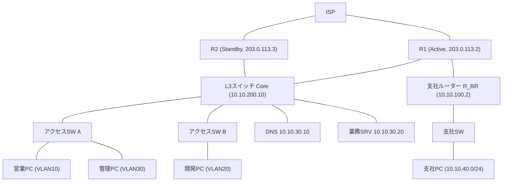

# 第10章 ネットワーク運用とトラブルシューティング

## 学習目標

この章を終えると、次のことができる。

1. ping、traceroute、各種ホストコマンド、Cisco showコマンドを、目的に応じて使い分けられる
2. パケットキャプチャ(Wireshark、tcpdump)の基本的な使い方と、キャプチャポイントの選び方を説明できる
3. レイヤー別切り分けの考え方(ボトムアップ、トップダウン、分割統治)を、実際の障害対応で使い分けられる
4. DNS障害、VLAN障害、ルーティング障害を、それぞれの典型的な確認手順で切り分けられる
5. 遅延やパケットロスの調査観点を整理し、原因の候補を絞り込める
6. 通貫シナリオの障害事例を、設計、設定確認、症状、切り分け、復旧までの一連として実行できる

---

## 10.1 この章で学ぶこと

第1章から第9章まで、通貫シナリオの本社と支社のネットワークを、VLAN、ルーティング、冗長化、NAT、ACL、無線LANの順に積み上げてきた。

設計と設定が正しくても、ケーブルの劣化、機器の故障、設定変更のミス、外部要因による輻輳など、運用中に何かが壊れることは避けられない。

この章では、これまでの章で個別に触れてきた確認コマンドを整理し直し、パケットキャプチャという新しい道具を加えたうえで、障害発生時に「どこから確認し、どう絞り込むか」という手順そのものを扱う。

後半では、通貫シナリオで実際に起こり得る3つの障害事例を、設計の前提、設定確認、症状、切り分け、復旧という流れで通しで扱う。

暗記すべきはコマンドの綴りではなく、症状から疑うべき層を絞り込み、その層を確認するコマンドを選び、結果から次の仮説を立てるという一連の思考の運び方である。

---

## 10.2 技術的背景

小規模なネットワークでは、管理者が全構成を把握しており、障害が起きても「昨日変更した箇所」を思い出せば解決することが多い。

ネットワークが拡大し、担当者が複数人になり、変更履歴が積み重なると、この属人的な対応は破綻する。

「どこかで何かが変わった結果、どこかで通信が止まっている」という状況に対し、経験や勘に頼らず、再現性のある手順で原因箇所を絞り込む必要が生まれる。

ネットワーク機器とホストOSの双方に、状態を確認するための標準的なコマンド群が用意されているのは、この絞り込み作業を体系的に行うためである。

ping、traceroute、ARP、ルーティングテーブル、名前解決、ソケット状態の確認は、ベンダーやOSが違っても、確認する対象そのもの(到達性、経路、アドレス解決、名前解決、通信状態)は共通している。

コマンドの名前や出力形式の違いに惑わされず、「今、通信のどの段階を確認しているか」を意識することが、この章全体の軸になる。

---

## 10.3 切り分けの基本的な考え方

障害対応における層別切り分けには、大きく3つのアプローチがある。

- **ボトムアップアプローチ**：物理層(ケーブル、リンク状態)から順に、下位層から上位層へ確認していく。原因の見当が全くつかない場合に、確実に潰していける方法だが、時間がかかりやすい。
- **トップダウンアプローチ**：利用者が報告する症状(アプリケーションが開けない、など)に近い層から確認していく。ユーザー報告をそのまま起点にできる一方、実際の原因が下位層にあると回り道になる。
- **分割統治アプローチ**：経験や過去の傾向から、疑わしい中間の層(多くの場合L3、つまりIP到達性)をまず確認し、結果に応じて上位層または下位層へ絞り込みを進める。効率が良いが、経験に基づく仮説の精度に結果が左右される。

実務では、分割統治を基本にしつつ、時間的余裕や過去の類似障害の有無に応じてボトムアップ・トップダウンを組み合わせることが多い。

第1章(1.14節)で示した「疎通不可の確認順序」を、コマンドを使った具体的な手順として展開すると、次のようになる。

1. 自ホストのIP設定を確認する(IPアドレス、サブネットマスク、デフォルトゲートウェイ、DNSサーバー)
2. 同一セグメント内の到達性を確認する(ARP解決、同一VLAN内の別ホストへのping)
3. デフォルトゲートウェイへの到達性を確認する
4. 別セグメント・別拠点・外部への到達性を確認する(traceroute)
5. 名前解決が成功しているかを確認する(IP直打ちとの比較)
6. 目的のサービスのポートまで到達しているかを確認する
7. 上記のいずれかで異常が見つかった時点で、対応する装置の設定(VLAN、ルーティング、ACL、NAT、DNS)を確認する

この手順は、症状に応じて途中から始めても構わない。

「同一部署内は使えるが他部署のサーバーだけ不通」という報告であれば、手順1〜2は正常であることが分かっているに等しく、手順3以降から着手できる。

---

## 10.4 確認コマンド群

### 10.4.1 到達性確認：ping

**ping**は、ICMP(Internet Control Message Protocol、第4章)のエコー要求(Echo Request)を送信し、相手からのエコー応答(Echo Reply)を受信できるかで、IP到達性を確認するコマンドである。

```bash
# Linux：4回送信し、往復時間(RTT)と喪失率を表示する
ping -c 4 10.10.30.20

# Windows：デフォルトで4回送信する
ping 10.10.30.20

# Windowsで継続的に送信し続ける(Ctrl+Cで停止)
ping -t 10.10.30.20
```

主な結果と意味を整理する。

| 結果 | 意味 |
|------|------|
| 応答あり(reply) | 宛先までの往復経路が生きている |
| Request timed out | 要求は送信されたが応答が返らない。途中経路またはICMPフィルタの可能性 |
| Destination host unreachable | 自ホストまたは経路上の装置に、宛先への経路情報がない |
| Unknown host / 名前解決失敗 | DNSによる名前解決に失敗している(IP到達性以前の問題) |

**pingが通ることは、ICMPが通ることの証明であって、目的のアプリケーションが動くことの証明ではない**。

ICMPだけが許可され、TCP443がACLで拒否されている構成では、pingは成功してもHTTPSは失敗する。

逆に、ICMPを明示的に拒否するセキュリティポリシーの機器では、実際には通信可能でもpingだけが失敗することがある。

pingの結果は、それ単体で「通信可能」「不可能」と断定せず、他のコマンドと組み合わせて解釈する。

### 10.4.2 経路確認：traceroute / tracert

**traceroute**(Linux/macOS)、**tracert**(Windows)は、宛先までの経路上にある各ルーター(ホップ)を、IPヘッダのTTL(Time To Live：生存時間)を1から順に増やしながらパケットを送信し、各ホップからのICMP時間超過(Time Exceeded)応答を集めることで可視化するコマンドである。

```bash
# Linux/macOS(デフォルトはUDPパケットを使用する実装が多い)
traceroute 8.8.8.8

# Windows(ICMPエコー要求を使用する)
tracert 8.8.8.8
```

LinuxのtracerouteはデフォルトでUDPパケット(到達しない高番ポート宛て)を使い、WindowsのtracertはICMPエコー要求を使うという実装上の違いがある。

同じ宛先に対しても、経路上のACLがUDPとICMPで異なる扱いをしていれば、両者で見え方が変わることがある。

出力の`*`(タイムアウト)は、そのホップ自体が壊れているとは限らない。

多くのルーターは、ICMP時間超過応答の生成に低い優先度を設定しており、応答が遅延・欠落しても、パケット自体は正常に次のホップへ転送されている場合がある。

`*`が連続し、それ以降のホップからも一切応答がなければ、その手前のホップ付近で経路またはフィルタの問題がある可能性が高い。

### 10.4.3 ホストのIP設定確認：ipconfig / ifconfig / ip

```bat
:: Windows：IPアドレス、サブネットマスク、デフォルトゲートウェイ、DNSサーバーを表示する
ipconfig /all

:: DHCPで取得したアドレスを解放する
ipconfig /release

:: DHCPで新しいアドレスを要求する
ipconfig /renew

:: ローカルDNSキャッシュをクリアする
ipconfig /flushdns
```

```bash
# Linux：現行の標準はip(iproute2パッケージ)コマンドである
ip addr show

# 旧来のifconfigは多くのディストリビューションで非推奨、または別パッケージ扱いになっている
ifconfig

# ルート情報も含めて確認する
ip route show
```

**ifconfig**はnet-toolsパッケージに含まれる古いコマンドであり、多くの現行Linuxディストリビューションでは標準搭載されず、後継の**ip**コマンド(iproute2パッケージ)への移行が進んでいる。

書籍や海外の情報源にはifconfigの例が今も多いが、実務での新規学習は`ip`コマンドを基本にする。

自ホストのIP設定確認で最初に見るべきは、IPアドレスとサブネットマスクが設計どおりか、デフォルトゲートウェイが正しいVLANのゲートウェイアドレスと一致しているか、DNSサーバーのアドレスが社内DNS(10.10.30.10)を指しているかの3点である。

DHCPで取得したはずのアドレスが`169.254.x.x`(APIPA：Automatic Private IP Addressing、DHCPサーバーからの応答を得られなかった場合にWindowsが自動的に割り当てる特殊なアドレス帯)になっていれば、DHCPサーバーへの到達性自体が失われていると判断できる。

### 10.4.4 ARP/近隣キャッシュ：arp / ip neigh

```bat
:: Windows：ARPキャッシュ(IPとMACアドレスの対応)を表示する
arp -a
```

```bash
# Linux：ARPキャッシュに相当する近隣キャッシュを表示する
ip neigh show

# 旧来のarpコマンド(net-tools、非推奨傾向)
arp -n
```

ARPキャッシュに、デフォルトゲートウェイのIPアドレスに対応するMACアドレスが記録されているかを確認すると、同一セグメント内でL2的な疎通ができているかが分かる。

エントリーが`incomplete`(Linux)や、そもそも登録されていない状態は、ARP要求への応答が得られていないことを示し、VLAN不一致やケーブル、対向ポートの状態を疑う根拠になる。

異なる2台の機器が同じIPアドレスを持つIPアドレス重複が起きると、ARPキャッシュのMACアドレスが不安定に入れ替わる症状が出ることがあり、この場合はARPキャッシュの変化を時系列で観察することが手がかりになる。

### 10.4.5 ルーティングテーブル：route / ip route

```bat
:: Windows：ルーティングテーブルを表示する
route print
```

```bash
# Linux：ルーティングテーブルを表示する
ip route show

# 旧来のroute(net-tools)コマンド
route -n
```

ホスト側のルーティングテーブルは多くの場合、デフォルトゲートウェイへの経路(0.0.0.0/0)と、直結セグメントへの経路だけを持つ単純な構成である。

複雑なルーティングの確認は、後述するCisco機器側の`show ip route`で行う。

ホスト側でルーティングテーブルを見る主目的は、デフォルトゲートウェイの設定漏れ、複数NIC環境での意図しない経路選択、VPN接続時のスプリットトンネル設定ミスなどを発見することにある。

### 10.4.6 名前解決確認：nslookup / dig

```bash
# 基本的な問い合わせ(既定のDNSサーバーに問い合わせる)
nslookup app.example.local

# 問い合わせ先DNSサーバーを明示する
nslookup app.example.local 10.10.30.10

# digはより詳細な情報(TTL、権威応答かどうかなど)を表示する(Linux/macOSで一般的)
dig app.example.local

# 特定のDNSサーバーに問い合わせる
dig @10.10.30.10 app.example.local

# 名前解決の過程をルートサーバーから順にたどる
dig +trace app.example.local
```

**nslookup**と**dig**はいずれもDNS(Domain Name System)への問い合わせを手動で行うコマンドである。

digは、応答セクション(ANSWER SECTION)、権威セクション(AUTHORITY SECTION)、TTL(そのレコードをキャッシュしてよい秒数)まで表示するため、障害調査ではnslookupより情報量が多く扱いやすい。

問い合わせ先DNSサーバーを明示的に指定できる点が重要である。

「社内DNSサーバーに問い合わせると失敗するが、外部の公開DNS(例：8.8.8.8)に問い合わせると成功する」という結果が得られれば、問題は社内DNSサーバー側にあると判断できる。

逆に、外部DNSでも失敗するなら、その名前自体が存在しないか、権威サーバー側の問題を疑う。

### 10.4.7 ソケット・接続状態確認：netstat / ss

```bash
# Linux：現行の標準はss(iproute2パッケージ)コマンドである
ss -tuln

# 特定ポートの状態を確認する
ss -tan | grep 443

# 旧来のnetstat(net-toolsに含まれ、多くのディストリで非推奨傾向)
netstat -tuln
```

```bat
:: Windows：現在の接続とリスニング状態を表示する
netstat -an

:: プロセスIDも表示する
netstat -ano
```

このコマンド群は、ネットワーク経路の問題ではなく、**ホスト自身がそのポートで通信を待ち受けているか**を確認するために使う。

「ネットワーク的には到達しているはずなのに、そのサービスにだけ接続できない」という症状のとき、対象サーバー上で`ss -tuln`(または`netstat -an`)を実行し、目的のポートが`LISTEN`状態にあるかを確認する。

リスニングしていなければ、アプリケーションやサービスが起動していない、または想定と異なるアドレス(`127.0.0.1`のみなど)でしか待ち受けていないという、ネットワーク層より上の問題だと判断できる。

### 10.4.8 Cisco showコマンド群

Cisco IOS機器側の代表的な確認コマンドを、目的別に整理する。

| 目的 | コマンド |
|------|----------|
| インターフェースのIPと状態を一覧する | `show ip interface brief` |
| 特定インターフェースの詳細(速度、デュプレックス、エラーカウンタ)を見る | `show interfaces <IF名>` |
| VLANの一覧とポートの所属を見る | `show vlan brief` |
| トランクポートの状態と許可VLANを見る | `show interfaces trunk` |
| MACアドレステーブルを見る | `show mac address-table` |
| STPの状態(ルートブリッジ、ポートロール)を見る | `show spanning-tree` |
| ルーティングテーブルを見る | `show ip route` |
| ダイナミックルーティングのネイバー状態を見る | `show ip protocols`、`show ip ospf neighbor`(第6章) |
| HSRP/VRRPの状態(Active/Standby)を見る | `show standby brief`、`show vrrp brief`(第7章) |
| NAT変換テーブルを見る | `show ip nat translations`(第8章) |
| ACLの内容とマッチ件数を見る | `show access-lists`(第8章) |
| 隣接するCisco機器を確認する(Cisco固有) | `show cdp neighbors detail` |
| 蓄積されたログを確認する | `show logging` |
| ハードウェア、IOSバージョン、再起動理由を確認する | `show version` |
| 機器自身からの到達性確認 | `ping`、`traceroute`(IOSの特権EXECモードで直接実行可能) |

Cisco機器では、IOS自体からpingやtracerouteを実行できる。

問題のホストが所属するVLANのSVIを起点に、Cisco機器からpingを打つことで、「ホストの問題か、ネットワーク機器の問題か」を切り分けられる。

拡張ping(`ping`コマンド実行後にオプション入力を促される拡張モード)を使うと、送信元インターフェースを指定した疎通確認ができ、非対称経路の検証に役立つ。

---

## 10.5 パケットキャプチャ

ここまでのコマンドは、いずれも「通信が成功したか失敗したか」という結果を見るものである。

パケットキャプチャは、実際にネットワーク上を流れているパケットの中身そのものを記録・観察する手法であり、結果だけでは分からない「なぜ失敗したか」の手がかりを得られる。

### 10.5.1 tcpdumpとWireshark

**tcpdump**は、Linux/UNIX系OSで広く使われるコマンドラインのパケットキャプチャツールである。

```bash
# 特定インターフェースのパケットをキャプチャし、標準出力に表示する
sudo tcpdump -i eth0

# 特定ホストとのやり取りだけを表示する
sudo tcpdump -i eth0 host 10.10.30.20

# 特定ポート(例：DNS)だけを表示する
sudo tcpdump -i eth0 port 53

# キャプチャ結果をファイルに保存する(あとでWiresharkで開くことが多い)
sudo tcpdump -i eth0 -w capture.pcap
```

**Wireshark**は、キャプチャしたパケットをGUIで解析するツールであり、tcpdumpが保存した`.pcap`ファイルを直接開ける。

プロトコルごとに色分け表示され、TCPの再送やゼロウィンドウ、DNSの問い合わせと応答の対応づけなど、テキストの羅列だけでは見つけにくいパターンを視覚的に確認できる。

Wiresharkの表示フィルタの例を挙げる。

```text
ip.addr == 10.10.30.20         # 特定ホストが関わるパケットのみ表示
tcp.port == 443                # 特定ポートのパケットのみ表示
tcp.flags.syn == 1 && tcp.flags.ack == 0   # SYNパケットのみ(接続開始の試行を追う)
dns                            # DNSパケットのみ
tcp.analysis.retransmission    # TCP再送と判定されたパケットのみ(パケットロスの手がかり)
```

### 10.5.2 キャプチャポイントの選び方

パケットキャプチャは、どこで採取するかによって見える情報が大きく変わる。

- **クライアント側**：クライアントが実際に何を送信し、何を受信できているかが分かる。ローカルの問題(誤ったDNS設定など)を切り分けやすい。
- **サーバー側**：クライアントからの要求がサーバーまで到達しているかが分かる。到達していれば、途中経路ではなくサーバー側アプリケーションの問題を疑える。
- **経路上のポイント(SPANポート等)**：クライアントとサーバーの間の特定区間で、実際に何が流れているかを直接観察できる。

Cisco スイッチには、特定ポートやVLANを通過するパケットを、別のポートへ複製して送る**SPAN**(Switched Port Analyzer、Cisco固有の名称。スイッチドポートアナライザ)という機能がある。

```cisco
! VLAN20を通過するパケットを、監視用ポートGi1/0/24へミラーリングする
SW_B(config)# monitor session 1 source vlan 20
SW_B(config)# monitor session 1 destination interface GigabitEthernet1/0/24
```

監視用PCをGi1/0/24に接続し、Wiresharkでキャプチャすれば、実際にVLAN20を流れるパケットを外部から観察できる。

クライアントとサーバーそれぞれでキャプチャを取り、同じ通信のSYNパケットが両方に記録されているかを突き合わせると、パケットがどこまで到達しているかを明確に特定できる。

クライアント側にはSYNが記録されているのにサーバー側に記録されていなければ、その間の経路(スイッチ、ルーター、ACL、ファイアウォール)で破棄されていると判断できる。

---

## 10.6 レイヤー別切り分けと疎通不可の確認順序

ここまでのコマンド群を、レイヤーごとに整理し直す。

| レイヤー | 疑う内容 | 主な確認コマンド |
|----------|----------|------------------|
| L1(物理) | リンクダウン、ケーブル不良 | `show interfaces`(Status/Protocol)、リンクランプ目視 |
| L2(データリンク) | VLAN不一致、トランク設定漏れ、STPブロック、MACテーブル異常 | `show vlan brief`、`show interfaces trunk`、`show mac address-table`、`show spanning-tree`、`arp -a`/`ip neigh` |
| L3(ネットワーク) | ルーティング欠落、ACLによる遮断、NAT変換の欠落、デフォルトゲートウェイ誤り | `ping`、`traceroute`、`show ip route`、`show access-lists`、`show ip nat translations` |
| L4(トランスポート) | ポートの到達性、TCPコネクション確立の失敗 | `nc -vz`、`Test-NetConnection`、`ss`/`netstat`(サーバー側でのリスニング確認) |
| アプリケーション/名前解決 | DNS障害、証明書、アプリケーション設定 | `nslookup`/`dig`、アプリケーションログ |

疎通不可の報告を受けたとき、次の順序で確認すると、原因の層を効率よく絞り込める。

1. 症状の範囲を確認する(1台だけか、特定VLAN全体か、全社かで、疑う層の広さが変わる)
2. 発生時刻の前後で構成変更がなかったかを確認する(変更管理台帳、直近の作業記録)
3. 自ホストのL1〜L3設定を確認する(IPアドレス、ゲートウェイ、ARP)
4. デフォルトゲートウェイまでのL2疎通を確認する
5. デフォルトゲートウェイから先のL3疎通を、traceroute等で経路上のどこまで届いているか確認する
6. 到達しているならL4(ポート)、名前解決、アプリケーションの順に切り分ける
7. 到達していないなら、届いていない区間の機器(スイッチ、ルーター)側の設定(VLAN、ACL、ルーティング、NAT)を確認する

「1台だけ不通」であればホスト側の設定やアクセスポートを、「特定VLAN全体が不通」であればそのVLANのSVIやACLを、「全社的にインターネットだけ不通」であればエッジルーターやNATを、それぞれ優先的に疑うという判断は、症状の広がり方から得られる最初の有力な手がかりである。

---

## 10.7 典型障害パターン別の手順

### 10.7.1 DNS障害

DNS障害の典型的な症状は、「IPアドレスを直接指定すれば通信できるが、ホスト名を指定すると失敗する」というものである。

確認手順は次のとおりである。

1. 症状の確認：宛先のIPアドレスが分かっていれば、そのIPアドレスに対して直接pingや該当ポートへの接続を試し、名前解決以外の部分が正常かを確認する
2. クライアントのDNS設定確認：`ipconfig /all`や`ip addr show`(および`/etc/resolv.conf`)で、意図したDNSサーバーのアドレスが設定されているかを確認する
3. DNSサーバーへの到達性確認：DNSサーバー(10.10.30.10)へping、および`nc -vz 10.10.30.10 53`でポート到達性を確認する
4. DNSサーバーへの問い合わせ確認：`dig @10.10.30.10 app.example.local`で、社内DNSサーバーに直接問い合わせ、応答があるかを確認する
5. 外部DNSとの比較：`dig @8.8.8.8 www.example.com`のように、外部の公開DNSサーバーに対して既知のドメインを問い合わせ、DNS基盤全体の問題か、社内DNSサーバー固有の問題かを切り分ける
6. DNSサーバー自体の状態確認：DNSサービスプロセスの起動状況、フォワーダー(上位DNSサーバー)設定、ゾーンデータの内容をサーバー側で確認する

社内向けの名前(`app.example.local`など)は社内DNSサーバーが権威を持ち、外部向けの名前解決は社内DNSサーバーが上位のフォワーダーへ問い合わせを転送する構成が一般的である。

社内名だけ失敗するのか、外部名も失敗するのかによって、疑うべき箇所(ゾーンデータかフォワーダー設定か)が変わる。

### 10.7.2 VLAN障害

VLAN障害の典型的な症状は、「同一フロア、同一スイッチ配下なのに、特定の相手とだけ通信できない」というものである。

確認手順は次のとおりである。

1. 該当ホストのIPアドレス確認：意図したVLANのサブネットのアドレスが割り当てられているかを確認する。異なるVLANのアドレス帯であれば、アクセスポートの所属VLAN自体を疑う
2. スイッチ側のポート所属確認：`show vlan brief`または`show interfaces <IF> switchport`で、そのポートが意図したVLANのアクセスポートになっているかを確認する
3. トランクの許可VLAN確認：経路上にトランクポートがあれば、`show interfaces trunk`で、該当VLANが許可VLANリストに含まれているかを確認する
4. ネイティブVLANの整合性確認：トランク両端のネイティブVLANが一致しているかを確認する(不一致はCDPネイバー情報の警告や、意図しないVLAN間の漏れとして現れることがある)
5. SVIの状態確認：VLAN間ルーティングが絡む場合、`show ip interface brief`で該当VLANのSVIがupかを確認する
6. MACアドレステーブルの確認：`show mac address-table vlan <VLAN番号>`で、該当ホストのMACアドレスが正しいポートで学習されているかを確認する

VLAN障害は、第5章で扱ったアクセスポート・トランクポートの設定そのものに起因することが最も多い。

新規増設や配線変更の直後に発生する不通は、まずVLAN所属の確認から始めると効率が良い。

### 10.7.3 ルーティング障害

ルーティング障害の典型的な症状は、「同一VLAN内は通信できるが、別のネットワーク(別VLAN、別拠点、インターネット)とだけ通信できない」というものである。

確認手順は次のとおりである。

1. デフォルトゲートウェイへの到達性確認：まず同一セグメント内でゲートウェイまで届いているかを確認する(届いていなければVLAN障害の手順に戻る)
2. ゲートウェイ機器のルーティングテーブル確認：`show ip route`で、宛先ネットワークへの経路が存在するかを確認する。経路自体がなければ、スタティックルートの設定漏れや、ダイナミックルーティングのネイバー断絶を疑う
3. 経路の妥当性確認：ロンゲストマッチにより、意図しない別の経路(たとえばより広い範囲を指すデフォルトルート)が優先的に選ばれていないかを確認する
4. 途中経路の特定：tracerouteで、どのホップまで到達し、どのホップで止まっているかを特定する
5. 対向機器側の経路確認：止まっているホップの次にある機器で、さらに先(または戻り)の経路が正しく存在するかを確認する。戻りの経路だけが欠落する非対称ルーティングも典型的な原因である
6. ACLの影響確認：経路は存在するのに通信できない場合、途中のACLで拒否されていないかを`show access-lists`のマッチ件数で確認する

「行きは通るが返事が来ない」という症状は、多くの場合、経路そのものよりACLや非対称ルーティングを疑うべきサインである。

### 10.7.4 遅延・パケットロスの調査

遅延やパケットロスは、完全な通信断ではなく「時々失敗する」「重い」という報告になるため、切り分けが一段難しい。

調査の切り口を整理する。

1. **統計を取る**：単発のpingではなく、`ping -c 100`のように十分な回数を実行し、喪失率(loss)と往復時間(RTT)の最小・平均・最大・変動幅を確認する。変動幅(ジッター)が大きい場合、音声やビデオ会議の品質劣化につながりやすい
2. **インターフェースのエラーカウンタを確認する**：Cisco機器で`show interfaces`を実行し、CRCエラー、入力エラー、出力ドロップ、コリジョン(該当する場合)が増加していないかを確認する。物理的な劣化や速度・デュプレックスの不一致(第2章)を示す
3. **回線の利用率を確認する**：WAN回線やアップリンクが常時高い利用率にあれば、輻輳によるパケットロスを疑う。SNMPによる帯域監視やインターフェースカウンタの推移で確認する
4. **経路の変化を確認する**：時間帯によって遅延が変わる場合、tracerouteを繰り返し実行し、経路自体が変化していないか、特定ホップだけ極端にRTTが増えていないかを確認する
5. **装置の負荷を確認する**：`show processes cpu`でルーターやスイッチのCPU使用率を確認する。CPU逼迫は、パケット処理の遅延やドロップに直結することがある
6. **MTU/断片化を確認する**：特定サイズ以上のパケットだけ失敗する場合、経路上のMTU(Maximum Transmission Unit：最大転送単位)不一致を疑う。`ping`のDF(Don't Fragment)ビット付きオプションでパケットサイズを変えながら試すパスMTU探索が有効である
7. **無線区間を確認する(該当する場合)**：第9章の内容に基づき、電波干渉や輻輳の可能性を確認する

パケットロスは、原因の層がL1(物理劣化)からL7(アプリケーションの過負荷)まで広く分布し得るため、統計情報を先に取ってから層を絞り込む進め方が効率的である。

---

## 10.8 構成例

この章のケーススタディで参照する、通貫シナリオの詳細なアドレス構成を一覧にする。

| 区分 | 装置／セグメント | アドレス |
|------|------------------|----------|
| 営業部LAN | VLAN10 | 10.10.10.0/24(GW: 10.10.10.1) |
| 開発部LAN | VLAN20 | 10.10.20.0/24(GW: 10.10.20.1) |
| 管理部・サーバーLAN | VLAN30 | 10.10.30.0/24(GW: 10.10.30.1) |
| DNSサーバー | SRV_DNS | 10.10.30.10 |
| 業務サーバー | SRV_APP | 10.10.30.20 |
| DHCPサーバー | DHCP | 10.10.30.5 |
| 本社-エッジ間アップリンク | VLAN200 | 10.10.200.0/28(HSRP VIP: 10.10.200.1) |
| エッジルーターR1(Active) | 内側/外側 | 10.10.200.2 / 203.0.113.2 |
| エッジルーターR2(Standby) | 内側/外側 | 10.10.200.3 / 203.0.113.3 |
| インターネット公開アドレス帯 | - | 203.0.113.0/28 |
| 本社-支社間WAN | - | 10.10.100.0/30(本社側.1、支社側.2) |
| 支社LAN | - | 10.10.40.0/24(GW: 10.10.40.1) |



このアドレス表と図を、以降のケーススタディで共通の前提として参照する。

---

## 10.9 通貫シナリオの障害対応

### ケース1：開発部PCが業務サーバーに到達できない(VLAN障害)

**設計**

開発部のアクセススイッチ(SW_B)は、ポートGi1/0/1〜Gi1/0/20を開発部PC収容用のアクセスポートとし、VLAN20を割り当てる設計になっている。

新規採用者のPCを増設する際は、空いているアクセスポートにVLAN20を設定してから接続する運用手順が定められている。

**設定確認(事前状態)**

```cisco
SW_B# show running-config interface GigabitEthernet1/0/15
interface GigabitEthernet1/0/15
 switchport mode access
 switchport access vlan 20
```

台帳上は、Gi1/0/15がVLAN20のアクセスポートとして記録されている。

**症状**

新規採用者のPCをGi1/0/15相当の壁面ポートへ接続したところ、`ipconfig`で確認したIPアドレスが`169.254.x.x`(APIPA)になっており、業務サーバー(10.10.30.20)はもちろん、開発部内の他のPCへのpingも失敗する。

**切り分け**

1. クライアント側でIPアドレスがAPIPAであることを確認し、DHCPによるアドレス取得自体に失敗していると判断する
2. `arp -a`を確認すると、デフォルトゲートウェイに相当するエントリーが存在しない
3. スイッチ側で実際に配線されている物理ポートを特定し、`show interfaces status`を確認したところ、想定していたGi1/0/15ではなく、配線担当が誤って隣のGi1/0/16に接続していたことが判明する
4. `show running-config interface GigabitEthernet1/0/16`を確認すると、このポートは工事の都合で一時的にVLAN1(デフォルトVLAN)のままになっており、VLAN20への設定変更が行われていなかった
5. `show vlan brief`でも、Gi1/0/16がVLAN1に属していることが確認できる

この時点で、原因は「物理配線が台帳と異なるポートに接続され、かつそのポートがVLAN20へ未設定だった」という、配線管理とVLAN設定の二重のずれであると特定できる。

**復旧**

```cisco
SW_B(config)# interface GigabitEthernet1/0/16
SW_B(config-if)# switchport mode access
SW_B(config-if)# switchport access vlan 20
SW_B(config-if)# switchport port-security maximum 1
SW_B(config-if)# switchport port-security mac-address sticky
SW_B(config-if)# switchport port-security violation restrict
SW_B(config-if)# shutdown
SW_B(config-if)# no shutdown
```

設定変更後、`shutdown`と`no shutdown`でリンクを再アップさせ、クライアント側でDHCPの再取得(`ipconfig /release`、`ipconfig /renew`)を行い、正しいVLAN20のアドレスが払い出されることを確認する。

再発防止として、配線台帳と実際のポート対応をラベルおよびスイッチ側のポート説明文(`description`)で明示し、新規接続時のチェック項目に「`show vlan brief`での所属VLAN確認」を追加する。

### ケース2：支社から本社への通信が全面的に不可能になる(ルーティング障害)

**設計**

支社ルーター(R_BR)は、本社向けのすべての通信を、本社エッジルーター(R1)へのスタティックデフォルトルートとして持つ。

本社エッジルーター(R1)は、支社ネットワーク(10.10.40.0/24)向けのスタティックルートを、R_BR方向(10.10.100.2)に設定している。

```cisco
! 本社R1側(設計時の想定設定)
R1(config)# ip route 10.10.40.0 255.255.255.0 10.10.100.2
```

**症状**

支社の担当者から、「本社の業務サーバーにも、本社の他の部署にも一切アクセスできなくなった」という報告が入る。

支社内のPC同士の通信は正常である。

**切り分け**

1. 支社PCから支社ルーターのゲートウェイアドレス(10.10.40.1)への到達性を確認し、成功する。支社側のL2、SVIまでは正常と判断する
2. 支社PCから本社の業務サーバー(10.10.30.20)へtracerouteを実行すると、10.10.100.2(R_BR自身)までは表示されるが、それ以降のホップが一切表示されず、要求がタイムアウトし続ける
3. 本社エッジルーターR1にログインし、`show ip route`を確認すると、10.10.40.0/24宛てのスタティックルートが存在しないことが判明する。前日実施した別件の設定変更作業で、誤って`no ip route 10.10.40.0 255.255.255.0 10.10.100.2`相当の削除操作を行い、意図せず消してしまっていたことが変更履歴から分かる
4. 併せて、支社側から本社側への経路がない状態でも、支社PCから支社ルーターまでは正常に見えてしまう(手順1が正常に見える)ことから、「支社側は正常」という誤った初期仮説を立てやすい点に注意する
5. 本社側のルーティングテーブルという、症状の発生元から離れた場所を確認して初めて原因に到達できる、非対称な障害である

**復旧**

```cisco
R1(config)# ip route 10.10.40.0 255.255.255.0 10.10.100.2
```

設定を再投入した直後に`show ip route`で経路の再表示を確認し、支社PCから本社の業務サーバーへのping、tracerouteを再実行して復旧を確認する。

再発防止として、スタティックルートの削除や変更を伴う作業では、変更前後で`show ip route`の差分を記録し、変更内容が意図した1経路だけに限定されているかをレビューする運用を徹底する。

### ケース3：HSRPフェイルオーバー後に社内全体でインターネットに接続できなくなる(NAT/冗長化障害)

**設計**

本社のインターネット接続は、エッジルーターR1(Active、優先度高)とR2(Standby)によるHSRP構成で冗長化されている。

L3スイッチは、デフォルトルートとしてHSRP仮想IP(10.10.200.1)を指定しており、通常時はActiveであるR1が実際のパケット転送とPAT(NATオーバーロード)を担う。

**設定確認(事前状態)**

構築時、PAT関連の設定はR1にのみ投入され、Standby機であるR2には投入されていなかった。

```cisco
R1(config)# ip nat inside source list 1 interface GigabitEthernet0/1 overload
```

R2側には、対応する`ip nat inside source list ... overload`コマンドと、`ip nat inside`/`ip nat outside`のインターフェース宣言が存在しない。

HSRPはL3の到達性(デフォルトゲートウェイの引き継ぎ)を冗長化する機能であり、NATの変換テーブルやNAT設定そのものを自動的に同期する機能ではないため、この設定漏れはHSRP自体の異常としては検知されない。

**症状**

R1の電源ユニット故障により、HSRPがR2へフェイルオーバーする。

フェイルオーバー自体は正常に完了し、社内の全部署から社内サーバー(業務サーバー、DNSサーバー)へのアクセスは継続して正常に行える。

一方、営業部・開発部・管理部のすべてのPCで、インターネット上のWebサイトへ一切アクセスできなくなる。

**切り分け**

1. 症状の範囲を確認し、「社内は正常、インターネットだけ全社的に不通」という特徴から、特定VLANやアクセスポートの問題ではなく、インターネット出口(エッジルーター)に共通する問題だと見当をつける
2. 社内PCから外部の代表アドレス(8.8.8.8など)へpingを実行すると、要求がタイムアウトする
3. L3スイッチで`show standby brief`を確認し、HSRPのActive役がR1からR2へ切り替わっていることを確認する。R1自体は電源断で応答がない
4. 現在Activeとして稼働しているR2にログインし、`show ip nat translations`を確認すると、通信が発生しているにもかかわらず変換エントリーが1件も存在しない
5. `show running-config | section nat`を実行し、R2にはNAT関連の設定(`ip nat inside`、`ip nat outside`、`ip nat inside source list ... overload`)が一切投入されていないことを確認する
6. 構成管理システムに保存されているR1の設定バックアップとR2の現行設定を比較し、NAT関連のコマンド一式がR2側にのみ欠落していることを特定する

原因は、冗長構成の一方の機器にのみ設定投入を行い、もう一方への反映を怠っていたという、変更管理上の抜け漏れである。

**復旧**

```cisco
R2(config)# interface GigabitEthernet0/0
R2(config-if)# ip nat inside
R2(config-if)# exit

R2(config)# interface GigabitEthernet0/1
R2(config-if)# ip nat outside
R2(config-if)# exit

R2(config)# access-list 1 permit 10.10.10.0 0.0.0.255
R2(config)# access-list 1 permit 10.10.20.0 0.0.0.255
R2(config)# access-list 1 permit 10.10.30.0 0.0.0.255
R2(config)# ip nat inside source list 1 interface GigabitEthernet0/1 overload
```

設定投入後、`show ip nat translations`で変換エントリーが生成され始めることを確認し、社内PCから外部サイトへのアクセスが復旧することを確認する。

再発防止として、冗長構成を組む機器同士は、インターフェースアドレスやHSRP優先度など機器固有の値を除き、NAT・ACL・ルーティングなどの設定を必ずペアで投入し、定期的に両機器の設定差分を自動比較する仕組み(構成管理ツールによる差分検知など)を導入する。

---

## 10.10 よくある誤解

1. **「pingが通れば、そのサービスは使える」**
   pingはICMPの到達性確認に過ぎない。TCPポートの到達性、DNS、アプリケーションの状態はそれぞれ別に確認する必要がある。

2. **「tracerouteの`*`は、そのホップが壊れている証拠」**
   多くの機器はICMP時間超過応答の生成を低優先度で扱うため、`*`が出てもパケット自体は正常に転送されていることがある。連続する`*`とその後の完全な無応答を区別して解釈する。

3. **「障害はいつも壊れた場所で症状が出る」**
   ケース2のように、症状が出ている場所(支社)と、実際の原因がある場所(本社エッジルーターの経路設定)が離れていることは珍しくない。症状の発生源だけを見て調査範囲を狭めすぎない。

4. **「冗長構成にしていれば、片方が壊れても自動的に何もかも引き継がれる」**
   HSRP/VRRPが引き継ぐのはL3の到達性(デフォルトゲートウェイ)であり、NATの変換テーブルや、個別に投入した設定は自動的には同期されない。冗長化の範囲を正しく理解しておく必要がある。

5. **「パケットキャプチャは難しいので障害調査の最終手段」**
   キャプチャポイントを適切に選べば、SYNパケットの有無を見るだけでも、経路のどこで止まっているかを短時間で特定できる。show系コマンドで手がかりが得られない場合、早い段階で候補に入れてよい手法である。

---

## 10.11 設計・運用上の注意点

1. **変更は1つずつ、記録を残して実施する**
   複数の設定変更を同時に行うと、障害発生時にどの変更が原因かを切り分けられなくなる。変更内容、実施者、日時を記録し、可能な限り変更前後で状態を比較する。

2. **冗長構成の機器は、定期的に設定差分を確認する**
   ケース3のような「片方にしか設定が入っていない」状態は、日常的な運用では気づきにくい。構成管理ツールや定期的な`show running-config`の差分比較で、能動的に検出する仕組みを持つ。

3. **平常時のベースラインを取得しておく**
   通常時のping RTT、インターフェースのエラーカウンタ、CPU使用率などの基準値(ベースライン)を事前に把握していないと、「今の値が異常かどうか」を判断できない。

4. **配線台帳とスイッチ設定の対応を常に一致させる**
   ケース1のように、物理配線と設定情報がずれていると、障害調査そのものが遠回りになる。ポートの`description`設定と台帳の二重管理、または一元化した管理ツールの利用を検討する。

5. **監視とログ収集を、障害発生前から整えておく**
   syslogサーバーへのログ集約、SNMPやその他の監視ツールによるインターフェース状態・トラフィック量の常時監視は、障害発生後に慌てて設定するのでは遅い。第8章で触れた管理プレーン保護と合わせて、平時から準備する。

6. **切り分け手順そのものをドキュメント化し、チームで共有する**
   個人の経験則に頼った切り分けは、担当者が不在のときに対応速度が落ちる。この章で示したような「症状別の確認手順」を、自社のネットワーク構成に合わせて手順書に落とし込んでおく。

---

## 10.12 要点まとめ

- 障害切り分けには、ボトムアップ、トップダウン、分割統治のアプローチがあり、実務では分割統治を基本に組み合わせる
- ホスト側の確認コマンド(ping、traceroute/tracert、ipconfig/ip、arp/ip neigh、route/ip route、nslookup/dig、netstat/ss)は、OSが違っても確認する対象(到達性、経路、アドレス、名前解決、ソケット状態)は共通している
- Cisco機器側のshowコマンド群は、インターフェース、VLAN、ルーティング、NAT、ACL、冗長化の状態をそれぞれ個別に確認する道具である
- パケットキャプチャ(tcpdump、Wireshark)は、結果だけでは分からない「なぜ失敗したか」を、実際のパケットから読み取る手法であり、キャプチャポイントの選択が精度を左右する
- DNS障害、VLAN障害、ルーティング障害は、それぞれ症状の型が異なり、確認すべき層と手順が対応している
- 遅延・パケットロスの調査は、単発の確認ではなく統計を取り、L1のエラーカウンタから装置負荷、MTUまで幅広い層を候補として扱う
- 症状の発生場所と、原因のある場所は一致するとは限らず、冗長構成やNATのように「自動的に引き継がれると誤解されやすい」部分ほど、個別に確認する価値がある

---

## 10.13 章末問題

### 問題1

pingとtraceroute(tracert)の役割の違いを、それぞれが確認できる情報の観点から説明せよ。

### 問題2

「ホスト名を指定すると失敗するが、IPアドレスを直接指定すると成功する」という報告を受けたとき、最初に確認すべき項目と、その後の切り分け手順を述べよ。

### 問題3

Wiresharkでのキャプチャにおいて、クライアント側にはSYNパケットが記録されているが、サーバー側には記録されていない場合、何が推測できるか述べよ。

### 問題4

ケース3(HSRPフェイルオーバー後のインターネット不通)において、HSRPそのものは正常にフェイルオーバーしていたにもかかわらず障害が発生した理由を説明せよ。

### 問題5

「同一VLAN内は通信できるが、別VLANのサーバーにだけ到達できない」という症状のとき、VLAN障害とルーティング障害のどちらを疑うべきか、判断の根拠とともに述べよ。

---

## 10.14 解答と解説

### 解答1

pingはICMPエコー要求・応答により、宛先までの往復のIP到達性の有無とおおよそのRTTを確認する。traceroute(tracert)は、TTLを段階的に増やしながら送信し、宛先までの経路上の各ホップと、各ホップまでのRTTを確認する。pingは「届くか届かないか」、tracerouteは「どこまで届いているか、経路はどうなっているか」を確認する点が異なる。

### 解答2

最初に、クライアントのDNS設定(`ipconfig /all`や`ip addr`に相当する設定確認)で、意図したDNSサーバーが設定されているかを確認する。次に、そのDNSサーバーへの到達性(ping、ポート53への到達性)を確認し、`nslookup`または`dig`で直接そのDNSサーバーに問い合わせて応答があるかを確認する。社内DNSで失敗し外部DNSで成功する場合は社内DNSサーバー側、両方で失敗する場合はクライアント側のDNS設定または経路そのものを疑う。

### 解答3

クライアントから送信されたSYNパケットが、サーバーまで到達していないことが推測できる。経路上のスイッチ、ルーター、ACL、ファイアウォールのいずれかで破棄されている可能性が高く、サーバー自体のアプリケーションやポートの問題(サーバー側の設定不備)は、この時点ではまだ切り分けの対象にならない。

### 解答4

HSRPが冗長化するのは、デフォルトゲートウェイとしてのL3到達性(仮想IPの引き継ぎ)であり、NATの設定やNAT変換テーブルそのものはHSRPの管理対象外である。R2にNAT関連の設定が投入されていなかったため、HSRPのフェイルオーバー自体は正常に完了したにもかかわらず、Active役を引き継いだR2がNAT処理を行えず、インターネット向け通信だけが失敗した。

### 解答5

まず、送信元ホストから見て、同一VLAN内のゲートウェイアドレスへの到達性を確認する。ゲートウェイまで届いていれば、VLAN所属自体は正しいと判断でき、その先の別VLANサーバーへの到達性の問題は、ゲートウェイ機器(L3スイッチ)のルーティングテーブルやACLを疑う根拠になる。逆にゲートウェイ自体に届いていなければ、まずVLAN障害(アクセスポートの所属、トランクの許可VLAN)を疑うべきである。

---

## 10.15 総合演習

### 演習A：確認コマンドの使い分け整理

1. この章で扱った全確認コマンド(ホスト側、Cisco側)を、「到達性」「経路」「アドレス設定」「名前解決」「ポート/ソケット状態」の5分類に自分で仕分ける
2. 分類ごとに、Windows、Linux、Cisco IOSでの対応するコマンドを表にまとめる
3. 自分の言葉で、それぞれのコマンドが何を確認する道具かを1行で説明する

### 演習B：パケットキャプチャによる障害再現

1. Packet Tracer、GNS3、CML、または実機とホストOSを用意し、クライアント-スイッチ-サーバーの単純な構成を作る
2. サーバー側で意図的に特定ポートへのアクセスを拒否するACLを設定する
3. クライアント側とサーバー側の両方でパケットキャプチャを取得しながら、クライアントから該当ポートへ接続を試みる
4. クライアント側のキャプチャにはSYNが記録され、サーバー側には記録されないことを確認し、ACLによる遮断の痕跡をパケットレベルで確認する

### 演習C：3ケーススタディの再現と手順書化

1. この章のケース1〜3のいずれかを選び、同等の障害状況をシミュレーター上で再現する
2. 実際に確認コマンドを実行しながら、切り分けの各ステップでの出力結果をスクリーンショットまたはテキストで記録する
3. 記録をもとに、自分のチームで使える「障害対応手順書」の形式(症状、確認手順、想定される原因、復旧手順、再発防止策)にまとめ直す
4. 可能であれば、演習Aで作成したコマンド一覧表を、この手順書からリンクさせる

### 演習D：総合設計レビュー

1. 通貫シナリオ全体(第1章〜第10章)の構成図を、自分で一から描き直す
2. VLAN、ルーティング、冗長化、NAT、ACL、無線LANのそれぞれについて、設計上の意図を1〜2文で説明を添える
3. この章で扱った3つのケーススタディが、それぞれ構成図上のどの部分に対応する障害かを図に書き込む
4. 自分がこのネットワークの運用担当者だと想定し、優先的に監視・記録しておきたい項目を3つ挙げる

---

## 本書のまとめ

第1章で、通信が成立するまでの全体像とOSI参照モデル、TCP/IPモデルという地図を得た。

第2章から第4章では、Ethernet、IPアドレスとサブネット、TCP/UDPと主要プロトコルという、あらゆる通信の土台を固めた。

第5章から第7章では、VLANによる部署分離、ルーティングによるネットワーク間到達性、STPとHSRP/VRRPによる冗長化という、企業LANを構成する骨格を組み立てた。

第8章では、NATによるアドレス変換とACLによるアクセス制御、そしてポートセキュリティ、DHCP Snooping、DAIによるL2セキュリティを扱い、通信を「つなげるだけ」でなく「安全に制限する」視点を加えた。

第9章では、有線VLAN設計の延長として無線LANを位置づけ、SSIDとVLANの対応づけ、WPA2/WPA3による認証と暗号化を扱った。

そして第10章では、これらすべてが正しく機能しているかを確認し、壊れたときに切り分け、復旧させるための道具と手順を扱った。

通貫シナリオの本社と支社は、10個の章を通じて、単なるケーブルと機器の集合から、部署分離、外部接続、冗長性、セキュリティ、無線対応、運用監視まで備えたひとつのシステムとして描かれてきた。

実際の現場では、ここで扱った標準技術(Ethernet、IP、TCP/UDP、802.11、ACLの概念)と、Cisco固有の実装(HSRP、DTP、CDP、IOSのコマンド体系)の両方が混在する。

どちらの技術に対しても、「なぜその機能が必要になったのか」という背景から理解しておけば、ベンダーや製品が変わっても、同じ考え方で新しい環境に向き合える。

本書で得た地図をもとに、実機やシミュレーターでの演習を重ね、実際の構成図やログを読み解く経験を積み重ねていくことが、CCNAレベルの知識を実務の判断力へ変えていく道筋になる。
