# CCNAレベル 実務向けネットワーク解説書（合本）

通読用に目次と第1章〜第10章を結合したファイルです。章単位の編集は各 `0N_*.md` を正本としてください。

---


<!-- ========== 00_mokuji.md ========== -->

# CCNAレベル 実務向けネットワーク解説書

## 本書の目的

読者がネットワークの基本原理を理解し、構成図や設定を読み解き、基本的な設計・構築・障害対応を行える状態になることを目指す。

資格試験の暗記ではなく、「なぜその技術が必要か」「実際のシステムでどう使われるか」を軸に説明する。

## 想定読者

- ITインフラを初めて学ぶ人
- サーバーエンジニア、クラウドエンジニアを目指す人
- CCNA相当のネットワーク知識を身につけたい人
- 用語は知っているが、技術同士の関係を説明できない人

## 通貫シナリオ

本書では、次の小規模企業ネットワークを一貫して用いる。

- 本社と支社を持つ小規模企業
- 営業部、開発部、管理部をVLANで分離
- 各部署からインターネットへ接続
- 部署間通信をACLで制限
- DHCPでクライアントにIPアドレスを配布
- DNSサーバーと業務サーバーを社内に配置
- ネットワーク機器を冗長化
- 一部の通信障害を想定して切り分ける

概略構成は次のとおりである。

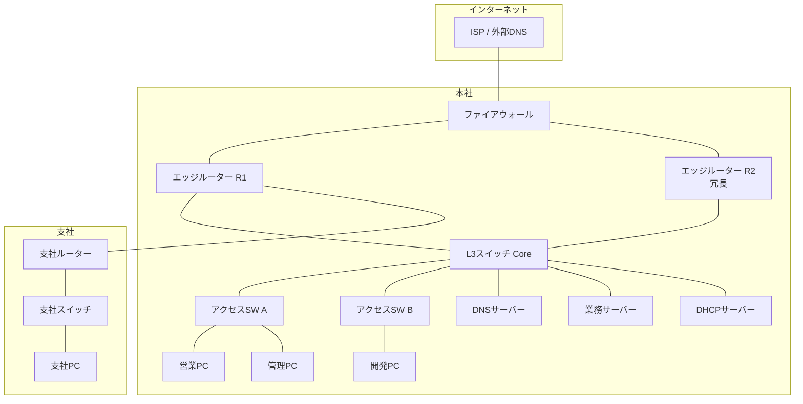

VLANの割り当て方針（後章で詳細化する）。

| VLAN | 名称 | 用途 | 本社サブネット例 |
|------|------|------|------------------|
| 10 | Sales | 営業部 | 10.10.10.0/24 |
| 20 | Dev | 開発部 | 10.10.20.0/24 |
| 30 | Mgmt | 管理部・サーバー | 10.10.30.0/24 |
| 99 | Native | トランクのネイティブVLAN | 未使用推奨 |
| 100 | WAN | 本社-支社間など | 10.10.100.0/30 |

---

## 詳細目次と各章の到達目標

### 第1章 ネットワークの全体像

**到達目標**

1. コンピューターネットワークの目的を、業務システムの具体例で説明できる
2. LAN、WAN、インターネットの違いを、スコープと管理主体で区別できる
3. クライアント、サーバー、スイッチ、ルーター、ファイアウォールの役割を、通信経路上の位置と結びつけて説明できる
4. 1回のHTTP通信が成立するまでの流れを、名前解決から応答返却まで順に追える
5. OSI参照モデルとTCP/IPモデルを対応づけ、各層のPDU名称を正しく使える
6. カプセル化と非カプセル化を、送信側と受信側の処理として説明できる

**節構成**

1. この章で学ぶこと
2. 技術が必要になった背景
3. コンピューターネットワークの目的
4. LAN、WAN、インターネット
5. 主要なネットワーク装置の役割
6. 通信が成立するまでの全体的な流れ
7. OSI参照モデル
8. TCP/IPモデル
9. カプセル化と非カプセル化
10. PDU、フレーム、パケット、セグメント
11. 構成例（通貫シナリオの俯瞰）
12. 確認コマンド例
13. よくある誤解
14. 代表的な障害と切り分け
15. 設計・運用上の注意点
16. 要点まとめ
17. 章末問題と解答
18. 演習

---

### 第2章 EthernetとLAN

**到達目標**

1. EthernetがLANの事実上の標準である理由を、歴史と現在の利用形態から説明できる
2. MACアドレスの構造と、フレーム転送における役割を説明できる
3. スイッチのMACアドレス学習、転送、フラッディングを動作として説明できる
4. コリジョンドメインとブロードキャストドメインの違いを、装置境界で説明できる
5. 全二重、半二重、オートネゴシエーションの失敗パターンを切り分けできる

**節構成**

1. Ethernetの基本
2. MACアドレスとEthernetフレーム
3. ユニキャスト、ブロードキャスト、マルチキャスト
4. スイッチの学習とMACアドレステーブル
5. フラッディング
6. コリジョンドメインとブロードキャストドメイン
7. 全二重、半二重、オートネゴシエーション
8. Cisco設定・確認、ホスト側確認
9. 誤解、障害、設計注意点
10. 章末問題、演習

---

### 第3章 IPアドレスとサブネット

**到達目標**

1. IPv4アドレスをネットワーク部とホスト部に分解できる
2. サブネットマスクとCIDR表記を相互に変換できる
3. プライベートIPとグローバルIP、ネットワークアドレスとブロードキャストアドレスを区別できる
4. サブネット分割とVLSMを、途中式を省略せず計算できる
5. IPv6の基本構造と主要アドレス種別を、IPv4との対比で説明できる

**節構成**

1. IPv4アドレスの構造
2. サブネットマスクとCIDR
3. アドレス種別（プライベート、グローバル、特殊アドレス）
4. サブネット分割の手順（複数例題・途中式あり）
5. VLSM
6. IPv6の基本
7. 設定・確認、誤解、障害、設計注意点
8. 章末問題、演習

---

### 第4章 TCP、UDP、主要プロトコル

**到達目標**

1. TCPとUDPの選択基準を、信頼性・遅延・用途から判断できる
2. 3ウェイハンドシェイク、シーケンス番号、確認応答、フロー制御の役割を説明できる
3. ポート番号とウェルノウンポートを、サービス識別の仕組みとして使える
4. ARP、ICMP、DNS、DHCPの役割を、通信成立の順序の中で説明できる
5. HTTP/HTTPS、SSH、NTP、SNMP、Syslogの運用上の位置づけを説明できる

**節構成**

1. トランスポート層の役割
2. TCPとUDP
3. コネクション確立と信頼性制御
4. ポート番号
5. ARP、ICMP、DNS、DHCP
6. アプリケーション層の主要プロトコル
7. 設定・確認、誤解、障害、設計注意点
8. 章末問題、演習

---

### 第5章 VLANとスイッチング

**到達目標**

1. VLANの目的を、ブロードキャスト抑制とセキュリティ分離の両面から説明できる
2. アクセスポートとトランクポート、IEEE 802.1Q、ネイティブVLANを設定・確認できる
3. VLAN間ルーティングを、Router on a StickとL3スイッチの両方で説明できる
4. DTPがベンダー固有機能であることを踏まえ、運用上の扱いを判断できる
5. 通貫シナリオの部署分離を、VLAN設計として落とし込める

**節構成**

1. VLANの目的と背景
2. アクセス／トランク、802.1Q、ネイティブVLAN
3. VLAN間ルーティング
4. DTPの概要（Cisco固有）
5. VLAN設計上の注意点
6. 設定と確認コマンド
7. 誤解、障害、設計注意点
8. 章末問題、演習

---

### 第6章 ルーティング

**到達目標**

1. ルーティングテーブルの見方と、ロンゲストマッチによる経路選択を説明できる
2. スタティックルートとデフォルトルートを設計・設定できる
3. ディスタンスベクターとリンクステートの違いを説明できる
4. OSPFの基本動作（ネイバー、エリア、メトリック）を説明できる
5. Administrative DistanceとECMPを、経路選択の流れの中で使える

**節構成**

1. ルーティングの役割
2. ルーティングテーブルとロンゲストマッチ
3. スタティック／デフォルトルート
4. ダイナミックルーティングの分類
5. OSPFの基本とエリア
6. メトリック、AD、ECMP
7. 経路選択の流れ
8. 設定・確認、誤解、障害、設計注意点
9. 章末問題、演習

---

### 第7章 冗長化とループ防止

**到達目標**

1. レイヤー2ループとブロードキャストストームの発生条件を説明できる
2. STP／RSTPのルートブリッジ、ポートロール、ポート状態を説明できる
3. EtherChannelとLACPの目的と設定要点を説明できる
4. HSRPとVRRPの違いを、標準／ベンダー固有の観点で区別できる
5. 本社コアの冗長化方針を、L2とL3に分けて設計できる

**節構成**

1. L2ループの問題
2. STP／RSTP
3. EtherChannel／LACP
4. HSRP、VRRP
5. 冗長化構成の考え方
6. 設定・確認、誤解、障害、設計注意点
7. 章末問題、演習

---

### 第8章 NAT、ACL、ネットワークセキュリティ

**到達目標**

1. スタティックNAT、ダイナミックNAT、PATの使い分けを説明・設定できる
2. 標準ACLと拡張ACLを、評価順序と暗黙のdenyを踏まえて設計できる
3. 最小権限の原則を、部署間ACLに適用できる
4. ポートセキュリティ、DHCP Snooping、DAIの防御対象を説明できる
5. 管理プレーン保護の基本方針を説明できる

**節構成**

1. NATの種類と用途
2. ACLの種類と評価
3. スイッチ側セキュリティ機能
4. 代表的な攻撃と対策
5. 管理プレーンの保護
6. 設定・確認、誤解、障害、設計注意点
7. 章末問題、演習

---

### 第9章 無線LAN

**到達目標**

1. IEEE 802.11、周波数帯、チャネル、SSID、APの関係を説明できる
2. WPA2／WPA3と認証方式の違いを説明できる
3. 電波干渉の典型原因を挙げ、設計時の回避策を説明できる
4. 有線VLAN設計と無線SSID設計を対応づけられる

**節構成**

1. 無線LANの位置づけ
2. 802.11、周波数、チャネル、SSID、AP
3. セキュリティと認証
4. 干渉と設計の基本
5. 確認、誤解、障害、設計注意点
6. 章末問題、演習

---

### 第10章 ネットワーク運用とトラブルシューティング

**到達目標**

1. ping、traceroute、各種ホストコマンド、Cisco showコマンドを目的別に使い分けられる
2. パケットキャプチャ（Wireshark／tcpdump）の基本的な使い方を説明できる
3. レイヤー別切り分けの順序を、疎通不可の現場で実行できる
4. DNS、VLAN、ルーティング障害の切り分け手順を説明できる
5. 遅延・パケットロスの調査観点を整理できる
6. 通貫シナリオの障害事例を、設計から復旧まで一連で扱える

**節構成**

1. 運用で使う確認コマンド群
2. パケットキャプチャ
3. レイヤー別切り分け
4. 典型障害パターン別手順
5. 通貫シナリオの障害対応演習
6. 章末問題、総合演習

---

## 執筆方針（本書全体）

- 初出の略語には正式名称と日本語の意味を併記する
- 設定コマンドには、目的と主要パラメータの意味を付記する
- IPv4を中心に説明し、IPv6との相違点も扱う
- ベンダー固有機能と標準技術を明示して区別する
- 正常時の動作に加え、代表的な障害と切り分けを各章で扱う
- 各章末に理解度確認問題（5問）と実務演習を置く

## 読み方

1. 第1章で「通信の全体像」と層モデルの地図を掴む
2. 第2〜4章でデータリンク、ネットワーク、トランスポートの土台を固める
3. 第5〜8章で企業LANの設計・制御・セキュリティに進む
4. 第9章で無線を有線設計の延長として位置づける
5. 第10章で運用コマンドと切り分け手順を統合する

## 本文ファイル

| 章 | ファイル |
|----|----------|
| 目次 | [00_mokuji.md](./00_mokuji.md) |
| 第1章 | [01_network_overview.md](./01_network_overview.md) |
| 第2章 | [02_ethernet_lan.md](./02_ethernet_lan.md) |
| 第3章 | [03_ip_subnet.md](./03_ip_subnet.md) |
| 第4章 | [04_tcp_udp_protocols.md](./04_tcp_udp_protocols.md) |
| 第5章 | [05_vlan_switching.md](./05_vlan_switching.md) |
| 第6章 | [06_routing.md](./06_routing.md) |
| 第7章 | [07_redundancy.md](./07_redundancy.md) |
| 第8章 | [08_nat_acl_security.md](./08_nat_acl_security.md) |
| 第9章 | [09_wireless_lan.md](./09_wireless_lan.md) |
| 第10章 | [10_operations_troubleshooting.md](./10_operations_troubleshooting.md) |


---


<!-- ========== 01_network_overview.md ========== -->

# 第1章 ネットワークの全体像

## 学習目標

この章を終えると、次のことができる。

1. コンピューターネットワークの目的を、業務システムの具体例で説明できる
2. LAN、WAN、インターネットの違いを、スコープと管理主体で区別できる
3. クライアント、サーバー、スイッチ、ルーター、ファイアウォールの役割を、通信経路上の位置と結びつけて説明できる
4. Webブラウザが社内ポータルを開くまでの処理を、名前解決から応答返却まで順に追える
5. OSI参照モデルとTCP/IPモデルを対応づけ、各層で扱うデータの呼び名を正しく使える
6. カプセル化と非カプセル化を、送信側と受信側の処理として説明できる

---

## 1.1 この章で学ぶこと

ネットワークの学習が難しく感じる理由のひとつは、用語が先に並び、全体像が後回しになることにある。

スイッチ、ルーター、IPアドレス、ポート番号。いずれもあとで詳しく扱う。先に必要なのは、「ある端末から別の端末へデータが届く」という出来事を、どの装置がどの順番で扱うかという地図である。

本章では、その地図を作る。

通貫シナリオの本社ネットワークを例に、営業PCが社内の業務サーバーへアクセスし、さらにインターネット上のサービスへも到達するまでの流れを追う。層モデルは、この流れを整理するための道具として導入する。

---

## 1.2 技術が必要になった背景

単独のコンピューターは、計算と保存はできる。しかし業務は、複数の人が同じデータとサービスを共有することで成り立つ。

営業担当が顧客情報を参照し、開発担当が同じ社内システムにログインし、管理部が権限を制御する。これらは、端末同士が規則に従ってデータをやり取りできて初めて成立する。

初期の接続は、2台をケーブルで直結するだけでも足りた。台数が増え、拠点が増え、インターネットが業務の前提になると、次の問題が一気に表面化する。

- どの相手に送るか（宛先の識別）
- どう届けるか（経路の選択）
- 途中で壊れていないか（誤り検出）
- 誰に見せてよいか（アクセス制御）
- 障害時にどこを疑うか（切り分け単位）

ネットワーク技術は、これらの問題を「役割ごとに分離した層」と「装置の分担」で解いてきた。OSI参照モデルやTCP/IPモデルは、その分離を共通言語にした枠組みである。

---

## 1.3 基本概念

### 1.3.1 コンピューターネットワークの目的

**コンピューターネットワーク**とは、複数のコンピューターやネットワーク装置を接続し、規則（プロトコル）に従ってデータを交換する仕組みである。

目的は次の3点に集約できる。

1. **資源の共有**：プリンター、ファイル、業務アプリケーション、インターネット回線を共有する
2. **コミュニケーション**：メール、チャット、Web会議、API連携を成立させる
3. **可用性の向上**：単一拠点・単一装置に依存しない構成を可能にする

通貫シナリオでは、営業・開発・管理の各PCが、社内のDNSサーバーと業務サーバーを共有し、必要に応じてインターネットへ出る。ネットワークがなければ、各端末に同じデータを複製し、人手で同期するしかない。

### 1.3.2 LAN、WAN、インターネット

スコープの違いを、管理の境界で捉えると迷いが減る。

| 用語 | 正式名称・意味 | 典型的な範囲 | 誰が設計・運用するか |
|------|----------------|--------------|----------------------|
| **LAN** | Local Area Network（構内ネットワーク） | 同一建物、同一フロア、同一キャンパス | 自社または委託先のインフラ担当 |
| **WAN** | Wide Area Network（広域ネットワーク） | 拠点間を結ぶ広域回線 | 自社設計＋通信キャリアの回線 |
| **インターネット** | 世界規模の相互接続されたネットワーク群 | 組織を超えた全世界 | 多数の組織が相互接続して成立 |

本社ビル内のスイッチ配線はLANである。本社と支社を専用線やVPNで結ぶ部分はWANである。社員が外部のSaaSへアクセスする先はインターネットである。

```text
[本社LAN] ----(WAN/VPN)---- [支社LAN]
    |
    +---- ファイアウォール ---- インターネット
```

「社内はLAN、社外はWAN」と覚えると粗い。支社接続は社外回線でもWANであり、クラウド上のVPC内は地理的に離れていても、設計上はLAN相当の論理ネットワークとして扱うことが多い。見るべきは地理距離そのものより、**アドレス空間の設計単位と管理主体**である。

### 1.3.3 クライアント、サーバー、主要装置

通信の登場人物を、役割で分ける。

#### クライアントとサーバー

- **クライアント**：サービスを要求する側。営業PCのブラウザなど。
- **サーバー**：サービスを提供する側。業務サーバー、DNSサーバー、DHCPサーバーなど。

役割は相対的である。あるサーバーが、別のサーバーに対してクライアントになることもある。業務サーバーがDNS問い合わせを出す場面がその例である。

#### スイッチ

**スイッチ**は、主に同一ネットワーク（同一ブロードキャストドメイン内）で、MACアドレスを手がかりにフレームを転送する装置である。OSIでいうデータリンク層（レイヤー2）の装置として説明されることが多い。

本書の本社では、アクセススイッチがPCを収容し、コアスイッチ（またはL3スイッチ）が部署VLANを集約する。

#### ルーター

**ルーター**は、IPアドレスを手がかりに、異なるネットワーク間でパケットを転送する装置である。OSIでいうネットワーク層（レイヤー3）の装置である。

本社と支社、社内とインターネットの境界で経路を判断する。

#### ファイアウォール

**ファイアウォール**は、あらかじめ定めたポリシーに基づき、通過させる通信と拒否する通信を制御する装置（またはソフトウェア）である。

ルーターが「届け方」を担うのに対し、ファイアウォールは「通してよいか」を担う。実機ではルーター機能とファイアウォール機能を一体で持つ製品も多い。概念上は役割を分けて考える。

#### 役割の対応関係

```text
PC -- アクセスSW -- L3スイッチ/ルーター -- ファイアウォール -- インターネット
         ^                ^                     ^
     同一LAN内転送     ネットワーク間転送      ポリシー制御
```

---

## 1.4 通信や処理の流れ

ここでは、営業PC（クライアント）が社内業務サーバー上のWebアプリを開く流れを追う。前提は次のとおりとする。

- 営業PCはすでにIPアドレス、サブネットマスク、デフォルトゲートウェイ、DNSサーバーの情報を持っている（DHCPの詳細は第4章）
- 業務サーバー名は `app.example.local`
- 営業VLANとサーバーVLANは分かれており、L3スイッチがVLAN間ルーティングを行う（詳細は第5章）

### 1.4.1 全体手順

1. ユーザーがブラウザで `https://app.example.local` を開く
2. PCはDNSサーバーへ名前解決を依頼し、業務サーバーのIPアドレスを得る
3. PCはTCPのコネクション確立（3ウェイハンドシェイク）を行う
4. TLSハンドシェイクのあと、HTTPリクエストを送る
5. 途中のスイッチはMACアドレスでフレームを転送する
6. L3スイッチまたはルーターは、必要ならIPヘッダを見てネットワーク間転送を行う
7. 業務サーバーが応答し、逆経路でPCへ戻る

名前解決に失敗すれば、そもそもサーバーのIPがわからない。デフォルトゲートウェイが誤っていれば、別VLANへ出られない。スイッチのVLAN設定が誤っていれば、同一フロアでも届かない。障害切り分けは、この順序を逆にたぐる作業になる。

### 1.4.2 1ホップ内とネットワークを越える場合

同一VLAN内の通信では、おおむね次が起きる。

1. 送信側が宛先IPを知る
2. 同一サブネットと判断したら、ARPで宛先MACを解決する（ARPは第4章）
3. Ethernetフレームを組み立て、スイッチがMACテーブルに基づき転送する

別VLANやインターネット向けでは、宛先MACは「最終宛先」ではなく「次ホップ（デフォルトゲートウェイ等）」になる。IPの宛先は最終サーバーのまま、Ethernetの宛先だけが経路上の隣接装置に付け替わる。これがレイヤー2とレイヤー3の役割分担である。

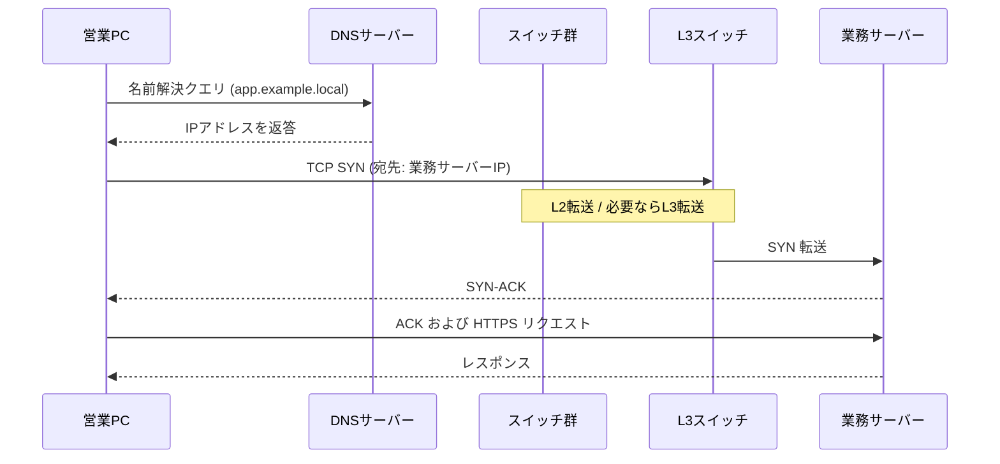

---

## 1.5 OSI参照モデル

**OSI参照モデル**（Open Systems Interconnection Reference Model：開放型システム間相互接続参照モデル）は、ISOが定めた7層の通信機能モデルである。現在のインターネット実装の主軸はTCP/IPだが、現場の会話、ドキュメント、障害切り分けではOSIの層番号が共通言語として使われ続ける。

| 層 | 名称 | 主な役割 | 現場で出てくる例 |
|----|------|----------|------------------|
| 7 | アプリケーション | ユーザー向けサービス | HTTP、DNS、SSH |
| 6 | プレゼンテーション | データの表現、暗号化の概念整理 | TLSをここで語る説明もある |
| 5 | セッション | セッションの管理 | 実務ではTCP/アプリに吸収されがち |
| 4 | トランスポート | エンド間の信頼性・ポート | TCP、UDP |
| 3 | ネットワーク | 論理アドレスと経路選択 | IP、ルーター |
| 2 | データリンク | 隣接ノード間のフレーム転送 | Ethernet、スイッチ、MAC |
| 1 | 物理 | 電気・光・無線の信号 | ケーブル、NIC、電波 |

実務では、次のように使う。

- 「L1障害」：リンクダウン、ケーブル抜け、SFP故障
- 「L2障害」：VLAN不一致、MACフラッディング、STPループ
- 「L3障害」：ルーティング欠落、サブネット設計ミス
- 「L4以上」：ポート閉塞、アプリ設定、DNS、証明書

厳密な学術分類と現場の俗称は完全一致しない。たとえばTLSをレイヤー6と呼ぶか、アプリケーションの話題として扱うかは文脈次第である。重要なのは、切り分けのときに「今どの問題を疑っているか」を共有できることである。

---

## 1.6 TCP/IPモデル

**TCP/IPモデル**（またはTCP/IPプロトコルスイートの層構造）は、インターネット実装に即した層分けである。資料により4層または5層で書かれる。

本書では、学習と切り分けのしやすさから次の対応で扱う。

| TCP/IP（本書の扱い） | 対応するOSI | 代表プロトコル／技術 |
|----------------------|-------------|----------------------|
| アプリケーション層 | OSI 5〜7 | HTTP、DNS、SSH、DHCP |
| トランスポート層 | OSI 4 | TCP、UDP |
| インターネット層 | OSI 3 | IP、ICMP、ARP※ |
| ネットワークインターフェース層 | OSI 1〜2 | Ethernet、Wi-Fi |

※ ARPの層归属には議論がある。IPアドレスからMACアドレスを解決する補助プロトコルとして、インターネット層の周辺で扱う説明が多い。本書もその立場を取る。

OSIは「機能の整理」、TCP/IPは「実装の束」と覚えるとよい。試験対策でも現場説明でも、両方の層名が出る。片方だけ暗記すると、ドキュメントを読み違える。

```text
OSI                TCP/IP（本書）
7 アプリケーション ┐
6 プレゼンテーション┼─ アプリケーション層
5 セッション       ┘
4 トランスポート ──── トランスポート層
3 ネットワーク   ──── インターネット層
2 データリンク   ┐
1 物理           ┴─ ネットワークインターフェース層
```

---

## 1.7 カプセル化と非カプセル化

### 1.7.1 カプセル化（送信側）

**カプセル化**（encapsulation）とは、上位層のデータを下位層がヘッダ（必要ならトレイラ）で包み、送信用の形へ変換していく処理である。

営業PCがHTTPリクエストを送る場合のイメージは次のとおりである。

1. アプリケーションデータ（HTTPリクエスト）を作る
2. トランスポート層がTCPヘッダを付与する → **セグメント**
3. インターネット層がIPヘッダを付与する → **パケット**
4. データリンク層がEthernetヘッダ／トレイラを付与する → **フレーム**
5. 物理層がビット列として媒体へ送出する

```text
[HTTPデータ]
   ↓ + TCPヘッダ
[TCPヘッダ|HTTPデータ]          ← セグメント
   ↓ + IPヘッダ
[IPヘッダ|TCPヘッダ|HTTPデータ] ← パケット
   ↓ + Ethernetヘッダ/FCS
[Eth|IP|TCP|HTTP|FCS]           ← フレーム
```

各装置は、自分の役割に必要なヘッダだけを見て処理する。スイッチは基本的にEthernetヘッダのMACを見る。ルーターはIPヘッダのネットワークアドレスを見る。ブラウザはHTTPの内容を扱う。

### 1.7.2 非カプセル化（受信側）

**非カプセル化**（decapsulation）は、受信側が下位層から順にヘッダを剥がし、上位層へデータを渡す処理である。

業務サーバー側では、フレーム受信 → Ethernet検査 → IP検査 → TCP検査 → HTTP処理、という順になる。途中でチェックに失敗すれば、その層で破棄またはエラー応答が発生し、上位まで届かない。

### 1.7.3 中間装置での再カプセル化

ルーターがパケットを次のネットワークへ転送するとき、IPパケットの中身（上位データ）は保持しつつ、出ていくインターフェースに合わせて新しいEthernetヘッダを付ける。

つまり中間のルーターは、「完全にアプリまで上がる」のではなく、主にレイヤー3まで処理して再カプセル化する。この理解がないと、「ルーターを通るとMACアドレスが変わるのはなぜか」が説明できない。

---

## 1.8 PDU、フレーム、パケット、セグメント

**PDU**（Protocol Data Unit：プロトコルデータユニット）は、ある層で扱うデータの単位を指す一般名称である。層ごとに慣用の呼び名がある。

| 層 | 慣用名称 | 中身のイメージ |
|----|----------|----------------|
| トランスポート | **セグメント**（TCP）／データグラム（UDP） | TCP/UDPヘッダ＋アプリデータ |
| ネットワーク | **パケット** | IPヘッダ＋セグメント |
| データリンク | **フレーム** | Ethernetヘッダ＋パケット＋FCS |
| 物理 | ビット | 電気・光・無線の信号 |

現場では「パケット」を総称として使うことも多い。切り分けや設計レビューでは、今どこの話をしているかを明確にするため、可能な限り層に応じた呼び名を使う。

「フレームが届かない」と言えばL2までを疑う。「パケットが届かない」と言えばL3の経路やACLを疑う。言葉が粗いと、調査範囲が無駄に広がる。

---

## 1.9 構成例

通貫シナリオの本社を、装置役割だけで簡略化する。

```text
                    +------------------+
                    |   インターネット  |
                    +--------+---------+
                             |
                    +--------+---------+
                    |  ファイアウォール |
                    +--------+---------+
                             |
              +--------------+--------------+
              |                             |
       +------+------+               +------+------+
       | ルーター R1 |               | ルーター R2 |
       +------+------+               +------+------+
              |                             |
              +--------------+--------------+
                             |
                    +--------+---------+
                    |  L3スイッチ Core |
                    +---+-----+-----+--+
                        |     |     |
              +---------+  +--+--+  +-----------+
              |            |     |              |
        +-----+-----+ +----+--+ +----+----+ +---+----+
        | Access SW | | DNS  | | 業務SRV | | DHCP   |
        +-----+-----+ +------+ +---------+ +--------+
              |
     +--------+--------+
     |        |        |
  営業PC   開発PC   管理PC
  (VLAN10) (VLAN20) (VLAN30)
```

この図から読み取れる設計意図は次である。

- PCはアクセススイッチに接続する（L2収容）
- 部署間とサーバーアクセスはL3スイッチがルーティングする
- インターネット境界にファイアウォールを置く
- エッジルーターを冗長化する（詳細は第7章）

第1章の時点では、まだVLANやOSPF、HSRPの設定値は出てこない。まず「誰が何を担当するか」を固定する。

---

## 1.10 Cisco IOSの設定例

第1章では、装置の「存在確認」と「基本識別」に留める。VLANやルーティングの本設定は後章で扱う。

### ホスト名と管理用の基本設定

```cisco
! 装置を識別する名前を付ける
Router(config)# hostname R1

! 特権EXECモードのパスワード（学習環境例。本番はAAA等を検討）
R1(config)# enable secret Str0ngP@ss

! コンソール回線の基本設定
R1(config)# line console 0
R1(config-line)# password ConsolePass
R1(config-line)# login
R1(config-line)# logging synchronous
R1(config-line)# exit

! 遠隔管理用にSSHを使う前提の最低限（詳細はセキュリティ章）
R1(config)# ip domain-name example.local
R1(config)# crypto key generate rsa modulus 2048
R1(config)# username admin privilege 15 secret AdminPass
R1(config)# line vty 0 4
R1(config-line)# transport input ssh
R1(config-line)# login local
```

主要パラメータの意味は次のとおりである。

- `hostname`：ログやプロンプトで装置を識別する
- `enable secret`：特権モードへ入るためのパスワード（secretは暗号化保存）
- `logging synchronous`：コンソール入力中にログが割り込んで見にくくなるのを防ぐ
- `transport input ssh`：VTYへはSSHのみ許可する（Telnetを避ける）

### インターフェースのリンク確認

```cisco
R1# show ip interface brief
! 各IFのIP、状態（Status/Protocol）を一覧する

R1# show interfaces GigabitEthernet0/0
! リンク状態、速度、デュプレックス、エラーカウンタを確認する
```

`Status` が `up` で `Protocol` が `down` の場合、物理的には何かしら見えていても、データリンク相当の確立に失敗している可能性がある。まずケーブル、対向設定、shutdown有無を疑う。

---

## 1.11 LinuxおよびWindowsでの確認例

エンドホスト側でも、自分の位置づけを確認できる。

### Windows

```bat
:: IPアドレス、サブネットマスク、デフォルトゲートウェイ、DNSを確認
ipconfig /all

:: 疎通確認（ICMPエコー）
ping 10.10.30.10

:: 経路上のホップを確認
tracert 10.10.30.10
```

### Linux

```bash
# 現行のIPとルート情報（ディストリにより ip コマンド推奨）
ip addr show
ip route show

# 疎通確認
ping -c 4 10.10.30.10

# 経路確認
traceroute 10.10.30.10
# または
tracepath 10.10.30.10
```

第1章で確認したいのは、次の3点である。

1. 自分のIPとマスクが設計どおりか
2. デフォルトゲートウェイが正しいか
3. 同一サブネット／別サブネットの代表アドレスへ ping が通るか

アプリの話（HTTP 500など）に進む前に、IP到達性を切り分ける習慣が、以降の全章の土台になる。

---

## 1.12 よくある誤解

1. **「スイッチとルーターは速さの違い」**  
   本質は速さではない。見るアドレス（MACかIPか）と、転送する範囲（同一ネットワーク内かネットワーク間か）の違いである。

2. **「OSIは古いから不要」**  
   実装の主軸はTCP/IPでも、障害票・設計レビュー・ベンダー資料ではL1〜L7の言葉が残る。共通言語として必要である。

3. **「ファイアウォールがあればルーターは不要」**  
   多くのファイアウォールはルーティングも行う。それでも、経路制御の設計と、ポリシー制御の設計は別問題として扱う必要がある。

4. **「pingが通れば業務は動く」**  
   pingは主にICMPの到達性確認である。TCP 443がACLで落ちていれば、pingは通ってもHTTPSは失敗する。

5. **「クラウドならネットワーク知識は不要」**  
   VPC、サブネット、ルートテーブル、セキュリティグループは、本書のLAN／WAN／ACLと同じ考え方の上にある。

---

## 1.13 代表的な障害

第1章の範囲で出会う典型例を挙げる。

| 症状 | ありがちな原因 | まず疑う層 |
|------|----------------|------------|
| リンクランプが消灯 | ケーブル断、ポートshutdown、NIC障害 | L1 |
| 同一VLANなのに不通 | VLAN未割り当て、ケーブルが別SWへ誤配線 | L2 |
| 同一フロアで部署サーバーだけ不通 | VLAN間ルーティング欠落、ゲートウェイ誤り | L3 |
| 名前を入れると失敗、IP直打ちは成功 | DNS設定ミス、DNSサーバー不通 | アプリ／基盤サービス |
| 社内は通るがインターネットだけ不通 | デフォルトルート、NAT、FWポリシー | L3＋境界制御 |

---

## 1.14 トラブルシューティング手順

疎通できないとき、第1章の知識だけでも次の順で切り分けられる。

1. **物理確認**：ケーブル、リンクランプ、対向ポートの up/down
2. **自ホスト確認**：`ipconfig` / `ip addr` でIP・マスク・ゲートウェイ・DNS
3. **同一セグメント確認**：同一VLAN内の別ホストへ ping
4. **ゲートウェイ確認**：デフォルトゲートウェイへ ping
5. **遠隔ネットワーク確認**：別VLANや支社、外部への ping / traceroute
6. **名前解決確認**：IP直打ちとホスト名指定の差を見る
7. **サービス確認**：ポート到達（後章の `Test-NetConnection` や `ss`/`nc`）

下位層が壊れているのに上位のアプリログだけを見ても、原因には辿り着きにくい。必ず下から、または「今どの層が成立しているか」を確認しながら進む。

---

## 1.15 設計・運用上の注意点

1. **構成図を最新に保つ**  
   障害対応の初動は、正しい構成図の有無で大きく変わる。論理図（VLAN/IP）と物理図（ケーブリング）を分ける。

2. **アドレス設計を先に決める**  
   場当たり的なIP追加は、後の要約ルートやACLを壊す。通貫シナリオのように部署単位でまとめる。

3. **管理用通信経路を確保する**  
   本番データプレーンが落ちても、装置へログインできる経路（アウトオブバンドなど）を検討する。

4. **標準とベンダー固有を混同しない**  
   例：EthernetやIPは標準、DTPやHSRPはCisco色が強い（後章）。資料を読むとき、どちらなのかを先に確認する。

5. **変更は検証可能な単位で行う**  
   「VLANもルーティングもFWも同時変更」は切り分け不能を招く。

---

## 1.16 要点まとめ

- ネットワークの目的は、資源共有、コミュニケーション、可用性向上である
- LAN／WAN／インターネットは、スコープと管理主体で区別する
- スイッチはMAC、ルーターはIP、ファイアウォールはポリシーを主に扱う
- 通信は、名前解決 → 到達性 → トランスポート → アプリケーションの順で積み上がる
- OSIは機能整理、TCP/IPは実装の束。両方を対応づけて使う
- カプセル化は送信側の包み込み、非カプセル化は受信側の剥離である
- PDUの呼び名（セグメント／パケット／フレーム）は、切り分け範囲を共有する言葉である

---

## 1.17 章末問題

### 問題1

本社の営業PCから支社PCへ通信するとき、LAN、WAN、インターネットのどれを経由し得るか。通貫シナリオの構成を前提に説明せよ。

### 問題2

スイッチとルーターの違いを、「参照するアドレス」と「接続するネットワークの関係」の2点で述べよ。

### 問題3

OSIのレイヤー2障害とレイヤー3障害の切り分け例を、それぞれ1つ挙げよ。

### 問題4

送信側ホストで、HTTPデータがフレームになるまでのカプセル化の順序を述べよ。

### 問題5

`ping` は成功するがブラウザで社内Webが開けないとき、第1章の範囲で疑うべき点を2つ挙げよ。

---

## 1.18 解答と解説

### 解答1

営業PC（本社LAN）から支社PC（支社LAN）へは、本社と支社を結ぶWAN（専用線やVPNなど）を経由する。インターネットを経由する構成もあり得るが、通貫シナリオの基本形は本社エッジと支社ルーターを結ぶWAN経路である。支社内のスイッチ配線部分はそれぞれのLANである。

### 解答2

スイッチは主にMACアドレスを参照し、同一ネットワーク内でフレームを転送する。ルーターはIPアドレスを参照し、異なるネットワーク間でパケットを転送する。

### 解答3

例：レイヤー2は「アクセスポートのVLAN ID不一致で同一フロアなのに不通」。レイヤー3は「デフォルトゲートウェイ誤り、またはVLAN間ルート欠落で別部署サーバーに届かない」。

### 解答4

アプリケーションデータ → TCPヘッダ付与（セグメント） → IPヘッダ付与（パケット） → Ethernetヘッダ／FCS付与（フレーム） → 物理信号として送出。

### 解答5

例：(1) DNSによる名前解決の失敗（IP直打ちでは成功し得る）。(2) ICMPは許可されているがTCP 443がACLやファイアウォールで拒否されている。

---

## 1.19 実機またはシミュレーター演習

Cisco Packet Tracer、GNS3、CML、実機のいずれかを使い、最小構成を作る。

### 演習A：3台の基本疎通

1. PC-A、PC-B、スイッチを接続する
2. PC-Aに `192.168.1.10/24`、PC-Bに `192.168.1.20/24` を設定する
3. 相互に ping し、成功を確認する
4. PC-BのIPを `192.168.2.20/24` に変更し、pingが失敗することを確認する
5. 失敗の理由を、ネットワーク部が異なるためL2だけでは届かない（ゲートウェイが必要）という観点から説明し、レポートに書く

### 演習B：層の言葉で症状を書く

1. ケーブルを抜いて ping を実行する
2. ケーブルを戻し、意図的にPCのゲートウェイを誤設定して ping する
3. それぞれの失敗を、「L1の問題」「L3の問題」として障害票風に1行で記録する

記録例：

```text
[障害票]
症状: PC-AからPC-Bへping不可
確認: PC-Aのnicリンクランプ消灯
判断: L1（物理リンクダウン）を先に復旧する
```

### 演習C：通貫シナリオの図を自分の言葉で再描画する

1. 本章の構成図を見ずに、本社のクライアント／サーバー／SW／ルータ／FWの関係を描く
2. 「営業PCが業務サーバーへHTTPSする」経路を太線で示す
3. その経路上で、各装置が主に見るヘッダ（MAC／IP／ポリシー）を書き込む

この演習が終わった時点で、第2章以降のEthernet、IP、TCP、VLANの話が「どこに刺さる知識か」が見えている状態になる。

---

## 次章への橋渡し

同一LAN内で、スイッチはどのように宛先へフレームを届けるのか。

その答えの中心が、EthernetとMACアドレスである。第2章では、スイッチの学習と転送、フラッディング、ブロードキャストドメインを扱う。


---


<!-- ========== 02_ethernet_lan.md ========== -->

# 第2章 EthernetとLAN

## 学習目標

この章を終えると、次のことができる。

1. EthernetがLANの事実上の標準になった理由を、歴史的経緯と現在の利用形態から説明できる
2. MACアドレスの構造と、Ethernetフレームの各フィールドの役割を説明できる
3. ユニキャスト、ブロードキャスト、マルチキャストの違いを、宛先MACアドレスの形式で区別できる
4. スイッチのMACアドレス学習、転送、フラッディングの動作を、MACアドレステーブルの状態変化として追える
5. コリジョンドメインとブロードキャストドメインの違いを、装置境界と設定で説明できる
6. 全二重、半二重、オートネゴシエーションの仕組みと、デュプレックスミスマッチの症状を切り分けできる

---

## 2.1 この章で学ぶこと

第1章では、PCからサーバーへ届くまでの流れを、装置の役割ごとに大づかみに整理した。

その中で、スイッチは「同一ネットワーク内でMACアドレスを手がかりにフレームを転送する装置」とだけ説明した。

ここからは、その説明を分解する。

MACアドレスとは何か、Ethernetフレームはどんな形をしているか、スイッチはどうやってMACアドレスを覚え、どこへ転送するかを、通貫シナリオのアクセススイッチとPCの関係で具体的に追う。

第1章の図でいえば、営業PCと管理PCを収容するアクセスSW Aの内部で、実際に何が起きているかを見る章である。

---

## 2.2 技術が必要になった背景

複数の端末を1本の共有媒体につなぐ発想は、Ethernetより前から存在した。

初期のEthernet（同軸ケーブルを使うバス型構成）では、すべての端末が同じ電気信号の通り道を共有していた。

共有媒体では、複数の端末が同時に送信すると信号が衝突し、データが壊れる。

この衝突（コリジョン）を検出し、再送する仕組みとして生まれたのが、CSMA/CD（Carrier Sense Multiple Access with Collision Detection：搬送波感知多重アクセス／衝突検出）である。

端末が増えるほど、衝突の確率は上がり、実効的な通信性能は下がっていく。

この問題を緩和するために、ケーブル配線はバス型からスター型へ移り、集線装置もハブからスイッチへ置き換わっていった。

ハブは電気信号をそのまま全ポートへ再送出するだけの装置であり、衝突ドメインを分割しない。

スイッチは、宛先ごとに必要なポートだけへフレームを転送できるため、衝突ドメインを大幅に縮小し、全二重通信を実用的にした。

現在の企業LANでは、PCとスイッチの間、スイッチとスイッチの間のほとんどが専用の全二重リンクであり、古典的な意味での衝突はほぼ発生しない。

それでも「コリジョンドメイン」という考え方自体は、ケーブル配線ミスや設定ミスによる異常を理解するうえで、いまも有効な整理軸である。

もう一つの背景として、「同じネットワーク内の端末をどう識別するか」という問題がある。

IPアドレスは管理者が割り当てる論理的な住所だが、Ethernetの世界では、機器を出荷した時点で一意な識別子が必要になる。

この要求に応えるのがMACアドレスであり、ベンダーごとに割り当てられる番号体系によって、世界中でほぼ重複しない識別が可能になっている。

---

## 2.3 基本概念

### 2.3.1 Ethernetの基本

**Ethernet**（イーサネット）は、IEEE 802.3として標準化された、LANにおけるデータリンク層（レイヤー2）の技術群である。

配線方式、信号方式、フレーム形式を含む標準の集合体であり、特定のベンダーに属さない標準技術である。

現在主流のツイストペアケーブル（UTP／STPケーブル）を使うEthernetでは、送信線と受信線が物理的に分かれているため、双方向を同時に使える全二重通信が前提になっている。

速度規格は、10BASE-T（10Mbps）から始まり、100BASE-TX（100Mbps）、1000BASE-T（1Gbps）、10GBASE-T（10Gbps）などへと拡張されてきた。

規格名の数字部分がおおよその速度を表し、末尾の文字がケーブル種別や信号方式を表すという命名規則を知っておくと、機器の仕様書を読みやすくなる。

企業LANの設計者にとって重要なのは規格そのものの歴史よりも、「アクセス層はどの速度で統一するか」「上位のアップリンクはどれだけ帯域を確保するか」という設計判断である。

通貫シナリオでは、アクセスSW A／Bの各ポートは1000BASE-Tで統一し、コアスイッチへのアップリンクにはより高速なリンクを割り当てる、という設計方針を前提にする。

### 2.3.2 MACアドレス

**MACアドレス**（Media Access Control address：メディアアクセス制御アドレス）は、Ethernetにおいてネットワークインターフェースを一意に識別するための48ビットの識別子である。

表記は、`00:1A:2B:3C:4D:5E` のように、16進数2桁を6組コロンまたはハイフンで区切る形式が一般的である。

Cisco機器では `001A.2B3C.4D5E` のように4桁ずつドットで区切る表記もよく使われる。

MACアドレスの上位24ビットは、**OUI**（Organizationally Unique Identifier：組織固有識別子）と呼ばれ、IEEEが製造ベンダーへ割り当てる番号である。

下位24ビットは、そのベンダーが製品ごとに割り当てるシリアル部分であり、原則として世界で重複しない値になる。

MACアドレスは、工場出荷時にNIC（Network Interface Card：ネットワークインターフェースカード）へ焼き込まれることから「バーンドインアドレス」とも呼ばれるが、OSやドライバの設定でソフトウェア的に上書き（MACアドレス偽装）することも技術的には可能である。

IPアドレスが「どのネットワークの、どの端末か」を表す論理的な住所であるのに対し、MACアドレスは「どの物理インターフェースか」を表す識別子であり、ネットワークをまたいでも変わらない点が異なる。

### 2.3.3 Ethernetフレームの構造

**Ethernetフレーム**は、データリンク層でやり取りされるデータの単位であり、IPパケットをEthernetヘッダとトレイラで包んだものである。

代表的なフレーム形式（Ethernet II）の主なフィールドは次のとおりである。

| フィールド | 長さの目安 | 役割 |
|------------|------------|------|
| 宛先MACアドレス | 6バイト | フレームの受信対象を指定する |
| 送信元MACアドレス | 6バイト | フレームの送信元を示す |
| タイプ（EtherType） | 2バイト | 上位プロトコルの種別（IPv4なら`0x0800`など）を示す |
| データ（ペイロード） | 46〜1500バイト | 上位層のパケットが入る部分 |
| FCS（Frame Check Sequence） | 4バイト | 誤り検出用のチェックサム（CRC） |

**FCS**は、送信側がフレームの内容から計算した誤り検出符号であり、受信側は同じ計算を行って値が一致するかを確認する。

一致しなければ、そのフレームは壊れているとみなされ、破棄される。

一般的なEthernetフレームは、ペイロード部分の最大長（MTU：Maximum Transmission Unit）が1500バイトに制限されており、これより大きなデータは上位層で分割されるか、ジャンボフレームのような拡張機能を使う必要がある。

フレーム全体の最小長は64バイトと定められており、これより短いフレームは衝突による断片とみなされ、不正フレーム（ランツ・フレーム）として扱われる。

### 2.3.4 ユニキャスト、ブロードキャスト、マルチキャスト

宛先MACアドレスの形式によって、フレームの届く範囲が変わる。

**ユニキャスト**（unicast）は、1台の特定の受信者へ宛てた通信である。

宛先MACアドレスは、特定の1つのインターフェースを指す通常のMACアドレスであり、日常のPC間通信、PCとサーバー間の通信のほとんどはユニキャストである。

**ブロードキャスト**（broadcast）は、同一ネットワーク内のすべての端末へ宛てた通信である。

Ethernetのブロードキャストアドレスは `FF:FF:FF:FF:FF:FF` と定められており、スイッチはこの宛先を受け取ったポート以外のすべてのポートへフレームを送出する。

ARP要求（第4章で扱う）やDHCP要求の一部は、ブロードキャストとして送られる代表例である。

**マルチキャスト**（multicast）は、あらかじめ登録された特定のグループの端末へ宛てた通信である。

Ethernetのマルチキャストアドレスは、先頭バイトの特定のビットが1に設定された範囲のアドレスとして識別され、OSPF（第6章）のようなルーティングプロトコルのやり取りや、映像配信などで使われる。

ブロードキャストは「全員に配る」、マルチキャストは「希望者だけに配る」という整理をすると、両者の使い分けが理解しやすくなる。

### 2.3.5 スイッチのMACアドレス学習とMACアドレステーブル

**スイッチ**は、受信したフレームの送信元MACアドレスと、受信したポート番号の対応関係を記録することで、宛先へ効率よく転送できるようになる。

この対応表を**MACアドレステーブル**（CAM：Content Addressable Memoryとも呼ばれる）という。

学習の流れは次のとおりである。

1. スイッチのポートにフレームが届く
2. フレームの送信元MACアドレスを見て、「このMACアドレスは、このポートの先にいる」とMACアドレステーブルへ登録する
3. フレームの宛先MACアドレスを見て、MACアドレステーブルに一致するエントリがあれば、そのポートだけへ転送する
4. 一致するエントリがなければ、後述のフラッディングを行う

MACアドレステーブルのエントリには通常、有効期限（エージングタイム）が設定されており、一定時間（Cisco機器の初期値は300秒であることが多い）フレームを受信しないエントリは自動的に削除される。

これにより、PCの接続位置が変わったり、機器が撤去されたりしても、古い情報がいつまでも残り続けることを防いでいる。

同じMACアドレスが短時間に別のポートから学習し直される現象は「MACアドレスのフラッピング」と呼ばれ、多くの場合、配線ミスによるループや、意図しない二重接続の兆候である。

### 2.3.6 フラッディング

**フラッディング**（flooding）は、宛先MACアドレスがMACアドレステーブルに存在しない場合に、受信したポート以外のすべてのポートへフレームを送出する動作である。

スイッチ起動直後や、長時間通信のなかった端末宛のフレームでは、宛先がまだ学習されていないため、フラッディングが発生する。

ブロードキャストフレームとマルチキャストフレーム（未登録の場合）も、同様に該当VLAN内の全ポートへ送出される。

フラッディングは異常ではなく、スイッチの正常な動作の一部である。

ただし、フラッディングされる範囲が広すぎると、無駄なトラフィックが増え、機器の処理負荷も上がるため、ブロードキャストドメインの設計（VLAN分割、第5章）が重要になる。

### 2.3.7 コリジョンドメインとブロードキャストドメイン

**コリジョンドメイン**（collision domain：衝突ドメイン）とは、送信したフレームが他の端末の送信と衝突する可能性がある範囲を指す。

ハブで接続された区間は、すべての端末が同じコリジョンドメインに属する。

スイッチは、ポートごとに独立したコリジョンドメインを作る。

さらに、現在主流の全二重リンクでは、送信と受信が別の信号線を使うため、理論上は衝突そのものが発生しない。

**ブロードキャストドメイン**（broadcast domain）とは、ブロードキャストフレームが届く範囲を指す。

スイッチは、標準の状態ではブロードキャストドメインを分割しない。

同一VLAN内であれば、複数のスイッチをまたいでいても、同じブロードキャストドメインに属する。

ブロードキャストドメインを分割するのは、ルーター（またはL3スイッチ）とVLANの境界である。

| 観点 | コリジョンドメイン | ブロードキャストドメイン |
|------|---------------------|--------------------------|
| 分割する装置 | スイッチのポート単位（ハブは分割しない） | ルーター、L3スイッチ、VLAN境界 |
| 全二重リンクでの扱い | 実質的にほぼ消滅する | 全二重かどうかとは無関係に存在する |
| 広すぎる場合の問題 | 衝突増加、性能劣化（現在は稀） | ブロードキャストの氾濫、CPU負荷、障害波及範囲の拡大 |

通貫シナリオでは、アクセスSW Aの各ポートがそれぞれ独立したコリジョンドメインであり、VLAN10（営業）全体が1つのブロードキャストドメインになる。

### 2.3.8 全二重、半二重、オートネゴシエーション

**半二重**（half duplex）は、送信と受信を同時に行えず、どちらか一方向ずつ交互に通信する方式である。

古い同軸ケーブルのEthernetや、一部の無線通信は半二重を前提とする。

**全二重**（full duplex）は、送信と受信を独立した信号線（または周波数帯）で同時に行える方式である。

現在のツイストペアEthernetのスイッチポートは、ほとんどの場合全二重で動作する。

**オートネゴシエーション**（auto-negotiation）は、リンクの両端が、対応可能な速度とデュプレックス（全二重／半二重）を自動的に検出し、双方が対応できる最良の組み合わせに合わせる仕組みであり、IEEE 802.3で標準化された機能である。

オートネゴシエーションが正しく機能しない、または片側だけを固定設定にしてしまうと、**デュプレックスミスマッチ**（duplex mismatch）と呼ばれる状態が起きる。

デュプレックスミスマッチでは、片方が半二重、もう片方が全二重で動作してしまい、リンク自体は「アップ」しているのに、通信が極端に遅くなったり、特定のサイズ以上の通信でエラーが多発したりする。

この現象は、リンクランプが点灯しているため物理層の問題には見えにくく、切り分けを誤りやすい典型例である。

---

## 2.4 通信や処理の流れ

営業PCから、同一VLAN内の別の営業PCへEthernetフレームが届くまでの流れを、スイッチ内部の視点で追う。

前提として、両方のPCはアクセスSW Aの異なるポートに接続されており、送信元は宛先のMACアドレスをすでに知っているものとする（実際の解決方法は第4章のARPで扱う）。

1. 送信元PCが、宛先MACアドレスを指定したEthernetフレームを組み立てて送出する
2. アクセスSW Aが、送信元PCの接続ポートでフレームを受信する
3. スイッチは、フレームの送信元MACアドレスとポート番号をMACアドレステーブルへ記録（未登録なら追加、既登録なら更新）する
4. スイッチは、フレームの宛先MACアドレスをMACアドレステーブルで検索する
5. 一致するエントリが見つかれば、そのポートだけへフレームを転送する（それ以外のポートには送らない）
6. 一致するエントリが見つからなければ、受信ポート以外の全ポートへフラッディングする
7. 宛先PCがフレームを受信し、必要であれば同様の手順で応答を返す

同一スイッチ内で完結する通信では、上位のL3スイッチやルーターは一切関与しない。

これは、第1章で説明した「同一ネットワーク内はレイヤー2で完結する」という原則の具体的な中身である。

MACアドレステーブルが空の状態（スイッチ起動直後や、久しぶりに通信する端末宛）では、最初の1〜数フレームはフラッディングされ、応答を受け取った時点で双方向のエントリが揃う。

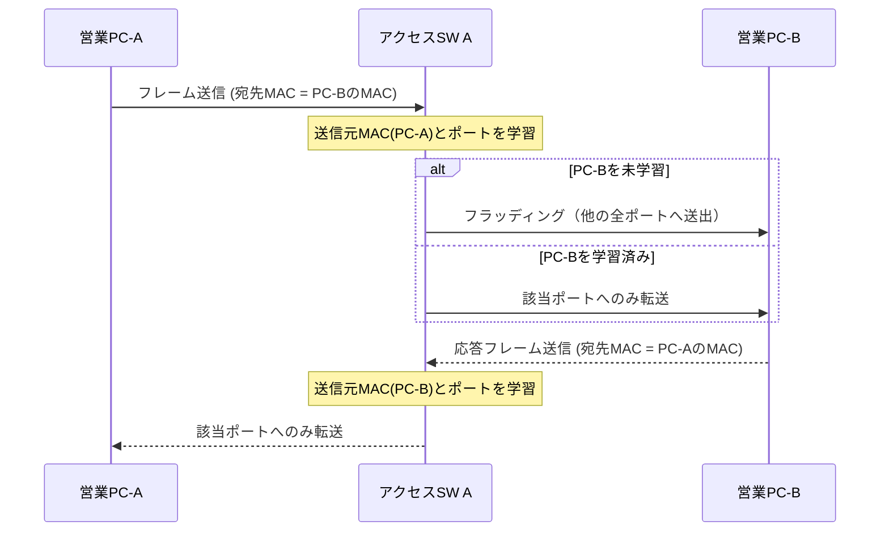

---

## 2.5 構成例

コリジョンドメインとブロードキャストドメインの範囲を、通貫シナリオの本社アクセス層で図示する。

```text
                         +------------------+
                         |   L3スイッチ Core |
                         +---------+--------+
                                   |
                          +--------+--------+
                          |   アクセスSW A   |
                          +---+----+----+---+
                              |    |    |
                        +-----+  +-+--+  +-----+
                        |        |    |        |
                     営業PC-A  営業PC-B      管理PC
                    (VLAN10)  (VLAN10)     (VLAN30)

  コリジョンドメイン: 各スイッチポートごとに独立（全二重前提でほぼ実害なし）
  ブロードキャストドメイン: VLAN10全体で1つ、VLAN30は別の1つ
```

この図で押さえておきたい点は次のとおりである。

- アクセスSW Aのポート単位では、それぞれが独立したコリジョンドメインである
- 同じVLAN10に属する営業PC-AとPC-Bは、同じブロードキャストドメインに属する
- VLAN30（管理）は別のブロードキャストドメインであり、VLAN10のブロードキャストは届かない
- VLAN間の通信にはL3スイッチの介在が必要である（VLAN間ルーティングは第5章で扱う）

現時点ではアクセスSW Aを単一VLANの延長のように描いているが、実際には1台のスイッチが複数VLANを収容し、ポートごとに所属VLANを割り当てる。

その具体的な設定方法は第5章のアクセスポート／トランクポートで扱う。

---

## 2.6 Cisco IOSの設定例

Ethernetに関連する基本的な確認・設定コマンドを示す。

VLANそのものの設定は第5章で扱うため、ここではインターフェース単位の物理・データリンク層の設定に絞る。

### 速度とデュプレックスの設定

```cisco
! インターフェースの説明を残す（運用上、非常に重要）
SW-A(config)# interface GigabitEthernet1/0/1
SW-A(config-if)# description Sales-PC-A

! 速度とデュプレックスを固定する場合の例
SW-A(config-if)# speed 1000
SW-A(config-if)# duplex full

! オートネゴシエーションに任せる場合（多くの現場での既定）
SW-A(config-if)# speed auto
SW-A(config-if)# duplex auto
```

主要パラメータの意味は次のとおりである。

- `description`：ポートの用途を記録する。障害対応や棚卸しの効率が大きく変わる
- `speed` / `duplex`：明示的に固定すると、対向機器も同じ設定でなければデュプレックスミスマッチの原因になる
- `speed auto` / `duplex auto`：対向機器も自動設定であれば、通常はこちらを推奨する

固定設定は「意図的に固定したい」明確な理由（古い機器との相性、監視ツールの都合など）がある場合に限定し、両端を必ず揃えることが原則である。

### MACアドレステーブルの確認

```cisco
SW-A# show mac address-table
! VLAN、MACアドレス、種別（DYNAMIC/STATIC）、ポートの一覧を表示する

SW-A# show mac address-table interface GigabitEthernet1/0/1
! 特定ポートで学習しているMACアドレスのみ表示する

SW-A# show mac address-table count
! 学習エントリの総数を確認する（CAMテーブルの上限管理に使う）
```

出力例のイメージは次のとおりである。

```text
Vlan    Mac Address       Type        Ports
----    -----------       --------    -----
  10    0011.2233.4455    DYNAMIC     Gi1/0/1
  10    0011.2233.66aa    DYNAMIC     Gi1/0/2
  30    0011.2233.7788    DYNAMIC     Gi1/0/10
```

同じMACアドレスが短時間で別のポートに移動する（前のエントリが消え、別ポートに現れる）場合は、ループやMACアドレス詐称の可能性を疑う材料になる。

### インターフェースの状態とエラーカウンタ

```cisco
SW-A# show interfaces GigabitEthernet1/0/1
! Duplex、Speedの実際の折衝結果、入出力エラー、CRCエラー数などを確認する

SW-A# show interfaces status
! 全ポートの接続状態、VLAN、Duplex、Speedを一覧できる
```

`show interfaces` の出力中、`late collision`（レイトコリジョン）や `CRC errors` が継続的に増加している場合は、ケーブル不良かデュプレックスミスマッチを疑う代表的なサインである。

---

## 2.7 LinuxおよびWindowsでの確認例

エンドホスト側でも、Ethernetインターフェースの状態を確認できる。

### Windows

```powershell
# ネットワークアダプタの一覧、リンク速度、状態を確認
Get-NetAdapter

# 物理アドレス（MACアドレス）を含む詳細情報
ipconfig /all

# アダプタの詳細プロパティ（速度・デュプレックスの設定確認）
Get-NetAdapterAdvancedProperty -Name "イーサネット"
```

### Linux

```bash
# インターフェース一覧とMACアドレス（link/ether）の確認
ip link show

# 特定インターフェースのリンク速度・デュプレックス・オートネゴシエーション状態
ethtool eth0

# インターフェースの統計情報（エラー、ドロップ数など）
ip -s link show eth0
```

`ethtool` の出力にある `Speed`、`Duplex`、`Auto-negotiation` の3項目は、スイッチ側の `show interfaces status` の結果と必ず突き合わせて確認する。

片方だけを見て「正常」と判断すると、デュプレックスミスマッチのようなリンクの両端で不整合が起きている障害を見逃す。

---

## 2.8 よくある誤解

1. **「スイッチはハブと同じで、全ポストに転送する」**  
   スイッチはMACアドレステーブルに基づき、宛先ポートだけへ転送する。フラッディングが起きるのは、宛先が未学習のブロードキャスト、マルチキャスト、または未知のユニキャストの場合に限られる。

2. **「全二重にすればコリジョンドメインの話は不要になる」**  
   全二重では衝突自体はほぼ起きないが、コリジョンドメインという概念は、機器境界を理解するための整理として今でも有効である。ブロードキャストドメインとの混同を避けるためにも、両者を分けて理解する必要がある。

3. **「MACアドレスは変更できない」**  
   工場出荷時の値は変更できないが、OSやドライバの設定でソフトウェア的に上書きできる場合がある。これはトラブルシューティングだけでなく、セキュリティ上の注意点でもある。

4. **「オートネゴシエーションは常に信頼できる」**  
   古い機器や一部の光ファイバーモジュールでは、オートネゴシエーションがうまく機能しないことがある。リンクアップしていても速度・デュプレックスの不整合が起きうる。

5. **「リンクランプが点灯していれば通信は正常」**  
   リンクランプは主に物理層のリンク確立を示すだけであり、デュプレックスミスマッチやMTU不一致のような、上位層の性能問題までは保証しない。

---

## 2.9 代表的な障害

| 症状 | ありがちな原因 | 確認の切り口 |
|------|----------------|--------------|
| 通信は成立するが極端に遅い | デュプレックスミスマッチ | 両端の `show interfaces` / `ethtool` の速度・デュプレックスを突き合わせる |
| 特定ポートでCRCエラーが増え続ける | ケーブル不良、コネクタ劣化、ノイズ | ケーブル交換、配線経路（電源線との並走など）を確認する |
| 同じ端末のMACが複数ポートを行き来する | 配線ループ、二重接続 | `show mac address-table` の変化履歴、STP状態（第7章）を確認する |
| 特定VLANだけ通信が極端に遅い、または全断する | ブロードキャストストーム（ループに起因） | CPU使用率、ブロードキャストトラフィック量、ループ箇所の特定 |
| 新しく接続した端末が全く見えない | ポートのshutdown、ケーブル未結線、NIC故障 | `show interfaces status` のポート状態確認 |

---

## 2.10 トラブルシューティング手順

Ethernetレベルの疎通トラブルは、次の順で切り分けると効率がよい。

1. **物理層の確認**：リンクランプ、ケーブル種別、コネクタの状態を確認する
2. **ポート状態の確認**：`show interfaces status` でconnected/notconnect/err-disabledのいずれかを確認する
3. **速度・デュプレックスの突き合わせ**：スイッチ側とホスト側の設定・折衝結果が一致しているかを確認する
4. **エラーカウンタの確認**：CRCエラー、コリジョン、ランツ、ジャイアントの有無を確認する
5. **MACアドレステーブルの確認**：期待する端末のMACが正しいポートで学習されているかを確認する
6. **同一VLAN内での基本疎通確認**：同一ブロードキャストドメイン内の別端末とpingが通るかを確認する
7. **ループの疑いがあれば構成図と実配線を突き合わせる**：意図しない二重配線がないかを確認する（詳細な防止策は第7章）

デュプレックスミスマッチは、pingは通るのに大きなファイル転送だけが極端に遅い、という形で現れることが多く、単純な疎通確認だけでは見逃しやすい障害の代表例である。

---

## 2.11 設計・運用上の注意点

1. **速度・デュプレックスの設定方針を統一する**  
   固定設定と自動設定が混在すると、機器交換のたびにミスマッチのリスクが生まれる。特別な理由がない限り、両端ともオートネゴシエーションに統一する。

2. **ポートの説明（description）を必ず入力する**  
   接続先が分かるだけで、障害対応時の初動が大きく短縮される。

3. **CAMテーブルのサイズを意識する**  
   大規模なフラットL2ネットワークでは、MACアドレステーブルの上限に達し、想定外のフラッディングが増える場合がある。VLAN分割やアクセス層の設計で範囲を制御する。

4. **不要なブロードキャストドメインの肥大化を避ける**  
   1つのVLANに端末を詰め込みすぎると、ブロードキャストの影響範囲が広がる。部署やフロア単位でVLANを分割する方針は第5章で扱う。

5. **エラーカウンタを定期的に監視する**  
   CRCエラーやコリジョンの増加は、障害が顕在化する前の予兆であることが多い。監視の仕組み（第4章のSNMP、第10章の運用）とあわせて設計する。

---

## 2.12 要点まとめ

- Ethernetは、IEEE 802.3で標準化されたレイヤー2の技術群であり、特定ベンダーに依存しない
- MACアドレスは48ビットの識別子で、上位24ビットがベンダーを表すOUI、下位24ビットが製品固有の番号である
- Ethernetフレームは、宛先/送信元MACアドレス、タイプ、データ、FCSから構成される
- ユニキャストは1対1、ブロードキャストは同一ネットワーク内全員、マルチキャストは登録グループ宛の通信である
- スイッチは送信元MACアドレスとポートを学習し、MACアドレステーブルに基づいて転送する
- 宛先未学習のフレームは、受信ポート以外の全ポートへフラッディングされる
- コリジョンドメインはスイッチポート単位で分割され、ブロードキャストドメインはVLAN境界（ルーター／L3スイッチ）で分割される
- デュプレックスミスマッチは、リンクアップしたまま性能劣化やエラー増加を引き起こす典型的な障害である

---

## 2.13 章末問題

### 問題1

ハブとスイッチの違いを、コリジョンドメインの観点から説明せよ。

### 問題2

同一VLAN内の2台のPC間で、片方のMACアドレスがまだ学習されていない場合、スイッチはどう動作するか。

### 問題3

コリジョンドメインとブロードキャストドメインを、それぞれどの装置・境界が分割するかを対比して説明せよ。

### 問題4

デュプレックスミスマッチが起きたとき、リンクの状態と通信の症状はそれぞれどうなるか。

### 問題5

`show mac address-table` で、同じMACアドレスが短時間に別のポートへ移動している場合、まず何を疑うべきか。

---

## 2.14 解答と解説

### 解答1

ハブは受信した信号をすべてのポートへそのまま流すため、接続されたすべての端末が1つのコリジョンドメインを共有する。スイッチはポートごとにMACアドレステーブルを用いて宛先ポートだけへ転送するため、各ポートが独立したコリジョンドメインになる。

### 解答2

宛先MACアドレスがMACアドレステーブルに存在しないため、スイッチは受信ポート以外のすべてのポートへフラッディングする。宛先PCが応答すれば、その送信元MACアドレスとポートが新たに学習され、以降は該当ポートへのみ転送されるようになる。

### 解答3

コリジョンドメインは、スイッチのポート単位（ハブは分割しない）で分割される。ブロードキャストドメインは、ルーターやL3スイッチ、およびVLANの境界で分割される。同じスイッチ内でも、VLANが異なればブロードキャストドメインは別になる。

### 解答4

物理的なリンクアップ自体は成立するため、リンクランプは点灯し、`show interfaces` 上も `up/up` に見えることが多い。一方で、片方が半二重、もう片方が全二重で動作するため、通信は成立しつつ極端に遅くなったり、特定のトラフィック量でエラーが急増したりする。

### 解答5

配線ループや意図しない二重接続の可能性を疑う。STPが正しく機能していない、または未導入の環境で物理的なループが存在すると、同じ端末のフレームが複数の経路から到達し、MACアドレスの学習先が短時間で入れ替わる現象（フラッピング）が起きる。

---

## 2.15 実機またはシミュレーター演習

Cisco Packet Tracer、GNS3、CML、実機のいずれかを使う。

### 演習A：MACアドレステーブルの観察

1. スイッチに3台のPCを接続し、同一VLAN・同一サブネットのIPアドレスを設定する
2. スイッチ起動直後に `show mac address-table` を実行し、エントリが空であることを確認する
3. PC-AからPC-Bへ ping を実行した直後に再度 `show mac address-table` を確認し、エントリが増えた様子を記録する
4. PC-Cからも通信を発生させ、3台分のエントリが揃うことを確認する

### 演習B：フラッディングとブロードキャストの観察

1. PC-AからPC-B宛にpingを送る前に、あらかじめPC-Bを長時間通信させず、スイッチのMACテーブルからPC-Bのエントリをエージングアウトさせる（または `clear mac address-table dynamic` を使う）
2. 直後にPC-AからPC-Bへpingを送り、フラッディングが発生する（他のポートにも一時的にトラフィックが流れる）ことを、パケットキャプチャまたはシミュレーターの可視化機能で確認する
3. ARP要求（ブロードキャスト）がどのポートまで届くかも合わせて観察する

### 演習C：デュプレックスミスマッチの再現

1. スイッチのポートと対向PCのNICで、片方を `duplex full` 固定、もう片方を `duplex half` 固定にする（可能な環境の場合）
2. 大きめのファイル転送やpingの連続実行で、エラーカウンタ（`show interfaces` のcollisionsやCRC errors）の増加を観察する
3. 両端を `auto` に戻し、症状が解消することを確認し、障害票の形式で記録する

```text
[障害票]
症状: 特定PCとの通信が異常に遅い、pingは成功
確認: スイッチ側duplex full固定、PC側duplex half固定
判断: デュプレックスミスマッチ。両端をautoに統一して解消
```

---

## 次章への橋渡し

同一ネットワーク内での転送はMACアドレスで完結するが、異なるネットワーク同士をどう識別し、どう区切るかにはIPアドレスの構造が関わる。

第3章では、IPv4アドレスの構造、サブネットマスク、サブネット分割の計算手順を扱う。


---


<!-- ========== 03_ip_subnet.md ========== -->

# 第3章 IPアドレスとサブネット

## 学習目標

この章を終えると、次のことができる。

1. IPv4アドレスをネットワーク部とホスト部に分解し、その境界の意味を説明できる
2. サブネットマスクとCIDR表記を、相互に変換できる
3. プライベートIPアドレスとグローバルIPアドレス、ネットワークアドレスとブロードキャストアドレスを区別できる
4. サブネット分割とVLSMを、途中の2進数計算を省略せず自力で計算できる
5. IPv6の基本構造と主要なアドレス種別を、IPv4との対比で説明できる

---

## 3.1 この章で学ぶこと

第2章では、同一ネットワーク内でスイッチがMACアドレスを使ってフレームを届ける仕組みを扱った。

同一ネットワーク内という前提そのものが、ここからの主題になる。

「同一ネットワークかどうか」を判定しているのはIPアドレスとサブネットマスクであり、この判定を誤ると、第1章で説明した「別VLANやインターネット向けでは宛先MACが次ホップに変わる」という分岐そのものが正しく機能しない。

通貫シナリオでは、営業部（VLAN10）、開発部（VLAN20）、管理部・サーバー（VLAN30）にそれぞれ10.10.10.0/24、10.10.20.0/24、10.10.30.0/24というアドレス空間が割り当てられている。

この章では、これらのアドレス表記が何を意味し、どうやって設計時に計算されたのかを、手順として身につける。

---

## 3.2 技術が必要になった背景

IPアドレスは、単なる番号ではなく、ネットワーク上の位置を示す階層的な住所である。

初期のインターネットでは、IPアドレスは**クラスフルアドレッシング**と呼ばれる、クラスA・B・Cという固定的な区分で扱われていた。

クラスAは先頭8ビットがネットワーク部、クラスBは16ビット、クラスCは24ビットという具合に、区分ごとにネットワーク部とホスト部の境界が固定されていた。

この方式には大きな無駄があった。

たとえば300台の端末を持つ組織にクラスCを1つ割り当てると254台分しか収容できず不足する一方、クラスBを1つ割り当てると65534台分の空間のうち大半が使われずに残ってしまう。

インターネットが急速に拡大するなかで、この無駄はIPv4アドレスの枯渇を早める要因になった。

そこで登場したのが、ネットワーク部とホスト部の境界を自由な位置に設定できる**CIDR**（Classless Inter-Domain Routing：クラスレスドメイン間ルーティング）である。

CIDRにより、組織の規模に応じて必要な分だけアドレス空間を切り出せるようになり、アドレスの利用効率が大きく改善した。

さらに、1つの組織内でも部署ごとに必要な台数は異なる。

営業部に200台、管理部に20台といった非対称な要件に、すべて同じサイズのサブネットで応えようとすると、やはり無駄が生じる。

この問題に対応するのが、サブネットごとに異なるマスク長を使う**VLSM**（Variable Length Subnet Mask：可変長サブネットマスク）である。

通貫シナリオでは、部署ごとに/24を均等に割り当てているが、これは学習のしやすさを優先した単純化であり、実務では拠点規模やIPアドレスの在庫状況に応じて、VLSMでより細かく最適化することが多い。

---

## 3.3 基本概念

### 3.3.1 IPv4アドレスの構造とネットワーク部/ホスト部

**IPv4アドレス**は32ビットの数値であり、8ビットずつ4つに区切り、それぞれを10進数で表記した「ドット付き10進表記」（例：`10.10.10.1`）で扱われる。

IPv4アドレスは、上位ビット側の**ネットワーク部**と、下位ビット側の**ホスト部**に分かれる。

ネットワーク部は「どのネットワークに属するか」を示し、ホスト部は「そのネットワーク内のどの端末か」を示す。

この境界の位置を決めているのが、次に説明するサブネットマスクである。

境界の位置が変われば、同じIPアドレスでも所属するネットワークの範囲の解釈が変わる。

したがって、IPアドレス単体では所属ネットワークを判断できず、必ずサブネットマスクとセットで扱う必要がある。

### 3.3.2 サブネットマスク

**サブネットマスク**は、32ビットのうち、どこまでがネットワーク部で、どこからがホスト部かを示すビット列である。

ネットワーク部に該当するビットは1、ホスト部に該当するビットは0で表され、`255.255.255.0` のように、IPアドレスと同じドット付き10進表記で書かれる。

`255.255.255.0` を2進数で表すと `11111111.11111111.11111111.00000000` であり、先頭24ビットが1（ネットワーク部）、残り8ビットが0（ホスト部）であることを示している。

IPアドレスとサブネットマスクの各ビットをAND演算することで、そのアドレスが属するネットワークアドレスを求められる。

このAND演算は、ホストがパケットを送信する際に「宛先が同一ネットワークか、別ネットワークか」を判断するために、実際に行われている処理である。

### 3.3.3 CIDR表記

**CIDR表記**は、サブネットマスクを `255.255.255.0` のような形式ではなく、ネットワーク部のビット数を使って `/24` のように表す方法である。

`10.10.10.0/24` は、「`10.10.10.0` というアドレスで、先頭24ビットがネットワーク部である」ことを表す。

サブネットマスクとCIDR表記の対応関係の一部を示す。

| CIDR | サブネットマスク | ホスト部のビット数 | 割り当て可能ホスト数（理論値） |
|------|------------------|----------------------|-------------------------------|
| /8 | 255.0.0.0 | 24 | 16,777,214 |
| /16 | 255.255.0.0 | 16 | 65,534 |
| /24 | 255.255.255.0 | 8 | 254 |
| /25 | 255.255.255.128 | 7 | 126 |
| /26 | 255.255.255.192 | 6 | 62 |
| /27 | 255.255.255.224 | 5 | 30 |
| /28 | 255.255.255.240 | 4 | 14 |
| /29 | 255.255.255.248 | 3 | 6 |
| /30 | 255.255.255.252 | 2 | 2 |

割り当て可能ホスト数は「2のホストビット数乗マイナス2」で求める。

マイナス2をする理由は、そのサブネット内でホストへ割り当てられないネットワークアドレスとブロードキャストアドレスが、必ず1つずつ存在するためである（詳細は3.3.5で扱う）。

/30は通貫シナリオのWANリンク（10.10.100.0/30）のように、両端2台だけを収容する点対点回線で使われる典型的なサイズである。

### 3.3.4 プライベートIPアドレスとグローバルIPアドレス

**プライベートIPアドレス**は、組織内部のネットワークで自由に使ってよいアドレス空間として、RFC 1918で予約された範囲である。

| 範囲 | CIDR表記 |
|------|----------|
| 10.0.0.0 〜 10.255.255.255 | 10.0.0.0/8 |
| 172.16.0.0 〜 172.31.255.255 | 172.16.0.0/12 |
| 192.168.0.0 〜 192.168.255.255 | 192.168.0.0/16 |

プライベートIPアドレスは、インターネット上では経路が広告されず、直接到達できない。

インターネットへ出るには、ファイアウォールやルーターがNAT（Network Address Translation：ネットワークアドレス変換、詳細は第8章）を行い、プライベートIPアドレスをグローバルIPアドレスへ変換する必要がある。

**グローバルIPアドレス**は、インターネット上で一意になるように、地域インターネットレジストリ（RIR）を通じて割り当てられるアドレスである。

通貫シナリオでは、社内の全端末とサーバーにプライベートIPアドレス（10.10.0.0/16の範囲）を使い、インターネットとの境界にあるファイアウォールが、プロバイダから割り当てられたグローバルIPアドレスへ変換する。

### 3.3.5 ネットワークアドレスとブロードキャストアドレス

**ネットワークアドレス**は、あるサブネットの中で、ホスト部のビットがすべて0になるアドレスであり、そのネットワーク自体を指し示すために使われる。

**ブロードキャストアドレス**は、ホスト部のビットがすべて1になるアドレスであり、そのサブネット内の全端末へ送信するために使われる。

`10.10.10.0/24` の場合、ネットワークアドレスは `10.10.10.0`、ブロードキャストアドレスは `10.10.10.255` であり、この2つはホストへ割り当てることができない。

実際に端末へ割り当てられる**ホストアドレス**は、ネットワークアドレスの次から、ブロードキャストアドレスの1つ前まで（この例では `10.10.10.1` から `10.10.10.254`）である。

ネットワークアドレスやブロードキャストアドレスを誤ってホストへ設定してしまうミスは、実務でも起こりやすい典型的な設定ミスである。

### 3.3.6 その他の特殊アドレス

IPv4には、上記以外にもいくつかの特殊なアドレスがある。

- **ループバックアドレス**（`127.0.0.0/8`、一般に `127.0.0.1` が代表）：自分自身を指すアドレスであり、ローカルのサービス確認に使う
- **リンクローカルアドレス**（`169.254.0.0/16`）：DHCPによるIP取得に失敗した端末が自動的に割り当てる、その場限りのアドレス
- **APIPA**（Automatic Private IP Addressing：自動プライベートIPアドレッシング、Windowsでの呼び名）：リンクローカルアドレスの自動割り当て機能そのものを指すことが多い

端末に `169.254.x.x` が設定されているのを見つけたら、DHCPサーバーへの到達性か、DHCPサーバー自体の稼働状況を疑う、というのが実務での典型的な読み方である（DHCPの詳細は第4章）。

### 3.3.7 サブネット分割の考え方

**サブネット分割**（subnetting）とは、1つの大きなネットワークを、ホスト部の一部をネットワーク部に転用することで、複数の小さなネットワークへ分割する操作である。

ホスト部から借用するビット数を増やすほど、作れるサブネットの数は増えるが、1つのサブネットに収容できるホスト数は減る。

この「サブネット数」と「サブネットあたりのホスト数」はトレードオフの関係にあり、設計時にはこの2つのバランスを、現在の必要数と将来の増加見込みの両方から決める。

### 3.3.8 VLSMの考え方

均等なサブネット分割は計算が単純だが、部署やリンクごとに必要なホスト数が大きく異なる場合、無駄なアドレス消費につながる。

**VLSM**は、1つの大きなアドレスブロックの中で、要件ごとに異なる長さのマスクを使い分けて分割する手法である。

VLSMを使う際の基本方針は、「必要台数が多い要件から先に、大きなブロックを割り当てる」という順序で進めることである。

小さい要件を先に割り当ててしまうと、後から大きな要件のための連続した空きブロックが確保できなくなることがある。

具体的な計算手順は3.4節の例題3で扱う。

### 3.3.9 IPv6の基本構造とアドレス種別

**IPv6**（Internet Protocol version 6）は、IPv4のアドレス枯渇問題に対応するために設計された、128ビットのアドレス体系を持つプロトコルである。

128ビットのアドレス空間は、16ビットずつ8つのグループに分け、それぞれを16進数で表記し、コロンで区切って書く。

```text
2001:0db8:0000:0010:0000:0000:0000:0001
```

表記を簡潔にするため、次の省略ルールが使える。

- 各グループの先頭の0は省略できる（`0db8` → `db8`）
- 連続する全ゼロのグループは、アドレス中で1か所に限り `::` へ省略できる

上記の例は、省略ルールを適用すると次のように書ける。

```text
2001:db8:0:10::1
```

IPv6のプレフィックス長も、IPv4のCIDRと同じ考え方で `/64` のように表記する。

LANセグメントには `/64` を割り当てるのが一般的な慣行であり、IPv4のように部署ごとの規模に合わせて細かく計算する場面はIPv4よりも少ない。

IPv6の主要なアドレス種別は次のとおりである。

| 種別 | 範囲・代表例 | 用途 |
|------|--------------|------|
| グローバルユニキャストアドレス | `2000::/3` | インターネット上で一意に到達可能な通常のアドレス（IPv4のグローバルIPに相当） |
| リンクローカルアドレス | `fe80::/10` | 同一リンク内のみで有効。IPv6ではほぼすべてのインターフェースに自動設定される |
| ユニークローカルアドレス | `fc00::/7`（実運用は主に`fd00::/8`） | 組織内で閉じた通信に使う（IPv4のプライベートIPに相当する位置づけ） |
| マルチキャストアドレス | `ff00::/8` | 複数の宛先への配信に使う |
| ループバックアドレス | `::1` | 自分自身を指す（IPv4の`127.0.0.1`に相当） |
| 未指定アドレス | `::` | アドレス未設定を示す |

IPv6には、IPv4のようなブロードキャストアドレスという概念が存在しない。

同様の役割は、マルチキャストアドレス（たとえば、その リンク上の全ノードへ送る `ff02::1`）で代替される。

IPv6では、1つのインターフェースに複数のIPv6アドレス（リンクローカルとグローバルユニキャストなど）が同時に設定されるのが標準的な状態であり、IPv4の「1インターフェース1アドレス」という感覚とは異なる。

---

## 3.4 サブネット計算の手順と例題

### 3.4.1 計算手順の基本

サブネット計算は、次の手順を機械的に繰り返すことで、暗記に頼らず解ける。

1. 必要なサブネット数、または必要なホスト数を確認する
2. 必要数を満たす最小のビット数（サブネットビット数、またはホストビット数）を求める
3. 新しいサブネットマスク（プレフィックス長）を決める
4. 「ブロックサイズ」（`256 - 該当オクテットのマスク値`）を計算する
5. ブロックサイズ刻みで、ネットワークアドレスを列挙する
6. 各サブネットのネットワークアドレス、ブロードキャストアドレス、使用可能なホスト範囲を求める

以降の例題では、この手順を毎回、途中式を省略せずになぞる。

### 3.4.2 例題1：/24ネットワークを均等に分割する

**問題**：`192.168.10.0/24` を、4つの均等なサブネットに分割せよ。

**手順**

1. 必要なサブネット数は4である
2. 4つのサブネットを作るには、2進数で4通り（`00`、`01`、`10`、`11`）を表現できるビット数が必要であり、これは2ビットである（$2^2 = 4$）
3. 元のプレフィックスは/24なので、ホスト部から2ビットを借用し、新しいプレフィックスは `/24 + 2 = /26` になる
4. `/26` のサブネットマスクは `255.255.255.192` である。第4オクテットを2進数にすると `11000000` であり、10進数では192になる
5. ブロックサイズは `256 - 192 = 64` である
6. 第4オクテットを64刻みで列挙すると、`0, 64, 128, 192` の4つになる

各サブネットの詳細は次のとおりである。

| サブネット | ネットワークアドレス | ホスト範囲 | ブロードキャストアドレス |
|------------|----------------------|------------|--------------------------|
| 1 | 192.168.10.0/26 | 192.168.10.1 〜 192.168.10.62 | 192.168.10.63 |
| 2 | 192.168.10.64/26 | 192.168.10.65 〜 192.168.10.126 | 192.168.10.127 |
| 3 | 192.168.10.128/26 | 192.168.10.129 〜 192.168.10.190 | 192.168.10.191 |
| 4 | 192.168.10.192/26 | 192.168.10.193 〜 192.168.10.254 | 192.168.10.255 |

検算として、2番目のサブネットの第4オクテットを2進数で確認する。

```text
ネットワークアドレス   64 = 01000000
ブロードキャスト      127 = 01111111
                          （ホスト部6ビットがすべて1）
```

ホスト部6ビットがすべて1になったとき、10進数は `01000000` の下位6ビットをすべて1にした `01111111 = 127` であり、表と一致する。

### 3.4.3 例題2：非/24ネットワークを分割する

**問題**：`172.20.0.0/20` というアドレスブロックを、部署ごとに`/24`のサブネットとして使いたい。いくつのサブネットができるか、そのうち先頭から3つを求めよ。

**手順**

1. 元のプレフィックスは`/20`、目標のプレフィックスは`/24`である
2. 借用するビット数は `24 - 20 = 4` ビットである
3. 作られるサブネット数は $2^4 = 16$ である
4. `/24` のサブネットマスクは `255.255.255.0` であり、着目すべきオクテットは第3オクテットである
5. `/24` の第3オクテットのマスク値は255なので、ブロックサイズは `256 - 255 = 1` である
6. 第3オクテットを1刻みで列挙すると、`0, 1, 2, ...` と続く

まず、`172.20.0.0/20` そのものがどの範囲を表すかを確認しておく。

`/20` のマスクは `255.255.240.0` であり、第3オクテットのマスク値240を2進数にすると `11110000` である。

このマスクでは、第3オクテットの上位4ビットがネットワーク部に含まれるため、`172.20.0.0/20` がカバーする第3オクテットの範囲は `0000` から `1111`、つまり10進数で `0` から `15` である。

したがって `172.20.0.0/20` は `172.20.0.0` から `172.20.15.255` までを表す。

この範囲を、先ほど求めたブロックサイズ1（第3オクテット単位）で`/24`に区切ると、次のようになる。

| サブネット | ネットワークアドレス | ホスト範囲 | ブロードキャストアドレス |
|------------|----------------------|------------|--------------------------|
| 1 | 172.20.0.0/24 | 172.20.0.1 〜 172.20.0.254 | 172.20.0.255 |
| 2 | 172.20.1.0/24 | 172.20.1.1 〜 172.20.1.254 | 172.20.1.255 |
| 3 | 172.20.2.0/24 | 172.20.2.1 〜 172.20.2.254 | 172.20.2.255 |

以降、`172.20.15.0/24` まで、第3オクテットを1ずつ増やしながら合計16個のサブネットが続く。

この例で重要なのは、「着目すべきオクテットは、新しいプレフィックス長がまたぐ位置で決まる」という点である。

`/24`への分割では第3オクテットが境界になるため、計算はここまでの2つの例題より単純になる。

### 3.4.4 例題3：VLSMで複数サイズの要件を満たす

**問題**：新設する小規模拠点に、`10.20.0.0/22` というアドレスブロックが割り当てられている。この拠点には、営業チーム（最大200台）、開発チーム（最大100台）、管理・サーバー（最大50台）、本社とのWANリンク（点対点、2台）がある。VLSMを用いて、無駄なく割り当てよ。

この例題は通貫シナリオの本社アドレス設計（部署ごとに均等な/24）とは別に、VLSMの技法そのものを確認するための独立した設計課題として扱う。

**手順1：各要件に必要な最小のホストビット数を求める**

必要ホスト数を満たす最小のホストビット数 $h$ は、$2^h - 2 \geq$ 必要台数、を満たす最小の$h$である。

| 要件 | 必要台数 | 条件を満たす最小のh | 該当プレフィックス |
|------|----------|----------------------|---------------------|
| 営業チーム | 200 | $2^8-2=254 \geq 200$ → $h=8$ | /24 |
| 開発チーム | 100 | $2^7-2=126 \geq 100$ → $h=7$ | /25 |
| 管理・サーバー | 50 | $2^6-2=62 \geq 50$ → $h=6$ | /26 |
| WANリンク | 2 | $2^2-2=2 \geq 2$ → $h=2$ | /30 |

**手順2：必要台数が多い順に、先頭から連続してブロックを割り当てる**

まず、割り当て可能な空間全体を確認する。

`10.20.0.0/22` のホスト部は $32-22=10$ ビットであり、全体で $2^{10}=1024$ 個のアドレス、`10.20.0.0` から `10.20.3.255` までをカバーする。

最も要件の大きい営業チーム（/24）から順に割り当てる。

1. **営業チーム（/24）**：先頭から割り当てる。`10.20.0.0/24`（`10.20.0.0` 〜 `10.20.0.255`）を使用する。ホスト範囲は `10.20.0.1` 〜 `10.20.0.254`、ブロードキャストは `10.20.0.255`。
2. **開発チーム（/25）**：営業チームの直後、`10.20.1.0` から割り当てる。/25のブロックサイズは第4オクテットで `256-128=128` である。`10.20.1.0/25`（`10.20.1.0` 〜 `10.20.1.127`）を使用する。ホスト範囲は `10.20.1.1` 〜 `10.20.1.126`、ブロードキャストは `10.20.1.127`。
3. **管理・サーバー（/26）**：開発チームの直後、`10.20.1.128` から割り当てる。/26のブロックサイズは `256-192=64` である。`10.20.1.128/26`（`10.20.1.128` 〜 `10.20.1.191`）を使用する。ホスト範囲は `10.20.1.129` 〜 `10.20.1.190`、ブロードキャストは `10.20.1.191`。
4. **WANリンク（/30）**：管理・サーバーの直後、`10.20.1.192` から割り当てる。/30のブロックサイズは `256-252=4` である。`10.20.1.192/30`（`10.20.1.192` 〜 `10.20.1.195`）を使用する。ホスト範囲は `10.20.1.193` 〜 `10.20.1.194`、ブロードキャストは `10.20.1.195`。

割り当て結果をまとめる。

| 要件 | サブネット | 使用範囲 |
|------|------------|----------|
| 営業チーム | 10.20.0.0/24 | 10.20.0.0 〜 10.20.0.255 |
| 開発チーム | 10.20.1.0/25 | 10.20.1.0 〜 10.20.1.127 |
| 管理・サーバー | 10.20.1.128/26 | 10.20.1.128 〜 10.20.1.191 |
| WANリンク | 10.20.1.192/30 | 10.20.1.192 〜 10.20.1.195 |

割り当て後、`10.20.1.196` から `10.20.3.255` までが未使用のまま残り、将来の拡張に使える。

もし均等な/24を4つ使っていたら、WANリンクだけのために254台分のアドレス空間を消費していたところであり、VLSMによって大幅に無駄を削減できていることがわかる。

### 3.4.5 例題4：IPアドレスから所属サブネットを逆算する

**問題**：ホストのIPアドレスが `172.16.85.100/20` と設定されていた。このホストが属するサブネットのネットワークアドレス、ブロードキャストアドレス、使用可能なホスト範囲を求めよ。

**手順**

1. `/20` のサブネットマスクは `255.255.240.0` である
2. 着目すべきオクテットは第3オクテットであり、マスク値は240である
3. IPアドレスの第3オクテット `85` を2進数にすると `01010101` である
4. マスク値240を2進数にすると `11110000` である
5. 両者をビットごとにAND演算する

```text
IPアドレス第3オクテット   01010101  (85)
サブネットマスク         11110000  (240)
-------------------------------------------
AND演算結果              01010000  (80)
```

6. AND演算の結果、第3オクテットのネットワーク部は `80` になる
7. ブロックサイズは `256 - 240 = 16` である
8. `80` はブロックサイズ16の倍数（`80 = 16 × 5`）なので、このサブネットの第3オクテットの範囲は `80` から `80 + 16 - 1 = 95` までである

結果は次のとおりである。

| 項目 | 値 |
|------|-----|
| ネットワークアドレス | 172.16.80.0 |
| ブロードキャストアドレス | 172.16.95.255 |
| 使用可能なホスト範囲 | 172.16.80.1 〜 172.16.95.254 |

第1、第2オクテットはマスクがすべて1（255.255.x.x）なのでそのまま `172.16` が引き継がれ、第4オクテットはマスクがすべて0なので、ホスト部として `0` 〜 `255` の全範囲が使える。

このAND演算こそが、3.5節で説明する「送信元ホストが宛先を同一ネットワークと判断する処理」の実体である。

---

## 3.5 通信や処理の流れ

ホストが、宛先IPアドレスへパケットを送る前に行っている判断の流れを確認する。

1. 送信元ホストは、自分のIPアドレスとサブネットマスクから、自分が属するネットワークアドレスを計算する（3.3.2、3.4.5のAND演算）
2. 送信元ホストは、同じサブネットマスクを宛先IPアドレスにも適用し、宛先が属するネットワークアドレスを計算する
3. 2つのネットワークアドレスが一致すれば、「宛先は同一サブネット内」と判断し、宛先IPアドレス自体のMACアドレスをARP（第4章）で解決してEthernetフレームを送る
4. 一致しなければ、「宛先は別ネットワーク」と判断し、設定されているデフォルトゲートウェイのMACアドレスを解決し、そこへ向けてフレームを送る

この判断は、OSやネットワークスタックが自動的に行っており、利用者が意識することはほとんどない。

しかし、サブネットマスクの設定を誤ると、この判断自体が狂う。

たとえば、本来は別サブネットの管理サーバー（10.10.30.10/24）へ通信すべき営業PCに、誤って `255.255.0.0` のような広すぎるマスクを設定してしまうと、本来は別ネットワークのはずの管理部やDMZまで「同一サブネット」と誤認し、ARP要求を不必要に広い範囲へ送ってしまう。

逆に狭すぎるマスクを設定すると、本来同一サブネット内のはずの端末を「別ネットワーク」と誤認し、必要のないゲートウェイ経由の通信になったり、到達性そのものが失われたりする。

サブネットマスクの誤設定は、pingが一部の宛先には通り、一部には通らないという、原因の絞り込みにくい症状を引き起こしやすい。

---

## 3.6 構成例

通貫シナリオのIPアドレス設計を、部署とリンク単位で整理する。

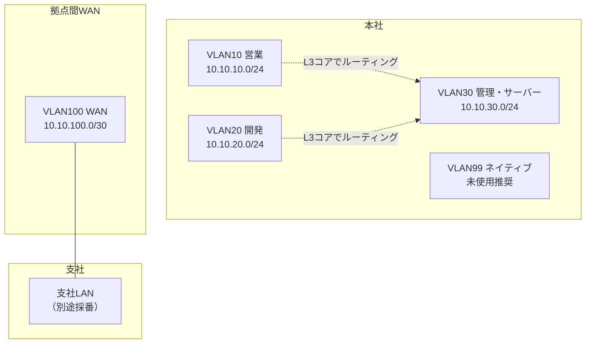

この設計から読み取れる方針は次のとおりである。

- 部署ごとのVLANには、学習と運用のわかりやすさを優先して均等な/24を割り当てている
- WANのような点対点リンクには、無駄を避けるため最小の/30を割り当てている
- VLAN99はネイティブVLAN専用とし、通常のホストは配置しない（詳細は第5章）

均等な/24を部署ごとに割り当てる設計は、アドレス利用効率よりも、運用のしやすさ（サブネットマスクが常に`/24`で統一され、覚えやすく、ミスが減る）を優先した判断である。

拠点数やホスト数が多い環境では、3.4.4のVLSM例題のように、要件に応じて細かく最適化する設計もよく使われる。

---

## 3.7 Cisco IOSの設定例

VLANインターフェース（SVI：Switch Virtual Interface）へのIPアドレス設定と、経路確認コマンドの例を示す。

VLANそのものの作成やトランクの設定は第5章で扱うため、ここではIPアドレス設定に絞る。

### インターフェースへのIPアドレス設定

```cisco
! 営業部門VLANのSVIにIPアドレスを設定する（VLAN10のゲートウェイ）
L3SW(config)# interface Vlan10
L3SW(config-if)# ip address 10.10.10.1 255.255.255.0
L3SW(config-if)# no shutdown

! 管理・サーバー部門VLANも同様に設定する
L3SW(config)# interface Vlan30
L3SW(config-if)# ip address 10.10.30.1 255.255.255.0
L3SW(config-if)# no shutdown

! 拠点間WANリンク（/30）の設定例
R1(config)# interface GigabitEthernet0/1
R1(config-if)# ip address 10.10.100.1 255.255.255.252
R1(config-if)# no shutdown
```

主要パラメータの意味は次のとおりである。

- `ip address`：IPアドレスとサブネットマスクをドット付き10進表記で指定する（CIDR形式では直接書けないため、対応表で変換する）
- `no shutdown`：インターフェースを有効化する。初期状態では多くのルーテッドインターフェースがshutdown状態になっている
- `/30`（255.255.255.252）：点対点リンクでの標準的な選択であり、ホストアドレスが2つだけ必要な用途に適している

### 経路とインターフェースの確認

```cisco
L3SW# show ip interface brief
! 各インターフェースのIPアドレスとステータスを一覧表示する

L3SW# show ip route connected
! 自分に直接設定されているサブネットの経路（Cのマーク）を確認する

R1# show ip route
! ルーティングテーブル全体を確認する。ロンゲストマッチの原則は第6章で扱う
```

`show ip route connected` で見えるサブネットは、そのルーターやL3スイッチに正しくIPアドレスが設定され、インターフェースがupしている場合にのみ表示される。

設計どおりのサブネットが一覧に現れない場合、インターフェースのshutdown、ケーブル未接続、IPアドレスの入力ミスのいずれかを疑う。

---

## 3.8 LinuxおよびWindowsでの確認例

### Windows

```powershell
# IPアドレス、サブネットマスク、デフォルトゲートウェイを確認
ipconfig /all

# より詳細な形式（プレフィックス長付き）で確認
Get-NetIPAddress -AddressFamily IPv4

# 特定のIPが所属するはずのネットワークへの疎通確認
ping 10.10.30.10
```

### Linux

```bash
# IPアドレスとプレフィックス長（CIDR形式）を確認
ip addr show

# ルーティングテーブルの確認
ip route show

# サブネット計算を補助するツール（多くのディストリで別途インストールが必要）
ipcalc 10.10.10.0/24
```

`ipcalc` のようなツールは検算に便利だが、試験や設計レビューの現場では手計算での検証が必要になる場面も多いため、3.4節の手順は道具に頼らず再現できるようにしておく。

ホスト側で確認すべき最重要ポイントは、「設定されているプレフィックス長（マスク）が、設計書のサブネット設計と一致しているか」である。

IPアドレス自体が正しくても、マスクが一致しないと、3.5節で説明した同一ネットワーク判定そのものが狂う。

---

## 3.9 よくある誤解

1. **「/24なら256台使える」**  
   256個のアドレスのうち、ネットワークアドレスとブロードキャストアドレスの2つはホストに使えないため、実際に割り当てられるのは254台分である。

2. **「サブネットは細かく切るほど良い」**  
   サブネットを細かくするほど、1つあたりのホスト収容数は減る。将来の増加余地や、ルーティングテーブルの経路数増加とのバランスを考える必要がある。

3. **「プライベートIPアドレスだから安全」**  
   プライベートIPアドレスは、あくまでインターネット上で経路広告されないアドレス空間の区分であり、それ自体はアクセス制御やセキュリティ機能ではない。ファイアウォールやACL（第8章）と役割が異なる。

4. **「IPv6はまだ先の話で、当面IPv4だけで十分」**  
   IPv4アドレスの新規割り当ては枯渇が進んでおり、多くのISPやクラウド事業者がIPv6対応を標準機能として提供している。設計知識としては、IPv4と並行して理解しておく必要がある。

5. **「VLSMは複雑なだけで実務では使わない」**  
   拠点規模や回線種別が多様な実務環境では、アドレス空間を無駄なく使うためにVLSMは日常的に使われる。特に点対点リンクへの/30、/31の割り当ては典型例である。

---

## 3.10 代表的な障害

| 症状 | ありがちな原因 | 確認の切り口 |
|------|----------------|--------------|
| 一部の端末とだけping不通 | サブネットマスクの誤設定による同一/別ネットワーク判定のずれ | 送信元・宛先双方のIP・マスクからネットワークアドレスを計算し直す |
| 新規端末がネットワークに参加できない | ネットワークアドレスやブロードキャストアドレスを誤ってホストに設定 | 設計書のホスト範囲と実際の設定値を照合する |
| 同一VLAN内なのに到達できない端末がある | VLSMで作った隣接サブネットとマスクの取り違え | 各端末のマスクが設計どおりの長さになっているか確認する |
| WANリンクが不安定、または片側だけ疎通 | /30の両端で異なるサブネットを設定（アドレス範囲の重複・不一致） | 両端のIP・マスクからネットワークアドレスが一致するか検算する |
| IPv6が有効な端末で意図しない自動接続が発生 | リンクローカルアドレスやSLAACによる自動設定の影響 | インターフェースに設定されている全アドレス種別を確認する |

---

## 3.11 トラブルシューティング手順

IPアドレス・サブネットに起因する疎通トラブルは、次の順で切り分ける。

1. **自ホストの設定確認**：IPアドレス、サブネットマスク（プレフィックス長）、デフォルトゲートウェイを確認する
2. **ネットワークアドレスの再計算**：3.4節の手順で、自分と宛先のネットワークアドレスを実際に計算し直す
3. **設計書との照合**：計算結果が、部署・拠点ごとの設計台帳と一致しているかを確認する
4. **同一サブネット内の疎通確認**：同一ネットワークと判断される別端末とpingが通るかを確認する
5. **ゲートウェイの妥当性確認**：デフォルトゲートウェイのIPアドレスが、自分の属するサブネット内にあるかを確認する
6. **中継機器側の設定確認**：L3スイッチやルーターのインターフェースに設定されているIPアドレス・マスクを確認する（3.7節のコマンド）
7. **経路情報の確認**：目的のサブネットへの経路が、ルーティングテーブルに存在するかを確認する（詳細な経路選択は第6章）

サブネット関連の障害は、pingコマンド1つの成否だけでは原因を特定しにくいことが多く、必ず手計算による検算を挟むことで、思い込みによる見落としを減らせる。

---

## 3.12 設計・運用上の注意点

1. **アドレス設計台帳を維持する**  
   部署、拠点、VLAN、用途ごとに、割り当て済みのサブネットを一覧化しておく。台帳がなければ、新規サブネットの割り当てのたびに重複リスクが生じる。

2. **将来の成長を見込んだサイズにする**  
   ちょうど現在の台数に合わせたサブネットは、増員のたびにサブネットの再設計を招く。ある程度の余裕を持たせる。

3. **ルーティングの要約を意識した割り当てにする**  
   隣接するサブネットをまとめて要約できるように連続したアドレスブロックを割り当てておくと、後のルーティング設計（第6章のルート集約）が容易になる。

4. **ネットワークアドレス・ブロードキャストアドレスの割り当てミスを防ぐ**  
   IPAM（IP Address Management）ツールやDHCPの除外設定を使い、人手によるミスの入り込む余地を減らす。

5. **IPv6の導入方針を早めに決める**  
   後付けでIPv6を導入する場合、既存のIPv4設計と整合させる作業が発生する。デュアルスタック運用を前提にするか、当面IPv4のみとするかを設計段階で明確にしておく。

---

## 3.13 要点まとめ

- IPv4アドレスは32ビットで、サブネットマスクによってネットワーク部とホスト部の境界が決まる
- CIDR表記（`/24`など）は、サブネットマスクをビット数で簡潔に表す方法である
- プライベートIPアドレスは組織内で自由に使える範囲、グローバルIPアドレスはインターネット上で一意な範囲である
- ネットワークアドレスとブロードキャストアドレスは、そのサブネット内でホストに割り当てられない
- サブネット計算は「必要数からビット数を求め、ブロックサイズを求め、刻んで列挙する」という手順で機械的に解ける
- VLSMは、要件ごとに異なるマスク長を使い分け、アドレス空間の無駄を減らす手法である
- IPv6は128ビットのアドレス空間を持ち、ブロードキャストの代わりにマルチキャストを使う
- ホストは送信前に、送信元と宛先のネットワークアドレスを比較し、同一サブネットか別サブネットかを判断している

---

## 3.14 章末問題

### 問題1

`192.168.5.0/24` を8つの均等なサブネットに分割せよ。新しいプレフィックス長、ブロックサイズ、最初の3つのサブネットのネットワークアドレスを、途中式を示しながら求めよ。

### 問題2

`10.30.0.0/18` を `/22` のサブネットに分割すると、いくつのサブネットができるか。着目すべきオクテットとブロックサイズも示して説明せよ。

### 問題3

ある拠点に `192.168.100.0/24` が割り当てられている。この拠点内に、80台収容の部署Aと、30台収容の部署B、点対点のWANリンクが1本ある。VLSMを用いて割り当てを設計し、途中式を示せ。

### 問題4

ホストのIPアドレスが `192.168.44.130/27` のとき、このホストが属するネットワークアドレス、ブロードキャストアドレス、使用可能なホスト範囲を、2進数でのAND演算を示しながら求めよ。

### 問題5

サブネットマスクを本来より広く（ホスト部を多く）設定してしまった場合、ホストの通信判断にどのような影響が出るか説明せよ。

---

## 3.15 解答と解説

### 解答1

8つのサブネットを作るには $2^3=8$ より3ビットの借用が必要であり、新しいプレフィックス長は `/24+3=/27` である。`/27` のマスクは `255.255.255.224` であり、第4オクテットのブロックサイズは `256-224=32` である。第4オクテットを32刻みで列挙すると、最初の3つのサブネットは `192.168.5.0/27`、`192.168.5.32/27`、`192.168.5.64/27` になる。

### 解答2

借用ビット数は `22-18=4` ビットであり、作られるサブネット数は $2^4=16$ である。`/18`は着目オクテットが第2オクテットの範囲にまたがる大きな空間だが、`/22`への分割では境界が第3オクテットに現れるため、着目すべきオクテットは第3オクテットになる。`/22` のマスクの第3オクテット値は `252`（11111100）であり、ブロックサイズは `256-252=4` である。

### 解答3

必要ホストビット数は、部署Aが $2^7-2=126\geq80$ より `/25`、部署Bが $2^6-2=62\geq30$ より `/26`、WANリンクが `/30` である。要件の大きい順に、部署A（/25）に `192.168.100.0/25`（`.0`〜`.127`）、部署B（/26）に `192.168.100.128/26`（`.128`〜`.191`）、WANリンク（/30）に `192.168.100.192/30`（`.192`〜`.195`）を割り当てる。

### 解答4

`/27` のマスクは `255.255.255.224` であり、第4オクテットのマスク値は `11100000`（224）である。IPアドレスの第4オクテット `130` は `10000010` であり、AND演算すると `10000000`（128）になる。ブロックサイズは `256-224=32` なので、このサブネットの範囲は `128`から`128+32-1=159`までである。したがって、ネットワークアドレスは `192.168.44.128`、ブロードキャストアドレスは `192.168.44.159`、使用可能なホスト範囲は `192.168.44.129` 〜 `192.168.44.158` である。

### 解答5

サブネットマスクを本来より広く設定すると、ホストは本来「別ネットワーク」であるはずの宛先まで「同一ネットワーク」と誤認する。その結果、本来はデフォルトゲートウェイ経由で届けるべき宛先に対して、直接ARP要求を送ろうとして応答が得られず、通信が失敗する（あるいは、応答が返らないまま無駄なARP要求だけが増える）。

---

## 3.16 実機またはシミュレーター演習

Cisco Packet Tracer、GNS3、CML、実機、または手計算のみのいずれでも実施できる。

### 演習A：均等分割の手計算と実機検証

1. 任意の/24アドレスを選び、6つの均等なサブネットに分割する計算を手で行う（必要なビット数、ブロックサイズ、各サブネットの範囲を導出する）
2. L3スイッチまたはルーターの2つのインターフェースに、計算した中の異なる2つのサブネットのアドレスを設定する
3. 同一サブネット内のPC同士、および異なるサブネットのPC同士でpingを実行し、期待どおりの結果になることを確認する

### 演習B：VLSM設計の実践

1. 任意の/23程度のアドレスブロックを1つ用意する
2. 台数の異なる3つの部署（例：120台、40台、10台）と、1本の点対点WANリンクを想定する
3. 3.4.4の手順にならい、必要ビット数の計算から、実際のサブネット割り当てまでを表にまとめる
4. 結果をルーターまたはL3スイッチに設定し、各サブネットの`show ip route connected`が設計どおりに表示されることを確認する

### 演習C：意図的な誤設定からの復旧

1. あるPCのサブネットマスクを、意図的に設計より広い値（例：本来`/24`のところを`/16`）に変更する
2. 同一VLAN内の別端末、および本来別サブネットのはずの端末それぞれへpingを実行し、症状の違いを記録する
3. マスクを正しい値に戻し、症状が解消することを確認する
4. 障害票の形式で、症状と判断根拠を1行でまとめる

```text
[障害票]
症状: 特定サブネット宛の通信のみ失敗、ARP要求が異常に多い
確認: 送信元PCのサブネットマスクが設計値より広い(/16)
判断: 同一ネットワーク判定の誤りによるもの。正しいマスクへ修正して解消
```

---

## 次章への橋渡し

IPアドレスによって、送信元と宛先が「どのネットワークの、どの端末か」までは特定できる。

ただし、同じ端末上で動く複数のアプリケーション（Webサーバーとメールサーバーなど）を区別し、通信の信頼性を確保する仕組みは、まだ登場していない。

第4章では、TCPとUDPの違い、ポート番号、そしてARP、DNS、DHCPをはじめとする主要プロトコルを扱う。


---


<!-- ========== 04_tcp_udp_protocols.md ========== -->

# 第4章 TCP、UDPと主要プロトコル

## 学習目標

この章を終えると、次のことができる。

1. TCPとUDPの違いを、信頼性・遅延・用途の観点から選択理由とともに説明できる
2. 3ウェイハンドシェイク、シーケンス番号、確認応答、フロー制御の役割を、通信の流れとして説明できる
3. ポート番号とウェルノウンポートを、通信の宛先を特定する仕組みとして使える
4. ARP、ICMP、DNS、DHCPの役割を、通信が成立するまでの順序の中で説明できる
5. HTTP/HTTPS、SSH、NTP、SNMP、Syslogの運用上の位置づけを説明できる

---

## 4.1 この章で学ぶこと

第3章までで、IPアドレスによって「どのネットワークの、どの端末か」を特定できるようになった。

しかし、1台のサーバーは、Webサービス、メールサービス、リモート管理など、複数のサービスを同時に提供していることが多い。

同じIPアドレス宛の通信を、どのサービスへ振り分けるかという問題は、まだ解決されていない。

さらに、第1章の通信手順では「PCはすでにIPアドレスやDNSサーバーの情報を持っている」という前提を置いていたが、その情報自体がどうやって手に入るのかにも触れていなかった。

この章では、ポート番号によるサービスの識別、TCPとUDPという2つのトランスポート層プロトコルの違い、そしてARP、DNS、DHCPをはじめとする、通信の土台を支える主要プロトコル群を扱う。

これらは、通貫シナリオの営業PCが起動してから業務サーバーへ到達するまでの、第1章では省略していた部分を埋める内容になる。

---

## 4.2 技術が必要になった背景

IPによる到達性の確保だけでは、実用的な通信サービスは成立しない。

いくつかの未解決の問題を、順に見ていく。

第一に、**信頼性**の問題がある。

ネットワークは、途中の輻輳やエラーによって、パケットが失われたり、順序が入れ替わったりすることを前提に設計されている。

ファイル転送やWebアクセスのように、データの欠落や順序の乱れが許されない用途では、失われたデータを検出し、再送する仕組みが必要になる。

一方で、映像や音声のリアルタイム配信のように、多少のデータ欠落よりも、遅延の小ささが優先される用途もある。

この2つの異なる要求に応えるために、信頼性を重視するTCPと、速度と単純さを重視するUDPという、性質の異なる2つのトランスポート層プロトコルが用意されている。

第二に、**サービスの識別**の問題がある。

1台のサーバーが複数のサービスを提供する以上、IPアドレスだけでは「Webサービス宛か、メールサービス宛か」を区別できない。

この区別のために導入されたのが、ポート番号である。

第三に、**アドレス解決と設定の自動化**の問題がある。

IPアドレスからMACアドレスを求める仕組み（ARP）、名前からIPアドレスを求める仕組み（DNS）、端末にIPアドレスそのものを自動で配る仕組み(DHCP)がなければ、管理者はすべての端末に、IPアドレスからMACアドレスの対応表まで手作業で設定しなければならない。

台数が数十台を超えた時点で、これは現実的ではなくなる。

第四に、**運用上の可視性**の問題がある。

障害対応や監視のためには、機器の時刻を揃え（NTP）、状態を収集し（SNMP）、記録を残す（Syslog）仕組みが必要になる。

これらは華やかな機能ではないが、欠けていると、障害発生時に「いつ、どこで、何が起きたか」を再構成できなくなる。

---

## 4.3 基本概念

### 4.3.1 トランスポート層の役割

**トランスポート層**（OSI第4層）は、送信元と宛先のアプリケーション同士を結びつけ、必要に応じて信頼性やデータ整形を提供する層である。

ネットワーク層（IP）が「端末から端末への到達性」を担うのに対し、トランスポート層は「端末上の、どのアプリケーションから、どのアプリケーションへか」を担う。

この役割分担があるため、同じIPアドレスの端末でも、Webブラウザとメールクライアントが同時に別々の通信を行える。

### 4.3.2 TCPとUDPの違い

**TCP**（Transmission Control Protocol：伝送制御プロトコル）は、コネクション型で信頼性を重視するトランスポート層プロトコルである。

**UDP**（User Datagram Protocol：ユーザーデータグラムプロトコル）は、コネクションレス型で、信頼性よりも低遅延と単純さを重視するトランスポート層プロトコルである。

| 観点 | TCP | UDP |
|------|-----|-----|
| コネクション | 事前に確立する（3ウェイハンドシェイク） | 確立しない。いきなりデータを送る |
| 信頼性 | 確認応答と再送により保証する | 保証しない（上位アプリで補う場合がある） |
| 順序保証 | あり（シーケンス番号で並べ替える） | なし |
| 速度・オーバーヘッド | ヘッダが大きく、制御のやり取りがある分オーバーヘッドが大きい | ヘッダが小さく、オーバーヘッドが小さい |
| 代表的な用途 | Web（HTTP/HTTPS）、メール、ファイル転送、SSH | DNS問い合わせ、DHCP、音声・映像通話、NTP |

どちらが優れているという関係ではなく、アプリケーションの要求に応じて使い分けるものである。

Web閲覧でページの一部が欠けたり文字化けしたりしては困るため、TCPが選ばれる。

一方、音声通話で数十ミリ秒遅れたパケットが再送されて届いても、その時点ではもう聞くタイミングを過ぎており、再送よりも次のデータを送り続ける方が実用的なため、UDPが選ばれる。

DNSの問い合わせのように、1往復で完結し、失敗すれば単純に再送すればよい軽量な通信も、UDPが好まれる典型例である（ただし、大きな応答データを扱う場合など、DNSがTCPを使う場面もある）。

### 4.3.3 3ウェイハンドシェイク

**3ウェイハンドシェイク**（three-way handshake）は、TCPがコネクションを確立するために行う、3回のやり取りである。

1. クライアントがサーバーへ **SYN**（同期：Synchronize）フラグを立てたセグメントを送る
2. サーバーが **SYN/ACK**（同期と確認応答）フラグを立てたセグメントを返す
3. クライアントが **ACK**（確認応答：Acknowledgement）フラグを立てたセグメントを送り、コネクションが確立する

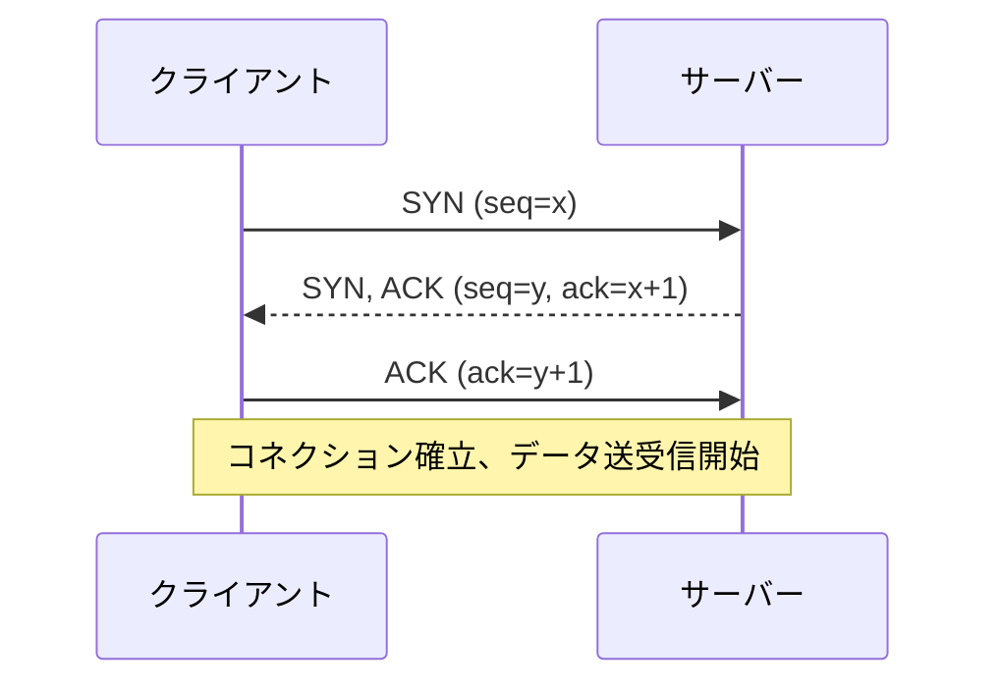

この3回のやり取りによって、双方が「相手も通信の準備ができている」ことを確認し合う。

コネクションを終了する際にも、通常はFIN（終了：Finish）フラグを使った同様のやり取りが行われるが、CCNAレベルではまず、確立側の3ウェイハンドシェイクを理解しておけば十分である。

### 4.3.4 シーケンス番号とACK

**シーケンス番号**（sequence number）は、TCPが送信するデータの各バイトに割り振る通し番号であり、受信側がデータを正しい順序に並べ替えるために使われる。

**ACK（確認応答）番号**は、受信側が「ここまでのデータを受け取った」ことを送信側へ知らせるために使う番号であり、次に受信を期待するシーケンス番号を示す。

途中でセグメントが失われると、受信側は期待するシーケンス番号のデータが届かないことに気づき、送信側は一定時間ACKが返ってこないことをもって再送のタイミングを判断する。

この仕組みによって、途中経路でパケットが失われたり、順序が入れ替わったりしても、アプリケーション側には正しい順序で欠落のないデータが届く。

UDPにはこの仕組みが存在しないため、順序の乱れやデータの欠落が発生した場合、必要であればアプリケーション層が独自に対処する。

### 4.3.5 フロー制御

**フロー制御**（flow control）は、受信側の処理能力を超えるペースでデータが送られてくることを防ぐ仕組みである。

TCPは、**ウィンドウサイズ**（受信バッファの空き容量）を相手に通知し合うことで、送信側が一度に送ってよいデータ量を調整する。

受信側の処理が追いつかず、バッファが埋まってきた場合には、通知するウィンドウサイズを小さくすることで、送信側にペースを落とすよう伝える。

この仕組みがなければ、高速なサーバーが低速な端末へデータを送り続け、受信側のバッファ溢れによってデータが失われる、という状況が起きやすくなる。

似た名前の概念として、経路上の輻輳に応じて送信量を調整する「輻輳制御」もあるが、これは受信側の能力ではなく、ネットワーク全体の混雑状況に着目した制御であり、フロー制御とは目的が異なる。

### 4.3.6 ポート番号とソケット

**ポート番号**は、0から65535までの数値で、トランスポート層においてどのアプリケーション（プロセス）宛の通信かを識別するための番号である。

送信元IPアドレス、送信元ポート番号、宛先IPアドレス、宛先ポート番号、プロトコル種別（TCP/UDP）の組み合わせを**ソケット**（socket）と呼び、この5つの組み合わせによって、1つの通信セッションが一意に識別される。

同じPCから同じWebサーバーへ、複数のタブでアクセスしても通信が混ざらないのは、送信元ポート番号がタブ（正確には接続）ごとに異なる値になるためである。

### 4.3.7 ウェルノウンポート

ポート番号は、用途に応じて次のように区分される。

| 区分 | 範囲 | 説明 |
|------|------|------|
| **ウェルノウンポート**（Well-known ports） | 0〜1023 | 標準化された主要サービス用に予約された番号 |
| **登録済みポート**（Registered ports） | 1024〜49151 | 特定のアプリケーションが登録して使う番号 |
| **動的ポート**（Dynamic/Private ports） | 49152〜65535 | クライアント側が接続のたびに一時的に使う番号 |

代表的なウェルノウンポートを挙げる。

| ポート番号 | プロトコル | サービス |
|------------|------------|----------|
| 20 / 21 | TCP | FTP（データ／制御） |
| 22 | TCP | SSH |
| 23 | TCP | Telnet |
| 25 | TCP | SMTP |
| 53 | TCP/UDP | DNS |
| 67 / 68 | UDP | DHCP（サーバー／クライアント） |
| 80 | TCP | HTTP |
| 123 | UDP | NTP |
| 161 / 162 | UDP | SNMP（問い合わせ／トラップ） |
| 443 | TCP | HTTPS |
| 514 | UDP | Syslog |

クライアント側は、通信のたびに動的ポートを送信元ポートとして使い、宛先側のウェルノウンポートへ接続する、という組み合わせが基本形である。

ファイアウォールのアクセス制御（第8章）は、多くの場合この宛先ポート番号を基準にルールを組み立てる。

### 4.3.8 ICMP

**ICMP**（Internet Control Message Protocol：インターネット制御メッセージプロトコル）は、IP通信の状態やエラーを通知するためのプロトコルである。

`ping` コマンドは、ICMPのエコー要求（Echo Request）を送り、エコー応答（Echo Reply）が返るかどうかで到達性を確認する。

`traceroute`（Windowsでは`tracert`）は、TTL（Time To Live：生存時間）を1から順に増やしながらパケットを送り、途中のルーターがTTL超過を通知するICMPメッセージ（Time Exceeded）を利用して、経路上のホップを1つずつ特定する。

ICMPはトランスポート層のプロトコルではなく、IPと同じネットワーク層に位置づけられる制御用プロトコルであり、ポート番号を使わない点がTCP/UDPと異なる。

セキュリティ上の理由から、ICMPの一部または全部をファイアウォールで制限する運用も多いが、これは第1章で触れたとおり、「pingが通らない」ことと「業務通信が失敗する」ことが必ずしも一致しない一因になる。

### 4.3.9 ARP

**ARP**（Address Resolution Protocol：アドレス解決プロトコル）は、同一ネットワーク内で、IPアドレスに対応するMACアドレスを解決するためのプロトコルである。

動作の流れは次のとおりである。

1. 送信元端末が、宛先IPアドレスに対応するMACアドレスをまだ知らない場合、ブロードキャストでARP要求（「このIPアドレスを持っているのは誰か」）を送る
2. 該当するIPアドレスを持つ端末だけが、自分のMACアドレスを含むARP応答をユニキャストで返す
3. 送信元端末は、得られた対応関係を**ARPキャッシュ**（ARPテーブル）へ一定時間保持する

ARPは同一ネットワーク内でのみ有効であり、別ネットワーク宛の通信では、3.5節で説明したとおり、宛先IPそのものではなくデフォルトゲートウェイのMACアドレスをARPで解決する。

ARPキャッシュの内容は一定時間で失効するため、端末のNICを交換したり、IPアドレスの割り当てが変わったりした場合でも、一定時間経過後には新しい情報に更新される。

### 4.3.10 DNS

**DNS**（Domain Name System：ドメインネームシステム）は、`app.example.local` のような人間にわかりやすいホスト名と、IPアドレスを相互に変換する仕組みである。

第1章の通信手順で最初に行われていた「名前解決」が、まさにDNSへの問い合わせである。

DNSは階層構造を持ち、社内向けの名前解決には社内DNSサーバーを、インターネット上の名前解決には、社内DNSサーバーが上位のDNSサーバーへ問い合わせを中継する（再帰的な問い合わせ）、という形が一般的である。

DNSは主にUDPポート53を使うが、応答データが大きい場合や、ゾーン転送のような特定の操作ではTCPポート53が使われる。

DNSサーバーが不通、または誤って設定されていると、ホスト名を使ったアクセスだけが失敗し、IPアドレスを直接指定したアクセスは成功する、という第1章でも触れた特徴的な症状が現れる。

### 4.3.11 DHCP

**DHCP**（Dynamic Host Configuration Protocol：動的ホスト構成プロトコル）は、端末の起動時に、IPアドレス、サブネットマスク、デフォルトゲートウェイ、DNSサーバーなどの設定情報を自動的に配布する仕組みである。

代表的な流れ（DORAプロセスと呼ばれる）は次のとおりである。

1. **Discover**：クライアントが、ブロードキャストでDHCPサーバーを探す
2. **Offer**：DHCPサーバーが、割り当て候補のIPアドレスなどを提示する
3. **Request**：クライアントが、提示された内容を使いたいと要求する
4. **Acknowledge**：DHCPサーバーが、割り当てを確定し、正式に通知する

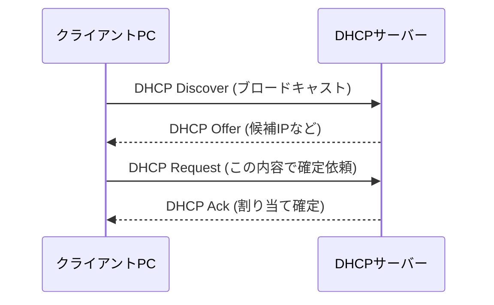

DHCPはブロードキャストを使うため、標準では同一ブロードキャストドメイン内でしか機能しない。

VLANが分かれ、DHCPサーバーが別のVLAN（通貫シナリオではVLAN30）にある場合、ルーターやL3スイッチにDHCPリレー機能（Cisco IOSでは`ip helper-address`）を設定し、クライアントからのブロードキャスト要求をDHCPサーバーへユニキャストで中継する必要がある。

割り当てられたIPアドレスには有効期限（リース期間）があり、期限が近づくとクライアントは同じDHCPサーバーへ更新を要求する。

### 4.3.12 HTTP/HTTPS

**HTTP**（HyperText Transfer Protocol）は、Webブラウザとサーバーの間で、Webページやデータをやり取りするためのアプリケーション層プロトコルである。

**HTTPS**（HTTP Secure）は、HTTPの通信をTLS（Transport Layer Security）で暗号化したものであり、通信内容の盗聴や改ざんへの耐性を持つ。

HTTPはTCPポート80、HTTPSはTCPポート443を標準的に使う。

HTTPS化によって守られるのは、主に通信経路上の盗聴・改ざんへの耐性であり、サーバー自体の脆弱性や、アプリケーションの認可設定の不備までは守ってくれない点に注意が必要である。

### 4.3.13 SSH

**SSH**（Secure Shell：セキュアシェル）は、リモートの機器へ暗号化された通信路を通じてログインし、コマンドを実行するためのプロトコルである。

TCPポート22を使い、通信内容全体（認証情報を含む）が暗号化される。

かつて広く使われていた**Telnet**は、通信内容が平文であり、パスワードを含むすべてのやり取りが盗聴されうるため、現在の実務では管理アクセスにSSHを使うことが標準的な方針になっている。

第1章の設定例で `transport input ssh` としていたのは、この理由による。

### 4.3.14 NTP

**NTP**（Network Time Protocol：ネットワークタイムプロトコル）は、ネットワーク機器やサーバーの時刻を、基準となる時刻源に同期させるためのプロトコルである。

UDPポート123を使う。

時刻のずれは、ログの前後関係を追えなくする、証明書の有効期限判定を誤らせる、認証プロトコルの時刻検証に失敗させるなど、一見地味だが影響範囲の広い問題を引き起こす。

複数の機器のログを突き合わせて障害を調査する場面では、すべての機器で時刻が揃っていることが大前提になる。

### 4.3.15 SNMP

**SNMP**（Simple Network Management Protocol：簡易ネットワーク管理プロトコル）は、ネットワーク機器の状態（インターフェースの使用率、CPU負荷、エラーカウンタなど）を、監視システムが収集するためのプロトコルである。

主にUDPポート161（問い合わせ）とUDPポート162（トラップと呼ばれる、機器側からの自発的な通知）を使う。

SNMPv1やSNMPv2cは、認証に「コミュニティ名」と呼ばれる、実質的にはパスワードに近い平文の文字列を使う方式であり、盗聴に弱いという課題がある。

SNMPv3では、認証と暗号化の仕組みが強化されており、新規に監視基盤を設計する場合は、SNMPv3を優先的に検討することが望ましい。

### 4.3.16 Syslog

**Syslog**は、機器やサーバーが生成するログメッセージを、指定した収集サーバーへ転送するためのプロトコルおよび仕組みである。

標準ではUDPポート514を使うが、信頼性を高めるためにTCPで送信する実装や設定も存在する。

各機器にログを分散させたままにしておくと、障害発生時にすべての機器へ個別にログインしてログを確認する必要があり、時間がかかる。

Syslogサーバーへ集約しておけば、複数機器のログを時系列で横断的に検索でき、これは4.3.14のNTPによる時刻同期があって初めて意味を持つ運用である。

---

## 4.4 通信や処理の流れ

第1章では省略していた部分を含め、営業PCが起動してから業務サーバーのWebアプリへアクセスするまでの流れを、本章で扱ったプロトコルで再構成する。

1. **起動とDHCP**：営業PCが起動し、DHCP Discoverをブロードキャストする。DHCPサーバー（通貫シナリオではVLAN30に設置、VLAN10からはL3スイッチのDHCPリレーを経由）が、IPアドレス、サブネットマスク、デフォルトゲートウェイ、DNSサーバーのアドレスを配布する
2. **名前解決**：ユーザーが `https://app.example.local` を開くと、PCはDNSサーバーへ問い合わせ、業務サーバーのIPアドレスを得る
3. **同一／別ネットワーク判定**：PCは、自分と業務サーバーのIPアドレスから、同一サブネットか別サブネットかを判断する（第3章の手順）。別サブネットであれば、デフォルトゲートウェイ宛にARPを行う
4. **ARPによるMACアドレス解決**：ARP要求を送り、対象（同一サブネット内の端末、または別サブネットの場合はデフォルトゲートウェイ）のMACアドレスを得る
5. **TCP 3ウェイハンドシェイク**：業務サーバーのIPアドレス、TCPポート443に対して、SYN、SYN/ACK、ACKのやり取りを行い、コネクションを確立する
6. **TLSハンドシェイクとHTTPSリクエスト**：暗号化のための鍵交換を行った後、HTTPリクエストを暗号化して送信する
7. **応答とシーケンス管理**：業務サーバーからの応答は、TCPのシーケンス番号とACKによって順序と完全性が保証される
8. **通信終了**：やり取りが終わると、TCPコネクションは終了処理（FINを使ったやり取り）によって解放される

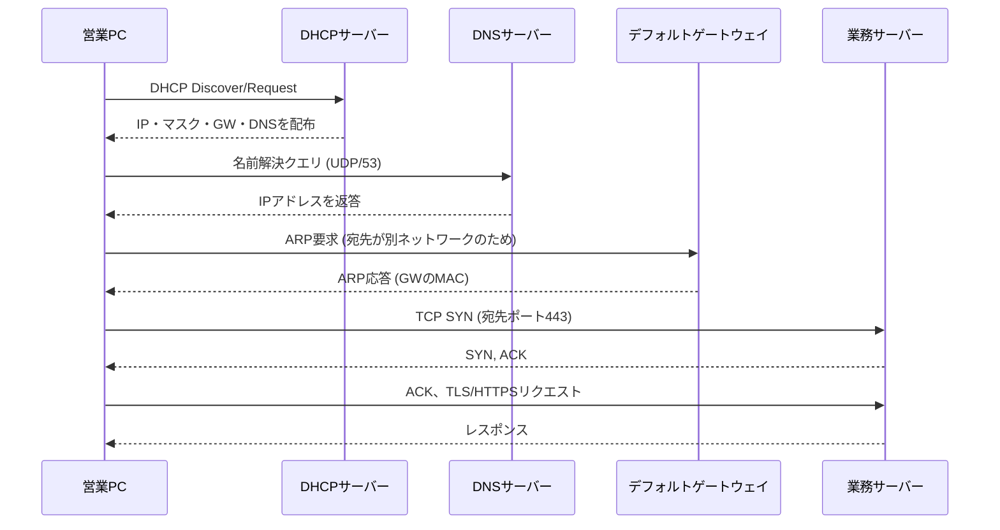

障害発生時には、この手順のどこで止まっているかを特定することが、切り分けの中心作業になる。

DHCPで止まればIPアドレス自体がない状態、DNSで止まれば名前解決の失敗、ARPで止まれば同一セグメント内の到達性の問題、TCPハンドシェイクで止まればポートやファイアウォールの問題、というように、止まった段階によって疑うべき領域が変わる。

---

## 4.5 構成例

通貫シナリオにおける、主要プロトコルとサーバーの配置を整理する。

```text
                    +--------------------+
                    |   L3スイッチ Core   |
                    +----+-----+-----+---+
                         |     |     |
              +----------+  +-+---+  +----------+
              |             |     |             |
        +-----+-----+ +-----+-+ +-+-----+  +----+----+
        | Access SW | | DNS   | | 業務  |  | DHCP    |
        |  A / B    | | :53   | | :443  |  | :67/68  |
        +-----+-----+ +-------+ +-------+  +---------+
              |
    +---------+---------+
    |         |         |
 営業PC    開発PC     管理PC
(VLAN10)  (VLAN20)  (VLAN30)
```

この配置での確認ポイントは次のとおりである。

- DHCPサーバーはVLAN30にあるため、VLAN10・VLAN20からの要求は、L3スイッチの`ip helper-address`によるリレーが必要になる
- DNSサーバーもVLAN30にあり、全VLANからUDP/TCPポート53への到達性が必要になる
- 業務サーバーへのHTTPSアクセスには、全VLANからTCPポート443への到達性が必要になる
- 管理用のSSH（TCPポート22）は、運用担当者の端末やVLANからのみ許可する、という制限をファイアウォールやACL（第8章）で行うのが一般的である

---

## 4.6 Cisco IOSの設定例

トランスポート層関連の直接的な設定は限られるため、本章で扱ったプロトコル群（DHCPリレー、NTP、SNMP、Syslog、SSH）の設定例を示す。

### DHCPリレー（ip helper-address）

```cisco
! VLAN10のSVIに、DHCPサーバー(VLAN30側)への転送を設定する
L3SW(config)# interface Vlan10
L3SW(config-if)# ip helper-address 10.10.30.20

! VLAN20についても同様に設定する
L3SW(config)# interface Vlan20
L3SW(config-if)# ip helper-address 10.10.30.20
```

`ip helper-address` は、指定したVLANで受信したDHCPなど特定のブロードキャストを、指定したユニキャストアドレスへ転送するCisco IOSの機能である。

これにより、DHCPサーバーを各VLANに1台ずつ用意しなくても、中央のDHCPサーバー1台で複数VLANのクライアントに対応できる。

### NTP

```cisco
! 上位のNTPサーバーを指定する
R1(config)# ntp server 10.10.30.5

! 自身のタイムゾーンを設定する（UTCとの差分を明示する）
R1(config)# clock timezone JST 9

! 同期状態の確認
R1# show ntp status
R1# show ntp associations
```

`ntp server` で指定した相手と時刻を同期する。

`show ntp status` の出力で `Clock is synchronized` と表示されない場合、NTPサーバーへの到達性（UDP/123）や、指定したIPアドレスの誤りを疑う。

### SNMP

```cisco
! SNMPv2c（学習環境向けの最小構成例。実務ではSNMPv3を推奨）
R1(config)# snmp-server community R0nlyStr1ng RO
R1(config)# snmp-server location HQ-Core
R1(config)# snmp-server contact netops@example.local

! SNMPv3を使う場合の例（認証・暗号化を有効化）
R1(config)# snmp-server group NETOPS-GROUP v3 priv
R1(config)# snmp-server user monitor NETOPS-GROUP v3 auth sha AuthPass123 priv aes 128 PrivPass123
```

`RO`（Read Only）を指定することで、監視システムからの読み取りのみを許可し、設定変更（Read Write）を防ぐ。

コミュニティ名は、推測されにくい文字列にし、可能であればアクセス元をACLで制限する。

### Syslog

```cisco
! Syslogサーバーへログを転送する
R1(config)# logging host 10.10.30.30
R1(config)# logging trap informational

! ログにタイムスタンプを付与する（NTPと組み合わせて初めて意味を持つ）
R1(config)# service timestamps log datetime msec localtime
```

`logging trap` で指定した重大度以上のログが、指定したSyslogサーバーへ送られる。

タイムスタンプの精度と正確さは、4.3.14で説明したNTPによる時刻同期が前提になる。

### SSHの有効化（Telnetの無効化）

```cisco
R1(config)# ip domain-name example.local
R1(config)# crypto key generate rsa modulus 2048
R1(config)# ip ssh version 2
R1(config)# line vty 0 4
R1(config-line)# transport input ssh
```

`transport input ssh` により、VTY（仮想端末）回線への接続をSSHのみに限定し、平文であるTelnetでのアクセスを排除する。

---

## 4.7 LinuxおよびWindowsでの確認例

### Windows

```powershell
# 特定のTCPポートへの到達性を確認する（pingより詳細な確認ができる）
Test-NetConnection -ComputerName app.example.local -Port 443

# 名前解決の確認
nslookup app.example.local

# ARPキャッシュの確認
arp -a

# 現在のTCP/UDP接続とリスニングポートの一覧
netstat -ano

# 時刻同期状態の確認（Windowsのタイムサービス）
w32tm /query /status
```

### Linux

```bash
# 特定ポートへのTCP到達性確認（ncがある場合）
nc -vz app.example.local 443

# 名前解決の詳細確認
dig app.example.local
# または
nslookup app.example.local

# ARPキャッシュの確認
ip neigh show

# リスニングポートと接続状態の一覧
ss -tunlp

# 時刻同期状態の確認（chronyの場合）
chronyc tracking

# ログの確認（journalctlを使うディストリの場合）
journalctl -xe
```

`ping` が成功しても、`Test-NetConnection` や `nc` によるポート単位の確認が失敗する場合、ICMPは許可されているがTCP/UDPの特定ポートがファイアウォールやACLで拒否されている可能性が高い。

第1章から繰り返し述べているとおり、到達性の確認は「ICMPレベル」と「アプリケーションが使うポートレベル」を分けて行う必要がある。

---

## 4.8 よくある誤解

1. **「UDPは信頼性がないから使うべきではない」**  
   UDPは信頼性を持たない設計だが、それは欠陥ではなく、低遅延を優先した意図的な選択である。音声・映像のようにリアルタイム性が重要な用途では、再送による遅延の方が有害になる場合がある。

2. **「pingが通ればアプリも通る」**  
   ICMPとTCP/UDPは別の仕組みであり、ファイアウォールで個別に制御されることが多い。ICMPが許可され、特定のTCPポートだけが拒否されている状況は珍しくない。

3. **「ポート番号を変えれば安全性が上がる」**  
   非標準ポートへの変更は、単純なスキャンや自動化された攻撃をわずかに遅らせる効果はあるが、認証や暗号化の代わりにはならない。これは「隠蔽によるセキュリティ」であり、根本的な対策ではない。

4. **「ARPはインターネット上の通信でも直接使われる」**  
   ARPは同一ネットワーク内でのみ機能する。別ネットワーク宛の通信では、ARPで解決するのはあくまで次ホップ（デフォルトゲートウェイなど）のMACアドレスである。

5. **「HTTPSにすれば通信は完全に安全」**  
   HTTPSは通信経路上の盗聴・改ざんへの耐性を提供するものであり、サーバー側の脆弱性、認可設定の不備、フィッシングのような利用者側の問題までは防げない。

---

## 4.9 代表的な障害

| 症状 | ありがちな原因 | 確認の切り口 |
|------|----------------|--------------|
| 起動直後の端末にIPアドレスが割り当たらない（169.254.x.x） | DHCPサーバー不通、リレー設定漏れ、スコープ枯渇 | `ip helper-address`設定確認、DHCPサーバーの空きアドレス数確認 |
| ホスト名でアクセスできないがIP直打ちは成功 | DNSサーバー不通、DNS設定誤り | `nslookup`/`dig`でDNSサーバーへの到達性と応答内容を確認 |
| pingは通るがWebアクセスだけ失敗 | TCPポート443がACL/ファイアウォールで拒否 | `Test-NetConnection`/`nc`でポート単位の到達性を確認 |
| ログの時刻がずれていて障害の前後関係が追えない | NTP未設定、NTPサーバー不通 | `show ntp status`、`chronyc tracking`で同期状態を確認 |
| 監視システムが特定機器の情報を取得できない | SNMPコミュニティ名の不一致、ACLによる制限 | 機器側のSNMP設定と監視側の設定を突き合わせる |
| 同一セグメント内なのに特定端末とだけ通信できない | ARPキャッシュの不整合、MACアドレス重複 | `arp -a`/`ip neigh show`のエントリを確認、キャッシュクリア |

---

## 4.10 トラブルシューティング手順

トランスポート層以上の問題は、4.4節で整理した通信の各段階に沿って切り分けると効率がよい。

1. **IPアドレス取得の確認**：DHCPで正しいIPアドレス、マスク、ゲートウェイ、DNSが取得できているかを確認する
2. **同一セグメント内の到達性確認**：`ping`とARPキャッシュで、基本的なL2/L3疎通を確認する
3. **名前解決の確認**：`nslookup`/`dig`でDNSが正しいIPアドレスを返すかを確認する
4. **ICMPレベルの到達性確認**：宛先IPアドレスへの`ping`を確認する（ただしICMPブロック環境では正常でも失敗しうる点に注意する）
5. **ポートレベルの到達性確認**：`Test-NetConnection`や`nc`で、実際にアプリケーションが使うTCP/UDPポートへの到達性を確認する
6. **アプリケーション応答の確認**：ポートは開いているが応答がおかしい場合、アプリケーションログやサーバー側の状態を確認する
7. **時刻・ログの整合性確認**：複数機器のログを突き合わせる場合、NTP同期状況を先に確認しておく

この手順は、第1章のトラブルシューティング手順をより詳細化したものであり、「どの層、どのプロトコルまでが成立しているか」を1段階ずつ確定させながら進める考え方は共通している。

---

## 4.11 設計・運用上の注意点

1. **DHCPは冗長化とスコープ監視を行う**  
   DHCPサーバーの単一障害点化や、スコープ枯渇（払い出せるアドレスがなくなる状態）は、新規端末の接続不能という形で顕在化する。空き数の監視としきい値アラートを設定する。

2. **DNSは内部・外部の切り分けを明確にする**  
   社内向け名前解決と、インターネット向け名前解決の設計（フォワーダーの設定、権威サーバーの範囲）を明確にし、どちらの問題かをすぐ判断できるようにしておく。

3. **ファイアウォールルールはポート単位で管理する**  
   ICMPの許可・拒否と、TCP/UDPの各ポートの許可・拒否は別のルールとして管理し、変更履歴を残す。

4. **NTPをネットワーク設計の初期段階で組み込む**  
   ログ分析、証明書の有効期限判定、認証プロトコルの動作は、正確な時刻に依存する。後から追加するより、初期構築時に組み込む方が手戻りが少ない。

5. **SNMP、Syslogは認証・転送経路のセキュリティも設計する**  
   古いバージョン（SNMPv1/v2c、平文Syslog）を使う場合は、少なくとも到達元をACLで制限し、可能であれば暗号化に対応したバージョンへの移行を検討する。

---

## 4.12 要点まとめ

- TCPは信頼性重視のコネクション型、UDPは低遅延重視のコネクションレス型であり、用途に応じて使い分ける
- 3ウェイハンドシェイクは、TCPコネクション確立のための3回のやり取りである
- シーケンス番号とACKにより、TCPはデータの順序と完全性を保証し、フロー制御によって受信側の処理能力を超えないよう調整する
- ポート番号は、同一IPアドレス上の複数サービスを識別するために使われ、ウェルノウンポートは主要サービス用に予約されている
- ARPは同一ネットワーク内のMACアドレス解決、DNSは名前解決、DHCPはIPアドレスなどの自動配布を担う
- HTTP/HTTPS、SSHはユーザー向け・管理向けの代表的なアプリケーション層プロトコルであり、平文（HTTP、Telnet）と暗号化（HTTPS、SSH）の違いを理解する必要がある
- NTP、SNMP、Syslogは、直接ユーザーの目には触れないが、運用と障害対応を支える基盤プロトコルである
- 通信障害の切り分けは、DHCP、DNS、ARP、TCPハンドシェイク、アプリケーションという段階のどこで止まっているかを特定する作業である

---

## 4.13 章末問題

### 問題1

TCPとUDPのどちらを使うべきか、次の2つの用途についてそれぞれ理由とともに述べよ：(1) 社内ファイルサーバーへの大容量ファイル転送、(2) 社内向けビデオ会議の音声・映像ストリーム。

### 問題2

3ウェイハンドシェイクの3つのステップを、フラグ名を含めて順に説明せよ。

### 問題3

同一VLAN内の通信と、別VLAN宛の通信で、ARPが解決する対象がどう異なるかを説明せよ。

### 問題4

`ping`は成功するが、ブラウザで社内Webアプリ（HTTPS）が開けない場合に、どのコマンドを使ってどこまで切り分けを進めるべきか、手順を述べよ。

### 問題5

複数のネットワーク機器のログを突き合わせて障害調査を行う前に、なぜNTPの同期状態を確認しておく必要があるのか説明せよ。

---

## 4.14 解答と解説

### 解答1

(1) ファイル転送はデータの欠落や順序の乱れが許されないため、確認応答と再送、順序保証を持つTCPが適している。(2) 音声・映像のストリームは、多少のデータ欠落よりも低遅延・途切れないリアルタイム性が優先されるため、再送を待たずに送り続けられるUDPが適している。

### 解答2

(1) クライアントがSYNフラグを立てたセグメントを送信する。(2) サーバーがSYNとACKの両フラグを立てたセグメントを返す。(3) クライアントがACKフラグを立てたセグメントを送り、コネクションが確立する。

### 解答3

同一VLAN内の通信では、ARPは宛先端末そのもののIPアドレスに対応するMACアドレスを解決する。別VLAN宛の通信では、送信元は宛先が別ネットワークであると判断し、宛先IPそのものではなく、デフォルトゲートウェイのIPアドレスに対応するMACアドレスをARPで解決する。

### 解答4

まず`Test-NetConnection`（Windows）や`nc`（Linux）で、宛先のTCP443ポートへ到達できるかを確認する。到達できなければ、ファイアウォールやACLでポートが拒否されている可能性を疑う。ポートへの到達は確認できるがブラウザで開けない場合は、`nslookup`/`dig`で名前解決の結果が正しいIPアドレスを返しているか、証明書やアプリケーション側の設定に問題がないかを確認する。

### 解答5

ログのタイムスタンプが機器ごとにずれていると、複数機器のログを時系列で並べたときに、実際に起きた出来事の前後関係を正しく再構成できなくなる。NTPで全機器の時刻を揃えておくことで、初めて「どの機器で何が、どの順番で起きたか」を信頼できる形で追跡できる。

---

## 4.15 実機またはシミュレーター演習

Cisco Packet Tracer、GNS3、CML、実機のいずれかを使う。

### 演習A：3ウェイハンドシェイクの観察

1. PCとサーバー役の端末を用意し、サーバー側で簡単なWebサービス（または疑似的なTCPリスナー）を起動する
2. PCからサーバーへアクセスし、パケットキャプチャ（Wireshark等）でSYN、SYN/ACK、ACKの3つのパケットを実際に確認する
3. 各パケットのシーケンス番号とACK番号の関係を記録する

### 演習B：DHCPリレーの構築

1. VLANを2つ用意し、一方にクライアントPC、もう一方にDHCPサーバーを配置する
2. L3スイッチまたはルーターに`ip helper-address`を設定する
3. クライアントPCがDHCPサーバーからIPアドレスを取得できることを確認する
4. `ip helper-address`をあえて削除し、クライアントがIPアドレスを取得できなくなる（APIPA相当のアドレスになる）ことを確認する

### 演習C：ポートレベルの障害切り分け

1. サーバー役の端末でHTTPSサービス（TCP443）を動かす
2. 中間のルーターまたはファイアウォール相当の設定で、TCP443宛の通信のみを拒否するルールを追加する（ICMPは許可のままにする）
3. クライアントから`ping`は成功するが、`Test-NetConnection`や`nc`によるポート443の確認が失敗することを確認する
4. 障害票の形式で記録する

```text
[障害票]
症状: pingは成功、HTTPSアクセスのみ失敗
確認: Test-NetConnectionでTCP443が失敗、ICMPは成功
判断: ファイアウォール/ACLでTCP443のみ拒否されている可能性が高い
```

---

## 次章への橋渡し

ここまでで、同一ネットワーク内の転送（第2章）、ネットワークの識別と分割（第3章）、アプリケーション間の通信（第4章）という土台が揃った。

次は、これらの土台の上で、1台のスイッチを部署ごとに論理的に分割し、必要な範囲だけ相互に通信させる仕組みを扱う。

第5章では、VLANの目的、アクセスポートとトランクポート、VLAN間ルーティングを扱う。


---


<!-- ========== 05_vlan_switching.md ========== -->

# 第5章 VLANとスイッチング

## 学習目標

この章を終えると、次のことができる。

1. VLAN（Virtual Local Area Network：仮想LAN）の目的を、ブロードキャスト抑制とセキュリティ分離の両面から説明できる
2. アクセスポートとトランクポートの違いを、IEEE 802.1Qのタグ付け方式と結びつけて説明できる
3. ネイティブVLANの役割と、設計上注意すべき点を説明できる
4. VLAN間ルーティングを、Router on a StickとL3スイッチ（SVI）の両方式で比較しながら説明できる
5. DTP（Dynamic Trunking Protocol）がCisco固有機能であることを踏まえ、運用上どう扱うべきか判断できる
6. 通貫シナリオの部署分離を、具体的なVLAN設計とスイッチ設定として構成できる

---

## 5.1 この章で学ぶこと

第2章までで、スイッチが同一ネットワーク内でMACアドレスを学習し、フレームを転送する仕組みを扱った。

そこで前提にしていたのは、「1つのスイッチ、1つのブロードキャストドメイン」という単純な構成である。

しかし通貫シナリオの本社には、営業部、開発部、管理部という、業務上は分離したい複数の部署が存在する。

全員を同じ物理スイッチの同じネットワークに収容すると、ある部署のブロードキャストが他部署にまで届き、ある部署の端末が他部署のサーバーへ無制限にアクセスできてしまう。

かといって、部署ごとに専用の物理スイッチを用意するのは、配線とコストの面で現実的ではない。

この章では、1台の物理スイッチ設備の上に複数の論理ネットワークを作るVLANの仕組みと、部署をまたぐ通信を成立させるVLAN間ルーティングを扱う。

通貫シナリオでは、VLAN10（営業、10.10.10.0/24）、VLAN20（開発、10.10.20.0/24）、VLAN30（管理・サーバー、10.10.30.0/24）、VLAN99（ネイティブ、未使用推奨）、VLAN100（WAN、10.10.100.0/30）という設計をすでに提示している。

この設計を、実際のスイッチ設定として組み立てていく。

---

## 5.2 VLANが必要になった背景

初期のLANでは、部署やセキュリティレベルの異なる端末を分離しようとすると、物理的に別のスイッチと別の配線を用意するしかなかった。

この方式には、いくつもの限界があった。

- 部署の増員や移動のたびに、配線やスイッチポートの物理的な組み替えが発生する
- フロア配置と部署の境界が一致しないと、配線が複雑化する
- 1つの物理スイッチ内で複数のブロードキャストドメインを作れないため、スイッチの利用効率が悪い
- ある部署の端末が別部署のセグメントに物理的に接続さえされていれば、意図せず到達できてしまう

VLANは、この問題を「物理的な配線」ではなく「論理的なグループ分け」で解決する技術として登場した。

同じ物理スイッチの各ポートに異なるVLAN IDを割り当てることで、1台のスイッチの中に複数の独立したブロードキャストドメインを作れる。

端末の物理的な設置場所とは無関係に、所属する部署やセキュリティ要件に応じてポートを割り当てられるようになったことが、VLANが企業ネットワークの標準的な設計要素になった理由である。

---

## 5.3 基本概念

### 5.3.1 VLANの目的

**VLAN**（Virtual Local Area Network：仮想LAN）とは、1台または複数の物理スイッチ上に、論理的に分離した複数のブロードキャストドメインを作る技術である。

VLANの目的は、大きく2つに整理できる。

1. **ブロードキャストドメインの分割**：ブロードキャストトラフィックが届く範囲を、業務単位や部署単位に限定し、無関係な端末への負荷を減らす
2. **論理的なセキュリティ分離**：異なるVLAN間の通信には、原則としてL3の転送（ルーティング）が必要になるため、部署間の通信を制御しやすくする

通貫シナリオでは、営業部の端末が発するARPブロードキャストは、同じVLAN10内の端末にしか届かない。

開発部や管理部には、そもそもそのブロードキャストが到達しない。

これにより、部署ごとのトラフィックが互いに干渉しにくくなり、後述するACL（アクセスコントロールリスト、詳細は第8章）と組み合わせることで、部署間アクセスを意図的に制御できるようになる。

VLANはあくまで論理的な区画を作る技術であり、それ自体がアクセス制御機能を持つわけではない点に注意する。

VLANを分けただけでは、VLAN間ルーティングを行うL3装置がACLを持たない限り、部署間の通信は素通りする。

### 5.3.2 アクセスポートとトランクポート

スイッチのポートは、役割によって大きく2種類に分けられる。

#### アクセスポート

**アクセスポート**とは、1つのVLANにのみ所属するポートである。

PCやプリンター、サーバーなど、単一のVLANに属する端末を接続する際に使う。

アクセスポートに接続された端末は、VLANタグの存在を意識しない。

端末が送出するフレームはタグなし（untagged）のままスイッチに入り、スイッチの内部処理でのみ、そのポートに割り当てられたVLAN IDと関連付けられる。

#### トランクポート

**トランクポート**とは、複数のVLANのフレームを、1本の物理リンク上でまとめて運ぶポートである。

スイッチ同士の接続や、スイッチとルーターの接続など、複数VLANのトラフィックを一括して運ぶ必要がある区間で使う。

トランクポートを通過するフレームには、どのVLANに属するかを示すタグが付与される（ネイティブVLANの扱いは後述する）。

通貫シナリオでは、アクセススイッチとL3コアスイッチの間がトランクとなり、VLAN10、20、30、99のフレームがこの1本のリンクの上でまとめて運ばれる。

```text
[営業PC]---access(VLAN10)---[Access-SW]
[開発PC]---access(VLAN20)---[Access-SW]
[管理PC]---access(VLAN30)---[Access-SW]
                                  |
                          trunk（VLAN10,20,30,99）
                                  |
                            [L3コアスイッチ]
```

### 5.3.3 IEEE 802.1Qによるタグ付け

**IEEE 802.1Q**は、トランクリンク上を流れるEthernetフレームに、所属VLANを示す4バイトのタグを挿入する標準規格である。

IEEE（Institute of Electrical and Electronics Engineers：米国電気電子学会）が定めた標準であり、ベンダーを問わず相互運用できる。

802.1Qタグには、主に次の情報が含まれる。

| フィールド | 内容 |
|------------|------|
| TPID（Tag Protocol Identifier） | 802.1Qタグであることを示す固定値 |
| PCP（Priority Code Point） | フレームの優先度（802.1pに相当する3ビット） |
| DEI（Drop Eligible Indicator） | 輻輳時の廃棄優先度を示す1ビット |
| VLAN ID | 所属VLANを識別する12ビットの値 |

VLAN IDは12ビットで表現されるため、理論上は0から4095までの値を取り得るが、0と4095は予約されており、実運用で使えるのは1から4094である。

さらにVLAN 1は多くのCisco機器で管理用の既定VLANとして予約的に扱われるため、設計上は意図的に使わないことが多い（詳細は5.11節で扱う）。

タグが付与されることでフレームのサイズは4バイト増加する。

古い機器や一部の設計では、この増加分を考慮したMTU設計が必要になる場合がある。

### 5.3.4 ネイティブVLAN

**ネイティブVLAN**とは、トランクポート上で唯一、タグを付けずに（untaggedのまま）転送されるVLANのことである。

トランクの両端で、このネイティブVLANの番号を一致させておく必要がある。

一致していないと、片方のスイッチが「タグなしフレームはネイティブVLAN Xに属する」と解釈するのに対し、もう片方は「ネイティブVLAN Yに属する」と解釈してしまい、意図しないVLAN間でフレームが漏れる。

このネイティブVLANの不一致は、CDP（Cisco Discovery Protocol）の警告ログに現れることが多く、現場でも見落とされがちな設定ミスの1つである。

また、ネイティブVLANを本来の業務VLAN（VLAN10や20など）に設定すると、細工されたフレームによって意図しないVLANへ通信が漏れ出す、いわゆる**VLANホッピング**という手法の起点になり得る。

このため、業務で使わない専用のVLAN（通貫シナリオではVLAN99）をネイティブVLANとして確保し、そこには一切端末を接続しないという設計が広く推奨されている。

### 5.3.5 VLAN間ルーティングの必要性

VLANは、それぞれが独立したブロードキャストドメインであり、同時に独立したIPサブネットとして設計されることが一般的である。

営業部（VLAN10、10.10.10.0/24）の端末が、開発部（VLAN20、10.10.20.0/24）や管理部・サーバー（VLAN30、10.10.30.0/24）と通信するには、異なるネットワーク間の転送、すなわちルーティングが必要になる。

スイッチだけでは、この転送はできない。

L2スイッチはMACアドレスに基づいてVLAN内のフレームを転送するだけであり、VLANという境界を越える判断はL3（ネットワーク層）の役割である。

VLAN間ルーティングを実現する方式として、代表的に次の2つがある。

1. Router on a Stick（外部ルーターとトランクリンクを使う方式）
2. L3スイッチによるSVI（Switched Virtual Interface）を使う方式

### 5.3.6 Router on a Stick

**Router on a Stick**とは、1本の物理リンクをスイッチとルーターの間のトランクとして使い、ルーター側にVLANの数だけサブインターフェースを作ってVLAN間ルーティングを行う方式である。

物理インターフェースは1つのままで、論理的なサブインターフェース（例：`GigabitEthernet0/0.10`）ごとに異なるVLANとIPアドレスを割り当てる。

```text
        [スイッチ]
   trunk(VLAN10,20,30)
           |
   [ルーター 物理IF]
     ├ サブIF .10 → VLAN10 用 IP
     ├ サブIF .20 → VLAN20 用 IP
     └ サブIF .30 → VLAN30 用 IP
```

この方式は、既存のルーターにポートを追加せずにVLAN間ルーティングを実現できる利点がある一方、次のような制約がある。

- すべてのVLAN間トラフィックが、1本の物理リンクの帯域を共有する
- ルーターのソフトウェア処理（機種によってはCPU処理）でルーティングするため、L3スイッチのハードウェア転送に比べて性能面で不利になりやすい
- ルーターとスイッチ間を経由する分、同一機器内で完結するL3スイッチ方式よりわずかに遅延が増える

小規模拠点や、既存の単一ルーターにVLANをあとから追加する場合など、専用のL3スイッチを用意しにくい状況で採用されることが多い方式である。

### 5.3.7 L3スイッチとSVI

**L3スイッチ**とは、L2のスイッチング機能に加えて、IPアドレスに基づくルーティング機能を持つスイッチである。

L3スイッチ上でVLANごとに作成する仮想的なルーテッドインターフェースを、**SVI**（Switched Virtual Interface：スイッチ仮想インターフェース）と呼ぶ。

SVIには、そのVLANのデフォルトゲートウェイとなるIPアドレスを設定する。

```text
        [L3コアスイッチ]
   VLAN10 SVI: 10.10.10.1/24
   VLAN20 SVI: 10.10.20.1/24
   VLAN30 SVI: 10.10.30.1/24
           |
     ASIC等によるハードウェア転送でVLAN間を中継
```

L3スイッチ方式は、Router on a Stickのようにトランクリンクの帯域制約を受けにくく、多くの機種で専用ハードウェア（ASIC）による高速なルーティングが可能である。

このため、企業内の基幹（コア、ディストリビューション）スイッチとしては、L3スイッチによるSVI方式が広く使われている。

通貫シナリオでも、本社のL3コアスイッチがこの方式でVLAN10、20、30間のルーティングを担当する構成を採用する。

Router on a Stickは、方式そのものを理解するための比較対象として押さえつつ、実装は主にL3スイッチ側で行う。

### 5.3.8 DTP（Cisco固有機能）

**DTP**（Dynamic Trunking Protocol：ダイナミックトランキングプロトコル）は、隣接するスイッチポート同士が、アクセスポートにするかトランクポートにするかを自動的にネゴシエーションするCisco固有のプロトコルである。

標準規格であるIEEE 802.1Qとは異なり、DTPはCisco製スイッチ間でのみ動作する。

DTPには、主に次のモードがある。

| モード | 動作 |
|--------|------|
| `dynamic desirable` | 積極的にトランクへの昇格を提案する |
| `dynamic auto` | 相手から提案されればトランクになるが、自分からは提案しない |
| `trunk` | 常にトランクとして動作し、可能ならDTPで相手にもトランク化を促す |
| `access` | 常にアクセスポートとして動作する |

DTPは便利に見える一方、運用上は次のリスクがある。

- 誤って未使用ポートが `dynamic desirable` のままだと、そこに悪意のある機器を接続してDTPネゴシエーションを成立させ、トランクポートを不正に確立される可能性がある（VLANホッピングの一手法）
- 他ベンダーのスイッチとの接続では、DTP自体が存在しないため、ネゴシエーションが成立せずリンクの扱いが不定になることがある

このため、実運用ではポートの役割（アクセスかトランクか）を明示的に固定し、`switchport nonegotiate` コマンドでDTPネゴシエーションそのものを無効化することが推奨される。

DTPを使うかどうかは設計判断であり、CCNAの学習としては「これはCisco固有機能であり、標準のIEEE 802.1Qとは別物である」という区別を正しく持っておくことが重要である。

---

## 5.4 通信・処理の流れ

営業部の端末（VLAN10、10.10.10.10）から、管理部・サーバーVLAN（VLAN30）にある業務サーバー（10.10.30.10）へHTTPS通信を行う場合を例に、フレームとパケットの流れを追う。

1. 営業PCは、宛先が自分の属するサブネット（10.10.10.0/24）の外にあると判断し、デフォルトゲートウェイ（L3コアスイッチのVLAN10 SVI、10.10.10.1）宛にARPで問い合わせる（初回のみ、以降はARPキャッシュを使う）
2. 営業PCは、宛先MACをゲートウェイのMACアドレスに、宛先IPを業務サーバーのIP（10.10.30.10）にしたフレームを送出する
3. アクセススイッチは、このフレームをアクセスポートで受け取り、内部的にVLAN10のフレームとして扱う
4. アクセススイッチは、フレームをL3コアスイッチへのトランクポートへ転送する。このときフレームには802.1QのVLAN10タグが付与される
5. L3コアスイッチは、トランク経由でタグ付きフレームを受信し、タグからVLAN10のフレームであると判断してVLAN10のSVIで受け取る
6. L3コアスイッチは、IPヘッダの宛先（10.10.30.10）を見てルーティングテーブルを参照し、VLAN30のSVIから転送すべきと判断する
7. L3コアスイッチは、VLAN30側で宛先MAC（業務サーバーのMAC、ARPで既知）を持つ新しいEthernetヘッダを付け直し、VLAN30のタグを付けてトランク経由でサーバー側へ転送する
8. 業務サーバーがフレームを受信し、TCPの3ウェイハンドシェイクとTLSハンドシェイクへ進む

この流れで重要なのは、VLANをまたいだ時点でEthernetヘッダ（MACアドレス）は付け替えられるが、IPヘッダの送信元・宛先アドレスは変化しない、という点である。

これは第1章で扱ったカプセル化・再カプセル化の考え方が、VLAN環境でも成立していることを示している。

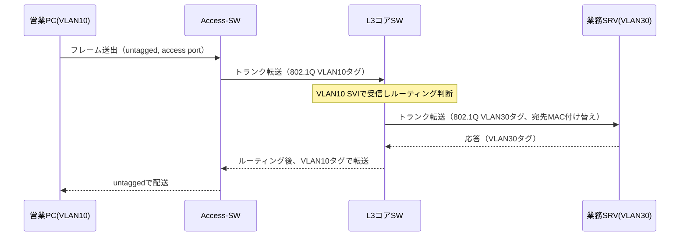

同一VLAN内の通信（例：営業PC同士）であれば、手順6・7のルーティング処理は発生せず、アクセススイッチとトランクの区間だけでL2転送が完結する。

---

## 5.5 構成例

通貫シナリオの本社ネットワークを、VLANとポートの役割に焦点を当てて整理する。

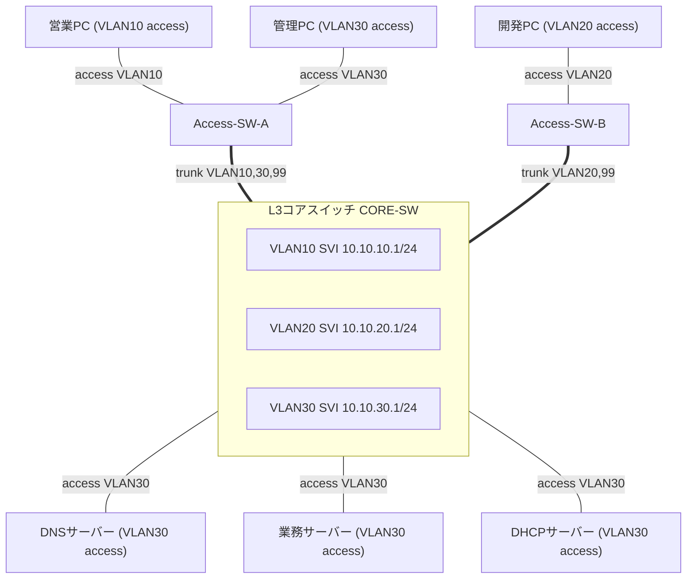

この図から読み取れる設計判断は次のとおりである。

- 各部署の端末はアクセススイッチに収容し、アクセスポートで単一VLANに割り当てる
- アクセススイッチとコアスイッチの間はトランクとし、必要なVLANだけを明示的に許可する
- サーバー群はVLAN30に集約し、コアスイッチへ直接アクセスポートで接続する（サーバー室の配線構成によっては専用のサーバー用アクセススイッチを挟む設計も一般的である）
- VLAN99はどのポートにも端末を接続せず、ネイティブVLAN専用として確保する

R1・R2やインターネットへの経路は第6章・第7章で扱うため、本章の構成例はL2〜VLAN間ルーティングの範囲に絞っている。

---

## 5.6 Cisco IOSの設定例

通貫シナリオの部署分離を、実際のCisco IOSコマンドで構成する。

### VLANの作成（Access-SW-A、Access-SW-B、CORE-SWで共通）

```cisco
! VLANデータベースにVLANを登録する
Switch(config)# vlan 10
Switch(config-vlan)# name Sales
Switch(config-vlan)# exit

Switch(config)# vlan 20
Switch(config-vlan)# name Dev
Switch(config-vlan)# exit

Switch(config)# vlan 30
Switch(config-vlan)# name Mgmt-Server
Switch(config-vlan)# exit

Switch(config)# vlan 99
Switch(config-vlan)# name Native-Unused
Switch(config-vlan)# exit
```

VLANはトランクの両端、および経路上のすべてのスイッチで一致している必要がある。

一部のスイッチにだけVLANが登録されていないと、そのVLANのフレームが途中で破棄される。

### Access-SW-A：アクセスポートとトランクの設定

```cisco
Access-SW-A(config)# interface GigabitEthernet1/0/1
Access-SW-A(config-if)# description Sales-PC
Access-SW-A(config-if)# switchport mode access
Access-SW-A(config-if)# switchport access vlan 10
Access-SW-A(config-if)# switchport nonegotiate
Access-SW-A(config-if)# spanning-tree portfast
Access-SW-A(config-if)# exit

Access-SW-A(config)# interface GigabitEthernet1/0/2
Access-SW-A(config-if)# description Mgmt-PC
Access-SW-A(config-if)# switchport mode access
Access-SW-A(config-if)# switchport access vlan 30
Access-SW-A(config-if)# switchport nonegotiate
Access-SW-A(config-if)# spanning-tree portfast
Access-SW-A(config-if)# exit

Access-SW-A(config)# interface GigabitEthernet1/0/24
Access-SW-A(config-if)# description Uplink-to-CORE-SW
Access-SW-A(config-if)# switchport trunk encapsulation dot1q
Access-SW-A(config-if)# switchport mode trunk
Access-SW-A(config-if)# switchport trunk native vlan 99
Access-SW-A(config-if)# switchport trunk allowed vlan 10,30,99
Access-SW-A(config-if)# switchport nonegotiate
```

主要パラメータの意味は次のとおりである。

- `switchport mode access` / `switchport mode trunk`：ポートの役割を明示的に固定する
- `switchport access vlan 10`：このアクセスポートが所属するVLANを指定する
- `switchport trunk encapsulation dot1q`：タグ付け方式としてIEEE 802.1Qを使うことを明示する（機種によっては802.1Qのみ対応で省略可）
- `switchport trunk native vlan 99`：ネイティブVLANをVLAN99に固定する（両端で一致させる）
- `switchport trunk allowed vlan 10,30,99`：このトランクで許可するVLANを明示的に限定する（不要なVLANは通さない）
- `switchport nonegotiate`：DTPによる自動ネゴシエーションを無効化し、設定どおりの役割で固定する
- `spanning-tree portfast`：アクセスポートでSTPの初期状態遷移を高速化する設定（詳細は第7章）

Access-SW-Bも同様に、VLAN20用のアクセスポートと、`switchport trunk allowed vlan 20,99` としたトランクを設定する。

### CORE-SW：トランクとSVI（VLAN間ルーティング）の設定

```cisco
CORE-SW(config)# ip routing
! L3スイッチとしてルーティング機能を有効化する（機種によっては既定で有効）

CORE-SW(config)# interface GigabitEthernet1/0/1
CORE-SW(config-if)# description Downlink-to-Access-SW-A
CORE-SW(config-if)# switchport trunk encapsulation dot1q
CORE-SW(config-if)# switchport mode trunk
CORE-SW(config-if)# switchport trunk native vlan 99
CORE-SW(config-if)# switchport trunk allowed vlan 10,30,99
CORE-SW(config-if)# switchport nonegotiate
CORE-SW(config-if)# exit

CORE-SW(config)# interface GigabitEthernet1/0/2
CORE-SW(config-if)# description Downlink-to-Access-SW-B
CORE-SW(config-if)# switchport trunk encapsulation dot1q
CORE-SW(config-if)# switchport mode trunk
CORE-SW(config-if)# switchport trunk native vlan 99
CORE-SW(config-if)# switchport trunk allowed vlan 20,99
CORE-SW(config-if)# switchport nonegotiate
CORE-SW(config-if)# exit

CORE-SW(config)# interface Vlan10
CORE-SW(config-if)# description Sales-Gateway
CORE-SW(config-if)# ip address 10.10.10.1 255.255.255.0
CORE-SW(config-if)# no shutdown
CORE-SW(config-if)# exit

CORE-SW(config)# interface Vlan20
CORE-SW(config-if)# description Dev-Gateway
CORE-SW(config-if)# ip address 10.10.20.1 255.255.255.0
CORE-SW(config-if)# no shutdown
CORE-SW(config-if)# exit

CORE-SW(config)# interface Vlan30
CORE-SW(config-if)# description Mgmt-Server-Gateway
CORE-SW(config-if)# ip address 10.10.30.1 255.255.255.0
CORE-SW(config-if)# no shutdown
```

`ip routing` は、L3スイッチをVLAN間ルーティングとして機能させるための前提条件である。

これが無効なままだと、SVIにIPアドレスを設定していても、VLANをまたぐ転送は行われない。

`interface Vlan10` のようなSVIは、物理ポートではなく論理インターフェースであり、対応するVLANが存在し、かつそのVLANに属する物理ポートが最低1つupしていないと、SVI自体もdownのままになる点に注意する。

### Router on a Stickの参考構成（比較用）

L3スイッチを使わず、既存ルーターの1ポートでVLAN間ルーティングを行う場合の参考例を示す。

```cisco
R(config)# interface GigabitEthernet0/0
R(config-if)# no ip address
R(config-if)# no shutdown
R(config-if)# exit

R(config)# interface GigabitEthernet0/0.10
R(config-subif)# encapsulation dot1Q 10
R(config-subif)# ip address 10.10.10.1 255.255.255.0
R(config-subif)# exit

R(config)# interface GigabitEthernet0/0.20
R(config-subif)# encapsulation dot1Q 20
R(config-subif)# ip address 10.10.20.1 255.255.255.0
R(config-subif)# exit

R(config)# interface GigabitEthernet0/0.99
R(config-subif)# encapsulation dot1Q 99 native
R(config-subif)# exit
```

`encapsulation dot1Q 99 native` は、このサブインターフェースをネイティブVLAN用として扱う指定である。

通貫シナリオ本体では、この構成ではなくL3スイッチ方式を採用するため、以降の章もCORE-SWのSVI構成を前提に進める。

### 確認コマンド

```cisco
! VLANの登録状況とポートの割り当てを確認する
Switch# show vlan brief

! トランクポートの状態、ネイティブVLAN、許可VLANを確認する
Switch# show interfaces trunk

! 特定ポートのスイッチポート設定（mode、access vlan、trunkの詳細）を確認する
Switch# show interfaces GigabitEthernet1/0/1 switchport

! SVIの状態とIPアドレスを確認する
CORE-SW# show ip interface brief

! ルーティングテーブルでVLAN間経路（直接接続）を確認する
CORE-SW# show ip route
```

`show interfaces trunk` の出力で、両端のスイッチの「Allowed VLANs」と「Native VLAN」が一致しているかを必ず確認する。

ここが一致していないことが、後述する障害の代表例になる。

---

## 5.7 LinuxおよびWindowsでの確認

通常、アクセスポートに接続されたホストはVLANタグを意識しない。

OSやNICの設定でVLANを扱う必要があるのは、1つの物理NICで複数VLANを扱いたいサーバーや仮想化ホストなど、トランクポートに直接接続するケースである。

### Windows（一般的なクライアント端末）

```bat
:: 現在のIPアドレス、サブネットマスク、ゲートウェイを確認する
ipconfig /all

:: 自分の属するVLANのゲートウェイ（SVI）へ疎通確認する
ping 10.10.10.1

:: 別VLANのサーバーへの到達性を確認する（ルーティングが機能していれば成功する）
ping 10.10.30.10
```

営業PCから10.10.10.1（VLAN10のゲートウェイ）へのpingが失敗する場合、アクセスポートのVLAN割り当てやトランクの許可VLANに問題がある可能性が高い。

10.10.10.1へは届くが10.10.30.10へは届かない場合は、VLAN間ルーティング側（SVIの状態やルーティングテーブル、後述のACL）を疑う。

### Linux（トランクポートに接続する場合の例）

一般的なサーバーでは不要だが、仮想化基盤のホストなど、1本のNICで複数VLANを扱いたい場合は、802.1Qのサブインターフェースを作成する。

```bash
# VLANモジュールのロード（ディストリビューションにより既定で有効な場合もある）
sudo modprobe 8021q

# eth0上にVLAN10用のサブインターフェースを作成する
sudo ip link add link eth0 name eth0.10 type vlan id 10
sudo ip addr add 10.10.10.50/24 dev eth0.10
sudo ip link set eth0.10 up

# 現在のVLANサブインターフェースとIPを確認する
ip -d link show eth0.10
ip addr show

# 疎通確認
ping -c 4 10.10.10.1
```

この場合、対向のスイッチポートはアクセスポートではなくトランクポートとして設定し、少なくともVLAN10を許可VLANに含めておく必要がある。

対向がアクセスポートのままだと、Linux側でタグ付きフレームを送っても、スイッチ側で想定外のタグとして扱われ通信できない。

---

## 5.8 よくある誤解

1. **「VLANを分ければセキュリティは万全になる」**
   VLANが分離するのはブロードキャストドメインであり、それ自体にアクセス制御機能はない。部署間の通信可否を制御するには、L3装置上のACLが別途必要である（詳細は第8章）。

2. **「トランクポートは複数の物理ケーブルを束ねたもの」**
   トランクは1本の論理リンク上に複数VLANのタグ付きフレームを流す技術であり、物理ケーブルの本数とは無関係である。複数の物理リンクを束ねる技術はEtherChannel（第7章）であり、別の概念である。

3. **「ネイティブVLANは初期設定のVLAN1のままでよい」**
   VLAN1は多くの機種で管理系トラフィックの既定値として特別扱いされており、そのままネイティブVLANにしておくと、意図しない情報の混入やVLANホッピングのリスクが高まる。業務で使わない専用VLANに変更するのが望ましい。

4. **「DTPは標準機能なので、どのベンダーの機器でも同じように動く」**
   DTPはCisco固有のプロトコルである。他ベンダーのスイッチとの接続では、DTPによるネゴシエーションは成立しない。混在環境では、双方の設定を手動で固定するのが基本である。

5. **「Router on a StickとL3スイッチは、どちらを使っても性能は同じ」**
   Router on a Stickは1本の物理リンクの帯域をすべてのVLAN間通信で共有し、ソフトウェア処理に依存する部分が大きい。L3スイッチはハードウェア転送を利用でき、一般に高いスループットが得られる。

---

## 5.9 代表的な障害

| 症状 | ありがちな原因 |
|------|----------------|
| 特定のPCだけ、同一部署内の他PCと通信できない | アクセスポートに誤ったVLANが割り当てられている |
| アクセススイッチ配下は正常だが、他部署やサーバーに一切届かない | トランクの `allowed vlan` に該当VLANが含まれていない |
| 一部の通信だけ不安定、またはループのような症状が出る | トランク両端でネイティブVLANが不一致になっている |
| SVIが `administratively down` ではないのに他VLANへ届かない | `ip routing` が無効、またはVLANに属する物理ポートが1つもupしていない |
| 新設ポートの設定直後に動作が不安定になる | DTPのネゴシエーション結果、意図しないtrunk/accessモードになっている |

---

## 5.10 トラブルシューティング手順

VLAN関連の疎通問題は、次の順で切り分けると効率的である。

1. **端末側の設定確認**：IPアドレス、サブネットマスク、デフォルトゲートウェイが設計どおりか（`ipconfig` / `ip addr`）
2. **アクセスポートの確認**：`show interfaces <port> switchport` で、モードと割り当てVLANを確認する
3. **VLANデータベースの確認**：`show vlan brief` で、該当VLANがそのスイッチに存在し、対象ポートが正しいVLANに列挙されているか確認する
4. **トランクの確認**：`show interfaces trunk` で、経路上のすべてのトランクについて、Allowed VLANとNative VLANが両端で一致しているか確認する
5. **SVIの確認**：L3スイッチで `show ip interface brief` を実行し、対象VLANのSVIがup/upであるか確認する
6. **ルーティングの確認**：`show ip route` で、宛先VLANのサブネットが直接接続として認識されているか確認する
7. **ゲートウェイへの疎通確認**：端末から自分のVLANのSVIへping、次に相手VLANのSVIへpingし、どこで途切れるかを特定する

同一VLAN内のみで不通ならL2の設定（アクセスポート、VLAN登録）を、ゲートウェイまでは届くが別VLANに届かないならL3側の設定やACLを重点的に疑う。

---

## 5.11 設計・運用上の注意点

1. **VLAN1を業務利用しない**
   VLAN1は既定値として特別に扱われることが多いため、業務VLANやネイティブVLANとしての利用を避け、未使用のまま残す設計が安全である。

2. **ネイティブVLANは専用の未使用VLANにする**
   通貫シナリオのVLAN99のように、端末を一切接続しない専用VLANをネイティブVLANとして確保する。

3. **トランクのAllowed VLANは必要最小限に絞る**
   デフォルトの「すべてのVLANを許可」のままにせず、実際に必要なVLANだけを明示的に許可する。不要なVLANのブロードキャストがリンクを無駄に消費することを防ぐ。

4. **DTPを無効化し、モードを明示的に固定する**
   `switchport nonegotiate` と、`switchport mode access` / `trunk` の明示指定を組み合わせ、意図しないモード変化を防ぐ。

5. **部署間通信の可否は、VLAN設計とは別にACLで明文化する**
   通貫シナリオでは、営業・開発・管理の間でどの通信を許可するかを、VLAN設計の段階から意識しておき、実装は第8章のACLで行う。VLANを分けた時点で「安全になった」と誤認しないようにする。

6. **VLAN命名とID採番のルールを統一する**
   VLAN名（Sales、Devなど）とVLAN IDの対応をドキュメント化し、拠点をまたいで一貫させる。将来の拠点追加やVLAN追加を見据え、ID体系にある程度の余裕を持たせる。

---

## 5.12 要点まとめ

- VLANは、1台の物理スイッチ上に複数の論理的なブロードキャストドメインを作る技術である
- アクセスポートは単一VLAN専用、トランクポートは複数VLANのタグ付きフレームを運ぶ
- IEEE 802.1Qは標準のタグ付け規格であり、ベンダーを問わず相互運用できる
- ネイティブVLANはトランク上でタグなしのまま扱われるVLANであり、両端で一致させ、業務で使わない専用VLANにするのが望ましい
- VLANをまたぐ通信にはL3装置による転送が必要であり、Router on a StickとL3スイッチ（SVI）という2つの実現方式がある
- DTPはCisco固有機能であり、標準規格のIEEE 802.1Qとは区別して扱う
- VLANの分離自体はセキュリティ制御ではなく、部署間アクセス制御にはACLが別途必要である

---

## 5.13 章末問題

### 問題1

アクセスポートとトランクポートの違いを、扱うVLANの数とタグ付けの有無の観点から説明せよ。

### 問題2

ネイティブVLANの不一致が起きると、どのような問題が起こり得るか。また、この問題を避けるための一般的な設計上の対策を1つ挙げよ。

### 問題3

Router on a StickとL3スイッチによるVLAN間ルーティングを比較し、それぞれの利点と制約を1つずつ挙げよ。

### 問題4

DTPがCisco固有機能であることを踏まえ、他ベンダーのスイッチと接続する際に注意すべき点を述べよ。

### 問題5

営業PCから業務サーバー（別VLAN）へのpingが失敗している。SVIまでは届くが、それより先に届かないことがわかっている場合、次に確認すべき項目を2つ挙げよ。

---

## 5.14 解答と解説

### 解答1

アクセスポートは単一のVLANにのみ所属し、フレームにタグは付与しない。トランクポートは複数のVLANのフレームを1本のリンクで運び、ネイティブVLAN以外のフレームにはIEEE 802.1Qのタグを付与して、どのVLANに属するかを識別できるようにする。

### 解答2

ネイティブVLANが不一致だと、片方のスイッチが送信したタグなしフレームを、もう片方のスイッチが意図しないVLANのフレームとして解釈し、本来届くべきでないVLANへ通信が漏れる可能性がある。対策としては、業務で使わない専用のVLAN（通貫シナリオのVLAN99など）をネイティブVLANとして確保し、トランクの両端で一致させることが挙げられる。

### 解答3

Router on a Stickは、既存のルーターに追加ハードウェアを用意せずVLAN間ルーティングを実現できる利点があるが、単一の物理リンクの帯域をすべてのVLAN間通信で共有し、ソフトウェア処理に依存しやすいという制約がある。L3スイッチは、ハードウェア転送により高いスループットを得やすい利点があるが、L3スイッチ自体の導入コストが必要になる。

### 解答4

DTPはCisco固有のプロトコルであり、他ベンダーのスイッチとの間ではネゴシエーションが成立しない。混在環境では、双方のポートモード（アクセスかトランクか）を手動で明示的に固定し、DTPのネゴシエーションに依存しない設計にする必要がある。

### 解答5

例：(1) 宛先VLAN（サーバー側VLAN）のSVIがup/upであり、かつそのVLANに属する物理ポートが少なくとも1つupしているかを確認する。(2) L3スイッチのルーティングテーブルに宛先サブネットが正しく存在するか、また部署間通信を制限するACLが誤って該当トラフィックを拒否していないかを確認する。

---

## 5.15 実機またはシミュレーター演習

Cisco Packet Tracer、GNS3、CML、実機のいずれかを使い、通貫シナリオの部署分離を再現する。

### 演習A：VLANとアクセスポートの基本

1. スイッチ1台に、VLAN10、VLAN20、VLAN30を作成する
2. PC-Sales（VLAN10）、PC-Dev（VLAN20）、PC-Mgmt（VLAN30）をそれぞれ別のアクセスポートに接続する
3. 各PCに10.10.10.10/24、10.10.20.10/24、10.10.30.10/24を設定する
4. 同一VLAN内でのみpingが通り、異なるVLAN間ではpingが失敗することを確認し、その理由を記録する

### 演習B：トランクとVLAN間ルーティング

1. 演習Aの構成に、L3スイッチ（またはRouter on a Stick用ルーター）を追加する
2. スイッチとL3装置の間をトランクとして構成し、VLAN10、20、30、99を許可する
3. L3装置側にVLAN10、20、30のSVI（またはサブインターフェース）を作成し、10.10.X.1/24を割り当てる
4. 各PCのデフォルトゲートウェイを対応するSVIのIPに設定する
5. 異なるVLAN間でpingが成功することを確認する

### 演習C：ネイティブVLAN不一致の再現

1. トランクの片方をネイティブVLAN99、もう片方をネイティブVLAN1のまま（意図的に不一致）に設定する
2. CDPの警告ログや、意図しない通信の混入がないかを確認する
3. 両端を同じネイティブVLANに揃え、警告が解消することを確認する
4. 障害票の形式で、症状・確認内容・対処をまとめる

---

## 次章への橋渡し

VLAN間ルーティングによって、本社内の部署を越える通信は成立するようになった。

残る課題は、本社と支社、さらにインターネットという、より広い範囲での経路の決め方である。

第6章では、ルーティングテーブルの構造とロンゲストマッチ、スタティックルートとダイナミックルーティング、そしてOSPFの基本動作を扱う。


---


<!-- ========== 06_routing.md ========== -->

# 第6章 ルーティング

## 学習目標

この章を終えると、次のことができる。

1. ルーティングテーブルの構造と、ロンゲストマッチによる経路選択の仕組みを説明できる
2. スタティックルートとデフォルトルートを、用途に応じて設計・設定できる
3. ディスタンスベクター型とリンクステート型のダイナミックルーティングの違いを説明できる
4. OSPF（Open Shortest Path First）の基本動作を、ネイバー、エリア、メトリックの観点から説明できる
5. Administrative Distance（AD）とECMP（Equal-Cost Multi-Path）を、経路選択の流れの中で正しく使える
6. 本社、支社、インターネットにまたがる経路を、実際のルーティング設定として構成できる

---

## 6.1 この章で学ぶこと

第5章では、本社内の部署（VLAN）をまたぐ通信を、L3コアスイッチのSVIとルーティングによって実現した。

しかし通貫シナリオには、本社の中だけでは完結しない通信がまだ残っている。

支社の端末が本社の業務サーバーにアクセスする通信、本社と支社の端末がインターネット上のサービスへアクセスする通信である。

これらは、本社と支社を結ぶWANリンク、そしてインターネットとの境界を越える経路の判断が必要になる。

この章では、ルーターがパケットの転送先を決めるための土台となるルーティングテーブルの構造、経路を教える方法としてのスタティックルートとダイナミックルーティング、そして企業ネットワークで広く使われるOSPFを扱う。

最終的に、本社のL3コアスイッチ、エッジルーターR1・R2、支社ルーターの間で、部署ネットワーク、支社ネットワーク、インターネット向けのデフォルトルートがどのように行き交うかを、具体的な設定として組み立てる。

---

## 6.2 ルーティングが必要になった背景

VLANによってブロードキャストドメインを分割すると、当然の帰結として、ネットワークの数がそのまま増える。

営業、開発、管理・サーバー、支社、そしてインターネットの先にある無数のネットワーク。

これらすべてを1つのフラットなネットワークとして運用することは、規模が大きくなるほど非現実的になる。

ネットワークを分割しつつ、必要な通信は成立させるためには、「このネットワーク宛のパケットは、どちらの方向へ送ればよいか」を判断する仕組みが必要になる。

小規模な構成であれば、管理者がすべての経路を手作業で設定しても運用できる。

しかし、拠点数やネットワーク数が増え、リンク障害による経路変更が頻繁に起こるようになると、手作業での経路管理は破綻しやすくなる。

ルーティングは、この「経路を決める」という課題に対し、手動での設定（スタティックルート）と、装置同士が自動的に経路情報を交換する仕組み（ダイナミックルーティング）という、2つの手段を用意することで応えてきた。

---

## 6.3 基本概念

### 6.3.1 ルーティングの役割

**ルーティング**とは、ルーターやL3スイッチが、受け取ったパケットの宛先IPアドレスを見て、どのインターフェースへ転送すべきかを判断し、実際に転送する処理である。

ルーティングを行う装置は、内部に**ルーティングテーブル**（経路表）を持ち、パケットが届くたびにこの表を参照して転送先を決定する。

第1章で触れたとおり、ルーティングはOSI参照モデルのネットワーク層（レイヤー3）の役割であり、スイッチが担うMACアドレスに基づく転送（レイヤー2）とは扱う情報も判断基準も異なる。

### 6.3.2 ルーティングテーブルの構造

ルーティングテーブルの各エントリには、主に次の情報が含まれる。

| 項目 | 意味 |
|------|------|
| 宛先ネットワーク | 経路が対象とするネットワークアドレスとプレフィックス長（例：10.10.40.0/24） |
| 出力インターフェース | パケットを送り出すインターフェース |
| ネクストホップ | 直接接続先ではない場合に、パケットを渡す隣接ルーターのIPアドレス |
| ソース（経路の由来） | 直接接続（C）、スタティック（S）、OSPF（O）など、その経路情報がどこから得られたかを示す種別 |
| メトリック | 同じソース内で経路の優劣を比較するための数値 |

CiscoのIOSでは、`show ip route` の出力の先頭に付く記号（C、S、O、S*など）で、経路の由来を読み取る。

たとえば `O 10.10.40.0/24 [110/2] via 10.10.90.1` は、「OSPFで学習した経路であり、Administrative Distanceが110、メトリックが2、ネクストホップが10.10.90.1である」ことを示している。

### 6.3.3 ロンゲストマッチ

パケットが届いたとき、ルーティングテーブルに宛先ネットワークとして複数のエントリが一致することがある。

たとえば、宛先が10.10.40.5であり、テーブルに `10.10.40.0/24` と `0.0.0.0/0`（デフォルトルート）の両方が存在する場合、どちらも「一致」する。

この場合にルーターが選ぶのは、**ロンゲストマッチ**（最長一致：Longest Prefix Match）、すなわちプレフィックス長がより長い、より具体的な経路である。

この例では `/24` のほうが `/0` より具体的であるため、`10.10.40.0/24` の経路が優先される。

ロンゲストマッチは、経路のソース（スタティックかダイナミックか）やAdministrative Distanceよりも先に評価される、ルーティングの最も基本的な選択則である。

具体的な経路が存在しない宛先だけが、最終的にデフォルトルートに落ちてくる、という関係を理解しておくことが重要である。

### 6.3.4 デフォルトルート

**デフォルトルート**とは、ルーティングテーブル上のどの具体的なエントリにも一致しなかったパケットを転送するための経路であり、`0.0.0.0/0` という宛先ネットワークで表現される。

インターネット上には無数のネットワークが存在し、そのすべてを個々のルーターが経路情報として保持することは現実的ではない。

企業ネットワークの多くは、インターネット向けの経路をすべて個別に持つのではなく、「それ以外はすべてファイアウォール（またはISP側のルーター）へ送る」というデフォルトルートを1本持つことで、内部のルーティングテーブルを簡潔に保っている。

通貫シナリオでも、R1・R2からファイアウォール方向へのデフォルトルートを設定し、インターネット向けの通信をまとめて処理する。

### 6.3.5 スタティックルート

**スタティックルート**（静的経路）とは、管理者が手動でルーティングテーブルに登録する経路情報である。

Cisco IOSでは `ip route` コマンドで設定する。

スタティックルートの特徴は次のとおりである。

- 設定した経路は、対象のネットワークやネクストホップが到達可能である限り、常にルーティングテーブルに残る
- 経路情報の交換にプロトコルのオーバーヘッド（帯域、CPU）がかからない
- ネットワーク構成が変化しても、管理者が手動で修正しない限りテーブルは更新されない

小規模で変化の少ないネットワーク、あるいは1本のリンクしか経路がないスタブ拠点（末端拠点）では、スタティックルートだけで十分に運用できることが多い。

通貫シナリオの支社は、本社への経路が1本のWANリンクしかないため、スタティックなデフォルトルートだけで運用する設計とする。

### 6.3.6 ダイナミックルーティングの分類

**ダイナミックルーティング**（動的経路制御）とは、ルーター同士がプロトコルを使って経路情報を自動的に交換し、ルーティングテーブルを動的に構築・更新する仕組みである。

リンク障害やネットワーク構成の変化があった場合、管理者が手動で設定を変更しなくても、ルーター同士が新しい経路情報を交換し、テーブルを自動的に更新する。

ダイナミックルーティングプロトコルは、経路計算の方式によって大きく2つに分類される。

#### ディスタンスベクター型

**ディスタンスベクター**型のプロトコルは、隣接するルーターに対して、自分が知っている経路とその距離（メトリック、多くはホップ数など）を伝え合うことで経路を構築する。

各ルーターは、ネットワーク全体の詳細なトポロジーを把握しているわけではなく、「この宛先へは、この隣人経由で、これくらいの距離」という情報のみを保持する。

代表例としてRIP（Routing Information Protocol）が挙げられる。

構成がシンプルな一方、経路変化の収束（コンバージェンス）に時間がかかりやすく、ループ防止のための仕組み（スプリットホライズンなど）が必要になる。

#### リンクステート型

**リンクステート**型のプロトコルは、各ルーターがネットワーク全体のリンク状態（トポロジー情報）を交換し、それぞれが独自にネットワーク全体の地図を構築したうえで、最短経路を計算する。

代表例としてOSPFやIS-ISが挙げられる。

各ルーターが同じトポロジー情報を持つため、経路変化に対する収束が速く、大規模なネットワークにも対応しやすい一方、必要とするメモリやCPU資源、設計の複雑さはディスタンスベクター型より大きくなる傾向がある。

CCNAの学習範囲では、企業内ネットワークの標準的な選択肢としてOSPFを中心に扱う。

### 6.3.7 OSPFの基本

**OSPF**（Open Shortest Path First）は、リンクステート型のダイナミックルーティングプロトコルであり、IETF（Internet Engineering Task Force）によって標準化された、ベンダーに依存しないプロトコルである。

OSPFの基本的な動作は、次の流れで進む。

1. 隣接するルーター同士が**Helloパケット**を交換し、**ネイバー**（隣接関係）を確立する
2. ネイバー間で、自分が知っているリンクの情報（LSA：Link State Advertisement）を交換する
3. 各ルーターは、受け取ったLSAをもとに**リンクステートデータベース**（LSDB）を構築する。同じエリア内のルーターは、最終的に同じLSDBを持つ
4. 各ルーターは、LSDBをもとにSPF（Shortest Path First）アルゴリズム（ダイクストラ法）を実行し、自分を起点とした最短経路ツリーを計算する
5. 計算結果がルーティングテーブルに反映される

#### エリア

OSPFは、ネットワークを**エリア**という単位に分割して管理できる。

エリア0は**バックボーンエリア**と呼ばれ、他のすべてのエリアはバックボーンエリアに接続される必要がある。

エリアを分割する目的は、LSDBの規模を抑え、SPF計算の負荷やLSAの再送範囲を局所化することで、大規模ネットワークでもスケールしやすくすることである。

通貫シナリオの規模であれば、本社と支社をまとめて単一のエリア0で構成しても十分に運用できる。

拠点数が増え、経路情報の量やSPF計算の負荷が問題になる段階で、拠点ごとに別エリアへ分割することを検討する。

#### メトリック

OSPFのメトリックは**コスト**と呼ばれ、既定では基準帯域幅（デフォルト100Mbps）をインターフェースの帯域幅で割った値をもとに計算される。

帯域が大きいインターフェースほどコストが小さくなり、経路として選ばれやすくなる。

ここで実務上の注意点がある。

既定の基準帯域幅100Mbpsのままだと、100Mbpsを超えるインターフェース（1Gbpsや10Gbpsなど)はすべて計算上のコストが同じ値（多くの場合コスト1）に丸められてしまい、実際の帯域差が経路選択に反映されなくなる。

このため、ギガビット以上のリンクが混在する環境では、基準帯域幅を `auto-cost reference-bandwidth` コマンドで大きな値に変更しておくことが推奨される。

### 6.3.8 Administrative Distance

**Administrative Distance**（AD：管理距離）とは、同じ宛先ネットワークについて、複数の異なる経路情報源（直接接続、スタティック、OSPF、EIGRPなど)から経路が得られた場合に、どの情報源を信頼するかを決めるための優先度の値である。

値が小さいほど信頼度が高く、ルーティングテーブルに採用されやすい。

Ciscoの既定値の一部を示す。

| 経路の種別 | 既定のAdministrative Distance |
|------------|-------------------------------|
| 直接接続（Connected） | 0 |
| スタティックルート | 1 |
| EIGRP（内部） | 90 |
| OSPF | 110 |
| RIP | 120 |
| 未知の送信元からの経路 | 255（採用されない） |

Administrative Distanceは、**異なるプロトコル間**で経路を選ぶための基準であり、**同じプロトコル内**で複数の経路を比較する際の基準（メトリック）とは役割が異なる点に注意する。

たとえば、ある宛先に対してスタティックルート（AD 1）とOSPFで学習した経路（AD 110）の両方がルーターに存在する場合、値の小さいスタティックルートがルーティングテーブルに採用され、OSPF経路は破棄される。

これは、テスト用に入れたままの古いスタティックルートが、意図せずOSPFの経路を上書きしてしまうという、現場でよくある障害の原因にもなる。

### 6.3.9 ECMP

**ECMP**（Equal-Cost Multi-Path：等コストマルチパス）とは、同じ宛先ネットワークに対して、同じAdministrative Distance、同じメトリックを持つ複数の経路が存在する場合に、それらすべてをルーティングテーブルに登録し、負荷分散に使う仕組みである。

通貫シナリオでは、後述するように、R1とR2の両方がOSPFで同じコストのデフォルトルートを本社コアスイッチへ広告することで、コアスイッチから見てインターネット向けの経路が2本、等コストで存在する状態を作れる。

ECMPが有効な状態では、ルーターは宛先や送信元の組み合わせ（フローハッシュ）などをもとに、パケットをどちらの経路に振り分けるかを決める。

ここで実務上重要な注意点がある。

ECMPによって同じ通信の往路と復路が異なる経路（異なるルーター）を通ると、途中にステートフルなファイアウォールが存在する場合、戻りのパケットがそのファイアウォールのセッションテーブルと一致せず、破棄されてしまうことがある。

このような非対称経路の問題があるため、インターネット境界のようにステートフルな装置が絡む区間では、ECMPによる負荷分散ではなく、後述するHSRPやVRRPによるActive/Standby構成（常に1つの経路だけを使う構成）があえて選ばれることも多い。

この点は、第7章の冗長化の設計判断の中で、具体的な理由とともに扱う。

---

## 6.4 経路選択の流れ

ルーターがパケットを受け取ってから転送するまでの判断は、次の順序で行われる。

1. **ロンゲストマッチの検索**：ルーティングテーブルの中から、宛先IPアドレスに一致するプレフィックスのうち、最も長い（具体的な）ものを探す
2. **Administrative Distanceの比較**：同じ宛先ネットワークに対して、異なる情報源（スタティック、OSPFなど）から複数の経路が候補として存在する場合、Administrative Distanceが最小のものを採用する
3. **メトリックの比較**：採用された情報源（例：OSPF）の中で、複数の経路が存在する場合、メトリック（コスト）が最小のものを選ぶ
4. **ECMPの適用**：メトリックまで完全に同じ経路が複数存在する場合、それらすべてをルーティングテーブルに登録し、負荷分散の対象とする
5. **転送**：決定したネクストホップ、出力インターフェースに従い、パケットを転送する。必要に応じてARPで次ホップのMACアドレスを解決する

この順序を理解しておくと、「なぜOSPFで正しく経路を学習しているはずなのに、古いスタティックルートが優先されてしまうのか」といった障害の原因を、手順2の観点から説明できるようになる。

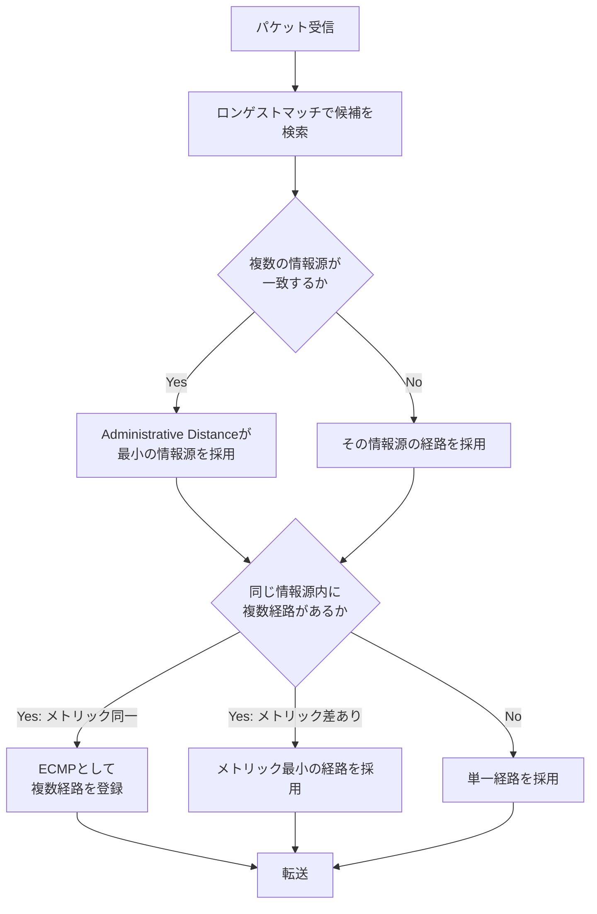

---

## 6.5 構成例

通貫シナリオの本社、支社、インターネットにまたがる経路を、装置とネットワークの単位で整理する。

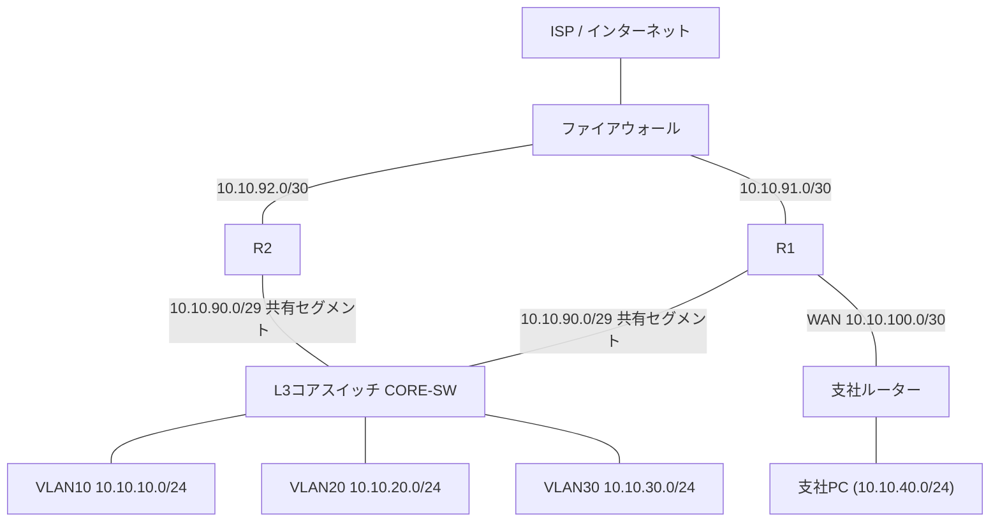

この構成における各区間のIPアドレス設計をまとめる。

| 区間 | ネットワーク | 備考 |
|------|--------------|------|
| R1〜FW | 10.10.91.0/30 | R1のインターネット側インターフェース |
| R2〜FW | 10.10.92.0/30 | R2のインターネット側インターフェース |
| R1・R2・CORE-SW 共有セグメント | 10.10.90.0/29 | OSPFのマルチアクセスネットワーク、第7章のHSRPでも使用 |
| R1〜支社ルーター | 10.10.100.0/30 | 通貫シナリオのVLAN100（WAN） |
| 支社LAN | 10.10.40.0/24 | 支社PCの収容ネットワーク |
| VLAN10／20／30 | 10.10.10.0/24 ほか | 第5章のとおり |

R1、R2、CORE-SW、支社ルーターは、それぞれ次の役割を担う。

- **CORE-SW**：VLAN10・20・30のSVIを持ち、部署間ルーティングを行う。インターネット・支社向けの経路はR1・R2からOSPFで学習する
- **R1**：本社と支社を結ぶWANリンクを収容し、支社ルーターとの間でOSPFネイバーを確立する。ファイアウォール方向へのデフォルトルートを持つ
- **R2**：R1と同じ共有セグメントに参加し、OSPFでCORE-SWと隣接する。ファイアウォール方向へのデフォルトルートを持つが、支社への直接リンクは持たない
- **支社ルーター**：支社LANを収容し、R1とのWANリンク経由でOSPFに参加する

---

## 6.6 Cisco IOSの設定例

### CORE-SW、R1、R2の共有セグメントとOSPFの基本設定

```cisco
CORE-SW(config)# interface Vlan90
CORE-SW(config-if)# description Edge-Transit-Segment
CORE-SW(config-if)# ip address 10.10.90.4 255.255.255.248
CORE-SW(config-if)# exit

CORE-SW(config)# router ospf 1
CORE-SW(config-router)# router-id 10.10.90.4
CORE-SW(config-router)# network 10.10.10.0 0.0.0.255 area 0
CORE-SW(config-router)# network 10.10.20.0 0.0.0.255 area 0
CORE-SW(config-router)# network 10.10.30.0 0.0.0.255 area 0
CORE-SW(config-router)# network 10.10.90.0 0.0.0.7 area 0
```

```cisco
R1(config)# interface GigabitEthernet0/1
R1(config-if)# description Edge-Transit-Segment
R1(config-if)# ip address 10.10.90.1 255.255.255.248
R1(config-if)# exit

R1(config)# interface GigabitEthernet0/2
R1(config-if)# description WAN-to-Branch
R1(config-if)# ip address 10.10.100.1 255.255.255.252
R1(config-if)# exit

R1(config)# interface GigabitEthernet0/0
R1(config-if)# description To-Firewall
R1(config-if)# ip address 10.10.91.2 255.255.255.252
R1(config-if)# exit

R1(config)# router ospf 1
R1(config-router)# router-id 10.10.90.1
R1(config-router)# network 10.10.90.0 0.0.0.7 area 0
R1(config-router)# network 10.10.100.0 0.0.0.3 area 0

! インターネット向けのデフォルトルートをOSPFへ広告する
R1(config-router)# default-information originate
R1(config-router)# exit

R1(config)# ip route 0.0.0.0 0.0.0.0 10.10.91.1
```

```cisco
R2(config)# interface GigabitEthernet0/1
R2(config-if)# description Edge-Transit-Segment
R2(config-if)# ip address 10.10.90.2 255.255.255.248
R2(config-if)# exit

R2(config)# interface GigabitEthernet0/0
R2(config-if)# description To-Firewall
R2(config-if)# ip address 10.10.92.2 255.255.255.252
R2(config-if)# exit

R2(config)# router ospf 1
R2(config-router)# router-id 10.10.90.2
R2(config-router)# network 10.10.90.0 0.0.0.7 area 0
R2(config-router)# default-information originate
R2(config-router)# exit

R2(config)# ip route 0.0.0.0 0.0.0.0 10.10.92.1
```

```cisco
BR(config)# interface GigabitEthernet0/0
BR(config-if)# description WAN-to-HQ
BR(config-if)# ip address 10.10.100.2 255.255.255.252
BR(config-if)# exit

BR(config)# interface GigabitEthernet0/1
BR(config-if)# description Branch-LAN
BR(config-if)# ip address 10.10.40.1 255.255.255.0
BR(config-if)# exit

BR(config)# router ospf 1
BR(config-router)# router-id 10.10.100.2
BR(config-router)# network 10.10.100.0 0.0.0.3 area 0
BR(config-router)# network 10.10.40.0 0.0.0.255 area 0
```

主要パラメータの意味は次のとおりである。

- `router ospf 1`：OSPFプロセスを起動する。`1` はルーター内部だけで意味を持つプロセスIDであり、他ルーターと一致させる必要はない
- `router-id`：OSPF内でルーターを一意に識別するID。明示的に設定しない場合、最大のループバックIPやインターフェースIPから自動選出される
- `network 10.10.90.0 0.0.0.7 area 0`：指定したアドレス範囲（ワイルドカードマスク）に属するインターフェースをOSPFに参加させ、エリア0に所属させる
- `default-information originate`：自分が持つデフォルトルート（`0.0.0.0/0`）をOSPF経由で他のルーターへ広告する。これがないと、R1・R2以外の装置はインターネット向けの経路を学習できない
- `ip route 0.0.0.0 0.0.0.0 10.10.91.1`：ファイアウォール方向への静的なデフォルトルート

この設定により、CORE-SWはOSPFを通じて、R1経由・R2経由の2本の等コストなデフォルトルートと、支社ルーター経由の支社LAN（10.10.40.0/24）向けの経路を学習する。

### スタティックルートのみで支社を構成する場合の参考例

支社側の設計として、OSPFを使わずスタティックルートのみで運用することもできる。

```cisco
BR(config)# ip route 0.0.0.0 0.0.0.0 10.10.100.1
```

```cisco
R1(config)# ip route 10.10.40.0 255.255.255.0 10.10.100.2
```

支社が1本のリンクしか持たないスタブ拠点であれば、この構成でも十分に機能する。

本書ではOSPFの学習を兼ねて支社もOSPFに参加させているが、実務では回線費用や運用体制に応じて、スタティックルートのみの構成を選ぶことも一般的である。

### 確認コマンド

```cisco
! ルーティングテーブル全体を確認する
R1# show ip route

! OSPFのネイバー関係が確立しているか確認する
R1# show ip ospf neighbor

! OSPFで学習した経路だけを絞り込んで確認する
R1# show ip route ospf

! インターフェースごとのOSPFコストや状態を確認する
R1# show ip ospf interface brief
```

`show ip route` の出力で、`O*E2` のような表記が見えることがある。

これは、OSPFで学習した外部経路（デフォルトルートなど、`redistribute` や `default-information originate` によってOSPFに持ち込まれた経路）を示す表記であり、通常の内部OSPF経路（`O`）とは区別される。

---

## 6.7 LinuxおよびWindowsでの確認

エンドホストやサーバーからも、経路の到達性やホップ数を確認できる。

### Windows

```bat
:: 現在のルーティングテーブルを確認する
route print

:: 経路上のホップを確認する（支社PCから本社業務サーバーへの経路など）
tracert 10.10.30.10

:: 特定ポートへの到達性を確認する（後章のツールと合わせて利用）
Test-NetConnection -ComputerName 10.10.30.10 -Port 443
```

### Linux

```bash
# ルーティングテーブルを確認する
ip route show

# 経路上のホップを確認する
traceroute 10.10.30.10

# ICMPが制限されている環境向けの代替
tracepath 10.10.30.10
```

支社PCから本社の業務サーバーへの `tracert` / `traceroute` の結果に、支社ルーター、R1、CORE-SWのIPアドレスが順に現れれば、設計どおりの経路をたどっていることが確認できる。

途中で想定と異なるIPアドレスが現れる場合、ECMPによって別経路（R2側）を通っている可能性、あるいは経路設定に誤りがある可能性を考える。

---

## 6.8 よくある誤解

1. **「デフォルトルートさえあれば、他の経路設定は不要」**
   デフォルトルートは、より具体的な経路が存在しない場合の最終手段である。社内の各サブネットへの経路は、直接接続またはOSPFなどで別途学習・保持する必要がある。

2. **「メトリックが小さい経路は、常にAdministrative Distanceより優先される」**
   実際は逆であり、まずAdministrative Distanceで情報源を選び、同じ情報源内で複数経路がある場合にのみメトリックで比較する。

3. **「OSPFのエリアを分けないと動作しない」**
   単一エリア（エリア0のみ）でも問題なく動作する。エリア分割は、大規模ネットワークにおけるスケーラビリティ向上のための手段であり、必須要件ではない。

4. **「ECMPが有効なら、常に通信は均等に2つの経路に分散される」**
   多くの実装は、フロー単位（送信元・宛先の組み合わせなど）でハッシュを取って経路を固定するため、個々のパケット単位で交互に振り分けられるわけではない。特定のフローは常に同じ経路を通ることが多い。

5. **「スタティックルートは古い技術であり、ダイナミックルーティングだけで十分」**
   スタティックルートは、経路が単純で変化の少ない区間（デフォルトルートやスタブ拠点など）では、むしろシンプルで障害点の少ない選択肢になる。両者は排他的ではなく、適材適所で組み合わせる。

---

## 6.9 代表的な障害

| 症状 | ありがちな原因 |
|------|----------------|
| 支社から本社の特定VLANだけ届かない | CORE-SWまたはR1でOSPFのネットワークステートメントに該当サブネットが含まれていない |
| インターネットにだけ出られない | `default-information originate` の設定漏れ、またはR1・R2のデフォルトルート自体の誤り |
| OSPFネイバーが確立しない | エリア番号の不一致、Helloタイマー／Deadタイマーの不一致、インターフェースのサブネット不一致 |
| 特定の宛先だけ、意図しないルーターを経由する | 古いスタティックルートがAdministrative Distanceの差でOSPF経路より優先されている |
| 通信が時々失敗する（ステートフルFW配下） | ECMPによる非対称経路と、ファイアウォールのセッションテーブル不一致 |

---

## 6.10 トラブルシューティング手順

1. **端末側の経路確認**：`route print` / `ip route show` で、デフォルトゲートウェイと想定経路を確認する
2. **直接接続経路の確認**：ルーターで `show ip route connected` を実行し、物理的な到達性の土台を確認する
3. **OSPFネイバーの確認**：`show ip ospf neighbor` で、期待するネイバーがFULL状態になっているか確認する
4. **ルーティングテーブルの確認**：`show ip route` で、対象宛先の経路が存在するか、どの情報源（C/S/O）から来ているかを確認する
5. **Administrative Distanceの確認**：同じ宛先に対して複数の情報源が競合していないか、意図しないスタティックルートが残っていないかを確認する
6. **traceroute によるホップの特定**：どのホップで経路が途切れる、または想定外の方向に進んでいるかを確認する
7. **ACL・ファイアウォールの確認**：経路自体は正しいのに通信が失敗する場合、経路上のACLやファイアウォールポリシー（第8章）を疑う

経路が「存在しない」のか、経路は正しいが「途中で拒否されている」のかを区別することが、切り分けの初期段階で最も重要である。

---

## 6.11 設計・運用上の注意点

1. **デフォルトルートの発生源を1箇所に限定する**
   複数の装置がそれぞれ独自にデフォルトルートを生成すると、意図しない経路の逆流や非対称経路が発生しやすくなる。通貫シナリオではR1・R2のみがデフォルトルートの発生源とする。

2. **OSPFのネットワークステートメントは、意図した範囲だけに絞る**
   広すぎるワイルドカードマスクの指定は、意図しないインターフェースをOSPFに参加させ、想定外のネイバー関係を作る原因になる。

3. **AD・メトリックの競合を意識した移行計画を立てる**
   スタティックルートからOSPFへ移行する際、移行期間中に両方が存在する状態を想定し、Administrative Distanceの差による意図しない経路切り替えが起きないか事前に確認する。

4. **ECMPを使う区間と使わない区間を明確に分ける**
   ステートフルなファイアウォールが絡む区間では、非対称経路の問題を避けるため、ECMPではなく後述のHSRP/VRRPによるActive/Standby構成を採用するかどうかを、設計段階で決めておく。

5. **基準帯域幅の設定を回線速度の実態に合わせる**
   ギガビット以上のリンクが混在する場合、OSPFの `auto-cost reference-bandwidth` を見直し、実際の帯域差がメトリックに反映されるようにする。

6. **エリア設計は将来の拡張を見据えて検討する**
   現時点で単一エリアでも問題がなくても、拠点数の増加を見越して、将来のエリア分割方針をあらかじめ検討しておくと、移行がスムーズになる。

---

## 6.12 要点まとめ

- ルーティングは、宛先IPアドレスに基づきパケットを転送するレイヤー3の処理であり、ルーティングテーブルを介して行われる
- 経路選択はロンゲストマッチが最優先され、次いでAdministrative Distance、そしてメトリックの順で評価される
- デフォルトルートは、具体的な経路が存在しない宛先の受け皿であり、`0.0.0.0/0` で表現される
- スタティックルートは手動設定、ダイナミックルーティングは自動的な経路交換であり、それぞれ適した状況が異なる
- OSPFはリンクステート型の標準プロトコルであり、ネイバー確立、LSAの交換、SPF計算という流れで経路を構築する
- Administrative Distanceは異なる情報源間の優先順位、メトリックは同じ情報源内での優劣を決める
- ECMPは等コストな複数経路を並行して使う仕組みだが、ステートフルな装置がある区間では非対称経路に注意が必要である

---

## 6.13 章末問題

### 問題1

ルーティングテーブルに `10.10.40.0/24` と `0.0.0.0/0` の両方の経路が存在するとき、宛先 `10.10.40.5` 宛のパケットはどちらの経路で転送されるか、その理由とともに述べよ。

### 問題2

Administrative Distanceとメトリックの役割の違いを説明せよ。

### 問題3

ディスタンスベクター型とリンクステート型のルーティングプロトコルの違いを、各ルーターが保持する情報の観点から述べよ。

### 問題4

OSPFにおいて、`default-information originate` を設定する目的を説明せよ。

### 問題5

ECMPを使ってインターネット向けの通信を負荷分散している構成で、通信が時々失敗する現象が発生している。考えられる原因を1つ挙げよ。

---

## 6.14 解答と解説

### 解答1

`10.10.40.0/24` の経路で転送される。ロンゲストマッチの原則により、プレフィックス長がより長い（より具体的な）経路が優先されるため、`/24` の経路が `/0`（デフォルトルート）より優先される。

### 解答2

Administrative Distanceは、異なる経路情報源（スタティック、OSPFなど）から同じ宛先への経路が複数存在する場合に、どの情報源を信頼するかを決める基準である。メトリックは、同じ情報源内で複数の経路が存在する場合に、どちらがより良い経路かを比較する基準である。

### 解答3

ディスタンスベクター型は、隣接ルーターに対して経路とその距離のみを伝え合い、ネットワーク全体のトポロジーは把握しない。リンクステート型は、各ルーターがリンク状態の情報を交換し合い、全ルーターが同じネットワーク全体のトポロジー情報（LSDB）を保持したうえで、それぞれが最短経路を計算する。

### 解答4

自分が持つデフォルトルート（`0.0.0.0/0`）を、OSPFを通じて他のルーターへ広告するためである。これを設定しないと、そのルーター以外の装置は、インターネットなどの外部向けの経路を学習できない。

### 解答5

例：ECMPにより、ある通信の往路と復路が異なるルーター（R1経由とR2経由）を通ってしまい、経路上のステートフルなファイアウォールが戻りパケットをセッションテーブルと照合できず破棄している可能性が考えられる。

---

## 6.15 実機またはシミュレーター演習

Cisco Packet Tracer、GNS3、CML、実機のいずれかを使い、本社・支社間のルーティングを再現する。

### 演習A：スタティックルートによる支社接続

1. 本社ルーターと支社ルーターをWANリンクで接続する
2. 双方に、相手側のLANへ到達するためのスタティックルートを設定する
3. 双方のLAN上のPCから、相手側LANのPCへpingが成功することを確認する
4. WANリンクを意図的にshutdownし、pingが失敗することと、`show ip route` から経路が消えることを確認する

### 演習B：OSPFへの移行

1. 演習Aの構成から、双方のルーターでOSPFプロセスを起動し、WANリンクとLANをエリア0に参加させる
2. `show ip ospf neighbor` でネイバーがFULLになることを確認する
3. スタティックルートを削除し、OSPFのみで到達性が維持されることを確認する
4. スタティックルートを一時的に復活させ、Administrative Distanceの差によりOSPF経路より優先される様子を `show ip route` で観察する

### 演習C：デフォルトルートとECMP

1. 2台のルーター（R1、R2相当）をそれぞれ別のリンクでファイアウォール役の装置に接続する
2. 双方に静的なデフォルトルートを設定し、OSPFで `default-information originate` を使って内部へ広告する
3. コアスイッチ相当の装置で `show ip route` を実行し、デフォルトルートが2本、等コストで登録されていることを確認する
4. 一方のルーターのアップリンクをshutdownし、経路が1本に収束することを確認する

---

## 次章への橋渡し

ここまでの設計では、OSPFによる経路の冗長化を扱った。

しかし、経路の冗長化だけでは対応しきれない問題も残っている。

物理的なリンクを冗長化した際に発生するレイヤー2のループ、そしてR1・R2のようなゲートウェイ機器そのものの障害に対して、エンドホスト側の設定を変えずに素早く切り替える仕組みである。

第7章では、STPによるループ防止、EtherChannelによるリンク集約、そしてHSRP・VRRPによるゲートウェイ冗長化を扱う。


---


<!-- ========== 07_redundancy.md ========== -->

# 第7章 冗長化とループ防止

## 学習目標

この章を終えると、次のことができる。

1. レイヤー2ループとブロードキャストストームが発生する条件を説明できる
2. STP（Spanning Tree Protocol）とRSTP（Rapid Spanning Tree Protocol）を、ルートブリッジ、ポートロール、ポート状態の観点から説明できる
3. EtherChannelとLACP（Link Aggregation Control Protocol）の目的と設定要点を説明できる
4. HSRP（Hot Standby Router Protocol）とVRRP（Virtual Router Redundancy Protocol）の違いを、ベンダー固有か標準かという観点で区別できる
5. 本社R1・R2のゲートウェイ冗長化を、具体的な設計と設定として構成できる

---

## 7.1 この章で学ぶこと

第6章では、OSPFによってR1・R2の両方が経路情報を提供し、経路レベルでの冗長性を確保した。

しかし、冗長化には経路計算とは別の側面もある。

1つは、物理的なリンクを冗長化したときに新たに生まれる、レイヤー2の**ループ**という問題である。

もう1つは、R1やR2そのものが停止したときに、末端の機器や設定を変更することなく、瞬時に代替経路へ切り替える仕組みである。

OSPFによる経路の再計算にも一定の時間がかかり、また、すべての機器がOSPFのようなダイナミックルーティングに対応しているとは限らない。

この章では、L2の冗長化を支えるSTP・RSTPと、帯域集約とループ回避を両立するEtherChannel、そしてL3のデフォルトゲートウェイを冗長化するHSRP・VRRPを扱う。

最終的に、本社のR1・R2を使った具体的なゲートウェイ冗長化構成を組み立てる。

---

## 7.2 冗長化が必要になった背景

単一の機器や単一のリンクだけに依存したネットワークは、故障がそのままサービス停止に直結する。

この単一障害点（Single Point of Failure）をなくすための素朴な発想は、「重要な区間は物理的に2本以上のリンクや機器で構成する」というものである。

ところが、レイヤー2のネットワークでこれを単純に行うと、新たな問題が生じる。

スイッチは、宛先MACアドレスが不明なフレームやブロードキャストフレームを、受信ポート以外のすべてのポートへ送り出す（フラッディングする）。

もしスイッチ間に物理的な冗長リンクがあり、それがループ状に接続されていると、フラッディングされたフレームが行き場を失わず、ネットワーク内を永久に回り続けてしまう。

さらに、そのフレームがループするたびに複製され、ネットワーク全体の帯域とスイッチのCPU資源を急速に消費し尽くす、**ブロードキャストストーム**という状態に陥る。

L2の冗長化には、「物理的には複数の経路を用意しつつ、論理的には常に1つのループのない経路だけを使う」という仕組みが必要であり、これがSTPが生まれた背景である。

一方、L3側では、デフォルトゲートウェイとなるルーターが1台しかない構成では、そのルーターの故障がネットワーク全体の外部通信を止めてしまう。

多くの端末は、静的に設定された1つのデフォルトゲートウェイしか認識できない。

この制約の中でゲートウェイを冗長化するために生まれたのが、HSRPやVRRPである。

---

## 7.3 基本概念

### 7.3.1 L2ループとブロードキャストストーム

**L2ループ**とは、スイッチ間の物理的な接続が環状（ループ状）になっている状態である。

ループが存在すると、次の3つの問題が同時に発生し得る。

1. **ブロードキャストストーム**：ブロードキャストフレームがループ内を回り続け、複製されながら帯域を消費し尽くす
2. **MACアドレステーブルの不安定化**：同じ送信元MACアドレスを持つフレームが、複数のポートから交互に到着するように見え、スイッチがMACアドレステーブルを頻繁に書き換え続ける
3. **フレームの重複配信**：同じフレームの複数のコピーが、異なる経路を経由して受信側に到着する

これらは、冗長化のために意図的に用意した複数のリンクが、対策なしにそのまま有効化された場合に起こる。

STPは、この問題に対して「物理的な冗長リンクは残しつつ、論理的には特定のリンクを一時的に非使用（ブロッキング）状態にすることで、常にループのない木構造（スパニングツリー）を維持する」という解決策を取る。

### 7.3.2 STP

**STP**（Spanning Tree Protocol：スパニングツリープロトコル）は、IEEE 802.1Dで標準化された、L2ネットワークにおけるループ防止プロトコルである。

STPは、次の手順でループのない論理トポロジーを構築する。

1. **ルートブリッジの選出**：ネットワーク内のすべてのスイッチが、ブリッジID（プライオリティ値とMACアドレスの組み合わせ）を交換し、最も小さいブリッジIDを持つスイッチを**ルートブリッジ**として選出する
2. **ルートポートの決定**：ルートブリッジ以外の各スイッチは、ルートブリッジまでの経路コストが最小になるポートを**ルートポート**として選ぶ
3. **指定ポートの決定**：各セグメント（リンク）ごとに、ルートブリッジへの経路コストが最小のポートを**指定ポート**として選び、そのセグメント上でのフレーム転送を担当させる
4. **非指定ポートのブロッキング**：ルートポートにも指定ポートにも選ばれなかったポートは、フレームを転送しない状態（ブロッキング）にする

この結果、ネットワーク全体が、ルートブリッジを根とする、ループのない論理的な木構造として動作する。

STPの大きな欠点は、トポロジー変化（リンク障害やスイッチ追加）に対する収束の遅さである。

既定のタイマー設定では、ポートがブロッキングからフォワーディングへ遷移するまでに、30秒から50秒程度かかることがある。

### 7.3.3 RSTP

**RSTP**（Rapid Spanning Tree Protocol：高速スパニングツリープロトコル）は、STPの収束の遅さを改善したプロトコルであり、当初IEEE 802.1wとして標準化され、その後IEEE 802.1D-2004に統合され、現在はIEEE 802.1Q規格群の一部として扱われている。

RSTPは、STPと同じくルートブリッジを選出し、ループのない木構造を作るという基本原理は共通しているが、次の点で高速化を実現している。

- タイマーによる待機ではなく、隣接スイッチ間の**提案・合意（Proposal/Agreement）**の仕組みによって、条件が整い次第すぐにポートをフォワーディング状態へ遷移させる
- ポート状態を、STPの5状態（Disabled、Blocking、Listening、Learning、Forwarding）から、Discarding、Learning、Forwardingの3状態に整理している
- 待機系のポートに、後述する**代替ポート**と**バックアップポート**という役割を新たに定義し、障害時にすぐ使えるよう準備しておく

現在のCisco製スイッチの多くは、既定でRSTP、またはRSTPをベースにVLANごとに独立したインスタンスを持たせたPVST+/Rapid PVST+で動作する。

CCNAの学習としては、「STPが基本原理、RSTPがその高速化版」という関係を押さえておく。

### 7.3.4 ルートブリッジ、ポートロール、ポート状態

#### ルートブリッジ

**ルートブリッジ**は、STP/RSTPのトポロジー計算における基準点となるスイッチである。

ブリッジID（プライオリティ+MACアドレス）が最も小さいスイッチが自動的に選ばれるが、実運用では、意図したスイッチ（多くはコアやディストリビューション層のスイッチ）を確実にルートブリッジにするため、プライオリティ値を明示的に下げて設定することが一般的である。

#### ポートロール（役割）

| ポートロール | 意味 |
|--------------|------|
| ルートポート | 非ルートブリッジ上で、ルートブリッジまでの最小コスト経路となるポート（1台につき1つ） |
| 指定ポート | 各セグメントでフレームを転送する担当となるポート |
| 代替ポート（RSTP） | ルートポートの代替候補となる非転送ポート |
| バックアップポート（RSTP） | 同一セグメント上の指定ポートの代替候補となる非転送ポート |
| ブロッキングポート（STP） | どの役割にも選ばれず、転送を行わないポート |

#### ポート状態

| STPの状態 | RSTPの状態 | 転送 | MAC学習 |
|-----------|------------|------|---------|
| Blocking | Discarding | しない | しない |
| Listening | Discarding | しない | しない |
| Learning | Learning | しない | する |
| Forwarding | Forwarding | する | する |

RSTPはBlockingとListeningを区別せず、まとめてDiscardingとして扱うことで、状態遷移の判断を単純化し、高速化を実現している。

### 7.3.5 EtherChannelとLACP

**EtherChannel**とは、複数の物理リンクを束ねて、1本の論理的なリンクとして扱うCiscoの用語である。

複数リンクを束ねる目的は大きく2つある。

1. **帯域の集約**：複数の物理リンクの帯域を合算して使える
2. **冗長性の確保**：束ねた中の1本が故障しても、残りのリンクで通信を継続できる

STPは、EtherChannelを1本の論理ポートとして認識するため、束ねたリンクの一部がSTPによってブロッキングされることはない。

これにより、単純な冗長リンクでは片方が常にブロッキングされ帯域が無駄になっていた状況を避け、複数リンクをすべてアクティブに使いながら、ループも防止できる。

EtherChannelを構成するリンク同士のネゴシエーションには、次の方式がある。

| 方式 | 標準／固有 | 概要 |
|------|-----------|------|
| LACP（Link Aggregation Control Protocol） | IEEE標準（元々802.3ad、現在は802.1AXの一部） | 双方が動的にネゴシエーションしてチャネルを形成する |
| PAgP（Port Aggregation Protocol） | Cisco固有 | LACPと同様の役割をCisco独自の方式で実現する |
| static（on モード） | ベンダー非依存の静的設定 | ネゴシエーションを行わず、双方を強制的にチャネル化する |

LACPはIEEEによる標準規格であるため、他ベンダーの機器との相互接続でも利用できる。

このため、実務ではPAgPよりもLACPが選ばれることが多い。

`on` モードによる静的な構成は、ネゴシエーションが一切行われないため、片方の設定ミスに気づきにくく、意図しないループや誤ったチャネル構成につながりやすい。

### 7.3.6 HSRP（Cisco固有）

**HSRP**（Hot Standby Router Protocol：ホットスタンバイルータプロトコル）は、複数のルーター（またはL3スイッチ）が、共通の仮想IPアドレスと仮想MACアドレスを共有し、1台をActive、残りをStandbyとして動作させることで、デフォルトゲートウェイを冗長化するプロトコルである。

HSRPはCisco固有のプロトコルであり、参考情報としてRFC 2281が存在するが、これはIETFの標準化トラック（Standards Track）ではなく、Informational（情報提供）扱いの文書である。

HSRPの基本動作は次のとおりである。

1. 複数台のルーターが、同じHSRPグループ番号と、共通の仮想IPアドレスを設定する
2. 各ルーターがHelloメッセージを交換し、プライオリティが最も高いルーターが**Active**になる
3. Activeルーターだけが、仮想IP・仮想MACアドレス宛のトラフィックを実際に処理する
4. 残りのルーターは**Standby**（またはListen）状態で待機し、Activeルーターの障害を検知すると、次にプライオリティの高いルーターが新たにActiveへ昇格する

端末側は、デフォルトゲートウェイとして仮想IPアドレスだけを設定しておけばよく、実際にどちらの物理ルーターが応答しているかを意識する必要がない。

`preempt` を設定しておくと、一度Standbyへ回った旧Activeルーターが復旧した際、プライオリティに従って再びActiveへ戻ることができる。

また、`track` 機能を使うと、特定のインターフェース（たとえばインターネット側の回線）がダウンした際にプライオリティを自動的に下げ、実際にインターネットへ到達できるルーターの方をActiveにする、といった制御も可能である。

### 7.3.7 VRRP（標準）

**VRRP**（Virtual Router Redundancy Protocol：仮想ルータ冗長プロトコル）は、HSRPと同様の目的、すなわちデフォルトゲートウェイの冗長化を実現する、IETFによる標準プロトコルである。

VRRPv2はRFC 3768、VRRPv3はRFC 5798で標準化されており、ベンダーを問わず利用できる。

VRRPとHSRPは概念的に似ているが、用語や一部の動作が異なる。

| 概念 | HSRP（Cisco固有） | VRRP（標準） |
|------|--------------------|---------------|
| 主系の呼び名 | Active | Master |
| 副系の呼び名 | Standby | Backup |
| グループ識別子 | グループ番号 | 仮想ルータID（VRID） |
| 仮想IPアドレス | 常に実在インターフェースとは別の仮想アドレス | 条件によっては、Masterの実インターフェースIPそのものを仮想IPとして使える（IPアドレスオーナー） |
| 相互運用性 | Cisco機器間のみ | 標準規格のため異なるベンダー間でも利用可能 |

複数ベンダーの機器が混在する環境や、標準規格への準拠が求められる環境ではVRRPが選ばれ、Cisco機器のみで構成され、`track` などCisco独自の付加機能を積極的に使いたい場合はHSRPが選ばれる、という使い分けが一般的である。

CCNAの学習としては、「HSRPはCisco固有、VRRPは標準」という区別を明確に持っておくことが重要である。

---

## 7.4 冗長化構成の考え方と通信の流れ

通貫シナリオでは、次の2種類の冗長化を組み合わせる。

1. **L2の冗長化**：アクセススイッチとコアスイッチの間に物理的な冗長リンクを用意し、STP/RSTPでループを防ぎつつ、EtherChannelで両方のリンクを有効活用する
2. **L3の冗長化**：R1・R2が共有セグメント上でHSRPを構成し、コアスイッチのデフォルトルートの次ホップとなる仮想IPアドレスを常に到達可能に保つ

### L2側の考え方

第5章の構成では、Access-SW-AとCORE-SWの間は1本のトランクリンクだけであった。

単一リンクは、そのリンク自体が単一障害点になる。

そこで、Access-SW-AからCORE-SWへ2本目の物理リンクを追加することを考える。

2本の独立したトランクリンクをそのまま有効化すると、L2ループが発生してしまうため、次のいずれかの対策を取る。

- 何もしなければSTP/RSTPが自動的に片方をブロッキングし、ループを防ぐ（ただし片方の帯域は使われない）
- 2本のリンクをEtherChannelとして束ね、1本の論理リンクとして扱う（両方の帯域を使いながらループも防げる）

通貫シナリオでは、後者のEtherChannel（LACP）による構成を採用する。

### L3側の考え方

第6章では、R1・R2がそれぞれ独立にOSPFのデフォルトルートを広告し、ECMPによってCORE-SWから見て2本の等コストな経路が存在する状態を作った。

これは経路レベルでは有効だが、ステートフルなファイアウォールが絡む区間では非対称経路の問題が生じ得ることを第6章で述べた。

このため、実際の設計としては、CORE-SWからインターネット方向への経路を、ECMPによる分散ではなく、HSRPによる常に1つのActive経路への集約に切り替える。

具体的には、R1・R2が共有セグメント（10.10.90.0/29）上でHSRPグループを構成し、仮想IP（10.10.90.3）をActiveなルーターだけが応答する。

CORE-SWは、OSPFで2本の経路を学習するのではなく、この仮想IPを次ホップとする単一の静的デフォルトルートを持つ構成に変更する。

これにより、通常時は常に同じルーター（例：R1）を経由し、往路と復路が一致する対称的な経路が維持される。

R1に障害が発生した場合は、HSRPのフェイルオーバーによって、端末側やCORE-SW側の設定を一切変更することなく、数秒以内にR2が仮想IPの処理を引き継ぐ。

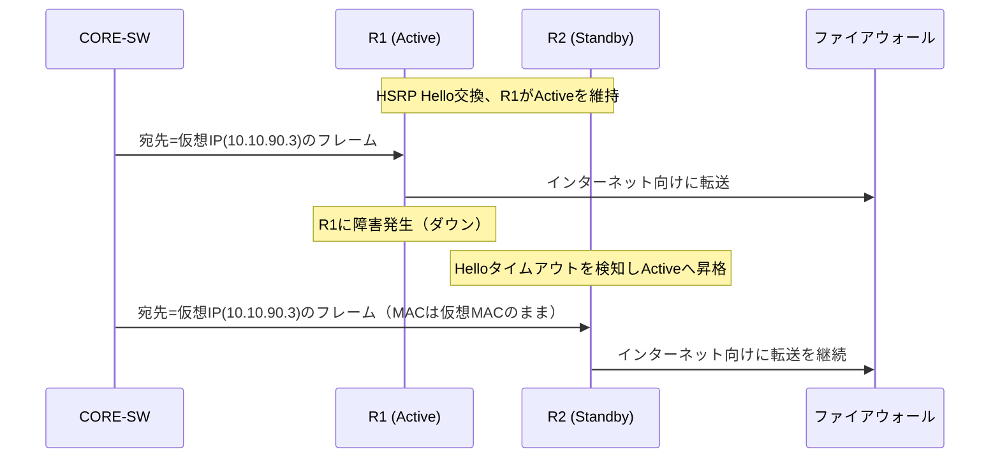

CORE-SW側は、宛先MACアドレスとしてHSRPの仮想MACアドレスを使い続けているだけであり、実際にどちらの物理ルーターが応答しているかを意識しない。

これが、HSRPが端末やL3スイッチの設定変更なしに冗長化を実現できる理由である。

---

## 7.5 構成例

L2とL3、両方の冗長化を反映した構成を示す。

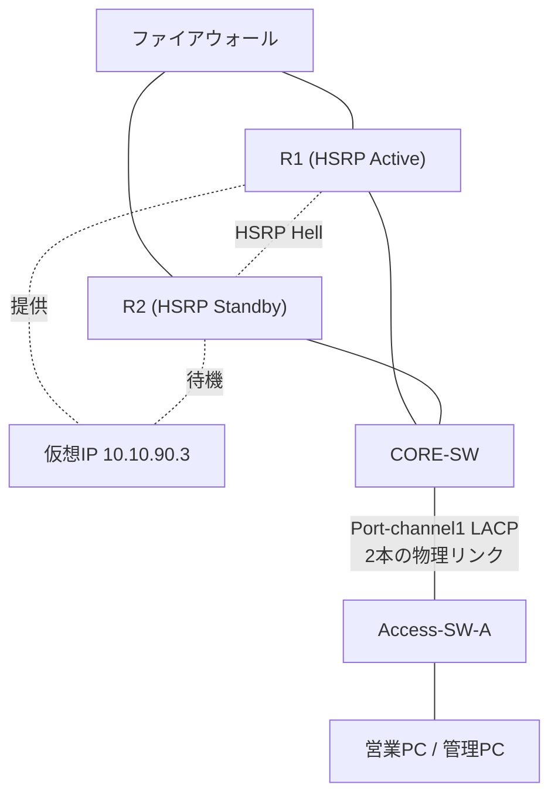

この構成の設計意図は次のとおりである。

- CORE-SWのデフォルトルートは、R1・R2個別のIPではなく、HSRPの仮想IP（10.10.90.3）を次ホップとする
- Access-SW-AとCORE-SW間の物理リンクは2本用意し、EtherChannel（LACP）で1本の論理リンクとして扱う
- OSPFは、部署間・支社向けの経路情報の交換には引き続き利用し、インターネット向けのデフォルトルートについてはHSRPによるActive/Standby構成へ切り替える

---

## 7.6 Cisco IOSの設定例

### Access-SW-AとCORE-SW間のEtherChannel（LACP）

```cisco
Access-SW-A(config)# interface range GigabitEthernet1/0/23-24
Access-SW-A(config-if-range)# channel-group 1 mode active
Access-SW-A(config-if-range)# exit

Access-SW-A(config)# interface Port-channel1
Access-SW-A(config-if)# switchport trunk encapsulation dot1q
Access-SW-A(config-if)# switchport mode trunk
Access-SW-A(config-if)# switchport trunk native vlan 99
Access-SW-A(config-if)# switchport trunk allowed vlan 10,30,99
Access-SW-A(config-if)# switchport nonegotiate
```

```cisco
CORE-SW(config)# interface range GigabitEthernet1/0/1-2
CORE-SW(config-if-range)# channel-group 1 mode active
CORE-SW(config-if-range)# exit

CORE-SW(config)# interface Port-channel1
CORE-SW(config-if)# switchport trunk encapsulation dot1q
CORE-SW(config-if)# switchport mode trunk
CORE-SW(config-if)# switchport trunk native vlan 99
CORE-SW(config-if)# switchport trunk allowed vlan 10,30,99
CORE-SW(config-if)# switchport nonegotiate
```

主要パラメータの意味は次のとおりである。

- `channel-group 1 mode active`：LACPを使い、能動的にネゴシエーションを行ってEtherChannelを形成する（`passive` は相手からの提案を待つ受動モード）
- `interface Port-channel1`：束ねた物理リンクを表す論理インターフェース。トランク設定はこの論理インターフェースに対して行う
- 物理インターフェース側（`GigabitEthernet1/0/1` など）に個別のswitchport設定を残すと、論理インターフェース側の設定と競合する可能性があるため、通常はPort-channel側にまとめる

両端で `channel-group` の番号自体を一致させる必要はないが、モード（activeとactive、またはactiveとpassiveの組み合わせ）や、トランクの許可VLAN・ネイティブVLANの設定は一致させる必要がある。

### STPのルートブリッジ指定（参考、EtherChannel適用後の残りのループ対策）

```cisco
CORE-SW(config)# spanning-tree vlan 10,20,30,99 priority 4096
```

コアスイッチのプライオリティ値を明示的に下げることで、意図的にCORE-SWをルートブリッジに固定する。

プライオリティ値は4096刻みで設定でき、値が小さいほど優先される。

### HSRPの設定（R1、R2）

```cisco
R1(config)# interface GigabitEthernet0/1
R1(config-if)# ip address 10.10.90.1 255.255.255.248
R1(config-if)# standby 10 ip 10.10.90.3
R1(config-if)# standby 10 priority 150
R1(config-if)# standby 10 preempt
R1(config-if)# standby 10 track GigabitEthernet0/0 20
```

```cisco
R2(config)# interface GigabitEthernet0/1
R2(config-if)# ip address 10.10.90.2 255.255.255.248
R2(config-if)# standby 10 ip 10.10.90.3
R2(config-if)# standby 10 priority 100
R2(config-if)# standby 10 preempt
```

主要パラメータの意味は次のとおりである。

- `standby 10 ip 10.10.90.3`：HSRPグループ10の仮想IPアドレスを指定する。両ルーターで同じグループ番号・同じ仮想IPを指定する
- `standby 10 priority 150`：プライオリティ値。値が大きいほど優先され、Activeになりやすい。R1を通常時のActiveにするため、既定値100より高い150を設定している
- `standby 10 preempt`：自分がより高いプライオリティを持つと判断した場合、既にActiveが存在していても、そのActiveの座を奪い返す動作を許可する
- `standby 10 track GigabitEthernet0/0 20`：R1のインターネット側インターフェース（GigabitEthernet0/0）がダウンした場合、プライオリティを20下げる。これにより、R1のインターネット側リンクが切れた際、R1のプライオリティが130まで下がり、R2（100）より低くなればR2にActiveが移る、という制御ができる（下げ幅は実際のプライオリティ差を踏まえて設計する）

CORE-SW側のデフォルトルートは、次のように仮想IPを次ホップとする静的経路に変更する。

```cisco
CORE-SW(config)# no ip route 0.0.0.0 0.0.0.0
CORE-SW(config)# ip route 0.0.0.0 0.0.0.0 10.10.90.3
```

### 確認コマンド

```cisco
! EtherChannelの状態、束ねているポート、プロトコル（LACP）を確認する
Switch# show etherchannel summary

! STPのルートブリッジ、ポートロール、ポート状態を確認する
Switch# show spanning-tree vlan 10

! HSRPのグループ状態（Active/Standby）、仮想IP、プライオリティを確認する
R1# show standby brief
R1# show standby GigabitEthernet0/1
```

`show standby brief` で `State` が `Active` になっているルーターが、実際に仮想IP宛のトラフィックを処理しているルーターである。

`show etherchannel summary` の出力で、ポートの状態が `P`（bundled、正常に束ねられている）になっているかを必ず確認する。

`I`（individual）のままの場合、ネゴシエーションが成立せず、そのポートは論理リンクに参加できていない。

### VRRPの参考設定（標準プロトコルとしての比較）

```cisco
R1(config-if)# vrrp 10 ip 10.10.90.3
R1(config-if)# vrrp 10 priority 150
R1(config-if)# vrrp 10 preempt
```

コマンド体系はHSRPとよく似ているが、キーワードが `standby` ではなく `vrrp` になる。

VRRPでは、Masterルーターの実インターフェースIPそのものを仮想IPとして使う「IPアドレスオーナー」という構成も可能であり、この点がHSRPとの設計上の違いの1つである。

---

## 7.7 LinuxおよびWindowsでの確認

エンドホストからは、実際にどちらの物理ルーターが応答しているかを直接知ることはできないが、疎通性とMACアドレスの変化から間接的に確認できる。

### Windows

```bat
:: デフォルトゲートウェイ（仮想IP）への疎通確認
ping 10.10.90.3

:: ARPキャッシュを確認し、ゲートウェイの仮想MACアドレスを確認する
arp -a

:: フェイルオーバー前後でMACアドレスが変わらないことを確認する
```

HSRP/VRRPでは、Active/Standbyが切り替わっても仮想MACアドレスは変わらないため、端末のARPキャッシュを更新する必要がなく、切り替えが高速に行える。

### Linux

```bash
# デフォルトゲートウェイへの疎通確認
ping -c 4 10.10.90.3

# ARP／近隣キャッシュを確認する
ip neigh show

# ルーティングテーブル上のデフォルトゲートウェイを確認する
ip route show default
```

フェイルオーバーの検証を行う場合、Active側のルーターをshutdownし、`ping` が数パケット失敗した後に自動的に再開すること、`ip neigh` 上の仮想IPに対応するMACアドレスが変化しないことを確認するとよい。

---

## 7.8 よくある誤解

1. **「冗長リンクを増やせば増やすほど、ネットワークは安定する」**
   ループ防止の仕組み（STP/RSTP）やリンク集約（EtherChannel）を適切に設計しなければ、リンクを増やすこと自体がブロードキャストストームのリスクを高める。

2. **「EtherChannelを組めば、STPは不要になる」**
   EtherChannelはSTPが不要になるわけではなく、束ねたリンクをSTPから見て1本の論理ポートとして扱わせることで、ブロッキングによる帯域の無駄を避ける仕組みである。EtherChannelの外側に別の物理冗長リンクがあれば、STPは引き続き必要である。

3. **「HSRPとVRRPはコマンドが違うだけで、完全に同じもの」**
   基本的な目的と動作原理は似ているが、HSRPはCisco固有、VRRPは標準規格であり、ベンダー間の相互運用性や、仮想IPの扱い（IPアドレスオーナーの有無）など、細部の設計に違いがある。

4. **「Active/Standby構成では、Standby側のルーターは何もしていない」**
   Standby側もHelloメッセージの送受信やOSPFなどのルーティングプロトコル処理は継続しており、仮想IP宛のトラフィック処理だけを行っていない状態である。障害検知や経路計算自体は通常どおり動作している。

5. **「STPさえ動いていれば、ループは絶対に起きない」**
   誤ったポートの `spanning-tree portfast` 設定や、STPが正しく動作しないハブなどの中間装置が混在すると、STPの前提が崩れ、ループが発生し得る。STPは万能ではなく、設計と設定の正しさが前提になる。

---

## 7.9 代表的な障害

| 症状 | ありがちな原因 |
|------|----------------|
| ネットワーク全体が急激に重くなり、スイッチのCPU使用率が急上昇する | 冗長リンクにおけるSTPの機能不全、またはSTPが無効化された状態でのループ |
| EtherChannelを組んだはずのポートが、片方しか使われていない | 両端のモード不一致（`active`と`on`の組み合わせなど）や、許可VLAN・ネイティブVLANの不一致 |
| HSRPのActiveが想定外のルーターになっている | プライオリティ設定の誤り、`preempt` の設定漏れ |
| インターネット回線障害時にActiveが切り替わらない | `track` の対象インターフェースの設定漏れ、または下げ幅の設計不足 |
| STPの収束後、特定のポートだけがずっとブロッキングのまま | ルートブリッジやパスコストの設計ミスにより、意図しないポートが非指定ポートになっている |

---

## 7.10 トラブルシューティング手順

1. **物理層の確認**：冗長化対象のリンクがすべてup/upであるかを確認する
2. **STPの状態確認**：`show spanning-tree vlan X` で、ルートブリッジがどのスイッチになっているか、各ポートの役割・状態を確認する
3. **EtherChannelの状態確認**：`show etherchannel summary` で、対象ポートがbundled状態か、除外されているポートがないかを確認する
4. **HSRP/VRRPの状態確認**：`show standby brief`（または `show vrrp brief`）で、期待するルーターがActive/Masterになっているかを確認する
5. **フェイルオーバーの検証**：意図的にActive側をshutdownし、Standby側が正しく昇格するか、切り替え時間が許容範囲かを確認する
6. **上位層の疎通確認**：L2・L3の冗長化構成が正常でも、上位のACLやルーティング設定に問題がないかを合わせて確認する

冗長化構成の障害は、「冗長化していたはずなのに実際には片系しか機能していなかった」というケースが多いため、平常時から定期的にフェイルオーバー試験を行うことが重要である。

---

## 7.11 設計・運用上の注意点

1. **ルートブリッジの位置を明示的に固定する**
   自動選出に任せず、コアやディストリビューション層のスイッチに低いプライオリティを設定し、意図したトポロジーを確実に作る。

2. **未使用ポートにはPortFastを使わない**
   `spanning-tree portfast` は、STPの初期状態遷移を高速化するが、スイッチ同士を接続するポートに誤って設定すると、ループ検出が遅れる原因になる。エンドホスト専用のアクセスポートにのみ使用する。

3. **EtherChannelのモードは両端で整合させる**
   `active`同士、または`active`と`passive`の組み合わせを使い、`on`モードによる強制構成は極力避ける。

4. **HSRP/VRRPのプライオリティとpreemptの組み合わせを明文化する**
   どちらの機器を通常時のActiveにするか、障害復旧後に自動的に戻すかどうかを設計段階で決め、ドキュメント化しておく。

5. **track機能の下げ幅は実際のプライオリティ差を踏まえて設計する**
   下げ幅が小さすぎると、リンク障害時にもActiveが切り替わらないままになる。

6. **フェイルオーバーは定期的に実機で検証する**
   設定上は冗長化されていても、実際に切り替わるかどうかは、定期的な訓練や保守作業のタイミングで検証しておく。

---

## 7.12 要点まとめ

- L2の冗長リンクは、対策なしではループとブロードキャストストームを引き起こす
- STPはIEEE 802.1Dの標準であり、ルートブリッジ、ポートロール、ポート状態によってループのない論理トポロジーを構築する
- RSTPはSTPを高速化したプロトコルであり、提案・合意の仕組みで秒単位の収束を実現する
- EtherChannelは複数の物理リンクを1本の論理リンクとして扱い、帯域集約とループ回避を両立する。LACPは標準規格、PAgPはCisco固有である
- HSRPはCisco固有、VRRPは標準のゲートウェイ冗長化プロトコルであり、いずれも仮想IP・仮想MACによってActive/Standby（Master/Backup）を切り替える
- OSPFによるECMPは経路レベルの冗長化に有効だが、ステートフルな装置がある区間ではHSRP/VRRPによるActive/Standby構成が選ばれることがある
- 冗長化構成は、設定しただけでなく、定期的なフェイルオーバー検証によって実効性を確認する必要がある

---

## 7.13 章末問題

### 問題1

L2ループが存在する場合に起こり得る問題を2つ挙げよ。

### 問題2

STPにおけるルートポートと指定ポートの違いを説明せよ。

### 問題3

EtherChannelを組んでも、なおSTPが必要になる理由を説明せよ。

### 問題4

HSRPとVRRPの違いを、標準化の観点と用語の違いの2点から述べよ。

### 問題5

R1がHSRPのActiveであるにもかかわらず、R1のインターネット側回線が障害を起こしてもActiveの座がR2に移らない。考えられる設定上の原因を1つ挙げよ。

---

## 7.14 解答と解説

### 解答1

例：(1) ブロードキャストフレームがループ内を回り続け複製されることによるブロードキャストストーム。(2) 同じ送信元MACアドレスが複数のポートから交互に見えることによる、MACアドレステーブルの不安定化。

### 解答2

ルートポートは、非ルートブリッジのスイッチにおいて、ルートブリッジまでの経路コストが最小になるポートであり、1台のスイッチにつき1つ選ばれる。指定ポートは、各セグメント（リンク）ごとに、そのセグメント上でフレーム転送を担当するポートとして選ばれる。

### 解答3

EtherChannelの外側に、束ねられていない別の物理冗長リンクが存在する可能性があるためである。EtherChannel自体は束ねたリンクをSTPから見て1本の論理ポートとして扱わせる仕組みであり、ネットワーク全体のループ防止を代替するものではない。

### 解答4

標準化の観点では、HSRPはCisco固有のプロトコル（RFC 2281はInformational扱い）であるのに対し、VRRPはIETFによる標準プロトコル（RFC 3768／RFC 5798）である。用語の面では、HSRPの主系・副系はActive／Standbyと呼ばれるのに対し、VRRPではMaster／Backupと呼ばれる。

### 解答5

`standby track` の設定が行われていない、またはトラック対象のインターフェースが誤っている、あるいは下げ幅がR1とR2のプライオリティ差より小さく、回線障害時にもR1のプライオリティがR2を下回らないことが考えられる。

---

## 7.15 実機またはシミュレーター演習

Cisco Packet Tracer、GNS3、CML、実機のいずれかを使い、L2・L3双方の冗長化を再現する。

### 演習A：STPによるループ防止の観察

1. 3台のスイッチをループ状（三角形）に接続する
2. `show spanning-tree vlan 1` で、どのスイッチがルートブリッジになっているか、どのポートがブロッキングになっているかを確認する
3. ルートブリッジのプライオリティを明示的に変更し、ルートブリッジが切り替わることを確認する

### 演習B：EtherChannelの構成と検証

1. 2台のスイッチ間を2本の物理リンクで接続する
2. 両端で `channel-group X mode active` を設定し、Port-channelインターフェースとしてトランクを構成する
3. `show etherchannel summary` で、両ポートがbundled状態になっていることを確認する
4. 1本のリンクを意図的に切断し、残りのリンクだけで通信が継続することを確認する

### 演習C：HSRPのフェイルオーバー検証

1. 2台のルーターを同一セグメントに接続し、HSRPグループを構成する（仮想IP、プライオリティを演習用に設定する）
2. PCのデフォルトゲートウェイを仮想IPに設定し、pingを継続しながらActive側のルーターをshutdownする
3. pingが数パケット失敗した後に再開すること、`arp -a` 上のMACアドレスが変化しないことを確認する
4. shutdownを解除し、`preempt` の設定有無によってActiveの座が元のルーターに戻るかどうかの違いを確認する

---

## 次章への橋渡し

ここまでで、部署ごとのVLAN分離、本社・支社・インターネット間の経路、そしてL2・L3の冗長化という、通信を「成立させ、かつ止めない」ための土台が整った。

残る課題は、成立した通信の中で、どの通信を許可し、どの通信を拒否するかという制御である。

第8章では、NAT（Network Address Translation）による内部アドレスの変換と、ACL（Access Control List）による部署間・拠点間のアクセス制御、そしてスイッチ側のセキュリティ機能を扱う。


---


<!-- ========== 08_nat_acl_security.md ========== -->

# 第8章 NAT、ACL、ネットワークセキュリティ

## 学習目標

この章を終えると、次のことができる。

1. スタティックNAT、ダイナミックNAT、PATの違いを、内部アドレスと外部アドレスの対応関係で説明し、通貫シナリオに適用できる
2. 標準ACLと拡張ACLを、評価順序と暗黙のdenyを踏まえて設計・設定できる
3. 最小権限の原則に基づき、部署間の通信を許可と拒否に分けて設計できる
4. ポートセキュリティ、DHCP Snooping、Dynamic ARP Inspectionが防ぐ攻撃を、それぞれ具体的に説明できる
5. 管理プレーンを保護するための基本的な設定方針を説明できる
6. NATとACLが絡む障害を、設定と通信方向の両面から切り分けられる

---

## 8.1 この章で学ぶこと

営業部のPCがインターネット上のSaaSへアクセスするとき、10.10.10.0/24という私設アドレスのまま外部へ出ることはできない。

インターネット上のルーターは、プライベートアドレスを宛先とする経路を持たないためである。

この変換を担うのがNAT（Network Address Translation：ネットワークアドレス変換）である。

一方、開発部のPCが営業部のファイルサーバーへ自由にアクセスできる状態は、部署分離の目的に反する。

この制御を担うのがACL（Access Control List：アクセス制御リスト）である。

この章では、通貫シナリオの本社ネットワークを題材に、外向き通信のアドレス変換（NAT）と、内向き・部署間通信の制御（ACL）を扱う。

あわせて、アクセススイッチが受け付ける不正な機器やパケットを防ぐポートセキュリティ、DHCP Snooping、Dynamic ARP Inspection（DAI）と、ネットワーク機器そのものへの不正アクセスを防ぐ管理プレーン保護を扱う。

いずれも、第5章のVLANによる論理分離、第6章のルーティング、第7章の冗長化の上に積み重なる制御である。

---

## 8.2 技術が必要になった背景

IPv4アドレスは32ビットであり、理論上の総数は約43億個である。

インターネットの商用化と端末数の急増により、この数は1990年代のうちに不足が現実的な懸念となった。

対策として、RFC 1918がプライベートアドレス空間（10.0.0.0/8、172.16.0.0/12、192.168.0.0/16）を定め、組織内部はこの範囲を自由に使い、外部との通信時にだけグローバルアドレスへ変換する運用が広まった。

この変換の仕組みがNATであり、現在では単なる延命策を超えて、内部アドレス構成を外部から隠す副次的な効果も実務上重視されている。

同時に、ネットワークが拡大するほど、「誰から誰への通信を許可するか」を明示する必要が高まった。

初期のネットワークは性善説に近い前提で運用されていたが、部署ごとに扱う情報の機密度が異なる企業では、部署間の通信を無条件に許可する設計はリスクになる。

ACLは、ルーターやL3スイッチを通過するパケットに対し、送信元・宛先・プロトコル・ポート番号などの条件で許可／拒否を判定する仕組みとして標準的に使われている。

さらに、スイッチのアクセスポートは、物理的に接続すれば誰でも通信を開始できる。

不正な機器の接続、偽のDHCPサーバー、ARPを悪用した盗聴といった攻撃は、L2の信頼関係を前提にした設計の弱点を突く。

ポートセキュリティ、DHCP Snooping、DAIは、この弱点を補うためにCisco IOSに実装された機能である。

---

## 8.3 基本概念

### 8.3.1 NATの種類と用途

NATは、パケットのIPヘッダに含まれる送信元または宛先のIPアドレスを、別のIPアドレスへ書き換える技術である。

用語を先に整理する。

- **インサイドローカルアドレス**：内部ネットワークで使われるプライベートアドレス（例：10.10.10.100）
- **インサイドグローバルアドレス**：内部ホストが外部から見えるときのグローバルアドレス（例：203.0.113.2）
- **アウトサイドローカルアドレス**：外部ホストが内部から見えるときのアドレス（多くの構成でグローバルアドレスと同一）
- **アウトサイドグローバルアドレス**：外部ホスト本来のグローバルアドレス

用途別に3種類を区別する。

**スタティックNAT**は、1つのインサイドローカルアドレスと1つのインサイドグローバルアドレスを固定的に1対1で対応づける。

通貫シナリオでは、業務サーバー（10.10.30.20）を取引先向けAPIとして公開する場合に使う。

外部から見た宛先アドレスが常に一定になるため、外部からの着信が必要なサーバー公開に向く。

**ダイナミックNAT**は、あらかじめ用意したグローバルアドレスのプール（複数個）から、内部ホストの通信発生時にアドレスを1つ割り当てる方式である。

1対1変換である点はスタティックNATと同じだが、対応関係は通信のたびに変わり得る。

グローバルアドレスの数だけしか同時通信できないため、内部ホスト数がグローバルアドレス数を超える環境では実務上あまり使われない。

CCNAの学習範囲としては重要だが、小規模拠点のインターネット接続では次に説明するPATが主流である。

**PAT**（Port Address Translation：ポートアドレス変換、NATオーバーロードとも呼ばれる）は、複数のインサイドローカルアドレスを、1つ（または少数）のインサイドグローバルアドレスに、送信元ポート番号を変えることで多重化する方式である。

営業・開発・管理の3部署、合計で数十台のPCが、1つのグローバルIPアドレスを共有してインターネットへ出られるのは、このポート番号による多重化のおかげである。

通貫シナリオの本社では、VLAN10・VLAN20・VLAN30からインターネットへの通信を、エッジルーターのPATで処理する設計を基本とする。

| 種別 | 対応関係 | グローバルアドレス消費 | 主な用途 |
|------|----------|------------------------|----------|
| スタティックNAT | 1対1（固定） | ホスト数分 | サーバー公開、外部からの着信 |
| ダイナミックNAT | 1対1（プールから動的） | ホスト数分（プール上限あり） | 学習用途、限定的な実運用 |
| PAT | 多対1（ポートで多重化） | 1個（または少数）で足りる | 拠点からのインターネット接続全般 |

### 8.3.2 ACLの種類と評価順序

ACLは、ルーターやL3スイッチのインターフェースを通過するパケットを、上から順に定義した条件（エントリー）と照合し、最初に一致したエントリーの許可（permit）または拒否（deny）を適用する仕組みである。

**標準ACL**は、送信元IPアドレスだけを条件にできる。

番号は1〜99、1300〜1999を使う。

宛先やポート番号を区別できないため、「特定のネットワーク全体からの通信をまとめて許可・拒否する」といった粗い制御に向く。

配置は、フィルタしたい対象にできるだけ近い場所、具体的には宛先に近いインターフェースが基本とされる。

送信元しか見えないため、ルーターの入口近くに置くと、本来届けたい別の宛先への通信まで巻き込みやすいからである。

**拡張ACL**は、送信元・宛先IPアドレス、プロトコル（TCP、UDP、ICMPなど）、ポート番号まで条件にできる。

番号は100〜199、2000〜2699を使う。

細かい制御ができる分、条件を送信元に近い場所に置いても意図どおりに絞り込める。

配置は、送信元にできるだけ近い場所が基本とされる。

不要な通信を早い段階で捨てれば、そのあとの経路やほかのACLに無駄な負荷をかけずに済む。

ACLの評価順序には、CCNA学習者がつまずきやすい3つの原則がある。

1. **上から順に評価**：エントリーはリストの先頭から順に照合され、最初に一致した時点で処理が確定する。それより下のエントリーは評価されない。
2. **暗黙のdeny**：どのエントリーにも一致しなかったパケットは、リストの末尾にある明示されていない `deny any` によって拒否される。これは表示されないが必ず存在する。
3. **方向とインターフェースの指定**：ACLはインターフェース単位、かつ`in`（入ってくる方向）または`out`（出ていく方向）を指定して初めて効力を持つ。作成しただけでは何も制御しない。

これら3原則を軽視すると、「許可したはずの通信が拒否される」「特定の1台だけ意図せず遮断される」といった障害の温床になる。

**最小権限の原則**は、業務上必要な通信だけを明示的に許可し、それ以外は拒否する設計方針である。

「疑わしい通信だけを拒否する」設計ではなく、「許可した通信以外はすべて拒否する」設計を基本にする。

通貫シナリオでは、次のような方針を例とする。

| 送信元 | 宛先 | 通信 | 方針 |
|--------|------|------|------|
| 営業部（VLAN10） | インターネット | HTTP/HTTPS、DNS | 許可 |
| 開発部（VLAN20） | 営業部（VLAN10） | 全般 | 原則拒否 |
| 開発部（VLAN20） | 業務サーバー（10.10.30.20） | TCP 443のみ | 限定許可 |
| 営業部・開発部 | DNSサーバー（10.10.30.10） | DNS（UDP/TCP 53） | 許可 |
| 営業部・開発部 | 管理部VLAN（VLAN30）全般 | 全般 | 原則拒否 |
| 管理部（VLAN30） | 全VLAN | 全般 | 許可（運用・監視のため） |

### 8.3.3 スイッチのアクセス層セキュリティ機能

ACLはL3の制御である一方、アクセススイッチのポートそのものを悪用する攻撃には、L2に近い層での対策が必要になる。

**ポートセキュリティ**は、スイッチの1ポートで許可するMACアドレスの数や種類を制限する機能である。

学習するMACアドレス数の上限を設定し、超過や未許可のMACアドレスからのフレームを検知した際の動作（違反アクション）を選べる。

未使用のハブや無許可のスイッチを勝手に増設し、多数の端末をぶら下げる行為や、MACアドレスを偽装した攻撃の抑止に使う。

**DHCP Snooping**は、スイッチがポートを「信頼（trusted）」と「非信頼（untrusted）」に分け、非信頼ポートからのDHCPサーバー応答（DHCPOFFER、DHCPACK）を破棄する機能である。

正規のDHCPサーバーへの経路にあるアップリンクポートだけを信頼ポートにする。

PCが接続するアクセスポートはすべて非信頼のままにする。

これにより、PCに接続された偽のDHCPサーバーが誤ったゲートウェイやDNSサーバーを配布する攻撃（ローグDHCP）を防ぐ。

DHCP Snoopingは、パケットの送信元IP・MAC・ポート・VLANの対応をバインディングテーブルとして記録する。

このテーブルは、次に説明するDAIが正当な通信かどうかを判定する際の根拠にもなる。

**DAI**（Dynamic ARP Inspection：動的ARP検査）は、ARPパケットの送信元IPアドレスとMACアドレスの対応が、DHCP Snoopingのバインディングテーブルと一致するかを検証し、一致しないARPパケットを破棄する機能である。

ARPには本来、要求に対する正当性の検証機構がなく、任意のホストが「このIPのMACは私です」と主張するARP応答を送りつけられる。

これを悪用したARPスプーフィング（ARPポイズニング）は、中間者攻撃（通信の盗聴・改ざん）の典型的な入口になる。

DAIは、DHCP Snoopingと組み合わせて、正規に払い出されたIP・MACの対応から外れるARP通信を遮断する。

これら3機能は独立しているが、実務ではセットで有効化することが多い。

DHCP Snoopingが土台となり、DAIがその情報を利用する構造を理解しておくと、設定順序や障害時の依存関係を追いやすい。

### 8.3.4 代表的なネットワーク攻撃

企業LANで想定すべき代表的な攻撃を整理する。

| 攻撃 | 概要 | 主な対策 |
|------|------|----------|
| MACアドレスフラッディング | 大量の偽MACアドレスを送りつけ、スイッチのMACアドレステーブルを溢れさせ、以降のフレームをフラッディング（全ポート送出）させて盗聴する | ポートセキュリティ |
| DHCP枯渇攻撃 | 偽の送信元MACで大量のDHCPDISCOVERを送り、アドレスプールを枯渇させる | DHCP Snooping、ポートセキュリティ |
| ローグDHCPサーバー | 不正なDHCPサーバーが誤ったゲートウェイ・DNSを配布し、通信を横取りする | DHCP Snooping |
| ARPスプーフィング | 偽のARP応答でMACアドレスの対応を書き換え、通信を中継・盗聴する | DAI |
| VLANホッピング | トランクネゴシエーションの悪用や二重タグ付けにより、本来所属しないVLANへフレームを送り込む | 未使用ポートのアクセスVLAN固定、ネイティブVLANの変更、DTPの無効化（第5章） |
| 総当たり・辞書攻撃 | 管理者アカウントのパスワードを機械的に試行する | 強固なパスワード、AAA、ログイン試行制限、SSH限定 |
| サービス拒否攻撃（DoS）／分散型サービス拒否攻撃（DDoS） | 大量の通信や不正なパケットで機器やリンクの処理能力を枯渇させる | ACLによるフィルタ、レート制限、上流ISP・クラウド型対策サービスとの連携 |
| 盗聴（スニッフィング） | 経路上のパケットを収集し、平文の認証情報などを取得する | 暗号化通信（SSH、HTTPS）、DAIによる中間者攻撃対策 |

DoSとDDoSはD（Denial of Service：サービス拒否）の頭文字を持ち、DDoSはそれが多数の送信元（Distributed：分散）から行われる形態である。

この章の範囲では、L2〜L3で完結する攻撃と対策を中心に扱い、上位層のアプリケーション攻撃（SQLインジェクションなど）は範囲外とする。

### 8.3.5 管理プレーンの保護

ここまでの制御は、主に利用者の通信（データプレーン）を対象にしてきた。

一方、ルーターやスイッチそのものへのログイン、設定変更の経路は**管理プレーン**と呼ばれ、乗っ取られた場合の被害がデータプレーンより大きくなりやすい。

管理プレーンを保護する基本方針は次のとおりである。

1. **暗号化された管理経路を使う**：Telnetは通信内容が平文であり、パスワードもそのまま流れる。SSH（Secure Shell）に統一し、VTY回線で`transport input ssh`を設定する（第1章で導入済み）。
2. **管理アクセス元を制限する**：標準ACLをVTY回線に適用し、管理部VLAN（10.10.30.0/24）など許可されたネットワークからのみログインを受け付ける。
3. **認証を個人単位にする**：共有の`enable`パスワードだけに頼らず、`username`ごとのローカルアカウント、または AAA（Authentication, Authorization, Accounting：認証・認可・アカウンティング）によるRADIUSやTACACS+サーバーとの連携を検討する。TACACS+とRADIUSはいずれも標準化された認証プロトコルだが、コマンド単位の認可記録に強いTACACS+はCisco環境で好まれてきた経緯がある。
4. **不要なサービスを止める**：`ip http server`など使わない管理インターフェースは無効化し、攻撃面を減らす。
5. **変更と状態を記録する**：syslogサーバーへログを転送し、NTP（第4章）で時刻を同期しておく。時刻がずれていると、複数機器のログを突き合わせた障害調査が成立しない。
6. **権限を段階化する**：Cisco IOSの特権レベル（privilege level）や、参照専用アカウントの用意により、すべての管理者に最上位権限を渡さない。

これらは個々の機能というより運用方針である。

次節以降のACL設定例は、この方針をVTYアクセス制限という形で具体化したものである。

---

## 8.4 通信や処理の流れ

営業部PC（10.10.10.50）が外部サイト（203.0.113.80など）へHTTPS通信するときの、NATとACLの処理順序を追う。

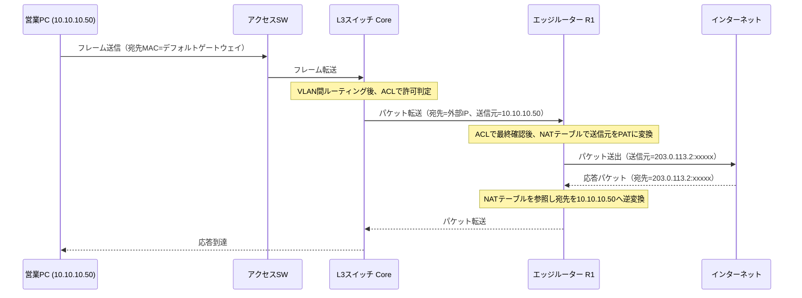

ここで押さえるべき順序が2つある。

第一に、ACLとNATがともに設定されている場合、パケットがインターフェースを通過する際の内部処理順序は、Cisco IOSの実装として、発信方向では「ルーティング判断 → 発信側ACL（outbound）評価 → NAT変換」に近い扱いになる場面が多いが、設計者が意識すべき実務上の要点は、**ACLの送信元／宛先アドレスを、変換前（インサイドローカル）と変換後（インサイドグローバル）のどちらで書くべきかを、設定するインターフェースとACLの適用方向に応じて正しく判断すること**である。

内部インターフェースに`ip nat inside`を、外部インターフェースに`ip nat outside`を設定し、ACLは変換対象を決める「トラフィック分類」として使う場面と、フィルタとして使う場面を区別して考えると混乱しにくい。

第二に、応答パケットが戻ってきたとき、ルーターはNATテーブル（変換テーブル）を参照して宛先を書き戻す。

このテーブルにエントリーがなければ、応答パケットは内部ホストへ届けようがない。

PATでは、この対応がポート番号込みで管理されるため、同一の内部ホストが複数の宛先へ同時に通信していても混線しない。

ACLの評価では、パケットは上から順に条件と照合され、最初に一致したエントリーで確定する。

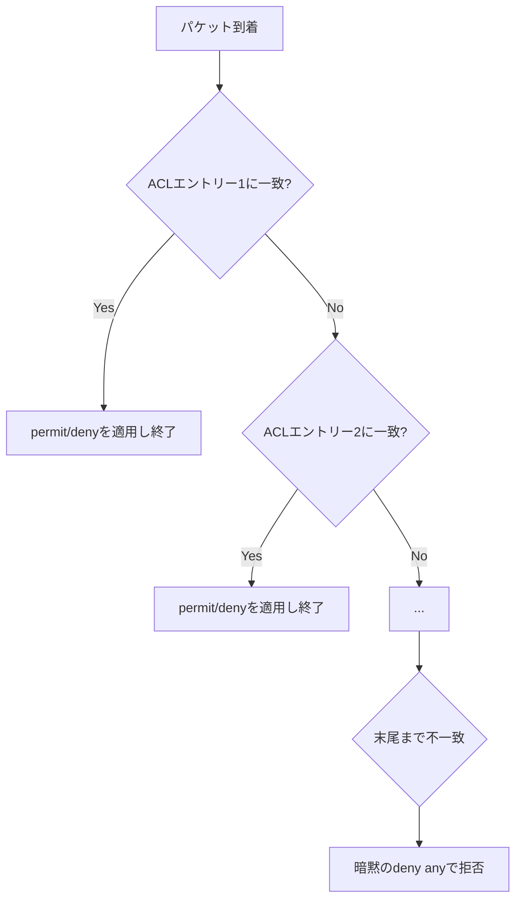

この評価順序を理解していないと、「上に書いた広い条件が、下に書いた個別の許可条件を先に飲み込んでしまう」という典型的な設定ミスに気づけない。

---

## 8.5 構成例

通貫シナリオの本社に、NATとACLの適用点を書き込む。

```text
                         インターネット
                               |
                       203.0.113.1 (ISP)
                               |
                +--------------+--------------+
                |                             |
        203.0.113.2/28                203.0.113.3/28
        +-------+-------+             +-------+-------+
        | エッジR1 (Act)|<--- HSRP --->| エッジR2 (Sby)|
        +-------+-------+  仮想IP     +-------+-------+
                |         10.10.200.1          |
                |    10.10.200.0/28（Uplink）  |
                +--------------+---------------+
                               |
                        10.10.200.10
                     +---------+---------+
                     |  L3スイッチ Core  |
                     |  （VLAN間ルーティング、ACL適用点）
                     +--+------+------+--+
                        |      |      |
                 VLAN10 |VLAN20|VLAN30|
             10.10.10.1 |10.10.20.1|10.10.30.1
                        |      |      |
                  営業PC群  開発PC群  DNS/業務SRV/DHCP/管理PC
```

NATの適用点はエッジルーター（R1、R2）である。

`ip nat inside`はL3スイッチ側インターフェース、`ip nat outside`はISP側インターフェースに設定する。

ACLの適用点は主にL3スイッチのVLANインターフェース（SVI）であり、部署間通信を許可・拒否するフィルタとして働く。

VTYアクセス制限のACLは、各機器のVTY回線に個別に適用する。

支社（10.10.40.0/24）は、本社とのWAN／VPN経由でインターネットへ出る設計もあり得るが、通貫シナリオでは、支社ルーター（R_BR）が本社エッジルーターへの経路のみを持ち、インターネット向け通信は本社を経由してNATされる集約型の設計を採る。

これにより、インターネット出口を本社1か所に集約し、ACLとNATの管理点を最小化できる。

---

## 8.6 Cisco IOSの設定例

### 8.6.1 PAT（インターネット接続の基本形）

目的は、VLAN10・VLAN20・VLAN30の内部ホストが、エッジルーターの外部インターフェースアドレスを共有してインターネットへ出られるようにすることである。

```cisco
! 変換対象とする内部ネットワークを標準ACLで定義する
R1(config)# access-list 1 permit 10.10.10.0 0.0.0.255
R1(config)# access-list 1 permit 10.10.20.0 0.0.0.255
R1(config)# access-list 1 permit 10.10.30.0 0.0.0.255

! 内部側インターフェースを inside として宣言する
R1(config)# interface GigabitEthernet0/0
R1(config-if)# description to L3SW (Uplink VLAN)
R1(config-if)# ip address 10.10.200.2 255.255.255.240
R1(config-if)# ip nat inside
R1(config-if)# exit

! 外部側インターフェースを outside として宣言する
R1(config)# interface GigabitEthernet0/1
R1(config-if)# description to ISP
R1(config-if)# ip address 203.0.113.2 255.255.255.240
R1(config-if)# ip nat outside
R1(config-if)# exit

! ACL1に一致する送信元を、外部インターフェースのアドレスでオーバーロード変換する
R1(config)# ip nat inside source list 1 interface GigabitEthernet0/1 overload
```

主要パラメータの意味は次のとおりである。

- `access-list 1`：PAT対象とする「変換してよい内部ネットワーク」を指定する。ACLをフィルタではなく、NATの対象範囲を選ぶための分類として使っている点に注意する。
- `ip nat inside` / `ip nat outside`：そのインターフェースが内部側か外部側かをルーターに教える。この宣言がないと、NATはどちらの方向の変換か判断できない。
- `overload`：1つの外部アドレスを、ポート番号で多重化して複数ホストに共有させる。これがPATの実体である。

### 8.6.2 スタティックNAT（サーバー公開）

目的は、業務サーバー（10.10.30.20）を、取引先向けに固定のグローバルアドレスで公開することである。

```cisco
! インサイドローカル 10.10.30.20 を、インサイドグローバル 203.0.113.10 に固定で対応づける
R1(config)# ip nat inside source static 10.10.30.20 203.0.113.10

! 公開する範囲をポート単位に絞る場合（HTTPS のみ公開する例）
R1(config)# ip nat inside source static tcp 10.10.30.20 443 203.0.113.10 443 extendable
```

`extendable`は、同一の内部アドレスに対し、ポート単位のスタティックNATを複数併用する際にIOSが内部的に必要とするキーワードである。

ポート単位の公開と組み合わせることで、「HTTPSだけを外部公開し、それ以外の管理ポートは公開しない」という最小権限の考え方をNATの設定にも反映できる。

実務では、このNATだけで安全になるわけではなく、次項の拡張ACLで許可プロトコル・ポートをさらに絞り込む。

### 8.6.3 ダイナミックNAT(学習用途としての位置づけ)

目的は、限られた台数のグローバルアドレスプールを、通信の発生順に内部ホストへ割り当てることである。

```cisco
! グローバルアドレスのプールを定義する
R1(config)# ip nat pool DYNPOOL 203.0.113.11 203.0.113.14 netmask 255.255.255.240

! 変換対象とする内部ネットワークを定義する
R1(config)# access-list 2 permit 10.10.30.0 0.0.0.255

! ACL2に一致する送信元を、プールから1対1で動的に割り当てる
R1(config)# ip nat inside source list 2 pool DYNPOOL
```

この方式は、4個のグローバルアドレスに対し5台目のホストが通信しようとすると変換できず失敗するという制約を体感的に理解するために有用である。

実運用では、グローバルアドレスの調達コストとホスト数の関係から、ほとんどの拠点でPATが選ばれる。

ダイナミックNATは、CCNAの出題範囲としては重要だが、「なぜ実務でPATが主流なのか」を理解するための比較対象として位置づけると納得感がある。

### 8.6.4 標準ACL（管理アクセスの制限）

目的は、ルーターへのSSHログインを管理部VLANからのみ許可することである。

```cisco
R1(config)# access-list 10 permit 10.10.30.0 0.0.0.255
R1(config)# access-list 10 deny any log

R1(config)# line vty 0 4
R1(config-line)# access-class 10 in
R1(config-line)# transport input ssh
R1(config-line)# login local
```

`deny any log`は省略しても暗黙のdenyが働くが、明示して`log`キーワードを付けることで、拒否されたアクセス試行をログに残せる。

不正アクセスの試行を後から追跡する際、この記録の有無が調査効率を大きく左右する。

`access-class`は、VTY回線に標準ACLまたは拡張ACLを適用するためのコマンドであり、通常のインターフェースに使う`ip access-group`とは別のコマンドである点に注意する。

### 8.6.5 拡張ACL（部署間通信の制御）

目的は、次の方針をL3スイッチのSVIに実装することである。

- 開発部（VLAN20）から営業部（VLAN10）への通信は、原則拒否する
- 開発部から業務サーバー（10.10.30.20）へのTCP 443のみを許可する
- 全部署からDNSサーバー（10.10.30.10）へのDNS通信は許可する
- 開発部・営業部から管理部VLAN（VLAN30）全般への通信は、上記以外は拒否する

```cisco
L3SW(config)# ip access-list extended DEV_TO_MGMT_SALES
L3SW(config-ext-nacl)# remark 開発部から業務サーバーへのHTTPSのみ許可
L3SW(config-ext-nacl)# permit tcp 10.10.20.0 0.0.0.255 host 10.10.30.20 eq 443
L3SW(config-ext-nacl)# remark 全部署からDNSサーバーへの名前解決を許可
L3SW(config-ext-nacl)# permit udp 10.10.20.0 0.0.0.255 host 10.10.30.10 eq 53
L3SW(config-ext-nacl)# permit tcp 10.10.20.0 0.0.0.255 host 10.10.30.10 eq 53
L3SW(config-ext-nacl)# remark 管理部VLANへのそれ以外の通信、営業部VLANへの通信を拒否
L3SW(config-ext-nacl)# deny ip 10.10.20.0 0.0.0.255 10.10.30.0 0.0.0.255
L3SW(config-ext-nacl)# deny ip 10.10.20.0 0.0.0.255 10.10.10.0 0.0.0.255
L3SW(config-ext-nacl)# remark それ以外（インターネット向け等）は許可
L3SW(config-ext-nacl)# permit ip any any

L3SW(config)# interface Vlan20
L3SW(config-if)# ip access-group DEV_TO_MGMT_SALES in
```

主要パラメータの意味は次のとおりである。

- `remark`：ACLエントリーの意図をコメントとして残す。番号や条件式だけでは、後任者が設計意図を読み取れないことが多い。
- `permit tcp ... eq 443`：TCPかつ宛先ポート443（HTTPS）だけを許可する。プロトコルとポートまで指定できるのは拡張ACLの特徴である。
- `ip access-group ... in`：VLAN20のSVIに、VLAN20から入ってくる方向（in）のパケットへACLを適用する。方向を誤ると、意図した通信が制御対象から外れる。

最後の`permit ip any any`を書き忘れると、暗黙のdenyにより、この拡張ACLで言及していないあらゆる通信（インターネットアクセスを含む）まで拒否されてしまう。

拡張ACLを部署VLANの入口に置く設計では、この「言及していない通信をどう扱うか」を必ず明示する。

### 8.6.6 ポートセキュリティ

目的は、アクセスポートに接続してよい端末を1台に限定し、意図しない機器の増設や、MACアドレス詐称を検知することである。

```cisco
SW_A(config)# interface range GigabitEthernet1/0/1 - 24
SW_A(config-if-range)# switchport mode access
SW_A(config-if-range)# switchport port-security
SW_A(config-if-range)# switchport port-security maximum 1
SW_A(config-if-range)# switchport port-security mac-address sticky
SW_A(config-if-range)# switchport port-security violation restrict
```

主要パラメータの意味は次のとおりである。

- `maximum 1`：そのポートで学習を許可するMACアドレス数の上限。PC1台と決め打つなら1、IP電話配下にPCをぶら下げるなら2にするなど、実際の接続形態に合わせる。
- `mac-address sticky`：動的に学習した最初のMACアドレスを、あたかも静的設定のように保存する。再起動後も同じMACアドレスを正規として扱える。
- `violation restrict`：違反時にフレームを破棄しつつポートは生かし続け、ログとカウンタに記録する。`shutdown`（デフォルト、ポートを完全に停止しerr-disable状態にする）や`protect`（破棄のみでログを残さない）との違いを理解して選ぶ。

### 8.6.7 DHCP SnoopingとDAI

目的は、正規のDHCPサーバー（10.10.30.5）からの応答だけを許可し、アクセスポート側からの不正なDHCP応答やARP応答を遮断することである。

```cisco
! DHCP Snoopingをグローバルで有効化し、対象VLANを指定する
L3SW(config)# ip dhcp snooping
L3SW(config)# ip dhcp snooping vlan 10,20,30

! DHCPサーバーへの経路にあるアップリンクポートを信頼する
L3SW(config)# interface GigabitEthernet1/1/1
L3SW(config-if)# description Uplink to DHCP server side
L3SW(config-if)# ip dhcp snooping trust

! DAIを対象VLANで有効化する（DHCP Snoopingのバインディングテーブルを利用する）
L3SW(config)# ip arp inspection vlan 10,20,30

! DAIも同じアップリンクポートを信頼する
L3SW(config)# interface GigabitEthernet1/1/1
L3SW(config-if)# ip arp inspection trust
```

アクセススイッチ側でも同様に、PC収容ポートは`trust`を設定せず、非信頼のままにしておく。

信頼設定を誤ってPC収容ポートに適用すると、そのポートを経由した不正なDHCP応答やARP応答を検査対象から外してしまい、機能そのものが無力化する。

---

## 8.7 LinuxおよびWindowsでの確認例

NATとACLの効果は、ホスト側からも一部確認できる。

### Windows

```bat
:: 自ホストのIPアドレスを確認する（NAT前のインサイドローカルアドレス）
ipconfig

:: 特定ポートへの到達性を確認する（Windows PowerShell）
Test-NetConnection -ComputerName 10.10.30.20 -Port 443

:: 拒否されている場合、TcpTestSucceeded が False になる
```

### Linux

```bash
# 自ホストのIPアドレスを確認する
ip addr show

# 特定ポートへの到達性を確認する
nc -vz 10.10.30.20 443

# ICMPは通るがTCPだけ拒否される状況を切り分ける
ping -c 2 10.10.30.20
nc -vz 10.10.30.20 22
```

ホスト側から見えるのは「その通信が通ったか失敗したか」までであり、NATで変換された後のグローバルアドレスや、ACLでどの条件により拒否されたかまでは分からない。

変換後のアドレスやACLの一致状況は、ルーターやL3スイッチ側の確認コマンドで見る。

```cisco
! 現在のNAT変換テーブルを確認する
R1# show ip nat translations

! NAT統計（ヒット数、アクティブな変換数）を確認する
R1# show ip nat statistics

! ACLの内容と、各エントリーに何件マッチしたかを確認する
L3SW# show access-lists DEV_TO_MGMT_SALES

! インターフェースに適用されているACLを確認する
L3SW# show ip interface Vlan20 | include access list
```

`show access-lists`で表示されるマッチ件数（matches）は、ACLが実際に機能しているかを確認する最も基本的な手がかりである。

意図した拒否エントリーのマッチ件数が0のままなら、そもそもそのACLに到達する前に別の場所で処理が終わっている可能性を疑う。

---

## 8.8 よくある誤解

1. **「NATを設定すればセキュリティも確保される」**
   NATはアドレス変換であり、アクセス制御ではない。内部アドレスが外部から直接見えにくくなる副次効果はあるが、ACLやファイアウォールの代替にはならない。

2. **「ACLは1つ書けば双方向に効く」**
   ACLは適用したインターフェースと方向（in/out）にのみ効く。往路と復路を意図した場合は、通信の性質（ステートフルかどうか）と方向を個別に検討する必要がある。

3. **「拡張ACLは標準ACLより常に近くに置くべき」**
   より正確には、標準ACLは宛先に近く、拡張ACLは送信元に近く配置するのが基本原則である。「拡張だから常に送信元」という言葉だけを覚えると、標準ACLの配置原則を取り違える。

4. **「暗黙のdenyは、明示的にdenyを書いたときだけ働く」**
   暗黙のdenyは、ACLを1行でも作成すれば常に末尾に存在する。何も一致しなければ、書いていなくても拒否される。

5. **「ポートセキュリティを設定すれば、DHCP SnoopingやDAIは不要」**
   ポートセキュリティはMACアドレス単位の制御であり、正規のMACアドレスを使った攻撃(たとえば正規端末からのARPスプーフィング)は防げない。防御対象が異なるため、組み合わせて使う。

---

## 8.9 代表的な障害

| 症状 | ありがちな原因 | まず疑う設定 |
|------|----------------|--------------|
| 社内は通るがインターネットに全く出られない | `ip nat inside`／`outside`の設定漏れ、NAT用ACLの範囲誤り | インターフェースへのNAT宣言、NAT用ACL |
| 一部の部署だけインターネットに出られない | NAT用ACLに、その部署のネットワークが含まれていない | `access-list`の対象ネットワーク |
| 特定の相手先だけ通信できない | 拡張ACLの条件（ポート、プロトコル）の記述誤り | ACLのエントリー順序と条件 |
| 許可したはずの通信が拒否される | 広い条件のdenyがpermitより上に書かれている | ACLエントリーの順序 |
| 外部から公開サーバーへ到達できない | スタティックNATの設定漏れ、または拡張ACLでポートを許可していない | スタティックNAT、拡張ACLの双方 |
| 新しく増設したハブ配下の端末が使えない | ポートセキュリティのmaximum超過でerr-disable | `show interface status`、port-security違反カウンタ |
| DHCPでアドレスが取得できない | DHCP Snoopingの信頼ポート設定漏れで正規応答まで破棄 | `ip dhcp snooping trust`の付与先 |
| 同一VLAN内で突然通信不安定・盗聴の疑い | ARPスプーフィングの発生、DAI未導入 | DAIの有効化状況、`show ip arp inspection` |

---

## 8.10 トラブルシューティング手順

「社内は通るがインターネットに出られない」という典型的な訴えを例に、切り分け手順を示す。

1. **物理・L2確認**：該当ホストのリンク状態、VLAN所属を確認する（第2〜5章の範囲）。
2. **IP到達性の確認**：ホストからデフォルトゲートウェイへ`ping`が通るかを確認する。通らなければNAT/ACL以前のL3問題である。
3. **ゲートウェイから先の到達性確認**：L3スイッチやエッジルーターから、直接インターネット側の代表アドレスへ`ping`が通るかを確認する（ルーター自身の通信はNATの影響を受けない場合が多く、経路そのものの生死を先に切り分けられる）。
4. **NAT設定の確認**：`show running-config | section ip nat`で、`inside`/`outside`インターフェース宣言とNATルールの有無を確認する。
5. **NAT変換テーブルの確認**：問題のホストから通信を発生させた直後に`show ip nat translations`を確認し、変換エントリーが生成されているかを見る。生成されていなければ、対象ネットワークがNAT用ACLに含まれていない可能性が高い。
6. **ACLの確認**：`show access-lists`で、経路上のACLに意図しないdenyがヒットしていないかを確認する。
7. **戻りの経路確認**：外部から見た応答パケットが、正しくエッジルーターへ戻ってきているかを、ISP側のルーティングや非対称経路の有無も含めて確認する（第7章のHSRP切替と絡む場合は第10章のケーススタディも参照する）。

この順序は、「まず自分に近い層から、遠い層へ」という切り分けの基本方針(第1章)に、NAT/ACL特有の確認コマンドを組み込んだものである。

---

## 8.11 設計・運用上の注意点

1. **NAT対象ネットワークとACLの対象を、台帳として一元管理する**
   NAT用ACL、フィルタ用ACL、VTY用ACLが増えると、どのACLが何のために存在するかが分からなくなりやすい。`remark`の活用に加え、変更管理台帳を別途持つ。

2. **最小権限は「広く許可してから絞る」のではなく「狭く許可してから広げる」**
   最初から`permit ip any any`に近い設定をして後から制限するより、必要な通信を1つずつ許可し、最後に必要に応じて広い許可を足す方が、抜け漏れに気づきやすい。

2つの文で説明した設計思想は、拡張ACLの記述順序そのものに直結する。

3. **冗長構成のエッジルーターでは、NATの状態が同期されない前提で設計する**
   HSRPで default gateway を冗長化しても、PATの変換テーブルは各ルーターが個別に保持する。系切り替え時に、既存のセッションは切断される場合があることを運用者に周知する(詳細は第10章)。

4. **スタティックNATで公開する範囲は、ポート単位まで絞る**
   ホスト単位のスタティックNATだけに頼ると、意図しないポートまで到達可能になる。拡張ACLと組み合わせて、公開するサービスを明示する。

5. **DHCP SnoopingとDAIは、VLAN追加時に設定漏れが起きやすい**
   新しい部署VLANを追加した際、`ip dhcp snooping vlan`や`ip arp inspection vlan`の対象リストに追記し忘れると、そのVLANだけ保護が効かない状態になる。VLAN追加のチェックリストに組み込む。

---

## 8.12 要点まとめ

- NATはアドレス変換であり、スタティック（1対1固定）、ダイナミック（1対1動的）、PAT（多対1、ポート多重化）の3種類がある
- 拠点のインターネット接続では、グローバルアドレスを節約できるPATが主流であり、ダイナミックNATは比較として理解する
- ACLは標準（送信元のみ）と拡張（送信元・宛先・プロトコル・ポート）に分かれ、上から順に評価され、末尾に暗黙のdenyを持つ
- 最小権限の原則は、必要な通信だけを明示的に許可し、それ以外を拒否する設計方針である
- ポートセキュリティはMACアドレス数の制限、DHCP Snoopingは不正なDHCP応答の遮断、DAIはARPスプーフィングの検知に対応する
- 管理プレーンの保護は、SSH限定、アクセス元制限、個人単位の認証、不要サービスの停止、ログとNTPによる記録が基本になる
- NATとACLが絡む障害は、NAT変換テーブルとACLのマッチ件数を、ホストに近い側と遠い側の両方から確認して切り分ける

---

## 8.13 章末問題

### 問題1

スタティックNAT、ダイナミックNAT、PATのうち、通貫シナリオの本社が複数部署のインターネット接続に使うべき方式はどれか。理由とともに述べよ。

### 問題2

標準ACLと拡張ACLの違いを、条件に指定できる項目と、推奨される配置場所の観点から説明せよ。

### 問題3

拡張ACLで「開発部から業務サーバーへのHTTPSのみを許可し、それ以外の開発部から管理部VLANへの通信を拒否する」設定を行うとき、`permit`と`deny`のエントリーをどの順序で書くべきか、理由とともに述べよ。

### 問題4

ポートセキュリティ、DHCP Snooping、DAIがそれぞれ防ぐ攻撃を1つずつ挙げ、3機能の依存関係を説明せよ。

### 問題5

「社内のPCからインターネットのWebサイトにアクセスできない」という報告を受けたとき、NAT関連の設定を確認する前に、先に確認すべき項目を2つ挙げよ。

---

## 8.14 解答と解説

### 解答1

PATが適する。複数部署、多数のホストが存在する一方、グローバルアドレスは限られた数(この章の例では1〜数個)しか持たないためである。スタティックNATはサーバー公開など個別の固定対応に、ダイナミックNATはグローバルアドレスとホスト数がおおむね釣り合う限定的な場面に向く。

### 解答2

標準ACLは送信元IPアドレスのみを条件にでき、宛先に近い場所に配置するのが基本である。拡張ACLは送信元・宛先IPアドレス、プロトコル、ポート番号まで条件にでき、送信元に近い場所に配置するのが基本である。粗い制御か細かい制御かという条件の解像度と、配置場所の考え方が対応している。

### 解答3

先にHTTPSを許可する`permit`エントリーを書き、そのあとに管理部VLAN全般への`deny`エントリーを書く。ACLは上から順に評価され最初に一致したエントリーで確定するため、広い条件のdenyを先に書くと、あとに続く個別の許可(HTTPS)が一切評価されなくなる。

### 解答4

ポートセキュリティはMACアドレスフラッディングや無許可機器の増設を防ぐ。DHCP Snoopingはローグ DHCPサーバーによる誤ったネットワーク情報の配布を防ぐ。DAIはARPスプーフィングによる中間者攻撃を防ぐ。DAIはDHCP Snoopingが作成するバインディングテーブルを検証の根拠にするため、DHCP Snoopingが有効であることが前提になる。

### 解答5

例：(1) 該当PCがデフォルトゲートウェイへ`ping`できるか(L3到達性の確認)。(2) DNSによる名前解決が成功しているか(IP直打ちなら到達するかの切り分け)。この2点を先に確認しないと、NATやACLの問題と、それ以前の問題を混同しやすい。

---

## 8.15 実機またはシミュレーター演習

### 演習A：PATによるインターネット接続

1. 3つのVLAN(10、20、30)を持つL3スイッチと、エッジルーター1台を接続する
2. エッジルーターの外部インターフェースにグローバルアドレスを模したIPアドレスを設定する
3. PAT用のACLとNATコマンドを設定する
4. 各VLANのPCから外部代表アドレスへ`ping`し、`show ip nat translations`で変換エントリーを確認する

### 演習B：部署間ACLの設計と検証

1. VLAN10とVLAN20の間で、特定のポート(例：TCP 80)のみを許可し、それ以外を拒否する拡張ACLを設計する
2. VLAN20のSVIに適用し、許可対象・拒否対象それぞれで通信を試す
3. `show access-lists`のマッチ件数が、実際の通信結果と一致することを確認する
4. `permit`と`deny`の順序を意図的に入れ替え、結果がどう変わるかを記録する

### 演習C：DHCP SnoopingとDAIの効果確認

1. VLANにDHCP Snoopingを有効化し、正規DHCPサーバー側のポートのみ信頼設定する
2. 意図的に別のポートへ簡易DHCPサーバー機能を持つ端末を接続し、非信頼ポートからの応答が拒否されることを確認する
3. DAIを有効化し、ARPテーブルを手動で偽装するツール(学習用途に限る)を使って、検知・破棄の挙動を確認する
4. 検証結果を、障害票の形式(症状／確認／判断)でまとめる

---

## 次章への橋渡し

ここまでのACLとNATは、有線ポートに接続された端末を前提にしてきた。

営業部や開発部の担当者がノートPCやスマートフォンで社内ネットワークへつながる場合、物理ポートの代わりに電波が接続点になる。

第9章では、IEEE 802.11の無線LAN技術を、有線VLAN設計の延長として位置づけ、SSIDとVLANの対応づけ、WPA2/WPA3による認証と暗号化を扱う。


---


<!-- ========== 09_wireless_lan.md ========== -->

# 第9章 無線LAN

## 学習目標

この章を終えると、次のことができる。

1. IEEE 802.11の主要規格、周波数帯、チャネルの関係を説明できる
2. SSID、BSSID、ESSID、アクセスポイントの役割を区別し、有線VLANと対応づけて設計できる
3. WPA2とWPA3の違い、Personal（PSK）とEnterprise（802.1X）の違いを説明できる
4. 電波干渉の典型的な原因を挙げ、設計時の回避策を説明できる
5. 無線LANに特有の障害を、有線側の設定と電波環境の両面から切り分けられる

---

## 9.1 この章で学ぶこと

支社のPC_BRは有線接続だが、本社の営業担当がノートPCを会議室に持ち込むと、有線ポートは足りない。

来訪した取引先にもインターネットだけを提供したいが、社内VLANへは触れさせたくない。

こうした要求に応えるのが無線LAN(Wireless LAN、WLAN)であり、電波を媒体として使う点を除けば、これまでの章で扱ったVLAN、DHCP、ACLの考え方がそのまま適用される。

この章では、IEEE 802.11の規格、周波数帯とチャネル、SSIDとアクセスポイント(AP)の関係を整理したうえで、WPA2/WPA3による認証と暗号化、電波干渉、そして有線VLAN設計と無線SSID設計の対応づけを扱う。

無線LANを「有線とは別の独立した技術」として学ぶと、VLANやACLとの接続点を見落としやすい。

この章は、有線設計の延長として無線を位置づける構成を取る。

---

## 9.2 技術が必要になった背景

有線LANは、ケーブルの届く範囲、そしてポート数の範囲でしか端末を収容できない。

ノートPC、スマートフォン、タブレットの普及により、「その場でケーブルを挿す」という前提自体が崩れた。

会議室、来訪者エリア、フリーアドレス化されたオフィスでは、固定の有線ポートを人数分用意すること自体が非現実的になる。

IEEE(Institute of Electrical and Electronics Engineers：米国電気電子学会)は、この需要に対し、1997年に802.11として無線LANの標準規格を策定した。

以降、802.11b、802.11a、802.11g、802.11n、802.11ac、802.11axと世代を重ね、速度と効率が向上してきた。

無線特有の課題も同時に生まれた。

電波は壁を隔てても届く一方、暗号化なしでは誰でも傍受できる。

複数のAPが同じ電波空間を共有すれば、干渉によって速度が落ちる。

そのため、無線LANの標準化は速度の向上だけでなく、セキュリティ(WEP、WPA、WPA2、WPA3)と、電波の効率的な利用(チャネル管理、干渉回避)の両輪で進んできた。

---

## 9.3 基本概念

### 9.3.1 IEEE 802.11の規格と周波数帯

**IEEE 802.11**は、無線LANの物理層とデータリンク層(の一部)を規定する標準規格群の総称である。

主要な規格を整理する。

| 規格 | 通称(Wi-Fi Alliance) | 周波数帯 | 理論最大速度の目安 | 備考 |
|------|------------------------|----------|--------------------|------|
| 802.11b | - | 2.4GHz | 11Mbps | 現在はほぼ現役端末なし |
| 802.11a | - | 5GHz | 54Mbps | 2.4GHzのgと同時期 |
| 802.11g | - | 2.4GHz | 54Mbps | bとの互換性維持が課題になった |
| 802.11n | Wi-Fi 4 | 2.4GHz/5GHz | 600Mbps | MIMO(複数アンテナ)を導入 |
| 802.11ac | Wi-Fi 5 | 5GHzのみ | 数Gbps | MU-MIMO、広いチャネル幅 |
| 802.11ax | Wi-Fi 6 / Wi-Fi 6E | 2.4GHz/5GHz/6GHz | 9.6Gbps(理論値) | OFDMAによる多重化効率向上、6EはUS/日本等で6GHz帯を追加利用 |
| 802.11be | Wi-Fi 7 | 2.4GHz/5GHz/6GHz | さらに高速 | 策定・普及が進行中の世代 |

**Wi-Fi**という呼称は、Wi-Fi Allianceという業界団体が、相互接続性を認証した機器に与えるブランド名である。

規格名(802.11ax)とブランド名(Wi-Fi 6)が併存するのは、標準化団体(IEEE)と相互接続性認証団体(Wi-Fi Alliance)が別組織であるためである。

周波数帯には次の3つがある。

- **2.4GHz帯**：障害物を回り込みやすく到達距離が伸びやすいが、利用機器が多く混雑しやすい。日本ではチャネル1〜13(802.11bのみ14も使用可)が使える。
- **5GHz帯**：2.4GHz帯より直進性が強く障害物に弱いが、利用可能なチャネル数が多く高速化しやすい。日本ではW52、W53、W56という3つのチャネル群に分かれる。
- **6GHz帯**：Wi-Fi 6E以降で利用可能になった比較的新しい帯域であり、他の無線システムとの干渉が少ない反面、対応機器はまだ2.4GHz/5GHzほど普及していない。

日本国内での周波数帯の利用は電波法に基づく規制の対象であり、屋外利用可否やチャネルごとの制約は国・地域によって異なる。

### 9.3.2 チャネルと電波干渉

**チャネル**は、周波数帯をさらに細かく区切った、実際に通信に使う帯域の単位である。

2.4GHz帯では、隣接するチャネル同士が周波数的に重なり合うため、日本国内で実務上よく使われる**非重複チャネル**は1、6、11の3つに限られる。

チャネル1と2のように近接したチャネルを別々のAPに割り当てると、電波が重なり合って干渉する(**隣接チャネル干渉**)。

5GHz帯は、次のように帯域が分かれる。

| 帯域名 | チャネル例 | 特徴 |
|--------|-----------|------|
| W52 | 36、40、44、48 | 屋内外の利用条件は国内規制の改定を確認する必要がある |
| W53 | 52、56、60、64 | DFS(Dynamic Frequency Selection：動的周波数選択)への対応が必須 |
| W56 | 100〜140の一部 | チャネル数が多く、DFS対応が必須 |

**DFS**は、気象レーダーなど既存の無線システムと周波数を共用する帯域で、レーダー波を検知した場合に自動的に別チャネルへ切り替える仕組みである。

DFS対象チャネルを使うAPは、切り替えの数秒〜数十秒間、通信が一時的に途切れることがある。

会議室でビデオ会議中に無線が瞬断する場合、DFSによるチャネル切り替えが一因になっていることがある。

電波干渉には、Wi-Fi同士の干渉と、Wi-Fi以外の機器による干渉がある。

- **同一チャネル干渉**：近接する複数のAPが同じチャネルを使い、電波空間を奪い合う
- **隣接チャネル干渉**：周波数が近いチャネル同士が部分的に重なる
- **非Wi-Fi干渉**：電子レンジ(2.4GHz帯)、Bluetooth機器、コードレス電話、金属製の什器や壁による反射・減衰(マルチパスフェージング)

これらは、電波を可視化するスペクトラムアナライザや、AP自身が持つ無線環境レポート機能で調査する。

### 9.3.3 SSID、BSSID、ESSID、アクセスポイント

**SSID**(Service Set Identifier：サービスセット識別子)は、無線ネットワークを識別する名前であり、端末が接続先を選ぶときに表示される文字列である。

**BSSID**(Basic Service Set Identifier)は、1台のAPが提供する1つの無線セルを識別する識別子であり、実体はそのAP無線インターフェースのMACアドレスである。

**ESSID**(Extended Service Set Identifier、実務では単にSSIDと呼ばれることが多い)は、同一のSSID名を複数のAPに設定し、端末が移動してもシームレスに接続を維持できるようにする拡張構成を指す。

利用者から見えるのはSSID名だけだが、実際には複数のAP(複数のBSSID)が、同じSSID名の裏で協調して1つの無線ネットワークを構成している。

**アクセスポイント**(Access Point：AP)は、無線端末からの電波を受け、有線LAN側へフレームを中継する装置である。

APの動作方式には大きく2種類ある。

- **自律型AP(Autonomous AP)**：AP単体で無線設定、認証、暗号化のすべてを保持し、独立して動作する。小規模拠点向け。
- **コントローラー方式(Lightweight AP + WLC)**：AP自体は電波の送受信に専念し、SSID設定や認証ポリシーはWLC(Wireless LAN Controller：無線LANコントローラー、Cisco製品での呼称)が集中管理する。AP-WLC間は**CAPWAP**(Control And Provisioning of Wireless Access Points)というIETF標準プロトコルのトンネルで結ばれる。

WLCという製品名や、Cisco Mobility Express、Catalyst 9800といった具体的な製品はCisco固有の実装だが、CAPWAPというプロトコル自体は標準化されている。

中規模以上の拠点では、AP数が増えるほど1台ずつ個別設定する自律型APの運用負荷が大きくなるため、コントローラー方式が選ばれる傾向にある。

### 9.3.4 有線VLANと無線SSIDの対応

無線LANは、電波区間を通り過ぎれば、有線LANと同じEthernetフレームとして扱われる。

つまり、SSIDごとに異なるVLANへ振り分けることで、有線側の部署分離をそのまま無線にも適用できる。

通貫シナリオでは、次のような対応づけを設計する。

| SSID | 用途 | マッピング先VLAN | サブネット |
|------|------|-------------------|-----------|
| Corp-Sales | 営業部の無線端末 | VLAN10 | 10.10.10.0/24 |
| Corp-Dev | 開発部の無線端末 | VLAN20 | 10.10.20.0/24 |
| Corp-Guest | 来訪者向け | VLAN90(新設、ゲスト専用) | 10.10.90.0/24 |

ゲスト用VLANは、既存のVLAN10〜30とは独立させ、インターネットアクセスのみを許可し、社内VLANへのアクセスは拒否するACLを適用する(第8章の最小権限の考え方をそのまま適用する)。

この対応づけにより、APを接続するスイッチポートは、複数VLANのタグ付きフレームを通す**トランクポート**として設定する(第5章)。

APは、受信したフレームのSSIDに応じて、802.1QのVLANタグを付け分けて有線側へ転送する。

### 9.3.5 セキュリティと認証方式

無線LANのセキュリティは、暗号化方式と認証方式の2つの軸で理解する。

暗号化方式の変遷は次のとおりである。

| 世代 | 名称 | 暗号化方式 | 現状 |
|------|------|------------|------|
| 第1世代 | WEP(Wired Equivalent Privacy) | RC4ベース、鍵長が短い | 既知の脆弱性により非推奨、実質使用不可と考えてよい |
| 第2世代 | WPA(Wi-Fi Protected Access) | TKIP | WEPの代替として一時的に使われたが現在は非推奨 |
| 第3世代 | WPA2 | AES-CCMP | 長らく事実上の標準。2017年公表のKRACK攻撃など理論的弱点も指摘される |
| 第4世代 | WPA3 | AES-CCMP(Personal)、192ビット相当のスイート(Enterprise) | 新規導入時の推奨。SAEにより鍵交換の弱点を改善 |

WPA3は、**SAE**(Simultaneous Authentication of Equals)という鍵交換方式を採用し、WPA2のPSK方式が抱えていたオフライン辞書攻撃への耐性を高めている。

認証方式は、Personal(個人向け)とEnterprise(組織向け)に分かれる。

- **Personal(PSK方式)**：全端末が同一の事前共有鍵(Pre-Shared Key：PSK)を使う。家庭や小規模拠点、ゲストネットワークに向く。鍵が漏えいすると全端末に影響する。
- **Enterprise(802.1X/EAP方式)**：端末(サプリカント)、AP(オーセンティケータ)、認証サーバー(RADIUSサーバー)の3者で構成される**IEEE 802.1X**フレームワークに基づき、ユーザーごとの認証情報(証明書やID/パスワード)で認証する。**EAP**(Extensible Authentication Protocol：拡張認証プロトコル)は、この認証のやり取りを実現する枠組みであり、具体的な方式にはEAP-TLS(証明書ベース)やPEAP(ID/パスワードをトンネルで保護)などがある。

社内の営業部・開発部SSIDは、ユーザーごとのアクセス制御と、退職者アカウントの即時無効化ができるEnterprise方式が望ましい。

一方、ゲストSSIDは、来訪者に個別アカウントを発行する運用が現実的でないことが多く、PSKまたはキャプティブポータル(Web認証画面を経由させる方式)による簡易認証が使われることが多い。

WPA3ではさらに、認証なしで接続する開放型ネットワークでも通信内容を暗号化する**Enhanced Open**(OWE：Opportunistic Wireless Encryption)という技術も規定されている。

---

## 9.4 通信や処理の流れ

無線端末が電源投入からIP通信可能になるまでの流れを、Enterprise認証(802.1X)のSSIDを例に追う。

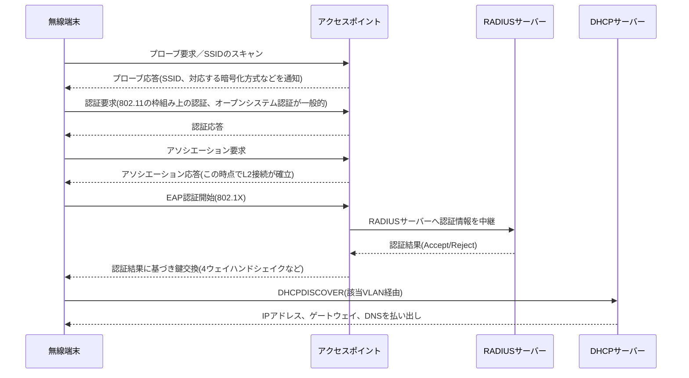

**アソシエーション**は、無線端末とAPの間でL2的な接続関係を確立する手続きであり、有線でいうリンクアップに近い。

アソシエーションが成立しても、Enterprise認証を使うSSIDでは、802.1XによるEAP認証が完了しなければ実際の通信(DHCPを含む)は許可されない。

「SSIDには接続できているのにインターネットが使えない」という症状は、多くの場合、このアソシエーションと認証完了の間で止まっている状態を指す。

複数APによるESSID構成では、端末が別のAPの電波エリアへ移動すると、**ローミング**と呼ばれる、接続先APの切り替えが発生する。

ローミング時、SSIDとVLANの対応が全APで統一されていれば、端末はIPアドレスを維持したまま通信を継続できる。

VLANの対応がAPごとに食い違っていると、ローミングのたびにIPアドレスが変わり、通話やビデオ会議が切断される原因になる。

---

## 9.5 構成例

通貫シナリオの本社フロアに、無線LANを追加した構成を示す。

```text
                    L3スイッチ Core
                    (VLAN10/20/30/90 の SVI)
                          |
                 +--------+--------+
                 |     トランク     |
                 |   (VLAN10,20,90 |
                 |    タグ付き通過) |
           +-----+-----+     +-----+-----+
           | アクセスSW |     | アクセスSW |
           +-----+-----+     +-----+-----+
                 |                 |
           +-----+-----+     +-----+-----+
           |   AP-1    |     |   AP-2    |
           | (会議室)  |     | (執務エリア)|
           +-----------+     +-----------+
                 SSID: Corp-Sales / Corp-Dev / Corp-Guest（両APで共通）
```

APを接続するスイッチポートはトランクポートとし、許可VLANをCorp-Sales(VLAN10)、Corp-Dev(VLAN20)、Corp-Guest(VLAN90)に限定する。

ネイティブVLANは、第5章の方針どおり未使用のVLAN(例：VLAN99)に固定し、AP自体の管理通信は別途管理VLANまたは専用の管理アドレスで扱う。

ゲストVLAN(VLAN90)は、L3スイッチ上でインターネット向けの経路のみを持たせ、拡張ACLで社内VLAN(10.10.10.0/24、10.10.20.0/24、10.10.30.0/24)への通信を拒否する。

---

## 9.6 Cisco設定例

無線LANの実機運用では、WLCのGUI(Webベースの管理画面)からSSIDやポリシーを設定する形態が広く使われている。

この章では、GUIで設定する項目の要点と、自律型APにおけるCLI設定例の両方を示す。

### 9.6.1 WLC(コントローラー方式)での設定項目の要点

WLCのGUIでは、おおむね次の順序でSSID(WLANと呼ばれる単位)を作成する。

1. **WLAN(SSID)の作成**：SSID名(例：Corp-Dev)を指定する
2. **インターフェース/VLANのマッピング**：そのSSIDに割り当てるVLAN(例：VLAN20)を指定する
3. **セキュリティポリシーの設定**：WPA2/WPA3、Personal/Enterpriseを選択する
4. **RADIUSサーバーの登録**：Enterprise方式の場合、認証サーバーのIPアドレスと共有鍵を登録する
5. **APグループへの適用**：作成したWLANを、どのAP群に配信するかを指定する

GUI操作の詳細は製品やソフトウェアバージョンにより異なるため、実務では公式のコンフィギュレーションガイドを都度参照する。

CCNAの学習範囲としては、「SSID、VLAN、セキュリティポリシー、RADIUSサーバーをどう対応づけるか」という設定の骨格を理解しておくことが重要である。

### 9.6.2 自律型APでのCLI設定例(小規模拠点や学習用途)

目的は、支社のような小規模拠点で、自律型APに開発部向けSSIDをWPA2-Enterprise方式で設定することである。

```cisco
! 無線インターフェースの基本識別子を設定する
AP(config)# dot11 ssid Corp-Dev
AP(config-ssid)# vlan 20
AP(config-ssid)# authentication open eap eap_methods
AP(config-ssid)# authentication network-eap eap_methods
AP(config-ssid)# guest-mode
AP(config-ssid)# exit

! RADIUSサーバーを登録する
AP(config)# radius-server host 10.10.30.15 auth-port 1812 acct-port 1813 key RadiusSharedKey
AP(config)# aaa new-model
AP(config)# aaa authentication login eap_methods group radius

! 無線インターフェース(2.4GHz帯)にSSIDを割り当てる
AP(config)# interface Dot11Radio0
AP(config-if)# ssid Corp-Dev
AP(config-if)# encryption mode ciphers aes-ccm
AP(config-if)# exit

! 有線側インターフェースはトランクとして複数VLANを通す
AP(config)# interface FastEthernet0
AP(config-if)# switchport mode trunk
AP(config-if)# switchport trunk allowed vlan 10,20,90
```

主要パラメータの意味は次のとおりである。

- `dot11 ssid`：APが広告するSSIDと、対応づけるVLANを定義する
- `authentication open eap` / `network-eap`：802.1X/EAPによる認証方式を有効にする
- `radius-server host ... key`：認証を委任するRADIUSサーバーのアドレスと共有鍵を指定する。鍵はAP側とRADIUSサーバー側で完全に一致させる必要がある
- `encryption mode ciphers aes-ccm`：WPA2で使われるAES-CCMP暗号化を有効にする

ゲストSSID(Corp-Guest)は、同様の手順でVLAN90に割り当て、`authentication open`のみ(802.1Xなし)とPSKまたはキャプティブポータルを組み合わせる。

### 9.6.3 確認コマンド

```cisco
! 現在アソシエーションしているクライアントの一覧
AP# show dot11 associations

! 無線インターフェースの状態、チャネル、送信電力
AP# show controllers dot11Radio 0

! WLC環境ではクライアントごとの詳細情報を確認する
WLC# show wireless client summary
WLC# show wireless client detail <MACアドレス>
```

クライアントが「アソシエーションはしているが認証未完了」なのか、「そもそもアソシエーションしていない」のかを、この出力で切り分けられる。

---

## 9.7 LinuxおよびWindowsでの確認例

### Windows

```bat
:: 現在接続中の無線インターフェースの状態(SSID、信号強度、認証方式)を確認する
netsh wlan show interfaces

:: 周辺で見えているSSID一覧を確認する
netsh wlan show networks mode=bssid

:: 接続後のIPアドレス、ゲートウェイ、DNSを確認する
ipconfig /all
```

`netsh wlan show interfaces`の出力にある`Signal`(信号品質、パーセント表示)と`Radio type`(使用中の規格)、`Channel`は、電波品質の一次切り分けに使う。

### Linux

```bash
# 無線インターフェースの一覧と状態を確認する(NetworkManager環境)
nmcli device wifi list

# 現在接続中のSSID、信号強度、周波数、ビットレートを確認する
nmcli device show wlan0

# より詳細な無線統計(古典的なツール、ディストリビューションにより別途インストールが必要)
iwconfig wlan0

# 接続後のIPアドレスとルート情報を確認する
ip addr show wlan0
ip route show
```

無線特有の確認観点として、次の3点を押さえる。

1. **信号強度(RSSI)**：一般に-67dBmより弱いと、音声やビデオ会議の品質が不安定になりやすいとされる
2. **使用チャネルと帯域**：2.4GHzか5GHzか、混雑したチャネルを使っていないか
3. **リンク速度(ビットレート)**：規格上の理論値と、実際に確立されているビットレートの乖離

これらはホスト側のコマンドだけで完結する情報であり、AP側やWLC側の情報と突き合わせることで、端末側の問題か、無線環境側の問題かを切り分けられる。

---

## 9.8 よくある誤解

1. **「5GHzは常に2.4GHzより速い」**
   規格上の理論値は5GHzが有利だが、直進性が強く壁や床に弱いため、APから離れた場所や障害物が多い環境では、実効速度が2.4GHzを下回ることがある。

2. **「SSIDを隠せば安全になる」**
   SSIDのブロードキャストを止めても、通信自体にSSID名は平文で含まれており、専用ツールで容易に把握できる。実質的なセキュリティ向上にはならず、むしろ接続設定の手間だけが増える。

3. **「WPA2を使っていれば十分安全」**
   WPA2自体に安全な実装は可能だが、PSK方式は鍵の使い回しや強度不足のパスワードにより突破され得る。新規導入では、可能な限りWPA3または802.1X/EAPを選ぶ。

4. **「電波強度(アンテナ本数の表示)が強ければ通信品質も良い」**
   強度(RSSI)が高くても、同じチャネルを使う他のAPや端末が多ければ、電波を奪い合って実効速度は落ちる。品質は強度だけでなく、干渉や輻輳の状況にも左右される。

5. **「無線LANはVLANと無関係の別ネットワーク」**
   SSIDは有線VLANへのタグ付けを通じて接続されており、VLAN設計の一部として扱う必要がある。無線だけを独立して設計すると、ACLやDHCPの部署分離が崩れる。

---

## 9.9 代表的な障害

| 症状 | ありがちな原因 | まず疑う箇所 |
|------|----------------|--------------|
| SSIDが見えない | AP電源断、AP設定でSSIDブロードキャスト無効化、電波到達範囲外 | AP稼働状況、設置場所 |
| SSIDは見えるが接続できない | 暗号化方式・認証方式の不一致、パスワード誤り | 端末側のセキュリティ設定 |
| 接続はできるがIPアドレスを取得できない | AP-スイッチ間トランクのVLAN許可漏れ、DHCPサーバーへの経路異常 | トランクの許可VLAN、DHCPリレー設定 |
| Enterprise認証のSSIDだけ接続できない | RADIUSサーバー不通、共有鍵不一致、証明書期限切れ | RADIUSサーバーの疎通、AP-RADIUS間の鍵 |
| 特定エリアだけ切断が頻発する | 電波干渉、AP設置密度不足、DFSによるチャネル切替 | 電波環境調査、AP配置 |
| 会議室移動時に通話が切れる | ローミング時のセルオーバーラップ不足、AP間のVLAN不一致 | AP配置間隔、VLANマッピングの一貫性 |
| ゲストSSIDから社内サーバーへ到達できてしまう | ゲストVLANのACL未設定または設定漏れ | L3スイッチのACL |
| 特定の古い端末だけ極端に遅い | レガシー規格端末の混在によるプロテクションモード動作 | 接続端末の規格、AP側の互換性設定 |

---

## 9.10 トラブルシューティング手順

「無線に接続できるがインターネットに出られない」という訴えを例に、切り分け手順を示す。

1. **端末側の接続状態確認**：`netsh wlan show interfaces`や`nmcli`で、SSID、認証状態、IPアドレス取得の有無を確認する。
2. **AP側のアソシエーション確認**：`show dot11 associations`や`show wireless client summary`で、該当端末が認証完了状態にあるかを確認する。
3. **有線側VLAN疎通確認**：AP収容ポートのトランク設定と、許可VLANリストを確認する。該当SSIDのVLANが許可VLANに含まれているかを見る。
4. **DHCP取得確認**：正しいVLANのサブネットでIPアドレスが払い出されているかを確認する。誤ったVLANのアドレスが払い出されていれば、AP側のVLANマッピング設定を疑う。
5. **RADIUS到達性確認(Enterprise方式の場合)**：AP(またはWLC)からRADIUSサーバーへの疎通と、共有鍵の一致を確認する。
6. **ACL確認**：ゲストSSIDなど制限対象のVLANでは、意図どおりのACLが適用されているかを確認する(第8章参照)。
7. **電波環境確認**：上記で有線側・認証側に問題がなければ、チャネル混雑や干渉源の有無を確認する。

有線VLANの知識(第5章)とACLの知識(第8章)を土台に持っていれば、無線特有の確認は「アソシエーションと認証」「AP-スイッチ間のVLANマッピング」の2点に絞り込める。

---

## 9.11 設計・運用上の注意点

1. **サイトサーベイを行う**
   AP設置前に、電波環境の事前予測(プレディクティブサーベイ)や、実際にAPを仮設置して測定する現地調査(オンサイトサーベイ)を行い、必要なAP数と設置場所を決める。勘だけに頼ったAP配置は、後から干渉や不感地帯の問題を招く。

2. **カバレッジ設計とキャパシティ設計を区別する**
   単に電波を隅々まで届かせる設計(カバレッジ重視)と、多数の端末が同時接続しても速度を維持できる設計(キャパシティ重視)は、必要なAP密度が異なる。会議室やイベントスペースはキャパシティ重視で設計する。

3. **チャネルプランを明示する**
   隣接するAP同士に別々の非重複チャネルを割り当てる。自動チャネル選択機能に任せる場合も、定期的に実際の割り当てを確認する。

4. **セルオーバーラップを確保する**
   ローミングを前提とするなら、隣接AP間で電波エリアが適度に重なるよう配置する(目安として15〜20%程度の重なりがしばしば推奨される)。重なりが不足すると、移動中に電波が一瞬途切れる不感地帯が生まれる。

5. **SSIDとVLANの対応を全AP・全WLCで統一する**
   1台でもVLANマッピングが食い違うAPがあると、ローミング時にIPアドレスが変わり、通話やアプリケーションが切断される。

6. **ゲストネットワークは物理的にも論理的にも分離する**
   ゲストVLANは、社内VLANへのACLだけでなく、可能であれば帯域制御や接続時間の制限も検討し、来訪者の利用が社内業務に影響しないようにする。

---

## 9.12 要点まとめ

- IEEE 802.11は無線LANの標準規格群であり、2.4GHz/5GHz/6GHzの周波数帯と、世代ごとの規格(802.11n/ac/ax等)がある
- チャネルは周波数帯をさらに分割した通信単位であり、非重複チャネルの選択と干渉回避が設計上の要点になる
- SSIDは無線ネットワークの名前、BSSIDは個々のAPを識別するMACアドレス、ESSIDは複数APによる拡張構成である
- APには自律型と、WLCが集中管理するコントローラー方式(CAPWAPで接続)があり、規模に応じて選択する
- WPA3はWPA2の弱点を補う新世代の暗号化・認証方式であり、Personal(PSK)とEnterprise(802.1X/EAP/RADIUS)は用途で使い分ける
- SSIDは有線VLANへタグ付けされるため、無線設計は有線VLAN設計と一体で行う
- 無線特有の障害切り分けは、アソシエーション・認証の成否、AP-スイッチ間のVLANマッピング、電波環境の順に確認する

---

## 9.13 章末問題

### 問題1

IEEE 802.11axがWi-Fi 6と呼ばれるのはなぜか。規格名とブランド名の関係、および策定・認証を行う組織の違いを説明せよ。

### 問題2

SSID、BSSID、ESSIDの違いを、それぞれが指し示す対象の観点から説明せよ。

### 問題3

通貫シナリオのゲストSSID(Corp-Guest)を設計する際、暗号化・認証方式として何を選び、有線側でどのようなVLAN・ACL設計にすべきか述べよ。

### 問題4

会議室を移動しながらビデオ会議を行う社員から「移動すると数秒切れる」という報告があった。考えられる原因を2つ挙げよ。

### 問題5

「SSIDには接続できているが、インターネットにアクセスできない」という症状に対し、確認すべき項目を、無線側と有線側それぞれ1つずつ挙げよ。

---

## 9.14 解答と解説

### 解答1

802.11axはIEEEが策定した技術規格の名称であり、Wi-Fi 6はWi-Fi Allianceが相互接続性を認証した機器に与えるブランド名である。標準化を行う団体(IEEE)と、認証・ブランディングを行う団体(Wi-Fi Alliance)が異なるため、1つの技術に2つの呼び名が存在する。

### 解答2

SSIDは無線ネットワークの名前(利用者に見える文字列)である。BSSIDは、1台のAPが提供する1つの無線セルを識別するMACアドレスである。ESSIDは、同一SSID名を複数のAP(複数のBSSID)にまたがって展開し、端末が移動してもシームレスに接続を維持できるようにした拡張構成を指す。

### 解答3

暗号化・認証方式としては、個別アカウント発行が現実的でないため、PSKまたはキャプティブポータルによる簡易認証を選ぶ。有線側は、社内VLAN(10、20、30)とは独立したゲスト専用VLANを新設し、L3スイッチの拡張ACLで社内VLANへの通信をすべて拒否し、インターネット向け通信のみを許可する。

### 解答4

例：(1) 隣接AP間のセルオーバーラップが不足しており、移動中に一時的にどちらのAPの電波も弱い区間ができる。(2) 隣接するAP同士でSSIDに対応するVLANの設定が食い違っており、ローミング時にIPアドレスが変わってセッションが継続できない。

### 解答5

無線側の確認：AP(またはWLC)側で、該当端末のアソシエーションと認証(Enterprise方式ならRADIUS認証)が完了しているかを確認する。有線側の確認：APを収容するスイッチポートのトランク設定で、該当SSIDに対応するVLANが許可VLANに含まれているかを確認する。

---

## 9.15 実機またはシミュレーター演習

### 演習A：SSIDとVLANの対応づけ設計

1. 通貫シナリオに新たに「Corp-Mgmt」という管理部向けSSIDを追加する想定で、対応するVLANとサブネットを設計する
2. AP収容ポートのトランク許可VLANリストを更新する設定コマンドを書く
3. ゲストSSIDとの違いを、ACL方針の観点から比較する

### 演習B：チャネルプランの検討

1. 1フロアに3台のAPを配置する想定で、2.4GHz帯のチャネル(1、6、11)をAP間で重複しないよう割り当てる配置図を描く
2. 5GHz帯を使う場合、割り当てられるチャネル数がどう変わるかを比較する
3. DFS対象チャネルを使う場合の運用上の注意点をまとめる

### 演習C：無線障害の切り分け演習

1. 意図的にAP収容ポートのトランク許可VLANから該当VLANを外し、無線端末がIPアドレスを取得できなくなることを確認する
2. `show dot11 associations`(または相当のコマンド)で、アソシエーションは成立しているがIPアドレス取得に失敗している状態を確認する
3. 障害票の形式(症状／確認／判断)で記録し、設定を復旧して正常化することを確認する

---

## 次章への橋渡し

これまでの章で、有線・無線を含めた本社と支社のネットワーク設計を一通り扱った。

実際の運用では、設計どおりに動いている状態を維持することと同じくらい、意図せず壊れた状態から素早く復旧することが求められる。

第10章では、ping、traceroute、各種確認コマンド、パケットキャプチャを用いた切り分け手法を整理し、通貫シナリオの障害事例を通して、設計から復旧までの一連の流れを扱う。


---


<!-- ========== 10_operations_troubleshooting.md ========== -->

# 第10章 ネットワーク運用とトラブルシューティング

## 学習目標

この章を終えると、次のことができる。

1. ping、traceroute、各種ホストコマンド、Cisco showコマンドを、目的に応じて使い分けられる
2. パケットキャプチャ(Wireshark、tcpdump)の基本的な使い方と、キャプチャポイントの選び方を説明できる
3. レイヤー別切り分けの考え方(ボトムアップ、トップダウン、分割統治)を、実際の障害対応で使い分けられる
4. DNS障害、VLAN障害、ルーティング障害を、それぞれの典型的な確認手順で切り分けられる
5. 遅延やパケットロスの調査観点を整理し、原因の候補を絞り込める
6. 通貫シナリオの障害事例を、設計、設定確認、症状、切り分け、復旧までの一連として実行できる

---

## 10.1 この章で学ぶこと

第1章から第9章まで、通貫シナリオの本社と支社のネットワークを、VLAN、ルーティング、冗長化、NAT、ACL、無線LANの順に積み上げてきた。

設計と設定が正しくても、ケーブルの劣化、機器の故障、設定変更のミス、外部要因による輻輳など、運用中に何かが壊れることは避けられない。

この章では、これまでの章で個別に触れてきた確認コマンドを整理し直し、パケットキャプチャという新しい道具を加えたうえで、障害発生時に「どこから確認し、どう絞り込むか」という手順そのものを扱う。

後半では、通貫シナリオで実際に起こり得る3つの障害事例を、設計の前提、設定確認、症状、切り分け、復旧という流れで通しで扱う。

暗記すべきはコマンドの綴りではなく、症状から疑うべき層を絞り込み、その層を確認するコマンドを選び、結果から次の仮説を立てるという一連の思考の運び方である。

---

## 10.2 技術的背景

小規模なネットワークでは、管理者が全構成を把握しており、障害が起きても「昨日変更した箇所」を思い出せば解決することが多い。

ネットワークが拡大し、担当者が複数人になり、変更履歴が積み重なると、この属人的な対応は破綻する。

「どこかで何かが変わった結果、どこかで通信が止まっている」という状況に対し、経験や勘に頼らず、再現性のある手順で原因箇所を絞り込む必要が生まれる。

ネットワーク機器とホストOSの双方に、状態を確認するための標準的なコマンド群が用意されているのは、この絞り込み作業を体系的に行うためである。

ping、traceroute、ARP、ルーティングテーブル、名前解決、ソケット状態の確認は、ベンダーやOSが違っても、確認する対象そのもの(到達性、経路、アドレス解決、名前解決、通信状態)は共通している。

コマンドの名前や出力形式の違いに惑わされず、「今、通信のどの段階を確認しているか」を意識することが、この章全体の軸になる。

---

## 10.3 切り分けの基本的な考え方

障害対応における層別切り分けには、大きく3つのアプローチがある。

- **ボトムアップアプローチ**：物理層(ケーブル、リンク状態)から順に、下位層から上位層へ確認していく。原因の見当が全くつかない場合に、確実に潰していける方法だが、時間がかかりやすい。
- **トップダウンアプローチ**：利用者が報告する症状(アプリケーションが開けない、など)に近い層から確認していく。ユーザー報告をそのまま起点にできる一方、実際の原因が下位層にあると回り道になる。
- **分割統治アプローチ**：経験や過去の傾向から、疑わしい中間の層(多くの場合L3、つまりIP到達性)をまず確認し、結果に応じて上位層または下位層へ絞り込みを進める。効率が良いが、経験に基づく仮説の精度に結果が左右される。

実務では、分割統治を基本にしつつ、時間的余裕や過去の類似障害の有無に応じてボトムアップ・トップダウンを組み合わせることが多い。

第1章(1.14節)で示した「疎通不可の確認順序」を、コマンドを使った具体的な手順として展開すると、次のようになる。

1. 自ホストのIP設定を確認する(IPアドレス、サブネットマスク、デフォルトゲートウェイ、DNSサーバー)
2. 同一セグメント内の到達性を確認する(ARP解決、同一VLAN内の別ホストへのping)
3. デフォルトゲートウェイへの到達性を確認する
4. 別セグメント・別拠点・外部への到達性を確認する(traceroute)
5. 名前解決が成功しているかを確認する(IP直打ちとの比較)
6. 目的のサービスのポートまで到達しているかを確認する
7. 上記のいずれかで異常が見つかった時点で、対応する装置の設定(VLAN、ルーティング、ACL、NAT、DNS)を確認する

この手順は、症状に応じて途中から始めても構わない。

「同一部署内は使えるが他部署のサーバーだけ不通」という報告であれば、手順1〜2は正常であることが分かっているに等しく、手順3以降から着手できる。

---

## 10.4 確認コマンド群

### 10.4.1 到達性確認：ping

**ping**は、ICMP(Internet Control Message Protocol、第4章)のエコー要求(Echo Request)を送信し、相手からのエコー応答(Echo Reply)を受信できるかで、IP到達性を確認するコマンドである。

```bash
# Linux：4回送信し、往復時間(RTT)と喪失率を表示する
ping -c 4 10.10.30.20

# Windows：デフォルトで4回送信する
ping 10.10.30.20

# Windowsで継続的に送信し続ける(Ctrl+Cで停止)
ping -t 10.10.30.20
```

主な結果と意味を整理する。

| 結果 | 意味 |
|------|------|
| 応答あり(reply) | 宛先までの往復経路が生きている |
| Request timed out | 要求は送信されたが応答が返らない。途中経路またはICMPフィルタの可能性 |
| Destination host unreachable | 自ホストまたは経路上の装置に、宛先への経路情報がない |
| Unknown host / 名前解決失敗 | DNSによる名前解決に失敗している(IP到達性以前の問題) |

**pingが通ることは、ICMPが通ることの証明であって、目的のアプリケーションが動くことの証明ではない**。

ICMPだけが許可され、TCP443がACLで拒否されている構成では、pingは成功してもHTTPSは失敗する。

逆に、ICMPを明示的に拒否するセキュリティポリシーの機器では、実際には通信可能でもpingだけが失敗することがある。

pingの結果は、それ単体で「通信可能」「不可能」と断定せず、他のコマンドと組み合わせて解釈する。

### 10.4.2 経路確認：traceroute / tracert

**traceroute**(Linux/macOS)、**tracert**(Windows)は、宛先までの経路上にある各ルーター(ホップ)を、IPヘッダのTTL(Time To Live：生存時間)を1から順に増やしながらパケットを送信し、各ホップからのICMP時間超過(Time Exceeded)応答を集めることで可視化するコマンドである。

```bash
# Linux/macOS(デフォルトはUDPパケットを使用する実装が多い)
traceroute 8.8.8.8

# Windows(ICMPエコー要求を使用する)
tracert 8.8.8.8
```

LinuxのtracerouteはデフォルトでUDPパケット(到達しない高番ポート宛て)を使い、WindowsのtracertはICMPエコー要求を使うという実装上の違いがある。

同じ宛先に対しても、経路上のACLがUDPとICMPで異なる扱いをしていれば、両者で見え方が変わることがある。

出力の`*`(タイムアウト)は、そのホップ自体が壊れているとは限らない。

多くのルーターは、ICMP時間超過応答の生成に低い優先度を設定しており、応答が遅延・欠落しても、パケット自体は正常に次のホップへ転送されている場合がある。

`*`が連続し、それ以降のホップからも一切応答がなければ、その手前のホップ付近で経路またはフィルタの問題がある可能性が高い。

### 10.4.3 ホストのIP設定確認：ipconfig / ifconfig / ip

```bat
:: Windows：IPアドレス、サブネットマスク、デフォルトゲートウェイ、DNSサーバーを表示する
ipconfig /all

:: DHCPで取得したアドレスを解放する
ipconfig /release

:: DHCPで新しいアドレスを要求する
ipconfig /renew

:: ローカルDNSキャッシュをクリアする
ipconfig /flushdns
```

```bash
# Linux：現行の標準はip(iproute2パッケージ)コマンドである
ip addr show

# 旧来のifconfigは多くのディストリビューションで非推奨、または別パッケージ扱いになっている
ifconfig

# ルート情報も含めて確認する
ip route show
```

**ifconfig**はnet-toolsパッケージに含まれる古いコマンドであり、多くの現行Linuxディストリビューションでは標準搭載されず、後継の**ip**コマンド(iproute2パッケージ)への移行が進んでいる。

書籍や海外の情報源にはifconfigの例が今も多いが、実務での新規学習は`ip`コマンドを基本にする。

自ホストのIP設定確認で最初に見るべきは、IPアドレスとサブネットマスクが設計どおりか、デフォルトゲートウェイが正しいVLANのゲートウェイアドレスと一致しているか、DNSサーバーのアドレスが社内DNS(10.10.30.10)を指しているかの3点である。

DHCPで取得したはずのアドレスが`169.254.x.x`(APIPA：Automatic Private IP Addressing、DHCPサーバーからの応答を得られなかった場合にWindowsが自動的に割り当てる特殊なアドレス帯)になっていれば、DHCPサーバーへの到達性自体が失われていると判断できる。

### 10.4.4 ARP/近隣キャッシュ：arp / ip neigh

```bat
:: Windows：ARPキャッシュ(IPとMACアドレスの対応)を表示する
arp -a
```

```bash
# Linux：ARPキャッシュに相当する近隣キャッシュを表示する
ip neigh show

# 旧来のarpコマンド(net-tools、非推奨傾向)
arp -n
```

ARPキャッシュに、デフォルトゲートウェイのIPアドレスに対応するMACアドレスが記録されているかを確認すると、同一セグメント内でL2的な疎通ができているかが分かる。

エントリーが`incomplete`(Linux)や、そもそも登録されていない状態は、ARP要求への応答が得られていないことを示し、VLAN不一致やケーブル、対向ポートの状態を疑う根拠になる。

異なる2台の機器が同じIPアドレスを持つIPアドレス重複が起きると、ARPキャッシュのMACアドレスが不安定に入れ替わる症状が出ることがあり、この場合はARPキャッシュの変化を時系列で観察することが手がかりになる。

### 10.4.5 ルーティングテーブル：route / ip route

```bat
:: Windows：ルーティングテーブルを表示する
route print
```

```bash
# Linux：ルーティングテーブルを表示する
ip route show

# 旧来のroute(net-tools)コマンド
route -n
```

ホスト側のルーティングテーブルは多くの場合、デフォルトゲートウェイへの経路(0.0.0.0/0)と、直結セグメントへの経路だけを持つ単純な構成である。

複雑なルーティングの確認は、後述するCisco機器側の`show ip route`で行う。

ホスト側でルーティングテーブルを見る主目的は、デフォルトゲートウェイの設定漏れ、複数NIC環境での意図しない経路選択、VPN接続時のスプリットトンネル設定ミスなどを発見することにある。

### 10.4.6 名前解決確認：nslookup / dig

```bash
# 基本的な問い合わせ(既定のDNSサーバーに問い合わせる)
nslookup app.example.local

# 問い合わせ先DNSサーバーを明示する
nslookup app.example.local 10.10.30.10

# digはより詳細な情報(TTL、権威応答かどうかなど)を表示する(Linux/macOSで一般的)
dig app.example.local

# 特定のDNSサーバーに問い合わせる
dig @10.10.30.10 app.example.local

# 名前解決の過程をルートサーバーから順にたどる
dig +trace app.example.local
```

**nslookup**と**dig**はいずれもDNS(Domain Name System)への問い合わせを手動で行うコマンドである。

digは、応答セクション(ANSWER SECTION)、権威セクション(AUTHORITY SECTION)、TTL(そのレコードをキャッシュしてよい秒数)まで表示するため、障害調査ではnslookupより情報量が多く扱いやすい。

問い合わせ先DNSサーバーを明示的に指定できる点が重要である。

「社内DNSサーバーに問い合わせると失敗するが、外部の公開DNS(例：8.8.8.8)に問い合わせると成功する」という結果が得られれば、問題は社内DNSサーバー側にあると判断できる。

逆に、外部DNSでも失敗するなら、その名前自体が存在しないか、権威サーバー側の問題を疑う。

### 10.4.7 ソケット・接続状態確認：netstat / ss

```bash
# Linux：現行の標準はss(iproute2パッケージ)コマンドである
ss -tuln

# 特定ポートの状態を確認する
ss -tan | grep 443

# 旧来のnetstat(net-toolsに含まれ、多くのディストリで非推奨傾向)
netstat -tuln
```

```bat
:: Windows：現在の接続とリスニング状態を表示する
netstat -an

:: プロセスIDも表示する
netstat -ano
```

このコマンド群は、ネットワーク経路の問題ではなく、**ホスト自身がそのポートで通信を待ち受けているか**を確認するために使う。

「ネットワーク的には到達しているはずなのに、そのサービスにだけ接続できない」という症状のとき、対象サーバー上で`ss -tuln`(または`netstat -an`)を実行し、目的のポートが`LISTEN`状態にあるかを確認する。

リスニングしていなければ、アプリケーションやサービスが起動していない、または想定と異なるアドレス(`127.0.0.1`のみなど)でしか待ち受けていないという、ネットワーク層より上の問題だと判断できる。

### 10.4.8 Cisco showコマンド群

Cisco IOS機器側の代表的な確認コマンドを、目的別に整理する。

| 目的 | コマンド |
|------|----------|
| インターフェースのIPと状態を一覧する | `show ip interface brief` |
| 特定インターフェースの詳細(速度、デュプレックス、エラーカウンタ)を見る | `show interfaces <IF名>` |
| VLANの一覧とポートの所属を見る | `show vlan brief` |
| トランクポートの状態と許可VLANを見る | `show interfaces trunk` |
| MACアドレステーブルを見る | `show mac address-table` |
| STPの状態(ルートブリッジ、ポートロール)を見る | `show spanning-tree` |
| ルーティングテーブルを見る | `show ip route` |
| ダイナミックルーティングのネイバー状態を見る | `show ip protocols`、`show ip ospf neighbor`(第6章) |
| HSRP/VRRPの状態(Active/Standby)を見る | `show standby brief`、`show vrrp brief`(第7章) |
| NAT変換テーブルを見る | `show ip nat translations`(第8章) |
| ACLの内容とマッチ件数を見る | `show access-lists`(第8章) |
| 隣接するCisco機器を確認する(Cisco固有) | `show cdp neighbors detail` |
| 蓄積されたログを確認する | `show logging` |
| ハードウェア、IOSバージョン、再起動理由を確認する | `show version` |
| 機器自身からの到達性確認 | `ping`、`traceroute`(IOSの特権EXECモードで直接実行可能) |

Cisco機器では、IOS自体からpingやtracerouteを実行できる。

問題のホストが所属するVLANのSVIを起点に、Cisco機器からpingを打つことで、「ホストの問題か、ネットワーク機器の問題か」を切り分けられる。

拡張ping(`ping`コマンド実行後にオプション入力を促される拡張モード)を使うと、送信元インターフェースを指定した疎通確認ができ、非対称経路の検証に役立つ。

---

## 10.5 パケットキャプチャ

ここまでのコマンドは、いずれも「通信が成功したか失敗したか」という結果を見るものである。

パケットキャプチャは、実際にネットワーク上を流れているパケットの中身そのものを記録・観察する手法であり、結果だけでは分からない「なぜ失敗したか」の手がかりを得られる。

### 10.5.1 tcpdumpとWireshark

**tcpdump**は、Linux/UNIX系OSで広く使われるコマンドラインのパケットキャプチャツールである。

```bash
# 特定インターフェースのパケットをキャプチャし、標準出力に表示する
sudo tcpdump -i eth0

# 特定ホストとのやり取りだけを表示する
sudo tcpdump -i eth0 host 10.10.30.20

# 特定ポート(例：DNS)だけを表示する
sudo tcpdump -i eth0 port 53

# キャプチャ結果をファイルに保存する(あとでWiresharkで開くことが多い)
sudo tcpdump -i eth0 -w capture.pcap
```

**Wireshark**は、キャプチャしたパケットをGUIで解析するツールであり、tcpdumpが保存した`.pcap`ファイルを直接開ける。

プロトコルごとに色分け表示され、TCPの再送やゼロウィンドウ、DNSの問い合わせと応答の対応づけなど、テキストの羅列だけでは見つけにくいパターンを視覚的に確認できる。

Wiresharkの表示フィルタの例を挙げる。

```text
ip.addr == 10.10.30.20         # 特定ホストが関わるパケットのみ表示
tcp.port == 443                # 特定ポートのパケットのみ表示
tcp.flags.syn == 1 && tcp.flags.ack == 0   # SYNパケットのみ(接続開始の試行を追う)
dns                            # DNSパケットのみ
tcp.analysis.retransmission    # TCP再送と判定されたパケットのみ(パケットロスの手がかり)
```

### 10.5.2 キャプチャポイントの選び方

パケットキャプチャは、どこで採取するかによって見える情報が大きく変わる。

- **クライアント側**：クライアントが実際に何を送信し、何を受信できているかが分かる。ローカルの問題(誤ったDNS設定など)を切り分けやすい。
- **サーバー側**：クライアントからの要求がサーバーまで到達しているかが分かる。到達していれば、途中経路ではなくサーバー側アプリケーションの問題を疑える。
- **経路上のポイント(SPANポート等)**：クライアントとサーバーの間の特定区間で、実際に何が流れているかを直接観察できる。

Cisco スイッチには、特定ポートやVLANを通過するパケットを、別のポートへ複製して送る**SPAN**(Switched Port Analyzer、Cisco固有の名称。スイッチドポートアナライザ)という機能がある。

```cisco
! VLAN20を通過するパケットを、監視用ポートGi1/0/24へミラーリングする
SW_B(config)# monitor session 1 source vlan 20
SW_B(config)# monitor session 1 destination interface GigabitEthernet1/0/24
```

監視用PCをGi1/0/24に接続し、Wiresharkでキャプチャすれば、実際にVLAN20を流れるパケットを外部から観察できる。

クライアントとサーバーそれぞれでキャプチャを取り、同じ通信のSYNパケットが両方に記録されているかを突き合わせると、パケットがどこまで到達しているかを明確に特定できる。

クライアント側にはSYNが記録されているのにサーバー側に記録されていなければ、その間の経路(スイッチ、ルーター、ACL、ファイアウォール)で破棄されていると判断できる。

---

## 10.6 レイヤー別切り分けと疎通不可の確認順序

ここまでのコマンド群を、レイヤーごとに整理し直す。

| レイヤー | 疑う内容 | 主な確認コマンド |
|----------|----------|------------------|
| L1(物理) | リンクダウン、ケーブル不良 | `show interfaces`(Status/Protocol)、リンクランプ目視 |
| L2(データリンク) | VLAN不一致、トランク設定漏れ、STPブロック、MACテーブル異常 | `show vlan brief`、`show interfaces trunk`、`show mac address-table`、`show spanning-tree`、`arp -a`/`ip neigh` |
| L3(ネットワーク) | ルーティング欠落、ACLによる遮断、NAT変換の欠落、デフォルトゲートウェイ誤り | `ping`、`traceroute`、`show ip route`、`show access-lists`、`show ip nat translations` |
| L4(トランスポート) | ポートの到達性、TCPコネクション確立の失敗 | `nc -vz`、`Test-NetConnection`、`ss`/`netstat`(サーバー側でのリスニング確認) |
| アプリケーション/名前解決 | DNS障害、証明書、アプリケーション設定 | `nslookup`/`dig`、アプリケーションログ |

疎通不可の報告を受けたとき、次の順序で確認すると、原因の層を効率よく絞り込める。

1. 症状の範囲を確認する(1台だけか、特定VLAN全体か、全社かで、疑う層の広さが変わる)
2. 発生時刻の前後で構成変更がなかったかを確認する(変更管理台帳、直近の作業記録)
3. 自ホストのL1〜L3設定を確認する(IPアドレス、ゲートウェイ、ARP)
4. デフォルトゲートウェイまでのL2疎通を確認する
5. デフォルトゲートウェイから先のL3疎通を、traceroute等で経路上のどこまで届いているか確認する
6. 到達しているならL4(ポート)、名前解決、アプリケーションの順に切り分ける
7. 到達していないなら、届いていない区間の機器(スイッチ、ルーター)側の設定(VLAN、ACL、ルーティング、NAT)を確認する

「1台だけ不通」であればホスト側の設定やアクセスポートを、「特定VLAN全体が不通」であればそのVLANのSVIやACLを、「全社的にインターネットだけ不通」であればエッジルーターやNATを、それぞれ優先的に疑うという判断は、症状の広がり方から得られる最初の有力な手がかりである。

---

## 10.7 典型障害パターン別の手順

### 10.7.1 DNS障害

DNS障害の典型的な症状は、「IPアドレスを直接指定すれば通信できるが、ホスト名を指定すると失敗する」というものである。

確認手順は次のとおりである。

1. 症状の確認：宛先のIPアドレスが分かっていれば、そのIPアドレスに対して直接pingや該当ポートへの接続を試し、名前解決以外の部分が正常かを確認する
2. クライアントのDNS設定確認：`ipconfig /all`や`ip addr show`(および`/etc/resolv.conf`)で、意図したDNSサーバーのアドレスが設定されているかを確認する
3. DNSサーバーへの到達性確認：DNSサーバー(10.10.30.10)へping、および`nc -vz 10.10.30.10 53`でポート到達性を確認する
4. DNSサーバーへの問い合わせ確認：`dig @10.10.30.10 app.example.local`で、社内DNSサーバーに直接問い合わせ、応答があるかを確認する
5. 外部DNSとの比較：`dig @8.8.8.8 www.example.com`のように、外部の公開DNSサーバーに対して既知のドメインを問い合わせ、DNS基盤全体の問題か、社内DNSサーバー固有の問題かを切り分ける
6. DNSサーバー自体の状態確認：DNSサービスプロセスの起動状況、フォワーダー(上位DNSサーバー)設定、ゾーンデータの内容をサーバー側で確認する

社内向けの名前(`app.example.local`など)は社内DNSサーバーが権威を持ち、外部向けの名前解決は社内DNSサーバーが上位のフォワーダーへ問い合わせを転送する構成が一般的である。

社内名だけ失敗するのか、外部名も失敗するのかによって、疑うべき箇所(ゾーンデータかフォワーダー設定か)が変わる。

### 10.7.2 VLAN障害

VLAN障害の典型的な症状は、「同一フロア、同一スイッチ配下なのに、特定の相手とだけ通信できない」というものである。

確認手順は次のとおりである。

1. 該当ホストのIPアドレス確認：意図したVLANのサブネットのアドレスが割り当てられているかを確認する。異なるVLANのアドレス帯であれば、アクセスポートの所属VLAN自体を疑う
2. スイッチ側のポート所属確認：`show vlan brief`または`show interfaces <IF> switchport`で、そのポートが意図したVLANのアクセスポートになっているかを確認する
3. トランクの許可VLAN確認：経路上にトランクポートがあれば、`show interfaces trunk`で、該当VLANが許可VLANリストに含まれているかを確認する
4. ネイティブVLANの整合性確認：トランク両端のネイティブVLANが一致しているかを確認する(不一致はCDPネイバー情報の警告や、意図しないVLAN間の漏れとして現れることがある)
5. SVIの状態確認：VLAN間ルーティングが絡む場合、`show ip interface brief`で該当VLANのSVIがupかを確認する
6. MACアドレステーブルの確認：`show mac address-table vlan <VLAN番号>`で、該当ホストのMACアドレスが正しいポートで学習されているかを確認する

VLAN障害は、第5章で扱ったアクセスポート・トランクポートの設定そのものに起因することが最も多い。

新規増設や配線変更の直後に発生する不通は、まずVLAN所属の確認から始めると効率が良い。

### 10.7.3 ルーティング障害

ルーティング障害の典型的な症状は、「同一VLAN内は通信できるが、別のネットワーク(別VLAN、別拠点、インターネット)とだけ通信できない」というものである。

確認手順は次のとおりである。

1. デフォルトゲートウェイへの到達性確認：まず同一セグメント内でゲートウェイまで届いているかを確認する(届いていなければVLAN障害の手順に戻る)
2. ゲートウェイ機器のルーティングテーブル確認：`show ip route`で、宛先ネットワークへの経路が存在するかを確認する。経路自体がなければ、スタティックルートの設定漏れや、ダイナミックルーティングのネイバー断絶を疑う
3. 経路の妥当性確認：ロンゲストマッチにより、意図しない別の経路(たとえばより広い範囲を指すデフォルトルート)が優先的に選ばれていないかを確認する
4. 途中経路の特定：tracerouteで、どのホップまで到達し、どのホップで止まっているかを特定する
5. 対向機器側の経路確認：止まっているホップの次にある機器で、さらに先(または戻り)の経路が正しく存在するかを確認する。戻りの経路だけが欠落する非対称ルーティングも典型的な原因である
6. ACLの影響確認：経路は存在するのに通信できない場合、途中のACLで拒否されていないかを`show access-lists`のマッチ件数で確認する

「行きは通るが返事が来ない」という症状は、多くの場合、経路そのものよりACLや非対称ルーティングを疑うべきサインである。

### 10.7.4 遅延・パケットロスの調査

遅延やパケットロスは、完全な通信断ではなく「時々失敗する」「重い」という報告になるため、切り分けが一段難しい。

調査の切り口を整理する。

1. **統計を取る**：単発のpingではなく、`ping -c 100`のように十分な回数を実行し、喪失率(loss)と往復時間(RTT)の最小・平均・最大・変動幅を確認する。変動幅(ジッター)が大きい場合、音声やビデオ会議の品質劣化につながりやすい
2. **インターフェースのエラーカウンタを確認する**：Cisco機器で`show interfaces`を実行し、CRCエラー、入力エラー、出力ドロップ、コリジョン(該当する場合)が増加していないかを確認する。物理的な劣化や速度・デュプレックスの不一致(第2章)を示す
3. **回線の利用率を確認する**：WAN回線やアップリンクが常時高い利用率にあれば、輻輳によるパケットロスを疑う。SNMPによる帯域監視やインターフェースカウンタの推移で確認する
4. **経路の変化を確認する**：時間帯によって遅延が変わる場合、tracerouteを繰り返し実行し、経路自体が変化していないか、特定ホップだけ極端にRTTが増えていないかを確認する
5. **装置の負荷を確認する**：`show processes cpu`でルーターやスイッチのCPU使用率を確認する。CPU逼迫は、パケット処理の遅延やドロップに直結することがある
6. **MTU/断片化を確認する**：特定サイズ以上のパケットだけ失敗する場合、経路上のMTU(Maximum Transmission Unit：最大転送単位)不一致を疑う。`ping`のDF(Don't Fragment)ビット付きオプションでパケットサイズを変えながら試すパスMTU探索が有効である
7. **無線区間を確認する(該当する場合)**：第9章の内容に基づき、電波干渉や輻輳の可能性を確認する

パケットロスは、原因の層がL1(物理劣化)からL7(アプリケーションの過負荷)まで広く分布し得るため、統計情報を先に取ってから層を絞り込む進め方が効率的である。

---

## 10.8 構成例

この章のケーススタディで参照する、通貫シナリオの詳細なアドレス構成を一覧にする。

| 区分 | 装置／セグメント | アドレス |
|------|------------------|----------|
| 営業部LAN | VLAN10 | 10.10.10.0/24(GW: 10.10.10.1) |
| 開発部LAN | VLAN20 | 10.10.20.0/24(GW: 10.10.20.1) |
| 管理部・サーバーLAN | VLAN30 | 10.10.30.0/24(GW: 10.10.30.1) |
| DNSサーバー | SRV_DNS | 10.10.30.10 |
| 業務サーバー | SRV_APP | 10.10.30.20 |
| DHCPサーバー | DHCP | 10.10.30.5 |
| 本社-エッジ間アップリンク | VLAN200 | 10.10.200.0/28(HSRP VIP: 10.10.200.1) |
| エッジルーターR1(Active) | 内側/外側 | 10.10.200.2 / 203.0.113.2 |
| エッジルーターR2(Standby) | 内側/外側 | 10.10.200.3 / 203.0.113.3 |
| インターネット公開アドレス帯 | - | 203.0.113.0/28 |
| 本社-支社間WAN | - | 10.10.100.0/30(本社側.1、支社側.2) |
| 支社LAN | - | 10.10.40.0/24(GW: 10.10.40.1) |

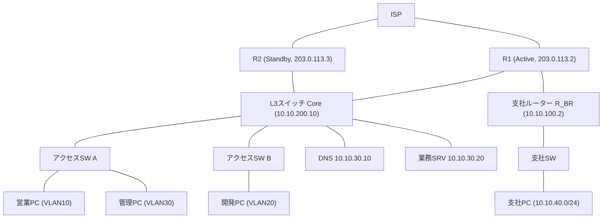

このアドレス表と図を、以降のケーススタディで共通の前提として参照する。

---

## 10.9 通貫シナリオの障害対応

### ケース1：開発部PCが業務サーバーに到達できない(VLAN障害)

**設計**

開発部のアクセススイッチ(SW_B)は、ポートGi1/0/1〜Gi1/0/20を開発部PC収容用のアクセスポートとし、VLAN20を割り当てる設計になっている。

新規採用者のPCを増設する際は、空いているアクセスポートにVLAN20を設定してから接続する運用手順が定められている。

**設定確認(事前状態)**

```cisco
SW_B# show running-config interface GigabitEthernet1/0/15
interface GigabitEthernet1/0/15
 switchport mode access
 switchport access vlan 20
```

台帳上は、Gi1/0/15がVLAN20のアクセスポートとして記録されている。

**症状**

新規採用者のPCをGi1/0/15相当の壁面ポートへ接続したところ、`ipconfig`で確認したIPアドレスが`169.254.x.x`(APIPA)になっており、業務サーバー(10.10.30.20)はもちろん、開発部内の他のPCへのpingも失敗する。

**切り分け**

1. クライアント側でIPアドレスがAPIPAであることを確認し、DHCPによるアドレス取得自体に失敗していると判断する
2. `arp -a`を確認すると、デフォルトゲートウェイに相当するエントリーが存在しない
3. スイッチ側で実際に配線されている物理ポートを特定し、`show interfaces status`を確認したところ、想定していたGi1/0/15ではなく、配線担当が誤って隣のGi1/0/16に接続していたことが判明する
4. `show running-config interface GigabitEthernet1/0/16`を確認すると、このポートは工事の都合で一時的にVLAN1(デフォルトVLAN)のままになっており、VLAN20への設定変更が行われていなかった
5. `show vlan brief`でも、Gi1/0/16がVLAN1に属していることが確認できる

この時点で、原因は「物理配線が台帳と異なるポートに接続され、かつそのポートがVLAN20へ未設定だった」という、配線管理とVLAN設定の二重のずれであると特定できる。

**復旧**

```cisco
SW_B(config)# interface GigabitEthernet1/0/16
SW_B(config-if)# switchport mode access
SW_B(config-if)# switchport access vlan 20
SW_B(config-if)# switchport port-security maximum 1
SW_B(config-if)# switchport port-security mac-address sticky
SW_B(config-if)# switchport port-security violation restrict
SW_B(config-if)# shutdown
SW_B(config-if)# no shutdown
```

設定変更後、`shutdown`と`no shutdown`でリンクを再アップさせ、クライアント側でDHCPの再取得(`ipconfig /release`、`ipconfig /renew`)を行い、正しいVLAN20のアドレスが払い出されることを確認する。

再発防止として、配線台帳と実際のポート対応をラベルおよびスイッチ側のポート説明文(`description`)で明示し、新規接続時のチェック項目に「`show vlan brief`での所属VLAN確認」を追加する。

### ケース2：支社から本社への通信が全面的に不可能になる(ルーティング障害)

**設計**

支社ルーター(R_BR)は、本社向けのすべての通信を、本社エッジルーター(R1)へのスタティックデフォルトルートとして持つ。

本社エッジルーター(R1)は、支社ネットワーク(10.10.40.0/24)向けのスタティックルートを、R_BR方向(10.10.100.2)に設定している。

```cisco
! 本社R1側(設計時の想定設定)
R1(config)# ip route 10.10.40.0 255.255.255.0 10.10.100.2
```

**症状**

支社の担当者から、「本社の業務サーバーにも、本社の他の部署にも一切アクセスできなくなった」という報告が入る。

支社内のPC同士の通信は正常である。

**切り分け**

1. 支社PCから支社ルーターのゲートウェイアドレス(10.10.40.1)への到達性を確認し、成功する。支社側のL2、SVIまでは正常と判断する
2. 支社PCから本社の業務サーバー(10.10.30.20)へtracerouteを実行すると、10.10.100.2(R_BR自身)までは表示されるが、それ以降のホップが一切表示されず、要求がタイムアウトし続ける
3. 本社エッジルーターR1にログインし、`show ip route`を確認すると、10.10.40.0/24宛てのスタティックルートが存在しないことが判明する。前日実施した別件の設定変更作業で、誤って`no ip route 10.10.40.0 255.255.255.0 10.10.100.2`相当の削除操作を行い、意図せず消してしまっていたことが変更履歴から分かる
4. 併せて、支社側から本社側への経路がない状態でも、支社PCから支社ルーターまでは正常に見えてしまう(手順1が正常に見える)ことから、「支社側は正常」という誤った初期仮説を立てやすい点に注意する
5. 本社側のルーティングテーブルという、症状の発生元から離れた場所を確認して初めて原因に到達できる、非対称な障害である

**復旧**

```cisco
R1(config)# ip route 10.10.40.0 255.255.255.0 10.10.100.2
```

設定を再投入した直後に`show ip route`で経路の再表示を確認し、支社PCから本社の業務サーバーへのping、tracerouteを再実行して復旧を確認する。

再発防止として、スタティックルートの削除や変更を伴う作業では、変更前後で`show ip route`の差分を記録し、変更内容が意図した1経路だけに限定されているかをレビューする運用を徹底する。

### ケース3：HSRPフェイルオーバー後に社内全体でインターネットに接続できなくなる(NAT/冗長化障害)

**設計**

本社のインターネット接続は、エッジルーターR1(Active、優先度高)とR2(Standby)によるHSRP構成で冗長化されている。

L3スイッチは、デフォルトルートとしてHSRP仮想IP(10.10.200.1)を指定しており、通常時はActiveであるR1が実際のパケット転送とPAT(NATオーバーロード)を担う。

**設定確認(事前状態)**

構築時、PAT関連の設定はR1にのみ投入され、Standby機であるR2には投入されていなかった。

```cisco
R1(config)# ip nat inside source list 1 interface GigabitEthernet0/1 overload
```

R2側には、対応する`ip nat inside source list ... overload`コマンドと、`ip nat inside`/`ip nat outside`のインターフェース宣言が存在しない。

HSRPはL3の到達性(デフォルトゲートウェイの引き継ぎ)を冗長化する機能であり、NATの変換テーブルやNAT設定そのものを自動的に同期する機能ではないため、この設定漏れはHSRP自体の異常としては検知されない。

**症状**

R1の電源ユニット故障により、HSRPがR2へフェイルオーバーする。

フェイルオーバー自体は正常に完了し、社内の全部署から社内サーバー(業務サーバー、DNSサーバー)へのアクセスは継続して正常に行える。

一方、営業部・開発部・管理部のすべてのPCで、インターネット上のWebサイトへ一切アクセスできなくなる。

**切り分け**

1. 症状の範囲を確認し、「社内は正常、インターネットだけ全社的に不通」という特徴から、特定VLANやアクセスポートの問題ではなく、インターネット出口(エッジルーター)に共通する問題だと見当をつける
2. 社内PCから外部の代表アドレス(8.8.8.8など)へpingを実行すると、要求がタイムアウトする
3. L3スイッチで`show standby brief`を確認し、HSRPのActive役がR1からR2へ切り替わっていることを確認する。R1自体は電源断で応答がない
4. 現在Activeとして稼働しているR2にログインし、`show ip nat translations`を確認すると、通信が発生しているにもかかわらず変換エントリーが1件も存在しない
5. `show running-config | section nat`を実行し、R2にはNAT関連の設定(`ip nat inside`、`ip nat outside`、`ip nat inside source list ... overload`)が一切投入されていないことを確認する
6. 構成管理システムに保存されているR1の設定バックアップとR2の現行設定を比較し、NAT関連のコマンド一式がR2側にのみ欠落していることを特定する

原因は、冗長構成の一方の機器にのみ設定投入を行い、もう一方への反映を怠っていたという、変更管理上の抜け漏れである。

**復旧**

```cisco
R2(config)# interface GigabitEthernet0/0
R2(config-if)# ip nat inside
R2(config-if)# exit

R2(config)# interface GigabitEthernet0/1
R2(config-if)# ip nat outside
R2(config-if)# exit

R2(config)# access-list 1 permit 10.10.10.0 0.0.0.255
R2(config)# access-list 1 permit 10.10.20.0 0.0.0.255
R2(config)# access-list 1 permit 10.10.30.0 0.0.0.255
R2(config)# ip nat inside source list 1 interface GigabitEthernet0/1 overload
```

設定投入後、`show ip nat translations`で変換エントリーが生成され始めることを確認し、社内PCから外部サイトへのアクセスが復旧することを確認する。

再発防止として、冗長構成を組む機器同士は、インターフェースアドレスやHSRP優先度など機器固有の値を除き、NAT・ACL・ルーティングなどの設定を必ずペアで投入し、定期的に両機器の設定差分を自動比較する仕組み(構成管理ツールによる差分検知など)を導入する。

---

## 10.10 よくある誤解

1. **「pingが通れば、そのサービスは使える」**
   pingはICMPの到達性確認に過ぎない。TCPポートの到達性、DNS、アプリケーションの状態はそれぞれ別に確認する必要がある。

2. **「tracerouteの`*`は、そのホップが壊れている証拠」**
   多くの機器はICMP時間超過応答の生成を低優先度で扱うため、`*`が出てもパケット自体は正常に転送されていることがある。連続する`*`とその後の完全な無応答を区別して解釈する。

3. **「障害はいつも壊れた場所で症状が出る」**
   ケース2のように、症状が出ている場所(支社)と、実際の原因がある場所(本社エッジルーターの経路設定)が離れていることは珍しくない。症状の発生源だけを見て調査範囲を狭めすぎない。

4. **「冗長構成にしていれば、片方が壊れても自動的に何もかも引き継がれる」**
   HSRP/VRRPが引き継ぐのはL3の到達性(デフォルトゲートウェイ)であり、NATの変換テーブルや、個別に投入した設定は自動的には同期されない。冗長化の範囲を正しく理解しておく必要がある。

5. **「パケットキャプチャは難しいので障害調査の最終手段」**
   キャプチャポイントを適切に選べば、SYNパケットの有無を見るだけでも、経路のどこで止まっているかを短時間で特定できる。show系コマンドで手がかりが得られない場合、早い段階で候補に入れてよい手法である。

---

## 10.11 設計・運用上の注意点

1. **変更は1つずつ、記録を残して実施する**
   複数の設定変更を同時に行うと、障害発生時にどの変更が原因かを切り分けられなくなる。変更内容、実施者、日時を記録し、可能な限り変更前後で状態を比較する。

2. **冗長構成の機器は、定期的に設定差分を確認する**
   ケース3のような「片方にしか設定が入っていない」状態は、日常的な運用では気づきにくい。構成管理ツールや定期的な`show running-config`の差分比較で、能動的に検出する仕組みを持つ。

3. **平常時のベースラインを取得しておく**
   通常時のping RTT、インターフェースのエラーカウンタ、CPU使用率などの基準値(ベースライン)を事前に把握していないと、「今の値が異常かどうか」を判断できない。

4. **配線台帳とスイッチ設定の対応を常に一致させる**
   ケース1のように、物理配線と設定情報がずれていると、障害調査そのものが遠回りになる。ポートの`description`設定と台帳の二重管理、または一元化した管理ツールの利用を検討する。

5. **監視とログ収集を、障害発生前から整えておく**
   syslogサーバーへのログ集約、SNMPやその他の監視ツールによるインターフェース状態・トラフィック量の常時監視は、障害発生後に慌てて設定するのでは遅い。第8章で触れた管理プレーン保護と合わせて、平時から準備する。

6. **切り分け手順そのものをドキュメント化し、チームで共有する**
   個人の経験則に頼った切り分けは、担当者が不在のときに対応速度が落ちる。この章で示したような「症状別の確認手順」を、自社のネットワーク構成に合わせて手順書に落とし込んでおく。

---

## 10.12 要点まとめ

- 障害切り分けには、ボトムアップ、トップダウン、分割統治のアプローチがあり、実務では分割統治を基本に組み合わせる
- ホスト側の確認コマンド(ping、traceroute/tracert、ipconfig/ip、arp/ip neigh、route/ip route、nslookup/dig、netstat/ss)は、OSが違っても確認する対象(到達性、経路、アドレス、名前解決、ソケット状態)は共通している
- Cisco機器側のshowコマンド群は、インターフェース、VLAN、ルーティング、NAT、ACL、冗長化の状態をそれぞれ個別に確認する道具である
- パケットキャプチャ(tcpdump、Wireshark)は、結果だけでは分からない「なぜ失敗したか」を、実際のパケットから読み取る手法であり、キャプチャポイントの選択が精度を左右する
- DNS障害、VLAN障害、ルーティング障害は、それぞれ症状の型が異なり、確認すべき層と手順が対応している
- 遅延・パケットロスの調査は、単発の確認ではなく統計を取り、L1のエラーカウンタから装置負荷、MTUまで幅広い層を候補として扱う
- 症状の発生場所と、原因のある場所は一致するとは限らず、冗長構成やNATのように「自動的に引き継がれると誤解されやすい」部分ほど、個別に確認する価値がある

---

## 10.13 章末問題

### 問題1

pingとtraceroute(tracert)の役割の違いを、それぞれが確認できる情報の観点から説明せよ。

### 問題2

「ホスト名を指定すると失敗するが、IPアドレスを直接指定すると成功する」という報告を受けたとき、最初に確認すべき項目と、その後の切り分け手順を述べよ。

### 問題3

Wiresharkでのキャプチャにおいて、クライアント側にはSYNパケットが記録されているが、サーバー側には記録されていない場合、何が推測できるか述べよ。

### 問題4

ケース3(HSRPフェイルオーバー後のインターネット不通)において、HSRPそのものは正常にフェイルオーバーしていたにもかかわらず障害が発生した理由を説明せよ。

### 問題5

「同一VLAN内は通信できるが、別VLANのサーバーにだけ到達できない」という症状のとき、VLAN障害とルーティング障害のどちらを疑うべきか、判断の根拠とともに述べよ。

---

## 10.14 解答と解説

### 解答1

pingはICMPエコー要求・応答により、宛先までの往復のIP到達性の有無とおおよそのRTTを確認する。traceroute(tracert)は、TTLを段階的に増やしながら送信し、宛先までの経路上の各ホップと、各ホップまでのRTTを確認する。pingは「届くか届かないか」、tracerouteは「どこまで届いているか、経路はどうなっているか」を確認する点が異なる。

### 解答2

最初に、クライアントのDNS設定(`ipconfig /all`や`ip addr`に相当する設定確認)で、意図したDNSサーバーが設定されているかを確認する。次に、そのDNSサーバーへの到達性(ping、ポート53への到達性)を確認し、`nslookup`または`dig`で直接そのDNSサーバーに問い合わせて応答があるかを確認する。社内DNSで失敗し外部DNSで成功する場合は社内DNSサーバー側、両方で失敗する場合はクライアント側のDNS設定または経路そのものを疑う。

### 解答3

クライアントから送信されたSYNパケットが、サーバーまで到達していないことが推測できる。経路上のスイッチ、ルーター、ACL、ファイアウォールのいずれかで破棄されている可能性が高く、サーバー自体のアプリケーションやポートの問題(サーバー側の設定不備)は、この時点ではまだ切り分けの対象にならない。

### 解答4

HSRPが冗長化するのは、デフォルトゲートウェイとしてのL3到達性(仮想IPの引き継ぎ)であり、NATの設定やNAT変換テーブルそのものはHSRPの管理対象外である。R2にNAT関連の設定が投入されていなかったため、HSRPのフェイルオーバー自体は正常に完了したにもかかわらず、Active役を引き継いだR2がNAT処理を行えず、インターネット向け通信だけが失敗した。

### 解答5

まず、送信元ホストから見て、同一VLAN内のゲートウェイアドレスへの到達性を確認する。ゲートウェイまで届いていれば、VLAN所属自体は正しいと判断でき、その先の別VLANサーバーへの到達性の問題は、ゲートウェイ機器(L3スイッチ)のルーティングテーブルやACLを疑う根拠になる。逆にゲートウェイ自体に届いていなければ、まずVLAN障害(アクセスポートの所属、トランクの許可VLAN)を疑うべきである。

---

## 10.15 総合演習

### 演習A：確認コマンドの使い分け整理

1. この章で扱った全確認コマンド(ホスト側、Cisco側)を、「到達性」「経路」「アドレス設定」「名前解決」「ポート/ソケット状態」の5分類に自分で仕分ける
2. 分類ごとに、Windows、Linux、Cisco IOSでの対応するコマンドを表にまとめる
3. 自分の言葉で、それぞれのコマンドが何を確認する道具かを1行で説明する

### 演習B：パケットキャプチャによる障害再現

1. Packet Tracer、GNS3、CML、または実機とホストOSを用意し、クライアント-スイッチ-サーバーの単純な構成を作る
2. サーバー側で意図的に特定ポートへのアクセスを拒否するACLを設定する
3. クライアント側とサーバー側の両方でパケットキャプチャを取得しながら、クライアントから該当ポートへ接続を試みる
4. クライアント側のキャプチャにはSYNが記録され、サーバー側には記録されないことを確認し、ACLによる遮断の痕跡をパケットレベルで確認する

### 演習C：3ケーススタディの再現と手順書化

1. この章のケース1〜3のいずれかを選び、同等の障害状況をシミュレーター上で再現する
2. 実際に確認コマンドを実行しながら、切り分けの各ステップでの出力結果をスクリーンショットまたはテキストで記録する
3. 記録をもとに、自分のチームで使える「障害対応手順書」の形式(症状、確認手順、想定される原因、復旧手順、再発防止策)にまとめ直す
4. 可能であれば、演習Aで作成したコマンド一覧表を、この手順書からリンクさせる

### 演習D：総合設計レビュー

1. 通貫シナリオ全体(第1章〜第10章)の構成図を、自分で一から描き直す
2. VLAN、ルーティング、冗長化、NAT、ACL、無線LANのそれぞれについて、設計上の意図を1〜2文で説明を添える
3. この章で扱った3つのケーススタディが、それぞれ構成図上のどの部分に対応する障害かを図に書き込む
4. 自分がこのネットワークの運用担当者だと想定し、優先的に監視・記録しておきたい項目を3つ挙げる

---

## 本書のまとめ

第1章で、通信が成立するまでの全体像とOSI参照モデル、TCP/IPモデルという地図を得た。

第2章から第4章では、Ethernet、IPアドレスとサブネット、TCP/UDPと主要プロトコルという、あらゆる通信の土台を固めた。

第5章から第7章では、VLANによる部署分離、ルーティングによるネットワーク間到達性、STPとHSRP/VRRPによる冗長化という、企業LANを構成する骨格を組み立てた。

第8章では、NATによるアドレス変換とACLによるアクセス制御、そしてポートセキュリティ、DHCP Snooping、DAIによるL2セキュリティを扱い、通信を「つなげるだけ」でなく「安全に制限する」視点を加えた。

第9章では、有線VLAN設計の延長として無線LANを位置づけ、SSIDとVLANの対応づけ、WPA2/WPA3による認証と暗号化を扱った。

そして第10章では、これらすべてが正しく機能しているかを確認し、壊れたときに切り分け、復旧させるための道具と手順を扱った。

通貫シナリオの本社と支社は、10個の章を通じて、単なるケーブルと機器の集合から、部署分離、外部接続、冗長性、セキュリティ、無線対応、運用監視まで備えたひとつのシステムとして描かれてきた。

実際の現場では、ここで扱った標準技術(Ethernet、IP、TCP/UDP、802.11、ACLの概念)と、Cisco固有の実装(HSRP、DTP、CDP、IOSのコマンド体系)の両方が混在する。

どちらの技術に対しても、「なぜその機能が必要になったのか」という背景から理解しておけば、ベンダーや製品が変わっても、同じ考え方で新しい環境に向き合える。

本書で得た地図をもとに、実機やシミュレーターでの演習を重ね、実際の構成図やログを読み解く経験を積み重ねていくことが、CCNAレベルの知識を実務の判断力へ変えていく道筋になる。


---

