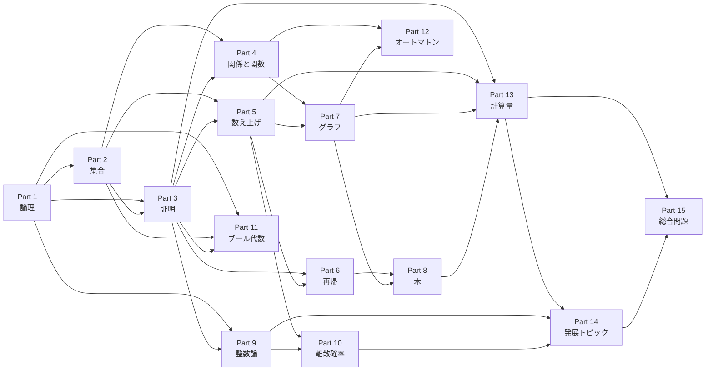

# 離散数学の入口

この章では、離散数学が何を扱い、なぜコンピュータ科学で使われ、これから何を学ぶかを確認します。

高校数学に不安があっても、記号を一つずつ日本語に戻し、有限個の例を手で追えば読み進められます。

## この章の到達目標

この章を終えた時点で、次の事項を説明できるようになることを目指します。

- **離散**と**連続**の違いを、対象の例を挙げて説明できる。
- 離散数学が、データ、状態、関係、手順を表すために使われる理由を説明できる。
- **アルゴリズム**（問題を解くための有限個の明確な手順）が、構造、正しさ、計算量と関係することを説明できる。
- 全15 Partの学習地図を見て、次に学ぶ章と、その前提を確認できる。
- 最初の理解度チェックで、復習が必要な前提を自分で見つけられる。

## 離散と連続

**離散**とは、対象を一つずつ区別して扱えることです。

たとえば、トランプの枚数、グラフの頂点、文字列の文字、プログラムの状態は、対象を数えたり列挙したりできます。

**連続**とは、対象の間に、さらに細かい値が入り続けると考えることです。

たとえば、時刻、温度、位置、音の波形は、ある範囲の中で実数値として変化します。

次の表は、二つの見方を比べたものです。

| 見方 | 離散の例 | 連続の例 |
| --- | --- | --- |
| 数える対象 | 本棚の本の冊数 | 水の量 |
| 状態の変化 | 電源がオンかオフか | 明るさの変化 |
| 空間の表現 | 道路網の交差点と道路 | 地図上の位置 |
| 時間の表現 | プログラムの命令を1行ずつ実行する | センサー値を連続的に測る |

離散と連続は、現実の物を二種類に完全分類する言葉ではありません。

同じ対象でも、目的に応じて離散的に近似したり、連続的に扱ったりします。

たとえば、動画は現実の動きを連続的に記録したものですが、コンピュータは画像を画素、時間をフレームという有限個の単位に分けて保存します。

この教材では、有限個の対象、有限長の記号列、数えられる場合の集合、規則でつながる構造を中心に扱います。

## 離散数学で扱う対象

離散数学では、まず対象を正確に指定し、その対象の間にある関係や操作を調べます。

**集合**とは、対象を重複なくまとめたものです。

たとえば、$A = \{1, 2, 3\}$ は、1、2、3を要素として持つ集合です。

**命題**とは、真か偽かを判定できる文です。

「7は素数である」は命題ですが、「大きい数」は条件が曖昧なので、そのままでは命題になりません。

**関係**とは、二つ以上の対象が、ある条件を満たすかどうかを表すものです。

たとえば「整数$a$が整数$b$を割り切る」は、整数の組に対する関係です。

**グラフ**とは、頂点と、それらを結ぶ辺からなる構造です。

道路網を、交差点を頂点、道路を辺として表すと、地図の問題をグラフの問題に置き換えられます。

**証明**とは、定義と既知の事実から、命題が成り立つ理由を有限個の推論で示すことです。

証明は、答えが合っていることを確認するだけでなく、どの条件で答えが成り立つかを明らかにします。

## 計算機科学で重要な理由

**計算機科学**（Computer Science、CS）とは、計算、情報、プログラム、計算機の性質を研究する分野です。

コンピュータは、有限個の記号、有限個の状態、有限回の手順を組み合わせて処理します。

そのため、離散数学は、データを表現し、処理の正しさを説明し、必要な計算資源を見積もるための共通言語になります。

### データを構造として表す

**データ構造**とは、データを保存し、取り出し、関係づけるための表現方法です。

配列は順序を持つ列として、木は階層として、グラフはネットワークとしてデータを表します。

構造を選ぶと、同じ情報でも、検索、追加、削除の手順と速さが変わります。

### プログラムの条件を論理で表す

プログラムの分岐は命題の真偽を調べ、ループは条件が保たれる間に状態を更新します。

**不変条件**とは、手順の途中でも常に保たれる条件です。

たとえば、整列済みの部分列が常に昇順であることを不変条件にすると、整列アルゴリズムの正しさを追跡できます。

### ネットワークや依存関係をグラフで表す

SNSのつながり、道路、パッケージの依存関係、タスクの前後関係は、グラフとして表せます。

グラフに変換すると、到達できるか、最短経路は何か、循環した依存関係があるかという問いに変わります。

### 計算資源を見積もる

**計算量**とは、入力の大きさに応じて、アルゴリズムが必要とする時間や記憶領域がどの程度増えるかを表す尺度です。

入力の要素数を$n$とすると、全要素を一度見る手順はおおむね$n$に比例し、すべての組を調べる手順はおおむね$n^2$に比例します。

この違いは、$n$が小さいときには目立たなくても、$n$が大きくなると実行時間の差になります。

## アルゴリズムとの関係

アルゴリズムは、入力を受け取り、状態を有限回更新し、出力を返す手順です。

離散数学は、アルゴリズムを次の三つの問いに分けて考えるために役立ちます。

1. 何を入力とし、何を出力とするか。
2. 各手順が、定義された対象に対して何を変えるか。
3. その手順が正しく終了し、どの程度の資源を使うか。

たとえば、集合$S$の中に値$x$があるかを調べる線形探索を考えます。

```text
入力：要素を順に並べた列 S と、探す値 x
手順：S の先頭から要素を一つずつ x と比較する
      一致したら「見つかった」と返す
      最後まで一致しなければ「見つからない」と返す
```

この手順では、入力列の先頭から調べた範囲について、「その範囲に$x$がなければ、まだ見ていない範囲に候補が残っている」という関係を追跡します。

これが手順の正しさを考える最初の視点です。

要素数が$n$のとき、最悪の場合は$n$個すべてを比較するため、比較回数は$n$に比例します。

一方、列が昇順に並んでいるなら、中央の値と比較して候補を半分に絞る**二分探索**（順序づけられた列の中央を調べ、候補範囲を半分にする手順）を使えます。

この場合、候補の数はおおむね$n, n/2, n/4, \ldots$と減るため、比較回数は$\log_2 n$に比例します。

ただし、二分探索には「列が昇順に並んでいる」という前提があります。

アルゴリズムの速さだけを比べると、この前提を見落とします。

離散数学では、定義、条件、証明、計算量を一緒に扱い、なぜその手順が使えるかを確認します。

## 全体地図

全15 Partは、対象を表す道具、推論する道具、数える道具、構造を探索する道具、計算を形式化する道具の順に広がります。



Part 1からPart 4では、対象を定義し、命題を読み、証明を書くための基礎を作ります。

Part 5とPart 6では、個数を数え、再帰的に定義される対象を計算します。

Part 7とPart 8では、グラフや木を手順に変換し、探索や階層を分析します。

Part 9からPart 12では、整数、確率、論理回路、オートマトンを、これまでの論理と構造で記述します。

Part 13からPart 15では、計算量と発展トピックを含む問題を構造化し、適切な道具を選び、解答としてまとめます。

各Partの詳細な難易度、推定時間、前提、到達目標は、[README](README.md)にまとめています。

## 各章に共通する読み方

各Partでは、同じ型を使って一つの概念を説明します。

### 直感

日常の場面や小さな図を使い、何を区別し、何を調べる概念なのかを示します。

直感は入口であり、定義の代わりではありません。

### 定義

対象の範囲、条件、記号の意味を、曖昧さが残らない形で定めます。

たとえば、単に「つながっている」と言わず、グラフの頂点から別の頂点へ辺をたどる道が存在することとして定義します。

### 最小例

要素数や条件をできるだけ小さくした例で、定義を一つずつ適用します。

最小例の目的は、難しい問題を解くことではなく、定義の各条件がどこで使われるかを見えるようにすることです。

### 図解

集合には領域図、命題には真理値表、関係には矢印図、グラフには頂点と辺を使います。

図は記号を置き換えるものではなく、同じ対象を別の表現で確認するためのものです。

### 手計算

途中式、場合分け、比較回数、推論の理由を紙に残します。

手計算は、答えを速く出す練習ではなく、どの定義や規則を使ったかを確認する作業です。

### 誤解

似た用語の違い、条件を一つ落とした場合、直感が通用しない反例を扱います。

誤解を先に言葉にすると、答えが合っていても理由が誤っている状態を見つけやすくなります。

### CSとの関係

学んだ概念が、データ構造、プログラム検証、ネットワーク、暗号、計算量のどこで使われるかを示します。

応用例は定義を置き換えるものではなく、定義がなぜ役立つかを示すものです。

### 演習

最初は、定義をそのまま適用する問題を解きます。

次に、条件を変える問題、複数の概念を組み合わせる問題、理由を文章で説明する問題へ進みます。

### 解答

解答は結果だけでなく、どの条件を確認し、どの規則を使い、どこで結論を得たかを示します。

解答を読んだ後は、解答を閉じて、自分の言葉で同じ流れを再現します。

### つながり

前のPartの概念がどこで使われ、次のPartで何に変わるかを明示します。

つながりを記録すると、用語を個別に暗記するのではなく、問題に応じて道具を選べるようになります。

## 最初の理解度チェック

次の問題は、Part 1を始める前の診断です。

計算に自信がなくても、分かるところまで紙に書き、空欄をそのまま記録します。

### 問題

1. $A = \{1, 2, 3\}$ に対して、$2 \in A$ は真か偽かを答え、「$\in$」の意味を日本語で書きます。
2. 「4は偶数である」は命題かどうかを答え、理由を書きます。
3. $2x + 3 = 9$ を満たす$x$を、各変形の理由を書きながら求めます。
4. 1から6までの整数のうち、偶数はいくつあるかを数えます。
5. 3人を一列に並べる方法を、実際に書き出して数えます。
6. $A = \{1, 2\}$、$B = \{1, 2, 3\}$ のとき、$A$のすべての要素が$B$に入っているかを答えます。
7. 3個の頂点を三角形の形に結んだ図で、頂点の数と辺の数を答えます。
8. 「入力を半分に絞る手順」は、入力を一つずつ調べる手順と比べて、なぜ大きな入力で有利になりやすいかを一文で書きます。
9. 「すべての整数は正である」という文の反例を一つ挙げます。
10. 次のうち、離散的に扱いやすいものを二つ選びます。トランプの枚数、気温、文字列の文字数、音の波形。

### 採点の観点

1問1点で、合計10点として記録します。

正答数だけでなく、理由を一文で書けたかを確認します。

| 得点または状態 | 判定 | 推奨する行動 |
| --- | --- | --- |
| 8点以上で理由も書ける | Part 1の本文へ進む | 記号の読み方を丁寧に確認する |
| 5点から7点 | 準備を補ってPart 1へ進む | 式の変形、集合、反例を復習する |
| 4点以下 | Part 1をゆっくり読む | 下の補習項目を一つずつ確認する |
| 記号の意味がほとんど不明 | 診断保留 | READMEの「前提と補い方」を使う |

### 短い解答

1. 真です。
$2 \in A$ は「2は集合$A$の要素である」と読みます。
2. 命題です。
真偽を判定でき、「4は偶数である」は真です。
3. $2x + 3 = 9$ から両辺を3引くと$2x = 6$になり、両辺を2で割ると$x = 3$です。
4. 2、4、6の3個です。
5. 「ABC」、「ACB」、「BAC」、「BCA」、「CAB」、「CBA」の6通りです。
6. 入っています。
$A$の要素1と2が、どちらも$B$に入っています。
7. 頂点は3個、辺は3本です。
8. 一度に調べる候補が減るため、必要な比較回数の増え方が小さくなりやすいからです。
9. たとえば$0$は整数ですが、正ではありません。
10. トランプの枚数と文字列の文字数です。

### 補習項目

問1と問6で止まった場合は、集合、要素、部分集合の違いを確認します。

問2と問9で止まった場合は、命題、否定、反例を確認します。

問3で止まった場合は、等号を保つ式の変形を確認します。

問4と問5で止まった場合は、有限個の対象を重複なく数える方法を確認します。

問7と問8で止まった場合は、グラフ、手順、入力の大きさを確認します。

## 次に読む章

次は、記号、命題、量化を、離散数学で使う読み書きに整理するPart 1へ進みます。

最初からすべてを覚える必要はありません。

定義を読み、最小例を作り、理由を一文で書く習慣ができれば、後のPartで新しい記号に出会ったときも、意味を自分で確認できます。

## Knowledge Map 更新

```text
離散的な対象
   ↓
論理で条件を表す → 集合でまとめる → 関係で結び付ける
   ↓                              ↓
証明で正しさを確認            グラフ・木で構造化
   ↓                              ↓
数え上げ・再帰で規模を分析 → アルゴリズム → 計算量
```

## 専門家の見方

### このセクションの読み方

ここでいう「共通土台」は、すべての専門家が同じ哲学や手法を採用するという意味ではなく、議論を始めるときに多くの専門家が確認する考え方を指します。

メンタルモデル（複雑な対象を考えるための簡略化された見取り図）は、定義そのものではなく、どの定義をどの場面で使うかを判断するための道具です。

対立軸は、どちらか一方が常に正しいという順位表ではなく、目的、前提、コストモデル（何を資源として数えるか）、哲学によって選択が変わる論点です。

研究上の未解決問題に決着を与えるとは主張しません。未解決の問いを扱う場合は、その状態を明記し、確定した定義と設計上の選択を分けて読みます。

### 5つの中核的なメンタルモデル

1. **離散化は対象を数えられる状態へ切り分ける操作である**：離散数学では、対象を個別に識別できる状態や、有限または可算な候補として扱います。連続量を丸めても、常に十分とは限らず、境界で情報を失う場合があります。
このモデルは、論理の真偽値、集合の要素、グラフの頂点、アルゴリズムの状態につながります。コードでは入力を列挙可能な状態へ変換する設計に、現実のモデル化では何を同一視し、何を区別するかの宣言に相当します。

2. **モデル化は宇宙と関係を選ぶ操作である**：数学的な問題は、対象の全体を宇宙として定め、その上で所属、順序、隣接、同値などの関係を選ぶことで形式化されます。
対象の選び方が変われば同じ現実でも別の問題になるため、細部を追加すれば必ず精度が上がるわけではなく、目的に不要な情報は計算量と説明負荷を増やします。
論理は条件を、集合は対象のまとまりを、後続の関係やグラフは対象間の構造を表すため、コードでは型、入力制約、データ構造の設計に現れます。

3. **意味と表現は分けて検査する**：同じ意味を複数の表現で記述でき、逆に似た表現でも意味が異なることがあります。
例えば集合を内包表記、列挙、ビット列、ハッシュ表で表せますが、数学的な所属関係と、検索が速いという実装上の性質は別の主張です。
この区別は、論理式の真理条件とプログラムの評価、集合の等しさとデータ構造の同一性をつなぎ、現実のデータ設計では仕様と保存形式を分離する境界になります。

4. **証明は不変な理由を圧縮して再利用する**：証明は一つの例を確認する作業ではなく、仮定から結論までの推論がすべての許された対象で成立することを示す手続きです。
定義、補題、反例、不変量（途中でも保たれる性質）を使うと、個別の計算を繰り返さずに多くのケースを一度に扱えます。
論理では証明の形式、集合では要素の所属、アルゴリズムではループ不変量へ接続し、コードではテストが見つける例外と証明が保証する範囲を混同しない設計に役立ちます。

5. **計算量は問題の構造と資源の尺度で決まる**：同じ答えを返す手順でも、入力の大きさに対する時間、記憶領域、通信量、並列性などの増え方が異なります。
「速い」という評価には、入力の分布、最悪の場合か平均か、前処理を含めるかという境界条件があるため、定数時間という表現だけで現実の速さを保証できません。
集合の濃度、直積、べき集合、グラフの構造は候補数を見積もる基礎となり、コードでは全探索を許すか近似や索引を導入するかを決める材料になります。

### 3つの代表的な対立軸

#### 対立軸1: 抽象化を先に置くか具体例を先に置くか

立場A：先に抽象的な定義と記号を固定し、例はその定義の適用として扱います。

立場Aの最も強い主張：定義を先に置けば、例ごとに意味が揺れず、論理、集合、グラフ、アルゴリズムを同じ基準で比較できます。

立場B：先に小さな具体例や現実の状況を作り、そこから共通する構造を抽出します。

立場Bの最も強い主張：例を先に置けば、記号が何を区別するために必要なのかを理解でき、抽象語だけを暗記する危険を減らせます。

どの条件で選択が変わるか：新しい理論を厳密に接続するときや誤解の影響が大きいときは立場Aが有利で、初学者が対象の意味を掴むときや現実の要件からモデルを作るときは立場Bが有利です。

#### 対立軸2: 証明による保証を重く見るか実験による探索を重く見るか

立場A：証明、反例、仕様を中心に置き、許された仮定から必ず成り立つ範囲を明示します。

立場Aの最も強い主張：安全性や正当性が重要な場面では、有限個のテストで見つからなかった不具合を「ない」とみなせないため、証明可能な保証が必要です。

立場B：実験、シミュレーション、測定を中心に置き、実際の入力や環境で有効な仮説を素早く更新します。

立場Bの最も強い主張：現実の要件や性能分布は完全に形式化できないことがあり、実験なしに証明だけを磨いても、目的に合わないモデルを高い確信で実装する危険があります。

どの条件で選択が変わるか：安全性、再現性、入力制約の厳密さが必要なら立場Aを重くし、未知のデータ、性能チューニング、仮説生成が中心なら立場Bを重くします。
両者は排他的ではなく、実験でモデルを選び、証明で選んだモデルの保証範囲を確定する組合せもあります。

#### 対立軸3: 統一的な形式化を優先するか分野固有の表現を優先するか

立場A：論理式、集合、関係、写像などの共通言語へ変換し、異なる分野の問題を同じ構造として扱います。

立場Aの最も強い主張：共通の形式化は、既知の定理やアルゴリズムを再利用でき、問題の本質と表面的な語彙を切り分けます。

立場B：対象の分野に固有の表現や制約を保ち、一般化によって失われる意味や運用上のコストを優先します。

立場Bの最も強い主張：形式化のために現実の時間、誤差、社会的規則、データ欠損を捨てると、数学的には整っていても実務では使えないモデルになります。

どの条件で選択が変わるか：複数の問題に手法を適用し、証明や計算量を比較するときは立場Aが有利で、固有の制約が結果を左右するときや説明責任が必要なときは立場Bを残します。
何を抽象化しても保存される性質か、抽象化で失われる性質かを明示できる場合に限り、両者を安全に組み合わせられます。

### 理解の深さを見分ける10の質問

1. 「離散的に扱う」と「値を整数に丸める」は、どの条件で同じ意味にならず、どの情報が失われますか。

2. 現実の「利用者」を集合の要素として表すとき、宇宙、同一人物の判定、時間の扱いをどのように定めますか。

3. 同じ集合を列挙、内包表記、ハッシュ表で表す場合、意味が同じことと計算コストが同じでないことを説明できますか。

4. 「すべての入力で正しい」と「多数のテストで失敗しなかった」は、保証の対象と反例の役割がどう違いますか。

5. 論理、集合、グラフのうち一つを選び、同じ対象を別の分野のモデルへ翻訳するとき、何が保存され何が捨てられますか。

6. 候補を全部列挙するアルゴリズムが小さな入力では合理的でも大きな入力で破綻する例を作り、どの濃度や直積が原因か説明できますか。

7. 抽象的な定義を先に学ぶべき問題と具体例を先に作るべき問題を一つずつ挙げ、目的と読者の前提から理由を説明できますか。

8. 証明、テスト、シミュレーションがそれぞれ見つけられる反例や保証できる範囲を比較し、三つを同じものとして扱えない理由を述べられますか。

9. 「現実を正確にモデル化する」という主張を、何を区別し何を無視するか、誤差、計算量の観点から検査できますか。

10. ある問題を共通の形式化へ変換することで再利用できる定理と、変換によって失われる現実固有の条件を具体的に示せますか。
