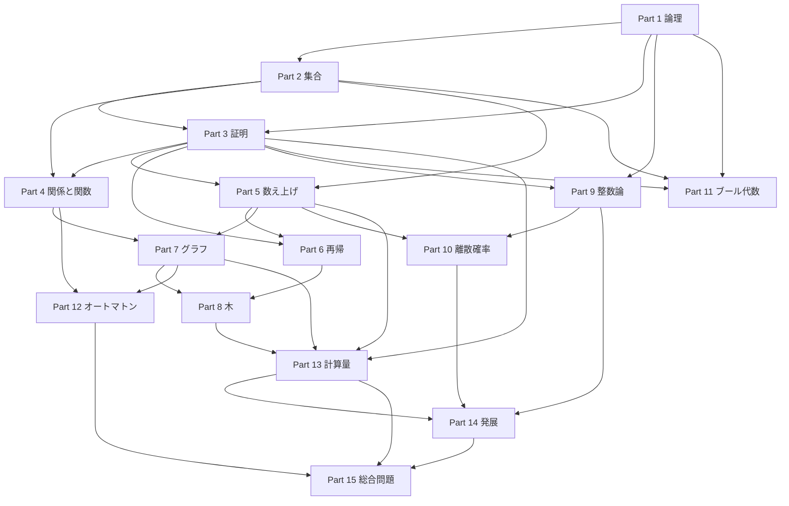

# 離散数学を基礎から学ぶ教材

この教材は、高校数学に少し不安がある離散数学の初心者が、定義、例、証明、計算、計算機科学への応用を順に学ぶための道案内です。

ここでいう**離散数学**とは、個数えられる対象、有限個の状態、記号列、規則でつながる構造を扱う数学です。

目標は公式を暗記することではなく、問題を「対象、関係、制約、手順」として表し、根拠を説明しながら解けるようになることです。

**計算機科学**（Computer Science、CS）とは、計算、情報、プログラム、計算機の性質を研究する分野です。

## 教材の使い方

このフォルダでは、まず [00_overview.md](00_overview.md) を入口として読み、その後にPart 1からPart 15まで進みます。

各章は、直感、定義、最小例、図解、手計算、誤解、CSとの関係、演習、解答、つながりの順に読みます。

各章の本文に証明やコードがある場合は飛ばさず、紙に小さな例を書いてから次へ進みます。

数式で使う文字が分からなくなったら、直前の定義に戻り、その記号を日本語の文に言い換えます。

演習の解答を見る前に、少なくとも5分は、自分の図、表、式、場合分けを作ります。

解答と違った場合は、答えだけでなく、置いた集合、入力、条件、使った定義が同じかを比較します。

標準的な1回の学習は60分から90分とし、本文、手計算、演習、記録に時間を分けます。

1回で章を終えられない場合は、章を分割しても構いません。

## 前提と補い方

高校数学をすべて得意にしておく必要はありませんが、次の操作は学習中に使います。

- **式の変形**：等号を保ったまま、両辺に同じ操作をすることです。
- **整数**：$\ldots, -2, -1, 0, 1, 2, \ldots$のように、分数でない数です。
- **分数と割合**：全体を1と見たときの一部の大きさです。
- **座標と図**：対象の位置や関係を、軸、点、線で表す方法です。

式の変形が不安な場合は、$2x + 3 = 9$から$x = 3$を得る操作を、各行の理由を書きながら練習します。

整数が不安な場合は、負の数、偶数と奇数、素数、約数、倍数を、具体例を10個ずつ書いて確認します。

分数と割合が不安な場合は、$1/2 + 1/3$、$2/3$の20パーセント、1から6までの偶数の割合を計算します。

座標と図が不安な場合は、点を紙に打ち、2点を線で結び、線の本数を数える作業から始めます。

補習では、分からない数学を一度に全部やり直さず、直前の章で必要な操作だけを短く補います。

## Levelの見方

Levelは難しさのラベルであり、学習者の価値や数学の才能を表すものではありません。

| Level | 対応Part | 到達状態 |
| --- | --- | --- |
| Level 1 基礎 | Part 1からPart 4 | 命題、集合、写像、証明の基本を読み、簡単な推論を説明できる |
| Level 2 標準 | Part 5からPart 6、Part 9からPart 10 | 数え上げ、再帰、整数、確率を条件に応じて使い分けられる |
| Level 3 応用 | Part 7からPart 8、Part 11からPart 13 | グラフ、木、論理回路、オートマトン、計算量をCSの問題と結びつけられる |
| Level 4 実践・発展 | Part 14からPart 15 | 複数の道具を組み合わせ、仮定、証明、手順、限界を説明できる |

Levelを上げる条件は、章末演習の正答率だけではなく、定義、例、反例、解法の理由を説明できることです。

## 全15 Partの一覧

時間は、本文の精読、手計算、章末演習、学習記録を含む標準的な目安です。

「前提なし」は、`00_overview.md`を読んだ後に、他のPartを要求しないことを表します。

| Part | ファイル | 主題 | Level | 難易度 | 推定学習時間 | 前提章 | 到達目標 |
| --- | --- | --- | --- | --- | --- | --- | --- |
| 1 | [01_logic.md](01_logic.md) | 論理 | 1 | ★☆☆☆ | 4から6時間 | 前提なし | 命題、否定、論理積、論理和、含意、量化を読み、真理値表で確認できる |
| 2 | [02_sets.md](02_sets.md) | 集合 | 1 | ★☆☆☆ | 4から6時間 | Part 1 | 集合演算、要素、部分集合、濃度を表、図、式で扱える |
| 3 | [03_proofs.md](03_proofs.md) | 数学的証明 | 1 | ★★☆☆ | 6から9時間 | Part 1、Part 2 | 直接証明、対偶、背理法、場合分け、帰納法を問題に応じて選べる |
| 4 | [04_relations_and_functions.md](04_relations_and_functions.md) | 関係と関数 | 1 | ★★☆☆ | 5から8時間 | Part 1、Part 2、Part 3 | 関係の性質、写像、単射、全射、全単射を判定し、図で説明できる |
| 5 | [05_counting.md](05_counting.md) | 数え上げ・組合せ論 | 2 | ★★☆☆ | 6から9時間 | Part 2、Part 3 | 和の法則、積の法則、順列、組合せ、包除原理の使い分けを説明できる |
| 6 | [06_recursion.md](06_recursion.md) | 再帰と漸化式 | 2 | ★★★☆ | 6から9時間 | Part 3、Part 5 | 再帰を定義し、漸化式を立て、数学的帰納法で性質を確認できる |
| 7 | [07_graphs.md](07_graphs.md) | グラフ理論 | 3 | ★★★☆ | 8から12時間 | Part 2、Part 3、Part 5 | 頂点、辺、次数、道、閉路、連結性を定義し、グラフをモデル化できる |
| 8 | [08_trees.md](08_trees.md) | 木構造 | 3 | ★★★☆ | 6から9時間 | Part 6、Part 7 | 木の性質、根付き木、二分木、探索を図と手順で追跡できる |
| 9 | [09_number_theory.md](09_number_theory.md) | 整数論 | 2 | ★★★☆ | 7から10時間 | Part 1、Part 3 | 約数、最大公約数、素数、合同算術、ユークリッドの互除法を計算できる |
| 10 | [10_discrete_probability.md](10_discrete_probability.md) | 離散確率 | 2 | ★★★☆ | 7から10時間 | Part 1、Part 5、Part 9 | 標本空間、条件付き確率、独立性、期待値を有限の場合で計算できる |
| 11 | [11_boolean_algebra.md](11_boolean_algebra.md) | ブール代数 | 3 | ★★☆☆ | 4から7時間 | Part 1、Part 2、Part 3 | 論理式、集合演算、ブール式を対応づけ、回路の条件を簡約できる |
| 12 | [12_automata.md](12_automata.md) | 有限状態機械とオートマトン | 3 | ★★★☆ | 6から9時間 | Part 1、Part 4、Part 7 | 文字列、言語、状態、遷移を定義し、有限オートマトンの動作を追跡できる |
| 13 | [13_complexity.md](13_complexity.md) | アルゴリズム計算量 | 3 | ★★★☆ | 7から10時間 | Part 3、Part 5、Part 7、Part 8 | 入力サイズ、計算量、漸近記法、正しさをアルゴリズムと対応づけられる |
| 14 | [14_advanced_topics.md](14_advanced_topics.md) | 発展トピック | 4 | ★★★★ | 8から12時間 | Part 5、Part 7、Part 9、Part 10、Part 13 | 最適化、NP完全、情報理論などを、既習の構造と限界に結びつけられる |
| 15 | [15_capstone_problems.md](15_capstone_problems.md) | 総合問題 | 4 | ★★★★ | 10から15時間 | Part 3、Part 6からPart 10、Part 13、Part 14 | 現実の問題をモデル化し、定義、証明、アルゴリズム、計算量を一つの解答に統合できる |

Part 0の導入は、章一覧の前にある [00_overview.md](00_overview.md) から始めます。

3〜4章ごとの復習には、[16_review_checkpoints.md](16_review_checkpoints.md) を使います。

Part 14は一つの理論を深掘りする章ではなく、複数の発展的な話題を既習概念に接続する章です。

## 推奨学習順序

標準ルートは、`00_overview`、Part 1、Part 2、Part 3、Part 4、Part 5、Part 6、Part 7、Part 8、Part 9、Part 10、Part 11、Part 12、Part 13、Part 14、Part 15の順です。

Part 2、Part 4、Part 6、Part 8、Part 10、Part 12、Part 14を終えたら、[16_review_checkpoints.md](16_review_checkpoints.md) の対応する復習を行います。

Part 9はPart 5の後に先取りしてもよく、Part 11はPart 1からPart 3を終えた後ならPart 10の前後で学べます。

Part 13を早く読みたい場合は、Part 5、Part 7、Part 8を先に学び、証明の復習としてPart 3へ戻ります。

目的別の短いルートは次のとおりです。

- 初心者：`00 → 1 → 2 → 3 → 4 → 5 → 6 → 7 → 8 → 13 → 15`
- アルゴリズム重視：`00 → 1 → 2 → 3 → 5 → 6 → 7 → 8 → 13 → 14 → 15`
- AIやデータサイエンス：`00 → 1 → 2 → 4 → 5 → 7 → 9 → 10 → 13 → 15`
- 暗号やセキュリティ：`00 → 1 → 2 → 3 → 4 → 5 → 9 → 11 → 12 → 13 → 14 → 15`

短いルートを選んでも、飛ばしたPartの前提概念が必要になったら、そのPartへ戻ります。

## Knowledge Map

**Knowledge Map**は、用語と問題解決の道具がどのようにつながるかを示す地図です。



論理は、プログラムの条件、データベースの検索条件、証明の推論を表します。

集合と関係は、データの分類、写像、依存関係を表します。

数え上げと確率は、検索空間、テストケース、ランダムな選択を分析します。

グラフと木は、ネットワーク、階層、探索空間を表します。

整数論とブール代数は、ハッシュ、暗号、ビット演算、論理回路の基礎になります。

オートマトンは、文字列の規則、字句解析、状態を持つプログラムを形式化します。

計算量は、アルゴリズムの正しさとは別に、入力が大きくなったときの資源の増え方を評価します。

## 学習記録の付け方

学習記録は、勉強時間の集計だけでなく、どの定義を使えるかを確認するために残します。

各回に、日付、Part番号、学習時間、定義できるようになった用語、自力で解けた最小例を記録します。

さらに、間違えた問題、誤りの種類、間違えた理由、次回に解き直す問題を記録します。

誤りの種類は、計算ミス、定義の取り違え、条件の見落とし、場合分けの不足、証明の飛躍、手順の追跡ミスに分けます。

理解度は、次の4段階で固定します。

| 記号 | 状態 | 次にすること |
| --- | --- | --- |
| A | 定義、例、理由を説明でき、条件を変えた問題も解ける | 次のPartへ進む |
| B | 標準例は解けるが、説明か応用に不安がある | 章末演習を1問追加する |
| C | 解答を見れば追えるが、自力では途中で止まる | 最小例と手計算をやり直す |
| D | 用語や記号の意味から不明である | 前提の補い方と導入を復習する |

記録のテンプレートは、次の形をコピーして使えます。

```text
日付：
Part：
学習時間：
定義できるようになった用語：
自力で解けた最小例：
誤りの種類：
間違えた理由：
次回に解き直す問題：
自己評価：A / B / C / D
```

3回続けて自己評価がCまたはDになった場合は、難しいPartへ進まず、前提章の到達目標を一つだけ選んで復習します。

反対に、Aが続いても、定義を使わずに答えだけを出している場合は、説明問題を追加します。

## つまずいたときの優先順位

つまずきへの対策は、起きている症状ではなく、最も可能性の高い原因から行います。

- Countermeasure: 用語を日本語で言い換え、最小例を作る（assumed cause: 定義の対象と条件が区別できていない）。
- Countermeasure: 問題文を「対象、条件、求めるもの」に分解する（assumed cause: 問題の構造を記号へ写す前に計算を始めている）。
- Countermeasure: 解答の各行に使った定義や定理を書く（assumed cause: 結論だけを覚え、推論の接続を確認していない）。
- Countermeasure: 具体例と反例を一つずつ並べる（assumed cause: 成り立つ条件の範囲を例一つから広げすぎている）。
- Countermeasure: 前提章の到達目標を一項目だけ復習する（assumed cause: 記号操作の負荷が、現在の章の概念理解を隠している）。

この教材の入口で多い原因は、定義、条件、場合分けのどれかが曖昧なことです。

## 入口を終えた状態

`README.md`と`00_overview.md`を読み終えた段階で、離散数学のすべてを解ける必要はありません。

次の問いに、式や図を一つ使って答えられれば、Part 1へ進めます。

- 離散な対象と連続な対象は、何を数えたり追跡したりする点で異なるか。
- 集合と命題は、何を表す道具か。
- 定義、例、反例、証明は、問題解決の中でどの役割を持つか。
- アルゴリズムの正しさと速さを、どのように分けて考えるか。
