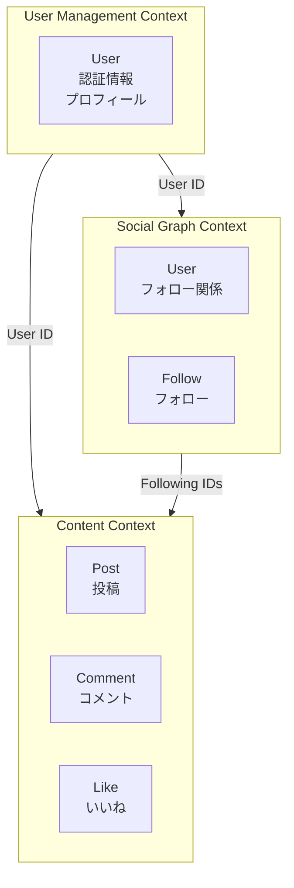

# 07. 境界づけられたコンテキスト - 大規模システムでの分割

## この章の学習目標

この章を読むことで、以下を理解できるようになります：

- 境界づけられたコンテキストの概念
- ソーシャルメディアでの複数のコンテキスト例
- コンテキストマップの描き方
- コンテキスト間の統合パターン

## 境界づけられたコンテキストとは

**境界づけられたコンテキスト（Bounded Context）**は、モデルが有効な明確な境界です。

### 定義

> **境界づけられたコンテキスト**は、特定のドメインモデルが有効な明確な境界です。異なるコンテキストでは、同じ用語でも意味が異なる場合があります。

### なぜ境界づけられたコンテキストが必要か

大規模なシステムでは、1つのモデルですべてを表現するのは困難です。異なるコンテキストで、同じ用語でも意味が異なる場合があります。

**例**: 「ユーザー」という用語は、以下のコンテキストで異なる意味を持ちます：

- **ユーザー管理コンテキスト**: 認証情報、プロフィール情報
- **投稿管理コンテキスト**: 投稿を作成したユーザー（IDのみ）
- **ソーシャルグラフコンテキスト**: フォロー関係を持つユーザー（IDとフォロー関係）

## ソーシャルメディアでの複数のコンテキスト

### コンテキスト1: User Management Context（ユーザー管理コンテキスト）

**責任**: ユーザーの認証、プロフィール管理

**モデル**:
- `User`: 認証情報、プロフィール情報
- `Email`: メールアドレス（認証用）
- `Password`: パスワード（認証用）

**例**:
```python
# User Management Context
class User:
    """ユーザー（認証情報、プロフィール情報）"""
    def __init__(self, user_id, email, password_hash, name, bio):
        self.user_id = user_id
        self.email = Email(email)
        self.password_hash = password_hash
        self.name = name
        self.bio = bio
    
    def authenticate(self, password):
        """認証"""
        return verify_password(password, self.password_hash)
    
    def update_profile(self, name, bio):
        """プロフィールを更新"""
        self.name = name
        self.bio = bio
```

### コンテキスト2: Content Context（投稿管理コンテキスト）

**責任**: 投稿の作成、管理

**モデル**:
- `Post`: 投稿（作成者IDのみ）
- `Comment`: コメント
- `Like`: いいね

**例**:
```python
# Content Context
class Post:
    """投稿（作成者IDのみ）"""
    def __init__(self, post_id, author_id, content):
        self.post_id = post_id
        self.author_id = author_id  # UserのIDのみ（Userオブジェクトではない）
        self.content = PostContent(content)
        self._comments = []
        self._likes = []
    
    def add_comment(self, comment):
        """コメントを追加"""
        self._comments.append(comment)
    
    def add_like(self, user_id):
        """いいねを追加"""
        if self.has_liked(user_id):
            raise ValueError("User has already liked this post")
        self._likes.append(Like(user_id))
```

### コンテキスト3: Social Graph Context（ソーシャルグラフコンテキスト）

**責任**: フォロー関係の管理

**モデル**:
- `User`: ユーザー（IDとフォロー関係のみ）
- `Follow`: フォロー関係

**例**:
```python
# Social Graph Context
class User:
    """ユーザー（フォロー関係のみ）"""
    def __init__(self, user_id):
        self.user_id = user_id
        self._following = set()  # フォローしているユーザーのID
        self._followers = set()   # フォロワーのID
    
    def follow(self, user_id):
        """ユーザーをフォロー"""
        if self.user_id == user_id:
            raise ValueError("Cannot follow yourself")
        self._following.add(user_id)
    
    def unfollow(self, user_id):
        """フォローを解除"""
        self._following.discard(user_id)
    
    def get_following(self):
        """フォローしているユーザーのIDを取得"""
        return list(self._following)
    
    def get_followers(self):
        """フォロワーのIDを取得"""
        return list(self._followers)
```

## コンテキストマップ

**コンテキストマップ**は、複数の境界づけられたコンテキストとその関係を可視化したものです。

### コンテキストマップの例



### コンテキスト間の関係

#### 1. Shared Kernel（共有カーネル）

**定義**: 複数のコンテキストで共有されるモデル

**例**: `UserID`（ユーザーID）は、すべてのコンテキストで共有される

```python
# Shared Kernel
class UserID:
    """ユーザーID（すべてのコンテキストで共有）"""
    def __init__(self, value):
        self.value = value
    
    def __eq__(self, other):
        return self.value == other.value
```

#### 2. Customer-Supplier（顧客-供給者）

**定義**: 一方のコンテキストが、もう一方のコンテキストに依存する

**例**: Content Contextは、User Management ContextからUser IDを取得する

```python
# Content Context（Customer）
class Post:
    def __init__(self, post_id, author_id, content):
        # User Management ContextからUser IDを取得
        self.author_id = author_id  # UserID（User Management Contextから）
        self.content = content
```

#### 3. Conformist（従順者）

**定義**: 一方のコンテキストが、もう一方のコンテキストのモデルに従う

**例**: Social Graph Contextは、User Management ContextのUser IDに従う

```python
# Social Graph Context（Conformist）
class User:
    def __init__(self, user_id):
        # User Management ContextのUser IDに従う
        self.user_id = user_id  # UserID（User Management Contextから）
```

## コンテキスト間の統合パターン

### パターン1: イベント駆動統合

**定義**: コンテキスト間でイベントを送信して統合する

**例**: User Management Contextでユーザーが作成されたら、Social Graph Contextにイベントを送信

```python
# User Management Context
class UserService:
    def create_user(self, email, password, name):
        """ユーザーを作成"""
        user = User(
            user_id=generate_id(),
            email=Email(email),
            password_hash=hash_password(password),
            name=name
        )
        self.user_repository.save(user)
        
        # イベントを発行
        event = UserCreatedEvent(user_id=user.user_id, name=user.name)
        self.event_publisher.publish(event)
        
        return user

# Social Graph Context
class UserEventHandler:
    def handle_user_created(self, event):
        """ユーザー作成イベントを処理"""
        # Social Graph Contextでユーザーを作成
        user = User(user_id=event.user_id)
        self.user_repository.save(user)
```

### パターン2: 共有データベース

**定義**: 複数のコンテキストで同じデータベースを使用する

**例**: User Management ContextとSocial Graph Contextで同じデータベースを使用

```python
# User Management Context
class UserRepository:
    def save(self, user):
        # 共有データベースに保存
        db.execute(
            "INSERT INTO users (id, email, password_hash, name) VALUES (?, ?, ?, ?)",
            user.user_id, user.email.value, user.password_hash, user.name
        )

# Social Graph Context
class UserRepository:
    def save(self, user):
        # 共有データベースに保存
        db.execute(
            "INSERT INTO user_social_graph (user_id) VALUES (?)",
            user.user_id
        )
```

**注意**: 共有データベースは、コンテキスト間の結合を強めるため、慎重に使用する必要があります。

### パターン3: API統合

**定義**: コンテキスト間でAPIを呼び出して統合する

**例**: Content Contextが、User Management ContextのAPIを呼び出してユーザー情報を取得

```python
# Content Context
class PostService:
    def __init__(self, post_repository, user_api_client):
        self.post_repository = post_repository
        self.user_api_client = user_api_client
    
    def get_post_with_author(self, post_id):
        """投稿と作成者情報を取得"""
        post = self.post_repository.find_by_id(post_id)
        
        # User Management ContextのAPIを呼び出し
        author = self.user_api_client.get_user(post.author_id)
        
        return {
            'post': post,
            'author': author
        }
```

## コンテキストの設計原則

### 原則1: コンテキストは明確な境界を持つ

**理由**: コンテキストの境界が曖昧だと、モデルが混乱します。

```python
# ✅ 良い例: コンテキストの境界が明確
# User Management Context
class User:
    """ユーザー（認証情報、プロフィール情報）"""
    pass

# Content Context
class Post:
    """投稿（作成者IDのみ）"""
    pass

# ❌ 悪い例: コンテキストの境界が曖昧
class User:
    """ユーザー（認証情報、プロフィール情報、フォロー関係、投稿）"""
    # 問題: 複数のコンテキストの責任が混在
    pass
```

### 原則2: コンテキスト間の統合は最小限に

**理由**: コンテキスト間の統合が多すぎると、結合が強くなり、変更が困難になります。

```python
# ✅ 良い例: コンテキスト間の統合は最小限
# User Management Context → Content Context: User IDのみ
post = Post(post_id="123", author_id="456", content="Hello")

# ❌ 悪い例: コンテキスト間の統合が多すぎる
# User Management Context → Content Context: Userオブジェクト全体
post = Post(post_id="123", author=user, content="Hello")
```

### 原則3: コンテキスト間の統合は明示的に

**理由**: コンテキスト間の統合が暗黙的だと、依存関係が不明確になります。

```python
# ✅ 良い例: コンテキスト間の統合は明示的
class PostService:
    def __init__(self, post_repository, user_api_client):
        # 明示的にUser Management ContextのAPIクライアントを注入
        self.post_repository = post_repository
        self.user_api_client = user_api_client

# ❌ 悪い例: コンテキスト間の統合が暗黙的
class PostService:
    def __init__(self, post_repository):
        # 暗黙的にUser Management Contextに依存
        self.post_repository = post_repository
        self.user_repository = UserRepository()  # 暗黙的な依存
```

## よくある間違い

### 間違い1: コンテキストの境界が曖昧

```python
# ❌ 悪い例: コンテキストの境界が曖昧
class User:
    """ユーザー（すべての責任を含む）"""
    def __init__(self, user_id, email, password_hash, name, following, posts):
        self.user_id = user_id
        self.email = email
        self.password_hash = password_hash
        self.name = name
        self.following = following  # Social Graph Contextの責任
        self.posts = posts          # Content Contextの責任
        # 問題: 複数のコンテキストの責任が混在

# ✅ 良い例: コンテキストの境界が明確
# User Management Context
class User:
    """ユーザー（認証情報、プロフィール情報のみ）"""
    def __init__(self, user_id, email, password_hash, name):
        self.user_id = user_id
        self.email = email
        self.password_hash = password_hash
        self.name = name
```

### 間違い2: コンテキスト間で直接オブジェクトを参照

```python
# ❌ 悪い例: コンテキスト間で直接オブジェクトを参照
# Content Context
class Post:
    def __init__(self, post_id, author, content):
        self.author = author  # User Management ContextのUserオブジェクトを直接参照
        # 問題: コンテキスト間の結合が強い

# ✅ 良い例: コンテキスト間の参照はIDで行う
# Content Context
class Post:
    def __init__(self, post_id, author_id, content):
        self.author_id = author_id  # User Management ContextのUser IDを参照
        # 良い: コンテキスト間の結合が弱い
```

### 間違い3: コンテキスト間の統合が多すぎる

```python
# ❌ 悪い例: コンテキスト間の統合が多すぎる
class PostService:
    def get_post_with_author(self, post_id):
        post = self.post_repository.find_by_id(post_id)
        author = self.user_api_client.get_user(post.author_id)
        author_posts = self.post_repository.find_by_author_id(post.author_id)
        author_followers = self.social_graph_api_client.get_followers(post.author_id)
        # 問題: 複数のコンテキストに依存しすぎる
        
        return {
            'post': post,
            'author': author,
            'author_posts': author_posts,
            'author_followers': author_followers
        }

# ✅ 良い例: コンテキスト間の統合は最小限に
class PostService:
    def get_post(self, post_id):
        post = self.post_repository.find_by_id(post_id)
        return post
    
    def get_author(self, user_id):
        author = self.user_api_client.get_user(user_id)
        return author
```

## まとめ

- **境界づけられたコンテキスト**は、モデルが有効な明確な境界
- **異なるコンテキスト**では、同じ用語でも意味が異なる場合がある
- **コンテキストマップ**は、複数のコンテキストとその関係を可視化
- **コンテキスト間の統合**は、イベント駆動、共有データベース、API統合などのパターンを使用
- **コンテキストは明確な境界**を持ち、**統合は最小限**に保つ

## 考えてみよう

1. あなたのプロジェクトで、境界づけられたコンテキストを設計したことはありますか？
2. コンテキストの境界が曖昧な箇所はありますか？
3. コンテキスト間の統合が多すぎる箇所はありますか？

次の章では、**実装例**を通じて、これまで学んだ概念を統合します。

