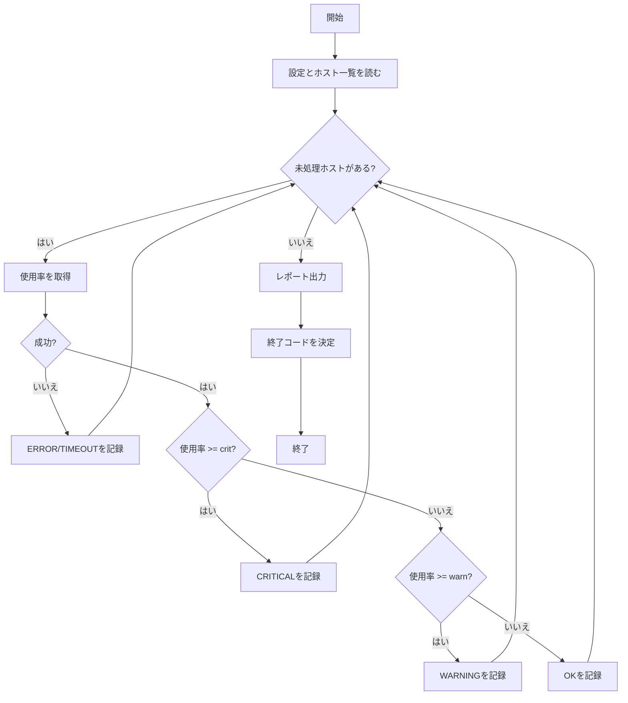

# 第2章 問題分解とアルゴリズム

## 学習目標

この章を終えると、次ができるようになる。

- 運用課題を入力・処理・出力に分解し、要件として書き出せる
- 疑似コードと簡単なフローで、実装前に手順を固定できる
- 条件分岐、反復、状態、関数を使って処理を分割できる
- エッジケースと失敗時挙動を、正常系より先に決められる
- 計算量の感覚で、ホスト数やファイルサイズに耐える設計を選べる

前提: 第1章の標準入出力、終了コード、引数、環境変数を理解していること。

---

## 基本概念

**問題分解**は、運用課題を入力・処理・出力・失敗時・再実行性へ分割し、実装可能な単位に落とすことである。

**アルゴリズム**は、その単位を、条件分岐と反復と状態更新の手順として表したものである。

コードを書く前に、疑似コードまたはフローで失敗経路を先に固定する。

---

## 2.1 入力、処理、出力

あらゆる自動化は、次の三段に落とせる。

1. **入力**: いま手元にある事実と設定
2. **処理**: 入力を変換・判定・副作用付き操作する手順
3. **出力**: 残すべき結果（ファイル、終了コード、通知）

例: 「証明書の期限が30日以内のホストを報告する」

| 段 | 具体例 |
|----|--------|
| 入力 | ホスト一覧、接続方法、閾値日数、現在日時 |
| 処理 | 各ホストの証明書を取得し、残日数を計算し、閾値と比較 |
| 出力 | CSVレポート、標準エラーの要約、終了コード |

入力が曖昧なまま実装に入ると、境界（閾値ちょうど、取得失敗、時計ずれ）で毎回議論が起きる。先に入出力を表に書く。

---

## 2.2 要件の整理

要件は「やりたいこと」の感想ではない。検証可能な文にする。

悪い要件:

> ディスクがいっぱいになったらなんとかする。

良い要件:

1. 対象は `config/hosts.txt` のホストとする
2. ルートファイルシステムの使用率が警告80%、重大90%とする
3. 重大が1台でもあれば終了コード3、取得失敗のみなら終了コード2とする
4. 結果は `reports/disk-YYYYMMDD-HHMMSS.csv` に書く
5. 既定は観察のみとし、削除や拡張は行わない

要件を次の観点で点検する。

- **完了条件**: いつ終わりか
- **対象範囲**: 何を含み、何を含まないか
- **非機能**: タイムアウト、同時実行数、権限
- **失敗時**: 部分失敗を成功と呼ぶか
- **再実行**: 二度目で何が起きるか
- **監査**: 誰がいつ何をしたか残るか

---

## 2.3 処理の分割

大きな処理を、一度に理解できる単位へ割る。

分割の目安:

- 一つの関数が一つの理由で変わる
- 名前を読んで入出力が想像できる
- テストで単独に假の入力を渡せる

ディスク監視の分割例:

```text
load_config()
load_hosts()
for host in hosts:
  usage = fetch_disk_usage(host)   # 外部I/O
  level = classify(usage, thresholds)  # 純粋な判定
  append_result(results, host, usage, level)
write_report(results)
exit_code = summarize(results)
```

`classify` はネットワークに依存しない。単体テストしやすい。

`fetch_disk_usage` は失敗しやすい。タイムアウトと例外方針をここに閉じ込める。

---

## 2.4 疑似コード

**疑似コード**は、特定言語の文法に縛られず手順を書くための表記である。実装前の設計メモとして使う。

```text
function check_disks(hosts_file, warn, crit, timeout):
  hosts = load_hosts(hosts_file)
  results = empty list
  for host in hosts:
    try:
      usage = get_usage(host, timeout)
      if usage >= crit:
        status = CRITICAL
      else if usage >= warn:
        status = WARNING
      else:
        status = OK
      append(results, host, usage, status)
    catch Timeout:
      append(results, host, null, TIMEOUT)
    catch Error as e:
      append(results, host, null, ERROR(e))
  write_csv(results)
  if any status is CRITICAL:
    return 3
  if any status is TIMEOUT or ERROR:
    return 2
  if any status is WARNING:
    return 0   # 警告はログに残し、監視重要度は運用方針で決める
  return 0
```

疑似コードの段階で、WARNINGを終了コード0にするか非0にするかを決める。実装後に変えると、監視の閾値定義が壊れる。

---

## 2.5 フローチャート

分岐と反復が多い処理は、図にすると抜け漏れが見える。

本書では Mermaid で表す。



図は詳細実装の代替ではない。異常系の箱が欠けていないかを見るために使う。

---

## 2.6 条件分岐

**条件分岐**は、述語（真偽）に応じて経路を分けることである。

三言語の最小例（閾値判定）:

Python:

```python
def classify(usage: float, warn: float, crit: float) -> str:
    if usage >= crit:
        return "CRITICAL"
    if usage >= warn:
        return "WARNING"
    return "OK"
```

Bash:

```bash
classify() {
  local usage="$1" warn="$2" crit="$3"
  if (( $(echo "${usage} >= ${crit}" | bc -l) )); then
    echo CRITICAL
  elif (( $(echo "${usage} >= ${warn}" | bc -l) )); then
    echo WARNING
  else
    echo OK
  fi
}
```

小数比較はBash単体では弱い。整数パーセントに丸めるか、Python/PowerShellへ寄せる判断が実務では多い。

PowerShell:

```powershell
function Classify {
    param([double]$Usage, [double]$Warn, [double]$Crit)
    if ($Usage -ge $Crit) { return 'CRITICAL' }
    if ($Usage -ge $Warn) { return 'WARNING' }
    return 'OK'
}
```

分岐を深くしない。異常を先に返す方法は第4章で扱う。

---

## 2.7 反復処理

**反復**は、同じ手順を要素ごとに繰り返すことである。

ホスト一覧、ログ行、ページネーションのページが典型である。

注意点:

1. 無限ループの抜け条件を明示する
2. 1件失敗で全体を止めるか、集計して続けるかを先に決める
3. 並列化するなら、同時実行数とタイムアウトを制限する

### 悪いコード（1件失敗で黙って継続、終了コード常に0）

```python
def check_all(hosts):
    for host in hosts:
        try:
            print(get_usage(host))
        except Exception:
            pass
    return 0
```

問題点:

- 失敗が消える
- 呼び出し側が成功と誤解する
- どのホストが失敗したか残らない

### 改善後

```python
from __future__ import annotations

from dataclasses import dataclass


@dataclass
class HostResult:
    host: str
    usage: float | None
    status: str
    error: str | None = None


def check_all(hosts: list[str], warn: float, crit: float, fetch) -> tuple[list[HostResult], int]:
    results: list[HostResult] = []
    for host in hosts:
        try:
            usage = fetch(host)
            status = classify(usage, warn, crit)
            results.append(HostResult(host, usage, status))
        except TimeoutError as exc:
            results.append(HostResult(host, None, "TIMEOUT", str(exc))
            )
        except OSError as exc:
            results.append(HostResult(host, None, "ERROR", str(exc)))

    if any(r.status == "CRITICAL" for r in results):
        return results, 3
    if any(r.status in {"TIMEOUT", "ERROR"} for r in results):
        return results, 2
    return results, 0


def classify(usage: float, warn: float, crit: float) -> str:
    if usage >= crit:
        return "CRITICAL"
    if usage >= warn:
        return "WARNING"
    return "OK"
```

---

## 2.8 状態

**状態**は、処理の途中結果として保持している情報である。

スクリプトでよく出る状態:

- 累積カウンタ（成功数、失敗数）
- いま開いているファイルハンドル
- dry-runかどうか
- 既にバックアップ済みか

状態が多いほど、再実行時の挙動が読みにくい。可能なら、状態を「入力ファイルと引数から再現できる値」に寄せる。

例: 「削除済みファイル一覧」をメモリだけに持つのではなく、`work/cleanup-runid.done` に追記する。再実行時に済みをスキップできる。

```text
for file in candidates:
  if file in done_set:
    skip
  else if dry_run:
    log would_delete
  else:
    delete file
    append file to done_set file
```

これが再実行性の基本形である。

---

## 2.9 関数と再利用

関数にする判断:

- 同じコードが二箇所以上に現れそう
- 名前を付けた方が、読者が段落を飛ばせる
- 単体でテストしたい

再利用の単位:

| 単位 | 例 |
|------|-----|
| 関数 | `load_hosts`, `classify` |
| モジュール | ホスト読み込み、ログ初期化 |
| コマンド | `opsctl disk-check` |

まだ一度しか使わない処理でも、入出力が明確なら関数にしてよい。長さの削減より、読解単位の分割が目的である。

---

## 2.10 計算量の基礎

インフラスクリプトでも、入力サイズで実行時間が変わる。

目安:

- ホスト数 N に比例してSSHする → おおよそ O(N)
- 各ホストでファイル M 個を見る → O(N×M)
- 二重ループで全ホスト同士を比較 → O(N²) になりやすい

感覚の使い方:

1. N=10で1秒なら、N=1000で単純比例なら100秒
2. 直列SSHが遅いなら、同時実行数を制限した並列を検討する
3. 巨大ログを全部 `read()` でメモリに載せない（第6章）

厳密な漸近評価より、「入力が10倍になったとき何が壊れるか」を先に書く。

---

## 2.11 エッジケース

**エッジケース**は、境界や例外的な入力で起きる事態である。

ディスク監視の例:

| ケース | 期待挙動 |
|--------|----------|
| ホスト一覧が空 | 終了コード1（設定誤り） |
| 使用率ちょうど80.0 | WARNING（`>=` と決めたなら） |
| 使用率100 | CRITICAL |
| ホスト名に空白 | 読み込み時点で拒否 |
| 1台だけタイムアウト | 記録し、他は継続。終了コード2 |
| 時計が大きくずれている | 証明書用途では別問題。本章ではディスクでは影響小 |
| dry-run | 取得は行うか、行わないかを仕様で固定 |

境界値はテストに必ず入れる（第13章）。

---

## 2.12 失敗時の挙動

失敗時設計は、正常系より先に決める。

決める項目:

1. **検出**: 何をもって失敗とするか（終了コード、例外、NULL）
2. **記録**: どこに何を残すか（stderr、ログ、レポート列）
3. **継続**: 次の要素を続けるか、中断するか
4. **復帰**: ロールバックするか、人手に渡すか
5. **終了コード**: 監視がどう解釈するか

### 実務向けサンプル: ホスト疎通の設計から実装

要件:

- 入力: ホスト一覧、1ホストあたりのタイムアウト秒
- 処理: 各ホストへ ICMP 相当の疎通（環境により `ping`）
- 出力: CSV（host,ok,detail）、終了コード
- 失敗: 不通でも継続。1台でも不通なら終了コード2
- dry-run: 実際のpingはせず、実行予定だけをstderrへ出す

> **注意**: ICMPが制限された環境では失敗が増える。本番ではTCPポート確認など別手法を選ぶ。以下は学習用である。

Python実装（実行可能）:

```python
#!/usr/bin/env python3
from __future__ import annotations

import argparse
import csv
import logging
import platform
import subprocess
import sys
import time
from pathlib import Path

EXIT_OK = 0
EXIT_USAGE = 1
EXIT_RUNTIME = 2
EXIT_TIMEOUT = 4

logger = logging.getLogger("ping_check")


def parse_args(argv: list[str]) -> argparse.Namespace:
    parser = argparse.ArgumentParser(description="Ping hosts from a list file")
    parser.add_argument("--hosts-file", type=Path, required=True)
    parser.add_argument("--timeout", type=int, default=3)
    parser.add_argument("--report", type=Path, required=True)
    parser.add_argument("--dry-run", action="store_true")
    parser.add_argument("--verbose", action="store_true")
    return parser.parse_args(argv)


def load_hosts(path: Path) -> list[str]:
    if not path.is_file():
        raise FileNotFoundError(f"hosts file not found: {path}")
    hosts: list[str] = []
    for line_no, raw in enumerate(path.read_text(encoding="utf-8").splitlines(), start=1):
        line = raw.strip()
        if not line or line.startswith("#"):
            continue
        if any(ch.isspace() for ch in line):
            raise ValueError(f"invalid host at line {line_no}")
        hosts.append(line)
    if not hosts:
        raise ValueError("hosts file is empty")
    return hosts


def ping_host(host: str, timeout: int) -> tuple[bool, str]:
    system = platform.system().lower()
    if system == "windows":
        cmd = ["ping", "-n", "1", "-w", str(timeout * 1000), host]
    else:
        cmd = ["ping", "-c", "1", "-W", str(timeout), host]

    try:
        completed = subprocess.run(
            cmd,
            capture_output=True,
            text=True,
            timeout=timeout + 2,
            check=False,
        )
    except subprocess.TimeoutExpired:
        return False, "ping process timeout"
    except FileNotFoundError:
        return False, "ping command not found"

    if completed.returncode == 0:
        return True, "ok"
    detail = (completed.stderr or completed.stdout or "ping failed").strip().splitlines()
    return False, detail[0] if detail else "ping failed"


def main(argv: list[str] | None = None) -> int:
    args = parse_args(argv if argv is not None else sys.argv[1:])
    logging.basicConfig(
        level=logging.DEBUG if args.verbose else logging.INFO,
        format="%(asctime)s %(levelname)s %(message)s",
        stream=sys.stderr,
    )

    if args.timeout <= 0:
        logger.error("--timeout must be positive")
        return EXIT_USAGE

    try:
        hosts = load_hosts(args.hosts_file)
    except (OSError, ValueError) as exc:
        logger.error("%s", exc)
        return EXIT_USAGE

    args.report.parent.mkdir(parents=True, exist_ok=True)
    rows: list[dict[str, str]] = []
    failures = 0

    for host in hosts:
        if args.dry_run:
            logger.info("dry-run: would ping %s timeout=%s", host, args.timeout)
            rows.append({"host": host, "ok": "dry-run", "detail": "skipped"})
            continue

        started = time.monotonic()
        ok, detail = ping_host(host, args.timeout)
        elapsed_ms = int((time.monotonic() - started) * 1000)
        logger.info("host=%s ok=%s elapsed_ms=%s detail=%s", host, ok, elapsed_ms, detail)
        rows.append({"host": host, "ok": "true" if ok else "false", "detail": detail})
        if not ok:
            failures += 1

    with args.report.open("w", encoding="utf-8", newline="") as fh:
        writer = csv.DictWriter(fh, fieldnames=["host", "ok", "detail"])
        writer.writeheader()
        writer.writerows(rows)

    if args.dry_run:
        return EXIT_OK
    return EXIT_OK if failures == 0 else EXIT_RUNTIME


if __name__ == "__main__":
    sys.exit(main())
```

実行例:

```bash
python3 samples/python/02_ping_check.py \
  --hosts-file config/hosts.txt \
  --report reports/ping-dry.csv \
  --dry-run --verbose
```

```bash
python3 samples/python/02_ping_check.py \
  --hosts-file config/hosts.txt \
  --timeout 2 \
  --report reports/ping.csv
echo $?
```

想定失敗例:

- ホストファイルなし → 終了コード1
- 実在しないホストのみ → 終了コード2、CSVに false
- `ping` が無いコンテナ → detail に command not found

Bash版の骨子（疎通確認はBashが得意な糊付け）:

```bash
#!/usr/bin/env bash
set -euo pipefail

hosts_file=""
timeout=3
report=""
dry_run=0

usage() {
  echo "Usage: $0 --hosts-file PATH --report PATH [--timeout N] [--dry-run]" >&2
}

while [[ $# -gt 0 ]]; do
  case "$1" in
    --hosts-file) hosts_file="${2:-}"; shift 2 ;;
    --report) report="${2:-}"; shift 2 ;;
    --timeout) timeout="${2:-}"; shift 2 ;;
    --dry-run) dry_run=1; shift ;;
    -h|--help) usage; exit 0 ;;
    *) echo "unknown: $1" >&2; usage; exit 1 ;;
  esac
done

[[ -n "${hosts_file}" && -n "${report}" ]] || { usage; exit 1; }
[[ -f "${hosts_file}" ]] || { echo "missing hosts file" >&2; exit 1; }
mkdir -p "$(dirname "${report}")"
echo "host,ok,detail" > "${report}"

failures=0
while IFS= read -r raw || [[ -n "${raw}" ]]; do
  line="${raw#"${raw%%[![:space:]]*}"}"
  line="${line%"${line##*[![:space:]]}"}"
  [[ -z "${line}" || "${line}" == \#* ]] && continue
  if [[ "${dry_run}" -eq 1 ]]; then
    echo "dry-run: would ping ${line}" >&2
    echo "${line},dry-run,skipped" >> "${report}"
    continue
  fi
  if ping -c 1 -W "${timeout}" "${line}" >/dev/null 2>&1; then
    echo "${line},true,ok" >> "${report}"
  else
    echo "${line},false,ping failed" >> "${report}"
    failures=$((failures + 1))
  fi
done < "${hosts_file}"

if [[ "${dry_run}" -eq 1 ]]; then
  exit 0
fi
[[ "${failures}" -eq 0 ]]
```

macOSの `ping -W` は単位がミリ秒の場合がある。OS差は第7章と第15章で明示する。上記BashはLinux想定とし、macOSでは Python版を優先する。

---

## 2.13 セキュリティ上の注意点

- ホスト名をシェルに未引用で渡さない
- 利用者供給のホスト一覧を、そのまま `eval` や `Invoke-Expression` に渡さない
- dry-runでも、認証情報をログに出さない
- レポートにIPやホスト名は出てよいが、認証トークンは出さない

---

## 2.14 テスト方法

純粋関数 `classify` からテストする。

```python
import pytest

from samples.python.ping_lib import classify  # 分割後の想定


@pytest.mark.parametrize(
    ("usage", "expected"),
    [
        (79.9, "OK"),
        (80.0, "WARNING"),
        (90.0, "CRITICAL"),
        (100.0, "CRITICAL"),
    ],
)
def test_classify(usage: float, expected: str) -> None:
    assert classify(usage, warn=80.0, crit=90.0) == expected
```

I/Oはモックする。

```python
def test_check_all_partial_failure():
    def fetch(host: str) -> float:
        if host == "bad":
            raise TimeoutError("timeout")
        return 10.0

    results, code = check_all(["good", "bad"], 80, 90, fetch)
    assert code == 2
    assert results[1].status == "TIMEOUT"
```

---

## 章末問題

### 問題1

「古いログを消す」作業について、要件を検証可能な文で5つ書け。dry-runと再実行性を含めること。

### 問題2

次の疑似コードの欠陥を指摘せよ。

```text
for host in hosts:
  restart_service(host)
print("done")
exit 0
```

### 問題3

ホスト100台へ直列で、1台30秒タイムアウトのAPIを叩く最悪時間を見積もれ。緩和策を二つ書け。

### 問題4

空のホスト一覧を成功（終了コード0）にする運用と、設定誤り（終了コード1）にする運用の、それぞれの向き先を述べよ。

### 問題5

状態をファイルに残す再実行設計と、毎回フルスキャンする設計の長所短所を比較せよ。

---

## 解答と解説

### 問題1（例）

1. 対象は `/var/log/myapp/` 配下の `*.log` のみ
2. 最終更新が30日超のファイルを候補とする
3. `--dry-run` では削除せず候補をstdoutへCSV出力する
4. 本番実行では削除前にパスを `work/cleanup.log` へ追記する
5. 既に追記済みのパスはスキップする（再実行安全）

### 問題2

- 失敗しても終了コード0
- dry-runも確認もない破壊的操作
- 部分失敗の記録がない
- タイムアウトがない

### 問題3

最悪 100×30秒 = 3000秒。緩和: 同時実行数制限付き並列、タイムアウト短縮、キャッシュ、失敗の早期打ち切り方針。

### 問題4

成功扱いは「対象ゼロが正常な日もある」定期ジョブ向き。誤り扱いは「一覧必須」な手動/設定必須ジョブ向き。`opsctl` では空一覧を終了コード1とする。

### 問題5

状態ファイル方式は再実行が速いが状態破損に弱い。フルスキャンは実装が単純で遅い。削除系は状態追記、照会系はフルスキャンが無難なことが多い。

---

## 実装演習

### 演習A

証明書残日数判定の純粋関数を疑似コードで書き、境界（0日、30日、31日）の期待値表を作れ。

### 演習B

第1章の `count_hosts` を拡張し、重複ホストを検出して終了コード2にする。重複一覧はstderrへ出す。

### 演習C

`02_ping_check.py` を実行し、dry-runと本番相当（ラボネットワーク）のレポート差を観察せよ。本番ネットワークへの無計画な大量pingは行わないこと。

---

## 次章予告

第3章では、三言語のデータ型とJSON/CSV/YAMLを比較し、型と文字コードの差で起きる運用事故を防ぐ。
