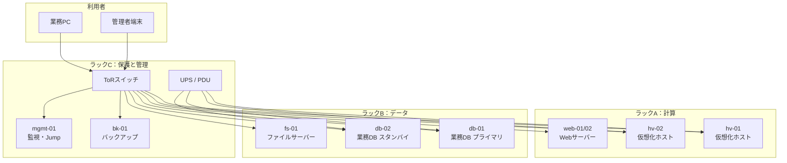

# ITインフラエンジニアのためのハードウェア基礎・実務解説書

## 本書の目的

本書は、コンピューターハードウェアの構成要素と動作原理を理解し、用途に応じた機器選定、性能見積もり、冗長化設計、障害切り分け、交換作業を行える状態になることを目的とする。

製品名やスペック表の暗記ではなく、各部品がシステム性能、信頼性、保守性、消費電力、コストにどのような影響を与えるかを説明する。

製品固有の仕様は世代や時期によって変わる。本書の数値例は理解のための目安であり、調達時は必ず現行のデータシートを確認すること。

## 想定読者

- インフラエンジニアを目指す初学者
- サーバーやPCの内部構造を体系的に理解したい人
- ハードウェア選定や障害対応を担当する人
- 仮想化基盤やクラウドの物理基盤を理解したい人

## 読み方

第1章で全体像を掴み、第2章から第12章で部品単位の知識を積む。

第13章と第14章で選定と障害対応に統合する。

実務シナリオは、章で得た知識をトレードオフ判断に落とすための演習である。

---

## 詳細目次

各章は共通して、学習目標、部品または技術の役割、動作原理、主要な性能指標、他の部品との関係、選定基準、構成例、よくある誤解、代表的な障害、調査・交換時の注意点、章末問題、解答と解説、実務演習という構成を取る。

以下は各章の「動作原理」で扱う主要トピックの一覧である。

### 第1章 コンピューターハードウェアの全体像

基本構成とデータパスの考え方、入力/処理/記憶/出力、マザーボード、バス(PCI Express等)、チップセット、ファームウェア(BIOS/UEFI)、PCとサーバーの違い、物理サーバーとクラウド基盤の関係

### 第2章 CPU

CPUの役割と命令実行の流れ、クロック周波数、IPC、コアとスレッド、SMT、キャッシュ階層、CPUソケットとマルチソケット構成、NUMA、TDPと消費電力、x86-64とARM、仮想化支援機能、単一の数値で比較できない理由(ボトルネックの見分け方は障害節で扱う)

### 第3章 メモリ

RAMとDRAMの役割、DIMM、DDR世代、容量・速度・レイテンシ、メモリチャネル、ECC、Registered DIMM(RDIMM/LRDIMM)、メモリランク、NUMAとの関係、増設ルール(メモリエラーの解釈と、容量不足との違いは障害節で扱う)

### 第4章 ストレージデバイス

HDD、フラッシュメモリ、SATA SSD、NVMe SSD、IOPS、スループット、レイテンシ、シーケンシャルとランダム、書き込み耐久性(TBW、DWPD)、S.M.A.R.T.、ホットスワップ(選定基準と障害兆候は各節で扱う)

### 第5章 RAIDとストレージ構成

ストライピング、ミラーリング、パリティ、RAID 0/1/5/6/10の実効容量・障害耐性・性能比較、リビルド、RAIDコントローラー(ハードウェアRAID/ソフトウェアRAID)、キャッシュとBBU、ホットスペア(バックアップとの違い、大容量ディスクのリビルドリスクは各節で扱う)

### 第6章 マザーボードと拡張インターフェース

6.1 マザーボード構成、ソケット、メモリスロット
6.2 PCI Express、レーン数、拡張カード
6.3 NIC、HBA、RAIDカード、GPU
6.4 USB、SATA、M.2、U.2、U.3
6.5 帯域不足の考え方
6.6 章末問題、実務演習

### 第7章 ネットワークインターフェース

7.1 NIC、Ethernet、速度、全二重、オートネゴシエーション
7.2 RJ45、光トランシーバー、SFP系、DAC、AOC
7.3 チーミング、オフロード、SR-IOV、MACアドレス
7.4 リンク障害の調査
7.5 章末問題、実務演習

### 第8章 電源と冷却

8.1 PSU、定格、効率、80 PLUS、冗長電源
8.2 電源容量見積もり、UPS、PDU、突入電流
8.3 ファン、ヒートシンク、エアフロー、温度管理
8.4 サーマルスロットリング、高温障害、冗長化
8.5 章末問題、実務演習

### 第9章 シャーシ、ラック、データセンター設備

9.1 タワー、ラック、ブレード、ラックユニット
9.2 搭載、重量、奥行き、ケーブル管理、電源設計
9.3 冷却、ホットアイルとコールドアイル
9.4 接地、入退室、火災、地震、資産管理
9.5 章末問題、実務演習

### 第10章 BIOS、UEFI、ファームウェア

10.1 BIOSとUEFI、POST、ブート順序
10.2 Secure Boot、TPM、ファームウェア更新
10.3 BMC、IPMI、Redfish、リモートコンソール
10.4 ハードウェア監視と更新リスク
10.5 章末問題、実務演習

### 第11章 GPUとアクセラレーター

11.1 GPUの基本、CPUとの違い、VRAM
11.2 GPGPU、AI、映像処理
11.3 PCIe帯域、消費電力、冷却
11.4 GPU仮想化の概要と選定
11.5 章末問題、実務演習

### 第12章 周辺機器と入出力装置

12.1 ディスプレイ、キーボード、マウス、KVM
12.2 USB機器、プリンター、外付けストレージ
12.3 シリアルコンソール、管理用途の周辺機器
12.4 章末問題、実務演習

### 第13章 ハードウェア選定とサイジング

13.1 ワークロードから見る選定観点
13.2 Web、DB、仮想化、バックアップの構成例
13.3 将来拡張、冗長性、保守、ライフサイクル
13.4 章末問題、実務演習

### 第14章 障害診断と保守

14.1 起動系、メモリ、ディスク、RAID、NICの切り分け
14.2 電源、ファン、温度、性能劣化、間欠障害
14.3 ログとLED、交換手順、静電気対策、記録
14.4 章末問題、実務演習

### 実務シナリオ集

S1 仮想マシン20台の物理サーバー選定
S2 業務データベース用サーバー設計
S3 RAID構成の比較選定
S4 冗長電源とUPS設計
S5 ラック搭載計画
S6 ディスク障害時の交換手順
S7 CPU、メモリ、ストレージのボトルネック調査

---

## 各章の到達目標

| 章 | 到達目標 |
|---|---|
| 第1章 | コンピューターをデータパスの集合として説明し、PCとサーバー、クラウド物理基盤の違いを述べられる |
| 第2章 | CPUの性能指標を分解し、単一ベンチマークに頼らず選定とボトルネック判断ができる |
| 第3章 | メモリ構成の互換性と冗長・容量設計を行い、ECCエラーを正しく解釈できる |
| 第4章 | IOPS、スループット、耐久性からストレージを選定し、障害兆候を検知できる |
| 第5章 | RAIDレベルを用途とリスクで比較し、バックアップとの違いを説明できる |
| 第6章 | PCIeレーンと拡張カードの帯域制約を見積もれる |
| 第7章 | NICとトランシーバーを選定し、リンク障害を物理から論理へ切り分けられる |
| 第8章 | 電源容量と冷却を見積もり、冗長化と温度異常の影響を説明できる |
| 第9章 | ラック搭載計画を重量、電源、冷却、運用の観点で作成できる |
| 第10章 | BMC経由の監視とファームウェア更新のリスク管理ができる |
| 第11章 | GPUの電力・帯域・冷却制約を踏まえて選定できる |
| 第12章 | 管理用周辺機器を障害対応の動線に組み込める |
| 第13章 | ワークロードから構成案を作り、トレードオフを明示できる |
| 第14章 | 症状から部品単位の切り分け手順を実行できる |

---

## 全体を通じて使用する仮想システム構成

本書では、架空の中規模企業「北風商事」のオンプレミス基盤を一貫して使う。

製品世代や価格は時期によって変わるため、数値は学習用の仮置きである。

### 組織と要件

- 従業員：約800名
- 主要システム：社内ポータル、販売管理DB、ファイルサーバー、仮想化基盤、バックアップ
- SLA：業務時間帯の計画停止は月1回まで、重大障害の目標復旧時間は4時間以内
- 設置場所：自社サーバールーム（ラック6本、冷却はコールドアイル方式）

### 仮想構成図

### 主要ホストの仮スペック

#### hv-01 / hv-02（仮想化ホスト）

- CPU：2ソケット × 16コア（SMT有効で論理32スレッド/ソケット）
- メモリ：512 GiB DDR5 ECC RDIMM、8チャネル構成
- ストレージ：OS用 NVMe 1.92 TB × 2（ミラー）、データ用は共有ストレージまたはローカルRAID
- NIC：25 GbE × 2（チーミング）、管理用 1 GbE × 1
- 電源：800 W 冗長（1+1）
- 用途：仮想マシン約20台/ホストを想定した設計演習の基準機

#### db-01 / db-02（業務データベース）

- CPU：2ソケット × 24コア
- メモリ：256 GiB ECC RDIMM
- ストレージ：NVMe 3.84 TB × 4（RAID 10）、WAL用分離も検討
- NIC：10 GbE × 2
- 電源：1200 W 冗長（1+1）
- 用途：低レイテンシと可用性を優先する設計例

#### web-01 / web-02（Webサーバー）

- CPU：1ソケット × 8コア
- メモリ：64 GiB ECC
- ストレージ：SATA SSD 960 GB × 2（RAID 1）
- NIC：10 GbE × 2
- 電源：単一または冗長は要件次第

#### bk-01（バックアップ）

- CPU：1ソケット × 12コア
- メモリ：128 GiB
- ストレージ：大容量 HDD RAID 6、またはオブジェクトストレージ連携
- NIC：10 GbE × 2（バックアップ窓の帯域確保）

#### mgmt-01（監視・Jumpホスト）

- CPU：1ソケット × 4コア
- メモリ：32 GiB
- ストレージ：SSD 480 GB × 2（RAID 1）
- 役割：BMC集約、監視、作業用踏み台

### 命名と単位の約束

- 容量表記：ストレージメーカー表記の TB（10^12バイト）と、OSで見える TiB（2^40バイト）を区別する
- メモリ：GiB を基本とする
- ネットワーク：理論帯域と実効帯域を区別する
- 「カタログ値」と「実測値」を混同しない

### 安全上の共通注意

- 電源投入中の内部作業は原則禁止とする
- ホットスワップ対応部品以外は、手順書と保守契約に従う
- 静電気対策（リストストラップ、作業マット）を実施する
- 重量物のラック搭載は二人以上で行う
- 高電圧、バッテリー、冷却液、レーザー光モジュールの取り扱いは製品手順に従う

---

## ファイル構成

| ファイル | 内容 |
|---|---|
| `00_overview.md` | 目次、到達目標、仮想構成（本ファイル） |
| `01_computer_hardware_overview.md` | 第1章 |
| `02_cpu.md` | 第2章 |
| `03_memory.md` | 第3章 |
| `04_storage_devices.md` | 第4章 |
| `05_raid.md` | 第5章 |
| `06_motherboard_interfaces.md` | 第6章 |
| `07_network_interface.md` | 第7章 |
| `08_power_cooling.md` | 第8章 |
| `09_chassis_rack_datacenter.md` | 第9章 |
| `10_firmware_bmc.md` | 第10章 |
| `11_gpu_accelerators.md` | 第11章 |
| `12_peripherals.md` | 第12章 |
| `13_sizing_selection.md` | 第13章 |
| `14_troubleshooting_maintenance.md` | 第14章 |
| `15_practical_scenarios.md` | 実務シナリオ集 |
| `README.md` | 案内 |

次章から、第1章を順に展開する。
