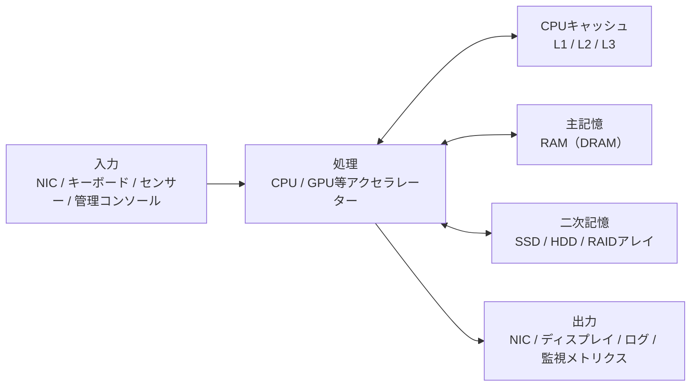

# 第1章 コンピューターハードウェアの全体像

## 学習目標

- コンピューターを入力、処理、記憶、出力というデータの流れとして説明できる。

- マザーボード、バス、チップセット、ファームウェアの役割を、相互の依存関係とともに説明できる。

- 民生用PCとエンタープライズサーバーの違いを、単純な性能比較ではなく信頼性、保守性、運用性の観点から述べられる。

- クラウドサービスと物理サーバーの関係を、責任分界点と障害の抽象化の限界という観点で理解できる。

- 部品単体のスペックではなく、システム全体のどこが制約になっているかを考える視点を持てる。

## 1.1 部品または技術の役割

コンピューターとは、データを受け取り、加工し、保持し、外部へ返す装置である。

この定義は、スマートフォンから大規模なデータセンターのサーバーまで共通する。

インフラエンジニアが日常的に扱うハードウェアは、この一連の流れを止めずに、かつ安定して繰り返すために組み合わされた部品の集合体である。

ソフトウェアエンジニアがアルゴリズムやコードの正しさを主な関心事にするのに対し、インフラエンジニアは「そのコードが実際にどの物理資源の上で、どれだけの速さで、どれだけ壊れずに動くか」を主な関心事にする。

単体の部品が速いかどうかだけでなく、その部品が止まったときにサービス全体がどうなるか、壊れた部品をどれだけ短時間で交換できるか、消費する電力と発する熱をどう管理するかが設計対象になる。

本章では、コンピューターというシステムを構成する骨格を先に押さえる。

第2章以降で扱うCPU、メモリ、ストレージ、RAID、ネットワーク、電源、冷却、筐体、ファームウェアは、すべてこの骨格の上に位置づけられる部品である。

骨格を理解しないまま個々の部品スペックだけを暗記すると、実際の障害対応や選定の場面で「なぜその部品がボトルネックになるのか」を説明できなくなる。

本章で押さえる中核概念は次のとおりである。

- **マザーボード**: 部品同士を電気的、論理的に接続する基板

- **バス**: データと制御信号が流れる通り道

- **チップセット**: CPUと周辺デバイスの間の入出力を制御する回路群

- **ファームウェア**: 電源投入直後からOSが起動するまでの間、ハードウェアを直接制御する低レベルのソフトウェア

- **PCとサーバーの違い**: 用途に応じて何を優先して設計しているかという思想の違い

- **物理サーバーとクラウド基盤の関係**: 誰がどの層の運用責任を負うかという境界線の違い

これらは独立した部品ではなく、互いに依存し合う一つのシステムとして機能する。

以降の節で、それぞれを個別に、そして相互の関係とともに解説する。

## 1.2 動作原理

### 1.2.1 コンピューターの基本構成

コンピューターの構造を説明する古典的なモデルとして、**フォンノイマン型アーキテクチャ**がある。

これは、演算を行う処理装置、プログラムとデータを保持する主記憶、そして外部とやり取りする入出力装置が、共通のバスで結ばれるという構成である。

このモデルの核心は、プログラムもデータも同じ主記憶に格納されるという点にある。

これにより、実行するプログラムを差し替えるだけで、同じハードウェアが異なる処理を行えるようになった。

現代の高性能サーバーであっても、この骨格は変わっていない。

ただし、実際の実装は大きく進化している。

CPU内部には主記憶よりはるかに高速なキャッシュメモリが複数階層存在し、ストレージはHDDからSSD、NVMeへと階層化が進み、ネットワークは事実上もっとも重要な入出力経路になっている。

下図は、現代のサーバーにおける基本構成を簡略化したものである。



この図で重要な点は、CPUを中心として、上下左右のすべての矢印に速度差があるという事実である。

CPU内部のレジスタやキャッシュへのアクセスはナノ秒単位だが、主記憶へのアクセスはその数倍から十数倍、ストレージへのアクセスはさらに桁違いに遅い。

ネットワーク越しの通信になると、物理的な距離や中継機器の処理時間が加わり、遅延はミリ秒単位まで広がることがある。

インフラ設計や障害対応の多くは、この速度差のどこかで発生する待ち時間をいかに減らすか、あるいはいかに隠すかという問題に帰着する。

### 1.2.2 入力、処理、記憶、出力

コンピューターの動作は、入力、処理、記憶、出力という4段階に整理できる。

**入力**は、システムの外部から情報が入ってくる段階である。

サーバーにおける典型的な入力は、ネットワーク経由のリクエスト（Webアクセス、データベースへのクエリ、API呼び出し）、管理コンソールからの操作、環境センサーの値、他システムからのバッチデータ転送などである。

**処理**は、CPUが命令を実行し、必要な演算や判断を行う段階である。

近年は、機械学習の推論や動画のエンコードなど、特定の計算に特化したGPUやその他のアクセラレーターへ処理の一部をオフロードする構成も一般的になっている。

**記憶**は、処理の途中経過や結果を保持する段階である。

実行中に頻繁に読み書きするデータはRAM（主記憶）に置かれ、電源を切っても残す必要があるデータはストレージ（二次記憶）に書き込まれる。

**出力**は、処理結果を外部へ返す段階である。

サーバーであれば、応答パケットの送信、画面表示、監視システムへのメトリクス送信、ログファイルへの書き込みなどが該当する。

インフラ設計や障害調査においては、この4段階のうちどこが遅くなっているのかを切り分けることが最初の一歩になる。

たとえば、CPU使用率がほとんど余っている状態でも、ストレージへの書き込み待ちでアプリケーション全体が遅くなることがある。

これは、CPUから見れば「暇」だが、システム全体から見れば「記憶」の段階で滞留が起きている状態である。

同様に、メモリ容量が不足してOSがストレージ上のスワップ領域を使い始めると、本来ナノ秒単位で完了するはずのメモリアクセスが、ミリ秒単位のストレージアクセスに置き換わり、システム全体の体感速度が大きく落ちる。

この4段階モデルは単純に見えるが、実務における一次切り分けの出発点として非常に有効である。

障害報告を受けたときに、まず「入力は届いているか、処理は動いているか、記憶は正常か、出力は出ているか」を順に確認するだけで、問題の所在をおおまかに絞り込める。

### 1.2.3 マザーボード

**マザーボード**（主基板）は、CPUソケット、メモリスロット、拡張スロット、電源コネクタ、各種インターフェース、そして管理用のコントローラーを一枚の基板上にまとめたものである。

マザーボードは単なる「部品を挿す板」ではなく、部品間の電気信号を正しいタイミングと電圧で伝えるための配線設計そのものである。

高性能なCPUやメモリを用意しても、マザーボードが対応するソケット形状、メモリ規格、拡張レーン数、電源供給能力のいずれかが不足していれば、そもそも組み合わせて使うことができない。

したがって部品選定は、CPU単体、メモリ単体のスペックだけでなく、必ずマザーボード（またはサーバーのプラットフォーム仕様）とセットで確認する必要がある。

サーバー向けマザーボードと民生用マザーボードには、設計思想の違いが表れる。

サーバー向けマザーボードは、次のような要素を標準的に備えることが多い。

- ECC（誤り訂正符号）対応メモリスロット

- 冗長電源ユニットに対応する電源コネクタ

- **BMC**（Baseboard Management Controller、ベースボード管理コントローラー）と呼ばれる、OSとは独立した管理用チップ

- 複数のCPUソケット（2ソケット、4ソケットなど）

- 多数のPCI Expressレーンとドライブベイ用コネクタ

一方、民生用マザーボードは、オーバークロック機能、映像出力端子、多数のUSB端子、ゲーミング向けの装飾機能などを重視する傾向がある。

マザーボードのフォームファクタ（外形寸法規格）も選定に影響する。

ATX、Micro-ATX、Mini-ITXといった民生規格に加え、サーバーではEATX（Extended ATX）や、シャーシメーカー独自の規格が使われることも多い。

フォームファクタは、搭載できる拡張カード数、ドライブベイ数、そして最終的にラックに収まる筐体サイズと密接に関わる。

### 1.2.4 バス

**バス**とは、コンピューター内部の部品間でデータ、アドレス、制御信号をやり取りする経路である。

古典的なバスは、複数のデバイスが一本の配線を共有する方式であった。

しかし、共有方式は接続機器が増えるほど衝突や待ち時間が増える弱点があるため、現代のコンピューターでは、機器同士が一対一で高速に通信するポイントツーポイント方式のシリアルリンクが主流になっている。

その代表例が **PCI Express**（Peripheral Component Interconnect Express、以下PCIe）である。

PCIeは、CPUと拡張カード（NIC、RAIDカード、GPU、NVMe SSDなど)との間を、複数の「レーン」と呼ばれる伝送路の束で接続する。

1レーンあたりの帯域は世代ごとに倍増してきた。

以下は、PCIeの世代ごとの片方向理論帯域（1レーンあたり)のおおまかな目安である。

数値は規格上の理論値であり、実効値はエンコード方式やプロトコルオーバーヘッド、実装の品質によって下がる。

製品世代によって対応するPCIe世代は異なるため、必ず個別のデータシートで確認すること。

| PCIe世代 | 片方向理論帯域(1レーンあたりの概算) |
|---|---|
| Gen3 | 約 1 GB/s |
| Gen4 | 約 2 GB/s |
| Gen5 | 約 4 GB/s |

拡張カードは、x1、x4、x8、x16といった複数レーン幅のスロットに挿すことで、必要な帯域を確保する。

たとえば、x16スロットに高性能GPUを挿す場合と、x4スロットにNVMe SSDを挿す場合とでは、利用できる理論帯域が大きく異なる。

バス帯域が不足すると、部品単体としては高速なNICやNVMe SSD、GPUを搭載していても、その性能を発揮できない。

これは「宝の持ち腐れ」のような状態であり、選定時にはCPUやチップセットが提供するPCIeレーンの総数と、搭載予定の拡張カードが要求するレーン数の合計を必ず突き合わせる必要がある。

なお、理論帯域と実効帯域は別物である。

符号化方式によるオーバーヘッド、プロトコルヘッダーの付加、複数デバイスによる同時転送の競合などにより、実際に得られる帯域は理論値より低くなる。

見積もりの段階では、理論値をそのまま性能予測に使わず、ベンダーが公開する実効値の目安や、実機でのベンチマーク結果を参照することが望ましい。

### 1.2.5 チップセット

**チップセット**は、CPUと周辺デバイスとの間の橋渡しを担う回路群である。

歴史的には、CPUに近く高速な処理を扱う「北橋（ノースブリッジ)」と、比較的低速な周辺機器を扱う「南橋(サウスブリッジ)」に分かれていた。

近年は、メモリコントローラーや一部のPCIeコントローラーがCPUパッケージ内に統合される傾向が進み、従来の北橋、南橋という明確な分離は薄れている。

サーバー向けCPUでは、チップセットに相当する部分を **PCH**（Platform Controller Hub）と呼ぶこともある。

呼び方や統合度は世代とプラットフォームによって異なるため、実務では「CPU単体のスペック」ではなく「CPUとチップセット（プラットフォーム)を組み合わせたときの上限」を確認する習慣が重要である。

具体的には、次のような項目がチップセットまたはプラットフォーム仕様として提供される。

- 利用可能なPCIeレーンの総数と対応世代

- SATAポートの数

- USBコントローラーの世代と口数

- 対応するメモリチャネル数と最大搭載容量

- チップセットが提供する追加のSATAやUSB機能

これらの上限は、CPUを高性能なものに変えても変わらないことが多い。

そのため、「CPUを最新世代にしたのに、NVMe SSDを増設したら帯域が足りなくなった」といった事態は、チップセットやプラットフォームの制約を見落としたときに起こりやすい。

### 1.2.6 ファームウェア

コンピューターの電源を投入すると、OSが起動する前に、まず**ファームウェア**と呼ばれる低レベルのソフトウェアが動作する。

歴史的な実装が **BIOS**（Basic Input/Output System)であり、現在多くのプラットフォームで採用されている実装が **UEFI**（Unified Extensible Firmware Interface)である。

ファームウェアは、次のような処理を担う。

- **POST**（Power-On Self-Test、電源投入時自己診断)によるハードウェアの健全性チェック

- CPU、メモリ、拡張カードなどの初期化

- ブートデバイスの選択とOSローダーへの制御移譲

- **Secure Boot**による、署名されていないブートローダーやOSカーネルの実行防止

ファームウェアの設定は、CPUの仮想化支援機能の有効無効、メモリの動作速度、電力プロファイル、Cステート（省電力状態)の挙動など、OSより下の層で多くのハードウェア動作を左右する。

そのため、OS側の設定を見直しても解決しない性能問題や、仮想化がうまく動かないといった問題の原因が、ファームウェアの設定にあることも少なくない。

サーバーには、OSとは独立して常時動作する管理用の**BMC**が搭載されていることが多い。

BMCは、OSが完全に停止していても、電源のオンオフ操作、各種センサーの監視、遠隔からのコンソールアクセスを提供する。

これにより、遠隔地のデータセンターにあるサーバーでも、物理的に現地へ行かずに多くの一次対応ができる。

BMCやIPMI、Redfishといった管理プロトコルの詳細は第10章で扱う。

### 1.2.7 PCとサーバーの違い

民生用PCとエンタープライズサーバーは、同じCPUアーキテクチャを使うことも多く、部品構成の見た目は似ている。

しかし、設計思想は大きく異なる。

PCは、個人が使う前提で、初期コストの低さ、静音性、グラフィック性能、汎用性を重視する傾向がある。

サーバーは、長時間の連続稼働、部品故障時の影響最小化、遠隔からの管理、保守のしやすさを重視する。

| 観点 | 民生用PC | エンタープライズサーバー |
|---|---|---|
| メモリの信頼性機構 | 非ECCが多い | ECC、Registered DIMMが一般的 |
| 電源 | 単一のPSUが多い | 冗長PSU（1+1構成など)が多い |
| 管理方式 | OS上のツール中心 | BMCによるアウトオブバンド管理 |
| 拡張性 | 個人用途向けの構成 | PCIeレーン、ドライブベイ、NICを業務要件に合わせて設計 |
| 保守体制 | 修理はセンドバックが多い | オンサイト保守契約、部品在庫、SLA(Service Level Agreement)付き |
| 部品交換 | 電源を切って作業することが前提 | ホットスワップ対応部品が多い |
| フォームファクタ | タワー型が中心 | 1U/2Uラックマウント、ブレードなど |

この表からわかるとおり、「サーバーの方が常に速い」わけではない。

同じ世代のCPUであれば、単純な演算性能はPC向けのものと大差ない場合もある。

サーバーが優れているのは、止まりにくいこと、遠隔から状態を把握し操作できること、そして壊れた部品を短時間で交換できることである。

これらは、可用性やSLAを守る必要がある業務システムにおいて、単純な演算速度よりも重要になる特性である。

逆に言えば、可用性要件が緩く、常に管理者が物理的にそばにいるような検証環境であれば、民生用PCで十分なこともある。

北風商事において、開発チームが検証目的で民生用PCをサーバールームに持ち込みたいと申し出た場合の判断基準は、本章末の実務演習で扱う。

### 1.2.8 物理サーバーとクラウド基盤の関係

クラウドサービス上の仮想マシンも、最終的には物理的なCPU、メモリ、ストレージ、NICの上で動作している。

クラウドが提供しているのは、物理資源そのものを消し去る魔法ではなく、物理資源の管理責任を利用者からクラウド事業者へ移すという仕組みである。

この関係は、責任の階層として整理すると理解しやすい。

```text
[アプリケーション]
  └─ [OS / コンテナ]
       └─ [仮想化基盤 / クラウド制御プレーン]
            └─ [物理サーバー / ストレージ装置 / ネットワーク機器]
                 └─ [ラック / 電源設備 / 冷却設備 / データセンター施設]
```

オンプレミス環境では、この図の下から上まですべてを自組織で設計し、運用し、故障対応する。

一方、IaaS（Infrastructure as a Service)を利用する場合、物理サーバーから下の層の多くはクラウド事業者が管理し、利用者はインスタンスタイプやディスク種別、可用性ゾーンといった論理的な選択肢を選ぶだけになる。

しかし、物理層に由来する制約は、クラウド上でも完全には消えない。

たとえば、次のような現象は物理的な実体を反映している。

- 同じホスト上の他の利用者の負荷によって性能が変動する、いわゆる「ノイジーネイバー」現象

- CPUのNUMA構成に由来する、仮想マシン内でも観測されるメモリアクセスの偏り

- ディスクI/Oのバースト枠を使い切ったあとの性能低下

- 特定の可用性ゾーン全体が影響を受けるインフラ障害

物理ハードウェアの動作原理を理解していると、クラウド上でこれらの現象に遭遇したときに、「アプリケーションのバグではなく基盤側の特性ではないか」という仮説を早い段階で立てられる。

これは、クラウドを使うからハードウェア知識が不要になるのではなく、むしろクラウド利用時の切り分けを速くするために必要になるという逆説を示している。

## 1.3 主要な性能指標

コンピューター全体を評価する段階では、部品単体の最高スペックではなく、システムとしての制約を表す指標を見る。

- **スループット**: 単位時間あたりに処理できる量。例としてリクエスト数毎秒や、MB/s(メガバイト毎秒)などの単位で表される。

- **レイテンシ**: 要求を出してから応答が返るまでの時間。ミリ秒やマイクロ秒の単位で表される。平均値だけでなく、99パーセンタイルなど遅い側の分布を見ることが重要である。

- **利用率**: CPU、メモリ、ディスク、NICなど各資源が使われている割合。利用率が低くても、待ち行列の先頭で滞留している場合は体感速度が悪化する。

- **可用性**: 計画停止を除いて、サービスを提供できていた時間の割合。「99.9%」や「99.99%」のように表され、年間に許容される停止時間の目安に換算できる。

- **消費電力**: 通常運転時とピーク負荷時のワット(W)数。ラック全体の電源容量や冷却容量の設計に直結する。

- **保守性**: 部品交換や設定変更にかかる時間、必要な手順の明確さ、専門知識の要求水準。

これらの指標は、それぞれ単独で見るのではなく、組み合わせて評価する必要がある。

たとえば、10 GbE(10ギガビットイーサネット)の公称帯域は 10 Gbit/s である。

しかし実効では、プロトコルヘッダーによるオーバーヘッド、送受信を処理するCPU側の負荷、あるいは相手側のディスク書き込みが遅いことなどにより、実際に得られるスループットが数 Gbit/s にとどまることがある。

理論値と実効値の乖離を把握しておかないと、「スペック上は10 GbEなのに遅い」という誤解や、逆に不必要な過剰投資につながる。

## 1.4 他の部品との関係

コンピューターの各部品は、独立して速くなることができない。

CPUがどれだけ高速でも、メモリの帯域が細ければ、CPUは演算に必要なデータを待ち続けることになる。

ストレージが高速なNVMe SSDであっても、間にあるRAIDコントローラーやPCIeレーンの帯域が不足していれば、ドライブ単体の性能を活かせない。

サーバー単体に冗長電源を用意していても、ラック全体を支える**PDU**（Power Distribution Unit、電源分配装置)が単一系統であれば、そこが単一障害点として残ってしまう。

北風商事の仮想構成では、計算用途のラック、データ用途のラック、バックアップと管理用途のラックを分けて設計している。

これは単に整理整頓のためではなく、電源系統や冷却系統、そして障害が波及する範囲(障害ドメイン)を意図的に分離するためである。

このように、システム設計とは「最も速い部品を集めること」ではなく、「連携する部品全体のバランスを取り、単一の弱点(ボトルネックや単一障害点)を作らないこと」である。

## 1.5 選定基準

システム全体の設計初期段階では、個々の部品を選ぶ前に、次の項目を先に決めておく必要がある。

1. ワークロードの性質(CPU処理が中心か、メモリ使用量が多いか、I/Oが多いか、低レイテンシが必須か)

2. 許容できる停止時間と、それに対する冗長化の方針

3. 設置場所(タワー型として設置するか、ラックに搭載するか、コロケーション施設に置くか、クラウドを使うか)

4. 保守体制(オンサイト保守契約があるか、故障時にセンドバック修理するか、自社で交換するか)

5. 利用可能な電力と冷却能力の上限

6. 予算と調達にかかる期間

7. 想定するライフサイクル(一般的な目安として3年から5年程度)

これらを決めずに部品スペックの比較から入ると、後になって「電源容量が足りない」「保守契約の対象外になる構成だった」といった手戻りが発生しやすい。

なお、初期費用だけを見て民生用PCをサーバー代わりに使う判断は、慎重に検討する必要がある。

ECCメモリに非対応であること、冗長電源がないこと、遠隔管理機能がないこと、部品供給が不安定になりやすいことなどにより、運用を続けるうちに総コスト(TCO、Total Cost of Ownership)がかえって高くつくことがある。

## 1.6 構成例

### 例A: 開発検証用の簡易構成

- 民生用タワー型PC相当の機材

- CPU 8コア、メモリ 32 GiB、SATA SSD 1 TB、NIC 1 GbE程度の構成

- 用途: 開発時の動作確認、学習用途、本番影響のない検証

- 弱点: ECC非対応、遠隔管理機能が弱い、冗長構成を取っていない

- 想定コスト感: 初期費用は低いが、故障時の切り分けや交換に人手と時間がかかる

### 例B: 北風商事の仮想化ホスト(hv-01)

- ラックマウント型サーバー(2Uなど)

- 2ソケットCPU、512 GiB ECCメモリ、25 GbE NICの冗長構成、冗長電源、BMC搭載

- 用途: 本番環境の仮想マシンを多数収容するホスト

- 強み: 遠隔からの保守操作、部品のホットスワップ、監視システムとの連携

- 弱点: 初期費用が高く、導入までのリードタイムも長め

### 例C: クラウド上の同等ワークロード

- ハイパーバイザーや専用ホストはクラウド事業者が所有し、運用する

- 利用者は、インスタンスタイプ、可用性ゾーンをまたぐ冗長化、ディスク種別を選択する

- 物理障害への一次対応の多くはクラウド事業者側が担うが、可用性ゾーンの分散設計やバックアップ設計といった責任は利用者側に残る

- 初期費用は低いが、稼働時間に応じた継続的な費用が発生する

この3つの例を比較すると、性能そのものよりも「誰が、何を、どこまで管理するか」という運用モデルの違いが選定を左右することがわかる。

## 1.7 よくある誤解

- **「クラウドを使えばハードウェア故障を考えなくてよい」**: 物理障害への一次対応は抽象化されるが、可用性ゾーンをまたぐ設計や、バックアップの取得と復元試験といった責任は利用者に残る。

- **「スペック表の最大値が実際の性能」**: 実際の性能は、システムの中で最も弱い区間(ボトルネック)によって決まる。カタログ値だけを見て構成を組むと、期待した性能が出ないことがある。

- **「PCをラックに載せればサーバーになる」**: 物理的にラックへ収まったとしても、遠隔管理機能や冗長構成、保守契約といった要素が欠けていることが多い。

- **「部品を個別に最高級品にすれば全体が速くなる」**: バスの帯域やソフトウェア側の設定によって、途中で性能が頭打ちになることがある。

- **「サーバーは常にPCより高性能である」**: サーバーが優れているのは主に信頼性と保守性であり、単純な演算速度では民生用の高性能パーツに劣ることもある。

- **「ファームウェアの更新は不要である」**: セキュリティ修正や不具合修正が含まれることが多く、放置すると既知の脆弱性や誤動作の危険にさらされ続ける。

## 1.8 代表的な障害

- **電源は入るが画面もリモートコンソールも出ない**: CPU、メモリ、マザーボード、あるいはファームウェアの初期化不良が疑われる。

- **特定の拡張スロットに挿したカードだけ認識しない**: PCIeレーンの不良、カード自体の故障、ファームウェアの設定不整合が考えられる。

- **負荷が高いときだけ再起動する**: 電源容量の不足、内部温度の上昇、あるいはメモリエラーが原因であることが多い。

- **クラウド上のインスタンスが突然停止する**: 多くの場合、基盤側の計画メンテナンスや物理ホストの障害が原因である。可用性ゾーンの分散設計と、直近のバックアップの有無を確認する必要がある。

- **起動のたびに時刻や設定がリセットされる**: マザーボード上のボタン電池(CMOSバックアップ電池)の消耗が疑われる。安価な部品だが、放置すると起動不良につながることがある。

## 1.9 調査・交換時の注意点

- まずアウトオブバンド管理(BMC)にアクセスし、電源状態、各種センサー、イベントログを確認する。OSが応答しない場合でも、多くの情報がここから得られる。

- 本番稼働中の機器を扱う場合は、作業前に変更ウィンドウ(計画停止時間帯)とロールバック手順を決めておく。

- 静電気対策として、リストストラップや導電性の作業マットを使用する。特にメモリやマザーボードなど、静電気に弱い部品を扱う際は必須である。

- ホットスワップに対応していない部品を扱う場合は、必ず電源を完全に切断してから作業する。電源が入った状態での内部作業は、感電や部品破損の危険があるため原則として行わない。

- 作業前に、ケーブルのラベル、カードやドライブが挿さっていたスロット位置、部品のシリアル番号を記録しておく。これらは復旧作業や保守交換の記録として重要である。

- 交換作業後は、POST(電源投入時自己診断)が正常に完了すること、BMC上のセンサー値、OSからの部品認識、そして冗長構成であれば両系統の疎通を必ず確認する。

- 重量のあるサーバー機材をラックへ搭載する作業は、けがや機器損傷を防ぐため、原則として二人以上で行う。

## 1.10 章末問題

1. コンピューターの基本構成を、入力、処理、記憶、出力の観点から200字以内で説明せよ。

2. バス帯域が不足すると、どのような症状が出るか。NICとNVMe SSDを例に挙げて述べよ。

3. 民生用PCとエンタープライズサーバーの違いを、性能以外の観点で3つ挙げよ。

4. 北風商事のhv-01が民生用PCより業務用途に適している理由を、可用性の観点から述べよ。

5. 「クラウドを使えばハードウェア知識は不要になる」という主張のどこが不十分か述べよ。

## 1.11 解答と解説

1. 解答例: ネットワーク機器や入力装置からデータを受け取り、CPUがそれを処理し、実行中のデータはRAMに、永続化が必要なデータはストレージに保持し、結果をネットワークや表示装置を通じて外部へ出力するという一連の流れである。各段階での遅延の合計が、システム全体の応答時間を決める。

2. 解答例: NICの帯域が不足すると、送受信がCPUやアプリケーションの処理能力より先に頭打ちになり、パケットの遅延やドロップが増加する。NVMe SSDの場合は、接続されているPCIeレーン数や世代が不足すると、ドライブ単体が持つIOPS(Input/Output Operations Per Second)やスループットの性能が発揮されず、I/O待ち時間が増える。調査には`sar`、`iostat`などのOSコマンドや、NIC側の統計情報を用いる。

3. 解答例: ECCメモリの対応、冗長電源の有無、BMCによる遠隔管理機能、オンサイト保守契約の有無、ホットスワップ対応部品の有無などが挙げられる。

4. 解答例: hv-01はECCメモリ、冗長電源、BMCによる遠隔管理、保守契約を備えているため、単一部品の故障が発生しても短時間で切り分けと交換が可能である。仮想マシンを多数収容する用途では、一つのホストの停止が業務全体へ与える影響が大きいため、これらの信頼性機構が重要になる。

5. 解答例: クラウド事業者が物理障害の一次対応を担うとしても、可用性ゾーンをまたいだ冗長設計、バックアップの取得と復元試験、ネットワークの混雑やノイジーネイバーへの対応といった責任は利用者側に残る。これらを適切に設計するには、依然として物理的な制約への理解が必要である。

## 1.12 実務演習

北風商事で、開発チームから「検証用に高性能なゲーミングPCをサーバールームへ常設したい」という申し出があった。

インフラ担当として、次の内容を文書にまとめよ。

1. 条件付きで認められる可能性がある用途、データの区分、ネットワーク分離の方法

2. 認められない理由になり得る項目(電源設計、騒音、遠隔管理の欠如、資産管理上の扱いなど)

3. 代替案として提示できる選択肢(退役予定サーバーの転用、クラウド上の一時インスタンス、検証用に区画分けされたラックスペースなど)

評価の観点は、演算性能の高さではなく、信頼性、保守性、停止時の影響範囲、そして総コストの4点とする。
