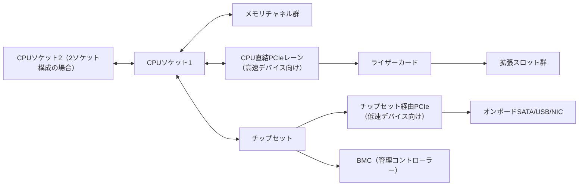

# 第6章 マザーボードと拡張インターフェース

## 学習目標

- マザーボード上の主要要素と、それぞれが持つ制約を説明できる
- チップセットとCPU直結レーンの違いを理解し、拡張スロットの実力を見積もれる
- PCI Expressの世代、レーン数、レーン分岐（バイファーケーション）から帯域を概算できる
- NIC、HBA、RAIDカード、GPUをスロット要件と電源要件から接続判断できる
- USB、SATA、M.2、U.2、U.3の物理規格と用途上の違いを述べられる
- 帯域不足が起きる仕組みを説明し、事前に見積もる手順を実行できる

## 6.1 役割

**マザーボード**（主基板）は、CPU、メモリ、拡張カード、ストレージ、電源、管理コントローラーを電気的に接続する中核基板である。

サーバー用マザーボードは、汎用PCとは異なり、複数CPUソケット、ECCメモリ対応、多数のPCIeレーン、BMC（後述、第10章で詳述）、冗長電源コネクタなど、可用性と拡張性を重視した設計になっている。

部品単体の性能は、スロットの世代、レーン配分、コネクタの電源供給能力、ファームウェアが対応する範囲によって頭打ちになる。

つまり、CPUやSSDが高性能でも、それを載せる基板の設計次第で性能が発揮できないことがある。

拡張インターフェース（PCIe、USB、SATA、M.2など）は、現時点の性能だけでなく、将来の増設余地そのものを表す。

北風商事のような中規模企業では、初期投資を抑えつつ数年先の増設を見込む必要があり、マザーボードの拡張性を理解することが選定の中心になる。

## 6.2 動作原理

### 6.2.1 マザーボードの構成要素

典型的なサーバー用マザーボードは、次の要素を持つ。

- CPUソケット（1個または複数個）
- メモリスロット（DIMMスロット）
- **チップセット**（Platform Controller Hubなどと呼ばれる補助チップ）
- PCIeスロットおよびPCIeコネクタ
- ストレージコネクタ（SATA、M.2、U.2/U.3など）
- 電源コネクタ（メイン、CPU補助、PCIe補助など）
- BMCチップと管理用NICポート
- USB、シリアル、VGAなどの背面I/O
- VRM（**Voltage Regulator Module**、電圧変換回路）

サーバーでは、マザーボード面積の制約から、PCIeスロットを直接実装せず、**ライザーカード**（riser card）と呼ばれる中継基板を介してスロットを増設する構成が一般的である。

ライザーの配線経路によって、外から見えるスロット形状（コネクタの長さ）と、実際に使える電気的レーン数が一致しないことがある。

これは選定時、そして障害調査時の両方でよく見落とされる点であり、必ずベンダーのレーン配分図（ブロックダイアグラム）を確認する必要がある。

マザーボード全体のデータの流れは、おおむね次のように整理できる。

この図が示す重要な点は、拡張スロットの一部はCPUに直結し、残りはチップセットを経由するという構造である。

チップセット経由の帯域は、チップセットとCPUをつなぐアップリンク（内部リンク）の総量に制約される。

つまり、チップセット配下のスロットへ多数の高速デバイスを挿しても、アップリンクがボトルネックになり、合計性能が頭打ちになることがある。

### 6.2.2 CPUソケットとメモリスロット

**CPUソケット**は、CPUを物理的に固定し電気的に接続するコネクタである。

ソケットの形状と信号仕様は、対応できるCPU世代を固定する。

つまり、新世代CPUへ交換したい場合、多くはマザーボードごとの交換が必要になる（第2章参照）。

メモリスロットの本数とチャネル構成は、搭載できる最大メモリ容量と、メモリ帯域の上限を決める（第3章参照）。

空きスロットが物理的にあっても、CPU側のメモリコントローラーが対応するチャネル数やDIMMランクの上限を超えると、それ以上は増設できない場合がある。

2ソケット構成では、CPU間を相互接続するリンク（メーカーごとに名称が異なる高速インターコネクト）がボトルネックになることもあるため、NUMA（Non-Uniform Memory Access、第2章参照）を意識した設計が必要になる。

### 6.2.3 PCI Express

**PCI Express**（**PCIe**、Peripheral Component Interconnect Express）は、拡張カードやストレージデバイスを接続するための高速シリアルインタフェースである。

PCIeは、双方向の通信路である**レーン**（lane）を1本単位として扱い、複数レーンを束ねて幅を表す。

代表的な幅の表記は、x1、x4、x8、x16である。

世代（Gen）が進むごとに、レーン1本あたりの理論帯域がおおむね倍増する。

概算の理論値（片方向、一般的な公称値の目安）を次に示す。

| 世代 | x1 あたりの目安 | x8 の目安 | x16 の目安 |
|---|---|---|---|
| PCIe 3.0 | 約 1 GB/s | 約 8 GB/s | 約 16 GB/s |
| PCIe 4.0 | 約 2 GB/s | 約 16 GB/s | 約 32 GB/s |
| PCIe 5.0 | 約 4 GB/s | 約 32 GB/s | 約 64 GB/s |

この値はエンコーディング（符号化）のオーバーヘッドを差し引いた後の実効に近い理論値だが、実際の通信ではプロトコルオーバーヘッド、パケット化、デバイス側の実装効率によって、さらに実測値が下がる。

したがって、カタログの理論帯域は「上限の目安」として扱い、性能要件の判断には実測またはベンダー公表の実効値を使うことが望ましい。

物理的なスロット形状（コネクタの長さ）と、実際に配線されている電気的レーン数は必ずしも一致しない。

例えば、物理形状はx16サイズでも、実際の配線がx8やx4しかない、いわゆる「開放スロット」がある。

このようなスロットに大電力かつ高帯域のカード（GPUなど）を挿すと、カードの性能を発揮できない。

**バイファーケーション**（bifurcation、レーン分岐）は、1つの物理スロットのレーンを、複数の小さい単位（例：x16を x4×4に分割）に分けてマルチデバイスキャリアなどへ配分する機能である。

分岐を使うと、1スロットで複数のNVMe SSDを直接CPUへ接続できるが、マザーボードとBIOS/UEFIの両方が対応している必要がある。

**PCIeスイッチ**は、上流の限られたレーン数を、下流の複数デバイスへ論理的に共有させるチップである。

スイッチを使うと接続数を増やせるが、全デバイスが同時に最大帯域を使うと、上流リンクで帯域の奪い合い（オーバーサブスクリプション）が発生する。

### 6.2.4 拡張カードの種類

サーバーに搭載される代表的な拡張カードは次のとおりである。

- **NIC**（Network Interface Card）：ネットワーク接続を担う。詳細は第7章
- **HBA**（Host Bus Adapter）：SAS/SATAなど、外部または内部のストレージデバイスへ接続するための変換カード。単純にディスクをOSへ透過的に見せる「IT モード」で使われることが多い
- **RAIDカード**：ディスクアレイの構成、パリティ計算、キャッシュ管理を行う専用コントローラー（第5章参照）
- **GPU**：描画処理や汎用計算（GPGPU）を行う（第11章参照）
- **スマートNIC / DPU**（Data Processing Unit）：ネットワーク処理やストレージ処理をオフロードする専用カード
- **FPGA**（Field-Programmable Gate Array）カード：特定処理向けに再構成可能な回路を搭載したカード

カードの搭載可否は、スロット長（フルレングス/ハーフレングス）、高さ（フルハイト/ロープロファイル）、消費電力、冷却方式、そしてBIOSのオプションROM容量の影響を受ける。

高消費電力のカード（GPUなど）は、スロットからの給電（規格上おおむね75 W程度が上限）だけでは不足し、補助電源コネクタ（6ピン、8ピンなど）からの追加給電を必要とすることが多い。

補助電源コネクタの本数と、電源ユニット側のケーブル対応を確認せずに発注すると、カードを搭載しても動作しないという事態になる。

### 6.2.5 USB

**USB**（Universal Serial Bus）は、周辺機器を接続する汎用インタフェースである。

世代ごとに理論速度が異なり、代表的な世代名として USB 2.0、USB 3.x（世代表記がベンダーにより変わりやすい）、USB4などがある。

サーバーでは、KVM（Keyboard Video Mouse、第12章参照）、初期セットアップ用の起動メディア、セキュリティキー（多要素認証デバイス）などの用途で使われることが多く、大容量ストレージの常時接続用途は少ない。

USB機器の自動マウント機能は、悪意あるUSBメディア経由の攻撃（データ持ち出し、マルウェア感染）につながるセキュリティリスクになる。

本番環境では、不要なUSBポートの無効化やポリシー制限を検討する。

### 6.2.6 SATA

**SATA**（Serial ATA、Serial Advanced Technology Attachment）は、HDDやSATA接続のSSD向けに広く使われてきた接続規格である。

世代ごとに理論転送速度が上がり、代表的な世代は SATA 1.5 Gbps、3 Gbps、6 Gbpsである（俗にSATA I/II/IIIと呼ばれることもある）。

ホットスワップ（稼働中の抜き差し）は、規格上は可能だが、実際にはバックプレーンとコントローラーの両方が対応していることが前提になる。

SATAは、コマンドキューの深さやプロトコルの制約により、NVMeほどの並列アクセス性能は持たない。

そのため、高いランダムアクセス性能が求められる用途（データベースなど）では、NVMeへの移行が進んでいる（第4章参照）。

### 6.2.7 M.2

**M.2**は、基板一体型の小型フォームファクタ規格である。

同じM.2コネクタでも、内部の配線によって、SATA接続とNVMe（PCIe）接続のどちらにもなり得る。

コネクタの切り欠き位置（**キーイング**、keying）によって対応する信号が異なり、代表的なものにB key、M key、B+M keyがある。

キーイングと配線種別（SATAかPCIeか）を誤認識すると、物理的に装着できない、または装着できても認識しないという事態になる。

サイズ表記（例：2280は幅22 mm、長さ80 mmを意味する）も複数あり、マザーボード側のねじ穴位置と合わない場合がある。

M.2 SSDは小型ゆえに放熱面積が小さく、高負荷の連続書き込みでサーマルスロットリング（後述、第8章参照）が起きやすい。

サーバー用途では、保守性（活線交換のしやすさ）と放熱の観点から、U.2やU.3などのホットスワップ対応ドライブへ寄せる設計判断が取られることがある。

### 6.2.8 U.2、U.3の概要

- **U.2**：2.5インチドライブの形状を持ちながらNVMe（PCIe接続）を扱いやすくしたコネクタ規格。ホットスワップ対応のフロントベイに搭載しやすい
- **U.3**：同一のベイ、同一のバックプレーンでSAS、SATA、NVMeの混在運用を意識した規格。ドライブ種別をより柔軟に選べる

U.2やU.3を使うには、対応するバックプレーン、専用ケーブル（またはコネクタ形状）、そしてBIOS/UEFI側の設定が揃っている必要がある。

製品世代によって対応範囲が変わるため、シャーシとマザーボードの仕様書を必ず確認する。

## 6.3 主要な性能指標

マザーボードと拡張インターフェースの性能を評価する際は、次の指標を確認する。

- PCIeの世代と、実際に配線されている実効レーン数
- スロットあたりの供給電力（スロット給電および補助電源コネクタの有無）
- 複数スロット間でのレーン共有（分岐、スイッチ経由かどうか）
- ストレージポートの本数と種別（SATA、NVMe、U.2/U.3の内訳）
- ライザーカード経由のスロットにおける帯域上限
- チップセット配下スロットのアップリンク帯域

### 帯域不足の考え方

帯域不足は、個々のデバイス性能ではなく、経路全体の合計で発生する。

見積もりの手順は次のとおりである。

1. 各デバイスが必要とする帯域を積算する（例：NIC、NVMe、GPUそれぞれの理論帯域または実効帯域）
2. 各デバイスが挿さるスロットの実効レーン数と比較する
3. それらのスロットが共有するCPUレーンまたはチップセットアップリンクの総量と比較する
4. 不足がある場合、カード配置の見直し、PCIe世代のアップグレード、複数ホストへの分散を検討する

具体例として、PCIe 3.0 x4接続のNVMe SSDは理論上おおむね4 GB/s級の帯域を持つ。

このようなSSDを複数枚、同一のライザーやチップセット配下に集中させると、合計必要帯域がアップリンクの上限を超え、個々のSSDの性能を全て発揮できないことがある。

高速なNICと高速なNVMeを同居させる設計では、レーンの奪い合いを事前に計算することが不可欠である。

## 6.4 他部品との関係

CPUの世代とモデルが、利用できる総PCIeレーン数とメモリチャネル数を決める(第2章)。

GPUや高速NICは、PCIeレーンだけでなく、電源ユニットの容量と冷却能力も圧迫する(第8章、第11章)。

RAIDカードのBBU（Battery Backup Unit）やスーパーキャパシタは、経年劣化する保守部品として管理対象に含める(第5章)。

BMCはマザーボード上で独立した電源系統と通信経路を持ち、主OSが応答しない障害時でも遠隔操作の生命線になる(第10章)。

ストレージのバックプレーンとM.2/U.2/U.3コネクタの対応関係は、シャーシ設計（第9章）と密接に関わる。

## 6.5 選定基準

マザーボードおよび拡張インターフェースを選ぶ際は、次の基準で評価する。

1. 必要なスロット数と、将来の増設余地
2. レーン配分表（ブロックダイアグラム）が公開されているかどうか
3. 対応するメモリ規格と最大搭載容量
4. BMCの機能範囲と遠隔コンソール対応
5. ライザーカードおよびドライブベイの保守性（活線交換のしやすさ）
6. 部品（特にBIOS/BMC）のファームウェア提供期間
7. U.2/U.3など将来的なストレージ規格への対応余地

北風商事の hv-01 では、25 GbEデュアルポートNICと、将来的なストレージカードの追加を見越し、x8以上の空きスロットを意図的に残す設計方針を取っている。

## 6.6 構成例

### 仮想化ホスト（hv-01 相当）

- オンボード 1 GbE（管理専用）
- PCIeスロットに 25 GbE デュアルポートNIC（PCIe 4.0 x8相当）
- OS用NVMe（オンボードコネクタまたは小規模RAID構成）
- 将来のGPUまたはストレージカード追加に備え、空きのx16スロットを1つ確保

### データベースサーバー（db-01 相当）

- NVMeをCPUに近い（レーン競合の少ない）スロットへ優先配置
- NICとRAID/HBAカードのレーンが競合しないよう、ライザーの系統を分ける
- メモリチャネルをフル実装し、NUMAをまたぐアクセスを最小化

### 避けるべき構成例

- 物理的にx16サイズに見えるが、電気的にはx4しか配線されていないスロットへ高消費電力のGPUを搭載する
- 放熱の弱いM.2スロットを、高頻度書き込みが続く用途（ログ収集、キャッシュなど）にそのまま使う
- 同一ライザー配下に高速NICと複数の高速NVMeを集中させ、アップリンク帯域を超過させる

## 6.7 よくある誤解

- 「スロットの見た目のサイズがそのまま帯域を表す」という誤解。実際は電気的な配線幅を確認する必要がある
- 「空きスロット数がそのまま増設可能数である」という誤解。電源容量、レーン数、カードの高さ制限が別途存在する
- 「M.2ならすべてNVMeである」という誤解。SATA接続のM.2も存在する
- 「オンボードNICで常に十分である」という誤解。帯域、オフロード機能、冗長性を考慮せずに判断すると不足する
- 「PCIeの世代を上げれば必ず性能が倍になる」という誤解。デバイス側やソフトウェア側がボトルネックであれば効果は出ない

## 6.8 代表的な障害

- カード未認識（接触不良、レーン不足、BIOSでのスロット無効化設定）
- 特定スロットのみリンクダウンまたはリンク速度の低下（配線劣化、コネクタ摩耗）
- ライザーカード自体の故障による、配下の複数スロット同時障害
- 電力不足によるカードの不定動作、または再起動ループ
- 複数の拡張カードのオプションROM競合による起動遅延、または起動失敗
- M.2の高温によるサーマルスロットリング、または予期しない切断

## 6.9 調査・交換時の注意点

- 交換前に、スロット番号、PCIアドレス、搭載カードのファームウェアバージョンを記録する
- カードは端（ブラケット部やエッジ）を持ち、基板面や金属端子（コネクタ部分）には触れない
- フルレングスカードは、保持ブラケットまたは固定金具を確実に取り付ける
- 交換後は、OS上のデバイス一覧（PCIeデバイス列挙結果に相当するコマンド）、リンク速度、温度、疎通を確認する
- 静電気対策（リストストラップ、導電性マットの使用）を徹底する

安全上の注意として、電源投入中のカード着脱は原則行わない。

ホットスワップ対応が明示されたスロットや機構以外での活線作業は、感電や機器損傷のリスクがある。

## 6.10 章末問題

1. PCIe 4.0 x8の片方向理論帯域の目安を述べよ。
2. 物理的にx16サイズのスロットが、電気的にx8動作になる理由を挙げよ。
3. M.2規格を選定する際に確認すべき点を3つ挙げよ。
4. 高速NICとNVMeを同一ホストに同居させる際、最初に検討すべき制約は何か。
5. ライザーカードが故障した場合の影響範囲を述べよ。

## 6.11 解答と解説

1. 約16 GB/s前後が目安である（公称値の目安であり、実効はプロトコルオーバーヘッド等で低下する）。
2. マザーボードの配線設計、CPU側のレーン配分方針、他スロットとの分岐（バイファーケーション）によって、物理形状と電気的な幅が一致しない場合がある。
3. SATA接続かNVMe接続か、キーイング（切り欠き形状）の一致、サイズ（幅と長さ）とねじ穴位置、放熱条件、ブート対応の可否。
4. CPUおよびチップセットが提供する総PCIeレーン数と、それぞれのスロットの実効幅、加えて電源容量と冷却余力。
5. ライザー配下に接続された複数のスロットが、同時に使用不能になる可能性がある。単一障害点として設計上把握しておく必要がある。

## 6.12 実務演習

hv-01 に、次の拡張カードを新たに搭載する計画がある。

- 25 GbE デュアルポートNIC（PCIe 4.0 x8相当の帯域を要求）
- NVMe AIC（Add-in Card）2枚（各PCIe 4.0 x4相当の帯域を要求）
- 将来候補のGPU（PCIe 4.0 x16、消費電力300 W級）

演習として、次を行え。

1. 現状のCPUが提供するPCIeレーン予算（総レーン数の仮値を自分で設定してよい）を仮に置く
2. 上記3系統の必要レーン数を積算し、予算内に収まるかを判定する
3. GPU追加が予算超過となる場合、どの装置を別ホストへ移すか、または別のスロット配置に変更するかを提案する
4. 電源容量（PSU定格と冗長方式）についても、GPU追加時に不足しないかを合わせて検討する
