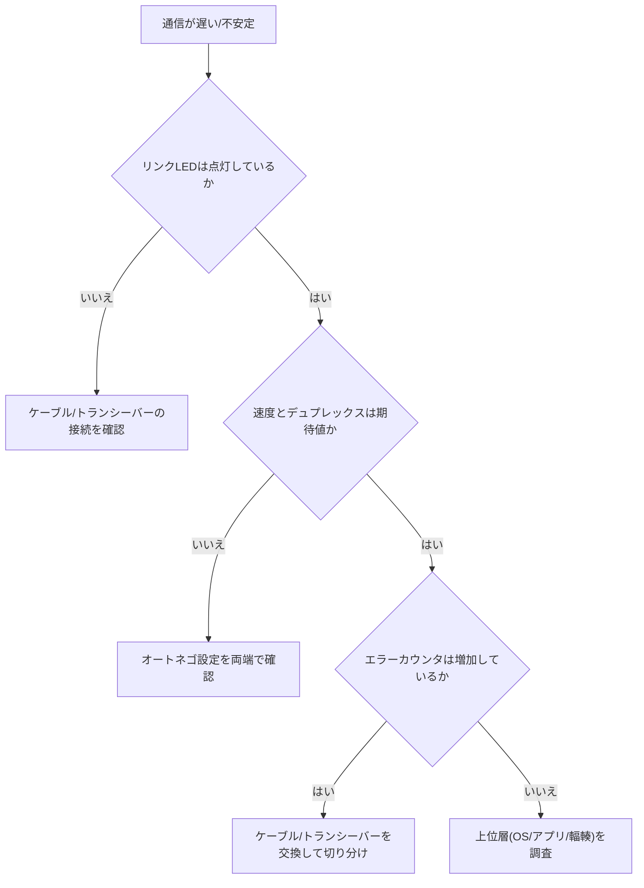

# 第7章 ネットワークインターフェース

## 学習目標

- NICの役割とEthernetの基本特性を説明できる
- 通信速度、全二重、オートネゴシエーションの仕組みを理解し、不整合を説明できる
- RJ45、光トランシーバー、SFP系、DAC、AOCを用途に応じて使い分けられる
- チーミング、オフロード、SR-IOVの効果と副作用を述べられる
- MACアドレスの役割と、交換時に必要な作業を理解する
- リンク障害を物理層から論理層へ順序立てて切り分けられる

## 7.1 役割

**NIC**（Network Interface Card、ネットワークインタフェースカード）は、サーバーをネットワークへ接続する装置である。

マザーボードに直接実装されるオンボード形態もあれば、PCIeスロットに挿すカード形態もある(第6章参照)。

クラウド環境における仮想NICも、その背後には必ず物理NICと物理スイッチが存在する。

帯域、遅延、冗長性、そしてNIC処理によるCPU負荷は、インフラ全体の品質に直結する。

ネットワークが遅い、または不安定であるという症状は、アプリケーション層の問題に見えても、実際には物理層やNIC設定に原因があることが多い。

## 7.2 動作原理

### 7.2.1 Ethernet

**Ethernet**（イーサネット）は、現在最も広く使われているLAN（Local Area Network）技術である。

データを**フレーム**という単位でやり取りし、その上位層としてIP（Internet Protocol）が載る。

サーバー側では、リンク速度、デュプレックス（通信方式）、オフロード機能、そして割り込み処理の分散（複数CPUコアへの分配）を意識した設定が求められる。

### 7.2.2 通信速度

代表的な速度の例として、1 GbE、10 GbE、25 GbE、40 GbE、50 GbE、100 GbEなどがある（GbEはGigabit Ethernetの略）。

これらの表記は、あくまで理論上の回線速度（規格上の最大値）である。

実際に得られる実効スループットは、使用するプロトコル、パケットサイズ、CPU処理能力、そしてストレージなど下流側のボトルネックによって下がる。

特に、小さなパケットが大量に発生する通信パターン（例：多数の短い問い合わせ）では、帯域（bps、bits per second）の上限より先に、**pps**（packets per second、1秒あたりのパケット処理数）の上限に到達することがある。

pps律速の場合、リンク速度を上げても改善しないため、CPU側の処理能力向上やオフロード機能の活用が必要になる。

### 7.2.3 全二重

**全二重**（full duplex）は、送信と受信を同時に行える通信方式である。

現代のスイッチ接続では、全二重が標準の動作モードである。

半二重（同時に片方向しか通信できない方式）や、速度のミスマッチは、オートネゴシエーションの失敗や、古いハブ機器との接続など、限られた状況で発生しうる。

半二重動作になると、衝突（コリジョン）検出とその再送処理により、実効性能が大きく低下する。

### 7.2.4 オートネゴシエーション

**オートネゴシエーション**は、接続する両端の機器が、相互に通信速度とデュプレックスを自動で決定する仕組みである。

片側を固定設定、もう片側を自動設定にすると、速度またはデュプレックスの不整合が起きる典型的な原因になる。

不整合が起きると、リンク自体は確立するが、極端な速度低下や大量のエラーが発生することがある。

基本方針としては、両端とも自動設定を推奨する。

特定の理由（既知の相性問題など）で固定設定にする場合は、その理由と設定内容を運用手順書に明示しておく。

### 7.2.5 RJ45

**RJ45**は、銅線（ツイストペアケーブル）を使う際に用いられるコネクタ形状の名称である。

1 GbEや、一部の10 GbE銅線接続（規格上は10GBASE-Tなど)で使われる。

ケーブルの品質（カテゴリ）や配線距離によって、到達可能な速度に上限がある。

長距離配線や、より高速な通信を求める場合は、光ファイバーを使う方式へ移行することが多い。

### 7.2.6 光トランシーバーとSFP系

**光トランシーバー**（光モジュール）は、着脱可能な小型モジュールであり、これを差し替えることで伝送媒体（光ファイバーか銅線か）や速度を切り替えられる。

代表的な規格を次に示す。

- **SFP**（Small Form-factor Pluggable）：主に1 GbE級で使われる小型トランシーバー規格
- **SFP+**：主に10 GbE級で使われる、SFPと互換性のある拡張規格
- **SFP28**：主に25 GbE級で使われる規格
- **QSFP / QSFP28 など**（Quad Small Form-factor Pluggable）：4チャネルを束ねることで、より高い速度、またはブレイクアウト（1つのポートを複数の低速ポートへ分岐させる用途）に対応する規格

トランシーバーモジュールは、挿入先のスイッチやNIC側が公開する互換性リストに依存することが多い。

非互換または未認証のモジュールを挿すと、認識しない、リンクが不安定になる、といった問題が起きることがある。

安全上の注意として、光ファイバー用のポートやコネクタを直接のぞき込んで、レーザー光を目に受けないようにする。

レーザーは目に見えない波長であることが多く、肉眼で発光の有無を判断できない点に注意する。

未使用のポートには、ほこりや損傷を防ぐためのダストキャップを付けておく。

### 7.2.7 DAC、AOC

- **DAC**（Direct Attach Copper、直接接続銅線ケーブル）：トランシーバー一体型の短距離銅線ケーブル。安価で、光変換を挟まないため低遅延である
- **AOC**（Active Optical Cable、アクティブ光ケーブル）：光ファイバーとトランシーバーが一体化したケーブル。DACより長い距離に対応しやすい

ラック内など短距離の接続にはDACが適し、ラック間の長距離配線や、配線経路上の制約がある場合は、AOCまたは光トランシーバーと光ファイバーの組み合わせが候補になる。

いずれの場合も、接続する両端の機器が対応する速度と規格を一致させる必要がある。

### 7.2.8 NICチーミング

**チーミング**（teaming、ボンディングとも呼ばれる）は、複数の物理ポートを論理的に束ね、冗長性の確保または帯域の集約を行う技術である。

チーミングのモードには、主に故障時の切り替えを目的とするもの（アクティブ/スタンバイ）と、通信をハッシュ関数などで複数ポートへ分散させるものがある。

分散型のモードを使う場合、スイッチ側の対応する設定（**LACP**、Link Aggregation Control Protocolなど）とセットで設計する必要がある。

「2ポートをチーミングすれば、常に帯域が2倍になる」という理解は誤りである。

分散アルゴリズムの性質上、1つの通信フロー（1本のTCPコネクションなど）は、通常1つの物理ポートにしか流れない。

そのため、多数の並列フローがある場合には帯域の合算効果が出やすいが、少数の太いフローが中心の場合には効果が限定的である。

### 7.2.9 オフロード機能

**オフロード**機能とは、本来CPUが行うべき通信処理の一部を、NIC側のハードウェアが肩代わりする仕組みである。

代表的なものに、チェックサム計算のオフロード、TCPセグメンテーションオフロード（TSO）、受信側の集約処理（GRO、Generic Receive Offload、および送信側のGSO、Generic Segmentation Offload）、そしてRDMA（Remote Direct Memory Access、リモートメモリへの直接アクセス）などがある。

オフロードを活用すると、CPU使用率を下げつつスループットを上げられる。

一方で、パケットキャプチャツールでの解析結果が実際のフレームと異なって見える、または特定のネットワーク機能（一部のトンネリングや検査機能）と相性が悪い場合がある。

通信の切り分け作業を行う際は、オフロード機能を一時的に無効化して挙動を比較することも有効な手段になる。

### 7.2.10 SR-IOV

**SR-IOV**（Single Root I/O Virtualization）は、1枚の物理NICを、複数の仮想機能（Virtual Function）として、仮想マシンへほぼ直接的に割り当てる技術である。

ソフトウェアによる仮想スイッチを経由しないため、低遅延や高pps性能が求められる用途で有利になることがある。

一方で、仮想マシンのライブマイグレーション（稼働中の仮想マシンを別ホストへ移動する機能）との相性、セキュリティ境界の設計、そして運用の複雑性増加とのトレードオフがある。

導入する際は、仮想化基盤側がSR-IOVを正式にサポートしているか、そして運用チームがこの複雑性を扱えるかを事前に確認する。

### 7.2.11 MACアドレス

**MACアドレス**（Media Access Control address）は、NICポートに割り当てられたリンク層（データリンク層）の識別子である。

物理NICには通常、製造時に一意な値が書き込まれているが、仮想化環境では管理者が指定する仮想MACアドレスが使われることが多い。

MACアドレスは、通信フィルタリング、リンクアグリゲーションの構成、ソフトウェアライセンスの認証、そしてセキュリティ上のホワイトリスト（許可リスト）など、様々な仕組みで参照される。

NICを交換すると、通常はMACアドレスも変わる。

交換作業の際は、監視システムの設定更新、DHCPでの固定割り当て設定の更新、そしてスイッチ側のポートセキュリティ設定の更新を忘れないようにする。

## 7.3 主要な性能指標

- リンク速度とデュプレックスの状態
- 実効スループットとpps（1秒あたりのパケット処理数）
- エラーカウンタ（CRCエラー、パケットドロップ、PAUSEフレームの送受信数）
- CPU使用率（特にソフトウェア割り込み処理にかかる割合）
- フェイルオーバー（チーミングにおける切り替え）に要する時間
- MTU（Maximum Transmission Unit、最大伝送単位）の設定と一致状況

理論値の例として、25 GbEは25 Gbit/sの回線速度を持つ。

バイト換算した理論上限の目安はおおむね3.125 GB/sになるが、実効値は用途とワークロードに依存するため、単純にこの値を性能保証として扱うべきではない。

## 7.4 他部品との関係

高速なNICは、PCIeレーンとCPUコアを消費する(第2章、第6章参照)。

ストレージのバックアップ通信と業務通信が同じNICを共有すると、バックアップ処理が業務トラフィックを圧迫することがある。

仮想化ホストでは、管理通信、ライブマイグレーション通信、ストレージ通信、業務通信を、物理的または論理的（VLANなど）に分離することが望ましい。

電源と冷却の設計においても、高密度実装のNICや光トランシーバーが発する熱を見込んでおく必要がある(第8章参照)。

## 7.5 選定基準

1. 必要な帯域とpps性能
2. 冗長方式（アクティブ/スタンバイ、LACPなどの分散方式）
3. ケーブルの長さと伝送媒体（銅線か光ファイバーか）
4. オフロード機能、SR-IOV、RDMAの要否
5. スイッチとの互換性、および将来の速度アップグレードへの余地
6. 管理用ネットワークの物理的または論理的な分離

北風商事では、業務系通信に25 GbE、管理系通信に1 GbEを用い、両者を分離する方針を採用している。

## 7.6 構成例

### web-01 / web-02

- 10 GbE × 2ポート（LACPによる冗長化と分散を兼ねた構成）
- 管理用として1 GbEを別途確保

### hv-01 / hv-02

- 25 GbE × 2ポート（業務通信とストレージ通信をVLANで分離）
- 管理用の専用ポートを別に確保

### ラック内接続の例

- ToR（Top of Rack）スイッチまでは、DAC（3 m程度の短尺）を使用
- ラック間の接続には、光トランシーバーと光ファイバー（マルチモードなど）を使用

```text
[web-01] --DAC-- [ToRスイッチ ラックA]
[hv-01]  --DAC-- [ToRスイッチ ラックA]
[ToRスイッチ ラックA] --光ファイバー-- [コアスイッチ]
[ToRスイッチ ラックB] --光ファイバー-- [コアスイッチ]
```

## 7.7 よくある誤解

- 「リンクアップしていれば通信品質に問題はない」という誤解。リンクアップは物理的な接続確立を示すだけで、エラー率や輻輳の有無は別途確認が必要である
- 「チーミングすれば必ず帯域が倍増する」という誤解。分散アルゴリズムの性質上、単一フローでは効果が出にくい
- 「高速なトランシーバーを挿せば、自動的に速度が上がる」という誤解。対向機器とケーブルの両方が対応している必要がある
- 「CRCエラーはアプリケーションの問題である」という誤解。多くの場合、物理層（ケーブル、コネクタ、トランシーバー）に原因がある

## 7.8 代表的な障害とリンク障害の調査

### 代表的な症状

- リンクダウン（接続が確立しない）
- 片方向のみ通信が成立する状態
- 本来の速度（例：10 GbE）が1 GbEなど低い速度に落ちてしまう状態
- 間欠的な遅延と再送の増加

### 調査の手順

1. NIC側と対向ポート側の両方のリンクLEDを確認する
2. NICおよびスイッチ側で、実際にネゴシエーションされた速度とデュプレックスを確認する
3. ケーブルまたはトランシーバーモジュールを、要素ごとに一つずつ差し直し、または交換する
4. エラーカウンタ（CRCエラー、ドロップ数など）の増加有無を確認する
5. 別のポート、別のケーブルを使い、問題箇所を二分探索的に絞り込む
6. ドライバのバージョン、ファームウェアのバージョン、スイッチ側の設定を確認する

物理層に問題があると疑われる場合は、アプリケーションログを調べる前に、NICおよびスイッチのエラーカウンタを確認することを優先する。

これにより、無駄なアプリケーション調査に時間を浪費することを防げる。



## 7.9 調査・交換時の注意点

- 光トランシーバーは静電気と汚染に弱いため、端面（光が通る部分）には直接触れない
- 活線抜去（通電中の抜き差し）が可能かどうかを、機器の仕様で事前に確認する
- 交換後は、対向側のエラーカウンタをクリアしたうえで、しばらく再監視する
- チーミング構成を変更した場合は、必ずフェイルオーバー試験（片系を意図的に切断して切り替わりを確認する試験）を実施する
- MACアドレスの変更に伴い、ファイアウォールのルールや監視システムの設定更新を忘れない

## 7.10 章末問題

1. オートネゴシエーションの不整合で起きやすい症状を述べよ。
2. DACを選ぶ利点と制限を述べよ。
3. SR-IOVの利点と、運用上の代償を1つずつ挙げよ。
4. リンクは確立しているが、転送が極端に遅いとき、確認すべき項目を3つ挙げよ。
5. 管理系ネットワークと業務系ネットワークを物理的または論理的に分離する理由を述べよ。

## 7.11 解答と解説

1. 速度の低下、半二重化、多数の衝突またはエラーの発生、極端な遅延などが起きやすい。
2. 利点は安価であることと低遅延であること。制限は伝送距離が短いことと、両端の互換性が必要であること。
3. 利点は低遅延かつ高効率な通信ができること。代償は運用の複雑化や、ライブマイグレーションなど一部機能との制約が生じること。
4. エラーカウンタの状況、ネゴシエーション結果（速度とデュプレックス）、オフロード設定、フローコントロール（PAUSEフレーム）の状況、対向側の過負荷状態。
5. 障害発生範囲の分離、セキュリティ境界の確保、帯域競合の回避、そして保守作業時にも管理経路への到達性を確保するため。

## 7.12 実務演習

bk-01（バックアップサーバー）の夜間バックアップ処理が、10 GbEリンクの帯域をほぼ飽和させ、同じネットワーク経路を共有する業務VLANの通信遅延が悪化する事象が発生した。

この事象について、次を行え。

1. 短期的な緩和策を、コストと停止リスクを付けて提案する
2. 中期的な改修策を、コストと停止リスクを付けて提案する
3. 候補として、QoS（Quality of Service、通信優先度制御）の導入、NICポートの追加、バックアップ実行時間帯の分散、専用VLANまたは専用物理NICによる経路分離、を比較検討する
