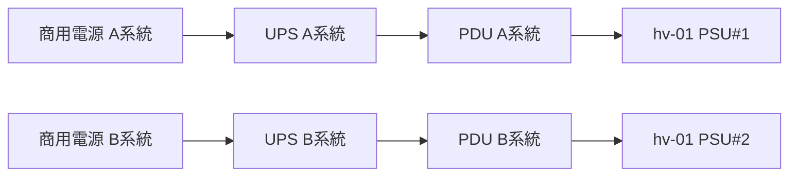

# 第8章 電源と冷却

## 学習目標

- PSUの定格、変換効率、80 PLUS、冗長構成を説明できる
- サーバーの消費電力を見積もり、UPSとPDUの容量設計に反映できる
- 突入電流の仕組みと、多数台同時起動時のリスクを説明できる
- ファン、ヒートシンク、エアフローが冷却性能へ与える影響を述べられる
- サーマルスロットリングと高温障害の違いを説明し、監視項目に反映できる
- 電力と冷却の冗長化を、単一障害点の観点で設計できる

## 8.1 役割

電力と熱は、計算資源を成立させるための基盤的な制約である。

CPUやGPUがどれほど高性能であっても、電源が足りなければ動作せず、熱がこもれば性能を落とし、それでも改善しなければ最終的に部品が損傷する。

データセンターの現場では、IT機器そのものの処理能力よりも先に、電力契約や冷却能力の上限が拡張の制約になることが少なくない。

そのため、インフラエンジニアは、CPUやメモリの性能指標と同じくらい、電力と冷却の指標を重視する必要がある。

## 8.2 動作原理

### 8.2.1 電源ユニット

**PSU**（Power Supply Unit、電源ユニット）は、施設側から供給される交流電力を、サーバー内部で使う直流電力へ変換する装置である。

サーバー内部では、変換された12 V系統などの直流電力を、マザーボードや各種デバイスへ分配する。

### 8.2.2 定格出力

PSUのラベルに記載されたワット数は、連続して供給できる出力の目安を示す。

入力電圧の変動、周囲温度、経年劣化によって、実際に安定供給できる出力は変化する。

したがって、「定格800 W」と表記されていても、効率曲線や冗長方式次第で、実運用上安全に使える余裕は変わってくる。

一般的に、PSUは定格の100%近くを常用する設計ではなく、余裕を持たせた負荷率での運用が推奨される。

### 8.2.3 変換効率と80 PLUS

交流から直流への変換過程では、入力電力の一部が熱として失われる。

変換効率が高いほど、同じ出力電力を得るために必要な入力電力が少なくなり、結果として排熱も減る。

**80 PLUS**は、PSUの変換効率を評価する認証制度の一例である（Standard、Bronze、Silver、Gold、Platinum、Titaniumなど段階がある）。

効率は負荷率によって変化し、多くのPSUは中程度の負荷率（おおむね50%前後）で最も高い効率を示す。

低負荷時には効率が落ちることがあるため、必要以上に大容量なPSUを選定することが、必ずしも省電力につながるとは限らない。

### 8.2.4 冗長電源

**冗長電源**構成の代表例として、**1+1**（2台のうち1台が予備）や**N+1**（N台の稼働に対し1台の予備を追加する）がある。

冗長電源は、それぞれのPSUを別系統のPDU（後述）へ接続して初めて意味を持つ。

両方のPSUを同じPDU、または同じ上流ブレーカーへ接続してしまうと、そのPDUやブレーカーが単一障害点として残ってしまい、冗長化の効果が実質的に失われる。

### 8.2.5 電源容量の見積もり

電力容量を見積もる際の大まかな手順は次のとおりである。

1. CPU、メモリ、ディスク、NIC、GPUなど、各コンポーネントの概算消費電力を積算する
2. メーカーが提供する電力見積もりツールがあれば、それを優先的に利用する
3. ピーク時の消費電力と、平均的な消費電力を分けて把握する
4. 将来の増設分（ディスク追加、メモリ増設など）をあらかじめ加算しておく
5. 冗長構成の場合、片系が故障した際にもう片系へ負荷が寄ることを踏まえて容量を確認する
6. ラック単位のPDU容量、およびUPS容量に対する余裕を確認する

具体例として、hv-01の通常時消費電力を350 W、ピーク時を550 Wと仮定し、1+1冗長の800 W級PSUを搭載しているとする。

この場合、片系のPSUが故障しても、残る1台の800 W級PSUだけでピーク550 Wを支えられるかどうかを確認する必要がある。

支えられない場合、実質的には冗長化されていない構成であり、容量を見直す必要がある。

### 8.2.6 UPS

**UPS**（Uninterruptible Power Supply、無停電電源装置）は、瞬間的な停電や短時間の電圧異常を吸収し、機器の安全な停止、または非常用発電機への切り替えまでの橋渡しを行う装置である。

UPSの容量は、VA（Volt-Ampere、皮相電力）またはW（有効電力）の単位で示される。

選定時には、出力波形（正弦波かどうか）、バッテリーによる稼働継続時間（ランタイム）、そして保守用のバイパス経路の有無を確認する。

UPSのバッテリーは経年劣化する消耗品であり、定期的な負荷試験や自己診断テストを実施しないと、いざというときに機能しないリスクがある。

### 8.2.7 PDU

**PDU**（Power Distribution Unit、電源分配ユニット）は、ラック内の各機器へ電力を分配する装置である。

単純に電力を分配するだけの基本型、消費電力を計測できるメータリング機能付き、そして遠隔からアウトレット単位で電源のオンオフを制御できる機能付きなど、複数の種類がある。

PDU選定時は、三相電源における各相（フェーズ）の負荷バランス、コンセント形状の適合、そして監視システムとの連携可否を設計に含める。

### 8.2.8 突入電流

**突入電流**（inrush current）は、電源投入の瞬間に流れる、定常時よりも大きな電流である。

多数のサーバーを同時に起動すると、突入電流が重なり合い、上流のブレーカーが遮断（トリップ）することがある。

対策としては、起動順序を時間的に分散させること、電源投入回路にソフトスタート機構を持つ機器を選ぶこと、そして投入タイミングを制御できるPDUを使うことなどが挙げられる。

停電復旧後の一斉起動時は、特にこのリスクが高くなるため、事前に起動手順を計画しておく。

### 8.2.9 ファンとヒートシンク

**ヒートシンク**は、CPUなど発熱源から熱を金属フィンなどへ拡散させる部品であり、そこへ**ファン**で空気を送ることで熱を筐体外へ排出する。

サーバー用途では、信頼性を優先して高回転のファンを採用することが多く、結果として動作音（騒音）が大きくなる傾向がある。

ファンが故障すると、当該領域の温度が上昇し、後述するサーマルスロットリングや、最終的には強制シャットダウンへ直結する。

冗長ファン構成を持つ機種では、1台の故障時に残りのファンが回転数を上げて補うことが多いが、その分だけ騒音と消費電力が増える。

### 8.2.10 エアフロー

一般的なサーバーの冷却方式は、前面から冷たい空気を吸気し、背面から熱い空気を排気する構成である。

ケーブルの乱雑な配置や、空きスロットのブランクパネル欠落があると、排気された熱い空気が再び吸気側へ回り込む**ショートサーキット**（熱気の短絡回り込み）が発生することがある。

空きベイや空きスロットには、必ずブランクパネルを取り付け、意図した空気の流れを妨げないようにする。

### 8.2.11 温度管理とサーマルスロットリング

BMC（第10章参照）やOSが、各所の温度センサーを常時監視する。

温度が閾値を超えた場合に、CPUなどの動作周波数を意図的に下げる制御を**サーマルスロットリング**と呼ぶ。

サーマルスロットリングが発生しても機器は停止しないため、単純な稼働監視だけでは検知できず、処理性能の低下という形で症状が現れる。

つまり、「落ちてはいないが遅くなる」という性能障害として観測される点に注意が必要である。

### 8.2.12 高温障害

異常な高温状態は、即座の停止だけでなく、電解コンデンサの劣化促進や、ディスクの寿命短縮など、中長期的な故障の原因にもなる。

高温状態が慢性的に続く環境は、間欠的な障害（時々発生し再現しにくい障害）の温床にもなりやすい。

### 8.2.13 電力と冷却の冗長化

電力と冷却は、どちらも単独で冗長化しても、もう片方が単一障害点のままでは意味が薄れる。

例えば、PSUをA系統/B系統へ二重化していても、冷却系統（空調機、ファンユニット）が単一系統のままであれば、空調故障時には結局サーバーが停止または劣化動作に陥る。

データセンター設備の冷却冗長は、一般に空調機（CRAC、Computer Room Air Conditioner、またはCRAH、Computer Room Air Handlerと呼ばれる機器）を複数台用意し、N+1（通常必要な台数に対し1台の予備を追加する）や2N（完全に系統ごと二重化する）といった考え方で設計される。

サーバー単体の視点では、次の3点を対にして確認する。

1. 電源はA系統/B系統の物理的に別経路になっているか
2. 冷却は、片系統の空調停止時にも許容範囲の温度を維持できるか
3. 監視は、電力異常と温度異常の両方を同じ優先度で通知しているか

冗長化の設計は、コストと可用性要件のトレードオフである。

北風商事の規模では、電力面はラック単位でのA系統/B系統分離を基本とし、冷却面は部屋単位の空調余力（N+1相当）を確保する方針を取っている。

## 8.3 主要な性能指標

- 入力電力（W）と出力電力（W）
- PSUの変換効率（%）
- ラックあたりの電力密度（kW/ラック）
- 吸気温度と排気温度
- ファンの回転数と冗長状態
- UPSのランタイム（分）
- サーマルスロットリングの発生頻度と継続時間

## 8.4 他部品との関係

GPUの増設は、電力消費の増加と冷却負荷の増加を同時に意味する(第6章、第11章参照)。

高密度なストレージ構成は、ディスク自体の発熱と、フロントパネル部の気流抵抗の両方を増やす(第4章、第5章参照)。

電力の監視は、BMC、PDU、UPS、そして施設側のDCIM（Data Center Infrastructure Management、データセンターインフラ管理システム）という複数の層で行われることが多く、層ごとに見える範囲が異なる。

## 8.5 選定基準

1. ピーク電力と、必要とする冗長方式
2. 80 PLUSなどの効率要件
3. 入力電圧の対応範囲と、施設側のコンセント形状
4. UPSの必要ランタイム（安全に停止処理を完了できる時間があるか）
5. ラック単位の冷却能力
6. ファンやPSUのホットスワップ（活線交換）対応の有無

## 8.6 構成例

### 北風商事 計算ラック（ラックA）

- ラック上限電力を6 kWと仮定する
- hv-01、hv-02、web-01、web-02を配置する
- 冗長PSUをA系統/B系統のPDUへ分散して接続する
- UPSはサーバールーム共有とし、ランタイム15分程度を確保し、非常用発電機への切り替えを想定する

この図が示すとおり、冗長PSUの効果を得るには、AC入力の段階から系統を分けておく必要がある。

### データベースサーバー（db-01 相当）

- ピーク電力を高めに見積もり、電力余裕を厚く確保する
- ディスクを多数搭載する構成では、前面吸気温度を重点的に監視する

## 8.7 よくある誤解

- 「PSUの定格ワットまで常時使用してよい」という誤解。定格は上限の目安であり、常用は余裕を持った負荷率が望ましい
- 「冗長PSUがあるからUPSは不要である」という誤解。冗長PSUは機器内の片系故障に備えるものであり、施設全体の停電には対応できない
- 「室温が低ければサーバー内部も常に安全である」という誤解。エアフローが乱れていれば、室温が低くても機器内部が局所的に高温化することがある
- 「サーマルスロットリングは、故障コードが表示されるまで無視してよい」という誤解。性能低下として先に現れるため、監視対象に含めるべきである

## 8.8 代表的な障害

- 高負荷時のみ再起動が発生する（電源容量不足、電源ケーブルの接触不良）
- PSUの片系故障により冗長性が失われる
- ファン故障による高温シャットダウン
- UPSバッテリーの劣化により、瞬停への耐性が実質的に失われている
- 多数台の同時起動によるブレーカーのトリップ

## 8.9 調査・交換時の注意点

- 電源関連の作業には感電のリスクがある。必要な資格と社内手順を遵守する
- 活線状態（通電中）での作業は原則避け、やむを得ず必要な場合は保守手順書に従って実施する
- PSU交換は、対応機種のホットスワップ手順に従って行う
- ファン交換後は、回転数と温度が正常な範囲に戻るまで監視を継続する
- バッテリー（UPSやBBUなど）の交換や廃棄は、社内および法令上の廃棄ルールに従う

安全上の注意として、電源ユニット内部には、電源を切断した後も一定時間電荷が残留する部品（コンデンサなど）が存在する場合がある。

メーカーが指定する放電待機時間や手順を守らずに内部へ手を入れることは危険である。

## 8.10 章末問題

1. 1+1冗長のPSUを、誤って同一のPDUへ接続してしまった場合の問題点を述べよ。
2. 変換効率80%で出力400 Wを得ている場合、入力電力はいくらになるか計算せよ。
3. サーマルスロットリングが発生しているときに現れる症状を述べよ。
4. 突入電流への対策を2つ挙げよ。
5. UPSのランタイムを決める際の基本的な考え方を述べよ。

## 8.11 解答と解説

1. PDUや、その上流のブレーカーが単一障害点として残ってしまい、冗長構成としての意味が実質的に薄れる。
2. 400 W ÷ 0.8 = 500 W。つまり入力電力は500 Wになる。
3. 機器が停止せずに動作周波数を落とし、処理速度が低下する。イベントログや温度履歴、周波数履歴を突き合わせて確認する。
4. 起動の時間的分散、同時に投入する台数の制限、ソフトスタート機構を持つ機器の採用、ブレーカー容量に余裕を持たせること、のいずれか2つ。
5. 安全な停止処理、または非常用発電機への切り替えに必要な時間に、一定の余裕を加えた時間とする。単なる希望値や慣例値で決めるべきではない。

## 8.12 実務演習

ラックAの残り電力予算が1.2 kWのとき、消費電力300 W級のGPUを2枚搭載した検証機を新たに追加したいという要望が来た。

次を行え。

1. 追加機の想定消費電力（GPU分含む）を仮に見積もり、搭載の可否を判定する
2. 不可と判定した場合、代替案（別ラックへの設置、クラウド上のGPUインスタンスの利用、より低電力な構成への変更など）を提示する
3. 各代替案について、コストと導入までのリードタイムの観点で比較する
