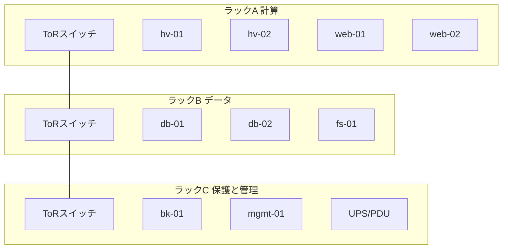

# 第9章 シャーシ、ラック、データセンター設備

## 学習目標

- タワー型、ラック型、ブレード型の特徴を用途に応じて説明できる
- ラックユニット、重量、奥行き、ケーブル管理を踏まえた搭載計画を作成できる
- ラックの電源設計を、系統分離の観点で説明できる
- ホットアイルとコールドアイルの意図と、冷却効率への効果を述べられる
- 接地、入退室管理、火災対策、地震対策を運用設計に組み込める
- 資産管理の重要性を、障害対応のスピードと結び付けて説明できる

## 9.1 役割

**シャーシ**（筐体）と**ラック**は、内部の部品を機械的に保護し、電源供給、冷却、そして保守作業の動線を成立させるための構造物である。

データセンター設備（電源設備、空調設備、防災設備、入退室管理設備など）は、個々のIT機器の性能だけでは制御できない、可用性の土台となる部分である。

ここが弱いと、どれほど優秀なサーバーを導入しても、施設側の要因でまとめて停止してしまうことがある。

インフラエンジニアは、サーバー単体の知識だけでなく、それを収容する筐体と施設の制約も理解しておく必要がある。

## 9.2 動作原理

### 9.2.1 タワー型、ラック型、ブレード型

- **タワー型**：単体で自立する筐体で、事務所などラック設備がない環境への設置に向く。騒音や振動、そして複数台になったときの保守性に注意が必要である
- **ラック型**：標準化された19インチラックへ搭載する形態。搭載密度が高く、電源やケーブルの配線が標準化しやすい
- **ブレード型**：共有のエンクロージャ（収容筐体）に、電源、冷却、ネットワークスイッチを集約し、そこへ複数の薄型サーバー（ブレード）を挿入する形態。高密度だが、電源や冷却、そしてベンダー固有の設計への依存度が強くなる

中小規模の北風商事のような組織では、汎用性と保守のしやすさから、ラック型が構成の中心になることが多い。

ブレード型は、大規模で均質なワークロードを大量に運用する場合に効果を発揮しやすいが、少数構成では投資回収が難しいことがある。

### 9.2.2 ラックユニット

**U**（ラックユニット）は、ラック搭載機器の高さを表す単位であり、1U はおおむね44.45 mmと定義されている。

サーバーは1Uや2Uの高さを持つ製品が一般的であり、それ以上の高さ（4Uなど）はストレージ機器や高性能計算機で使われることがある。

ラックには搭載可能な総U数の上限があり（例えば42U、48Uなど）、空きUを正しく管理していないと、実際には増設できるはずのスペースを見落としたり、逆に電源や冷却の余力がないまま無理に搭載してしまったりする。

### 9.2.3 ラック搭載

機器の固定には、レール（スライドレールや固定レール）、ケージナット（ラックの角穴に取り付ける特殊なナット）、そして必要に応じて耐震固定金具を使用する。

一般的な指針として、重量のある機器はラックの下部へ搭載すると、ラック全体の重心が下がり安定する。

ただし、冷却経路の都合（例えば重量機器の排熱を考慮した配置）や、ケーブル取り回しの都合により、この指針どおりにいかない例外もある。

例外的な配置を行う場合は、その理由を設計文書として残しておくことが望ましい。

### 9.2.4 重量と奥行き

設置する床の耐荷重（1平方メートルあたりの許容荷重、またはラック1台あたりの許容荷重）を超えて機器を搭載することは危険である。

特に、大容量ストレージやUPSなど、比較的重量のある機器を集中的に搭載する場合は、事前に建物または部屋の耐荷重仕様を確認する。

奥行きの長いサーバー（大型のストレージシステムなど）は、ラック自体の奥行き寸法と、ラック背面に必要な保守スペースの両方を確認する必要がある。

これを怠ると、ラックの扉が閉まらない、保守時に機器を引き出せない、といった実務上の問題が発生する。

### 9.2.5 ケーブル管理

電源ケーブル、ネットワークケーブル、ストレージ用ケーブルは、系統ごとに分離し、両端にラベルを付けて管理する。

ラベル管理を怠ると、保守作業中に誤って別系統のケーブルを一本抜いてしまい、意図しない全体障害を引き起こす事態につながる。

一方で、過剰にケーブルを束ねたり、通気口をふさぐように配線したりすると、エアフローを阻害し、冷却効率を下げてしまう。

ケーブル管理は、見た目の美しさのためだけでなく、保守の安全性と冷却効率の両方に直結する作業である。

### 9.2.6 ラックの電源設計

ラック内の電源は、A系統/B系統というように、上流から独立した2系統のPDUを用意することが基本である(第8章参照)。

三相電源を使う場合は、各相（フェーズ）への負荷の偏りがないよう、機器の接続先を分散させる。

また、ラックごとに契約している電力容量（kW単位）を台帳で管理し、増設のたびにこの台帳を更新することで、電力超過による遮断事故を未然に防げる。

### 9.2.7 冷却、ホットアイルとコールドアイル

**コールドアイル**（cold aisle）とは、ラックの吸気面（前面）が向き合う通路のことであり、ここへ冷たい空気を供給する。

**ホットアイル**（hot aisle）とは、ラックの排気面（背面）が向き合う通路のことであり、ここに機器からの熱い排気が集まる。

ラックの向きを交互に配置し、冷たい空気の通路と熱い空気の通路を分離することで、冷気と熱気が混ざり合うことを防ぎ、冷却効率を高める。

```text
[コールドアイル] ← 前面吸気 [ラック1] 背面排気 → [ホットアイル] ← 背面排気 [ラック2] 前面吸気 → [コールドアイル]
```

ブランクパネル（未使用スロットへのふさぎ板）の設置、アイルキャッピング（通路を天井や扉で仕切り、空気の混合をさらに抑える工法）、そして床タイルの適切な開口配置が、この効果をさらに高める。

### 9.2.8 接地

**接地**（アース）は、感電防止と電気的ノイズの抑制の両方に関わる重要な設備要素である。

ラック本体や搭載機器の接地（グラウンド）接続は、建物および施設側の接地基準に従って適切に行う必要がある。

接地が不適切だと、静電気による機器への悪影響や、最悪の場合は感電事故につながる可能性がある。

### 9.2.9 入退室管理

サーバールームへの入退室管理は、鍵、ICカード、生体認証、監視カメラ、そして同伴ルール（部外者の単独入室を禁止するルールなど）を組み合わせて構築する。

サーバールームの管理で重要なのは、「誰を入室させるか」だけでなく、「入室した理由と、その記録」を残すことである。

インシデント発生時、入退室ログと作業記録を突き合わせることで、原因調査のスピードが大きく変わる。

### 9.2.10 火災対策

ガス系消火設備、煙感知器、そして防火区画の設計は、通常は施設側（建物管理者、専門業者）が担当する。

水噴霧による消火設備がIT機器室に適するかどうかは、用途や施設の方針によって異なるため、現場の判断だけで決めるべきではない。

段ボール箱や予備ケーブルの束など、可燃物をサーバールーム内に放置しないことも、日常的な火災対策の基本である。

### 9.2.11 地震対策

耐震ラック、機器を固定するレールロック機構、地震時の変位を吸収するケーブルの余長設計、そして免震床の有無を事前に確認する。

ラックの転倒や、機器がレールから脱落する事故は、設備の破損だけでなく、作業員への人身被害にもつながりかねない。

日本国内での設置においては、耐震基準への適合を、施設選定や什器選定の初期段階から検討する。

### 9.2.12 資産管理

シリアル番号、ホスト名、ラック内の設置位置、購入日、保守契約の期限、保証範囲を、資産台帳として一元管理する。

障害発生時に「どの物理的な箱が対象なのか」を即座に特定できないと、復旧までの時間が不必要に延びてしまう。

資産管理は地味な作業に見えるが、障害対応のスピードと保守部品の手配効率に直結する、非常に実務的な仕事である。

## 9.3 主要な性能指標

- ラックの空きU数
- ラック単位の電力使用量（kW）と余裕
- ラック内の吸気温度分布
- 床の耐荷重に対する余裕
- 入退室ログの完全性（記録漏れの有無）
- 資産台帳と実機の一致率

## 9.4 他部品との関係

高電力を要するGPUサーバーの導入は、ラック単位の電力配分と冷却能力の再配分を実質的に強制する(第8章、第11章参照)。

長尺のDAC（Direct Attach Copper）や光ファイバーの配線規則は、ラック内およびラック間の機器配置に制約を与える(第7章参照)。

BMCによる遠隔管理機能があっても、物理的な部品交換のためには、結局は入室して現地作業を行う動線が必要になる(第10章参照)。

## 9.5 選定基準

1. 必要なU数と、将来の増設枠
2. 電力および冷却のヘッドルーム（余裕）
3. 前後の保守スペース
4. 耐震基準および防火要件への適合
5. コロケーション（他社データセンターへの機器設置）を利用する場合、契約上の電力上限と遠隔作業（リモートハンズ）サービスの条件

## 9.6 構成例

北風商事のラック配置例を次に示す（仮の設計例）。

```text
ラックA（計算）: スイッチ（上部）、hv-01、hv-02、web-01、web-02、空き4U
ラックB（データ）: db-01、db-02、fs-01、空き2U
ラックC（保護と管理）: bk-01、mgmt-01、UPS近傍のPDU、配線区画
```

重量のあるUPSや大容量ストレージは、ラック下部寄りに配置することを基本とする。

ネットワークスイッチは、ケーブル配線の都合上、各ラック上部（Top-of-Rack）へ配置する運用方針を採用している。



## 9.7 よくある誤解

- 「空きUがあれば機器を載せられる」という誤解。電力や冷却の余力が足りない場合がある
- 「カードで入室できれば管理として十分である」という誤解。作業内容の記録と権限分離も同時に必要である
- 「ラック自体が耐震仕様であれば、機器個別の固定は不要である」という誤解。機器側の固定が不十分だと、地震時にラック内で機器が動いてしまう
- 「クラウドを利用しているから、自社のサーバールームは管理しなくてよい」という誤解。オンプレミス設備が残る限り、物理的な管理責任は継続する

## 9.8 代表的な障害

- ラック電力の超過によるブレーカー遮断
- ケーブルの過密配線による局所的な高温化
- 床下配線の物理的な損傷（踏みつけ、経年劣化）
- 地震後の接触不良（コネクタの緩みなど）
- 資産台帳の不一致による、誤った機器の抜去

## 9.9 調査・交換時の注意点

- 重量のある機器は、必ず二人以上で取り扱う
- ラックに搭載済みの機器を、作業時の踏み台として使用しない
- 活線状態でのラック内作業は、絶縁対策と社内手順を厳守する
- 作業の前後で、ラック台帳とケーブルタグの内容を更新する
- 消火設備の手動停止や、防火扉の開放に関するルールを遵守する

## 9.10 章末問題

1. 1Uの高さは何mmか。
2. 重い機器をラック下部に置く理由と、その例外について述べよ。
3. ホットアイルとコールドアイルを分ける目的を述べよ。
4. ラックの電力に余裕がない状態で機器を増設したい場合の選択肢を3つ挙げよ。
5. 資産台帳が古いままだと、障害対応時に何が困るか述べよ。

## 9.11 解答と解説

1. 44.45 mmである。
2. 理由は重心の安定と安全性の確保である。例外として、冷却経路や配線、機器固有の特性により配置を変える場合は、その判断を設計文書として記録しておく必要がある。
3. 冷たい空気と熱い空気の混合を減らし、冷却効率を高めることが目的である。
4. 低電力な機種への置き換え、別ラックへの分散設置、クラウドへの一部移行、電力設備の増強工事、より高効率なPSUへの更新、のいずれか3つ。
5. 対象機の特定に時間がかかる、保守部品の手配が遅れる、誤った機器を抜去してしまうリスクが高まる、影響範囲の説明が遅れる、といった問題が生じる。

## 9.12 実務演習

ラックAに、新たに2Uサーバーを1台追加したいという要望がある。

現状、ラックAの空きは3U、電力の残りは0.8 kW、追加予定機のピーク消費電力は1.1 kWである。

次を行え。

1. 現状のまま搭載可能かどうかを判定する
2. 搭載不可と判定した場合、実行可能な改修計画を、対応期限の目安付きで作成する
3. 改修中の一時的な代替案（別ラックへの仮設置、稼働時間の制限運用など）があれば提案する
