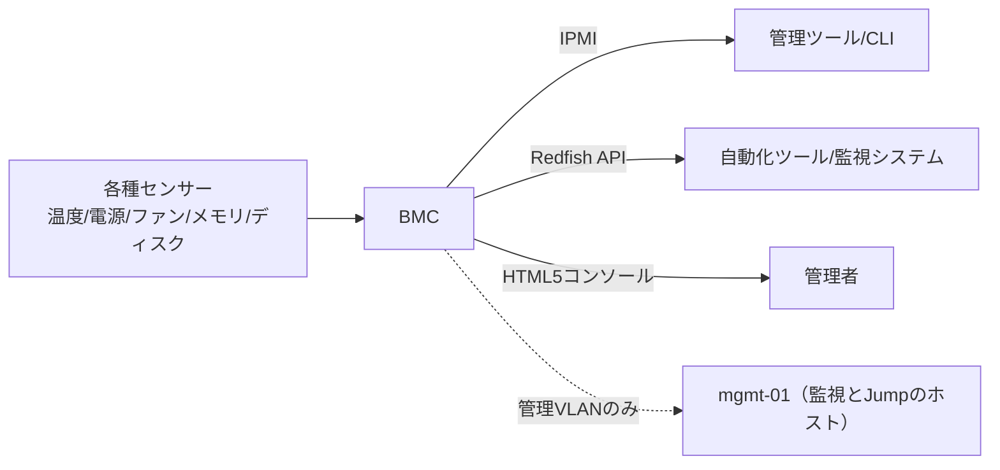

# 第10章 BIOS、UEFI、ファームウェアとBMC

## 学習目標

- BIOSとUEFI、POST、ブート順序の役割を説明できる
- Secure BootとTPMの位置づけと、有効化に伴うトレードオフを述べられる
- BMC、IPMI、Redfishを使った遠隔管理の仕組みと要点を理解する
- リモートコンソールとハードウェア監視の実務上の使い方を説明できる
- ファームウェア更新のリスクを理解し、安全な更新手順を設計できる

## 10.1 役割

**ファームウェア**は、ハードウェアとOSの間に位置し、電源投入直後の初期化と、ハードウェアの基本的な制御を担うソフトウェアである。

サーバーには、システム全体を制御するファームウェア（BIOS/UEFI）に加え、NIC、RAIDカード、SSD、そしてBMCそれぞれに独立したファームウェアが存在する、多層構造になっている。

古いバージョンのファームウェアは、既知の不具合や、公表済みのセキュリティ脆弱性を放置することにつながる。

一方で、十分な検証や準備をせずに更新を行うと、起動不能や機能不全といった新たな障害を引き起こすリスクがある。

ファームウェア管理は、「新しくすれば安全」でも「触らなければ安全」でもなく、計画的なリスク管理が求められる領域である。

## 10.2 動作原理

### 10.2.1 BIOSとUEFI

**BIOS**（Basic Input/Output System）は、伝統的なファームウェアインタフェースの名称である。

**UEFI**（Unified Extensible Firmware Interface）は、現代の主流となっているファームウェアインタフェースであり、GPT（GUID Partition Table、大容量ディスクに対応したパーティション形式）、グラフィカルな設定画面、そして後述のSecure Bootなどを扱いやすい設計になっている。

互換性維持のため、UEFI搭載機であっても、従来のBIOS互換動作（レガシーモード、または互換性サポートモジュール）を残している製品もある。

新規構築時は、特別な互換性要件がない限り、UEFIネイティブモードでの運用を基本とすることが推奨される。

### 10.2.2 POST

**POST**（Power-On Self-Test）は、サーバー起動時に行われるハードウェアの自己診断処理である。

メモリ、CPU、そしてその他の主要デバイスを初期化しながら異常の有無を確認し、致命的な異常を検知した場合は、ビープ音のパターンやエラーコードの表示によって、起動処理をそこで停止する。

POSTで停止する障害は、多くの場合、OSより下位のハードウェア層に原因があることを示しており、OSの起動ログを見ても手がかりが得られない。

### 10.2.3 ブート順序

**ブート順序**は、どのデバイスからOSローダー（起動用の小さなプログラム）を読み込むかを決める設定である。

USBメディア、PXE（Preboot eXecution Environment、ネットワーク経由の起動）、ローカルディスクなど、複数の候補の優先順位を誤って設定すると、意図しない媒体から起動してしまうことがある。

本番環境で稼働するサーバーでは、不要なブートエントリを削除し、意図した経路以外から起動しないよう設定を絞り込むことが望ましい。

### 10.2.4 Secure Boot

**Secure Boot**は、あらかじめ登録された鍵で署名されたブートローダーのみを許可し、それ以外の実行を拒否する仕組みである。

ブート改ざん（マルウェアによる起動プロセスの乗っ取りなど）への対策として有効に機能する一方、署名されていない独自ドライバや、古いOSとの組み合わせでは、正常に起動できなくなることがある。

やむを得ずSecure Bootを無効化する場合は、それをセキュリティ上の例外として、理由と承認記録を残しておく。

### 10.2.5 TPM

**TPM**（Trusted Platform Module）は、暗号鍵や、起動プロセスの状態を示す計測値を安全に保持するための専用セキュリティチップである。

ディスク全体の暗号化、リモート認証（機器の正当性をネットワーク越しに証明する仕組み）、そして各種の資格情報保護に利用される。

TPMは多くの場合マザーボードに固定されているため、マザーボード自体の交換を行う際には、暗号化されたディスクの復旧鍵の扱いが重要な検討事項になる。

事前に復旧鍵を安全な場所へ退避しておかないと、正当な管理者であってもデータへアクセスできなくなるおそれがある。

### 10.2.6 ファームウェア更新

ファームウェアの更新は、メーカーが提供するパッケージを用いて、システムファームウェア（BIOS/UEFI）、BMCファームウェア、各種デバイスのファームウェアを、それぞれ更新する作業である。

これらのファームウェア間には依存関係があることが多く、更新の順序を誤ると、機器が不整合な状態になることがある。

更新処理の途中で電源が切断されると、ファームウェアが破損し、機器が起動不能になる高リスクな状況を招く。

そのため、更新作業はUPSによる電源の安定確保と、明文化された更新手順を前提として実施する。

### 10.2.7 BMC

**BMC**（Baseboard Management Controller）は、サーバー本体のOSとは独立して動作する、専用の管理用コンピュータである。

BMCは、独自の電源系統とネットワークインタフェースを持ち、本体のOSが停止していても、電源のオンオフ操作、各種センサーの監視、リモートコンソールの提供、そしてログの収集を行える。

このBMCは、専用の管理ネットワーク（管理VLANなど）に接続し、インターネットへ直接公開しないことが、セキュリティ上の基本原則である。

### 10.2.8 IPMI

**IPMI**（Intelligent Platform Management Interface）は、BMCを操作するための代表的な業界標準インタフェースである。

長年にわたり広く使われてきた実績がある一方、古い実装や、弱い認証方式のままの機器は、外部からの攻撃対象になりやすいという課題がある。

運用にあたっては、強固なパスワードの設定、専用VLANによるネットワーク分離、そして不要な機能やアカウントの無効化を徹底する。

### 10.2.9 Redfish

**Redfish**は、比較的新しい、RESTful（HTTPベースの標準的な設計様式）なハードウェア管理APIの標準規格である。

構成管理ツールや自動化スクリプトとの親和性が高く、大規模環境での運用自動化に向いている。

規格として標準化されているものの、対応する機能範囲や実装の細部は、製品ごとに差があるため、導入前に対応状況を確認する必要がある。

### 10.2.10 リモートコンソール

BMCが提供するリモートコンソール機能を使うと、HTML5対応ブラウザや専用ビューアアプリケーションを通じて、遠隔からBIOS画面やOSのコンソール画面を操作できる。

ネットワークの品質（帯域や遅延）が低い環境では、この操作性が大きく損なわれることがある。

緊急時に備え、リモートコンソールが使えない場合の代替手段（現地作業員への電話連絡による手順代行など）をあらかじめ用意しておく。

### 10.2.11 ハードウェア監視

温度、電源の状態、ファンの回転数、メモリエラーの発生状況、そしてディスクの予測障害情報などを、BMC経由で取得できる。

これらの情報は、SNMP（Simple Network Management Protocol）、Redfish API、またはベンダー提供の専用エージェントソフトウェアを通じて、監視システムへ連携される。

監視項目を設計する際は、単に「稼働しているかどうか」だけでなく、これらのセンサー情報を組み込むことで、故障の予兆を早期に検知できるようになる。

## 10.3 主要な性能指標と運用指標

- ファームウェアバージョンの、機器間での統一率
- BMCへの到達性（ネットワーク経由での応答可否）
- センサー異常の検知から通知までにかかる時間
- ファームウェア更新の成功率と、失敗時のロールバック（切り戻し）可否
- 管理ネットワークへのアクセスログの監査状況

## 10.4 他部品との関係

仮想化支援機能の有効化、SMT（Simultaneous Multithreading）の設定、電力プロファイルの選択、NUMA関連の設定は、いずれもファームウェア（BIOS/UEFI）の設定項目として提供されることが多い(第2章、第3章参照)。

RAIDカードやNICが持つオプションROM（起動時に実行される拡張プログラム）は、サーバー全体の起動時間や、起動順序に影響を与える(第5章、第6章、第7章参照)。

TPMとディスク暗号化の組み合わせは、障害発生時の復旧手順と密接に結びついているため、両者をセットで運用手順に組み込む必要がある。

## 10.5 選定基準

1. BMC機能の充実度（リモートコンソール、仮想メディアマウント、API対応の範囲）
2. ファームウェアの提供期間（サポートライフサイクル）
3. Redfishなど自動化APIへの対応状況
4. Secure BootおよびTPMの要件を満たすかどうか
5. 更新ツールの品質と、ベンダーによる保守サポートの充実度

## 10.6 構成例

北風商事における管理方針の例を次に示す。

- BMCは管理VLANのみに接続し、業務ネットワークやインターネットからは到達不能にする
- 四半期ごとに、全機器のファームウェアバージョンを棚卸しする
- 本番環境への適用は、検証機での確認後、待機系（スタンバイ機）、最後に稼働系という順序で段階的に行う
- 更新作業の前には、更新ウィンドウ（作業時間帯）の確保と、万一のための切り戻し用媒体を準備する

## 10.7 よくある誤解

- 「BMCがあれば現地作業は一切不要である」という誤解。物理的な部品交換や、BMC自体が応答しない障害では、結局現地作業が必要になる
- 「ファームウェアは常に最新であるほど良い」という誤解。新しいバージョンが未知の不具合を含む可能性もあり、計画的な検証が必要である
- 「Secure Bootを無効化すれば問題が解決する」という誤解。根本原因（署名されていないドライバの使用など）を解決したわけではなく、リスクを残したまま先送りしているに過ぎない
- 「更新に失敗しても、再起動すれば直る」という誤解。ファームウェアの不整合は、単純な再起動では解消しないことが多い

## 10.8 代表的な障害

- POSTでの停止（起動画面から先へ進まない状態）
- ファームウェア更新後の、起動ループ（再起動を繰り返す状態）
- BMCへの到達不可（管理NICの故障、IPアドレスの重複、ファームウェアの不整合など）
- 時刻のずれによる、証明書の検証エラーやログのタイムスタンプ異常
- Secure Bootの検証エラーによる、起動の拒否

## 10.9 ファームウェア更新時のリスクと注意点

- 対象バージョンのリリースノートを読み、既知の不具合が自環境に影響しないか確認する
- BMC、BIOS/UEFI、各種ドライバの推奨される組み合わせ（互換性マトリクス）を守る
- 更新作業中は、電源とネットワークの安定を確保する
- 多数の機器を同時に一括更新することは避け、段階的に適用する
- 更新に失敗した場合のリカバリ手段（ブートブロック機能の有無、ベンダーサポートへの連絡手順）を事前に確認しておく
- 更新後は、センサー値、冗長構成、性能、そしてセキュリティ関連設定が正常であることを回帰確認する

安全上の注意として、更新処理の実行中に、強制的な電源切断を行ってはならない。

ベンダーが明示的に指示する非常時の復旧手段以外の操作は、独自の判断で行わないようにする。

## 10.10 章末問題

1. POSTの役割を述べよ。
2. BMCをインターネットへ直接公開してはいけない理由を述べよ。
3. Secure Bootが有効な環境で起動に失敗したときの切り分け方針を述べよ。
4. ファームウェア更新の推奨される適用順序（検証から本番まで）を述べよ。
5. TPMを利用している環境でマザーボードを交換する際、事前に準備すべきことは何か。

## 10.11 解答と解説

1. 起動時に主要なハードウェアを初期化し診断を行い、異常があれば管理者に知らせる役割を持つ。
2. 認証の突破や、既知の脆弱性を突いた攻撃により、電源操作やコンソールの不正な奪取といったリスクがあるため。
3. イベントログの確認、署名対象となっているコンポーネントの更新状況の確認、一時的な例外運用は承認プロセスを経て行うこと、そして設定ミスによる失敗と区別すること。
4. 検証機で動作確認を行い、次に待機系へ適用し、最後に稼働系へ適用する。多数台への一括同時適用は避ける。
5. ディスク暗号化の復旧キーの確認、TPMクリア手順の確認、暗号化機能に応じた復旧手段の事前確認が必要である。

## 10.12 実務演習

hv-02のBMCだけが到達不能になった。

一方、OS上で稼働している業務仮想マシンは、引き続き正常に稼働している状態である。

次を行え。

1. 現地作業に入る前に、遠隔から確認できる項目（管理NICのスイッチポート状態、IPアドレスの重複有無、他機器のBMC状態との比較など）を洗い出す
2. 現地作業に入った場合の、確認と対応の順序を整理する
3. 業務への影響（現時点ではないが、今後のリスク）について、関係者への説明文を作成する
