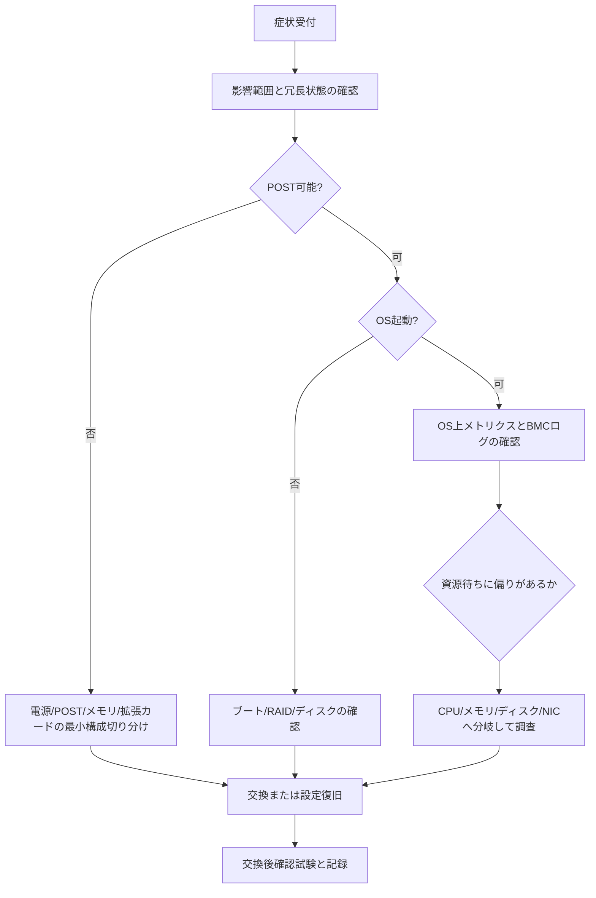

# 第14章 障害診断と保守

## 学習目標

- 症状から起動系、メモリ、ディスク、RAID、NIC、電源、温度のいずれに問題があるかを切り分けられる
- BMCログ、OSログ、LEDを組み合わせた一次切り分けの手順を実行できる
- 部品交換の安全手順（静電気対策を含む）を、具体的な作業順序として説明できる
- 交換後の確認項目と、保守記録として残すべき内容を標準化できる
- 性能劣化や間欠障害を、ハードウェア故障と決めつけずに切り分けられる

## 14.1 部品または技術の役割

障害診断は、勘や経験だけで部品を交換することではない。

観測可能な事実（ログ、センサー値、LED表示、動作再現条件）を積み重ね、故障している可能性がある範囲を段階的に狭めていく作業である。

保守は、目の前の障害を復旧させるだけでなく、再発防止策の検討と記録の作成まで含めて完了する。

記録を残さない障害対応は、次に同じ問題が起きたときに、同じ調査を最初からやり直すことになり、組織として学習が積み上がらない。

## 14.2 動作原理（切り分けの基本方針）

障害対応の基本方針は次のとおりである。

1. **影響範囲を止める**：被害が拡大しないよう、まず影響範囲を確定し、必要なら縮退運転や切り離しを行う
2. **最近の変更を確認する**：直近のファームウェア更新、設定変更、増設作業がなかったかを確認する
3. **ハードウェア状態を見る**：BMCのイベントログ、LED表示、POST（Power-On Self-Test、電源投入時自己診断）の結果を確認する
4. **OS・アプリケーションログを見る**：ハードウェアに異常がなければ、ソフトウェア層のログへ視点を移す
5. **冗長経路を使って二分探索する**：冗長化されている経路（電源、NIC、ディスクなど）の片系を切り離して反応を見る
6. **一度に一つの変更だけを行う**：複数の変更を同時に行うと、何が効いたのか分からなくなる

間欠障害（一時的に発生し、再現性が低い障害）では、発生した時間帯、そのときの温度、負荷状況、振動の有無などの相関を記録し、パターンを見つける。

## 14.3 症状別の切り分け

### 14.3.1 電源が入らない

確認する順序の例を示す。

1. 壁面コンセントまたはPDU（Power Distribution Unit、電源分配ユニット）の通電状態、UPSの状態
2. 電源ケーブルの両端（サーバー側、PDU側）の接続
3. PSU（電源装置）のLED表示、BMCへの到達可否
4. 別系統のコンセントへ差し替えての切り分け
5. 最小構成（CPU・メモリ最小構成、拡張カード類を外した状態）での起動試行

原因候補として、PDUの故障、PSU自体の故障、マザーボードの故障、内部短絡、遠隔電源設定（Wake on LANなどの誤設定）などが考えられる。

### 14.3.2 POSTが完了しない

- BMCのイベントログやビープ音のパターンから、エラーコードを確認する
- メモリモジュールを再挿着する、または1枚のみで起動を試みる
- GPUや拡張カードを一時的に外して切り分ける
- CMOS（BIOS設定を保持する記憶領域）や設定の初期化は、影響範囲と手順を確認してから実施する

### 14.3.3 OSが起動しない

- POSTが成功しているかどうかで、まず境界線を引く
- ブート順序、Secure Boot設定、ブートローダーの状態を確認する
- ディスクの認識状況、RAIDアレイの状態を確認する
- 起動媒体自体の破損なのか、設定変更が原因なのかを分離して考える

### 14.3.4 メモリエラー

- CE（Correctable Error、訂正可能エラー）が多発しているのか、UE（Uncorrectable Error、訂正不能エラー）が発生しているのかを区別する
- 特定のスロットに偏っていないかを確認する
- メーカー提供の診断ツールでメモリテストを実行する
- メモリ不足によるスワップ発生の症状と、ハードウェア的なメモリエラーを混同しない

### 14.3.5 ディスク障害

- S.M.A.R.T.（Self-Monitoring, Analysis and Reporting Technology、ディスクの自己診断機能）の値、RAIDコントローラーのログを確認する
- タイムアウトの発生状況、セクタの再割り当て回数を確認する
- ファイルシステムレベルのエラーと、物理ディスクのエラーを切り分ける
- 交換作業に入る前に、バックアップの最新の成功状況を必ず確認する

### 14.3.6 RAID劣化（Degraded）

- どの物理スロットが故障（Failed）状態かを特定する
- リビルド（再構築）が可能な状態か、ホットスペアが存在するかを確認する
- リビルド中は追加故障のリスクが高まることを、関係者へ明示的に伝える
- 誤って正常なディスクを抜いてしまわないよう、二人以上でのダブルチェックを徹底する

### 14.3.7 NICリンクダウン

- 対向機器の状態、ケーブルの物理状態、光トランシーバーモジュール、オートネゴシエーションの設定を確認する
- チーミング構成の場合、片系だけの障害か、両系とも障害かを切り分ける
- 直前にドライバやファームウェアを更新していた場合は、その変更を疑って切り分ける

### 14.3.8 電源故障

- 冗長電源の片系喪失アラートを確認する
- 入力電圧、PSU自体のログを確認する
- 残った片系だけでピーク電力を支えられるか、監視を強化する

### 14.3.9 ファン故障

- どのファンが対象か特定する（CPU用、筐体用、PSU内蔵など)
- 温度の上昇速度を確認する
- ホットスワップ対応ファンであれば、稼働中の手順に従って交換する
- 騒音の急な変化は、故障の予兆であることがある

### 14.3.10 温度異常

- 吸気温度、フィルターやラック内のほこりの堆積、ブランクパネルの欠落、室内空調の状態を確認する
- サーマルスロットリング（温度上昇による自動的な性能低下）が発生していないか確認する
- 特定の拡張カード付近だけが局所的に高温になっていないか確認する

### 14.3.11 性能劣化

- CPU、メモリ、ディスク、NICのそれぞれについて、待ち時間の内訳を分解する
- 周波数低下（電力制限や温度によるもの）、RAIDのリビルド中、バックアップジョブとの競合、仮想化環境でのノイジーネイバー（同居する他の仮想マシンの負荷影響）の可能性を確認する
- 性能劣化は、必ずしもハードウェア故障が原因とは限らない

### 14.3.12 間欠障害

- 発生条件（時間帯、負荷状況、実行中のジョブ）を記録する
- センサーの履歴データを確認する
- ケーブルの再接続前後で症状が変化するかを比較する
- 温度、振動、特定バッチジョブとの相関を確認する

## 14.4 ログとLEDの確認

障害調査で確認すべき情報源は次のとおりである。

| 情報源 | 確認内容 |
|---|---|
| 筐体LED | 故障しているスロットやコンポーネントの物理的な位置表示 |
| BMCイベントログ（SEL相当） | センサー閾値超過、電源イベント、ハードウェアエラーの記録 |
| RAID/HBAログ | アレイ状態、ディスクの故障・リビルド履歴 |
| OSログ（syslog、dmesg相当） | カーネルレベルのデバイスエラー、ドライバの警告 |
| スイッチ側ポートログ | リンク状態、エラーカウンタ、パケット廃棄状況 |
| 監視システムのアラート履歴 | 時系列での異常発生パターン |

LEDの表示と、管理ソフトウェア上のスロット番号の体系が、製品によって一致しない場合がある。

必ず配線図・搭載図と照合してから作業対象を確定する。

## 14.5 部品交換

### 14.5.1 交換前の確認

- バックアップの状態、冗長構成が現在どの状態にあるか
- 保守契約の内容と、交換部品の型番の一致
- 影響範囲の説明と、必要な承認の取得
- 作業手順書の準備

### 14.5.2 交換作業中の注意

- 静電気対策を徹底する
- 交換対象以外の部品やケーブルには触れない
- ケーブルを抜く前に接続状態を写真で記録する
- 一度に一つの変更のみを行う

### 14.5.3 交換後の確認

- POST完了、BMC上のセンサー値の確認
- RAIDアレイの再構築完了確認
- 冗長経路（電源、NIC、ディスク）の試験
- 性能面のスモークテスト（簡易的な負荷確認）
- 監視システム上のアラート解消確認

### 14.5.4 交換後の動作確認（詳細手順）

部品を物理的に戻しただけでは、作業完了とはみなさない。

次の順序で確認する。

1. 電源投入とPOST完了の確認
2. BMC上のセンサー値に異常がないことの確認
3. OSまたはハイパーバイザーが対象デバイスを正しく認識していることの確認
4. 冗長構成（電源、NIC、RAID）が正常な状態に復帰していることの確認
5. 業務相当のスモークテスト（疎通確認、書き込みテスト、フェイルオーバー試験など）の実施
6. 監視アラートが解消し、新たな異常アラートが出ていないことの確認

ファームウェア更新やリビルドを伴う交換作業では、完了時刻と担当者を記録し、その後24時間は重点的に監視を続けることが望ましい。

## 14.6 静電気対策

- リストストラップ、導電性の作業マットを使用する
- 筐体の金属部に触れて電位を合わせてから作業を開始する
- 基板の表面やコネクタのピンには直接触れない
- 特に湿度の低い環境では、静電気対策をより徹底する

安全上の注意：電源ユニット内部、UPSのバッテリー、光トランシーバーモジュールのレーザー光、重量物の落下には特に注意する。

不明な点がある場合は、通電状態のまま内部に触れず、必ず電源を切り、残留電力や残熱が下がったことを確認してから作業する。

## 14.7 保守作業の記録

保守記録として最低限残すべき項目は次のとおりである。

- 作業日時、作業者、承認者
- 対象ホスト名、ラック位置、機器のシリアル番号
- 発生した症状と、収集したログ
- 実施した作業内容、交換した部品の新旧シリアル番号
- 対応結果、残っている課題、次に行うべきアクション

記録がない障害対応は、同じ問題が再発した際に、また一から同じ調査を繰り返すことになる。

記録は個人の記憶に依存させず、誰が見ても経緯が分かる形で残す。

## 14.8 構成例（標準切り分けフロー）

## 14.9 よくある誤解

- 「再起動して直ったから対応完了」：再発防止の原因調査を省略すると、同じ障害が繰り返される
- 「アラートが消えたから原因も解消した」：アラートの消失は、しきい値を一時的に下回っただけの場合がある
- 「同じ型番の部品ならどれを抜いても同じ」：搭載位置やファームウェアバージョンによって挙動が異なることがある
- 「間欠障害だから、しばらく様子を見れば十分」：間欠障害は前兆であることが多く、記録と傾向監視を怠るべきではない

## 14.10 代表的な二次災害

- 正常に稼働しているディスクを誤って抜いてしまう
- リビルド中に追加の負荷（別作業やバッチ処理）を投入してしまう
- 記録を残さずに交換した結果、構成台帳と実機の不整合が生じる
- 静電気対策を怠り、交換部品や周辺の基板を損傷させる
- 管理ネットワークを誤って停止させ、遠隔での復旧手段を自ら失う

## 14.11 注意点（調査・交換時）

- 本番環境の作業では、ロールバック条件（作業を中止して切り戻す基準）を事前に決めておく
- ベンダー保守契約がある場合、契約範囲外の作業を独断で行わない
- 故障した部品は、返却・保管・データ消去の方針に従って扱う
- 作業完了後24時間は、重点的に監視を継続する

## 14.12 章末問題

1. POST不可の状態とOS起動不可の状態を、最初に切り分ける理由を述べよ。
2. RAID劣化（Degraded）状態を発見した際、最初に確認すべきことを三つ挙げよ。
3. 性能劣化が発生した際、すぐにハードウェア交換に踏み切ってはいけない理由を述べよ。
4. 静電気対策として実施すべき具体策を三つ挙げよ。
5. 部品交換後の確認として必須の項目を五つ挙げよ。

## 14.13 解答と解説

1. 故障している可能性のある範囲が、ファームウェアやハードウェア初期化の段階にあるのか、それともブート以降のソフトウェア層にあるのかを、早期に分けるため。原因調査の対象範囲が大きく異なる。
2. 故障している物理スロットの特定、バックアップの健全性確認、ホットスペアの有無やリビルド可否の確認、誤って正常ディスクを抜かないためのダブルチェック体制。
3. バックアップジョブとの競合、設定変更の影響、仮想化環境でのノイジーネイバー、サーマルスロットリングなど、ハードウェア故障以外の要因が多く存在するため。安易な交換は原因を見誤り、コストと停止リスクだけを増やす。
4. リストストラップと導電マットの使用、作業前に筐体金属部へ触れて電位を合わせること、基板面やコネクタピンに直接触れないこと、保管時は静電気防止袋を使用すること、のうち三つ。
5. POST完了の確認、BMCセンサー値の確認、冗長構成（電源、NIC、RAID）の正常復帰確認、業務相当のスモークテスト、監視アラートの解消確認。

## 14.14 実務演習

夜間、`db-01`から「RAID Degraded」のアラートが発報された。

業務は現時点で継続しているが、冗長性が低下している状態である。

次の内容を含む対応資料を作成せよ。

- 発報後30分以内に実施する初動対応の手順（誰が何を確認するか）
- 業務関係者へ向けた状況説明文（性能・信頼性・停止リスクの観点を含めること）
- 交換部品の到着タイミングによって対応方針をどう変えるか（即日対応可能な場合と、翌営業日対応になる場合を分けて記述する）
- 交換・リビルド完了までの間、監視すべき項目とその頻度
- 翌日の朝会で報告すべき内容の要点
