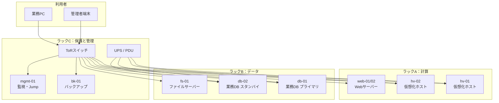
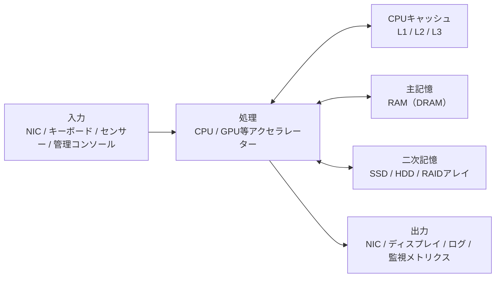
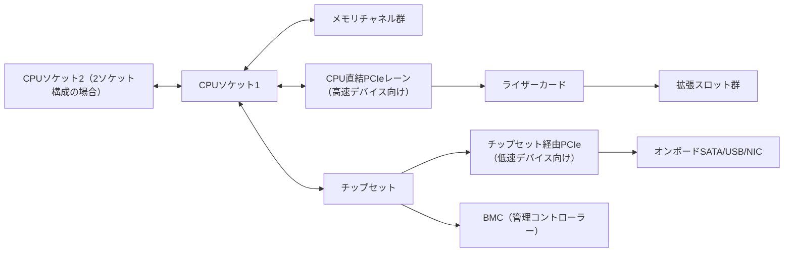
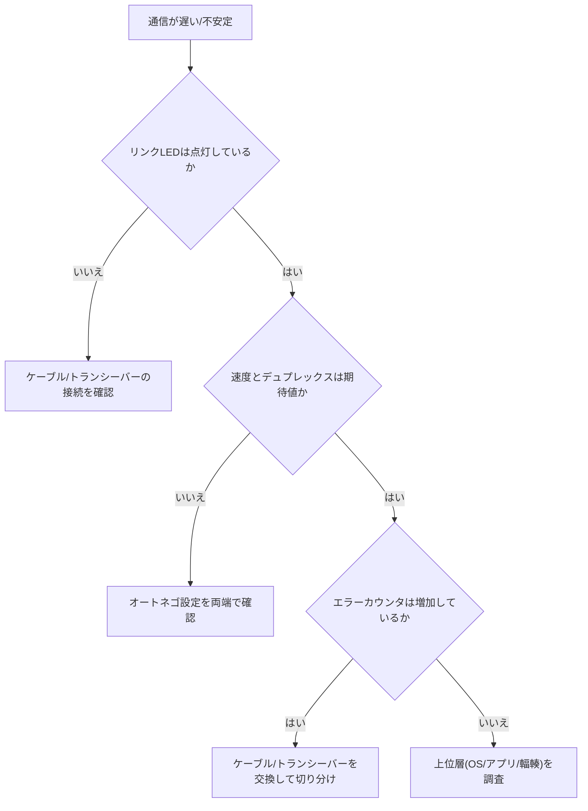
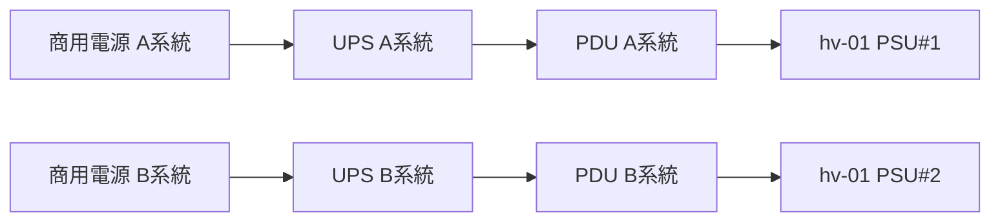
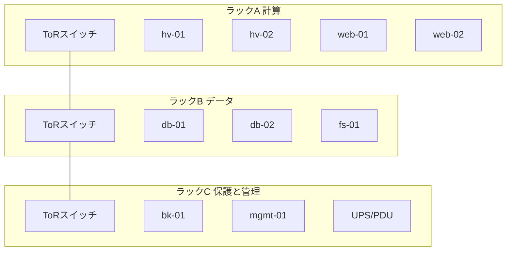
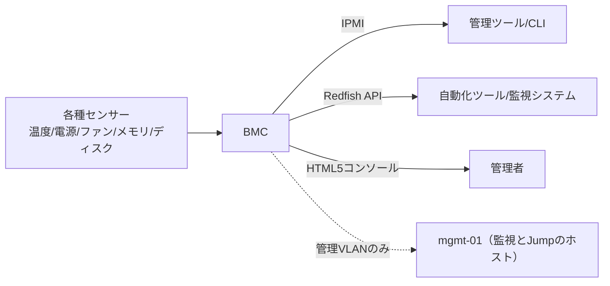
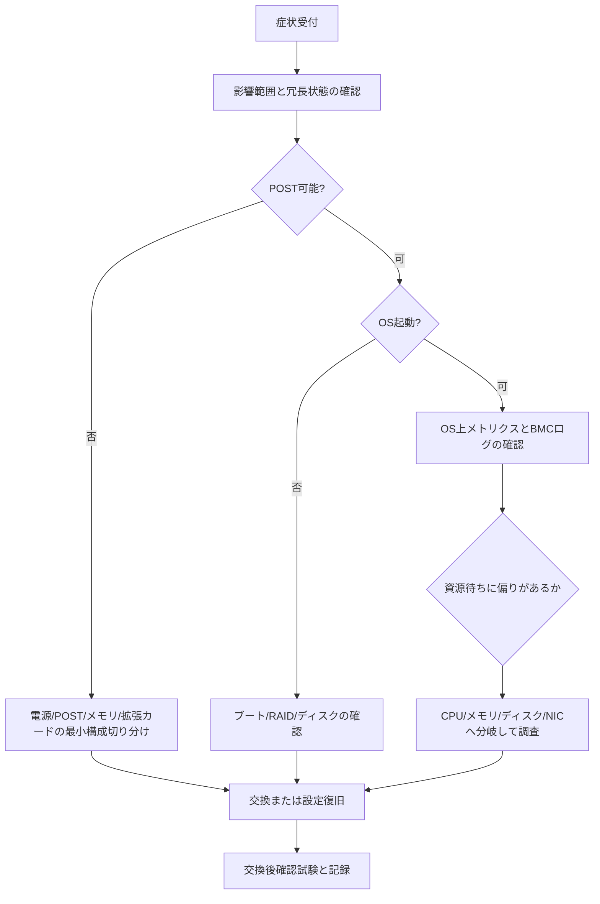

# ITインフラエンジニアのためのハードウェア基礎・実務解説書

## 本書の目的

本書は、コンピューターハードウェアの構成要素と動作原理を理解し、用途に応じた機器選定、性能見積もり、冗長化設計、障害切り分け、交換作業を行える状態になることを目的とする。

製品名やスペック表の暗記ではなく、各部品がシステム性能、信頼性、保守性、消費電力、コストにどのような影響を与えるかを説明する。

製品固有の仕様は世代や時期によって変わる。本書の数値例は理解のための目安であり、調達時は必ず現行のデータシートを確認すること。

## 想定読者

- インフラエンジニアを目指す初学者
- サーバーやPCの内部構造を体系的に理解したい人
- ハードウェア選定や障害対応を担当する人
- 仮想化基盤やクラウドの物理基盤を理解したい人

## 読み方

第1章で全体像を掴み、第2章から第12章で部品単位の知識を積む。

第13章と第14章で選定と障害対応に統合する。

実務シナリオは、章で得た知識をトレードオフ判断に落とすための演習である。

---

## 詳細目次

各章は共通して、学習目標、部品または技術の役割、動作原理、主要な性能指標、他の部品との関係、選定基準、構成例、よくある誤解、代表的な障害、調査・交換時の注意点、章末問題、解答と解説、実務演習という構成を取る。

以下は各章の「動作原理」で扱う主要トピックの一覧である。

### 第1章 コンピューターハードウェアの全体像

基本構成とデータパスの考え方、入力/処理/記憶/出力、マザーボード、バス(PCI Express等)、チップセット、ファームウェア(BIOS/UEFI)、PCとサーバーの違い、物理サーバーとクラウド基盤の関係

### 第2章 CPU

CPUの役割と命令実行の流れ、クロック周波数、IPC、コアとスレッド、SMT、キャッシュ階層、CPUソケットとマルチソケット構成、NUMA、TDPと消費電力、x86-64とARM、仮想化支援機能、単一の数値で比較できない理由(ボトルネックの見分け方は障害節で扱う)

### 第3章 メモリ

RAMとDRAMの役割、DIMM、DDR世代、容量・速度・レイテンシ、メモリチャネル、ECC、Registered DIMM(RDIMM/LRDIMM)、メモリランク、NUMAとの関係、増設ルール(メモリエラーの解釈と、容量不足との違いは障害節で扱う)

### 第4章 ストレージデバイス

HDD、フラッシュメモリ、SATA SSD、NVMe SSD、IOPS、スループット、レイテンシ、シーケンシャルとランダム、書き込み耐久性(TBW、DWPD)、S.M.A.R.T.、ホットスワップ(選定基準と障害兆候は各節で扱う)

### 第5章 RAIDとストレージ構成

ストライピング、ミラーリング、パリティ、RAID 0/1/5/6/10の実効容量・障害耐性・性能比較、リビルド、RAIDコントローラー(ハードウェアRAID/ソフトウェアRAID)、キャッシュとBBU、ホットスペア(バックアップとの違い、大容量ディスクのリビルドリスクは各節で扱う)

### 第6章 マザーボードと拡張インターフェース

6.1 マザーボード構成、ソケット、メモリスロット
6.2 PCI Express、レーン数、拡張カード
6.3 NIC、HBA、RAIDカード、GPU
6.4 USB、SATA、M.2、U.2、U.3
6.5 帯域不足の考え方
6.6 章末問題、実務演習

### 第7章 ネットワークインターフェース

7.1 NIC、Ethernet、速度、全二重、オートネゴシエーション
7.2 RJ45、光トランシーバー、SFP系、DAC、AOC
7.3 チーミング、オフロード、SR-IOV、MACアドレス
7.4 リンク障害の調査
7.5 章末問題、実務演習

### 第8章 電源と冷却

8.1 PSU、定格、効率、80 PLUS、冗長電源
8.2 電源容量見積もり、UPS、PDU、突入電流
8.3 ファン、ヒートシンク、エアフロー、温度管理
8.4 サーマルスロットリング、高温障害、冗長化
8.5 章末問題、実務演習

### 第9章 シャーシ、ラック、データセンター設備

9.1 タワー、ラック、ブレード、ラックユニット
9.2 搭載、重量、奥行き、ケーブル管理、電源設計
9.3 冷却、ホットアイルとコールドアイル
9.4 接地、入退室、火災、地震、資産管理
9.5 章末問題、実務演習

### 第10章 BIOS、UEFI、ファームウェア

10.1 BIOSとUEFI、POST、ブート順序
10.2 Secure Boot、TPM、ファームウェア更新
10.3 BMC、IPMI、Redfish、リモートコンソール
10.4 ハードウェア監視と更新リスク
10.5 章末問題、実務演習

### 第11章 GPUとアクセラレーター

11.1 GPUの基本、CPUとの違い、VRAM
11.2 GPGPU、AI、映像処理
11.3 PCIe帯域、消費電力、冷却
11.4 GPU仮想化の概要と選定
11.5 章末問題、実務演習

### 第12章 周辺機器と入出力装置

12.1 ディスプレイ、キーボード、マウス、KVM
12.2 USB機器、プリンター、外付けストレージ
12.3 シリアルコンソール、管理用途の周辺機器
12.4 章末問題、実務演習

### 第13章 ハードウェア選定とサイジング

13.1 ワークロードから見る選定観点
13.2 Web、DB、仮想化、バックアップの構成例
13.3 将来拡張、冗長性、保守、ライフサイクル
13.4 章末問題、実務演習

### 第14章 障害診断と保守

14.1 起動系、メモリ、ディスク、RAID、NICの切り分け
14.2 電源、ファン、温度、性能劣化、間欠障害
14.3 ログとLED、交換手順、静電気対策、記録
14.4 章末問題、実務演習

### 実務シナリオ集

S1 仮想マシン20台の物理サーバー選定
S2 業務データベース用サーバー設計
S3 RAID構成の比較選定
S4 冗長電源とUPS設計
S5 ラック搭載計画
S6 ディスク障害時の交換手順
S7 CPU、メモリ、ストレージのボトルネック調査

---

## 各章の到達目標

| 章 | 到達目標 |
|---|---|
| 第1章 | コンピューターをデータパスの集合として説明し、PCとサーバー、クラウド物理基盤の違いを述べられる |
| 第2章 | CPUの性能指標を分解し、単一ベンチマークに頼らず選定とボトルネック判断ができる |
| 第3章 | メモリ構成の互換性と冗長・容量設計を行い、ECCエラーを正しく解釈できる |
| 第4章 | IOPS、スループット、耐久性からストレージを選定し、障害兆候を検知できる |
| 第5章 | RAIDレベルを用途とリスクで比較し、バックアップとの違いを説明できる |
| 第6章 | PCIeレーンと拡張カードの帯域制約を見積もれる |
| 第7章 | NICとトランシーバーを選定し、リンク障害を物理から論理へ切り分けられる |
| 第8章 | 電源容量と冷却を見積もり、冗長化と温度異常の影響を説明できる |
| 第9章 | ラック搭載計画を重量、電源、冷却、運用の観点で作成できる |
| 第10章 | BMC経由の監視とファームウェア更新のリスク管理ができる |
| 第11章 | GPUの電力・帯域・冷却制約を踏まえて選定できる |
| 第12章 | 管理用周辺機器を障害対応の動線に組み込める |
| 第13章 | ワークロードから構成案を作り、トレードオフを明示できる |
| 第14章 | 症状から部品単位の切り分け手順を実行できる |

---

## 全体を通じて使用する仮想システム構成

本書では、架空の中規模企業「北風商事」のオンプレミス基盤を一貫して使う。

製品世代や価格は時期によって変わるため、数値は学習用の仮置きである。

### 組織と要件

- 従業員：約800名
- 主要システム：社内ポータル、販売管理DB、ファイルサーバー、仮想化基盤、バックアップ
- SLA：業務時間帯の計画停止は月1回まで、重大障害の目標復旧時間は4時間以内
- 設置場所：自社サーバールーム（ラック6本、冷却はコールドアイル方式）

### 仮想構成図



### 主要ホストの仮スペック

#### hv-01 / hv-02（仮想化ホスト）

- CPU：2ソケット × 16コア（SMT有効で論理32スレッド/ソケット）
- メモリ：512 GiB DDR5 ECC RDIMM、8チャネル構成
- ストレージ：OS用 NVMe 1.92 TB × 2（ミラー）、データ用は共有ストレージまたはローカルRAID
- NIC：25 GbE × 2（チーミング）、管理用 1 GbE × 1
- 電源：800 W 冗長（1+1）
- 用途：仮想マシン約20台/ホストを想定した設計演習の基準機

#### db-01 / db-02（業務データベース）

- CPU：2ソケット × 24コア
- メモリ：256 GiB ECC RDIMM
- ストレージ：NVMe 3.84 TB × 4（RAID 10）、WAL用分離も検討
- NIC：10 GbE × 2
- 電源：1200 W 冗長（1+1）
- 用途：低レイテンシと可用性を優先する設計例

#### web-01 / web-02（Webサーバー）

- CPU：1ソケット × 8コア
- メモリ：64 GiB ECC
- ストレージ：SATA SSD 960 GB × 2（RAID 1）
- NIC：10 GbE × 2
- 電源：単一または冗長は要件次第

#### bk-01（バックアップ）

- CPU：1ソケット × 12コア
- メモリ：128 GiB
- ストレージ：大容量 HDD RAID 6、またはオブジェクトストレージ連携
- NIC：10 GbE × 2（バックアップ窓の帯域確保）

#### mgmt-01（監視・Jumpホスト）

- CPU：1ソケット × 4コア
- メモリ：32 GiB
- ストレージ：SSD 480 GB × 2（RAID 1）
- 役割：BMC集約、監視、作業用踏み台

### 命名と単位の約束

- 容量表記：ストレージメーカー表記の TB（10^12バイト）と、OSで見える TiB（2^40バイト）を区別する
- メモリ：GiB を基本とする
- ネットワーク：理論帯域と実効帯域を区別する
- 「カタログ値」と「実測値」を混同しない

### 安全上の共通注意

- 電源投入中の内部作業は原則禁止とする
- ホットスワップ対応部品以外は、手順書と保守契約に従う
- 静電気対策（リストストラップ、作業マット）を実施する
- 重量物のラック搭載は二人以上で行う
- 高電圧、バッテリー、冷却液、レーザー光モジュールの取り扱いは製品手順に従う

---

## ファイル構成

| ファイル | 内容 |
|---|---|
| `00_overview.md` | 目次、到達目標、仮想構成（本ファイル） |
| `01_computer_hardware_overview.md` | 第1章 |
| `02_cpu.md` | 第2章 |
| `03_memory.md` | 第3章 |
| `04_storage_devices.md` | 第4章 |
| `05_raid.md` | 第5章 |
| `06_motherboard_interfaces.md` | 第6章 |
| `07_network_interface.md` | 第7章 |
| `08_power_cooling.md` | 第8章 |
| `09_chassis_rack_datacenter.md` | 第9章 |
| `10_firmware_bmc.md` | 第10章 |
| `11_gpu_accelerators.md` | 第11章 |
| `12_peripherals.md` | 第12章 |
| `13_sizing_selection.md` | 第13章 |
| `14_troubleshooting_maintenance.md` | 第14章 |
| `15_practical_scenarios.md` | 実務シナリオ集 |
| `README.md` | 案内 |

次章から、第1章を順に展開する。


# 第1章 コンピューターハードウェアの全体像

## 学習目標

- コンピューターを入力、処理、記憶、出力というデータの流れとして説明できる。

- マザーボード、バス、チップセット、ファームウェアの役割を、相互の依存関係とともに説明できる。

- 民生用PCとエンタープライズサーバーの違いを、単純な性能比較ではなく信頼性、保守性、運用性の観点から述べられる。

- クラウドサービスと物理サーバーの関係を、責任分界点と障害の抽象化の限界という観点で理解できる。

- 部品単体のスペックではなく、システム全体のどこが制約になっているかを考える視点を持てる。

## 1.1 部品または技術の役割

コンピューターとは、データを受け取り、加工し、保持し、外部へ返す装置である。

この定義は、スマートフォンから大規模なデータセンターのサーバーまで共通する。

インフラエンジニアが日常的に扱うハードウェアは、この一連の流れを止めずに、かつ安定して繰り返すために組み合わされた部品の集合体である。

ソフトウェアエンジニアがアルゴリズムやコードの正しさを主な関心事にするのに対し、インフラエンジニアは「そのコードが実際にどの物理資源の上で、どれだけの速さで、どれだけ壊れずに動くか」を主な関心事にする。

単体の部品が速いかどうかだけでなく、その部品が止まったときにサービス全体がどうなるか、壊れた部品をどれだけ短時間で交換できるか、消費する電力と発する熱をどう管理するかが設計対象になる。

本章では、コンピューターというシステムを構成する骨格を先に押さえる。

第2章以降で扱うCPU、メモリ、ストレージ、RAID、ネットワーク、電源、冷却、筐体、ファームウェアは、すべてこの骨格の上に位置づけられる部品である。

骨格を理解しないまま個々の部品スペックだけを暗記すると、実際の障害対応や選定の場面で「なぜその部品がボトルネックになるのか」を説明できなくなる。

本章で押さえる中核概念は次のとおりである。

- **マザーボード**: 部品同士を電気的、論理的に接続する基板

- **バス**: データと制御信号が流れる通り道

- **チップセット**: CPUと周辺デバイスの間の入出力を制御する回路群

- **ファームウェア**: 電源投入直後からOSが起動するまでの間、ハードウェアを直接制御する低レベルのソフトウェア

- **PCとサーバーの違い**: 用途に応じて何を優先して設計しているかという思想の違い

- **物理サーバーとクラウド基盤の関係**: 誰がどの層の運用責任を負うかという境界線の違い

これらは独立した部品ではなく、互いに依存し合う一つのシステムとして機能する。

以降の節で、それぞれを個別に、そして相互の関係とともに解説する。

## 1.2 動作原理

### 1.2.1 コンピューターの基本構成

コンピューターの構造を説明する古典的なモデルとして、**フォンノイマン型アーキテクチャ**がある。

これは、演算を行う処理装置、プログラムとデータを保持する主記憶、そして外部とやり取りする入出力装置が、共通のバスで結ばれるという構成である。

このモデルの核心は、プログラムもデータも同じ主記憶に格納されるという点にある。

これにより、実行するプログラムを差し替えるだけで、同じハードウェアが異なる処理を行えるようになった。

現代の高性能サーバーであっても、この骨格は変わっていない。

ただし、実際の実装は大きく進化している。

CPU内部には主記憶よりはるかに高速なキャッシュメモリが複数階層存在し、ストレージはHDDからSSD、NVMeへと階層化が進み、ネットワークは事実上もっとも重要な入出力経路になっている。

下図は、現代のサーバーにおける基本構成を簡略化したものである。



この図で重要な点は、CPUを中心として、上下左右のすべての矢印に速度差があるという事実である。

CPU内部のレジスタやキャッシュへのアクセスはナノ秒単位だが、主記憶へのアクセスはその数倍から十数倍、ストレージへのアクセスはさらに桁違いに遅い。

ネットワーク越しの通信になると、物理的な距離や中継機器の処理時間が加わり、遅延はミリ秒単位まで広がることがある。

インフラ設計や障害対応の多くは、この速度差のどこかで発生する待ち時間をいかに減らすか、あるいはいかに隠すかという問題に帰着する。

### 1.2.2 入力、処理、記憶、出力

コンピューターの動作は、入力、処理、記憶、出力という4段階に整理できる。

**入力**は、システムの外部から情報が入ってくる段階である。

サーバーにおける典型的な入力は、ネットワーク経由のリクエスト（Webアクセス、データベースへのクエリ、API呼び出し）、管理コンソールからの操作、環境センサーの値、他システムからのバッチデータ転送などである。

**処理**は、CPUが命令を実行し、必要な演算や判断を行う段階である。

近年は、機械学習の推論や動画のエンコードなど、特定の計算に特化したGPUやその他のアクセラレーターへ処理の一部をオフロードする構成も一般的になっている。

**記憶**は、処理の途中経過や結果を保持する段階である。

実行中に頻繁に読み書きするデータはRAM（主記憶）に置かれ、電源を切っても残す必要があるデータはストレージ（二次記憶）に書き込まれる。

**出力**は、処理結果を外部へ返す段階である。

サーバーであれば、応答パケットの送信、画面表示、監視システムへのメトリクス送信、ログファイルへの書き込みなどが該当する。

インフラ設計や障害調査においては、この4段階のうちどこが遅くなっているのかを切り分けることが最初の一歩になる。

たとえば、CPU使用率がほとんど余っている状態でも、ストレージへの書き込み待ちでアプリケーション全体が遅くなることがある。

これは、CPUから見れば「暇」だが、システム全体から見れば「記憶」の段階で滞留が起きている状態である。

同様に、メモリ容量が不足してOSがストレージ上のスワップ領域を使い始めると、本来ナノ秒単位で完了するはずのメモリアクセスが、ミリ秒単位のストレージアクセスに置き換わり、システム全体の体感速度が大きく落ちる。

この4段階モデルは単純に見えるが、実務における一次切り分けの出発点として非常に有効である。

障害報告を受けたときに、まず「入力は届いているか、処理は動いているか、記憶は正常か、出力は出ているか」を順に確認するだけで、問題の所在をおおまかに絞り込める。

### 1.2.3 マザーボード

**マザーボード**（主基板）は、CPUソケット、メモリスロット、拡張スロット、電源コネクタ、各種インターフェース、そして管理用のコントローラーを一枚の基板上にまとめたものである。

マザーボードは単なる「部品を挿す板」ではなく、部品間の電気信号を正しいタイミングと電圧で伝えるための配線設計そのものである。

高性能なCPUやメモリを用意しても、マザーボードが対応するソケット形状、メモリ規格、拡張レーン数、電源供給能力のいずれかが不足していれば、そもそも組み合わせて使うことができない。

したがって部品選定は、CPU単体、メモリ単体のスペックだけでなく、必ずマザーボード（またはサーバーのプラットフォーム仕様）とセットで確認する必要がある。

サーバー向けマザーボードと民生用マザーボードには、設計思想の違いが表れる。

サーバー向けマザーボードは、次のような要素を標準的に備えることが多い。

- ECC（誤り訂正符号）対応メモリスロット

- 冗長電源ユニットに対応する電源コネクタ

- **BMC**（Baseboard Management Controller、ベースボード管理コントローラー）と呼ばれる、OSとは独立した管理用チップ

- 複数のCPUソケット（2ソケット、4ソケットなど）

- 多数のPCI Expressレーンとドライブベイ用コネクタ

一方、民生用マザーボードは、オーバークロック機能、映像出力端子、多数のUSB端子、ゲーミング向けの装飾機能などを重視する傾向がある。

マザーボードのフォームファクタ（外形寸法規格）も選定に影響する。

ATX、Micro-ATX、Mini-ITXといった民生規格に加え、サーバーではEATX（Extended ATX）や、シャーシメーカー独自の規格が使われることも多い。

フォームファクタは、搭載できる拡張カード数、ドライブベイ数、そして最終的にラックに収まる筐体サイズと密接に関わる。

### 1.2.4 バス

**バス**とは、コンピューター内部の部品間でデータ、アドレス、制御信号をやり取りする経路である。

古典的なバスは、複数のデバイスが一本の配線を共有する方式であった。

しかし、共有方式は接続機器が増えるほど衝突や待ち時間が増える弱点があるため、現代のコンピューターでは、機器同士が一対一で高速に通信するポイントツーポイント方式のシリアルリンクが主流になっている。

その代表例が **PCI Express**（Peripheral Component Interconnect Express、以下PCIe）である。

PCIeは、CPUと拡張カード（NIC、RAIDカード、GPU、NVMe SSDなど)との間を、複数の「レーン」と呼ばれる伝送路の束で接続する。

1レーンあたりの帯域は世代ごとに倍増してきた。

以下は、PCIeの世代ごとの片方向理論帯域（1レーンあたり)のおおまかな目安である。

数値は規格上の理論値であり、実効値はエンコード方式やプロトコルオーバーヘッド、実装の品質によって下がる。

製品世代によって対応するPCIe世代は異なるため、必ず個別のデータシートで確認すること。

| PCIe世代 | 片方向理論帯域(1レーンあたりの概算) |
|---|---|
| Gen3 | 約 1 GB/s |
| Gen4 | 約 2 GB/s |
| Gen5 | 約 4 GB/s |

拡張カードは、x1、x4、x8、x16といった複数レーン幅のスロットに挿すことで、必要な帯域を確保する。

たとえば、x16スロットに高性能GPUを挿す場合と、x4スロットにNVMe SSDを挿す場合とでは、利用できる理論帯域が大きく異なる。

バス帯域が不足すると、部品単体としては高速なNICやNVMe SSD、GPUを搭載していても、その性能を発揮できない。

これは「宝の持ち腐れ」のような状態であり、選定時にはCPUやチップセットが提供するPCIeレーンの総数と、搭載予定の拡張カードが要求するレーン数の合計を必ず突き合わせる必要がある。

なお、理論帯域と実効帯域は別物である。

符号化方式によるオーバーヘッド、プロトコルヘッダーの付加、複数デバイスによる同時転送の競合などにより、実際に得られる帯域は理論値より低くなる。

見積もりの段階では、理論値をそのまま性能予測に使わず、ベンダーが公開する実効値の目安や、実機でのベンチマーク結果を参照することが望ましい。

### 1.2.5 チップセット

**チップセット**は、CPUと周辺デバイスとの間の橋渡しを担う回路群である。

歴史的には、CPUに近く高速な処理を扱う「北橋（ノースブリッジ)」と、比較的低速な周辺機器を扱う「南橋(サウスブリッジ)」に分かれていた。

近年は、メモリコントローラーや一部のPCIeコントローラーがCPUパッケージ内に統合される傾向が進み、従来の北橋、南橋という明確な分離は薄れている。

サーバー向けCPUでは、チップセットに相当する部分を **PCH**（Platform Controller Hub）と呼ぶこともある。

呼び方や統合度は世代とプラットフォームによって異なるため、実務では「CPU単体のスペック」ではなく「CPUとチップセット（プラットフォーム)を組み合わせたときの上限」を確認する習慣が重要である。

具体的には、次のような項目がチップセットまたはプラットフォーム仕様として提供される。

- 利用可能なPCIeレーンの総数と対応世代

- SATAポートの数

- USBコントローラーの世代と口数

- 対応するメモリチャネル数と最大搭載容量

- チップセットが提供する追加のSATAやUSB機能

これらの上限は、CPUを高性能なものに変えても変わらないことが多い。

そのため、「CPUを最新世代にしたのに、NVMe SSDを増設したら帯域が足りなくなった」といった事態は、チップセットやプラットフォームの制約を見落としたときに起こりやすい。

### 1.2.6 ファームウェア

コンピューターの電源を投入すると、OSが起動する前に、まず**ファームウェア**と呼ばれる低レベルのソフトウェアが動作する。

歴史的な実装が **BIOS**（Basic Input/Output System)であり、現在多くのプラットフォームで採用されている実装が **UEFI**（Unified Extensible Firmware Interface)である。

ファームウェアは、次のような処理を担う。

- **POST**（Power-On Self-Test、電源投入時自己診断)によるハードウェアの健全性チェック

- CPU、メモリ、拡張カードなどの初期化

- ブートデバイスの選択とOSローダーへの制御移譲

- **Secure Boot**による、署名されていないブートローダーやOSカーネルの実行防止

ファームウェアの設定は、CPUの仮想化支援機能の有効無効、メモリの動作速度、電力プロファイル、Cステート（省電力状態)の挙動など、OSより下の層で多くのハードウェア動作を左右する。

そのため、OS側の設定を見直しても解決しない性能問題や、仮想化がうまく動かないといった問題の原因が、ファームウェアの設定にあることも少なくない。

サーバーには、OSとは独立して常時動作する管理用の**BMC**が搭載されていることが多い。

BMCは、OSが完全に停止していても、電源のオンオフ操作、各種センサーの監視、遠隔からのコンソールアクセスを提供する。

これにより、遠隔地のデータセンターにあるサーバーでも、物理的に現地へ行かずに多くの一次対応ができる。

BMCやIPMI、Redfishといった管理プロトコルの詳細は第10章で扱う。

### 1.2.7 PCとサーバーの違い

民生用PCとエンタープライズサーバーは、同じCPUアーキテクチャを使うことも多く、部品構成の見た目は似ている。

しかし、設計思想は大きく異なる。

PCは、個人が使う前提で、初期コストの低さ、静音性、グラフィック性能、汎用性を重視する傾向がある。

サーバーは、長時間の連続稼働、部品故障時の影響最小化、遠隔からの管理、保守のしやすさを重視する。

| 観点 | 民生用PC | エンタープライズサーバー |
|---|---|---|
| メモリの信頼性機構 | 非ECCが多い | ECC、Registered DIMMが一般的 |
| 電源 | 単一のPSUが多い | 冗長PSU（1+1構成など)が多い |
| 管理方式 | OS上のツール中心 | BMCによるアウトオブバンド管理 |
| 拡張性 | 個人用途向けの構成 | PCIeレーン、ドライブベイ、NICを業務要件に合わせて設計 |
| 保守体制 | 修理はセンドバックが多い | オンサイト保守契約、部品在庫、SLA(Service Level Agreement)付き |
| 部品交換 | 電源を切って作業することが前提 | ホットスワップ対応部品が多い |
| フォームファクタ | タワー型が中心 | 1U/2Uラックマウント、ブレードなど |

この表からわかるとおり、「サーバーの方が常に速い」わけではない。

同じ世代のCPUであれば、単純な演算性能はPC向けのものと大差ない場合もある。

サーバーが優れているのは、止まりにくいこと、遠隔から状態を把握し操作できること、そして壊れた部品を短時間で交換できることである。

これらは、可用性やSLAを守る必要がある業務システムにおいて、単純な演算速度よりも重要になる特性である。

逆に言えば、可用性要件が緩く、常に管理者が物理的にそばにいるような検証環境であれば、民生用PCで十分なこともある。

北風商事において、開発チームが検証目的で民生用PCをサーバールームに持ち込みたいと申し出た場合の判断基準は、本章末の実務演習で扱う。

### 1.2.8 物理サーバーとクラウド基盤の関係

クラウドサービス上の仮想マシンも、最終的には物理的なCPU、メモリ、ストレージ、NICの上で動作している。

クラウドが提供しているのは、物理資源そのものを消し去る魔法ではなく、物理資源の管理責任を利用者からクラウド事業者へ移すという仕組みである。

この関係は、責任の階層として整理すると理解しやすい。

```text
[アプリケーション]
  └─ [OS / コンテナ]
       └─ [仮想化基盤 / クラウド制御プレーン]
            └─ [物理サーバー / ストレージ装置 / ネットワーク機器]
                 └─ [ラック / 電源設備 / 冷却設備 / データセンター施設]
```

オンプレミス環境では、この図の下から上まですべてを自組織で設計し、運用し、故障対応する。

一方、IaaS（Infrastructure as a Service)を利用する場合、物理サーバーから下の層の多くはクラウド事業者が管理し、利用者はインスタンスタイプやディスク種別、可用性ゾーンといった論理的な選択肢を選ぶだけになる。

しかし、物理層に由来する制約は、クラウド上でも完全には消えない。

たとえば、次のような現象は物理的な実体を反映している。

- 同じホスト上の他の利用者の負荷によって性能が変動する、いわゆる「ノイジーネイバー」現象

- CPUのNUMA構成に由来する、仮想マシン内でも観測されるメモリアクセスの偏り

- ディスクI/Oのバースト枠を使い切ったあとの性能低下

- 特定の可用性ゾーン全体が影響を受けるインフラ障害

物理ハードウェアの動作原理を理解していると、クラウド上でこれらの現象に遭遇したときに、「アプリケーションのバグではなく基盤側の特性ではないか」という仮説を早い段階で立てられる。

これは、クラウドを使うからハードウェア知識が不要になるのではなく、むしろクラウド利用時の切り分けを速くするために必要になるという逆説を示している。

## 1.3 主要な性能指標

コンピューター全体を評価する段階では、部品単体の最高スペックではなく、システムとしての制約を表す指標を見る。

- **スループット**: 単位時間あたりに処理できる量。例としてリクエスト数毎秒や、MB/s(メガバイト毎秒)などの単位で表される。

- **レイテンシ**: 要求を出してから応答が返るまでの時間。ミリ秒やマイクロ秒の単位で表される。平均値だけでなく、99パーセンタイルなど遅い側の分布を見ることが重要である。

- **利用率**: CPU、メモリ、ディスク、NICなど各資源が使われている割合。利用率が低くても、待ち行列の先頭で滞留している場合は体感速度が悪化する。

- **可用性**: 計画停止を除いて、サービスを提供できていた時間の割合。「99.9%」や「99.99%」のように表され、年間に許容される停止時間の目安に換算できる。

- **消費電力**: 通常運転時とピーク負荷時のワット(W)数。ラック全体の電源容量や冷却容量の設計に直結する。

- **保守性**: 部品交換や設定変更にかかる時間、必要な手順の明確さ、専門知識の要求水準。

これらの指標は、それぞれ単独で見るのではなく、組み合わせて評価する必要がある。

たとえば、10 GbE(10ギガビットイーサネット)の公称帯域は 10 Gbit/s である。

しかし実効では、プロトコルヘッダーによるオーバーヘッド、送受信を処理するCPU側の負荷、あるいは相手側のディスク書き込みが遅いことなどにより、実際に得られるスループットが数 Gbit/s にとどまることがある。

理論値と実効値の乖離を把握しておかないと、「スペック上は10 GbEなのに遅い」という誤解や、逆に不必要な過剰投資につながる。

## 1.4 他の部品との関係

コンピューターの各部品は、独立して速くなることができない。

CPUがどれだけ高速でも、メモリの帯域が細ければ、CPUは演算に必要なデータを待ち続けることになる。

ストレージが高速なNVMe SSDであっても、間にあるRAIDコントローラーやPCIeレーンの帯域が不足していれば、ドライブ単体の性能を活かせない。

サーバー単体に冗長電源を用意していても、ラック全体を支える**PDU**（Power Distribution Unit、電源分配装置)が単一系統であれば、そこが単一障害点として残ってしまう。

北風商事の仮想構成では、計算用途のラック、データ用途のラック、バックアップと管理用途のラックを分けて設計している。

これは単に整理整頓のためではなく、電源系統や冷却系統、そして障害が波及する範囲(障害ドメイン)を意図的に分離するためである。

このように、システム設計とは「最も速い部品を集めること」ではなく、「連携する部品全体のバランスを取り、単一の弱点(ボトルネックや単一障害点)を作らないこと」である。

## 1.5 選定基準

システム全体の設計初期段階では、個々の部品を選ぶ前に、次の項目を先に決めておく必要がある。

1. ワークロードの性質(CPU処理が中心か、メモリ使用量が多いか、I/Oが多いか、低レイテンシが必須か)

2. 許容できる停止時間と、それに対する冗長化の方針

3. 設置場所(タワー型として設置するか、ラックに搭載するか、コロケーション施設に置くか、クラウドを使うか)

4. 保守体制(オンサイト保守契約があるか、故障時にセンドバック修理するか、自社で交換するか)

5. 利用可能な電力と冷却能力の上限

6. 予算と調達にかかる期間

7. 想定するライフサイクル(一般的な目安として3年から5年程度)

これらを決めずに部品スペックの比較から入ると、後になって「電源容量が足りない」「保守契約の対象外になる構成だった」といった手戻りが発生しやすい。

なお、初期費用だけを見て民生用PCをサーバー代わりに使う判断は、慎重に検討する必要がある。

ECCメモリに非対応であること、冗長電源がないこと、遠隔管理機能がないこと、部品供給が不安定になりやすいことなどにより、運用を続けるうちに総コスト(TCO、Total Cost of Ownership)がかえって高くつくことがある。

## 1.6 構成例

### 例A: 開発検証用の簡易構成

- 民生用タワー型PC相当の機材

- CPU 8コア、メモリ 32 GiB、SATA SSD 1 TB、NIC 1 GbE程度の構成

- 用途: 開発時の動作確認、学習用途、本番影響のない検証

- 弱点: ECC非対応、遠隔管理機能が弱い、冗長構成を取っていない

- 想定コスト感: 初期費用は低いが、故障時の切り分けや交換に人手と時間がかかる

### 例B: 北風商事の仮想化ホスト(hv-01)

- ラックマウント型サーバー(2Uなど)

- 2ソケットCPU、512 GiB ECCメモリ、25 GbE NICの冗長構成、冗長電源、BMC搭載

- 用途: 本番環境の仮想マシンを多数収容するホスト

- 強み: 遠隔からの保守操作、部品のホットスワップ、監視システムとの連携

- 弱点: 初期費用が高く、導入までのリードタイムも長め

### 例C: クラウド上の同等ワークロード

- ハイパーバイザーや専用ホストはクラウド事業者が所有し、運用する

- 利用者は、インスタンスタイプ、可用性ゾーンをまたぐ冗長化、ディスク種別を選択する

- 物理障害への一次対応の多くはクラウド事業者側が担うが、可用性ゾーンの分散設計やバックアップ設計といった責任は利用者側に残る

- 初期費用は低いが、稼働時間に応じた継続的な費用が発生する

この3つの例を比較すると、性能そのものよりも「誰が、何を、どこまで管理するか」という運用モデルの違いが選定を左右することがわかる。

## 1.7 よくある誤解

- **「クラウドを使えばハードウェア故障を考えなくてよい」**: 物理障害への一次対応は抽象化されるが、可用性ゾーンをまたぐ設計や、バックアップの取得と復元試験といった責任は利用者に残る。

- **「スペック表の最大値が実際の性能」**: 実際の性能は、システムの中で最も弱い区間(ボトルネック)によって決まる。カタログ値だけを見て構成を組むと、期待した性能が出ないことがある。

- **「PCをラックに載せればサーバーになる」**: 物理的にラックへ収まったとしても、遠隔管理機能や冗長構成、保守契約といった要素が欠けていることが多い。

- **「部品を個別に最高級品にすれば全体が速くなる」**: バスの帯域やソフトウェア側の設定によって、途中で性能が頭打ちになることがある。

- **「サーバーは常にPCより高性能である」**: サーバーが優れているのは主に信頼性と保守性であり、単純な演算速度では民生用の高性能パーツに劣ることもある。

- **「ファームウェアの更新は不要である」**: セキュリティ修正や不具合修正が含まれることが多く、放置すると既知の脆弱性や誤動作の危険にさらされ続ける。

## 1.8 代表的な障害

- **電源は入るが画面もリモートコンソールも出ない**: CPU、メモリ、マザーボード、あるいはファームウェアの初期化不良が疑われる。

- **特定の拡張スロットに挿したカードだけ認識しない**: PCIeレーンの不良、カード自体の故障、ファームウェアの設定不整合が考えられる。

- **負荷が高いときだけ再起動する**: 電源容量の不足、内部温度の上昇、あるいはメモリエラーが原因であることが多い。

- **クラウド上のインスタンスが突然停止する**: 多くの場合、基盤側の計画メンテナンスや物理ホストの障害が原因である。可用性ゾーンの分散設計と、直近のバックアップの有無を確認する必要がある。

- **起動のたびに時刻や設定がリセットされる**: マザーボード上のボタン電池(CMOSバックアップ電池)の消耗が疑われる。安価な部品だが、放置すると起動不良につながることがある。

## 1.9 調査・交換時の注意点

- まずアウトオブバンド管理(BMC)にアクセスし、電源状態、各種センサー、イベントログを確認する。OSが応答しない場合でも、多くの情報がここから得られる。

- 本番稼働中の機器を扱う場合は、作業前に変更ウィンドウ(計画停止時間帯)とロールバック手順を決めておく。

- 静電気対策として、リストストラップや導電性の作業マットを使用する。特にメモリやマザーボードなど、静電気に弱い部品を扱う際は必須である。

- ホットスワップに対応していない部品を扱う場合は、必ず電源を完全に切断してから作業する。電源が入った状態での内部作業は、感電や部品破損の危険があるため原則として行わない。

- 作業前に、ケーブルのラベル、カードやドライブが挿さっていたスロット位置、部品のシリアル番号を記録しておく。これらは復旧作業や保守交換の記録として重要である。

- 交換作業後は、POST(電源投入時自己診断)が正常に完了すること、BMC上のセンサー値、OSからの部品認識、そして冗長構成であれば両系統の疎通を必ず確認する。

- 重量のあるサーバー機材をラックへ搭載する作業は、けがや機器損傷を防ぐため、原則として二人以上で行う。

## 1.10 章末問題

1. コンピューターの基本構成を、入力、処理、記憶、出力の観点から200字以内で説明せよ。

2. バス帯域が不足すると、どのような症状が出るか。NICとNVMe SSDを例に挙げて述べよ。

3. 民生用PCとエンタープライズサーバーの違いを、性能以外の観点で3つ挙げよ。

4. 北風商事のhv-01が民生用PCより業務用途に適している理由を、可用性の観点から述べよ。

5. 「クラウドを使えばハードウェア知識は不要になる」という主張のどこが不十分か述べよ。

## 1.11 解答と解説

1. 解答例: ネットワーク機器や入力装置からデータを受け取り、CPUがそれを処理し、実行中のデータはRAMに、永続化が必要なデータはストレージに保持し、結果をネットワークや表示装置を通じて外部へ出力するという一連の流れである。各段階での遅延の合計が、システム全体の応答時間を決める。

2. 解答例: NICの帯域が不足すると、送受信がCPUやアプリケーションの処理能力より先に頭打ちになり、パケットの遅延やドロップが増加する。NVMe SSDの場合は、接続されているPCIeレーン数や世代が不足すると、ドライブ単体が持つIOPS(Input/Output Operations Per Second)やスループットの性能が発揮されず、I/O待ち時間が増える。調査には`sar`、`iostat`などのOSコマンドや、NIC側の統計情報を用いる。

3. 解答例: ECCメモリの対応、冗長電源の有無、BMCによる遠隔管理機能、オンサイト保守契約の有無、ホットスワップ対応部品の有無などが挙げられる。

4. 解答例: hv-01はECCメモリ、冗長電源、BMCによる遠隔管理、保守契約を備えているため、単一部品の故障が発生しても短時間で切り分けと交換が可能である。仮想マシンを多数収容する用途では、一つのホストの停止が業務全体へ与える影響が大きいため、これらの信頼性機構が重要になる。

5. 解答例: クラウド事業者が物理障害の一次対応を担うとしても、可用性ゾーンをまたいだ冗長設計、バックアップの取得と復元試験、ネットワークの混雑やノイジーネイバーへの対応といった責任は利用者側に残る。これらを適切に設計するには、依然として物理的な制約への理解が必要である。

## 1.12 実務演習

北風商事で、開発チームから「検証用に高性能なゲーミングPCをサーバールームへ常設したい」という申し出があった。

インフラ担当として、次の内容を文書にまとめよ。

1. 条件付きで認められる可能性がある用途、データの区分、ネットワーク分離の方法

2. 認められない理由になり得る項目(電源設計、騒音、遠隔管理の欠如、資産管理上の扱いなど)

3. 代替案として提示できる選択肢(退役予定サーバーの転用、クラウド上の一時インスタンス、検証用に区画分けされたラックスペースなど)

評価の観点は、演算性能の高さではなく、信頼性、保守性、停止時の影響範囲、そして総コストの4点とする。


# 第2章 CPU

## 学習目標

- CPUの役割と、命令が実行されるまでの流れを説明できる。

- クロック周波数、IPC(Instructions Per Cycle)、コア数、スレッド数、キャッシュを区別し、それぞれが性能にどう影響するかを議論できる。

- NUMA(Non-Uniform Memory Access)、TDP(Thermal Design Power)、仮想化支援機能を、実際の選定や運用判断に結びつけられる。

- 単一のベンチマーク数値だけでCPUを比較できない理由を説明し、実際のボトルネックを切り分けられる。

## 2.1 部品または技術の役割

**CPU**(Central Processing Unit、中央処理装置)は、プログラムの命令を解釈し、演算や制御を行う中核の処理装置である。

サーバーにおいては、OSのスケジューラー、ハイパーバイザー(仮想化基盤のソフトウェア)、データベースの実行エンジン、暗号化処理、ネットワークスタックの処理など、ほぼすべての処理の起点になる。

GPU(Graphics Processing Unit)や、ネットワーク処理を高速化する専用のNIC(スマートNIC)へ特定の計算をオフロードする構成が増えてきているが、それらの制御や、オフロードできない例外処理、汎用的な分岐処理は依然としてCPUが担う。

言い換えれば、どれだけアクセラレーターが普及しても、システム全体の指揮を執る役割はCPUに残り続ける。

## 2.2 動作原理

### 2.2.1 CPUの役割と命令実行の流れ

CPUがプログラムを実行する典型的な流れは、次の5段階に整理できる。

1. 命令をメモリ階層(主記憶やキャッシュ)から取り出す(フェッチ)

2. 取り出した命令が何を意味するかを解読する(デコード)

3. 演算に必要なデータをレジスタやキャッシュから読み出す

4. 演算やメモリアクセスを実行する

5. 演算結果をレジスタやメモリへ書き戻す

現代のCPUは、この5段階を一つずつ順番に処理するのではなく、**パイプライン**という仕組みで複数の命令を少しずつずらしながら同時に処理している。

これにより、1個の命令が完了するまでの時間は変わらなくても、単位時間あたりに完了する命令数は大きく増える。

さらに、**分岐予測**(条件分岐の結果を先読みして予測する仕組み)や、**アウトオブオーダー実行**(命令をプログラム上の順序どおりではなく、実行可能なものから先に処理する仕組み)により、データが揃うのを待つ時間を隠すよう工夫されている。

それでも、キャッシュミス(必要なデータがキャッシュになく、遅い主記憶まで取りに行く必要がある状態)、メモリアクセス待ち、I/O待ちが発生すると、これらの高度な仕組みをもってしてもパイプラインは停滞する。

### 2.2.2 クロック周波数

**クロック周波数**は、CPUが内部で動作する「刻み」の速さを表す指標であり、単位は GHz(ギガヘルツ)である。

クロック周波数が高いほど、同じ設計(同じIPC)であれば、単位時間あたりにより多くの処理を進められる。

ただし、実際の動作では注意点がある。

多くのCPUには、瞬間的に定格を超える周波数で動作する**ターボブースト**(製品によって呼称は異なる)という機能がある。

これは、消費電力や発熱に余裕がある短い時間や、一部のコアだけを使う軽い負荷のときに、より高い周波数で動作させる仕組みである。

全コアに高い負荷がかかり続けると、発熱や電力の制約により、動作周波数はターボ時の最大値からベースクロック付近まで下がることがある。

カタログに記載された最大周波数を、常時発揮される性能だと誤解しないよう注意が必要である。

### 2.2.3 IPC

**IPC**(Instructions Per Cycle、1クロックあたりに実行できる命令数)は、CPUの設計上の効率を示す目安である。

同じクロック周波数のCPUであっても、アーキテクチャの世代、キャッシュの構成、メモリレイテンシへの耐性、分岐予測の精度によってIPCは変わる。

このため、「クロック周波数が高いCPUの方が常に速い」という考え方は正しくない。

周波数が低くてもIPCが高い世代のCPUの方が、特定のワークロードでは高い実効性能を示すことがある。

実効性能を大まかに捉える式として、次のような考え方がある。

`実効性能 ≒ クロック周波数 × IPC × 稼働できるコア数`

ただし、これはあくまで概念的な目安であり、実際にはメモリ帯域やキャッシュヒット率、電力制限などの要因で大きく変動する。

### 2.2.4 コアとスレッド

**コア**は、命令を実行する物理的な演算ユニットである。

1個のCPUパッケージの中に、複数のコアが集積されているのが一般的である。

**スレッド**は、OSから見て一つの実行単位として扱われる論理的な実行コンテキストである。

物理コア数は、真に並列で処理できる作業の上限を大まかに示す目安になる。

ただし、並列化が進んでいないアプリケーションでは、コア数を増やしても処理速度は向上しない。

たとえば、単一のスレッドで動く処理は、たとえ64コアのCPUを用意しても、そのうちの1コアの性能でしか実行されない。

サーバーのサイジングでは、対象アプリケーションが実際にどれだけ並列度を活かせる設計になっているかを、コア数を決める前に確認する必要がある。

### 2.2.5 SMT

**SMT**(Simultaneous Multithreading、同時マルチスレッディング)は、1個の物理コアの内部にある演算資源を使い、複数の論理スレッドを同時に実行させる技術である。

Intel系のCPUにおける実装は、Hyper-Threadingという名称で呼ばれることが多い。

SMTを有効にすると、OSからは物理コア数の2倍(実装によって倍率は異なる)の論理CPUが見えるようになる。

これは、1個の物理コアの中で使われずに余っている演算資源を、別のスレッドに使わせることでスループット(単位時間あたりの処理量)を高める仕組みである。

ただし、2つの論理スレッドはキャッシュや実行資源の一部を共有するため、片方の負荷が高いと、もう片方の実行速度やレイテンシに影響が出ることがある。

このため、スループットを最大化したいバッチ処理には向く一方、レイテンシのばらつきを嫌うリアルタイム性の高い処理では、SMTを無効化する判断がとられることもある。

また、商用ソフトウェアのライセンス課金体系が物理コア単位か論理CPU単位かによって、SMTを有効にするかどうかのコスト判断が変わる場合もある。

### 2.2.6 キャッシュ階層

CPUキャッシュは、低速な主記憶へのアクセス回数を減らすために設けられた、高速な小容量メモリである。

一般的に、次のような階層構造を取る。

- **L1キャッシュ**: 最も小さく、最も高速。多くの場合コアごとに専用で持つ。

- **L2キャッシュ**: L1よりも容量が大きいが、速度はやや劣る。コアごと、あるいは少数のコアで共有されることが多い。

- **L3キャッシュ**: さらに容量が大きく、多くの場合CPUパッケージ内の複数コアで共有される。

キャッシュミス(必要なデータがキャッシュ階層になく、主記憶までアクセスする必要がある状態)が増えると、パイプラインの停滞が増え、実効的なIPCが低下する。

データベースのように、繰り返しアクセスされるデータ(ワーキングセット)がキャッシュに収まるかどうかは、体感性能に直結する。

仮想化ホストでは、多数の仮想マシンが同じL3キャッシュを奪い合う形になるため、仮想マシンの密度を上げすぎるとキャッシュ競合による性能低下が起きることがある。

### 2.2.7 CPUソケットとマルチソケット構成

**ソケット**は、マザーボード上でCPUを物理的に装着する部分である。

ソケットの形状やピン配置はCPU世代ごとに異なることが多く、対応しないソケットにCPUを載せ替えることはできない。

サーバーでは、1枚のマザーボードに2個以上のCPUソケットを備える構成(2ソケット、4ソケットなど)が一般的である。

複数ソケット構成では、CPU間を専用の高速な相互接続(インターコネクト)で結び、互いのメモリやキャッシュにアクセスできるようにしている。

この相互接続の帯域と、それを経由するアクセスの遅延が、次に説明するNUMAという特性を生む。

### 2.2.8 NUMA

**NUMA**(Non-Uniform Memory Access、非対称メモリアクセス)とは、CPUごとに物理的に近いメモリ(ローカルメモリ)と、他のCPUに接続された遠いメモリ(リモートメモリ)が存在し、後者へのアクセスの方が遅くなる構成のことである。

```text
[CPUソケット0]---ローカルメモリ0
      |
  CPU間インターコネクト
      |
[CPUソケット1]---ローカルメモリ1
```

あるプロセスや仮想マシンが、CPUソケット0で実行されながら、CPUソケット1に接続されたメモリを使う場合、そのメモリアクセスはインターコネクトを経由するため、ローカルメモリへのアクセスよりも遅くなる。

仮想マシンやアプリケーションのプロセスを、特定のNUMAノードに意識的に配置しないと、リモートメモリアクセスの割合が増え、メモリ帯域とレイテンシの両面で性能が低下することがある。

Linuxであれば`numactl`コマンドや、OSが自動でメモリ配置を調整する自動NUMAバランシング機能がある。

ハイパーバイザー側にも、仮想マシンをNUMAノードに固定する設定が用意されていることが多く、大きなメモリを割り当てる仮想マシンほど、この設定の重要性が増す。

### 2.2.9 TDPと消費電力

**TDP**(Thermal Design Power、熱設計電力)は、CPUの冷却システムを設計する際の目安として示される、想定される発熱量に相当する電力値であり、単位は W(ワット)である。

TDPは「CPUが実際に消費する電力の最大値」を厳密に保証する数値ではなく、冷却設計の指標として使われる値である。

実際の消費電力は、実行している処理の内容によって大きく変動し、TDPの値と一致しないことがある。

ラックやデータセンターの電力供給には上限があるため、多数のCPUを高密度に搭載する場合には、電力制限(パワーキャップ)を設定して消費電力の上限を制御することがある。

電力制限をかけると、CPUは動作周波数を下げることで消費電力を抑えようとするため、結果として演算性能も低下する。

サーバー選定においては、CPU単体の性能だけでなく、ラックあたりの電力容量と冷却容量という物理的な天井を踏まえる必要がある。

### 2.2.10 x86-64とARM

**x86-64**は、長年サーバーとPCの両方で広く使われてきた命令セットアーキテクチャ(CISC系)である。

**ARM**は、もともとスマートフォンなどの低消費電力機器向けに発展してきた命令セットアーキテクチャ(RISC系)であり、近年は低消費電力性や高密度実装を活かして、サーバー向けや一部のクラウドインスタンスでも採用が広がっている。

アーキテクチャを選定する際には、単純な演算性能の比較よりも先に、次の点を確認する必要がある。

- 利用したいソフトウェアが、そのアーキテクチャ向けにビルドされたバイナリを提供しているか

- 運用に使う監視ツールや自動化ツールが対応しているか

- 社内エンジニアのノウハウが、そのアーキテクチャの特性(電力特性やチューニング方法)に対応しているか

性能の優劣は、CPUの世代とワークロードの性質に強く依存するため、「アーキテクチャ名だけで性能が決まる」という考え方は避けるべきである。

### 2.2.11 仮想化支援機能

ハイパーバイザーが効率よく動作するために、CPUにはハードウェアレベルの仮想化支援機能が組み込まれている。

代表的なものは次のとおりである。

- **Intel VT-x**、**AMD-V**: CPU自体の仮想化を支援する機能

- **EPT**(Extended Page Tables)、**NPT**(Nested Page Tables): メモリアドレス変換の仮想化を高速化する機能

- **SR-IOV**(Single Root I/O Virtualization): NICなどのデバイスを仮想化する技術の一つ(詳細は第7章で扱う)

- **AES-NI**などの暗号処理支援命令: VPN通信やTLS通信の暗号化、復号にかかる負荷を軽減する

これらの機能は、ファームウェア(BIOSやUEFI)の設定でオンオフを切り替えられることが多い。

出荷時や誤操作で無効化されていると、ハイパーバイザーが起動しない、あるいは期待した性能が出ないといった問題につながるため、サーバー導入時やトラブル時の確認項目として重要である。

### 2.2.12 単一の数値では比較できない理由

CPUの性能をベンチマーク1本の数値だけで比較することは、実務上のリスクを伴う。

ワークロードの性質によって、性能を左右する要因が異なるからである。

たとえば、コンパイラの最適化オプション、キャッシュサイズとワーキングセットの関係、メモリのレイテンシ、SMTの有効無効、電力制限、ファームウェアの各種設定は、いずれもベンチマーク結果を大きく変える要因になる。

公開されているベンチマーク結果の多くは、特定の条件下で行われた一点の観測にすぎない。

可能であれば、本番環境に近い条件で負荷試験を行い、平均値だけでなくレイテンシの分布(特に99パーセンタイルなど遅い側の値)まで確認することが望ましい。

## 2.3 主要な性能指標

CPU選定において確認すべき主要な指標は、次のとおりである。

- 物理コア数、論理スレッド数(SMT有効時)

- ベースクロックとブースト時の最大クロック(GHz)

- キャッシュ容量(通常はL3を目安にMiB単位で示される)

- メモリチャネル数と対応するメモリ速度

- TDP(W)

- ソケット数と、ソケット間インターコネクトの帯域

- 業界標準ベンチマーク(SPECcpuなど)の結果、あるいは自社アプリケーションでの実測スループット

理論値の一例として、2ソケット構成で1ソケットあたり16コード、SMTが有効な場合、論理スレッド数は概算で64になる。

ただし、対象の処理がCPUバウンド(CPU性能で頭打ちになる処理)でない場合、スレッド数を増やしても処理時間は線形には短縮されない。

## 2.4 他の部品との関係

CPUの実効性能は、メモリ帯域、ストレージの応答待ち、NICの割り込み処理と切り離せない。

高速なNICは、パケット処理のためにCPUコアを消費する。

これを軽減するために、NIC側のオフロード機能や、複数のCPUコアへ処理を分散させるRSS(Receive Side Scaling)といった仕組みが使われる。

ストレージの応答が遅い場合、CPU使用率としては低く表示されることがあるが、ユーザーから見た体感速度は遅いままである。

このため、CPU使用率だけを見て「CPUには余力がある」と判断するのは早計であり、待ち時間の内訳まで確認する必要がある。

## 2.5 選定基準

1. 対象アプリケーションが並列処理を活かせる設計になっているか(スレッド数の恩恵を受けられるか)

2. レガシーアプリケーションや、並列度の低いデータベース処理向けの単一スレッド性能

3. 必要なメモリ容量とメモリチャネル数の要件

4. 仮想化密度の目標と、ソフトウェアライセンスの課金方式(物理コア課金か論理CPU課金か)

5. TDPと、それを受け入れられるラックの電力容量

6. その世代の保守サポート年限と、ファームウェア提供の継続期間

北風商事のhv-01では、仮想マシンを多数収容する用途を想定し、2ソケット構成でNUMAの影響を意識した設計を行う。

db-01では、単一クエリへの応答速度と、複数クエリの並列処理性能を両立させるため、コア数と単一コアの周波数のバランスを見て選定する。

## 2.6 構成例

### Webサーバー(web-01)

- 1ソケット、8コア程度の構成

- 同時接続数は多いが、アプリケーションの多くがI/O待ちで時間を使っている場合、過剰なコア数はコストの無駄になりやすい

- 将来的なTLS終端処理の増加を見込んで、多少の余裕を残しておく

### 仮想化ホスト(hv-01)

- 2ソケット、16コア程度の構成

- 仮想マシン1台あたりの平均割り当てvCPU(仮想CPU)が1から2程度であっても、オーバーコミット方針(物理コア数以上のvCPUを割り当てる方針)を文書化しておく

- SMTを有効にする場合、隣接する仮想マシン同士の性能干渉(ノイジーネイバー)に注意する

### バッチ解析サーバー

- コア数の多さが処理時間の短縮に効きやすい用途である

- ただし、メモリ帯域やストレージの読み出し速度が追いつかない場合、CPUを増やしても待ち時間が増えるだけで、実質的にはCPU律速ではなくなる

## 2.7 よくある誤解

- 「クロック周波数(GHz)が高いほど常に速い」: IPCやコア数、メモリ性能を無視した誤解である。

- 「論理スレッド数が2倍になれば性能も2倍になる」: SMTは資源の一部共有であり、単純倍増にはならない。

- 「CPU使用率が30%なら余裕がある」: 待ち時間の内訳(I/O待ちやロック待ちなど)を見なければ、本当に余裕があるかは判断できない。

- 「ベンチマーク1本の結果だけで機種を決定できる」: ワークロードの性質によって結果は変わるため、複数の観点や実測が必要である。

- 「サーバー用CPUなら常に消費電力が高い」: 世代や設計目標によって、低消費電力志向の製品ラインも存在する。

## 2.8 代表的な障害とボトルネックの見分け方

### 典型的な症状

- ロードアベレージ(実行待ちタスクの平均数)が高いのに、CPU使用率は低い: I/O待ちの可能性が高い。

- 特定のコアだけが常に100%に張り付いている: 割り込み処理の偏り、あるいは単一スレッドの処理がボトルネックになっている可能性がある。

- 負荷が高いときに動作周波数が大きく下がる: 電力制限、温度上昇、あるいは電源供給の不足が考えられる。

- 仮想マシンだけが遅く、ホスト全体は正常に見える: 仮想マシンのCPUレディタイム(vCPUが物理CPUの空きを待っている時間)の増加、ノイジーネイバー、あるいはNUMAノードをまたいだメモリアクセスが疑われる。

### 調査の入口

- OS側: `mpstat`、`pidstat`、`perf`、`top`などのコマンドで、CPU使用率や待ち時間の内訳を確認する。

- 仮想化基盤側: CPU readyやsteal time(仮想マシンがCPUの割り当てを待たされている時間の指標)を確認する。

- BMC側: 温度、消費電力、CPUのエラーステータスを確認する。

- ファームウェア側: 仮想化支援機能の有効無効、電力プロファイル、Cステート(省電力状態)の設定を確認する。

### 交換が必要かどうかの判断

マシンチェック例外(ハードウェアレベルのエラー通知)が繰り返し発生する場合や、特定のソケットで障害が繰り返し起きる場合、診断ツールで明確な故障が確認された場合は、CPU自体の交換候補となる。

一方、性能不足はハードウェアの故障ではなく、サイジング(設計時の見積もり)の問題であることが多いため、故障対応と性能改善は別の課題として切り分けて扱う必要がある。

## 2.9 調査・交換時の注意点

- CPUの交換は、他の部品交換と比べて難易度の高い作業である。ソケットのレバー操作を誤ると、ピンの曲がりや破損につながる。

- 静電気対策を徹底し、交換前に対応ソケットの形状やステッピング(製造上の細かい世代)が一致しているかを確認する。

- CPUクーラーを取り付ける際は、熱伝導グリスの塗布量や均一な圧着を確認する。塗布不足や偏りは、局所的な温度上昇や性能低下の原因になる。

- 交換後は、ファームウェアがそのCPUに対応しているか、POSTが正常に完了するか、簡単なストレステストで温度と安定性に問題がないかを確認する。

- 保守契約がある機器では、無断で筐体を開封すると契約違反になる場合があるため、事前にベンダーへの連絡や立ち会いの要否を確認する。

## 2.10 章末問題

1. クロック周波数とIPCの違いを説明せよ。

2. SMTを無効化する判断があり得る状況を2つ挙げよ。

3. NUMAを意識せずに仮想マシンを配置すると、どのような問題が起きるか。

4. TDPと実際の消費電力の関係を説明せよ。

5. CPU使用率が低いのに処理が遅い場合、次に確認すべき指標を3つ挙げよ。

## 2.11 解答と解説

1. 解答例: クロック周波数はCPUが動作する刻みの速さを示し、IPCは1回の刻みあたりにこなせる仕事量の目安を示す。実効性能はおおむね両者の積に近いが、メモリ待ちなどによって実際にはその積より低くなる。

2. 解答例: レイテンシのばらつきを避けたいリアルタイム性の高い処理を行う場合、あるいはライセンス費用が論理CPU単位の課金で、SMTを有効にするとコストが大きく増加する場合が挙げられる。

3. 解答例: 仮想マシンが実行されるCPUソケットと、割り当てられたメモリが接続されたCPUソケットが異なる場合、リモートメモリアクセスの割合が増え、メモリのレイテンシとスループットの両方が悪化する。

4. 解答例: TDPは冷却設計上の目安であり、実際の消費電力を厳密に保証するものではない。実際の消費電力は負荷の内容によって変動し、電力制限がかかると動作周波数も連動して下がり、性能も低下する。

5. 解答例: I/O待ちの割合、仮想化基盤のCPU readyやsteal time、ディスクのレイテンシ、NICのパケットドロップ、動作周波数の低下、アプリケーション内部のロック競合などが挙げられる。

## 2.12 実務演習

hv-01に、平均で2 vCPUを割り当てる仮想マシンを20台収容する計画を立てる。

オーバーコミット率(物理コア数に対する割り当てvCPU数の比率)を1.0倍、1.5倍、2.0倍の3通りで試算し、それぞれについて性能低下のリスク、サービス停止につながるリスク、そしてコストの3点を短くまとめて比較せよ。

SMTは有効であることを前提とし、ホスト自体の管理処理に必要なコアの余裕も見込むこと。


# 第3章 メモリ

## 学習目標

- RAM(Random Access Memory)とDRAM(Dynamic Random Access Memory)の役割を、ストレージとの違いを踏まえて説明できる。

- DDR世代、メモリチャネル、ECC(Error Correcting Code)、Registered DIMM、ランクといった用語を、実際の選定や増設判断に使える。

- NUMA(Non-Uniform Memory Access)を踏まえた構成と、正しい増設ルールに基づく構成を作れる。

- メモリ不足による性能劣化と、メモリのハードウェア故障を区別して切り分けられる。

## 3.1 部品または技術の役割

**RAM**(Random Access Memory)は、CPUが直接読み書きする主記憶である。

実行中のプログラムのコード、作業データ、OSのキャッシュやバッファ、仮想マシンに割り当てられたメモリなど、稼働中のシステムが必要とするほぼすべてのデータが、この主記憶上に置かれる。

RAMはストレージと比べて桁違いに低いレイテンシでアクセスできる一方、揮発性である。

つまり、電源が失われるとRAM上のデータはすべて消えてしまう。

そのため、永続化が必要なデータは別途ストレージへ書き込む必要がある。

サーバー運用において、メモリ容量の不足は、多くの場合すぐに性能劣化やOOM(Out Of Memory、メモリ枯渇によるプロセス強制終了)という形で表面化するため、他の部品以上に容量計画がシビアに問われる部品である。

## 3.2 動作原理

### 3.2.1 DRAM

主記憶の実体として広く使われているのが **DRAM**(Dynamic Random Access Memory)である。

DRAMは、微小なコンデンサに蓄えた電荷の有無でビット情報(0か1か)を保持する。

この電荷は時間とともに自然に失われていくため、DRAMは定期的に内容を読み直して再度書き込む**リフレッシュ**という動作を絶えず行う必要がある。

これが「ダイナミック」という名前の由来である。

DRAMへのアクセスは名目上ランダムアクセス可能とされているが、実際には内部の行バッファ(row buffer)やバンクという構造の状態によって、アクセスの速さが変わる。

同じ行に連続してアクセスする場合と、毎回異なる行にアクセスする場合とでは、実効的な速度に差が出る。

### 3.2.2 DIMM

**DIMM**(Dual Inline Memory Module、デュアルインラインメモリモジュール)は、複数のDRAMチップを1枚の基板に実装したモジュールである。

サーバーやデスクトップPCは、マザーボード上のメモリスロットに複数枚のDIMMを挿し、それらを組み合わせてメモリチャネルを構成する。

ノートPC向けには、より小型なSO-DIMM(Small Outline DIMM)という形状もある。

DIMMには、対応する世代やピン数など、物理的、電気的な互換性の条件があるため、既存のマザーボードやCPUが対応する規格を必ず確認する必要がある。

### 3.2.3 DDR世代

**DDR**(Double Data Rate)は、クロックの立ち上がりと立ち下がりの両方でデータを転送することで、実効的な転送速度を高めたメモリの規格である。

DDRは世代が進むにつれて、転送速度、動作電圧、そしてピン形状(物理的な互換性)が変わってきた。

たとえば、ある世代とその次の世代のDIMMは、多くの場合、物理的な切り欠きの位置が異なり、誤って挿せないように設計されている。

つまり、異なる世代のDIMM同士に互換性はないと考えてよい。

世代名や公称の転送速度の詳細な数値は、製品発売時期によって更新され続けるため、本書では世代の考え方を一般論として扱い、個別の数値はメーカーの最新資料で確認することを前提とする。

### 3.2.4 容量、速度、レイテンシ

メモリの性能を語るとき、次の3つの指標を区別する必要がある。

- **容量**: 搭載できるデータの量。単位はGiB(ギビバイト)を用いることが多い。

- **速度**: 単位時間あたりの転送量に関わる指標。MT/s(メガ転送毎秒)などの単位で表される。

- **レイテンシ**: メモリへアクセス要求を出してから、実際にデータが得られるまでの遅延。CASレイテンシ(Column Address Strobe Latency)などの値で表される。

これら3つは独立した指標であり、速度(MT/s)の数値が高くても、レイテンシが大きい、あるいはチャネル数が不足していれば、実効的な性能向上は限定的になる。

また、アプリケーションによっては、速度よりも単純に容量を確保することの方が、体感性能への影響が大きい場合もある。

たとえば、データベースのキャッシュ領域が不足していると、いくら高速なメモリでも、頻繁にストレージへアクセスする状況を避けられない。

### 3.2.5 メモリチャネル

CPUは、一般に複数の**メモリチャネル**を持つメモリコントローラーを内蔵している。

各チャネルに均等にDIMMを配置すると、複数チャネルを並列に使えるため、理論上の帯域を最大限に活かせる。

逆に、対応するチャネル数よりも少ない枚数しかDIMMを挿さない場合、利用できる帯域を使い切れないことになる。

たとえば、8チャネルに対応したCPUに対して、4枚のDIMMしか挿さない構成では、理論上の帯域の半分程度しか活用できない可能性がある。

同じ総容量を確保する場合でも、DIMMの枚数と配置の仕方によって、得られる実効性能が変わることを覚えておく必要がある。

### 3.2.6 ECC

**ECC**(Error Correcting Code、誤り訂正符号)メモリは、データに付加した冗長な符号を使って、ビット化けを検出し、一定範囲内であれば自動的に訂正する仕組みを持つメモリである。

一般的な目安として、サーバー向けのECCメモリは、単一ビットの誤りを検出して自動的に訂正でき、複数ビットの誤りについては検出だけ行う(訂正はできない)という仕様が広く使われている。

訂正可能なエラーが発生しても、システムは自動的に修正して処理を継続できるが、そのエラーが頻発する場合は、当該のDIMMやスロットに劣化の兆候が出ていると考えるべきである。

一方、訂正不能なエラーが発生した場合は、プロセスの異常終了やシステム全体の停止につながることがある。

業務システムのサーバーでは、ECCメモリの搭載は原則として必須の要件とされることが多い。

### 3.2.7 Registered DIMMとその周辺

**RDIMM**(Registered DIMM)は、メモリコントローラーからの信号をいったんレジスタチップで受け止め、整えてからDRAMチップへ伝える方式のDIMMである。

これにより、電気的な負荷が軽減され、多数のDIMMを1本のチャネルに接続しても信号が安定しやすくなる。

このため、大容量のメモリを必要とするサーバーでは、**UDIMM**(Unbuffered DIMM、レジスタを介さない方式)よりもRDIMMが適している。

さらに大容量の構成を実現するために、**LRDIMM**(Load-Reduced DIMM)という、信号だけでなく負荷そのものを大きく低減する方式のDIMMも存在する。

これらの種類は、マザーボードやCPUのメモリコントローラーが対応している種類によって制約を受け、多くの場合、異なる種類のDIMMを混在させて使うことはできない。

導入時には、対応するDIMMの種類をあらかじめ確認しておく必要がある。

### 3.2.8 メモリランク

**ランク**は、メモリコントローラーから見て、同時にアクセスできる一まとまりのDRAMチップ群を表す単位である。

1枚のDIMMには、シングルランク、デュアルランクなど、複数のランクを持つ製品がある。

ランクの構成は、性能面だけでなく、1つのメモリチャネルにどれだけの枚数を搭載できるかという上限にも影響する。

一般に、より多くのランクを1枚に詰め込んだ高密度なDIMMは、大容量化には有利だが、動作速度の面で条件が付くことがある。

具体的な制約は、CPUおよびマザーボードのメモリ構成表(後述)で確認する。

### 3.2.9 NUMAとの関係

第2章で説明したとおり、複数ソケット構成のサーバーでは、各CPUソケットに物理的に近いメモリ(ローカルメモリ)と、他方のソケットに接続された遠いメモリ(リモートメモリ)が存在する。

メモリを増設する際には、単に総容量を満たすだけでなく、各ソケットに均等に分配することが望ましい。

片方のソケットにだけ大容量のメモリを集中させると、もう片方のソケットで動くプロセスや仮想マシンは、常にリモートメモリアクセスを強いられることになり、レイテンシとスループットの両面で不利になる。

### 3.2.10 増設ルール

メモリを増設する際には、次のような一般的な注意点がある。

- メーカーが公開しているメモリ構成表(いわゆるpopulation rule)に従って、挿すスロットの順序や組み合わせを決める。

- 速度や容量、ランク構成が異なるDIMMを混在させると、システム全体が遅い方のDIMMに合わせた速度で動作することがある。

- 増設後は、期待した容量と速度で正しく認識されているかを、BMCの管理画面やOSのコマンドで必ず確認する。

- 将来の増設を見込む場合、あらかじめ空きスロットを確保しておく、または全チャネルを均等に使い切らない余裕を持たせておく設計も選択肢になる。

これらのルールを無視すると、POST(電源投入時自己診断)が失敗して起動しない、動作速度が意図せず低下する、あるいはソケット間でメモリ容量が非対称なNUMA構成になる、といった問題が発生する。

## 3.3 主要な性能指標

- 総容量(GiB)

- チャネル数と、その実装バランス(全チャネルを均等に使っているか)

- 動作速度(MT/s)

- ECCの有無と、実際に記録されているエラーの統計

- ソケットごとの局所的な容量(NUMA構成における均等性)

理論帯域のおおまかな概算例を示す。

転送レートが4800 MT/s、バス幅が64ビットのメモリチャネルの場合、1チャネルあたりの理論ピーク帯域は、おおむね次のように概算できる。

`4800 × 10^6 × 8 byte ≒ 38.4 GB/s`

この計算式や単位の扱いは、メーカーの定義によって多少異なる場合があるため、あくまで理解のための目安として捉える必要がある。

複数チャネルを均等に使えば、この値はチャネル数に応じてほぼ線形に増加する。

ただし、実効的な性能は、アクセスパターン(連続的か、散発的か)によって大きく変わる。

## 3.4 他の部品との関係

メモリの速度上限は、最終的にCPU内蔵のメモリコントローラーの仕様によって決まる。

仮想化基盤では、多くの場合、ホストが搭載する物理メモリの総容量が、収容できる仮想マシンの数を決める最も直接的な制約になる。

ストレージのキャッシュや、データベースのバッファプール(頻繁に使うデータをメモリ上に保持する領域)も、大量のメモリを消費する。

メモリが不足してOSがスワップ(メモリの内容を一時的にストレージへ退避する動作)を始めると、本来メモリで解決すべき性能問題が、ストレージの遅さに置き換わって表面化する。

## 3.5 選定基準

1. 想定されるピーク時のメモリ使用量と、キャッシュに回せる余裕分

2. ECCが必須かどうか(本番稼働するサーバーでは原則として必須と考える)

3. RDIMMまたはLRDIMMへの対応状況

4. メモリチャネルを均等に埋められる枚数計画

5. 将来の増設に備えた空きスロットの有無

6. 同一のランク構成、同一の容量でDIMMを揃えられるか

北風商事のhv-01では、512 GiBを目標容量とし、想定する仮想マシン20台分の必要量に加えて、ホスト自体が使う分の余裕を見込んでいる。

db-01では、データベースのバッファプールのサイズと接続数の見積もりを根拠として、256 GiBを起点に検討している。

## 3.6 構成例

### よい例: チャネルを均等に埋めた構成

- 2ソケット構成で、各ソケットが8チャネルに対応している場合

- 各チャネルに同一容量(たとえば32 GiB)のRDIMMを1枚ずつ均等に配置し、合計512 GiBとする

- 帯域とNUMAの局所性の両面でバランスの取れた構成になる

### 避けるべき例: 不揃いな混在

- 16 GiBと32 GiBのDIMMが混在している

- 動作速度の異なるDIMMが混在している

- UDIMMとRDIMMが混在している

これらの混在は、POST失敗、動作速度の低下、あるいはソケット間で容量が非対称なNUMA構成といった問題の原因になりやすい。

### 増設時の実務上のポイント

- 必ずメーカーが公開するメモリ構成表に従う。

- 既存のDIMMより遅い規格のDIMMを追加すると、システム全体がその遅い方の速度に合わせて動作することがある。

- 増設作業の後には、想定どおりの容量と速度で認識されているかを、BMCまたはOSのコマンドで確認する。

## 3.7 よくある誤解

- 「総容量が同じであれば、枚数や配置は関係ない」: 実際にはチャネルの埋め方によって帯域やNUMA特性が変わる。

- 「高速なDIMMを1枚だけ追加すれば、システム全体が速くなる」: 混在時には遅い方に合わせて動作することが多く、期待した効果が出ないことがある。

- 「ECCが搭載されていれば故障しない」: ECCはビット化けを検出、訂正する仕組みであり、DIMM自体が物理的に劣化、故障することを防ぐものではない。

- 「スワップ領域があるから、メモリ不足になっても実害はない」: スワップは緊急避難的な仕組みであり、頻繁に使われる状態では性能が大きく低下する。

## 3.8 メモリエラーと、不足による性能劣化との違い

メモリに関するエラーは、大きく次の2種類に分けられる。

- **CE**(Correctable Error、訂正可能エラー): ECC機能によって自動的に訂正されたエラー。単発であれば大きな問題にならないが、頻度が高まる場合は監視が必要である。

- **UE**(Uncorrectable Error、訂正不能エラー): 訂正できなかったエラー。プロセスの異常終了やシステム全体のパニック、再起動の原因になり得る。

これらのエラーを調査する際には、どの物理スロットで発生しているかを、BMCのイベントログやOSのログから特定することが重要である。

特定のDIMMや特定のスロットに偏ってエラーが発生している場合は、そのDIMM自体が交換候補となる。

一方、複数のスロットに散発的にエラーが出ている場合は、DIMM単体の問題ではなく、CPU内蔵のメモリコントローラーや、マザーボード側の問題を疑う必要がある。

メモリのハードウェアエラーと、単純な容量不足による性能劣化は、原因も対処法も異なるため、次の表で整理して区別する。

| 観点 | メモリ容量の不足 | メモリのハードウェア障害 |
|---|---|---|
| 典型的な症状 | スワップの増加、OOMの発生、応答遅延 | CEやUEの発生、POST失敗、特定スロットが認識されない |
| 確認する指標 | メモリ使用率、空き容量(available)、ページフォールト | ECCイベント、BMCのログ |
| 対処方法 | メモリ容量の増設、アプリケーション側の見直し、使用量の制限 | 該当DIMMの交換、マザーボードやCPU側の切り分け |
| 再発の傾向 | 負荷のパターンに応じて再発する | 同じ物理的な位置で再発しやすい |

## 3.9 代表的な障害

- 起動時にビープ音やエラーコードが表示され、起動が止まる。

- 搭載しているはずの容量まで認識されない。

- 負荷が高いときにだけシステムが再起動する(訂正不能エラーの可能性がある)。

- 仮想化基盤におけるメモリのバルーニング(ホストが仮想マシンからメモリを回収する仕組み)や、ホスト自体のスワップが発生し、全体の応答が遅くなる。

## 3.10 調査・交換時の注意点

- 電源を完全に切断した後、内部に残った電荷に注意しながらモジュールを取り扱う。

- DIMMの金属接点部分には直接手を触れない。固定用のクリップの操作を誤ると、基板やスロットを破損する危険がある。

- 疑わしいDIMMがある場合は、1枚ずつ試しながら不良箇所を切り分けていく。

- 交換後は、メーカーが提供するメモリ診断ツールや、簡易的なメモリテストを実施して安定性を確認する。

- 本番環境では、交換用のスペアDIMMをあらかじめ同一の型番、同一の規格で保管しておくことが望ましい。

## 3.11 章末問題

1. DRAMが定期的なリフレッシュ動作を必要とする理由を述べよ。

2. メモリチャネルを不均等に埋めた場合、どのような影響があるか述べよ。

3. ECCの訂正可能エラー(CE)が多発している場合、まず取るべき行動は何か。

4. 2ソケット、各ソケット8チャネルというCPU構成において、32 GiBのDIMMを使って512 GiBを実現する構成を示せ。

5. メモリ不足をハードウェア故障と誤認しないために、確認すべき項目を挙げよ。

## 3.12 解答と解説

1. 解答例: DRAMは電荷の有無でビット情報を保持しているが、その電荷は時間とともに自然に失われていく。そのため、内容が消える前に定期的に読み直して再度書き込む必要がある。

2. 解答例: 利用できるはずの帯域を使い切れず、実効的なメモリ性能が低下する。ソケットをまたぐ場合は、NUMA構成が非対称になることもある。

3. 解答例: どのスロットでエラーが発生しているかを特定し、ファームウェアやログを保全した上で、予備のDIMMへの計画的な交換を準備する。業務への影響度を踏まえて対応の緊急度を判断する。

4. 解答例: 各ソケットの8チャネルすべてに、32 GiBのDIMMを1枚ずつ均等に配置する。合計で16枚となり、32 GiB × 16 = 512 GiBとなる。両ソケットに均等に配置することでNUMAの対称性も保たれる。

5. 解答例: メモリ使用率とスワップの状況、OOMに関するログの有無、ECCに関するイベントの有無、特定のDIMMへのエラーの偏りの有無を確認する。

## 3.13 実務演習

db-01において、データベースのバッファプールに180 GiB、OSと接続処理などその他の用途に40 GiB、将来の一時テーブル用途の余裕として全体の20%を見込むとする。

必要な総メモリ量を計算し、その上でDIMM構成案を2案(大容量のDIMMを少ない枚数で構成する案、中容量のDIMMを多い枚数で構成する案)作成して比較せよ。

比較の観点は、性能、将来の増設余地、そしてDIMM1枚が故障した場合に失われる容量の3点とする。


# 第4章 ストレージデバイス

## 学習目標

- HDD(Hard Disk Drive)、SATA SSD、NVMe SSDそれぞれの構造と特性の違いを説明できる。

- IOPS(Input/Output Operations Per Second)、スループット、レイテンシ、耐久性(TBW、DWPD)を用途に結びつけて選定できる。

- S.M.A.R.T.(Self-Monitoring, Analysis and Reporting Technology)の情報と障害の兆候から、交換の判断ができる。

- ホットスワップを安全に行うための条件と注意点を説明できる。

## 4.1 部品または技術の役割

ストレージは、電源を切ってもデータが消えない永続的な記憶を提供する二次記憶装置である。

OSそのもの、データベースのファイル、仮想マシンの仮想ディスク、そしてバックアップデータなど、失ってはならないデータの多くがストレージ上に置かれる。

ストレージの評価軸は、単純な速さだけではない。

容量あたりの単価、書き込みに対する耐久性、そして障害が発生したときの交換のしやすさが、選定における重要な検討事項になる。

## 4.2 動作原理

### 4.2.1 HDD

**HDD**(Hard Disk Drive、ハードディスクドライブ)は、磁性体を塗布した円盤(プラッタ)を高速回転させ、その上を移動するヘッドで磁気的にデータを読み書きする装置である。

物理的にヘッドを目的の位置まで移動させ、さらにプラッタの回転を待つ必要があるため、連続していない場所への読み書き(ランダムアクセス)は苦手であり、その待ち時間(シーク時間や回転待ち時間)が性能上のボトルネックになりやすい。

一方で、同じ容量あたりの単価が低く、大容量化がしやすいという強みがある。

このため、バックアップ用途やアクセス頻度の低いデータ(コールドデータ)の保管に向いている。

回転数(たとえば7200回転毎分など)やキャッシュ容量は製品世代によって変わるため、選定時には最新のデータシートを確認する必要がある。

### 4.2.2 フラッシュメモリ

**NANDフラッシュメモリ**は、電荷の有無によってデータを保持する半導体メモリである。

HDDのような機械的な可動部分を持たないため、ランダムアクセスに強く、衝撃にも比較的強いという特徴がある。

NANDフラッシュは、読み書きの単位である「ページ」と、消去の単位である「ブロック」が異なるという構造上の制約を持つ。

すでにデータが書き込まれている領域に新しいデータを書き込む際には、いったんブロック単位でまとめて消去してから書き込む必要がある。

この制約を補うために、SSD内部のコントローラーは、書き込みを分散させて特定の領域だけが早く消耗しないようにする**ウェアレベリング**や、不要になったデータ領域を整理する**ガベージコレクション**といった処理を常に行っている。

また、フラッシュメモリには、1つのセルに記録するビット数によってSLC、MLC、TLC、QLCといった方式の違いがあり、記録密度が高いほど大容量化と低コスト化が進む一方、書き換え耐久性は低下する傾向がある。

### 4.2.3 SATA SSD

**SATA SSD**は、従来HDDで使われてきたSATA(Serial ATA)インターフェースを使って接続するフラッシュストレージである。

物理的な形状や接続方式がHDDと共通しているため、既存のHDDをそのまま置き換えやすいという利点がある。

ただし、SATAインターフェース自体の上限がおおむね 6 Gbit/s 程度(規格上の理論値)であるため、フラッシュメモリ本体の性能に余裕があっても、インターフェースの上限で頭打ちになってしまう。

### 4.2.4 NVMe SSD

**NVMe**(Non-Volatile Memory Express)は、PCI Express(PCIe)のバスを直接使って動作する、フラッシュストレージ向けに設計された通信規格である。

NVMeは、SATAよりもはるかに多くの並列な処理要求(キュー)を扱えるよう設計されており、深いキューを使った並列I/Oや、低いレイテンシを実現しやすい。

フォームファクタ(物理的な形状)には、M.2、U.2、U.3、アドインカード(AIC)型などがある。

実際に得られる性能の上限は、接続されているPCIeの世代とレーン数によって決まるため、ドライブ単体のスペックだけでなく、接続先のスロットの仕様も確認する必要がある。

## 4.3 主要な性能指標

### IOPS

**IOPS**(Input/Output Operations Per Second、1秒あたりの入出力処理回数)は、ストレージの性能を語るうえで重要な指標である。

小さなサイズのランダムな読み書きが多く発生するデータベースのようなワークロードでは、この値が特に重要になる。

ただし、IOPSの値は、測定条件(1回あたりのブロックサイズ、読み込みと書き込みの比率、同時に処理させるキューの深さ、データの圧縮や重複排除の有無など)によって大きく変わるため、単純にカタログ値だけを比較することは避けるべきである。

### スループット

**スループット**は、単位時間あたりに転送できるデータ量であり、MB/sやGB/sといった単位で示される。

大きなサイズのファイルコピー、バックアップ処理、映像データの配信など、連続した大量データの転送を伴う用途で重要になる指標である。

### レイテンシ

**レイテンシ**は、1回の入出力要求を出してから、応答が返るまでにかかる時間であり、ミリ秒(ms)やマイクロ秒(μs)の単位で表される。

平均値だけでなく、99パーセンタイルなど、遅い側の分布(尾部)まで確認することが望ましい。

平均は良好でも、まれに極端に遅い応答が発生する場合、体感速度やアプリケーションのタイムアウトに影響することがある。

### シーケンシャルアクセスとランダムアクセス

- **シーケンシャルアクセス**: 連続した領域への読み書きを行うアクセスパターン。HDDでも比較的高い性能が出やすい。

- **ランダムアクセス**: 記憶領域内に散らばった位置への読み書きを行うアクセスパターン。この領域でSSDの優位性が特に顕著に出る。

同じドライブでも、シーケンシャル性能とランダム性能ではまったく異なる値になることが一般的であり、選定時にはどちらのアクセスパターンがワークロードの主体かを見極める必要がある。

### 書き込み耐久性

フラッシュメモリには、物理的な書き換え回数の上限がある。

耐久性を示す代表的な指標として、次の2つがある。

- **TBW**(Terabytes Written): 保証期間内に書き込める総データ量の目安。

- **DWPD**(Drive Writes Per Day): 保証期間中、1日あたりにドライブの全容量を何回分書き込めるかを示す目安。

たとえば、容量3.84 TBのドライブで、保証期間が5年、DWPDが1という条件の場合、TBWの目安は概算で次のように計算できる。

`3.84 TB × 1 × 365日 × 5年 ≒ 7008 TB`

この計算はあくまで理解のための概算であり、実際の保証条件はメーカーが公開する仕様に従って確認する必要がある。

書き込みの多いログ用途やデータベースのWAL(Write-Ahead Log)用途では、DWPDの値が高い製品を選ぶ必要がある。

### S.M.A.R.T.

**S.M.A.R.T.**(Self-Monitoring, Analysis and Reporting Technology)は、ドライブが自身の健康状態を評価するために内部的に記録している属性群である。

代表的な属性として、再割り当てされたセクタの数、通信エラー(CRCエラー)の発生数、動作温度、SSDにおいては書き込み量に応じた寿命消費率などがある。

これらの属性が閾値を超えると、交換を検討する合図になる。

ただし、S.M.A.R.T.はあくまで統計的な健康指標であり、突然の故障を完全に予知できるものではないという限界も理解しておく必要がある。

## 4.4 他の部品との関係

ストレージの実効性能は、単体のドライブ性能だけで決まるわけではない。

RAIDコントローラー、HBA(Host Bus Adapter)、CPU、メモリ上のキャッシュ、ファイルシステムの実装、そしてアプリケーション自体のI/Oパターンが組み合わさって、最終的な性能が決まる。

高速なNVMe SSDを搭載していても、仮想化基盤側のI/Oキューイングの設定や、古いバージョンの仮想化用ドライバを使っていると、期待した性能が出ないことがある。

ネットワーク越しに提供される共有ストレージを利用する場合は、NICやネットワークスイッチの性能がボトルネックになることもある。

## 4.5 選定基準

1. データの利用頻度(ホットデータ、ウォームデータ、コールドデータ)

2. アクセスパターンがランダム中心かシーケンシャル中心か

3. 必要な容量と、RAID構成後に得られる実効容量

4. 想定される書き込み量に見合った耐久性(TBW、DWPD)

5. ホットスワップへの対応状況と保守性

6. 消費電力、発熱、騒音

7. 導入と維持のコスト

一般論としての比較を、次の表に示す。

実際の値は製品や世代によって大きく異なるため、あくまで傾向を掴むための目安として扱うこと。

| 種別 | レイテンシの傾向 | ランダムIOPSの傾向 | 容量単価の傾向 | 主な用途例 |
|---|---|---|---|---|
| HDD | 高い(遅い) | 低い | 低い | バックアップ、アーカイブ |
| SATA SSD | 中程度 | 中から高 | 中程度 | OS用途、一般的な業務サーバー |
| NVMe SSD | 低い(速い) | 高い | 高い | データベース、高密度な仮想化環境 |

## 4.6 構成例

### web-01

- SATA SSD 960 GB × 2台(RAID 1構成)

- アクセスログや静的ファイルが中心の用途であれば、この構成で十分な性能が得られることが多い

### db-01

- NVMe 3.84 TB × 4台(RAID 10構成)

- 低レイテンシと冗長性を同時に確保する狙いがある

- WAL(Write-Ahead Log)や一時領域を別のドライブに分離する構成も検討に値する

### bk-01

- 大容量HDDによるRAID 6構成

- バックアップの実施時間枠(バックアップウィンドウ)に間に合うだけのシーケンシャル性能が確保できているかを確認する

- 定期的なリストア試験を必須の運用項目とする

## 4.7 ホットスワップ

**ホットスワップ**は、サーバーの電源を入れたまま、ドライブなどの部品を安全に交換できる仕組みである。

これが成立するためには、対応するドライブベイ、バックプレーン(接続基板)、RAIDコントローラーやHBA、そしてOS側のサポートがすべて揃っている必要がある。

対応していないドライブを電源投入状態のまま強引に抜き取ると、データの破壊やコントローラー自体の障害につながる危険がある。

交換作業の前には、必ず管理ツール上でアレイから当該ドライブをオフラインにする、あるいは取り外し操作を行うといった正規の手順を踏む必要がある。

## 4.8 よくある誤解

- 「SSDであれば書き込み耐久性を考慮しなくてよい」: フラッシュメモリには物理的な書き換え回数の上限があり、用途によっては耐久性が選定上の重要な制約になる。

- 「IOPSの数値が高いほど、体感速度も常に速い」: レイテンシの分布やアプリケーションの特性次第で、体感速度はIOPSの単純な大小とは一致しないことがある。

- 「S.M.A.R.T.が正常な値であれば絶対に壊れない」: あくまで統計的な健康指標であり、突然の故障を完全に予知できるわけではない。

- 「メーカー表記の容量(TB)とOS上で見える容量(TiB)は同じ数値になる」: 前者は10進数(10の12乗バイト)、後者は2進数(2の40乗バイト)を基準とすることが多く、両者は一致しない。

## 4.9 代表的な障害兆候

- 再割り当てされたセクタ数の増加

- コマンドのタイムアウトや、バスのリセットが発生する

- 読み書きエラーやCRCエラーの発生

- SSDの寿命消費を示す指標の逼迫

- 異常な温度上昇や、HDDにおける異音の発生

- RAIDコントローラーが報告する予測障害(Predictive Failure)の通知

これらの兆候が見られた場合は、まずバックアップの健全性を確認したうえで、計画的な交換を進めるべきである。

## 4.10 調査・交換時の注意点

- 交換対象のドライブについて、スロット番号とシリアル番号を必ず二重に確認する。誤って正常なドライブを抜いてしまうと、冗長性を失った状態での追加障害につながる。

- 本番環境で稼働しているアレイでは、リビルド(再構築)期間中に追加の障害が発生するリスクがあることを、関係者にあらかじめ説明しておく。

- 静電気対策を行い、ドライブトレイの正しい挿抜方向を守る。

- 交換後は、ファームウェアのバージョン、S.M.A.R.T.の状態、アレイの状態、そして必要に応じて整合性チェック(スクラビング)を実施して確認する。

- 故障したドライブを返却する前には、データの完全消去に関する社内方針や、保守契約上の取り決めを確認する。

## 4.11 章末問題

1. HDDがランダムアクセスを苦手とする理由を述べよ。

2. SATA SSDがNVMe SSDより性能面で劣りやすい主な要因を一つ挙げよ。

3. TBWとDWPDの関係を簡潔に説明せよ。

4. データベース用途にHDDによるRAID 5だけを選ぶことのリスクを述べよ。

5. ホットスワップが安全に成立するための条件を3つ挙げよ。

## 4.12 解答と解説

1. 解答例: ヘッドの物理的な移動(シーク)と、プラッタの回転待ちという機械的な遅延が発生するため、連続していない位置への読み書きに時間がかかる。

2. 解答例: SATAインターフェース自体の帯域上限や、NVMeと比べて並列処理できる要求数(キューの深さ)が少ないことが挙げられる。

3. 解答例: DWPDは1日あたりに許容される書き込み量をドライブ容量の倍率で示したものであり、TBWは保証期間全体を通じた総書き込み量の目安である。両者は保証期間の日数を介して相互に換算できることが多い。

4. 解答例: ランダムアクセスに対するIOPSとレイテンシの性能が不足しやすく、さらに大容量ドライブの場合はリビルド中に追加障害が発生するリスクも高まる。

5. 解答例: ハードウェアがホットスワップに対応したベイやバックプレーンを備えていること、RAIDコントローラーやOSがホットスワップに対応していること、そして正規の手順(アレイからのオフライン化など)に従って取り外しを行うことが挙げられる。

## 4.13 実務演習

北風商事の販売管理データベースは、平日のピーク時間帯において、ランダム読み込みが80%、ランダム書き込みが20%、ブロックサイズは8 KiB、目標とするIOPSは20,000、平均レイテンシは1ミリ秒未満という要件を持つ。

この要件に対して、HDD、SATA SSD、NVMeのうち、どれを一次候補とするべきか。

性能、信頼性、コストの3つの観点から理由を述べよ。

必要であれば、第5章で扱うRAIDレベルの知見も踏まえて構成案を提示してよい。


# 第5章 RAIDとストレージ構成

## 学習目標

- RAID(Redundant Array of Independent Disks)の目的を、性能面と可用性面の両方から説明できる。

- RAID 0、1、5、6、10について、ディスク本数、実効容量、障害耐性、読み書き性能、適した用途を具体例とともに比較できる。

- ハードウェアRAIDとソフトウェアRAIDの違いを、実際の選定に使える。

- 「RAIDはバックアップの代わりにならない」理由と、大容量ディスクにおけるリビルドリスクを説明できる。

## 5.1 部品または技術の役割

**RAID**(Redundant Array of Independent Disks、独立したディスクの冗長アレイ)は、複数台のディスクを組み合わせて、1台のディスクよりも大きな容量に見せたり、複数台の同時故障ではない範囲の障害に備えたり、複数台へ並列にアクセスすることで性能を高めたりする技術である。

RAIDが守ってくれるのは、あくまで「アレイを構成するディスクのうち、規定の範囲内の台数が物理的に故障する」という事態に限られる。

運用ミスによるデータの誤削除、複数ディスクにまたがる同時多発的な障害、ファームウェアの不具合による連鎖的な故障、そして論理的なデータ破壊(ファイルシステムの破損やランサムウェアによる暗号化など)からは、RAIDだけでは守れない。

この限界を理解しないままRAIDを導入すると、「RAIDを組んでいるから安全」という誤った安心感につながりやすい。

## 5.2 動作原理

### 5.2.1 ストライピング

**ストライピング**は、データを複数のディスクに分割して並列に書き込む技術である。

1台のディスクに対して連続してアクセスする代わりに、複数のディスクへ同時にアクセスできるため、読み書きの性能が向上する。

ただし、ストライピングだけでは冗長性は得られず、構成するディスクのうち1台でも故障すると、アレイ全体のデータが失われる。

### 5.2.2 ミラーリング

**ミラーリング**は、同じデータを複数のディスクへ同時に書き込み、常に同一の内容を複製として保持する技術である。

一方のディスクが故障しても、もう一方のディスクにデータが残っているため、サービスを継続しながら交換作業を行える。

冗長性を得る代償として、実際に使える容量は、搭載した総容量よりも少なくなる。

### 5.2.3 パリティ

**パリティ**は、複数のディスクに書き込まれたデータから計算される冗長な情報である。

排他的論理和(XOR)などの計算によって求められ、アレイを構成するディスクのうち一部が故障しても、残ったデータとパリティ情報から、失われたデータを復元できる。

パリティを1系統だけ持つ方式(単一パリティ)の代表がRAID 5であり、2系統持つ方式(二重パリティ)の代表がRAID 6である。

パリティ方式は、ミラーリングと比べて少ないディスク本数で高い容量効率を実現できる一方、書き込みのたびに関連するパリティを再計算して書き直す必要があるため、書き込み性能面で不利になる。

この現象は**ライトペナルティ**と呼ばれる。

### 5.2.4 各RAIDレベルの詳細比較

以降、ディスク1台あたりの容量を1.92 TBと仮定した具体例を用いて、代表的なRAIDレベルを解説する。

実効容量はファイルシステムのオーバーヘッドやメーカーによる予約領域を無視した理論値であり、実際の利用可能容量はこれよりわずかに小さくなることに注意する。

#### RAID 0(ストライピング)

- 必要なディスク本数: 2台以上

- 実効容量: 搭載した全ディスク容量の合計にほぼ等しい(100%)

- 障害耐性: 冗長性なし。1台でも故障すると、アレイ全体のデータが失われる。

- 読み書き性能: 複数ディスクへの並列アクセスにより高い

- 適した用途: 失っても再作成できる一時領域、キャッシュ領域、あるいは性能を最優先し可用性を割り切れる用途

- 具体例: 1.92 TBのディスクを2台使う場合、実効容量は約 3.84 TB になる。速度は必要だが、失われても再度生成し直せる映像レンダリングの作業領域などが典型例である。

#### RAID 1(ミラーリング)

- 必要なディスク本数: 2台(複数のペアを組み合わせることも可能)

- 実効容量: 搭載した総容量のおよそ50%

- 障害耐性: 対になった片方が故障しても継続できる。ただし、同じペアの両方が同時に故障すると全損する。

- 読み書き性能: 読み込みは複数ディスクから分散読み出しできるため向上することがある。書き込みは実質的に単体ディスクと同程度になる。

- 適した用途: OS領域や、容量は小さいが重要度の高いデータを保持するボリューム

- 具体例: 960 GBのディスクを2台使う場合、実効容量は約 960 GB になる。北風商事のweb-01のOS用ボリュームがこの構成の典型例である。

#### RAID 5(分散パリティ)

- 必要なディスク本数: 3台以上

- 実効容量: (ディスク本数 − 1) ÷ ディスク本数 の割合

- 障害耐性: アレイ内で1台までの故障に耐える

- 読み書き性能: 読み込みは良好。書き込みはパリティの再計算が発生するため、単純なミラーリングやストライピングより劣る。

- 適した用途: 読み込みが中心のファイル共有領域。ただし、近年は大容量ディスクを用いる場合のリビルドリスクの高さから、採用に慎重な意見も強まっている。

- 具体例: 1.92 TBのディスクを4台使う場合、実効容量は約 (4-1)/4 × (1.92 TB × 4) = 5.76 TB になる。1台の故障までは耐えられる。

#### RAID 6(二重分散パリティ)

- 必要なディスク本数: 4台以上

- 実効容量: (ディスク本数 − 2) ÷ ディスク本数 の割合

- 障害耐性: アレイ内で同時に2台までの故障に耐える

- 読み書き性能: 読み込みは良好。書き込みは二重のパリティ計算が発生するため、RAID 5よりもさらに重くなる。

- 適した用途: 大容量HDDを用いたバックアップ用ストレージや、大規模なファイルサーバー

- 具体例: 8 TBのディスクを8台使う場合、実効容量は約 (8-2)/8 × (8 TB × 8) = 48 TB になる。北風商事のbk-01の候補構成である。

#### RAID 10(RAID 1+0)

- 必要なディスク本数: 4台以上の偶数

- 実効容量: 搭載した総容量のおよそ50%

- 障害耐性: 各ミラーペアのうち片方の故障には耐えられる。ただし、運が悪く同じミラーペアの両方が故障すると、その時点でアレイ全体が失われる。

- 読み書き性能: パリティ計算が不要なため、書き込み性能に強いことが多い

- 適した用途: データベースなど、ランダムな書き込みが多く発生する用途

- 具体例: 3.84 TBのディスクを4台使う場合、実効容量は約 7.68 TB になる。北風商事のdb-01における定番の候補構成である。

#### レベル比較の一覧表

| レベル | 最小ディスク本数 | 実効容量の目安 | 耐えられる故障本数の目安 | 書き込み性能の傾向 | 典型的な用途 |
|---|---|---|---|---|---|
| RAID 0 | 2 | N(全容量) | 0(冗長性なし) | 高い | 一時領域、失っても良いデータ |
| RAID 1 | 2 | N/2 | 1(対になったペア内) | 中程度 | OS領域、小規模で重要なデータ |
| RAID 5 | 3 | N-1 | 1 | 低いから中程度 | 読み込み中心の共有領域 |
| RAID 6 | 4 | N-2 | 2 | 低い | 大容量の保管用ストレージ |
| RAID 10 | 4(偶数) | N/2 | 条件付きで1台以上 | 高い | データベース、仮想マシンのディスク |

### 5.2.5 リビルド

構成しているディスクの1台が故障し、新しいディスクに交換したあと、残りのディスクに保持されているデータや冗長情報をもとに、失われたデータを再構築する処理を**リビルド**と呼ぶ。

リビルドの最中は、コントローラーが通常の読み書き処理に加えて再構築の計算処理も行うため、アレイ全体の性能は一時的に低下する。

また、ディスクの容量が大きくなるほど、リビルドに必要な時間は長くなる傾向がある。

リビルドが完了するまでの時間が長引くほど、その間に別のディスクで追加の故障が発生するリスクが相対的に高くなる。

大容量ディスクにおけるこのリスクについては、5.9節で詳しく扱う。

### 5.2.6 RAIDコントローラー

RAIDの実現方式には、大きく分けてハードウェアRAIDとソフトウェアRAIDがある。

**ハードウェアRAID**は、専用のRAIDカードや、マザーボードに統合された専用チップが、ストライピング、パリティ計算、キャッシュ管理などの処理を一手に引き受ける方式である。

OSからは、複数の物理ディスクが1つの論理ボリュームとしてまとめて見えることが多い。

**ソフトウェアRAID**は、OSやファイルシステムの層でRAID機能を実現する方式である。

専用ハードウェアを必要としない柔軟さがある一方、パリティ計算などの処理をホストのCPU資源で行うため、CPU使用率に影響を与える。

| 観点 | ハードウェアRAID | ソフトウェアRAID |
|---|---|---|
| 性能面の処理オフロード | 専用チップに任せやすい | ホストCPUの資源を使用する |
| 障害時の互換性 | コントローラー自体が故障した場合、同一機種または互換機種への置換が必要になることがある | OS標準の仕組みであれば、他の環境への移植がしやすい場合がある |
| 主な機能 | 専用キャッシュ、BBU(バッテリーバックアップユニット)、ベンダー独自の管理ツール | 例として、mdadm、ZFS、Storage Spacesなどがある |
| 運用面の特徴 | ベンダーが提供する手順に沿った運用に強い | 自動化や構成の再現性という点で有利になる場合がある |

どちらの方式が優れているかは一概には決まらず、運用するチームの技術的な習熟度や、障害発生時の復旧手順がどれだけ明確になっているかによって選ぶべきである。

### 5.2.7 キャッシュとバッテリーバックアップユニット

RAIDコントローラーに搭載されたキャッシュメモリは、書き込み要求を一時的に受け止めることで、アプリケーションへの応答を速くする役割を持つ。

この方式は**ライトバックキャッシュ**と呼ばれ、実際にディスクへの書き込みが完了する前に、ホスト側には書き込み完了の応答を返す。

このため、キャッシュにデータが残っている状態で電源が突然失われると、アプリケーションからは書き込み済みとして扱われていたデータが、実際にはディスクへ反映されず失われてしまう危険がある。

この危険を軽減するために、**BBU**(Battery Backup Unit、バッテリーバックアップユニット)や、フラッシュメモリを使ったバックアップ機構が用いられる。

これらは、電源が失われた際にもキャッシュの内容を一定時間保持し、電源復旧後にディスクへ書き込みを完了させる役割を持つ。

バッテリーは消耗品であり、劣化すると保護機能が働かなくなるため、定期的な点検や交換計画の対象として扱う必要がある。

### 5.2.8 ホットスペア

**ホットスペア**は、あらかじめアレイに関連付けられた待機用のディスクであり、構成ディスクのいずれかが故障すると、自動的にリビルド処理へ組み込まれる仕組みである。

これにより、管理者が手動で交換作業を行うより早く、リビルドを開始できるという利点がある。

ただし、ホットスペアを用意していることと、バックアップを取得していることはまったく別の話である。

ホットスペアは、あくまで「故障したディスクの代わりを自動的に用意する」仕組みであり、データそのものの別媒体への複製を意味するものではない。

## 5.3 主要な性能指標

RAID構成を評価する際に見るべき指標は次のとおりである。

- 実効容量(理論値と、ファイルシステム等のオーバーヘッドを差し引いた実際の利用可能容量)

- ランダム書き込みIOPS(ライトペナルティを考慮した実効値)

- リビルドに要する見積もり時間

- コントローラーキャッシュの保護状態(BBUの有無と健全性)

- ホットスペアの有無と、その台数

- アレイの状態や、個々のディスクの状態を確認できる監視体制

## 5.4 他の部品との関係

RAIDの実効性能や信頼性は、ディスク単体の性能だけでなく、RAIDカードやHBA、バックプレーン(接続基板)、ケーブル、そして電源品質にも依存する。

ライトバックキャッシュを有効にする運用は、UPS(無停電電源装置)やBBUによる保護が前提になる。

ソフトウェアRAIDを採用する場合は、ホストのCPUとメモリの余力を消費することを見込んでサイジングする必要がある。

NVMe SSDをソフトウェアRAIDで構成する場合は、対応している機能や、障害時の運用手順が製品やOSのバージョンによって異なるため、事前に確認しておくことが重要である。

## 5.5 選定基準

選定の手順は、おおむね次のように整理できる。

1. 絶対に失ってはならないデータと、失っても再作成可能なデータを切り分ける。

2. 想定される読み込みと書き込みの比率を見積もる。

3. 容量単価と、大容量ディスクを用いた場合のリビルドリスクを比較する。

4. RAID 10とRAID 6のどちらが、性能要件とコストのバランスにおいて優れているかを試算する。

5. RAIDとは別に、バックアップとスナップショットの設計を必ず行う。

## 5.6 構成例

### 北風商事 db-01

- NVMe 4台によるRAID 10構成

- 選定理由: ランダム書き込み性能と、障害の影響範囲の分離を両立させるため

- 代償: 実効容量が搭載容量の半分になり、コストが増加する

### fs-01(ファイルサーバー)

- HDD 8台によるRAID 6構成に、ホットスペア1台を追加

- 選定理由: 大容量データを扱う際の容量効率と、同時2台故障への耐性を両立させるため

- 代償: 書き込み性能が控えめになり、リビルドにかかる時間も長くなる

### 避けるべき構成例

- 重要な業務データベースをRAID 0だけで構成する

- バックアップを取得しないまま、RAID 5だけで安全だと思い込む

- 容量や速度が異なるディスクを安易に混在させる

## 5.7 よくある誤解

- 「RAID 5を組んでいれば十分安全である」: 単一障害には耐えられるが、リビルド中の追加故障や、論理的なデータ破壊には対応できない。

- 「ホットスペアがあるからバックアップは不要である」: ホットスペアは物理故障への自動対応であり、誤削除や論理破壊からデータを守るものではない。

- 「リビルド中でも通常時と同じ性能が出る」: リビルド中はコントローラーの処理負荷が増えるため、通常時より性能が低下する。

- 「コントローラーのキャッシュは常に有効にしておいてよい」: BBUなどによる保護がない状態でライトバックキャッシュを有効にすると、電源断時にデータを失う危険がある。

## 5.8 RAIDはバックアップではない理由

RAIDは、ハードウェアレベルでの冗長性を提供する仕組みである。

しかし、次のような事態からはRAIDだけでは守れない。

- 操作ミスによるデータの誤削除や、ランサムウェアによる暗号化などの論理的な破壊

- 複数ディスクの同時不良や、ファームウェアの不具合による連鎖的な故障

- 火災や水害などのサイト単位の災害

- 設定ミスによるアレイ自体の削除や初期化

**バックアップ**とは、ある時点のデータを、元のシステムとは別の媒体、できれば別の場所に複製して保存することである。

そして、復元(リストア)の試験を行っていないバックアップは、実務上ほとんど価値を持たないと考えるべきである。

取得したはずのバックアップが、実際には壊れていて復元できなかったという事例は、決して珍しくない。

## 5.9 大容量ディスクにおけるリビルドリスク

具体例として、16 TBのHDDを使ったRAID 5構成で1台が故障した場合を考える。

リビルドの過程では、残りのすべてのディスクの全領域を読み込んで、失われたデータを再計算する必要がある。

この全面的な読み込み処理によって、それまで気づかれていなかった潜在的な不良セクタが新たに顕在化し、リビルドの途中でさらに別のディスクの故障が発覚するという事態が起こり得る。

リビルドにかかる時間が長くなるほど、この「追加の故障が発生する窓」が開いている時間も長くなる。

このリスクへの対策としては、次のようなものが挙げられる。

- RAID 6やRAID 10など、より高い障害耐性を持つレベルを選ぶ

- 1台あたりの容量を抑え、その分ディスクの本数を増やして分散させる

- 定期的な整合性チェック(スクラビング)を実施し、潜在的な不良を早期に発見する

- ホットスペアを用意し、リビルド開始までの時間を短縮する

- 監視によって予兆を捉え、故障する前に予防的な交換を行う

- そもそも論として、RAIDに依存しすぎず、バックアップの健全性を定期的に確認する

## 5.10 代表的な障害

- **Degraded(劣化)状態**: アレイを構成する一部のディスクが故障し、冗長性が失われた、あるいは減少した状態

- **リビルド失敗**: リビルドの途中で別のディスクにエラーが発生し、再構築が完了しない状態

- **コントローラー自体の故障**: RAIDカードが故障し、アレイ全体が読み込めなくなる状態

- **書き込みキャッシュの消失によるファイルシステムの破損**: BBUなどの保護がない状態で電源が失われた場合に起こり得る

- **誤って正常なディスクを抜いてしまう操作ミス**: 特にDegraded状態のアレイで発生すると、致命的なデータ損失につながる

## 5.11 調査・交換時の注意点

- アレイの状態や、どの物理スロットのディスクがFailed(故障)と判定されているかを、BMCやRAID管理ツールで必ず確認する。

- 管理画面上のスロット番号と、実機のLED表示が一致しているかを確認してから作業する。

- 交換対象以外のディスクには絶対に触れない。

- リビルドが開始されたら、完了するまでは可能な限り他の作業を控える。

- 作業の前後で、直近のバックアップが正常に完了しているかを必ず確認する。

安全上の注意として、ホットスワップに対応した機器であっても、トレイやバックプレーンの通電部分には不用意に手を触れないこと、そして手順書に定められていない強制的な取り外しを行わないことを徹底する。

## 5.12 章末問題

1. RAID 5を6台構成で組んだ場合、1台あたり4 TBのディスクを使うと実効容量はいくらになるか(理論値で計算せよ)。

2. 書き込みの多いデータベース用途にRAID 6が不利になりやすい理由を述べよ。

3. BBUが劣化した状態でライトバックキャッシュを使い続けることのリスクは何か。

4. RAID 10とRAID 6を、容量効率と書き込み性能の観点で比較せよ。

5. 「RAIDを組んでいるのでバックアップは週1回で十分だ」という判断のどこに問題があるか述べよ。

## 5.13 解答と解説

1. 解答例: (6-1) × 4 TB = 20 TB となる。

2. 解答例: 二重のパリティ計算が発生するため、1回の書き込みあたりの処理量が増え、レイテンシとIOPSの両方が悪化しやすい。

3. 解答例: 電源が突然失われた際にキャッシュ内のデータが保持されず、アプリケーションからは書き込み完了として扱われていたデータが実際にはディスクへ反映されず、失われる可能性がある。

4. 解答例: RAID 10は実効容量が搭載容量の約半分にとどまるが、パリティ計算が不要なため書き込み性能に強い。RAID 6は容量効率に優れる一方、二重パリティの計算により書き込み性能では劣る。

5. 解答例: RAIDは物理的なディスク故障への冗長性を提供するものであり、誤削除やランサムウェアなどの論理的な障害には対応できない。バックアップの取得頻度は、RAIDの有無ではなく、許容できるデータ損失時間(RPO、Recovery Point Objective)の要件に基づいて決定するべきであり、RAIDがあるからといって頻度を緩めてはならない。

## 5.14 実務演習

fs-01に対して、実効容量40 TB以上、同時2台の故障への耐性、シーケンシャル書き込み性能800 MB/s以上という要件が与えられたとする。

次の3つの候補について検討せよ。

候補A: 8 TBのディスクを8台使ったRAID 6

候補B: 8 TBのディスクを12台使ったRAID 6にホットスペアを追加した構成

候補C: 4 TBのディスクを20台使ったRAID 10

それぞれの候補について、実効容量、耐障害性、リビルド時のリスク、コストの相対的な水準、そして要件への適合性を表にまとめ、最終的にどの候補を推奨するか理由とともに述べよ。


# 第6章 マザーボードと拡張インターフェース

## 学習目標

- マザーボード上の主要要素と、それぞれが持つ制約を説明できる
- チップセットとCPU直結レーンの違いを理解し、拡張スロットの実力を見積もれる
- PCI Expressの世代、レーン数、レーン分岐（バイファーケーション）から帯域を概算できる
- NIC、HBA、RAIDカード、GPUをスロット要件と電源要件から接続判断できる
- USB、SATA、M.2、U.2、U.3の物理規格と用途上の違いを述べられる
- 帯域不足が起きる仕組みを説明し、事前に見積もる手順を実行できる

## 6.1 役割

**マザーボード**（主基板）は、CPU、メモリ、拡張カード、ストレージ、電源、管理コントローラーを電気的に接続する中核基板である。

サーバー用マザーボードは、汎用PCとは異なり、複数CPUソケット、ECCメモリ対応、多数のPCIeレーン、BMC（後述、第10章で詳述）、冗長電源コネクタなど、可用性と拡張性を重視した設計になっている。

部品単体の性能は、スロットの世代、レーン配分、コネクタの電源供給能力、ファームウェアが対応する範囲によって頭打ちになる。

つまり、CPUやSSDが高性能でも、それを載せる基板の設計次第で性能が発揮できないことがある。

拡張インターフェース（PCIe、USB、SATA、M.2など）は、現時点の性能だけでなく、将来の増設余地そのものを表す。

北風商事のような中規模企業では、初期投資を抑えつつ数年先の増設を見込む必要があり、マザーボードの拡張性を理解することが選定の中心になる。

## 6.2 動作原理

### 6.2.1 マザーボードの構成要素

典型的なサーバー用マザーボードは、次の要素を持つ。

- CPUソケット（1個または複数個）
- メモリスロット（DIMMスロット）
- **チップセット**（Platform Controller Hubなどと呼ばれる補助チップ）
- PCIeスロットおよびPCIeコネクタ
- ストレージコネクタ（SATA、M.2、U.2/U.3など）
- 電源コネクタ（メイン、CPU補助、PCIe補助など）
- BMCチップと管理用NICポート
- USB、シリアル、VGAなどの背面I/O
- VRM（**Voltage Regulator Module**、電圧変換回路）

サーバーでは、マザーボード面積の制約から、PCIeスロットを直接実装せず、**ライザーカード**（riser card）と呼ばれる中継基板を介してスロットを増設する構成が一般的である。

ライザーの配線経路によって、外から見えるスロット形状（コネクタの長さ）と、実際に使える電気的レーン数が一致しないことがある。

これは選定時、そして障害調査時の両方でよく見落とされる点であり、必ずベンダーのレーン配分図（ブロックダイアグラム）を確認する必要がある。

マザーボード全体のデータの流れは、おおむね次のように整理できる。



この図が示す重要な点は、拡張スロットの一部はCPUに直結し、残りはチップセットを経由するという構造である。

チップセット経由の帯域は、チップセットとCPUをつなぐアップリンク（内部リンク）の総量に制約される。

つまり、チップセット配下のスロットへ多数の高速デバイスを挿しても、アップリンクがボトルネックになり、合計性能が頭打ちになることがある。

### 6.2.2 CPUソケットとメモリスロット

**CPUソケット**は、CPUを物理的に固定し電気的に接続するコネクタである。

ソケットの形状と信号仕様は、対応できるCPU世代を固定する。

つまり、新世代CPUへ交換したい場合、多くはマザーボードごとの交換が必要になる（第2章参照）。

メモリスロットの本数とチャネル構成は、搭載できる最大メモリ容量と、メモリ帯域の上限を決める（第3章参照）。

空きスロットが物理的にあっても、CPU側のメモリコントローラーが対応するチャネル数やDIMMランクの上限を超えると、それ以上は増設できない場合がある。

2ソケット構成では、CPU間を相互接続するリンク（メーカーごとに名称が異なる高速インターコネクト）がボトルネックになることもあるため、NUMA（Non-Uniform Memory Access、第2章参照）を意識した設計が必要になる。

### 6.2.3 PCI Express

**PCI Express**（**PCIe**、Peripheral Component Interconnect Express）は、拡張カードやストレージデバイスを接続するための高速シリアルインタフェースである。

PCIeは、双方向の通信路である**レーン**（lane）を1本単位として扱い、複数レーンを束ねて幅を表す。

代表的な幅の表記は、x1、x4、x8、x16である。

世代（Gen）が進むごとに、レーン1本あたりの理論帯域がおおむね倍増する。

概算の理論値（片方向、一般的な公称値の目安）を次に示す。

| 世代 | x1 あたりの目安 | x8 の目安 | x16 の目安 |
|---|---|---|---|
| PCIe 3.0 | 約 1 GB/s | 約 8 GB/s | 約 16 GB/s |
| PCIe 4.0 | 約 2 GB/s | 約 16 GB/s | 約 32 GB/s |
| PCIe 5.0 | 約 4 GB/s | 約 32 GB/s | 約 64 GB/s |

この値はエンコーディング（符号化）のオーバーヘッドを差し引いた後の実効に近い理論値だが、実際の通信ではプロトコルオーバーヘッド、パケット化、デバイス側の実装効率によって、さらに実測値が下がる。

したがって、カタログの理論帯域は「上限の目安」として扱い、性能要件の判断には実測またはベンダー公表の実効値を使うことが望ましい。

物理的なスロット形状（コネクタの長さ）と、実際に配線されている電気的レーン数は必ずしも一致しない。

例えば、物理形状はx16サイズでも、実際の配線がx8やx4しかない、いわゆる「開放スロット」がある。

このようなスロットに大電力かつ高帯域のカード（GPUなど）を挿すと、カードの性能を発揮できない。

**バイファーケーション**（bifurcation、レーン分岐）は、1つの物理スロットのレーンを、複数の小さい単位（例：x16を x4×4に分割）に分けてマルチデバイスキャリアなどへ配分する機能である。

分岐を使うと、1スロットで複数のNVMe SSDを直接CPUへ接続できるが、マザーボードとBIOS/UEFIの両方が対応している必要がある。

**PCIeスイッチ**は、上流の限られたレーン数を、下流の複数デバイスへ論理的に共有させるチップである。

スイッチを使うと接続数を増やせるが、全デバイスが同時に最大帯域を使うと、上流リンクで帯域の奪い合い（オーバーサブスクリプション）が発生する。

### 6.2.4 拡張カードの種類

サーバーに搭載される代表的な拡張カードは次のとおりである。

- **NIC**（Network Interface Card）：ネットワーク接続を担う。詳細は第7章
- **HBA**（Host Bus Adapter）：SAS/SATAなど、外部または内部のストレージデバイスへ接続するための変換カード。単純にディスクをOSへ透過的に見せる「IT モード」で使われることが多い
- **RAIDカード**：ディスクアレイの構成、パリティ計算、キャッシュ管理を行う専用コントローラー（第5章参照）
- **GPU**：描画処理や汎用計算（GPGPU）を行う（第11章参照）
- **スマートNIC / DPU**（Data Processing Unit）：ネットワーク処理やストレージ処理をオフロードする専用カード
- **FPGA**（Field-Programmable Gate Array）カード：特定処理向けに再構成可能な回路を搭載したカード

カードの搭載可否は、スロット長（フルレングス/ハーフレングス）、高さ（フルハイト/ロープロファイル）、消費電力、冷却方式、そしてBIOSのオプションROM容量の影響を受ける。

高消費電力のカード（GPUなど）は、スロットからの給電（規格上おおむね75 W程度が上限）だけでは不足し、補助電源コネクタ（6ピン、8ピンなど）からの追加給電を必要とすることが多い。

補助電源コネクタの本数と、電源ユニット側のケーブル対応を確認せずに発注すると、カードを搭載しても動作しないという事態になる。

### 6.2.5 USB

**USB**（Universal Serial Bus）は、周辺機器を接続する汎用インタフェースである。

世代ごとに理論速度が異なり、代表的な世代名として USB 2.0、USB 3.x（世代表記がベンダーにより変わりやすい）、USB4などがある。

サーバーでは、KVM（Keyboard Video Mouse、第12章参照）、初期セットアップ用の起動メディア、セキュリティキー（多要素認証デバイス）などの用途で使われることが多く、大容量ストレージの常時接続用途は少ない。

USB機器の自動マウント機能は、悪意あるUSBメディア経由の攻撃（データ持ち出し、マルウェア感染）につながるセキュリティリスクになる。

本番環境では、不要なUSBポートの無効化やポリシー制限を検討する。

### 6.2.6 SATA

**SATA**（Serial ATA、Serial Advanced Technology Attachment）は、HDDやSATA接続のSSD向けに広く使われてきた接続規格である。

世代ごとに理論転送速度が上がり、代表的な世代は SATA 1.5 Gbps、3 Gbps、6 Gbpsである（俗にSATA I/II/IIIと呼ばれることもある）。

ホットスワップ（稼働中の抜き差し）は、規格上は可能だが、実際にはバックプレーンとコントローラーの両方が対応していることが前提になる。

SATAは、コマンドキューの深さやプロトコルの制約により、NVMeほどの並列アクセス性能は持たない。

そのため、高いランダムアクセス性能が求められる用途（データベースなど）では、NVMeへの移行が進んでいる（第4章参照）。

### 6.2.7 M.2

**M.2**は、基板一体型の小型フォームファクタ規格である。

同じM.2コネクタでも、内部の配線によって、SATA接続とNVMe（PCIe）接続のどちらにもなり得る。

コネクタの切り欠き位置（**キーイング**、keying）によって対応する信号が異なり、代表的なものにB key、M key、B+M keyがある。

キーイングと配線種別（SATAかPCIeか）を誤認識すると、物理的に装着できない、または装着できても認識しないという事態になる。

サイズ表記（例：2280は幅22 mm、長さ80 mmを意味する）も複数あり、マザーボード側のねじ穴位置と合わない場合がある。

M.2 SSDは小型ゆえに放熱面積が小さく、高負荷の連続書き込みでサーマルスロットリング（後述、第8章参照）が起きやすい。

サーバー用途では、保守性（活線交換のしやすさ）と放熱の観点から、U.2やU.3などのホットスワップ対応ドライブへ寄せる設計判断が取られることがある。

### 6.2.8 U.2、U.3の概要

- **U.2**：2.5インチドライブの形状を持ちながらNVMe（PCIe接続）を扱いやすくしたコネクタ規格。ホットスワップ対応のフロントベイに搭載しやすい
- **U.3**：同一のベイ、同一のバックプレーンでSAS、SATA、NVMeの混在運用を意識した規格。ドライブ種別をより柔軟に選べる

U.2やU.3を使うには、対応するバックプレーン、専用ケーブル（またはコネクタ形状）、そしてBIOS/UEFI側の設定が揃っている必要がある。

製品世代によって対応範囲が変わるため、シャーシとマザーボードの仕様書を必ず確認する。

## 6.3 主要な性能指標

マザーボードと拡張インターフェースの性能を評価する際は、次の指標を確認する。

- PCIeの世代と、実際に配線されている実効レーン数
- スロットあたりの供給電力（スロット給電および補助電源コネクタの有無）
- 複数スロット間でのレーン共有（分岐、スイッチ経由かどうか）
- ストレージポートの本数と種別（SATA、NVMe、U.2/U.3の内訳）
- ライザーカード経由のスロットにおける帯域上限
- チップセット配下スロットのアップリンク帯域

### 帯域不足の考え方

帯域不足は、個々のデバイス性能ではなく、経路全体の合計で発生する。

見積もりの手順は次のとおりである。

1. 各デバイスが必要とする帯域を積算する（例：NIC、NVMe、GPUそれぞれの理論帯域または実効帯域）
2. 各デバイスが挿さるスロットの実効レーン数と比較する
3. それらのスロットが共有するCPUレーンまたはチップセットアップリンクの総量と比較する
4. 不足がある場合、カード配置の見直し、PCIe世代のアップグレード、複数ホストへの分散を検討する

具体例として、PCIe 3.0 x4接続のNVMe SSDは理論上おおむね4 GB/s級の帯域を持つ。

このようなSSDを複数枚、同一のライザーやチップセット配下に集中させると、合計必要帯域がアップリンクの上限を超え、個々のSSDの性能を全て発揮できないことがある。

高速なNICと高速なNVMeを同居させる設計では、レーンの奪い合いを事前に計算することが不可欠である。

## 6.4 他部品との関係

CPUの世代とモデルが、利用できる総PCIeレーン数とメモリチャネル数を決める(第2章)。

GPUや高速NICは、PCIeレーンだけでなく、電源ユニットの容量と冷却能力も圧迫する(第8章、第11章)。

RAIDカードのBBU（Battery Backup Unit）やスーパーキャパシタは、経年劣化する保守部品として管理対象に含める(第5章)。

BMCはマザーボード上で独立した電源系統と通信経路を持ち、主OSが応答しない障害時でも遠隔操作の生命線になる(第10章)。

ストレージのバックプレーンとM.2/U.2/U.3コネクタの対応関係は、シャーシ設計（第9章）と密接に関わる。

## 6.5 選定基準

マザーボードおよび拡張インターフェースを選ぶ際は、次の基準で評価する。

1. 必要なスロット数と、将来の増設余地
2. レーン配分表（ブロックダイアグラム）が公開されているかどうか
3. 対応するメモリ規格と最大搭載容量
4. BMCの機能範囲と遠隔コンソール対応
5. ライザーカードおよびドライブベイの保守性（活線交換のしやすさ）
6. 部品（特にBIOS/BMC）のファームウェア提供期間
7. U.2/U.3など将来的なストレージ規格への対応余地

北風商事の hv-01 では、25 GbEデュアルポートNICと、将来的なストレージカードの追加を見越し、x8以上の空きスロットを意図的に残す設計方針を取っている。

## 6.6 構成例

### 仮想化ホスト（hv-01 相当）

- オンボード 1 GbE（管理専用）
- PCIeスロットに 25 GbE デュアルポートNIC（PCIe 4.0 x8相当）
- OS用NVMe（オンボードコネクタまたは小規模RAID構成）
- 将来のGPUまたはストレージカード追加に備え、空きのx16スロットを1つ確保

### データベースサーバー（db-01 相当）

- NVMeをCPUに近い（レーン競合の少ない）スロットへ優先配置
- NICとRAID/HBAカードのレーンが競合しないよう、ライザーの系統を分ける
- メモリチャネルをフル実装し、NUMAをまたぐアクセスを最小化

### 避けるべき構成例

- 物理的にx16サイズに見えるが、電気的にはx4しか配線されていないスロットへ高消費電力のGPUを搭載する
- 放熱の弱いM.2スロットを、高頻度書き込みが続く用途（ログ収集、キャッシュなど）にそのまま使う
- 同一ライザー配下に高速NICと複数の高速NVMeを集中させ、アップリンク帯域を超過させる

## 6.7 よくある誤解

- 「スロットの見た目のサイズがそのまま帯域を表す」という誤解。実際は電気的な配線幅を確認する必要がある
- 「空きスロット数がそのまま増設可能数である」という誤解。電源容量、レーン数、カードの高さ制限が別途存在する
- 「M.2ならすべてNVMeである」という誤解。SATA接続のM.2も存在する
- 「オンボードNICで常に十分である」という誤解。帯域、オフロード機能、冗長性を考慮せずに判断すると不足する
- 「PCIeの世代を上げれば必ず性能が倍になる」という誤解。デバイス側やソフトウェア側がボトルネックであれば効果は出ない

## 6.8 代表的な障害

- カード未認識（接触不良、レーン不足、BIOSでのスロット無効化設定）
- 特定スロットのみリンクダウンまたはリンク速度の低下（配線劣化、コネクタ摩耗）
- ライザーカード自体の故障による、配下の複数スロット同時障害
- 電力不足によるカードの不定動作、または再起動ループ
- 複数の拡張カードのオプションROM競合による起動遅延、または起動失敗
- M.2の高温によるサーマルスロットリング、または予期しない切断

## 6.9 調査・交換時の注意点

- 交換前に、スロット番号、PCIアドレス、搭載カードのファームウェアバージョンを記録する
- カードは端（ブラケット部やエッジ）を持ち、基板面や金属端子（コネクタ部分）には触れない
- フルレングスカードは、保持ブラケットまたは固定金具を確実に取り付ける
- 交換後は、OS上のデバイス一覧（PCIeデバイス列挙結果に相当するコマンド）、リンク速度、温度、疎通を確認する
- 静電気対策（リストストラップ、導電性マットの使用）を徹底する

安全上の注意として、電源投入中のカード着脱は原則行わない。

ホットスワップ対応が明示されたスロットや機構以外での活線作業は、感電や機器損傷のリスクがある。

## 6.10 章末問題

1. PCIe 4.0 x8の片方向理論帯域の目安を述べよ。
2. 物理的にx16サイズのスロットが、電気的にx8動作になる理由を挙げよ。
3. M.2規格を選定する際に確認すべき点を3つ挙げよ。
4. 高速NICとNVMeを同一ホストに同居させる際、最初に検討すべき制約は何か。
5. ライザーカードが故障した場合の影響範囲を述べよ。

## 6.11 解答と解説

1. 約16 GB/s前後が目安である（公称値の目安であり、実効はプロトコルオーバーヘッド等で低下する）。
2. マザーボードの配線設計、CPU側のレーン配分方針、他スロットとの分岐（バイファーケーション）によって、物理形状と電気的な幅が一致しない場合がある。
3. SATA接続かNVMe接続か、キーイング（切り欠き形状）の一致、サイズ（幅と長さ）とねじ穴位置、放熱条件、ブート対応の可否。
4. CPUおよびチップセットが提供する総PCIeレーン数と、それぞれのスロットの実効幅、加えて電源容量と冷却余力。
5. ライザー配下に接続された複数のスロットが、同時に使用不能になる可能性がある。単一障害点として設計上把握しておく必要がある。

## 6.12 実務演習

hv-01 に、次の拡張カードを新たに搭載する計画がある。

- 25 GbE デュアルポートNIC（PCIe 4.0 x8相当の帯域を要求）
- NVMe AIC（Add-in Card）2枚（各PCIe 4.0 x4相当の帯域を要求）
- 将来候補のGPU（PCIe 4.0 x16、消費電力300 W級）

演習として、次を行え。

1. 現状のCPUが提供するPCIeレーン予算（総レーン数の仮値を自分で設定してよい）を仮に置く
2. 上記3系統の必要レーン数を積算し、予算内に収まるかを判定する
3. GPU追加が予算超過となる場合、どの装置を別ホストへ移すか、または別のスロット配置に変更するかを提案する
4. 電源容量（PSU定格と冗長方式）についても、GPU追加時に不足しないかを合わせて検討する


# 第7章 ネットワークインターフェース

## 学習目標

- NICの役割とEthernetの基本特性を説明できる
- 通信速度、全二重、オートネゴシエーションの仕組みを理解し、不整合を説明できる
- RJ45、光トランシーバー、SFP系、DAC、AOCを用途に応じて使い分けられる
- チーミング、オフロード、SR-IOVの効果と副作用を述べられる
- MACアドレスの役割と、交換時に必要な作業を理解する
- リンク障害を物理層から論理層へ順序立てて切り分けられる

## 7.1 役割

**NIC**（Network Interface Card、ネットワークインタフェースカード）は、サーバーをネットワークへ接続する装置である。

マザーボードに直接実装されるオンボード形態もあれば、PCIeスロットに挿すカード形態もある(第6章参照)。

クラウド環境における仮想NICも、その背後には必ず物理NICと物理スイッチが存在する。

帯域、遅延、冗長性、そしてNIC処理によるCPU負荷は、インフラ全体の品質に直結する。

ネットワークが遅い、または不安定であるという症状は、アプリケーション層の問題に見えても、実際には物理層やNIC設定に原因があることが多い。

## 7.2 動作原理

### 7.2.1 Ethernet

**Ethernet**（イーサネット）は、現在最も広く使われているLAN（Local Area Network）技術である。

データを**フレーム**という単位でやり取りし、その上位層としてIP（Internet Protocol）が載る。

サーバー側では、リンク速度、デュプレックス（通信方式）、オフロード機能、そして割り込み処理の分散（複数CPUコアへの分配）を意識した設定が求められる。

### 7.2.2 通信速度

代表的な速度の例として、1 GbE、10 GbE、25 GbE、40 GbE、50 GbE、100 GbEなどがある（GbEはGigabit Ethernetの略）。

これらの表記は、あくまで理論上の回線速度（規格上の最大値）である。

実際に得られる実効スループットは、使用するプロトコル、パケットサイズ、CPU処理能力、そしてストレージなど下流側のボトルネックによって下がる。

特に、小さなパケットが大量に発生する通信パターン（例：多数の短い問い合わせ）では、帯域（bps、bits per second）の上限より先に、**pps**（packets per second、1秒あたりのパケット処理数）の上限に到達することがある。

pps律速の場合、リンク速度を上げても改善しないため、CPU側の処理能力向上やオフロード機能の活用が必要になる。

### 7.2.3 全二重

**全二重**（full duplex）は、送信と受信を同時に行える通信方式である。

現代のスイッチ接続では、全二重が標準の動作モードである。

半二重（同時に片方向しか通信できない方式）や、速度のミスマッチは、オートネゴシエーションの失敗や、古いハブ機器との接続など、限られた状況で発生しうる。

半二重動作になると、衝突（コリジョン）検出とその再送処理により、実効性能が大きく低下する。

### 7.2.4 オートネゴシエーション

**オートネゴシエーション**は、接続する両端の機器が、相互に通信速度とデュプレックスを自動で決定する仕組みである。

片側を固定設定、もう片側を自動設定にすると、速度またはデュプレックスの不整合が起きる典型的な原因になる。

不整合が起きると、リンク自体は確立するが、極端な速度低下や大量のエラーが発生することがある。

基本方針としては、両端とも自動設定を推奨する。

特定の理由（既知の相性問題など）で固定設定にする場合は、その理由と設定内容を運用手順書に明示しておく。

### 7.2.5 RJ45

**RJ45**は、銅線（ツイストペアケーブル）を使う際に用いられるコネクタ形状の名称である。

1 GbEや、一部の10 GbE銅線接続（規格上は10GBASE-Tなど)で使われる。

ケーブルの品質（カテゴリ）や配線距離によって、到達可能な速度に上限がある。

長距離配線や、より高速な通信を求める場合は、光ファイバーを使う方式へ移行することが多い。

### 7.2.6 光トランシーバーとSFP系

**光トランシーバー**（光モジュール）は、着脱可能な小型モジュールであり、これを差し替えることで伝送媒体（光ファイバーか銅線か）や速度を切り替えられる。

代表的な規格を次に示す。

- **SFP**（Small Form-factor Pluggable）：主に1 GbE級で使われる小型トランシーバー規格
- **SFP+**：主に10 GbE級で使われる、SFPと互換性のある拡張規格
- **SFP28**：主に25 GbE級で使われる規格
- **QSFP / QSFP28 など**（Quad Small Form-factor Pluggable）：4チャネルを束ねることで、より高い速度、またはブレイクアウト（1つのポートを複数の低速ポートへ分岐させる用途）に対応する規格

トランシーバーモジュールは、挿入先のスイッチやNIC側が公開する互換性リストに依存することが多い。

非互換または未認証のモジュールを挿すと、認識しない、リンクが不安定になる、といった問題が起きることがある。

安全上の注意として、光ファイバー用のポートやコネクタを直接のぞき込んで、レーザー光を目に受けないようにする。

レーザーは目に見えない波長であることが多く、肉眼で発光の有無を判断できない点に注意する。

未使用のポートには、ほこりや損傷を防ぐためのダストキャップを付けておく。

### 7.2.7 DAC、AOC

- **DAC**（Direct Attach Copper、直接接続銅線ケーブル）：トランシーバー一体型の短距離銅線ケーブル。安価で、光変換を挟まないため低遅延である
- **AOC**（Active Optical Cable、アクティブ光ケーブル）：光ファイバーとトランシーバーが一体化したケーブル。DACより長い距離に対応しやすい

ラック内など短距離の接続にはDACが適し、ラック間の長距離配線や、配線経路上の制約がある場合は、AOCまたは光トランシーバーと光ファイバーの組み合わせが候補になる。

いずれの場合も、接続する両端の機器が対応する速度と規格を一致させる必要がある。

### 7.2.8 NICチーミング

**チーミング**（teaming、ボンディングとも呼ばれる）は、複数の物理ポートを論理的に束ね、冗長性の確保または帯域の集約を行う技術である。

チーミングのモードには、主に故障時の切り替えを目的とするもの（アクティブ/スタンバイ）と、通信をハッシュ関数などで複数ポートへ分散させるものがある。

分散型のモードを使う場合、スイッチ側の対応する設定（**LACP**、Link Aggregation Control Protocolなど）とセットで設計する必要がある。

「2ポートをチーミングすれば、常に帯域が2倍になる」という理解は誤りである。

分散アルゴリズムの性質上、1つの通信フロー（1本のTCPコネクションなど）は、通常1つの物理ポートにしか流れない。

そのため、多数の並列フローがある場合には帯域の合算効果が出やすいが、少数の太いフローが中心の場合には効果が限定的である。

### 7.2.9 オフロード機能

**オフロード**機能とは、本来CPUが行うべき通信処理の一部を、NIC側のハードウェアが肩代わりする仕組みである。

代表的なものに、チェックサム計算のオフロード、TCPセグメンテーションオフロード（TSO）、受信側の集約処理（GRO、Generic Receive Offload、および送信側のGSO、Generic Segmentation Offload）、そしてRDMA（Remote Direct Memory Access、リモートメモリへの直接アクセス）などがある。

オフロードを活用すると、CPU使用率を下げつつスループットを上げられる。

一方で、パケットキャプチャツールでの解析結果が実際のフレームと異なって見える、または特定のネットワーク機能（一部のトンネリングや検査機能）と相性が悪い場合がある。

通信の切り分け作業を行う際は、オフロード機能を一時的に無効化して挙動を比較することも有効な手段になる。

### 7.2.10 SR-IOV

**SR-IOV**（Single Root I/O Virtualization）は、1枚の物理NICを、複数の仮想機能（Virtual Function）として、仮想マシンへほぼ直接的に割り当てる技術である。

ソフトウェアによる仮想スイッチを経由しないため、低遅延や高pps性能が求められる用途で有利になることがある。

一方で、仮想マシンのライブマイグレーション（稼働中の仮想マシンを別ホストへ移動する機能）との相性、セキュリティ境界の設計、そして運用の複雑性増加とのトレードオフがある。

導入する際は、仮想化基盤側がSR-IOVを正式にサポートしているか、そして運用チームがこの複雑性を扱えるかを事前に確認する。

### 7.2.11 MACアドレス

**MACアドレス**（Media Access Control address）は、NICポートに割り当てられたリンク層（データリンク層）の識別子である。

物理NICには通常、製造時に一意な値が書き込まれているが、仮想化環境では管理者が指定する仮想MACアドレスが使われることが多い。

MACアドレスは、通信フィルタリング、リンクアグリゲーションの構成、ソフトウェアライセンスの認証、そしてセキュリティ上のホワイトリスト（許可リスト）など、様々な仕組みで参照される。

NICを交換すると、通常はMACアドレスも変わる。

交換作業の際は、監視システムの設定更新、DHCPでの固定割り当て設定の更新、そしてスイッチ側のポートセキュリティ設定の更新を忘れないようにする。

## 7.3 主要な性能指標

- リンク速度とデュプレックスの状態
- 実効スループットとpps（1秒あたりのパケット処理数）
- エラーカウンタ（CRCエラー、パケットドロップ、PAUSEフレームの送受信数）
- CPU使用率（特にソフトウェア割り込み処理にかかる割合）
- フェイルオーバー（チーミングにおける切り替え）に要する時間
- MTU（Maximum Transmission Unit、最大伝送単位）の設定と一致状況

理論値の例として、25 GbEは25 Gbit/sの回線速度を持つ。

バイト換算した理論上限の目安はおおむね3.125 GB/sになるが、実効値は用途とワークロードに依存するため、単純にこの値を性能保証として扱うべきではない。

## 7.4 他部品との関係

高速なNICは、PCIeレーンとCPUコアを消費する(第2章、第6章参照)。

ストレージのバックアップ通信と業務通信が同じNICを共有すると、バックアップ処理が業務トラフィックを圧迫することがある。

仮想化ホストでは、管理通信、ライブマイグレーション通信、ストレージ通信、業務通信を、物理的または論理的（VLANなど）に分離することが望ましい。

電源と冷却の設計においても、高密度実装のNICや光トランシーバーが発する熱を見込んでおく必要がある(第8章参照)。

## 7.5 選定基準

1. 必要な帯域とpps性能
2. 冗長方式（アクティブ/スタンバイ、LACPなどの分散方式）
3. ケーブルの長さと伝送媒体（銅線か光ファイバーか）
4. オフロード機能、SR-IOV、RDMAの要否
5. スイッチとの互換性、および将来の速度アップグレードへの余地
6. 管理用ネットワークの物理的または論理的な分離

北風商事では、業務系通信に25 GbE、管理系通信に1 GbEを用い、両者を分離する方針を採用している。

## 7.6 構成例

### web-01 / web-02

- 10 GbE × 2ポート（LACPによる冗長化と分散を兼ねた構成）
- 管理用として1 GbEを別途確保

### hv-01 / hv-02

- 25 GbE × 2ポート（業務通信とストレージ通信をVLANで分離）
- 管理用の専用ポートを別に確保

### ラック内接続の例

- ToR（Top of Rack）スイッチまでは、DAC（3 m程度の短尺）を使用
- ラック間の接続には、光トランシーバーと光ファイバー（マルチモードなど）を使用

```text
[web-01] --DAC-- [ToRスイッチ ラックA]
[hv-01]  --DAC-- [ToRスイッチ ラックA]
[ToRスイッチ ラックA] --光ファイバー-- [コアスイッチ]
[ToRスイッチ ラックB] --光ファイバー-- [コアスイッチ]
```

## 7.7 よくある誤解

- 「リンクアップしていれば通信品質に問題はない」という誤解。リンクアップは物理的な接続確立を示すだけで、エラー率や輻輳の有無は別途確認が必要である
- 「チーミングすれば必ず帯域が倍増する」という誤解。分散アルゴリズムの性質上、単一フローでは効果が出にくい
- 「高速なトランシーバーを挿せば、自動的に速度が上がる」という誤解。対向機器とケーブルの両方が対応している必要がある
- 「CRCエラーはアプリケーションの問題である」という誤解。多くの場合、物理層（ケーブル、コネクタ、トランシーバー）に原因がある

## 7.8 代表的な障害とリンク障害の調査

### 代表的な症状

- リンクダウン（接続が確立しない）
- 片方向のみ通信が成立する状態
- 本来の速度（例：10 GbE）が1 GbEなど低い速度に落ちてしまう状態
- 間欠的な遅延と再送の増加

### 調査の手順

1. NIC側と対向ポート側の両方のリンクLEDを確認する
2. NICおよびスイッチ側で、実際にネゴシエーションされた速度とデュプレックスを確認する
3. ケーブルまたはトランシーバーモジュールを、要素ごとに一つずつ差し直し、または交換する
4. エラーカウンタ（CRCエラー、ドロップ数など）の増加有無を確認する
5. 別のポート、別のケーブルを使い、問題箇所を二分探索的に絞り込む
6. ドライバのバージョン、ファームウェアのバージョン、スイッチ側の設定を確認する

物理層に問題があると疑われる場合は、アプリケーションログを調べる前に、NICおよびスイッチのエラーカウンタを確認することを優先する。

これにより、無駄なアプリケーション調査に時間を浪費することを防げる。



## 7.9 調査・交換時の注意点

- 光トランシーバーは静電気と汚染に弱いため、端面（光が通る部分）には直接触れない
- 活線抜去（通電中の抜き差し）が可能かどうかを、機器の仕様で事前に確認する
- 交換後は、対向側のエラーカウンタをクリアしたうえで、しばらく再監視する
- チーミング構成を変更した場合は、必ずフェイルオーバー試験（片系を意図的に切断して切り替わりを確認する試験）を実施する
- MACアドレスの変更に伴い、ファイアウォールのルールや監視システムの設定更新を忘れない

## 7.10 章末問題

1. オートネゴシエーションの不整合で起きやすい症状を述べよ。
2. DACを選ぶ利点と制限を述べよ。
3. SR-IOVの利点と、運用上の代償を1つずつ挙げよ。
4. リンクは確立しているが、転送が極端に遅いとき、確認すべき項目を3つ挙げよ。
5. 管理系ネットワークと業務系ネットワークを物理的または論理的に分離する理由を述べよ。

## 7.11 解答と解説

1. 速度の低下、半二重化、多数の衝突またはエラーの発生、極端な遅延などが起きやすい。
2. 利点は安価であることと低遅延であること。制限は伝送距離が短いことと、両端の互換性が必要であること。
3. 利点は低遅延かつ高効率な通信ができること。代償は運用の複雑化や、ライブマイグレーションなど一部機能との制約が生じること。
4. エラーカウンタの状況、ネゴシエーション結果（速度とデュプレックス）、オフロード設定、フローコントロール（PAUSEフレーム）の状況、対向側の過負荷状態。
5. 障害発生範囲の分離、セキュリティ境界の確保、帯域競合の回避、そして保守作業時にも管理経路への到達性を確保するため。

## 7.12 実務演習

bk-01（バックアップサーバー）の夜間バックアップ処理が、10 GbEリンクの帯域をほぼ飽和させ、同じネットワーク経路を共有する業務VLANの通信遅延が悪化する事象が発生した。

この事象について、次を行え。

1. 短期的な緩和策を、コストと停止リスクを付けて提案する
2. 中期的な改修策を、コストと停止リスクを付けて提案する
3. 候補として、QoS（Quality of Service、通信優先度制御）の導入、NICポートの追加、バックアップ実行時間帯の分散、専用VLANまたは専用物理NICによる経路分離、を比較検討する


# 第8章 電源と冷却

## 学習目標

- PSUの定格、変換効率、80 PLUS、冗長構成を説明できる
- サーバーの消費電力を見積もり、UPSとPDUの容量設計に反映できる
- 突入電流の仕組みと、多数台同時起動時のリスクを説明できる
- ファン、ヒートシンク、エアフローが冷却性能へ与える影響を述べられる
- サーマルスロットリングと高温障害の違いを説明し、監視項目に反映できる
- 電力と冷却の冗長化を、単一障害点の観点で設計できる

## 8.1 役割

電力と熱は、計算資源を成立させるための基盤的な制約である。

CPUやGPUがどれほど高性能であっても、電源が足りなければ動作せず、熱がこもれば性能を落とし、それでも改善しなければ最終的に部品が損傷する。

データセンターの現場では、IT機器そのものの処理能力よりも先に、電力契約や冷却能力の上限が拡張の制約になることが少なくない。

そのため、インフラエンジニアは、CPUやメモリの性能指標と同じくらい、電力と冷却の指標を重視する必要がある。

## 8.2 動作原理

### 8.2.1 電源ユニット

**PSU**（Power Supply Unit、電源ユニット）は、施設側から供給される交流電力を、サーバー内部で使う直流電力へ変換する装置である。

サーバー内部では、変換された12 V系統などの直流電力を、マザーボードや各種デバイスへ分配する。

### 8.2.2 定格出力

PSUのラベルに記載されたワット数は、連続して供給できる出力の目安を示す。

入力電圧の変動、周囲温度、経年劣化によって、実際に安定供給できる出力は変化する。

したがって、「定格800 W」と表記されていても、効率曲線や冗長方式次第で、実運用上安全に使える余裕は変わってくる。

一般的に、PSUは定格の100%近くを常用する設計ではなく、余裕を持たせた負荷率での運用が推奨される。

### 8.2.3 変換効率と80 PLUS

交流から直流への変換過程では、入力電力の一部が熱として失われる。

変換効率が高いほど、同じ出力電力を得るために必要な入力電力が少なくなり、結果として排熱も減る。

**80 PLUS**は、PSUの変換効率を評価する認証制度の一例である（Standard、Bronze、Silver、Gold、Platinum、Titaniumなど段階がある）。

効率は負荷率によって変化し、多くのPSUは中程度の負荷率（おおむね50%前後）で最も高い効率を示す。

低負荷時には効率が落ちることがあるため、必要以上に大容量なPSUを選定することが、必ずしも省電力につながるとは限らない。

### 8.2.4 冗長電源

**冗長電源**構成の代表例として、**1+1**（2台のうち1台が予備）や**N+1**（N台の稼働に対し1台の予備を追加する）がある。

冗長電源は、それぞれのPSUを別系統のPDU（後述）へ接続して初めて意味を持つ。

両方のPSUを同じPDU、または同じ上流ブレーカーへ接続してしまうと、そのPDUやブレーカーが単一障害点として残ってしまい、冗長化の効果が実質的に失われる。

### 8.2.5 電源容量の見積もり

電力容量を見積もる際の大まかな手順は次のとおりである。

1. CPU、メモリ、ディスク、NIC、GPUなど、各コンポーネントの概算消費電力を積算する
2. メーカーが提供する電力見積もりツールがあれば、それを優先的に利用する
3. ピーク時の消費電力と、平均的な消費電力を分けて把握する
4. 将来の増設分（ディスク追加、メモリ増設など）をあらかじめ加算しておく
5. 冗長構成の場合、片系が故障した際にもう片系へ負荷が寄ることを踏まえて容量を確認する
6. ラック単位のPDU容量、およびUPS容量に対する余裕を確認する

具体例として、hv-01の通常時消費電力を350 W、ピーク時を550 Wと仮定し、1+1冗長の800 W級PSUを搭載しているとする。

この場合、片系のPSUが故障しても、残る1台の800 W級PSUだけでピーク550 Wを支えられるかどうかを確認する必要がある。

支えられない場合、実質的には冗長化されていない構成であり、容量を見直す必要がある。

### 8.2.6 UPS

**UPS**（Uninterruptible Power Supply、無停電電源装置）は、瞬間的な停電や短時間の電圧異常を吸収し、機器の安全な停止、または非常用発電機への切り替えまでの橋渡しを行う装置である。

UPSの容量は、VA（Volt-Ampere、皮相電力）またはW（有効電力）の単位で示される。

選定時には、出力波形（正弦波かどうか）、バッテリーによる稼働継続時間（ランタイム）、そして保守用のバイパス経路の有無を確認する。

UPSのバッテリーは経年劣化する消耗品であり、定期的な負荷試験や自己診断テストを実施しないと、いざというときに機能しないリスクがある。

### 8.2.7 PDU

**PDU**（Power Distribution Unit、電源分配ユニット）は、ラック内の各機器へ電力を分配する装置である。

単純に電力を分配するだけの基本型、消費電力を計測できるメータリング機能付き、そして遠隔からアウトレット単位で電源のオンオフを制御できる機能付きなど、複数の種類がある。

PDU選定時は、三相電源における各相（フェーズ）の負荷バランス、コンセント形状の適合、そして監視システムとの連携可否を設計に含める。

### 8.2.8 突入電流

**突入電流**（inrush current）は、電源投入の瞬間に流れる、定常時よりも大きな電流である。

多数のサーバーを同時に起動すると、突入電流が重なり合い、上流のブレーカーが遮断（トリップ）することがある。

対策としては、起動順序を時間的に分散させること、電源投入回路にソフトスタート機構を持つ機器を選ぶこと、そして投入タイミングを制御できるPDUを使うことなどが挙げられる。

停電復旧後の一斉起動時は、特にこのリスクが高くなるため、事前に起動手順を計画しておく。

### 8.2.9 ファンとヒートシンク

**ヒートシンク**は、CPUなど発熱源から熱を金属フィンなどへ拡散させる部品であり、そこへ**ファン**で空気を送ることで熱を筐体外へ排出する。

サーバー用途では、信頼性を優先して高回転のファンを採用することが多く、結果として動作音（騒音）が大きくなる傾向がある。

ファンが故障すると、当該領域の温度が上昇し、後述するサーマルスロットリングや、最終的には強制シャットダウンへ直結する。

冗長ファン構成を持つ機種では、1台の故障時に残りのファンが回転数を上げて補うことが多いが、その分だけ騒音と消費電力が増える。

### 8.2.10 エアフロー

一般的なサーバーの冷却方式は、前面から冷たい空気を吸気し、背面から熱い空気を排気する構成である。

ケーブルの乱雑な配置や、空きスロットのブランクパネル欠落があると、排気された熱い空気が再び吸気側へ回り込む**ショートサーキット**（熱気の短絡回り込み）が発生することがある。

空きベイや空きスロットには、必ずブランクパネルを取り付け、意図した空気の流れを妨げないようにする。

### 8.2.11 温度管理とサーマルスロットリング

BMC（第10章参照）やOSが、各所の温度センサーを常時監視する。

温度が閾値を超えた場合に、CPUなどの動作周波数を意図的に下げる制御を**サーマルスロットリング**と呼ぶ。

サーマルスロットリングが発生しても機器は停止しないため、単純な稼働監視だけでは検知できず、処理性能の低下という形で症状が現れる。

つまり、「落ちてはいないが遅くなる」という性能障害として観測される点に注意が必要である。

### 8.2.12 高温障害

異常な高温状態は、即座の停止だけでなく、電解コンデンサの劣化促進や、ディスクの寿命短縮など、中長期的な故障の原因にもなる。

高温状態が慢性的に続く環境は、間欠的な障害（時々発生し再現しにくい障害）の温床にもなりやすい。

### 8.2.13 電力と冷却の冗長化

電力と冷却は、どちらも単独で冗長化しても、もう片方が単一障害点のままでは意味が薄れる。

例えば、PSUをA系統/B系統へ二重化していても、冷却系統（空調機、ファンユニット）が単一系統のままであれば、空調故障時には結局サーバーが停止または劣化動作に陥る。

データセンター設備の冷却冗長は、一般に空調機（CRAC、Computer Room Air Conditioner、またはCRAH、Computer Room Air Handlerと呼ばれる機器）を複数台用意し、N+1（通常必要な台数に対し1台の予備を追加する）や2N（完全に系統ごと二重化する）といった考え方で設計される。

サーバー単体の視点では、次の3点を対にして確認する。

1. 電源はA系統/B系統の物理的に別経路になっているか
2. 冷却は、片系統の空調停止時にも許容範囲の温度を維持できるか
3. 監視は、電力異常と温度異常の両方を同じ優先度で通知しているか

冗長化の設計は、コストと可用性要件のトレードオフである。

北風商事の規模では、電力面はラック単位でのA系統/B系統分離を基本とし、冷却面は部屋単位の空調余力（N+1相当）を確保する方針を取っている。

## 8.3 主要な性能指標

- 入力電力（W）と出力電力（W）
- PSUの変換効率（%）
- ラックあたりの電力密度（kW/ラック）
- 吸気温度と排気温度
- ファンの回転数と冗長状態
- UPSのランタイム（分）
- サーマルスロットリングの発生頻度と継続時間

## 8.4 他部品との関係

GPUの増設は、電力消費の増加と冷却負荷の増加を同時に意味する(第6章、第11章参照)。

高密度なストレージ構成は、ディスク自体の発熱と、フロントパネル部の気流抵抗の両方を増やす(第4章、第5章参照)。

電力の監視は、BMC、PDU、UPS、そして施設側のDCIM（Data Center Infrastructure Management、データセンターインフラ管理システム）という複数の層で行われることが多く、層ごとに見える範囲が異なる。

## 8.5 選定基準

1. ピーク電力と、必要とする冗長方式
2. 80 PLUSなどの効率要件
3. 入力電圧の対応範囲と、施設側のコンセント形状
4. UPSの必要ランタイム（安全に停止処理を完了できる時間があるか）
5. ラック単位の冷却能力
6. ファンやPSUのホットスワップ（活線交換）対応の有無

## 8.6 構成例

### 北風商事 計算ラック（ラックA）

- ラック上限電力を6 kWと仮定する
- hv-01、hv-02、web-01、web-02を配置する
- 冗長PSUをA系統/B系統のPDUへ分散して接続する
- UPSはサーバールーム共有とし、ランタイム15分程度を確保し、非常用発電機への切り替えを想定する



この図が示すとおり、冗長PSUの効果を得るには、AC入力の段階から系統を分けておく必要がある。

### データベースサーバー（db-01 相当）

- ピーク電力を高めに見積もり、電力余裕を厚く確保する
- ディスクを多数搭載する構成では、前面吸気温度を重点的に監視する

## 8.7 よくある誤解

- 「PSUの定格ワットまで常時使用してよい」という誤解。定格は上限の目安であり、常用は余裕を持った負荷率が望ましい
- 「冗長PSUがあるからUPSは不要である」という誤解。冗長PSUは機器内の片系故障に備えるものであり、施設全体の停電には対応できない
- 「室温が低ければサーバー内部も常に安全である」という誤解。エアフローが乱れていれば、室温が低くても機器内部が局所的に高温化することがある
- 「サーマルスロットリングは、故障コードが表示されるまで無視してよい」という誤解。性能低下として先に現れるため、監視対象に含めるべきである

## 8.8 代表的な障害

- 高負荷時のみ再起動が発生する（電源容量不足、電源ケーブルの接触不良）
- PSUの片系故障により冗長性が失われる
- ファン故障による高温シャットダウン
- UPSバッテリーの劣化により、瞬停への耐性が実質的に失われている
- 多数台の同時起動によるブレーカーのトリップ

## 8.9 調査・交換時の注意点

- 電源関連の作業には感電のリスクがある。必要な資格と社内手順を遵守する
- 活線状態（通電中）での作業は原則避け、やむを得ず必要な場合は保守手順書に従って実施する
- PSU交換は、対応機種のホットスワップ手順に従って行う
- ファン交換後は、回転数と温度が正常な範囲に戻るまで監視を継続する
- バッテリー（UPSやBBUなど）の交換や廃棄は、社内および法令上の廃棄ルールに従う

安全上の注意として、電源ユニット内部には、電源を切断した後も一定時間電荷が残留する部品（コンデンサなど）が存在する場合がある。

メーカーが指定する放電待機時間や手順を守らずに内部へ手を入れることは危険である。

## 8.10 章末問題

1. 1+1冗長のPSUを、誤って同一のPDUへ接続してしまった場合の問題点を述べよ。
2. 変換効率80%で出力400 Wを得ている場合、入力電力はいくらになるか計算せよ。
3. サーマルスロットリングが発生しているときに現れる症状を述べよ。
4. 突入電流への対策を2つ挙げよ。
5. UPSのランタイムを決める際の基本的な考え方を述べよ。

## 8.11 解答と解説

1. PDUや、その上流のブレーカーが単一障害点として残ってしまい、冗長構成としての意味が実質的に薄れる。
2. 400 W ÷ 0.8 = 500 W。つまり入力電力は500 Wになる。
3. 機器が停止せずに動作周波数を落とし、処理速度が低下する。イベントログや温度履歴、周波数履歴を突き合わせて確認する。
4. 起動の時間的分散、同時に投入する台数の制限、ソフトスタート機構を持つ機器の採用、ブレーカー容量に余裕を持たせること、のいずれか2つ。
5. 安全な停止処理、または非常用発電機への切り替えに必要な時間に、一定の余裕を加えた時間とする。単なる希望値や慣例値で決めるべきではない。

## 8.12 実務演習

ラックAの残り電力予算が1.2 kWのとき、消費電力300 W級のGPUを2枚搭載した検証機を新たに追加したいという要望が来た。

次を行え。

1. 追加機の想定消費電力（GPU分含む）を仮に見積もり、搭載の可否を判定する
2. 不可と判定した場合、代替案（別ラックへの設置、クラウド上のGPUインスタンスの利用、より低電力な構成への変更など）を提示する
3. 各代替案について、コストと導入までのリードタイムの観点で比較する


# 第9章 シャーシ、ラック、データセンター設備

## 学習目標

- タワー型、ラック型、ブレード型の特徴を用途に応じて説明できる
- ラックユニット、重量、奥行き、ケーブル管理を踏まえた搭載計画を作成できる
- ラックの電源設計を、系統分離の観点で説明できる
- ホットアイルとコールドアイルの意図と、冷却効率への効果を述べられる
- 接地、入退室管理、火災対策、地震対策を運用設計に組み込める
- 資産管理の重要性を、障害対応のスピードと結び付けて説明できる

## 9.1 役割

**シャーシ**（筐体）と**ラック**は、内部の部品を機械的に保護し、電源供給、冷却、そして保守作業の動線を成立させるための構造物である。

データセンター設備（電源設備、空調設備、防災設備、入退室管理設備など）は、個々のIT機器の性能だけでは制御できない、可用性の土台となる部分である。

ここが弱いと、どれほど優秀なサーバーを導入しても、施設側の要因でまとめて停止してしまうことがある。

インフラエンジニアは、サーバー単体の知識だけでなく、それを収容する筐体と施設の制約も理解しておく必要がある。

## 9.2 動作原理

### 9.2.1 タワー型、ラック型、ブレード型

- **タワー型**：単体で自立する筐体で、事務所などラック設備がない環境への設置に向く。騒音や振動、そして複数台になったときの保守性に注意が必要である
- **ラック型**：標準化された19インチラックへ搭載する形態。搭載密度が高く、電源やケーブルの配線が標準化しやすい
- **ブレード型**：共有のエンクロージャ（収容筐体）に、電源、冷却、ネットワークスイッチを集約し、そこへ複数の薄型サーバー（ブレード）を挿入する形態。高密度だが、電源や冷却、そしてベンダー固有の設計への依存度が強くなる

中小規模の北風商事のような組織では、汎用性と保守のしやすさから、ラック型が構成の中心になることが多い。

ブレード型は、大規模で均質なワークロードを大量に運用する場合に効果を発揮しやすいが、少数構成では投資回収が難しいことがある。

### 9.2.2 ラックユニット

**U**（ラックユニット）は、ラック搭載機器の高さを表す単位であり、1U はおおむね44.45 mmと定義されている。

サーバーは1Uや2Uの高さを持つ製品が一般的であり、それ以上の高さ（4Uなど）はストレージ機器や高性能計算機で使われることがある。

ラックには搭載可能な総U数の上限があり（例えば42U、48Uなど）、空きUを正しく管理していないと、実際には増設できるはずのスペースを見落としたり、逆に電源や冷却の余力がないまま無理に搭載してしまったりする。

### 9.2.3 ラック搭載

機器の固定には、レール（スライドレールや固定レール）、ケージナット（ラックの角穴に取り付ける特殊なナット）、そして必要に応じて耐震固定金具を使用する。

一般的な指針として、重量のある機器はラックの下部へ搭載すると、ラック全体の重心が下がり安定する。

ただし、冷却経路の都合（例えば重量機器の排熱を考慮した配置）や、ケーブル取り回しの都合により、この指針どおりにいかない例外もある。

例外的な配置を行う場合は、その理由を設計文書として残しておくことが望ましい。

### 9.2.4 重量と奥行き

設置する床の耐荷重（1平方メートルあたりの許容荷重、またはラック1台あたりの許容荷重）を超えて機器を搭載することは危険である。

特に、大容量ストレージやUPSなど、比較的重量のある機器を集中的に搭載する場合は、事前に建物または部屋の耐荷重仕様を確認する。

奥行きの長いサーバー（大型のストレージシステムなど）は、ラック自体の奥行き寸法と、ラック背面に必要な保守スペースの両方を確認する必要がある。

これを怠ると、ラックの扉が閉まらない、保守時に機器を引き出せない、といった実務上の問題が発生する。

### 9.2.5 ケーブル管理

電源ケーブル、ネットワークケーブル、ストレージ用ケーブルは、系統ごとに分離し、両端にラベルを付けて管理する。

ラベル管理を怠ると、保守作業中に誤って別系統のケーブルを一本抜いてしまい、意図しない全体障害を引き起こす事態につながる。

一方で、過剰にケーブルを束ねたり、通気口をふさぐように配線したりすると、エアフローを阻害し、冷却効率を下げてしまう。

ケーブル管理は、見た目の美しさのためだけでなく、保守の安全性と冷却効率の両方に直結する作業である。

### 9.2.6 ラックの電源設計

ラック内の電源は、A系統/B系統というように、上流から独立した2系統のPDUを用意することが基本である(第8章参照)。

三相電源を使う場合は、各相（フェーズ）への負荷の偏りがないよう、機器の接続先を分散させる。

また、ラックごとに契約している電力容量（kW単位）を台帳で管理し、増設のたびにこの台帳を更新することで、電力超過による遮断事故を未然に防げる。

### 9.2.7 冷却、ホットアイルとコールドアイル

**コールドアイル**（cold aisle）とは、ラックの吸気面（前面）が向き合う通路のことであり、ここへ冷たい空気を供給する。

**ホットアイル**（hot aisle）とは、ラックの排気面（背面）が向き合う通路のことであり、ここに機器からの熱い排気が集まる。

ラックの向きを交互に配置し、冷たい空気の通路と熱い空気の通路を分離することで、冷気と熱気が混ざり合うことを防ぎ、冷却効率を高める。

```text
[コールドアイル] ← 前面吸気 [ラック1] 背面排気 → [ホットアイル] ← 背面排気 [ラック2] 前面吸気 → [コールドアイル]
```

ブランクパネル（未使用スロットへのふさぎ板）の設置、アイルキャッピング（通路を天井や扉で仕切り、空気の混合をさらに抑える工法）、そして床タイルの適切な開口配置が、この効果をさらに高める。

### 9.2.8 接地

**接地**（アース）は、感電防止と電気的ノイズの抑制の両方に関わる重要な設備要素である。

ラック本体や搭載機器の接地（グラウンド）接続は、建物および施設側の接地基準に従って適切に行う必要がある。

接地が不適切だと、静電気による機器への悪影響や、最悪の場合は感電事故につながる可能性がある。

### 9.2.9 入退室管理

サーバールームへの入退室管理は、鍵、ICカード、生体認証、監視カメラ、そして同伴ルール（部外者の単独入室を禁止するルールなど）を組み合わせて構築する。

サーバールームの管理で重要なのは、「誰を入室させるか」だけでなく、「入室した理由と、その記録」を残すことである。

インシデント発生時、入退室ログと作業記録を突き合わせることで、原因調査のスピードが大きく変わる。

### 9.2.10 火災対策

ガス系消火設備、煙感知器、そして防火区画の設計は、通常は施設側（建物管理者、専門業者）が担当する。

水噴霧による消火設備がIT機器室に適するかどうかは、用途や施設の方針によって異なるため、現場の判断だけで決めるべきではない。

段ボール箱や予備ケーブルの束など、可燃物をサーバールーム内に放置しないことも、日常的な火災対策の基本である。

### 9.2.11 地震対策

耐震ラック、機器を固定するレールロック機構、地震時の変位を吸収するケーブルの余長設計、そして免震床の有無を事前に確認する。

ラックの転倒や、機器がレールから脱落する事故は、設備の破損だけでなく、作業員への人身被害にもつながりかねない。

日本国内での設置においては、耐震基準への適合を、施設選定や什器選定の初期段階から検討する。

### 9.2.12 資産管理

シリアル番号、ホスト名、ラック内の設置位置、購入日、保守契約の期限、保証範囲を、資産台帳として一元管理する。

障害発生時に「どの物理的な箱が対象なのか」を即座に特定できないと、復旧までの時間が不必要に延びてしまう。

資産管理は地味な作業に見えるが、障害対応のスピードと保守部品の手配効率に直結する、非常に実務的な仕事である。

## 9.3 主要な性能指標

- ラックの空きU数
- ラック単位の電力使用量（kW）と余裕
- ラック内の吸気温度分布
- 床の耐荷重に対する余裕
- 入退室ログの完全性（記録漏れの有無）
- 資産台帳と実機の一致率

## 9.4 他部品との関係

高電力を要するGPUサーバーの導入は、ラック単位の電力配分と冷却能力の再配分を実質的に強制する(第8章、第11章参照)。

長尺のDAC（Direct Attach Copper）や光ファイバーの配線規則は、ラック内およびラック間の機器配置に制約を与える(第7章参照)。

BMCによる遠隔管理機能があっても、物理的な部品交換のためには、結局は入室して現地作業を行う動線が必要になる(第10章参照)。

## 9.5 選定基準

1. 必要なU数と、将来の増設枠
2. 電力および冷却のヘッドルーム（余裕）
3. 前後の保守スペース
4. 耐震基準および防火要件への適合
5. コロケーション（他社データセンターへの機器設置）を利用する場合、契約上の電力上限と遠隔作業（リモートハンズ）サービスの条件

## 9.6 構成例

北風商事のラック配置例を次に示す（仮の設計例）。

```text
ラックA（計算）: スイッチ（上部）、hv-01、hv-02、web-01、web-02、空き4U
ラックB（データ）: db-01、db-02、fs-01、空き2U
ラックC（保護と管理）: bk-01、mgmt-01、UPS近傍のPDU、配線区画
```

重量のあるUPSや大容量ストレージは、ラック下部寄りに配置することを基本とする。

ネットワークスイッチは、ケーブル配線の都合上、各ラック上部（Top-of-Rack）へ配置する運用方針を採用している。



## 9.7 よくある誤解

- 「空きUがあれば機器を載せられる」という誤解。電力や冷却の余力が足りない場合がある
- 「カードで入室できれば管理として十分である」という誤解。作業内容の記録と権限分離も同時に必要である
- 「ラック自体が耐震仕様であれば、機器個別の固定は不要である」という誤解。機器側の固定が不十分だと、地震時にラック内で機器が動いてしまう
- 「クラウドを利用しているから、自社のサーバールームは管理しなくてよい」という誤解。オンプレミス設備が残る限り、物理的な管理責任は継続する

## 9.8 代表的な障害

- ラック電力の超過によるブレーカー遮断
- ケーブルの過密配線による局所的な高温化
- 床下配線の物理的な損傷（踏みつけ、経年劣化）
- 地震後の接触不良（コネクタの緩みなど）
- 資産台帳の不一致による、誤った機器の抜去

## 9.9 調査・交換時の注意点

- 重量のある機器は、必ず二人以上で取り扱う
- ラックに搭載済みの機器を、作業時の踏み台として使用しない
- 活線状態でのラック内作業は、絶縁対策と社内手順を厳守する
- 作業の前後で、ラック台帳とケーブルタグの内容を更新する
- 消火設備の手動停止や、防火扉の開放に関するルールを遵守する

## 9.10 章末問題

1. 1Uの高さは何mmか。
2. 重い機器をラック下部に置く理由と、その例外について述べよ。
3. ホットアイルとコールドアイルを分ける目的を述べよ。
4. ラックの電力に余裕がない状態で機器を増設したい場合の選択肢を3つ挙げよ。
5. 資産台帳が古いままだと、障害対応時に何が困るか述べよ。

## 9.11 解答と解説

1. 44.45 mmである。
2. 理由は重心の安定と安全性の確保である。例外として、冷却経路や配線、機器固有の特性により配置を変える場合は、その判断を設計文書として記録しておく必要がある。
3. 冷たい空気と熱い空気の混合を減らし、冷却効率を高めることが目的である。
4. 低電力な機種への置き換え、別ラックへの分散設置、クラウドへの一部移行、電力設備の増強工事、より高効率なPSUへの更新、のいずれか3つ。
5. 対象機の特定に時間がかかる、保守部品の手配が遅れる、誤った機器を抜去してしまうリスクが高まる、影響範囲の説明が遅れる、といった問題が生じる。

## 9.12 実務演習

ラックAに、新たに2Uサーバーを1台追加したいという要望がある。

現状、ラックAの空きは3U、電力の残りは0.8 kW、追加予定機のピーク消費電力は1.1 kWである。

次を行え。

1. 現状のまま搭載可能かどうかを判定する
2. 搭載不可と判定した場合、実行可能な改修計画を、対応期限の目安付きで作成する
3. 改修中の一時的な代替案（別ラックへの仮設置、稼働時間の制限運用など）があれば提案する


# 第10章 BIOS、UEFI、ファームウェアとBMC

## 学習目標

- BIOSとUEFI、POST、ブート順序の役割を説明できる
- Secure BootとTPMの位置づけと、有効化に伴うトレードオフを述べられる
- BMC、IPMI、Redfishを使った遠隔管理の仕組みと要点を理解する
- リモートコンソールとハードウェア監視の実務上の使い方を説明できる
- ファームウェア更新のリスクを理解し、安全な更新手順を設計できる

## 10.1 役割

**ファームウェア**は、ハードウェアとOSの間に位置し、電源投入直後の初期化と、ハードウェアの基本的な制御を担うソフトウェアである。

サーバーには、システム全体を制御するファームウェア（BIOS/UEFI）に加え、NIC、RAIDカード、SSD、そしてBMCそれぞれに独立したファームウェアが存在する、多層構造になっている。

古いバージョンのファームウェアは、既知の不具合や、公表済みのセキュリティ脆弱性を放置することにつながる。

一方で、十分な検証や準備をせずに更新を行うと、起動不能や機能不全といった新たな障害を引き起こすリスクがある。

ファームウェア管理は、「新しくすれば安全」でも「触らなければ安全」でもなく、計画的なリスク管理が求められる領域である。

## 10.2 動作原理

### 10.2.1 BIOSとUEFI

**BIOS**（Basic Input/Output System）は、伝統的なファームウェアインタフェースの名称である。

**UEFI**（Unified Extensible Firmware Interface）は、現代の主流となっているファームウェアインタフェースであり、GPT（GUID Partition Table、大容量ディスクに対応したパーティション形式）、グラフィカルな設定画面、そして後述のSecure Bootなどを扱いやすい設計になっている。

互換性維持のため、UEFI搭載機であっても、従来のBIOS互換動作（レガシーモード、または互換性サポートモジュール）を残している製品もある。

新規構築時は、特別な互換性要件がない限り、UEFIネイティブモードでの運用を基本とすることが推奨される。

### 10.2.2 POST

**POST**（Power-On Self-Test）は、サーバー起動時に行われるハードウェアの自己診断処理である。

メモリ、CPU、そしてその他の主要デバイスを初期化しながら異常の有無を確認し、致命的な異常を検知した場合は、ビープ音のパターンやエラーコードの表示によって、起動処理をそこで停止する。

POSTで停止する障害は、多くの場合、OSより下位のハードウェア層に原因があることを示しており、OSの起動ログを見ても手がかりが得られない。

### 10.2.3 ブート順序

**ブート順序**は、どのデバイスからOSローダー（起動用の小さなプログラム）を読み込むかを決める設定である。

USBメディア、PXE（Preboot eXecution Environment、ネットワーク経由の起動）、ローカルディスクなど、複数の候補の優先順位を誤って設定すると、意図しない媒体から起動してしまうことがある。

本番環境で稼働するサーバーでは、不要なブートエントリを削除し、意図した経路以外から起動しないよう設定を絞り込むことが望ましい。

### 10.2.4 Secure Boot

**Secure Boot**は、あらかじめ登録された鍵で署名されたブートローダーのみを許可し、それ以外の実行を拒否する仕組みである。

ブート改ざん（マルウェアによる起動プロセスの乗っ取りなど）への対策として有効に機能する一方、署名されていない独自ドライバや、古いOSとの組み合わせでは、正常に起動できなくなることがある。

やむを得ずSecure Bootを無効化する場合は、それをセキュリティ上の例外として、理由と承認記録を残しておく。

### 10.2.5 TPM

**TPM**（Trusted Platform Module）は、暗号鍵や、起動プロセスの状態を示す計測値を安全に保持するための専用セキュリティチップである。

ディスク全体の暗号化、リモート認証（機器の正当性をネットワーク越しに証明する仕組み）、そして各種の資格情報保護に利用される。

TPMは多くの場合マザーボードに固定されているため、マザーボード自体の交換を行う際には、暗号化されたディスクの復旧鍵の扱いが重要な検討事項になる。

事前に復旧鍵を安全な場所へ退避しておかないと、正当な管理者であってもデータへアクセスできなくなるおそれがある。

### 10.2.6 ファームウェア更新

ファームウェアの更新は、メーカーが提供するパッケージを用いて、システムファームウェア（BIOS/UEFI）、BMCファームウェア、各種デバイスのファームウェアを、それぞれ更新する作業である。

これらのファームウェア間には依存関係があることが多く、更新の順序を誤ると、機器が不整合な状態になることがある。

更新処理の途中で電源が切断されると、ファームウェアが破損し、機器が起動不能になる高リスクな状況を招く。

そのため、更新作業はUPSによる電源の安定確保と、明文化された更新手順を前提として実施する。

### 10.2.7 BMC

**BMC**（Baseboard Management Controller）は、サーバー本体のOSとは独立して動作する、専用の管理用コンピュータである。

BMCは、独自の電源系統とネットワークインタフェースを持ち、本体のOSが停止していても、電源のオンオフ操作、各種センサーの監視、リモートコンソールの提供、そしてログの収集を行える。

このBMCは、専用の管理ネットワーク（管理VLANなど）に接続し、インターネットへ直接公開しないことが、セキュリティ上の基本原則である。

### 10.2.8 IPMI

**IPMI**（Intelligent Platform Management Interface）は、BMCを操作するための代表的な業界標準インタフェースである。

長年にわたり広く使われてきた実績がある一方、古い実装や、弱い認証方式のままの機器は、外部からの攻撃対象になりやすいという課題がある。

運用にあたっては、強固なパスワードの設定、専用VLANによるネットワーク分離、そして不要な機能やアカウントの無効化を徹底する。

### 10.2.9 Redfish

**Redfish**は、比較的新しい、RESTful（HTTPベースの標準的な設計様式）なハードウェア管理APIの標準規格である。

構成管理ツールや自動化スクリプトとの親和性が高く、大規模環境での運用自動化に向いている。

規格として標準化されているものの、対応する機能範囲や実装の細部は、製品ごとに差があるため、導入前に対応状況を確認する必要がある。

### 10.2.10 リモートコンソール

BMCが提供するリモートコンソール機能を使うと、HTML5対応ブラウザや専用ビューアアプリケーションを通じて、遠隔からBIOS画面やOSのコンソール画面を操作できる。

ネットワークの品質（帯域や遅延）が低い環境では、この操作性が大きく損なわれることがある。

緊急時に備え、リモートコンソールが使えない場合の代替手段（現地作業員への電話連絡による手順代行など）をあらかじめ用意しておく。

### 10.2.11 ハードウェア監視

温度、電源の状態、ファンの回転数、メモリエラーの発生状況、そしてディスクの予測障害情報などを、BMC経由で取得できる。

これらの情報は、SNMP（Simple Network Management Protocol）、Redfish API、またはベンダー提供の専用エージェントソフトウェアを通じて、監視システムへ連携される。

監視項目を設計する際は、単に「稼働しているかどうか」だけでなく、これらのセンサー情報を組み込むことで、故障の予兆を早期に検知できるようになる。



## 10.3 主要な性能指標と運用指標

- ファームウェアバージョンの、機器間での統一率
- BMCへの到達性（ネットワーク経由での応答可否）
- センサー異常の検知から通知までにかかる時間
- ファームウェア更新の成功率と、失敗時のロールバック（切り戻し）可否
- 管理ネットワークへのアクセスログの監査状況

## 10.4 他部品との関係

仮想化支援機能の有効化、SMT（Simultaneous Multithreading）の設定、電力プロファイルの選択、NUMA関連の設定は、いずれもファームウェア（BIOS/UEFI）の設定項目として提供されることが多い(第2章、第3章参照)。

RAIDカードやNICが持つオプションROM（起動時に実行される拡張プログラム）は、サーバー全体の起動時間や、起動順序に影響を与える(第5章、第6章、第7章参照)。

TPMとディスク暗号化の組み合わせは、障害発生時の復旧手順と密接に結びついているため、両者をセットで運用手順に組み込む必要がある。

## 10.5 選定基準

1. BMC機能の充実度（リモートコンソール、仮想メディアマウント、API対応の範囲）
2. ファームウェアの提供期間（サポートライフサイクル）
3. Redfishなど自動化APIへの対応状況
4. Secure BootおよびTPMの要件を満たすかどうか
5. 更新ツールの品質と、ベンダーによる保守サポートの充実度

## 10.6 構成例

北風商事における管理方針の例を次に示す。

- BMCは管理VLANのみに接続し、業務ネットワークやインターネットからは到達不能にする
- 四半期ごとに、全機器のファームウェアバージョンを棚卸しする
- 本番環境への適用は、検証機での確認後、待機系（スタンバイ機）、最後に稼働系という順序で段階的に行う
- 更新作業の前には、更新ウィンドウ（作業時間帯）の確保と、万一のための切り戻し用媒体を準備する


## 10.7 よくある誤解

- 「BMCがあれば現地作業は一切不要である」という誤解。物理的な部品交換や、BMC自体が応答しない障害では、結局現地作業が必要になる
- 「ファームウェアは常に最新であるほど良い」という誤解。新しいバージョンが未知の不具合を含む可能性もあり、計画的な検証が必要である
- 「Secure Bootを無効化すれば問題が解決する」という誤解。根本原因（署名されていないドライバの使用など）を解決したわけではなく、リスクを残したまま先送りしているに過ぎない
- 「更新に失敗しても、再起動すれば直る」という誤解。ファームウェアの不整合は、単純な再起動では解消しないことが多い

## 10.8 代表的な障害

- POSTでの停止（起動画面から先へ進まない状態）
- ファームウェア更新後の、起動ループ（再起動を繰り返す状態）
- BMCへの到達不可（管理NICの故障、IPアドレスの重複、ファームウェアの不整合など）
- 時刻のずれによる、証明書の検証エラーやログのタイムスタンプ異常
- Secure Bootの検証エラーによる、起動の拒否

## 10.9 ファームウェア更新時のリスクと注意点

- 対象バージョンのリリースノートを読み、既知の不具合が自環境に影響しないか確認する
- BMC、BIOS/UEFI、各種ドライバの推奨される組み合わせ（互換性マトリクス）を守る
- 更新作業中は、電源とネットワークの安定を確保する
- 多数の機器を同時に一括更新することは避け、段階的に適用する
- 更新に失敗した場合のリカバリ手段（ブートブロック機能の有無、ベンダーサポートへの連絡手順）を事前に確認しておく
- 更新後は、センサー値、冗長構成、性能、そしてセキュリティ関連設定が正常であることを回帰確認する

安全上の注意として、更新処理の実行中に、強制的な電源切断を行ってはならない。

ベンダーが明示的に指示する非常時の復旧手段以外の操作は、独自の判断で行わないようにする。

## 10.10 章末問題

1. POSTの役割を述べよ。
2. BMCをインターネットへ直接公開してはいけない理由を述べよ。
3. Secure Bootが有効な環境で起動に失敗したときの切り分け方針を述べよ。
4. ファームウェア更新の推奨される適用順序（検証から本番まで）を述べよ。
5. TPMを利用している環境でマザーボードを交換する際、事前に準備すべきことは何か。

## 10.11 解答と解説

1. 起動時に主要なハードウェアを初期化し診断を行い、異常があれば管理者に知らせる役割を持つ。
2. 認証の突破や、既知の脆弱性を突いた攻撃により、電源操作やコンソールの不正な奪取といったリスクがあるため。
3. イベントログの確認、署名対象となっているコンポーネントの更新状況の確認、一時的な例外運用は承認プロセスを経て行うこと、そして設定ミスによる失敗と区別すること。
4. 検証機で動作確認を行い、次に待機系へ適用し、最後に稼働系へ適用する。多数台への一括同時適用は避ける。
5. ディスク暗号化の復旧キーの確認、TPMクリア手順の確認、暗号化機能に応じた復旧手段の事前確認が必要である。

## 10.12 実務演習

hv-02のBMCだけが到達不能になった。

一方、OS上で稼働している業務仮想マシンは、引き続き正常に稼働している状態である。

次を行え。

1. 現地作業に入る前に、遠隔から確認できる項目（管理NICのスイッチポート状態、IPアドレスの重複有無、他機器のBMC状態との比較など）を洗い出す
2. 現地作業に入った場合の、確認と対応の順序を整理する
3. 業務への影響（現時点ではないが、今後のリスク）について、関係者への説明文を作成する


# 第11章 GPUとアクセラレーター

## 学習目標

- GPUとCPUの設計思想の違いを、レイテンシ最適化とスループット最適化という観点で説明できる
- VRAM容量、メモリ帯域、PCIe帯域、消費電力、冷却の五つの制約を選定と障害切り分けに使える
- AI（Artificial Intelligence、人工知能）の学習と推論、映像処理でGPUに求められる要件の違いを述べられる
- GPU仮想化の代表的な方式と、それぞれの性能・運用トレードオフを説明できる
- カタログ上の理論性能値と、実アプリケーションで得られる実効性能の違いを区別できる

## 11.1 部品または技術の役割

**GPU**（Graphics Processing Unit、画像処理装置）は、多数の演算コアを持ち、同種の計算を大量に並列実行する加速装置である。

もともとは3次元グラフィックスの座標変換やピクセル処理を高速化するために発展した。

現在は**GPGPU**（General-Purpose computing on Graphics Processing Units、GPUによる汎用計算）という考え方のもとで、科学技術計算、AIの学習と推論、動画のエンコード・デコード、暗号処理など幅広い用途に使われている。

GPUは、CPUやFPGA（Field-Programmable Gate Array、書き換え可能な論理回路）、ASIC（Application Specific Integrated Circuit、特定用途向け集積回路）、DPU（Data Processing Unit、データ処理専用プロセッサ）などと並ぶ**アクセラレーター**の一種である。

アクセラレーターとは、特定の処理パターンに特化することで、汎用CPUより高い性能や電力効率を得る補助演算装置の総称である。

サーバー設計における位置づけとして、GPUはCPUの代替ではなく、特定ワークロードを肩代わりする加速器として扱う。

制御、例外処理、OSやハイパーバイザーとのやり取り、ストレージやネットワークI/Oの発行は、最終的にCPUが担う。

GPUだけを強化しても、CPU、メモリ、ストレージ、ネットワークのいずれかが細ければ、GPUは待ち状態になり期待した性能が出ない。

## 11.2 動作原理

### 11.2.1 GPUの基本構造

GPUは、多数の小さな演算ユニットを束ねた**演算クラスタ**を、チップ上に多数並べた構造を持つ。

CPUのコアが少数精鋭で複雑な制御ロジックを持つのに対し、GPUの演算ユニットは単純な演算に特化し、数千個規模で並ぶことが多い。

GPUは同じ命令を大量のデータ要素へ同時に適用する**SIMT**（Single Instruction, Multiple Threads、単一命令複数スレッド）方式で動く。

これは、同じ処理を大量のデータに繰り返す用途（行列演算、画像の各ピクセル処理、ニューラルネットワークの重み計算など）に非常に強い。

一方で、条件分岐が多くスレッドごとに異なる処理経路をたどる処理では、分岐の合流待ちが発生し効率が落ちる。

### 11.2.2 CPUとの違い

CPUは、少数の命令列を高速かつ低レイテンシで実行することに最適化されている。

分岐予測、アウトオブオーダー実行、大きなキャッシュ階層など、逐次処理を賢くこなす仕組みを豊富に持つ。

GPUは、個々の演算の応答は必ずしも速くないが、大量の演算を同時に流すことで単位時間あたりの総処理量を稼ぐ。

比較の要点を整理すると次のとおりである。

| 観点 | CPU | GPU |
|---|---|---|
| 最適化方針 | レイテンシ最適化 | スループット最適化 |
| コア数 | 少数（数個〜数十個） | 多数（数千規模の演算ユニット） |
| 得意な処理 | 分岐が多い逐次制御、多様なタスク | 同種演算の大量並列 |
| 苦手な処理 | 超大量の単純並列演算 | 分岐が多い逐次処理、小規模データ |
| キャッシュ | 大きく階層的 | 相対的に小さく、帯域重視のメモリ設計 |
| プログラミングモデル | 汎用言語で直接記述 | 並列計算向けの専用フレームワークを介する |

「GPUを載せれば何でも速くなる」という理解は誤りである。

処理内容が並列化に向いているかどうかを、まず確認する必要がある。

### 11.2.3 VRAM

**VRAM**（Video RAM、GPU専用メモリ）は、GPUチップに近接して搭載される高帯域なメモリである。

GPUが処理するモデルの重みパラメータ、画像・映像フレーム、途中計算結果（中間テンソル）などがVRAM上に置かれる。

VRAMの実装方式にはいくつかの種類があり、広帯域だが搭載量に制約があるタイプと、比較的搭載量を確保しやすいタイプがある。

世代や製品によって採用方式が異なるため、帯域幅（GB/s）と容量（GiB）の両方をデータシートで確認する。

VRAM容量が不足すると、次のような問題が起きる。

- 処理そのものが実行できずエラーで停止する
- データをホスト側メモリとGPU側メモリの間で頻繁に転送する必要が生じ、PCIe経由の遅い転送がボトルネックになる
- バッチサイズ（一度に処理するデータ数）を小さくせざるを得ず、GPUの並列性を活かしきれない

VRAMには誤り訂正機能（ECC相当）を持つ製品もある。

長時間の学習ジョブや計算精度が重要な用途では、ECC対応の有無を確認する。

### 11.2.4 GPGPU

GPGPUは、グラフィックス用途以外の汎用計算にGPUを使う考え方である。

各GPUベンダーは、GPU上で並列計算を記述するための専用の計算基盤（ライブラリ群とコンパイラ、ドライバの総称）を提供している。

計算基盤は基本的にベンダーごとに異なり、互換性は限定的である。

アプリケーションやAIフレームワークが、どのベンダーの計算基盤に対応しているかを事前に確認しないと、GPUを調達しても動かせないことがある。

また、同じベンダーの製品でも世代によって対応するドライバやランタイムのバージョンに制約があるため、既存環境との組み合わせ検証が必要である。

### 11.2.5 AI、機械学習、映像処理

GPUが使われる代表的な用途を、要求される性質の違いで整理する。

**学習（トレーニング）**

- 大量データを繰り返し処理し、モデルパラメータを更新する
- 演算量（TFLOPS、Tera Floating point Operations Per Second、1秒あたり兆回の浮動小数点演算）が支配的
- 複数GPUにまたがる場合はGPU間通信の帯域と遅延も性能を左右する
- 長時間（数時間〜数週間）の連続稼働になりやすく、消費電力と冷却の設計が重要になる

**推論（インファレンス）**

- 学習済みモデルを使って結果を出す処理
- レイテンシ（1回の応答時間）とスループット（単位時間あたりの処理件数）の両方が指標になる
- VRAM容量とバッチサイズの調整が効きやすい
- サービス提供では、応答時間の分布（平均だけでなくP95、P99などのパーセンタイル）を見る

**映像処理（エンコード・デコード）**

- 動画の圧縮・展開に特化した専用回路をGPUチップ内に持つ製品がある
- リアルタイム配信では、処理落ちしないことが最優先の指標になる
- 同時処理可能なストリーム数に上限があることが多く、カタログ値を確認する

演算精度にも種類があり、32ビット浮動小数点（FP32）、16ビット浮動小数点（FP16）、8ビット整数（INT8）などが用途によって使い分けられる。

一般に精度を落とすほど理論演算性能は上がるが、モデルの精度（正解率など）に影響が出ることがあるため、用途ごとに許容範囲を検証する。

カタログに書かれた「最大◯◯TFLOPS」は、特定の精度・特定の条件での理論最大値であることが多い。

実アプリケーションでの実効性能は、モデル構造、データ転送、ソフトウェアの最適化度合いによって理論値より大きく下がることが一般的である。

選定時は、可能な限り自社の代表的なモデルやジョブで実測し、フレーム/秒やトークン/秒などの実アプリ指標を確認する。

### 11.2.6 PCIe帯域

ホストサーバーとGPUの間のデータ転送は、多くの場合PCIe（Peripheral Component Interconnect Express）バスを経由する。

PCIeは世代（Gen3、Gen4、Gen5など）とレーン数（x1、x8、x16など）の組み合わせで理論帯域が決まる。

GPUカードはx16スロットを前提に設計されることが多いが、マザーボードの物理スロット割当やレーン分割（バイフィケーション）の都合で、実際にはx8接続になる場合がある。

高性能なGPUを古い世代のPCIeスロットやx8接続に挿すと、GPU自体の演算能力に対してデータ供給が追いつかず、GPUが待ち状態（アイドル）になる時間が増える。

理論帯域と実効帯域は区別する。

理論帯域は規格上の最大値であり、実効帯域はプロトコルオーバーヘッドや転送パターンによって理論値の6〜8割程度に収まることが多い。

複数GPUを搭載する構成では、GPU同士が直接高速通信できる専用インターコネクト（GPU間直結バス）を備える製品もある。

専用インターコネクトの有無と帯域は世代・製品依存であり、複数GPUでの学習性能を左右する重要な要素である。

専用インターコネクトがない構成では、GPU間通信もPCIeとCPU側のスイッチ機構を経由するため、通信が多いワークロードでは性能が伸び悩む。

### 11.2.7 消費電力

データセンター向けGPUの消費電力は、製品によって数百W級に達する。

消費電力の指標には、TDP（Thermal Design Power、熱設計電力）に相当する値のほか、TGP（Total Graphics Power、総合的な消費電力の目安）などベンダー独自の呼称が使われることがある。

いずれも「冷却設計の目安」であり、瞬間的な消費電力（トランジェント）はこれを超えることがある。

GPUへの給電は、PCIeスロットからの給電に加えて、補助電源コネクタから追加給電するのが一般的である。

補助電源コネクタの挿し忘れや半挿しは、動作不良、性能低下、最悪の場合はコネクタの発熱・損傷につながる。

サーバー1台あたりのGPU搭載枚数を増やすと、PSU（Power Supply Unit、電源装置）の定格容量だけでなく、ラック全体の受電容量、UPS（Uninterruptible Power Supply、無停電電源装置）の容量も再計算が必要になる。

高負荷なGPUジョブを複数台同時に開始すると、瞬間的な電力需要が跳ね上がることがある。

ラックのブレーカー容量と、契約電力・UPS容量の余裕を事前に確認する。

### 11.2.8 冷却

GPUは高密度に発熱するため、冷却設計はGPU選定と一体で考える必要がある。

一般的な空冷ファンを備えるコンシューマー向けカードは、複数枚を隙間なく密着搭載すると排熱が追いつかないことがある。

データセンター向けGPUの多くは、サーバー筐体側の強力な前面吸気・背面排気（ブロワー方式のエアフロー）を前提に、カード自体には簡易な放熱フィンのみを備える設計になっている。

そのため、GPU対応をうたうサーバーシャーシと、汎用のサーバーシャーシではエアフロー設計が異なり、後付けでGPUを増設する際は風量とダクト形状の適合を確認する必要がある。

高密度なGPUサーバーでは、空冷では冷却が追いつかず、液冷（液体を使った冷却方式）を採用する製品も増えている。

液冷を採用する場合は、漏液対策、施設側の冷却水配管、既存ラックとの互換性など、単体のサーバー選定を超えた設備投資が必要になる。

冷却が不足すると、GPUは自己保護のためにクロック周波数を下げる**サーマルスロットリング**を起こし、性能が段階的に低下する。

温度異常はBMC（Baseboard Management Controller、マザーボード管理コントローラー）のセンサー監視項目にGPU温度を含めて監視する。

### 11.2.9 GPU仮想化概要

複数の仮想マシンやコンテナで1枚のGPUを共有・分割する技術を**GPU仮想化**と呼ぶ。

代表的な方式は次のとおりである。

**パススルー方式**

- GPU1枚を1つの仮想マシンに専有で割り当てる
- ハイパーバイザーの介在が少なく、性能は物理搭載に近い
- GPUを使わない時間帯もほかの仮想マシンへ融通できず、密度は上がらない
- ライブマイグレーション（仮想マシンを稼働したまま別ホストへ移動する機能）に制約が出ることが多い

**時分割・メディエーテッド方式（vGPU相当）**

- 1枚のGPUを時間的に分割し、複数の仮想マシンで共有する
- ベンダー提供の管理ソフトウェアとライセンスが必要になることが多い
- 同時実行数が増えるほど、1仮想マシンあたりの実効性能は下がる
- VDI（Virtual Desktop Infrastructure、仮想デスクトップ基盤）など、多数の軽負荷ユーザーに向く

**ハードウェアパーティショニング方式**

- チップの演算資源やメモリを物理的に区画分割し、それぞれを独立したGPUのように扱う
- 対応製品世代が限られる
- 区画ごとの性能保証がしやすい半面、柔軟な再配分は効きにくい

**コンテナからの直接利用**

- コンテナランタイムがGPUデバイスをコンテナへ公開する方式
- 仮想マシンほどの隔離は得られないが、オーバーヘッドが小さい

いずれの方式でも、ドライバのバージョン整合、ライセンス条件、障害時の切り分けの複雑さが増えることを踏まえて採用可否を判断する。

## 11.3 主要な性能指標

GPU選定で確認すべき指標は次のとおりである。

| 指標 | 内容 | 留意点 |
|---|---|---|
| 演算性能（TFLOPS等） | 精度別（FP32/FP16/INT8等）の理論演算能力 | 理論値であり実効値とは乖離する |
| VRAM容量（GiB） | 一度に載せられるデータ量 | モデルサイズやバッチサイズの上限を決める |
| メモリ帯域（GB/s） | GPUチップとVRAM間のデータ転送速度 | 演算性能に対して帯域が細いと演算待ちになる |
| TDP/TGP相当（W） | 冷却設計と電力計画の基準値 | 瞬間最大はこれを超えることがある |
| PCIe世代とレーン数 | ホストとの接続帯域 | スロット実装（x8/x16）を必ず確認する |
| GPU間インターコネクト | 複数GPU構成時の通信性能 | 有無・帯域は製品世代依存 |
| 電力あたり性能（perf/W） | 効率指標 | ラック電力上限がある環境で重要 |
| 実アプリ指標 | フレーム/秒、トークン/秒、ジョブ完了時間など | 最終的な採否判断はここで行う |

カタログの最大演算性能だけを比較して機種を決めない。

同じ理論性能でも、メモリ帯域、ソフトウェアスタックの成熟度、VRAM容量の違いによって、実アプリケーションでの結果は大きく変わる。

## 11.4 他の部品との関係

GPU単体の性能を活かすには、周辺のハードウェアが釣り合っている必要がある。

**CPUとの関係**

前処理（データの読み込み、前加工、後処理）や制御はCPUが担う。

CPUが弱いと、GPUが計算を終えても次のデータが来ず、GPUが待ち状態（GPU使用率が低いのに処理が遅い状態）になる。

**ストレージとの関係**

学習用データセットの読み込みが遅いと、データローダ待ちでGPUが遊んでしまう。

大規模データセットを扱う場合は、高速なNVMe SSD（第4章）や、並列読み出しが可能な構成を検討する。

**ネットワークとの関係**

複数サーバーにまたがる分散学習や、多数のクライアントへモデルを配信する推論サービスでは、NIC（第7章）の帯域と遅延が全体性能に直結する。

**電源・冷却との関係**

第8章で扱う電源容量と冷却能力の上限が、GPUの搭載可能枚数と持続性能の天井になる。

**BMC・監視との関係**

GPU温度、電力、リンク状態をBMC監視項目に含め、異常の早期検知につなげる（第10章）。

## 11.5 選定基準

GPU選定は、次の手順で進めることを推奨する。

1. **用途を明確にする**：推論、学習、映像処理、VDIのどれか、または組み合わせかを決める
2. **VRAM要件を見積もる**：扱うモデルサイズやデータ解像度から必要量を逆算する
3. **電力と冷却の上限を確認する**：ラックの受電容量、サーバー筐体のエアフロー対応を確認する
4. **ソフトウェア対応を確認する**：ドライバ、計算基盤、フレームワークのバージョン要件を満たすか確認する
5. **単体性能か台数スケールかを決める**：高性能GPUを少数か、中位GPUを多数かをコストと運用性で比較する
6. **仮想化の要否とライセンスを確認する**：共有か専有か、追加ライセンス費用を含めて試算する
7. **保守条件とEOL（End Of Life、製品の販売・保守終了）を確認する**：ドライバ提供期間や保守窓口の有無を見る

北風商事で本格的なAI基盤を検討する場合、まず既存の計算ラック（ラックA）の電力残と冷却余力を確認する。

電力・冷却が不足する場合は、専用ラックの新設、または当面はクラウドGPUインスタンスを併用する案を比較する。

小規模な検証段階では、オンプレミスに1〜2枚のGPUを持つ検証機（後述の`ai-01`）から始め、要件が固まった段階で本格投資を判断する進め方が現実的である。

## 11.6 構成例

### 推論・検証用サーバー（ai-01、想定構成）

- CPU：1ソケット 16コア（前処理と複数ジョブの同時受付を考慮）
- メモリ：128 GiB
- GPU：1枚、VRAM 24 GiB級（世代によって変動）
- ストレージ：NVMe SSD 1.92 TB（モデルとデータセットの一時置き場）
- NIC：10 GbE × 2
- 電源：単一または冗長（検証機なら単一で許容する組織もある）
- 用途：小規模モデルの推論検証、複数モデルの比較評価

### 学習向けサーバー（拡張構成）

- CPU：2ソケット、高コア数（データ前処理の並列化を考慮）
- メモリ：512 GiB以上（データセットのキャッシュを考慮）
- GPU：複数枚、GPU間インターコネクト対応製品を検討
- 電源：GPU分の追加負荷を織り込んだ冗長構成
- 冷却：専用エアフロー対応シャーシ、必要に応じて液冷
- ストレージ：高速並列読み出し可能な構成
- 用途：中規模モデルの学習、継続的な再学習パイプライン

### 映像処理サーバー

- GPU：映像エンコード・デコード専用回路を持つ製品を優先
- ストレージ：入出力映像の読み書き帯域を確保
- NIC：配信本数に応じた帯域（同時配信数 × 1本あたりビットレートで積算）
- 用途：ライブ配信のトランスコード、監視映像の解析

### 不適合例（アンチパターン）

- オフィス設置のタワー型PCに高消費電力GPUを搭載し、騒音と局所発熱で周辺機器に悪影響を与える
- 業務用仮想化ホスト（hv-01など）へ計画なくGPUパススルーを追加し、保守停止時の影響範囲を無計画に広げる
- 検証目的の小型GPUを本番の学習ジョブへ転用し、電力・冷却・VRAM不足で頻繁に失敗する

## 11.7 よくある誤解

- 「GPUを載せれば何でも速くなる」：分岐が多い逐次処理では効果が薄い、またはCPUより遅くなることもある
- 「VRAM容量よりコア数（演算ユニット数）だけ見ればよい」：VRAM不足は実行そのものを止める致命的制約になり得る
- 「クラウドGPUとオンプレGPUは常に同じ設計・同じ最適化でよい」：ネットワーク遅延、データ持ち出しコスト、稼働率の前提が異なる
- 「仮想化で共有しても専有と同じ性能が出る」：時分割方式では同時利用数に応じて性能が低下する
- 「カタログの最大TFLOPSが実運用の性能」：実効性能はソフトウェアスタックとデータ供給に強く依存する
- 「PCIeのスロット形状がx16なら常にx16帯域が出る」：マザーボードのレーン配分次第でx8動作になることがある

## 11.8 代表的な障害

- ドライバとGPU、OS、計算基盤のバージョン不一致による認識不良
- PCIeリンク速度が期待より低い状態で動作（x16のはずがx8/x4で動作しているなど）
- 電力制限（パワーキャップ）設定により周波数が上がらず性能が出ない
- 冷却不足によるサーマルスロットリング
- VRAMのECCエラー、または訂正不能エラーによるジョブ異常終了
- 補助電源コネクタの接触不良による不安定動作、まれに発熱・損傷
- ファン故障や吸排気経路の閉塞による温度上昇
- 複数GPU構成でのインターコネクト不整合によるスケール性能の伸び悩み

## 11.9 注意点（調査・交換時）

- 電源を切断し、残熱が下がってから作業する。ヒートシンクや放熱板は高温になっていることがある
- GPUカードは重量があるため、取り外し・取り付け時はブラケットとスロット双方で確実に支持する
- 補助電源ケーブルは奥まで確実に接続する。半差しは動作不良や発熱の原因になる
- 静電気対策（リストストラップ、導電マット）を徹底し、基板面やコネクタのピンには触れない
- 交換後はPCIeリンク速度、GPU温度、電力状態、負荷試験（ベンチマークまたは代表ジョブ）を確認する
- 資産管理台帳へシリアル番号、搭載スロット、ライセンス情報（vGPU等）を反映する
- 保守契約がある場合、契約範囲外の分解や部品交換は契約違反になり得るため事前確認する

安全上の注意：高消費電力GPUは動作中に高温になる部位が多い。

冷却ファンが高回転で動作している状態での不用意な接触は避け、作業前に必ず電源状態と残熱を確認する。

## 11.10 章末問題

1. GPUが得意な処理と不得意な処理を、それぞれ理由とともに一つずつ挙げよ。
2. VRAM容量が不足した場合に起こり得ることを二つ述べよ。
3. GPUを追加導入する際、性能面以外に同時に見直すべき施設側の項目を三つ挙げよ。
4. パススルー方式と時分割共有方式（vGPU相当）の違いを、性能と密度の観点で説明せよ。
5. カタログのTFLOPS値だけでGPUを選定してはいけない理由を述べよ。

## 11.11 解答と解説

1. 得意な処理の例：画像の各ピクセルへの同一演算適用など、同種の演算を大量のデータへ並列適用する処理。理由は、多数の演算ユニットへ同じ命令を分配できるため。不得意な処理の例：条件分岐が多く、スレッドごとに異なる処理経路をたどる逐次制御処理。理由は、分岐の合流待ちが発生し並列度が活かせないため。
2. 実行そのものがエラーで停止すること。ホスト側メモリとの頻繁なデータ転送が発生し、PCIe経由の遅延がボトルネックになること。
3. 電力（ラック受電容量、PSU容量）、冷却（エアフロー対応、必要なら液冷設備）、PCIeスロットと補助電源コネクタの空き、ラックの耐荷重、ネットワーク帯域のうち三つ。
4. パススルーはGPUを1仮想マシンへ専有割当し、性能はほぼ物理搭載並みだが密度は上がらない。時分割共有はGPUを複数仮想マシンで時間的に分け合い、密度は上がるが同時利用数に応じて1仮想マシンあたりの性能は低下する。
5. 実アプリケーションの性能はVRAM容量、メモリ帯域、データ供給経路、ソフトウェアの最適化度合いに強く依存し、理論演算性能だけでは決まらないため。実測でフレーム/秒やトークン/秒などの実アプリ指標を確認する必要がある。

## 11.12 実務演習

営業部門から「生成AIを使った社内向けサービスをGPUサーバーで動かしたい」という要望が出た。

想定利用者は300名、ピーク時同時アクセスは30名程度、応答時間はP95で3秒以内を目標とする。

次の二案について、初期費用、月額運用費、リードタイム（導入までの期間）、運用負荷、データ機密性の五つの観点で比較表を作成せよ。

- 案A：オンプレミスにGPUサーバー（`ai-01`相当、GPU1〜2枚）を新規調達する
- 案B：クラウドのGPUインスタンスを利用する

比較表に加えて、次の内容を含めること。

- 想定される同時アクセス30名に対するVRAM要件の概算根拠
- 電力・冷却面でオンプレ案に必要な追加確認事項
- 6か月後に利用者が3倍に増えた場合、それぞれの案でどのように対応するか
- 最終的にどちらを推奨するか、判断の根拠とともに述べよ


# 第12章 周辺機器と入出力装置

## 学習目標

- サーバー運用で使う周辺機器の役割を、平常時と障害時に分けて説明できる
- KVM（Keyboard, Video, Mouse切替器）とシリアルコンソールの使いどころと限界を述べられる
- USB（Universal Serial Bus）機器の利便性とセキュリティリスクを踏まえた運用ルールを作れる
- 障害時に現地対応で必要となる機材一式（クラッシュカート）を、根拠を持って組み立てられる
- 管理ネットワーク障害時にも復旧手段を失わないための設計を説明できる

## 12.1 部品または技術の役割

周辺機器は、人間がハードウェアと直接対話するための接点である。

平常時のサーバー運用は、BMC（Baseboard Management Controller、マザーボード管理コントローラー）経由のリモート操作や、SSHなどのネットワーク経由操作が中心になる。

しかし、初期構築時、ネットワーク不通時、ファームウェア障害時、BMC自体の不具合時には、遠隔手段が使えず現地の入出力装置が必要になる。

そのため周辺機器は「なくても普段は困らない部品」ではなく、「システムが止まったときに復旧の糸口をつかむための部品」として位置づける。

平常時の使用頻度の低さから軽視されがちだが、いざというときに機材が見つからない、動作しない、手順が分からないという状態は、復旧時間を直接押し上げる。

## 12.2 動作原理と装置別の要点

### 12.2.1 ディスプレイ

サーバーのBIOS/UEFI設定画面や、ネットワーク到達前のOSコンソール表示を確認するために使う。

サーバー機は、オンボードのVGA（Video Graphics Array）出力や、DisplayPortなどの映像出力を標準搭載していることが多い。

高性能なGPUを搭載したサーバーでは、映像出力がGPU側に切り替わっている場合があり、オンボード出力に映像が出ないことがある。

トラブル時は、GPU出力とオンボード出力のどちらに接続しているかをまず確認する。

ラック内に常設モニタを置く運用もあるが、多数のサーバーが並ぶ環境では、共有のKVMや、必要なときだけ持ち込む「クラッシュカート」の方が省スペースで現実的である。

### 12.2.2 キーボード、マウス

初期セットアップや、GUIを使わない緊急操作の一部で使用する。

USB接続が標準的であり、複数のUSBポートを持つサーバーであれば特別な準備なく利用できる。

無線キーボード・マウスは配線の取り回しが楽な一方、電池切れ、電波干渉、レシーバーの紛失というリスクを持つ。

本番のサーバールームでは、確実性を優先して有線接続を標準とすることが望ましい。

### 12.2.3 KVM

**KVM**（Keyboard, Video, Mouse）は、複数台のサーバーのコンソール（キーボード・映像・マウス）を、1組の操作環境で切り替えて使うための装置である。

主な方式は次の二つである。

**ローカルKVM**

- ラック内に設置し、物理的なボタンやオンスクリーンメニューで対象サーバーを切り替える
- ネットワークに依存しないため、管理ネットワーク障害時でも利用できる
- 対応台数、ケーブル長、解像度の制約を事前に確認する

**IP-KVM**

- ネットワーク経由で映像出力とキーボード・マウス入力を遠隔操作する装置である
- 遠隔地から操作できる利便性が高い
- 管理ネットワークやIP-KVM自体の障害時には使えなくなるため、ローカルKVMや現地対応の代替手段を残しておく

BMCのリモートコンソール機能とKVMは役割が重なる部分があるが、BMC自体が応答しない障害では、独立した経路であるKVMやシリアルコンソールが代替手段になり得る。

複数の復旧経路を持つことは、単一障害点を減らすという意味で、第9章・第10章で扱う冗長化の考え方と共通する。

### 12.2.4 USB機器

USBメモリや外付けドライブは、OSインストールメディアの作成、ログの現地採取、セキュリティキーによる認証など、幅広い用途で使われる。

利便性が高い反面、次のリスクを併せ持つ。

- 自動実行機能を悪用したマルウェアの持ち込み
- 未承認メディアによる機密情報の持ち出し
- 素性不明な媒体を安易に接続することによるインシデント

本番環境では、次のような運用ルールを定めることが望ましい。

- 承認済み媒体のみ使用を許可する
- 使用前にウイルススキャンを行う
- 不要なポートは無効化する、または利用ログを取得する
- 使用申請と使用記録を残す
- 作業終了後は速やかに媒体を回収し、放置しない

### 12.2.5 プリンター

業務システムサーバーへプリンターを直接接続する必要性は、一般に低い。

印刷ジョブは専用の印刷サーバーやクラウド型の印刷サービスに集約し、汎用サーバーへのローカル接続を避けることで、余計なドライバや攻撃対象を増やさずに済む。

例外的に、レポート出力を伴う特定業務システムでは直結が必要な場合もあるが、その場合もセキュリティパッチ適用や監査対象として明示的に管理する。

### 12.2.6 外付けストレージ

緊急時のデータ退避、システム移行時の一時的なデータ運搬、現地でのログ収集などに使う。

選定・利用時に確認すべき点は次のとおりである。

- 暗号化機能の有無（媒体紛失時の情報漏えい対策）
- 接続インタフェースと転送速度（USB世代、Thunderboltなど）
- 誤接続防止（ラベル管理、接続先の事前確認）
- 耐久性と想定寿命

外付けストレージは、あくまで一時的・補助的な用途にとどめる。

常設の本番データ置き場として使ったり、RAID（第5章）やバックアップ設計の代替として扱ったりしてはならない。

外付け媒体は単一障害点になりやすく、紛失・破損時の影響も大きい。

### 12.2.7 シリアルコンソール

**シリアルコンソール**は、RJ45（モジュラー端子）やD-Sub端子を使ったシリアル通信で、ネットワークに依存しないテキストベースのコンソール接続を提供する仕組みである。

ネットワークスイッチやファイアウォールなど、ネットワーク機器自体の緊急アクセス手段として広く使われる。

一部のサーバーやBMCも、シリアルコンソール経由の管理アクセスに対応している。

利用時は、通信パラメータ（ボーレート、データビット、パリティ、ストップビットなど）を対象機器の仕様に合わせて設定する必要があり、これらの値は手順書に明記しておく。

USB接続のシリアル変換アダプタは、チップセットやドライバによって相性差が出ることがある。

現場に持ち込むアダプタは、事前に動作検証済みのものを標準品として現場キットに常備する。

### 12.2.8 管理用途の周辺機器

現地対応をスムーズに行うため、次のような機材一式（クラッシュカート）を用意しておく。

- モバイルモニタまたはノートパソコン、有線キーボード・マウス
- 検証済みのUSBシリアル変換アダプタとシリアルケーブル
- 静電気対策用具（リストストラップ、導電マット）
- 検電器（通電状態を確認する測定器）
- ラベルプリンタと予備ラベル
- 予備のDAC（Direct Attach Cable）ケーブルや光トランシーバーモジュール（第7章）
- 管理VLANに接続できるよう設定済みのノートパソコン
- 最新の配線図・ラック配置図の紙またはオフライン閲覧可能な資料

これらは平常時に使う機会が少ないため、定期的な動作確認と消耗品の補充を怠ると、いざというときに機能しない。

## 12.3 主要な性能指標と運用指標

周辺機器では、処理速度そのものよりも「必要なときに確実に使えるか」という可用性の観点が重要である。

確認すべき指標の例は次のとおりである。

| 指標 | 内容 |
|---|---|
| 緊急時発見率 | 必要な機材が定位置にあり、すぐ取り出せるか |
| 動作確認頻度 | KVM、シリアルアダプタなどを定期的に通電・接続確認しているか |
| 消耗品残量 | 電池、ラベル、清掃用品などの在庫状況 |
| 到達試験結果 | KVMやIP-KVM、シリアル経路が実際に機能するかの定期試験結果 |
| 管理端末の有効性 | VPN設定、証明書の有効期限、認証情報が最新かどうか |
| 手順書の鮮度 | 最新の配線・機器構成と一致しているか |

これらは数値化しにくい指標が多いが、チェックリスト化し月次・四半期などの周期で確認することで、実効性を担保できる。

## 12.4 他の部品との関係

BMCのリモートコンソール機能が正常であれば、現地周辺機器の出番は限定的である。

しかし、管理ネットワークの障害、BMC自体のファームウェア不具合、電源系トラブルなど、リモート手段が使えない状況では、現地の周辺機器が唯一の復旧手段になる。

USBブートは、マザーボードのブート順序設定やSecure Boot設定（第10章）と連動するため、周辺機器単体の問題ではなく設定との組み合わせで挙動を確認する必要がある。

GPU（第11章）を搭載したサーバーでは、映像出力先がオンボードからGPU側に切り替わることがあり、ディスプレイ接続時の切り分けに影響する。

## 12.5 選定基準

1. ラックに常設するか、複数ラックで共用のカートとするか
2. BMCのリモート機能とどう役割分担するか
3. セキュリティ要件（USBポート制御、媒体持ち込みルール）をどう満たすか
4. 対応解像度、ケーブル長、接続台数などの技術要件を満たすか
5. 予備品を標準化し、どの現場でも同じ手順で使えるようにしているか
6. 定期点検・訓練の体制があるか

## 12.6 構成例

### 北風商事の現場対応キット（クラッシュカート）

- 15〜17インチ相当のモバイルモニタ、有線キーボード・マウス
- 動作検証済みのUSBシリアル変換アダプタ2本（予備を含む）
- 静電気対策用具一式
- ラベルプリンタ、最新の配線図・ラック配置図（紙とデータの両方）
- 管理用ノートパソコン（BIOS/ファームウェア更新ファイルはハッシュ値を添えて保管）
- 検電器、基本工具セット

### サーバールーム常設設備

- 共有のIP-KVM（各ラックのサーバーを収容）
- 非常用照明の動作確認（月次）
- 消耗品チェックリストによる定期点検（月次）
- ローカルKVMまたはシリアル接続によるBMC非依存の代替経路の確保

### 想定シナリオ：`web-01`の管理ネットワーク障害時対応

管理VLANの障害でBMCに到達できない場合、現地のクラッシュカートを`web-01`が設置されたラックへ運び、ローカルコンソールへ直接接続して状態を確認する。

この手順は12.12節の実務演習で扱う。

## 12.7 よくある誤解

- 「すべてBMC経由で完結するので現地機材は不要」：BMCや管理網自体の障害には対応できない
- 「誰かの私物USBメモリを借りればよい」：素性不明な媒体の接続はセキュリティインシデントの原因になり得る
- 「外付けHDDを一時バックアップ先にしておけばRAIDは不要」：外付け媒体は単一障害点であり、冗長化の代替にはならない
- 「無線周辺機器の方が配線が楽で安全」：本番運用では有線の確実性が優先されることが多い
- 「クラッシュカートは一度揃えれば終わり」：定期点検をしないと電池切れや故障に気づけない

## 12.8 代表的な障害

- コンソールに映像が出ない（ケーブル未接続、入力切替の誤り、GPU/オンボード出力の切り替え忘れ）
- KVMの切替不良、対象サーバーの選択ミス
- USBメディアからブートしない（Secure Bootの設定、メディアのフォーマット形式の不一致）
- シリアル接続時のボーレート等パラメータ不一致による文字化けや無応答
- 未承認USB機器の接続によるセキュリティインシデント
- クラッシュカートの電池切れ、ケーブル不足による現地対応の遅延

## 12.9 注意点（調査・作業時）

- 本番サーバーのUSBポートへ、承認されていない私物媒体を接続しない
- ケーブルを抜去する前に、接続先のラベルを確認し、対象を取り違えない
- ラック内でノートパソコンを不安定な場所に置かない。落下や引っかけ事故に注意する
- 作業終了後は仮設のケーブルや機材を残さず撤去する
- キットの消耗状況を記録し、使用後は速やかに補充する
- 静電気対策を、キーボードやUSB機器の抜き差し時にも意識する

## 12.10 章末問題

1. BMCによるリモート管理が整っている環境でも、KVMや現地コンソールが必要になる理由を述べよ。
2. 本番サーバーにおけるUSB機器利用ルールの例を三つ提案せよ。
3. シリアルコンソールがネットワーク経由の管理より優れている点を述べよ。
4. 外付けストレージを常設の本番データ領域として使ってはいけない理由を述べよ。
5. クラッシュカートに含めるべき機材を五つ挙げ、それぞれの用途を簡潔に述べよ。

## 12.11 解答と解説

1. BMCそのものの障害、管理ネットワークの障害、初期配線が完了する前の段階、一部のPOST（電源投入時自己診断）障害などでは、遠隔手段が使えないため、独立した現地経路が必要になる。
2. 例：承認済み媒体のみ使用を許可する、使用前の申請と記録を義務付ける、不要なUSBポートを無効化または監視する、使用後は速やかに媒体を回収する、ウイルススキャンを徹底する、のうち三つ。
3. ネットワーク機器やネットワーク自体に依存せず、基本的な操作やログ採取ができる点。ネットワーク障害の切り分け中でも装置へアクセスできる。
4. 冗長性、継続的な監視、ホットスワップ対応、誤接続・誤抜去への耐性が本番ストレージ基盤より弱く、単一障害点になりやすいため。
5. モニタまたはノートパソコン（コンソール表示用）、有線キーボード・マウス（入力用）、USBシリアル変換アダプタ（ネットワーク機器等の緊急アクセス用）、静電気対策用具（部品保護用）、配線図・手順書（現地判断の裏付け用）などから五つ。

## 12.12 実務演習

深夜、管理VLANに障害が発生し、BMC経由での`web-01`へのアクセスができなくなった。

業務影響を確認したところ、`web-01`自体は稼働中だが、監視システムからのステータス取得ができず、状態が不明である。

以下を含む現地対応手順書を作成せよ。

- 対応を開始する条件（誰が、どの情報をもって出動を判断するか）
- 必要な機材一覧（12.6節の現場対応キットを参考にすること）
- 現地でのラック位置・対象サーバーの確認方法（誤って`web-02`など別サーバーに接続しない対策を含む）
- ローカルコンソールでの状態確認手順（何を確認すれば「異常なし」と判断できるか）
- 作業完了後の機材返却と、対応記録の残し方
- この対応を行っている間、業務影響をどう説明するか（性能・信頼性・停止リスクの観点を含む簡潔な報告文）


# 第13章 ハードウェア選定とサイジング

## 学習目標

- ワークロードの特性からCPU、メモリ、ストレージ、ネットワークの必要量を見積もれる
- 冗長性、保守契約、電力、設置スペース、予算、調達期間、ライフサイクル、ベンダーロックインを同時に評価できる
- Web、データベース、仮想化、バックアップという代表的な用途ごとの構成例を、数値根拠付きで説明できる
- 性能だけを追求した設計がなぜ総コストを悪化させ得るかを説明できる
- 複数案を性能・信頼性・保守性・停止リスク・コストの五軸で比較できる

## 13.1 部品または技術の役割

サイジングとは、要求性能をぎりぎり満たす最小構成を当てる作業ではない。

将来の需要増、部品故障時の余裕、日々の運用負荷、実際の調達現実（納期や在庫）を含めて、「無理なく運用し続けられる構成」を選ぶ作業である。

性能指標だけを最適化すると、初期コストは下がっても、故障時の停止リスクや、日々の保守運用の負荷が上がり、結果として数年単位の総コスト（TCO、Total Cost of Ownership、総所有コスト）が悪化することがある。

逆に余裕を積みすぎると、初期投資が過大になり、予算が他の必要な投資に回らなくなる。

サイジングは、この両端の間で組織の許容度に合わせた落としどころを探る作業である。

## 13.2 動作原理（選定の進め方）

### 13.2.1 ワークロードの把握

まず、次の項目を具体的な数値または現実的な範囲として置く。

- 同時ユーザー数、トランザクション数、仮想マシン数などの規模
- 読み取りと書き込みの比率、データの増加率（年率など）
- レイテンシ目標（平均値だけでなく、P95・P99などのパーセンタイル値）
- バッチ処理やバックアップに使える時間帯（処理窓）
- 可用性目標（RTO：Recovery Time Objective、目標復旧時間。RPO：Recovery Point Objective、目標復旧時点）

不明な項目は、現実的な仮の値を置いた上で、後の実測によって更新することを前提とする。

仮置きの根拠と更新予定日を記録しておくことで、後から見直す際の手がかりになる。

### 13.2.2 CPU使用率

平均使用率だけでなく、ピーク時の使用率と、処理待ち（I/O待ち、ロック待ちなど）の内訳を見る。

仮想化環境では、CPU ready（実行待ち時間）やsteal time（ホストに演算資源を取られている時間）も確認する。

「平均使用率30%だから余裕がある」という判断は危険である。

特定のコアだけが飽和していたり、割り込み処理が特定コアに偏っていたりする場合、平均値では見えない性能問題が起きる。

### 13.2.3 メモリ使用量

常時使用量に加えて、キャッシュ、急な負荷増への余裕、ハイパーバイザー自体が消費する分を積み上げて見積もる。

スワップ（メモリ不足時にディスクを代用する仕組み）の発生を前提にしたサイジングは行わない。

スワップが常態化すると、体感性能が大きく劣化するだけでなく、ディスクの消耗を早める。

### 13.2.4 ディスク容量

実データ、ログ、一時領域、スナップショット、将来増加分の予備率を分けて積算する。

RAID構成を組む場合は、実効容量（第5章参照）で計算する。

ストレージメーカーが表記する「TB」（10の12乗バイト）と、OSが表示する「TiB」（2の40乗バイト）には差があるため、容量計画の段階でどちらの単位を使っているかを明示する。

### 13.2.5 IOPS

**IOPS**（Input/Output Per Second、1秒あたりの入出力回数）は、ピーク時のランダムアクセス性能を見積もる際の指標である。

キャッシュにヒットした後の応答速度と、キャッシュを経由しないバックエンドストレージ自体のIOPS性能を混同しない。

キャッシュ効果を過大に見込むと、キャッシュがすり抜けた瞬間に性能が急落する。

### 13.2.6 ネットワーク帯域

業務通信、バックアップ通信、レプリケーション通信、管理通信を分けて積算する。

同じNICを共有させる場合、バックアップのピーク時間帯に業務通信が圧迫されないか確認する。

パケット数（pps、Packets Per Second）が支配的なワークロード（小さいパケットが大量に流れる）か、大きなフローが支配的なワークロードかによって、ボトルネックになる要素が異なる。

### 13.2.7 将来拡張

導入時点で、何をどう増やせるかを先に決めておく。

**スケールアップ**（サーバー1台の中でCPU・メモリ・ディスクを増設する方式）と、**スケールアウト**（サーバー台数を増やす方式）のどちらを主戦略とするかを、システムの性質に合わせて選ぶ。

スケールアップは構成がシンプルなままで済むが、1台あたりの上限に達すると打つ手がなくなる。

スケールアウトは理論上の上限が高いが、分散設計やデータ整合性の考慮が必要になる。

### 13.2.8 冗長性

単体の冗長（電源の二重化、RAID、NICの二重化）と、サービスレベルの冗長（クラスタ構成、待機系サーバー）を分けて考える。

単体冗長だけでは、ラック単位・サイト単位の災害には対応できない。

サービスレベルの冗長を検討する際は、切り替え（フェイルオーバー）にかかる時間と、切り替え後の性能低下の有無も評価項目に含める。

### 13.2.9 保守契約

保守契約のオンサイト対応時間（例：4時間以内に技術者が到着する契約か、翌営業日対応かなど）は、障害からの復旧時間に直結する。

自社でパーツ交換が可能かどうか、ファームウェア更新の技術支援があるか、EOL（End Of Life、製品のサポート終了）の告知条件も併せて確認する。

保守レベルを下げるとコストは下がるが、復旧時間の見込みが伸び、それがサービスのRTO要件と整合するかを必ず検証する。

### 13.2.10 消費電力と設置スペース

ラックあたりの電力上限（kW）、必要なラックユニット数（U数）、機器重量、冷却余力が構成の上限を決める。

第8章・第9章で扱った内容と合わせて、サイジング段階から電力・スペース制約を組み込む。

### 13.2.11 予算と調達期間

初期費用だけでなく、保守費、電力費、運用工数まで含めた複数年の予算感を持つ。

調達リードタイム（発注から納品までの期間）が長い部品（特定容量のGPU、大容量DIMM、特殊なストレージなど）は、需要予測の早い段階で計画的に発注する。

価格が安くても、必要な時期に間に合わない選択肢は、実質的に選択肢から外れる。

### 13.2.12 ライフサイクル

サーバーを5年間使用すると仮定する場合、保守提供年限、部品の供給継続性、将来の電力単価の変動リスクまで含めて検討する。

保守期限が切れた機器を無理に延命すると、部品調達の困難化、障害率の上昇、セキュリティパッチ提供の終了によるリスク増大につながる。

### 13.2.13 ベンダーロックイン

専用のRAIDメタデータ形式、特定ベンダー専用の管理ツール、特殊なフォームファクタ、ライセンスによる束縛など、他ベンダーへの切り替えを難しくする要素を事前に洗い出す。

ロックイン自体が常に悪いわけではなく、サポート品質や運用効率とのトレードオフである。

重要なのは、ロックインの存在を認識した上で、将来の切り替え（退出）にかかるコストを見積もっておくことである。

## 13.3 主要な評価指標

| 指標 | 内容 |
|---|---|
| 性能目標達成率 | 定めた性能目標（応答時間、スループット等）を満たすか |
| ヘッドルーム | CPU、メモリ、IOPS、電力、NIC帯域の余裕度 |
| 想定復旧時間 | 保守契約と冗長設計から見積もる実際のRTO |
| 複数年TCO | 購入費、保守費、電力費、運用工数を含めた総コスト |
| 調達リードタイム | 発注から実際に使えるまでの期間 |
| 拡張手順の明確さ | 増設や交換の手順がどれだけ具体化されているか |

## 13.4 構成例

以下は北風商事の主要システムに対する構成例である。

数値は学習用の仮置きであり、実際の調達では現行の要件と製品仕様を確認する。

### 13.4.1 Webサーバー（web-01/web-02）

**前提**：静的コンテンツとアプリケーション処理の混在、セッション情報は外部（共有キャッシュ等）に保持、ピークCPU使用率60%を目標とする。

| 項目 | 値 |
|---|---|
| CPU | 1ソケット 8コア |
| メモリ | 64 GiB |
| ストレージ | SATA SSD 960 GB × 2、RAID 1（実効約960 GB） |
| NIC | 10 GbE × 2（チーミング） |
| 冗長 | サーバー2台＋ロードバランサー |
| 電源 | 冗長（1+1） |

**トレードオフ**：1台あたりの性能を過剰に盛らず、台数（水平方向）で可用性とスケールを確保する方針を取る。

台数を増やすほど1台あたりの障害影響は小さくなるが、ロードバランサーやセッション外部化の設計負荷が増える。

### 13.4.2 データベースサーバー（db-01/db-02）

**前提**：OLTP（Online Transaction Processing、オンライン取引処理）、低レイテンシ要求、RPO短め（数分以内）。

| 項目 | 値 |
|---|---|
| CPU | 2ソケット、コア数より単スレッド性能を優先する構成 |
| メモリ | 256 GiB（バッファプール中心） |
| ストレージ | NVMe SSD 3.84 TB × 4、RAID 10（実効約7.68 TB） |
| NIC | 10/25 GbE、レプリケーション経路を別系統で確保 |
| 冗長 | 同期または準同期レプリケーションによる待機系 |
| 電源 | 冗長（1+1） |

**トレードオフ**：RAID 10は容量効率が約50%と低いが、書き込み性能と障害分離に優れる。

安価な大容量HDDによるRAID 6は容量効率で勝るが、書き込みレイテンシがOLTP要件を満たさないことが多い。

同期レプリケーションはデータ損失に強いが、書き込みレイテンシとネットワークコストが増える。

準同期・非同期はレイテンシに強いが、障害時のデータ損失リスクをRPO要件と照らして許容できるか検証する。

### 13.4.3 仮想化ホスト（hv-01/hv-02）

**前提**：仮想マシン20台/ホスト、平均2 vCPU、平均メモリ12 GiBを想定する。

概算メモリ計算の例を示す。

```text
ゲスト合計：20台 × 12 GiB = 240 GiB
ホストOS・ハイパーバイザー分：数十GiB
バースト・将来増加の余裕：100〜150 GiB程度
目標構成：512 GiB前後
```

| 項目 | 値 |
|---|---|
| CPU | 2ソケット 16コア（SMT有効で論理64スレッド相当） |
| メモリ | 512 GiB |
| ストレージ | ローカルNVMe（OS用）＋共有ストレージまたはローカルRAID（データ用） |
| NIC | 25 GbE × 2（冗長）、管理用 1 GbE × 1 |
| 冗長 | サーバー2台構成、ホスト障害時の退避を想定 |
| 電源 | 冗長（1+1） |

**トレードオフ**：CPUのオーバーコミット率（物理コア数に対する割り当てvCPU数の比率）を上げるほど集約密度は上がるが、ピーク時の性能リスクが増す。

オーバーコミット率1.0（過剰割当なし）から始め、実測を見ながら段階的に引き上げる方針が安全である。

### 13.4.4 バックアップサーバー（bk-01）

**前提**：夜間の処理窓、シーケンシャルアクセスが多い、データ保持期間90日。

| 項目 | 値 |
|---|---|
| CPU | 1ソケット 12コア（重複排除処理を考慮） |
| メモリ | 128 GiB（重複排除やカタログ管理次第で増減） |
| ストレージ | 大容量HDD、RAID 6＋ホットスペア、またはオブジェクトストレージ連携 |
| NIC | 10 GbE × 2（バックアップ専用帯域の確保） |
| 冗長 | 単一構成が一般的だが、バックアップの世代管理と離れた場所への複製で担保する |

**トレードオフ**：バックアップ用ストレージは容量単価を優先し、RAID 6のような容量効率重視の構成を選びやすい。

ただし、これはあくまでバックアップの保管領域の設計であり、リストア試験を定期的に実施しない限り、実効性のあるバックアップとは言えない。

## 13.5 他の部品・運用との関係

サイジングの結果は、そのまま監視の初期閾値（アラートを出す基準値）になる。

保守契約の内容は、ラックへの入退室ルールや、部品交換の権限とも連動する。

クラウドサービスを併用する場合は、オンプレミスとクラウドインスタンスを同じ指標（vCPU数、メモリ、IOPS、帯域）で比較できるように揃えておく。

## 13.6 選定基準チェックリスト

1. 要件は、測定可能な具体的指標として定義されているか
2. ピーク値と平均値を分けて見積もったか
3. 想定する冗長構成は、実際に起こり得る障害シナリオに耐えられるか
4. 電力・冷却・設置スペース（U数）の上限に収まっているか
5. 保守契約とEOLは、事業で想定する利用期間をカバーしているか
6. 将来の切り替え（退出戦略：データ移行、代替機への切り替え）を想定しているか
7. 導入前の検証計画（負荷試験、障害注入試験など）があるか

## 13.7 よくある誤解

- 「余裕を倍にすれば安全」：コストと構成の複雑性も同時に増え、必ずしも運用しやすくなるとは限らない
- 「カタログの最大構成が常に最適」：過剰投資は予算を圧迫し、他の必要な投資機会を失わせる
- 「同じvCPU数ならクラウドもオンプレも同じ性能」：仮想化基盤の実装、ノイジーネイバー、ネットワーク距離によって体感性能は変わる
- 「保守契約に入っていれば設計ミスは自動的に解消される」：保守は故障対応であり、設計上のサイジング不足は解決しない

## 13.8 代表的な失敗

- ディスク容量だけを見て導入し、IOPS不足に後から気づく
- バックアップの処理窓を考慮せず、業務用NICと帯域を共有させてしまう
- コスト削減のためメモリを削り、スワップ発生を前提にした構成にしてしまう
- 調達リードタイムを無視し、プロジェクトのスケジュールに間に合わない
- 特定ベンダーのRAIDカードに強く依存し、代替機を用意できない構成にしてしまう

## 13.9 調査・見直し時の注意点

- 増設や更改の前に、必ず現状を実測し、当初の仮説を最新の値へ更新する
- 一時的なピークだけを見て過大な購入判断をしない。再現性・頻度を確認する
- ライセンス費用（CPUコース、仮想化、GPU仮想化、バックアップソフトなど）を、ハードウェア変更と同時に再計算する
- 構成変更は必ず構成管理台帳へ反映する

## 13.10 章末問題

1. Webサーバーはスケールアウト、データベースサーバーはスケールアップを検討しやすい理由を述べよ。
2. 仮想マシン20台のホストでメモリ量を概算する際、欠落しやすい項目は何か。
3. 調達リードタイムが、性能要件と同じくらい重要になる場面を挙げよ。
4. ベンダーロックインを受け入れるかどうかを判断するために必要な情報を述べよ。
5. TCOに含めるべき項目を五つ挙げよ。

## 13.11 解答と解説

1. Webサーバーは状態（セッション情報など）を外部化しやすく、水平方向の台数増加に向く。データベースサーバーはデータの一貫性と単一データセットの制約が強く、垂直方向の強化やレプリカ構成の工夫が必要になりやすい。
2. ゲストの合計メモリに加え、ホストOSやハイパーバイザー自体の消費分、将来の増加余裕。メモリの重複排除効果を過大評価すること、バルーニング（動的なメモリ融通）の挙動、キャッシュ分の見落としも起きやすい。
3. 繁忙期直前の増強、障害交換用部品の確保、セキュリティ対応のための緊急調達が必要な場面。
4. 退出時にかかるコスト、代替となる製品・手段の有無、契約条件、データ移行のしやすさ、運用が特定ベンダーの知識にどれだけ依存しているか。
5. 購入費、保守費、電力費、ラック・設置スペース費用、運用工数（人件費）、更新・廃棄にかかる費用など。

## 13.12 実務演習

来期、仮想マシンの台数が現行20台から30台へ増える見込みが立った。

次の三案について、性能、信頼性、保守性、停止リスク、コストの五軸で比較検討せよ。

- 案A：`hv`を1台追加購入する（3台構成にする）
- 案B：既存の`hv-01`/`hv-02`をメモリ・CPU増設で強化する
- 案C：増加分をクラウドへバースト（一時的に逃がす）させる

比較にあたり、次を明示すること。

- 各案で想定されるオーバーコミット率とその根拠
- 各案の概算リードタイムと、繁忙期に間に合うかどうかの判断
- ホスト障害発生時に、それぞれの案で業務継続性がどう変わるか
- 最終的な推奨案とその理由


# 第14章 障害診断と保守

## 学習目標

- 症状から起動系、メモリ、ディスク、RAID、NIC、電源、温度のいずれに問題があるかを切り分けられる
- BMCログ、OSログ、LEDを組み合わせた一次切り分けの手順を実行できる
- 部品交換の安全手順（静電気対策を含む）を、具体的な作業順序として説明できる
- 交換後の確認項目と、保守記録として残すべき内容を標準化できる
- 性能劣化や間欠障害を、ハードウェア故障と決めつけずに切り分けられる

## 14.1 部品または技術の役割

障害診断は、勘や経験だけで部品を交換することではない。

観測可能な事実（ログ、センサー値、LED表示、動作再現条件）を積み重ね、故障している可能性がある範囲を段階的に狭めていく作業である。

保守は、目の前の障害を復旧させるだけでなく、再発防止策の検討と記録の作成まで含めて完了する。

記録を残さない障害対応は、次に同じ問題が起きたときに、同じ調査を最初からやり直すことになり、組織として学習が積み上がらない。

## 14.2 動作原理（切り分けの基本方針）

障害対応の基本方針は次のとおりである。

1. **影響範囲を止める**：被害が拡大しないよう、まず影響範囲を確定し、必要なら縮退運転や切り離しを行う
2. **最近の変更を確認する**：直近のファームウェア更新、設定変更、増設作業がなかったかを確認する
3. **ハードウェア状態を見る**：BMCのイベントログ、LED表示、POST（Power-On Self-Test、電源投入時自己診断）の結果を確認する
4. **OS・アプリケーションログを見る**：ハードウェアに異常がなければ、ソフトウェア層のログへ視点を移す
5. **冗長経路を使って二分探索する**：冗長化されている経路（電源、NIC、ディスクなど）の片系を切り離して反応を見る
6. **一度に一つの変更だけを行う**：複数の変更を同時に行うと、何が効いたのか分からなくなる

間欠障害（一時的に発生し、再現性が低い障害）では、発生した時間帯、そのときの温度、負荷状況、振動の有無などの相関を記録し、パターンを見つける。

## 14.3 症状別の切り分け

### 14.3.1 電源が入らない

確認する順序の例を示す。

1. 壁面コンセントまたはPDU（Power Distribution Unit、電源分配ユニット）の通電状態、UPSの状態
2. 電源ケーブルの両端（サーバー側、PDU側）の接続
3. PSU（電源装置）のLED表示、BMCへの到達可否
4. 別系統のコンセントへ差し替えての切り分け
5. 最小構成（CPU・メモリ最小構成、拡張カード類を外した状態）での起動試行

原因候補として、PDUの故障、PSU自体の故障、マザーボードの故障、内部短絡、遠隔電源設定（Wake on LANなどの誤設定）などが考えられる。

### 14.3.2 POSTが完了しない

- BMCのイベントログやビープ音のパターンから、エラーコードを確認する
- メモリモジュールを再挿着する、または1枚のみで起動を試みる
- GPUや拡張カードを一時的に外して切り分ける
- CMOS（BIOS設定を保持する記憶領域）や設定の初期化は、影響範囲と手順を確認してから実施する

### 14.3.3 OSが起動しない

- POSTが成功しているかどうかで、まず境界線を引く
- ブート順序、Secure Boot設定、ブートローダーの状態を確認する
- ディスクの認識状況、RAIDアレイの状態を確認する
- 起動媒体自体の破損なのか、設定変更が原因なのかを分離して考える

### 14.3.4 メモリエラー

- CE（Correctable Error、訂正可能エラー）が多発しているのか、UE（Uncorrectable Error、訂正不能エラー）が発生しているのかを区別する
- 特定のスロットに偏っていないかを確認する
- メーカー提供の診断ツールでメモリテストを実行する
- メモリ不足によるスワップ発生の症状と、ハードウェア的なメモリエラーを混同しない

### 14.3.5 ディスク障害

- S.M.A.R.T.（Self-Monitoring, Analysis and Reporting Technology、ディスクの自己診断機能）の値、RAIDコントローラーのログを確認する
- タイムアウトの発生状況、セクタの再割り当て回数を確認する
- ファイルシステムレベルのエラーと、物理ディスクのエラーを切り分ける
- 交換作業に入る前に、バックアップの最新の成功状況を必ず確認する

### 14.3.6 RAID劣化（Degraded）

- どの物理スロットが故障（Failed）状態かを特定する
- リビルド（再構築）が可能な状態か、ホットスペアが存在するかを確認する
- リビルド中は追加故障のリスクが高まることを、関係者へ明示的に伝える
- 誤って正常なディスクを抜いてしまわないよう、二人以上でのダブルチェックを徹底する

### 14.3.7 NICリンクダウン

- 対向機器の状態、ケーブルの物理状態、光トランシーバーモジュール、オートネゴシエーションの設定を確認する
- チーミング構成の場合、片系だけの障害か、両系とも障害かを切り分ける
- 直前にドライバやファームウェアを更新していた場合は、その変更を疑って切り分ける

### 14.3.8 電源故障

- 冗長電源の片系喪失アラートを確認する
- 入力電圧、PSU自体のログを確認する
- 残った片系だけでピーク電力を支えられるか、監視を強化する

### 14.3.9 ファン故障

- どのファンが対象か特定する（CPU用、筐体用、PSU内蔵など)
- 温度の上昇速度を確認する
- ホットスワップ対応ファンであれば、稼働中の手順に従って交換する
- 騒音の急な変化は、故障の予兆であることがある

### 14.3.10 温度異常

- 吸気温度、フィルターやラック内のほこりの堆積、ブランクパネルの欠落、室内空調の状態を確認する
- サーマルスロットリング（温度上昇による自動的な性能低下）が発生していないか確認する
- 特定の拡張カード付近だけが局所的に高温になっていないか確認する

### 14.3.11 性能劣化

- CPU、メモリ、ディスク、NICのそれぞれについて、待ち時間の内訳を分解する
- 周波数低下（電力制限や温度によるもの）、RAIDのリビルド中、バックアップジョブとの競合、仮想化環境でのノイジーネイバー（同居する他の仮想マシンの負荷影響）の可能性を確認する
- 性能劣化は、必ずしもハードウェア故障が原因とは限らない

### 14.3.12 間欠障害

- 発生条件（時間帯、負荷状況、実行中のジョブ）を記録する
- センサーの履歴データを確認する
- ケーブルの再接続前後で症状が変化するかを比較する
- 温度、振動、特定バッチジョブとの相関を確認する

## 14.4 ログとLEDの確認

障害調査で確認すべき情報源は次のとおりである。

| 情報源 | 確認内容 |
|---|---|
| 筐体LED | 故障しているスロットやコンポーネントの物理的な位置表示 |
| BMCイベントログ（SEL相当） | センサー閾値超過、電源イベント、ハードウェアエラーの記録 |
| RAID/HBAログ | アレイ状態、ディスクの故障・リビルド履歴 |
| OSログ（syslog、dmesg相当） | カーネルレベルのデバイスエラー、ドライバの警告 |
| スイッチ側ポートログ | リンク状態、エラーカウンタ、パケット廃棄状況 |
| 監視システムのアラート履歴 | 時系列での異常発生パターン |

LEDの表示と、管理ソフトウェア上のスロット番号の体系が、製品によって一致しない場合がある。

必ず配線図・搭載図と照合してから作業対象を確定する。

## 14.5 部品交換

### 14.5.1 交換前の確認

- バックアップの状態、冗長構成が現在どの状態にあるか
- 保守契約の内容と、交換部品の型番の一致
- 影響範囲の説明と、必要な承認の取得
- 作業手順書の準備

### 14.5.2 交換作業中の注意

- 静電気対策を徹底する
- 交換対象以外の部品やケーブルには触れない
- ケーブルを抜く前に接続状態を写真で記録する
- 一度に一つの変更のみを行う

### 14.5.3 交換後の確認

- POST完了、BMC上のセンサー値の確認
- RAIDアレイの再構築完了確認
- 冗長経路（電源、NIC、ディスク）の試験
- 性能面のスモークテスト（簡易的な負荷確認）
- 監視システム上のアラート解消確認

### 14.5.4 交換後の動作確認（詳細手順）

部品を物理的に戻しただけでは、作業完了とはみなさない。

次の順序で確認する。

1. 電源投入とPOST完了の確認
2. BMC上のセンサー値に異常がないことの確認
3. OSまたはハイパーバイザーが対象デバイスを正しく認識していることの確認
4. 冗長構成（電源、NIC、RAID）が正常な状態に復帰していることの確認
5. 業務相当のスモークテスト（疎通確認、書き込みテスト、フェイルオーバー試験など）の実施
6. 監視アラートが解消し、新たな異常アラートが出ていないことの確認

ファームウェア更新やリビルドを伴う交換作業では、完了時刻と担当者を記録し、その後24時間は重点的に監視を続けることが望ましい。

## 14.6 静電気対策

- リストストラップ、導電性の作業マットを使用する
- 筐体の金属部に触れて電位を合わせてから作業を開始する
- 基板の表面やコネクタのピンには直接触れない
- 特に湿度の低い環境では、静電気対策をより徹底する

安全上の注意：電源ユニット内部、UPSのバッテリー、光トランシーバーモジュールのレーザー光、重量物の落下には特に注意する。

不明な点がある場合は、通電状態のまま内部に触れず、必ず電源を切り、残留電力や残熱が下がったことを確認してから作業する。

## 14.7 保守作業の記録

保守記録として最低限残すべき項目は次のとおりである。

- 作業日時、作業者、承認者
- 対象ホスト名、ラック位置、機器のシリアル番号
- 発生した症状と、収集したログ
- 実施した作業内容、交換した部品の新旧シリアル番号
- 対応結果、残っている課題、次に行うべきアクション

記録がない障害対応は、同じ問題が再発した際に、また一から同じ調査を繰り返すことになる。

記録は個人の記憶に依存させず、誰が見ても経緯が分かる形で残す。

## 14.8 構成例（標準切り分けフロー）



## 14.9 よくある誤解

- 「再起動して直ったから対応完了」：再発防止の原因調査を省略すると、同じ障害が繰り返される
- 「アラートが消えたから原因も解消した」：アラートの消失は、しきい値を一時的に下回っただけの場合がある
- 「同じ型番の部品ならどれを抜いても同じ」：搭載位置やファームウェアバージョンによって挙動が異なることがある
- 「間欠障害だから、しばらく様子を見れば十分」：間欠障害は前兆であることが多く、記録と傾向監視を怠るべきではない

## 14.10 代表的な二次災害

- 正常に稼働しているディスクを誤って抜いてしまう
- リビルド中に追加の負荷（別作業やバッチ処理）を投入してしまう
- 記録を残さずに交換した結果、構成台帳と実機の不整合が生じる
- 静電気対策を怠り、交換部品や周辺の基板を損傷させる
- 管理ネットワークを誤って停止させ、遠隔での復旧手段を自ら失う

## 14.11 注意点（調査・交換時）

- 本番環境の作業では、ロールバック条件（作業を中止して切り戻す基準）を事前に決めておく
- ベンダー保守契約がある場合、契約範囲外の作業を独断で行わない
- 故障した部品は、返却・保管・データ消去の方針に従って扱う
- 作業完了後24時間は、重点的に監視を継続する

## 14.12 章末問題

1. POST不可の状態とOS起動不可の状態を、最初に切り分ける理由を述べよ。
2. RAID劣化（Degraded）状態を発見した際、最初に確認すべきことを三つ挙げよ。
3. 性能劣化が発生した際、すぐにハードウェア交換に踏み切ってはいけない理由を述べよ。
4. 静電気対策として実施すべき具体策を三つ挙げよ。
5. 部品交換後の確認として必須の項目を五つ挙げよ。

## 14.13 解答と解説

1. 故障している可能性のある範囲が、ファームウェアやハードウェア初期化の段階にあるのか、それともブート以降のソフトウェア層にあるのかを、早期に分けるため。原因調査の対象範囲が大きく異なる。
2. 故障している物理スロットの特定、バックアップの健全性確認、ホットスペアの有無やリビルド可否の確認、誤って正常ディスクを抜かないためのダブルチェック体制。
3. バックアップジョブとの競合、設定変更の影響、仮想化環境でのノイジーネイバー、サーマルスロットリングなど、ハードウェア故障以外の要因が多く存在するため。安易な交換は原因を見誤り、コストと停止リスクだけを増やす。
4. リストストラップと導電マットの使用、作業前に筐体金属部へ触れて電位を合わせること、基板面やコネクタピンに直接触れないこと、保管時は静電気防止袋を使用すること、のうち三つ。
5. POST完了の確認、BMCセンサー値の確認、冗長構成（電源、NIC、RAID）の正常復帰確認、業務相当のスモークテスト、監視アラートの解消確認。

## 14.14 実務演習

夜間、`db-01`から「RAID Degraded」のアラートが発報された。

業務は現時点で継続しているが、冗長性が低下している状態である。

次の内容を含む対応資料を作成せよ。

- 発報後30分以内に実施する初動対応の手順（誰が何を確認するか）
- 業務関係者へ向けた状況説明文（性能・信頼性・停止リスクの観点を含めること）
- 交換部品の到着タイミングによって対応方針をどう変えるか（即日対応可能な場合と、翌営業日対応になる場合を分けて記述する）
- 交換・リビルド完了までの間、監視すべき項目とその頻度
- 翌日の朝会で報告すべき内容の要点


# 実務シナリオ集

北風商事の仮想構成（`hv-01/02`、`db-01/02`、`web-01/02`、`bk-01`、`mgmt-01`、`fs-01`、`ai-01`）を使い、性能・信頼性・保守性・停止リスク・コストのトレードオフを明示しながら判断する演習集である。

数値はすべて学習用の仮置きである。

実際の調達・設計では、必ず現行の製品仕様と自社要件を確認すること。

各シナリオは、単に「速い」「安い」という一面的な結論ではなく、五つの評価軸をすべて検討した上での判断を求める。

---

## S1 仮想マシンを20台稼働させる物理サーバーを選定する

### 要件

- 仮想マシン20台
- 平均2 vCPU、平均メモリ12 GiB
- うち4台は業務時間帯（9時〜18時）にCPUバーストが発生する
- 可用性：ホスト障害時に主要な仮想マシンを別ホストへ退避したい
- 予算：中規模、調達リードタイム：6週間以内

### 候補案

| 案 | 概要 |
|---|---|
| A | 高性能サーバー1台に全仮想マシンを集約する |
| B | `hv-01`/`hv-02`の2台構成（クラスタ構成） |
| C | クラウドIaaS（Infrastructure as a Service）へ全面移行する |

### 試算例（案B）

```text
ゲスト合計メモリ：20台 × 12 GiB = 240 GiB
ホスト・余裕・バースト対応分：+200 GiB超
目標構成：512 GiB（1ホストあたり）
CPU：2ソケット16コア、SMT有効、オーバーコミット率1.25から開始
NIC：25 GbE 冗長構成、管理系ネットワークを分離
電源：1+1冗長
```

### トレードオフ比較表

| 評価軸 | 案A（1台集約） | 案B（2台クラスタ） | 案C（クラウド全面移行） |
|---|---|---|---|
| 性能 | 単体性能は高いが競合が発生しやすい | ホスト分割により負荷分散しやすい | インスタンスタイプ次第で柔軟に調整可能 |
| 信頼性 | ホスト障害で全仮想マシンが停止 | 片系障害でも縮退運転が可能 | クラウド側の可用性設計に依存 |
| 保守性 | 保守作業時に全停止が必要になりやすい | ローリングでの保守が可能 | 自社での物理保守が不要 |
| 停止リスク | 単一障害点になり非常に高い | 中程度（フェイルオーバー設計次第） | ネットワーク・アカウント障害等の別リスクあり |
| コスト（初期） | 中（1台分） | 中〜高（2台分だが1台あたりは抑制可） | 低（初期投資はほぼ不要） |
| コスト（運用） | 低〜中 | 中 | 利用量次第で長期的に高くなりやすい |

### 推奨判断の型

本番用途は案Bを基本構成とし、検証環境や短期的な需要急増分についてのみ案Cを併用するハイブリッド方針を推奨する。

案Aは初期コストの低さだけを見ると魅力的だが、単一障害点のリスクが業務要件（主要仮想マシンの退避可能性）を満たさないため不採用とする。

### 演習成果物

構成図、概算見積もり、ホスト障害時の影響範囲を示した表、受け入れ試験における負荷試験項目（ピークCPU使用率、メモリ使用率、フェイルオーバー時間の測定を含む）。

---

## S2 業務データベース用サーバーを設計する

### 要件

- OLTP（Online Transaction Processing）、ピーク3,000 TPS（Transactions Per Second）相当（仮の目標値）
- データ量2 TB、年間増加率20%
- レイテンシ目標：重要クエリのP95が20ミリ秒未満
- RPO：5分以内、RTO：1時間以内
- メンテナンス可能時間：平日夜間の短時間のみ

### 設計要点

| 項目 | 設計内容 | 根拠 |
|---|---|---|
| CPU | 2ソケット、コア数と単スレッド性能のバランス型 | OLTPは並列処理と単一クエリ応答性能の両方が重要 |
| メモリ | 256 GiBから設計（バッファプール中心） | データ量2 TBに対しホットデータのキャッシュ比率を確保 |
| ストレージ | NVMe SSD、RAID 10。WAL（Write-Ahead Log）用ディスクの分離を検討 | 書き込みレイテンシとランダムI/O性能を優先 |
| 冗長 | `db-01`/`db-02`によるレプリケーション | RTO 1時間以内を待機系切り替えで満たす |
| バックアップ | スナップショット＋`bk-01`への転送 | RPO 5分は転送ログ方式との併用で担保 |

### 5年間のデータ増加試算

```text
1年目：2.0 TB
2年目：2.4 TB
3年目：2.9 TB
4年目：3.5 TB
5年目：4.2 TB（年率20%複利）
```

RAID 10（実効容量約50%）を前提とすると、5年後を見越して実効8 TB程度の容量を初期段階で確保しておくことが望ましい。

### トレードオフ比較表

| 評価軸 | RAID 10（NVMe） | RAID 6（大容量HDD） | オールフラッシュ共有ストレージ |
|---|---|---|---|
| 性能 | 高い（書き込みに強い） | 低い（ライトペナルティが大きい） | 高いが共有負荷次第で変動 |
| 信頼性 | 条件付きで1本以上の故障に耐える | 2本の同時故障に耐える | ストレージ筐体自体の冗長設計に依存 |
| 保守性 | ローカル管理でシンプル | ローカル管理でシンプル | 一元管理できるが専用知識が必要 |
| 停止リスク | リビルド中の追加故障リスクあり | リビルド時間が長期化しやすい | 筐体単位の障害が影響大 |
| コスト | 容量効率は約50%と低い | 容量効率は良いが性能要件を満たしにくい | 初期投資が大きい |

### 失敗しやすい点

- 容量要件だけを満たし、IOPS要件を見落とす
- 待機系サーバーがあることをもってバックアップ不要と誤解する
- メンテナンスウィンドウ中に主系と待機系を同時に更新し、切り戻し不能になる

### 演習成果物

論理構成図、物理構成図、障害シナリオ（単一ディスク故障、単一ホスト故障、ラック単位の電力障害）ごとの復旧手順の概要。

---

## S3 RAID構成を比較して選定する

### 対象

`fs-01`のファイルサーバー領域。実効容量40 TB以上、書き込みは中程度、読み取りアクセスが多い。

### 比較表（詳細版）

| 案 | 構成 | 実効容量の目安 | 耐障害性 | 書き込み性能 | リビルド時間の目安 | 相対コスト |
|---|---|---|---|---|---|---|
| A | 8 TB × 8、RAID 6 | 約48 TB | 同時2本故障まで | 低〜中 | 約1〜2日（容量とコントローラ性能に依存） | 中 |
| B | 8 TB × 10、RAID 6＋ホットスペア1 | 約64 TB | 同時2本故障＋自動リビルド開始 | 低〜中 | 中（Bはスペアにより即時開始） | 中〜高 |
| C | 4 TB × 20、RAID 10 | 約40 TB | 条件付きで複数本故障に耐える | 高い | 相対的に短いことが多い | 高 |

### 判断のポイント

読み取りが多くコスト制約が強い場合は案Aまたは案Bを優先する。

将来的に書き込み比率が増える見込みがあり、リビルド中の追加故障を強く懸念する場合は、案Cへの切り替え、またはデータ種別ごとの分割配置を検討する。

### 必須条件

RAID構成の選定とは独立して、バックアップとリストア試験の仕組みを必ず設計する。

RAIDは物理故障への耐性であり、誤削除や論理破壊、ランサムウェア等には対応できないことを、判断する全員に周知する。

---

## S4 冗長電源とUPSを設計する

### 要件

- 対象：`hv-01`/`hv-02`、`db-01`/`db-02`
- 瞬間的な停電（瞬停）への耐性、計画停電時の安全な自動停止
- 発電機への切り替えに最大10分を要する（仮の前提）

### 設計

| 項目 | 内容 |
|---|---|
| サーバー側 | 各サーバーPSU 1+1冗長 |
| 配電 | PDU A系統・B系統へ分散接続 |
| UPS容量 | 対象機器のピーク電力合計 × 安全率（1.3程度を仮定） |
| ランタイム | 15分（発電機切替10分＋安全余裕5分） |
| バッテリー試験 | 四半期ごとに実施 |

### 電力試算の例

```text
hv-01：ピーク約 0.6 kW
hv-02：ピーク約 0.6 kW
db-01：ピーク約 0.5 kW
db-02：ピーク約 0.5 kW
4台ピーク合計：約 2.2 kW

UPS入力側必要容量（安全率1.3）：約 2.9 kW相当
効率・力率を考慮したUPS選定容量：メーカー選定表で最終確定
```

この数値はあくまで概算の型であり、実際の選定では各機器の実測消費電力とUPSメーカーの選定表を用いて確定する。

### トレードオフ比較表

| 評価軸 | UPS容量を厚めに確保 | UPS容量を最小限に抑制 |
|---|---|---|
| 性能 | 影響なし | 影響なし |
| 信頼性 | 停電時の安全性が高い | 発電機切替遅延時にリスクが残る |
| 保守性 | バッテリー交換・点検の負荷が増える | 負荷は小さいが余裕がない |
| 停止リスク | 低い | 発電機切替が遅れると停止リスクが顕在化 |
| コスト | 設置スペース・初期費用・保守費が増える | 初期費用は抑えられる |

### 演習成果物

簡易単線図、コンセント割り当て表、想定される障害時の期待動作の説明、バッテリー試験計画。

---

## S5 ラック搭載計画を作成する

### 条件

- ラックA：42U、電力上限6 kW、既存使用量4.5 kW
- 追加候補：2Uサーバー（ピーク電力1.0 kW）と1Uスイッチ（ピーク電力0.1 kW）

### 手順

1. 空きラックユニット数、電力残、重量、奥行きを確認する
2. 重量のある機器の搭載位置（下段優先）を決める
3. A系統・B系統の電源口数を確認する
4. ケーブル経路と、保守に必要な前後スペースを確保する
5. ラック台帳・配線図を更新する

### 判定例

現在の電力残は6 kW − 4.5 kW = 1.5 kWである。

2Uサーバー（1.0 kW）と1Uスイッチ（0.1 kW）を追加すると、合計1.1 kWとなり、電力残の範囲内に収まる。

ただし、追加機器の同時起動時の突入電流や、半年後に計画されているGPUサーバー導入（第11章参照）による将来の電力需要増を見込む場合は、このラックへの追加を保留し、別ラックまたは新設ラックでの搭載を検討する。

### トレードオフ比較表

| 評価軸 | このラックへ詰めて搭載 | 新設・別ラックへ分散搭載 |
|---|---|---|
| 性能 | 影響なし | 影響なし |
| 信頼性 | ラック単位の障害影響が集中する | 障害影響を分散できる |
| 保守性 | 作業スペースが窮屈になりやすい | 余裕を確保しやすい |
| 停止リスク | 将来の増設余地がなくなるリスク | 低いが初期コストが増える |
| コスト | 短期的には低コスト | 初期投資は増えるが将来の手戻りを回避 |

### 演習成果物

ラック正面図、電力予算表、ケーブル計画、作業手順書。

---

## S6 ディスク障害が発生した場合の交換手順を作成する

### 想定

`db-01`のRAID 10構成において、物理ディスク1本がFailed状態になった。

業務は継続中であり、アレイの状態はDegraded（劣化）である。

### 手順例

1. アラートの内容を確認し、影響範囲を宣言する。バックアップの最終成功状況を確認する
2. BMCまたはRAID管理ツールで、故障している物理スロットとシリアル番号を特定する
3. LED表示と配線図・搭載図を、二人以上でダブルチェックする
4. 保守部品の型番を照合する
5. ホットスワップ対応手順に従い、故障ディスクを抜去する
6. 新品ディスクを挿入し、リビルド（再構築）が開始されたことを確認する
7. リビルド中は、追加の負荷や他の作業を極力抑制する
8. リビルド完了後、スクラブ（整合性チェック）またはS.M.A.R.T.確認を実施する
9. 監視を継続し、対応記録を更新する
10. 故障ディスクは、データ消去方針とRMA（Return Merchandise Authorization、返却対応）手順に従って処理する

### 停止リスク

- リビルド中に別のディスクが追加で故障するリスク
- 誤って正常なディスクを抜いてしまい、障害を拡大させるリスク

### コストの考え方

緊急便による部品調達は割高になりやすい。

事前にスペア部品を保管しておくコストと、緊急時の割高な調達コストを比較し、保守契約や在庫方針を決める。

### 演習成果物

チェックリスト形式の手順書、関係者向け連絡テンプレート、対応完了の合格基準（何をもって「復旧完了」とするか）。

---

## S7 CPU、メモリ、ストレージのどこがボトルネックかを調査する

### 症状

仮想デスクトップ相当の仮想マシン群で、昼休み明けの時間帯に応答が遅くなるという申告が複数件あった。

### 調査手順

1. ホストおよびゲストのCPU使用率、CPU ready時間を確認する
2. メモリ使用率、スワップの発生状況、バルーニングの状況を確認する
3. ディスクレイテンシ、IOPS、キュー長、RAIDの状態を確認する
4. NICのエラーカウンタ、帯域使用率、同時刻に実行されているバックアップジョブの有無を確認する
5. 温度センサーと周波数低下（スロットリング）の有無を確認する
6. 直近の変更履歴（仮想マシンの増設、ファームウェア更新、バッチジョブの追加）を確認する

### 判定の型

| 観察された事象 | 疑うべき箇所 |
|---|---|
| CPU使用率は低いが、待ち（wait）とディスクレイテンシが高い | ストレージ |
| CPU ready時間が高く、CPU使用率が飽和している | CPU容量不足、または仮想マシンの過密配置 |
| スワップ使用量が増加し、空きメモリが少ない | メモリ不足 |
| 周波数低下と温度上昇が同時に見られる | 冷却または電力制限 |
| 特定の時間帯のみ症状が出る | 他ジョブとの競合（バックアップ、バッチ処理等） |

### 昼休み明けという時間帯特有の仮説

多数の利用者がほぼ同時にログインし直すことで、認証処理やプロファイル読み込みが集中し、瞬間的なディスクIOPSとネットワーク要求が急増している可能性がある。

この仮説を検証するため、ログイン集中時間帯のIOPSとレイテンシの推移を、通常時間帯と比較する。

### トレードオフのある対策比較表

| 対策 | 即効性 | 恒久性 | コスト | 停止リスク |
|---|---|---|---|---|
| 負荷分散（一部仮想マシンを別ホストへ移行） | 高い | 低い（根本解決ではない） | 低い | 低い（ライブマイグレーションが可能な場合） |
| バックアップ時刻の変更 | 中程度 | 中程度 | 低い | 低い |
| メモリ増設 | 低い（調達に時間） | 高い | 中程度 | 交換作業に伴う一時停止リスクあり |
| ストレージのアップグレード（NVMe化等） | 低い（調達に時間） | 高い | 高い | 移行作業に伴うリスクあり |
| ホスト追加 | 低い（調達に時間） | 高い | 高い | 低い（段階的移行が可能） |

### 演習成果物

観測ログの見本表、仮説の一覧、対策の優先順位付け（即時・短期・中期に分類）、再発防止のための監視項目の追加提案。

---

## シナリオ共通の評価軸

各シナリオの成果物をレビューする際は、次の項目を必ず明示させる。

1. 性能への影響（数値的な根拠を含む）
2. 信頼性への影響（想定される障害シナリオへの耐性）
3. 保守性への影響（日常運用・交換作業のしやすさ）
4. 停止リスク（発生確率と影響範囲）
5. コスト（初期費用と運用費用の両方）
6. 採用しなかった代替案と、それを選ばなかった理由

「速いから採用する」「安いから採用する」という一面的な結論のみで構成された成果物は、不合格として扱う。

五つの評価軸すべてに触れ、トレードオフを明示した上での判断こそが、実務におけるハードウェア選定・障害対応の到達点である。
