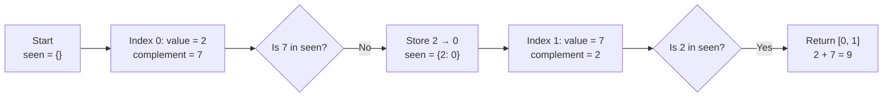

# Visual Explanation: Two Sum

## 1. Problem recap

Given an integer array `nums` and an integer `target`, return the indices of two
different array elements whose values add up to `target`. The same index cannot
be used twice, and the input is guaranteed to contain exactly one valid pair.

## 2. Turn the sum into a search

For each number, ask: **“Which other number would complete the target?”**

That missing number is called the **complement**. If the current number is `7`
and the target is `9`, its complement is `9 - 7 = 2`.

```text
current number + complement = target
             7 + 2          = 9
```

Keep previously visited numbers in a **hash map**: a data structure that connects
each key to a value and can usually find a key in **constant time**. Constant
time means that one lookup takes roughly the same amount of work even as the
array grows. In Python, a dictionary (`dict`) is a hash map. Here, each key is a
number and its value is that number's index.

```text
seen number  ->  its index
2            ->  0
```

## 3. Follow the scan

Use `nums = [2, 7, 11, 15]` and `target = 9`.



| Step | Current index | Current value | Complement needed | `seen` before checking | Result |
|---:|---:|---:|---:|---|---|
| 1 | `0` | `2` | `7` | `{}` | `7` is absent, so store `2 → 0` |
| 2 | `1` | `7` | `2` | `{2: 0}` | `2` is present at index `0`; return `[0, 1]` |

An **index** is a number that identifies a position in an array. Python uses
zero-based indexing, so the first item is at index `0` and the second is at
index `1`.

## 4. The algorithm

```text
create an empty hash map named seen

for each index and number in nums:
    complement = target - number

    if complement is in seen:
        return [seen[complement], index]

    store number -> index in seen
```

The order of the last two operations matters. Check for the complement **before**
storing the current number. This prevents one array element from being used
twice. It still handles duplicate values correctly: for `[3, 3]`, the first `3`
is stored before the second `3` finds it.

## 5. Why it works

When the scan reaches a number, `seen` stores an index of an earlier occurrence
for every distinct value visited so far. If a value appeared more than once, any
one of its earlier indices is enough. Therefore:

- If the complement is in `seen`, the earlier number and the current number add
  to the target, and their indices are a valid answer.
- If the complement is not in `seen`, no earlier number can pair with the current
  number, so storing the current number preserves it for later checks.

The problem guarantees exactly one solution, so this scan must eventually find
the required pair.

## 6. Complexity

| Approach | Time complexity | Extra space | Meaning |
|---|---|---|---|
| Try every pair | `O(n²)` | `O(1)` | The work can grow like the square of the input size. |
| Hash map scan | `O(n)` average | `O(n)` | Visit each number once and store up to `n` numbers. |

**Time complexity** describes how the amount of work grows as the input becomes
larger. **Space complexity** describes how much additional memory grows with the
input. **Big O notation** is the mathematical shorthand used for those growth
rates. Here, `n` means the number of items in `nums`; `O(n)` is called **linear
growth**. `O(1)` is called **constant growth**; in the extra-space column, it
means the added memory does not grow with `n`.
