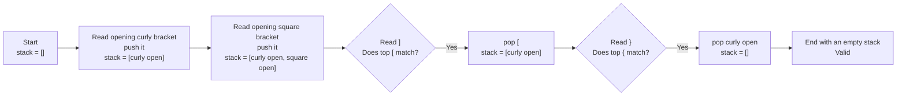

# Visual Explanation: Valid Parentheses

## 1. Problem recap

Given a string `s` containing only `(`, `)`, `{`, `}`, `[`, and `]`, determine
whether it is valid. A valid string satisfies all three conditions:

1. Every opening bracket is closed by the same type of bracket.
2. Bracket pairs close in the correct nesting order.
3. Every closing bracket has a corresponding opening bracket of the same type.

## 2. Match the most recent opening bracket first

Brackets can be **nested**, which means one pair can sit inside another pair.
For example, in `{[]}`, the square brackets must close before the surrounding
curly brackets can close.

Use a **stack** to remember opening brackets. A stack is a data structure that
removes the most recently added item first. This rule is called **LIFO**:
**last in, first out**. Adding an item is called **push**, removing the top item
is called **pop**, and the **top** is the next item that would be removed.

```text
Read opening brackets:        Close them in reverse order:

        [  <- top             pop [  when ] arrives
        {
     +-----+                  pop {  when } arrives
       stack
```

## 3. Follow the stack

Use `s = "{[]}"`.



| Step | Character | Stack before | Action | Stack after |
|---:|:---:|---|---|---|
| 1 | `{` | `[]` | Push the opening bracket | `['{']` |
| 2 | `[` | `['{']` | Push the opening bracket | `['{', '[']` |
| 3 | `]` | `['{', '[']` | Top is `[`, so pop it | `['{']` |
| 4 | `}` | `['{']` | Top is `{`, so pop it | `[]` |

The stack is empty at the end, so every opening bracket was matched in the
correct order.

## 4. See why order matters

Counting bracket types is not enough. In `([)]`, every opening bracket has a
closing bracket of the same type, but the nesting order is wrong.

```text
Input:  ( [ ) ]
Stack:  [] -> ['('] -> ['(', '[']

Next character: )
Expected opening bracket on top: (
Actual opening bracket on top:   [
Result: invalid immediately
```

This immediate stop is called **early termination**: the algorithm returns as
soon as it has enough information to know the final answer.

## 5. The algorithm

```text
create an empty stack
map each closing bracket to its matching opening bracket

for each character in the string:
    if it is an opening bracket:
        push it onto the stack
    otherwise:
        if the stack is empty, return false
        pop the top opening bracket
        if it does not match the closing bracket, return false

return true only if the stack is empty
```

The final empty-stack check is necessary. An input such as `"(("` never has a
wrong closing bracket, but it still has unmatched opening brackets.

## 6. Why it works

Before each character is processed, the stack contains exactly the opening
brackets that have not yet been closed, in their nesting order. Therefore:

- An opening bracket is saved for a future closing bracket.
- A closing bracket must match the stack's top because the innermost pair must
  close first.
- A missing or different top means no later character can repair the order.
- An empty stack at the end means that no opening bracket remains unmatched.

These rules are exactly the conditions for a valid bracket string.

## 7. Complexity

| Measure | Complexity | Meaning |
|---|---|---|
| Time | `O(n)` | Read each of the `n` characters once. |
| Extra space | `O(n)` | In the worst case, all `n` characters are opening brackets stored in the stack. |

**Time complexity** describes how the amount of work grows with the input.
**Space complexity** describes how much additional memory grows with the input.
**Big O notation** is the mathematical shorthand for these growth rates, and
`n` is the string length. `O(n)` is called **linear growth** because doubling
`n` can roughly double the work or storage.
