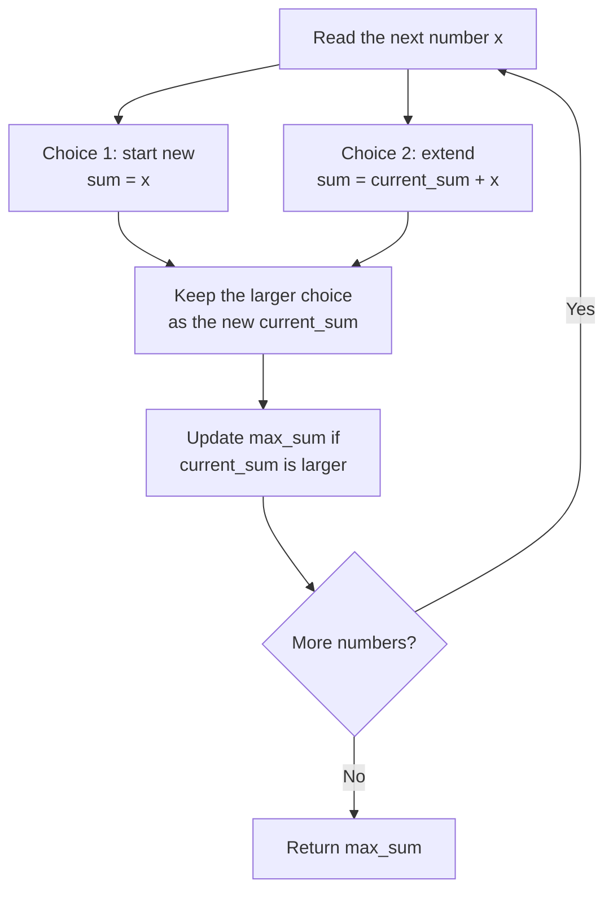

# Visual Explanation: Maximum Subarray

## 1. Problem recap

The input is an integer array `nums` containing at least one number. Return the
largest sum produced by any **contiguous, non-empty subarray**. The chosen items
must be next to one another in the original array, and the answer is the sum,
not the subarray itself.

## 2. Keep only a useful running sum

A **subarray** is a contiguous section of an array. **Contiguous** means its
items occupy consecutive indices with no gaps. A **subsequence**, by contrast,
may skip items, so it is not what this problem asks for. An **index** is the
numbered position of an item in an array; the first index is `0`.

Kadane's algorithm performs a **linear scan**: it visits the numbers once from
left to right. At each number `x`, there are only two useful choices:

```text
start a new subarray at x          -> x
extend the previous subarray      -> previous running sum + x

current_sum = max(x, previous current_sum + x)
```

The larger choice becomes the new **running sum**, meaning the best sum of a
subarray that must end at the current index. The **global best** is the largest
running sum seen anywhere so far.

## 3. Follow the scan

Use `nums = [-2, 1, -3, 4, -1, 2, 1, -5, 4]`.

| Index | Number `x` | Start at `x` | Extend previous | `current_sum` | `max_sum` | Decision |
|---:|---:|---:|---:|---:|---:|---|
| `0` | `-2` | `-2` | — | `-2` | `-2` | Start with the first number |
| `1` | `1` | `1` | `-1` | `1` | `1` | Restart at `1` |
| `2` | `-3` | `-3` | `-2` | `-2` | `1` | Extend; the result is less negative |
| `3` | `4` | `4` | `2` | `4` | `4` | Restart at `4` |
| `4` | `-1` | `-1` | `3` | `3` | `4` | Extend |
| `5` | `2` | `2` | `5` | `5` | `5` | Extend |
| `6` | `1` | `1` | `6` | `6` | `6` | Extend |
| `7` | `-5` | `-5` | `1` | `1` | `6` | Extend, but keep the earlier best |
| `8` | `4` | `4` | `5` | `5` | `6` | Extend, but keep the earlier best |

The winning subarray is the consecutive block from index `3` through index `6`:

```text
Index:   0    1    2   | 3   4   5   6 |   7    8
Value:  -2    1   -3   | 4  -1   2   1 |  -5    4
                        +---------------+
                          4 - 1 + 2 + 1 = 6
```

## 4. Visualize the decision at each number



Discarding the smaller choice is safe. Both choices end at the same current
index, so any future number would be added to both. The smaller sum can never
overtake the larger one after receiving the same additions.

## 5. The algorithm

```text
current_sum = nums[0]
max_sum = nums[0]

for each number x after the first number:
    current_sum = max(x, current_sum + x)
    max_sum = max(max_sum, current_sum)

return max_sum
```

Initializing both values from `nums[0]` is important. Starting from `0` would
incorrectly return `0` for an all-negative input such as `[-3, -1, -2]`; the
correct answer is `-1` because the subarray must contain at least one number.

## 6. Why it works

After processing each index:

- `current_sum` is the largest sum among all subarrays that end exactly at that
  index. Such a subarray either begins there or extends the best subarray ending
  at the previous index, so the two-choice calculation covers every case.
- `max_sum` is the largest `current_sum` encountered so far, so it is the best
  sum among subarrays ending at any processed index.

After the last index, every possible subarray endpoint has been considered.
Therefore, `max_sum` is the maximum subarray sum for the whole array.

## 7. Complexity

| Measure | Complexity | Meaning |
|---|---|---|
| Time | `O(n)` | Visit each of the `n` numbers once. |
| Extra space | `O(1)` | Keep only two sums, regardless of the array length. |

**Time complexity** describes how the amount of work grows with the input.
**Space complexity** describes how much additional memory grows with the input.
**Big O notation** is the mathematical shorthand for those growth rates.
`O(n)` is called **linear time**, while `O(1)` is called **constant space**
because the amount of extra storage does not grow with `n`.

Kadane's algorithm is also an example of **dynamic programming**: a method that
builds a larger answer from previously computed smaller answers. Here, the
previous `current_sum` is the saved partial answer reused at the next index.

**Divide and conquer** is an alternative method that splits a problem into
smaller parts, solves those parts, and combines their answers. For this problem,
it compares the best subarray in the left half, the right half, and the
middle-crossing section. It takes `O(n log n)` time, so the single-pass Kadane's
algorithm is more efficient here. In this expression, `log n` represents how
many times an input of size `n` can be halved before only one item remains.
