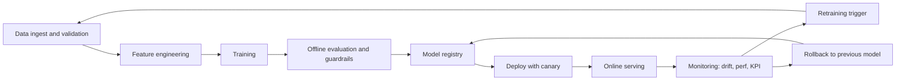

# MLOps の基本・メンタルモデル・現場レベルの考え方

この文書は、MLOps を**用語集としてではなく、実務で回すための設計判断**として整理します。対象は、モデルを作るところまでは触ったことがあるが、「それを本番で継続的に運用する」側の型を持ち切れていない人です。

既存ドキュメントとの役割分担:

- [research_validation_mindset_ja.md](./research_validation_mindset_ja.md): **検証・実験側**（仮説、指標、止め時）。
- [system_operation_maintenance/05_ai_specific_ops.md](../system_operation_maintenance/05_ai_specific_ops.md): **企業カスタム AI の運用**（SLA、BOM、RAG、コスト、安全）。
- 本書: その間を埋める **ML ライフサイクルの標準化**（データ・モデル・推論・再学習の回し方）。

## この文書で得られること

読み終わったときに、次を**チームで同じ語彙**で話せる状態を目指します。

- MLOps の構成要素が「ツール名」ではなく**役割（箱）**として説明できる。
- 自チームが **Level 0/1/2 のどこにいて、次に何を足すと一番事故が減るか**を言える。
- **最小一筆書き**の範囲と、全部入りプラットフォームの差を判断できる。
- 障害や劣化が出たとき、**どの層（データ・特徴・モデル・閾値・インフラ）を先に疑うか**の順序を持てる。

## 1. MLOps とは何か

MLOps は、機械学習システムを **継続的に、再現可能に、責任を持って** 回すための **プラクティスの集合** です。DevOps の「コードを速く安全に届ける」を、**コード + データ + モデル + 評価** の 4 軸に拡張したもの、と捉えると扱いやすいです。

| 軸 | DevOps | MLOps |
|----|--------|-------|
| 変わるもの | コード | コード + データ + モデル + 評価基準 |
| 成果物 | ビルド済みアーティファクト | モデル + データスキーマ + 特徴量 + 評価レポート |
| テスト | 単体・結合・E2E | 上記 + データ検証 + モデル品質 + 公平性 + ドリフト |
| リリース判定 | 動くか | 動くか + 品質基準を満たすか + ガードレールを壊さないか |
| ロールバック | 前バージョンに戻す | 前モデル + 前データ + 前特徴量 + 前インデックスに戻す |

ここで重要なのは、**「壊れたら戻す」が DevOps より 1 桁難しい**という点です。コードだけでなく、データパイプラインや特徴量、再学習スケジュールまで同時にピン留めしておかないと、戻しても再現しません。

### MLOps が「まず優先しなくていい」状況

すべてのプロジェクトにフル MLOps は不要です。次に当てはまるなら、最初は **検証とプロトタイプ**（[research_validation_mindset_ja.md](./research_validation_mindset_ja.md)）に専念し、本書の Level 1 は後回しでよい場合があります。

- 本番トラフィックがまだなく、**要件と指標が週ごとに変わる**
- データが社外に出せず、**再現環境をチーム内で閉じる必要がある**
- 勝ち筋は「モデル」ではなく、**ラベル定義やセンサ配置の見直し**にありそう

逆に、**週次で再学習やデプロイが発生する**、**複数チームが同じ特徴量やモデルを触る**、**監査や説明責任が必須**のときは、MLOps の投資を早めに始めた方が総コストが下がります。

## 2. なぜ MLOps は難しいのか

本質的な難しさは、**変化するものが多く、かつそれぞれ独立に変化する**点です。

- **データ**: 入力分布、ラベル分布、スキーマ、欠損、遅延データ、上流システムの変更
- **モデル**: ハイパラ、アーキテクチャ、前処理、学習データ版、事前学習モデル
- **評価**: 指標の定義、評価データ、業務 KPI、閾値
- **環境**: Python・CUDA・ライブラリ、GPU SKU、ドライバ、ハードウェア
- **運用**: 負荷、SLO、コスト、プロバイダ API 仕様（マネージド LLM など）

これらが**別々のチーム・別々の周期で動く**ので、「昨日動いていた」が今日動かない理由の候補が、DevOps より多くなります。MLOps の仕事の半分は、**誰が何をいつ変えたか**を記録可能にすることです。

### 劣化・インシデント時の「疑う順」（現場のメモ）

説明は簡略化しています。**上から順に潰す**と、早く原因に辿り着きやすいです。

1. **データ** — 上流のスキーマ変更、欠損急増、サンプリングバグ、タイムゾーン
2. **特徴量** — train/serve skew、オフライン計算とオンライン計算の差、キャッシュの鮮度
3. **モデル** — 体重みの取り違え、量子化・蒸留の副作用、バージョンのピン留め漏れ
4. **閾値・ビジネスルール** — プロダクト側の閾値変更がログに残っていない
5. **インフラ** — レイテンシ、タイムアウト、レート制限、GPU メモリ不足、バッチサイズ

「精度が落ちた」と言われた直後にニューラルネットの層数を疑うのは、だいたい順番が早すぎます。

## 3. 成熟度モデル（現実的な読み替え）

Google の MLOps Level 0/1/2 が有名ですが、現場で使うときは **「何を自動化したか」**ではなく **「何を手でやるたびに事故るか」** で読むのが実践的です。

### Level 0: 手動プロセス

- ノートブックで学習 → 手でモデルを置いて手でデプロイ
- データの版管理なし、再学習はアドホック
- **事故り方**: 「あのときの数字を再現できない」「誰が本番モデルを差し替えたか分からない」

### Level 1: パイプライン自動化

- データ取り込み・前処理・学習・評価・登録までがパイプライン化
- モデルレジストリがあり、本番モデルのバージョンが明示
- **事故り方**: 「再学習はするが、何が改善したか説明できない」「ドリフトしていても気づかない」

### Level 2: CI/CD + 継続的学習

- 新しいコード・データ・特徴量が入ると自動でパイプラインが回り、評価が通れば候補モデルが昇格
- オンライン評価とロールバックも自動化
- **事故り方**: 「自動昇格で品質が劣化した」「ガードレールが検知できない劣化が起きた」

多くの企業にとっての現実的な到達点は **Level 1 を丁寧に運用できる状態** です。Level 2 まで行くのはトラフィックと変更頻度が多い場合で、**全社で一律に目指すものではありません**。

### 自チームの位置づけ（10 問クイック診断）

正直に **はい / いいえ** で答え、はいの数を数えます。

1. 本番モデルの学習に使ったデータの**バージョン ID**を言える。
2. 前処理が**単一の関数・モジュール**経由で、学習と推論の両方から呼ばれている。
3. 本番デプロイは**レジストリまたは CI 経由のみ**（手で scp していない）。
4. 入力特徴量の分布または欠損率を**週次で**見ている。
5. モデル以外に **閾値やプロンプト**も版管理されている。
6. 直近の障害で**ロールバック**に成功した（または手順がある）。
7. 再学習の**承認者**が決まっている。
8. **コスト**（学習・推論）をダッシュボードで見ている。
9. **データスキーマ**の変更が上流から届く経路がある。
10. 実験結果が**検索可能**な形で残っている（スプレッドシートのみでない）。

| はいの数 | ざっくり解釈 |
|----------|----------------|
| 0〜3 | Level 0 に近い。最小一筆書きと実験記録から着手。 |
| 4〜7 | Level 1 手前。レジストリ、監視、データ版のどれかを 1 つずつ固める。 |
| 8〜10 | Level 1 運用の可能性。次は CI/CD for ML と自動昇格の是非を検討。 |

## 4. コアコンポーネント（何をする箱か）

ツール名ではなく、**何を担う箱か**で理解するのが長持ちします。

### 4.1 データ版管理（Data Versioning）

- 学習・評価に使った**データのスナップショット**を、バージョン付きで凍結する
- 役割: 再現性、監査、ロールバック
- 実装選択: 生データは S3/GCS に immutable prefix、加工データは Delta/Iceberg/LakeFS、軽量なら DVC
- **Minimum（チーム 5 人未満の例）**: 日付 + Git tag + S3 の prefix を人間が読める命名規則で固定。Athena/BQ の VIEW ではなく**テーブルスナップショット**を切る。
- **Full**: 自動パーティション、メタデータカタログ、リネージ（データ系譜）とのリンク。
- **よくある穴**: 「同じクエリ」を再実行したつもりが、**上流の定義が変わっていた**。

### 4.2 特徴量ストア（Feature Store）

- 特徴量を **学習時と推論時で同じ定義**で使えるようにする箱（train/serve skew を防ぐ）
- 役割: 一貫性、再利用、低レイテンシでの読み出し
- 落とし穴: 特徴量ストアは**重いインフラ**で、必要性を先に見極める。小さい組織では**共通ライブラリ + オフラインテーブル**で十分なことが多い
- **Minimum**: `features.py` に `compute_features(df, mode="train"|"serve")` を 1 箇所に集約。オフラインバッチは同じ関数で書き出す。
- **Full**: オンラインストア + オフラインストア + メタデータ、バックフィルジョブ、SLA 監視。
- **よくある穴**: オフラインでは「その時点の正解ラベル」を知った特徴を混ぜてリークする（**point-in-time** 違反）。

### 4.3 実験管理（Experiment Tracking）

- 仮説・変更・条件・結果を構造化して残す（MLflow, W&B, Neptune, 自作など）
- 役割: 「どの実験がどの結果を出したか」を検索可能にする
- 最低限: データ版、コード hash、設定、主要指標、ガードレール指標、seed、実行環境
- **Minimum**: 実験 ID + 設定 YAML + `metrics.json` を Git と紐づけるだけでも、検索不能よりマシ。
- **Full**: 実験比較 UI、アーティファクトストア、チーム共通ダッシュボード。
- **よくある穴**: 「best だけ」アーティファクトが残り、**悪い結果の条件が検索できない**。

### 4.4 モデルレジストリ（Model Registry）

- モデルアーティファクト + メタデータ（学習データ版、評価結果、承認記録）を保管
- 役割: 本番に出ているモデルを一意に特定、ロールバック、監査
- 運用: `staging → production → archived` のライフサイクルを固定。**本番に出るのはレジストリ経由だけ**を徹底
- **Minimum**: S3 のパス規約 + 承認の Issue / PR テンプレート。**名前は人が読めること**。
- **Full**: 自動昇格、監査証跡、権限 RBAC。
- **よくある穴**: 「production の latest」だけ見て、**本当にロードされている重み**とズレる。

### 4.5 パイプラインオーケストレーション

- データ取り込み → 前処理 → 学習 → 評価 → 登録の**一連の流れ**をコード化
- 選択肢: Airflow, Prefect, Dagster, Kubeflow Pipelines, Vertex AI Pipelines, Step Functions
- 判断軸: 既存のデータ基盤と同じ流儀で書けるか、**失敗時のリトライと再開**が扱いやすいか
- **Minimum**: cron + Makefile + 失敗時に Slack 通知。**冪等**（同じ入力なら同じ出力）を最優先。
- **DAG の設計指針**: パイプラインの**各ステップの出力をアーティファクトとして保存**し、再実行は失敗ステップから。

### 4.6 推論サービング

- バッチ推論 / オンライン推論 / ストリーミング推論で要件が違う
- オンラインの論点: レイテンシ、スループット、GPU 効率、バッチ化、オートスケール、コールドスタート、モデルロード時間
- 詳細: [system_design/16_ml_ai_systems/ml_inference_design.md](../system_design/16_ml_ai_systems/ml_inference_design.md)

### 4.7 モニタリング（ML 固有）

通常の APM（レイテンシ、エラー率）に**加えて**、次を見ます。

- **入力ドリフト**: 入力特徴量の分布変化
- **予測ドリフト**: 予測分布の変化
- **性能ドリフト**: ラベルが遅れて到着する場合の精度低下
- **データ品質**: 欠損、範囲外、スキーマ違反
- **業務 KPI**: モデルの上流にある実際の事業指標

注意: **ドリフト検知 = 精度劣化ではない**。分布が変わっても精度が保たれることはあるので、検知はアラートではなく **調査のトリガ**として使います。

**PSI（Population Stability Index）のざっくり解釈**

PSI は分布の変化を 1 本に潰した指標で、業界でよく使われます（閾値は組織ごとにキャリブレーション）。

| PSI の目安 | 解釈（一般的な運用ルールの一例） |
|------------|-----------------------------------|
| 未満 0.1 前後 | 大きな変化なし。ログのみ。 |
| 0.1〜0.25 | 要ウォッチ。週次レビューで理由をメモ。 |
| 0.25 超 | 調査トリガ。データ契約・上流と突合わせ。 |

PSI だけで判断しない。**業務 KPI や誤分類率と同じダッシュボード**に載せます。

### 4.8 CI/CD for ML

- コード変更: 通常の CI（テスト、lint、ビルド）
- データ/設定変更: データ検証、スキーマチェック、小規模評価
- モデル変更: オフライン評価、ガードレール、公平性チェック、承認
- デプロイ: shadow → canary → ramp-up → full、いつでも**ロールバック可能**に

### 4.9 再学習（Retraining）

- トリガ: スケジュール / ドリフト / 業務 KPI 劣化 / 新データ到着
- **再学習は自動化より前に、意思決定を固定**する（誰が昇格を承認するか、ガードレール不合格で自動差し戻しするか）
- アンチパターン: 「毎週再学習」だけ決めて、評価基準を決めない

## 5. ライフサイクル全体像

MLOps の仕事を 1 枚で表すと、次の輪をどれだけ**速く・安全に・再現可能に**回せるかに尽きます。

この図の**どの矢印が手作業か**を数えると、自分たちの成熟度が一目で分かります。

## 6. 一流が共有しているメンタルモデル

本リポジトリの慣例に揃えて 7 個で置きます。分野横断でそのまま使えるものを選んでいます。

1. **モデルは成果物ではなく、パイプラインの出力である**。偶然できた良いモデルは、次に再現できないなら運用上は存在しないのと同じ。
2. **データは契約、コードは実装**。データのスキーマ・定義・SLA が先に決まっていないと、どんな綺麗なコードも無力になる。
3. **再現性は、未来の自分とチームへの最大の投資**。実行環境、乱数 seed、データ版、設定、依存ライブラリを**全部セットで**残す。
4. **train / serve skew を常に疑う**。学習時と推論時で前処理・特徴量定義・タイムゾーン・欠損処理が**少しでもズレると**、静かに精度が下がる。
5. **ロールバックは技術ではなく文化**。いつでも前に戻せる前提で設計し、**戻したことを失敗と呼ばない**。
6. **監視は精度ではなく変化を見る**。ラベルが遅れて来る世界では、精度指標より **入力・予測・挙動の変化** が先に崩れる。
7. **MLOps の ROI は事故を減らした総額で測る**。新機能の速度ではなく、**再現性・ロールバック・監査で救われた工数**が本質的な価値。

### メンタルモデルごとの「やりがちな失敗」一言

| # | やりがちな失敗 |
|---|----------------|
| 1 | ノートブックで当たった重みを宝物にして、パイプライン化を永遠に後回しにする |
| 2 | データオーナー不在のまま、ML チームだけで「きれいなテーブル」の幻想を抱く |
| 3 | Dockerfile にバージョンを書かず、「あのときの conda 環境」を探し続ける |
| 4 | 「本番は numpy、学習は pandas」など、微妙な実装差を許容する |
| 5 | ロールバック手順が Runbook になく、障害時に誰も以前の重みを知らない |
| 6 | 精度ダッシュボードだけ見て、入力が壊れていることに気づかない |
| 7 | MLOps 導入を「Kubernetes を張ること」だと勘違いし、データ契約が後回しになる |

## 7. 現場レベルの考え方

ここが、本を読んでも身につかない領域です。実装の手前にある **判断の型** として置きます。

### 7.1 「まず最小の一筆書き」を通す

フルな MLOps を最初から作ろうとすると、ほぼ間違いなく途中で破綻します。現場で強いチームは、**学習 → 評価 → 登録 → デプロイ → 監視 → ロールバック**を、最小構成でいいから**一度通し**、その後に各箱を改善します。

- 最小構成の例: スクリプト + MLflow + S3 + 単一の推論コンテナ + 手動昇格 + 簡素なダッシュボード
- **一筆書きが通っていない状態で、特徴量ストアや Kubeflow を入れない**

### 7.2 モデルを増やす前に、1 本を丁寧に運用する

2 本目のモデルを出す前に、**1 本目が壊れたとき誰が気づき、誰が戻し、誰が直すか**を明確にします。ここが曖昧なまま本数だけ増えると、インシデントが指数的に増えます。

### 7.3 データ側の欠陥を、モデル改善より先に潰す

本番での劣化の多くは、モデル起因ではなく**上流データの変化**（仕様変更、ログ欠損、タイムゾーン、サードパーティ API の変更）です。モデルを触る前に、次を確認します。

- 入力スキーマと値域の監視が入っているか
- 上流チームと**スキーマ変更の通知経路**が合意できているか
- 遅延データがどこまで許容されているか

### 7.4 閾値とガードレールを、モデルと分けて管理する

推論閾値（confidence threshold、分類境界、ランキングカットオフ）は、**モデル本体とは別にバージョン管理**します。そうすると、閾値だけで運用改善が可能になり、モデル再学習より速く本番を修正できます。

### 7.5 「本番に出しているのは誰か」を常に答えられるようにする

レジストリ経由でないデプロイを一度でも許すと、半年後に「なぜそのモデルが出ているか分からない」状態になります。**本番に出る経路を 1 本に絞る**ことが、長期的な事故率を劇的に下げます。

### 7.6 コスト監視は初日から入れる

生成 AI・LLM を含む場合、**1 つのバグで数十万トークンが消える**ことがあります（[system_operation_maintenance/05_ai_specific_ops.md](../system_operation_maintenance/05_ai_specific_ops.md) 第4節）。学習ジョブも同様で、Spot 失敗での再実行や、誤った大規模バッチが数十万円を飛ばします。コスト監視は「安定運用してから」ではなく**初日から**入れます。

### 7.7 人が止められる前提で自動化する

「自動再学習・自動昇格」が正解に見えるのは、指標が完璧に設計されているときだけです。現実には、**人が最後に止められる仕組み**（承認ワークフロー、カナリア、キルスイッチ）を残しておく方が、事故の総量を下げます。

### 7.8 HITL をコストではなく、データ源として設計する

難例を人が判断するのは、**コストではなく、教師データの製造工程**です。HITL のラベルを学習に還流する経路（アクティブラーニング、難例フィードバック）を最初から設計すると、運用が進むほどモデルが強くなります。詳細: [object_detection/05_applications_and_case_studies.md](../object_detection/05_applications_and_case_studies.md)

## 8. 役割と組織の型

MLOps は技術だけで回りません。次の役割のうち、**誰が責任を持つか**を明確にしておきます（1 人が兼務しても良いが、**無所属にしない**）。

| 役割 | 担当領域 |
|------|----------|
| データエンジニア | 上流データの SLA、スキーマ、品質、データ基盤 |
| ML エンジニア | モデル学習、評価、特徴量、パイプライン |
| MLOps / Platform | レジストリ、CI/CD、モニタリング、コスト、再現性基盤 |
| SRE | 可用性、レイテンシ、オンコール、インシデント |
| プロダクト | 業務 KPI、閾値、許容コスト、ロールアウト判断 |
| セキュリティ / 法務 | 個人情報、監査、コンプライアンス、モデルリスク |

小さな組織では 1〜2 人で全部を担うことがありますが、**どの帽子を被っているかを自覚する**ことで、抜けが減ります。

## 9. CI/CD とリリース戦略

MLOps 特有のリリース戦略を 1 枚で置きます。

| 戦略 | 内容 | 使いどころ |
|------|------|------------|
| Shadow deploy | 本番と並走させ、結果を比較するだけで影響なし | 初回、モデル刷新、未知のドリフト評価 |
| Canary | 1〜5% に限定して出し、ガードレールを監視 | 通常リリース |
| Progressive ramp-up | Canary を徐々に広げる（5→25→50→100%） | 通常リリース |
| Blue/Green | 旧モデルと新モデルを切り替え可能な形で並走 | 即時ロールバックが必須の領域 |
| Multi-armed bandit / A/B | 複数モデルの割合を実験的に配分 | 継続的な最適化 |
| Feature flag | モデル/閾値/前処理を実行時に切り替え | 小さな修正、緊急オフ |

**必ず決めておくこと**: どのガードレール違反が起きたら、**自動で前モデルに戻すか、人が判断するか**。

### ロールアウト時のキル条件（例）

デプロイ種別に依存しますが、**事前に表にしておく**とインシデントで迷いません。

| ガードレール | 例のキル条件 | アクション例 |
|--------------|--------------|----------------|
| レイテンシ | p99 が 2 週間の中央値比 +50% 超が 15 分継続 | トラフィックを 5% に戻す |
| エラー率 | 5xx またはモデル例外が 1% 超 | 直前の production モデルへロールバック |
| 業務 KPI | コンバージョンが CI 内で統計的に有意に劣化 | 実験中止、原因調査チケット |
| コスト | トークン / 推論コストが日次予算の 150% | 自動スケール上限 or モデル差し替え |
| 公平性 | 属性層で指標が閾値割れ | 強制的に shadow のみ |

人手が必要な案件では、**オンコールの連絡先と権限**（誰がキルできるか）まで書きます。

## 10. モニタリング設計の最小セット

通常の APM に追加して、MLOps では次を最低限ダッシュボード化します。

- **入力**: 主要特徴量の分布（PSI, KL）、欠損率、値域違反
- **予測**: 予測分布、confidence 分布、クラス別の出現率
- **業務**: 主要 KPI、ガードレール KPI、介入率、HITL キュー長
- **性能**: p50/p95/p99 レイテンシ、スループット、GPU 使用率、コスト / 千リクエスト
- **運用**: 最後に本番モデルが差し替わった日時、レジストリ経由か、承認者

このとき、**アラートではなく週次で見るダッシュボード**が多い方が長持ちします。アラートを増やしすぎると、本当に重要な異常が埋もれます。

### ML システム BOM の例（概念）

本番の「何が動いているか」を 1 枚にまとめます（詳細は [system_operation_maintenance/05_ai_specific_ops.md](../system_operation_maintenance/05_ai_specific_ops.md)）。

| フィールド | 例 |
|------------|-----|
| `model_id` | `fraud-v3.2.1` |
| `weights_uri` | `s3://models/fraud-v3.2.1/model.pt` |
| `training_data` | `dataset@2026-04-01T00:00Z` |
| `feature_defs` | `features@v2.3`（Git tag） |
| `inference_code` | `serve@build-4821` |
| `thresholds` | `rules@2026-04-10` |
| `embedding_index` | （該当時）`idx-gen-412` |
| `llm` | （該当時）`gpt-x.y-2026-03` 固定 ID |

本番障害の post-mortem では、**BOM のどの成分が変わったか**を最初に埋めると、原因が半分決まります。

## 11. よくあるアンチパターンと打ち手

- **ノートブック本番化**: ノートブックのまま本番に出して、再現できない → 最初からスクリプト + パイプラインで書く。探索は別ノートブックで。
- **全部入りプラットフォーム先行**: Feature Store / Kubeflow / MLflow / Vertex を最初から全部導入 → 最小一筆書き優先。
- **train/serve skew**: 学習コードと推論コードが別で前処理が微妙に違う → 共通ライブラリに前処理を閉じ込める。
- **監視なし本番**: ドリフト・コスト・業務 KPI を見ていない → 最低限の 4 種（入力・予測・業務・性能）だけ先に入れる。
- **自動再学習の盲信**: スケジュールだけ決めて、評価と承認がない → 昇格ゲートを先に決める。
- **ロールバック不能**: モデル、前処理、閾値、インデックスのどれかが戻せない → 4 点セットで版管理。
- **レジストリバイパス**: 急ぎの本番修正で直接デプロイ → レジストリ経由を**例外なく**ルール化。
- **データチームとの境界不明**: 上流スキーマが黙って変わる → データ契約（スキーマ + SLA + 通知）を明文化。

### LLM / エージェント特有の足場（短く）

生成 AI が絡むと、従来の「重みだけ」では BOM が足りません。最低限:

- **モデル ID**（プロバイダのデフォルト更新に巻き込まれないよう明示）
- **プロンプト / 方針**の版（`policy@日付`）
- **ツール一覧**と権限スコープ（関数呼び出し、RAG のインデックス世代）
- **評価セット**での回帰（リリース前後の比較）

運用の論点の詳細は [system_operation_maintenance/05_ai_specific_ops.md](../system_operation_maintenance/05_ai_specific_ops.md) と [research_validation_mindset_ja.md](./research_validation_mindset_ja.md) の「オフラインとオンラインのズレ」を参照してください。

## 12. ツール選定の考え方

具体のツール名を覚えるより、**判断軸**を持っておく方が長持ちします。

- 既存インフラとの整合性（クラウド、データ基盤、認証基盤）
- チームのスキルセット（Python だけ / Spark / k8s）
- 運用担当の人数（OSS の自前運用 vs マネージド）
- コスト感（ライセンス + 人件費 + 運用工数）
- ロックインとの距離（フォーマット、メタデータ、退避可能性）
- セキュリティと監査（データ所在、暗号化、監査ログ）

「流行っているから」「論文で使われているから」でツールを選ぶと、運用フェーズで破綻しやすいです。**自分たちの制約から逆算**するのが基本です。

## 13. 成熟度チェックリスト（自己診断）

次のうち、自信を持って **はい**と答えられる数が、今のチームの実力です。

- [ ] 昨日本番に出ているモデルの、学習データ版とコード hash を 1 分で特定できる
- [ ] 本番モデルを、30 分以内に前バージョンへロールバックできる
- [ ] 前処理の実装が、学習と推論で**同じコード**から呼ばれている
- [ ] データスキーマ違反が、本番に届く前に**止まる**
- [ ] ドリフトと業務 KPI 劣化を、別々のダッシュボードで見ている
- [ ] 月次コストが、モデル / 環境 / 用途別に説明できる
- [ ] 最後に実験結果を記録したのは今週で、**誰でも検索できる**
- [ ] 再学習の昇格ルールが文書化され、承認フローが動いている
- [ ] 本番に出る経路が**レジストリ経由のみ**で、例外の記録がある
- [ ] 推論閾値が、モデル本体とは別にバージョン管理されている

7 個以上で実運用として健全、4〜6 個ならばどこかで事故る可能性あり、3 個以下なら**先に基盤を整える**フェーズです。

## 14. 学習の進め方

初学者が混乱しやすいので、順序を置きます。

1. **用語を揃える**: 本書の第 1〜4 章、[system_operation_maintenance/05_ai_specific_ops.md](../system_operation_maintenance/05_ai_specific_ops.md)
2. **最小一筆書き**: ローカル or 小規模クラウドで、学習 → 評価 → 登録 → デプロイ → 監視を 1 本通す
3. **再現性の確立**: 実験管理ツールを 1 つ選び、[research_validation_mindset_ja.md](./research_validation_mindset_ja.md) の最小ドキュメントセットを埋める
4. **パイプライン化**: オーケストレータを 1 つ選び、上記 1 本をパイプライン化
5. **モニタリング強化**: 入力 / 予測 / 業務 / 性能の 4 種を先に入れる
6. **CI/CD for ML**: モデル承認ゲートとロールバックを自動化
7. **再学習の設計**: トリガと昇格ゲートを決める。**最後**に自動化
8. **組織**: 役割分担、データ契約、監査、コンプライアンス（[system_operation_maintenance/](../system_operation_maintenance/) 全体）

この順序を飛ばすと、ほぼ必ず前の工程の不備で詰まります。

## 15. 関連リンク

- 検証・実験側のマインドセット: [research_validation_mindset_ja.md](./research_validation_mindset_ja.md)
- 企業カスタム AI の運用・契約・SRE: [system_operation_maintenance/](../system_operation_maintenance/)
- 特に AI 固有の運用論点: [system_operation_maintenance/05_ai_specific_ops.md](../system_operation_maintenance/05_ai_specific_ops.md)
- 運用プレイブックとガバナンス雛形: [system_operation_maintenance/10_operational_playbooks_and_governance_hooks.md](../system_operation_maintenance/10_operational_playbooks_and_governance_hooks.md)
- ML システム設計の入口: [system_design/16_ml_ai_systems/README.md](../system_design/16_ml_ai_systems/README.md)
- 推論システムの設計: [system_design/16_ml_ai_systems/ml_inference_design.md](../system_design/16_ml_ai_systems/ml_inference_design.md)
- データ基盤側の論点: [dbconnection/07_data_ml_apps.md](../dbconnection/07_data_ml_apps.md)
- 物体検出での実験プレイブック: [object_detection/04_training_playbook.md](../object_detection/04_training_playbook.md)
- クラウド GPU 学習の現場判断: [object_detection/12_cloud_gpu_training_practice.md](../object_detection/12_cloud_gpu_training_practice.md)
