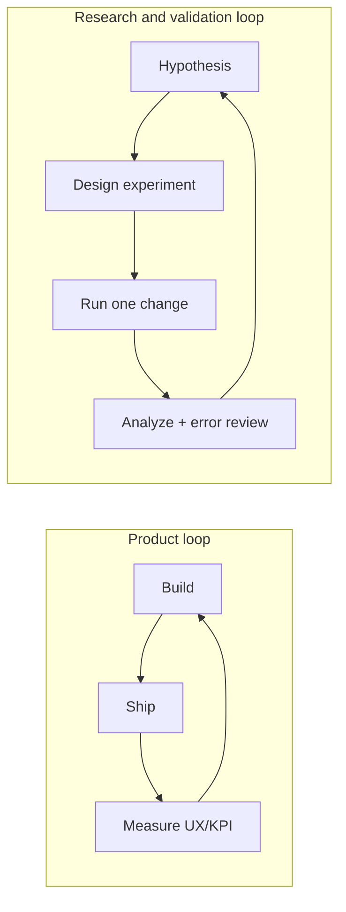

# 検証・R&D のマインドセットと現実的な落とし所

この文書は、**検証や研究開発に寄った仕事**で必要な思考の枠組みを、実務レベルで整理するためのガイドです。モデルの作り方や指標の定義は、既に本リポジトリの各所（[object_detection/](../object_detection/)、[system_operation_maintenance/](../system_operation_maintenance/)、[system_design/16_ml_ai_systems/](../system_design/16_ml_ai_systems/)）で扱っています。ここではその横に置く、**縦串の考え方**を扱います。

想定する読者は、アプリ開発で実装・運用の感覚は身についている一方で、アカデミックな訓練が薄く、**主張と根拠・不確実性・停止条件**の扱いに自信がない人です。

## この文書で得られること

読み終わったときに、次を**自分の言葉で説明**できる状態を目指します。

- その案件が今 **プロダクトモード** か **検証モード** か、根拠を添えて切り分けられる。
- 実験 1 本につき、**仮説・変更・条件・結果・次手**が残せる。
- 主要指標とガードレールを分け、**オフラインではどの層を見るか**を先に固定できる。
- **止める条件**と **十分に良いの定義**を、自分で文書化できる。

## 1. プロダクト開発と検証 R&D は、別のモードである

まず最初に押さえたいのは、この二つが**別の仕事のモード**だということです。

- プロダクト開発のモード: 要件はおおよそ定まっており、実装を進めれば価値が積み上がる。**動く → UX → スケール** という自然な進化があり、良いエンジニアリングがそのまま成果につながる。
- 検証・R&D のモード: 何が正解かを自分で定義しなければならない。実装が進んでも、**何が分かったか**を自分で説明できなければ成果にならない。設計ミスは「遅くなる」ではなく「意味が消える」形で現れる。

この二つを混ぜると、典型的に次が起きます。

- 実装を頑張ったが、結論が「良くなった気がする」しか言えない
- 指標は動いているのに、意思決定に使えない
- やめ時が決められず、追加実験だけが積み上がる
- 再現しようとすると、どの条件で出た数字なのか分からない

以降の節は、これらを起こさないための**先回り**の考え方です。

### モード切り替えの目安（セルフチェック）

次のどれかが当てはまるときは、**検証・R&D モード**を強く意識した方がよいです。

- 正解ラベルや評価指標が、ステークホルダー間でまだ揺れている
- ベースライン（単純ルール、既存モデル、ヒューリスティック）との比較がまだない
- 「良くなった」を、**数値と層別**で言い切れない
- データの取得経路・リーク・ラベル定義の版が週ごとに変わる
- 本番投入前に、**オフライン指標と業務 KPI の対応**が示されていない

逆に、要件と主要指標が凍結され、実装と計測のループだけが残っているなら、**プロダクトモード**で十分なことが多いです。同じ人が両方を兼任しても、**週次レビューでモードを宣言する**と会話が噛み合います。



プロダクトループは「出して測る」が中心、研究ループは「仮説 → 1 つだけ変える → 誤差ごと読む」が中心です。同じ人が両方を回す場合でも、**今どちらのモードでいるか**を自覚することが先です。

## 2. 検証の中核メンタルモデル

ここは、検証・R&D に入るときに先に揃えておきたい認識の塊です。本リポジトリの各ガイドでも「5 つのメンタルモデル」形式を採用しているので、同じ形で揃えます（参考: [object_detection/04_training_playbook.md](../object_detection/04_training_playbook.md) の末尾）。

1. **主張は、先に反証条件とセットで書く**。「何が観測されたら自分の仮説は覆るか」を、実験を回す前に書く。後から書くと、数字に合わせて主張が変形する。
2. **ベースラインと単一要因**。比較対象のない結果は、結果ではなく印象である。比較のために、一度に変えるのは原則 1 つにする。実務で複数変える必要があるときは、**戻して確認するまでの手順**まで決めておく。
3. **データとタスクの契約**。train / val / test、リーク、ラベル定義、評価対象の母集団は、実験の前に固定して版で管理する。途中で動かすと、過去の数字と比較不能になる。
4. **目的関数は階層で考える**。研究指標（mAP、AUC など）、代理指標（レイテンシ、コスト、介入率）、**ビジネス指標**（売上、工数、事故件数）は一致しない。どの層で主張しているかを常に明示する。
5. **不確実性は必ず可視化する**。seed、データ分割、期間、母集団の違いで数字は揺れる。「点推定だけ」の報告は、実務では**過信の原因**になる。最低でも複数 seed か、複数ホールドアウトで幅を見る。
6. **非対称コスト**。見逃し 1 件と誤警報 1 件の価値は、ほぼ常に違う。指標や閾値を選ぶときは、**どちらを守るか**を先に決める。ここが曖昧だと、指標が動いても意思決定に使えない。
7. **負の結果も、成果である**。「効かなかった」を言語化できるチームは、探索空間が速く狭まっていく。効いたことだけを共有する文化は、長期的にスピードを落とす。

この 7 つは、対象がビジョンでも自然言語でも時系列でも共通します。ドメイン固有の作法（例: 物体検出なら [object_detection/02_terms_and_metrics.md](../object_detection/02_terms_and_metrics.md)、運用なら [system_operation_maintenance/05_ai_specific_ops.md](../system_operation_maintenance/05_ai_specific_ops.md)）は、この上に載せるものとして扱います。

### 各メンタルモデルの「ミニ例」

抽象論のままだと動けないので、**一文でイメージ**を付けます。

| メンタルモデル | ミニ例 |
|----------------|--------|
| 反証条件 | 「データ拡張を強くしたら長尾クラスが伸びる」→ 長尾が伸びないなら、仮説は棄却して別要因（ラベルノイズ）へ |
| 単一要因 | 学習率を上げた週に、同時にデータセットも差し替えない。**先に片方だけ** |
| データ契約 | 「この評価セットは最終判断用」と決めたあと、同じセットで何度もハイパラ探索しない（過学習） |
| 階層の目的関数 | オフラインの AUC と、本番の解約率が逆向き → **どちらの層で主張しているか**を明示して議論する |
| 不確実性 | seed を 3 つ変えたら主要指標が ±0.3pt なら「**その幅で言う**」 |
| 非対称コスト | 医療の見逃しと誤警報では損失が違う → F1 より precision / recall のどちらを先に守るかを固定 |
| 負の結果 | 「新しい損失関数は効かなかったが、同条件でベースラインより悪化しなかったので探索終了」は議事録に価値がある |

### 仮説シート（コピペ用）

実験を始める前に、次を**箇条書きで 1 ページ**にまとめます。ノートでもチケットでも可です。

```text
【背景】何が問題で、誰が困っているか（業務一文）
【仮説】◯◯を変えると △△ が良くなる（因果の向きを明示）
【反証条件】次のどれかが観測されたら、仮説は棄却する: ________________
【ベースライン】比較する対照: （ルール / 旧モデル / 固定設定）
【変更する 1 つ】今回いじるのはこれだけ: ________________
【固定するもの】データ版・評価セット・seed（可能なら）: ________________
【主要指標】1 つだけ: ________________  【ガードレール】最大 5 つ: ________________
【層別】必ず切る層: ________________（長尾 / 期間 / 難易度など）
【期限・予算】いつまでに、どれだけの GPU/人日まで: ________________
```

## 3. 改善数値の出し方（実務で足りるライン）

アカデミックな厳密さをフルでは要求されないが、**意思決定に耐える**水準の数値は出したい、というのが多くの R&D 仕事の現実です。ここを詰めるための最小セットを置きます。

### 3.1 主要指標とガードレール指標を分ける

- **主要指標**: 今回の変更で良くしたい 1 つを、事前に決める。複数並べると「どれかは上がる」病にかかる。
- **ガードレール指標**: 主要指標を上げるために壊したくないもの（レイテンシ、コスト、安全系、長尾クラス、低頻度ユーザー）。先に閾値を決め、**壊れたら採用しない**を運用する。

主要指標が 1 つでガードレールが 3〜5 個、くらいが扱いやすい規模です。

**具体例（想像上の分類タスク）**

- 主要指標: ターゲットクラスの **Recall@運用閾値**（見逃しを抑えることが最優先なら）
- ガードレール: 全体の推論 **p99 レイテンシ**、**False Positive 率の上限**、**特定属性グループでの劣化**、**コスト / 千件**

主要指標を「全体 accuracy」にすると、クラス不均衡で数字だけ良く見えることがあります。**ビジネスで代えが効かない誤り**がどれかに主要指標を寄せるのが実務向きです。

### 3.2 オフライン評価は「層別」で見る

全体平均は、**最も情報量が少ない数字**です。最低でも次の層別で見ます。

- 難易度（例: 小物体、遮蔽、長尾クラス、低頻度意図）
- ドメイン（撮影条件、顧客、地域、言語）
- 時間（最近 N 日、季節、イベント時）
- 失敗の種類（誤検出 / 見逃し、誤分類のパターン）

層別で見ると、「平均は上がったが、本番で一番大事な層だけ落ちている」ケースを検出できます。これは平均だけ見ていては絶対に見えません。

**層の切り方テンプレート（最低限）**

| 層の軸 | 例 | 何を見るか |
|--------|-----|------------|
| 難易度 | 入力の長さ、ノイズ量、希少クラス | 主要指標と誤りタイプ（FP/FN） |
| 時間 | 直近 7 日、季節、キャンペーン期間 | ドリフトと季節性 |
| セグメント | 地域、デバイス、言語、顧客層 | 公平性とロングテール |
| 失敗型 | 混同しやすいクラス同士 | 混同行列のブロック |

**行列の読み方（混同行列があるとき）**

- 対角が上がっただけで「成功」と言う前に、**意図しないクラスへの誤分類が増えていないか**を見る（特に安全・コンプライエンス領域）。
- 「精度が上がった」は、**どの誤りが減った代償か**まで言えて初めて意思決定に使える。

### 3.3 「実務的な有意差」を先に決める

検定の p 値だけを基準にするのは、検証文脈では過剰・不足どちらにも振れやすいので、次の 3 点セットで判断するのが扱いやすいです。

- **効果量**: 実装・運用コストに見合う大きさか（例: 「介入率を 5pt 以上下げないと採用する価値がない」）。
- **再現性**: 別の seed / 別のホールドアウトで同じ向きに動いているか。
- **コスト**: 推論コスト、学習コスト、運用コスト、リスクの増分を含めて、なお前に進むか。

サンプルサイズの感覚は、**厳密にやりすぎず、雑にもしない中間**を狙います。目安として、層別で最小の層が 2 桁後半〜3 桁のサンプルに届かないなら、その層の数字は**主張に使わない**のが安全です。

**統計的有意性と、実務的な「意味があるか」**

- p 値や信頼区間は、**データがランダムに選ばれたクリーンな実験**のときほど意味が効きます。ログや前処理の偏りがある現場データでは、「有意になったから採用」は危険です。
- 実務では次をセットで見ます。
  - **効果の向き**が複数の分割・seed で安定しているか
  - **効果の大きさ**が、実装コストやリスクに見合うか（例: 介入率が 0.1pt しか変わらないならやらない）
  - **負の外影響**（レイテンシ、特定層の劣化）がガードレール内か

**オフラインで良くてオンラインで負けるときの典型原因**

評価設計とシステム側の**ズレ**です。例として次を疑います。

- オフラインのサンプルが **ログのバイアス**（クリックされたものばかり）と一致していない
- **遅延ラベル**で正解が後付けされ、オフラインでは見えない楽観バイアスがある
- **介入効果**（モデルが変わるとユーザー行動も変わる）をオフラインで再現できない
- **閾値・UI・キャッシュ**が本番と異なり、オフライン指標がユーザー体験を代表していない

このときの対処は「もっとデータを足す」より先に、**オフライン設定と本番のギャップをリスト化**することです。

### 3.4 オフラインからオンラインへの橋渡し

多くの案件では、最終判断はオンライン A/B か段階ロールアウトで行います。ここはシステム設計側の話が大きいので、詳細は [system_design/16_ml_ai_systems/README.md](../system_design/16_ml_ai_systems/README.md) と [system_operation_maintenance/05_ai_specific_ops.md](../system_operation_maintenance/05_ai_specific_ops.md) に任せ、検証側で押さえるのは次だけです。

- オフラインで勝った指標と、オンラインで見る指標が**ズレていないか**。
- ロールアウト時に、どのガードレールが引かれたら**自動で戻す**のか。
- オフラインの数字が、オンラインで**再現しなかったとき**の解釈手順。

**解釈手順（箇条書き）**

1. オフラインで使った**データ定義**と本番ログの定義が一致しているか（フィルタ、期間、欠損）。
2. **SRM**（サンプル比率の崩れ）や実験配置バグがないか（オンライン実験の場合）。
3. **効果が遅れて現れる指標**（継続率など）では観測期間が足りないか。
4. それでも説明がつかなければ、**オフライン指標の設計を修正**し、再オフライン評価してから次のオンラインを打つ。

## 4. 現実的な落とし所の設計

検証・R&D が難しいのは、**いつ止めるか**を自分で決めないと止まらないからです。ここを設計するのがプロの仕事です。

### 4.1 時間盒（time-box）を先に切る

- テーマ単位で、**調査 / 仮説固め / 実験 / まとめ** を別々に盒に入れる。
- 実験盒の中で、**1 回の実験の最大コスト**（GPU 時間、人日）を決める。
- 予算を超えたら、結果が出ていなくても一度止める。止めたうえで、続けるか畳むかを意思決定する。

時間盒を切る最大の理由は、止められなくなる前に**評価の機会を強制する**ためです。

**時間盒の例（目安）**

| フェーズ | 盒の長さの目安 | 中でやること |
|----------|------------------|--------------|
| 調査 | 数日〜1 週間 | リーク・データ定義の確認、ベースラインの数値化 |
| 仮説 | 半日〜2 日 | 仮説シート作成、関係者レビュー |
| 実験 | 1〜2 週間（案件による） | 変更は原則 1 つ、中間チェックは週 1 |
| まとめ | 半日〜1 日 | 結論・次の一手・畳む理由の記録 |

盒を過ぎたら、**結果が不完全でも**「続ける / 畳む / 要件を変える」を会議で決めます。盒を守ることが、沼からの最大の脱出策です。

### 4.2 打ち切り条件を書いておく

次のうち 1 つが起きたら、一旦止めて方向転換する、という条件を書いておくと、沼にはまりにくくなります。

- 主要指標が、3 回連続で統計的に意味のある方向に動かない
- ガードレール指標が、許容範囲を超えて壊れた
- データ側の欠陥（ラベルずれ、リーク、分布偏り）が、モデル改善より支配的だと分かった
- 前提にしていた業務要件が変わった（閾値、対象母集団、コスト構造）

### 4.3 「十分に良い」の定義

検証の出口は、完璧ではなく **「十分に良い」** です。ここを先に合意しておくと、延々と改善を続けるコストを避けられます。

- 業務 KPI で必要な水準（見逃し率、介入率、コスト / 件）
- 公平性・安全性の最低水準
- 運用コスト上限（学習、推論、人手レビュー）
- 説明責任に耐える水準（何を、どのデータで、どれくらいの幅で言えるか）

このうち 1 つでも未合意のまま改善に入ると、**どこに着地してもレビューで差し戻される**形になります。

### 4.4 実験の最小ドキュメントセット

実験 1 本あたり、次の 5 項目だけは必ず残すのがおすすめです。ここを削ると、後から数字を説明できなくなります。

1. **仮説**（1 行）: 何を変えたら何が良くなると思ったか。
2. **変更点**（1 項目）: 同時に変えたのは原則 1 つ。複数あるなら全部明記する。
3. **条件**: データ版、モデル版、主要ハイパラ、seed、評価セット、評価対象層。
4. **結果**: 主要指標 + ガードレール指標 + 層別での挙動 + 不確実性の幅。
5. **解釈と次手**: 仮説は支持されたか、次に何を試すか、畳むならなぜ畳むか。

これは、本リポジトリの [system_operation_maintenance/05_ai_specific_ops.md](../system_operation_maintenance/05_ai_specific_ops.md) が触れている **BOM（Bill of Materials）** の発想とも揃います。運用に乗せる段階で突き合わせしやすくしておくと、検証の価値が本番まで目減りしません。

**実験カードの例（1 本ぶん）**

```text
ID: EXP-2026-04-018
仮説: 学習データに「誤検知しやすい負例」を 500 枚足すと、部署視点の FP が下がる
変更: 追加データのみ（ augmentation・学習率は据え置き）
条件: data@abc123, model=yolov8m, seed=42, val=固定 split v3
主要指標: 対象部署の FP/日（擬似評価セット）
ガードレール: mAP 低下 0.5pt 以内、p99 レイテンシ変化なし
結果: FP -12%、mAP -0.1pt → 仮説支持。次: 負例を 1000 枚に拡大するか検討。拡大は別 EXP で。
```

### 4.5 ステークホルダーと先に揃える質問（最小セット）

検証が途中で裂ける原因の多くは、**成功の定義の未合意**です。キックオフで次を投げます。

- **誰のどの決定**が、このモデル精度で変わるのか（意思決定の 1 本の線）
- **失敗時**の業務フロー（人が全部見る、サービス停止、別ルートへ迂回など）
- **運用可能なコスト上限**（推論 ms、月額、レビュー人員）
- **倫理・法務**で伏せられない指標（公平性、説明の要否）
- **いつまでに**「Go / No-Go」を出す必要があるか（マーケや契約との同期）

## 5. アカデミック訓練が薄いときの「借りる厳密さ」

大学院でフルの訓練を受けていなくても、R&D で信頼される仕事はできます。ただし、**どこに厳密さを寄せるか**の優先順位は明確に持つ必要があります。リソースは有限なので、全部やろうとしないことが重要です。

実務で効果が高い順に並べると、だいたい次になります。

1. **リーク防止**（train / val / test の分け方、時系列性、個体・顧客・現場単位のリーク）
2. **ホールドアウトの固定**（評価セットを動かさない、最終判定用を別に 1 つ残す）
3. **エラー分析**（数字ではなく、失敗例を実際に見る。層別でどこが壊れているか特定する）
4. **再現パッケージ**（データ版、コード、設定ファイル、seed、環境情報を一式で残す）
5. **不確実性の幅**（最低でも複数 seed / 複数ホールドアウトで幅を見せる）
6. **検定や効果量の厳密さ**

1〜5 ができていれば、6 がラフでも仕事の質はかなり高く見えます。逆に、6 だけ綺麗でも 1〜5 が抜けていると、**結論そのものが壊れる**ことが多いです。

借りる厳密さの原則は、「論文を書くための厳密さ」ではなく、「**自分の主張が覆ったときに、なぜ覆ったかを自分で説明できる水準**」です。ここに揃えると、学位とは関係なく、プロの仕事として通用します。

### 優先順位をチェックリスト化した表

| 優先度 | 項目 | 「できた」と言える最低ライン |
|--------|------|------------------------------|
| 1 | リーク防止 | 時系列・個体 ID で split できていると言える。同じ ID が val に入っていない |
| 2 | ホールドアウト | 「最終見届け用」のセットを触っていないと宣言できる |
| 3 | エラー分析 | 失敗ケースを 20 件以上、層別に目視または表で整理した |
| 4 | 再現パッケージ | 同じコマンドで別マシンでも（原則）同じ結果が出る README がある |
| 5 | 不確実性 | seed または分割を変えたときの幅を 1 行で報告している |
| 6 | 検定・効果量 | 上が埋まってからでよい |

## 6. よくあるアンチパターンと、先回りの打ち手

最後に、R&D で特によく見かける失敗と、その先回りを置きます。新しい案件に入るときに、これを自問するだけで多くの事故が避けられます。

- **平均しか見ない**: 層別で見る癖をつける。先に層を決めておく。
- **同時に複数変える**: 基本は 1 つずつ。どうしても複数なら、戻して効いた要因を特定する時間を盒に含める。
- **勝った実験しか残らない**: 負の結果も同じ形式で残す。探索空間の縮小は、チームの速度そのものになる。
- **指標を後から選ぶ**: 主要指標とガードレールを先に書いて凍結する。書き直すときは理由を残す。
- **再現ができない**: 最小ドキュメントセット（仮説・変更・条件・結果・次手）を毎回埋める。
- **モデルに触り続ける**: データ、ラベル、評価側の欠陥を先に潰す。モデル改善は、その後で効く幅が大きい。
- **「なんとなく良くなった」で本番化する**: 「十分に良い」の定義と、ロールアウト時のガードレールを先に書く。
- **テストセットでハイパラを探索する**: 最終ホールドアウトは原則 1 回だけ。事前に **内蔵 val と外付け test** の役割を分ける（[object_detection/04_training_playbook.md](../object_detection/04_training_playbook.md) の分割論と同じ発想）。
- **再現性のない「手作業の一撃」**: スプレッドシートだけで閾値を変え、Git に残らない → 閾値も設定ファイル化する（[mlops_fundamentals_ja.md](./mlops_fundamentals_ja.md) と接続）。
- **レビューで「もっと学習」だけ要求される**: データ・タスク定義のレビューを同じ会議に載せる。

## 6.1 週次セルフレビュー（15 分）

毎週金曜などに、次に **はい / いいえ** で答えます。いいえが続く項目は来週の最優先です。

- 今週の実験に、仮説と反証条件が先に書かれていたか。
- 主要指標が 1 つに絞られていたか。
- 負の結果も同じフォーマットで残したか。
- 本番判断に使う層別の数字を見たか。
- 「畳む」か「続ける」かを、日付付きで宣言したか。

## 7. 関連リンク

この文書は、検証・R&D の「型」に絞って書いています。具体の技術作法は、対象タスクに応じて次を併読してください。

- 実験プレイブック（学習率、分割、ベースライン、失敗解析）: [object_detection/04_training_playbook.md](../object_detection/04_training_playbook.md)
- 用語と指標、運用目的とのズレ: [object_detection/02_terms_and_metrics.md](../object_detection/02_terms_and_metrics.md)
- PoC から本番までの落とし所、ROI、HITL: [object_detection/05_applications_and_case_studies.md](../object_detection/05_applications_and_case_studies.md)
- AI 固有の運用、再現性、BOM、継続評価: [system_operation_maintenance/05_ai_specific_ops.md](../system_operation_maintenance/05_ai_specific_ops.md)
- ML システム設計の入口（A/B、監視、モデル更新）: [system_design/16_ml_ai_systems/README.md](../system_design/16_ml_ai_systems/README.md)
- データ分析・ML アプリのデータ基盤側: [dbconnection/07_data_ml_apps.md](../dbconnection/07_data_ml_apps.md)
