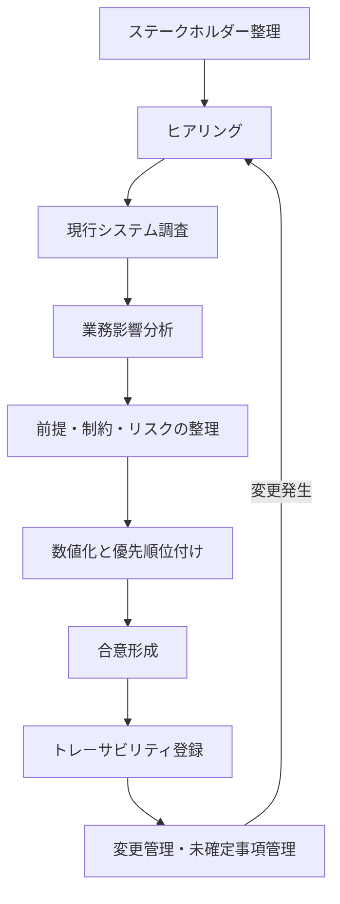

# 第2章 非機能要件定義の進め方

## 1. 学習目標

本章を終えると、次ができる。

- ステークホルダーを役割で整理し、合意の責任者を明確にできる
- ヒアリング、現行調査、業務影響分析から制約・前提・リスクを分離できる
- 曖昧な要求を優先順位付きで数値化し、トレーサビリティと変更管理に載せられる
- 業務、運用、セキュリティ、開発、経営層向けのヒアリング質問を使い分けられる

## 2. 基本概念

非機能要件定義は、一度の会議で終わる作業ではない。
次の順序を基本形とする。

各ステップの成果物は、完璧である必要はない。
ただし、「誰が何を根拠に決めたか」が後から追える状態は必須である。

### 2.1 ステークホルダー

**ステークホルダー**は、非機能の目標値や方式に利害を持つ人または組織である。
名前の一覧ではなく、次の観点で整理する。

| 観点 | 確認すること |
|------|--------------|
| 関心 | 止められない業務、守りたい情報、下げたいコスト |
| 権限 | 要件を承認できるか、予算を承認できるか |
| 情報 | 現行の実測、障害履歴、契約、規程を持っているか |
| 影響 | 要件未達時に業務損害を受けるか |

最低限、次の役割を置く。

- 業務オーナー：業務影響と許容停止の最終判断
- 運用責任者：監視、障害対応、計画停止の実現性判断
- セキュリティ責任者：規程、監査、インシデント要件の判断
- 開発/アプリ責任者：実装制約、外部API制約の提示
- インフラ/クラウド責任者：構成、クォータ、可用性方式の提示
- プロジェクトマネージャ：スコープ、日程、変更管理
- 経営または予算決裁者：高コスト要件の採否

一人が複数役割を兼ねる組織もある。
兼務でも、承認の帽子を分けて記録する。

### 2.2 ヒアリング

ヒアリングの目的は、要望の収集だけではない。
次を引き出す。

- 困っている具体事象（いつ、誰が、何回、どの画面/バッチか）
- 止まると困る業務とその代替手段
- 現行の暗黙知（手動回避、夜間待機、特別対応）
- 「当たり前」と思われて文書化されていない前提

進め方の推奨事項は次である。

1. 品質特性ごとに質問を分ける。一度に全部聞かない
2. 数値の根拠を聞く。「なぜ2秒か」「なぜ99.99%か」
3. 発言をその場で要件文にしない。要求として記録する
4. 矛盾する発言を消さない。優先順位付けの材料にする
5. 「わからない」を許容し、未確定事項にする

### 2.3 現行システム調査

新規構築でも、現行または類似システムがある場合は調査する。
調査対象の例は次である。

- アクセスログ、APM、バッチ実行履歴
- 障害票、インシデント報告書、ポストモーテム
- バックアップ取得結果と復元試験記録
- 監視アラートの発報数と対応時間
- 構成図、依存する外部サービス一覧
- 契約上のSLA、制裁条項、保守契約
- データ量の月次推移

現行の性能や稼働率が、将来要件の上限または下限になるとは限らない。
ただし、根拠のない目標より、実測に基づく出発点の方が議論が早い。

**必須事項**：実測値を使うときは、測定期間、測定点、除外条件を併記する。

### 2.4 業務影響分析

**業務影響分析**は、停止、遅延、データ損失、情報漏洩が業務に与える影響を整理する作業である。
DRだけのものではない。可用性、性能、バックアップ、セキュリティの目標値の根拠になる。

整理の最小項目は次である。

| 項目 | 内容 |
|------|------|
| 業務名 | 申請承認、給与計算連携、問い合わせ参照など |
| 影響開始時間 | 停止後何分で業務影響が出るか |
| 影響内容 | 決裁遅延、顧客対応不能、コンプライアンス違反など |
| 代替手段 | 紙、メール、後追い処理の可否 |
| 許容停止 | 業務オーナーが許容する最大停止 |
| 許容データ損失 | 再入力可能な範囲 |
| ピーク特性 | 曜日、時刻、月末、年度末 |

影響が大きい業務ほど、目標は厳しく、コスト正当化も容易になる。
影響が小さい業務に最高水準を付ける必要はない。

### 2.5 制約条件

**制約条件**は、プロジェクトが容易に変更できない条件である。

例：

- 個人情報を国内リージョンに置く社内規程
- 既存IdPを使うこと
- 特定の保守窓口時間
- 年度予算の上限
- 移行完了の法定期限や契約期限
- 既存外部APIのレート制限

制約は要件ではない。
制約の下で要件を満たす設計を考える。
制約自体を変えたい場合は、別途、規程変更や契約変更の課題にする。

### 2.6 前提条件

**前提条件**は、成立すると仮定する条件である。
崩れたら要件や設計の見直しが必要になる。

例：

- 同時利用者ピークは1,200人を超えない
- 外部APIの95パーセンタイル応答は500ms以内
- 計画停止を年4回取得できる
- 監視の一次受け体制が継続する
- 従業員数が3年で20%増までに収まる

前提は楽観的になりやすい。
重要前提には、監視指標か定期レビューを付ける。

### 2.7 リスク

**リスク**は、発生不確実な事象のうち、要件未達や設計破綻を招くものである。

例：

- 外部APIの大幅遅延
- クラウドクォータ不足
- 復元試験未実施のまま本番稼働
- 属人化した夜間バッチ
- 要件承認者の不在による意思決定遅延

リスクには、発生時影響、検知方法、対策、残存時の受容者を付ける。
「注意する」だけでは管理していない。

### 2.8 優先順位

すべての要求を同等に扱わない。
優先順位付けの観点例は次である。

1. 法令・契約違反につながるもの
2. 重要業務の停止・データ損失につながるもの
3. 多数利用者の生産性を大きく落とすもの
4. 運用負荷を過大にし、持続不能にするもの
5. 将来の拡張を著しく妨げるもの
6. あると望ましい改善

MoSCoW（Must / Should / Could / Won't）でも、数値スコアでもよい。
重要なのは、Won't（やらない）を明示することである。

### 2.9 数値化

数値化は、次の変換作業である。

1. 対象を特定する
2. 条件を固定する
3. 指標を選ぶ
4. 目標値を置く
5. 測定方法を決める
6. 合否を定義する

数値の作り方には優先順位がある。

1. 法令、契約、社内規程に数値がある
2. 業務影響分析から逆算する
3. 現行実測を改善または維持する
4. 類似システムや業界慣行を参考にする（根拠として弱いので明記）
5. 仮置きし、測定後に見直す（未確定事項へ）

根拠の弱い数値を、強い断定で書かない。

### 2.10 合意形成

合意形成は、署名欄を埋める儀式ではない。
次が揃った状態を合意と呼ぶ。

- 要件文面が測定可能である
- 目標値の根拠が共有されている
- コストと運用負荷の影響が説明されている
- 満たせない要求の扱いが決まっている
- 未確定事項の確認期限と担当がいる
- 承認者が要件一覧に責任を持つ

合意の会議では、方式の議論に逃げない。
先に「何を守るか」を決め、方式は設計レビューへ送る。

### 2.11 トレーサビリティ

**トレーサビリティ**は、要求からテストまでの対応関係を追跡できることである。

最小の連鎖は次である。

`要求ID → 要件ID → 設計書節 → テスト項目ID → 証跡`

これがないと、次が起きる。

- 要求が要件に落ちていない欠落
- 設計だけの独りよがり
- テスト合格なのに業務要求未達
- 変更時の影響調査不能

### 2.12 要件変更管理

非機能要件の変更は、機能追加より影響が広いことがある。
変更管理で確認する項目は次である。

- 変更理由
- 影響する設計、試験、運用、コスト
- 関連要件への波及
- 残存リスクの変化
- 承認者

「試験で出なかったので目標を下げた」は、変更理由としては記録できる。
ただし業務オーナーの再合意なしに下げてはならない。

### 2.13 未確定事項管理

未確定事項は、隠す対象ではなく、管理する対象である。

記載項目の例：

- 課題ID
- 内容
- 影響する要件ID
- 確認先
- 期限
- 仮置き値
- 期限超過時のエスカレーション先

仮置き値がある要件は、要件文に「仮置き」と明記する。
仮置きのまま本番移行判定へ進ませない仕組みが必要である。

## 3. 業務上の意味

進め方を飛ばして設計に入ると、次の損失が起きる。

- 作ってから「想定と違う」とやり直しになる
- 運用引継ぎ時に監視や手順が不足している
- 監査で根拠を説明できない
- 障害後に「誰がこの目標を決めたのか」が不明になる

逆に、ヒアリングと業務影響分析が足りていれば、高価な方式を却下する判断も早くなる。
「止められない」の実態が「4時間止められる」なら、コストを下げられる。

## 4. ヒアリング質問

部門別に質問例を示す。
すべてを毎回聞く必要はない。
案件の品質特性に応じて選ぶ。

### 4.1 業務部門

- 利用者が最も使う画面と操作は何か
- 遅いと感じるのは何秒からか。そのとき業務はどう止まるか
- 平日、夜間、休日、月末、年度末で、利用の違いは何か
- システム停止時、何分で業務影響が出るか。代替手段はあるか
- データが欠ける、古い、二重登録になると、どの業務が壊れるか
- 計画停止は何日前通知で、何時間まで許容できるか
- 外部取引先や他部門システムとの締め時刻はあるか
- 「絶対に止められない」業務を3つ挙げるなら何か。その理由は何か
- 個人情報や機密情報を扱う画面はどれか
- 現状の手動回避や特別運用はあるか

### 4.2 運用部門

- 運用時間、オンコール体制、一次受けとエスカレーション経路は何か
- 現行のアラート件数と、対応に時間がかかる典型障害は何か
- 計画停止、パッチ、証明書更新の標準リードタイムは何か
- バックアップ取得時間帯と、最近の復元試験結果はどうか
- ジョブ失敗時のリトライ、待ち合わせ、手動介入の頻度は何か
- アカウント申請、権限変更、構成変更の手順と承認は何か
- 属人化している作業は何か。その人が不在だと何が止まるか
- 監視で見えていない依存関係（外部API、DNS、IdP）はあるか
- 障害時に業務部門へ連絡する基準は何か
- 運用受入で不合格にしたい条件は何か

### 4.3 セキュリティ部門

- 適用される法令、規制、社内規程、監査項目は何か
- 個人情報、機密区分、保管場所の制約は何か
- 認証方式、MFA、特権ID、職務分離の必須条件は何か
- 通信と保存の暗号化、鍵管理の基準は何か
- ログの必須項目、保管期間、改ざん防止の要求は何か
- 脆弱性診断、ペネトレーションテストの実施頻度と合格基準は何か
- パッチ適用の期限（重大度別）は何か
- インシデント時の報告先、報告期限、証拠保全の要求は何か
- 外部委託、本番アクセス、ブレイクグラス手順の条件は何か
- クラウド利用時の責任分界で、特に確認したい点は何か

### 4.4 開発部門

- 同期必須の外部APIと、非同期化できる処理は何か
- 既存のタイムアウト、リトライ、冪等性の実装方針はあるか
- ステートレスにできないセッションやローカルファイル依存はあるか
- バッチの実行時間、依存ジョブ、再実行可否はどうか
- データ量増加で遅くなるクエリや帳票はあるか
- 互換性を壊す変更の頻度と、後方互換の方針はあるか
- 性能試験で使うシナリオは、どの業務操作を代表するか
- Feature Flag、段階リリース、ロールバック手段はあるか
- 設定値のうち、環境差で事故りやすいものは何か
- 技術的負債のうち、非機能未達の主因になりそうなものは何か

### 4.5 経営層

- 本システムの停止が、経営指標や対外信用に与える影響は何か
- 投資可能な初期費用と運用費用の上限感はあるか
- 可用性やDRを一段上げる費用対効果を、誰が判断するか
- 法令違反や情報漏洩に対する許容はゼロか。残存リスクの受容者は誰か
- リリース日程と品質のどちらを優先する方針か。例外条件はあるか
- 3年後の利用者数、拠点、業務範囲の見通しは何か
- ベンダーロックインやサービス廃止リスクを、どの程度嫌うか
- 障害発生時の対外説明で、経営として守れない状況は何か

## 5. 要件例

進め方自体の管理要件例を示す。

### 要件例 NFR-GOV-001

- 要件ID：NFR-GOV-001
- 分類：要件管理
- 対象：本システムの非機能要件一覧
- 業務上の目的：目標変更の無断実施を防ぎ、合意責任を明確にする
- 前提条件：要件管理ツールまたは一覧表が単一の正とする
- 指標：承認済み要件の変更が変更管理票を経由した比率
- 目標値：100%
- 測定条件：基本設計完了後から本番移行判定まで
- 測定方法：要件IDごとの変更履歴と承認記録を突合する
- 合否判定：承認記録のない目標値変更が0件
- 例外条件：誤記修正のうち、意味が変わらない表記ゆれ修正は対象外。ただし履歴は残す
- 実現方式：変更管理手順、承認フロー、トレーサビリティ表
- 検証方法：移行判定時の監査、サンプル突合
- 根拠：非機能目標の黙改が障害後説明を不能にするため
- 関連要件：なし
- 未確定事項：使用する管理ツールの最終選定

## 6. 悪い要件例

- 「関係者と十分に協議すること」
- 「必要に応じて現行調査を行うこと」
- 「リスクを適切に管理すること」

これらは進め方の精神論であり、合否を判定できない。

## 7. 改善後の要件例

「関係者と十分に協議すること」の改善例は次である。

- 対象：可用性、性能、セキュリティ、DRのMust要件
- 指標：業務オーナー、運用責任者、セキュリティ責任者の承認完了率
- 目標値：本番移行前に100%
- 測定方法：要件一覧の承認欄またはワークフロー履歴
- 合否判定：未承認のMust要件が1件でもあれば移行判定不合格

## 8. 設計への落とし込み

進め方の成果は、次の設計インプットになる。

| 定義成果 | 設計への入り方 |
|----------|----------------|
| 業務影響分析 | 可用性、RTO/RPO、監視重大度の根拠 |
| 制約条件 | リージョン、IdP、保管地、予算上限 |
| 前提条件 | サイジング、依存APIの設計条件 |
| 優先順位 | どの品質特性に予算を張るか |
| 未確定事項 | 仮置き設計と見直しゲート |

設計者は、インプットが欠けているまま詳細方式を確定しない。
欠ける場合は、仮置きと見直し条件を設計書に書く。

## 9. 代替案

進め方の型にも代替がある。

1. **全面ヒアリング型**  
   利害が広く、新規性が高い案件向け。時間はかかる。

2. **差分定義型**  
   現行踏襲が強い案件向け。現行実測と差分要求を中心に聞く。

3. **リスク起点型**  
   短期リリースで全面定義が間に合わない場合。Mustのリスクから先に固める。
   ただし残件を未確定事項として可視化する。

短期だからといって、個人情報と復旧要件まで先送りしてはならない。

## 10. トレードオフ

| 対立 | 内容 |
|------|------|
| 定義の深さ vs 日程 | 深く聞くほど後半の手戻りは減るが、着手は遅れる |
| 仮置きの速さ vs 再合意コスト | 早く置けるが、後で覆る |
| 関係者を増やす vs 意思決定速度 | 抜け漏れは減るが収束が遅い |
| 文書量 vs 可读性 | 全部書くと読まれない。標準形式と要約の二層が必要 |

## 11. 検証方法

進め方そのものの検証は次で行う。

- 要件一覧のサンプリングレビュー（測定可能性）
- トレーサビリティ表の欠番確認
- 未確定事項の期限超過ゼロ確認
- 重要前提の実測突合
- 承認記録の存在確認

## 12. よくある失敗

1. 業務部門だけ聞いて運用とセキュリティを後回しにする
2. ヒアリング議事録が要望メモのままで要件化されない
3. 現行調査をせず、感覚でピークを置く
4. 制約と要件を混在させる
5. 優先順位を付けず、全部Mustにする
6. 未確定事項を口頭のまま忘れる
7. 承認者が「見た」だけで、目標値の意味を理解していない
8. 変更管理を機能要件にしか適用しない

## 13. レビュー観点

- [ ] ステークホルダーに業務、運用、セキュリティ、開発、決裁者が含まれるか
- [ ] 要求と要件が分離されているか
- [ ] 制約、前提、リスクが別表になっているか
- [ ] Must/Should/Won'tが明示されているか
- [ ] 目標値に根拠種別（規程/影響分析/実測/仮置き）があるか
- [ ] 未確定事項に期限と担当があるか
- [ ] トレーサビリティの最小連鎖があるか
- [ ] 部門別ヒアリングで抜けている品質特性がないか

## 14. 章末問題

### 問題1

「月末は特に遅い」という発言に対し、業務部門へ追加で聞く質問を5つ書け。

### 問題2

次を制約、前提、リスク、要件に分類せよ。

A. 個人情報は国内リージョンに保存する社内規程がある  
B. 同時利用者は1,200人を超えない見込みである  
C. 外部APIがレート制限を強化する可能性がある  
D. 申請一覧の95パーセンタイル応答を2秒以内にする  

### 問題3

未確定事項「休日オンライン利用の要否が不明」を、課題票の形で書け。

### 問題4

経営層が「絶対に止めるな。予算は最小で」と述べた。
要件定義担当として、最初に返すべき整理は何か。

## 15. 解答と解説

### 問題1（例）

1. 月末の何日、何時台に遅いか  
2. どの画面またはAPIか  
3. 遅いと感じる秒数と、業務上の支障は何か  
4. 利用者数や申請件数は平常の何倍か  
5. 現行で実施している回避策はあるか  

### 問題2

- A：制約条件
- B：前提条件
- C：リスク
- D：非機能要件

### 問題3（例）

- 課題ID：ISSUE-AVL-003
- 内容：休日にオンライン利用を公式サポートするか未確定
- 影響要件：NFR-AVL-001 の測定条件と稼働率分母
- 確認先：業務オーナー
- 期限：基本設計レビューの1週間前
- 仮置き：休日はベストエフォート、SLO対象外
- 期限超過時：PM経由で経営補佐へエスカレーション

### 問題4

「絶対に止めない」と「予算最小」は対立する。
まず、止めてよい時間を業務影響分析で分解し、Mustの停止耐性だけを見積もる。
その上で、予算内で届く目標と、追加予算が必要な目標を比較提示する。
両方を同時に約束しない。

## 16. 実務演習

実務シナリオを使い、次を作成せよ。

1. ステークホルダー表（役割、関心、承認権限）
2. 部門別ヒアリングから、各部門3問に絞った質問票
3. 前提条件5件、制約条件5件、リスク5件
4. 要求10件をMust/Should/Could/Won'tに分類
5. トレーサビリティ表のヘッダと、サンプル2行

この成果は、後の実務シナリオ編で再利用する。

---

## 次章予告

第3章では可用性設計を扱う。
稼働率から許容停止時間を計算し、SLA/SLO/SLI、冗長化、マルチAZ、直列並列構成を、数値例付きで説明する。
