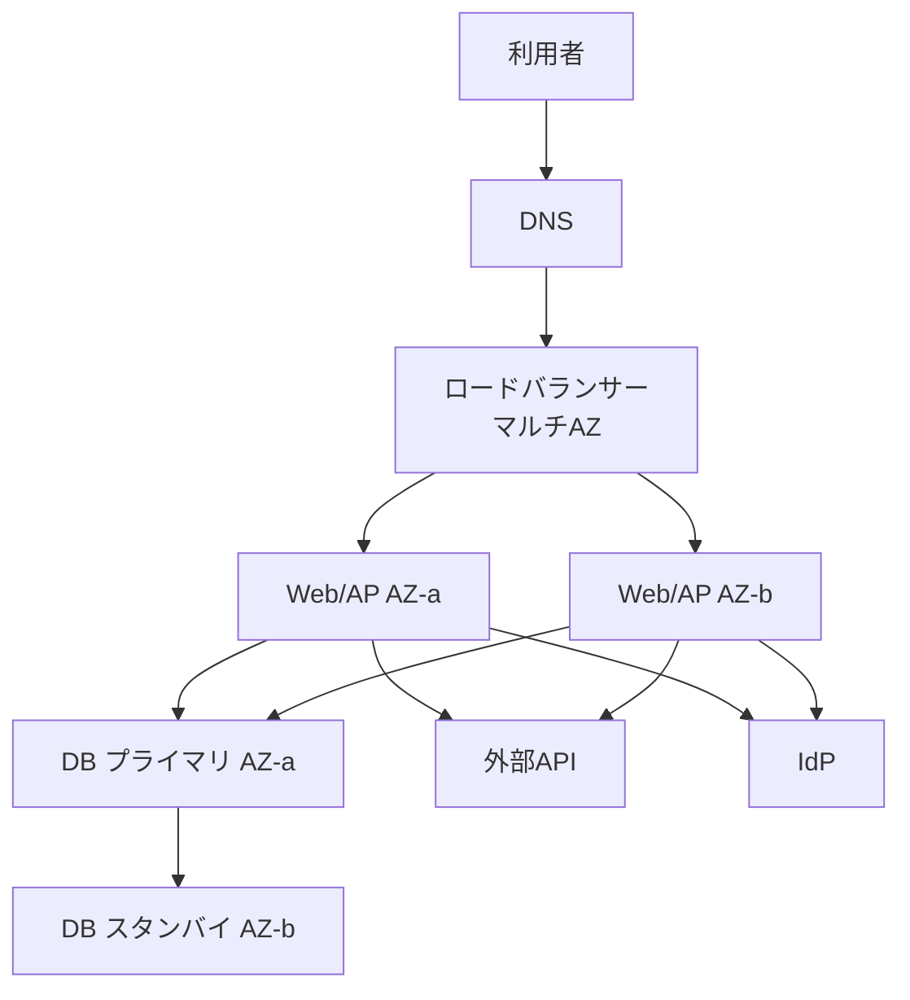

# 第3章 可用性設計

## 1. 学習目標

本章を終えると、次ができる。

- 稼働率から許容停止時間を、前提付きで算出できる
- SLA、SLO、SLI、MTBF、MTTRを混同せずに使い分けられる
- 単一障害点を洗い出し、冗長化とfailoverの設計方針を要件に対応付けられる
- 直列・並列構成の可用性を概算し、計画停止と計画外停止を分けて扱える

## 2. 基本概念

### 2.1 稼働率

**稼働率**は、定められた時間のうち、システムが利用可能な時間の割合である。

```text
稼働率 = 稼働時間 ÷ 総時間
```

または停止時間から次のように書く。

```text
稼働率 = 1 - (停止時間 ÷ 総時間)
```

稼働率を語るときは、次を同時に固定する。

- 分母の時間帯（24時間か業務時間帯か）
- 分子の定義（部分障害を停止とみなすか）
- 計画停止の除外有無
- 測定点（外形監視か、サーバ死活か）

分母と除外条件が違う稼働率は比較できない。

### 2.2 計画停止と計画外停止

**計画停止**は、事前に告知し、承認された保守のための停止である。
パッチ適用、大規模移行、構成変更が該当する。

**計画外停止**は、障害や予期しない事象による停止である。
可用性SLOの対象にすることが多い。

両方を一つの「止まらない」に混ぜると、運用も試験も破綻する。
計画停止は回数・時間・告知期限で管理し、計画外停止は稼働率やMTTRで管理する。

### 2.3 SLA、SLO、SLI

三つは役割が違う。

| 用語 | 意味 | 主な使い所 |
|------|------|------------|
| **SLI** | 測定する指標そのもの | 外形監視成功率、エラー率、応答時間 |
| **SLO** | 内部の目標値 | 月次稼働率99.9%、95パーセンタイル2秒 |
| **SLA** | 契約上の約束。未達時の補償や罰則を伴うことが多い | 顧客向け契約、ベンダー契約 |

混同の典型は次である。

- クラウドサービスのSLAを、自システムのSLOだと思い込む
- SLO未達なのにSLA違反と呼ぶ
- SLIを決めずにSLOだけ書く

**推奨事項**：先にSLIを決め、次にSLOを置き、対外約束が必要なときだけSLAを結ぶ。

### 2.4 MTBFとMTTR

**MTBF**（Mean Time Between Failures）は、故障と故障の平均間隔である。
長いほど故障しにくい。

**MTTR**（Mean Time To Repair）は、復旧にかかる平均時間である。
短いほど早く戻る。

近似式として次が使われる。

```text
稼働率 ≈ MTBF ÷ (MTBF + MTTR)
```

例：MTBFが720時間、MTTRが0.72時間なら、

```text
720 ÷ (720 + 0.72) ≈ 0.999 = 99.9%
```

この式は平均の話である。
月末の長時間障害一件で、月次SLOは簡単に割れる。
平均値だけを見て安心しない。

### 2.5 単一障害点

**単一障害点**（SPOF: Single Point of Failure）は、その一点が止まると系全体が止まる箇所である。

例：

- 冗長化されていないロードバランサー
- 単一AZのデータベース
- 単一の認証基盤
- 単一のDNS設定担当者（運用上のSPOF）
- バックアップの復元手順を知る人が一人だけ

SPOFはインフラだけではない。
運用と権限にも存在する。

### 2.6 冗長化、フェイルオーバー、クラスタ、ロードバランサー

**冗長化**は、同じ役割の資源を多重化し、一部障害でも継続できるようにすることである。

**フェイルオーバー**は、障害時に待機系や他ノードへ切り替えることである。
自動と手動がある。切替時間はMTTRに効く。

**クラスタ**は、複数ノードをまとめてサービスを提供する構成である。
活性待機、活性活性など形態が違う。

**ロードバランサー**は、複数のサーバへ要求を振り分ける。
ヘルスチェック連動で障害ノードを切り離せる。
ロードバランサー自体の冗長も必要である。

### 2.7 マルチAZとマルチリージョン

**可用性ゾーン（AZ）**は、同一リージョン内の分離されたデータセンター群を指す考え方である。
電源やネットワーク障害の影響範囲を分ける目的で使う。

**マルチAZ**は、同一リージョン内の複数AZに分散する構成である。
単一AZ障害への耐性を高める。

**マルチリージョン**は、地理的に離れたリージョンへ分散または待機系を置く構成である。
広域災害やリージョン障害への耐性を高める。
コスト、データ同期、切替複雑性も増える。

クラウドサービスのSLAは、多くの場合、個別サービスかつ条件付きである。
自システムのエンドツーエンド可用性とは別物として扱う。

### 2.8 可用性の直列・並列構成

直列結合では、すべてが動いて系が動く。

```text
A_total = A1 × A2 × A3
```

例：Web 99.9%、AP 99.9%、DB 99.9%を直列とみなすと、

```text
0.999 × 0.999 × 0.999 ≈ 0.997 = 99.7%
```

並列（冗長）では、すべてが同時に止まると系が止まる。
独立故障を仮定し、各系の非稼働率を `U = 1 - A` とすると、2重化では次になる。

```text
A_parallel = 1 - (U1 × U2)
```

例：可用性99%の装置を2台並列にすると、

```text
U = 0.01
A = 1 - (0.01 × 0.01) = 99.99%
```

この計算は、故障の独立性、切替成功、共通要因障害なし、を仮定する。
現実には電源、設定ミス、依存サービスが共通要因になる。
計算値は上限に近い目安であり、設計の安心材料にしすぎない。

### 2.9 業務時間帯別の要件

24時間同じ稼働率を要求しない案件が多い。
業務時間帯、バッチ時間帯、休日で要件を分ける。

例：

- 平日8〜20時：計画外稼働率99.9%、重大障害の初動15分以内
- 平日20〜8時：バッチ完了を優先。オンラインはベストエフォートまたは低いSLO
- 休日：参照のみ、またはSLO対象外

時間帯を分けると、保守窓とコストを確保しやすい。

### 2.10 稼働率から許容停止時間を算出する方法

#### 計算手順

1. 分母の総時間を決める
2. 目標稼働率を決める
3. `許容停止時間 = 総時間 × (1 - 稼働率)` を計算する
4. 計画停止の扱いを明示する
5. 部分障害の数え方を明示する

#### 数値例1：年換算（24時間365日）

前提：1年 = 365日 = 8,760時間。

| 稼働率 | 許容停止時間/年 | 分に換算 |
|--------|-----------------|----------|
| 99% | 87.6時間 | 5,256分 |
| 99.9% | 8.76時間 | 525.6分 |
| 99.99% | 0.876時間 | 52.56分 |
| 99.999% | 0.0876時間 | 5.256分 |

計算例（99.9%）：

```text
8,760 × (1 - 0.999) = 8.76時間/年
```

#### 数値例2：実務シナリオの業務時間帯

前提：

- 対象は平日8:00〜20:00のみ
- 1か月の平日を20日とする
- 1日の業務時間は12時間
- 月の総業務時間は `20 × 12 = 240時間 = 14,400分`
- 計画停止は分母から除外する（別管理）
- 目標は計画外停止に対する月次稼働率99.9%

```text
許容計画外停止 = 14,400 × (1 - 0.999) = 14.4分/月
```

解釈：

- 月に14.4分を超える計画外停止が一つの障害で起きれば、その月のSLOは未達になりうる
- 「年換算99.9%」より厳しい運用 sensivity を持つ場合がある
- 逆に、休日を分母に含めない分、保守窓は取りやすい

#### 数値例3：計画停止を含めた場合の比較

前提：ある月に計画停止を4時間実施し、計画外停止が10分あった。
業務時間の分母を14,400分とする。

ケースA：計画停止を除外しない

```text
停止 = 4時間 + 10分 = 250分
稼働率 = 1 - 250/14,400 ≈ 98.26%
```

ケースB：計画停止を除外する

```text
分母 = 14,400 - 240 = 14,160分
停止 = 10分
稼働率 = 1 - 10/14,160 ≈ 99.93%
```

同じ事実でも、定義次第で評価が変わる。
契約と月次レポートで定義を固定する。

## 3. 業務上の意味

可用性はサーバが生きていることではない。
利用者が業務を遂行できることである。

例：

- Webサーバは生きているが、認証基盤が落ちてログインできない
- APは生きているが、重要APIだけが失敗し、申請できない
- フェイルオーバーは成功したが、DNSキャッシュで利用者は旧系を見ている

したがってSLIは、可能なら業務合成監視（ログインから代表操作まで）を含める。

## 4. ヒアリング質問

- 止めてよい最大時間は、業務ごと・時間帯ごとに何分か
- 部分的に使えない状態を停止とみなすか
- 計画停止の回数、時間、告知期限、承認者は誰か
- 障害検知から復旧完了までの目標は何か（MTTRに相当）
- 単一AZ障害、リージョン障害、IdP障害のそれぞれで期待する振る舞いは何か
- ベンダーSLAの補償で足りるか。業務影響の方が大きいか
- 可用性向上に追加できる予算と運用負荷の上限はあるか

## 5. 要件例

### NFR-AVL-001 業務時間帯の計画外稼働率

- 要件ID：NFR-AVL-001
- 分類：可用性
- 対象：Web業務システムのオンライン機能（ログイン、申請、承認、参照）
- 業務上の目的：平日日中の申請承認業務を継続する
- 前提条件：計画停止は年4回・各4時間以内・14日前告知。休日はSLO対象外
- 指標：SLIとして外形監視（代表シナリオ）の分単位成功
- 目標値：SLOとして平日8:00〜20:00の月次稼働率99.9%以上（計画停止除外）
- 測定条件：1分間隔の合成監視。HTTP 2xx/3xxかつ代表操作成功を成功とみなす
- 測定方法：監視基盤の月次集計。失敗連続は停止時間として加算
- 合否判定：当該月の算出稼働率が99.9%以上
- 例外条件：リージョン障害はNFR-DR-001で評価。測定システムの障害時間は別途補正手順で扱う
- 実現方式：マルチAZ、LBヘルスチェック、自動復旧、依存サービスの冗長
- 検証方法：AZ障害模擬試験、月次レポートレビュー
- 根拠：業務影響分析で、30分超の日中停止は決裁遅延が多発。月14.4分以内を目標にする
- 関連要件：NFR-MNT-001、NFR-MON-010、NFR-DR-001
- 未確定事項：代表シナリオの最終確定

### NFR-MNT-001 計画停止

- 要件ID：NFR-MNT-001
- 分類：可用性（保守）
- 対象：本番オンライン機能
- 業務上の目的：必要な保守を、業務影響を制御して実施する
- 前提条件：業務オーナー承認を得ること
- 指標：計画停止の回数、1回あたり停止時間、告知リードタイム
- 目標値：年4回以内、各回240分以内、告知は14日前まで
- 測定条件：本番変更管理上の計画停止のみ
- 測定方法：変更管理票と実施記録
- 合否判定：回数・時間・告知期限のいずれも目標内
- 例外条件：緊急脆弱性対応は緊急変更手順で実施し、事後に回数へ計上してレビューする
- 実現方式：メンテナンスウィンドウ、Blue-Greenまたはローリング、事前告知テンプレート
- 検証方法：計画停止リハーサル、告知プロセス監査
- 根拠：年数回の計画停止が可能という業務合意
- 関連要件：NFR-AVL-001
- 未確定事項：緊急変更の月次上限

## 6. 悪い要件例

- 「24時間365日止まらないこと」
- 「可用性99.99%を保証すること」（分母、除外、測定点なし）
- 「クラウドSLAに準拠すれば可用性は十分」
- 「SPOFをなくすこと」（対象範囲と判定基準なし）

## 7. 改善後の要件例

「24時間365日止まらないこと」は、本章のNFR-AVL-001とNFR-MNT-001、必要ならDR要件へ分解する。

「クラウドSLAに準拠すれば十分」の改善：

- 個別サービスのSLAはインプットにすぎない
- 自システムのSLOは、合成監視のSLIで定義する
- 依存サービス障害時の業務影響と代替手段を別途書く

## 8. 設計への落とし込み

### 採用構成例（実務シナリオ向け）



採用理由：

- 単一AZ障害でもオンライン継続を狙う
- リージョン常時稼働よりコストを抑えられる
- 年数回の計画停止が許容される

不採用案：

- 単一AZ構成：AZ障害で全停止するため、日中SLOに対して残存リスクが大きい
- アクティブ/アクティブのマルチリージョン：RTO要件が24時間なら過剰になりやすい

残存リスク：

- リージョン障害時はDR起動まで業務停止しうる
- IdPや外部APIがSPOFなら、アプリ冗長だけでは足りない
- 設定ミスや不良デプロイは両AZを同時に落とす

### メンテナンス時の継続性

計画停止を減らす設計選択肢：

1. ローリング更新
2. Blue-Green Deployment
3. カナリアリリース
4. 読み取りは継続、更新のみ停止

要件上「停止ゼロ」がMustでないなら、短い計画停止を残す方が総リスクが低い場合もある。

## 9. 代替案

| 方式 | 向く条件 | 向かない条件 |
|------|----------|--------------|
| 単一AZ + バックアップ | 停止耐性が高い、予算最小 | 日中の高いSLO |
| マルチAZ | 単一AZ障害を耐える | リージョン障害も短時間で復旧したい |
| ウォーム/ホットなDR | 広域災害のRTOが短い | 予算と訓練コストを払えない |
| 手動failover | 切替頻度が低い、誤切替を嫌う | MTTRを分単位にしたい |

## 10. トレードオフ

| 対立 | 内容 |
|------|------|
| 稼働率 vs コスト | 9を増やすほど冗長と運用が増える |
| 自動failover vs 誤切替 | 速いが、障害誤検知で揺れる |
| 計画停止削減 vs 変更リスク | 無停止更新は設計が難しい |
| エンドツーエンド監視 vs ノイズ | 業務実態に近いが、外部要因で落ちる |

99.9%から99.99%への引き上げは、許容停止が約10分の1になる。
費用も運用も線形とは限らず、一段で跳ねることが多い。

## 11. 検証方法

- 外形監視の成功定義レビュー
- AZ分離の障害注入試験（インスタンス停止、サブネット遮断の模擬）
- DBフェイルオーバー試験と切替時間計測
- 計画停止リハーサル
- 月次稼働率の算出ロジック監査
- IdP/DNS/外部API停止時の振る舞い確認

合否は、要件の測定条件と同じ定義で判定する。
試験中だけ定義を緩めて合格にしない。

## 12. よくある失敗

1. 年換算表だけ見て、月次業務時間帯の厳しさを見落とす
2. 計画停止を黙って分母に残す、または都合で除外する
3. サーバ死活を可用性SLIにする
4. クラウドSLAの数字を報告書の稼働率欄に転記する
5. 共通要因障害を無視して並列計算を信じ切る
6. failover試験を一度もせず、構成図だけで冗長を主張する
7. 運用SPOF（特定個人）を見落とす

## 13. レビュー観点

- [ ] 稼働率の分母、除外、測定点が定義されているか
- [ ] SLA/SLO/SLIが区別されているか
- [ ] 許容停止時間の計算過程があるか
- [ ] 計画停止要件が別にあるか
- [ ] SPOF一覧があるか（技術と運用）
- [ ] 依存サービス障害の扱いがあるか
- [ ] failoverの目標時間と試験があるか
- [ ] 採用理由、不採用案、残存リスクがあるか

## 14. 章末問題

### 問題1

前提：業務時間は平日20日×10時間/月。目標稼働率99.95%（計画外、計画停止除外）。
許容計画外停止は何分か。

### 問題2

Web 99.9%、AP 99.9%、DB 99.5%を直列とみなす。概算の総合可用性は約何%か。

### 問題3

ある月、業務時間分母14,400分、計画停止120分、計画外停止20分。
計画停止除外で計算した稼働率は約何%か。99.9%目標に対する合否はどうか。

### 問題4

「当社はクラウドSLA 99.99%のサービスを使っているので、システム可用性は99.99%」の誤りを指摘せよ。

## 15. 解答と解説

### 問題1

```text
総時間 = 20 × 10 = 200時間 = 12,000分
許容停止 = 12,000 × (1 - 0.9995) = 6分/月
```

### 問題2

```text
0.999 × 0.999 × 0.995 ≈ 0.993 ≈ 99.3%
```

DBが律速になっている。

### 問題3

```text
分母 = 14,400 - 120 = 14,280分
稼働率 = 1 - 20/14,280 ≈ 99.86%
```

99.9%目標には未達。

### 問題4

誤りは少なくとも次である。

- 個別サービスのSLAと、自システムのエンドツーエンド可用性は別
- 複数サービスの直列合成で総合可用性は下がる
- SLAは補償条件付きであり、業務影響ゼロを意味しない
- 利用者側障害、設定ミス、アプリ欠陥はベンダーSLAの対象外になりうる

## 16. 実務演習

実務シナリオについて、次を作成せよ。

1. 業務時間帯と休日の可用性SLO案
2. 許容停止時間の計算過程
3. SPOF候補一覧（少なくとも8件）
4. マルチAZ構成の採用理由、不採用案、残存リスク
5. NFR-AVL-001 をトレーサビリティ表の1行として設計節・テスト項目へ仮対応付け

---

## 次章予告

第4章では性能と応答時間を扱う。
平均値の限界、パーセンタイル、ピーク特性、オンライン/バッチ/API/ファイル転送の要件例を示す。
