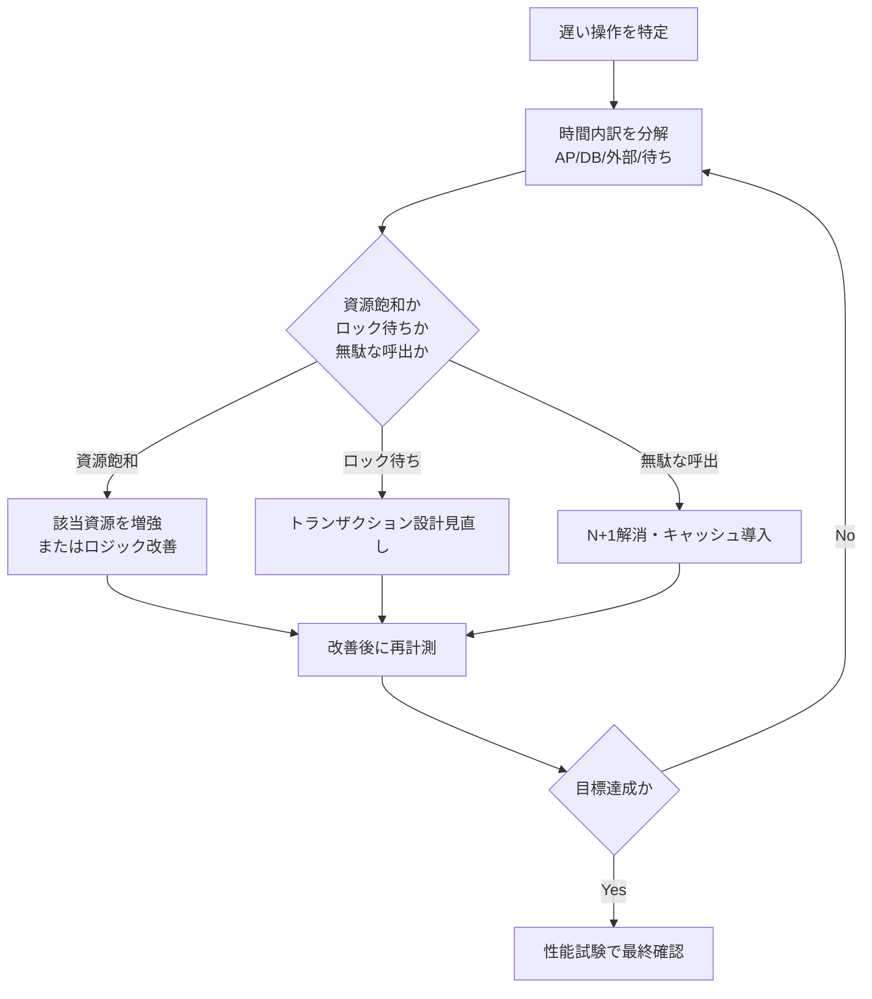

# 第4章 性能・応答時間設計

## 1. 学習目標

本章を終えると、次ができる。

- レスポンスタイム、スループット、同時接続数、TPSを区別して要件化できる
- 平均値だけでなくパーセンタイルとピーク条件を使って性能を評価できる
- CPU、メモリ、ディスクI/O、ネットワーク、データベース、外部APIのどこがボトルネックかを切り分ける手順を説明できる
- オンライン、バッチ、API、ファイル転送の性能要件を標準形式（16項目）で書ける
- 性能テスト、負荷テスト、ストレステスト、ソークテストの目的を区別し、使い分けて計画できる

## 2. 基本概念

### 2.1 レスポンスタイムと測定点

**レスポンスタイム**は、要求を出してから応答が返るまでの時間である。

測定点を固定しないと、同じ「2秒」でも意味が変わる。

測定点の例：

- ブラウザで操作してから画面描画が完了するまで（利用者体感）
- ロードバランサー到達から応答返却まで（サーバサイド全体）
- アプリケーションサーバ内の処理時間のみ
- データベースクエリの実行時間のみ

利用者体感は、ネットワーク遅延、フロントエンドの描画処理、サードパーティタグの読み込みなど、サーバ側で制御できない要素を含む。

**一般論**として、サーバサイドの処理時間だけを測って「性能要件を満たした」と主張する事例は多いが、利用者が体感する時間とは乖離することがある。

**推奨事項**：要件には「どこからどこまでを測るか」を必ず書く。

複数の測定点を持つ場合は、それぞれに目標値を置くか、主指標と参考値を分ける。

### 2.2 スループット、同時接続数、TPS

**スループット**は、単位時間あたりの処理量である。

件数/秒、画面遷移/分、バッチ処理件数/時などの単位で表す。

**同時接続数**は、ある瞬間に同時にセッションまたはTCP接続を保持している数である。

同時接続数は、同時利用者数と同義ではない。

一人の利用者が複数タブを開く、非同期ポーリングを行う、ブラウザが複数のリソースを並列取得するなどの理由で、同時接続数は同時利用者数を上回ることが多い。

**TPS**（Transactions Per Second）は、1秒あたりに処理されるトランザクション数である。

TPSを要件にするときは、トランザクションの定義を固定する。

- API呼び出し1回を1トランザクションとするか
- 業務上の1確定（複数API呼び出しを含む一連の処理）を1トランザクションとするか

この定義が曖昧だと、性能試験のスクリプト設計者と要件を書いた担当者の間で、まったく違う数値を「同じTPS」として扱ってしまう。

### 2.3 バッチ処理時間とデータ量

バッチは、開始時刻、終了期限、処理件数、失敗時の再実行可否のセットで要件化する。

「朝までに終わる」は要件ではない。

改善例：「6:00までに成功終了し、失敗時は6:30までの再実行で業務開始前に回復する」のように、期限と失敗時の代替経路まで書く。

データ量は、件数、容量、増加率を分けて扱う。

件数が少なくても、1件あたりのデータ（画像、添付ファイル、LOBカラム）が大きく、処理が遅くなるケースがある。

逆に、件数が多くても1件が軽量であれば、単純な件数比例でボトルネックが決まらないこともある。

**推奨事項**：バッチの性能要件には、件数だけでなく、データ特性（平均サイズ、最大サイズ、分布の偏り）を前提条件として明記する。

### 2.4 ピーク特性

性能要件の本体は、平常時ではなくピーク条件である。

平常時の平均だけを満たしても、月末に業務が止まれば性能要件は失敗している。

ピークの切り口は複数ある。

| 切り口 | 例 |
|--------|-----|
| 時刻 | 始業直後、昼休み明け、終業前の駆け込み |
| 日付 | 月末、四半期末、年度末、賞与支給日 |
| イベント | 制度変更直後、キャンペーン、一斉入力依頼 |
| 障害復帰後 | 停止中に滞留した要求が復帰直後に集中する |

複数のピークが重なる場合（月末かつ制度変更直後など）を想定するかどうかは、業務側と合意しておく。

**一般論**として、性能要件のヒアリングでは平常時の使用感だけが語られがちである。

ピークの実態は、現行システムのログや、業務担当者への個別確認がないと出てこないことが多い。

### 2.5 パーセンタイルと平均値

**平均値**は外れ値に引っ張られ、かつ利用者の体感とずれることが多い。

平均が1秒であっても、5%の利用者が10秒待たされていれば、苦情や問い合わせは確実に発生する。

**平均値だけでは不十分な理由**は次のとおりである。

1. 分布の形が見えない。平均1秒でも、全員が1秒前後なのか、大半が0.5秒で一部が20秒なのかが区別できない
2. 遅い少数派が業務上重要な利用者（管理職、繁忙部署）である場合、平均が良くても苦情の声は大きくなる
3. 障害の予兆（一部のリクエストだけ劣化し始める）を平均値は隠してしまう

**パーセンタイル**は、分布上のある位置を示す指標である。

95パーセンタイルが2秒であれば、要求の95%が2秒以内に完了していることを意味する。

推奨する使い分けは次である。

- オンライン画面の体感評価は、95または99パーセンタイルを主指標にする
- 平均値は、傾向把握の参考値として併記してよい
- 最大値だけを目標にすると、ネットワークの瞬断など稀な外れ値のたびに不合格になりうるため、最大値を主指標にする場合は例外条件を必ず添える

### 2.6 資源とボトルネック

性能は、CPU、メモリ、ディスクI/O、ネットワーク、データベース、外部APIのいずれかによって律速される。

| 資源 | 典型的な劣化要因 |
|------|------------------|
| CPU | 非効率なロジック、過剰なシリアライズ/デシリアライズ、GC負荷 |
| メモリ | リーク、キャッシュの肥大化、大量データの一括読み込み |
| ディスクI/O | ランダムアクセス過多、ログ出力過多、索引不足によるフルスキャン |
| ネットワーク | 帯域不足、往復回数（ラウンドトリップ）の多さ、パケットロス |
| データベース | ロック待ち、索引不足、統計情報の陳腐化、コネクション枯渇 |
| 外部API | 相手先の応答遅延、レート制限、リトライの多重化 |

**ボトルネック**は、系全体の処理能力を制限している箇所である。

資源を増やす場所を間違えると、費用だけが増えて効果が出ない。

例えば、ボトルネックがデータベースのロック待ちであるにもかかわらず、アプリケーションサーバのCPUを倍に増強しても、応答時間はほとんど改善しない。

### 2.7 ボトルネック特定の手順

ボトルネックの調査は、勘や経験則だけに頼らず、次の順序で進めることを推奨する。

1. 遅い操作を特定する（画面、API、バッチジョブの単位で）
2. 時間の内訳を取る（アプリ内処理、DB問い合わせ、外部呼び出し、待ち時間に分解する）
3. 資源飽和（CPU/メモリ/ディスク/ネットワークが上限に張り付いているか）か、ロック待ちか、無駄な呼び出し（N+1問題など）かを切り分ける
4. 仮説に基づいて改善を実施する
5. 改善後に再計測し、想定どおりの効果が出たかを確認する

**必須事項**：改善策を実施したら、必ず同一条件で再計測する。

「直したはず」で終わらせると、別の要因で悪化していても気付けない。

### 2.8 性能目標値の作り方

目標値は、思いつきではなく、次のいずれかの根拠から作る。

1. 業務上、待つと作業が中断してしまう心理的・業務的な閾値
2. 現行システムの実測値に対する改善目標
3. 上位システムとの契約や、社内SLAで既に決まっている値
4. 依存する外部APIの応答時間を踏まえた合成値

例：外部APIの95パーセンタイルが800msである場合、自システム単独で画面応答200ms以内という目標は非現実的である。

同期呼び出しを含む画面要件は、依存を含めた形で目標値を置くか、非同期化（先に画面を返し、結果は後から反映する）を設計で検討する。

**推奨事項**：目標値には、根拠となった実測値または合意事項を要件例の「根拠」欄に必ず記録する。

根拠のない目標値は、達成できなかったときに交渉の材料を失う。

### 2.9 性能テストの種類

| 種別 | 目的 | 負荷パターン | 典型的な実施期間 |
|------|------|--------------|-------------------|
| **性能テスト** | 想定される通常負荷で、応答時間や資源使用率が要件を満たすか確認する | 想定平常負荷、または想定ピーク負荷 | 数十分〜数時間 |
| **負荷テスト** | 想定ピークまで段階的に負荷を上げ、限界点と劣化の様子を見る | 段階的に増加 | 数時間 |
| **ストレステスト** | 想定を超える負荷をかけ、壊れ方（エラーの出方、復旧の様子）を確認する | 想定を超える負荷、または急激な負荷変動 | 数十分〜数時間 |
| **ソークテスト** | 長時間にわたって負荷をかけ続け、メモリリーク、キュー滞留、ログ肥大などの劣化を検出する | 平常〜やや高めの負荷を維持 | 8〜24時間以上 |

種類を混ぜて「負荷試験をやった」で済ませないことが重要である。

**一般論**として、リリース直前に時間が足りず、性能テストだけを実施してソークテストを省略する事例は多い。

その結果、本番稼働から数日〜数週間経過してからメモリリークやログ肥大が発覧し、深夜の緊急対応につながることがある。

**推奨事項**：本番相当の重要システムでは、最低でも性能テストとソークテストの2種類は実施する。

負荷の伸びしろが読めない新規サービスでは、ストレステストも計画する。

### 2.10 継続的な性能管理

性能は、リリース前の試験だけで完結しない。

本番稼働後も、次の観点で継続的に管理する必要がある。

- APM（Application Performance Monitoring）による常時計測
- スロークエリログの定期レビュー
- 月次・四半期でのキャパシティトレンドレビュー（第5章と連携）
- リリースごとの性能回帰確認（新機能が既存機能の性能を劣化させていないか）

**推奨事項**：性能要件の合否判定は、リリース前の試験だけでなく、本番稼働後一定期間（例：1か月）の実測レビューを含める。

試験環境と本番環境ではデータ量、同時アクセスパターン、ネットワーク構成が異なることが多く、試験合格が本番での体感を保証しない場合がある。

## 3. 業務上の意味

性能未達は、機能停止と同じだけの業務影響を持つことがある。

申請画面の応答が30秒かかれば、利用者は「固まった」と判断して再操作を繰り返し、二重申請やセッション切れを誘発する。

バッチ遅延は、当日の業務判断に使うデータを前日以前のまま止めてしまう。

これは、機能としては「動いている」が、業務としては「使えない」状態である。

性能要件の主語は、システムのスループットではなく、業務が時間内に完了するかどうかである。

## 4. ヒアリング質問

- 遅いと困る操作は具体的に何か。何秒を超えると業務が止まるか
- ピークはいつ、どの程度の頻度で発生するか。平常時の何倍の負荷になるか
- 同時に利用する人数はどの程度で、その根拠（座席数、部門人数、実測）は何か
- バッチの開始・終了期限と、遅延した場合の業務影響は何か
- 外部APIやファイル転送の遅延は、誰の責任範囲で、SLAはあるか
- 現行のAPM、スロークエリログ、バッチ実行履歴は入手できるか
- 過去に性能問題で業務が止まった事例はあるか。原因は何だったか
- 性能試験に使えるデータ量と環境は、本番相当を用意できるか

## 5. 要件例

性能要件は、処理形態（オンライン、バッチ、API、ファイル転送）ごとに性質が異なるため、それぞれ独立して要件化する。

### オンライン処理：NFR-PERF-010

- 要件ID：NFR-PERF-010
- 分類：性能（オンライン）
- 対象：申請一覧画面、申請詳細画面、承認実行操作
- 業務上の目的：平日日中の申請承認業務を滞りなく進める
- 前提条件：同時利用者1,200人以下、一覧表示は1ページ100件以下、社内ネットワーク経由（VPN含む）
- 指標：各操作の応答時間95パーセンタイル（ブラウザ受信完了を基準とし、サーバ側計測を併記する）
- 目標値：一覧表示2.0秒以内、詳細表示1.5秒以内、承認実行2.0秒以内
- 測定条件：平常シナリオと月末ピークシナリオ（平常の1.5倍の同時利用者）の両方
- 測定方法：負荷試験ツールで仮想利用者を発生させ、APMまたはブラウザ計測ツールで応答時間を集計する
- 合否判定：全対象操作が目標値以内、かつエラー率0.1%未満
- 例外条件：依存する外部APIの応答が1秒を超える場合は、当該項目を非同期表示へ切り替える設計を許容し、別途要件化する
- 実現方式：アプリケーション層の水平スケール、データベース索引最適化、一覧のページング、必要に応じたキャッシュ導入
- 検証方法：性能試験、負荷試験、本番稼働後1か月の実測レビュー
- 根拠：業務ヒアリングで「3秒を超えると催促の電話が増える」との申告。現行実測の95パーセンタイルが2.8秒のため、改善目標として2.0秒を設定
- 関連要件：NFR-CAP-001（同時利用者数のキャパシティ）、NFR-PERF-020（バッチとの資源競合）
- 未確定事項：ブラウザ計測とサーバ計測の許容差分の正式合意

### バッチ処理：NFR-PERF-020

- 要件ID：NFR-PERF-020
- 分類：性能（バッチ）
- 対象：夜間集計バッチB01（当日実績を翌営業日の参照画面に反映する処理）
- 業務上の目的：翌営業日の業務開始時点で、最新の集計結果を参照可能にする
- 前提条件：入力件数は1日あたり50万件以下、同時に排他が必要な他ジョブとの並列実行はない
- 指標：ジョブ成功終了時刻、処理件数、失敗時の再実行後の完了時刻
- 目標値：通常運転時は5:30までに成功終了する。失敗時は6:00までに再実行を完了させる
- 測定条件：平常件数に加え、月末件数（平常の1.5倍）を含む試験を実施する
- 測定方法：ジョブスケジューラの実行履歴、処理件数ログの突合
- 合否判定：連続10営業日の試験で、期限超過が0件であること
- 例外条件：上流システムからの入力データ到着が23:00を超えて遅延した場合は、到着時刻から起算して90分以内の完了を代替判定とする
- 実現方式：データの分割並列処理、索引の追加、一時作業領域の確保、失敗時の部分再実行機能
- 検証方法：バッチ性能試験、障害時再実行試験
- 根拠：業務開始時刻8:00に対し、参照可否の確認と運用対応の余裕として1.5〜2時間を確保する
- 関連要件：NFR-OPS-020（ジョブ運用の異常検知）、NFR-PERF-010（オンラインとの資源競合回避）
- 未確定事項：年末年始の件数上限が未確定

### API：NFR-PERF-030

- 要件ID：NFR-PERF-030
- 分類：性能（API）
- 対象：社内連携用API `/api/v1/requests`（外部公開はしない）
- 業務上の目的：連携先システムからの申請照会要求を、時間内に返す
- 前提条件：クライアント側の同時接続は50以下、1応答あたり最大100件を返す
- 指標：サーバ側処理時間の95パーセンタイル、達成TPS、エラー率
- 目標値：95パーセンタイル300ミリ秒以内、200TPSまでエラー率0.1%未満を維持する
- 測定条件：認証処理を含めた本番相当データ量での測定
- 測定方法：API負荷試験ツール、サーバ側メトリクス収集
- 合否判定：目標TPSに到達した状態で、応答時間とエラー率が基準内に収まること
- 例外条件：クライアント起因のタイムアウト（クライアント側の待機時間設定不足）は合否判定から除外し、サーバログで区分する
- 実現方式：コネクションプーリング、ページング、レスポンスキャッシュ、レート制限による過負荷防止
- 検証方法：API負荷試験、レート制限試験
- 根拠：連携先システムのタイムアウト設定が1秒であるため、自システム側の応答に余裕を確保する
- 関連要件：NFR-REL-010（依存障害時の振る舞い）
- 未確定事項：連携先システムの増加後のTPS再見積もり

### ファイル転送：NFR-PERF-040

- 要件ID：NFR-PERF-040
- 分類：性能（ファイル転送）
- 対象：夜間の給与連携ファイル受信処理（最大ファイルサイズ2GB）
- 業務上の目的：後続バッチの開始前に、連携ファイルを確実に揃える
- 前提条件：回線の実効帯域30Mbps以上、ファイルは事前に圧縮済み
- 指標：転送完了までの時間、改ざん検知（チェックサム照合）を含む受信成功
- 目標値：22:00に転送を開始し、23:00までに受信成功を完了する
- 測定条件：最大サイズ2GBのファイルで、同時に他の転送処理が1本走っている状態を含める
- 測定方法：転送ログの時刻記録、チェックサム照合結果の記録
- 合否判定：3回連続で成功し、いずれも所要時間60分以内であること
- 例外条件：相手先システムの送信遅延で開始が遅れた場合は、到着後60分以内の完了を代替判定とする
- 実現方式：専用の転送経路確保、失敗時の自動再送、受信後の整合性検証
- 検証方法：大容量ファイルの転送試験、転送中断時の再送試験
- 根拠：後続バッチの開始時刻23:30に確実に間に合わせるため
- 関連要件：NFR-PERF-020（後続バッチとの連携）、NFR-SEC-040（転送経路の暗号化）
- 未確定事項：相手先システムの同時送信本数が増加する計画の有無

## 6. 悪い要件例

次は要件として不合格である。

1. 「システムは高速であること」
2. 「平均応答時間を短くすること」
3. 「ピーク時も快適に利用できること」
4. 「バッチは朝までに終わること」
5. 「APIは大量アクセスに耐えられること」
6. 「ファイル転送は速やかに完了すること」

不合格理由は共通している。

対象操作、指標、目標値、測定条件、合否判定のいずれかが欠けている。

加えて、例2は平均値だけを見ており、パーセンタイルの観点が抜けている。

例5は「大量」の定義（TPS、同時接続数）がなく、試験の合否を誰も判定できない。

## 7. 改善後の要件例

### 悪い例1・2の改善：「高速であること」「平均応答時間を短くすること」

NFR-PERF-010へ分解する。

改善の要点は、対象操作を固定し、指標を95パーセンタイルに置き換え、平常とピークの両条件で目標値を設定したことである。

平均値を完全に捨てるのではなく、参考指標として併記し、主指標をパーセンタイルにする。

### 悪い例3の改善：「ピーク時も快適に利用できること」

「快適」を、ピーク条件下での95パーセンタイル応答時間とエラー率に分解する。

NFR-PERF-010の測定条件（月末ピークシナリオ）がこれに該当する。

「快適」という主観語を、測定可能な二つの数値（応答時間、エラー率）に置き換えた点が改善である。

### 悪い例4の改善：「バッチは朝までに終わること」

NFR-PERF-020へ分解する。

「朝まで」という曖昧な期限を、通常時5:30、失敗時再実行後6:00という具体的な時刻に置き換え、業務開始8:00までの余裕を明示した。

### 悪い例5・6の改善：「大量アクセスに耐えること」「速やかに完了すること」

NFR-PERF-030、NFR-PERF-040へそれぞれ分解する。

「大量」をTPSと同時接続数の具体的な上限値に、「速やか」を分単位の完了期限に置き換えた。

## 8. 設計への落とし込み

性能要件から設計への対応例は次のとおりである。

| 要件 | 設計判断 |
|------|----------|
| 画面の95パーセンタイル | ページング、N+1問題の解消、アプリケーション層の水平スケール |
| 高TPSのAPI | コネクションプーリング、キャッシュ、非同期化 |
| バッチの終了期限 | データ分割、並列度の設計、処理ウィンドウ設計 |
| 大容量ファイル転送 | 帯域確保、再送機構、チェックサムによる整合性検証 |

採用理由、不採用案、残存リスクは、設計判断のたびに記録する。

**採用**：申請一覧画面へのキャッシュ導入（更新頻度が低いマスタデータ部分に限定）。

**不採用**：常時フルスキャンのまま、資源増強だけで応答時間を短縮する案。

**理由**：資源増強はコストが線形以上に増える一方、キャッシュはマスタ更新頻度が低いため効果が大きい。

**残存リスク**：キャッシュ更新の遅延により、マスタ変更直後の一時的な表示のずれが起こりうる。更新反映の目標時間を別途定義し、運用で監視する。

## 9. 代替案

| 方式 | 向く条件 | 向かない条件 |
|------|----------|--------------|
| 同期APIを非同期ジョブ＋通知へ変更 | 即時確定が不要で、体感要件を分離できる | 確定結果を即座に画面へ反映する必要がある業務 |
| 厳密なリアルタイム集計を準リアルタイムへ緩和 | 数分の遅延が業務上許容される | 会計締めなど即時性が必須の処理 |
| ピーク専用の一時スケールアウト | ピークが予測可能で短時間に限られる | ピークが不規則で予測できない |
| 業務運用での入力時間分散（システム外対策） | 業務側が入力タイミングを調整できる | 締切固定で入力が集中せざるを得ない業務 |

## 10. トレードオフ

| 対立 | 一方を優先すると | 他方に起きること |
|------|------------------|------------------|
| 厳しい応答目標 vs コスト | 常時高スペックな構成が必要になる | インフラ費用と運用費用が増える |
| 強い一貫性 vs 応答速度 | 同期的な整合性確認を行う | 待ち時間が増え、応答が遅くなる |
| 高観測粒度 vs オーバーヘッド | 詳細なトレースを常時取得する | 計測自体が負荷となり性能を下げる |
| 試験の網羅性 vs 日程 | 全シナリオを試験する | 試験期間が延び、リリースが遅れる |
| キャッシュ活用 vs データ鮮度 | 応答を高速化する | 更新反映に遅延が生じうる |

## 11. 検証方法

- シナリオ付き性能試験（代表的な業務操作の組み合わせ）
- ピーク倍率を反映した負荷試験
- 限界点を確認するストレステスト
- 8〜24時間規模のソークテスト
- スロークエリ、GC、キュー長の同時観測
- 本番導入後のSLI比較（試験結果と実運用の乖離確認）
- リリースごとの性能回帰試験

## 12. よくある失敗

1. 平均値だけを見て合格と判断する
2. ピーク条件を定義しないまま目標秒数だけを置く
3. 外部APIの遅延を、自システムの性能未達と混同する
4. 試験データを本番よりも大幅に小さくしたまま試験する
5. ウォームアップなしの初回結果だけで合否を判断する
6. ボトルネックを特定する前に、すべての層を一律に増強する
7. 性能テストだけを実施し、ソークテストを省略してメモリリークを見逃す
8. リリース直前に性能試験を初めて実施し、手戻りの時間が取れない

## 13. レビュー観点

- [ ] 測定点（どこからどこまでを測るか）が明示されているか
- [ ] パーセンタイルまたは同等の分布指標が主指標になっているか
- [ ] ピーク条件が具体的に定義されているか
- [ ] 依存システム（外部API、連携先）の前提が書かれているか
- [ ] オンライン、バッチ、API、ファイル転送が別要件として分離されているか
- [ ] 試験種別（性能、負荷、ストレス、ソーク）と合否基準が対応しているか
- [ ] 目標値の根拠が記録されているか
- [ ] 本番稼働後の実測レビューが検証方法に含まれているか

## 14. 章末問題

### 問題1

平均応答1.0秒、95パーセンタイル3.5秒の画面がある。平均目標2秒だけを見て合格と評価することの問題点は何か。

### 問題2

外部APIの95パーセンタイルが700ミリ秒、自アプリケーション処理が200ミリ秒、データベース処理が100ミリ秒の同期呼び出しの画面がある。画面全体2秒という目標は妥当か。条件を付けて答えよ。

### 問題3

「同時接続1,000」と「同時利用者1,000」は同じか。違うのであれば具体例を挙げよ。

### 問題4

夜間バッチが平常時は問題なく完了するが、月末だけ期限超過する。原因調査の手順を、本章のボトルネック特定の手順に沿って説明せよ。

## 15. 解答と解説

### 問題1

5%の利用者が3.5秒以上待たされている。

平均だけを見て合格にすると、この5%の苦情や業務遅延が見過ごされる。

分布指標（パーセンタイル）を主指標にする必要がある。

### 問題2

単純合算では約1.0秒となり、2秒目標に対しては一見余裕がある。

ただし、これは待ち行列、認証処理、フロントエンドの転送、クライアント側の再試行を含んでいない単純合算値である。

外部APIの応答が1.5秒へ劣化した場合、単純合算だけでも2秒に迫るため、目標には劣化時の扱い（例外条件）を含める必要がある。

### 問題3

同じではない。

一人の利用者が複数タブを開く、または非同期ポーリングを行えば、同時利用者500人でも同時接続数は1,000を超えることがある。

逆に、接続をプールして再利用する構成であれば、同時利用者数より同時接続数が少なくなることもある。

### 問題4

平常時と月末の差分（データ量、件数、他ジョブとの競合）をまず特定する。

次に、月末バッチの処理時間を、アプリ内処理、DB問い合わせ、外部呼び出し、待ち時間に分解して計測する。

その上で、資源飽和（月末特有のデータ量増によるディスクI/O増加など）か、ロック待ち（他ジョブとの競合）か、無駄な処理（月末専用ロジックの非効率）かを切り分け、該当箇所を改善して再計測する。

## 16. 実務演習

実務シナリオ（従業員5,000人のWeb業務システム）を使い、次を実施せよ。

1. 申請一覧画面、夜間バッチ、連携API、給与ファイル転送の4要件を標準形式（16項目）で書く
2. それぞれにピーク条件と検証方法を付ける
3. 4要件のうち、依存関係（例：ファイル転送完了がバッチ開始の前提）を1つ図示する
4. 性能試験計画（性能、負荷、ストレス、ソークの4種）を、対象要件ごとに割り当てる表を作る

---

## 次章予告

第5章では拡張性とキャパシティを扱う。

スケールアップとスケールアウトの使い分け、成長率と余裕率を用いたサイジング計算、増強リードタイムを考慮したキャパシティ計画へ進む。
