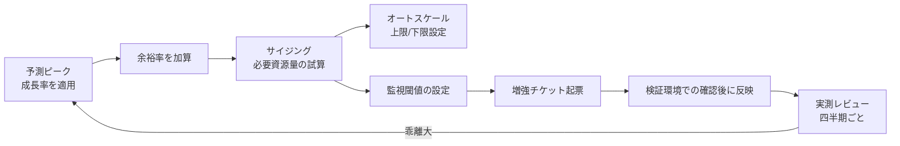

# 第5章 拡張性とキャパシティ

## 1. 学習目標

本章を終えると、次ができる。

- スケールアップとスケールアウトを、要件と設計の両方の観点で使い分けられる
- 水平分割と垂直分割の違いと、それぞれが拡張性に与える効果と副作用を説明できる
- オートスケーリングとステートレス設計の関係を説明し、要件へ落とし込める
- 成長率、余裕率、増強リードタイムを含むキャパシティ計画を、前提付きの数値で作れる
- 監視閾値と将来予測を接続し、増強判断のタイミングを設計できる

## 2. 基本概念

### 2.1 スケールアップとスケールアウト

**スケールアップ**（垂直方向の拡張）は、単一資源の性能を上げることである。

CPUコア数の増加、メモリ増設、より大きなインスタンスタイプへの変更、より高性能なデータベースインスタンスへの変更が該当する。

**スケールアウト**（水平方向の拡張）は、同等の資源を横に増やすことである。

アプリケーションサーバの台数を増やすことが代表例である。

両者は次のように性質が異なる。

| 観点 | スケールアップ | スケールアウト |
|------|----------------|------------------|
| 実施の容易さ | 比較的容易（設定変更や再起動で済むことが多い） | ステートレス化やデータ分割の準備が要る場合がある |
| 上限 | 装置やインスタンスタイプの上限に達すると頭打ち | 理論上は台数を増やす限り拡張できる |
| 単一障害点 | 1台に依存する部分が残りやすい | 台数分散により影響範囲が小さくなりやすい |
| コスト特性 | 高スペック機ほど単価が非線形に上がることが多い | 台数に比例したコストになりやすい |

**一般論**として、まずスケールアップで対応し、上限が見えてきた段階でスケールアウトへ移行する案件は多い。

ただし、後からステートレス化やデータ分割を行うのは、設計初期に組み込むより手戻りが大きい。

**推奨事項**：将来的にスケールアウトが必要になると想定される場合は、初期構築の段階でステートレス設計を前提にしておく。

### 2.2 水平分割と垂直分割

**水平分割**（シャーディングなど）は、データを行方向に分ける方式である。

利用者IDやテナントID、地域コードなどのキーでデータを複数の格納先に分散する。

**垂直分割**は、データを機能やテーブルの役割で分ける方式である。

認証系のデータとログ系のデータを別のデータベースに分離する、といった分割が該当する。

| 分割方式 | 効果 | 副作用 |
|----------|------|--------|
| 水平分割 | データ量とアクセス負荷を複数系統に分散できる | 横断検索、集計、分割キーをまたぐトランザクションが難しくなる |
| 垂直分割 | 機能ごとに独立してスケールでき、障害の影響範囲も限定できる | 機能をまたぐ処理で分散トランザクションや結果整合性の設計が必要になる |

分割は拡張性を高める一方、アプリケーションとデータの設計難度を確実に上げる。

**推奨事項**：分割を導入する前に、現在のデータ量と成長率で、分割なしのままどこまで耐えられるかを見積もる。

見積もりの結果、数年単位で分割不要と判断できるなら、初期の複雑性を避けて先送りする選択も合理的である。

### 2.3 オートスケーリングとステートレス

**オートスケーリング**は、負荷指標（CPU使用率、キュー長、リクエスト数など）に応じて、資源数を自動的に増減させる仕組みである。

オートスケーリングを要件または設計として固定するときは、次を必ず決める。

- 増減判断に使う指標（CPU使用率、リクエストレイテンシ、キュー長など）
- スケールアウトの上限台数、スケールインの下限台数
- クールダウン時間（増減判断の間隔。頻繁な増減の振動を防ぐ）
- スケール失敗時（増設に失敗した、または上限に達した）の動作

**ステートレス**は、個々のサーバがセッションなどの必須状態を保持しないことである。

ステートレスであれば、どのサーバが要求を処理しても結果が変わらないため、スケールアウトや障害時のサーバ入れ替えが容易になる。

どうしてもサーバ側に状態を持たせる必要がある場合は、その状態を外部ストア（共有キャッシュ、データベースなど）へ出す設計にする。

**必須事項**：オートスケーリングを前提とするシステムでは、セッション情報をアプリケーションサーバのローカルメモリに保持しない。

### 2.4 キャッシュとキュー

**キャッシュ**は、再利用可能なデータへのアクセスを高速化し、背後にあるデータベースなどの系への負荷を下げる仕組みである。

キャッシュ導入時に決めるべき事項は次である。

- 鮮度（キャッシュされたデータがどれだけ古くてもよいか）
- 無効化のタイミングと方式（更新時に即時無効化するか、TTLで自然に期限切れにするか）
- ヒット率の目標値
- キャッシュ基盤自体が障害になった場合のバイパス動作（キャッシュなしで元系へ直接問い合わせる、など）

**キュー**は、同期処理を非同期化し、ピーク負荷を平準化する仕組みである。

キュー導入時に決めるべき事項は次である。

- 待ち時間のSLO（キューに滞留してよい最大時間）
- 処理できないメッセージ（毒メッセージ）の扱い
- 再処理の方針（自動リトライの回数と間隔）
- メッセージの順序性が業務上必要かどうか

キャッシュとキューはどちらも、性能とスケーラビリティを高める代表的な手段であるが、導入によって「常に最新のデータを見ている」という前提や「送った順に処理される」という前提が崩れることがある。

**推奨事項**：キャッシュとキューを導入する際は、業務側に「多少の遅延や順序の入れ替わりが起こりうる」ことを明示的に合意してもらう。

### 2.5 データ増加、利用者増加、ピーク増加

拡張性を考えるとき、増加は一種類ではない。

| 増加の種類 | 典型的な影響先 |
|------------|------------------|
| 利用者増加 | 同時接続数、認証処理、アプリケーションサーバのCPU負荷 |
| データ増加 | データベース容量、索引サイズ、バックアップ時間、検索の遅延 |
| ピーク増加 | 瞬間的なTPS、キューの滞留、外部APIのレート制限への抵触 |

三つの増加は、必ずしも同じ比率で進まない。

例えば、3年間で利用者数が20%しか増えなくても、1利用者あたりのデータ生成量が増えて、データ量が200%増えることがある。

この場合、律速するのは利用者数ではなくデータ側のリソース（データベース容量、索引、バックアップ時間）である。

**推奨事項**：キャパシティ計画では、利用者数、データ量、ピーク倍率の3つを個別に見積もり、どれが先に上限へ到達するかを確認する。

### 2.6 成長率と余裕率

**成長率**は、一定期間あたりの増加見込みである。

例：利用者数が年率6.3%で増加する（3年で約20%相当）、データ量が年率40%で増加する、など。

成長率は、単一の数値ではなく、対象（利用者、データ、ピーク）ごとに個別に見積もる。

**余裕率**は、予測したピークに対して、さらに上乗せして確保しておく余白である。

余裕率を置く理由は次である。

- 成長率の予測には誤差がある
- 突発的なイベント（キャンペーン、制度変更）による瞬間的な負荷増に備える
- 障害時の縮退運転や、メンテナンス時の資源制約に対応する余地を残す

余裕率が高いほど安全側だが、コストも増える。

**一般論**として、20〜30%程度の余裕率を置く案件が多いが、これは業界標準として固定された数値ではなく、業務のリスク許容度とコストのバランスで決める値である。

### 2.7 サイジングの手順と数値例

**サイジング**は、将来必要になる資源量を見積もる作業である。

見積もりは、可能な限り実測または試験に基づいて行う。

カタログスペックからの単純な比例計算は、実際のアプリケーションの挙動（キャッシュ効率、ロック競合、GCの影響など）を反映しないため、誤差が大きくなりやすい。

サイジングの手順は次のとおりである。

1. 現在の実測ピーク値を確認する
2. 対象（利用者、データ、ピーク）ごとの成長率を見積もる
3. 計画期間（例：3年後）の予測値を計算する
4. 余裕率を加算し、設計目標値を確定する
5. 設計目標値をもとに、必要な資源（サーバ台数、DBインスタンスサイズ、接続数上限など）を試算する

#### 数値例：実務シナリオ（利用者5,000人、3年+20%、余裕率30%）

前提を次のとおり置く。

- 現在の登録利用者数：5,000人
- 3年後の成長率：+20%（年率換算では約6.3%相当）
- 現在の同時利用者率（登録者数に対する同時アクセス比率）：24%（現状の実測ピーク同時利用者1,200人 ÷ 5,000人）
- 同時利用者率は3年後も同水準と仮定する
- 余裕率：30%

計算過程は次のとおりである。

ステップ1：3年後の登録利用者数を計算する。

```text
5,000人 × (1 + 0.20) = 6,000人
```

ステップ2：3年後のピーク同時利用者数を計算する（同時利用者率24%を適用）。

```text
6,000人 × 0.24 = 1,440人
```

ステップ3：余裕率30%を加算し、設計目標値を計算する。

```text
1,440人 × (1 + 0.30) = 1,872人
```

この「設計ピーク同時利用者1,872人相当」という数値を、アプリケーションサーバの必要台数、データベースの同時接続数上限、ロードバランサーの上限設定、外部APIのレート制限確認などに使う。

**注意**：この計算は、次の前提が崩れると成立しない。

- 同時利用者率が3年後も一定である（実際には業務のオンライン化が進み比率が上がることもある）
- 成長が線形である（実際には組織統合など非連続な増加が起こりうる）
- ピーク時の利用パターンが現在と変わらない

**推奨事項**：この種の前提は、要件例の「前提条件」欄に明記し、前提が崩れた場合は計画を見直すことを合意しておく。

### 2.8 キャパシティ計画と増強リードタイム

**キャパシティ計画**は、いつ、何を、どの閾値で増強するかをあらかじめ定めた計画である。

**増強リードタイム**は、増強すべきと判断してから、実際にその増強が反映されるまでの時間である。

クラウド環境であっても、リードタイムはゼロにはならない。

- インスタンスタイプのクォータ申請と承認
- 変更管理プロセス上の承認
- 検証環境での事前確認
- 繁忙期を避けるためのリリース窓の調整

オンプレミス環境であれば、機器調達を含めて月単位のリードタイムになることが多い。

**必須事項**：監視の警告閾値は、増強リードタイムを逆算して設定する。

リードタイムより短い予兆検知では、閾値を超えてから増強が間に合わない。

### 2.9 閾値設計

閾値は、単一の値ではなく、段階を持たせて設計することが多い。

| 閾値レベル | 例 | 対応 |
|------------|-----|------|
| 情報 | CPU使用率60%超が継続 | トレンド記録、次回計画レビューでの確認材料 |
| 警告 | CPU使用率70%超が30分継続、DB容量75%到達 | 増強チケットの起票、リードタイムを踏まえた計画着手 |
| 重大 | CPU使用率90%超、DB容量85%到達、キュー滞留が5分超 | 緊急増強手順の発動、必要に応じた縮退運転 |

**一般論**として、警告閾値だけを設定し、情報レベルのトレンド監視を省略する案件は多い。

その結果、警告閾値に達してから急いで増強計画を立てることになり、リードタイムに間に合わないことがある。

**推奨事項**：情報レベルの監視も設置し、四半期ごとのトレンドレビューで成長率の想定と実績を照合する。

### 2.10 将来予測の更新サイクル

将来予測は、一度立てて終わりにしない。

成長率の初期値は仮置きであることが多く、実測データが蓄積するにつれて精度を上げる必要がある。

**推奨事項**：少なくとも四半期ごとに、実測の成長率と計画時の想定成長率を比較し、乖離が大きい場合はキャパシティ計画そのものを見直す。

見直しのきっかけとなる事象には、組織統合、新機能の大規模リリース、法制度変更に伴う利用者急増などがある。

これらは通常の成長率の延長線上にない非連続な増加であり、事前に察知できる情報（経営方針、他部門からの通知）を運用側と共有しておく必要がある。

## 3. 業務上の意味

拡張性不足は、多くの場合、ある日突然に業務を止める形で表面化する。

平常時は問題なく動いていたシステムが、キャンペーン開始、制度変更の施行日、組織統合直後など、想定を超えたピークに直面した瞬間に応答しなくなる。

「今は動いている」という事実は、来四半期や来年度も動き続けることの証拠にはならない。

拡張性とキャパシティの設計は、現在の性能要件（第4章）を、将来の利用規模でも維持し続けるための備えである。

## 4. ヒアリング質問

- 3年後、5年後の利用者数、拠点数、データ量の見通しはどの程度か
- 繁忙期の負荷は、平常時の何倍になると想定されるか
- 組織統合、法制度変更など、非連続な利用者増加が計画されているか
- 増強の判断者は誰で、承認から反映までの標準的な日数はどの程度か
- オートスケーリングを使う場合、費用の上限はどこまで許容できるか
- データの削除、アーカイブに関する業務ルールは存在するか
- スケールアウトを妨げる、サーバ側に状態を持たせている処理はあるか
- 過去にキャパシティ不足で障害や性能劣化が起きた事例はあるか

## 5. 要件例

### NFR-CAP-001 オンラインAP層とDB接続資源のキャパシティ

- 要件ID：NFR-CAP-001
- 分類：拡張性・キャパシティ
- 対象：オンラインアプリケーション層およびデータベース接続資源
- 業務上の目的：3年後の利用者増加後も、月末ピーク業務を性能要件を満たしたまま継続する
- 前提条件：登録利用者数は3年後に6,000人まで増加する見込み。同時利用者率は現状の24%相当を維持すると仮定する。余裕率30%を適用する
- 指標：設計ピーク同時利用者数、資源使用率（CPU、メモリ、DB接続数）、増強実施リードタイム
- 目標値：同時利用者1,872人相当まで、性能要件NFR-PERF-010の応答時間目標を維持する。警告閾値到達から増強反映まで10営業日以内
- 測定条件：設計ピーク相当の負荷試験、および四半期ごとのキャパシティレビュー
- 測定方法：負荷試験ツールによる測定、クラウド基盤のメトリクス収集、変更管理票の所要日数集計
- 合否判定：設計ピーク負荷試験に合格すること。四半期レビューでの増強リードタイム中央値が10営業日以内であること
- 例外条件：突発的な制度変更による想定外のピークは、臨時増強手順で対応し、事後に成長率の想定を改定する
- 実現方式：アプリケーション層の水平スケール、コネクションプール管理、必要時のデータベーススケールアップ、オートスケーリングの上限・下限設定
- 検証方法：設計ピーク負荷試験、増強手順の机上訓練および実地訓練
- 根拠：3年間で利用者数+20%、余裕率30%を積算した設計ピーク値
- 関連要件：NFR-PERF-010、NFR-MON-020
- 未確定事項：同時利用者率24%という前提の実測による最終確定

### NFR-CAP-002 データ増加へのストレージ拡張

- 要件ID：NFR-CAP-002
- 分類：拡張性・キャパシティ
- 対象：業務データベースのストレージ容量
- 業務上の目的：データ量の増加によってバックアップ時間や検索性能が劣化しないようにする
- 前提条件：現在のデータ量は500GB、年率40%での増加が見込まれる。アーカイブ方針は未確定
- 指標：ストレージ使用率、バックアップ所要時間、主要検索クエリの応答時間
- 目標値：3年後の推定データ量（500GB × 1.4^3 ≈ 1.37TB）に対し、余裕率30%を加えた約1.8TBの容量を確保する。ストレージ使用率が閾値75%に到達した時点で増強を起票する
- 測定条件：四半期ごとの実データ量計測
- 測定方法：データベース管理ツールによる容量レポート、バックアップジョブの実行ログ
- 合否判定：使用率が閾値を超えた際に、リードタイム内で増強が完了していること
- 例外条件：アーカイブ方針が確定した場合は、対象データの一部をオンライン系から除外し、成長率を再計算する
- 実現方式：ストレージの動的拡張機能、索引の定期的な再編成、古いデータのアーカイブ検討
- 検証方法：容量逼迫を模した試験、バックアップ所要時間の定期測定
- 根拠：年率40%というデータ増加率は、現行システムの過去2年間の実測平均に基づく
- 関連要件：NFR-PERF-020（バックアップ時間の性能要件との関係）、NFR-BKP-001
- 未確定事項：アーカイブ対象の業務ルールと保持期間

## 6. 悪い要件例

1. 「将来の増加に耐えられること」
2. 「必要に応じてスケールすること」
3. 「十分なキャパシティを持つこと」
4. 「データが増えても問題なく動くこと」
5. 「オートスケーリングを導入すること」

不合格理由は共通している。

対象資源、成長率の前提、余裕率、目標値、増強手段のいずれかが欠けている。

例5は、目的（何のためにオートスケーリングが必要か）や上限・下限の指定がなく、設計方式をそのまま要件に書いてしまっている点が問題である。

## 7. 改善後の要件例

### 悪い例1・3の改善：「将来の増加に耐えられること」「十分なキャパシティを持つこと」

NFR-CAP-001へ分解する。

改善の要点は、対象資源、成長率の前提（3年+20%）、余裕率（30%）、設計ピーク値（1,872人相当）、増強リードタイム（10営業日）を明示したことである。

### 悪い例2の改善：「必要に応じてスケールすること」

「必要に応じて」を、閾値（警告70%、重大90%など）と増強リードタイムに分解する。

NFR-CAP-001の測定条件と合否判定がこれに該当する。

### 悪い例4の改善：「データが増えても問題なく動くこと」

NFR-CAP-002へ分解する。

データ増加率の前提、3年後の推定容量、余裕率を加えた確保容量を数値化した点が改善である。

### 悪い例5の改善：「オートスケーリングを導入すること」

オートスケーリングは設計手段であり、要件そのものではない。

要件としては、NFR-CAP-001の「設計ピーク同時利用者数まで応答時間を維持する」という形にし、その実現方式としてオートスケーリングを設計側で選択する構成にする。

## 8. 設計への落とし込み



**採用**：アプリケーション層はオートスケーリングを採用し、データベースは予兆に基づく手動スケールアップとする。

**不採用**：現時点でのデータベースのシャーディング初期導入。

**理由**：現状のデータ量と成長率、およびチームの運用習熟度に対して、シャーディングによる複雑性の増加が見合わない。

**残存リスク**：急激なデータ増加が発生した場合、手動でのスケールアップが増強リードタイムに間に合わない可能性がある。アーカイブ方針の早期確定と、閾値の前倒し設定で緩和する。

## 9. 代替案

| 方式 | 向く条件 | 向かない条件 |
|------|----------|--------------|
| 先に資源を大きく確保する（初期過大投資） | 成長予測の確度が高く、値下げ交渉余地がある | 予算が限られ、初期投資を抑えたい |
| 小さく始めてオートスケールと定期見直しで追随する | 成長率に不確実性が大きい | 増強リードタイムが極端に長い環境 |
| ピーク業務を時間分散する運用対策を併用する | 業務側が入力タイミングを調整できる | 締切固定で分散が困難な業務 |
| 履歴データを別系統へアーカイブし、オンライン系を軽くする | データ増加が主要因でアクセス頻度が下がるデータがある | 常に全期間データへの高速アクセスが必要 |

## 10. トレードオフ

| 対立 | 一方を優先すると | 他方に起きること |
|------|------------------|------------------|
| 余裕率 vs コスト | 障害耐性や急な増加への耐性が高まる | インフラ費用が増える |
| 自動拡張の柔軟性 vs 費用の予測可能性 | 負荷に応じて即座に対応できる | 上限を誤ると費用が想定以上に膨らむ |
| データ分割による拡張性 vs 運用複雑性 | 大規模データへの対応力が上がる | 横断検索やトランザクション設計が難しくなる |
| キャッシュによる高速化 vs データ鮮度 | 応答性能とスケーラビリティが上がる | 更新反映の遅延という制約が生じる |
| 早期の大規模投資 vs 段階的investment | 将来の増強作業が減る | 予測が外れた場合の無駄な投資リスクが増える |

## 11. 検証方法

- 設計ピーク相当の負荷試験
- オートスケーリングの動作試験（増加、減少、上限到達時の挙動確認）
- 容量逼迫訓練（ディスク容量、DB接続数上限への到達を模擬）
- 四半期ごとの予測値と実測値の差分レビュー
- 増強リードタイムの実績測定（チケット起票から反映完了までの所要日数）
- キャッシュ障害時のバイパス動作確認
- キューの滞留発生時の挙動確認

## 12. よくある失敗

1. 利用者数の増加だけを見て、データ量の増加を見落とす
2. 余裕率をゼロにしてサイジングし、予測誤差の吸収余地がない
3. オートスケーリングの上限を、要件で想定する最大負荷より低く設定してしまう
4. 増強リードタイムを考慮せず、閾値を実際に危険な水準ぎりぎりに設定する
5. ステートフルな設計のまま、スケールアウト可能と宣言してしまう
6. キャッシュを導入すれば性能問題が恒久的に解決すると思い込み、鮮度要件の合意を怠る
7. 将来予測を一度立てたきり見直さず、非連続な増加（組織統合など）を察知できない
8. データの分割やアーカイブの判断を先送りし続け、手遅れになってから着手する

## 13. レビュー観点

- [ ] 成長の対象（利用者、データ、ピーク）が個別に見積もられているか
- [ ] サイジングの計算過程が前提とともに記録されているか
- [ ] 余裕率と増強リードタイムが明示されているか
- [ ] オートスケーリングの上限・下限と費用の上限が設定されているか
- [ ] アーカイブや削除の方針が定まっているか、未確定事項として管理されているか
- [ ] 監視閾値が段階的に設計され、増強リードタイムから逆算されているか
- [ ] ステートレス設計の前提が、スケールアウトが必要な範囲で満たされているか
- [ ] 将来予測の見直しサイクルが定義されているか

## 14. 章末問題

### 問題1

現在のピークTPSが100、年成長率20%、2年後、余裕率25%のとき、設計TPSはいくらになるか。

### 問題2

増強リードタイムが15営業日のシステムで、容量閾値を「85%到達で警告」とだけ固定することのリスクは何か。

### 問題3

スケールアップしかできないアプリケーション構成の欠点を2つ挙げよ。

### 問題4

利用者数が3年で20%しか増えないのに、データ量が3年で3倍近くに増える見込みのシステムがある。キャパシティ計画で優先的に見積もるべき対象は何か、理由とともに述べよ。

## 15. 解答と解説

### 問題1

```text
100 × (1.2)^2 = 144
144 × 1.25 = 180 TPS
```

設計TPSは約180TPSになる。

### 問題2

85%到達から増強完了まで15営業日かかる間に、成長速度によっては上限（100%）を超える可能性がある。

成長速度に応じた早期警告（例：75%到達時点での起票）や、トレンドに基づく予測アラートを併用する必要がある。

### 問題3

第一に、装置やインスタンスタイプの上限に達すると、それ以上性能を伸ばせない。

第二に、単一ノードへの依存度が高いため、そのノードの障害が全体に与える影響範囲が大きい。

### 問題4

データ量を優先的に見積もるべきである。

利用者数の伸びが緩やかでも、データ増加率が高ければ、ストレージ容量、索引サイズ、バックアップ時間、検索性能のいずれかが先に上限へ到達し、ボトルネックになる可能性が高いためである。

## 16. 実務演習

実務シナリオ（従業員5,000人、3年後+20%、余裕率30%）を使い、次を作成せよ。

1. 3年間のキャパシティ計画表（列：指標、現在値、1年後、3年後、余裕率込み設計値、閾値、増強手段、リードタイム）
2. 同時利用者数のサイジング計算過程（本章2.7の手順に沿う）
3. データ増加率が利用者増加率と異なる場合の追加検討事項を3件挙げる
4. NFR-CAP-001、NFR-CAP-002について、関連する性能要件・監視要件との対応関係を1行ずつ書く

---

## 次章予告

第6章では信頼性と耐障害性を扱う。

リトライ、タイムアウト、サーキットブレーカー、冪等性、部分障害とカスケード障害への対処、障害分離とバルクヘッドの設計を要件化する。
