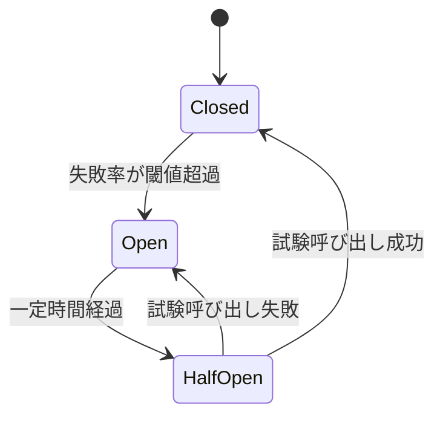
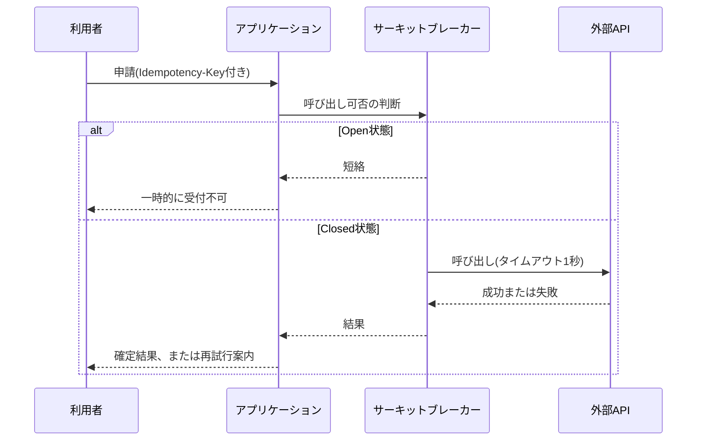

# 第6章 信頼性と耐障害性

## 1. 学習目標

本章を終えると、次ができる。

- 信頼性、フォールトトレランス、フェイルセーフ、フェイルソフト、Graceful Degradationを区別して説明できる
- リトライ、タイムアウト、サーキットブレーカー、冪等性を、テスト可能な要件として書ける
- 部分障害とカスケード障害の違いを理解し、障害分離とバルクヘッドで影響範囲を限定する設計ができる
- データ整合性の要求水準（強整合か結果整合か）を業務ごとに判断できる
- 手動切替と自動切替を、MTTRと誤切替リスクの両面から比較して採否を決められる

## 2. 基本概念

### 2.1 信頼性と関連する概念

**信頼性**は、定められた条件で、定められた期間にわたって、故障せずに動き続ける性質である。

可用性（第3章）が「今この瞬間に使えるか」に近い概念であるのに対し、信頼性は「壊れにくさ」「壊れたときにどう振る舞うか」という側面を強く含む。

信頼性を支える関連概念は次のとおりである。

**フォールトトレランス**（耐障害性）は、系の一部に故障が発生しても、サービス全体としては継続して機能する能力である。

多重化された構成のうち一部が故障しても、残りが処理を続けられる状態がこれにあたる。

**フェイルセーフ**は、故障が発生したときに、安全側へ倒す設計思想である。

例えば、決済処理において、通信断で成功か失敗か確定できない場合、誤って二重に課金するより、処理を止めて再確認を求める方を選ぶ。

**フェイルソフト**は、故障が発生しても、機能を縮小しながらサービスを継続することである。

一部の非重要機能を止めてでも、主要機能を動かし続ける設計がこれにあたる。

**Graceful Degradation**（段階的縮退）は、障害や過負荷が発生した際に、重要度の低い機能から順に停止し、重要な機能を優先的に残す考え方である。

フェイルソフトとGraceful Degradationは重なる部分が大きいが、Graceful Degradationは「どの機能から、どの順序で落とすか」という段階設計を明示的に扱う点が特徴である。

| 概念 | 焦点 | 具体例 |
|------|------|--------|
| フォールトトレランス | 一部故障時にも継続する能力そのもの | 多重化構成、冗長化されたキュー |
| フェイルセーフ | 故障時にどちら側に倒すか | 通信断時は処理を止め、誤課金を防ぐ |
| フェイルソフト | 機能を縮小しつつ継続する | 検索機能停止中も申請・承認は継続 |
| Graceful Degradation | 縮退の順序と段階の設計 | 副次機能→非重要機能→重要機能の順に守る |

**一般論**として、これらの用語は現場で厳密に区別されず、「障害に強くする」という一言でまとめて語られがちである。

区別せずに要件を書くと、「フェイルセーフにしてほしい」という要求が「止めてほしい」のか「動かし続けてほしい」のか分からなくなる。

### 2.2 タイムアウト設計

**タイムアウト**は、応答を待ち続ける上限時間である。

タイムアウトがないと、応答が返らない依存先に対してスレッドや接続が占有され続け、やがて資源が枯渇して自システム全体が止まる。

タイムアウト設計で決めるべき事項は次である。

- 呼び出し種別ごとのタイムアウト値（DB接続、外部API呼び出し、内部サービス間通信でそれぞれ異なる値になる）
- タイムアウト発生時の挙動（エラーを返す、デフォルト値で継続する、キューへ回す）
- タイムアウト値と、上位処理（画面応答時間など）の整合性

**必須事項**：外部への同期呼び出しには、必ずタイムアウトを設定する。

タイムアウト値が無制限、または極端に長い（分単位）設定は、実質的にタイムアウトが無いのと同じ結果を招く。

### 2.3 リトライ設計

**リトライ**は、失敗した操作を再度試みることである。

リトライを設計するときは、次を定義する。

- リトライの対象となるエラー種別（一時的な通信エラーか、業務エラーか）
- 最大リトライ回数
- リトライ間隔（固定間隔か、指数バックオフか）
- ジッタ（複数クライアントの再試行タイミングが重ならないようにするランダムな揺らぎ）
- 対象操作が冪等かどうか

タイムアウトなしのリトライや、非冪等な操作への無制限リトライは危険である。

例えば、決済確定APIに対して間隔なしで大量にリトライする実装は、相手先の負荷をさらに増幅させ、かつ多重確定を引き起こす可能性がある。

**推奨事項**：リトライには必ず上限回数と間隔（できれば指数バックオフとジッタ）を設定し、非冪等な操作へのリトライは冪等性を確保したうえで行う。

### 2.4 サーキットブレーカー

**サーキットブレーカー**は、依存先の連続失敗を検知したら、それ以上の呼び出しを一時的に短絡（遮断）し、依存先の負荷をこれ以上増やさないようにする仕組みである。

一定時間後に、少量の試験的な呼び出しを行い、成功が続けば徐々に通常運転へ戻す。

サーキットブレーカーの状態は、一般に次の3つで表される。

| 状態 | 動作 |
|------|------|
| Closed（閉） | 通常どおり依存先を呼び出す。失敗率を監視する |
| Open（開） | 依存先への呼び出しを遮断し、即座にエラーまたは代替応答を返す |
| Half-Open（半開） | 少量の試験呼び出しを行い、成功すればClosedへ、失敗すれば再びOpenへ戻る |

サーキットブレーカーは、カスケード障害（2.8参照）の抑止に直接効く仕組みである。

**推奨事項**：サーキットブレーカーがOpenの間、利用者に対しては「一時的に利用できない」ことを明確に伝え、未確定のまま処理が宙に浮いた状態を作らない。

### 2.5 冪等性

**冪等性**は、同じ要求を複数回実行しても、結果が一度成功したときと同じになる性質である。

要件としては、少なくとも「二重課金が起きないこと」「二重申請が起きないこと」のように、業務上避けたい重複結果がゼロであることとして書くことが多い。

冪等性が必要になる背景は、ネットワークの再送と、利用者の再クリックという二つの現実的な事象である。

- クライアントが応答を受け取れずタイムアウトし、同じ要求を再送する
- 利用者が「反応がない」と感じて、送信ボタンを連打する

いずれの場合も、サーバ側では同じ要求が複数回届く可能性を前提に設計する必要がある。

代表的な実現方式は、クライアントが要求ごとに一意なキー（Idempotency-Key）を発行し、サーバ側は同一キーの要求を2回目以降は新規処理せず、初回の結果を返す方式である。

**必須事項**：金銭や契約確定に関わる操作は、冪等性を確保する方式（Idempotency-Keyまたは同等の一意性制御）を必ず設計に含める。

### 2.6 データ整合性

障害の途中で処理が止まると、更新が一部だけ反映された不整合な状態が残ることがある。

要件では、対象業務ごとに次を決める。

- 強整合（更新の途中経過を他者から見せない、全て成功するか全て失敗するか）が必要な業務
- 結果整合（一時的に不整合な状態を許容し、最終的に整合すればよい）でよい業務
- 補償トランザクション（後から取り消しや修正を行う処理）や、手動での復旧作業の要否

「障害後も整合していること」という要件だけでは不十分である。

どの粒度（1件単位か、1バッチ単位か）で、どの手順（自動ロールバック、補償トランザクション、手動修正）で整合性を回復するかまで書く必要がある。

**一般論**として、決済や在庫のような数量を扱う業務は強整合が求められやすく、閲覧履歴やレコメンド情報のような業務は結果整合で十分なことが多い。

ただし、この判断は業種や業務要件によって変わるため、一律の基準として扱わない。

### 2.7 部分障害

**部分障害**は、システム全体ではなく、一部の機能または一部の利用者だけに影響が出る障害である。

全体の死活監視（サーバが生きているかどうかのチェック）だけでは、部分障害を見逃すことがある。

部分障害の例は次のとおりである。

- 特定のデータベースシャードだけが遅延し、そのシャードに割り当てられた利用者だけ応答が遅い
- 特定の外部API連携だけが失敗し、その機能を使う操作だけがエラーになる
- 特定のリージョンやゾーンからのアクセスだけが失敗する

**推奨事項**：死活監視に加えて、機能単位・利用者セグメント単位の合成監視（実際の業務操作をシミュレートする監視）を組み合わせ、部分障害を検知できるようにする。

### 2.8 カスケード障害

**カスケード障害**は、一部の失敗が連鎖して、無関係に見える他の部分まで巻き込んで拡大する障害である。

典型的な発生パターンは次のとおりである。

1. 依存先のAPIが遅延し始める
2. 呼び出し元のスレッドや接続が、遅い応答を待ち続けて占有される
3. 占有された資源が枯渇し、依存先とは無関係な別のAPIまで処理できなくなる
4. 利用者からは「システム全体が落ちた」ように見える

カスケード障害は、タイムアウト、サーキットブレーカー、バルクヘッド（2.9参照）を組み合わせることで抑止できる。

**必須事項**：外部依存を持つ主要な機能には、タイムアウトとサーキットブレーカーの両方を設計に含める。

### 2.9 障害分離とバルクヘッド

**障害分離**は、障害の影響範囲を局所に閉じ込める設計思想である。

**バルクヘッド**は、資源プール（接続プール、スレッドプールなど）を用途ごとに区画し、一区画の破綻が他の区画に波及しないようにする技法である。

船舶の防水区画に由来する名称であり、一区画が浸水しても船全体は沈まないという発想を、資源プールの分離に応用したものである。

例えば、外部APIごとに独立した接続プールを用意しておけば、片方のAPIが遅延しても、そのプールの資源だけが占有され、もう片方のAPIを呼び出す処理には影響が及ばない。

**推奨事項**：重要度が異なる複数の外部依存を持つシステムでは、依存先ごとに接続プールやスレッドプールを分離する。

分離すればするほど障害耐性は上がるが、資源の利用効率は下がる（プールごとに未使用の余剰が生まれやすい）というトレードオフがある。

### 2.10 復旧処理と手動切り替え・自動切り替え

**復旧処理**は、障害発生後にサービスを正常な状態へ戻すための一連の作業である。

復旧処理には、次のような種類がある。

- 自動復帰（一時的な異常が自然に解消し、システムが自律的に正常状態へ戻る）
- 手動切替（運用担当者が判断し、待機系や代替経路へ切り替える）
- 自動切替（あらかじめ定めた条件に基づき、システムが自律的に切り替える）
- データ修復（不整合が生じたデータを、手順に沿って修正する）
- キュー再処理（滞留または失敗したメッセージを再投入する）

**自動切替**は、MTTR（平均復旧時間）を短縮できる一方、次のリスクを伴う。

- スプリットブレイン（切替の判断が割れ、複数系統が同時にプライマリとして動作してしまう）
- 誤検知による不要な切替（一時的な負荷スパイクを障害と誤認する）

**手動切替**は、人が状況を確認してから判断するため誤切替のリスクは抑えられるが、担当者の到着や判断に時間がかかり、MTTRが延びる。

| 観点 | 自動切替 | 手動切替 |
|------|----------|----------|
| MTTR | 短い（秒〜分単位も可能） | 長い（人の対応時間に依存） |
| 誤切替リスク | 誤検知や条件設計の不備で発生しうる | 人が確認するため相対的に低い |
| 向く用途 | 読み取り専用系、影響範囲が限定的な切替 | 影響が大きい、後戻りが困難な切替 |

**推奨事項**：自動切替を採用する範囲は、切替失敗時の影響が限定的な部分（読み取り専用のレプリカ切替など）から段階的に広げる。

影響が大きい切替（書き込み系のプライマリ交代など）は、まず手動切替で運用し、切替訓練の実績を積んでから自動化を検討する。

## 3. 業務上の意味

耐障害性は、単に「止まらないこと」を意味しない。

止まったとしても、二重処理や誤った確定をしないことのほうが、財務、人事、個人情報を扱う業務では重要になる場合が多い。

「動かし続ける」ことが常に正解ではなく、「安全に止める」ことが正しい判断であることもある。

例えば、決済処理の途中で通信が途絶えた場合、無理に処理を継続して誤課金を起こすより、処理を一旦停止し、状態を確認してから再開する方が、業務上の損害は小さい。

信頼性設計の目的は、障害そのものをゼロにすることではなく、障害が起きたときに業務が受ける被害を、あらかじめ想定した範囲に収めることである。

## 4. ヒアリング質問

- 二重申請、二重送金、更新消失のうち、最も業務上許容できないものはどれか
- 依存する外部サービスが遅い場合、待つべきか、機能を縮退させるべきか
- 自動切替を信頼してよいか。誤切替が起きた場合の業務影響はどの程度か
- 障害後の再処理（キューの再投入、データの再送）は自動でよいか、承認が必要か
- 一部の機能だけが使えない状態を、利用者にどのように見せるべきか
- 過去に部分障害やカスケード障害が発生した事例はあるか。原因は何か
- 強い整合性が必須の業務と、多少の遅延や不整合を許容できる業務はそれぞれ何か
- 自動切替や自動復旧の訓練は、過去にどの程度実施されているか

## 5. 要件例

### NFR-REL-010 申請提出APIと承認確定APIの耐障害性

- 要件ID：NFR-REL-010
- 分類：信頼性・耐障害性
- 対象：申請提出APIと承認確定API
- 業務上の目的：一時的な依存障害によって申請データを失わず、かつ二重確定を防ぐ
- 前提条件：クライアントは同一のIdempotency-Keyを再送できる実装になっている
- 指標：依存呼び出しのタイムアウト値、リトライ回数、二重確定の発生件数、サーキットオープン時に利用者へ返す結果
- 目標値：依存呼び出しのタイムアウトは1,000ミリ秒。再試行は最大2回、均等ジッタ付き。二重確定は0件。サーキットオープン時は明確なエラーを返し、処理を未確定のまま放置しない
- 測定条件：依存先の遅延注入試験、依存先の5xxエラー注入試験、クライアントによる再送試験
- 測定方法：障害注入試験、監査ログにおける確定件数の突合
- 合否判定：目標値をすべて満たし、かつデータ不整合が0件であること
- 例外条件：依存先の計画停止中は、受付停止バナーを表示し、受付自体を一時的に閉じる運用を許容する
- 実現方式：Idempotency-Key、トランザクション境界の明確化、サーキットブレーカー、バルクヘッド
- 検証方法：障害注入試験、再送試験、整合性監査
- 根拠：申請の再クリックとネットワークの再送は避けられない事象であるため
- 関連要件：NFR-PERF-030、NFR-SEC-001
- 未確定事項：バッチ確定系への同方式の適用範囲

### NFR-REL-020 検索機能のGraceful Degradation

- 要件ID：NFR-REL-020
- 分類：信頼性・耐障害性（縮退運転）
- 対象：申請一覧画面の全文検索機能（外部検索APIに依存）
- 業務上の目的：外部検索APIの障害時にも、申請・承認という主要業務を継続する
- 前提条件：全文検索機能は補助的な機能であり、一覧のページング表示だけでも業務は継続可能
- 指標：外部検索APIの失敗率、検索機能を隠すまでの時間、主要機能（申請・承認）の継続状況
- 目標値：外部検索APIの失敗率が1分間の観測窓で50%を超えた場合、10秒以内に検索欄を非表示にし、一覧のページング表示のみへ自動的に切り替える。切り替え中も申請・承認機能の応答時間はNFR-PERF-010の目標を維持する
- 測定条件：外部検索APIの障害注入試験（全断、高遅延、高エラー率のそれぞれ）
- 測定方法：障害注入試験、フロントエンドの表示切替ログ、APMによる主要機能の応答時間計測
- 合否判定：検索機能停止時にも申請・承認の応答時間目標が維持されること。縮退状態が監視で重大度2として検知されること
- 例外条件：検索機能の縮退が15分を超えて継続する場合は、業務部門へ状況を通知する
- 実現方式：サーキットブレーカーによる外部API呼び出しの遮断、フロントエンドでの機能フラグ切替、監視アラートとの連携
- 検証方法：障害注入試験、縮退時のUI確認、監視アラートの発報確認
- 根拠：検索機能が数分停止しても業務全体は継続できるが、申請・承認が止まると業務が止まるという業務影響度の違いに基づく
- 関連要件：NFR-PERF-010、NFR-OPS-001（監視・エスカレーション）
- 未確定事項：縮退中に利用者へ表示するメッセージ文言の最終確定

### NFR-REL-030 夜間バッチの冪等な再実行

- 要件ID：NFR-REL-030
- 分類：信頼性・耐障害性（バッチ）
- 対象：夜間集計バッチB01（NFR-PERF-020と対象を同じくする）
- 業務上の目的：バッチが途中で異常終了しても、再実行によって二重集計や欠落なく復旧できるようにする
- 前提条件：バッチは複数の処理単位（チャンク）に分割して実行される
- 指標：再実行時の重複集計件数、再実行時の欠落件数、再実行の自動化状況
- 目標値：再実行後の集計結果が、正常終了時の結果と完全一致する（重複0件、欠落0件）。異常終了したチャンク以降からの再実行を自動的に行う
- 測定条件：処理途中でのプロセス強制終了試験、DB接続断による異常終了試験
- 測定方法：再実行後の集計結果と期待値の突合、実行ログのチャンク単位の記録確認
- 合否判定：重複・欠落がいずれも0件であり、再実行が手動介入なしで完了すること
- 例外条件：3回連続で自動再実行が失敗した場合は、自動再実行を停止し、運用担当者への通知に切り替える
- 実現方式：チャンク単位でのチェックポイント記録、チャンク単位の冪等な集計処理（同一チャンクの再実行が結果に影響しない設計）
- 検証方法：異常終了を模した再実行試験、集計結果の突合試験
- 根拠：過去に手動再実行時の二重集計が発生した事例への対策
- 関連要件：NFR-PERF-020、NFR-OPS-020
- 未確定事項：3回連続失敗後の通知先と初動対応の体制

## 6. 悪い要件例

1. 「障害が起きても影響がないこと」
2. 「適切にリトライすること」
3. 「可能な限り自動復旧すること」
4. 「データの整合性を保つこと」
5. 「障害に強い設計にすること」

不合格理由は共通している。

対象操作、具体的な指標（タイムアウト値、リトライ回数、整合性の粒度）、目標値、判定基準のいずれかが欠けている。

加えて、例4は強整合と結果整合のどちらを求めているかが不明であり、設計判断ができない。

## 7. 改善後の要件例

### 悪い例1・5の改善：「障害が起きても影響がないこと」「障害に強い設計にすること」

NFR-REL-010へ分解する。

改善の要点は、対象API、タイムアウト値、リトライ上限、二重確定ゼロ、サーキットオープン時の振る舞いを、それぞれ数値と挙動で固定したことである。

### 悪い例2の改善：「適切にリトライすること」

「適切に」を、リトライ回数（最大2回）、間隔（均等ジッタ付き）、対象操作の冪等性確保という3要素に分解する。

NFR-REL-010の目標値がこれに該当する。

### 悪い例3の改善：「可能な限り自動復旧すること」

「可能な限り」を、対象範囲（読み取り専用のレプリカ切替など影響が限定的な範囲）と、自動化しない範囲（書き込み系プライマリの切替は当面手動とする）に分解する。

自動と手動の境界を明示しないまま「可能な限り」を残すと、本番障害時に誰も判断できない設計になる。

### 悪い例4の改善：「データの整合性を保つこと」

対象業務ごとに強整合と結果整合を仕分ける。

NFR-REL-030のように、バッチの再実行における重複・欠落ゼロという具体的な整合性の粒度で書く。

## 8. 設計への落とし込み

**採用理由**：再送耐性（冪等性）とカスケード抑止（サーキットブレーカー）を同時に満たせる。

**不採用案**：無制限リトライによる愚直な再試行。

**残存リスク**：サーキットが開いている間、該当機能は業務停止する。代替チャネルが必要かどうかは、事業継続計画（第8章）側で判断する。

障害分離の設計例として、次の対応がある。

| 障害の種類 | 分離の設計 |
|------------|------------|
| 部分障害（特定シャードの遅延） | シャード単位で接続プールを分離し、影響を局所化する |
| カスケード障害の予兆（外部API遅延） | サーキットブレーカーとバルクヘッドを併用し、遅延の伝播を止める |
| データ不整合 | 補償トランザクションまたは手動修復手順をあらかじめRunbook化しておく |

## 9. 代替案

| 方式 | 採用しうる条件 | 採用しにくい条件 |
|------|----------------|--------------------|
| 同期リトライ中心 | 依存先が短時間だけ不安定になる傾向がある | 依存先の障害が長時間に及ぶことが多い |
| キュー＋非同期後処理 | 即時確定が業務上不要 | 利用者が結果を即座に確認する必要がある |
| 手動受付停止 | 誤処理による損害が極めて大きい | 受付停止自体が業務に大きな影響を与える |
| 自動フェイルオーバー | 切替試験が十分に積まれ、監視体制が成熟している | 切替訓練の実績がなく、誤切替リスクを許容できない |

## 10. トレードオフ

| 対立 | 一方を優先すると | 他方に起きること |
|------|------------------|------------------|
| 可用性の継続 vs 安全性 | 処理を止めずに動かし続ける | 誤確定や二重処理のリスクが増える |
| 自動切替 vs 誤切替リスク | MTTRが短縮される | 誤検知による不要な切替が起こりうる |
| 強整合 vs 応答性能 | データの正しさを常に保証する | 分散環境では応答が遅くなりやすい |
| 障害分離の強化 vs 資源効率 | 影響範囲を細かく限定できる | プール分割によって資源利用効率が下がる |
| 縮退機能の充実 vs 開発コスト | 障害時の業務継続性が上がる | 縮退ロジック自体の実装・試験コストが増える |

## 11. 検証方法

- タイムアウト試験（意図的に応答を遅延させ、設定どおりに打ち切られるかを確認する）
- リトライ回数と間隔の試験
- 冪等鍵の再送試験（同一キーでの複数回リクエストが1回分の結果になるか）
- 依存障害注入とサーキットブレーカーの動作確認
- 部分障害時の外形監視・業務監視の検知確認
- カスケード障害を模した障害注入試験（依存先遅延によるスレッド枯渇の再現）
- 復旧後の整合性監査
- 手動切替・自動切替それぞれの切替訓練

## 12. よくある失敗

1. リトライだけを実装し、タイムアウトを設定していない
2. 非冪等な処理を、確認なしに自動で再実行してしまう
3. 全面死活監視だけを見て、部分障害を見逃す
4. 障害分離をせず、共有の接続プールですべての外部依存をまとめてしまう
5. 自動切替を、切替訓練を一度も行わないまま本番運用に投入する
6. 縮退時に利用者へメッセージを出さず、再入力や再送信を誘発してしまう
7. データ整合性の要求水準を業務ごとに分けず、すべて「整合性を保つ」で済ませる
8. カスケード障害の可能性を想定せず、単一の依存先障害試験しか行わない

## 13. レビュー観点

- [ ] タイムアウトとリトライ上限が、依存先ごとに具体的に設定されているか
- [ ] 冪等性が必要な操作に、キーまたは同等の一意性制御があるか
- [ ] サーキットブレーカーなど、カスケード障害への対策があるか
- [ ] 縮退時（Graceful Degradation）の業務ルールと利用者向け表示が定義されているか
- [ ] 障害分離とバルクヘッドの設計が、重要度の異なる依存先ごとに検討されているか
- [ ] データ整合性の要求水準（強整合か結果整合か）が業務ごとに明示されているか
- [ ] 切替の自動・手動の区分と、その判断基準が明示されているか
- [ ] 障害注入試験が計画され、実施実績があるか

## 14. 章末問題

### 問題1

決済確定APIに、間隔なしで10回リトライする実装がある。問題点を3つ挙げよ。

### 問題2

検索機能だけが外部API依存で遅い。Graceful Degradationの要件例を、測定可能な形で一文書け。

### 問題3

自動フェイルオーバーと手動フェイルオーバーの選び方を、MTTRと誤切替の観点で説明せよ。

### 問題4

部分障害とカスケード障害の違いを説明し、それぞれに有効な対策を1つずつ挙げよ。

## 15. 解答と解説

### 問題1

第一に、相手先の負荷をさらに増幅させ、カスケード障害を誘発しうる。

第二に、当該操作が非冪等であれば、多重確定（二重課金など）を引き起こす可能性がある。

第三に、タイムアウトやサーキットブレーカーが無いと、自システム側の資源（スレッド、接続）も枯渇しうる。

### 問題2

例：「外部検索APIの失敗率が1分間の観測窓で50%を超えたとき、10秒以内に検索欄を非表示にし、申請・承認の主要操作は応答時間目標を維持したまま継続すること。縮退状態は監視で重大度2として検知すること」

### 問題3

MTTRを分単位や秒単位に短縮したい場合は、自動フェイルオーバーを検討する。

ただし、誤切替による業務損害が大きい、またはデータの状態同期が弱い場合は、手動を基本とし、自動化する範囲を読み取り系など影響が限定的な部分に絞る。

### 問題4

部分障害は、システムの一部機能または一部利用者だけが影響を受ける障害であり、全体死活監視では見逃されやすい。

対策としては、機能単位・利用者セグメント単位の合成監視を導入する。

カスケード障害は、一部の失敗が連鎖して無関係な部分まで巻き込む障害であり、依存先の遅延が資源枯渇を通じて全体に波及する。

対策としては、サーキットブレーカーとバルクヘッドを併用し、影響の伝播を遮断する。

## 16. 実務演習

実務シナリオ（申請提出、承認確定、外部検索API連携、夜間バッチ）について、次を表にまとめよ。

1. 各処理のタイムアウト値とリトライ方針
2. 冪等性の確保方式（対象操作ごと）
3. 縮退時の業務ルールと利用者向け表示
4. 監視での検知重大度（部分障害・カスケード障害それぞれ）
5. 復旧処理における自動と手動の切り分け、および判断基準

---

## 次章予告

第7章ではバックアップとリストアを扱う。

取得成功ではなく復元成功を要件の中心に置き、RPOとの関係、リストア手順の検証方法を扱う。
