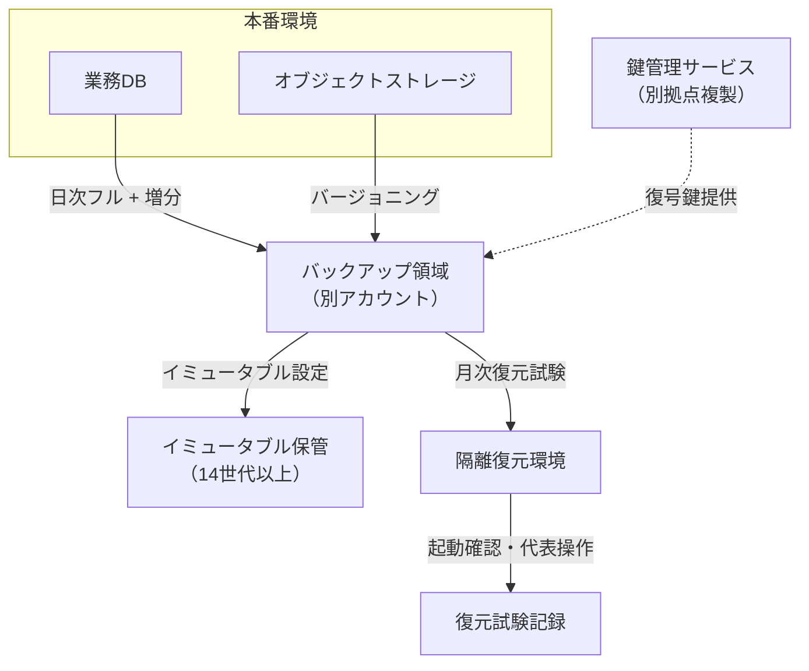

# 第7章 バックアップとリストア

## 1. 学習目標

本章を終えると、次ができる。

- バックアップ対象を業務データ、ファイル、設定、秘密情報、監査ログに分解して要件化できる
- フル、差分、増分、スナップショット、レプリケーションの違いと復元時の挙動を説明できる
- 保持世代、保管期間、保管場所、暗号化、オフライン保管、イミュータブルバックアップを要件に組み込める
- RPOと保管期間を混同せず、それぞれ別の要件として書ける
- 「取得成功」と「復元成功」を区別し、復旧テストを要件の中心に据えられる
- バックアップウィンドウと整合性の観点から、取得方式の制約を説明できる

## 2. 基本概念

### 2.1 バックアップ対象を分解する

**バックアップ対象**を「システム一式」とだけ書くと、設計者は何を、どの粒度で、どの頻度で取得すればよいか判断できない。

少なくとも次の観点で対象を分解する。

| 対象カテゴリ | 具体例 | 検討事項 |
|--------------|--------|----------|
| データベース | 業務データ、権限マスタ、シーケンス値 | 一貫性のある取得点、トランザクションログの扱い |
| オブジェクトストレージ | 添付ファイル、帳票PDF、画像 | バージョニングの要否、削除マーカーの扱い |
| 設定情報 | アプリ設定、インフラ構成、IaCコード | Gitリポジトリでの管理と、リポジトリ自体の保全 |
| 秘密情報 | 接続文字列、APIキー、証明書秘密鍵 | 秘密情報管理サービスのバックアップ方式（値そのものをバックアップに混在させない） |
| 監査ログ・アプリログ | 操作ログ、認証ログ、エラーログ | 保管期間が業務データと異なることが多い |
| 仮想マシン・コンテナイメージ | OSイメージ、コンテナレジストリ内容 | イメージから再構築できるなら対象外にできる場合がある |

**一般論**として、バックアップ対象の議論は「データベースを取ればよい」という結論に収束しがちである。

しかし、DBだけ復元できても、接続に必要な秘密情報や、アプリが参照するオブジェクトストレージ上のファイルが揃わなければ、業務は再開できない。

**推奨事項**：対象一覧は、復元後に業務が動く最小構成を基準に洗い出す。

秘密鍵や暗号鍵を、保護対象データと同じバックアップに平文で混在させてはならない。

鍵管理の方式（第9章）と整合させ、鍵の保管場所とバックアップの保管場所を分離する。

### 2.2 フル、差分、増分の違いと復元時の挙動

| 方式 | 取得内容 | 取得時間・容量 | 復元時の挙動 |
|------|----------|----------------|--------------|
| **フルバックアップ** | 対象全体 | 長い、大きい | 単体で復元可能 |
| **差分バックアップ** | 直前のフル以降に変更されたデータ全て | フルより短いが、時間経過とともに増大 | フル1つ＋最新差分1つで復元 |
| **増分バックアップ** | 直前のバックアップ（フルまたは増分）以降の変更 | 最も短い | フル1つ＋それ以降の全増分を順番に適用 |

**例示**：日次フル（日曜）＋日次増分（月〜土）の構成では、金曜のデータを復元するには、日曜のフルに加えて月〜金の5世代の増分を順に適用する必要がある。

このとき、増分のいずれか1世代が破損すると、それ以降の世代がすべて復元不能になる。

**推奨事項**：増分チェーンを長くしすぎない。定期的にフルを取り直し、チェーンの長さと復元所要時間のバランスを取る。

差分は増分よりチェーンが短く、復元は単純だが、日を追うごとに差分自体のサイズが増えるトレードオフがある。

### 2.3 スナップショットとレプリケーション

**スナップショット**は、ストレージやDBエンジンの機能を使い、ある時点の状態を高速に記録する方式である。

取得は速いが、多くの実装では元データと同一のストレージ基盤上に保持される。

**必須事項**：スナップショットのみを唯一のバックアップ手段にしない。基盤障害やアカウント侵害で、元データとスナップショットが同時に失われる経路がある。

**レプリケーション**は、データ更新をほぼリアルタイムに複製先へ反映する方式である。

高可用性やRPO短縮には有効だが、バックアップの代替にはならない。

理由は、誤った更新や削除、ランサムウェアによる暗号化も、そのまま複製先へ反映されてしまうためである。

レプリケーションは「止まらないため」の手段であり、「戻すため」の手段はバックアップである。

両者は目的が異なるため、片方だけで両方の要求を満たそうとしない。

### 2.4 保持世代と保管期間

**保持世代**は、何世代分のバックアップを残すかという数の概念である。

**保管期間**は、最も古いバックアップから最新まで、何日間または何年間さかのぼれるかという時間の概念である。

日次バックアップを35世代保持する場合、保管期間はおよそ35日である。

月次バックアップを13世代保持する場合、保管期間はおよそ13か月である。

**例示**：日次35世代＋月次13世代＋年次7世代という多段構成にすると、直近は日単位、中期は月単位、長期は年単位で粒度を落としながら保管期間を延ばせる。

監査要件で「7年間の記録保持」が求められる場合、これはバックアップではなくアーカイブの要件として別に扱うことが多い。

理由は、バックアップは「業務復旧のための直近データ」を主目的とし、アーカイブは「参照・監査のための長期データ」を主目的とするため、要求される可用性や検索性が異なるからである。

### 2.5 RPOと保管期間を混同しない

**RPO**（Recovery Point Objective）は、障害発生時に許容できる最大のデータ損失時間幅である。

**保管期間**は、過去どこまでさかのぼって取り出せるかという期間である。

この2つは軸が異なるため、片方が短くても、もう片方が長いとは限らない。

**例示**：RPO 15分を満たすために準同期レプリケーションを使っていても、そのレプリカは常に最新状態を反映するだけであり、35日前の状態を保持する仕組みではない。

逆に、35日分のバックアップを保持していても、直近の障害でRPO 15分を満たすには、バックアップとは別に高頻度の取得または複製が必要になる。

**必須事項**：RPO要件（第8章で扱うDR用の指標）と、バックアップの保管期間要件は、別の要件IDとして管理する。

同一の要件文に両方を混在させると、「RPO 15分のバックアップを7年保管する」のような、実現方式が矛盾した記述が生まれる。

### 2.6 保管場所、オフライン保管、暗号化、イミュータブルバックアップ

**保管場所**は、本番データと同一の障害領域に置くべきではない。

同一リージョン、同一データセンター、同一アカウントにしか保管しないと、その領域全体の障害や侵害で、本番とバックアップを同時に失う。

**推奨事項**：少なくとも1つのバックアップコピーを、本番とは別のリージョン、別のアカウント、別の管理権限領域に置く。

**オフライン保管**は、ネットワークから常時接続されていない状態でバックアップを保持することである。

攻撃者が本番環境の管理権限を奪取しても、オフライン媒体には到達できないため、改ざんや削除への耐性が高まる。

**暗号化**は、保管中（at rest）と転送中（in transit）の両方に適用する。

バックアップの暗号鍵は、バックアップ本体とは別の場所で管理し、鍵の紛失・漏洩シナリオを個別に検討する。

**イミュータブルバックアップ**は、設定した保持期間中、管理者権限を持つ者であっても削除・上書き・短縮ができない設定で保管するバックアップである。

ランサムウェア攻撃では、攻撃者が管理者権限を奪取した後、バックアップを先に削除してから本番データを暗号化する手口が確認されている。

イミュータブル設定は、この手口への直接的な対策になる。

**必須事項**：個人情報や重要業務データのバックアップは、少なくとも1世代以上をイミュータブルまたはオフラインで保持する。

### 2.7 リストアと整合性

**リストア**（復元）は、バックアップから元の状態、または利用可能な状態にデータを戻す行為である。

リストアの成功条件は、ファイルやレコードが物理的に戻ることだけではない。

アプリケーションが起動し、認証が通り、代表的な業務操作が実行できることまでを含める。

**整合性**は、複数のデータソースを組み合わせて復元する際、時点を揃え、参照関係を壊さないことである。

**例示**：DBと、DBが参照するオブジェクトストレージ上のファイルを別々のタイミングでバックアップしている場合、DBだけ古い時点に戻すと、DB上のレコードが参照するファイルIDが、まだ存在しないファイルを指す状態になりうる。

**推奨事項**：関連の強いデータソース間では、取得時点の整合を取るか、復元後に不整合を検出する仕組みを用意する。

### 2.8 復旧テスト（復元試験）

**復旧テスト**は、実際にバックアップから復元し、復元にかかった時間と結果を記録する試験である。

バックアップの価値は、取得できることではなく、復元できることで決まる。

**推奨事項**：復旧テストは、本番環境ではなく隔離された環境で実施し、本番への影響を避ける。

復旧テストで確認すべき項目の例は次のとおりである。

- データが指定した時点まで復元されているか
- アプリケーションが起動するか
- 認証が正常に機能するか
- 代表的な参照・更新操作が実行できるか
- 復元所要時間が目標値以内か
- 復元手順書どおりに実施でき、手順の齟齬が無いか

### 2.9 バックアップウィンドウ

**バックアップウィンドウ**は、バックアップ取得のために確保してよい時間帯である。

オンライン処理への性能影響を考慮し、業務影響が小さい時間帯に設定することが多い。

**例示**：夜間バッチと同じ時間帯にバックアップを実行すると、I/O競合でバッチが遅延することがある。

**推奨事項**：バックアップウィンドウは、夜間バッチ、月次締め処理、他システム連携のスケジュールと重ならないよう調整し、重なる場合は優先順位と許容遅延を事前に決める。

継続的なレプリケーションやスナップショット方式では、専用のウィンドウが不要になる場合もあるが、その場合も本番への性能影響を測定し、上限を要件化する。

### 2.10 取得成功と復元成功を区別する理由

バックアップジョブの実行ログに「成功」と表示されることは、復元可能であることを保証しない。

取得は成功しているのに復元できない典型的な原因は次のとおりである。

1. バックアップファイルが空、または一部だけしか書き込まれていない
2. 暗号化鍵が紛失または期限切れで、復号できない
3. 復元手順書が構成変更に追従しておらず、古い手順のまま
4. 復元先の容量やリソースが不足している
5. アプリケーションの起動確認まで検証しておらず、データは戻ってもアプリが動かない
6. 必要な時点の世代が、保持期間の設定ミスで既に削除されている
7. 差分・増分チェーンの一部が破損し、途中から復元できない

これらは、取得ジョブの監視だけでは検出できない。

**必須事項**：重要システムのバックアップ要件には、定期的な復元成功の検証（2.8の復旧テスト）を必ず含める。

「バックアップを取得すること」だけを要件にすると、復元できないバックアップが本番稼働の何年も後に発覚するリスクが残る。

## 3. 業務上の意味

バックアップは保険に似ているが、保険証券を持っているだけで家が建て直せないのと同様に、バックアップを取得しているだけでは業務は再開できない。

火災保険が実際に機能するのは、消火活動と再建手順が別途機能するときだけである。

バックアップも同様に、復元手順と復旧テストという「本体」が伴って初めて機能する。

バックアップが救うのは、災害だけではない。

誤削除、アプリケーションの不具合による論理破壊、運用ミスによる誤更新、そしてランサムウェアなどの攻撃からの回復手段になる。

第8章で扱うDRの複製（レプリケーション）だけでは、誤った更新や暗号化された状態もそのまま複製先へ伝播するため、これらの事象には対応できない。

したがって、バックアップとDRは補完関係にあり、どちらか一方で他方を代替できない。

業務側への説明では、「バックアップを取っています」ではなく、「何を、いつの時点まで、何時間以内に復元でき、それを毎月確認している」という形で伝える。

## 4. ヒアリング質問

- 戻したい最悪のシナリオは何か（誤削除、アプリ不具合、破損、サイバー攻撃、災害）
- どの時点のデータを、何時間以内に戻す必要があるか
- 何日前、何年前まで戻せる必要があるか。契約や法令による保存期間の定めはあるか
- バックアップ取得中の性能低下は、どの時間帯にどこまで許容できるか
- 復元訓練の実施頻度と、成功記録の保管先はどこか
- 個人情報を含むバックアップの保管地域とアクセス権限者は誰か
- ランサムウェアによる本番とバックアップの同時被害を、どこまで想定するか
- 秘密情報や暗号鍵のバックアップと復旧手順は誰が管理しているか

## 5. 要件例

### 要件例 NFR-BKP-001 業務データの日次バックアップと復元試験

- 要件ID：NFR-BKP-001
- 分類：バックアップ・リストア
- 対象：本番DBの業務データおよび権限設定テーブル
- 業務上の目的：運用ミスやアプリ不具合による論理障害から、業務データを回復できるようにする
- 前提条件：個人情報を含む。バックアップの保管領域は本番と分離したアカウント。暗号鍵は別管理サービスで管理
- 指標：取得成功率、復元成功率、復元所要時間、保持世代数
- 目標値：日次バックアップの取得成功率100%（自動リトライ込みで24時間以内に成功）。月1回の復元試験成功率100%。重要テーブルの復元をRTO 2時間以内で業務利用可能な状態まで完了。日次35世代、月次13世代を保持
- 測定条件：本番相当のデータ量を用いた隔離環境での復元試験。月末の高負荷時間帯を含む取得試験
- 測定方法：バックアップジョブの実行ログ、復元試験記録、アプリケーション起動確認チェックリストの突合
- 合否判定：月次で取得失敗の未回復件数が0件であること。復元試験の不合格が0件であること
- 例外条件：クラウド基盤側の障害で当日取得ができない場合は、障害復旧後24時間以内にフル取得を実施し、インシデント記録に理由を残す
- 実現方式：自動日次バックアップ、週次フル＋日次増分、保管中暗号化、別アカウントへのレプリカ保管、イミュータブル設定30日、復元Runbook整備
- 検証方法：月次リストア試験、年1回の大規模復元訓練（本番相当データ量）
- 根拠：ヒアリングで確認された誤削除からの回復需要、および社内監査基準による月次確認の要求。RPOはNFR-DR-001の15分と役割を分離し、本要件は世代保管による復旧を担う
- 関連要件：NFR-DR-001（RPO/RTO）、NFR-SEC-010（暗号化・鍵管理）、NFR-OPS-002（定型作業の自動化）
- 未確定事項：監査ログ7年保管要求とのアーカイブ役割分担が未確定

### 要件例 NFR-BKP-002 ランサムウェア対策としてのイミュータブル世代保管

- 要件ID：NFR-BKP-002
- 分類：バックアップ・リストア（改ざん耐性）
- 対象：本番DBおよび重要オブジェクトストレージのバックアップ
- 業務上の目的：管理者権限を奪取された場合でも、一定世代のバックアップから業務データを復旧できるようにする
- 前提条件：NFR-BKP-001の取得基盤を利用。イミュータブル設定はストレージ側の機能を用いる
- 指標：イミュータブル保持世代数、イミュータブル設定の適用率、隔離復旧試験の成功率
- 目標値：直近14世代以上をイミュータブル設定（削除・短縮不可）で保管。対象バックアップの100%に適用。年1回、本番と切り離した環境での隔離復旧試験に成功する
- 測定条件：本番の管理者権限では設定変更・削除ができないことを、実際の操作試験で確認する
- 測定方法：ストレージ側の設定監査ログ、削除試行試験の記録、隔離復旧試験の実施記録
- 合否判定：管理者権限での削除試行がすべて拒否されること。隔離復旧試験が目標復旧時間内に成功すること
- 例外条件：法的な削除義務（個人情報の削除請求等）が生じた場合は、別途承認プロセスを経た例外削除手順を用いる。通常運用からは除外する
- 実現方式：イミュータブルストレージ機能、バックアップ管理アカウントの権限分離、削除操作への追加承認
- 検証方法：削除試行試験（拒否されることの確認）、年次隔離復旧訓練
- 根拠：ランサムウェア攻撃で管理者権限を奪取後にバックアップを先に削除する手口が報告されているための対策
- 関連要件：NFR-BKP-001、NFR-DR-002（ランサムウェアシナリオ）、NFR-SEC-004（特権ID管理）
- 未確定事項：14世代保持に伴う追加ストレージコストの予算確保

### 要件例 NFR-BKP-003 秘密情報・鍵管理バックアップの分離

- 要件ID：NFR-BKP-003
- 分類：バックアップ・リストア（秘密情報）
- 対象：接続文字列、APIキー、証明書秘密鍵、暗号鍵
- 業務上の目的：秘密情報の消失によって復元作業自体が停止することを防ぐ
- 前提条件：秘密情報は秘密情報管理サービスで一元管理し、コードリポジトリへの直書きを禁止する
- 指標：秘密情報バックアップの取得成功率、鍵の複数拠点保管率、鍵紛失訓練の実施結果
- 目標値：秘密情報管理サービスのバックアップ取得成功率100%。暗号鍵は地理的に離れた2拠点以上で保管。年1回の鍵紛失訓練で代替手順による復旧に成功する
- 測定条件：秘密情報管理サービス側の障害を想定した訓練環境
- 測定方法：バックアップ取得ログ、鍵保管拠点の設定確認、訓練記録
- 合否判定：訓練において、主拠点の鍵にアクセスできない状態から、代替拠点の鍵で復号に成功すること
- 例外条件：一時的な開発環境用の秘密情報は対象外とし、本番相当環境のみを対象とする
- 実現方式：秘密情報管理サービスの複製機能、鍵管理サービスのマルチリージョン保管、鍵ローテーション手順との整合
- 検証方法：鍵紛失訓練、秘密情報管理サービスの設定監査
- 根拠：過去に他案件で、単一拠点の鍵喪失により復元作業自体が数日停止した事例への対策
- 関連要件：NFR-BKP-001、NFR-SEC-010、NFR-SEC-011（鍵管理）
- 未確定事項：鍵管理サービスの複数拠点対応にかかる追加費用の承認

## 6. 悪い要件例

次は要件として不合格である。

1. 「重要なデータは適切にバックアップすること」
2. 「バックアップを取得すること」
3. 「RPO 15分のバックアップを7年間保管すること」
4. 「クラウドの標準バックアップ機能を使うこと」
5. 「復元できるようにしておくこと」

不合格理由は共通している。

対象、方式、頻度、保持期間、保管場所、復元条件、測定方法、合否判定のいずれかが欠けている。

例3は、RPO（障害時に許容するデータ損失時間幅）と保管期間（さかのぼれる期間）という異なる軸の概念を混同しており、実現方式が矛盾する可能性が高い。

例4は、「標準機能」が具体的に何を、どの設定で行うかが不明であり、復元試験の有無にも触れていない。

## 7. 改善後の要件例

### 悪い例1・2の改善：「適切にバックアップすること」「バックアップを取得すること」

NFR-BKP-001（5節）が改善例である。

対象、方式、保持世代、復元試験の頻度と合否基準を数値で固定した点が改善の要点である。

### 悪い例3の改善：「RPO 15分のバックアップを7年間保管すること」

RPO 15分は、連続レプリケーションまたは高頻度スナップショットを用いるDR/継続性の要件（第8章NFR-DR-001）として分離する。

7年間の保管が必要な場合は、業務復旧用のバックアップとは別に、アーカイブ要件として新しい要件ID（例：NFR-ARC-001）を立てる。

アーカイブは検索性や参照頻度の要件がバックアップと異なるため、同一要件に混在させない。

### 悪い例4の改善：「クラウドの標準バックアップ機能を使うこと」

- 要件ID：NFR-BKP-010
- 分類：バックアップ・リストア
- 対象：本番オブジェクトストレージ上の添付ファイル
- 業務上の目的：誤削除された添付ファイルを、業務影響が出る前に復旧できるようにする
- 前提条件：クラウドのバージョニング機能とライフサイクル管理機能を利用する
- 指標：バージョニング有効化率、誤削除からの復旧所要時間
- 目標値：対象バケットのバージョニング有効化率100%。誤削除発生から30分以内に旧バージョンへ復旧できること
- 測定条件：誤削除を模擬した復旧試験
- 測定方法：設定監査、復旧試験の実施記録
- 合否判定：復旧試験で目標時間内に旧バージョンが復元できること
- 例外条件：一時ファイル用バケットは対象外とする
- 実現方式：オブジェクトストレージのバージョニング機能、削除マーカーの保持期間設定、ライフサイクルポリシーによる自動アーカイブ
- 検証方法：誤削除復旧試験の四半期実施
- 根拠：過去に添付ファイルの誤削除で問い合わせ対応が滞った事例への対策
- 関連要件：NFR-BKP-001
- 未確定事項：バージョニング保持期間の上限設定

「標準機能を使う」ではなく、機能の設定内容と復旧目標を明示した点が改善の要点である。

### 悪い例5の改善：「復元できるようにしておくこと」

NFR-BKP-001の復元試験項目（月次実施、成功率100%、RTO 2時間以内）へ接続する。

「できるようにしておく」という状態表現を、頻度・合否基準・所要時間という測定可能な形に変換した。

## 8. 設計への落とし込み

バックアップ設計書に落とし込む項目の例は次のとおりである。

| 項目 | 内容 |
|------|------|
| 対象一覧 | データベース、ファイル、設定、秘密情報、ログの別 |
| 取得方式 | フル、差分、増分、スナップショット、レプリケーションの組み合わせ |
| 保持世代・保管期間 | 日次・月次・年次の世代数と対応期間 |
| 保管場所 | 本番と異なるアカウント・リージョン |
| 暗号化・鍵管理 | 保管中・転送中の暗号化方式、鍵の保管場所 |
| イミュータブル設定 | 対象世代数、削除不可期間 |
| 復元手順 | Runbook、承認者、実行者、所要時間目標 |
| 復旧テスト計画 | 頻度、環境、合否基準、記録方法 |

**採用**：週次フル＋日次増分バックアップに、別アカウントへのレプリカとイミュータブル設定14世代を組み合わせる方式。

**不採用**：スナップショットのみを同一アカウント内に保持する方式。

**理由**：復元試験を毎月実施することで復元可能性を継続的に検証でき、イミュータブル設定によりランサムウェア被害時にも一定世代を保護できる。

**残存リスク**：バックアップ取得から復元試験までの間（最大1か月）に生じた復元不能な破損は、次回試験まで発見が遅れる可能性がある。取得直後の整合性チェック（チェックサム検証等）で緩和する。

## 9. 代替案

| 方式 | 向く条件 | 向かない条件 |
|------|----------|--------------|
| バックアップ中心（世代保管） | RPOが数時間〜1日程度で許容できる、コストを抑えたい | 秒〜分単位のRPOが必要 |
| 複製（レプリケーション）中心 | RPOを短くしたい、高可用性も同時に満たしたい | 論理破壊・ランサムウェア対策も必要（単独では不足） |
| 両者併用 | RPOとランサムウェア耐性の両方が必要（多くの本番システムで推奨） | コストや運用負荷の許容度が極めて低い |
| オフライン媒体への追加保管 | 規制要件、極めて高い改ざん耐性が必要 | 復元にかかる時間の増加が許容できない |

**推奨事項**：個人情報や決済データを扱う本番システムでは、複製とバックアップの併用を基本形とする。

## 10. トレードオフ

| 対立 | 一方を優先すると | 他方に起きること |
|------|------------------|------------------|
| 短いRPO vs コスト | 高頻度取得・準同期複製を導入 | ストレージ費用、転送費用、性能影響が増える |
| 長期保管 vs 費用・機密管理 | 保管期間を延ばす | 保管コストが増え、漏洩対象範囲も広がる |
| オンライン取得 vs 性能影響 | 取得頻度を上げる | バックアップウィンドウの設計と業務影響調整が必要になる |
| イミュータブル設定 vs 運用柔軟性 | 削除不可の期間を長くする | 誤設定や不要データの削除も遅れ、ストレージ費用が増える |
| 復元試験の頻度 vs 運用負荷 | 試験を頻繁に行う | 試験環境の維持コストと工数が増える |

**一般論**として、「RPOを短くすればバックアップの重要性が下がる」と誤解されることがあるが、両者は目的が異なるため、この判断は誤りである。

## 11. 検証方法

- 取得ジョブの成否監視（自動アラート）
- 別環境へのリストア試験
- アプリケーション起動と代表業務操作の確認
- 暗号鍵紛失訓練（鍵管理手順の実効性確認）
- 保持世代・保管期間の棚卸し
- バックアップウィンドウ中の性能影響測定
- イミュータブル設定に対する削除試行試験（拒否されることの確認）
- チェックサムまたはハッシュ値によるバックアップファイルの整合性検証

## 12. よくある失敗

1. 取得成功のログだけを見て、復元成功とみなしてしまう
2. RPOとバックアップ保管期間を同一要件に混在させ、矛盾した記述になる
3. 本番と同じ管理者権限でバックアップも即座に削除できる状態のままにする
4. 復元に必要な容量や所要時間を事前に見積もらず、災害時に初めて不足に気付く
5. 設定情報や秘密情報のバックアップ方針が定義されず、DB以外が復元できない
6. 「年1回実施予定」の復元訓練が、実際には何年も実施されない
7. 差分・増分チェーンの途中破損を想定せず、復元不能リスクを見落とす
8. スナップショットのみに依存し、基盤障害やランサムウェアへの耐性を検討しない

## 13. レビュー観点

- [ ] バックアップ対象一覧が、DB以外（ファイル、設定、秘密情報、ログ）を含んでいるか
- [ ] 取得方式（フル・差分・増分・スナップショット・レプリケーション）が明記されているか
- [ ] 保持世代、保管期間、保管場所、暗号化が要件化されているか
- [ ] RPO要件と保管期間要件が別のIDで管理されているか
- [ ] 復元成功の定期試験が要件に含まれているか
- [ ] イミュータブルまたはオフライン保管がランサムウェア対策として含まれているか
- [ ] バックアップウィンドウと業務影響が調整されているか
- [ ] 個人情報を含むバックアップのアクセス制御が明記されているか

## 14. 章末問題

### 問題1

RPO 15分、バックアップ保管期間35日のシステムで、「40日前の状態に戻したい」という要求が発生した。
このバックアップ要件で対応できるか。理由も述べよ。

### 問題2

「レプリケーションを組んでいるからバックアップは不要」という主張の欠点を2つ挙げよ。

### 問題3

復元試験の合否判定に含めるべき確認項目を4つ挙げよ。

### 問題4

イミュータブルバックアップが対策になる攻撃シナリオを説明し、通常のバックアップだけでは不十分な理由を述べよ。

## 15. 解答と解説

### 問題1

対応できない。

保管期間が35日であるため、40日前のデータは既に保持範囲外である。

RPOは「障害発生時点からどれだけ遡って良いか」を示す直近の指標であり、長期の保管期間を意味するものではない。

長期保存が必要であれば、バックアップとは別にアーカイブ要件として保管期間を定義する必要がある。

### 問題2

1. 誤削除やアプリケーションの不具合による論理的なデータ破損が、複製先にもそのまま反映される
2. ランサムウェアによる暗号化などの攻撃を受けた場合、本番と複製の両方が同時に影響を受ける可能性がある

### 問題3

例：データが指定時点まで復元されていること、アプリケーションが正常に起動すること、認証が成功すること、代表的な参照・更新操作が実行できること、復元所要時間が目標値以内であること、実施記録が残っていること。

### 問題4

ランサムウェア攻撃では、攻撃者が管理者権限を奪取した後、まずバックアップを削除し、その後で本番データを暗号化する手口がある。

通常のバックアップは、その管理者権限を持つ者（正当な管理者であれ攻撃者であれ）が削除できる設定になっていることが多く、この手口に対して無力である。

イミュータブルバックアップは、設定した保持期間中、管理者権限であっても削除・変更ができないため、この手口への直接的な対策になる。

## 16. 実務演習

実務シナリオ（従業員5,000人のWeb業務システム、個人情報を含む）を題材に、次を作成せよ。

1. バックアップ対象一覧（DB、ファイル、設定、秘密情報、ログを含む6件以上）
2. 各対象の取得方式（フル・差分・増分・スナップショット・レプリケーションのいずれか）と選定理由
3. 保持世代・保管期間の設計（日次・月次・年次を含む多段構成）
4. 月次復元試験の手順骨子（対象、確認項目、合格基準）
5. ランサムウェア対策として、イミュータブルまたはオフライン保管をどこに適用するかの方針

提出の体裁は次でよい。

- 対象一覧表
- 方式選定表（対象、方式、理由）
- 保管設計表（世代、期間、場所、暗号化）
- 復元試験手順書（骨子）
- ランサムウェア対策方針（1ページ程度）

---

## 次章予告

第8章では災害対策と事業継続を扱う。
BCPとDRの関係、RTO・RPO・MTPDの区別、コールド・ウォーム・ホットスタンバイの選定、DR訓練、通信断や認証基盤停止まで含めた対策を接続する。
