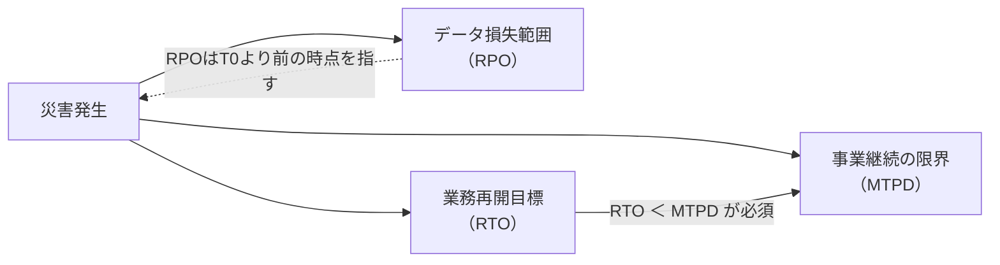
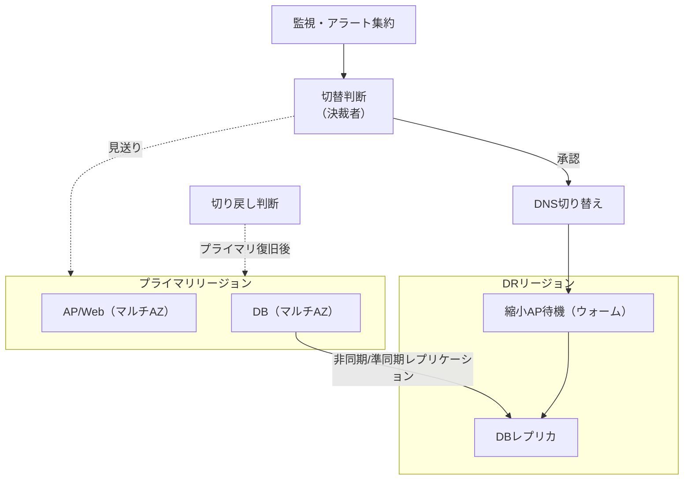

# 第8章 災害対策と事業継続

## 1. 学習目標

本章を終えると、次ができる。

- BCPとDRの関係、および両者の責任範囲の違いを説明できる
- RTO、RPO、MTPDを混同せずに使い分け、それぞれの目標値を独立に設定できる
- 業務影響分析から、災害シナリオごとの復旧目標を導出できる
- コールド、ウォーム、ホットスタンバイの違いをコストと復旧時間の両面から比較できる
- バックアップサイト、マルチリージョン、DNS切り替え、データ同期を組み合わせた設計を検討できる
- 切り替え判断、切り戻し、DR訓練を運用可能な手順として要件化できる
- 通信断や認証基盤の停止といった、アプリケーション以外の障害要因を対策に含められる

## 2. 基本概念

### 2.1 BCPとDR

**BCP**（Business Continuity Plan、事業継続計画）は、災害や重大インシデントが発生しても事業を継続するための、組織全体の計画である。

人員の安否確認、代替オフィスや在宅勤務体制、取引先への連絡、資金繰り、広報対応など、ITに限らない要素を含む。

**DR**（Disaster Recovery、災害復旧）は、BCPのうち、ITシステムの復旧に焦点を当てた計画と仕組みである。

DRはBCPの一部であり、DRだけを完成させても事業継続は保証されない。

**例示**：ITシステムが1時間で復旧しても、従業員が出社できず、取引先への連絡手段も断たれていれば、業務そのものは再開できない。

**一般論**として、IT部門は自部門の管掌範囲であるDRの整備に注力しがちであり、BCP全体との接続を見落としやすい。

**推奨事項**：DR要件を定義する際は、BCP全体の中でITがどの業務プロセスを支えているかを、業務影響分析（2.3節）で確認してから着手する。

### 2.2 RTO、RPO、MTPDを区別する

この3つの用語は、いずれも「時間」を扱うため混同されやすいが、意味する対象が異なる。

| 用語 | 正式名称 | 意味 | 軸 |
|------|----------|------|-----|
| **RTO** | Recovery Time Objective | 災害発生後、業務を再開するまでの目標時間 | いつまでに戻すか |
| **RPO** | Recovery Point Objective | 許容できる最大のデータ損失時間幅 | どこまで戻すか（時点） |
| **MTPD** | Maximum Tolerable Period of Disruption | 業務が存続不能になるまでの最大許容停止時間 | これを超えると事業継続が危ぶまれる境界 |

**必須事項**：RTOはMTPDより短く設定する。

RTOがMTPDを超える計画は、「業務再開が間に合う前に、事業継続そのものが危うくなる」ことを意味し、計画として成立しない。

**例示**：RTO 24時間、RPO 15分、MTPD 72時間という設定は、次のように読む。

「災害発生から24時間以内に業務を再開する（RTO）。再開時点のデータは、災害直前から最大15分前の状態まで戻っている可能性がある（RPO）。仮に72時間業務が止まると、事業継続そのものが危ぶまれる（MTPD）」。

RTOとRPOを入れ替えて使う誤りが実務では頻発する。

**推奨事項**：要件文には必ず正式名称と定義文を併記し、略語だけに頼らない。

### 2.3 業務影響分析と災害シナリオ

**業務影響分析**（Business Impact Analysis、BIA）は、業務ごとに、停止した場合の影響の大きさと、時間経過による影響の増大を分析する活動である。

BIAを行わずにRTO・RPOを決めると、根拠のない数値が独り歩きする。

シナリオを1種類に限定すると、過大または過小なDR投資につながる。

少なくとも次のシナリオを検討する。

1. 単一AZ（アベイラビリティゾーン）障害
2. リージョン全体の障害
3. ランサムウェアなどによる論理的破壊（データ暗号化・改ざん）
4. IdP（認証基盤）の停止
5. 広域ネットワーク断（社内からクラウドへの経路断絶を含む）
6. 主要な外部API・外部サービスの長期停止

シナリオごとに、対象業務、RTO、RPO、代替手段が異なりうる。

**例示**：単一AZ障害はマルチAZ構成で自動的に吸収できることが多いが、リージョン障害は別リージョンへの切り替えが必要であり、復旧に要する時間の桁が変わる。

ランサムウェアのシナリオでは、通常のレプリケーションによる複製先も被害を受ける可能性があるため、第7章のイミュータブルバックアップと組み合わせた別の復旧手順が必要になる。

**推奨事項**：シナリオごとにRTO・RPOの一覧表を作成し、単一の数値だけで議論しない。

### 2.4 コールド、ウォーム、ホットスタンバイ

| 方式 | 概要 | RTOの目安感 | コスト感 |
|------|------|-------------|----------|
| **コールドスタンバイ** | バックアップからの再構築を前提とする。平常時は環境を起動しない | 長い（半日〜数日） | 低い |
| **ウォームスタンバイ** | 縮小構成の待機環境を常時起動しておき、必要時に拡張する | 中程度（数時間） | 中程度 |
| **ホットスタンバイ** | 本番同等の構成を常時稼働させ、即座に切り替えられる状態を保つ | 短い（分単位〜1時間未満のことも） | 高い |

上記のRTO目安とコスト感は例示であり、実際の値は実測とDR訓練の結果に基づいて決める。

**一般論**として、「DRサイトがあれば安心」という発言は、方式を明示していないため、コストとRTOのどちらを優先しているかが分からない。

**推奨事項**：BIAで求めた業務ごとのRTOに対して、コールド・ウォーム・ホットのどれが必要十分かを、コストと合わせて比較検討する。

すべての業務にホットスタンバイを適用することは、多くの場合、費用対効果に見合わない。

### 2.5 バックアップサイト、マルチリージョン、DNS切り替え、データ同期

**バックアップサイト**は、災害発生時に業務を引き継ぐ復旧先の環境である。

**マルチリージョン**は、地理的に離れた複数のリージョンに環境を分散させる構成であり、広域災害への耐性を高める代表的な手段である。

**DNS切り替え**は、利用者のアクセス先を、プライマリ環境からバックアップサイトへ誘導する手段の一つである。

**必須事項**：DNS切り替えだけでは業務は再開しない。

次の要素をセットで検討する必要がある。

- DNSのTTL（切り替えが利用者に反映されるまでの時間）
- クライアント側・中間キャッシュの影響
- アプリケーションの接続先設定（ハードコードされた接続文字列がないか）
- 証明書の有効性（バックアップサイト用の証明書が準備されているか）
- IdPのリダイレクト先設定
- データそのものがバックアップサイトに到達しているか

**データ同期**は、プライマリとバックアップサイト間でデータを反映する方式であり、同期、準同期、非同期の3種類に大別される。

| 同期方式 | 概要 | RPOへの影響 | 性能への影響 |
|----------|------|--------------|--------------|
| 同期 | 両サイトへの書き込み完了を待ってから応答する | RPO ≈ 0 | 距離に応じた遅延が常時発生 |
| 準同期 | 一定条件（例：一方の書き込み確認）で応答する | 数秒〜数十秒程度の損失可能性 | 同期よりは軽いが遅延あり |
| 非同期 | プライマリの書き込み後、非同期に反映する | 遅延分がそのままRPOの損失可能性になる | プライマリの性能への影響は最小 |

**推奨事項**：地理的に離れたリージョン間では、通信遅延の物理的制約上、同期方式の採用が性能に大きく影響することが多い。RPO要件と性能要件を突き合わせて選定する。

### 2.6 切り替え判断と切り戻し

**切り替え判断**は、誰が、どの情報を根拠に、どの権限でDRサイトへの切り替えを決定するかというプロセスである。

**必須事項**：切り替えの自動起動は、誤検知による誤切替（本来不要な切り替えを実行してしまうこと）のリスクを伴うため、少なくとも重大な切り替えは人による最終判断を経る設計を基本とする。

切り替え判断に必要な要素は次のとおりである。

- 障害の検知情報（監視アラート、外部からの報告）
- 障害の切り分け結果（プライマリ側の復旧見込み時間）
- 決裁者と、夜間・休日の代行者
- 判断のタイムリミット（判断に時間をかけすぎるとRTOを圧迫する）

**切り戻し**は、プライマリ側が復旧した後、DRサイトからプライマリへ業務を戻す手順である。

切り戻しは切り替えよりも軽視されがちだが、次の理由で慎重な設計が必要である。

- DRサイト側で発生したデータ更新分を、プライマリ側へ反映する必要がある（データ差分の統合）
- 切り戻し中に再度障害が起きた場合の対応（切り戻しの中断・再試行手順）
- 利用者への影響（切り戻し中の一時的な参照専用化など）

**推奨事項**：切り戻し手順は、切り替え手順と同じ水準で文書化し、訓練の対象に含める。

### 2.7 DR訓練

**DR訓練**は、DR計画が実際に機能するかを検証する活動であり、少なくとも次の段階がある。

| 訓練の種類 | 内容 | 実施頻度の目安 |
|------------|------|------------------|
| 机上訓練 | 手順書を関係者で読み合わせ、判断分岐を確認する | 四半期に1回程度 |
| 部分切替訓練 | 一部の業務またはコンポーネントのみを実際に切り替える | 半期に1回程度 |
| 総合切替訓練 | 対象業務全体を実際にDRサイトへ切り替え、業務が動くことを確認する | 年1回程度 |

訓練頻度は例示であり、業務の重要度とMTPDに応じて調整する。

**必須事項**：訓練しないDR計画は、文書上のDRである。

過去に一度も実際の切り替えを試していない手順は、記載漏れ、権限不足、証明書の期限切れなど、実行時に初めて判明する不備を含んでいる可能性が高い。

**推奨事項**：訓練の合否基準（RTO内に業務が再開できたか、RPO内のデータ損失に収まったか）を事前に定義し、訓練結果を記録として残す。

### 2.8 通信断や認証基盤停止を含めた対策

アプリケーションとデータベースを多重化しても、次の要素が単一障害点になっていると、業務は止まる。

- 社内ネットワークからクラウドへの通信経路の断絶
- IdP（認証基盤）の停止によるログイン不能
- DNSサービス自体の障害
- 証明書の失効と、更新対応の失敗
- 監視システムや遠隔運用回線の喪失（障害に気付けない、対応できない）

**例示**：認証基盤が単一のIdPに依存している場合、そのIdPが停止すると、バックアップサイトへ切り替えても誰もログインできない状態になる。

対策の例は次のとおりである。

- ネットワーク経路の代替手段（複数回線、迂回経路）の用意
- IdPの冗長化、または緊急時に限定した代替認証手段（厳格な監査ログを伴うブレイクグラス手順）
- 重要な参照系機能について、読み取り専用の退避手段を用意する
- 電話連絡網など、IT基盤に依存しない代替連絡手段の整備

**必須事項**：DR要件には、アプリケーション・データベースの障害シナリオだけでなく、通信断と認証基盤停止のシナリオを最低限含める。

## 3. 業務上の意味

災害対策の最終目標は、サーバやデータベースを復旧させることそのものではない。

給与計算、申請承認、顧客対応など、実際に守るべき業務プロセスを、許容できる時間内に再開することである。

経営層への説明では、RTOやRPOという技術的な数字だけを提示するのではなく、それらを達成できなかった場合の事業影響（機会損失、契約違反、信用低下など）と対にして示す。

**例示**：「RTO 24時間」という数字だけでは判断できないが、「リージョン障害時、24時間の業務停止により、想定される取引影響額は月商の約3%相当」という形にすると、投資判断の材料になる。

BCP全体の中でのDRの位置づけを共有し、IT部門だけで完結させないことが、実効性のある計画につながる。

## 4. ヒアリング質問

- 72時間業務が止まった場合、どの業務が事業継続上「アウト」と判断されるか（MTPDの把握）
- リージョン障害とサイバー攻撃（ランサムウェア）で、優先して復旧すべき業務は同じか、異なるか
- データ損失が15分の場合と1時間の場合で、業務にどのような違いが生じるか
- DR切り替えの決裁者は誰か。夜間・休日は誰が代行するか
- DR訓練は年何回実施しており、机上訓練と実切替のどちらまで行っているか
- IdPや社内ネットワークが停止した場合の代替手段は用意されているか
- 切り戻しの際、DRサイトで発生したデータ更新をどう扱うか、方針は決まっているか
- 監査や規制上、DR体制について求められる報告義務はあるか

## 5. 要件例

### 要件例 NFR-DR-001 リージョン障害時の業務継続

- 要件ID：NFR-DR-001
- 分類：災害対策（DR）
- 対象：重要オンライン業務（申請、承認、参照）および関連する権限設定
- 業務上の目的：リージョン障害後も、許容時間内に業務を再開できるようにする
- 前提条件：単一リージョン障害を対象とする。ランサムウェアによる論理破壊は別シナリオ（NFR-DR-002）として扱う
- 指標：RTO、RPO、障害検知から切替判断までの所要時間、DR訓練の成功率
- 目標値：RTO 24時間以内、RPO 15分以内。障害認定から切替判断までを1時間以内に完了する。年2回のDR訓練で、少なくとも1回はRTO内での復旧を実証する
- 測定条件：DR訓練または実際の災害発生時。データの整合性検証と代表業務の動作確認を、業務再開の判定条件に含める
- 測定方法：訓練実施記録、データ同期遅延の監視ログ、切替判断のタイムスタンプ記録
- 合否判定：訓練においてRTO・RPOの両方の目標を達成すること。未達の場合は是正計画を策定し、次回訓練で再検証する
- 例外条件：IdPが同時に利用不能となった場合は、緊急認証手順によるRTOを別途適用し、通常のRTO評価対象からは除外する
- 実現方式：別リージョンでのウォームスタンバイ、非同期または準同期のデータレプリケーション、DNS切り替え、切替・切り戻しRunbookの整備
- 検証方法：年2回のDR訓練（うち1回は部分切替、1回は机上または総合切替）、四半期ごとの同期遅延レビュー
- 根拠：業務影響分析でMTPD 72時間と判定。日中の短時間停止とは別に、広域災害時は24時間以内の再開を経営層が受容する仮置きとして設定
- 関連要件：NFR-AVL-001（平常時の可用性）、NFR-BKP-001（バックアップ）、NFR-OPS-040（運用体制）
- 未確定事項：ホットスタンバイ化に必要な追加予算の決裁状況

### 要件例 NFR-DR-002 ランサムウェアによる論理破壊シナリオへの対策

- 要件ID：NFR-DR-002
- 分類：災害対策（サイバー攻撃シナリオ）
- 対象：本番DBおよび重要オブジェクトストレージ
- 業務上の目的：ランサムウェアなどによりデータが暗号化・改ざんされた場合でも、影響を受けていない世代から業務を復旧できるようにする
- 前提条件：通常のレプリケーション先も被害を受ける可能性があると仮定する。第7章のイミュータブルバックアップ（NFR-BKP-002）を前提とする
- 指標：隔離復旧成功率、影響範囲特定に要する時間、復旧までのRTO
- 目標値：隔離環境での復旧試験を年1回実施し成功率100%を維持する。攻撃検知から影響範囲（感染していない直近世代の特定）の特定までを24時間以内に完了する。隔離復旧によるRTOを72時間以内とする
- 測定条件：本番環境から切り離した隔離環境での復旧訓練
- 測定方法：訓練記録、影響範囲特定にかかった時間の計測、復旧完了までの所要時間記録
- 合否判定：訓練において、感染していない世代からの復旧に成功し、目標RTO内に完了すること
- 例外条件：攻撃の規模が全社的なインフラ障害を伴う場合は、BCP全体の対応（IT以外の対応含む）と合わせて評価する
- 実現方式：イミュータブルバックアップからの隔離復旧手順、フォレンジック調査との連携手順、通常のDRサイトとは独立した復旧環境
- 検証方法：年1回の隔離復旧訓練、四半期のイミュータブル設定監査
- 根拠：通常のDR複製だけではランサムウェアの影響が複製先にも及ぶため、独立したシナリオとして扱う必要があると判断
- 関連要件：NFR-DR-001、NFR-BKP-002、NFR-SEC-013（インシデント対応）
- 未確定事項：隔離復旧環境の常設か、都度構築かの方式決定

### 要件例 NFR-DR-003 認証基盤・通信断への対策

- 要件ID：NFR-DR-003
- 分類：災害対策（アプリ以外の単一障害点）
- 対象：本番システムへのログイン機能および社内からクラウドへの通信経路
- 業務上の目的：IdP停止や通信断が発生しても、重要業務の参照または継続的な状況把握ができるようにする
- 前提条件：通常時は単一のIdPおよび単一の主回線を使用している
- 指標：IdP停止時の緊急認証手順の発動時間、通信断時の代替経路切替時間
- 目標値：IdP停止を検知してから緊急認証手順（ブレイクグラス）を発動するまで30分以内。主回線断絶時、代替回線への切替を15分以内に完了する
- 測定条件：IdPおよび主回線の障害を模擬した訓練
- 測定方法：訓練実施記録、緊急認証手順の発動ログ、回線切替の実施記録
- 合否判定：訓練において目標時間内に緊急手順が発動され、かつ発動後24時間以内に監査レビューが完了すること
- 例外条件：緊急認証手順の利用は、事前登録されたブレイクグラスアカウントに限定する。それ以外の代替認証は認めない
- 実現方式：ブレイクグラスアカウントの事前登録と厳格な監査、代替回線の契約、電話連絡網などIT基盤に依存しない連絡手段の整備
- 検証方法：年1回のIdP停止・通信断複合訓練
- 根拠：DR訓練で、アプリ・DBの復旧に成功してもIdP停止により誰もログインできなかった過去事例への対策
- 関連要件：NFR-DR-001、NFR-SEC-002（認証・認可）、NFR-OPS-001（障害対応）
- 未確定事項：代替回線の常時契約か、緊急時契約かのコスト比較

## 6. 悪い要件例

次は要件として不合格である。

1. 「災害時も業務が止まらないこと」
2. 「DRサイトを持つこと」
3. 「RTO/RPOを適切に設定すること」
4. 「クラウドの高可用性機能を使えば十分」
5. 「バックアップサイトへ自動的に切り替わること」

不合格理由は共通している。

対象業務、シナリオ、目標時間、判断プロセス、訓練計画のいずれかが欠けている。

例5は、自動切り替えのリスク（誤検知による誤切替）を検討せずに「自動」を前提としてしまっている点で、設計判断を要件に先取りしてしまっている。

## 7. 改善後の要件例

### 悪い例1の改善：「災害時も業務が止まらないこと」

NFR-DR-001（5節）が改善例である。

シナリオ、RTO、RPO、切替判断時間、訓練頻度を分けて数値化した。

### 悪い例2の改善：「DRサイトを持つこと」

DRサイトの有無だけでは、コールド・ウォーム・ホットのどれかが不明であり、RTOも定まらない。

NFR-DR-001のように、対象業務ごとのRTO・RPOを先に決め、それを満たす方式（本章2.4節の比較表）を設計側で選定する順序に直す。

### 悪い例3の改善：「RTO/RPOを適切に設定すること」

「適切に」は測定不能である。

業務影響分析の結果に基づき、NFR-DR-001のように具体的な時間数値と根拠を明示する。

### 悪い例4の改善：「クラウドの高可用性機能を使えば十分」

クラウドの高可用性機能（マルチAZなど）は、主に単一AZ障害への対策であり、リージョン全体の障害やランサムウェアには別の対策が必要である。

NFR-DR-001とNFR-DR-002のように、シナリオを分けて要件化する。

### 悪い例5の改善：「バックアップサイトへ自動的に切り替わること」

- 要件ID：NFR-DR-010
- 分類：災害対策（切替判断）
- 対象：重要オンライン業務のDR切替プロセス
- 業務上の目的：誤検知による不要な切り替えを防ぎつつ、必要な切り替えを迅速に判断できるようにする
- 前提条件：切替判断には人による最終確認を必須とする。監視アラートは判断材料として自動集約する
- 指標：切替判断に要する時間、誤切替の発生件数
- 目標値：障害認定から切替判断までを1時間以内。誤切替の発生件数を年0件とする
- 測定条件：DR訓練および実際の障害対応記録
- 測定方法：切替判断のタイムスタンプ記録、判断根拠となった監視データの保存
- 合否判定：目標時間内に判断が完了し、誤切替が発生していないこと
- 例外条件：夜間・休日は代行決裁者が判断する。代行者不在時のエスカレーション経路を別途定める
- 実現方式：監視アラートの自動集約ダッシュボード、決裁者への自動通知、判断基準を明文化したRunbook
- 検証方法：DR訓練での判断プロセスのレビュー
- 根拠：完全自動切替は誤検知時の業務影響が大きいため、人による最終判断を残す方針とした
- 関連要件：NFR-DR-001
- 未確定事項：夜間・休日の代行決裁者の指名

「自動的に切り替わること」を、判断プロセスと時間目標に分解し、自動化する範囲（情報集約）と人が判断する範囲（最終決定）を明確にした。

## 8. 設計への落とし込み

**採用**：別リージョンでのウォームスタンバイ構成に、非同期または準同期のデータレプリケーションを組み合わせる方式。

**不採用**：初期段階からのホットスタンバイによる常時マルチリージョン稼働。

**理由**：平常時の可用性は単一リージョン内のマルチAZ構成で十分に満たせる想定であり、広域災害時のみRTO 24時間で復旧する方が、常時稼働のコスト増分と比較して費用対効果が高いと判断した。

**残存リスク**：切替判断の遅延、データ同期の追従遅延、IdPなど外部依存先への依存が残る。これらはNFR-DR-002、NFR-DR-003で個別に手当てする。

## 9. 代替案

| 方式 | 向く条件 | 向かない条件 |
|------|----------|--------------|
| バックアップからのコールド復旧のみ | RTOが数日単位でも許容できる、コストを最小化したい | 数時間以内の業務再開が求められる |
| ウォームDR（本章の採用例） | RTOが数時間〜1日程度で、コストとのバランスを取りたい | 秒〜分単位のRTOが求められる |
| ホットなマルチリージョン常時稼働 | 極めて短いRTOが必須、コスト許容度が高い | コスト制約が厳しい、運用の複雑性を抑えたい |
| 重要参照機能のみ先行復旧 | 全機能停止よりも、参照だけでも継続する価値が高い業務 | 参照だけでは業務が成立しない場合 |

## 10. トレードオフ

| 対立 | 一方を優先すると | 他方に起きること |
|------|------------------|------------------|
| 短いRTO vs コスト | ホットスタンバイを採用する | 常時稼働分の費用が増大する |
| 短いRPO vs 性能・複雑性 | 同期レプリケーションを採用する | 距離に応じた遅延が常時発生し、障害の伝播経路も増える |
| 自動切替 vs 誤切替リスク | 判断を自動化する | 誤検知時に不要な切り替えを実行するリスクが増す |
| 訓練の現実性 vs 業務影響 | 実際の切替まで訓練する | 訓練中の業務影響や工数負担が増える |
| DR整備範囲 vs BCP全体との整合 | IT側のDRだけを厚くする | 人員・拠点・連絡網などBCP全体の不備が見過ごされる |

## 11. 検証方法

- 机上訓練（手順の読み合わせと判断分岐の確認）
- データ同期遅延の定常的な監視と記録
- DR環境への部分切替訓練
- 年次の総合切替訓練
- 切り戻し訓練
- IdP停止・通信断を想定した訓練（机上または実技）
- 訓練後のRunbook更新と是正記録の確認

## 12. よくある失敗

1. RTOとRPOを取り違えて記述する
2. システムの技術的復旧のみをもって「RTO達成」とみなし、業務が実際に動くかを確認しない
3. DR計画を策定したまま、一度も訓練を実施しない
4. 通信断や認証基盤の停止をシナリオから除外する
5. ランサムウェアなどの論理破壊に対して、通常のレプリケーションだけで備えたつもりになる
6. 切替の決裁者が夜間・休日に不在で、判断が翌営業日まで持ち越される
7. 切り戻し手順を用意せず、DRサイトへの切替後の運用が固定化してしまう
8. DRをBCP全体から切り離し、IT部門だけで完結させてしまう

## 13. レビュー観点

- [ ] BCPとDRの関係、および責任範囲が明記されているか
- [ ] シナリオ別（AZ障害、リージョン障害、ランサムウェア、IdP停止、通信断）に目標が設定されているか
- [ ] RTO、RPO、MTPDが混同されず、それぞれ独立に定義されているか
- [ ] RTO ＜ MTPD が満たされているか
- [ ] 切替・切り戻しの判断権限と手順が明文化されているか
- [ ] DR訓練の計画と合格基準が明示されているか
- [ ] 通信断、IdP停止を含む、アプリ以外の単一障害点が対策に含まれているか
- [ ] 経営層に事業影響として説明できる材料（金額換算等）があるか

## 14. 章末問題

### 問題1

MTPD 48時間、RTO 72時間という設定は妥当か。理由を述べよ。

### 問題2

RPO 15分の要件に対して、非同期レプリケーションの遅延実績が平均2分、最悪値40分だった場合、この要件に適合しているといえるか。

### 問題3

ランサムウェア対策として、ホットスタンバイのDR環境だけでは不十分な理由を述べよ。

### 問題4

DR訓練を「机上訓練のみ」で3年間続けているプロジェクトがある。この状態のリスクを指摘せよ。

## 15. 解答と解説

### 問題1

妥当ではない。

RTOがMTPDを超えているため、業務再開が完了する前に、事業継続そのものが危ぶまれる期間に突入してしまう。

RTOは常にMTPDより短く設定する必要がある。

### 問題2

適合しているとはいえない。

最悪値40分はRPO 15分の目標を超えており、平均値だけで判断すると実態を見誤る。

RPOの評価は平均ではなく、最悪値または一定パーセンタイル（例：99パーセンタイル）で管理すべきである。

### 問題3

ランサムウェアによる暗号化や改ざんは、通常のレプリケーション機構を通じてDR環境側にもそのまま反映される可能性が高い。

ホットスタンバイは可用性（止まらないこと）には有効だが、論理破壊への耐性を持たないため、イミュータブルまたはオフラインの世代バックアップと、本番から隔離された復旧手順が別途必要になる。

### 問題4

机上訓練だけでは、実際の切替時に発生する権限不足、証明書の期限切れ、DNS設定の誤り、手順書の記載漏れなどが検出されない。

3年間実切替を行っていない場合、DR計画が実際に機能するかどうかは未検証のままであり、実際の災害時に初めて不備が判明するリスクが高い。

## 16. 実務演習

実務シナリオ（従業員5,000人のWeb業務システム）を題材に、次のシナリオ表を作成せよ。

対象シナリオは、単一AZ障害、リージョン障害、ランサムウェア、IdP停止の4つとする。

各シナリオについて、次の列を持つ表を作成する。

- 対象業務
- RTO
- RPO
- 採用方式（コールド・ウォーム・ホットのいずれか、または個別対策）
- DR訓練の頻度と種類（机上・部分切替・総合切替）
- 切替の決裁者

作成後、各シナリオのRTOがMTPD（仮に72時間とする）を超えていないかを確認し、超えている場合は是正案を1つ添えよ。

---

## 次章予告

第9章ではセキュリティ設計を扱う。
「十分なセキュリティ」という表現を、認証、認可、暗号化、監査、脆弱性管理という測定可能な要件へ分解する。
