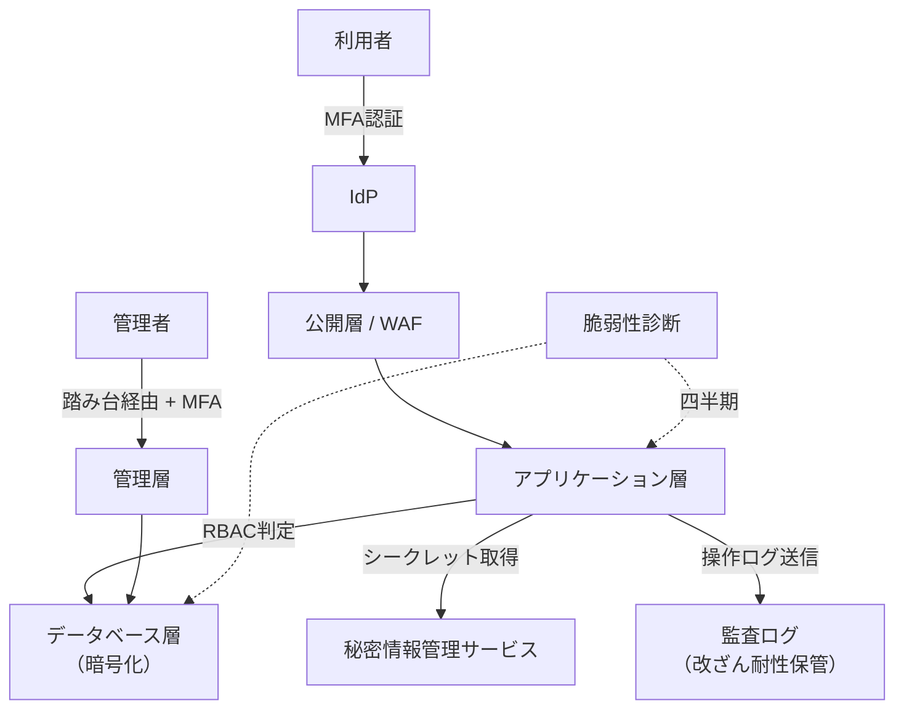

# 第9章 セキュリティ設計

## 1. 学習目標

本章を終えると、次ができる。

- 機密性、完全性、可用性の3要素でセキュリティ要件を分解できる
- 認証、認可、最小権限、職務分離、MFA、特権ID管理を、それぞれ独立した要件として書ける
- ネットワーク分離、暗号化、鍵管理、秘密情報管理を設計に落とし込める
- ログ監査、脆弱性管理、パッチ管理、マルウェア対策、インシデント対応を測定可能な要件にできる
- ゼロトラストの考え方を、状態要件（何を満たすか）として説明できる
- 法令・規制・社内規程を要件の根拠として参照し、検証方法まで設計できる
- 「十分なセキュリティを確保すること」を、複数の測定可能なNFRに分解できる

## 2. 基本概念

### 2.1 機密性、完全性、可用性

情報セキュリティの基本となる3つの属性である。

| 属性 | 定義 | 侵害された場合の例 |
|------|------|--------------------|
| **機密性**（Confidentiality） | 許可された者だけが情報にアクセスできる状態 | 個人情報の漏洩、権限外の閲覧 |
| **完全性**（Integrity） | 情報が正確であり、不正に改ざんされていない状態 | 取引金額の改ざん、ログの消去 |
| **可用性**（Availability） | 必要なときに情報やシステムを利用できる状態 | DDoS攻撃による停止、ランサムウェアによる暗号化 |

可用性は第3章・第6章とも重なるが、セキュリティ設計では「攻撃や不正操作による利用不能」という切り口を追加する。

**一般論**として、セキュリティ対策は機密性（漏洩対策）ばかりが注目されがちだが、完全性（改ざん対策）と可用性（攻撃耐性）も同じ重みで扱う必要がある。

### 2.2 認証と認可を分離して考える

**認証**（Authentication）は、利用者が「誰であるか」を確認する仕組みである。

**認可**（Authorization）は、認証された利用者が「何をしてよいか」を制御する仕組みである。

**必須事項**：認証成功は認可成功を意味しない。この2つを同じ機構で済ませず、それぞれ独立して検証する。

**例示**：社内IdPでログインできた（認証成功）としても、特定の個人情報画面を閲覧してよいかは、別途権限マスタで判定する必要がある。

認証だけを強化し、認可の設計（誰が何をできるか）を後回しにすると、ログインさえできれば何でも見えるシステムになりかねない。

### 2.3 最小権限と職務分離

**最小権限の原則**は、利用者や処理主体（サービスアカウント等）に対して、業務遂行に必要な最小限の権限だけを付与する考え方である。

**職務分離**は、不正や誤操作を防ぐため、一連の業務の中で相反する役割（申請と承認、変更と監査など）を同一人物に兼務させない考え方である。

| 兼務させるべきでない役割の組み合わせ | 理由 |
|--------------------------------------|------|
| 申請者と承認者 | 自己承認による不正な決裁を防ぐ |
| 本番変更の実施者と、その変更の承認者 | 未承認変更の混入を防ぐ |
| システム管理者と、そのログを監査する者 | 不正操作の痕跡隠蔽を防ぐ |

**悪い例**：「管理者はすべての操作ができる」という設計は、日常業務に不要な権限まで集中させ、侵害時の被害範囲を最大化する。

**推奨事項**：管理者権限も、日常運用（監視、定型作業）と非常時対応（緊急変更）で権限を分け、常時付与する範囲を最小化する。

### 2.4 多要素認証（MFA）と特権ID管理

**多要素認証（MFA）**は、パスワードなどの知識要素に加え、所持要素（トークン、スマートフォン）や生体要素を組み合わせて認証強度を上げる仕組みである。

**推奨事項**：一般利用者にはリスクベースでMFAを適用し、特権操作を行うアカウントには例外なくMFAを必須化する。

**特権ID管理**は、管理者権限を持つアカウントのライフサイクル（発行、利用、変更、無効化）と、利用時の統制を扱う領域である。

特権ID管理で決めるべき事項は次のとおりである。

- 特権IDの発行申請と承認プロセス
- 利用期間の限定（常時付与ではなく、必要時のみ有効化する仕組み）
- パスワードや鍵のローテーション
- 利用時の操作ログの記録と保管
- 緊急時の例外アカウント（ブレイクグラス）の統制

**必須事項**：緊急時の例外アカウントは、事前登録された専用アカウントに限定し、利用後は定められた期限内に監査レビューを行う。

### 2.5 ネットワーク分離

**ネットワーク分離**は、システムを構成する各層（公開層、アプリケーション層、データベース層、管理層）の間で通信を制御し、侵害の影響範囲を限定する設計である。

| 層 | 役割 | アクセス制御の例 |
|----|------|-------------------|
| 公開層 | 外部からのアクセスを受け付ける | WAF、DDoS対策、TLS終端 |
| アプリケーション層 | 業務ロジックを実行する | 公開層からのみ許可、DB層への出口制限 |
| データベース層 | データを保持する | アプリケーション層からのみ許可、直接の外部公開を禁止 |
| 管理層 | 運用・保守のためのアクセス | 踏み台経由、VPN経由、MFA必須 |

**悪い例**：DBを公開ネットワークに直接配置し、アプリケーション側の認証だけで守ろうとする構成は、アプリケーションの脆弱性が即座にデータベース侵害へ直結する。

**推奨事項**：層ごとに通信を許可リストで制御し、不要な経路を全て遮断する。

### 2.6 暗号化と鍵管理

**暗号化**は、保存中（at rest）と転送中（in transit）の両方に適用する。

要件には、対象データ範囲と適用箇所を明記する。

「暗号化する」とだけ書くと、アルゴリズムの強度、適用範囲（全データか、機微情報のみか）、鍵の管理方法が定まらない。

**鍵管理**は、暗号鍵の生成、保管、利用、ローテーション、廃棄までのライフサイクルを管理する領域である。

鍵管理で決めるべき事項は次のとおりである。

- 鍵の生成方法（専用のキー管理サービスを使うか、自前で生成するか）
- 鍵へのアクセス権限（暗号化対象データへのアクセス権と分離する）
- ローテーション周期
- 鍵の複数拠点保管（第7章のバックアップ要件とも関連する）
- 鍵の廃棄手順（不要になった鍵を確実に削除する）

**必須事項**：暗号鍵をコードリポジトリや設定ファイルに直接書き込まない。

### 2.7 秘密情報管理

**秘密情報**は、データベース接続文字列、APIキー、証明書の秘密鍵など、漏洩すると不正アクセスに直結する情報である。

**悪い例**：秘密情報をソースコードやコンテナイメージに埋め込む。

**推奨事項**：秘密情報は専用の秘密情報管理サービスで一元管理し、アプリケーションは実行時に取得する。

アクセスログを記録し、誰がいつどの秘密情報を取得したかを追跡できるようにする。

### 2.8 ログ監査

**監査ログ**は、誰が、いつ、何を、どのように操作したかを記録するログである。

監査ログの設計で決めるべき事項は次のとおりである。

- 記録対象イベント（ログイン成功・失敗、権限変更、データの参照・更新・削除、管理操作）
- 保管期間（法令や社内規程による定めを確認する）
- 改ざん耐性（ログ自体の書き換えや削除を防ぐ仕組み）
- 閲覧権限（ログに個人情報が含まれる場合、閲覧できる者を制限する）

**悪い例**：ログは取得しているが、閲覧権限が広く、誰でも他人の操作履歴を検索できる状態。

これは、監査ログ自体が新たな機密性侵害の原因になりうる。

**推奨事項**：ログの取得、保管、閲覧のそれぞれについて、独立したアクセス制御を設計する。

### 2.9 脆弱性管理とパッチ管理

**脆弱性管理**は、システムに存在する既知の脆弱性を発見し、リスクに応じて是正する活動である。

**悪い例**：「脆弱性がないこと」という要件は、ゼロデイ脆弱性の存在を否定できない以上、測定不能かつ非現実的である。

**推奨事項**：脆弱性の深刻度別に、是正期限を定義する。

| 深刻度 | 定義の例 | 是正期限の例 |
|--------|----------|----------------|
| Critical（緊急） | 遠隔から認証不要で任意コード実行が可能 | 72時間以内 |
| High（高） | 高い権限昇格や重要データへの不正アクセスが可能 | 2週間以内 |
| Medium（中） | 限定的な条件下でのみ悪用可能 | 定例パッチ窓（月次） |
| Low（低） | 悪用の実現性が低い | 次回計画的メンテナンス時 |

上記の期限は例示であり、社内規程や契約上の要求に合わせて調整する。

**パッチ管理**は、脆弱性是正だけでなく、機能改善や不具合修正のためのパッチ適用全般を扱う。

パッチ管理で決めるべき事項は、適用前の検証範囲、適用失敗時のロールバック手順、適用結果の記録である（詳細は第10章の運用性設計と連携する）。

### 2.10 マルウェア対策

**マルウェア対策**は、サーバ、エンドポイント、ネットワークの各層で、不正なプログラムの侵入・実行・拡散を防ぐ活動である。

対象範囲を明確にする必要がある。

- サーバ（本番・開発・検証環境の別）
- 開発者端末や運用担当者端末
- ファイルアップロード機能を持つアプリケーションでの、アップロードファイルのスキャン

**推奨事項**：利用者がファイルをアップロードする機能がある場合、アップロード時点でのマルウェアスキャンを要件に含める。

### 2.11 インシデント対応

**インシデント対応**は、セキュリティ上の異常を検知してから、封じ込め、根絶、復旧、再発防止までの一連の活動である。

典型的なフェーズは次のとおりである。

**必須事項**：個人情報の漏洩が疑われる場合、法令や社内規程で定められた期限内に、監督機関や本人への通知を検討する体制を整える。

通知の要否や期限の法的判断は法務部門の責任範囲であるが、技術側は影響範囲の特定に必要なログや証跡を保全する責任を持つ。

### 2.12 ゼロトラストの考え方

**ゼロトラスト**は、「社内ネットワークの内側だから安全」という境界防御の前提を置かず、すべてのアクセスを都度検証し、最小権限を徹底し、継続的にリスクを評価する考え方である。

ゼロトラストは特定の製品名ではない。

**悪い例**：「ゼロトラストを導入すること」という要件は、状態を定義していないため、特定製品の購入で終わってしまう可能性がある。

ゼロトラストを要件化する例は次のとおりである。

- 管理アクセスであっても、社内ネットワークからのアクセスかどうかに関わらずMFAと端末状態確認を要求する
- サービス間通信（東西トラフィック）についても、境界内だからと信頼せず、認証と認可を適用する
- 付与する権限の有効期間を短くし、常時フル権限を保持させない

**推奨事項**：ゼロトラストを導入する場合も、認証、認可、ネットワーク制御、継続的評価の各要素に分解し、それぞれを測定可能な要件にする。

### 2.13 法令、規制、社内規程

セキュリティ要件の根拠として、適用される法令名、規制、社内規程の条項を要件文に残す。

**推奨事項**：要件の「根拠」欄には、可能な限り具体的な文書名と条項番号を記載する。

法解釈そのものは法務部門の責任であり、アーキテクトの役割は、法務・規程が求める内容を技術要件へ正確に落とし込み、実装可能性を検証することである。

**一般論**として、「法令を遵守すること」だけを要件にすると、何を満たせば遵守とみなされるかが技術者に伝わらない。

具体的な項目（保管期間、暗号化、アクセス制御、通知義務など）に分解して初めて、設計とテストが可能になる。

### 2.14 セキュリティ要件の検証方法の考え方

セキュリティ要件は、機能要件と異なり「起きないこと」を証明する性質を持つものが多く、検証の設計が難しい。

**推奨事項**：次の3種類の検証を組み合わせる。

1. **能動的検証**：権限マトリクス試験、脆弱性診断、ペネトレーションテストなど、意図的に攻撃・不正操作を試みて防げるかを確認する
2. **設定監査**：暗号化、ネットワーク制御、ログ設定などが、意図した状態になっているかを確認する
3. **継続的モニタリング**：ログ監査、異常検知など、運用中に継続して確認する仕組み

いずれか1種類だけでは不十分である。

設定監査だけでは、設定どおりに動作しているかの実効性までは確認できない。

能動的検証だけでは、日々の設定変更によるドリフト（意図しない状態変化）を見逃す。

## 3. 業務上の意味

本シナリオで扱うシステムは個人情報を扱う。

情報漏洩、不正閲覧、改ざんが発生した場合、損害賠償、行政対応、社会的信用の低下に直結する。

セキュリティ要件は、多くの場合、機能リリースよりも優先されるMust要件になりやすい。

**例示**：新機能のリリースが1週間遅れることと、個人情報漏洩が発生することは、事業への影響の桁が異なる。

セキュリティ投資は「攻撃を受けなければ効果が見えない」という性質上、経営層の理解を得にくいことがある。

**推奨事項**：セキュリティ要件の説明では、対策のコストだけでなく、対策を怠った場合に想定される損害額や規制対応コストを併せて示す。

## 4. ヒアリング質問

- 扱う個人情報の項目は何か。保管地域の制約や、海外委託の有無はあるか
- 必須の認証強度、MFAの適用対象範囲、特権ID管理の基準はどうなっているか
- 監査で必ず確認されるログの種類は何か。保管年数はどの程度か
- 脆弱性の是正期限は、深刻度別にどう定められているか
- インシデント発生時、報告すべき期限と宛先（社内、監督機関、本人）はどこか
- 本番データへの開発者アクセスは許容されるか。許容される場合の統制は何か
- 委託先（外部ベンダー）に対するセキュリティ要件の適用範囲はどこまでか
- 過去にセキュリティインシデントや監査指摘があった場合、その内容と是正状況はどうか

## 5. 要件例

### 要件例 NFR-SEC-001 認証・認可

- 要件ID：NFR-SEC-001
- 分類：セキュリティ（認証・認可）
- 対象：個人情報を扱う全画面およびAPI
- 業務上の目的：権限外の閲覧・更新を防ぎ、操作を追跡可能にする
- 前提条件：社内IdPによる認証を利用する。職務権限マスタが常に最新に維持されている
- 指標：未認証アクセスの成功件数、権限外操作の成功件数、特権操作へのMFA適用率、監査ログの記録率
- 目標値：未認証アクセスの成功件数0件、権限外操作の成功件数0件、特権操作のMFA適用率100%、対象イベントの監査ログ記録率100%
- 測定条件：本番相当の権限マトリクスを用いた試験環境。四半期ごとのログ抜取検査を含む
- 測定方法：自動化されたE2E試験、ログ検索、設定監査
- 合否判定：未認証アクセスが成功しないこと。権限外操作が拒否され、かつ拒否がログに記録されること。特権操作でMFA未実施のまま成功した件数が0件であること
- 例外条件：障害時の緊急アカウント（ブレイクグラス）は、事前登録されたアカウントに限定し、利用後24時間以内に監査レビューを実施する
- 実現方式：IdP連携、ロールベースアクセス制御（RBAC）、TLSによる通信保護、暗号化、監査ログの改ざん耐性のある保管
- 検証方法：権限マトリクス試験、脆弱性診断、設定レビュー、監査ログの定期抜取検査
- 根拠：個人情報保護に関する社内情報セキュリティ規程の認証・認可・監査条項に対応
- 関連要件：NFR-SEC-010（暗号化）、NFR-SEC-012（ログ監査）
- 未確定事項：外部委託者に適用する権限モデルの最終合意

### 要件例 NFR-SEC-010 保存時・転送時の暗号化と鍵管理

- 要件ID：NFR-SEC-010
- 分類：セキュリティ（暗号化・鍵管理）
- 対象：DB上の個人情報項目、バックアップデータ、外部連携時の通信経路
- 業務上の目的：情報が漏洩した場合でも、復号されない限り内容を読み取れない状態にする
- 前提条件：暗号鍵は専用の鍵管理サービスで管理し、暗号化対象データへのアクセス権限と分離する
- 指標：対象データの暗号化適用率、通信経路のTLS適用率、鍵ローテーションの実施状況
- 目標値：保存時暗号化の適用率100%、外部通信のTLS 1.2以上での接続率100%、鍵ローテーションを年1回以上または規程で定める頻度で実施
- 測定条件：本番環境設定の定期監査、サンプルデータでの復号確認試験
- 測定方法：設定監査ツールによる自動チェック、手動によるサンプル確認
- 合否判定：未暗号化の対象データが0件であること。ローテーション未実施の鍵が0件であること
- 例外条件：レガシー連携先が旧TLSバージョンにしか対応していない場合は、代替の補償策（IPアドレス制限等）を講じた上で例外として個別管理する
- 実現方式：透過的暗号化またはアプリケーション層暗号化、鍵管理サービスの利用、TLS終端の統一
- 検証方法：設定レビュー、リストア後の暗号状態確認（第7章の復旧テストと連携）、外部通信のプロトコル監査
- 根拠：社内情報セキュリティ規程における保存時暗号化・通信暗号化の条項
- 関連要件：NFR-SEC-001、NFR-BKP-001、NFR-BKP-003（秘密情報バックアップ）
- 未確定事項：レガシー連携先の対応期限

### 要件例 NFR-SEC-011 脆弱性管理とパッチ適用

- 要件ID：NFR-SEC-011
- 分類：セキュリティ（脆弱性・パッチ管理）
- 対象：本番稼働中のOS、ミドルウェア、アプリケーション依存ライブラリ
- 業務上の目的：既知の脆弱性を放置せず、悪用される前に是正する
- 前提条件：四半期ごとに脆弱性診断を実施する。CVSSスコアまたは同等の指標で深刻度を判定する
- 指標：深刻度別の是正リードタイム、未是正の重大脆弱性の残存件数
- 目標値：Critical（緊急）は検出から72時間以内、High（高）は2週間以内、Medium（中）は月次パッチ窓内に是正する。本番稼働中のCritical未是正件数を常時0件に維持する
- 測定条件：四半期の脆弱性診断結果、および緊急脆弱性情報（ベンダー公表等）に基づく臨時診断
- 測定方法：脆弱性管理台帳と是正記録の突合、診断ツールの再スキャン結果
- 合否判定：期限超過の残存Critical/High脆弱性が0件であること。超過が発生した場合は是正計画と受容承認の記録が残っていること
- 例外条件：業務影響が大きく即時パッチが困難な場合は、代替の緩和策（アクセス制限、WAFルール追加等）を暫定適用し、リスク受容記録を残した上で期限を延長できる
- 実現方式：脆弱性診断ツールの定期実行、パッチ管理台帳、緊急パッチ適用手順（第10章と連携）
- 検証方法：四半期診断、パッチ適用結果の監査、リスク受容記録のレビュー
- 根拠：脆弱性放置による侵害事例の増加と、社内規程における是正期限の定め
- 関連要件：NFR-SEC-001、NFR-OPS-002（パッチ運用）、NFR-SEC-013（インシデント対応）
- 未確定事項：ゼロデイ脆弱性発生時の緊急診断プロセスの最終合意

### 要件例 NFR-SEC-012 監査ログ

- 要件ID：NFR-SEC-012
- 分類：セキュリティ（ログ監査）
- 対象：認証イベント、権限変更、個人情報の参照・更新・削除、管理操作
- 業務上の目的：不正操作や事故発生時に、原因調査と説明責任を果たせるようにする
- 前提条件：ログには個人情報の一部（アクセス対象者ID等）が含まれるため、閲覧権限を限定する
- 指標：対象イベントのログ記録率、ログの改ざん検知能力、閲覧権限の適正性
- 目標値：対象イベントの記録率100%。ログ保管期間は社内規程に基づき1年以上（個人情報関連は3年）。ログへの不正な書き換え・削除の試行を100%検知する
- 測定条件：四半期ごとのログサンプル抜取検査、改ざん試行試験
- 測定方法：ログ管理システムの設定監査、改ざん試行試験の実施記録
- 合否判定：対象イベントの記録漏れが0件であること。改ざん試行が検知され、かつ実際の改ざんが成立しないこと
- 例外条件：性能影響が大きい高頻度イベント（参照系の一部）は、サンプリング記録に代える場合があり、対象は個別に承認する
- 実現方式：改ざん耐性のあるログストレージへの転送、閲覧権限の分離、ログ保管期間のライフサイクル管理
- 検証方法：ログ抜取検査、改ざん試行試験、閲覧権限の棚卸し
- 根拠：社内情報セキュリティ規程の監査ログ条項、個人情報保護関連の保管期間要求
- 関連要件：NFR-SEC-001、NFR-SEC-013
- 未確定事項：高頻度イベントのサンプリング対象範囲の最終決定

### 要件例 NFR-SEC-013 インシデント対応

- 要件ID：NFR-SEC-013
- 分類：セキュリティ（インシデント対応）
- 対象：本番システム全体
- 業務上の目的：セキュリティインシデント発生時に、影響範囲を早期に特定し、被害拡大を防ぐ
- 前提条件：インシデント対応体制（第10章の運用体制と連携）が整備されていること
- 指標：検知から初動対応までの時間、封じ込めまでの時間、報告期限の遵守率
- 目標値：重大インシデントの検知から初動対応着手まで30分以内。封じ込め（アクセス遮断等）まで2時間以内。法令・規程で定める報告期限の遵守率100%
- 測定条件：年1回のインシデント対応訓練、および実インシデント発生時の記録
- 測定方法：インシデント管理チケットの時刻記録、訓練記録
- 合否判定：目標時間内の初動対応が行われること。報告期限の未達が0件であること
- 例外条件：フォレンジック調査のために一時的に証跡保全を優先し、復旧を遅らせる判断は、事前に定めた基準に従って実施する
- 実現方式：インシデント対応手順（Runbook）、証跡保全手順、法務・広報との連携フロー
- 検証方法：年1回のインシデント対応訓練、訓練結果に基づく手順の見直し
- 根拠：個人情報保護法制における漏洩時の報告義務、社内規程のインシデント対応条項
- 関連要件：NFR-SEC-012、NFR-DR-002（ランサムウェアシナリオ）、NFR-OPS-001
- 未確定事項：本人通知の要否判断基準の法務部門との最終合意

## 6. 悪い要件例

次は要件として不合格である。

1. 「十分なセキュリティを確保すること」
2. 「ゼロトラストを導入すること」
3. 「脆弱性がないこと」
4. 「不正アクセスを防ぐこと」
5. 「個人情報を厳重に管理すること」

不合格理由は共通している。

対象、指標、目標値、測定方法、合否判定のいずれかが欠けている。

例3は、ゼロデイ脆弱性の存在を否定できない以上、達成不可能な要求になっている。

例2は、状態ではなく製品導入や方針表明で終わっており、認証・認可・ネットワーク制御・継続評価のどれを、どの水準で満たすかが定義されていない。

## 7. 改善後の要件例

### 悪い例1の改善：「十分なセキュリティを確保すること」

「十分」を、認証・認可（NFR-SEC-001）、暗号化・鍵管理（NFR-SEC-010）、脆弱性・パッチ管理（NFR-SEC-011）、ログ監査（NFR-SEC-012）、インシデント対応（NFR-SEC-013）という、複数の独立した測定可能な要件へ分解する。

「セキュリティ」という単一の言葉を1つの要件にまとめようとすること自体が、曖昧さの原因である。

### 悪い例2の改善：「ゼロトラストを導入すること」

- 要件ID：NFR-SEC-020
- 分類：セキュリティ（ゼロトラスト）
- 対象：管理アクセスおよびサービス間通信（東西トラフィック）
- 業務上の目的：境界内アクセスであることを理由に検証を省略しない状態を実現する
- 前提条件：現状は社内ネットワークからの管理アクセスがIPアドレス制限のみで許可されている
- 指標：管理アクセスにおけるMFA適用率、端末状態確認の適用率、サービス間通信における認証適用率
- 目標値：管理アクセスのMFA適用率100%（社内・社外を問わない）。管理端末の状態確認（OS更新状況等）適用率100%。サービス間通信の認証適用率100%
- 測定条件：本番環境の設定監査、管理アクセスログのサンプル確認
- 測定方法：IdP設定監査、端末管理システムのポリシー適用状況確認、サービスメッシュまたは同等機構の設定確認
- 合否判定：MFA未適用のまま成功した管理アクセスが0件であること。認証なしで成立したサービス間通信が0件であること
- 例外条件：レガシーシステムとの連携で認証機構が未対応の場合は、ネットワークレベルの補償策を講じ、個別に期限付きで承認する
- 実現方式：IdPによるMFA必須化、端末管理システムとの連携、サービスメッシュまたは相互TLSによるサービス間認証
- 検証方法：設定監査、管理アクセスログレビュー、レガシー連携の棚卸し
- 根拠：境界内アクセスを前提とした従来の設計が、内部関係者による不正や、侵入後の水平展開に弱いという分析結果
- 関連要件：NFR-SEC-001、NFR-SEC-004（特権ID管理）
- 未確定事項：レガシー連携の移行期限

「ゼロトラットを導入する」という方針表明を、管理アクセスとサービス間通信という具体的な対象、MFA適用率や認証適用率という測定可能な指標へ分解した。

### 悪い例3の改善：「脆弱性がないこと」

NFR-SEC-011（5節）が改善例である。

「脆弱性ゼロ」という達成不可能な目標を、深刻度別の是正期限と、常時0件を維持する対象を「本番稼働中のCritical」に限定する形に置き換えた。

### 悪い例4・5の改善：「不正アクセスを防ぐこと」「個人情報を厳重に管理すること」

いずれも、NFR-SEC-001（認証・認可）とNFR-SEC-010（暗号化・鍵管理）へ接続する。

「防ぐ」「厳重に」という動詞・副詞を、成功件数0件、適用率100%という測定可能な指標に置き換えた点が共通の改善パターンである。

## 8. 設計への落とし込み

セキュリティ設計書に落とし込む項目の例は次のとおりである。

| 項目 | 内容 |
|------|------|
| ネットワーク構成図 | 公開層、AP層、DB層、管理層の分離と許可通信 |
| 認証・認可方式 | IdP連携方式、RBACの権限マトリクス |
| 暗号化・鍵管理方式 | 対象データ、アルゴリズム、鍵管理サービス |
| 秘密情報管理方式 | 秘密情報管理サービス、アクセスログ |
| ログ設計 | 記録対象イベント、保管期間、閲覧権限 |
| 脆弱性・パッチ運用 | 診断頻度、是正期限、緊急パッチ手順 |
| インシデント対応体制 | 検知、封じ込め、報告フロー、連携部門 |

**採用**：公開層はHTTPS終端とWAFを配置し、アプリケーション層・データベース層は私有ネットワークに配置する構成。

**不採用**：データベースを公開ネットワークに配置し、アプリケーション側の認証のみで保護する構成。

**理由**：層ごとの分離により、アプリケーションの脆弱性が直接データベース侵害に至る経路を遮断できる。

**残存リスク**：アプリケーション層自体の脆弱性、設定ドリフト（意図しない設定変更）、新規追加リソースへの診断漏れが残る。定期的な設定監査と脆弱性診断で緩和する。

## 9. 代替案

| 方式 | 向く条件 | 向かない条件 |
|------|----------|--------------|
| 境界防御中心（従来型） | 短期的な構築、社内利用のみに限定されるシステム | 内部関係者による不正や、侵入後の水平展開への耐性が必要な場合 |
| IdP中心の強化＋段階的な東西制御 | 個人情報を扱う本番システムで、段階的にゼロトラスト化したい | 即座に全面的なゼロトラスト移行が求められる場合 |
| 高機密データを別システムへ隔離 | 一部の機微データのみ極めて高い保護レベルが必要 | システム全体が同等に機微な情報を扱う場合 |

## 10. トレードオフ

| 対立 | 一方を優先すると | 他方に起きること |
|------|------------------|------------------|
| セキュリティ強度 vs 利便性 | MFAやアクセス制限を強化する | 操作手順が増え、利用者の負担が増える |
| 詳細なログ vs 個人情報の過剰取得 | ログの記録範囲を広げる | ログ自体が新たな機微情報となり、保護対象が増える |
| 迅速なパッチ適用 vs 回帰リスク | 適用スピードを優先する | 検証不足による新たな不具合混入のリスクが増える |
| 厳格な遮断 vs 障害時の緊急アクセス | 通常時のアクセス制御を厳格にする | 障害対応時の迅速な対応が妨げられ、ブレイクグラス設計が必要になる |
| 監査ログの保管期間延長 vs コスト | 保管期間を延ばす | ストレージコストと管理対象の増大 |

## 11. 検証方法

- 権限マトリクス試験（意図しない権限で操作が成立しないことの確認）
- セッション固定、認可回避などを狙ったセキュリティ試験
- 脆弱性診断、必要に応じたペネトレーションテスト
- 設定監査（ネットワーク公開範囲、暗号化設定、ログ設定）
- パッチ適用の遵守率に関する定期報告
- インシデント対応の机上訓練・実技訓練
- ログ改ざん試行試験

## 12. よくある失敗

1. 「セキュアであること」という表現で要件を終わらせる
2. 認証だけを強化し、認可の設計を後回しにする
3. 暗号鍵をコードや設定ファイルと一緒に保管する
4. 監査ログは取得しているが、閲覧権限が広すぎる
5. 脆弱性診断の結果を残したまま本番リリースする
6. 緊急時の例外アカウントが、緊急対応後も無効化されず永続的に残る
7. ゼロトラストを製品導入だけの取り組みだと誤解する
8. インシデント対応の訓練を一度も実施しない

## 13. レビュー観点

- [ ] 機密性・完全性・可用性の観点で要件が分解されているか
- [ ] 認証と認可が別々の要件として定義されているか
- [ ] 暗号化と鍵管理が対象範囲を明示して定義されているか
- [ ] 監査ログの記録対象、保管期間、閲覧権限が定義されているか
- [ ] 脆弱性の深刻度別の是正期限が定義されているか
- [ ] インシデント対応の初動時間と報告期限が定義されているか
- [ ] ゼロトラストの要素が状態要件（適用率、成功件数等）に分解されているか
- [ ] 法令・規程の参照が要件の根拠として明記されているか
- [ ] 検証方法が能動的検証・設定監査・継続的モニタリングを含んでいるか

## 14. 章末問題

### 問題1

「管理者はすべての操作ができる」という権限設計の問題点を、最小権限の原則と職務分離の観点からそれぞれ指摘せよ。

### 問題2

「ゼロトラストを導入すること」を要件にした場合の欠点を述べ、測定可能な形に直せ。

### 問題3

個人情報を含む監査ログの保管要件で、確認すべき項目を4つ挙げよ。

### 問題4

「脆弱性がないこと」という要件がなぜ不合格なのか説明し、改善案を示せ。

## 15. 解答と解説

### 問題1

最小権限の観点では、日常運用に不要な権限まで常時集中しており、そのアカウントが侵害された場合の被害範囲が最大化される。

職務分離の観点では、変更の実施と承認、操作と監査が同一人物に集中すると、不正や誤操作の検知が働きにくくなる。

### 問題2

欠点は、アーキテクチャ上の考え方（境界を信頼しない）が、特定製品の導入という行為にすり替わってしまい、認証強度、権限の有効期間、ネットワークセグメント、継続的な評価といった状態要件が定義されないまま終わることである。

改善案は、本章7節のNFR-SEC-020のように、管理アクセスのMFA適用率、サービス間通信の認証適用率など、測定可能な指標に分解することである。

### 問題3

例：保管期間、暗号化の有無、アクセス権限の範囲、改ざん防止の仕組み、個人情報のマスキング有無、国外への転送有無。

### 問題4

ゼロデイ脆弱性の存在は事前に否定できないため、「脆弱性がないこと」は原理的に証明不可能であり、達成できたかどうかを判定する基準も存在しない。

改善案は、深刻度別の是正期限（Criticalは72時間以内等）を定義し、「期限内に是正されていない重大脆弱性が0件であること」という、期限内対応の有無を判定基準とする形に置き換えることである。

## 16. 実務演習

実務シナリオ（従業員5,000人のWeb業務システム、個人情報を扱う）を題材に、次を作成せよ。

1. 認証・認可、暗号化、脆弱性管理、ログ監査、インシデント対応の5領域について、それぞれ標準形式の要件を1件ずつ、合計5件作成する
2. 各要件について、能動的検証・設定監査・継続的モニタリングのうちどれを使うかを1行で示す
3. ゼロトラストの考え方を適用する対象を1つ選び、測定可能な要件に分解する
4. 「十分なセキュリティを確保すること」という発言を業務部門から受けたと仮定し、それを分解する過程を3ステップで示す
5. 残った未確定事項を課題一覧の形で3件作る

---

## 次章予告

第10章では運用性設計を扱う。
監視、Runbook、障害対応体制、夜間・休日対応、属人化防止を、測定可能な運用要件に落とし込む。
