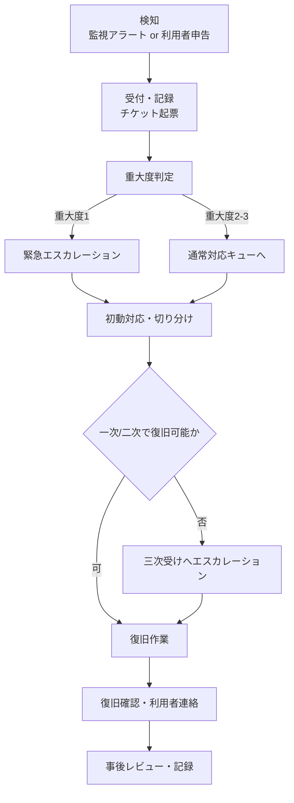
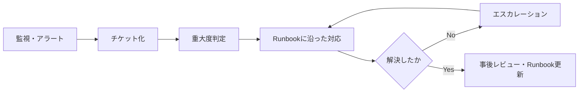

# 第10章 運用性設計

## 1. 学習目標

本章を終えると、次ができる。

- 運用時間、運用体制、運用負荷を前提にした運用性要件を定義できる
- 監視、アラート、ログ、ジョブ、バックアップ、パッチ、アカウント管理、構成管理を運用設計に対応付けられる
- 問い合わせ対応、障害対応、エスカレーションのプロセスを重大度別に設計できる
- 定型作業を洗い出し、自動化とRunbook整備の優先順位を判断できる
- 夜間・休日対応と属人化防止を、測定可能な要件として書ける

## 2. 基本概念

### 2.1 運用性の定義と範囲

**運用性**は、本番稼働後のシステムを、日々安定して動かし続けるための、人・手順・道具の整備度合いである。

構築時にどれほど高性能で高可用な構成を作っても、運用性が低ければその価値は維持できない。
監視が無ければ障害に気付けず、Runbookが無ければ復旧が担当者の記憶に依存し、体制が無ければ夜間の障害は翌朝まで放置される。

運用性は次の要素で構成される。

- 運用時間と運用体制
- 監視、アラート、ログ
- ジョブ、バックアップ、パッチ
- アカウント管理、構成管理
- 問い合わせ対応、障害対応、エスカレーション
- 定型作業、自動化
- 運用手順書、Runbook
- 運用負荷、夜間・休日対応
- 属人化防止

これらは独立ではない。
監視が不十分だと障害対応が後手に回り、Runbookが無いと障害対応の属人化が進み、属人化すると運用負荷が特定の担当者に偏る。

**一般論**として、運用性は「作った後で考えるもの」と誤解されやすい。
実際には、監視項目や運用手順は設計段階で決めるべき仕様であり、構築完了後に後付けするものではない。

### 2.2 運用時間と運用体制

**運用時間**は、システムを利用可能にしておく時間帯であり、可用性要件（第3章）と連動する。

**運用体制**は、運用時間中に誰がどの役割を担うかの取り決めである。
典型的には次の階層で構成する。

| 階層 | 役割 | 対応内容の例 |
|------|------|--------------|
| 一次受け | 監視アラートやユーザー問い合わせの最初の受付 | 事象確認、切り分けの初動、既知障害の一次対応 |
| 二次受け | 一次で解決しない事象の技術対応 | ログ調査、既知手順による復旧、構成変更 |
| 三次受け | アプリやインフラの設計知識が必要な対応 | 原因解析、恒久対策、ベンダーエスカレーション |
| 決裁者 | 業務影響の大きい判断 | 計画外停止の継続可否、DR起動、対外説明の可否 |

一次受けは、社内運用チームのこともあれば、監視サービスやSOC（Security Operation Center）相当の外部委託であることもある。
委託する場合は、権限範囲、エスカレーション条件、SLAを契約で明示する。

**推奨事項**：体制表には氏名ではなく役割とローテーションを記載し、個人名依存を避ける。

### 2.3 監視・アラート・ログの運用への組み込み

監視の設計自体は第11章で扱うが、運用性の観点では「誰が、いつ、何をするか」までを設計する必要がある。

監視は次の運用プロセスと接続して初めて機能する。

1. アラート発報
2. 一次受けの確認と初動
3. 重大度判定
4. 必要に応じたエスカレーション
5. 復旧作業
6. 事後記録とレビュー

アラートを受け取る仕組みがあっても、対応する人と手順が無ければ、監視は「記録」で終わり「対応」にならない。

ログについても同様である。
障害調査に使えるログの保管期間、検索手段、閲覧権限を運用設計として決めておかないと、障害発生時に「ログはあるが誰も見られない」状態になる。

### 2.4 ジョブ運用とバッチ管理

**ジョブ**は、定期的または条件に応じて実行される処理単位である。
夜間バッチ、日次集計、月次締め処理、外部連携ファイル転送などが該当する。

ジョブ運用で決めるべき事項は次である。

- 実行時刻、実行順序、依存関係
- 異常終了時の通知先と初動
- リトライ方針（自動リトライの回数、間隔、上限）
- 手動再実行の手順と承認者
- ジョブ完了の確認方法（完了ログ、後続処理への引き渡し）
- 遅延時の業務影響とエスカレーション基準

**必須事項**：本番の重要ジョブは、実行結果の成功・失敗を人手で毎回確認する運用ではなく、自動検知と自動通知を前提とする。

自動リトライを無制限に許可すると、原因を解消しないまま同じ失敗を繰り返し、後続ジョブの遅延やリソース枯渇を招くことがある。
**推奨事項**：自動リトライは上限回数を定め、上限到達後は人手による判断に切り替える。

### 2.5 バックアップ運用とパッチ運用

バックアップの設計（対象、方式、保持期間）は第7章で扱うが、運用性の観点では、取得の失敗検知と復元手順の維持が重要になる。

**推奨事項**：バックアップ取得の成否を毎回自動監視し、失敗を検知したら復旧可能性が失われる前にリトライまたはエスカレーションする。

パッチ運用では、次を運用手順として決める。

- 重大度別の適用期限（例：緊急脆弱性は72時間以内、通常は月次窓）
- 適用前の検証環境での確認範囲
- 適用失敗時のロールバック手順
- 適用結果の記録と監査対応

パッチ適用の遅延は、脆弱性放置というセキュリティリスクに直結する。
運用性要件とセキュリティ要件（第9章）は、パッチ運用において強く連携する。

### 2.6 アカウント管理と構成管理

**アカウント管理**は、利用者アカウントと管理者アカウントのライフサイクル（発行、変更、無効化）を扱う運用領域である。

退職や異動が発生してもアカウントが放置されると、不要な権限が残り、セキュリティリスクと監査指摘の原因になる。
**必須事項**：退職・異動後、定められた期限内にアカウントを無効化または権限変更する。

**構成管理**は、本番環境の構成情報（サーバ、ネットワーク、設定値、バージョン）を正確に維持する運用領域である。
構成管理台帳やIaC（第12章で詳述）と実環境が乖離すると、障害対応や監査で誤った前提に基づく判断をしてしまう。

### 2.7 問い合わせ対応と障害対応のプロセス

**問い合わせ対応**は、利用者からの操作方法や不具合報告を受け付け、回答または障害対応へつなぐプロセスである。

**障害対応**は、システムの異常を検知してから復旧までの一連の活動である。
典型的なフローは次のとおりである。



重大度は、業務影響の大きさに応じて事前に定義しておく。

| 重大度 | 定義例 | 初動目標時間の例 |
|--------|--------|------------------|
| 1（緊急） | 業務全体または主要機能が停止 | 15分以内 |
| 2（重大） | 一部機能が停止、代替手段あり | 1時間以内 |
| 3（軽微） | 影響が限定的、業務継続可能 | 当日中 |
| 4（問い合わせ） | 障害ではない照会 | 翌営業日以内 |

数値は例示であり、業務影響分析（第2章）の結果に応じて調整する。

### 2.8 エスカレーション設計

**エスカレーション**は、対応者の権限や知識で解決できない、または時間内に解決できない事象を、上位の役割へ引き継ぐ仕組みである。

エスカレーションが機能しない典型的な原因は次である。

- 誰が上位者かが明文化されていない
- 上位者の連絡先が古い、または夜間に更新されない
- エスカレーションの基準時間が定義されていない
- 上位者への連絡自体が一次受け担当者の裁量に委ねられ、遠慮して連絡が遅れる

**推奨事項**：エスカレーションは「時間経過による自動エスカレーション」と「重大度による即時エスカレーション」の両方を持つ。
一次受け担当者の判断だけに委ねない。

### 2.9 定型作業の洗い出しと自動化

**定型作業**は、手順が決まっており、繰り返し発生する運用作業である。
アカウント発行、証明書更新、日次レポート作成、リソース拡張の一次対応などが該当する。

定型作業は、自動化の第一候補である。
ただし、すべてを自動化することが常に正しいわけではない。

自動化を判断する観点は次である。

- 発生頻度（頻度が高いほど自動化の効果が大きい）
- 手順の一意性（分岐が多い作業は自動化コストが高い）
- 誤操作時の影響度（影響が大きい作業は自動化の検証コストも高くなる）
- 変更頻度（手順自体が頻繁に変わる作業は自動化の保守コストが増える）

**推奨事項**：発生頻度が高く、手順が一意で、誤操作影響が中程度までの作業から自動化する。
影響が極めて大きい作業（本番データ削除を伴う操作など）は、自動化しても承認ステップを残す。

### 2.10 運用手順書とRunbook

**運用手順書**は、平常時の定型作業や運用プロセス全般を記述した文書である。

**Runbook**は、特定の事象（障害、変更、復旧）に対して、判断分岐を含む実行手順を記述した文書である。
一般的な運用手順書より粒度が細かく、緊急時にその場で参照して実行できることを目的とする。

Runbookに含めるべき項目は次である。

- 対象事象（トリガーとなる症状やアラート）
- 前提確認（実施前に確認すべき状態）
- 実行手順（コマンド、操作画面、確認ポイント）
- 判断分岐（症状ごとの分岐先）
- 戻し手順（実施後に問題が起きた場合の切り戻し）
- 連絡先、エスカレーション条件
- 最終更新日と検証実績

**必須事項**：本番に影響しうる重要作業のRunbookは、作成者以外がレビューし、内容の正確性を確認する。

Runbookは作りっぱなしでは劣化する。
構成変更や手順変更のたびに更新しないと、障害時に「手順どおりにやったが失敗した」という事態を招く。

### 2.11 運用負荷の見積もりと管理

**運用負荷**は、定型作業、問い合わせ対応、障害対応、変更対応などにかかる工数の総量である。

運用負荷を見積もらずに体制を組むと、次のいずれかが起きる。

- 慢性的な残業や休日対応で担当者が疲弊する
- 定型作業が後回しになり、構成管理やパッチ適用が遅延する
- 障害対応に人員を割けず、復旧が遅れる

**推奨事項**：運用負荷は、定型作業の件数×平均所要時間、問い合わせ件数の実績、過去の障害対応時間の実績から見積もり、体制人数の根拠とする。

運用負荷の数値例は「5. 要件例」で示す。

### 2.12 夜間・休日対応の設計

夜間・休日は日中に比べて人員が薄く、判断できる人が限られる。
そのため、夜間・休日に許容する対応範囲を事前に決めておく必要がある。

決めるべき事項は次である。

- 夜間・休日に実施してよい変更の種類（緊急パッチのみ、等）
- オンコール対象者と呼び出し方法
- オンコール応答の目標時間
- 判断できない事象が発生した場合の翌営業日回しの基準
- オンコール対応の代休や手当などの労務上の取り扱い

**必須事項**：オンコール対応の労務上の扱いは、運用設計とは別に、労務管理部門と合意する。
技術設計だけで決めてはならない。

### 2.13 属人化防止

**属人化**は、特定の作業や知識が特定の担当者に依存し、その担当者がいないと業務が回らない状態である。

属人化の兆候は次である。

- Runbookが存在せず、担当者の頭の中にしか手順が無い
- 特定の担当者の休暇中、変更や障害対応が止まる
- 引き継ぎ資料が形骸化しており、実態と合っていない

属人化防止の実務手段は次である。

1. 重要作業について、実施者と別のレビュー担当者を必須にする
2. 定期的に、担当を入れ替えて手順を実行させる（訓練を兼ねる）
3. 休暇・異動・退職の前に、引き継ぎチェックリストの完了を必須にする
4. Runbookの最終更新日と実施実績を可視化し、放置を検知する

**推奨事項**：属人化防止は「その人が居なくなったら」ではなく、平常時から定期的に検証する。
退職が決まってからの引き継ぎでは、時間が足りないことが多い。

## 3. 業務上の意味

可用性要件で「月次稼働率99.9%」を定義しても、それを支えるのは最終的に運用の人と手順である。

障害発生から復旧完了までの時間は、次の要素の合計で決まる。

```text
復旧時間 = 検知時間 + 初動着手までの時間 + 切り分け時間 + 対応実施時間 + 確認時間
```

技術的な復旧作業（対応実施時間）だけを短縮しても、検知や初動着手が遅ければ、全体の復旧時間は短くならない。
運用性が低いと、可用性SLOは「達成できるはずの数値」ではなく「机上の数値」に留まる。

問い合わせ対応の質も業務に直結する。
利用者からの問い合わせに何日も回答が無ければ、業務側はシステムを信頼しなくなり、非公式な回避策（Excel運用の復活など）に流れることがある。

属人化は、平常時には見えにくいリスクである。
担当者が急病や退職で不在になった瞬間に、運用が止まるという形で顕在化する。

## 4. ヒアリング質問

運用体制について。

- 一次受け、二次受け、三次受け、決裁者の役割分担と連絡網は何か
- 監視やインシデント対応を外部委託している範囲はどこまでか
- 夜間・休日のオンコール対象者は誰で、何人体制か

運用作業について。

- 月間の定型作業量はどの程度で、そのうち自動化できていないものは何か
- 重要ジョブの異常終了時、誰が何分以内に気付く想定か
- アカウントの棚卸しや無効化は、どの頻度で誰が実施しているか

障害対応について。

- 重大度の定義と、重大度別の初動目標時間は決まっているか
- Runbookが無い作業で、本番に影響しうるものは何か
- 過去1年で最も長く復旧に時間がかかった障害の原因は何か

運用負荷と属人化について。

- 属人化していると自覚しているジョブや障害対応は何か
- 直近の運用受入で不合格となった条件は何か
- 運用担当者の月あたりの夜間呼び出し回数の実績はどの程度か

## 5. 要件例

### 要件例 NFR-OPS-001 障害初動とエスカレーション

- 要件ID：NFR-OPS-001
- 分類：運用性（障害対応）
- 対象：本番システムの運用業務一式
- 業務上の目的：障害時に役割が混乱せず、速やかに復旧作業へ着手できるようにする
- 前提条件：24時間の一次監視あり。社内運用は平日日中対応、夜間・休日はオンコール体制
- 指標：重大度1アラートの初動着手時間、Runbookカバー率、オンコール応答時間
- 目標値：重大度1の初動着手を15分以内。本番影響しうる重要定型作業のRunbookカバー率100%。オンコール電話応答を10分以内
- 測定条件：四半期ごとの障害対応訓練、および実インシデントの実績
- 測定方法：インシデント管理チケットの時刻記録、訓練記録、Runbook一覧と実作業の突合
- 合否判定：目標未達が連続2四半期続かないこと。重大度1で初動超過が発生した場合は個別に是正報告を必須とする
- 例外条件：社内外の通信が途絶した場合は、代替連絡手段（電話網など）での到達時間を別指標として扱う
- 実現方式：体制表、エスカレーション表、Runbook整備、監視アラートの自動チケット化
- 検証方法：運用受入試験、四半期の障害対応訓練
- 根拠：可用性要件NFR-AVL-001の月次稼働率99.9%を、運用面から支えるために初動15分を設定
- 関連要件：NFR-AVL-001、NFR-MON-001
- 未確定事項：監視の一次受けを外部委託する場合の契約上のSLA最終値

### 要件例 NFR-OPS-002 定型作業の自動化と属人化防止

- 要件ID：NFR-OPS-002
- 分類：運用性（定型作業・属人化防止）
- 対象：月次で発生する定型運用作業（アカウント管理、証明書更新、バックアップ確認、定期レポート作成を含む）
- 業務上の目的：担当者の不在によって定型作業が停止しないようにする
- 前提条件：定型作業一覧が運用設計書として整備されていること
- 指標：定型作業の自動化率、Runbook整備率、属人化リスク作業の件数（実施者が1名しかいない作業の件数）
- 目標値：発生頻度が月2回以上の定型作業について、自動化率60%以上。全定型作業のRunbook整備率100%。属人化リスク作業を0件にする
- 測定条件：半期ごとの運用作業棚卸し
- 測定方法：定型作業一覧と自動化実装、Runbook保有状況、実施者記録の突合
- 合否判定：属人化リスク作業が1件でも残る場合は是正計画の提出を必須とする
- 例外条件：セキュリティ上の理由で複数名への権限付与ができない特権作業は、承認者を含む二名体制での実施記録をもって代替とする
- 実現方式：自動化スクリプトまたはジョブ化、Runbook整備、定期的な担当ローテーション訓練
- 検証方法：棚卸しレビュー、ローテーション訓練の実施記録確認
- 根拠：過去の退職時に、引き継ぎ不足でパッチ適用手順が一時不明になった事例への対策
- 関連要件：NFR-OPS-001、NFR-MNTN-001
- 未確定事項：自動化対象の優先順位付け基準の最終合意

### 要件例 NFR-OPS-003 運用負荷とオンコール上限

- 要件ID：NFR-OPS-003
- 分類：運用性（運用負荷）
- 対象：本番運用に従事する運用チーム
- 業務上の目的：運用担当者の疲弊による品質低下と離職を防ぐ
- 前提条件：オンコール対象者は輪番制。月次でオンコール回数を集計する
- 指標：オンコール担当者一人あたりの月間呼び出し回数、深夜（0時〜6時）呼び出し回数
- 目標値：一人あたり月間呼び出し10回以内、うち深夜呼び出し3回以内。超過が2か月連続した場合は原因分析と対策を必須とする
- 測定条件：オンコール実施記録の月次集計
- 測定方法：インシデント管理システムのオンコール記録集計
- 合否判定：目標超過の有無、および超過時の是正計画の有無
- 例外条件：大規模障害やDR訓練など、単発の突発対応は集計から除外し別途記録する
- 実現方式：アラート閾値の見直し、行動不能アラートの削減（第11章参照）、輪番人数の拡大
- 検証方法：月次オンコール記録レビュー、運用担当者へのヒアリング
- 根拠：オンコール負荷の偏りが、過去に退職理由として複数回挙がったことへの対策
- 関連要件：NFR-OPS-001、NFR-MON-001
- 未確定事項：輪番人数拡大に伴う要員計画の予算確保

## 6. 悪い要件例

1. 「運用しやすいこと」
2. 「マニュアルを整備すること」
3. 「属人化しないこと」
4. 「24時間365日の運用体制を敷くこと」
5. 「アラートを見逃さないこと」

不合格の理由は共通している。
対象作業、測定指標、目標値、測定方法、合否判定のいずれかが欠けている。
加えて、例4は体制の目的（何のために24時間必要か）と、その費用対効果が示されていない。

## 7. 改善後の要件例

### 悪い例1・2の改善：「運用しやすいこと」「マニュアルを整備すること」

NFR-OPS-002へ分解する。
自動化率、Runbook整備率という測定可能な指標に置き換えた。

### 悪い例3の改善：「属人化しないこと」

NFR-OPS-002の属人化リスク作業件数へ分解する。
「実施者が1名しかいない作業の件数」という具体的な数え方を示した点が改善の要点である。

### 悪い例4の改善：「24時間365日の運用体制を敷くこと」

- 要件ID：NFR-OPS-010
- 分類：運用性（体制）
- 対象：本番システムの一次監視受付
- 業務上の目的：夜間・休日の重大障害を検知し、初動対応につなげる
- 前提条件：夜間・休日は最小人員体制とし、対応範囲を重大度1・2に限定する
- 指標：一次受け対応の時間帯カバー率
- 目標値：24時間365日、重大度1・2アラートに対して一次受け対応が可能な状態を100%維持する
- 測定条件：シフト表と実勤務記録の突合
- 測定方法：勤怠記録、オンコール記録
- 合否判定：カバーできない時間帯が発生していないこと
- 例外条件：計画停止時間帯は対象外とする
- 実現方式：日勤・夜勤シフト、または監視委託先との時間帯分担
- 検証方法：シフト運用の月次監査
- 根拠：可用性要件が夜間バッチの完了も含むため
- 関連要件：NFR-OPS-001、NFR-AVL-001
- 未確定事項：休日昼間の体制人数

「24時間365日体制」を漠然と求めるのではなく、対応範囲（重大度）とカバー率という測定可能な形にした。

### 悪い例5の改善：「アラートを見逃さないこと」

第11章のNFR-MON-001（監視カバー率、行動不能アラート数）へ接続する。
運用性の観点では、見逃し防止は監視設計と一次受け体制の両輪で扱う。

## 8. 設計への落とし込み

運用設計書に落とし込む項目の例は次のとおりである。

| 項目 | 内容 |
|------|------|
| 運用時間帯と役割分担 | 一次〜三次受け、決裁者の一覧 |
| 定型作業カレンダー | 日次・週次・月次作業と担当 |
| アカウントライフサイクル | 発行、変更、無効化のフローと期限 |
| パッチ窓と例外プロセス | 定例窓と緊急適用の手順 |
| 障害時の指揮系統 | 重大度別のエスカレーション経路 |
| 自動化対象一覧 | 取得、再実行、スケール、通知の自動化範囲 |
| Runbook一覧 | 対象事象、最終更新日、レビュー実績 |



**採用**：重大ジョブの自動再実行は最大1回までとし、2回目以降は人手判断に切り替える。
**不採用**：全自動での無限リトライ。
**理由**：原因を解消しないまま繰り返すと、後続処理の遅延やリソース枯渇を招く。
**残存リスク**：夜間に人手判断が必要になった場合の対応遅延。オンコール訓練とエスカレーション表の整備で緩和する。

## 9. 代替案

| 方式 | 向く条件 | 向かない条件 |
|------|----------|--------------|
| フル内製運用 | 業務知識の蓄積を重視、委託予算が限られる | 24時間体制の要員確保が難しい |
| 監視一次受けを外部委託、二次以降内製 | 夜間人員を抑えつつ検知漏れを防ぎたい | 業務固有の判断が一次受けで頻発する |
| マネージドサービス中心で運用項目を削減 | クラウドの管理機能を最大限活用したい | 責任分界が曖昧になりやすい環境 |
| 完全外部委託（運用BPO） | 定型作業の比率が高い | ノウハウが社外に蓄積し内製化が困難になる |

## 10. トレードオフ

| 対立 | 一方を優先すると | 他方に起きること |
|------|------------------|------------------|
| 自動化投資 vs 初期開発費 | 自動化を進める | 初期の開発工数・費用が増える |
| 詳細なRunbook vs 更新負荷 | 手順を細かく書く | 変更のたびに更新負荷が増え、放置されると有害になる |
| 厳しい初動目標 vs 人員コスト | 初動を早くする | オンコール要員や委託費用が増える |
| 変更の承認厳格化 vs 変更速度 | 承認を増やす | リリースや復旧作業が遅くなる |
| 内製化 vs 外部委託 | 内製を選ぶ | ノウハウは残るが要員確保の負荷が増える |

24時間体制を敷くかどうかは、可用性要件と運用負荷の両方から判断する。
夜間のオンライン利用がほぼ無い業務であれば、監視は継続しつつ、対応は翌朝でよいという選択肢もある。

## 11. 検証方法

- 運用受入試験（運用手順どおりに一連の作業が実施できるかの確認）
- Runbookの机上ウォークスルー
- 障害対応訓練（模擬障害を用いた初動〜復旧の一連の実施）
- アカウント棚卸し
- パッチ適用リハーサル
- 問い合わせ対応のKPIレビュー（一次回答時間、解決時間）
- オンコール記録の月次レビュー

## 12. よくある失敗

1. 運用要件を定義せず、構築完了をもってプロジェクトを終える
2. Runbookが構築担当者の個人メモのまま共有されない
3. アラートの種類だけ増やし、対応する体制を用意しない
4. 休日や夜間の決裁者が不在で、障害判断が翌営業日まで持ち越される
5. 構成変更が記録されず、後の障害調査で正しい構成が分からなくなる
6. バックアップやパッチ適用が特定の担当者の善意で回っている
7. オンコール負荷を測定せず、離職まで気付かない
8. 属人化リスクを「そのうち直す」として放置する

## 13. レビュー観点

- [ ] 運用体制と運用時間が可用性要件と整合しているか
- [ ] 重大度別の初動時間とエスカレーション基準が数値化されているか
- [ ] 本番影響しうる重要作業にRunbookが存在するか
- [ ] 属人化の検出手段と引き継ぎプロセスがあるか
- [ ] 運用受入の合否基準が明示されているか
- [ ] オンコール対応の労務上の扱いが合意されているか
- [ ] 定型作業の自動化優先順位が根拠付きで決まっているか
- [ ] 監視、パッチ、アカウント管理の運用フローが相互に矛盾していないか

## 14. 章末問題

### 問題1

可用性目標が月次稼働率99.9%（許容停止14.4分/月）であっても、運用性が低いと目標が形骸化する理由を、復旧時間の構成要素を用いて説明せよ。

### 問題2

「Runbookを用意すること」という要件を、測定可能な形に直せ。

### 問題3

ある運用チームで、重大ジョブの自動リトライを無制限に設定していたところ、原因未解消のまま朝までリトライを繰り返し、後続の日次バッチが軒並み遅延した。
この事例から得られる教訓を、運用設計の観点で2つ述べよ。

### 問題4

属人化防止のために「担当者を複数名にする」以外に有効な施策を2つ挙げよ。

## 15. 解答と解説

### 問題1

復旧時間は、検知時間、初動着手までの時間、切り分け時間、対応実施時間、確認時間の合計で決まる。
運用性が低いと、検知や初動着手に時間がかかり、技術的な復旧作業自体が速くても全体の復旧時間は短縮されない。
その結果、稼働率計算上の短い停止予算（14.4分）を、初動の遅れだけで使い果たしてしまう。

### 問題2

例：「本番影響しうる重要度Aの運用作業20件について、実行手順、判断分岐、戻し手順、連絡先を含むRunbookを100%整備し、作成者以外によるレビューを完了する」。
対象件数、記載項目、レビュー要件を明示した点が改善の要点である。

### 問題3

第一に、自動リトライには上限回数を設け、上限到達後は人手判断に切り替える設計が必要である。
第二に、リトライが上限に達した場合は、後続処理への影響（遅延の連鎖）を考慮した通知とエスカレーションを組み込む必要がある。

### 問題4

例：定期的に担当をローテーションして手順を実際に実行させる訓練を行う。
Runbookの最終更新日と実施実績を可視化し、長期間実施されていない、または更新されていない手順を棚卸しの対象にする。

## 16. 実務演習

実務シナリオ（従業員5,000人のWeb業務システム）を題材に、次を作成せよ。

1. 日中・夜間・休日の運用体制図（一次〜三次受け、決裁者を含む）
2. 重大度1〜4のエスカレーション表（初動目標時間を含む）
3. 重要Runbook一覧（10件、対象事象と最終更新日の欄を含む）
4. 属人化リスクがあると想定される作業を3件挙げ、それぞれの対策を書く
5. NFR-OPS-001〜003について、関連する可用性・監視要件との対応関係を1行ずつ書く

---

## 次章予告

第11章では監視と可観測性を扱う。
死活、リソース、業務監視の使い分け、アラート疲れの防止、SLIとの連携、監視対象の欠落を防ぐ実務手順を扱う。
