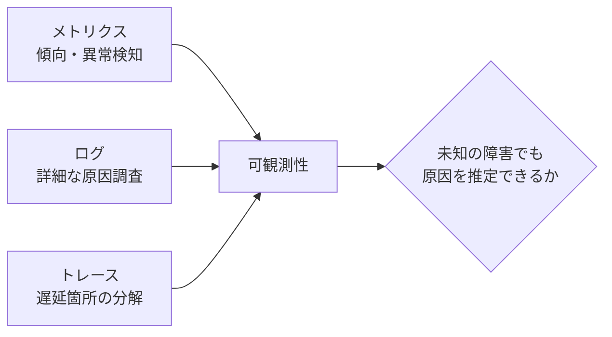
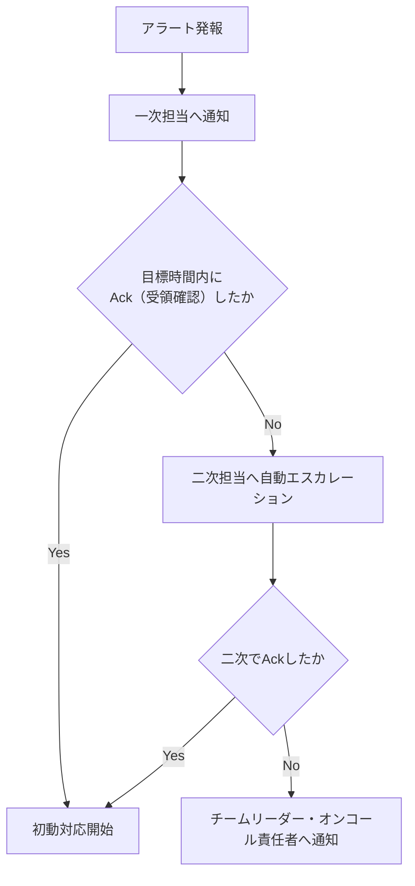
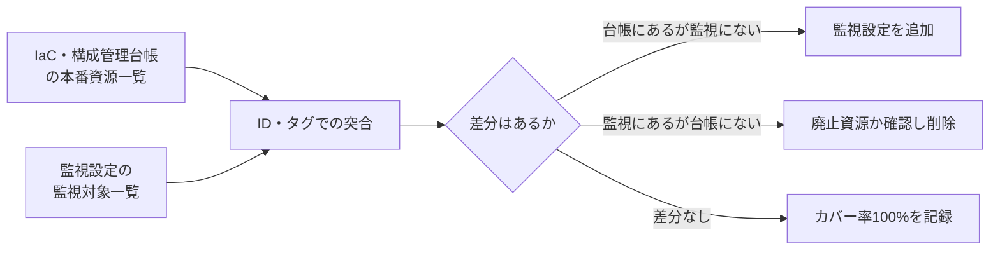
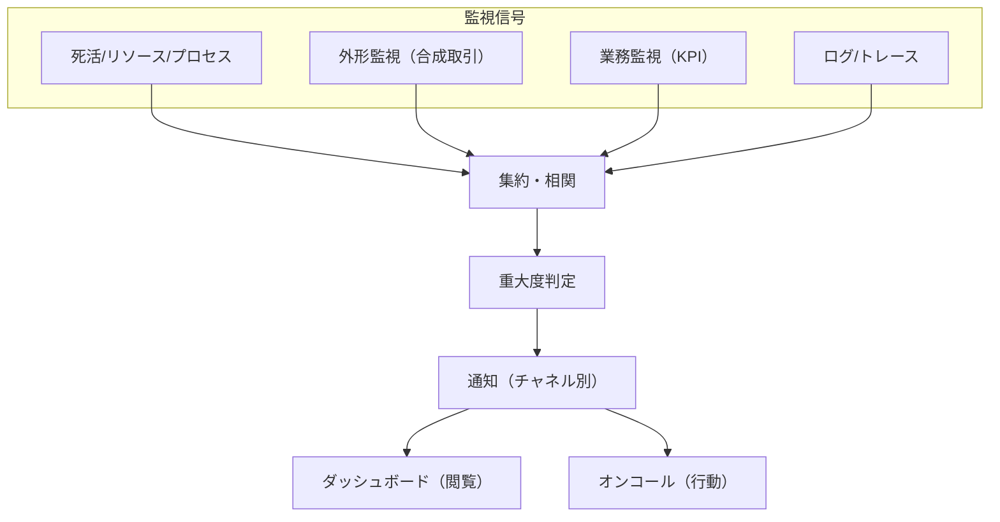

# 第11章 監視・可観測性設計

## 1. 学習目標

本章を終えると、次ができる。

- 死活、リソース、プロセス、ログ、外形、業務監視を目的別に使い分けられる
- メトリクス、ログ、トレースを組み合わせた可観測性を設計できる
- ベースライン、閾値、動的閾値を使い、アラート疲れを数値で把握し抑制できる
- 重大度、通知先、エスカレーションをSLIと連動させて定義できる
- ダッシュボードとアラートの役割を区別し、SLIを軸にした可視化ができる
- 監視対象の欠落を防ぐ実務手順（突合、棚卸し）を実行できる

## 2. 基本概念

### 2.1 監視の種類

**監視**は、システムの状態を継続的に観測し、異常を検知する仕組みである。
一口に監視といっても、見る対象によって性質が異なる。

| 種類 | 見るもの | 検知できること | 検知できないこと |
|------|----------|----------------|-------------------|
| 死活監視 | ホストやプロセスが応答するか | プロセス停止、疎通不可 | 応答はあるが処理が誤っている状態 |
| リソース監視 | CPU、メモリ、ディスク、ネットワーク使用率 | 資源枯渇の兆候 | アプリ固有のロジック不具合 |
| プロセス監視 | 必要なプロセス・サービスの起動状態 | プロセス異常終了 | 起動しているが応答が遅い状態 |
| ログ監視 | エラーパターン、監査イベント | アプリが記録した異常 | ログに出力されない異常 |
| 外形監視 | 外部から見た到達性、合成取引の成功可否 | 利用者視点での不通・失敗 | 内部のどこが原因かまでは分からない |
| 業務監視 | 業務KPI（受付件数、バッチ完了、滞留件数） | 業務として異常な状態 | 個々の技術要素の異常箇所 |

**一般論**として、死活監視だけで「監視している」と考えるのは危険である。
死活監視は「動いているか」しか見ておらず、部分障害や性能劣化、ロジック不具合を見逃す。
ping応答があってもアプリケーション層で例外が出続けている、という状態は珍しくない。

**例示**：ログイン画面は200 OKを返すが、認証基盤の応答が異常に遅く、実際にはログインが完了しない。
死活監視は「200 OKが返った」ことしか見ないため、この種の部分障害を正常と誤判定する。

**推奨事項**：死活・リソース・プロセスの技術監視に加えて、外形監視と業務監視を組み合わせ、利用者が実際に困っている状態を検知できるようにする。
技術監視は原因の絞り込みに強く、外形・業務監視は影響の有無を判断するのに強い。
両者は代替関係ではなく補完関係にある。

監視の粒度は監視対象の重要度に応じて変える。
すべての内部コンポーネントに同じ密度の監視を敷くと、監視自体の運用コストと、後述するアラート疲れの原因になる。

### 2.2 メトリクス、ログ、トレース、可観測性

観測可能性を支える三つのデータ種別がある。

- **メトリクス**：数値の時系列データ。CPU使用率、リクエスト数、エラー率など。集計や傾向把握に向く
- **ログ**：発生したイベントの記録。詳細な原因調査に向くが、量が多いと検索性が課題になる
- **トレース**：一つのリクエストが複数のサービスをまたいで処理される様子を追跡した記録。遅延がどこで発生しているかの分解に向く



**可観測性**（Observability）は、未知の障害が起きたときでも、外部から観測できる出力（メトリクス、ログ、トレース）だけを手がかりに、システム内部の状態を推定できる度合いである。

可観測性は特定の製品を導入すれば得られるものではない。
必要な信号が、必要な粒度で、必要なタイミングで出力されているかどうかが本質である。
ログを大量に出しているだけで、障害原因の特定に必要な情報（リクエストID、処理時間、依存先呼び出し結果など）が欠けていれば、可観測性は低いままである。

ログの実務では、**構造化ログ**（JSON形式などキーと値が機械的に解析できる形式）と、リクエストをまたいで同じ値を持つ**相関ID**（トレースID、リクエストIDなど）が特に重要である。
自由記述の平文ログだけでは、大量のログの中から一つのリクエストに関する記録だけを抜き出すことが難しい。

トレースについては、全リクエストを記録すると保管コストとオーバーヘッドが増えるため、**サンプリング率**（記録するリクエストの割合）を決める必要がある。
**推奨事項**：エラーが発生したリクエストと、レイテンシが著しく大きいリクエストは、サンプリング対象から除外せず優先的に記録する。

### 2.3 ベースラインと閾値

**ベースライン**は、平常時の挙動の水準である。
CPU使用率が平常時30〜50%で推移する、といった実測に基づく基準を指す。
ベースラインは、少なくとも1〜2週間分の実測データから、平日・休日、繁忙期・閑散期の違いを含めて把握する。

**閾値**は、ベースラインから外れたと判断する境界値である。
統計的な出発点としては、平均値と標準偏差を使った次のような設定がある。

```text
警告閾値 = 平均値 + 2 × 標準偏差
重大閾値 = 平均値 + 3 × 標準偏差
```

固定閾値は単純だが、業務の周期性（月末、始業直後など）を考慮しないと、次のいずれかが起きる。

- 繁忙期に誤報が大量発生し、アラート疲れを招く
- 閑散期には正常に見えるが、実際には異常な水準を見逃す

**例示**：月末処理のCPU使用率は平常時の2倍になることが分かっているのに、平常時基準の閾値をそのまま使うと、月末の毎晩アラートが鳴り、担当者はそのアラートを無視するようになる。

### 2.4 動的閾値

**動的閾値**は、時間帯や曜日、季節性を踏まえて閾値を変動させる方式である。
固定閾値の限界を補うために導入する。

代表的な実現方法は次である。

1. **時間帯別の固定閾値**：平日日中、夜間、月末をそれぞれ別の固定閾値として設定する
2. **移動平均ベース**：直近N日間の同じ時間帯の実績平均から、一定の乖離幅を閾値とする
3. **統計的な外れ値検知**：季節性を除去したうえで標準偏差や分位点を使い、自動的に許容範囲を計算する

**例示**：過去4週間の「毎週月曜10時台」のリクエスト数平均が1,000件、標準偏差が100件だった場合、当該時間帯の警告閾値を「平均+2標準偏差＝1,200件」として、他の曜日・時間帯とは別に管理する。
翌週の実績が1,250件であれば、通常の閾値（例えば全日平均800件を基準にした閾値）では発報しない水準でも、当該時間帯としては異常として検知できる。

動的閾値には導入コストと説明可能性のトレードオフがある。
自動計算された閾値は、なぜその数値になったのかを担当者が即座に説明しにくい。

**推奨事項**：まず固定閾値と時間帯別の閾値から始め、誤報や見逃しの実績を見ながら動的閾値の導入を検討する。
最初から高度な統計モデルを導入すると、チューニングと説明の負荷が運用チームの能力を超えることがある。

### 2.5 アラート疲れの数値化

**アラート疲れ**（Alert Fatigue）は、重要でない通知が多すぎることで、担当者が通知に鈍感になり、本当に重要な通知を見逃す状態である。
アラート疲れは感覚ではなく、次のように数値で把握できる。

```text
行動不能アラート比率 = (発報件数 − 対応が必要だった件数) ÷ 発報件数
```

ある月の実績を例に示す。

| 重大度 | 発報件数 | 対応が必要だった件数 | 行動不能件数 | 行動不能比率 |
|--------|----------|----------------------|----------------|----------------|
| 1（緊急） | 40 | 38 | 2 | 5.0% |
| 2（重大） | 150 | 90 | 60 | 40.0% |
| 3（軽微） | 900 | 45 | 855 | 95.0% |
| 4（情報） | 410 | 5 | 405 | 98.8% |
| 合計 | 1,500 | 178 | 1,322 | 88.1% |

全体の行動不能比率が88.1%という状態は、担当者が10件の通知のうち9件近くを無視してよいと学習してしまう水準であり、重大度1・2に紛れて重大な兆候を見逃すリスクが高い。

原因の多くは重大度3・4に集中している。
そこで、次の是正を実施したとする。

- 重大度3・4の閾値を実績ベースラインに合わせて緩和する
- 同一原因から連鎖するアラートをグルーピングし、根本原因単位で1件に集約する
- 行動不要と判定され続けた監視項目を棚卸しし、無効化または重大度を引き下げる

是正後の翌月実績は次のようになった。

| 重大度 | 発報件数 | 対応が必要だった件数 | 行動不能比率 |
|--------|----------|----------------------|----------------|
| 1（緊急） | 38 | 36 | 5.3% |
| 2（重大） | 140 | 88 | 37.1% |
| 3（軽微） | 260 | 42 | 83.8% |
| 4（情報） | 90 | 6 | 93.3% |
| 合計 | 528 | 172 | 67.4% |

対応が必要な件数（172〜178件）はほぼ変わらないまま、発報の総数を1,500件から528件へ、行動不能比率を88.1%から67.4%へ減らせている。
**推奨事項**：アラート疲れの改善は「アラートを減らすこと」自体ではなく、対応が必要な件数を維持しながら不要な発報を減らすことを目標に置く。

### 2.6 重大度、通知先、エスカレーション設計

アラート疲れの対策として、重大度・通知・グルーピング・時間帯抑制・定期棚卸しの5つを組み合わせる。

1. **重大度**を定義し、通知チャネルや対応期限を変える（緊急はページャー、軽微はチャットのみ、など）
2. 行動できない（見ても何もしない）アラートを削除または通知対象から外す
3. 関連するアラートをグルーピングし、根本原因単位で通知する
4. 営業時間外は重大度の高いものだけ通知するなど、時間帯別の抑制方針を合意する
5. 定期的にアラート発報数と対応実績をレビューし、不要なアラートを棚卸しする

**必須事項**：重大度ごとに、通知先、通知手段、初動目標時間を定義する。
定義がない重大度区分は運用できない。

| 重大度 | 通知チャネル | 初動目標時間 | 未応答時のエスカレーション |
|--------|--------------|----------------|------------------------------|
| 1（緊急） | ページャー＋電話 | 15分以内 | 5分未応答で二次受けへ自動転送 |
| 2（重大） | ページャー | 1時間以内 | 15分未応答でチームリーダーへ転送 |
| 3（軽微） | チャット通知 | 当日中 | エスカレーションなし（翌日レビュー対象） |
| 4（情報） | ダッシュボード記録のみ | なし | 対象外 |

監視のエスカレーションは、第10章で扱う障害対応の重大度エスカレーションと役割が異なる。
第10章のエスカレーションは「対応者の権限や知識で解決できない事象」を上位者へ引き継ぐ仕組みであり、本章のエスカレーションは「アラートに誰も応答していない事象」を検知して次の担当者へ自動的に転送する仕組みである。
両者は連動するが、後者が機能しなければ前者の起点そのものが遅れる。



**推奨事項**：エスカレーションは応答（Ack）の有無で自動的に進める。
一次担当者が「連絡するかどうか」を判断する仕組みにすると、遠慮や見落としにより連絡が遅れる。

### 2.7 ダッシュボードとSLI連携

**ダッシュボード**は、状態を可視化し、傾向把握や振り返りに使う閲覧目的の画面である。
**アラート**は、行動を促す通知である。
この二つの役割を混同すると、ダッシュボードに全部を表示して満足し、実際に見るべきときに誰も見ていない、という状態になる。

ダッシュボードは、用途に応じて階層を分けると機能しやすい。

| 階層 | 主な閲覧者 | 内容の例 |
|------|------------|----------|
| 経営・SLOサマリ | 経営層、サービスオーナー | 月次稼働率、主要SLIの達成状況 |
| 運用オペレーション | 一次受け、オンコール担当 | アラート発報状況、重大度別件数、当日の異常兆候 |
| 詳細調査 | 二次・三次受け | コンポーネント別メトリクス、ログ検索、トレース |

SLO（第3章）で使うSLIは、監視の中でも特に重要な指標として扱う。
稼働率や応答時間の95パーセンタイルといったSLIは、月次集計だけでなく、日次・時間単位でも可視化し、SLOからの逸脱兆候を早期に把握できるようにする。

**推奨事項**：SLIはダッシュボードの最上段に固定表示し、他の技術指標と混在させない。
一つのダッシュボードに数十個のパネルを並べると、どの数値を見ればよいか分からなくなり、結局誰も見なくなる。

**必須事項**：ダッシュボードに表示する指標は、分母・分子・集計単位を定義書に明記する。
「稼働率」という同じ名前でも、計画停止を含むか除くかでダッシュボード上の数値が変わり、SLOレビューの場で認識が食い違う原因になる。

### 2.8 監視対象の欠落を防ぐ方法

監視の抜け漏れは、多くの場合「新しく作られた資源が監視対象に追加されない」ことで発生する。
構築時に完璧な監視を組んでも、その後の変更で欠落が生じれば意味がない。

欠落を防ぐ実務手段は次のとおりである。

1. 構成管理台帳またはIaC（第12章）のリソース一覧と、監視設定の対象一覧を定期的に突合する
2. 新規資源作成時に「監視対象」を示す必須ラベル・タグを付与するルールを設ける
3. 依存関係図（IdP、DNS、外部APIなど、自システム外の依存先を含む）を監視カタログに含める
4. リリースチェックリストに「監視追加の完了」を必須項目として入れる
5. 定期的に「一度もアラートが発報していない監視対象」を棚卸しし、監視設定自体が壊れていないか確認する
6. 障害の事後分析で「なぜ検知できなかったか」を必ず確認項目に含める

突合の具体的なやり方は次のとおりである。



突合は月次または資源追加のたびに自動実行し、差分が0件であることをレポート化する。
**必須事項**：本番稼働に必須な資源については、監視カバー率100%を運用受入の合格条件に含める。

## 3. 業務上の意味

監視は運用者の作業効率のためだけに存在するのではない。
利用者からの申告より先に異常を検知し、業務影響が拡大する前に対応を始めるための仕組みである。

監視が無い、または不十分な状態では、障害検知が利用者からの問い合わせに依存する。
その場合、次のような事態が生じる。

- 異常発生から検知まで数時間、場合によっては翌営業日までかかる
- 複数の利用者から同時に問い合わせが殺到し、対応窓口が混乱する
- 「いつから発生していたか」が分からず、影響範囲の特定が遅れる

逆に、誤報の多い監視も業務に悪影響を及ぼす。
本物の障害通知が誤報の中に埋もれ、対応が遅れる、あるいは監視自体への信頼が失われ、担当者がアラートを軽視するようになる。

数値で見ると影響は明確である。
検知が利用者申告頼みで平均2時間かかっていたケースを、外形監視の導入で2分に短縮できれば、業務影響時間を理論上1時間58分短縮できる。
これは、可用性要件（第3章）や運用性要件（第10章）で置いた復旧時間目標を成立させる前提条件そのものである。

## 4. ヒアリング質問

監視の目的について。

- 業務が止まったと判断する信号は、システム的に何を指すか
- 過去に見逃した障害の典型例と、その原因は何か
- SLOに使う指標（SLI）はどれで、誰が承認したものか
- 業務KPI（受付件数、滞留件数など）で異常を判断する基準値はあるか

対応体制について。

- アラートを受け取ったら、誰が、どの重大度で、何分以内に動く想定か
- アラートに未応答の場合、何分後に誰へエスカレーションする想定か
- 夜間・休日に重大度の低いアラートまで通知が届くと、どのような支障があるか

可視化について。

- 経営層、運用担当者、開発者それぞれが見ているダッシュボードは分かれているか
- SLIとして扱う指標は、どのダッシュボードで、誰が確認しているか

制約について。

- 個人情報を含むログの取り扱いに、監視上どのような制約があるか
- 外部委託先の監視ツールで扱えないデータや制約はあるか
- 監視基盤自体が停止した場合の代替手段は用意されているか

## 5. 要件例

### 要件例 NFR-MON-001 代表シナリオの障害検知

- 要件ID：NFR-MON-001
- 分類：監視・可観測性
- 対象：オンライン代表シナリオ（ログイン、申請、承認、参照）およびその依存サービス
- 業務上の目的：利用者からの申告より先に重大障害を検知し、初動対応を開始できるようにする
- 前提条件：外形監視の対象にIdP、DNS、主要な外部APIを含む
- 指標：重大度1事象の検知時間、本番必須資源に対する監視カバー率、週あたりの行動不能アラート数
- 目標値：代表シナリオの失敗を2分以内に検知する。本番稼働に必須な資源の監視カバー率を100%とする。行動不能アラートを週5件未満に是正する
- 測定条件：障害注入試験、および月次の構成突合による棚卸し
- 測定方法：監視イベントの発報時刻記録、構成管理台帳との突合、アラート分類レビュー
- 合否判定：監視カバー率が100%であること。重大度1の検知遅延が目標を超えた場合は是正計画を必須とする
- 例外条件：監視基盤自体に障害が発生した場合は、代替の通知経路（別系統の死活監視など）を用いる
- 実現方式：合成監視（外形監視）、メトリクス収集、ログ集約、分散トレース、オンコール連携システム
- 検証方法：監視試験、障害注入試験、四半期の棚卸し
- 根拠：可用性要件（NFR-AVL-001）の月次稼働率と、運用性要件（NFR-OPS-001）の初動15分を成立させるための前提条件
- 関連要件：NFR-AVL-001、NFR-OPS-001
- 未確定事項：業務KPI監視（受付件数、滞留件数）の最終対象項目

### 要件例 NFR-MON-002 アラート品質と重大度運用

- 要件ID：NFR-MON-002
- 分類：監視・可観測性（アラート運用）
- 対象：本番監視全般のアラート設定
- 業務上の目的：アラート疲れを防ぎ、重大な通知を確実に対応者へ届ける
- 前提条件：重大度1〜4の定義が運用設計書として合意されていること
- 指標：重大度ごとの月間発報件数、行動不能アラート比率（発報のうち対応不要だったものの割合）
- 目標値：行動不能アラート比率を月次で70%未満に抑える。重大度1の誤報（実際には障害でなかったもの）を月2件以内とする
- 測定条件：月次のアラートレビュー会での分類結果
- 測定方法：アラート発報ログと対応記録の突合、対応者への聞き取り
- 合否判定：行動不能アラート比率が目標を超えた月は、翌月に閾値または通知設定の見直しを実施すること
- 例外条件：新規リリース直後1週間は、閾値調整期間として集計対象から除外できる
- 実現方式：重大度別通知チャネルの分離、関連アラートのグルーピング、閾値の定期チューニング
- 検証方法：月次アラートレビュー、閾値変更の履歴監査
- 根拠：運用担当者へのヒアリングで、通知の大半が行動不要という実態が判明したため。「2. 基本概念」2.5節の実績値（改善前88.1%、改善後67.4%）を踏まえ、当面の目標を70%未満に設定
- 関連要件：NFR-OPS-001、NFR-OPS-003
- 未確定事項：グルーピングに使う相関分析ツールの選定

### 要件例 NFR-MON-003 アラートエスカレーションとSLIダッシュボード

- 要件ID：NFR-MON-003
- 分類：監視・可観測性（エスカレーション・可視化）
- 対象：重大度1・2アラートの未応答エスカレーション、および主要SLIダッシュボード
- 業務上の目的：アラートへの応答が遅れた場合でも、担当者不在の状態を放置せず次の担当者へつなぐ
- 前提条件：オンコール担当者と連絡順序（一次・二次・チームリーダー）が定義されていること
- 指標：アラートAck（受領確認）までの時間、未応答エスカレーションの発動件数、SLIダッシュボードの更新遅延
- 目標値：重大度1のAckを5分以内、重大度2のAckを15分以内。未応答時は目標時間経過後100%自動エスカレーションする。SLIダッシュボードの更新遅延を5分以内に保つ
- 測定条件：本番アラート全件、および四半期のエスカレーション訓練
- 測定方法：アラート管理システムのAck記録、エスカレーション発動ログ、ダッシュボード基盤のデータ鮮度メトリクス
- 合否判定：自動エスカレーションが発動しなかった未応答事象が0件であること。ダッシュボード更新遅延の目標超過が月2回未満であること
- 例外条件：オンコール担当者交代直後30分は、引き継ぎ確認時間として個別に扱う
- 実現方式：アラート管理システムのエスカレーションポリシー設定、SLIダッシュボードの自動更新パイプライン
- 検証方法：エスカレーション訓練（意図的に一次担当を無応答にする）、ダッシュボード鮮度の定期確認
- 根拠：過去に一次担当者が離席中で重大度1アラートに30分以上気付かなかった事例への対策
- 関連要件：NFR-MON-001、NFR-OPS-001
- 未確定事項：オンコール担当者の連絡手段が到達しない場合の代替経路（衛星電話等）の要否

## 6. 悪い要件例

1. 「しっかり監視すること」
2. 「異常をすぐに検知すること」
3. 「可観測性を確保すること」
4. 「重要なアラートは必ず通知すること」
5. 「ダッシュボードを整備すること」
6. 「アラートは適切にエスカレーションすること」

いずれも、対象、検知時間、カバー率、判定基準のいずれかが欠けている。
例4は「重要」の定義が示されておらず、例5は閲覧目的と行動目的の区別がない。
例6は「適切に」が測定不能であり、Ack時間や未応答時の転送先が定義されていない。

## 7. 改善後の要件例

### 悪い例1・2の改善：「しっかり監視すること」「異常をすぐに検知すること」

NFR-MON-001が改善例である。
検知時間、カバー率という測定可能な指標へ分解した。

### 悪い例3の改善：「可観測性を確保すること」

可観測性は状態であって、単独では測定できない。
次のように、支える要素ごとに要件化する。

- メトリクス：主要コンポーネントのCPU、メモリ、エラー率、レイテンシを1分粒度で収集する
- ログ：重大イベントを構造化ログとして出力し、リクエストIDで横断検索できる
- トレース：オンライン主要APIについて、サービス間呼び出しをトレースIDで追跡できる

### 悪い例4・5の改善：「重要なアラートは必ず通知すること」「ダッシュボードを整備すること」

NFR-MON-002へ分解する。
重大度別の発報件数と行動不能比率という指標を置き、ダッシュボードとアラートの役割を分離した。

### 悪い例6の改善：「アラートは適切にエスカレーションすること」

NFR-MON-003へ分解する。
「適切に」を、Ack目標時間、自動エスカレーション発動率という測定可能な指標に置き換えた点が改善の要点である。

## 8. 設計への落とし込み

監視カタログに含める列の例は次のとおりである。

| 列 | 内容 |
|----|------|
| 対象 | 監視するコンポーネントまたはシナリオ |
| 目的 | 何を検知するための監視か |
| 信号種別 | 死活、リソース、外形、業務など |
| SLI該当可否 | SLOのSLIとして使うかどうか |
| 閾値 | 発報条件（固定/時間帯別/動的） |
| 重大度 | 1〜4などの区分 |
| 通知先 | 一次受け、チーム、エスカレーション先 |
| Runbook | 対応するRunbookの参照 |
| 所有者 | 監視設定のメンテナンス責任者 |



**採用**：SLIは外形監視とAPMのレイテンシ指標を併用する。
**不採用**：サーバCPU使用率だけを可用性判定の指標にする。
**理由**：CPUが低くても、IdP停止やアプリロジック不具合で業務が止まりうる。
**残存リスク**：外部APIの性能劣化を自システムの障害と誤認する可能性がある。
依存先ごとの切り分け手順をRunbookに明記して緩和する。

## 9. 代替案

| 方式 | 向く条件 | 向かない条件 |
|------|----------|--------------|
| インフラ監視中心 | シンプルな構成、初期導入コストを抑えたい | 利用者視点の障害を見逃しやすい |
| 外形監視中心 | 利用者体験を優先して検知したい | 内部原因の特定に時間がかかる |
| インフラ+外形+業務監視の併用（推奨） | 検知の網羅性と原因特定の速さを両立したい | 導入・運用コストが相対的に高い |
| 商用APM/可観測性プラットフォーム一括導入 | トレースまで含めて早期に整備したい | ライセンス費用と学習コストが発生する |
| 固定閾値のみで運用開始し段階的に動的閾値へ移行 | 運用チームの成熟度がこれから上がる | 立ち上げ初期の誤報・見逃しをある程度許容する必要がある |

## 10. トレードオフ

| 対立 | 一方を優先すると | 他方に起きること |
|------|------------------|------------------|
| 高感度な閾値 vs 誤報 | 早期に気付ける | アラート疲れが進み、見逃しリスクが増える |
| 詳細なトレース vs コスト・機密性 | 原因特定が速くなる | データ量とライセンス費用が増え、個人情報混入のリスクも増える |
| 中央集権的な監視標準化 vs チームの自律性 | 標準化により品質が均一になる | チームごとの事情に合わせた柔軟性が下がる |
| 動的閾値の導入 vs 説明可能性 | 誤報・見逃しの精度が上がる | 閾値の根拠が担当者に説明しづらくなる |
| ダッシュボードの網羅性 vs 認知負荷 | 表示項目を増やす | どこを見ればよいか分からなくなり、結局見られなくなる |
| 厳格な自動エスカレーション vs 誤エスカレーション | 見逃しを防げる | 一時離席のたびに転送が発生し、上位者の負荷が増える |

## 11. 検証方法

- 意図的な障害注入による発報確認
- 通知チャネルへの到達確認（実際に受信できるかのテスト）
- エスカレーション訓練（一次担当を意図的に無応答にし、自動転送を確認する）
- ダッシュボードの指標定義レビュー（分母・分子・集計方法の確認）
- 構成管理台帳と監視対象の突合
- 月次のアラートレビュー会（発報件数、行動不能比率の確認）
- SLIとSLOの整合性レビュー

## 12. よくある失敗

1. 新規サービスをリリースする際、監視カタログへの登録を忘れる
2. 閾値を実測に基づかず感覚で設定する
3. 重大度の区分がすべて「緊急」になり、実質的に機能しない
4. ログは収集しているが、検索や相関付けができず調査に使えない
5. SLOで使う指標と、実際に監視しているメトリクスが一致していない
6. 監視基盤そのものの死活監視（監視の監視）が存在しない
7. 依存先（IdP、DNS、外部API）を監視対象から外してしまう
8. アラートレビューを一度も実施せず、不要な通知が蓄積し続ける
9. 未応答時の自動エスカレーションが設定されておらず、一次担当者の裁量に依存する
10. ダッシュボードにパネルを増やし続け、誰も定期的に見なくなる

## 13. レビュー観点

- [ ] 死活・リソースだけでなく、外形・業務監視が含まれているか
- [ ] SLOで使うSLIが明示され、監視設定と一致しているか
- [ ] 重大度と通知先、初動目標時間が対応しているか
- [ ] 未応答時の自動エスカレーション条件と転送先が定義されているか
- [ ] 監視対象の欠落防止の仕組み（突合、棚卸し）があるか
- [ ] アラート疲れを防ぐ具体策（グルーピング、時間帯抑制）と、その効果を測る指標があるか
- [ ] ダッシュボードとアラートの役割が区別され、階層別に設計されているか
- [ ] 個人情報を含むログの扱いが、セキュリティ要件と矛盾していないか
- [ ] 監視基盤自体の障害時の代替経路があるか

## 14. 章末問題

### 問題1

CPU使用率90%を超えたらアラートを出す設定だけがあるシステムで、ログイン不能障害を見逃した。
なぜ見逃したのか、監視の種類の観点から説明せよ。

### 問題2

「監視カバー率100%」を実際に測定する具体的な方法を書け。

### 問題3

ある監視システムで、月間のアラート発報件数が2,000件、そのうち実際に対応が必要だったものが150件だった。
行動不能アラート比率を計算し、この状態が引き起こす問題を述べよ。

### 問題4

固定閾値による監視で、月末は誤報が多発し、それ以外の時期は異常を見逃しがちだった。
考えられる改善策を2つ挙げよ。

### 問題5

重大度1のアラートについて、Ack目標時間を5分、未応答時のエスカレーション先をチームリーダーとする設計にした。
この設計だけでは不十分な理由を、オンコール担当者の不在パターンを踏まえて指摘せよ。

## 15. 解答と解説

### 問題1

CPU使用率は資源監視の一種であり、IdP停止、DNS障害、アプリケーションのロジック不具合など、リソース使用率が上がらない種類の障害を検知できない。
外形監視（実際にログインを試行する合成取引）を組み合わせていれば、利用者視点での不通を検知できた可能性が高い。

### 問題2

構成管理台帳またはIaCで管理している本番必須資源の一覧と、監視設定に登録されている対象の一覧をIDで突合し、両者の差分が0件であることを確認する。
依存する外部サービス（IdP、DNSなど）も一覧に含める。

### 問題3

```text
行動不能アラート比率 = (2,000 - 150) / 2,000 = 92.5%
```

この状態では、担当者が大半のアラートを「どうせ対応不要」とみなすようになり、本当に対応が必要な重大アラートも見逃されるアラート疲れが生じる。

### 問題4

例：時間帯別（平日日中、月末、夜間など）に異なる閾値を設定する。
または、過去の実績から自動的に許容範囲を算出する動的閾値の導入を検討する。
いずれの場合も、導入後は誤報・見逃しの実績を継続的にレビューする。

### 問題5

チームリーダーが単一の担当者であれば、チームリーダー自身が不在または対応中の場合にエスカレーションが行き止まりになる。
エスカレーション先は単一の個人ではなく、二次受けグループやオンコール責任者のローテーションのように複数名で構成し、さらにその先（三次受け、決裁者）への経路も定義しておく必要がある。

## 16. 実務演習

実務シナリオ（従業員5,000人のWeb業務システム）を題材に、次を作成せよ。

1. 監視カタログを12件作成する（対象、信号種別、閾値、重大度、通知先、Runbook参照を含む）
2. うち3件をSLOのSLIとして指定し、それぞれの目標値と紐づける
3. 依存先（IdP、DNS、外部API）を監視カタログに含め、切り分け手順の概要を1行ずつ書く
4. 月間アラート発報件数と行動不能比率の目標値を設定し、根拠を1文で書く
5. 重大度1・2の未応答エスカレーション経路を、一次受けから決裁者まで図示する
6. 経営・運用オペレーション・詳細調査の3階層でダッシュボードの掲載項目案を作成する

---

## 次章予告

第12章では保守性と変更容易性を扱う。
IaC、CI/CD、ロールバック、Blue-Green、Canary、Feature Flag、構成ドリフト、技術的負債を要件へ落とし込む方法を扱う。
