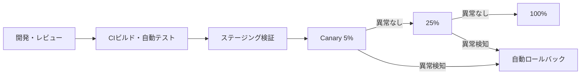

# 第12章 保守性と変更容易性

## 1. 学習目標

本章を終えると、次ができる。

- モジュール化、疎結合、設定の外部化、IaCを保守性要件に接続できる
- 自動テスト、CI/CD、バージョン管理、ロールバックの目標値を定義できる
- Blue-Green、Canary、Feature Flagを変更リスクに応じて使い分けられる
- 構成ドリフト、技術的負債、サポート期限を管理する要件を書ける
- 変更作業時間と影響範囲を見積もり、リリース方式の選定に反映できる

## 2. 基本概念

### 2.1 保守性と変更容易性の定義

**保守性**は、システムに対する修正、機能追加、障害対応を、安全かつ迅速に行える性質である。
**変更容易性**は保守性の中核をなす要素であり、変更にかかる時間、リスク、影響範囲の小ささを指す。

保守性が低いシステムでは、次のような症状が現れる。

- 小さな修正のはずが、影響確認に長時間かかる
- 一度リリースすると、問題が起きても元に戻せない、または戻すのに長時間かかる
- 設定変更のたびに再ビルドや手作業が必要になる
- 誰も全体構造を把握しておらず、変更の影響範囲が予測できない

**一般論**として、保守性は機能要件と直接関係しないため、初期構築時には後回しにされやすい。
しかし、システムのライフサイクル全体で見ると、構築期間より運用期間の方が長いことがほとんどであり、保守性の不足は長期的なコストとして蓄積する。

### 2.2 モジュール化と疎結合

**モジュール化**は、システムを独立した機能単位に分割することである。
**疎結合**は、モジュール間の依存関係を最小限にし、一方の変更が他方に影響しにくい状態を指す。

疎結合を実現する代表的な手段は次である。

- 明確に定義されたインターフェース（API契約）を介した連携
- 直接のデータベース共有を避け、サービスごとにデータを所有する
- 非同期メッセージングによる時間的な結合の緩和

**推奨事項**：モジュール分割の単位は、業務上の変更理由が同じかどうかで判断する。
技術的な層（画面、ロジック、データ）だけで分割すると、一つの業務変更が複数レイヤーにまたがり、変更の影響範囲がかえって広がることがある。

### 2.3 設定の外部化とIaC

**設定の外部化**は、環境依存の値（接続先、認証情報、フラグなど）をコードから分離し、外部の設定ファイルや設定管理サービスで管理することである。
設定がコードに埋め込まれていると、環境ごとに再ビルドが必要になり、変更のたびにリリース作業が発生する。

**IaC**（Infrastructure as Code）は、インフラの構成をコードとして記述し、バージョン管理と自動適用の対象にする手法である。
IaCにより、次が可能になる。

- 構成変更の履歴管理（誰が、いつ、何を変更したか）
- レビューを経た変更適用（プルリクエストベースの変更管理）
- 環境間の構成差異の検出と是正

**必須事項**：本番環境の構成は、IaCまたはそれに準じる構成管理の仕組みを「正」とする。
手動変更を許容する場合でも、事後にコードへ反映する運用を定める。

### 2.4 自動テスト、CI/CD、バージョン管理

**自動テスト**は、単体テスト、結合テスト、E2Eテストなどを自動実行し、変更による意図しない影響（デグレード）を検出する仕組みである。

**CI/CD**（継続的インテグレーション/継続的デリバリー）は、コードの変更を自動的にビルド、テスト、デプロイまでつなげるパイプラインである。
CI/CDが整備されていないと、リリースのたびに手作業が発生し、作業者によって手順や品質がばらつく。

**バージョン管理**は、コードとインフラ構成の変更履歴を追跡可能にする仕組みである。
バージョン管理されていない変更は、いつ、誰が、何のために行ったかを後から追跡できない。

これらは相互に補完し合う。
自動テストが無ければCI/CDは「速く壊れたものを届ける」仕組みになりかねない。
バージョン管理が無ければCI/CDは何を元にデプロイしているのか不明確になる。

### 2.5 ロールバックと後方互換性

**ロールバック**は、リリースした変更を、問題発生時に安全に取り消し、直前の安定状態へ戻す操作である。

ロールバックが機能するためには、次を満たす必要がある。

- 直前バージョンへ戻す手順が自動化されている、または短時間で実行できる
- データベースのスキーマ変更が、ロールバック後の旧バージョンでも動作する（後方互換性）
- ロールバック実施の判断基準（どの異常が発生したら戻すか）が事前に定義されている

**後方互換性**は、新しいバージョンが、古いバージョンの利用者や連携先の期待する動作を維持する性質である。
APIのレスポンス形式を変更する、必須パラメータを追加する、といった変更は後方互換性を壊しうる。

**推奨事項**：データベースのスキーマ変更は、追加は先行し、削除は後続のリリースで行う「二段階リリース」を基本にする。
これにより、アプリのロールバックが必要になっても、スキーマ側が追従できる。

### 2.6 Blue-Green、Canary、Feature Flag

三つはいずれも変更リスクを下げるためのリリース手法だが、性質が異なる。

**Blue-Green Deployment**は、稼働中の環境（Blue）とは別に新環境（Green）を用意し、準備が整った時点で切り替える方式である。
切り替えは瞬時に行え、問題があれば旧環境へ戻すことも比較的速い。
ただし、環境を二重に持つためコストが増える。

**Canary Release**は、新バージョンを一部の利用者やトラフィックにだけ先行適用し、問題がなければ段階的に対象を広げる方式である。
問題を早期に、限定的な影響範囲で検出できる。
段階的な適用ロジックと、異常検知による自動停止の仕組みが必要になる。

**Feature Flag**は、コードのデプロイとは切り離して、機能の有効・無効を実行時に切り替える仕組みである。
リリースと機能公開を分離できるため、問題発生時にコードを戻さずフラグを切るだけで影響を止められる。

| 方式 | 主な利点 | 主な注意点 |
|------|----------|------------|
| Blue-Green | 切替・切り戻しが速い | 環境を二重に持つコスト |
| Canary | 影響範囲を限定して検証できる | 段階制御と自動判定の仕組みが要る |
| Feature Flag | コードデプロイと機能公開を分離できる | フラグの管理不備で技術的負債化しやすい |

**推奨事項**：三つは排他的ではなく組み合わせて使う。
Blue-Greenでインフラを切り替え、Canaryで一部トラフィックに適用し、Feature Flagで機能単位に制御する構成も一般的である。

### 2.7 構成ドリフトと技術的負債

**構成ドリフト**は、IaCなどで定義された「あるべき構成」と、実際の本番環境の構成が乖離した状態である。
緊急対応での手動変更がコードへ反映されないまま放置されると発生しやすい。

構成ドリフトが放置されると、次の問題が起きる。

- 障害時のフェイルオーバー先が、想定と異なる古い構成のままになっている
- IaCを再適用した際に、意図せず手動変更が上書きされ、別の障害を招く
- 監査時に「実際の構成」と「文書上の構成」が一致しない

**技術的負債**は、短期的な都合で選んだ実装や構成が、長期的な保守コストとして積み上がったものである。
負債自体が常に悪いわけではないが、返済計画を持たずに放置すると、変更のたびにコストが増加し、最終的には変更自体が困難になる。

**推奨事項**：構成ドリフトは定期的な自動検出の対象とし、技術的負債は一覧化して定期的に返済計画をレビューする。

### 2.8 サポート期限とバージョンアップ

OS、ミドルウェア、ライブラリ、フレームワークには、提供元が定めるサポート期限（EOL: End of Life）がある。
サポート期限を過ぎたコンポーネントは、脆弱性が発見されてもパッチが提供されなくなる。

**必須事項**：本番で使用するコンポーネントのサポート期限を一覧管理し、期限到来前に更新計画を立てる。

バージョンアップには、次の種類がある。

- パッチバージョンアップ（バグ修正、影響が小さいことが多い）
- マイナーバージョンアップ（機能追加、後方互換性が維持されることが多い）
- メジャーバージョンアップ（破壊的変更を含みうる、影響調査が必要）

**推奨事項**：メジャーバージョンアップは、専用の検証期間とロールバック手順を用意したうえで計画する。

### 2.9 変更作業時間と影響範囲

保守性を測る実務的な指標として、変更作業にかかる時間と、影響範囲の広さがある。

- **変更リードタイム**：変更の着手から本番反映までにかかる時間
- **変更失敗率**：本番変更のうち、ロールバックや緊急対応を要した割合
- **影響範囲**：一つの変更が波及するモジュール、サービス、チームの数

これらは、DevOpsの実務指標（デプロイ頻度、変更リードタイム、変更失敗率、復元時間）として広く参照される考え方と重なる。
**推奨事項**：これらの指標を継続的に測定し、保守性改善の投資判断に使う。

## 3. 業務上の意味

変更できないシステムは、セキュリティ上のパッチも、性能改善も、法改正への対応も、迅速に行えない。

例を示す。

- 脆弱性が公表されても、影響範囲が分からず、パッチ適用に数週間かかる
- 軽微な設定ミスをロールバックできず、業務が長時間停止する
- 法改正で計算ロジックの変更が必要でも、影響が広範囲に及び、リリースまでに数か月を要する

したがって保守性要件は、開発チームの生産性の話ではなく、法令対応やセキュリティ対応のスピードという業務リスクに直結する。

## 4. ヒアリング質問

- 月あたりの本番変更回数と、そのうち失敗（ロールバックや緊急対応を要したもの）した割合はどの程度か
- 変更が失敗した場合、ロールバックにかかる目標時間はどの程度か
- 後方互換性を壊す変更を行う場合、利用者や連携先への予告期間はどの程度必要か
- サポート期限が近い、またはすでに切れているコンポーネントは何か
- 変更承認から実装完了までのリードタイムはどの程度か
- 構成ドリフトが過去に障害の原因になったことはあるか

## 5. 要件例

### 要件例 NFR-MNTN-001 変更管理とロールバック

- 要件ID：NFR-MNTN-001
- 分類：保守性
- 対象：アプリケーション、インフラ構成、監視設定を含む本番変更全般
- 業務上の目的：欠陥修正やセキュリティパッチを、短い影響時間で安全に適用できるようにする
- 前提条件：CI/CDパイプラインを利用し、IaCを構成の正とする
- 指標：ロールバック完了時間、変更失敗率、構成ドリフト検出件数、パイプライン経由デプロイ率
- 目標値：オンライン変更のロールバックを30分以内に完了する。四半期の変更失敗率を5%未満に抑える。構成ドリフト検出後5営業日以内に是正する。本番デプロイの100%をパイプライン経由とする
- 測定条件：本番変更管理の全件を対象とする
- 測定方法：変更管理チケット、パイプライン実行ログの監査、ドリフト検出ツールのレポート
- 合否判定：目標未達の項目について是正計画があること。パイプラインを迂回した変更が、例外承認なしに0件であること
- 例外条件：緊急ホットフィックスはパイプライン外での適用を許容するが、事後24時間以内にIaC・リポジトリへ反映する
- 実現方式：IaC、CI/CD、Canary または Blue-Green、Feature Flag、自動テスト
- 検証方法：ロールバック訓練、パイプライン監査、ドリフト棚卸し
- 根拠：計画停止枠（NFR-MNT-001）を超えない変更と、パッチ適用期限（第9章）の遵守のため
- 関連要件：NFR-MNT-001、NFR-SEC-020、NFR-OPS-002
- 未確定事項：Canary適用比率の最終値

### 要件例 NFR-MNTN-002 サポート期限管理と技術的負債

- 要件ID：NFR-MNTN-002
- 分類：保守性（サポート期限・技術的負債）
- 対象：本番稼働するOS、ミドルウェア、主要ライブラリ、フレームワーク
- 業務上の目的：サポート切れコンポーネントによる脆弱性放置と、更新困難化を防ぐ
- 前提条件：コンポーネント一覧とサポート期限が構成管理台帳で維持されていること
- 指標：サポート期限切れコンポーネント件数、期限到来90日前時点での更新計画策定率
- 目標値：サポート期限切れコンポーネントを本番に0件とする。期限90日前までに、対象コンポーネントの100%について更新計画を策定する
- 測定条件：四半期ごとのコンポーネント棚卸し
- 測定方法：構成管理台帳とベンダー公開のサポート期限情報との突合
- 合否判定：期限切れが1件でもあれば是正必須。更新計画未策定が1件でもあれば是正必須
- 例外条件：業務上どうしても更新できないコンポーネントは、リスク受容の決裁を得たうえで代替の緩和策（ネットワーク隔離など）を講じる
- 実現方式：依存関係管理ツールによる自動検知、定期棚卸し、更新計画のロードマップ化
- 検証方法：四半期棚卸しレビュー、リスク受容記録の確認
- 根拠：過去にサポート切れのライブラリが原因で脆弱性診断の指摘を受けた事例への対策
- 関連要件：NFR-SEC-001、NFR-MNTN-001
- 未確定事項：メジャーバージョンアップに要する検証工数の見積もり基準

## 6. 悪い要件例

1. 「保守しやすい設計にすること」
2. 「CI/CDを導入すること」
3. 「技術的負債をなくすこと」
4. 「バージョンアップは適宜行うこと」
5. 「後方互換性を維持すること」

いずれも測定不能である。
例2は方式名を要件にしており、状態目標になっていない。
例3は「なくす」の定義と測定方法がなく、現実的でもない。
例5は対象範囲と維持期間が示されていない。

## 7. 改善後の要件例

### 悪い例1・2の改善：「保守しやすい設計にすること」「CI/CDを導入すること」

NFR-MNTN-001が改善例である。
ロールバック時間、変更失敗率、パイプライン経由率という測定可能な指標へ分解した。

### 悪い例3・4の改善：「技術的負債をなくすこと」「バージョンアップは適宜行うこと」

NFR-MNTN-002へ分解する。
「なくす」ではなく「サポート期限切れ0件」「期限90日前の計画策定率100%」という測定可能な状態にした。

### 悪い例5の改善：「後方互換性を維持すること」

- 要件ID：NFR-MNTN-010
- 分類：保守性（互換性）
- 対象：外部連携APIおよび主要な内部API
- 業務上の目的：連携先やクライアントの改修負荷を予測可能にする
- 前提条件：APIのバージョニング方針が合意されていること
- 指標：後方互換を壊す変更に対する事前告知期間、旧バージョンの提供継続期間
- 目標値：破壊的変更の告知は最低3か月前に行う。旧バージョンAPIは新バージョン提供開始から6か月間は並行提供する
- 測定条件：APIバージョン変更の全件
- 測定方法：変更履歴と告知記録の突合
- 合否判定：告知期間または並行提供期間のいずれかが不足した変更が0件であること
- 例外条件：セキュリティ上の緊急対応として即時に旧バージョンを停止する必要がある場合は、この限りでない
- 実現方式：APIバージョニング（URLまたはヘッダーによるバージョン指定）、非推奨化の通知機構
- 検証方法：互換性試験（旧クライアントに対する回帰試験）
- 根拠：外部連携先の改修リードタイムが平均2〜3か月であるという実績
- 関連要件：NFR-MIG-010（第13章）
- 未確定事項：内部APIも同一方針とするかの最終合意

## 8. 設計への落とし込み

変更リスクに応じたリリース方式の使い分け例は次のとおりである。

| 変更のリスク | リリース方式の例 |
|--------------|-------------------|
| 低（設定値の微調整など） | 通常のローリング更新 |
| 中（新機能追加） | Feature Flagで限定公開、問題なければ全体公開 |
| 高（主要ロジックの変更） | Canaryで段階的比率拡大、自動異常検知で停止 |
| 環境全体の切替 | Blue-Green Deployment |



**採用**：Canaryは5%→25%→100%の段階で拡大し、異常検知時は自動で前段階へ戻す。
**不採用**：週末に手動で一括上書きするリリースを常態化する。
**理由**：手動一括更新は失敗時の切り分けが難しく、影響範囲がリリース全体に及ぶ。
**残存リスク**：Feature Flagの整理を怠ると、使われなくなったフラグが技術的負債として蓄積する。
**推奨事項**：Feature Flagには有効期限を設定し、期限到来時に棚卸しする運用を組み込む。

## 9. 代替案

| 方式 | 向く条件 | 向かない条件 |
|------|----------|--------------|
| Blue-Green | 切替を高速に行いたい、環境二重化のコストを許容できる | インフラコストを最小化したい |
| ローリング更新 | 環境を二重に持てない、段階的な入れ替えで十分 | 瞬時の切り戻しが必要 |
| 計画停止での一括更新 | 停止時間の確保が可能、変更頻度が低い | 頻繁な変更や高可用性要件がある |
| Canary + Feature Flag併用 | 変更頻度が高く、影響を細かく制御したい | 小規模チームで運用が回らない |

## 10. トレードオフ

| 対立 | 一方を優先すると | 他方に起きること |
|------|------------------|------------------|
| リリース速度 vs 検証の深さ | 速度を優先する | 検証不足による障害リスクが増える |
| 互換性の長期維持 vs 内部改善速度 | 互換性を優先する | 古い実装を残すコストが積み上がる |
| IaCの厳格運用 vs 緊急対応の柔軟性 | 厳格にする | 緊急時の迂回路が必要になり、例外管理コストが生じる |
| 自動化投資 vs 初期開発コスト | 自動化を優先する | 初期の開発工数と学習コストが増える |

## 11. 検証方法

- ロールバック訓練（実際に直前バージョンへ戻す手順の実施確認）
- パイプライン経由デプロイの監査（迂回変更の有無の確認）
- 後方互換性試験（旧クライアント・旧バージョンに対する回帰試験）
- サポート期限一覧のレビュー
- Canaryの異常検知・自動停止のシミュレーション
- 構成ドリフトの検出と是正リードタイムの測定

## 12. よくある失敗

1. 本番環境だけ緊急対応で手動変更し、IaCへ反映されずドリフトする
2. 自動テストが形骸化し、失敗しても無視してマージする
3. ロールバック手順が古いままで、実際には動作しない
4. Feature Flagを消し忘れ、コードが複雑化し続ける
5. サポート切れのOSやライブラリを「今動いているから」という理由で放置する
6. Canaryの異常検知条件が緩く、問題のあるバージョンが全体展開されてしまう
7. 破壊的なAPI変更を、告知なしに実施する
8. 変更失敗率やリードタイムを測定せず、改善の優先順位が付けられない

## 13. レビュー観点

- [ ] ロールバックの目標時間と手順が定義されているか
- [ ] IaCを構成の正とする運用になっているか
- [ ] 後方互換性の方針と告知期間が明示されているか
- [ ] 構成ドリフトの検出手段と是正リードタイムがあるか
- [ ] サポート期限の一覧管理と更新計画があるか
- [ ] リリース方式が変更リスクに応じて使い分けられているか
- [ ] Feature Flagの棚卸し運用があるか

## 14. 章末問題

### 問題1

構成ドリフトが可用性へ与える悪影響の具体例を述べよ。

### 問題2

「Blue-Greenを採用すること」を要件として書くときに不足している点を指摘し、改善案を示せ。

### 問題3

APIのメジャーバージョンアップを、告知なしに即時反映した結果、複数の連携先で障害が発生した。
この事例から得られる教訓を、要件定義の観点で述べよ。

### 問題4

Feature Flagを導入したが、半年後にコードベースに未整理のフラグが50個以上残っていた。
この問題を防ぐための要件を1件、標準形式の主要項目（指標・目標値・測定方法）だけ簡潔に書け。

## 15. 解答と解説

### 問題1

手動でのみ修正されたノードが構成台帳と異なる状態のまま残り、フェイルオーバー発生時に古い設定のノードへ切り替わり、想定した挙動にならず障害が再発する。

### 問題2

方式名だけを要件にすると、切替時間、失敗時のロールバック手順、データ移行時の扱い、検証項目が抜け落ちる。
改善案は、切替時間の目標値、ロールバック完了時間、検証項目を状態要件として書き、Blue-Greenという方式自体は設計書側へ移すことである。

### 問題3

破壊的変更には、事前の告知期間と、旧バージョンとの並行提供期間を要件として定めておく必要がある。
「後方互換性を維持すること」という曖昧な記述ではなく、告知期間と並行提供期間を数値で合意しておくべきだった。

### 問題4

指標：有効なFeature Flagのうち、設定した有効期限を超過しているものの件数。
目標値：期限超過フラグを0件に維持する。
測定方法：Feature Flag管理ツールの一覧と有効期限の突合を月次で実施する。

## 16. 実務演習

実務シナリオ（従業員5,000人のWeb業務システム）を題材に、次を作成せよ。

1. 変更を低・中・高リスクの3分類に整理し、それぞれのリリース方式、承認者、ロールバック目標時間を表にする
2. 現行システムで想定されるサポート期限切れリスクのあるコンポーネントを3件挙げ、対応方針を書く
3. 外部連携APIのバージョニング方針案（告知期間、並行提供期間を含む）を作成する
4. NFR-MNTN-001について、関連するセキュリティ・運用性要件との対応関係を1行で書く

## 補足：変更影響範囲の見積もり手順

変更作業時間と影響範囲を感覚で置かないための手順を示す。

1. 変更対象のモジュールまたはリソースを列挙する
2. 直接依存（呼び出す側、呼ばれる側）を列挙する
3. データスキーマ、設定、監視、権限への波及を列挙する
4. 外部連携とバッチへの波及を列挙する
5. 試験範囲（単体、結合、性能、権限）を決める
6. ロールバック可否と所要時間を見積もる
7. 変更リスク（低・中・高）を判定し、リリース方式を選ぶ

数値例（例示）：

前提：承認ロジックの修正。直接依存が画面2、API1、バッチ1。スキーマ変更なし。外部APIなし。

```text
影響モジュール数 = 2 + 1 + 1 = 4
試験見積 = 単体4時間 + 結合8時間 + 回帰4時間 = 16時間
ロールバック見積 = Canary停止で15分（スキーマ変更なしのため）
リスク判定 = 中（業務コアだが切り戻し容易）
採用方式 = Canary 5%→25%→100% + Feature Flag
```

この見積もりを変更票に残す。
見積もりと実績の差分を四半期でレビューし、次の見積もり精度を上げる。

## 補足：構成ドリフト検出の合否例

- 要件ID：NFR-MNTN-020
- 分類：保守性（構成管理）
- 対象：本番のIaC管理対象リソース
- 業務上の目的：あるべき構成と実構成の乖離による障害再発を防ぐ
- 前提条件：IaCリポジトリが構成の正である
- 指標：ドリフト検出件数、是正完了日数、未是正の重大ドリフト件数
- 目標値：日次検出を実施する。重大ドリフトは検出後2営業日以内、その他は5営業日以内に是正。未是正の重大ドリフトを0件とする
- 測定条件：本番アカウント全体
- 測定方法：ドリフト検出ツールと是正チケットの突合
- 合否判定：四半期末時点で重大ドリフトの未是正が0件
- 例外条件：緊急手動変更は24時間以内にIaCへ反映すればドリフト違反としない
- 実現方式：ドリフト検出の定期実行、変更管理との連携、例外承認フロー
- 検証方法：意図的な手動変更を入れ、検出と是正を確認する
- 根拠：failover先の古い設定による再発障害を防ぐため
- 関連要件：NFR-MNTN-001、NFR-AVL-001
- 未確定事項：検出ツールの最終選定

---

## 次章予告

第13章では移行性と互換性を扱う。
データ移行、システム移行の停止時間と整合性、差分移行と並行稼働、文字コードやタイムゾーンの互換性、移行判定基準を扱う。
