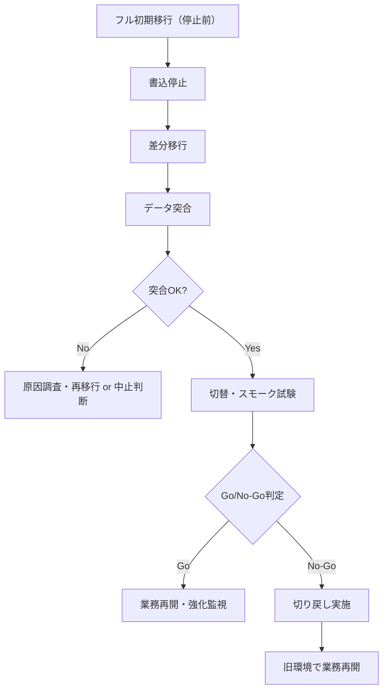

# 第13章 移行性・互換性

## 1. 学習目標

本章を終えると、次ができる。

- データ移行とシステム移行を区別し、停止時間とデータ整合性を数値化した要件を書ける
- リハーサル、差分移行、並行稼働、切り戻しを組み合わせた移行計画を設計できる
- 文字コード、タイムゾーン、API・バージョン互換性を検証項目に落とし込める
- 移行判定基準（Go/No-Go基準）と移行後確認の責任分界を合意できる

## 2. 基本概念

### 2.1 移行性と互換性の定義

**移行性**は、あるシステムやデータを、別の環境や新しいシステムへ、安全かつ許容範囲内の影響で移す容易さである。

**互換性**は、既存の利用者、データ形式、連携先システムと齟齬なく動作し続ける性質である。
移行性は「移す行為」に関する性質であり、互換性は「移した後も期待どおり動くか」に関する性質である。
両者は関連するが同じではない。
互換性が高くても、移行手順自体が長時間の停止を要すれば移行性は低い。

扱う要素は次のとおりである。

- データ移行、システム移行
- リハーサル、移行時間、停止時間
- データ整合性、差分移行、並行稼働
- 切り戻し
- 文字コード、タイムゾーン、API互換性、バージョン互換性
- 移行判定基準、移行後確認

### 2.2 データ移行とシステム移行

**データ移行**は、既存データを新しい環境やスキーマへ移す作業である。
形式変換、名寄せ、欠損データの補完などが伴うことがある。

**システム移行**は、稼働環境そのものを移す作業である（オンプレミスからクラウドへ、旧バージョンから新バージョンへ、など）。
データ移行を包含することが多いが、システム移行にはアプリケーションの再構築や、ネットワーク・認証基盤の切替も含まれる。

**一般論**として、データ移行はシステム移行の中で最もやり直しが利かない工程になりやすい。
アプリケーションの不具合はデプロイのやり直しで直せるが、データが誤って移行され、かつ旧環境が破棄された後では、復旧が極めて困難になる。

### 2.3 移行方式の全体像

移行方式は大きく次のように分類できる。

| 方式 | 概要 | 停止時間の傾向 | 向く条件 |
|------|------|----------------|----------|
| 一括移行（ビッグバン） | ある時点で全データ・全機能を一度に切り替える | 短期集中で長め | 業務停止を確保しやすい、システム規模が小さい |
| 段階移行（部門・機能単位） | 対象を分割して順次切り替える | 各回は短いが期間全体は長い | 大規模、部門ごとに停止時間を分散したい |
| 並行稼働 | 新旧を一定期間同時稼働させ、結果を突合する | 個々の停止は小さいが運用負荷は高い | 高い信頼性検証が必要な基幹システム |

**推奨事項**：移行対象の規模やリスクに応じて方式を選び、複数の方式を組み合わせることも検討する。
例えば、参照系は並行稼働で検証しつつ、更新系は一括で切り替える、という組み合わせも一般的である。

### 2.4 リハーサルの位置づけ

**リハーサル**は、本番移行の前に、本番相当の環境と手順で移行作業を試行することである。

リハーサルを省略すると、次のリスクが顕在化する。

- 想定していた移行時間が、実際のデータ量では大幅に超過する
- 手順書に記載のないエラーが発生し、対応が場当たりになる
- 切り戻し手順が机上のみで、実際には動作しない

**必須事項**：本番相当のデータ量と構成で、最低1回の総合リハーサルを実施し、目標停止時間内に完了することを確認する。

リハーサルと本番の差異（データ量、ネットワーク帯域、同時実行者数など）は、必ず記録し、本番移行時の見積もりに反映する。

### 2.5 移行時間と停止時間

**移行時間**は、移行作業全体（準備、データ移行、検証、切替）にかかる時間である。
**停止時間**は、そのうち業務が利用できない時間である。

移行時間のすべてが停止時間になるとは限らない。
準備や事前のデータ移行を書込停止前に済ませておけば、停止時間は「差分移行」と「切替検証」の時間だけに縮小できる。

典型的な移行のタイムラインは次のとおりである。

```mermaid
gantt
    dateFormat  HH:mm
    title 移行タイムライン（例示）
    section 事前作業（停止前）
    フル初期移行           :a1, 00:00, 6h
    事前検証               :a2, after a1, 1h
    section 停止期間
    書込停止・最終差分移行  :b1, 06:00, 1h
    データ突合             :b2, after b1, 30m
    切替・スモーク試験      :b3, after b2, 30m
    Go/No-Go判定           :b4, after b3, 15m
    section 事後
    業務再開・監視強化      :c1, after b4, 3h
```



### 2.6 データ整合性の検証と差分移行

**データ整合性**は、移行元と移行先でデータの内容が一致していることである。
検証方法の代表例は次である。

- 件数突合（テーブルごとのレコード件数比較）
- 合計値突合（金額や数量などの合計値比較）
- ハッシュ突合（データ内容から算出したハッシュ値の比較）
- サンプル抽出による詳細照合

**差分移行**は、事前のフル移行後、書込停止までの間に発生した更新分だけを追加で移行する手法である。
差分移行を使うことで、フル移行にかかる長時間を停止時間の外に出すことができる。

差分移行が成立するための前提条件は次である。

- 更新日時や変更ログなど、差分を検知できる仕組みが移行元にあること
- 差分移行の実行中に、移行元への新たな書込が発生しない、または制御されていること

### 2.7 並行稼働と切り戻し

**並行稼働**は、新システムと旧システムを一定期間同時に稼働させ、結果を突合しながら移行の信頼性を確認する方式である。
基幹業務や金額を扱うシステムなど、誤りの許容度が低い場合に採用される。

並行稼働には次の課題がある。

- 二重入力や二重処理による運用負荷の増加
- 新旧のデータ不整合が発生した場合の原因切り分けの複雑さ
- 並行稼働終了の判断基準を曖昧にすると、いつまでも旧システムを止められない

**切り戻し**は、移行後に重大な問題が発覚した場合、旧環境へ戻す作業である。
切り戻しの判断基準（どのような事象が発生したら戻すか）と、戻すための所要時間の目標値を、移行計画の段階で決めておく。

**必須事項**：切り戻し手順は、本番移行のリハーサルと同様に、事前に試行し動作を確認する。

### 2.8 文字コードとタイムゾーンの互換性

**文字コード**の不一致は、移行後に文字化けや、特定の文字（外字、絵文字、機種依存文字）の欠落として現れる。
移行元と移行先の文字コード（Shift_JIS、UTF-8など）を明示的に確認し、変換ロジックを検証する。

**タイムゾーン**の扱いは、日時データにUTCを使うかローカルタイムを使うかが混在していると、移行後に時刻がずれる不具合を生む。
特に、サマータイムの扱いがある地域と連携する場合や、複数のタイムゾーンにまたがる利用者がいる場合は注意が必要である。

**推奨事項**：新システムでは、内部保存はUTCに統一し、表示のみ利用者のタイムゾーンに変換する設計を基本とする。

### 2.9 API互換性とバージョン互換性

システム移行に伴い、外部連携APIやアプリケーションのバージョンが変わる場合、互換性の維持方針を決める必要がある。

- **API互換性**：レスポンス形式、必須パラメータ、エラーコードの体系が維持されているか
- **バージョン互換性**：クライアントアプリやバッチ処理が、新バージョンでも動作するか

第12章で扱った後方互換性の考え方は、移行の文脈でも同様に適用される。
移行時に破壊的な変更を伴う場合は、告知期間と並行提供期間を確保する。

### 2.10 移行判定基準と移行後確認

**移行判定基準**（Go/No-Go基準）は、移行作業を予定どおり完了させ本番切替を実施するか、中止して切り戻すかを判断する基準である。

判定基準の例は次である。

- データ突合の一致率が目標を満たしているか
- 主要な業務シナリオのスモーク試験が成功しているか
- 想定していた停止時間の枠内に収まっているか、または延長が許容範囲内か

**移行後確認**は、切替直後だけでなく、一定期間（数営業日）にわたり、業務が正常に行えることを確認する活動である。
「ログインできた」だけでは不十分であり、代表的な更新・参照操作、バッチ処理、外部連携、権限、バックアップ、監視までを確認範囲に含める。

**推奨事項**：移行直後の一定期間は、監視の閾値を通常より厳しくする、または監視の重大度判定を強化する「移行後強化監視期間」を設ける。

## 3. 業務上の意味

移行の失敗は、新機能の提供以前に、現行の業務そのものを止める。

「システムの移行が完了した」ことと、「業務が正常に再開できた」ことは、必ずしも同じではない。
データが正しく移っていても、権限設定が漏れていれば承認業務ができず、バッチジョブの起動設定が漏れていれば夜間処理が止まる。

したがって、移行プロジェクトの完了条件は、システム的な切替の完了ではなく、業務側の代表シナリオが正常に動作することの確認をもって定義する。

## 4. ヒアリング質問

停止時間と業務影響について。

- 許容される停止時間は何分か。延長が必要になった場合、誰が判断するか
- 移行を実施できる曜日・時間帯の制約は何か（月末を避ける、等）

データ整合性について。

- 移行対象データの範囲と、除外してよい古いデータの基準は何か
- 金額や数量など、突合の精度が特に重要な項目は何か

互換性について。

- 現行の文字コード、日付形式、タイムゾーンの仕様はどうなっているか
- 外部連携先のうち、移行に合わせた改修が必要な相手はどこか

判定と体制について。

- 移行判定（Go/No-Go）に必須の確認者、承認者は誰か
- 移行失敗時、旧環境へ戻す判断は誰が、どの基準で行うか
- 移行後、通常監視に戻すまでの強化期間はどの程度必要か

## 5. 要件例

### 要件例 NFR-MIG-001 システム移行の停止時間と切り戻し

- 要件ID：NFR-MIG-001
- 分類：移行性
- 対象：現行システムから新クラウド環境への切替
- 業務上の目的：切替時の業務停止を許容範囲に収め、問題発生時には迅速に旧環境へ戻せるようにする
- 前提条件：事前のフル初期移行と差分移行が可能であること。旧環境は切替後72時間は維持すること
- 指標：計画停止時間、切り戻し完了時間、重要データの突合一致率、移行後3営業日の重大障害件数
- 目標値：オンライン停止を120分以内に収める。切り戻し判断から60分以内に旧環境で業務再開できる。重要テーブルの件数・金額・ハッシュ突合一致率100%。移行後3営業日の重大度1障害を0件とする
- 測定条件：本番相当のデータ量による総合リハーサルを最低1回実施し、その結果を含める
- 測定方法：切替作業のタイムチャート記録、突合結果帳票、インシデント管理記録
- 合否判定：リハーサルで目標未達の場合、本番切替を実施しない
- 例外条件：外部連携先側の移行対応が間に合わない場合、当該連携のみ別日程とする課題管理を行う
- 実現方式：フル初期移行、差分移行、短時間の書込停止、DNS切替、切り戻しRunbook
- 検証方法：総合リハーサル、移行後確認チェックリストの実施
- 根拠：年間の計画停止枠（NFR-MNT-001）と業務影響分析の結果に基づく
- 関連要件：NFR-MNT-001、NFR-BKP-001、NFR-MNTN-001
- 未確定事項：帳票系データの文字コード変換方針の最終決定

### 要件例 NFR-MIG-002 データ整合性検証

- 要件ID：NFR-MIG-002
- 分類：移行性（データ整合性）
- 対象：移行対象の全業務テーブルおよび関連ファイル
- 業務上の目的：移行によるデータ欠損・破損・重複を防ぎ、移行後の業務判断を誤らせない
- 前提条件：移行元・移行先の双方でデータ抽出クエリが実行可能であること
- 指標：テーブルごとの件数突合一致率、金額系項目の合計値突合一致率、サンプル詳細照合の一致率
- 目標値：件数突合一致率100%。金額系合計値突合一致率100%。無作為抽出1,000件のサンプル詳細照合で不一致0件
- 測定条件：本番相当データでのリハーサル、および本番移行直後の実施
- 測定方法：突合スクリプトによる自動比較、サンプル抽出による目視照合
- 合否判定：いずれかの指標で不一致が検出された場合、原因究明と再移行、または移行中止を判断する
- 例外条件：既知の重複データ（統廃合前の旧コードなど）は、事前に除外リストとして合意した範囲に限り対象外とする
- 実現方式：突合スクリプトの自動化、差分移行ログの保存
- 検証方法：リハーサルでの突合結果レビュー、本番移行直後の突合結果レビュー
- 根拠：金額を扱う申請・承認データの誤りは、決裁や監査に直接影響するため
- 関連要件：NFR-MIG-001
- 未確定事項：サンプル抽出件数の最終合意（業務オーナー確認中）

### 要件例 NFR-MIG-010 API互換性の維持

- 要件ID：NFR-MIG-010
- 分類：移行性（互換性）
- 対象：外部連携APIのうち、移行に伴い基盤が変更されるもの
- 業務上の目的：連携先の改修負荷を予測可能にし、移行に起因する連携障害を防ぐ
- 前提条件：連携先一覧と、各連携先の改修リードタイムが把握されていること
- 指標：API互換試験の合格率、破壊的変更に対する事前告知期間
- 目標値：既存連携先向けの回帰試験合格率100%。破壊的変更がある場合は移行の3か月前までに告知する
- 測定条件：本番相当環境での回帰試験
- 測定方法：既存クライアントを用いた自動回帰試験、告知記録の確認
- 合否判定：回帰試験で1件でも不合格があれば移行対象から除外し個別対応する
- 例外条件：連携先が既に廃止合意済みのAPIはこの限りでない
- 実現方式：APIバージョニング、レスポンス形式の互換維持、告知テンプレートの送付
- 検証方法：回帰試験、連携先への疎通確認
- 根拠：外部連携先の平均改修リードタイムが2〜3か月であるという実績
- 関連要件：NFR-MNTN-010
- 未確定事項：一部連携先の改修体制の確認中

## 6. 悪い要件例

1. 「スムーズに移行すること」
2. 「互換性を維持すること」
3. 「問題があれば切り戻すこと」
4. 「データはすべて正しく移行すること」
5. 「移行後に問題がないことを確認すること」

いずれも、対象範囲、時間、判定基準、測定方法のいずれかが欠けている。
例4は「すべて正しく」の判定方法（何をもって正しいとするか）が示されていない。
例5は確認範囲と期間が不明である。

## 7. 改善後の要件例

### 悪い例1の改善：「スムーズに移行すること」

NFR-MIG-001が改善例である。
停止時間、切り戻し時間、突合一致率、移行後障害件数を数値化した。

### 悪い例2の改善：「互換性を維持すること」

NFR-MIG-010へ分解する。
「既存連携API v1は、切替後6か月間、既存のレスポンス項目を維持する。削除する場合は3か月前に告知する」のように、対象、期間、告知条件を明示した。

### 悪い例3の改善：「問題があれば切り戻すこと」

「問題」の定義と判定基準が必要である。
NFR-MIG-001の合否判定に組み込み、「データ突合の不一致が検出された場合」「代表シナリオのスモーク試験が失敗した場合」など、切り戻しの発動条件を明示する。

### 悪い例4・5の改善：「データはすべて正しく移行すること」「移行後に問題がないことを確認すること」

NFR-MIG-002へ分解する。
件数突合、金額突合、サンプル照合という具体的な検証方法と、それぞれの目標一致率を定義した。

## 8. 設計への落とし込み

移行タイムボックスの標準的な流れは次のとおりである。

1. 事前：フル初期移行、事前検証
2. 開始：書込停止
3. 差分移行、データ突合
4. 切替、スモーク試験
5. 業務確認、Go/No-Go判定
6. 失敗時：切り戻し実施



**採用**：短時間の書込停止による一括切替方式。
**不採用**：長期間の並行稼働と二重入力運用。
**理由**：並行稼働は運用負荷と不整合リスクが高く、本シナリオの業務規模では割に合わない。
**残存リスク**：告知が行き届かなかった利用者による旧環境への書込が発生しうる。
メンテナンス画面の表示とアクセス制御を必須化して緩和する。

## 9. 代替案

| 方式 | 向く条件 | 向かない条件 |
|------|----------|--------------|
| 一括切替（本章採用例） | 停止時間を確保でき、対象規模が中程度 | 24時間稼働必須で停止を確保できない |
| 段階切替（部門・機能単位） | 大規模で、段階的にリスクを分散したい | 部門間でデータ連携が密結合な業務 |
| 並行稼働（新規は新システム、更新は旧参照） | 高い信頼性検証が必要な基幹業務 | 運用負荷の増加を許容できない体制 |
| 新規データのみ新システム、履歴は旧システム参照専用 | 履歴データ量が膨大で全件移行が非現実的 | 履歴への頻繁な更新要求がある業務 |

## 10. トレードオフ

| 対立 | 一方を優先すると | 他方に起きること |
|------|------------------|------------------|
| 停止時間の短縮 vs 突合の徹底度 | 停止を短くする | 突合が不十分になり、後日不整合が発覚するリスクが増える |
| 並行稼働による信頼性 vs 運用複雑性 | 並行稼働を選ぶ | 二重入力や不整合の運用負荷が増える |
| 互換性の長期維持 vs 新システムの改善速度 | 互換性を優先する | 古い仕様への対応コストが残り続ける |
| リハーサルの回数 vs スケジュールとコスト | リハーサルを増やす | プロジェクト期間と費用が増加する |

## 11. 検証方法

- 文字コード・タイムゾーンの変換試験
- 件数・金額・ハッシュによるデータ突合
- API互換性の回帰試験
- 本番相当データによる総合リハーサル
- 切り戻し訓練
- 移行後の強化監視期間における代表シナリオの継続確認

## 12. よくある失敗

1. リハーサルを実施せずに本番移行へ進む
2. 停止時間の見積もりに、データ突合や検証の時間を含めない
3. 切り戻し手順が机上のみで、実際には検証されていない
4. タイムゾーンをUTCとローカルタイムで混在させたまま移行する
5. 「システムが起動した」「ログインできた」だけで移行完了と判断する
6. 外部連携先への告知が遅れ、移行後に連携障害が発生する
7. 移行後の強化監視期間を設けず、通常監視のまま様子見にする
8. 除外データの基準を曖昧にしたまま移行し、後から必要なデータが欠落していたと判明する

## 13. レビュー観点

- [ ] 停止時間と切り戻し時間が数値目標として定義されているか
- [ ] データ整合性の検証方法（突合の種類と一致率目標）があるか
- [ ] 文字コード、タイムゾーンの方針が明示されているか
- [ ] API・バージョン互換の対象と告知期間が定義されているか
- [ ] Go/No-Go判定基準が明文化されているか
- [ ] 移行後確認の範囲（業務シナリオ、バッチ、連携、権限、監視）が網羅されているか
- [ ] リハーサルの実施計画があるか

## 14. 章末問題

### 問題1

差分移行を採用するための前提条件を2つ挙げよ。

### 問題2

移行後確認が「ログインできた」ことのみで完了とされていた場合、不足している確認項目を4つ挙げよ。

### 問題3

前提：オンライン停止許容時間は120分。書込停止からデータ突合完了までに75分、切替・スモーク試験に30分、Go/No-Go判定に10分を要する見積もりである。
この計画は許容時間内に収まるか、計算して判定せよ。

### 問題4

外部連携先への告知なしにAPIの破壊的変更を伴う移行を実施し、連携障害が発生した。
再発防止のために要件へ追加すべき項目を、標準形式の主要項目（指標・目標値）で簡潔に示せ。

## 15. 解答と解説

### 問題1

第一に、移行元システムに更新日時や変更ログなど、差分を検知できる仕組みが存在すること。
第二に、差分移行の実行中、移行元への新たな書込を制御（停止または限定）できることである。

### 問題2

代表的な更新操作（申請・承認）の実行確認、バッチ処理の正常起動確認、外部連携の疎通確認、権限設定の反映確認、バックアップ取得の再開確認、監視設定の反映確認などが不足している。

### 問題3

```text
所要時間合計 = 75分 + 30分 + 10分 = 115分
```

許容時間120分に対して115分であり、計算上は収まる。
ただし余裕が5分しかなく、リハーサルでの実測にばらつきがあれば超過するリスクが高い。
**推奨事項**として、想定外事象への対応時間を見込んだバッファ（例：15〜30分）を計画に含めるべきである。

### 問題4

指標：破壊的なAPI変更に対する事前告知期間。
目標値：告知期間3か月以上を100%の対象で確保する。
これにより、告知漏れによる連携障害の再発を防ぐ。

## 16. 実務演習

実務シナリオ（従業員5,000人のWeb業務システム）を題材に、次を作成せよ。

1. 移行判定チェックリスト（15項目、Go/No-Go判定に使う基準を含む）
2. No-Go時の切り戻しタイムチャート（判断から旧環境再開までの時間軸）
3. データ突合計画（対象テーブル、突合方法、目標一致率を含む表）
4. 外部連携先への告知スケジュール案（告知時期、内容、確認方法）

---

## 次章予告

第14章ではクラウド固有の非機能設計を扱う。
責任共有モデル、クォータ、マネージドサービスのSLA、ベンダーロックインへの対処を中心に扱う。
