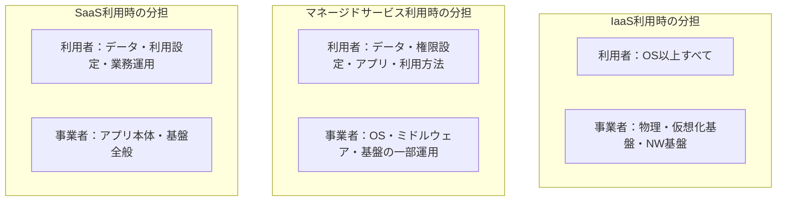
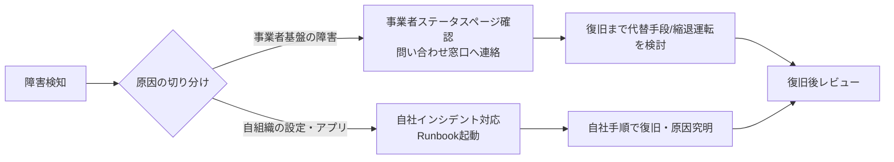

# 第14章 クラウドにおける非機能設計

## 1. 学習目標

本章を終えると、次ができる。

- 責任共有モデルを前提に、平常時と障害時の責任分界を具体的な作業単位で説明できる
- サービスクォータ、AZ、リージョン、クラウドサービスSLAを、業務システム全体の非機能目標と混同せずに扱える
- オートスケーリング、従量課金、コスト上限、データ転送料、ベンダーロックインを設計判断とコスト判断の両方に反映できる
- オンプレミスとの違いを、調達、監視、運用、サービス廃止のリスクまで含めて対比できる

## 2. 基本概念

クラウド上のシステムは、非機能要件の種類が変わるわけではない。
可用性、性能、拡張性、セキュリティといった品質特性は第3章から第13章までの枠組みがそのまま適用できる。
変わるのは、誰がその品質を作り込み、誰が保証し、誰が障害時に責任を持つかという構造である。

本章はその構造を扱う。
クラウド事業者のマーケティング資料に書かれた数字を、そのまま自システムの非機能要件だと思い込むことが、実務で最も多い失敗である。

### 2.1 責任共有モデル

**責任共有モデル**とは、システムを支える要素を、クラウド事業者が担う範囲と、利用者が担う範囲に分けて考える枠組みである。
一般論として、境界線はサービスの提供形態によって変わる。

| サービス形態 | 事業者が担う傾向 | 利用者が担う傾向 |
|--------------|------------------|------------------|
| IaaS（仮想サーバなど） | 物理設備、仮想化基盤、ネットワーク基盤 | OS、ミドルウェア、アプリ、データ、権限設定 |
| PaaS・マネージドサービス | 上記に加えOSやミドルウェアの一部運用 | アプリ、データ、権限設定、利用方法 |
| SaaS | 上記に加えアプリそのものの運用 | データ、利用設定、権限、業務運用 |



境界線を正確に理解しないと、次のような事故が起きる。

- ストレージの公開範囲設定を利用者が誤り、非公開のはずのデータが外部から参照できる状態になる
- 権限設定は事業者の責任範囲だと誤解し、最小権限化を怠る
- マネージドデータベースのバックアップ設定が既定でオフになっていることに気づかず、復元できない

**必須事項**：採用するサービスごとに、責任共有モデルの境界を文書化し、利用者側の作業項目を明示する。
「クラウドだから安全」「マネージドだから任せておける」は、責任分界の確認を省略する理由にならない。

### 2.2 マネージドサービスとサービスクォータ

**マネージドサービス**とは、ミドルウェアや基盤の運用作業の一部を事業者に委譲できるサービスである。
パッチ適用、冗長化、バックアップ取得の一部が自動化され、運用負荷が下がる。
一方で、設定できる項目、拡張できる方向、障害時に利用者が介入できる範囲には制約がある。

**サービスクォータ**とは、API呼び出し回数、同時接続数、インスタンス数、帯域幅など、クラウド事業者があらかじめ設定している上限値である。
既定値のまま設計すると、負荷試験や本番のピーク時に、性能要件を満たす前にクォータで頭打ちになることがある。

サービスクォータは、次の性質を持つ。

- 既定値はサービスや契約プランによって異なる
- 引き上げには申請が必要であり、即時反映されないことが多い
- 引き上げ後も、上位のさらに大きな上限（ハードリミット）が存在する場合がある

**推奨事項**：キャパシティ計画（第5章）で算出した設計ピークに対し、主要なクォータの現在値を突き合わせ、不足するクォータの引き上げリードタイムを増強計画に組み込む。
第5章の実務シナリオでは、設計ピーク同時利用者を1,872人相当としていた。
仮に、ある管理対象サービスの同時接続クォータの既定値が1,500であれば、この時点で設計ピークに対して不足している。

### 2.3 AZとリージョン

**可用性ゾーン（AZ）**は、同一リージョン内で、電源、空調、ネットワークなどの物理的な障害単位を分離した区画である。
**リージョン**は、地理的に離れた場所に設けられた独立したデータセンター群の単位である。

AZとリージョンの分離は、可用性設計（第3章）における冗長化の実現手段の一つである。
ただし、AZやリージョンをまたいで分散させれば自動的に高可用性になるわけではない。
データの複製方式、フェイルオーバーの自動化、アプリケーションのステートレス化が伴わなければ、分散構成は名目だけのものになる。

### 2.4 クラウドサービスSLA

**クラウドサービスSLA**とは、個々のクラウドサービス（仮想サーバ、マネージドデータベース、オブジェクトストレージなど）について、事業者が契約上約束する可用性等の水準である。

**必須事項**：個別サービスのSLAを、業務システム全体の可用性（エンドツーエンドの稼働率）としてそのまま報告書や要件書に転記しない。

理由は次の三点である。

1. SLAは個別サービス単位であり、複数サービスを組み合わせたシステム全体の可用性はそれぞれの積で近似され、単一サービスのSLAより低くなる
2. SLAの対象はサービス基盤の可用性であり、利用者の設定ミス、アプリ欠陥、権限誤設定による停止は対象外であることが多い
3. SLA未達時の救済は、多くの場合、利用料の一部返金（サービスクレジット）であり、業務損失を補填するものではない

数値例で確認する。

前提：オンライン処理が、マネージド仮想サーバ群（SLA 99.95%）、マネージドデータベース（SLA 99.99%）、マネージドメッセージキュー（SLA 99.9%）の三つに直列に依存するとみなす。
第3章の直列結合の式 `A_total = A1 × A2 × A3` を用いる。

```text
0.9995 × 0.9999 × 0.999 ≈ 0.9984 = 99.84%
```

結果は99.84%であり、依存する三サービスのうち最も低いSLAの99.9%よりもさらに低くなる。
「一番信頼できるサービスのSLAを使っているから大丈夫」という説明が成立しない理由はここにある。
さらに、この99.84%は契約上の数字の掛け合わせにすぎず、利用者側の設定不備やアプリ欠陥によるダウンタイムは含まれていない。
自システムのSLOは、この契約値を出発点にしつつ、依存関係の掛け算と利用者側リスクを加味して、独自に定義する必要がある。

SLA未達時の救済についても、規模感を例示しておく。

前提：あるマネージドサービスの月額利用料が20万円、SLA未達時のクレジットが利用料の10%とする。

```text
救済額 = 200,000円 × 10% = 20,000円/月
```

一方で、当該サービス停止により平日日中1時間の業務が止まった場合の損失は、第15章で試算する方法に従うと、これよりはるかに大きくなり得る。
SLAの補償は、業務影響を相殺する保険ではない。

### 2.5 オートスケーリング

**オートスケーリング**とは、負荷の増減に応じて、資源の数や大きさを自動的に調整する仕組みである。
性能要件（第4章）とキャパシティ要件（第5章）を、運用の自動化として実現する手段の一つである。

オートスケーリングを非機能要件として扱う際は、次を明示する。

- 何を指標にスケールするか（CPU使用率、キュー滞留数、応答時間など）
- 最小・最大の台数または容量
- スケールアウトとスケールインのそれぞれの反応時間
- スケールしても性能要件を満たせない場合の扱い

**必須事項**：オートスケーリングの上限を無制限に設定しない。
上限がないと、異常な負荷やバグによる再試行の連鎖（リトライストーム）が発生した際に、資源と費用が際限なく増加する。

### 2.6 従量課金とコスト上限

**従量課金**とは、利用した資源量に応じて費用が発生する課金方式である。
性能を上げる、可用性を上げる、拡張性を高めるといった非機能の強化は、多くの場合そのまま費用の増加に直結する。

クラウド特有の非機能要件として、次を検討する。

- 予算に対する使用率のアラート閾値
- 予算超過時に、誰が、何を、どこまで止めてよいか
- 異常課金（設定ミス、攻撃、無限ループ等）の検知方法

**推奨事項**：予算アラートは、予算の80%到達で警告、100%到達で関係者への通知と対応要否の判断を行う運用にする。
費用の詳細は第15章で扱う。

### 2.7 データ転送料

**データ転送料**とは、ネットワークを介したデータの送受信、特にクラウド外部への送信（アウトバウンド通信）に対して課金される費用である。

見落とされやすい発生源は次のとおりである。

- ディザスタリカバリ用のリージョン間レプリケーション
- バックアップデータの別リージョンまたは別クラウドへの保管
- ログやメトリクスの外部監視サービスへの転送
- 大量データを扱うバッチのファイル授受

**推奨事項**：可用性設計書やDR設計書でマルチリージョン構成を採用する際は、転送料を初期見積もりの段階でTCO（第15章）に含める。
移行時や障害時にだけ発生する転送料も、事前に概算しておく。

### 2.8 ベンダーロックイン

**ベンダーロックイン**とは、特定のクラウド事業者やその独自サービスへの依存が強くなり、他への移行が技術的または費用的に困難になる状態である。

ロックインは一般論として善悪の二択ではない。
独自サービスを使うことで得られる開発生産性や運用負荷の軽減と、移行困難性はトレードオフの関係にある。

**推奨事項**：ロックインの度合いが高い設計を採用する場合は、採用理由、得られる効果、移行困難性の見積もり、撤退基準を設計書に残す。
「気づいたら戻れなくなっていた」という状態を避けることが目的であり、独自サービスの利用そのものを禁止することが目的ではない。

### 2.9 障害時の責任分界

障害発生時、原因がクラウド事業者側の基盤にあるのか、利用者側の設定やアプリにあるのかを、初動の段階で切り分ける必要がある。



**推奨事項**：運用設計書（第17章）に、事業者側障害と自組織側障害それぞれの初動手順、エスカレーション先、代替手段を分けて記載する。
事業者側の障害だからといって、自組織の対応が不要になるわけではない。
利用者への状況説明、代替手段の提供、業務側への影響連絡は、原因の所在にかかわらず自組織の責任である。

### 2.10 サービス廃止

クラウド事業者は、サービスや機能を予告のうえ廃止（EOL、非推奨化）することがある。
オンプレミスの自社機器と異なり、廃止の判断は事業者側にあり、利用者は基本的に予告期間内の対応を求められる。

**推奨事項**：利用中のサービスについて、廃止予告の通知を受け取る窓口を明確にし、予告から移行完了までの標準リードタイムを運用体制に組み込む。
特定サービスへの依存度が高いほど、廃止時の影響と移行コストは大きくなる。

### 2.11 IaC

**IaC**（Infrastructure as Code）とは、インフラの構成をコードとして記述し、バージョン管理と自動適用の対象にする手法である。

IaCは、次の非機能特性を支える基盤になる。

- 再現性：同じ構成を、検証環境や障害復旧時に再現できる
- 監査性：変更履歴が残り、誰が何をいつ変更したかを追跡できる
- 一貫性：手動操作による設定ドリフト（構成のばらつき）を防ぐ

**推奨事項**：本番環境の構成変更は、手動のコンソール操作ではなくIaCを経由することを原則とし、例外操作は事後に構成へ反映する運用ルールを定める。

### 2.12 クラウド固有の監視

オンプレミスの監視項目（第11章）に加えて、クラウド環境では次を監視対象に含める。

- サービスクォータの使用率
- クラウド事業者側の稼働状況（ステータスページ、ヘルスAPI）
- 想定外の課金の兆候（急激な利用量増加）
- 権限設定や公開設定の変更（意図しない公開の検知）

これらはアプリケーションの死活監視だけでは検知できない。
クラウド固有の監視項目を欠くと、クォータ枯渇や誤公開の発見が利用者からの申告頼みになる。

### 2.13 オンプレミスとの違い

| 観点 | オンプレミスの傾向 | クラウドの傾向 |
|------|--------------------|----------------|
| 調達リードタイム | 数週間から数か月 | 短いが、サービスクォータの制約がある |
| 故障時の対応 | 自組織で機器を交換 | 基盤は事業者、設定と検知は自組織 |
| 費用構造 | 初期投資中心の固定費 | 従量課金中心、予約割引等の選択肢あり |
| 拡張の手段 | 事前の計画調達 | 自動または申請による伸縮 |
| 責任の所在 | 自組織に集中しやすい | 契約と設定内容に応じて分散する |
| 廃止のリスク | 自組織の判断でライフサイクル管理 | 事業者都合の廃止予告に従う必要がある |

一般論として、どちらか一方が常に優れているわけではない。
制約の形が異なるため、非機能要件を満たす手段の選択肢が変わる、と理解するのが実務的である。

## 3. 業務上の意味

クラウド移行は、運用責任の消失を意味しない。
誤設定による意図しない公開、過大な権限付与、バックアップの未設定は、いずれも利用者側の責任範囲で発生する。

「クラウドを使っているから可用性が高い」という説明は、設計と運用が伴わない限り成立しない。
逆に、クラウドの機能を正しく組み合わせれば、オンプレミスでは実現しにくかった水準の冗長化や自動復旧を、比較的短期間で実現できる場合もある。
重要なのは、クラウドを使うこと自体ではなく、責任分界を理解したうえでの設計と運用である。

## 4. ヒアリング質問

- 採用予定のマネージドサービスについて、責任共有モデルの境界を誰が確認し、文書化するか
- 主要なサービスクォータの引き上げにかかる標準的な日数は何日か
- データの保管場所について、国外リージョンの利用可否などの制約はあるか
- 月額のクラウド利用料に上限はあるか。超過時に誰がどう判断するか
- 利用中の特定サービスが廃止された場合、許容できる移行期間はどれくらいか
- クラウド事業者の障害時、代替手段や縮退運転の方針は決まっているか
- IaCによる構成管理を既に導入しているか。導入していない場合、導入の予定はあるか

## 5. 要件例

要件記述の標準形式に沿った例を三つ示す。
数値は例示であり、実務シナリオでは根拠の精緻化が必要である。

### 要件例 NFR-CLD-001（クォータと予算のガード）

- 要件ID：NFR-CLD-001
- 分類：クラウド非機能（クォータ・コスト管理）
- 対象：本番アカウントの主要マネージドサービス（コンピュート、データベース、メッセージキュー）
- 業務上の目的：クォータ不足によるピーク時の処理停止、および予算超過による緊急停止を防ぐ
- 前提条件：設計ピークはNFR-CAP-001（同時利用者1,872人相当）に従う
- 指標：主要クォータの使用率、クォータ引き上げ申請から反映までのリードタイム、月額費用の予算比
- 目標値：重要クォータの使用率が70%に到達した時点で引き上げ申請を起票する。引き上げ完了まで10営業日以内とする。月額費用は予算比80%で警告、100%到達で関係者へ自動通知し、追加拡張の可否を判断する
- 測定条件：本番環境における月次のクォータ使用率集計、および四半期ごとの負荷試験前点検
- 測定方法：クラウド事業者の使用量メトリクス、予算アラート機能、変更管理票の記録
- 合否判定：ピーク発生前に、クォータ不足に起因する処理停止または遅延が0件であること
- 例外条件：制度改正等による臨時のピークが判明した場合は、通常のリードタイムに関わらず緊急申請ルートを使用する
- 実現方式：クォータ使用率監視、予算アラート、IaCによる構成管理、マルチAZ構成
- 検証方法：負荷試験前のクォータ点検、予算アラートの発報試験
- 根拠：クラウド環境でも、クォータと費用は物理的・契約的な制約として存在するため
- 関連要件：NFR-CAP-001（キャパシティ）、NFR-COST-001（コスト上限）
- 未確定事項：予約割引や長期契約を用いる場合の最終的な費用方針

### 要件例 NFR-CLD-002（クラウドサービスSLAの取り扱い）

- 要件ID：NFR-CLD-002
- 分類：クラウド非機能（可用性の取り扱い）
- 対象：本番システムが依存する全マネージドサービス
- 業務上の目的：個別サービスのSLAを業務システム全体の可用性と混同せず、正しい前提でSLOを管理する
- 前提条件：依存するマネージドサービスの一覧とSLAが可用性設計書に記載されている
- 指標：依存サービスのSLA一覧の整備状況、合成可用性の試算値、自システムSLOとの整合
- 目標値：依存する全マネージドサービスのSLAを可用性設計書に記載し、直列結合として合成可用性を試算する。試算値と自システムSLOの差分を明示する
- 測定条件：基本設計完了時点、および依存サービス追加・変更時
- 測定方法：可用性設計書のレビュー、SLA一覧と合成計算の突合
- 合否判定：SLA一覧の未記載サービスが0件であること。合成可用性試算が自システムSLOの根拠資料に反映されていること
- 例外条件：試験提供中（プレビュー）のサービスはSLA対象外であるため、採用可否を別途セキュリティ・可用性の両面でレビューする
- 実現方式：依存サービス台帳の整備、可用性設計書のレビュー手順への組み込み
- 検証方法：設計レビュー、監査
- 根拠：SLAの単純転記による可用性目標の誤認を防ぐため
- 関連要件：NFR-AVL-001（第3章）
- 未確定事項：依存サービスの追加時に台帳を更新する運用ルールの最終確定

### 要件例 NFR-CLD-003（ベンダーロックインと撤退可能性）

- 要件ID：NFR-CLD-003
- 分類：クラウド非機能（移行性）
- 対象：本番システムの主要コンポーネント
- 業務上の目的：特定事業者への過度な依存によって将来の移行が不可能になる事態を避ける
- 前提条件：採用する独自サービスの一覧が保守設計書に記載される
- 指標：独自サービスへの依存度（代替手段の有無）、撤退時の想定移行工数
- 目標値：独自性の高いサービスを採用する場合、採用理由、得られる効果、代替手段の有無、想定移行工数を設計書に記載する。記載のない独自サービス採用を0件とする
- 測定条件：基本設計完了時点、および主要サービスの追加・変更時
- 測定方法：設計書レビュー、アーキテクチャ判断記録の確認
- 合否判定：主要な独自サービスすべてについて、採用理由と残存リスクの記載があること
- 例外条件：代替困難であっても、業務上の必要性が高く経営層が残存リスクを受容した場合は例外として記録する
- 実現方式：アーキテクチャ判断記録（ADR）の作成、設計レビューへの組み込み
- 検証方法：設計レビュー
- 根拠：後年の移行判断を、感覚ではなく記録に基づいて行うため
- 関連要件：NFR-CLD-001
- 未確定事項：将来のマルチクラウド化方針の有無

## 6. 悪い要件例

次は要件として不合格である。

1. 「クラウドの高可用性を利用すること」
2. 「マネージドサービスを積極的に活用すること」
3. 「SLA 99.99%のサービスを使うので可用性は問題ない」
4. 「クラウドのため拡張性は自動的に確保されている」
5. 「コストは適切な範囲に収めること」

不合格理由は共通している。
対象、条件、指標、目標値、測定方法、判定基準のいずれかが欠けている。
加えて、例3は個別サービスのSLAをシステム全体の可用性にすり替えており、例4はオートスケーリングの設定なしに拡張性が確保されるという誤った前提を持つ。

## 7. 改善後の要件例

### 悪い例1・2の改善：「高可用性」「マネージドサービスの活用」

高可用性という要求は、第3章のNFR-AVL-001（業務時間帯の計画外稼働率）へ分解する。
マネージドサービスの採用可否は、責任共有モデルの理解と、運用負荷削減効果、制約事項を設計書で比較したうえで判断する。
「活用すること」自体を要件にしない。

### 悪い例3の改善：「SLA 99.99%だから問題ない」

本章のNFR-CLD-002へ置き換える。
個別サービスのSLAは、可用性設計の入力情報の一つとして扱い、依存サービスを直列結合で合成した試算値と、自システムのSLO（第3章NFR-AVL-001）を別々に管理する。

### 悪い例4の改善：「拡張性は自動的に確保」

オートスケーリングの指標、最小・最大容量、反応時間を明示した要件へ置き換える。
第5章のNFR-CAP-001と組み合わせ、クォータの制約（本章2.2節）も明示する。

### 悪い例5の改善：「コストは適切な範囲」

本章のNFR-CLD-001、および第15章のNFR-COST-001へ置き換える。
「適切」を、予算比の警告閾値と超過時の判断プロセスに変換する。

## 8. 設計への落とし込み

責任分界とサービス選定は、設計判断の記録として残す。

採用例（実務シナリオ向け）：オンライン処理をマネージドデータベースとコンテナ実行基盤の組み合わせで構築し、マルチAZ配置とする。

不採用案：全層を素の仮想サーバで自前構築する方式。
理由：運用体制の人員が限られており、OSやミドルウェアのパッチ運用まで自組織で担うと、他の非機能項目（監視、セキュリティ対応）に手が回らなくなる。

残存リスク：マネージドサービスの仕様変更、クォータ制約、データ転送料、事業者側障害時のステータス依存。
これらは責任分界表として運用設計書に添付し、監視項目と対応付ける。

| 項目 | 事業者責任 | 利用者責任 | 監視項目 |
|------|------------|------------|----------|
| マネージドDB基盤の稼働 | ○ | - | 事業者ステータス |
| DBのバックアップ設定 | - | ○ | バックアップ成功率 |
| ネットワーク経路の暗号化設定 | - | ○ | 設定監査 |
| 仮想化基盤の物理障害対応 | ○ | - | 事業者ステータス |
| アプリの権限設定 | - | ○ | 権限変更ログ |

## 9. 代替案

| 方式 | 向く条件 | 向かない条件 |
|------|----------|--------------|
| IaaS中心（自前構築） | 運用体制が厚く、独自制御が必要 | 運用人員が少ない、リリース速度を優先したい |
| PaaS・マネージド中心 | 運用負荷を下げたい、標準的な要件が中心 | 極めて特殊な制御や既存資産との強い互換性が必要 |
| ハイブリッド（規制データのみオンプレ等） | 一部データに強い保管場所制約がある | 構成が複雑になり運用難度が上がる |

## 10. トレードオフ

| 対立 | 一方を選ぶと | 他方に起きること |
|------|--------------|-------------------|
| マネージドの利便性 vs ロックイン | 開発・運用が楽になる | 移行コストと依存度が増える |
| マルチリージョン耐性 vs 転送料・複雑性 | 広域災害への耐性が上がる | 費用と運用複雑性が増える |
| 即時のオートスケール vs 予算超過リスク | ピーク追従が速くなる | 予算ガードとFinOps体制が必要になる |
| 事業者依存 vs 自前運用 | 運用負荷が下がる | 事業者側の判断に振り回されるリスクが増える |

## 11. 検証方法

- 責任分界表のレビュー（サービスごとに事業者・利用者の担当が明記されているか）
- サービスクォータの到達試験（ステージング環境での上限到達確認）
- AZ障害を模擬した試験（インスタンス停止、サブネット遮断等）
- 予算アラートの発報試験
- サービス廃止を想定した机上訓練
- 誤公開設定の検知スキャン

## 12. よくある失敗

1. 個別サービスのSLAを、そのままシステム全体の稼働率として報告する
2. サービスクォータの存在を、負荷試験の前日になって初めて知る
3. データ転送料を初期の見積もりから外し、後で費用超過に気づく
4. ストレージやAPIの公開範囲を広く設定したまま放置し、事故につながる
5. サービス廃止の予告通知を見落とし、移行期限直前に対応する
6. IaCを導入せず、手動のコンソール操作で本番環境を変更し続ける
7. オートスケーリングの上限を設定せず、異常負荷で費用が急増する
8. 独自サービスへの依存度を記録せず、後年の移行判断材料がない

## 13. レビュー観点

- [ ] 採用サービスごとに責任共有モデルの境界が文書化されているか
- [ ] 主要なサービスクォータと、設計ピークとの突き合わせがあるか
- [ ] クォータ引き上げのリードタイムがキャパシティ計画に反映されているか
- [ ] 個別サービスのSLAが、システム全体の可用性として誤用されていないか
- [ ] データ転送料がTCOの見積もりに含まれているか
- [ ] 独自サービス採用の理由と残存リスクが記録されているか
- [ ] サービス廃止時の対応窓口とリードタイムが定義されているか
- [ ] IaCによる構成管理の方針があるか
- [ ] クラウド固有の監視項目（クォータ、課金異常、公開設定変更）があるか

## 14. 章末問題

### 問題1

マネージドデータベースの障害で業務が停止した。
利用者側で確認すべき責任範囲を、本章の内容に基づいて3つ挙げよ。

### 問題2

オートスケーリングの最大インスタンス数を無制限に設定することの危険性を、コストと非機能の両面から説明せよ。

### 問題3

依存する3つのマネージドサービスのSLAが、それぞれ99.9%、99.95%、99.99%であるとき、直列結合とみなした場合の概算の合成可用性を計算せよ。
また、この数字を業務システム全体の可用性としてそのまま報告することの問題点を述べよ。

## 15. 解答と解説

### 問題1

例：マルチAZ設定の有無、アプリ側の接続リトライ実装、バックアップ取得と復元手順の整備状況、障害時のアプリケーション縮退設計、監視とインシデント対応の自組織側手順。

### 問題2

コスト面：異常な負荷、攻撃、バグによる再試行の連鎖が発生した場合、資源と費用が際限なく増加し、他のシステムやサービス全体の予算を圧迫する。
非機能面：無制限のスケールアウトは、背後にある共有資源（データベース接続数やサービスクォータ）の上限に達し、かえって性能劣化や障害を招くことがある。

### 問題3

```text
0.999 × 0.9995 × 0.9999 ≈ 0.9984 = 99.84%
```

この数字を業務システム全体の可用性として報告することの問題点は、利用者側の設定ミスやアプリ欠陥によるダウンタイムが含まれておらず、実際の業務影響を過小評価する点である。
自システムのSLOは、この合成値を出発点として、利用者側リスクを加味したうえで独自に定義する必要がある。

## 16. 実務演習

実務シナリオ（従業員5,000人のWeb業務システム、クラウド上での構築を想定）を使い、次を実施せよ。

1. 主要な採用サービス（コンピュート、データベース、認証基盤等）ごとに、責任共有モデルの分担表を10行作成する
2. 各行に、対応する監視項目を1つ対応付ける
3. 依存するマネージドサービスのSLAを仮に3つ設定し、合成可用性を計算する
4. 独自性の高いサービスを1つ選び、採用理由、得られる効果、撤退困難性を100字程度でまとめる
5. サービスクォータ引き上げのリードタイムを仮置きし、キャパシティ計画（第5章）との整合を確認する

---

## 次章予告

第15章ではコストと非機能要件を扱う。
初期費用、運用費用、TCOの観点から非機能案を比較し、過剰品質と品質不足をどう見極めるかを、FinOpsの考え方とあわせて示す。
