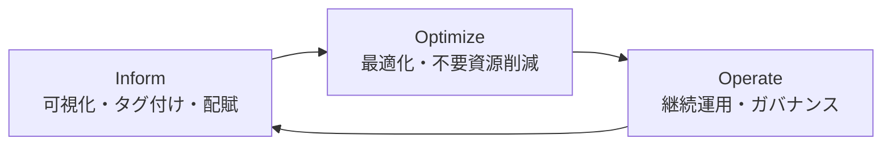

# 第15章 コストと非機能要件

## 1. 学習目標

本章を終えると、次ができる。

- 初期費用、運用費用、TCOの観点で非機能案を比較できる
- 冗長化、DR、バックアップ、ライセンス、人件費など、費用が発生する要因を項目ごとに説明できる
- 業務影響額と対策費用を突き合わせ、過剰品質と品質不足を数字で見極められる
- FinOpsの考え方を、設計判断と運用のフィードバックループとして使える

## 2. 基本概念

非機能要件の水準を上げることは、ほぼ例外なく費用を上げる。
可用性を一段上げれば冗長化と運用の費用が増え、性能目標を厳しくすれば資源とライセンスの費用が増え、セキュリティを強化すれば認証基盤や監査の費用が増える。
本章は、この費用の内訳を分解し、意思決定者が比較できる形にする方法を扱う。

### 2.1 初期費用と運用費用

**初期費用**とは、システムの設計、構築、試験、移行、初期導入研修などにかかる、稼働開始までの一時的な費用である。

**運用費用**とは、稼働開始後、継続的に発生する費用である。
クラウド利用料、ライセンス更新料、保守契約料、人件費、消耗品的な費用（バックアップ保管料等）が含まれる。

**推奨事項**：非機能案を比較する際は、初期費用だけで判断しない。
初期費用が低い案が、運用費用の増大によって数年で総費用が逆転することは珍しくない。

### 2.2 TCO

**TCO**（Total Cost of Ownership）とは、システムの取得から運用、将来の廃棄・移行までを含めた総費用である。

数値例で確認する。

前提：ある可用性強化案について、初期費用500万円、年間運用費用の増加分が180万円、評価期間を3年とする。

```text
3年TCO = 初期費用 + 年間運用費用の増加分 × 3年
       = 5,000,000 + 1,800,000 × 3
       = 10,400,000円
```

比較対象の案が、初期費用200万円、年間運用費用の増加分が280万円であれば、

```text
3年TCO = 2,000,000 + 2,800,000 × 3 = 10,400,000円
```

この例では3年TCOが同額になる。
評価期間を5年に延ばすと、年間費用が高い案の方が総額で上回る。
**推奨事項**：TCOを比較する際は、評価期間を明示し、評価期間を変えた場合の感応度も確認する。

### 2.3 冗長化コスト

**冗長化コスト**とは、単一障害点を減らすために追加する資源、ライセンス、運用にかかる費用である。
一般論として、冗長化は「同じものをもう一つ用意する」だけでは済まない。

- 資源そのものの追加費用
- 複製やレプリケーションによるデータ転送費用
- 切り替え（フェイルオーバー）の試験と訓練にかかる工数
- 監視対象が増えることによる運用費用の増加

### 2.4 ライセンス費用

ミドルウェアや商用ソフトウェアのライセンスは、非機能要件と結びつくことが多い。
冗長構成にすると、稼働台数分のライセンスが必要になる製品や、逆に稼働系のみ課金される製品など、課金体系は製品ごとに異なる。

**推奨事項**：冗長化やスケールアウトの設計を行う前に、対象製品のライセンス課金体系を確認する。
台数課金の製品を無計画にスケールアウトすると、性能要件は満たせても費用が急増する。

### 2.5 保守費用

**保守費用**とは、ハードウェアやソフトウェアのサポート契約、パッチ提供、問い合わせ対応などにかかる費用である。
保守契約のグレード（対応時間帯、復旧目標時間）は、可用性要件やDR要件と整合させる必要がある。

平日日中のみの保守契約しか結んでいないのに、24時間対応の可用性要件を掲げても、契約上の裏付けがない目標になる。

### 2.6 人件費

**人件費**は、非機能要件のコストの中で見落とされやすい項目である。
設計、構築、試験の工数だけでなく、稼働後の運用、監視、オンコール対応の人件費を含める。

数値例で確認する。

前提：オンコール当番を4人で輪番とし、当番1人あたり月2万円の手当を支給する。
加えて、夜間・休日の障害対応が月平均2件発生し、1件あたり平均2時間、時間単価5,000円（深夜割増込み）とする。

```text
月間の手当費用 = 20,000円 × 4人 = 80,000円
月間の対応実費 = 2件 × 2時間 × 5,000円 = 20,000円
月間合計 = 100,000円（年間120万円）
```

この120万円は、可用性を「24時間監視・対応」にすることで初めて発生する費用であり、平日日中のみの対応であれば不要になる。
**推奨事項**：24時間対応の要否は、業務影響と人件費を突き合わせて判断する。

### 2.7 クラウド利用料と転送料

クラウド利用料は従量課金が中心であり、性能要件やキャパシティ要件の水準に応じて変動する（第14章）。
データ転送料は、DR構成、バックアップの遠隔保管、監視データの外部送信などで発生し、見積もりから漏れやすい。

**推奨事項**：可用性設計書やDR設計書でリージョン間の構成を採用する場合は、転送料を初期段階からTCOに含める。

### 2.8 バックアップ費用とDR費用

バックアップ費用は、保管するデータ量、世代数、保管期間、保管場所（同一リージョンか別リージョンか）によって変わる。
DR費用は、待機系の方式（コールド、ウォーム、ホット）によって大きく変わる。

一般論として、待機系の即応性を上げるほど費用は非線形に増える。
コールドスタンバイからウォームスタンバイへの引き上げよりも、ウォームスタンバイからホットスタンバイ（常時稼働の二重化）への引き上げの方が、費用の増分は大きくなりやすい。

### 2.9 過剰品質

**過剰品質**とは、業務影響に対して不釣り合いに高い水準の非機能目標を掲げ、それに見合わない費用を投じている状態である。

例示：

- 業務影響が小さい参照系機能に、常時稼働のホットスタンバイ構成を要求する
- 根拠のない99.999%の可用性を要求する
- 復旧試験を一度も行わないまま、高価なDR環境だけを維持し続ける

過剰品質は、単に「お金の無駄」という問題にとどまらない。
過剰品質に投じた予算と運用工数は、他の本当に必要な品質特性（監視体制の強化やセキュリティ対応など）に振り向けられなくなる。

### 2.10 品質不足

**品質不足**とは、業務影響に対して必要な水準を満たしていない状態である。

例示：

- 個人情報を扱うのに、認可失敗の監査ログ要件がない
- バックアップは取得しているが、復元試験を一度も行っていない
- ピーク条件が未定義のまま、性能目標だけが存在する

品質不足は、平常時には表面化しない。
月末、障害時、監査対応時など、条件が重なった瞬間に露見し、その時点での対応コストは、事前対応より高くつくことが多い。

### 2.11 優先順位と費用対効果

品質特性のすべてを最高水準にすることはできない。
予算と工数の配分には優先順位が必要である。

**推奨事項**：優先順位付けは、業務影響（止まる・遅い・漏れるとどれだけ困るか）と、対策費用を並べて意思決定者に示す。
「技術的に望ましいから」という理由だけで優先順位を決めない。

### 2.12 FinOps

**FinOps**とは、クラウド費用を、エンジニアリング、財務、事業部門が共同で可視化し、継続的に最適化していく実践である。
値引き交渉や契約見直しだけを指す言葉ではない。
「何のために」「どれだけ」「いつまで」資源を使うのかを、組織横断で管理する考え方である。

一般に、FinOpsは次のサイクルを繰り返す活動として説明される。



- **Inform（可視化）**：誰が、どのサービスに、いくら使っているかを可視化する
- **Optimize（最適化）**：不要な資源の削減、予約割引の活用、サイジングの見直しを行う
- **Operate（運用）**：予算アラート、承認フロー、タグ付けルールなどのガバナンスを継続的に運用する

FinOpsは、非機能要件の目標値を下げるための活動ではない。
必要な非機能水準を、無駄なく実現するための運用である。

## 3. 業務上の意味

予算内で満たせない可用性目標は、絵に描いた餅である。
逆に、業務影響の小さいシステムに過大なDR投資をすれば、その分だけ、本来Mustであるはずのセキュリティ対策や監視体制への投資が細る。

コストは、単なる制約条件ではない。
品質特性の優先順位を決めるための、共通のものさしである。

## 4. ヒアリング質問

- 初期費用と年間運用費用について、それぞれ上限感はあるか
- 障害1時間あたりの業務損失について、概算はあるか。なければどう概算するか
- コスト超過時に、止めてよい自動拡張や機能はあるか
- ライセンス費用の計上部門と、更新のタイミングはいつか
- オンコール対応を含む人件費を、TCOの比較に含めるか
- 予算の承認権限者は誰か。段階承認のプロセスはあるか

## 5. 要件例

### 要件例 NFR-COST-001（予算のガード）

- 要件ID：NFR-COST-001
- 分類：コスト管理
- 対象：本番環境およびDR環境のクラウド費用一式
- 業務上の目的：非機能目標の達成が、予算超過によって突然中断されないようにする
- 前提条件：月額予算が財務部門の承認を得ている
- 指標：月額費用実績、予算比、単位業務あたりコスト（例：申請1件あたりの処理コスト）
- 目標値：通常月は予算の100%以内に収める。月次見込みが予算比80%に達した時点で警告する。連続2か月で予算比110%を超える場合は、経営層の例外承認を必須とする
- 測定条件：本番・DR環境の月次請求データ
- 測定方法：クラウド事業者の請求データ、コスト配賦タグの集計、月次FinOpsレビュー
- 合否判定：コスト配賦タグの付与率95%以上。未承認の予算超過が0件であること
- 例外条件：インシデント対応のための一時的な資源増強は、事後精算を可とする。ただし48時間以内に申告する
- 実現方式：タグ付けルールの必須化、予算アラート、環境分離、不要資源の定期削除
- 検証方法：月次FinOpsレビュー、予算アラートの発報試験
- 根拠：従量課金の環境下で、非機能目標と費用を同時に管理する必要があるため
- 関連要件：NFR-CLD-001（第14章）、NFR-CAP-001（第5章）
- 未確定事項：DR環境の常時稼働費用について、最終的な予算枠

### 要件例 NFR-COST-002（品質水準ごとの費用対効果記録）

- 要件ID：NFR-COST-002
- 分類：コスト管理（意思決定記録）
- 対象：可用性、性能、DRに関する主要な設計判断
- 業務上の目的：品質水準の選択を、費用対効果の記録に基づいて行い、後年の説明責任を果たせるようにする
- 前提条件：品質水準に複数の選択肢が存在する主要判断について、比較表を作成する運用がある
- 指標：比較表の作成率、比較表に費用差と業務影響の試算が含まれる割合
- 目標値：可用性・DRに関する主要な設計判断の100%について、少なくとも2案以上の費用対効果比較を残す
- 測定条件：基本設計完了時点
- 測定方法：設計レビュー記録の確認
- 合否判定：主要判断のうち、比較記録のないものが0件であること
- 例外条件：緊急対応としての暫定構成は、事後1か月以内に比較記録を補完する
- 実現方式：アーキテクチャ判断記録（ADR）テンプレートの活用、設計レビューへの組み込み
- 検証方法：設計レビュー、監査
- 根拠：技術的に望ましいという理由だけで高価格帯の構成が採用されることを防ぐため
- 関連要件：NFR-COST-001
- 未確定事項：比較記録の保存期間と保存場所

## 6. 悪い要件例

次は要件として不合格である。

1. 「コストを最適化すること」
2. 「できるだけ安く高可用性にすること」
3. 「予算内で最大限の性能を出すこと」
4. 「無駄なコストを削減すること」

不合格理由は共通している。
対象、指標、目標値、測定方法、判定基準のいずれかが欠けている。
加えて、例2は「安く」と「高可用性」という相反する要求を、優先順位もトレードオフも示さずに並べている。

## 7. 改善後の要件例

### 悪い例1・4の改善：「コストを最適化」「無駄を削減」

本章のNFR-COST-001へ置き換える。
予算比の警告閾値、超過時の承認プロセス、配賦タグの付与率という測定可能な指標に変換する。

### 悪い例2の改善：「安く高可用性に」

可用性目標を第3章のNFR-AVL-001として先に固定し、そのうえで実現方式を複数案比較する。
「安く」を、比較表における費用差の許容範囲として明示する。
例：「案Bの年間費用増加分180万円以内で、業務時間帯稼働率99.9%を満たすこと」のように書く。

### 悪い例3の改善：「予算内で最大限の性能」

性能目標を第4章のNFR-PERF-010として先に固定し、その達成に必要な資源の費用を見積もる。
予算超過が見込まれる場合は、目標値の見直しか、予算の追加承認のいずれかを意思決定者に求める。
「最大限」という表現を要件に残さない。

## 8. 設計への落とし込み

可用性水準ごとの費用対効果を、業務影響額とあわせて比較する。

まず、業務影響額（ダウンタイムコスト）の試算方法を示す。

前提：ピーク時の同時利用者を1,200人、利用者1人あたりの負担コスト（人件費按分）を1時間4,000円、システム停止時の生産性低下を50%とする。

```text
1時間あたりの業務影響額 = 1,200人 × 4,000円 × 50%
                     = 2,400,000円/時間
```

この前提のもと、可用性水準ごとの選択肢を比較する。

| 案 | 年額費用の増分（基準差分、例示） | 対応できる障害 | 復旧目安 |
|----|-----------------------------------|----------------|----------|
| A シングルAZ | 基準（0円） | なし | AZ障害で長時間停止 |
| B マルチAZ | +180万円/年 | AZ障害 | 数十分以内 |
| C マルチAZ＋ウォームDR | +540万円/年 | リージョン障害 | RTO 24時間 |
| D マルチリージョン常時稼働（ホット） | +1,800万円/年 | リージョン障害 | RTO 数分 |

AZ障害への対策（AからBへの投資）を期待値で評価する。

前提：AZ障害は3年に1回、発生時の影響時間を4時間とする。

```text
Aの場合の年間期待損失 = (1回 / 3年) × 4時間 × 2,400,000円
                    = 4 × 2,400,000 ÷ 3
                    ≈ 3,200,000円/年
```

Bへの投資額180万円/年に対し、期待損失の低減効果が約320万円/年であれば、Bへの投資は費用対効果が見込める。

リージョン障害への対策（BからCへの投資）も同様に試算する。

前提：リージョン障害は20年に1回、DRがない場合の復旧に1週間（168時間）、ウォームDR（案C）がある場合はRTO 24時間で復旧するとする。

```text
DRなしの年間期待損失 = (1回 / 20年) × 168時間 × 2,400,000円 ≈ 20,160,000円/年
ウォームDRありの年間期待損失 = (1回 / 20年) × 24時間 × 2,400,000円 ≈ 2,880,000円/年
低減効果 ≈ 20,160,000 − 2,880,000 = 17,280,000円/年
```

Cへの追加投資（Bとの差分360万円/年）に対し、期待損失の低減効果は約1,728万円/年であり、投資は妥当と判断できる。

一方、CからDへの投資（追加1,260万円/年）は、RTOを24時間からほぼ0時間に短縮する効果しか生まない。

```text
Dによる追加低減効果 ≈ 2,880,000円/年（Cの期待損失をほぼ解消）
```

追加投資1,260万円/年に対し、低減できる期待損失は288万円/年にとどまり、費用対効果は見合わない。
**採用はC、不採用はD**とする。
理由は、RTO 24時間という仮置き目標に対して、Dは過剰品質にあたるためである。
残存リスクは、経営層が将来RTOの短縮を求めた場合、Dへの再投資が必要になる点である。

この試算はすべて例示の前提に基づく。
実務では、業務影響額の前提（利用者単価、生産性低下率）と、障害発生頻度の前提を、実測またはリスク評価の専門部署と合意したうえで使用する。

## 9. 代替案

過剰でも不足でもない水準を選ぶために、次の代替案を検討する。

1. **品質を据え置き、費用を守る**：予算上限を優先し、非機能目標を現実的な水準に調整する
2. **費用を上げ、品質を守る**：業務影響が大きく、投資対効果が見込める場合に選ぶ
3. **対象範囲を絞り、Mustの範囲を狭める**：全業務ではなく、影響の大きい業務だけを高水準にする
4. **段階導入**：初年度はマルチAZ（案B）、翌年度以降にDRを追加検討する（案C）

## 10. トレードオフ

過剰品質と品質不足は、どちらも損失であるという前提を崩さない。

| 対立 | 一方を上げると | 他方に起きること |
|------|----------------|-------------------|
| 可用性 vs コスト | 冗長化・DR強化 | 初期費・運用費の増加 |
| 性能 vs コスト | 資源増強・設計複雑化 | 課金増・試験費用の増加 |
| セキュリティ vs コスト | 認証基盤・監査強化 | 導入・運用コストの増加 |
| 迅速な意思決定 vs 記録の厳密さ | 比較記録を省略 | 後年の説明責任が果たせない |

## 11. 検証方法

- 見積もりの前提条件（利用者数、負荷、障害頻度）のレビュー
- コスト配賦タグの付与率監査
- 月次予算レビューの実施記録確認
- 主要な設計判断について、比較記録（ADR等）の有無確認
- 期待値計算の前提（発生頻度、影響時間、業務影響額）の妥当性レビュー

## 12. よくある失敗

1. データ転送料やバックアップ費用を見積もりから外す
2. オンコール等の人件費をゼロとみなしてTCOを比較する
3. 割引契約ありきで、実際の使用量を超える契約を結ぶ
4. 非機能要件の水準を、費用の議論と切り離して決める
5. 開発環境や検証環境を、本番相当の構成のまま放置し費用が膨らむ
6. 期待値計算の前提を明示せず、結論だけを意思決定者に伝える
7. ライセンスの課金体系を確認せずにスケールアウト方針を決める

## 13. レビュー観点

- [ ] TCOの視点（初期費用・運用費用・評価期間）が明示されているか
- [ ] 方式比較に、費用差と業務影響額の両方が含まれているか
- [ ] 予算超過時のガードと承認プロセスがあるか
- [ ] 過剰品質・品質不足について、判断根拠が記録されているか
- [ ] 期待値計算の前提（頻度、影響時間、単価）が明示されているか
- [ ] 人件費、転送料、バックアップ・DR費用が見積もりに含まれているか

## 14. 章末問題

### 問題1

可用性目標を99.9%から99.99%へ引き上げるとき、費用以外に増える運用負荷を2つ挙げよ。

### 問題2

FinOpsのサイクルにおける3つの活動（Inform、Optimize、Operate）を、それぞれ1行で説明せよ。

### 問題3

前提：ピーク時同時利用者800人、利用者1人あたりの負担コスト1時間3,000円、生産性低下率40%とする。
1時間あたりの業務影響額を計算せよ。

## 15. 解答と解説

### 問題1

例：フェイルオーバー試験の頻度増加、監視・オンコール当番の緊張度の増加、変更管理プロセスの厳格化、障害発生時の説明責任の増加。

### 問題2

- Inform：誰が何にいくら使っているかを可視化する
- Optimize：不要資源の削減や割引活用でコストを最適化する
- Operate：予算アラートや承認フローを継続的に運用する

### 問題3

```text
1時間あたりの業務影響額 = 800人 × 3,000円 × 40% = 960,000円/時間
```

## 16. 実務演習

実務シナリオ（従業員5,000人のWeb業務システム）について、次を実施せよ。

1. 案B（マルチAZ）と案C（マルチAZ＋ウォームDR）について、費用対効果メモを作成する
2. 業務影響額の前提（利用者単価、生産性低下率）を自分で置き、根拠を明記する
3. 障害発生頻度の前提を仮置きし、期待値計算を行う
4. 過剰品質にあたると考えられる要求を1つ挙げ、その理由を説明する
5. 品質不足にあたると考えられる要求を1つ挙げ、その理由を説明する

## 補足：実務シナリオ向けTCO比較表（例示）

前提（例示）：

- 評価期間：3年
- 基準構成A（シングルAZ）の年額を0として差分のみ示す
- 人件費（オンコール）は案B以降に含む
- 転送料はDRとバックアップ遠隔保管に含む
- 金額は理解のための仮置きであり、見積もり根拠ではない

| 費目 | 案B マルチAZ | 案C +ウォームDR | 案D ホットMR |
|------|--------------|-----------------|--------------|
| 初期構築増分 | 120万円 | 280万円 | 650万円 |
| 年額インフラ増分 | 150万円 | 420万円 | 1,400万円 |
| 年額転送・保管増分 | 10万円 | 80万円 | 250万円 |
| 年額人件費・訓練増分 | 20万円 | 40万円 | 60万円 |
| 3年TCO増分 | 120 + (180×3) = 660万円 | 280 + (540×3) = 1,900万円 | 650 + (1,710×3) = 5,780万円 |

計算過程（案C）：

```text
年額増分 = 420 + 80 + 40 = 540万円
3年TCO増分 = 280 + 540 × 3 = 1,900万円
```

本章8節の期待損失低減（例示）と突き合わせると、案Cは費用対効果が見込みやすく、案Dは過剰品質になりやすい。
最終採否は、財務上限と経営のRTO受容で決める。

## 補足：FinOps運用の最低要件例

- 要件ID：NFR-COST-010
- 分類：コスト（FinOps）
- 対象：全クラウドアカウントの課金対象リソース
- 業務上の目的：誰が何に使っているかを可視化し、非機能水準を維持したまま浪費を減らす
- 前提条件：タグ付けルール（環境、システム、コストセンター）が定義されている
- 指標：必須タグ付与率、アイドル資源件数、月次レビュー実施率
- 目標値：必須タグ付与率95%以上。検知されたアイドル資源を検知後10営業日以内に削除または正当化。月次FinOpsレビュー実施率100%
- 測定条件：本番・検証・開発を含む全環境
- 測定方法：請求APIまたはコスト管理画面、タグ監査、レビュー議事録
- 合否判定：四半期で必須タグ付与率が95%未満なら是正計画必須。未実施レビュー月が0
- 例外条件：検証用の短期資源は、終了予定日タグがあればアイドル判定から除外する
- 実現方式：タグポリシー、予算アラート、不要資源レポート、月次レビュー
- 検証方法：タグ監査、レビュー記録確認
- 根拠：従量課金下で非機能と費用を同時に管理するため
- 関連要件：NFR-COST-001、NFR-CLD-001
- 未確定事項：コストセンターの最終マスタ

---

## 次章予告

第16章では非機能テストを扱う。
要件と試験項目の対応、合否判定、証跡、本番相当性の限界を具体的に示す。
