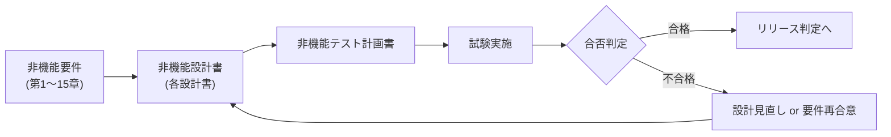

# 第16章 非機能テスト

## 1. 学習目標

本章を終えると、次ができる。

- テスト可能な要件だけを残し、要件と試験項目を漏れなく対応付けられる
- 性能、負荷、障害、フェイルオーバー、バックアップ・リストア、DR、セキュリティ、長時間稼働、運用受け入れ、監視の各試験を計画できる
- 合否判定、証跡、本番相当性、テスト環境との差異を明示できる
- 「試験に通った」ことと「本番でも成り立つ」ことの差を、残存リスクとして扱える

## 2. 基本概念

非機能テストは、機能テストの延長ではない。
機能テストは「正しく動くか」を確認するが、非機能テストは「その条件のもとで、どこまで持ちこたえるか」「壊れたときにどう振る舞うか」を確認する。
この違いを理解しないまま計画すると、機能試験の片手間で済ませてしまい、本番で初めて限界を知ることになる。

### 2.1 テスト可能な要件

要件がテスト可能であるとは、次のすべてが揃っている状態を指す。

- 指標がある
- 目標値がある
- 測定条件がある
- 合否判定基準がある
- 測定手段がある

「高品質であること」「十分な性能を確保すること」は、これらのいずれも欠けており、試験できない。
**必須事項**：非機能テスト計画の対象は、標準形式（第1章）で書かれた要件に限定する。
測定不能な表現が残っている要件は、テスト計画を立てる前に要件定義へ差し戻す。

### 2.2 性能試験・負荷試験・ストレス試験・ソーク試験

四つの試験は目的が異なる。

| 種別 | 目的 | 典型的な観点 |
|------|------|--------------|
| **性能試験** | 想定負荷における応答時間やスループットを確認する | パーセンタイル応答時間、エラー率 |
| **負荷試験** | 設計ピーク相当の負荷をかけ、目標達成を確認する | 設計ピークでの合否判定 |
| **ストレス試験** | 設計ピークを超える負荷をかけ、限界点と壊れ方を確認する | どこで、どう劣化・停止するか |
| **ソーク試験** | 長時間の負荷を継続し、時間経過による劣化を確認する | メモリリーク、リソースリーク、ログ肥大 |

ストレス試験は「壊してよい」試験である。
限界を超えたときに、エラーを返して縮退するのか、無応答になるのか、他の機能まで巻き込んで停止するのかを観察する。

### 2.3 障害試験

**障害試験**とは、意図的に構成要素を停止・遅延・切断させ、システムの振る舞いを確認する試験である。
第6章の信頼性・耐障害性の設計（リトライ、タイムアウト、サーキットブレーカー等）が、実際に機能するかを確認する。

対象例：アプリケーションサーバの停止、データベース接続の切断、外部APIのタイムアウト、ネットワーク遅延の注入。

### 2.4 フェイルオーバー試験

**フェイルオーバー試験**とは、冗長構成の主系を意図的に停止させ、待機系や他ノードへの切り替えが、設計どおりの時間内に成功するかを確認する試験である。
第3章の可用性要件（NFR-AVL-001等）の実現方式が、実際に機能するかを裏付ける。

確認項目は、切り替えの成功可否だけでなく、切り替えにかかった時間、切り替え中のエラー率、利用者への影響時間である。

### 2.5 バックアップ・リストア試験

**バックアップ・リストア試験**とは、取得したバックアップから、実際にデータを復元し、業務で利用可能な状態に戻せるかを確認する試験である。
第7章で述べたとおり、取得成功と復元成功は別物である。

確認項目は、復元にかかった時間、復元後のデータ整合性、アプリケーションからの利用可否である。

### 2.6 DR試験

**DR試験**とは、災害シナリオを模擬し、RTO・RPOの目標を実際に達成できるかを確認する試験である。
第8章のDR設計書に記載された切り替え手順、切り戻し手順を、机上ではなく実地で検証する。

DR試験は、年に数回程度しか実施できないことが多い。
**推奨事項**：初回は部分的な範囲（一部業務のみ）から始め、段階的に対象範囲を広げる。

### 2.7 セキュリティ試験・脆弱性診断

**セキュリティ試験**とは、認証、認可、暗号化、監査ログなどのセキュリティ要件（第9章）が、設計どおりに機能するかを確認する試験である。
権限マトリクス試験、認証バイパスの試行、監査ログの記録確認などが含まれる。

**脆弱性診断**とは、既知の脆弱性やセキュリティ設定の不備を検出する診断である。
ツールによる自動診断と、専門家による手動診断（ペネトレーションテスト）を組み合わせることが多い。

**推奨事項**：脆弱性診断は、本番相当の構成に対して、リリース前と定期的な間隔（例えば年1回、または重要な構成変更のたび）に実施する。

### 2.8 長時間稼働試験

**長時間稼働試験**とは、通常の負荷レベルのまま、長期間にわたり稼働させ続け、メモリリーク、リソースリーク、ログの肥大化、証明書の期限切れなど、時間経過でのみ顕在化する不具合を検出する試験である。
ソーク試験と重なる部分があるが、長時間稼働試験は必ずしも高負荷を前提としない点が異なる。

### 2.9 運用受け入れ試験

**運用受け入れ試験**とは、監視、Runbook、エスカレーション手順、定型作業など、運用設計書（第10章、第17章）の内容が、実際の運用者によって実行可能かを確認する試験である。
構築担当者だけが手順を実行できても、運用担当者が実行できなければ、本番運用は成立しない。

### 2.10 監視試験

**監視試験**とは、監視設計書（第11章）で定義した監視項目が、実際に異常を検知し、正しい重大度で、正しい宛先へ通知されるかを確認する試験である。
「監視を入れた」ことと「監視が機能する」ことは別であり、疑似障害を注入して確認する。

### 2.11 証跡

**証跡**とは、試験の実施日時、実施条件、実施結果、実施者が記録され、後から検証可能な状態で残された記録である。
証跡がなければ、「実施した」という主張は、監査でも移行判定でも根拠にならない。

**必須事項**：Must要件に対応する試験は、証跡を残さない実施を合格として扱わない。

### 2.12 合否判定

**合否判定**とは、試験結果が、要件の目標値と測定条件を満たしているかどうかの判定である。
合否判定の基準は、要件定義時の合否判定基準と一致させる。

試験のときだけ合否基準を緩めたり、測定条件（負荷シナリオ、時間帯）を変えたりして「合格」にすることは、判定ではなく粉飾である。

### 2.13 本番相当性

**本番相当性**とは、試験環境が、データ量、負荷特性、構成、ネットワーク経路、外部依存の観点で、本番環境にどれだけ近いかの度合いである。

本番相当性が低いほど、試験結果の信頼性は下がる。
完全な本番相当性を実現するのは、コストと日程の制約上、多くの案件で困難である。
**推奨事項**：本番相当性を完全に一致させることを目指すのではなく、相当でない点を明示し、その差分がもたらすリスクを評価する。

### 2.14 テスト環境との差異

本番環境とテスト環境の代表的な差異は次のとおりである。

- データ量（件数、レコードサイズ、偏り）
- 個人情報のマスキングによるデータ分布の変化
- インスタンスサイズ、台数
- 外部APIの本番接続可否（スタブ・モックの使用）
- ネットワーク経路、遅延特性
- 同時に動く他のジョブや他システムの負荷
- 監視設定、アラート設定の有無

**必須事項**：試験計画書には、環境差分の一覧と、その差分によって生じうる残存リスクを明記する。
差分を隠した状態での合格報告は認めない。

## 3. 業務上の意味

非機能テストは、リリース可否を決める最後の防波堤である。
機能が正しく動いても、ピーク時に応答が返らない、障害時に業務データが壊れる、復元できないバックアップしかない、といった状態でリリースすれば、業務は本番で壊れる。

試験で見つかった不備は、リリース後に見つかった不備よりも、対応コストが低い。
非機能テストへの投資は、リリース後の障害対応コストを前倒しで減らす投資でもある。

## 4. ヒアリング質問

- どの非機能要件が、移行判定における必須（Must）試験に該当するか
- 本番相当のデータを試験環境で使用できるか。マスキング方針はどうなっているか
- 障害注入（意図的な停止・遅延）は、どの範囲まで許容されるか
- 外部APIの試験用スタブと、本番との挙動差はどの程度か
- 試験が不合格になった場合、リリース延期の判断権限者は誰か
- DR試験や脆弱性診断のように、頻繁には実施できない試験は、年何回まで実施できるか

## 5. 要件例

### 要件例 NFR-TEST-001（非機能テストの実施管理）

- 要件ID：NFR-TEST-001
- 分類：非機能テスト管理
- 対象：Mustに分類された非機能要件一式
- 業務上の目的：非機能要件が未検証のまま本番稼働することを防ぐ
- 前提条件：要件トレーサビリティ表（第17章）が維持されている
- 指標：Must要件に対する試験実施率、合格率、未承認の残存リスク件数
- 目標値：試験実施率100%、合格率100%、未承認の残存リスク0件
- 測定条件：移行判定会議の時点
- 測定方法：トレーサビリティ表と試験証跡の突合
- 合否判定：移行判定会議の時点で、未実施のMust試験が0件であること
- 例外条件：技術的に試験不可能な項目は、代替検証方法（設計レビュー等）を明示し、リスク受容の承認を得る
- 実現方式：非機能テスト計画書の作成、環境差分表の整備、合否判定会議の運営
- 検証方法：試験証跡の抜取監査
- 根拠：非機能要件がプロジェクト後半で問題化することを防ぐため（第1章）
- 関連要件：全Must非機能要件
- 未確定事項：外部APIの本番相当負荷を再現する方法

### 要件例 NFR-TEST-002（性能試験計画の具体化）

- 要件ID：NFR-TEST-002
- 分類：非機能テスト（性能）
- 対象：NFR-PERF-010（申請一覧・詳細・承認実行の応答時間、第4章）
- 業務上の目的：月末ピーク相当の負荷でも、性能要件を満たすことを本番稼働前に確認する
- 前提条件：設計ピーク同時利用者は1,872人相当（NFR-CAP-001）
- 指標：95パーセンタイル応答時間、エラー率、試験実施回数
- 目標値：平常負荷シナリオと月末ピークシナリオの両方で、95パーセンタイル応答時間2.0秒以内、エラー率0.1%未満。移行4週間前までに2回実施し、うち1回は8時間のソーク試験を含める
- 測定条件：本番相当のデータ量とインフラ構成（環境差分は別紙に明記）
- 測定方法：負荷試験ツールによる仮想利用者の発生、APMおよびアクセスログでの応答時間集計
- 合否判定：両シナリオで目標値を満たすこと。未達の場合はリリースを延期し、設計を見直す
- 例外条件：外部API依存箇所の遅延に起因する未達は、非同期化などの代替方式で個別評価する
- 実現方式：性能試験環境の構築、負荷シナリオスクリプトの作成、監視ダッシュボードとの連携
- 検証方法：試験結果レポートのレビュー
- 根拠：夜間バッチの稼働時間帯（22:00〜6:00、8時間）と同等の継続時間を、日中オンラインのソーク試験時間として採用し、長時間稼働時の劣化を検出する
- 関連要件：NFR-PERF-010、NFR-CAP-001
- 未確定事項：月末ピークシナリオの最終的な負荷分布

## 6. 悪い要件例

次は要件として不合格である。

1. 「必要に応じて非機能テストを実施すること」
2. 「十分な負荷試験を実施すること」
3. 「本番同等の環境で試験を行うこと」
4. 「セキュリティテストを行い、問題がないことを確認すること」

不合格理由は共通している。
対象、試験条件、合否判定基準のいずれかが欠けている。
例3は「本番同等」の定義（何をもって同等とするか）がなく、環境差分の扱いが示されていない。

## 7. 改善後の要件例

### 悪い例2の改善：「十分な負荷試験」

本章のNFR-TEST-002へ置き換える。
対象要件、設計ピーク、パーセンタイル指標、実施回数、実施時期を明示した。

### 悪い例3の改善：「本番同等の環境」

- 環境差分一覧を作成し、データ量、外部API、ネットワーク経路の差分を明記する
- 差分がもたらすリスクを個別に評価し、必要に応じて追加の検証方法（本番稼働後の実測レビュー等）を設ける
- 「同等」という言葉ではなく、「差分表に記載のない項目は本番と同一構成とする」のように定義する

### 悪い例4の改善：「セキュリティテストで問題がないこと」

第9章のNFR-SEC-001の合否判定基準（未認証アクセスの成功が0件、権限外操作の拒否とログ記録、特権操作のMFA未実施成功0件）を、そのままテストの合否判定基準として引用する。
「問題がない」という主観的な表現を、要件と同じ測定可能な基準に置き換える。

## 8. 設計への落とし込み

### 8.1 要件と試験の対応表

非機能テスト計画書の最小限の列は次のとおりである。

`要件ID / 試験ID / 種別 / 手順概要 / 使用データ / 環境差分 / 合否判定基準 / 証跡 / 実施予定日 / 担当`

要件から設計、試験までの対応関係を、途中で崩さない。



### 8.2 負荷試験の母数を見積もる

合否判定基準に含まれる指標を、統計的に意味のある精度で測定するには、十分な母数が必要である。

数値例で確認する。

前提：エラー率の合否判定基準を0.1%未満とする。
判定の信頼性を確保するため、閾値付近のエラー率を検出するには、期待されるエラー発生件数がある程度（ここでは20件を目安とする）確保できる母数が必要とする。

```text
必要リクエスト数 = 期待発生件数 ÷ 目標エラー率
              = 20 ÷ 0.001
              = 20,000件
```

設計ピーク同時利用者1,872人が、1人あたり1分間に3リクエストを発生させるシナリオであれば、

```text
1分あたりのリクエスト数 = 1,872 × 3 = 5,616件/分
20,000件に到達するまでの時間 ≈ 20,000 ÷ 5,616 ≈ 3.6分
```

この計算は、瞬間的なピーク再現だけでは母数が不足しないことを示す一例である。
実際には、応答時間のパーセンタイルを安定して測定するためにも、一定時間以上の継続負荷が必要になる。
**推奨事項**：負荷試験のシナリオ設計では、母数の妥当性を計算で示し、試験時間を「なんとなく1時間」で決めない。

### 8.3 ソーク試験の継続時間を決める

ソーク試験の継続時間は、検出したい劣化の進行速度と、監視のノイズ水準から逆算する。

数値例で確認する。

前提：疑わしいメモリリークの進行速度を、1時間あたり0.3%の使用率増加と仮定する。
監視上のノイズ（正常な変動幅）を±2%とし、ノイズに埋もれず検出するために、ノイズの3倍以上の累積増加を確認したいとする。

```text
必要な累積増加 = 2% × 3 = 6%
必要な試験時間 = 6% ÷ 0.3%/時間 = 20時間
```

この試算では20時間が必要になるが、実務シナリオの夜間バッチ時間帯（22:00〜6:00、8時間）を一つの目安として、最低でも8時間以上のソーク試験を実施し、劣化の兆候（傾き）が見えるかどうかを確認したうえで、必要に応じて延長する、という段階的な進め方も現実的である。
継続時間は、検出したい劣化速度と監視ノイズから逆算して決める。根拠なく「なんとなく1時間」と置かない。

## 9. 代替案

すべてを本番前に完全実証することが難しい場合の代替案を示す。

1. **本番前に全量実証する**：Must要件かつ影響が大きい項目に適する
2. **リスクの高い項目のみ実証し、低い項目は設計レビューと本番後の早期観測で補う**：日程が厳しい場合の折衷案
3. **段階的カナリアリリースで、本番トラフィックの一部を使って検証を補う**：ただし、個人情報の取り扱い、復元性、権限といったMust級の項目は、事前の実証を省略しない

## 10. トレードオフ

| 対立 | 内容 |
|------|------|
| 本番相当性 vs 費用・日程 | 完全な再現は費用と時間がかかる |
| 破壊的な障害試験 vs 環境の安定性 | 共有環境では他チームへの影響を避けにくい |
| 早期試験 vs 仕様の未確定 | 早期は手戻りの可能性があるが、発見の価値は高い |
| 試験範囲の広さ vs 日程 | 広げるほど精度は上がるが、リリースは遅れる |

## 11. 検証方法

非機能テスト計画そのものの妥当性を、次の観点で検証する。

- Must要件に対する試験の欠番がないか
- 合否判定基準が、要件定義時の基準と一致しているか
- 環境差分の一覧と、承認記録があるか
- 証跡のテンプレートと保管場所が定まっているか
- 母数や継続時間の根拠が、計算または実績に基づいているか

## 12. よくある失敗

1. 機能試験が終わった後の余った時間で、非機能試験を実施しようとする
2. 平均応答時間だけを見て合格と判断する
3. フェイルオーバー試験を一度成功させただけで、恒久的に成功すると見なす
4. バックアップの取得成功をもって、復元試験合格と見なす
5. 監視試験を一度も実施しない
6. 環境差分を試験報告書に記載しない
7. 負荷試験の母数や継続時間の根拠を示さない
8. 不合格が出た際、原因を追わずに合否基準の方を緩めてしまう

## 13. レビュー観点

- [ ] Must要件のすべてに、対応する試験項目があるか
- [ ] 合否判定基準が要件定義時と一致しているか
- [ ] 証跡の取得方法と保管場所が定義されているか
- [ ] 環境差分と、それによる残存リスクが明記されているか
- [ ] 不合格時の判断プロセス（延期権限者、代替案）が定義されているか
- [ ] 母数や継続時間の根拠が示されているか

## 14. 章末問題

### 問題1

本番相当性を下げる要因を5つ挙げよ。

### 問題2

バックアップ取得ジョブの成功をもって、リストア試験に合格したとみなす考え方の誤りを説明せよ。

### 問題3

エラー率の合否判定基準を0.05%未満とする場合、期待発生件数20件を確保するために必要なリクエスト数を計算せよ。

## 15. 解答と解説

### 問題1

例：データ量の差、個人情報マスキングによるデータ分布の偏り、外部APIのスタブ使用、ネットワーク経路の違い、インスタンスサイズの違い、他ジョブとの同時実行有無、監視設定の有無。

### 問題2

バックアップの取得成功は、ファイルが物理的に作成されたことしか保証しない。
暗号鍵の管理状況、復元手順の正確性、復元後のデータ整合性、アプリケーションからの利用可否は、いずれも未検証のままである。
復元して初めて、バックアップが機能することが確認できる。

### 問題3

```text
必要リクエスト数 = 20 ÷ 0.0005 = 40,000件
```

## 16. 実務演習

実務シナリオ（従業員5,000人のWeb業務システム）について、非機能テスト計画を、少なくとも12件の試験IDで作成せよ。

1. 各試験IDを、対応するMust要件のIDに紐づける
2. 各試験について、種別（性能・障害・DR等）、合否判定基準、環境差分を記載する
3. うち1件について、母数または継続時間の根拠を計算で示す
4. 不合格時のリリース判断プロセスを1つ定義する

## 補足：要件と試験の対応表（実務シナリオ抜粋）

| 要件ID | 試験ID | 種別 | 合否概要 | 証跡 |
|--------|--------|------|----------|------|
| NFR-PERF-010 | T-PERF-01 | 負荷 | ピーク1,200で95%tileとエラー率達成 | レポート、APM |
| NFR-PERF-010 | T-PERF-03 | ソーク | 8時間劣化なし | 時系列メトリクス |
| NFR-CAP-001 | T-PERF-02 | 負荷 | 1,872相当で許容内 | レポート |
| NFR-PERF-020 | T-BAT-01 | バッチ | 月末件数で6:00前成功 | ジョブ履歴 |
| NFR-AVL-001 | T-AVL-01 | failover | AZ障害模擬で継続または目標内回復 | 切替ログ |
| NFR-REL-010 | T-REL-01 | 障害注入 | 二重確定0、タイムアウト遵守 | 監査ログ |
| NFR-BKP-001 | T-BKP-01 | リストア | 復元＋代表業務成功 | 復元記録 |
| NFR-DR-001 | T-DR-01 | DR訓練 | RTO/RPO達成 | 訓練記録 |
| NFR-SEC-001 | T-SEC-01 | 権限/診断 | 権限マトリクス合格、重大脆弱性是正 | 診断票 |
| NFR-MON-001 | T-MON-01 | 監視 | 2分以内検知、通知到達 | 監視イベント |
| NFR-OPS-001 | T-OPS-01 | 運用受入 | 初動・Runbook実行可 | 受入サイン |
| NFR-CLD-001 | T-CLD-01 | クォータ | 上限・予算アラート動作 | 設定証跡 |

## 補足：環境差分と残存リスクの書き方

| 差分項目 | 試験環境 | 本番 | 残存リスク | 緩和 |
|----------|----------|------|------------|------|
| 外部API | スタブ比率あり | 実接続 | 本番遅延で性能未達 | 本番観測1か月、サーキット |
| データ | マスキング済み | 実データ | 分布偏りで見逃し | 件数・カーディナリティ合わせ |
| 同時他負荷 | 単独試験 | 他ジョブ共存 | 資源競合 | 夜間帯の併用試験を1回 |
| 監視設定 | 一部未接続 | フル | 試験中の検知漏れ | 本番前に監視試験必須 |

**必須事項**：差分表に載らない項目は「本番と同一」とみなす。曖昧な「ほぼ同等」は使わない。

## 補足：不合格時の判断プロセス要件

- 要件ID：NFR-TEST-010
- 分類：非機能テスト管理
- 対象：Must試験の不合格案件
- 業務上の目的：不合格を曖昧な条件付き合格で糊塗しない
- 前提条件：移行判定会議の議長と延期権限者が指名されている
- 指標：Must不合格の延期決定率、条件付き合格に付いた是正期限遵守率
- 目標値：Must不合格は原則リリース延期。条件付き合格はShould以下に限り、是正期限と担当を必須とする。是正期限超過0件
- 測定条件：移行判定会議の全件
- 測定方法：判定議事録と是正チケットの突合
- 合否判定：Must不合格のまま無条件リリースした件が0
- 例外条件：なし
- 実現方式：判定チェックリスト、エスカレーション、是正バックログ
- 検証方法：過去判定の監査
- 根拠：後半の非機能未達を日程圧力で握りつぶさないため
- 関連要件：NFR-TEST-001
- 未確定事項：条件付き合格の上限件数

---

## 次章予告

第17章では、非機能要件定義書と各種設計書について、成果物ごとの目的、記載項目、記載例、レビュー観点、よくある不備を整理する。
