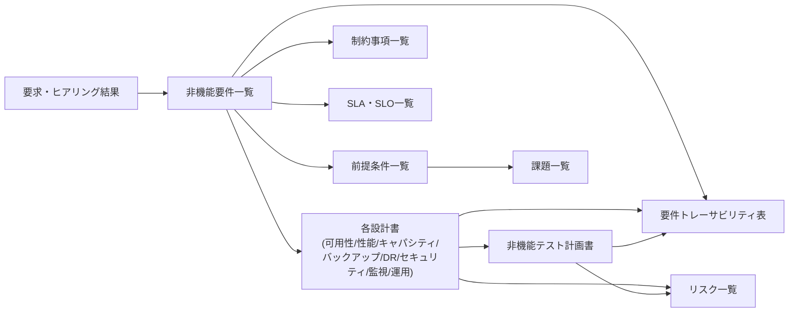

# 第17章 非機能要件定義書と設計書

## 1. 学習目標

本章を終えると、次ができる。

- 非機能に関わる16種類の主要成果物について、それぞれの目的と記載項目を説明できる
- 記載例を参考に、レビューで具体的な不備を指摘できる
- 成果物間のトレーサビリティを維持し、更新が滞った文書を見つけられる

## 2. 基本概念

非機能に関する文書は、数が多いほどよいわけではない。
意思決定、試験、運用に実際に使われる文書の組を揃えることが目的である。
本書の標準セットは、概要編（`00_overview.md`）の成果物一覧に従う。

文書どうしの関係は次のとおりである。

**一般論**として、文書は「作って終わり」ではなく「更新され続けて初めて価値を持つ」道具である。
更新されない文書は、監査や障害対応の場面で、誤った前提を関係者に信じ込ませる害になりうる。
以下、16種類の成果物について、目的、記載項目、記載例、レビュー観点、よくある不備の順に説明する。

### 2.1 非機能要件一覧

**目的**：測定可能な非機能要件を、単一の正（シングルソースオブトゥルース）として管理する。

**記載項目**：標準形式の全16項目（要件ID、分類、対象、業務上の目的、前提条件、指標、目標値、測定条件、測定方法、合否判定、例外条件、実現方式、検証方法、根拠、関連要件、未確定事項）。

**記載例**：

| 要件ID | 分類 | 対象 | 指標 | 目標値 | 優先度 |
|--------|------|------|------|--------|--------|
| NFR-AVL-001 | 可用性 | オンライン機能全体 | 業務時間帯稼働率 | 99.9%以上/月 | Must |
| NFR-PERF-010 | 性能 | 申請一覧・承認 | 95パーセンタイル応答時間 | 2.0秒以内 | Must |
| NFR-CLD-001 | クラウド | 主要マネージドサービス | クォータ使用率 | 70%で申請起票 | Should |

一覧では全項目を詳細に書ききれないため、要約列（優先度、担当、ステータス等）を追加し、詳細は個票（本書の要件例のような形式）へのリンクとする運用も現実的である。

**レビュー観点**：測定不能な語（「適切に」「十分に」）が残っていないか。
目標値に根拠があるか。
MustとShouldが区別されているか。

**よくある不備**：業務側の要求文をそのまま転記している。
目標値だけがあり、測定方法が空欄になっている。
設計方式の説明が要件本文の大半を占め、要件そのものが埋もれている。

### 2.2 前提条件一覧

**目的**：崩れた場合に設計の再検討が必要になる仮定を、明示的に管理する。

**記載項目**：前提ID、内容、影響を受ける要件ID、確認方法、確認状態、見直し頻度、所有者。

**記載例**：

| 前提ID | 内容 | 影響要件 | 確認方法 | 確認状態 | 見直し頻度 |
|--------|------|----------|----------|----------|------------|
| PRE-01 | 同時利用者ピークは1,872人相当を超えない | NFR-PERF-010, NFR-CAP-001 | 四半期の実測レビュー | 確認中 | 四半期 |
| PRE-02 | 社内ネットワーク回線は1Gbps以上を維持する | NFR-PERF-010 | ネットワーク部門への確認 | 未確認 | 年次 |

**レビュー観点**：楽観的な前提ばかりになっていないか。
監視や実測で検証可能な前提になっているか。

**よくある不備**：前提条件と制約事項が混在している。
確認状態の欄が常に空欄のまま放置されている。

### 2.3 制約事項一覧

**目的**：容易には変更できない条件を、設計の境界として固定する。

**記載項目**：制約ID、内容、根拠文書、緩和可否、影響範囲、問い合わせ窓口。

**記載例**：

| 制約ID | 内容 | 根拠文書 | 緩和可否 |
|--------|------|----------|----------|
| CON-01 | 個人情報は国内リージョンにのみ保管する | 社内情報セキュリティ規程§4 | 緩和不可 |
| CON-02 | 認証は既存の社内IdPを利用する | 全社IT基盤方針 | 個別協議で緩和可 |

**レビュー観点**：制約と希望的観測が混ざっていないか。
それぞれの制約に根拠文書が明示されているか。

**よくある不備**：「なるべく国内」のように、制約なのか努力目標なのか判別できない書き方になっている。

### 2.4 SLA・SLO一覧

**目的**：対外的な契約上の約束（SLA）と、内部の管理目標（SLO）、測定指標（SLI）を混同せずに管理する。

**記載項目**：名称、種別（SLA/SLO/SLI）、対象、時間窓、目標値、測定方法、除外条件、報告先、未達時アクション。

**記載例**：

| 名称 | 種別 | 対象 | 目標値 | 測定方法(SLI) |
|------|------|------|--------|----------------|
| SLO-OL-01 | SLO | オンライン機能 | 業務時間帯稼働率99.9%/月 | 合成監視1分間隔 |
| SLA-CLOUD-COMPUTE | SLA（参考値） | クラウド事業者の仮想サーバ基盤 | 99.95%（事業者契約） | 事業者ステータスページ |

**レビュー観点**：SLAとSLOが明確に分離され、SLAが「参考値」として位置づけられているか。
除外条件（計画停止等）が定義と整合しているか。

**よくある不備**：クラウド事業者のSLAをそのまま自システムのSLOとして転記している。
SLA未達時の補償内容と、内部目標未達時のアクションが混同されている。

### 2.5 可用性設計書

**目的**：可用性要件を満たすための構成、方式、運用を定義する。

**記載項目**：対象範囲、対応するSLO、構成図、単一障害点（SPOF）一覧、フェイルオーバー方式、計画停止方式、稼働率の計算根拠、試験計画、残存リスク。

**記載例**：マルチAZ構成図（第3章参照）、許容計画外停止時間の計算（`14,400分 × (1 - 0.999) = 14.4分/月`）、SPOF一覧の抜粋（社内IdP、DNS設定担当者）。

**レビュー観点**：稼働率の計算過程が明記されているか。
SPOFが技術面と運用面の両方から洗い出されているか。
依存する外部サービスの扱いが明記されているか。

**よくある不備**：構成図だけがあり、稼働率の定義や計算根拠が書かれていない。
フェイルオーバー試験の計画が設計書に紐づいていない。

### 2.6 性能設計書

**目的**：性能要件を満たすための方式と、サイジングの根拠を残す。

**記載項目**：対象操作、ピーク条件、目標値、ボトルネックの仮説、実現方式、サイジング根拠、試験シナリオ、監視SLIとの対応。

**記載例**：申請一覧画面の95パーセンタイル応答時間2.0秒、月末ピークは平常時の1.5倍、AP層のインスタンス台数根拠（1台あたり処理能力×必要台数の計算式）。

**レビュー観点**：平均値だけで語られていないか。
外部API依存箇所の前提（応答時間、タイムアウト設定）が明記されているか。

**よくある不備**：試験シナリオが実際の業務利用パターンと無関係に作られている。
サイジング根拠が「経験則」としか書かれていない。

### 2.7 キャパシティ設計書

**目的**：将来の成長に対する増強計画を定義する。

**記載項目**：成長仮説（利用者・データそれぞれ）、余裕率、設計値、増強の閾値、増強リードタイム、増強手順、データのアーカイブ方針。

**記載例**：3年で利用者数+20%、余裕率30%、設計ピーク同時利用者1,872人相当、閾値到達（使用率70%）で増強申請起票、増強完了まで10営業日。

**レビュー観点**：利用者数の成長とデータ量の成長が別々に扱われているか。
増強のリードタイムから逆算した閾値になっているか。

**よくある不備**：現在値の記載だけで、将来値の欄が空欄になっている。
リードタイムを考慮せず、資源逼迫が発生してから増強申請している。

### 2.8 バックアップ設計書

**目的**：データの取得方式と復元方式を定義する。

**記載項目**：対象データ、取得方式、保持世代数、保管期間、保管場所、暗号化方式、バックアップウィンドウ、復元手順、復元試験計画。

**記載例**：日次バックアップ35世代、月次バックアップ13世代、別リージョンへのイミュータブル（改ざん不可）保管、月次の復元試験。

**レビュー観点**：復元試験が計画に含まれ、必須項目として扱われているか。
RPO（第8章）と、単なる保管期間が混同されていないか。

**よくある不備**：取得スケジュールの記載だけで終わり、復元手順が書かれていない。

### 2.9 DR設計書

**目的**：災害シナリオごとの復旧方式を定義する。

**記載項目**：想定シナリオ、RTO・RPO・MTPD、復旧方式、データ同期方式、切替判断基準、切り戻し手順、訓練計画、通信断・IdP停止時の対策。

**記載例**：リージョン障害シナリオでRTO 24時間以内、RPO 15分以内、年2回のDR訓練を実施し、少なくとも1回はRTO内での復旧を実証する。

**レビュー観点**：シナリオごとにRTO・RPOが分けて定義されているか。
訓練計画と、切替の意思決定権限者が明記されているか。

**よくある不備**：構成の説明だけで、訓練計画が存在しない。
切替の判断基準が曖昧で、誰がいつ切替を決めるか書かれていない。

### 2.10 セキュリティ設計書

**目的**：機密性・完全性・可用性を支える技術的・運用的な統制を定義する。

**記載項目**：脅威前提、認証・認可方式、暗号化と鍵管理、監査ログ、脆弱性診断計画、パッチ運用方針、インシデント対応手順、社内規程・法令との対応表。

**記載例**：RBAC（役割ベースアクセス制御）の権限マトリクス抜粋、特権操作へのMFA必須適用範囲、暗号鍵の90日ローテーション方針。

**レビュー観点**：各統制の検証方法が明記されているか。
緊急時の例外アカウント（ブレイクグラス手順）の管理方法が定義されているか。

**よくある不備**：「セキュリティを強化する」といった方針の宣言だけで、具体的な統制項目が書かれていない。

### 2.11 監視設計書

**目的**：異常の検知、通知、SLIとの連携を定義する。

**記載項目**：監視項目カタログ、閾値、重大度分類、通知先、ダッシュボード構成、監視対象の欠落防止策、ログの機密区分。

**記載例**：合成監視による2分間隔でのログイン〜代表操作の成功確認、重大度別の通知先一覧（重大：オンコール即時、警告：翌営業日確認）。

**レビュー観点**：アラートが受け取った人にとって行動可能な内容になっているか。
監視項目とSLIの対応関係が明示されているか。

**よくある不備**：メトリクスを羅列しているだけで、重大度や通知先が定義されていない。

### 2.12 運用設計書

**目的**：体制と手順によって、非機能要件を実際に運用可能な状態にする。

**記載項目**：運用体制、対応時間帯、定型作業一覧、Runbook一覧、障害対応フロー、アカウント管理方針、パッチ適用方針、引き継ぎ手順。

**記載例**：重大障害の初動対応目標15分以内、オンコール当番表（輪番4名）、重要Runbook一覧（DB復旧、フェイルオーバー手順等）。

**レビュー観点**：要件を実際に運用できる体制になっているか。
特定個人に依存した手順（属人化）が残っていないか。

**よくある不備**：構築担当者が個人的に作成したメモがそのまま運用設計書として扱われている。

### 2.13 非機能テスト計画書

**目的**：非機能要件の検証計画と合否判定を定義する。

**記載項目**：試験ID、対応する要件ID、試験種別、手順、使用データ、環境差分、合否判定基準、証跡、実施予定日、担当。

**記載例**：`T-PERF-01 ↔ NFR-PERF-010`（性能試験、月末ピークシナリオ、95パーセンタイル2.0秒以内）。

**レビュー観点**：Must要件に対応する試験の欠番がないか。
環境差分の承認記録があるか。

**よくある不備**：機能テスト計画書への一行追記だけで済まされ、独立した計画になっていない。

### 2.14 リスク一覧

**目的**：残存リスクを可視化し、受容するか対策するかを組織として決定する。

**記載項目**：リスクID、内容、影響度、発生尤度、対策、対策後の残存リスク、受容者、期限。

**記載例**：`RSK-01 リージョン障害時に最大24時間の業務停止が発生しうる／受容者：業務オーナー／期限：DR設計見直し時に再評価`。

**レビュー観点**：受容者として記載された人物が実在し、実際に受容の判断をしているか。
対策の内容が「注意する」「気をつける」のような具体性のない記述になっていないか。

**よくある不備**：リスク一覧と課題一覧の内容が混在している。

### 2.15 課題一覧

**目的**：未確定事項を、期限を決めて管理する。

**記載項目**：課題ID、内容、影響を受ける要件ID、担当、期限、暫定的な仮置き内容、ステータス。

**記載例**：`ISSUE-01 休日オンライン利用のSLO対象可否／期限：基本設計レビュー前／担当：業務部門`。

**レビュー観点**：期限を超過した課題を、エスカレーションする仕組みがあるか。

**よくある不備**：要件一覧に仮置きの目標値が書かれているのに、対応する課題が課題一覧に登録されていない。

### 2.16 要件トレーサビリティ表

**目的**：要求から要件、設計、試験までの対応関係の欠落を防ぐ。

**記載項目**：要求ID、要件ID、対応する設計書の節、試験ID、証跡、状態（未着手・設計中・試験中・完了等）。

**記載例**：`REQ-12（月末が遅い） → NFR-PERF-010 → 性能設計書§3.2 → T-PERF-01 → 完了`。

**レビュー観点**：要求から試験までの一方向だけの欠落（要件はあるが試験がない、など）がないか。
状態欄が最新の状況を反映しているか。

**よくある不備**：プロジェクト初期に一度作成しただけで、その後更新されていない。

## 3. 業務上の意味

これらの文書は、監査のためだけに存在するのではない。
障害発生後に「なぜその目標値だったのか」を説明し、変更が発生したときに影響範囲を特定するための、組織の記憶装置である。

文書がなければ、目標値の根拠は担当者の記憶にしか残らない。
担当者が異動・退職すれば、根拠は失われ、次に同じ議論を最初からやり直すことになる。

## 4. ヒアリング質問

- どの文書を、契約・監査・移行判定における正式な文書として扱うか
- 各文書の保管場所と、更新責任者は誰か
- 旧版の文書を参照してしまうことを防ぐ、版管理のルールはあるか
- 成果物のうち、案件の規模に対して省略してよいものはあるか

## 5. 要件例

### 要件例 NFR-DOC-001（文書の単一の正と変更管理）

- 要件ID：NFR-DOC-001
- 分類：文書管理
- 対象：Mustに分類された非機能要件一覧、および要件トレーサビリティ表
- 業務上の目的：要件の変更が、関連文書に反映されないまま放置される事態を防ぐ
- 前提条件：文書の保管場所と更新責任者が明確になっている
- 指標：変更票と文書更新の同時性、未承認差分の件数
- 目標値：Must要件の変更は、要件一覧とトレーサビリティ表を同一の変更票で更新し、承認後にのみ有効とする。承認のない差分を0件とする
- 測定条件：変更管理プロセスの各サイクル
- 測定方法：変更票と文書更新履歴の突合
- 合否判定：未承認の差分が0件であること
- 例外条件：緊急変更は事後48時間以内に変更票を整備する
- 実現方式：文書管理システムまたはバージョン管理システムでの一元管理、変更管理プロセスへの組み込み
- 検証方法：変更管理の監査、四半期レビュー
- 根拠：要件と設計、試験の対応関係を常に最新に保つため
- 関連要件：NFR-TEST-001（第16章）
- 未確定事項：文書管理ツールの最終選定

### 要件例 NFR-DOC-002（文書の新鮮度）

- 要件ID：NFR-DOC-002
- 分類：文書管理
- 対象：16種類の主要成果物一式
- 業務上の目的：移行判定の時点で、古い情報に基づく判断が行われることを防ぐ
- 前提条件：各文書に最終更新日が記録されている
- 指標：移行判定時点での各文書の最終更新日と、直近の要件変更日との差分
- 目標値：Must要件に関わる文書は、直近の要件変更から10営業日以内に更新されていること
- 測定条件：移行判定会議の直前
- 測定方法：文書の更新履歴確認
- 合否判定：更新遅延が10営業日を超える文書が0件であること
- 例外条件：担当部門の合意のもと、更新不要と判断された文書は対象外とする
- 実現方式：文書一覧の定期棚卸し、更新遅延のアラート化
- 検証方法：移行判定前のチェックリスト確認
- 根拠：文書が更新されないことによる誤った意思決定を防ぐため
- 関連要件：NFR-DOC-001
- 未確定事項：棚卸しの実施頻度

## 6. 悪い要件例

次は要件として不合格である。

1. 「ドキュメントを適切に管理すること」
2. 「必要な設計書を作成すること」
3. 「トレーサビリティを確保すること」

不合格理由は共通している。
対象文書、更新の指標、目標値、測定方法、判定基準のいずれかが欠けている。

## 7. 改善後の要件例

### 悪い例1の改善：「ドキュメントを適切に管理」

本章のNFR-DOC-001へ置き換える。
「適切に」を、変更票と文書更新の同時性という測定可能な指標に変換した。

### 悪い例3の改善：「トレーサビリティを確保」

要件トレーサビリティ表（本章2.16節）の整備を前提とし、NFR-DOC-002のように、更新の遅延許容日数を明示する要件へ置き換える。

## 8. 設計への落とし込み

文書のテンプレートは、リポジトリまたは文書管理システムに一元的に配置し、レビューチェックリストを添付する。
使用するツール（Wiki、Markdownリポジトリ、専用の要件管理ツール等）は問わないが、次の条件を満たすことを優先する。

- 版管理ができること（誰が、いつ、何を変更したかを追跡できる）
- 相互参照（要件ID、試験ID等）が壊れにくいこと
- 更新履歴が可視化されること

小規模案件では、Markdownファイルとバージョン管理システムの組み合わせでも十分に機能する。
大規模案件や、外部監査への提出が必要な案件では、専用の要件管理ツールの導入も選択肢になる。

## 9. 代替案

| 方式 | 向く条件 | 向かない条件 |
|------|----------|--------------|
| 統合設計書1冊にまとめる | 小規模、関係者が少ない | 成果物が多く、更新頻度がそれぞれ異なる |
| 本書のセットのように分冊する | 中〜大規模、複数チームが分担 | 文書間の整合を保つ工数が取れない |
| チケット中心で文書を最小化する | 更新規律が強いチーム、変更が頻繁 | 監査や契約で正式文書の提出が必要 |

## 10. トレードオフ

厚い文書は安心感を与えるが、更新されなければ害になる。
薄すぎる文書は、合意事項が口頭やチャットの記録にしか残らず、後から追跡できなくなる。

| 対立 | 内容 |
|------|------|
| 文書の網羅性 vs 更新負荷 | 詳細に書くほど、更新の手間が増える |
| 標準テンプレートの統一 vs 案件ごとの柔軟性 | 統一すると比較しやすいが、案件特性を反映しにくい |
| 正式文書としての重み vs 迅速な変更 | 正式化すると変更承認に時間がかかる |

案件の更新頻度と規模に見合う粒度を選ぶことが、実務上の判断になる。

## 11. 検証方法

- 成果物一覧に対するチェックリスト監査（16種類の要否判定を含む）
- 要件トレーサビリティ表の欠番検査
- 移行判定前における、各文書の最終更新日の確認
- 変更管理記録と文書更新履歴の突合

## 12. よくある失敗

1. 設計書の記載内容が、要件一覧の目標値を無断で上書きしている
2. 非機能テスト計画書が、成果物セットの管理対象から外れている
3. リスク一覧の受容者欄に、実在しない、または権限のない人物が記載されている
4. テンプレートの見出しだけが埋まり、中身が空欄のまま提出される
5. 版管理の仕組みがなく、古いバージョンの文書を参照して作業してしまう

## 13. レビュー観点（横断）

- [ ] 16種類の成果物それぞれについて、案件規模に対する要否判断が妥当か
- [ ] 成果物間の相互参照（要件ID、試験ID等）が生きているか
- [ ] 未確定事項が課題一覧として管理されているか
- [ ] 移行判定の入力として、必要な文書がすべて揃っているか
- [ ] 各文書の最終更新日が、直近の要件変更より新しいか

## 14. 章末問題

### 問題1

可用性設計書に構成図しか記載されていない。
追加すべき節を4つ挙げよ。

### 問題2

SLA・SLO一覧に、クラウド事業者の契約SLA 99.99%だけが記載されている。
問題点と、直し方を述べよ。

### 問題3

要件トレーサビリティ表が、プロジェクト初期に一度だけ作成され、その後半年間更新されていない。
どのようなリスクが生じるか説明せよ。

## 15. 解答と解説

### 問題1

稼働率の定義と計算根拠、SPOF一覧、フェイルオーバー方式と目標時間、試験計画、残存リスク、計画停止の方式などが該当する。

### 問題2

問題点は、自システムのエンドツーエンドのSLO・SLIが定義されていないことである。
直し方は、合成監視などに基づく内部SLOを追加し、クラウド事業者のSLAは「依存する入力情報」として別枠で管理することである。

### 問題3

半年間の間に発生した要件変更や設計変更が、トレーサビリティ表に反映されていない可能性が高い。
その結果、新たに追加された要件に対応する試験項目が欠落したまま移行判定を迎える、あるいは、すでに削除された要件に対する試験を無駄に実施する、といった不整合が生じるリスクがある。

## 16. 実務演習

実務シナリオ（従業員5,000人のWeb業務システム）について、次を実施せよ。

1. 16種類の成果物それぞれについて、目次案と、1ページ目に書く要約文を作成する
2. 可用性設計書とバックアップ設計書について、記載例に相当する具体的な数値入りの節を1つずつ書く
3. 要件トレーサビリティ表に、Must要件を少なくとも10行登録する
4. リスク一覧に、少なくとも3件のリスクを、受容者を明記して登録する

---

## 次章予告

実務シナリオ編（第18章）では、従業員5,000人が利用するクラウド上のWeb業務システムを題材に、ステークホルダー整理からヒアリング、要件定義、設計、非機能テスト、文書化、運用引き継ぎ、残存リスクの経営報告までを、一連の流れとして実施する。
本章までに学んだ標準形式、計算方法、成果物のセットを、実際に手を動かして組み立てる回である。
