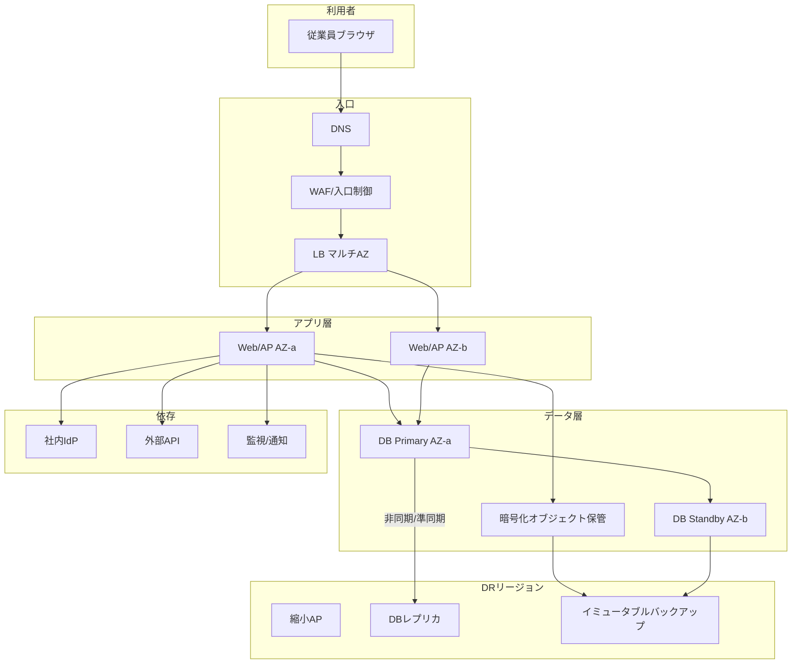

# 実務シナリオ編 従業員5,000人のクラウドWeb業務システム

本編では、概要編で定義した通貫シナリオについて、ステークホルダー整理から残存リスクの受容まで、非機能要件定義の一連の流れを実施する。
続けて、要求から試験までのトレーサビリティ表を作成する。

数値は例示である。
実案件ではヒアリングと実測で置き換える。
本編内では前提を使い回し、章をまたいで矛盾が出ないようにしている。

対象システムの条件再掲：

- 従業員5,000人が利用するWeb業務システム
- 平日日中に利用が集中
- 外部サービスとのAPI連携あり
- 個人情報を扱う
- 夜間バッチあり
- 月末に処理量が増加
- 年数回の計画停止が可能
- クラウド上に構築、複数AZ利用
- バックアップと災害対策が必要
- 24時間監視
- 将来3年間の利用者増加を考慮

---

## 1. ステークホルダー整理

| 役割 | 関心 | 承認権限 |
|------|------|----------|
| 業務オーナー（総務/人事系） | 申請承認の継続、月末ピーク | 可用性・性能・計画停止の業務合意 |
| 情報システム部長 | 予算内での安定稼働 | 方式と投資の最終提案承認 |
| 運用リーダー | 監視、障害、夜間負荷 | 運用受入合否 |
| セキュリティ責任者 | 個人情報、監査、インシデント | セキュリティMustの承認 |
| アプリ開発リーダー | 実装制約、外部API、冪等性 | 性能・耐障害の実装可否 |
| クラウドインフラリーダー | 構成、クォータ、費用、キャパシティ | 可用性/DR/監視/キャパシティ設計 |
| 財務/経営補佐 | TCO、障害時信用、投資判断 | 高コスト案の採否 |
| 監視委託（一次受け） | 通知品質、エスカレーション | 契約範囲内の手順遵守 |
| 個人情報保護担当（法務） | 規程適合、漏洩時対応 | 個人情報関連要件の適合確認 |

合意の型は次のとおりとする。
Must要件は、業務オーナー、運用リーダー、セキュリティ責任者の三者承認を必須とする。
Should要件は、業務オーナーと情報システム部長の合意で決定してよい。

三者承認が揃わない要件は、Mustへ昇格させない。
仮のMustとして扱い、課題一覧で決裁待ちにする。

---

## 2. ヒアリング項目

部門別に、本シナリオで最低限聞く項目に絞る。
一般論としては、業務・運用・セキュリティ・開発・インフラ・経営の6方向から聞くと抜けが減る。

### 業務部門

- 止めてよい最大時間（平日日中、夜間、休日）
- 月末のピーク日と、遅いと感じる秒数
- 計画停止の告知期限と回数
- 個人情報を扱う画面一覧
- 外部連携の締め時刻
- 二重申請や二重承認が起きたときの業務上の実害

### 運用部門

- オンコール体制と初動目標
- 現行アラートのノイズ
- バックアップ復元の最終実施日
- 属人化ジョブと、対応できる人数
- 運用受入の不合格条件
- 引き継ぎ資料の最終更新日

### セキュリティ部門

- 適用規程と監査項目
- MFA、特権、ログ保管年数
- 脆弱性是正期限
- 本番データアクセス可否
- インシデント報告期限
- ブレイクグラス（緊急時の一時的な権限昇格）の運用可否

### 開発部門

- 外部APIのタイムアウトと冪等性の対応状況
- ステートフル要素の有無
- バッチ依存関係と再実行の安全性
- 性能劣化の既知箇所
- ロールバック手段
- 一覧系画面のキャッシュ許容鮮度

### クラウドインフラ部門

- 現行のクォータ（インスタンス数、IP、API呼び出し回数など）と余裕
- オートスケールの上限設定と根拠
- リージョン間のデータ転送料の見積もり有無
- 増強の申請から反映までのリードタイム
- 開発・検証環境の起動時間帯と削除ルール

### 経営層

- リージョン障害24時間停止の受容可否
- 初期/年額の上限感
- 情報漏洩の残存リスク受容者
- 3年後の組織規模見通し
- 費用超過時に自動停止してよい機能の有無

---

## 3. 前提条件と制約条件

一般論として、前提条件は「崩れたら再設計が必要な仮定」、制約条件は「変更困難な境界」として区別する。
両者を同じ表に混ぜると、後で見直すべき項目が埋もれる。

### 前提条件（抜粋）

| ID | 内容 | 確認状態 |
|----|------|----------|
| PRE-01 | 登録利用者は3年後6,000人まで（現状5,000人の+20%） | 経営計画の仮置き |
| PRE-02 | 同時利用者率は現状相当（ピーク1,200→3年後1,440、設計余裕込み1,872） | 要実測補正 |
| PRE-03 | 外部APIの95パーセンタイルは平常500ms、悪化時1,000msまで | 連携先SLA未確定 |
| PRE-04 | 計画停止を年4回・各4時間まで取得できる | 業務合意済み |
| PRE-05 | 平日8〜20時をオンラインSLO対象とする | 業務部門ヒアリング済み |
| PRE-06 | 休日オンラインはベストエフォート（課題で再確認） | 未確定 |
| PRE-07 | 月末3営業日はオンライン件数・バッチ件数とも通常の1.5倍 | 現行システムのログから仮置き |
| PRE-08 | 年間クラウド予算は前年度実績の120%を上限枠とする | 財務確認中 |

### 制約条件（抜粋）

| ID | 内容 | 緩和可否 |
|----|------|----------|
| CON-01 | 個人情報は国内リージョンに保存 | 緩和不可 |
| CON-02 | 認証は社内IdPを利用 | 原則不可（代替は経営判断） |
| CON-03 | 監査ログの保管期間は規程どおり（例：1年以上、要確認） | 規程改定時のみ |
| CON-04 | 本番変更は変更管理必須 | 緊急変更手順内でのみ例外 |
| CON-05 | 年度クラウド予算の上限あり（額は財務確認） | 補正予算申請のみ |
| CON-06 | 監視の一次受けは外部委託契約範囲内で実施 | 契約更改時のみ |

前提と制約を混同した典型の悪い例は、「予算はおそらく十分にある」という記述である。
これは前提でも制約でもなく、確認していないだけの希望である。
課題一覧へ回し、期限内に確認する。

---

## 4. 業務影響分析

| 業務 | 影響開始 | 影響内容 | 代替 | 許容停止（仮） | 許容データ損失（仮） |
|------|----------|----------|------|----------------|----------------------|
| 申請・承認 | 15分 | 決裁遅延、催促増 | メール申請（限定） | 日中30分（目標はより厳しく） | 再入力可能な下書き除き15分 |
| 参照（通知・状況） | 30分 | 問い合わせ増 | 前日データ印刷 | 2時間 | 15分 |
| 夜間バッチ反映 | 翌8:00未反映 | 当日判断を誤る | 手動集計（一部） | 朝までに回復 | ジョブ再実行で回復優先 |
| 個人情報更新 | 即時 | 誤情報、監査指摘 | なし | 短い | 損失より二重更新防止優先 |
| 外部連携送信 | 締め時刻超過 | 取引先影響 | 再送窓 | 締め前回復 | 重複送信防止必須 |
| 月末承認集中処理 | 当日中 | 月次締めの遅延、経理影響 | 翌営業日繰越（限定） | 当日中に回復 | 二重計上防止必須 |

MTPDの仮置き：重要申請承認が72時間不能なら、事業継続上の重大事態として経営判断とする。
この72時間という数字は、業務部門ヒアリングでの「1週間の勤務サイクルの半分」という発言を根拠に仮置きしたものであり、確定値ではない。

---

## 5. 非機能要求

ヒアリングから得た要求を、そのまま要件にせず、まず要求として一覧化する。
要求は自然言語のままでよいが、後続の数値化で品質特性ごとに分解する。

| 要求ID | 発言/要求 | 品質特性 | 優先度 |
|--------|-----------|----------|--------|
| REQ-01 | 月末でもオンラインが遅くならないでほしい | 性能（オンライン） | Must |
| REQ-02 | 日中は止めないでほしい | 可用性 | Must |
| REQ-03 | 個人情報をしっかり守ってほしい | セキュリティ | Must |
| REQ-04 | 壊れたら戻せるようにしてほしい | バックアップ | Must |
| REQ-05 | 大災害でも事業を続けたい | DR/BCP | Must |
| REQ-06 | 夜間や休日でも異常に自動で気づいてほしい | 監視 | Must |
| REQ-07 | 3年は利用者が増えても耐えられるようにしてほしい | 拡張性/キャパシティ | Should |
| REQ-08 | 障害時に二重申請などのおかしなことが起きないでほしい | 信頼性 | Must |
| REQ-09 | 費用とクラウド利用枠を使いすぎないでほしい | コスト | Must（制約） |
| REQ-10 | 年に数回なら止めてメンテしてよい | 可用性（保守） | Must |
| REQ-11 | 夜間バッチも月末を含めて時間内に終えてほしい | 性能（バッチ） | Must |
| REQ-12 | 特定の人しか対応できない状態をなくしてほしい | 運用性 | Should |

優先度の付け方は一般論として次のとおりである。
業務が止まる、または情報が漏れる要求はMustにしやすい。
使い勝手や効率化の要求はShouldに置き、Mustの実現を阻害しない範囲で追う。

本シナリオではREQ-02/03/04/08をMust、REQ-05はRTO付きでMust、REQ-09は全案の制約として扱う。
REQ-07とREQ-12はShouldとするが、キャパシティ超過と属人化はいずれも後半で顕在化しやすいため、早期に着手する。

---

## 6. 数値化した非機能要件

REQ-01からREQ-12までを、標準形式に従って要件化する。
標準形式は、要件ID、分類、対象、業務上の目的、前提条件、指標、目標値、測定条件、測定方法、合否判定、例外条件、実現方式、検証方法、根拠、関連要件、未確定事項の16項目である。

一般論として、目標値だけを書いて測定条件を書かない要件は、合否をめぐって後で揉める。
本節ではすべての項目を埋める。

### NFR-AVL-001 業務時間帯の計画外稼働率

- 要件ID：NFR-AVL-001
- 分類：可用性
- 対象：Web業務システムのオンライン機能（ログイン、申請、承認、参照）
- 業務上の目的：平日日中の申請承認業務を継続し、決裁遅延による業務停滞を避ける
- 前提条件：計画停止は年4回・各4時間以内・14日前告知（NFR-MNT-001に従う）。休日はSLO対象外（PRE-06、課題ISSUE-01として要確認）
- 指標：SLIとして外形監視（代表シナリオ：ログイン→一覧表示→詳細表示→承認操作）の分単位成功率
- 目標値：SLOとして平日8:00〜20:00の月次稼働率99.9%以上（計画停止除外）
- 測定条件：1分間隔の合成監視。HTTP 2xx/3xxかつ代表操作が完了することを成功とみなす。3分連続失敗を1障害単位として計上する
- 測定方法：監視基盤の月次集計。失敗連続は停止時間として加算し、部分機能不全（承認のみ不可等）は業務影響度で重み付けする
- 合否判定：当該月の算出稼働率が99.9%以上であること
- 例外条件：リージョン障害はNFR-DR-001で評価する。測定システム自体の障害時間は、事後に別途補正手順で除外する
- 実現方式：マルチAZ構成、ロードバランサーのヘルスチェック連動、自動復旧、IdP・外部APIなど依存先の冗長化状況の可視化
- 検証方法：AZ障害模擬試験（T-AVL-01）、DBフェイルオーバー試験（T-AVL-02）、月次レポートレビュー
- 根拠：月間業務時間は20営業日×12時間=240時間=14,400分。目標稼働率99.9%から許容計画外停止時間を算出すると、14,400×(1-0.999)=14.4分/月となる。業務影響分析で「日中30分超の停止で決裁遅延が多発する」とされたため、これより厳しい14.4分/月を目標値とした
- 関連要件：NFR-MNT-001、NFR-MON-001、NFR-DR-001、NFR-REL-010
- 未確定事項：代表シナリオの最終確定、休日オンラインのSLO対象可否（ISSUE-01）

### NFR-MNT-001 計画停止

- 要件ID：NFR-MNT-001
- 分類：可用性（保守）
- 対象：本番オンライン機能全体
- 業務上の目的：必要な保守を、業務影響を制御しながら計画的に実施する
- 前提条件：業務オーナーの事前承認を得ること。計画停止はNFR-AVL-001の稼働率分母から除外する
- 指標：計画停止の回数、1回あたり停止時間、告知リードタイム
- 目標値：年4回以内、各回240分以内、告知は14日前まで
- 測定条件：本番変更管理上、計画停止として登録された作業のみを対象とする
- 測定方法：変更管理票と実施記録の突合
- 合否判定：回数・時間・告知期限のいずれも目標内であること
- 例外条件：緊急脆弱性対応は緊急変更手順で実施してよいが、事後に回数へ計上し、四半期レビューで振り返る
- 実現方式：メンテナンスウィンドウの設定、ローリング更新またはBlue-Green展開の検討、事前告知テンプレートの整備
- 検証方法：計画停止リハーサル（T-MNT-01）、告知プロセスの監査
- 根拠：業務合意（PRE-04）である「年数回の計画停止が可能」を、回数・時間・告知期限の三点に数値化した
- 関連要件：NFR-AVL-001
- 未確定事項：緊急変更の月次上限回数

### NFR-PERF-010 オンライン性能

- 要件ID：NFR-PERF-010
- 分類：性能（オンライン）
- 対象：申請一覧、申請詳細、承認操作の各画面・API
- 業務上の目的：月末を含めて操作待ちのストレスを一定水準以下に抑え、業務の停滞を防ぐ
- 前提条件：外部APIの応答はPRE-03（平常500ms、悪化時1,000ms）を前提とする。ピーク同時利用者はPRE-02に従う
- 指標：操作別の応答時間パーセンタイル（95パーセンタイル、99パーセンタイル）、エラー率
- 目標値：申請一覧95パーセンタイル2.0秒以内、申請詳細95パーセンタイル1.5秒以内、承認操作95パーセンタイル2.0秒以内。いずれも99パーセンタイルは目標値の1.5倍以内。サーバ起因エラー率0.1%未満
- 測定条件：ピーク同時利用者1,200人（月次通常ピーク）、および設計ピーク1,872人（NFR-CAP-001）の双方で計測する。月末は件数を1.5倍にした条件でも計測する（PRE-07）
- 測定方法：負荷試験ツールによるシナリオ実行、本番同等構成での計測、APM等によるサーバ内訳計測
- 合否判定：通常ピーク条件で目標値を満たすこと。設計ピーク条件では目標値の1.3倍までの劣化を許容し、それ以上はキャパシティ増強計画の見直し対象とする
- 例外条件：外部APIが悪化条件（1,000ms）に達している間の応答時間は、外部要因として別集計する。ただし業務側への通知は行う
- 実現方式：APのステートレス化と水平スケール、一覧系のみ短いTTLのキャッシュ許容（承認状態は強整合を維持）、外部API呼び出しの非同期化検討
- 検証方法：負荷試験（T-PERF-01、T-PERF-02）、8時間ソーク試験（T-PERF-03）
- 根拠：業務部門ヒアリングで「2秒を超えると遅いと感じる」という発言があり、詳細表示は操作頻度が高いためより厳しい1.5秒とした
- 関連要件：NFR-CAP-001、NFR-REL-010
- 未確定事項：一覧のキャッシュ鮮度の最終許容値

### NFR-PERF-020 バッチ性能

- 要件ID：NFR-PERF-020
- 分類：性能（バッチ）
- 対象：夜間バッチ（勤怠集計、承認結果反映、外部連携送信を含む一連のジョブ）
- 業務上の目的：翌朝の業務開始までにデータを確定させ、当日の業務判断を誤らせない
- 前提条件：バッチ時間帯は平日22:00〜6:00（8時間）。月末3営業日は処理件数が通常の1.5倍になる（PRE-07）
- 指標：ジョブ群全体の完了時刻、リトライ込みの完了時刻、失敗ジョブ数
- 目標値：通常日は5:30までに正常完了。リトライを含めても6:00までに完了。月末の1.5倍件数条件でも6:00までに完了すること
- 測定条件：本番相当データ量（直近3か月分の実績相当）で計測する。外部連携APIは本番接続または本番相当のスタブで計測する
- 測定方法：ジョブスケジューラの実行ログ集計、完了時刻とリトライ回数の記録
- 合否判定：通常日・月末日ともに6:00までに全ジョブが正常完了していること
- 例外条件：外部連携先の障害による遅延は、外部要因として記録し、再送窓内での回復可否で別途評価する
- 実現方式：ジョブの並列化、依存関係の見直し、失敗時の自動リトライと冪等な再実行（NFR-REL-010と連動）
- 検証方法：通常バッチ試験（T-BAT-01）、月末相当件数でのバッチ試験（T-BAT-02）
- 根拠：業務影響分析で「翌8:00未反映は当日判断を誤る」とされたため、余裕を持たせて6:00を上限とした
- 関連要件：NFR-REL-010、NFR-CAP-001
- 未確定事項：3年後のデータ量増加時のジョブ分割方針

### NFR-CAP-001 キャパシティ

- 要件ID：NFR-CAP-001
- 分類：拡張性/キャパシティ
- 対象：Web/APサーバ層、DB層、バッチ実行基盤
- 業務上の目的：3年間の利用者増加に対し、性能要件を維持したまま計画的に増強できる状態を保つ
- 前提条件：登録利用者は3年後6,000人（PRE-01）。同時利用率は現状相当を据え置く（PRE-02）
- 指標：設計ピーク時の同時利用者数、リソース使用率（CPU、メモリ、DB接続数）、増強申請から反映までのリードタイム
- 目標値：設計ピーク1,872人相当まで、NFR-PERF-010の目標値を満たすこと。平常時のリソース使用率は70%を閾値とし、超過が続く場合は増強を申請する。増強リードタイムは10営業日以内
- 測定条件：月次のリソース使用率トレンドと、四半期ごとの負荷試験結果を用いる
- 測定方法：監視基盤のリソースメトリクス集計、四半期負荷試験
- 合否判定：設計ピーク条件での負荷試験に合格し、かつ増強手順のリハーサルが10営業日以内で完了すること
- 例外条件：突発的なキャンペーン等、通常の伸び率を超える事象は別途キャパシティ計画を見直す
- 実現方式：オートスケーリング（上限付き）、DB接続プーリング、水平分割の検討、四半期ごとのキャパシティレビュー
- 検証方法：設計ピーク負荷試験（T-PERF-02）、増強手順リハーサル
- 根拠：登録利用者+20%（5,000人→6,000人）に対し、同時利用率を現状比率で据え置くと、ピークは1,200人→1,440人となる。サイジング上の余裕30%を掛け合わせ、1,440×1.3=1,872人を設計ピークとした
- 関連要件：NFR-PERF-010、NFR-PERF-020、NFR-COST-001
- 未確定事項：4年目以降の伸び率の見通し

### NFR-REL-010 信頼性・冪等性

- 要件ID：NFR-REL-010
- 分類：信頼性/耐障害性
- 対象：外部API連携、申請・承認の更新系処理、夜間バッチの再実行
- 業務上の目的：一時的な障害があっても、二重申請や二重送信のような業務上の誤りを起こさない
- 前提条件：外部APIのタイムアウトはPRE-03に従う
- 指標：外部API呼び出しのタイムアウト設定値、リトライ回数、二重確定（同一処理の重複成立）の件数
- 目標値：外部API呼び出しのタイムアウトは1,000ms、リトライは最大2回まで。サーキットブレーカーがオープンした場合は、利用者に明確なエラーを返す。二重確定は0件
- 測定条件：障害注入試験（意図的なタイムアウト、接続断、遅延）を用いる
- 測定方法：冪等キーによる重複検知ログの集計、障害注入シナリオごとの結果記録
- 合否判定：全シナリオで二重確定が0件であり、サーキットオープン時にあいまいなエラー（無応答、汎用エラーのみ等）が出ないこと
- 例外条件：利用者が意図的に二重操作を行った場合の抑止（二重クリック防止等）は、UI側の別要件として扱う
- 実現方式：冪等キーの付与、リトライ上限とバックオフ、サーキットブレーカー、バッチの再実行可能な設計（NFR-PERF-020と連動）
- 検証方法：障害注入試験（T-REL-01）
- 根拠：REQ-08「障害時に二重申請などのおかしなことが起きないでほしい」を、タイムアウト・リトライ・冪等性の三点に分解した
- 関連要件：NFR-PERF-010、NFR-PERF-020、NFR-AVL-001
- 未確定事項：外部API側が冪等性キーに対応していない場合の代替設計

### NFR-BKP-001 バックアップと復元試験

- 要件ID：NFR-BKP-001
- 分類：バックアップ
- 対象：業務DB、個人情報を含むオブジェクトストレージ
- 業務上の目的：論理障害、誤操作、ランサムウェア等でデータが壊れても、業務を再開できる状態に戻す
- 前提条件：日次バックアップの取得ウィンドウはバッチ時間帯内に収める
- 指標：バックアップ取得成功率、復元試験の成功率、復元に要する時間
- 目標値：日次バックアップは取得成功（再実行込みで24時間以内に成功）。日次35世代、月次13世代を保持し、暗号化のうえ本番とは別の保管領域に置く。月次復元試験は100%成功
- 測定条件：復元試験は隔離環境で実施し、代表業務（申請一覧表示、承認操作）が正常に動作することまで確認する
- 測定方法：バックアップジョブの実行ログ、復元試験の手順書と結果記録
- 合否判定：当月の復元試験で、データ整合性確認と代表業務確認の両方に合格すること
- 例外条件：スキーマ変更直後の月は、変更後データでの復元試験に切り替える
- 実現方式：日次フルバックアップまたは差分バックアップ、暗号化、イミュータブル設定（変更・削除不可期間の設定）、別リージョンまたは別アカウントへの保管
- 検証方法：隔離環境での復元試験（T-BKP-01）、四半期ごとの本番相当規模での復元訓練（T-BKP-02）
- 根拠：REQ-04「壊れたら戻せるようにしてほしい」に対し、取得成功だけでなく復元成功を合否基準に含めた。バックアップ取得成功は復元可能性を保証しないため、両者を分離している
- 関連要件：NFR-DR-001、NFR-SEC-001
- 未確定事項：月次13世代で十分かどうかの監査要件との突合

### NFR-DR-001 災害対策（DR）

- 要件ID：NFR-DR-001
- 分類：DR/BCP
- 対象：システム全体（本番リージョン）
- 業務上の目的：リージョン規模の災害が発生しても、事業継続上致命的な期間（MTPD 72時間）に収まる形で業務を再開する
- 前提条件：MTPDの仮置きは72時間（業務影響分析より）。DR方式はウォームスタンバイとする
- 指標：RTO（復旧目標時間）、RPO（許容データ損失時間）、DR訓練の実施回数と実証結果
- 目標値：リージョン障害時のRTOは24時間以内、RPOは15分以内。DR訓練は年2回実施し、うち1回以上は実際の切り替えを伴う実証訓練とする
- 測定条件：DR訓練は、本番と同等のデータ量・構成で実施することを原則とする
- 測定方法：DR訓練の実施記録、切り替えから業務再開確認までの経過時間計測
- 合否判定：実証訓練でRTO 24時間以内、RPO 15分以内を満たすこと
- 例外条件：通信基盤やIdPなど、自システムの対策だけでは復旧できない外部要因による遅延は、残存リスクとして別管理する
- 実現方式：DBの非同期または準同期レプリケーションによるDRリージョンへの複製、縮小構成のAPをDRリージョンに準備、DNS切り替えによる誘導、切り替え判断は手動（誤切替の影響が大きいため）
- 検証方法：DR訓練（T-DR-01）
- 根拠：MTPD 72時間に対し、判断・調整の時間を差し引いてRTOを24時間とした。RPO 15分は、個人情報更新の許容データ損失（業務影響分析で「短い」とされた項目）を踏まえ、レプリケーション方式で実現可能な水準とした
- 関連要件：NFR-AVL-001、NFR-BKP-001
- 未確定事項：切り替え判断者の最終決定、通信断シナリオの扱い

### NFR-SEC-001 セキュリティ（認証・認可）

- 要件ID：NFR-SEC-001
- 分類：セキュリティ
- 対象：全機能への認証・認可、個人情報を扱う画面とAPI
- 業務上の目的：個人情報および業務データへの不正アクセスを防止し、規程・監査要件に適合する
- 前提条件：認証は社内IdPを利用（CON-02）。個人情報は国内リージョンに保存（CON-01）
- 指標：未認証アクセスの成功件数、権限外操作の成功件数、特権アカウントのMFA適用率、監査ログの記録率
- 目標値：未認証アクセスの成功は0件。権限外操作の成功は0件。特権アカウントのMFA適用率100%。監査ログの記録率100%（欠落0件）
- 測定条件：四半期ごとの権限マトリクス監査、年1回以上の脆弱性診断を含む
- 測定方法：認可テスト（権限マトリクスに基づく網羅試験）、脆弱性診断報告書、ログ基盤の記録率集計
- 合否判定：診断で検出した重大・高リスクの脆弱性が是正期限内に是正されていること。権限マトリクス監査で不整合0件
- 例外条件：ブレイクグラス（緊急時の一時的権限昇格）は例外的に許容するが、使用は全件監査ログに記録し、事後承認を必須とする
- 実現方式：RBACによる最小権限設計、特権アカウントのMFA必須化、通信・保管データの暗号化、監査ログの改ざん防止保管
- 検証方法：権限マトリクス監査と侵入テスト（T-SEC-01）、脆弱性診断と是正確認（T-SEC-02）
- 根拠：REQ-03「個人情報をしっかり守ってほしい」を、認証・認可・暗号化・監査ログという測定可能な単位に分解した
- 関連要件：NFR-BKP-001、NFR-OPS-001
- 未確定事項：脆弱性是正期限の規程上の正式な日数

### NFR-MON-001 監視

- 要件ID：NFR-MON-001
- 分類：監視/可観測性
- 対象：オンライン機能、夜間バッチ、インフラリソース、依存サービス（IdP、外部API）
- 業務上の目的：障害を利用者からの問い合わせより先に検知し、初動を早める
- 前提条件：24時間監視体制（一次受けは監視委託）が前提
- 指標：重大シナリオの検知時間、一次通知までの時間、監視カバー率
- 目標値：重大シナリオ（ログイン不可、承認不可、バッチ未完了など）の検知は2分以内、一次通知は3分以内。監視カバー率は重要コンポーネントに対して100%
- 測定条件：意図的な障害注入（合成監視の失敗を誘発する構成変更等）による検知時間計測
- 測定方法：監視基盤のアラート発報時刻とインシデント記録の突合、月次の監視カバー率棚卸し
- 合否判定：意図障害の注入試験で目標時間内に検知・通知されること。カバー率棚卸しで欠落0件
- 例外条件：メンテナンスウィンドウ中のアラートは抑制してよいが、抑制解除漏れを月次で確認する
- 実現方式：外形監視（合成監視）、リソース監視、ログベースの異常検知、依存サービスの死活監視、重大度に応じたエスカレーション経路
- 検証方法：意図障害検知試験（T-MON-01）、アラートノイズ・誤検知率の確認（T-MON-02）
- 根拠：REQ-06「夜間や休日でも異常に自動で気づいてほしい」を、検知時間と通知時間という測定可能な指標に分解した
- 関連要件：NFR-AVL-001、NFR-OPS-001
- 未確定事項：休日オンラインの監視対象範囲（ISSUE-01と連動）

### NFR-OPS-001 運用性

- 要件ID：NFR-OPS-001
- 分類：運用性
- 対象：障害対応、定型運用作業（パッチ適用、アカウント管理、ジョブ監視を含む）
- 業務上の目的：特定個人に依存せず、誰が対応してもインシデントと定型作業を回せる状態を保つ
- 前提条件：オンコール体制が整備されていること
- 指標：重大度1インシデントの初動時間、Runbookのカバー率、属人化ジョブの件数
- 目標値：重大度1インシデントの初動（一次対応着手）は15分以内。重要作業（障害対応、failover、復元、DR切り替えを含む）のRunbookカバー率100%。属人化ジョブ（対応可能者1名のみ）は0件
- 測定条件：四半期ごとの運用体制棚卸しとRunbook突合
- 測定方法：インシデント記録の初動時間集計、Runbook一覧と実施可能者の突合表
- 合否判定：初動15分以内の達成率が目標水準（例：95%以上）であり、属人化ジョブが0件であること
- 例外条件：新規導入直後の3か月間は、属人化の是正猶予期間とする
- 実現方式：オンコール表とエスカレーション経路の整備、Runbookの作成と定期更新、定型作業の自動化またはチェックリスト化
- 検証方法：運用受入試験（T-OPS-01）、重大度1の机上または実技訓練
- 根拠：REQ-12「特定の人しか対応できない状態をなくしてほしい」を、初動時間とRunbookカバー率という測定可能な指標に分解した
- 関連要件：NFR-MON-001、NFR-SEC-001、NFR-DR-001
- 未確定事項：初動達成率の目標水準の最終合意

### NFR-COST-001 コスト・クォータのガードレール

- 要件ID：NFR-COST-001
- 分類：コスト/クラウド非機能
- 対象：本番およびDR環境のクラウド費用、主要クォータ（インスタンス数、API呼び出し回数等）
- 業務上の目的：非機能目標の達成を、予算超過やクォータ枯渇で破綻させない
- 前提条件：年間クラウド予算は前年度実績の120%を上限枠とする（PRE-08、財務確認中）
- 指標：月額実績の予算比、主要クォータの使用率、増枠申請から反映までのリードタイム
- 目標値：月次予測が予算の80%に達した時点で警告。連続2か月で予算110%を超える場合は例外承認を必須とする。主要クォータの使用率が70%に達した時点で増枠を申請する。増枠のリードタイムは10営業日以内
- 測定条件：請求データとタグ付け集計、クォータ使用状況の月次棚卸し
- 測定方法：FinOpsレビュー（月次）、クォータダッシュボードの確認
- 合否判定：タグ付け率95%以上。未承認の予算超過0件。クォータ枯渇によるサービス影響0件
- 例外条件：インシデント対応による一時的なリソース増強は事後精算を可とするが、48時間以内に申告する
- 実現方式：タグ必須化、予算アラート、環境ごとのオートスケール上限設定、未使用リソースの月次棚卸しと削除
- 検証方法：予算・クォータアラート試験（T-COST-01）
- 根拠：REQ-09「費用とクラウド利用枠を使いすぎないでほしい」を、予算閾値とクォータ閾値という測定可能な指標に分解した。閾値を80%と70%で分けているのは、クォータ枯渇の方が業務影響（サービス停止）に直結しやすく、より早い段階での対応を必要とするためである
- 関連要件：NFR-CAP-001
- 未確定事項：年間予算上限の最終額（PRE-08の財務確認待ち）

---

## 7. アーキテクチャ案

採用の要点は次のとおりである。

- 平常の可用性は同一リージョンのマルチAZ構成で支える（NFR-AVL-001）
- APはステートレス化し、水平スケールでピークとキャパシティ増加に対応する（NFR-PERF-010、NFR-CAP-001）
- DBはマルチAZ構成とし、RPOはレプリケーションで接近させる（NFR-DR-001）
- 論理障害とランサムウェア対策には、レプリケーションとは別にイミュータブルバックアップを用いる（NFR-BKP-001）
- リージョン規模の災害はウォームDRで対応し、RTO 24時間を狙う（NFR-DR-001）
- 監視は外形・資源・ログの三系統を組み合わせ、24時間一次受けにつなぐ（NFR-MON-001）

この構成は、REQ-02（日中は止めない）、REQ-05（大災害でも継続）、REQ-04（壊れたら戻せる）を同時に満たすための土台であり、単独の技術要素で説明できるものではない。

---

## 8. 代替案

| 案 | 概要 | 評価 |
|----|------|------|
| A | シングルAZ + バックアップ | 安価。日中99.9%目標に対し残存リスクが大きい。不採用 |
| B | マルチAZのみ（DRなし） | AZ障害には強いが、リージョン障害で長期停止しうる。経営がRTO 24時間を求めるなら不足 |
| C | マルチAZ + ウォームDR（採用） | 費用とRTOのバランスがよく、MTPD 72時間に対して十分な余裕を残す |
| D | ホットマルチリージョン常時稼働 | RTOは短いが費用・複雑性が高い。現状の要件（RTO 24時間で足りる）では過剰投資になりやすい |

アプリケーション耐障害性についての代替は次のとおりである。

- 外部API呼び出しを同期のまま維持し、厳格なタイムアウトとサーキットブレーカーで守る（採用）
- 全面的に非同期化する（将来の課題とし、今回は見送り。理由は開発コストと納期の制約）

一般論として、代替案は「なぜ選ばなかったか」を残さないと、後任者が同じ検討を繰り返すことになる。

---

## 9. トレードオフ

1. **可用性 vs コスト**
   案Dは可用性面で強いが、年額増が予算を圧迫し、結果として監視やセキュリティ試験の予算が痩せる危険がある。

2. **性能 vs 整合性**
   一覧表示をキャッシュで速くすると、データの鮮度が落ちる。
   承認状態は強整合を維持し、一覧の件数表示のみ短いTTLのキャッシュを許容する。

3. **自動failover vs 誤切替**
   AP/LBの切り替えは自動化する。
   DRリージョンへの切り替えは、業務影響が大きいため手動判断とする。

4. **短いRPO vs バックアップ世代**
   レプリケーションはRPOを短くするが、誤削除や論理破壊への対策にはならない。
   このため両方の仕組みを併存させる。

5. **セキュリティ強度 vs 緊急時の利便性**
   MFAと最小権限をMustとしつつ、ブレイクグラスを例外として、監査ログ付きで残す。

6. **キャパシティの余裕 vs コスト**
   余裕率30%は、増強リードタイム10営業日の間の伸びを吸収するための水準であり、これ以上余裕を積むとコストが目に見えて増える。

---

## 10. コストへの影響

### 費用ドライバー（一般論）

- マルチAZの常時二重化
- ウォームDRの待機資源とデータ複製・転送
- バックアップ保管とイミュータブル化
- 24時間監視委託
- 負荷試験・DR訓練・脆弱性診断の年間費用
- オンコール人件費

### コスト比較表（例示・架空の指数）

次の表は、案Aのコンピュート費用を100とした指数であり、実額ではない。
前提として、いずれの案も本番環境1式分の月額費用として比較し、開発・検証環境の費用は含めない。

| 費用項目 | 案A シングルAZ | 案B マルチAZ | 案C マルチAZ+ウォームDR（採用） | 案D ホットマルチリージョン |
|----------|----------------|--------------|-------------------------------|----------------------------|
| コンピュート | 100 | 140 | 155 | 260 |
| ストレージ/バックアップ | 10 | 12 | 20 | 30 |
| DR待機資源 | 0 | 0 | 15 | 90 |
| データ転送料 | 5 | 8 | 15 | 40 |
| 監視/運用委託 | 20 | 20 | 22 | 25 |
| 年間試験/訓練費用（月割り） | 5 | 8 | 15 | 25 |
| 月額合計（指数） | 140 | 188 | 242 | 470 |
| 年額合計（指数） | 1,680 | 2,256 | 2,904 | 5,640 |
| 案Aとの年額差分 | ±0 | +576 | +1,224 | +3,960 |
| 得られるRTOの目安 | 数日〜不定 | 数時間（AZ内障害まで） | 24時間（リージョン障害） | 数十分 |

意思決定は次のとおりである。

- 案Cを採用する。案Dとの年額差分（指数で約2,736相当）は、「RTOを1時間台に短縮したい場合の追加投資オプション」として明示し、必要になった時点で再提案する
- オートスケールに上限と予算アラートを付与し、NFR-COST-001の閾値運用につなげる
- 開発/検証環境は本番の縮小比率を固定し、夜間・休日の起動停止と、放置リソースの月次削除を運用手順に組み込む

一般論として、コスト比較表は「安い/高い」だけでなく、「その差額で何が買えているか」を併記しないと、後で費用削減の対象として真っ先に削られる。

---

## 11. 非機能テスト計画

| 試験ID | 対応要件 | 種別 | 合否概要 |
|--------|----------|------|----------|
| T-PERF-01 | NFR-PERF-010 | 負荷試験 | 通常ピーク1,200人で応答時間目標とエラー率目標を満たす |
| T-PERF-02 | NFR-PERF-010、NFR-CAP-001 | 負荷試験 | 設計ピーク1,872人相当で、劣化が許容範囲（目標値の1.3倍以内）に収まる |
| T-PERF-03 | NFR-PERF-010 | ソーク試験 | 8時間の連続稼働で性能劣化やメモリリークが見られない |
| T-BAT-01 | NFR-PERF-020 | バッチ試験 | 通常件数で5:30までに正常完了する |
| T-BAT-02 | NFR-PERF-020 | バッチ試験 | 月末相当（1.5倍件数）でも6:00までに完了する |
| T-AVL-01 | NFR-AVL-001 | フェイルオーバー試験 | AZ障害を模擬しても、目標時間内にサービスが継続または回復する |
| T-AVL-02 | NFR-AVL-001 | フェイルオーバー試験 | DBのプライマリ/スタンバイ切替時間が許容範囲内である |
| T-REL-01 | NFR-REL-010 | 障害注入試験 | タイムアウト・リトライ・サーキットブレーカーが設計どおり動作し、二重確定が0件 |
| T-BKP-01 | NFR-BKP-001 | リストア試験 | 隔離環境での復元と代表業務動作の確認に成功する |
| T-BKP-02 | NFR-BKP-001 | リストア訓練 | 四半期ごとに本番相当規模での復元訓練を実施し、所要時間を記録する |
| T-DR-01 | NFR-DR-001 | DR訓練 | 実証訓練でRTO 24時間以内、RPO 15分以内を達成する |
| T-SEC-01 | NFR-SEC-001 | 権限監査/侵入テスト | 権限マトリクスの不整合0件、侵入テストで重大指摘0件 |
| T-SEC-02 | NFR-SEC-001 | 脆弱性診断 | 検出した重大・高リスク脆弱性が是正期限内に是正される |
| T-MON-01 | NFR-MON-001 | 監視試験 | 意図的な障害注入から2分以内に検知、3分以内に通知される |
| T-MON-02 | NFR-MON-001 | 監視試験 | アラートの誤検知率が一定水準以下であり、監視カバー率棚卸しで欠落が0件 |
| T-MNT-01 | NFR-MNT-001 | 計画停止リハーサル | 告知手順と停止・復旧作業が240分以内に完了する |
| T-OPS-01 | NFR-OPS-001 | 運用受入試験 | 初動時間、Runbook網羅性、エスカレーション経路が要件を満たす |
| T-COST-01 | NFR-COST-001 | アラート試験 | 予算80%警告、クォータ70%申請のアラートが意図どおり発報する |

環境差分の明示は次のとおりである。

- 外部APIはスタブ比率があるため、本番稼働後の観測値で補完する
- 試験データはマスキング済みであり、実データ特有の偏りは残存リスクとして扱う
- 開発・検証環境はインスタンスサイズが本番より小さいため、絶対値ではなく相対劣化率で判断する試験を含む

不合格時の扱いは次のとおりとする。
Must要件の未達は移行延期とする。
Should要件の未達は、是正計画を付けたうえで、経営承認を条件に条件付き合格とすることができる。

---

## 12. 運用引き継ぎ

引き継ぎパッケージは次のとおりである。

1. 非機能要件一覧（承認済み、本書6節の内容を転記）
2. SLA/SLO一覧と月次レポート手順
3. 可用性/性能/キャパシティ/バックアップ/DR/セキュリティ/監視/運用の各設計書
4. Runbook一式（障害対応、failover、復元、DR切替、ブレイクグラス）
5. 監視カタログと通知先一覧
6. オンコール表とエスカレーション経路
7. 非機能テスト証跡と残存リスク一覧
8. 課題一覧（未クローズの項目、期限、担当）
9. 四半期レビュー予定（キャパシティ、費用、SLO、復元試験、権限監査）

引き継ぎ完了条件は次のとおりである。

- 運用リーダーが運用受入試験（T-OPS-01）に合格のサインをする
- 重大度1の机上または実技訓練を1回以上実施する
- 監視カタログと実際の監視設定との突合差分が0件である
- 残存リスク一覧の各項目に、受容者の記名がある

一般論として、引き継ぎパッケージは「渡した」ではなく「受け取った側が独力で対応できる」ことを完了条件にする。

---

## 13. 残存リスク

| ID | 内容 | 対策後の残存 | 受容者 |
|----|------|--------------|--------|
| RSK-01 | リージョン障害で最大24時間の業務停止 | ウォームDRでも切替判断の遅延で延長しうる | 業務オーナー/経営 |
| RSK-02 | 社内IdPの全停止でログイン不能 | アプリ側の冗長化では防げない。緊急手順は限定的 | セキュリティ責任者/業務オーナー |
| RSK-03 | 外部APIの長時間劣化 | サーキットブレーカーで自壊は防ぐが、機能が縮退する | 業務オーナー |
| RSK-04 | 負荷試験と本番の外部API応答の差分 | 本番で想定外の遅延が発生する可能性がある | アプリ開発リーダー/運用リーダー |
| RSK-05 | 休日利用の公式サポート範囲が未確定 | SLO対象外のまま苦情が出る可能性がある（ISSUE-01） | 業務オーナー |
| RSK-06 | ランサムウェア等のゼロデイ的拡大 | イミュータブルバックアップがあっても復旧時間は長い | 経営/セキュリティ責任者 |
| RSK-07 | 予算制約による試験縮小の圧力 | Must試験は縮小不可と明記済みだが、繰り返し提起されうる | PM/経営 |
| RSK-08 | クラウドクォータの申請リードタイムが実際は10営業日を超える可能性 | 急な増強ニーズに間に合わない場合がある | クラウドインフラリーダー |

---

## 要件トレーサビリティ表

要求から試験までの対応を一覧化する。
本シナリオ編では、要求・要件・設計対応・試験IDまでを定義済みとし、状態はすべて「済」とする。
実案件では、この表を単一の正として更新し、証跡（試験報告書、承認記録）へのリンクを併記する。

| 要求ID | 要件ID | 設計書節（対応先） | 試験ID | 状態 |
|--------|--------|---------------------|--------|------|
| REQ-01 | NFR-PERF-010 | 性能設計書§2（オンライン目標） | T-PERF-01、T-PERF-02、T-PERF-03 | 済 |
| REQ-02 | NFR-AVL-001 | 可用性設計書§2（SLO定義） | T-AVL-01 | 済 |
| REQ-03 | NFR-SEC-001 | セキュリティ設計書§3（認可統制） | T-SEC-01、T-SEC-02 | 済 |
| REQ-04 | NFR-BKP-001 | バックアップ設計書§4（復元試験） | T-BKP-01、T-BKP-02 | 済 |
| REQ-05 | NFR-DR-001 | DR設計書§2（RTO/RPO定義） | T-DR-01 | 済 |
| REQ-06 | NFR-MON-001 | 監視設計書§2（検知/通知設計） | T-MON-01、T-MON-02 | 済 |
| REQ-07 | NFR-CAP-001 | キャパシティ設計書§3（設計ピークとリードタイム） | T-PERF-02 | 済 |
| REQ-08 | NFR-REL-010 | 可用性設計書§5（耐障害設計） | T-REL-01 | 済 |
| REQ-09 | NFR-COST-001 | コスト設計メモ§1（予算/クォータガードレール） | T-COST-01 | 済 |
| REQ-10 | NFR-MNT-001 | 可用性設計書§4（計画停止設計） | T-MNT-01 | 済 |
| REQ-11 | NFR-PERF-020 | 性能設計書§3（バッチ目標） | T-BAT-01、T-BAT-02 | 済 |
| REQ-12 | NFR-OPS-001 | 運用設計書§2（体制/Runbook） | T-OPS-01 | 済 |

---

## 成果物への展開チェック

本シナリオ編としての定義作業は、次のとおり完了している。

- [x] 非機能要件一覧にMust/Shouldを登録した
- [x] 前提・制約・リスク・課題を分離した
- [x] SLOをSLA（ベンダー）と混在させていない
- [x] 設計書に採用理由、不採用案、残存リスクを書いた
- [x] テスト計画にMustを全対応した
- [x] トレーサビリティ表を更新した
- [x] コスト比較表の前提（例示か実額か）を明記した
- [x] 運用引き継ぎ完了条件を定義した
---

## 締め

曖昧な要求「速く、止まらず、安全に」は、本シナリオでは次へ分解された。

- 速さ：操作別95パーセンタイルとピーク条件（NFR-PERF-010、NFR-PERF-020）
- 止まらなさ：業務時間帯99.9%、計画停止枠、DRのRTO/RPO（NFR-AVL-001、NFR-MNT-001、NFR-DR-001）
- 安全：認証認可、暗号、監査、復元成功、監視と初動（NFR-SEC-001、NFR-BKP-001、NFR-MON-001、NFR-OPS-001）
- 増える利用者と使いすぎる費用への備え：キャパシティとコストのガードレール（NFR-CAP-001、NFR-COST-001）

非機能要件定義の成果は、きれいな文言ではない。
測定でき、設計でき、試験でき、運用できる状態である。
そして、その状態を維持し続けるための、トレーサビリティと引き継ぎの仕組みである。
