# 非機能要件定義と非機能設計の実践解説書（合本）

**状態: 全て完了（FINAL）**

本ファイルは、分冊（`00`〜`19`）を読み順に結合した完成本である。
編集・差分管理は分冊側を正とする。

---


<!-- SOURCE: 00_overview.md -->

# 非機能要件定義と非機能設計の実践解説書

## 本書の状態

本書は全章（第1章〜第17章）、実務シナリオ編、付録（テンプレート集と用語集）まで完了している。

## 本書の目的

読者が、曖昧な非機能要求を測定可能な要件へ変換し、可用性、性能、拡張性、セキュリティ、運用性、保守性、バックアップ、災害対策などを具体的なシステム設計へ落とし込める状態になることを目的とする。

用語の暗記ではなく、ヒアリング、要件定義、設計、検証、運用引き継ぎまでの実務プロセスを扱う。

## 想定読者

- 非機能要件を初めて担当するエンジニア
- インフラ設計書を作成する必要がある人
- 要件定義と基本設計のつながりを理解したい人
- クラウド、オンプレミス、ハイブリッド環境の設計担当者
- 機能要件は扱えるが、非機能要件の数値化に不慣れな人

## 基本方針

- 「速い」「止まらない」「安全」といった曖昧な表現を、そのまま要件にしない
- 要件には対象、条件、指標、目標値、測定方法、判定基準を含める
- 非機能要件とアーキテクチャ設計の対応関係を示す
- 技術的に実現できるかだけでなく、コストと運用負荷を評価する
- 平常時だけでなく、ピーク時、障害時、災害時、保守時を考慮する
- 目標値を設定した根拠を説明する
- SLA、SLO、SLIを混同しない
- RTO、RPO、バックアップ保持期間を混同しない
- クラウドサービスのSLAを、そのまま業務システム全体の可用性とみなさない
- 要件間のトレードオフを明示する
- テストできない要件を作らない

## 表記上の区別

本書では次の区別を明示する。

- **一般論**：分野で広く通用する考え方
- **例示**：理解のための数値例、構成例、記述例
- **推奨事項**：多くの案件で採用を勧める方針。例外はある
- **必須事項**：要件として満たさなければ不合格とする事項

数値例には前提条件と計算過程を付ける。
目標値には根拠を付ける。
クラウド固有の仕様は変化しうるため、特定サービスの最新仕様に依存しすぎない記述にする。

## 要件記述の標準形式

非機能要件の例は、次の項目で記載する。

| 項目 | 意味 |
|------|------|
| 要件ID | 追跡可能な識別子 |
| 分類 | 可用性、性能、セキュリティなど |
| 対象 | システム、機能、コンポーネント、業務の範囲 |
| 業務上の目的 | その要件が守る業務価値 |
| 前提条件 | 成立の前提 |
| 指標 | 測定する量 |
| 目標値 | 達成すべき数値または状態 |
| 測定条件 | 測定時の負荷、時間帯、環境 |
| 測定方法 | どう測るか |
| 合否判定 | 合格と不合格の境界 |
| 例外条件 | 適用外となる条件 |
| 実現方式 | 設計上の主な実現手段 |
| 検証方法 | テスト、監査、レビューの方法 |
| 根拠 | 目標値や方式を選んだ理由 |
| 関連要件 | 依存する他要件 |
| 未確定事項 | 未決の点と決裁予定 |

---

## 詳細目次と各章の到達目標

### 第1章 非機能要件と非機能設計

1.1 機能要件と非機能要件
1.2 品質特性
1.3 非機能要求、非機能要件、非機能設計の違い
1.4 要件定義と設計の責任分界
1.5 非機能要件が曖昧になりやすい理由
1.6 非機能要件がプロジェクト後半で問題化する理由
1.7 品質、コスト、納期の関係
1.8 要件記述の標準形式と悪い例、改善例
1.9 章末問題、解答と解説、実務演習

**到達目標**：機能要件と非機能要件を区別し、要求と要件と設計の責任分界を説明できる。曖昧な表現を測定可能な要件形式へ変換できる。

### 第2章 非機能要件定義の進め方

2.1 ステークホルダー
2.2 ヒアリング
2.3 現行システム調査
2.4 業務影響分析
2.5 制約条件、前提条件、リスク
2.6 優先順位と数値化
2.7 合意形成、トレーサビリティ、変更管理、未確定事項管理
2.8 部門別ヒアリング質問例
2.9 章末問題、解答と解説、実務演習

**到達目標**：ヒアリングから合意形成までの手順を実行でき、部門別に聞くべき質問を設計できる。

### 第3章 可用性設計

3.1 稼働率と許容停止時間
3.2 計画停止と計画外停止
3.3 SLA、SLO、SLI
3.4 MTBF、MTTR
3.5 単一障害点、冗長化、フェイルオーバー
3.6 クラスタ、ロードバランサー、マルチAZ、マルチリージョン
3.7 直列・並列構成の計算
3.8 業務時間帯別要件とメンテナンス継続性
3.9 章末問題、解答と解説、実務演習

**到達目標**：稼働率から許容停止時間を算出し、SLA/SLO/SLIを混同せずに可用性要件と構成を設計できる。

### 第4章 性能・応答時間設計

4.1 レスポンスタイム、スループット、同時接続数、TPS
4.2 バッチ処理時間とデータ量
4.3 ピーク特性とパーセンタイル
4.4 リソースとボトルネック
4.5 性能目標値の設定
4.6 性能、負荷、ストレス、ソークテスト
4.7 オンライン、バッチ、API、ファイル転送の要件例
4.8 章末問題、解答と解説、実務演習

**到達目標**：平均値だけに頼らず、パーセンタイルとピーク条件付きの性能要件を定義し、検証計画まで落とせる。

### 第5章 拡張性とキャパシティ

5.1 スケールアップとスケールアウト
5.2 水平分割、垂直分割、オートスケーリング
5.3 ステートレス、キャッシュ、キュー
5.4 成長率、余裕率、サイジング
5.5 キャパシティ計画と増強リードタイム
5.6 閾値と将来予測
5.7 章末問題、解答と解説、実務演習

**到達目標**：利用者増加とデータ増加を前提に、余裕率とリードタイムを含むキャパシティ計画を立てられる。

### 第6章 信頼性と耐障害性

6.1 信頼性、フォールトトレランス、フェイルセーフ、フェイルソフト
6.2 Graceful Degradation
6.3 リトライ、タイムアウト、サーキットブレーカー、冪等性
6.4 データ整合性と部分障害
6.5 カスケード障害、障害分離、バルクヘッド
6.6 復旧処理と切り替え方式
6.7 章末問題、解答と解説、実務演習

**到達目標**：障害時の振る舞いを設計し、リトライや分離の要件をテスト可能な形で書ける。

### 第7章 バックアップとリストア

7.1 バックアップ対象と方式
7.2 保持世代、保管期間、保管場所
7.3 暗号化、オフライン、イミュータブル
7.4 リストア、整合性、復旧テスト
7.5 バックアップウィンドウ
7.6 取得成功と復元成功の違い
7.7 章末問題、解答と解説、実務演習

**到達目標**：RPOと保持期間を混同せず、復元成功を検証するバックアップ要件を定義できる。

### 第8章 災害対策と事業継続

8.1 BCPとDR
8.2 RTO、RPO、MTPD
8.3 業務影響分析と災害シナリオ
8.4 コールド、ウォーム、ホットスタンバイ
8.5 マルチリージョン、DNS切り替え、データ同期
8.6 切り替え判断、切り戻し、DR訓練
8.7 通信断、認証基盤停止を含む対策
8.8 章末問題、解答と解説、実務演習

**到達目標**：業務影響からRTO/RPOを導き、DR方式と訓練計画を設計できる。

### 第9章 セキュリティ設計

9.1 機密性、完全性、可用性
9.2 認証、認可、最小権限、職務分離、MFA
9.3 特権ID、ネットワーク分離、暗号化、鍵管理
9.4 ログ監査、脆弱性管理、パッチ、マルウェア対策
9.5 インシデント対応とゼロトラストの考え方
9.6 法令、規制、社内規程
9.7 セキュリティ要件の検証方法
9.8 章末問題、解答と解説、実務演習

**到達目標**：曖昧な「安全」を、認証、認可、暗号化、監査の測定可能な要件へ分解できる。

### 第10章 運用性設計

10.1 運用時間、体制、負荷
10.2 監視、アラート、ログ、ジョブ
10.3 バックアップ、パッチ、アカウント、構成管理
10.4 問い合わせ、障害対応、エスカレーション
10.5 定型作業、自動化、Runbook
10.6 夜間・休日対応と属人化防止
10.7 章末問題、解答と解説、実務演習

**到達目標**：運用体制と手順を前提にした運用性要件を定義し、属人化リスクを設計で減らす。

### 第11章 監視・可観測性設計

11.1 死活、リソース、プロセス、ログ、外形、業務監視
11.2 メトリクス、ログ、トレースと可観測性
11.3 ベースライン、閾値、動的閾値
11.4 アラート疲れ、重大度、通知、エスカレーション
11.5 ダッシュボードとSLI連携
11.6 監視対象の欠落防止
11.7 章末問題、解答と解説、実務演習

**到達目標**：監視の抜け漏れを防ぎ、SLIと連動するアラート設計ができる。

### 第12章 保守性と変更容易性

12.1 モジュール化、疎結合、設定外部化、IaC
12.2 自動テスト、CI/CD、バージョン管理、ロールバック
12.3 後方互換性、Blue-Green、Canary、Feature Flag
12.4 構成ドリフト、技術的負債、サポート期限
12.5 変更作業時間と影響範囲
12.6 章末問題、解答と解説、実務演習

**到達目標**：変更頻度と影響範囲を前提に、保守性要件とリリース方式を選べる。

### 第13章 移行性・互換性

13.1 データ移行とシステム移行
13.2 リハーサル、移行時間、停止時間
13.3 差分移行、並行稼働、切り戻し
13.4 文字コード、タイムゾーン、API・バージョン互換性
13.5 移行判定基準と移行後確認
13.6 章末問題、解答と解説、実務演習

**到達目標**：停止時間と整合性を数値化した移行要件と判定基準を作れる。

### 第14章 クラウドにおける非機能設計

14.1 責任共有モデルとマネージドサービス
14.2 クォータ、AZ、リージョン、サービスSLA
14.3 オートスケーリング、従量課金、コスト上限
14.4 ベンダーロックイン、データ転送料
14.5 障害時の責任分界、サービス廃止
14.6 IaCとクラウド固有の監視
14.7 オンプレミスとの違い
14.8 章末問題、解答と解説、実務演習

**到達目標**：クラウドSLAを業務全体の可用性に誤用せず、責任分界とクォータを設計に織り込める。

### 第15章 コストと非機能要件

15.1 初期費用、運用費用、TCO
15.2 冗長化、ライセンス、保守、人件費
15.3 クラウド利用料、転送料、バックアップ、DR費用
15.4 過剰品質と品質不足
15.5 優先順位と費用対効果
15.6 FinOpsの概要
15.7 章末問題、解答と解説、実務演習

**到達目標**：非機能目標の引き上げがコストに与える影響を説明し、優先順位を根拠付きで決められる。

### 第16章 非機能テスト

16.1 テスト可能な要件
16.2 性能、負荷、障害、フェイルオーバー試験
16.3 バックアップ・リストア、DR、セキュリティ試験
16.4 長時間稼働、運用受け入れ、監視試験
16.5 証跡、合否判定、本番相当性
16.6 テスト環境との差異
16.7 章末問題、解答と解説、実務演習

**到達目標**：要件ごとに検証方法と合否判定を対応付け、本番相当性の限界を明示できる。

### 第17章 非機能要件定義書と設計書

17.1 各成果物の目的と記載項目
17.2 記載例、レビュー観点、よくある不備
17.3 成果物間のトレーサビリティ
17.4 章末問題、解答と解説、実務演習

**到達目標**：非機能関連の主要成果物を作成し、レビューで不備を指摘できる。

### 実務シナリオ編

従業員5,000人が利用するクラウド上のWeb業務システムを題材に、ステークホルダー整理から残存リスクまで、そして要件トレーサビリティ表までを一連で実施する。

### 付録 テンプレート集と用語集

19.1 非機能要件の空テンプレート
19.2 記入済みサンプル
19.3 トレーサビリティ表テンプレート
19.4 レビューチェックリスト（マスター）
19.5 用語集（SLA/SLO/SLI、RTO/RPO/MTPD、MTBF/MTTR、SPOFほか）
19.6 稼働率→許容停止時間早見表
19.7 悪い表現→書き換え早見表

**到達目標**：本編で学んだ型を、自分の案件にそのまま複製して使える状態にする。

---

## 実務シナリオの前提条件

本書の通貫シナリオは次のとおりとする。
個別案件の数値はヒアリング結果で置き換えること。

### システム概要

- 社内向けWeb業務システム（勤怠、申請、参照、承認を含む業務ポータルを想定）
- 利用形態：ブラウザからのオンライン利用、夜間バッチ、外部API連携
- 構築形態：パブリッククラウド、複数可用性ゾーン
- 個人情報を扱う

### 利用者と負荷の前提（例示）

| 項目 | 前提値 | 根拠の扱い |
|------|--------|------------|
| 登録利用者 | 5,000人 | 従業員数 |
| 同時利用者（平常） | 500人 | 登録の約10%。要実測補正 |
| 同時利用者（ピーク） | 1,200人 | 月末・始業直後。要実測補正 |
| オンライン時間帯 | 平日 8:00〜20:00 | 業務部門ヒアリング想定 |
| 夜間バッチ時間帯 | 平日 22:00〜6:00 | 運用制約 |
| 月末ピーク | 月末3営業日 | 申請・承認集中 |
| 将来増加 | 3年で利用者+20% | 経営計画の仮置き |
| 計画停止 | 年4回、各4時間まで | 業務合意の仮置き |

### 可用性・復旧の仮置き目標（後で根拠付きで精緻化）

| 項目 | 仮置き | 備考 |
|------|--------|------|
| 業務時間帯の目標稼働率 | 99.9%（計画外） | 計画停止は別枠 |
| RTO（本番リージョン障害以外） | 1時間以内 | 単一AZ障害を想定 |
| RTO（リージョン障害） | 24時間以内 | DR起動 |
| RPO | 15分以内 | 同期/準同期の選択に影響 |
| バックアップ保持 | 日次35世代、月次13世代 | 監査・業務要件で調整 |

### 運用の前提

- 24時間監視（一次受けは監視サービスまたはSOC相当）
- 平日日中は社内運用、夜間休日はオンコール
- 年数回の計画停止は可能
- セキュリティは社内規程と個人情報保護関連の要求に従う

### 明示的に置かない前提

次は案件ごとに決めるため、本書では固定しない。

- 特定クラウドベンダーの製品名への全面依存
- 現行システムの実測値（調査結果として扱う）
- 契約上の損害賠償額
- 具体的な法務解釈

---

## 最終的に作成する成果物一覧

実務シナリオおよび第17章で扱う成果物は次のとおりである。

| No | 成果物 | 主な内容 |
|----|--------|----------|
| 1 | 非機能要件一覧 | 標準形式で記述した測定可能な要件 |
| 2 | 前提条件一覧 | 成立を前提とする条件と確認状態 |
| 3 | 制約事項一覧 | 変更困難な制約と影響 |
| 4 | SLA・SLO一覧 | 対外約束、内部目標、測定指標の対応 |
| 5 | 可用性設計書 | 冗長構成、failover、許容停止、計算根拠 |
| 6 | 性能設計書 | 応答、スループット、ピーク、サイジング根拠 |
| 7 | キャパシティ設計書 | 成長予測、余裕率、増強手順、閾値 |
| 8 | バックアップ設計書 | 対象、方式、保持、暗号化、復元手順と試験 |
| 9 | DR設計書 | RTO/RPO、方式、切り替え、訓練 |
| 10 | セキュリティ設計書 | 認証認可、暗号化、監査、脆弱性管理 |
| 11 | 監視設計書 | 監視項目、閾値、通知、SLI連携 |
| 12 | 運用設計書 | 体制、時間、Runbook、エスカレーション |
| 13 | 非機能テスト計画書 | 試験種別、合否、環境差分、証跡 |
| 14 | リスク一覧 | 残存リスク、対策、受容判断 |
| 15 | 課題一覧 | 未決事項、期限、担当 |
| 16 | 要件トレーサビリティ表 | 要求→要件→設計→テストの対応 |

---

## 読み方

第1章で用語と責任分界を固める。
第2章で定義プロセスを身につける。

第3章から第13章で品質特性ごとの要件化と設計を学ぶ。
第14章と第15章でクラウドとコストの制約を重ねる。

第16章で検証可能性を確認し、第17章で文書化する。
実務シナリオ編で一連の判断を通し、付録のテンプレートと用語集を自分の案件に持ち帰る。

各章は次の要素を含む。

1. 学習目標
2. 基本概念
3. 業務上の意味
4. ヒアリング質問
5. 要件例
6. 悪い要件例
7. 改善後の要件例
8. 設計への落とし込み
9. 代替案
10. トレードオフ
11. 検証方法
12. よくある失敗
13. レビュー観点
14. 章末問題
15. 解答と解説
16. 実務演習

---

## ファイル構成

| ファイル | 内容 |
|----------|------|
| `00_overview.md` | 本書概要、目次、到達目標、シナリオ前提、成果物一覧 |
| `01_nonfunctional_basics.md` | 第1章 |
| `02_requirements_process.md` | 第2章 |
| `03_availability.md` | 第3章 |
| `04_performance.md` | 第4章 |
| `05_scalability_capacity.md` | 第5章 |
| `06_reliability.md` | 第6章 |
| `07_backup_restore.md` | 第7章 |
| `08_dr_bcp.md` | 第8章 |
| `09_security.md` | 第9章 |
| `10_operability.md` | 第10章 |
| `11_observability.md` | 第11章 |
| `12_maintainability.md` | 第12章 |
| `13_migration_compatibility.md` | 第13章 |
| `14_cloud_nfr.md` | 第14章 |
| `15_cost_nfr.md` | 第15章 |
| `16_nfr_testing.md` | 第16章 |
| `17_documents.md` | 第17章 |
| `18_practical_scenario.md` | 実務シナリオ編 |
| `19_templates_and_glossary.md` | 付録 テンプレート集と用語集 |


---


<!-- SOURCE: 01_nonfunctional_basics.md -->

# 第1章 非機能要件と非機能設計

## 1. 学習目標

本章を終えると、次ができる。

- 機能要件と非機能要件を区別し、品質特性の観点で分類できる
- 非機能要求、非機能要件、非機能設計の違いと責任分界を説明できる
- 曖昧な表現を、対象・条件・指標・目標値・測定方法・判定基準を持つ要件へ変換できる
- 品質、コスト、納期の関係を踏まえ、過剰品質と品質不足の兆候を指摘できる

## 2. 基本概念

### 2.1 機能要件と非機能要件

**機能要件**は、システムが「何をするか」を定義する。
画面遷移、入力項目、計算ロジック、帳票出力、APIの入出力がこれに当たる。

**非機能要件**は、システムが「どのように動くか」「どの条件で業務を支え続けるか」を定義する。
応答時間、稼働率、同時利用者数、復旧時間、アクセス制御、監視体制がこれに当たる。

両者は独立ではない。
機能が増えれば性能と運用の負荷も増える。
個人情報を扱う機能を追加すれば、セキュリティと監査の要件も増える。

次の区別が実務上の出発点になる。

| 観点 | 機能要件 | 非機能要件 |
|------|----------|------------|
| 問い | 何ができるか | どの水準でできるか |
| 例 | 申請を承認できる | 平日8〜20時、承認画面の95パーセンタイル応答が2秒以内 |
| 主な検証 | 機能テスト、受入テスト | 性能、障害、セキュリティ、運用受入など |
| 失敗の見え方 | できない | 遅い、止まる、漏れる、戻せない、運用できない |

機能が正しくても、ピーク時に応答が遅ければ業務は止まる。
バックアップが取れても、復元できなければ災害時に業務は再開できない。
非機能要件は、機能の価値を現実の運用条件で支える条件である。

### 2.2 品質特性

非機能要件を漏れなく拾うために、品質特性の観点を使う。
本書では次の分類を用いる。
国際規格や社内標準の分類と完全一致しない場合は、トレーサビリティ表で対応付ける。

| 品質特性 | 扱う内容 | 主な章 |
|----------|----------|--------|
| 可用性 | 止まらないこと、計画停止の扱い | 第3章 |
| 性能・効率性 | 応答、スループット、資源利用 | 第4章 |
| 拡張性・容量性 | 増加への追従、サイジング | 第5章 |
| 信頼性・耐障害性 | 障害時の振る舞い、整合性 | 第6章 |
| 復旧性 | バックアップ、リストア | 第7章 |
| 事業継続性 | DR、RTO、RPO | 第8章 |
| セキュリティ | 機密性、完全性、認証認可 | 第9章 |
| 運用性 | 監視、手順、体制、自動化 | 第10章、第11章 |
| 保守性 | 変更容易性、リリース、互換 | 第12章 |
| 移行性・互換性 | 移行、並行稼働、互換 | 第13章 |
| コスト効率 | TCO、過剰品質の抑制 | 第15章 |

品質特性はチェックリストではない。
案件ごとに優先順位が違う。
「全部を最高水準にする」は要件定義ではなく、予算未定の願望である。

### 2.3 非機能要求、非機能要件、非機能設計の違い

この三つを混同すると、会議では合意したように見えて、設計とテストで破綻する。

**非機能要求**は、ステークホルダーが求める状態や不満の表現である。
「月末は特に遅くて困っている」「止められない」「個人情報を守りたい」などが該当する。
まだ測定可能とは限らない。

**非機能要件**は、合意された測定可能な条件である。
対象、条件、指標、目標値、測定方法、判定基準を持つ。
「高速であること」は要求であり、要件ではない。

**非機能設計**は、要件を満たすための構成、方式、手順、運用の具体化である。
マルチAZ構成、オートスケーリング方針、バックアップ方式、監視項目が該当する。

関係は次のとおりである。


要求を設計に直結させてはいけない。
「止まらないからマルチリージョンにする」は、要求から設計への飛躍である。
先に、どの業務を、どの条件で、何分止めてよいかを要件化する。

### 2.4 要件定義と設計の責任分界

責任分界を曖昧にすると、次が起きる。

- 要件定義者が方式まで決め、設計の選択肢を潰す
- 設計者が目標値を独断で置き、業務影響を検証しない
- テストで測れない文言が残り、合否を感情で決める

推奨する分界は次である。

| 成果 | 主担当 | 決めること | 決めないこと |
|------|--------|------------|--------------|
| 非機能要求 | 業務、運用、セキュリティ、経営 | 困りごと、優先したい価値 | 製品名、構成詳細 |
| 非機能要件 | 要件定義、アーキテクト、ステークホルダー合意 | 指標、目標値、条件、判定 | 実装の細部 |
| 非機能設計 | アーキテクト、インフラ、アプリ設計 | 方式、構成、運用手順 | 要件の独断変更 |
| 検証 | QA、運用、セキュリティ | 合否、証跡、残存リスク | 要件の事後改ざん |

**必須事項**：目標値の変更は要件変更として管理する。
設計都合だけで目標値を下げない。

設計側が「技術的に無理」と判断した場合は、代替案、コスト差、残存リスクを示して要件の再合意を求める。
黙って目標値を緩めるのは設計ではない。

### 2.5 非機能要件が曖昧になりやすい理由

曖昧さは、担当者の能力不足だけで起きない。
構造的な理由がある。

1. **体験が主観である**  
   「遅い」は人によって違う。画面操作の体感と、APIのサーバ処理時間は別物である。

2. **平常時しか想像しない**  
   平常時は問題なくても、月末、障害時、バックアップ中、パッチ適用中に問題が表面化する。

3. **用語が似て非なる**  
   SLAとSLO、RTOとRPO、稼働率と計画停止除外の有無を混同しやすい。

4. **他システムの数字を流用する**  
   別案件の99.99%や2秒以内を、根拠なく転記する。

5. **責任を避けたい**  
   数値を置くと未達時の責任が明確になるため、「可能な限り」に逃げたくなる。

6. **測定手段が後回しになる**  
   目標だけ先に置き、どう測るかを決めない。測れない目標は管理できない。

### 2.6 非機能要件がプロジェクト後半で問題化する理由

後半で発覚する問題の多くは、前半で意図的に先送りされた曖昧さである。

典型的な経路は次である。

1. 要件定義で「高性能」「高可用性」と書く
2. 基本設計で構成だけ決め、目標値の根拠を残さない
3. 詳細設計と製造で機能実装を優先する
4. 結合試験や本番移行直前に負荷試験や障害試験を行う
5. 未達が判明し、構成変更、スコープ削減、日程延期のいずれかが必要になる

後半で高いコストが乗る理由は、変更対象が広いからである。
可用性を一段上げるには、アプリのステートレス化、データ複製、運用手順、監視、契約まで連鎖する。
性能不足は、クエリ、キャッシュ、外部API、ネットワーク、ライセンスに波及する。

**推奨事項**：非機能の検証可能性を、機能要件と同じ時期に確認する。
少なくとも基本設計完了時点で、主要要件ごとに検証方法と環境差分を仮置きする。

### 2.7 品質、コスト、納期の関係

非機能要件は、品質三角形の一辺を動かす操作である。

- 可用性を上げると、冗長化、DR、運用負荷、ライセンス、転送料が増える
- 性能目標を厳しくすると、資源増強、設計複雑化、試験期間が増える
- セキュリティを強化すると、認証基盤、鍵管理、監査、パッチ運用のコストが増える
- 納期を短縮すると、試験不足や暫定構成が残り、残存リスクが増える

過剰品質と品質不足は、どちらも失敗である。

**過剰品質**の兆候：業務影響が小さい時間帯に、高価なホットスタンバイを求める。根拠のない99.999%を要求する。

**品質不足**の兆候：個人情報を扱うのに監査ログ要件がない。バックアップはあるが復元試験がない。ピーク条件が未定義のまま性能目標だけがある。

判断の順序は次を推奨する。

1. 止まると困る業務と、止まってもよい時間を業務影響分析で決める
2. 必要な品質特性に優先順位を付ける
3. 目標値の候補を、コストと運用負荷付きで比較する
4. 合意した目標だけを要件化する
5. 満たせない要求は、却下か段階的目標として明示する

## 3. 業務上の意味

非機能要件は、IT部門の自己満足ではない。
業務継続、顧客対応、法令遵守、従業員の生産性に直結する。

例を示す。

- 承認画面が月末に30秒かかると、決裁が遅れ、支払いや人事処理が遅延する
- 夜間バッチが朝までに終わらないと、当日の参照画面が昨日以前のデータになる
- 個人情報漏洩は、損害賠償、行政対応、信用低下を招く
- 監視が無いと、障害検知が利用者申告頼みになり、復旧が遅れる

したがって、非機能要件定義の主語はシステムではなく業務である。
「サーバを冗長化する」ではなく、「平日日中の申請承認を、計画外停止1時間未満で継続または再開できるようにする」と書く。

## 4. ヒアリング質問

第1章の段階では、用語を揃え、曖昧さを検出する質問を使う。
部門別の詳細質問は第2章で扱う。

- 「速い」とは、誰の、どの操作の、何秒以内か
- 止まってよい最大時間は、業務ごと、時間帯ごとに何分か
- その停止で困る相手は社内利用者か、外部取引先か、規制当局か
- 個人情報、機密情報、決済データのどれを扱うか
- 現行で困っている事象は、いつ、どの頻度で起きるか
- 目標値の根拠は、契約、法令、経営方針、現行実測のどれか
- 計画停止は年何回、何時間まで許容されるか
- 目標を満たせない場合、業務側は何を犠牲にできるか

## 5. 要件例

要件記述の標準形式に沿った例を示す。
数値は例示であり、実務シナリオでは後章で精緻化する。

### 要件例 NFR-PERF-001

- 要件ID：NFR-PERF-001
- 分類：性能
- 対象：Web業務システムの申請一覧画面（認証済み利用者の参照操作）
- 業務上の目的：平日日中の申請確認を滞りなく進める
- 前提条件：同時利用者1,200人以下、1画面のデータ件数が100件以下、通常の社内ネットワーク経由
- 指標：サーバ側処理時間を含む画面応答時間の95パーセンタイル
- 目標値：2.0秒以内
- 測定条件：平日相当の負荷シナリオ、月末ピークシナリオの両方
- 測定方法：性能試験ツールで仮想利用者を発生させ、APMまたはアクセスログで応答時間を集計する
- 合否判定：両シナリオで95パーセンタイルが2.0秒以内、かつエラー率0.1%未満
- 例外条件：外部API依存項目の遅延が2秒を超える場合は、当該項目の非同期化方式を別要件で評価する
- 実現方式：アプリ層の水平スケール、DBインデックス最適化、一覧のページング
- 検証方法：負荷試験、ソーク試験、本番稼働後1か月の実測レビュー
- 根拠：現行ヒアリングで「3秒を超えると催促が増える」との申告。現行実測の95パーセンタイルが2.8秒のため改善目標として2.0秒を置く
- 関連要件：NFR-CAP-001（同時利用者）、NFR-MON-001（応答時間SLI）
- 未確定事項：現行実測の正式レポート未受領。受領後に目標値を再確認する

## 6. 悪い要件例

次は要件として不合格である。

1. 「システムは高速であること」
2. 「24時間365日止まらないこと」
3. 「十分なセキュリティを確保すること」
4. 「可能な限り可用性を高めること」
5. 「クラウドのSLAに準拠すること」

不合格理由は共通している。
対象、条件、指標、目標値、測定方法、判定基準のいずれかが欠ける。
加えて、例2は計画停止と障害停止を区別していない。
例5は、個別サービスのSLAを業務システム全体の可用性にすり替えてしまう。

## 7. 改善後の要件例

### 悪い例1の改善：「高速であること」

- 要件ID：NFR-PERF-001（前節の例）
- 改善の要点：操作、パーセンタイル、負荷条件、合否を固定した

### 悪い例2の改善：「24時間365日止まらないこと」

- 要件ID：NFR-AVL-001
- 分類：可用性
- 対象：Web業務システムのオンライン機能全体
- 業務上の目的：平日日中の申請・承認業務を継続する
- 前提条件：計画停止は年4回、各回4時間以内、14日前通知、業務部門承認済み
- 指標：計画外停止を除いた業務時間帯稼働率
- 目標値：平日8:00〜20:00において月次99.9%以上
- 測定条件：業務時間帯のみ。計画停止は分母・分子から除外し、別指標で管理する
- 測定方法：外形監視の成功/失敗を1分粒度で集計する
- 合否判定：当該月の業務時間帯稼働率が99.9%以上
- 例外条件：クラウド事業者のリージョン障害はDR要件（NFR-DR-001）で評価する
- 実現方式：マルチAZ、負荷分散、自動復旧、メンテナンスウィンドウ運用
- 検証方法：フェイルオーバー試験、監視試験、月次稼働率レビュー
- 根拠：業務時間帯の許容計画外停止は、99.9%なら月あたり約3.6分×稼働時間比率で算出する。詳細計算は第3章
- 関連要件：NFR-MNT-001（計画停止）、NFR-DR-001（災害時）
- 未確定事項：休日オンライン利用の要否は業務確認中

許容停止時間の概算（例示）は次である。

前提：1か月の平日を20日、1日の業務時間を12時間とする。
月の業務時間は `20 × 12 = 240時間 = 14,400分`。
稼働率99.9%の許容計画外停止は `14,400 × (1 - 0.999) = 14.4分/月`。

「止まらない」ではなく、「業務時間帯の計画外停止を月14.4分以内に抑える」へ変換する。

### 悪い例3の改善：「十分なセキュリティを確保すること」

- 要件ID：NFR-SEC-001
- 分類：セキュリティ
- 対象：個人情報を表示・更新する全画面およびAPI
- 業務上の目的：権限外の閲覧・更新を防ぎ、監査可能にする
- 前提条件：社内IdPによる認証、職務権限マスタが維持されている
- 指標：認証必須率、認可拒否の監査ログ記録率、管理者操作の多要素認証適用率
- 目標値：対象操作の100%で認証必須。認可判定失敗を含むアクセス監査ログを100%記録。特権操作は100%多要素認証
- 測定条件：本番相当の権限マトリクス試験、四半期のログ抜取検査
- 測定方法：自動E2E試験、ログ検索、設定監査
- 合否判定：未認証アクセスが成功しないこと。権限外操作が拒否されログが残ること。特権操作でMFA未実施の成功が0件であること
- 例外条件：障害時の緊急アカウントは、事前登録されたブレイクグラス手順に限定し、実施後24時間以内に監査する
- 実現方式：IdP連携、RBAC、TLS、暗号化、監査ログ保管
- 検証方法：権限マトリクス試験、脆弱性診断、設定レビュー、監査ログ抜取
- 根拠：個人情報を扱うため、社内情報セキュリティ規程の認証・認可・監査条項に対応する
- 関連要件：NFR-SEC-010（暗号化）、NFR-LOG-001（ログ保管）
- 未確定事項：外部委託者の権限モデルはセキュリティ部門確認中

「十分」を、認証、認可、MFA、監査の測定項目へ分解した。

## 8. 設計への落とし込み

要件が固まったら、設計へ対応付ける。
第1章では対応関係の型だけを示す。

| 要件の種類 | 設計で決めること | 設計で決めすぎないこと |
|------------|------------------|--------------------------|
| 可用性 | 冗長構成、failover、メンテナンス方式 | 根拠のない過剰なマルチリージョン |
| 性能 | スケール方針、キャッシュ、クエリ設計 | 実測なしの過大サイジング |
| セキュリティ | 認証方式、鍵管理、NW分離 | 規程と無関係な独自ルールの乱立 |
| 運用性 | 監視項目、Runbook、オンコール | 自動化できない手順の属人化放置 |

対応は双方向に追跡する。

- 要件ID → 設計書の節 → テスト項目ID
- テスト失敗 → 設計見直し or 要件再合意

アーキテクチャ判断では、次を必ず残す。

- 採用理由
- 不採用案
- 残存リスク

例：オンライン可用性要件に対し、単一リージョンのマルチAZを採用する。
不採用案は初期のマルチリージョン常時稼働である。
理由は、RTO 24時間のDRで足りる仮置きと、常時稼働のコスト差である。
残存リスクは、リージョン障害時に24時間業務停止しうることであり、経営層の受容確認が必要である。

## 9. 代替案

曖昧な要求への対処には、少なくとも三つの道がある。

1. **数値化して要件化する**  
   業務影響と測定方法が明確なときに選ぶ。

2. **段階的目標にする**  
   初年度は99.9%、次年度に見直し、など。未確定を隠さない。

3. **要求を却下または対象外にする**  
   費用対効果が見合わない、または他手段で業務回避できるときに選ぶ。
   却下も合意事項として記録する。

「とりあえず高可用性にしておく」は代替案ではない。
予算と運用負荷の先送りである。

## 10. トレードオフ

第1章で意識する代表的な対立は次である。

| 対立 | 一方を上げると | 他方に起きること |
|------|----------------|------------------|
| 可用性 vs コスト | 冗長化、DR強化 | 初期費・運用費増 |
| 性能 vs コスト | 資源増、設計複雑化 | 課金・試験費増 |
| セキュリティ vs 利便性 | 認証強化 | 手順増、障害時の緊急アクセス設計が必要 |
| 早期リリース vs 検証十分性 | 日程短縮 | 残存リスク増 |
| 要件厳格化 vs 変更容易性 | 例外を減らす | 再合意のコスト増 |

トレードオフは隠さず、意思決定者に数字と影響で示す。
「両方満たせます」と安請け合いしない。

## 11. 検証方法

要件が検証可能かを、次の問いですり合わせる。

1. 何を測るか（指標）
2. どこで測るか（測定点）
3. いつ、どの条件で測るか（測定条件）
4. 何をもって合格とするか（合否判定）
5. 誰が証跡を残すか（責任）

検証手段の例は次である。

- 性能：負荷試験、APM、アクセスログ
- 可用性：外形監視、failover試験、稼働率集計
- セキュリティ：権限試験、脆弱性診断、設定監査
- 運用性：運用受入、Runbook机上訓練、監視試験

測れないものは要件にしない。
「利用者満足度を高める」だけなら、非機能要件ではなく、別の業務KPI管理に移す。

## 12. よくある失敗

1. 要求文を要件一覧へそのまま転記する
2. 目標値だけ置いて測定方法を書かない
3. クラウドサービスSLAをシステム全体の可用性にする
4. 計画停止を無視して「365日稼働」と書く
5. 設計者が要件を黙って緩和する
6. 後半の試験で初めて非機能を測る
7. 全部の品質特性を最高優先にする
8. 「適切に」「十分に」「可能な限り」を残す

## 13. レビュー観点

非機能要件レビューでは、次を確認する。

- [ ] 各要件に対象、条件、指標、目標値、測定方法、判定基準があるか
- [ ] 目標値に根拠があるか
- [ ] 計画停止、ピーク、障害、保守の条件が分かれているか
- [ ] SLA/SLO/SLI、RTO/RPOの用語が誤用されていないか
- [ ] 要件と設計とテストの対応が追跡できるか
- [ ] 未確定事項が課題一覧に載っているか
- [ ] トレードオフと残存リスクが意思決定者に見えるか
- [ ] 「適切に」等の測定不能語が残っていないか

## 14. 章末問題

### 問題1

次の文を、機能要件と非機能要件に分類せよ。

A. 申請者は承認者を選択して申請を提出できる  
B. 申請提出APIはピーク時に200 TPSを処理できる  
C. 承認者は申請内容をPDF出力できる  
D. 個人情報項目は保存時に暗号化する  

### 問題2

「システムはできるだけ止まらないこと」を要件化せよ。
対象は社内Web業務システム、利用は平日8〜20時とする。
欠けている情報は、仮置きしたうえで未確定事項に書け。

### 問題3

要件定義担当が「マルチリージョン必須」と要件書に書いた。
何が問題か。どう直すか。

### 問題4

次の要件の不備をすべて指摘せよ。

「本番環境は十分な性能を確保し、必要に応じてスケールすること」

## 15. 解答と解説

### 問題1

- A：機能要件。できることが定義されている
- B：非機能要件。処理能力の水準が定義されている
- C：機能要件
- D：非機能要件（セキュリティ）。ただし「暗号化する」だけだと方式と強度が不足するため、要件としてはまだ粗い

### 問題2（記載例）

- 指標：業務時間帯の計画外停止に基づく稼働率
- 目標値（仮置き）：99.9%/月
- 測定：外形監視1分粒度
- 未確定事項：休日利用の要否、計画停止の回数、リージョン障害時の扱い

「できるだけ」を削除し、時間帯と計画外停止を明示した点が要点である。

### 問題3

問題点は、要求または設計方式を要件にしている点である。
要件では、災害時に必要なRTO/RPOと対象業務を定義する。
マルチリージョンは、それを満たす設計選択肢の一つである。
直し方は、「リージョン障害時、重要業務を24時間以内に再開（RTO）、データ損失15分以内（RPO）」のように要件化し、方式比較は設計書へ移す。

### 問題4

不備の例は次である。

- 「十分な性能」が測定不能
- 対象操作が不明
- 負荷条件、ピーク条件がない
- 指標（平均なのか95パーセンタイルなのか）がない
- 目標値がない
- 「必要に応じて」の判断条件がない
- スケールの主体、上限、リードタイムがない
- 合否判定と検証方法がない

## 16. 実務演習

実務シナリオ（従業員5,000人のWeb業務システム）を使い、次を実施せよ。

1. 業務部門から出た次の発言を、要求として整理する  
   「月末は特に遅い」「絶対に止められない」「個人情報だからしっかり守ってほしい」
2. それぞれについて、不足している情報を質問リストにする
3. 仮置きでよいので、標準形式の要件を3件書く
4. 各要件について、設計で決めることと、今決めてはいけないことを1つずつ書く
5. 残した未確定事項を課題一覧の形で3件作る

提出の体裁は次でよい。

- 要求一覧（ID、発言、想定品質特性）
- 質問リスト
- 要件3件（標準形式）
- 課題3件（ID、内容、確認先、期限）

---

## 次章予告

第2章では、ステークホルダー整理から合意形成、変更管理までの進め方を扱う。
部門別のヒアリング質問例を具体化し、現行調査と業務影響分析の手順につなげる。


---


<!-- SOURCE: 02_requirements_process.md -->

# 第2章 非機能要件定義の進め方

## 1. 学習目標

本章を終えると、次ができる。

- ステークホルダーを役割で整理し、合意の責任者を明確にできる
- ヒアリング、現行調査、業務影響分析から制約・前提・リスクを分離できる
- 曖昧な要求を優先順位付きで数値化し、トレーサビリティと変更管理に載せられる
- 業務、運用、セキュリティ、開発、経営層向けのヒアリング質問を使い分けられる

## 2. 基本概念

非機能要件定義は、一度の会議で終わる作業ではない。
次の順序を基本形とする。

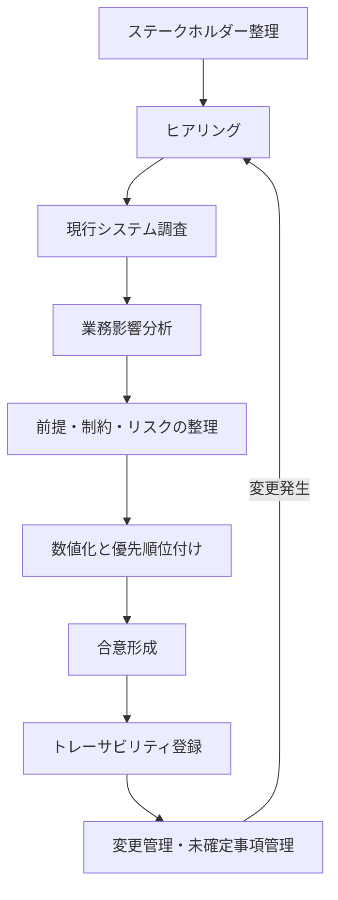

各ステップの成果物は、完璧である必要はない。
ただし、「誰が何を根拠に決めたか」が後から追える状態は必須である。

### 2.1 ステークホルダー

**ステークホルダー**は、非機能の目標値や方式に利害を持つ人または組織である。
名前の一覧ではなく、次の観点で整理する。

| 観点 | 確認すること |
|------|--------------|
| 関心 | 止められない業務、守りたい情報、下げたいコスト |
| 権限 | 要件を承認できるか、予算を承認できるか |
| 情報 | 現行の実測、障害履歴、契約、規程を持っているか |
| 影響 | 要件未達時に業務損害を受けるか |

最低限、次の役割を置く。

- 業務オーナー：業務影響と許容停止の最終判断
- 運用責任者：監視、障害対応、計画停止の実現性判断
- セキュリティ責任者：規程、監査、インシデント要件の判断
- 開発/アプリ責任者：実装制約、外部API制約の提示
- インフラ/クラウド責任者：構成、クォータ、可用性方式の提示
- プロジェクトマネージャ：スコープ、日程、変更管理
- 経営または予算決裁者：高コスト要件の採否

一人が複数役割を兼ねる組織もある。
兼務でも、承認の帽子を分けて記録する。

### 2.2 ヒアリング

ヒアリングの目的は、要望の収集だけではない。
次を引き出す。

- 困っている具体事象（いつ、誰が、何回、どの画面/バッチか）
- 止まると困る業務とその代替手段
- 現行の暗黙知（手動回避、夜間待機、特別対応）
- 「当たり前」と思われて文書化されていない前提

進め方の推奨事項は次である。

1. 品質特性ごとに質問を分ける。一度に全部聞かない
2. 数値の根拠を聞く。「なぜ2秒か」「なぜ99.99%か」
3. 発言をその場で要件文にしない。要求として記録する
4. 矛盾する発言を消さない。優先順位付けの材料にする
5. 「わからない」を許容し、未確定事項にする

### 2.3 現行システム調査

新規構築でも、現行または類似システムがある場合は調査する。
調査対象の例は次である。

- アクセスログ、APM、バッチ実行履歴
- 障害票、インシデント報告書、ポストモーテム
- バックアップ取得結果と復元試験記録
- 監視アラートの発報数と対応時間
- 構成図、依存する外部サービス一覧
- 契約上のSLA、制裁条項、保守契約
- データ量の月次推移

現行の性能や稼働率が、将来要件の上限または下限になるとは限らない。
ただし、根拠のない目標より、実測に基づく出発点の方が議論が早い。

**必須事項**：実測値を使うときは、測定期間、測定点、除外条件を併記する。

### 2.4 業務影響分析

**業務影響分析**は、停止、遅延、データ損失、情報漏洩が業務に与える影響を整理する作業である。
DRだけのものではない。可用性、性能、バックアップ、セキュリティの目標値の根拠になる。

整理の最小項目は次である。

| 項目 | 内容 |
|------|------|
| 業務名 | 申請承認、給与計算連携、問い合わせ参照など |
| 影響開始時間 | 停止後何分で業務影響が出るか |
| 影響内容 | 決裁遅延、顧客対応不能、コンプライアンス違反など |
| 代替手段 | 紙、メール、後追い処理の可否 |
| 許容停止 | 業務オーナーが許容する最大停止 |
| 許容データ損失 | 再入力可能な範囲 |
| ピーク特性 | 曜日、時刻、月末、年度末 |

影響が大きい業務ほど、目標は厳しく、コスト正当化も容易になる。
影響が小さい業務に最高水準を付ける必要はない。

### 2.5 制約条件

**制約条件**は、プロジェクトが容易に変更できない条件である。

例：

- 個人情報を国内リージョンに置く社内規程
- 既存IdPを使うこと
- 特定の保守窓口時間
- 年度予算の上限
- 移行完了の法定期限や契約期限
- 既存外部APIのレート制限

制約は要件ではない。
制約の下で要件を満たす設計を考える。
制約自体を変えたい場合は、別途、規程変更や契約変更の課題にする。

### 2.6 前提条件

**前提条件**は、成立すると仮定する条件である。
崩れたら要件や設計の見直しが必要になる。

例：

- 同時利用者ピークは1,200人を超えない
- 外部APIの95パーセンタイル応答は500ms以内
- 計画停止を年4回取得できる
- 監視の一次受け体制が継続する
- 従業員数が3年で20%増までに収まる

前提は楽観的になりやすい。
重要前提には、監視指標か定期レビューを付ける。

### 2.7 リスク

**リスク**は、発生不確実な事象のうち、要件未達や設計破綻を招くものである。

例：

- 外部APIの大幅遅延
- クラウドクォータ不足
- 復元試験未実施のまま本番稼働
- 属人化した夜間バッチ
- 要件承認者の不在による意思決定遅延

リスクには、発生時影響、検知方法、対策、残存時の受容者を付ける。
「注意する」だけでは管理していない。

### 2.8 優先順位

すべての要求を同等に扱わない。
優先順位付けの観点例は次である。

1. 法令・契約違反につながるもの
2. 重要業務の停止・データ損失につながるもの
3. 多数利用者の生産性を大きく落とすもの
4. 運用負荷を過大にし、持続不能にするもの
5. 将来の拡張を著しく妨げるもの
6. あると望ましい改善

MoSCoW（Must / Should / Could / Won't）でも、数値スコアでもよい。
重要なのは、Won't（やらない）を明示することである。

### 2.9 数値化

数値化は、次の変換作業である。

1. 対象を特定する
2. 条件を固定する
3. 指標を選ぶ
4. 目標値を置く
5. 測定方法を決める
6. 合否を定義する

数値の作り方には優先順位がある。

1. 法令、契約、社内規程に数値がある
2. 業務影響分析から逆算する
3. 現行実測を改善または維持する
4. 類似システムや業界慣行を参考にする（根拠として弱いので明記）
5. 仮置きし、測定後に見直す（未確定事項へ）

根拠の弱い数値を、強い断定で書かない。

### 2.10 合意形成

合意形成は、署名欄を埋める儀式ではない。
次が揃った状態を合意と呼ぶ。

- 要件文面が測定可能である
- 目標値の根拠が共有されている
- コストと運用負荷の影響が説明されている
- 満たせない要求の扱いが決まっている
- 未確定事項の確認期限と担当がいる
- 承認者が要件一覧に責任を持つ

合意の会議では、方式の議論に逃げない。
先に「何を守るか」を決め、方式は設計レビューへ送る。

### 2.11 トレーサビリティ

**トレーサビリティ**は、要求からテストまでの対応関係を追跡できることである。

最小の連鎖は次である。

`要求ID → 要件ID → 設計書節 → テスト項目ID → 証跡`

これがないと、次が起きる。

- 要求が要件に落ちていない欠落
- 設計だけの独りよがり
- テスト合格なのに業務要求未達
- 変更時の影響調査不能

### 2.12 要件変更管理

非機能要件の変更は、機能追加より影響が広いことがある。
変更管理で確認する項目は次である。

- 変更理由
- 影響する設計、試験、運用、コスト
- 関連要件への波及
- 残存リスクの変化
- 承認者

「試験で出なかったので目標を下げた」は、変更理由としては記録できる。
ただし業務オーナーの再合意なしに下げてはならない。

### 2.13 未確定事項管理

未確定事項は、隠す対象ではなく、管理する対象である。

記載項目の例：

- 課題ID
- 内容
- 影響する要件ID
- 確認先
- 期限
- 仮置き値
- 期限超過時のエスカレーション先

仮置き値がある要件は、要件文に「仮置き」と明記する。
仮置きのまま本番移行判定へ進ませない仕組みが必要である。

## 3. 業務上の意味

進め方を飛ばして設計に入ると、次の損失が起きる。

- 作ってから「想定と違う」とやり直しになる
- 運用引継ぎ時に監視や手順が不足している
- 監査で根拠を説明できない
- 障害後に「誰がこの目標を決めたのか」が不明になる

逆に、ヒアリングと業務影響分析が足りていれば、高価な方式を却下する判断も早くなる。
「止められない」の実態が「4時間止められる」なら、コストを下げられる。

## 4. ヒアリング質問

部門別に質問例を示す。
すべてを毎回聞く必要はない。
案件の品質特性に応じて選ぶ。

### 4.1 業務部門

- 利用者が最も使う画面と操作は何か
- 遅いと感じるのは何秒からか。そのとき業務はどう止まるか
- 平日、夜間、休日、月末、年度末で、利用の違いは何か
- システム停止時、何分で業務影響が出るか。代替手段はあるか
- データが欠ける、古い、二重登録になると、どの業務が壊れるか
- 計画停止は何日前通知で、何時間まで許容できるか
- 外部取引先や他部門システムとの締め時刻はあるか
- 「絶対に止められない」業務を3つ挙げるなら何か。その理由は何か
- 個人情報や機密情報を扱う画面はどれか
- 現状の手動回避や特別運用はあるか

### 4.2 運用部門

- 運用時間、オンコール体制、一次受けとエスカレーション経路は何か
- 現行のアラート件数と、対応に時間がかかる典型障害は何か
- 計画停止、パッチ、証明書更新の標準リードタイムは何か
- バックアップ取得時間帯と、最近の復元試験結果はどうか
- ジョブ失敗時のリトライ、待ち合わせ、手動介入の頻度は何か
- アカウント申請、権限変更、構成変更の手順と承認は何か
- 属人化している作業は何か。その人が不在だと何が止まるか
- 監視で見えていない依存関係（外部API、DNS、IdP）はあるか
- 障害時に業務部門へ連絡する基準は何か
- 運用受入で不合格にしたい条件は何か

### 4.3 セキュリティ部門

- 適用される法令、規制、社内規程、監査項目は何か
- 個人情報、機密区分、保管場所の制約は何か
- 認証方式、MFA、特権ID、職務分離の必須条件は何か
- 通信と保存の暗号化、鍵管理の基準は何か
- ログの必須項目、保管期間、改ざん防止の要求は何か
- 脆弱性診断、ペネトレーションテストの実施頻度と合格基準は何か
- パッチ適用の期限（重大度別）は何か
- インシデント時の報告先、報告期限、証拠保全の要求は何か
- 外部委託、本番アクセス、ブレイクグラス手順の条件は何か
- クラウド利用時の責任分界で、特に確認したい点は何か

### 4.4 開発部門

- 同期必須の外部APIと、非同期化できる処理は何か
- 既存のタイムアウト、リトライ、冪等性の実装方針はあるか
- ステートレスにできないセッションやローカルファイル依存はあるか
- バッチの実行時間、依存ジョブ、再実行可否はどうか
- データ量増加で遅くなるクエリや帳票はあるか
- 互換性を壊す変更の頻度と、後方互換の方針はあるか
- 性能試験で使うシナリオは、どの業務操作を代表するか
- Feature Flag、段階リリース、ロールバック手段はあるか
- 設定値のうち、環境差で事故りやすいものは何か
- 技術的負債のうち、非機能未達の主因になりそうなものは何か

### 4.5 経営層

- 本システムの停止が、経営指標や対外信用に与える影響は何か
- 投資可能な初期費用と運用費用の上限感はあるか
- 可用性やDRを一段上げる費用対効果を、誰が判断するか
- 法令違反や情報漏洩に対する許容はゼロか。残存リスクの受容者は誰か
- リリース日程と品質のどちらを優先する方針か。例外条件はあるか
- 3年後の利用者数、拠点、業務範囲の見通しは何か
- ベンダーロックインやサービス廃止リスクを、どの程度嫌うか
- 障害発生時の対外説明で、経営として守れない状況は何か

## 5. 要件例

進め方自体の管理要件例を示す。

### 要件例 NFR-GOV-001

- 要件ID：NFR-GOV-001
- 分類：要件管理
- 対象：本システムの非機能要件一覧
- 業務上の目的：目標変更の無断実施を防ぎ、合意責任を明確にする
- 前提条件：要件管理ツールまたは一覧表が単一の正とする
- 指標：承認済み要件の変更が変更管理票を経由した比率
- 目標値：100%
- 測定条件：基本設計完了後から本番移行判定まで
- 測定方法：要件IDごとの変更履歴と承認記録を突合する
- 合否判定：承認記録のない目標値変更が0件
- 例外条件：誤記修正のうち、意味が変わらない表記ゆれ修正は対象外。ただし履歴は残す
- 実現方式：変更管理手順、承認フロー、トレーサビリティ表
- 検証方法：移行判定時の監査、サンプル突合
- 根拠：非機能目標の黙改が障害後説明を不能にするため
- 関連要件：なし
- 未確定事項：使用する管理ツールの最終選定

## 6. 悪い要件例

- 「関係者と十分に協議すること」
- 「必要に応じて現行調査を行うこと」
- 「リスクを適切に管理すること」

これらは進め方の精神論であり、合否を判定できない。

## 7. 改善後の要件例

「関係者と十分に協議すること」の改善例は次である。

- 対象：可用性、性能、セキュリティ、DRのMust要件
- 指標：業務オーナー、運用責任者、セキュリティ責任者の承認完了率
- 目標値：本番移行前に100%
- 測定方法：要件一覧の承認欄またはワークフロー履歴
- 合否判定：未承認のMust要件が1件でもあれば移行判定不合格

## 8. 設計への落とし込み

進め方の成果は、次の設計インプットになる。

| 定義成果 | 設計への入り方 |
|----------|----------------|
| 業務影響分析 | 可用性、RTO/RPO、監視重大度の根拠 |
| 制約条件 | リージョン、IdP、保管地、予算上限 |
| 前提条件 | サイジング、依存APIの設計条件 |
| 優先順位 | どの品質特性に予算を張るか |
| 未確定事項 | 仮置き設計と見直しゲート |

設計者は、インプットが欠けているまま詳細方式を確定しない。
欠ける場合は、仮置きと見直し条件を設計書に書く。

## 9. 代替案

進め方の型にも代替がある。

1. **全面ヒアリング型**  
   利害が広く、新規性が高い案件向け。時間はかかる。

2. **差分定義型**  
   現行踏襲が強い案件向け。現行実測と差分要求を中心に聞く。

3. **リスク起点型**  
   短期リリースで全面定義が間に合わない場合。Mustのリスクから先に固める。
   ただし残件を未確定事項として可視化する。

短期だからといって、個人情報と復旧要件まで先送りしてはならない。

## 10. トレードオフ

| 対立 | 内容 |
|------|------|
| 定義の深さ vs 日程 | 深く聞くほど後半の手戻りは減るが、着手は遅れる |
| 仮置きの速さ vs 再合意コスト | 早く置けるが、後で覆る |
| 関係者を増やす vs 意思決定速度 | 抜け漏れは減るが収束が遅い |
| 文書量 vs 可读性 | 全部書くと読まれない。標準形式と要約の二層が必要 |

## 11. 検証方法

進め方そのものの検証は次で行う。

- 要件一覧のサンプリングレビュー（測定可能性）
- トレーサビリティ表の欠番確認
- 未確定事項の期限超過ゼロ確認
- 重要前提の実測突合
- 承認記録の存在確認

## 12. よくある失敗

1. 業務部門だけ聞いて運用とセキュリティを後回しにする
2. ヒアリング議事録が要望メモのままで要件化されない
3. 現行調査をせず、感覚でピークを置く
4. 制約と要件を混在させる
5. 優先順位を付けず、全部Mustにする
6. 未確定事項を口頭のまま忘れる
7. 承認者が「見た」だけで、目標値の意味を理解していない
8. 変更管理を機能要件にしか適用しない

## 13. レビュー観点

- [ ] ステークホルダーに業務、運用、セキュリティ、開発、決裁者が含まれるか
- [ ] 要求と要件が分離されているか
- [ ] 制約、前提、リスクが別表になっているか
- [ ] Must/Should/Won'tが明示されているか
- [ ] 目標値に根拠種別（規程/影響分析/実測/仮置き）があるか
- [ ] 未確定事項に期限と担当があるか
- [ ] トレーサビリティの最小連鎖があるか
- [ ] 部門別ヒアリングで抜けている品質特性がないか

## 14. 章末問題

### 問題1

「月末は特に遅い」という発言に対し、業務部門へ追加で聞く質問を5つ書け。

### 問題2

次を制約、前提、リスク、要件に分類せよ。

A. 個人情報は国内リージョンに保存する社内規程がある  
B. 同時利用者は1,200人を超えない見込みである  
C. 外部APIがレート制限を強化する可能性がある  
D. 申請一覧の95パーセンタイル応答を2秒以内にする  

### 問題3

未確定事項「休日オンライン利用の要否が不明」を、課題票の形で書け。

### 問題4

経営層が「絶対に止めるな。予算は最小で」と述べた。
要件定義担当として、最初に返すべき整理は何か。

## 15. 解答と解説

### 問題1（例）

1. 月末の何日、何時台に遅いか  
2. どの画面またはAPIか  
3. 遅いと感じる秒数と、業務上の支障は何か  
4. 利用者数や申請件数は平常の何倍か  
5. 現行で実施している回避策はあるか  

### 問題2

- A：制約条件
- B：前提条件
- C：リスク
- D：非機能要件

### 問題3（例）

- 課題ID：ISSUE-AVL-003
- 内容：休日にオンライン利用を公式サポートするか未確定
- 影響要件：NFR-AVL-001 の測定条件と稼働率分母
- 確認先：業務オーナー
- 期限：基本設計レビューの1週間前
- 仮置き：休日はベストエフォート、SLO対象外
- 期限超過時：PM経由で経営補佐へエスカレーション

### 問題4

「絶対に止めない」と「予算最小」は対立する。
まず、止めてよい時間を業務影響分析で分解し、Mustの停止耐性だけを見積もる。
その上で、予算内で届く目標と、追加予算が必要な目標を比較提示する。
両方を同時に約束しない。

## 16. 実務演習

実務シナリオを使い、次を作成せよ。

1. ステークホルダー表（役割、関心、承認権限）
2. 部門別ヒアリングから、各部門3問に絞った質問票
3. 前提条件5件、制約条件5件、リスク5件
4. 要求10件をMust/Should/Could/Won'tに分類
5. トレーサビリティ表のヘッダと、サンプル2行

この成果は、後の実務シナリオ編で再利用する。

---

## 次章予告

第3章では可用性設計を扱う。
稼働率から許容停止時間を計算し、SLA/SLO/SLI、冗長化、マルチAZ、直列並列構成を、数値例付きで説明する。


---


<!-- SOURCE: 03_availability.md -->

# 第3章 可用性設計

## 1. 学習目標

本章を終えると、次ができる。

- 稼働率から許容停止時間を、前提付きで算出できる
- SLA、SLO、SLI、MTBF、MTTRを混同せずに使い分けられる
- 単一障害点を洗い出し、冗長化とfailoverの設計方針を要件に対応付けられる
- 直列・並列構成の可用性を概算し、計画停止と計画外停止を分けて扱える

## 2. 基本概念

### 2.1 稼働率

**稼働率**は、定められた時間のうち、システムが利用可能な時間の割合である。

```text
稼働率 = 稼働時間 ÷ 総時間
```

または停止時間から次のように書く。

```text
稼働率 = 1 - (停止時間 ÷ 総時間)
```

稼働率を語るときは、次を同時に固定する。

- 分母の時間帯（24時間か業務時間帯か）
- 分子の定義（部分障害を停止とみなすか）
- 計画停止の除外有無
- 測定点（外形監視か、サーバ死活か）

分母と除外条件が違う稼働率は比較できない。

### 2.2 計画停止と計画外停止

**計画停止**は、事前に告知し、承認された保守のための停止である。
パッチ適用、大規模移行、構成変更が該当する。

**計画外停止**は、障害や予期しない事象による停止である。
可用性SLOの対象にすることが多い。

両方を一つの「止まらない」に混ぜると、運用も試験も破綻する。
計画停止は回数・時間・告知期限で管理し、計画外停止は稼働率やMTTRで管理する。

### 2.3 SLA、SLO、SLI

三つは役割が違う。

| 用語 | 意味 | 主な使い所 |
|------|------|------------|
| **SLI** | 測定する指標そのもの | 外形監視成功率、エラー率、応答時間 |
| **SLO** | 内部の目標値 | 月次稼働率99.9%、95パーセンタイル2秒 |
| **SLA** | 契約上の約束。未達時の補償や罰則を伴うことが多い | 顧客向け契約、ベンダー契約 |

混同の典型は次である。

- クラウドサービスのSLAを、自システムのSLOだと思い込む
- SLO未達なのにSLA違反と呼ぶ
- SLIを決めずにSLOだけ書く

**推奨事項**：先にSLIを決め、次にSLOを置き、対外約束が必要なときだけSLAを結ぶ。

### 2.4 MTBFとMTTR

**MTBF**（Mean Time Between Failures）は、故障と故障の平均間隔である。
長いほど故障しにくい。

**MTTR**（Mean Time To Repair）は、復旧にかかる平均時間である。
短いほど早く戻る。

近似式として次が使われる。

```text
稼働率 ≈ MTBF ÷ (MTBF + MTTR)
```

例：MTBFが720時間、MTTRが0.72時間なら、

```text
720 ÷ (720 + 0.72) ≈ 0.999 = 99.9%
```

この式は平均の話である。
月末の長時間障害一件で、月次SLOは簡単に割れる。
平均値だけを見て安心しない。

### 2.5 単一障害点

**単一障害点**（SPOF: Single Point of Failure）は、その一点が止まると系全体が止まる箇所である。

例：

- 冗長化されていないロードバランサー
- 単一AZのデータベース
- 単一の認証基盤
- 単一のDNS設定担当者（運用上のSPOF）
- バックアップの復元手順を知る人が一人だけ

SPOFはインフラだけではない。
運用と権限にも存在する。

### 2.6 冗長化、フェイルオーバー、クラスタ、ロードバランサー

**冗長化**は、同じ役割の資源を多重化し、一部障害でも継続できるようにすることである。

**フェイルオーバー**は、障害時に待機系や他ノードへ切り替えることである。
自動と手動がある。切替時間はMTTRに効く。

**クラスタ**は、複数ノードをまとめてサービスを提供する構成である。
活性待機、活性活性など形態が違う。

**ロードバランサー**は、複数のサーバへ要求を振り分ける。
ヘルスチェック連動で障害ノードを切り離せる。
ロードバランサー自体の冗長も必要である。

### 2.7 マルチAZとマルチリージョン

**可用性ゾーン（AZ）**は、同一リージョン内の分離されたデータセンター群を指す考え方である。
電源やネットワーク障害の影響範囲を分ける目的で使う。

**マルチAZ**は、同一リージョン内の複数AZに分散する構成である。
単一AZ障害への耐性を高める。

**マルチリージョン**は、地理的に離れたリージョンへ分散または待機系を置く構成である。
広域災害やリージョン障害への耐性を高める。
コスト、データ同期、切替複雑性も増える。

クラウドサービスのSLAは、多くの場合、個別サービスかつ条件付きである。
自システムのエンドツーエンド可用性とは別物として扱う。

### 2.8 可用性の直列・並列構成

直列結合では、すべてが動いて系が動く。

```text
A_total = A1 × A2 × A3
```

例：Web 99.9%、AP 99.9%、DB 99.9%を直列とみなすと、

```text
0.999 × 0.999 × 0.999 ≈ 0.997 = 99.7%
```

並列（冗長）では、すべてが同時に止まると系が止まる。
独立故障を仮定し、各系の非稼働率を `U = 1 - A` とすると、2重化では次になる。

```text
A_parallel = 1 - (U1 × U2)
```

例：可用性99%の装置を2台並列にすると、

```text
U = 0.01
A = 1 - (0.01 × 0.01) = 99.99%
```

この計算は、故障の独立性、切替成功、共通要因障害なし、を仮定する。
現実には電源、設定ミス、依存サービスが共通要因になる。
計算値は上限に近い目安であり、設計の安心材料にしすぎない。

### 2.9 業務時間帯別の要件

24時間同じ稼働率を要求しない案件が多い。
業務時間帯、バッチ時間帯、休日で要件を分ける。

例：

- 平日8〜20時：計画外稼働率99.9%、重大障害の初動15分以内
- 平日20〜8時：バッチ完了を優先。オンラインはベストエフォートまたは低いSLO
- 休日：参照のみ、またはSLO対象外

時間帯を分けると、保守窓とコストを確保しやすい。

### 2.10 稼働率から許容停止時間を算出する方法

#### 計算手順

1. 分母の総時間を決める
2. 目標稼働率を決める
3. `許容停止時間 = 総時間 × (1 - 稼働率)` を計算する
4. 計画停止の扱いを明示する
5. 部分障害の数え方を明示する

#### 数値例1：年換算（24時間365日）

前提：1年 = 365日 = 8,760時間。

| 稼働率 | 許容停止時間/年 | 分に換算 |
|--------|-----------------|----------|
| 99% | 87.6時間 | 5,256分 |
| 99.9% | 8.76時間 | 525.6分 |
| 99.99% | 0.876時間 | 52.56分 |
| 99.999% | 0.0876時間 | 5.256分 |

計算例（99.9%）：

```text
8,760 × (1 - 0.999) = 8.76時間/年
```

#### 数値例2：実務シナリオの業務時間帯

前提：

- 対象は平日8:00〜20:00のみ
- 1か月の平日を20日とする
- 1日の業務時間は12時間
- 月の総業務時間は `20 × 12 = 240時間 = 14,400分`
- 計画停止は分母から除外する（別管理）
- 目標は計画外停止に対する月次稼働率99.9%

```text
許容計画外停止 = 14,400 × (1 - 0.999) = 14.4分/月
```

解釈：

- 月に14.4分を超える計画外停止が一つの障害で起きれば、その月のSLOは未達になりうる
- 「年換算99.9%」より厳しい運用 sensivity を持つ場合がある
- 逆に、休日を分母に含めない分、保守窓は取りやすい

#### 数値例3：計画停止を含めた場合の比較

前提：ある月に計画停止を4時間実施し、計画外停止が10分あった。
業務時間の分母を14,400分とする。

ケースA：計画停止を除外しない

```text
停止 = 4時間 + 10分 = 250分
稼働率 = 1 - 250/14,400 ≈ 98.26%
```

ケースB：計画停止を除外する

```text
分母 = 14,400 - 240 = 14,160分
停止 = 10分
稼働率 = 1 - 10/14,160 ≈ 99.93%
```

同じ事実でも、定義次第で評価が変わる。
契約と月次レポートで定義を固定する。

## 3. 業務上の意味

可用性はサーバが生きていることではない。
利用者が業務を遂行できることである。

例：

- Webサーバは生きているが、認証基盤が落ちてログインできない
- APは生きているが、重要APIだけが失敗し、申請できない
- フェイルオーバーは成功したが、DNSキャッシュで利用者は旧系を見ている

したがってSLIは、可能なら業務合成監視（ログインから代表操作まで）を含める。

## 4. ヒアリング質問

- 止めてよい最大時間は、業務ごと・時間帯ごとに何分か
- 部分的に使えない状態を停止とみなすか
- 計画停止の回数、時間、告知期限、承認者は誰か
- 障害検知から復旧完了までの目標は何か（MTTRに相当）
- 単一AZ障害、リージョン障害、IdP障害のそれぞれで期待する振る舞いは何か
- ベンダーSLAの補償で足りるか。業務影響の方が大きいか
- 可用性向上に追加できる予算と運用負荷の上限はあるか

## 5. 要件例

### NFR-AVL-001 業務時間帯の計画外稼働率

- 要件ID：NFR-AVL-001
- 分類：可用性
- 対象：Web業務システムのオンライン機能（ログイン、申請、承認、参照）
- 業務上の目的：平日日中の申請承認業務を継続する
- 前提条件：計画停止は年4回・各4時間以内・14日前告知。休日はSLO対象外
- 指標：SLIとして外形監視（代表シナリオ）の分単位成功
- 目標値：SLOとして平日8:00〜20:00の月次稼働率99.9%以上（計画停止除外）
- 測定条件：1分間隔の合成監視。HTTP 2xx/3xxかつ代表操作成功を成功とみなす
- 測定方法：監視基盤の月次集計。失敗連続は停止時間として加算
- 合否判定：当該月の算出稼働率が99.9%以上
- 例外条件：リージョン障害はNFR-DR-001で評価。測定システムの障害時間は別途補正手順で扱う
- 実現方式：マルチAZ、LBヘルスチェック、自動復旧、依存サービスの冗長
- 検証方法：AZ障害模擬試験、月次レポートレビュー
- 根拠：業務影響分析で、30分超の日中停止は決裁遅延が多発。月14.4分以内を目標にする
- 関連要件：NFR-MNT-001、NFR-MON-010、NFR-DR-001
- 未確定事項：代表シナリオの最終確定

### NFR-MNT-001 計画停止

- 要件ID：NFR-MNT-001
- 分類：可用性（保守）
- 対象：本番オンライン機能
- 業務上の目的：必要な保守を、業務影響を制御して実施する
- 前提条件：業務オーナー承認を得ること
- 指標：計画停止の回数、1回あたり停止時間、告知リードタイム
- 目標値：年4回以内、各回240分以内、告知は14日前まで
- 測定条件：本番変更管理上の計画停止のみ
- 測定方法：変更管理票と実施記録
- 合否判定：回数・時間・告知期限のいずれも目標内
- 例外条件：緊急脆弱性対応は緊急変更手順で実施し、事後に回数へ計上してレビューする
- 実現方式：メンテナンスウィンドウ、Blue-Greenまたはローリング、事前告知テンプレート
- 検証方法：計画停止リハーサル、告知プロセス監査
- 根拠：年数回の計画停止が可能という業務合意
- 関連要件：NFR-AVL-001
- 未確定事項：緊急変更の月次上限

## 6. 悪い要件例

- 「24時間365日止まらないこと」
- 「可用性99.99%を保証すること」（分母、除外、測定点なし）
- 「クラウドSLAに準拠すれば可用性は十分」
- 「SPOFをなくすこと」（対象範囲と判定基準なし）

## 7. 改善後の要件例

「24時間365日止まらないこと」は、本章のNFR-AVL-001とNFR-MNT-001、必要ならDR要件へ分解する。

「クラウドSLAに準拠すれば十分」の改善：

- 個別サービスのSLAはインプットにすぎない
- 自システムのSLOは、合成監視のSLIで定義する
- 依存サービス障害時の業務影響と代替手段を別途書く

## 8. 設計への落とし込み

### 採用構成例（実務シナリオ向け）

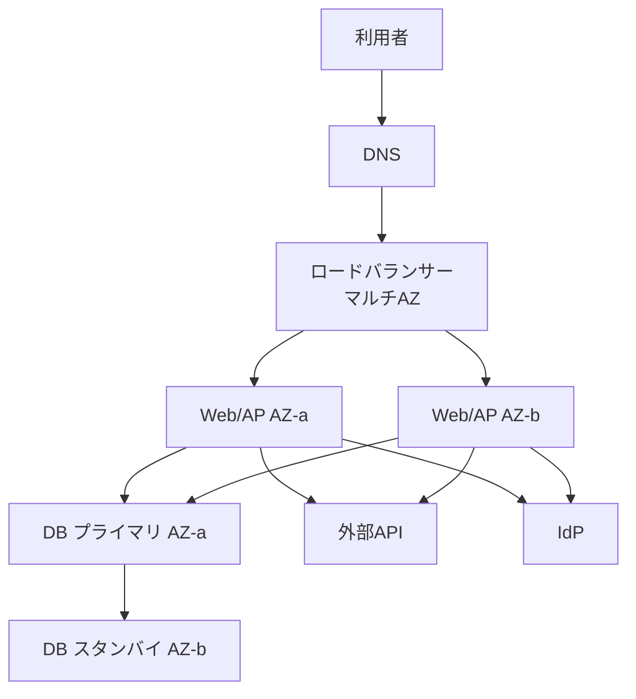

採用理由：

- 単一AZ障害でもオンライン継続を狙う
- リージョン常時稼働よりコストを抑えられる
- 年数回の計画停止が許容される

不採用案：

- 単一AZ構成：AZ障害で全停止するため、日中SLOに対して残存リスクが大きい
- アクティブ/アクティブのマルチリージョン：RTO要件が24時間なら過剰になりやすい

残存リスク：

- リージョン障害時はDR起動まで業務停止しうる
- IdPや外部APIがSPOFなら、アプリ冗長だけでは足りない
- 設定ミスや不良デプロイは両AZを同時に落とす

### メンテナンス時の継続性

計画停止を減らす設計選択肢：

1. ローリング更新
2. Blue-Green Deployment
3. カナリアリリース
4. 読み取りは継続、更新のみ停止

要件上「停止ゼロ」がMustでないなら、短い計画停止を残す方が総リスクが低い場合もある。

## 9. 代替案

| 方式 | 向く条件 | 向かない条件 |
|------|----------|--------------|
| 単一AZ + バックアップ | 停止耐性が高い、予算最小 | 日中の高いSLO |
| マルチAZ | 単一AZ障害を耐える | リージョン障害も短時間で復旧したい |
| ウォーム/ホットなDR | 広域災害のRTOが短い | 予算と訓練コストを払えない |
| 手動failover | 切替頻度が低い、誤切替を嫌う | MTTRを分単位にしたい |

## 10. トレードオフ

| 対立 | 内容 |
|------|------|
| 稼働率 vs コスト | 9を増やすほど冗長と運用が増える |
| 自動failover vs 誤切替 | 速いが、障害誤検知で揺れる |
| 計画停止削減 vs 変更リスク | 無停止更新は設計が難しい |
| エンドツーエンド監視 vs ノイズ | 業務実態に近いが、外部要因で落ちる |

99.9%から99.99%への引き上げは、許容停止が約10分の1になる。
費用も運用も線形とは限らず、一段で跳ねることが多い。

## 11. 検証方法

- 外形監視の成功定義レビュー
- AZ分離の障害注入試験（インスタンス停止、サブネット遮断の模擬）
- DBフェイルオーバー試験と切替時間計測
- 計画停止リハーサル
- 月次稼働率の算出ロジック監査
- IdP/DNS/外部API停止時の振る舞い確認

合否は、要件の測定条件と同じ定義で判定する。
試験中だけ定義を緩めて合格にしない。

## 12. よくある失敗

1. 年換算表だけ見て、月次業務時間帯の厳しさを見落とす
2. 計画停止を黙って分母に残す、または都合で除外する
3. サーバ死活を可用性SLIにする
4. クラウドSLAの数字を報告書の稼働率欄に転記する
5. 共通要因障害を無視して並列計算を信じ切る
6. failover試験を一度もせず、構成図だけで冗長を主張する
7. 運用SPOF（特定個人）を見落とす

## 13. レビュー観点

- [ ] 稼働率の分母、除外、測定点が定義されているか
- [ ] SLA/SLO/SLIが区別されているか
- [ ] 許容停止時間の計算過程があるか
- [ ] 計画停止要件が別にあるか
- [ ] SPOF一覧があるか（技術と運用）
- [ ] 依存サービス障害の扱いがあるか
- [ ] failoverの目標時間と試験があるか
- [ ] 採用理由、不採用案、残存リスクがあるか

## 14. 章末問題

### 問題1

前提：業務時間は平日20日×10時間/月。目標稼働率99.95%（計画外、計画停止除外）。
許容計画外停止は何分か。

### 問題2

Web 99.9%、AP 99.9%、DB 99.5%を直列とみなす。概算の総合可用性は約何%か。

### 問題3

ある月、業務時間分母14,400分、計画停止120分、計画外停止20分。
計画停止除外で計算した稼働率は約何%か。99.9%目標に対する合否はどうか。

### 問題4

「当社はクラウドSLA 99.99%のサービスを使っているので、システム可用性は99.99%」の誤りを指摘せよ。

## 15. 解答と解説

### 問題1

```text
総時間 = 20 × 10 = 200時間 = 12,000分
許容停止 = 12,000 × (1 - 0.9995) = 6分/月
```

### 問題2

```text
0.999 × 0.999 × 0.995 ≈ 0.993 ≈ 99.3%
```

DBが律速になっている。

### 問題3

```text
分母 = 14,400 - 120 = 14,280分
稼働率 = 1 - 20/14,280 ≈ 99.86%
```

99.9%目標には未達。

### 問題4

誤りは少なくとも次である。

- 個別サービスのSLAと、自システムのエンドツーエンド可用性は別
- 複数サービスの直列合成で総合可用性は下がる
- SLAは補償条件付きであり、業務影響ゼロを意味しない
- 利用者側障害、設定ミス、アプリ欠陥はベンダーSLAの対象外になりうる

## 16. 実務演習

実務シナリオについて、次を作成せよ。

1. 業務時間帯と休日の可用性SLO案
2. 許容停止時間の計算過程
3. SPOF候補一覧（少なくとも8件）
4. マルチAZ構成の採用理由、不採用案、残存リスク
5. NFR-AVL-001 をトレーサビリティ表の1行として設計節・テスト項目へ仮対応付け

---

## 次章予告

第4章では性能と応答時間を扱う。
平均値の限界、パーセンタイル、ピーク特性、オンライン/バッチ/API/ファイル転送の要件例を示す。


---


<!-- SOURCE: 04_performance.md -->

# 第4章 性能・応答時間設計

## 1. 学習目標

本章を終えると、次ができる。

- レスポンスタイム、スループット、同時接続数、TPSを区別して要件化できる
- 平均値だけでなくパーセンタイルとピーク条件を使って性能を評価できる
- CPU、メモリ、ディスクI/O、ネットワーク、データベース、外部APIのどこがボトルネックかを切り分ける手順を説明できる
- オンライン、バッチ、API、ファイル転送の性能要件を標準形式（16項目）で書ける
- 性能テスト、負荷テスト、ストレステスト、ソークテストの目的を区別し、使い分けて計画できる

## 2. 基本概念

### 2.1 レスポンスタイムと測定点

**レスポンスタイム**は、要求を出してから応答が返るまでの時間である。

測定点を固定しないと、同じ「2秒」でも意味が変わる。

測定点の例：

- ブラウザで操作してから画面描画が完了するまで（利用者体感）
- ロードバランサー到達から応答返却まで（サーバサイド全体）
- アプリケーションサーバ内の処理時間のみ
- データベースクエリの実行時間のみ

利用者体感は、ネットワーク遅延、フロントエンドの描画処理、サードパーティタグの読み込みなど、サーバ側で制御できない要素を含む。

**一般論**として、サーバサイドの処理時間だけを測って「性能要件を満たした」と主張する事例は多いが、利用者が体感する時間とは乖離することがある。

**推奨事項**：要件には「どこからどこまでを測るか」を必ず書く。

複数の測定点を持つ場合は、それぞれに目標値を置くか、主指標と参考値を分ける。

### 2.2 スループット、同時接続数、TPS

**スループット**は、単位時間あたりの処理量である。

件数/秒、画面遷移/分、バッチ処理件数/時などの単位で表す。

**同時接続数**は、ある瞬間に同時にセッションまたはTCP接続を保持している数である。

同時接続数は、同時利用者数と同義ではない。

一人の利用者が複数タブを開く、非同期ポーリングを行う、ブラウザが複数のリソースを並列取得するなどの理由で、同時接続数は同時利用者数を上回ることが多い。

**TPS**（Transactions Per Second）は、1秒あたりに処理されるトランザクション数である。

TPSを要件にするときは、トランザクションの定義を固定する。

- API呼び出し1回を1トランザクションとするか
- 業務上の1確定（複数API呼び出しを含む一連の処理）を1トランザクションとするか

この定義が曖昧だと、性能試験のスクリプト設計者と要件を書いた担当者の間で、まったく違う数値を「同じTPS」として扱ってしまう。

### 2.3 バッチ処理時間とデータ量

バッチは、開始時刻、終了期限、処理件数、失敗時の再実行可否のセットで要件化する。

「朝までに終わる」は要件ではない。

改善例：「6:00までに成功終了し、失敗時は6:30までの再実行で業務開始前に回復する」のように、期限と失敗時の代替経路まで書く。

データ量は、件数、容量、増加率を分けて扱う。

件数が少なくても、1件あたりのデータ（画像、添付ファイル、LOBカラム）が大きく、処理が遅くなるケースがある。

逆に、件数が多くても1件が軽量であれば、単純な件数比例でボトルネックが決まらないこともある。

**推奨事項**：バッチの性能要件には、件数だけでなく、データ特性（平均サイズ、最大サイズ、分布の偏り）を前提条件として明記する。

### 2.4 ピーク特性

性能要件の本体は、平常時ではなくピーク条件である。

平常時の平均だけを満たしても、月末に業務が止まれば性能要件は失敗している。

ピークの切り口は複数ある。

| 切り口 | 例 |
|--------|-----|
| 時刻 | 始業直後、昼休み明け、終業前の駆け込み |
| 日付 | 月末、四半期末、年度末、賞与支給日 |
| イベント | 制度変更直後、キャンペーン、一斉入力依頼 |
| 障害復帰後 | 停止中に滞留した要求が復帰直後に集中する |

複数のピークが重なる場合（月末かつ制度変更直後など）を想定するかどうかは、業務側と合意しておく。

**一般論**として、性能要件のヒアリングでは平常時の使用感だけが語られがちである。

ピークの実態は、現行システムのログや、業務担当者への個別確認がないと出てこないことが多い。

### 2.5 パーセンタイルと平均値

**平均値**は外れ値に引っ張られ、かつ利用者の体感とずれることが多い。

平均が1秒であっても、5%の利用者が10秒待たされていれば、苦情や問い合わせは確実に発生する。

**平均値だけでは不十分な理由**は次のとおりである。

1. 分布の形が見えない。平均1秒でも、全員が1秒前後なのか、大半が0.5秒で一部が20秒なのかが区別できない
2. 遅い少数派が業務上重要な利用者（管理職、繁忙部署）である場合、平均が良くても苦情の声は大きくなる
3. 障害の予兆（一部のリクエストだけ劣化し始める）を平均値は隠してしまう

**パーセンタイル**は、分布上のある位置を示す指標である。

95パーセンタイルが2秒であれば、要求の95%が2秒以内に完了していることを意味する。

推奨する使い分けは次である。

- オンライン画面の体感評価は、95または99パーセンタイルを主指標にする
- 平均値は、傾向把握の参考値として併記してよい
- 最大値だけを目標にすると、ネットワークの瞬断など稀な外れ値のたびに不合格になりうるため、最大値を主指標にする場合は例外条件を必ず添える

### 2.6 資源とボトルネック

性能は、CPU、メモリ、ディスクI/O、ネットワーク、データベース、外部APIのいずれかによって律速される。

| 資源 | 典型的な劣化要因 |
|------|------------------|
| CPU | 非効率なロジック、過剰なシリアライズ/デシリアライズ、GC負荷 |
| メモリ | リーク、キャッシュの肥大化、大量データの一括読み込み |
| ディスクI/O | ランダムアクセス過多、ログ出力過多、索引不足によるフルスキャン |
| ネットワーク | 帯域不足、往復回数（ラウンドトリップ）の多さ、パケットロス |
| データベース | ロック待ち、索引不足、統計情報の陳腐化、コネクション枯渇 |
| 外部API | 相手先の応答遅延、レート制限、リトライの多重化 |

**ボトルネック**は、系全体の処理能力を制限している箇所である。

資源を増やす場所を間違えると、費用だけが増えて効果が出ない。

例えば、ボトルネックがデータベースのロック待ちであるにもかかわらず、アプリケーションサーバのCPUを倍に増強しても、応答時間はほとんど改善しない。

### 2.7 ボトルネック特定の手順

ボトルネックの調査は、勘や経験則だけに頼らず、次の順序で進めることを推奨する。

1. 遅い操作を特定する（画面、API、バッチジョブの単位で）
2. 時間の内訳を取る（アプリ内処理、DB問い合わせ、外部呼び出し、待ち時間に分解する）
3. 資源飽和（CPU/メモリ/ディスク/ネットワークが上限に張り付いているか）か、ロック待ちか、無駄な呼び出し（N+1問題など）かを切り分ける
4. 仮説に基づいて改善を実施する
5. 改善後に再計測し、想定どおりの効果が出たかを確認する

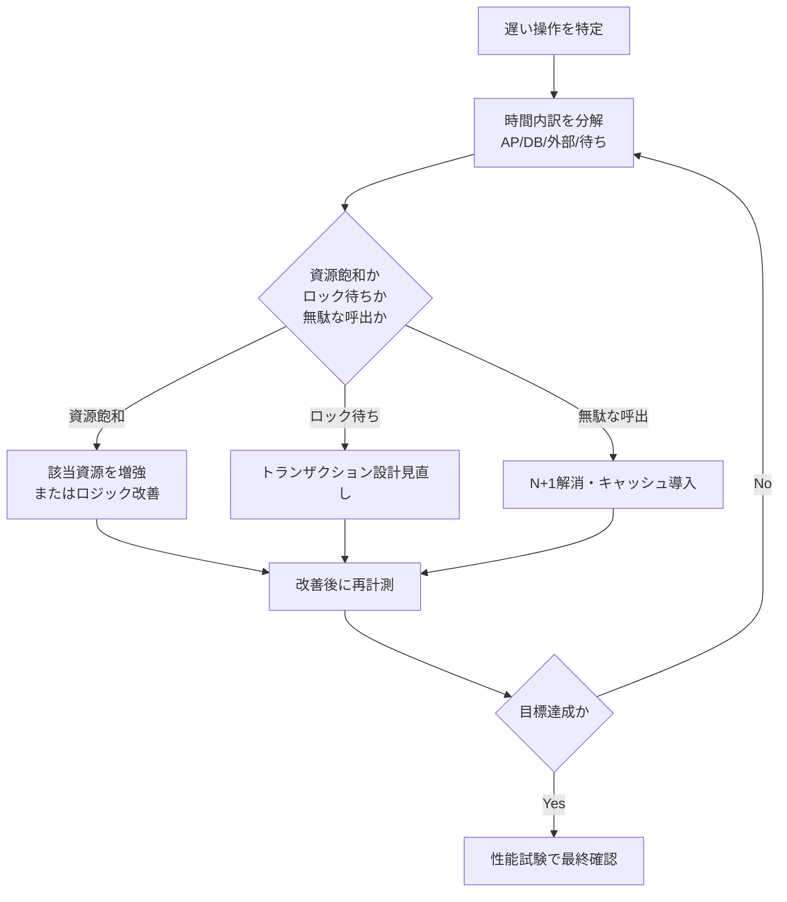

**必須事項**：改善策を実施したら、必ず同一条件で再計測する。

「直したはず」で終わらせると、別の要因で悪化していても気付けない。

### 2.8 性能目標値の作り方

目標値は、思いつきではなく、次のいずれかの根拠から作る。

1. 業務上、待つと作業が中断してしまう心理的・業務的な閾値
2. 現行システムの実測値に対する改善目標
3. 上位システムとの契約や、社内SLAで既に決まっている値
4. 依存する外部APIの応答時間を踏まえた合成値

例：外部APIの95パーセンタイルが800msである場合、自システム単独で画面応答200ms以内という目標は非現実的である。

同期呼び出しを含む画面要件は、依存を含めた形で目標値を置くか、非同期化（先に画面を返し、結果は後から反映する）を設計で検討する。

**推奨事項**：目標値には、根拠となった実測値または合意事項を要件例の「根拠」欄に必ず記録する。

根拠のない目標値は、達成できなかったときに交渉の材料を失う。

### 2.9 性能テストの種類

| 種別 | 目的 | 負荷パターン | 典型的な実施期間 |
|------|------|--------------|-------------------|
| **性能テスト** | 想定される通常負荷で、応答時間や資源使用率が要件を満たすか確認する | 想定平常負荷、または想定ピーク負荷 | 数十分〜数時間 |
| **負荷テスト** | 想定ピークまで段階的に負荷を上げ、限界点と劣化の様子を見る | 段階的に増加 | 数時間 |
| **ストレステスト** | 想定を超える負荷をかけ、壊れ方（エラーの出方、復旧の様子）を確認する | 想定を超える負荷、または急激な負荷変動 | 数十分〜数時間 |
| **ソークテスト** | 長時間にわたって負荷をかけ続け、メモリリーク、キュー滞留、ログ肥大などの劣化を検出する | 平常〜やや高めの負荷を維持 | 8〜24時間以上 |

種類を混ぜて「負荷試験をやった」で済ませないことが重要である。

**一般論**として、リリース直前に時間が足りず、性能テストだけを実施してソークテストを省略する事例は多い。

その結果、本番稼働から数日〜数週間経過してからメモリリークやログ肥大が発覧し、深夜の緊急対応につながることがある。

**推奨事項**：本番相当の重要システムでは、最低でも性能テストとソークテストの2種類は実施する。

負荷の伸びしろが読めない新規サービスでは、ストレステストも計画する。

### 2.10 継続的な性能管理

性能は、リリース前の試験だけで完結しない。

本番稼働後も、次の観点で継続的に管理する必要がある。

- APM（Application Performance Monitoring）による常時計測
- スロークエリログの定期レビュー
- 月次・四半期でのキャパシティトレンドレビュー（第5章と連携）
- リリースごとの性能回帰確認（新機能が既存機能の性能を劣化させていないか）

**推奨事項**：性能要件の合否判定は、リリース前の試験だけでなく、本番稼働後一定期間（例：1か月）の実測レビューを含める。

試験環境と本番環境ではデータ量、同時アクセスパターン、ネットワーク構成が異なることが多く、試験合格が本番での体感を保証しない場合がある。

## 3. 業務上の意味

性能未達は、機能停止と同じだけの業務影響を持つことがある。

申請画面の応答が30秒かかれば、利用者は「固まった」と判断して再操作を繰り返し、二重申請やセッション切れを誘発する。

バッチ遅延は、当日の業務判断に使うデータを前日以前のまま止めてしまう。

これは、機能としては「動いている」が、業務としては「使えない」状態である。

性能要件の主語は、システムのスループットではなく、業務が時間内に完了するかどうかである。

## 4. ヒアリング質問

- 遅いと困る操作は具体的に何か。何秒を超えると業務が止まるか
- ピークはいつ、どの程度の頻度で発生するか。平常時の何倍の負荷になるか
- 同時に利用する人数はどの程度で、その根拠（座席数、部門人数、実測）は何か
- バッチの開始・終了期限と、遅延した場合の業務影響は何か
- 外部APIやファイル転送の遅延は、誰の責任範囲で、SLAはあるか
- 現行のAPM、スロークエリログ、バッチ実行履歴は入手できるか
- 過去に性能問題で業務が止まった事例はあるか。原因は何だったか
- 性能試験に使えるデータ量と環境は、本番相当を用意できるか

## 5. 要件例

性能要件は、処理形態（オンライン、バッチ、API、ファイル転送）ごとに性質が異なるため、それぞれ独立して要件化する。

### オンライン処理：NFR-PERF-010

- 要件ID：NFR-PERF-010
- 分類：性能（オンライン）
- 対象：申請一覧画面、申請詳細画面、承認実行操作
- 業務上の目的：平日日中の申請承認業務を滞りなく進める
- 前提条件：同時利用者1,200人以下、一覧表示は1ページ100件以下、社内ネットワーク経由（VPN含む）
- 指標：各操作の応答時間95パーセンタイル（ブラウザ受信完了を基準とし、サーバ側計測を併記する）
- 目標値：一覧表示2.0秒以内、詳細表示1.5秒以内、承認実行2.0秒以内
- 測定条件：平常シナリオと月末ピークシナリオ（平常の1.5倍の同時利用者）の両方
- 測定方法：負荷試験ツールで仮想利用者を発生させ、APMまたはブラウザ計測ツールで応答時間を集計する
- 合否判定：全対象操作が目標値以内、かつエラー率0.1%未満
- 例外条件：依存する外部APIの応答が1秒を超える場合は、当該項目を非同期表示へ切り替える設計を許容し、別途要件化する
- 実現方式：アプリケーション層の水平スケール、データベース索引最適化、一覧のページング、必要に応じたキャッシュ導入
- 検証方法：性能試験、負荷試験、本番稼働後1か月の実測レビュー
- 根拠：業務ヒアリングで「3秒を超えると催促の電話が増える」との申告。現行実測の95パーセンタイルが2.8秒のため、改善目標として2.0秒を設定
- 関連要件：NFR-CAP-001（同時利用者数のキャパシティ）、NFR-PERF-020（バッチとの資源競合）
- 未確定事項：ブラウザ計測とサーバ計測の許容差分の正式合意

### バッチ処理：NFR-PERF-020

- 要件ID：NFR-PERF-020
- 分類：性能（バッチ）
- 対象：夜間集計バッチB01（当日実績を翌営業日の参照画面に反映する処理）
- 業務上の目的：翌営業日の業務開始時点で、最新の集計結果を参照可能にする
- 前提条件：入力件数は1日あたり50万件以下、同時に排他が必要な他ジョブとの並列実行はない
- 指標：ジョブ成功終了時刻、処理件数、失敗時の再実行後の完了時刻
- 目標値：通常運転時は5:30までに成功終了する。失敗時は6:00までに再実行を完了させる
- 測定条件：平常件数に加え、月末件数（平常の1.5倍）を含む試験を実施する
- 測定方法：ジョブスケジューラの実行履歴、処理件数ログの突合
- 合否判定：連続10営業日の試験で、期限超過が0件であること
- 例外条件：上流システムからの入力データ到着が23:00を超えて遅延した場合は、到着時刻から起算して90分以内の完了を代替判定とする
- 実現方式：データの分割並列処理、索引の追加、一時作業領域の確保、失敗時の部分再実行機能
- 検証方法：バッチ性能試験、障害時再実行試験
- 根拠：業務開始時刻8:00に対し、参照可否の確認と運用対応の余裕として1.5〜2時間を確保する
- 関連要件：NFR-OPS-020（ジョブ運用の異常検知）、NFR-PERF-010（オンラインとの資源競合回避）
- 未確定事項：年末年始の件数上限が未確定

### API：NFR-PERF-030

- 要件ID：NFR-PERF-030
- 分類：性能（API）
- 対象：社内連携用API `/api/v1/requests`（外部公開はしない）
- 業務上の目的：連携先システムからの申請照会要求を、時間内に返す
- 前提条件：クライアント側の同時接続は50以下、1応答あたり最大100件を返す
- 指標：サーバ側処理時間の95パーセンタイル、達成TPS、エラー率
- 目標値：95パーセンタイル300ミリ秒以内、200TPSまでエラー率0.1%未満を維持する
- 測定条件：認証処理を含めた本番相当データ量での測定
- 測定方法：API負荷試験ツール、サーバ側メトリクス収集
- 合否判定：目標TPSに到達した状態で、応答時間とエラー率が基準内に収まること
- 例外条件：クライアント起因のタイムアウト（クライアント側の待機時間設定不足）は合否判定から除外し、サーバログで区分する
- 実現方式：コネクションプーリング、ページング、レスポンスキャッシュ、レート制限による過負荷防止
- 検証方法：API負荷試験、レート制限試験
- 根拠：連携先システムのタイムアウト設定が1秒であるため、自システム側の応答に余裕を確保する
- 関連要件：NFR-REL-010（依存障害時の振る舞い）
- 未確定事項：連携先システムの増加後のTPS再見積もり

### ファイル転送：NFR-PERF-040

- 要件ID：NFR-PERF-040
- 分類：性能（ファイル転送）
- 対象：夜間の給与連携ファイル受信処理（最大ファイルサイズ2GB）
- 業務上の目的：後続バッチの開始前に、連携ファイルを確実に揃える
- 前提条件：回線の実効帯域30Mbps以上、ファイルは事前に圧縮済み
- 指標：転送完了までの時間、改ざん検知（チェックサム照合）を含む受信成功
- 目標値：22:00に転送を開始し、23:00までに受信成功を完了する
- 測定条件：最大サイズ2GBのファイルで、同時に他の転送処理が1本走っている状態を含める
- 測定方法：転送ログの時刻記録、チェックサム照合結果の記録
- 合否判定：3回連続で成功し、いずれも所要時間60分以内であること
- 例外条件：相手先システムの送信遅延で開始が遅れた場合は、到着後60分以内の完了を代替判定とする
- 実現方式：専用の転送経路確保、失敗時の自動再送、受信後の整合性検証
- 検証方法：大容量ファイルの転送試験、転送中断時の再送試験
- 根拠：後続バッチの開始時刻23:30に確実に間に合わせるため
- 関連要件：NFR-PERF-020（後続バッチとの連携）、NFR-SEC-040（転送経路の暗号化）
- 未確定事項：相手先システムの同時送信本数が増加する計画の有無

## 6. 悪い要件例

次は要件として不合格である。

1. 「システムは高速であること」
2. 「平均応答時間を短くすること」
3. 「ピーク時も快適に利用できること」
4. 「バッチは朝までに終わること」
5. 「APIは大量アクセスに耐えられること」
6. 「ファイル転送は速やかに完了すること」

不合格理由は共通している。

対象操作、指標、目標値、測定条件、合否判定のいずれかが欠けている。

加えて、例2は平均値だけを見ており、パーセンタイルの観点が抜けている。

例5は「大量」の定義（TPS、同時接続数）がなく、試験の合否を誰も判定できない。

## 7. 改善後の要件例

### 悪い例1・2の改善：「高速であること」「平均応答時間を短くすること」

NFR-PERF-010へ分解する。

改善の要点は、対象操作を固定し、指標を95パーセンタイルに置き換え、平常とピークの両条件で目標値を設定したことである。

平均値を完全に捨てるのではなく、参考指標として併記し、主指標をパーセンタイルにする。

### 悪い例3の改善：「ピーク時も快適に利用できること」

「快適」を、ピーク条件下での95パーセンタイル応答時間とエラー率に分解する。

NFR-PERF-010の測定条件（月末ピークシナリオ）がこれに該当する。

「快適」という主観語を、測定可能な二つの数値（応答時間、エラー率）に置き換えた点が改善である。

### 悪い例4の改善：「バッチは朝までに終わること」

NFR-PERF-020へ分解する。

「朝まで」という曖昧な期限を、通常時5:30、失敗時再実行後6:00という具体的な時刻に置き換え、業務開始8:00までの余裕を明示した。

### 悪い例5・6の改善：「大量アクセスに耐えること」「速やかに完了すること」

NFR-PERF-030、NFR-PERF-040へそれぞれ分解する。

「大量」をTPSと同時接続数の具体的な上限値に、「速やか」を分単位の完了期限に置き換えた。

## 8. 設計への落とし込み

性能要件から設計への対応例は次のとおりである。

| 要件 | 設計判断 |
|------|----------|
| 画面の95パーセンタイル | ページング、N+1問題の解消、アプリケーション層の水平スケール |
| 高TPSのAPI | コネクションプーリング、キャッシュ、非同期化 |
| バッチの終了期限 | データ分割、並列度の設計、処理ウィンドウ設計 |
| 大容量ファイル転送 | 帯域確保、再送機構、チェックサムによる整合性検証 |


採用理由、不採用案、残存リスクは、設計判断のたびに記録する。

**採用**：申請一覧画面へのキャッシュ導入（更新頻度が低いマスタデータ部分に限定）。

**不採用**：常時フルスキャンのまま、資源増強だけで応答時間を短縮する案。

**理由**：資源増強はコストが線形以上に増える一方、キャッシュはマスタ更新頻度が低いため効果が大きい。

**残存リスク**：キャッシュ更新の遅延により、マスタ変更直後の一時的な表示のずれが起こりうる。更新反映の目標時間を別途定義し、運用で監視する。

## 9. 代替案

| 方式 | 向く条件 | 向かない条件 |
|------|----------|--------------|
| 同期APIを非同期ジョブ＋通知へ変更 | 即時確定が不要で、体感要件を分離できる | 確定結果を即座に画面へ反映する必要がある業務 |
| 厳密なリアルタイム集計を準リアルタイムへ緩和 | 数分の遅延が業務上許容される | 会計締めなど即時性が必須の処理 |
| ピーク専用の一時スケールアウト | ピークが予測可能で短時間に限られる | ピークが不規則で予測できない |
| 業務運用での入力時間分散（システム外対策） | 業務側が入力タイミングを調整できる | 締切固定で入力が集中せざるを得ない業務 |

## 10. トレードオフ

| 対立 | 一方を優先すると | 他方に起きること |
|------|------------------|------------------|
| 厳しい応答目標 vs コスト | 常時高スペックな構成が必要になる | インフラ費用と運用費用が増える |
| 強い一貫性 vs 応答速度 | 同期的な整合性確認を行う | 待ち時間が増え、応答が遅くなる |
| 高観測粒度 vs オーバーヘッド | 詳細なトレースを常時取得する | 計測自体が負荷となり性能を下げる |
| 試験の網羅性 vs 日程 | 全シナリオを試験する | 試験期間が延び、リリースが遅れる |
| キャッシュ活用 vs データ鮮度 | 応答を高速化する | 更新反映に遅延が生じうる |

## 11. 検証方法

- シナリオ付き性能試験（代表的な業務操作の組み合わせ）
- ピーク倍率を反映した負荷試験
- 限界点を確認するストレステスト
- 8〜24時間規模のソークテスト
- スロークエリ、GC、キュー長の同時観測
- 本番導入後のSLI比較（試験結果と実運用の乖離確認）
- リリースごとの性能回帰試験

## 12. よくある失敗

1. 平均値だけを見て合格と判断する
2. ピーク条件を定義しないまま目標秒数だけを置く
3. 外部APIの遅延を、自システムの性能未達と混同する
4. 試験データを本番よりも大幅に小さくしたまま試験する
5. ウォームアップなしの初回結果だけで合否を判断する
6. ボトルネックを特定する前に、すべての層を一律に増強する
7. 性能テストだけを実施し、ソークテストを省略してメモリリークを見逃す
8. リリース直前に性能試験を初めて実施し、手戻りの時間が取れない

## 13. レビュー観点

- [ ] 測定点（どこからどこまでを測るか）が明示されているか
- [ ] パーセンタイルまたは同等の分布指標が主指標になっているか
- [ ] ピーク条件が具体的に定義されているか
- [ ] 依存システム（外部API、連携先）の前提が書かれているか
- [ ] オンライン、バッチ、API、ファイル転送が別要件として分離されているか
- [ ] 試験種別（性能、負荷、ストレス、ソーク）と合否基準が対応しているか
- [ ] 目標値の根拠が記録されているか
- [ ] 本番稼働後の実測レビューが検証方法に含まれているか

## 14. 章末問題

### 問題1

平均応答1.0秒、95パーセンタイル3.5秒の画面がある。平均目標2秒だけを見て合格と評価することの問題点は何か。

### 問題2

外部APIの95パーセンタイルが700ミリ秒、自アプリケーション処理が200ミリ秒、データベース処理が100ミリ秒の同期呼び出しの画面がある。画面全体2秒という目標は妥当か。条件を付けて答えよ。

### 問題3

「同時接続1,000」と「同時利用者1,000」は同じか。違うのであれば具体例を挙げよ。

### 問題4

夜間バッチが平常時は問題なく完了するが、月末だけ期限超過する。原因調査の手順を、本章のボトルネック特定の手順に沿って説明せよ。

## 15. 解答と解説

### 問題1

5%の利用者が3.5秒以上待たされている。

平均だけを見て合格にすると、この5%の苦情や業務遅延が見過ごされる。

分布指標（パーセンタイル）を主指標にする必要がある。

### 問題2

単純合算では約1.0秒となり、2秒目標に対しては一見余裕がある。

ただし、これは待ち行列、認証処理、フロントエンドの転送、クライアント側の再試行を含んでいない単純合算値である。

外部APIの応答が1.5秒へ劣化した場合、単純合算だけでも2秒に迫るため、目標には劣化時の扱い（例外条件）を含める必要がある。

### 問題3

同じではない。

一人の利用者が複数タブを開く、または非同期ポーリングを行えば、同時利用者500人でも同時接続数は1,000を超えることがある。

逆に、接続をプールして再利用する構成であれば、同時利用者数より同時接続数が少なくなることもある。

### 問題4

平常時と月末の差分（データ量、件数、他ジョブとの競合）をまず特定する。

次に、月末バッチの処理時間を、アプリ内処理、DB問い合わせ、外部呼び出し、待ち時間に分解して計測する。

その上で、資源飽和（月末特有のデータ量増によるディスクI/O増加など）か、ロック待ち（他ジョブとの競合）か、無駄な処理（月末専用ロジックの非効率）かを切り分け、該当箇所を改善して再計測する。

## 16. 実務演習

実務シナリオ（従業員5,000人のWeb業務システム）を使い、次を実施せよ。

1. 申請一覧画面、夜間バッチ、連携API、給与ファイル転送の4要件を標準形式（16項目）で書く
2. それぞれにピーク条件と検証方法を付ける
3. 4要件のうち、依存関係（例：ファイル転送完了がバッチ開始の前提）を1つ図示する
4. 性能試験計画（性能、負荷、ストレス、ソークの4種）を、対象要件ごとに割り当てる表を作る

---

## 次章予告

第5章では拡張性とキャパシティを扱う。

スケールアップとスケールアウトの使い分け、成長率と余裕率を用いたサイジング計算、増強リードタイムを考慮したキャパシティ計画へ進む。


---


<!-- SOURCE: 05_scalability_capacity.md -->

# 第5章 拡張性とキャパシティ

## 1. 学習目標

本章を終えると、次ができる。

- スケールアップとスケールアウトを、要件と設計の両方の観点で使い分けられる
- 水平分割と垂直分割の違いと、それぞれが拡張性に与える効果と副作用を説明できる
- オートスケーリングとステートレス設計の関係を説明し、要件へ落とし込める
- 成長率、余裕率、増強リードタイムを含むキャパシティ計画を、前提付きの数値で作れる
- 監視閾値と将来予測を接続し、増強判断のタイミングを設計できる

## 2. 基本概念

### 2.1 スケールアップとスケールアウト

**スケールアップ**（垂直方向の拡張）は、単一資源の性能を上げることである。

CPUコア数の増加、メモリ増設、より大きなインスタンスタイプへの変更、より高性能なデータベースインスタンスへの変更が該当する。

**スケールアウト**（水平方向の拡張）は、同等の資源を横に増やすことである。

アプリケーションサーバの台数を増やすことが代表例である。

両者は次のように性質が異なる。

| 観点 | スケールアップ | スケールアウト |
|------|----------------|------------------|
| 実施の容易さ | 比較的容易（設定変更や再起動で済むことが多い） | ステートレス化やデータ分割の準備が要る場合がある |
| 上限 | 装置やインスタンスタイプの上限に達すると頭打ち | 理論上は台数を増やす限り拡張できる |
| 単一障害点 | 1台に依存する部分が残りやすい | 台数分散により影響範囲が小さくなりやすい |
| コスト特性 | 高スペック機ほど単価が非線形に上がることが多い | 台数に比例したコストになりやすい |

**一般論**として、まずスケールアップで対応し、上限が見えてきた段階でスケールアウトへ移行する案件は多い。

ただし、後からステートレス化やデータ分割を行うのは、設計初期に組み込むより手戻りが大きい。

**推奨事項**：将来的にスケールアウトが必要になると想定される場合は、初期構築の段階でステートレス設計を前提にしておく。

### 2.2 水平分割と垂直分割

**水平分割**（シャーディングなど）は、データを行方向に分ける方式である。

利用者IDやテナントID、地域コードなどのキーでデータを複数の格納先に分散する。

**垂直分割**は、データを機能やテーブルの役割で分ける方式である。

認証系のデータとログ系のデータを別のデータベースに分離する、といった分割が該当する。

| 分割方式 | 効果 | 副作用 |
|----------|------|--------|
| 水平分割 | データ量とアクセス負荷を複数系統に分散できる | 横断検索、集計、分割キーをまたぐトランザクションが難しくなる |
| 垂直分割 | 機能ごとに独立してスケールでき、障害の影響範囲も限定できる | 機能をまたぐ処理で分散トランザクションや結果整合性の設計が必要になる |

分割は拡張性を高める一方、アプリケーションとデータの設計難度を確実に上げる。

**推奨事項**：分割を導入する前に、現在のデータ量と成長率で、分割なしのままどこまで耐えられるかを見積もる。

見積もりの結果、数年単位で分割不要と判断できるなら、初期の複雑性を避けて先送りする選択も合理的である。

### 2.3 オートスケーリングとステートレス

**オートスケーリング**は、負荷指標（CPU使用率、キュー長、リクエスト数など）に応じて、資源数を自動的に増減させる仕組みである。

オートスケーリングを要件または設計として固定するときは、次を必ず決める。

- 増減判断に使う指標（CPU使用率、リクエストレイテンシ、キュー長など）
- スケールアウトの上限台数、スケールインの下限台数
- クールダウン時間（増減判断の間隔。頻繁な増減の振動を防ぐ）
- スケール失敗時（増設に失敗した、または上限に達した）の動作

**ステートレス**は、個々のサーバがセッションなどの必須状態を保持しないことである。

ステートレスであれば、どのサーバが要求を処理しても結果が変わらないため、スケールアウトや障害時のサーバ入れ替えが容易になる。

どうしてもサーバ側に状態を持たせる必要がある場合は、その状態を外部ストア（共有キャッシュ、データベースなど）へ出す設計にする。

**必須事項**：オートスケーリングを前提とするシステムでは、セッション情報をアプリケーションサーバのローカルメモリに保持しない。

### 2.4 キャッシュとキュー

**キャッシュ**は、再利用可能なデータへのアクセスを高速化し、背後にあるデータベースなどの系への負荷を下げる仕組みである。

キャッシュ導入時に決めるべき事項は次である。

- 鮮度（キャッシュされたデータがどれだけ古くてもよいか）
- 無効化のタイミングと方式（更新時に即時無効化するか、TTLで自然に期限切れにするか）
- ヒット率の目標値
- キャッシュ基盤自体が障害になった場合のバイパス動作（キャッシュなしで元系へ直接問い合わせる、など）

**キュー**は、同期処理を非同期化し、ピーク負荷を平準化する仕組みである。

キュー導入時に決めるべき事項は次である。

- 待ち時間のSLO（キューに滞留してよい最大時間）
- 処理できないメッセージ（毒メッセージ）の扱い
- 再処理の方針（自動リトライの回数と間隔）
- メッセージの順序性が業務上必要かどうか

キャッシュとキューはどちらも、性能とスケーラビリティを高める代表的な手段であるが、導入によって「常に最新のデータを見ている」という前提や「送った順に処理される」という前提が崩れることがある。

**推奨事項**：キャッシュとキューを導入する際は、業務側に「多少の遅延や順序の入れ替わりが起こりうる」ことを明示的に合意してもらう。

### 2.5 データ増加、利用者増加、ピーク増加

拡張性を考えるとき、増加は一種類ではない。

| 増加の種類 | 典型的な影響先 |
|------------|------------------|
| 利用者増加 | 同時接続数、認証処理、アプリケーションサーバのCPU負荷 |
| データ増加 | データベース容量、索引サイズ、バックアップ時間、検索の遅延 |
| ピーク増加 | 瞬間的なTPS、キューの滞留、外部APIのレート制限への抵触 |

三つの増加は、必ずしも同じ比率で進まない。

例えば、3年間で利用者数が20%しか増えなくても、1利用者あたりのデータ生成量が増えて、データ量が200%増えることがある。

この場合、律速するのは利用者数ではなくデータ側のリソース（データベース容量、索引、バックアップ時間）である。

**推奨事項**：キャパシティ計画では、利用者数、データ量、ピーク倍率の3つを個別に見積もり、どれが先に上限へ到達するかを確認する。

### 2.6 成長率と余裕率

**成長率**は、一定期間あたりの増加見込みである。

例：利用者数が年率6.3%で増加する（3年で約20%相当）、データ量が年率40%で増加する、など。

成長率は、単一の数値ではなく、対象（利用者、データ、ピーク）ごとに個別に見積もる。

**余裕率**は、予測したピークに対して、さらに上乗せして確保しておく余白である。

余裕率を置く理由は次である。

- 成長率の予測には誤差がある
- 突発的なイベント（キャンペーン、制度変更）による瞬間的な負荷増に備える
- 障害時の縮退運転や、メンテナンス時の資源制約に対応する余地を残す

余裕率が高いほど安全側だが、コストも増える。

**一般論**として、20〜30%程度の余裕率を置く案件が多いが、これは業界標準として固定された数値ではなく、業務のリスク許容度とコストのバランスで決める値である。

### 2.7 サイジングの手順と数値例

**サイジング**は、将来必要になる資源量を見積もる作業である。

見積もりは、可能な限り実測または試験に基づいて行う。

カタログスペックからの単純な比例計算は、実際のアプリケーションの挙動（キャッシュ効率、ロック競合、GCの影響など）を反映しないため、誤差が大きくなりやすい。

サイジングの手順は次のとおりである。

1. 現在の実測ピーク値を確認する
2. 対象（利用者、データ、ピーク）ごとの成長率を見積もる
3. 計画期間（例：3年後）の予測値を計算する
4. 余裕率を加算し、設計目標値を確定する
5. 設計目標値をもとに、必要な資源（サーバ台数、DBインスタンスサイズ、接続数上限など）を試算する

#### 数値例：実務シナリオ（利用者5,000人、3年+20%、余裕率30%）

前提を次のとおり置く。

- 現在の登録利用者数：5,000人
- 3年後の成長率：+20%（年率換算では約6.3%相当）
- 現在の同時利用者率（登録者数に対する同時アクセス比率）：24%（現状の実測ピーク同時利用者1,200人 ÷ 5,000人）
- 同時利用者率は3年後も同水準と仮定する
- 余裕率：30%

計算過程は次のとおりである。

ステップ1：3年後の登録利用者数を計算する。

```text
5,000人 × (1 + 0.20) = 6,000人
```

ステップ2：3年後のピーク同時利用者数を計算する（同時利用者率24%を適用）。

```text
6,000人 × 0.24 = 1,440人
```

ステップ3：余裕率30%を加算し、設計目標値を計算する。

```text
1,440人 × (1 + 0.30) = 1,872人
```

この「設計ピーク同時利用者1,872人相当」という数値を、アプリケーションサーバの必要台数、データベースの同時接続数上限、ロードバランサーの上限設定、外部APIのレート制限確認などに使う。

**注意**：この計算は、次の前提が崩れると成立しない。

- 同時利用者率が3年後も一定である（実際には業務のオンライン化が進み比率が上がることもある）
- 成長が線形である（実際には組織統合など非連続な増加が起こりうる）
- ピーク時の利用パターンが現在と変わらない

**推奨事項**：この種の前提は、要件例の「前提条件」欄に明記し、前提が崩れた場合は計画を見直すことを合意しておく。

### 2.8 キャパシティ計画と増強リードタイム

**キャパシティ計画**は、いつ、何を、どの閾値で増強するかをあらかじめ定めた計画である。

**増強リードタイム**は、増強すべきと判断してから、実際にその増強が反映されるまでの時間である。

クラウド環境であっても、リードタイムはゼロにはならない。

- インスタンスタイプのクォータ申請と承認
- 変更管理プロセス上の承認
- 検証環境での事前確認
- 繁忙期を避けるためのリリース窓の調整

オンプレミス環境であれば、機器調達を含めて月単位のリードタイムになることが多い。

**必須事項**：監視の警告閾値は、増強リードタイムを逆算して設定する。

リードタイムより短い予兆検知では、閾値を超えてから増強が間に合わない。

### 2.9 閾値設計

閾値は、単一の値ではなく、段階を持たせて設計することが多い。

| 閾値レベル | 例 | 対応 |
|------------|-----|------|
| 情報 | CPU使用率60%超が継続 | トレンド記録、次回計画レビューでの確認材料 |
| 警告 | CPU使用率70%超が30分継続、DB容量75%到達 | 増強チケットの起票、リードタイムを踏まえた計画着手 |
| 重大 | CPU使用率90%超、DB容量85%到達、キュー滞留が5分超 | 緊急増強手順の発動、必要に応じた縮退運転 |

**一般論**として、警告閾値だけを設定し、情報レベルのトレンド監視を省略する案件は多い。

その結果、警告閾値に達してから急いで増強計画を立てることになり、リードタイムに間に合わないことがある。

**推奨事項**：情報レベルの監視も設置し、四半期ごとのトレンドレビューで成長率の想定と実績を照合する。

### 2.10 将来予測の更新サイクル

将来予測は、一度立てて終わりにしない。

成長率の初期値は仮置きであることが多く、実測データが蓄積するにつれて精度を上げる必要がある。

**推奨事項**：少なくとも四半期ごとに、実測の成長率と計画時の想定成長率を比較し、乖離が大きい場合はキャパシティ計画そのものを見直す。

見直しのきっかけとなる事象には、組織統合、新機能の大規模リリース、法制度変更に伴う利用者急増などがある。

これらは通常の成長率の延長線上にない非連続な増加であり、事前に察知できる情報（経営方針、他部門からの通知）を運用側と共有しておく必要がある。

## 3. 業務上の意味

拡張性不足は、多くの場合、ある日突然に業務を止める形で表面化する。

平常時は問題なく動いていたシステムが、キャンペーン開始、制度変更の施行日、組織統合直後など、想定を超えたピークに直面した瞬間に応答しなくなる。

「今は動いている」という事実は、来四半期や来年度も動き続けることの証拠にはならない。

拡張性とキャパシティの設計は、現在の性能要件（第4章）を、将来の利用規模でも維持し続けるための備えである。

## 4. ヒアリング質問

- 3年後、5年後の利用者数、拠点数、データ量の見通しはどの程度か
- 繁忙期の負荷は、平常時の何倍になると想定されるか
- 組織統合、法制度変更など、非連続な利用者増加が計画されているか
- 増強の判断者は誰で、承認から反映までの標準的な日数はどの程度か
- オートスケーリングを使う場合、費用の上限はどこまで許容できるか
- データの削除、アーカイブに関する業務ルールは存在するか
- スケールアウトを妨げる、サーバ側に状態を持たせている処理はあるか
- 過去にキャパシティ不足で障害や性能劣化が起きた事例はあるか

## 5. 要件例

### NFR-CAP-001 オンラインAP層とDB接続資源のキャパシティ

- 要件ID：NFR-CAP-001
- 分類：拡張性・キャパシティ
- 対象：オンラインアプリケーション層およびデータベース接続資源
- 業務上の目的：3年後の利用者増加後も、月末ピーク業務を性能要件を満たしたまま継続する
- 前提条件：登録利用者数は3年後に6,000人まで増加する見込み。同時利用者率は現状の24%相当を維持すると仮定する。余裕率30%を適用する
- 指標：設計ピーク同時利用者数、資源使用率（CPU、メモリ、DB接続数）、増強実施リードタイム
- 目標値：同時利用者1,872人相当まで、性能要件NFR-PERF-010の応答時間目標を維持する。警告閾値到達から増強反映まで10営業日以内
- 測定条件：設計ピーク相当の負荷試験、および四半期ごとのキャパシティレビュー
- 測定方法：負荷試験ツールによる測定、クラウド基盤のメトリクス収集、変更管理票の所要日数集計
- 合否判定：設計ピーク負荷試験に合格すること。四半期レビューでの増強リードタイム中央値が10営業日以内であること
- 例外条件：突発的な制度変更による想定外のピークは、臨時増強手順で対応し、事後に成長率の想定を改定する
- 実現方式：アプリケーション層の水平スケール、コネクションプール管理、必要時のデータベーススケールアップ、オートスケーリングの上限・下限設定
- 検証方法：設計ピーク負荷試験、増強手順の机上訓練および実地訓練
- 根拠：3年間で利用者数+20%、余裕率30%を積算した設計ピーク値
- 関連要件：NFR-PERF-010、NFR-MON-020
- 未確定事項：同時利用者率24%という前提の実測による最終確定

### NFR-CAP-002 データ増加へのストレージ拡張

- 要件ID：NFR-CAP-002
- 分類：拡張性・キャパシティ
- 対象：業務データベースのストレージ容量
- 業務上の目的：データ量の増加によってバックアップ時間や検索性能が劣化しないようにする
- 前提条件：現在のデータ量は500GB、年率40%での増加が見込まれる。アーカイブ方針は未確定
- 指標：ストレージ使用率、バックアップ所要時間、主要検索クエリの応答時間
- 目標値：3年後の推定データ量（500GB × 1.4^3 ≈ 1.37TB）に対し、余裕率30%を加えた約1.8TBの容量を確保する。ストレージ使用率が閾値75%に到達した時点で増強を起票する
- 測定条件：四半期ごとの実データ量計測
- 測定方法：データベース管理ツールによる容量レポート、バックアップジョブの実行ログ
- 合否判定：使用率が閾値を超えた際に、リードタイム内で増強が完了していること
- 例外条件：アーカイブ方針が確定した場合は、対象データの一部をオンライン系から除外し、成長率を再計算する
- 実現方式：ストレージの動的拡張機能、索引の定期的な再編成、古いデータのアーカイブ検討
- 検証方法：容量逼迫を模した試験、バックアップ所要時間の定期測定
- 根拠：年率40%というデータ増加率は、現行システムの過去2年間の実測平均に基づく
- 関連要件：NFR-PERF-020（バックアップ時間の性能要件との関係）、NFR-BKP-001
- 未確定事項：アーカイブ対象の業務ルールと保持期間

## 6. 悪い要件例

1. 「将来の増加に耐えられること」
2. 「必要に応じてスケールすること」
3. 「十分なキャパシティを持つこと」
4. 「データが増えても問題なく動くこと」
5. 「オートスケーリングを導入すること」

不合格理由は共通している。

対象資源、成長率の前提、余裕率、目標値、増強手段のいずれかが欠けている。

例5は、目的（何のためにオートスケーリングが必要か）や上限・下限の指定がなく、設計方式をそのまま要件に書いてしまっている点が問題である。

## 7. 改善後の要件例

### 悪い例1・3の改善：「将来の増加に耐えられること」「十分なキャパシティを持つこと」

NFR-CAP-001へ分解する。

改善の要点は、対象資源、成長率の前提（3年+20%）、余裕率（30%）、設計ピーク値（1,872人相当）、増強リードタイム（10営業日）を明示したことである。

### 悪い例2の改善：「必要に応じてスケールすること」

「必要に応じて」を、閾値（警告70%、重大90%など）と増強リードタイムに分解する。

NFR-CAP-001の測定条件と合否判定がこれに該当する。

### 悪い例4の改善：「データが増えても問題なく動くこと」

NFR-CAP-002へ分解する。

データ増加率の前提、3年後の推定容量、余裕率を加えた確保容量を数値化した点が改善である。

### 悪い例5の改善：「オートスケーリングを導入すること」

オートスケーリングは設計手段であり、要件そのものではない。

要件としては、NFR-CAP-001の「設計ピーク同時利用者数まで応答時間を維持する」という形にし、その実現方式としてオートスケーリングを設計側で選択する構成にする。

## 8. 設計への落とし込み

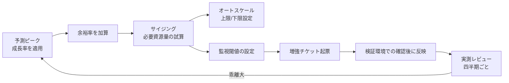

**採用**：アプリケーション層はオートスケーリングを採用し、データベースは予兆に基づく手動スケールアップとする。

**不採用**：現時点でのデータベースのシャーディング初期導入。

**理由**：現状のデータ量と成長率、およびチームの運用習熟度に対して、シャーディングによる複雑性の増加が見合わない。

**残存リスク**：急激なデータ増加が発生した場合、手動でのスケールアップが増強リードタイムに間に合わない可能性がある。アーカイブ方針の早期確定と、閾値の前倒し設定で緩和する。

## 9. 代替案

| 方式 | 向く条件 | 向かない条件 |
|------|----------|--------------|
| 先に資源を大きく確保する（初期過大投資） | 成長予測の確度が高く、値下げ交渉余地がある | 予算が限られ、初期投資を抑えたい |
| 小さく始めてオートスケールと定期見直しで追随する | 成長率に不確実性が大きい | 増強リードタイムが極端に長い環境 |
| ピーク業務を時間分散する運用対策を併用する | 業務側が入力タイミングを調整できる | 締切固定で分散が困難な業務 |
| 履歴データを別系統へアーカイブし、オンライン系を軽くする | データ増加が主要因でアクセス頻度が下がるデータがある | 常に全期間データへの高速アクセスが必要 |

## 10. トレードオフ

| 対立 | 一方を優先すると | 他方に起きること |
|------|------------------|------------------|
| 余裕率 vs コスト | 障害耐性や急な増加への耐性が高まる | インフラ費用が増える |
| 自動拡張の柔軟性 vs 費用の予測可能性 | 負荷に応じて即座に対応できる | 上限を誤ると費用が想定以上に膨らむ |
| データ分割による拡張性 vs 運用複雑性 | 大規模データへの対応力が上がる | 横断検索やトランザクション設計が難しくなる |
| キャッシュによる高速化 vs データ鮮度 | 応答性能とスケーラビリティが上がる | 更新反映の遅延という制約が生じる |
| 早期の大規模投資 vs 段階的investment | 将来の増強作業が減る | 予測が外れた場合の無駄な投資リスクが増える |

## 11. 検証方法

- 設計ピーク相当の負荷試験
- オートスケーリングの動作試験（増加、減少、上限到達時の挙動確認）
- 容量逼迫訓練（ディスク容量、DB接続数上限への到達を模擬）
- 四半期ごとの予測値と実測値の差分レビュー
- 増強リードタイムの実績測定（チケット起票から反映完了までの所要日数）
- キャッシュ障害時のバイパス動作確認
- キューの滞留発生時の挙動確認

## 12. よくある失敗

1. 利用者数の増加だけを見て、データ量の増加を見落とす
2. 余裕率をゼロにしてサイジングし、予測誤差の吸収余地がない
3. オートスケーリングの上限を、要件で想定する最大負荷より低く設定してしまう
4. 増強リードタイムを考慮せず、閾値を実際に危険な水準ぎりぎりに設定する
5. ステートフルな設計のまま、スケールアウト可能と宣言してしまう
6. キャッシュを導入すれば性能問題が恒久的に解決すると思い込み、鮮度要件の合意を怠る
7. 将来予測を一度立てたきり見直さず、非連続な増加（組織統合など）を察知できない
8. データの分割やアーカイブの判断を先送りし続け、手遅れになってから着手する

## 13. レビュー観点

- [ ] 成長の対象（利用者、データ、ピーク）が個別に見積もられているか
- [ ] サイジングの計算過程が前提とともに記録されているか
- [ ] 余裕率と増強リードタイムが明示されているか
- [ ] オートスケーリングの上限・下限と費用の上限が設定されているか
- [ ] アーカイブや削除の方針が定まっているか、未確定事項として管理されているか
- [ ] 監視閾値が段階的に設計され、増強リードタイムから逆算されているか
- [ ] ステートレス設計の前提が、スケールアウトが必要な範囲で満たされているか
- [ ] 将来予測の見直しサイクルが定義されているか

## 14. 章末問題

### 問題1

現在のピークTPSが100、年成長率20%、2年後、余裕率25%のとき、設計TPSはいくらになるか。

### 問題2

増強リードタイムが15営業日のシステムで、容量閾値を「85%到達で警告」とだけ固定することのリスクは何か。

### 問題3

スケールアップしかできないアプリケーション構成の欠点を2つ挙げよ。

### 問題4

利用者数が3年で20%しか増えないのに、データ量が3年で3倍近くに増える見込みのシステムがある。キャパシティ計画で優先的に見積もるべき対象は何か、理由とともに述べよ。

## 15. 解答と解説

### 問題1

```text
100 × (1.2)^2 = 144
144 × 1.25 = 180 TPS
```

設計TPSは約180TPSになる。

### 問題2

85%到達から増強完了まで15営業日かかる間に、成長速度によっては上限（100%）を超える可能性がある。

成長速度に応じた早期警告（例：75%到達時点での起票）や、トレンドに基づく予測アラートを併用する必要がある。

### 問題3

第一に、装置やインスタンスタイプの上限に達すると、それ以上性能を伸ばせない。

第二に、単一ノードへの依存度が高いため、そのノードの障害が全体に与える影響範囲が大きい。

### 問題4

データ量を優先的に見積もるべきである。

利用者数の伸びが緩やかでも、データ増加率が高ければ、ストレージ容量、索引サイズ、バックアップ時間、検索性能のいずれかが先に上限へ到達し、ボトルネックになる可能性が高いためである。

## 16. 実務演習

実務シナリオ（従業員5,000人、3年後+20%、余裕率30%）を使い、次を作成せよ。

1. 3年間のキャパシティ計画表（列：指標、現在値、1年後、3年後、余裕率込み設計値、閾値、増強手段、リードタイム）
2. 同時利用者数のサイジング計算過程（本章2.7の手順に沿う）
3. データ増加率が利用者増加率と異なる場合の追加検討事項を3件挙げる
4. NFR-CAP-001、NFR-CAP-002について、関連する性能要件・監視要件との対応関係を1行ずつ書く

---

## 次章予告

第6章では信頼性と耐障害性を扱う。

リトライ、タイムアウト、サーキットブレーカー、冪等性、部分障害とカスケード障害への対処、障害分離とバルクヘッドの設計を要件化する。


---


<!-- SOURCE: 06_reliability.md -->

# 第6章 信頼性と耐障害性

## 1. 学習目標

本章を終えると、次ができる。

- 信頼性、フォールトトレランス、フェイルセーフ、フェイルソフト、Graceful Degradationを区別して説明できる
- リトライ、タイムアウト、サーキットブレーカー、冪等性を、テスト可能な要件として書ける
- 部分障害とカスケード障害の違いを理解し、障害分離とバルクヘッドで影響範囲を限定する設計ができる
- データ整合性の要求水準（強整合か結果整合か）を業務ごとに判断できる
- 手動切替と自動切替を、MTTRと誤切替リスクの両面から比較して採否を決められる

## 2. 基本概念

### 2.1 信頼性と関連する概念

**信頼性**は、定められた条件で、定められた期間にわたって、故障せずに動き続ける性質である。

可用性（第3章）が「今この瞬間に使えるか」に近い概念であるのに対し、信頼性は「壊れにくさ」「壊れたときにどう振る舞うか」という側面を強く含む。

信頼性を支える関連概念は次のとおりである。

**フォールトトレランス**（耐障害性）は、系の一部に故障が発生しても、サービス全体としては継続して機能する能力である。

多重化された構成のうち一部が故障しても、残りが処理を続けられる状態がこれにあたる。

**フェイルセーフ**は、故障が発生したときに、安全側へ倒す設計思想である。

例えば、決済処理において、通信断で成功か失敗か確定できない場合、誤って二重に課金するより、処理を止めて再確認を求める方を選ぶ。

**フェイルソフト**は、故障が発生しても、機能を縮小しながらサービスを継続することである。

一部の非重要機能を止めてでも、主要機能を動かし続ける設計がこれにあたる。

**Graceful Degradation**（段階的縮退）は、障害や過負荷が発生した際に、重要度の低い機能から順に停止し、重要な機能を優先的に残す考え方である。

フェイルソフトとGraceful Degradationは重なる部分が大きいが、Graceful Degradationは「どの機能から、どの順序で落とすか」という段階設計を明示的に扱う点が特徴である。

| 概念 | 焦点 | 具体例 |
|------|------|--------|
| フォールトトレランス | 一部故障時にも継続する能力そのもの | 多重化構成、冗長化されたキュー |
| フェイルセーフ | 故障時にどちら側に倒すか | 通信断時は処理を止め、誤課金を防ぐ |
| フェイルソフト | 機能を縮小しつつ継続する | 検索機能停止中も申請・承認は継続 |
| Graceful Degradation | 縮退の順序と段階の設計 | 副次機能→非重要機能→重要機能の順に守る |

**一般論**として、これらの用語は現場で厳密に区別されず、「障害に強くする」という一言でまとめて語られがちである。

区別せずに要件を書くと、「フェイルセーフにしてほしい」という要求が「止めてほしい」のか「動かし続けてほしい」のか分からなくなる。

### 2.2 タイムアウト設計

**タイムアウト**は、応答を待ち続ける上限時間である。

タイムアウトがないと、応答が返らない依存先に対してスレッドや接続が占有され続け、やがて資源が枯渇して自システム全体が止まる。

タイムアウト設計で決めるべき事項は次である。

- 呼び出し種別ごとのタイムアウト値（DB接続、外部API呼び出し、内部サービス間通信でそれぞれ異なる値になる）
- タイムアウト発生時の挙動（エラーを返す、デフォルト値で継続する、キューへ回す）
- タイムアウト値と、上位処理（画面応答時間など）の整合性

**必須事項**：外部への同期呼び出しには、必ずタイムアウトを設定する。

タイムアウト値が無制限、または極端に長い（分単位）設定は、実質的にタイムアウトが無いのと同じ結果を招く。

### 2.3 リトライ設計

**リトライ**は、失敗した操作を再度試みることである。

リトライを設計するときは、次を定義する。

- リトライの対象となるエラー種別（一時的な通信エラーか、業務エラーか）
- 最大リトライ回数
- リトライ間隔（固定間隔か、指数バックオフか）
- ジッタ（複数クライアントの再試行タイミングが重ならないようにするランダムな揺らぎ）
- 対象操作が冪等かどうか

タイムアウトなしのリトライや、非冪等な操作への無制限リトライは危険である。

例えば、決済確定APIに対して間隔なしで大量にリトライする実装は、相手先の負荷をさらに増幅させ、かつ多重確定を引き起こす可能性がある。

**推奨事項**：リトライには必ず上限回数と間隔（できれば指数バックオフとジッタ）を設定し、非冪等な操作へのリトライは冪等性を確保したうえで行う。

### 2.4 サーキットブレーカー

**サーキットブレーカー**は、依存先の連続失敗を検知したら、それ以上の呼び出しを一時的に短絡（遮断）し、依存先の負荷をこれ以上増やさないようにする仕組みである。

一定時間後に、少量の試験的な呼び出しを行い、成功が続けば徐々に通常運転へ戻す。

サーキットブレーカーの状態は、一般に次の3つで表される。

| 状態 | 動作 |
|------|------|
| Closed（閉） | 通常どおり依存先を呼び出す。失敗率を監視する |
| Open（開） | 依存先への呼び出しを遮断し、即座にエラーまたは代替応答を返す |
| Half-Open（半開） | 少量の試験呼び出しを行い、成功すればClosedへ、失敗すれば再びOpenへ戻る |

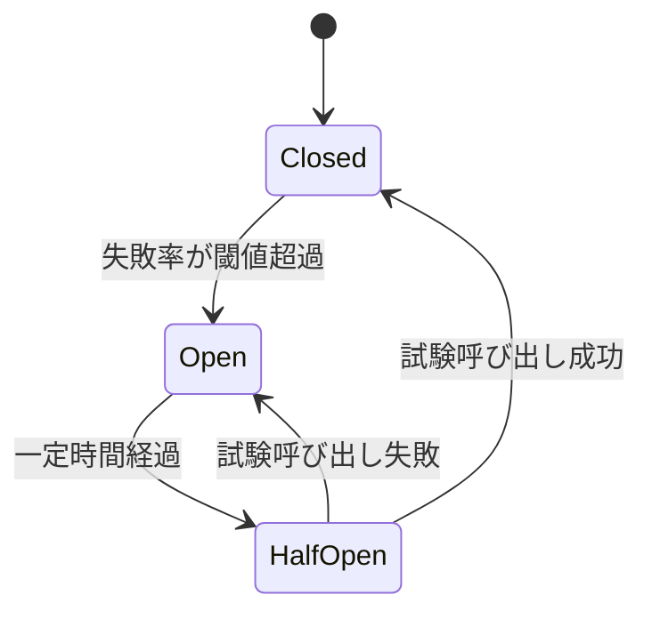

サーキットブレーカーは、カスケード障害（2.8参照）の抑止に直接効く仕組みである。

**推奨事項**：サーキットブレーカーがOpenの間、利用者に対しては「一時的に利用できない」ことを明確に伝え、未確定のまま処理が宙に浮いた状態を作らない。

### 2.5 冪等性

**冪等性**は、同じ要求を複数回実行しても、結果が一度成功したときと同じになる性質である。

要件としては、少なくとも「二重課金が起きないこと」「二重申請が起きないこと」のように、業務上避けたい重複結果がゼロであることとして書くことが多い。

冪等性が必要になる背景は、ネットワークの再送と、利用者の再クリックという二つの現実的な事象である。

- クライアントが応答を受け取れずタイムアウトし、同じ要求を再送する
- 利用者が「反応がない」と感じて、送信ボタンを連打する

いずれの場合も、サーバ側では同じ要求が複数回届く可能性を前提に設計する必要がある。

代表的な実現方式は、クライアントが要求ごとに一意なキー（Idempotency-Key）を発行し、サーバ側は同一キーの要求を2回目以降は新規処理せず、初回の結果を返す方式である。

**必須事項**：金銭や契約確定に関わる操作は、冪等性を確保する方式（Idempotency-Keyまたは同等の一意性制御）を必ず設計に含める。

### 2.6 データ整合性

障害の途中で処理が止まると、更新が一部だけ反映された不整合な状態が残ることがある。

要件では、対象業務ごとに次を決める。

- 強整合（更新の途中経過を他者から見せない、全て成功するか全て失敗するか）が必要な業務
- 結果整合（一時的に不整合な状態を許容し、最終的に整合すればよい）でよい業務
- 補償トランザクション（後から取り消しや修正を行う処理）や、手動での復旧作業の要否

「障害後も整合していること」という要件だけでは不十分である。

どの粒度（1件単位か、1バッチ単位か）で、どの手順（自動ロールバック、補償トランザクション、手動修正）で整合性を回復するかまで書く必要がある。

**一般論**として、決済や在庫のような数量を扱う業務は強整合が求められやすく、閲覧履歴やレコメンド情報のような業務は結果整合で十分なことが多い。

ただし、この判断は業種や業務要件によって変わるため、一律の基準として扱わない。

### 2.7 部分障害

**部分障害**は、システム全体ではなく、一部の機能または一部の利用者だけに影響が出る障害である。

全体の死活監視（サーバが生きているかどうかのチェック）だけでは、部分障害を見逃すことがある。

部分障害の例は次のとおりである。

- 特定のデータベースシャードだけが遅延し、そのシャードに割り当てられた利用者だけ応答が遅い
- 特定の外部API連携だけが失敗し、その機能を使う操作だけがエラーになる
- 特定のリージョンやゾーンからのアクセスだけが失敗する

**推奨事項**：死活監視に加えて、機能単位・利用者セグメント単位の合成監視（実際の業務操作をシミュレートする監視）を組み合わせ、部分障害を検知できるようにする。

### 2.8 カスケード障害

**カスケード障害**は、一部の失敗が連鎖して、無関係に見える他の部分まで巻き込んで拡大する障害である。

典型的な発生パターンは次のとおりである。

1. 依存先のAPIが遅延し始める
2. 呼び出し元のスレッドや接続が、遅い応答を待ち続けて占有される
3. 占有された資源が枯渇し、依存先とは無関係な別のAPIまで処理できなくなる
4. 利用者からは「システム全体が落ちた」ように見える


カスケード障害は、タイムアウト、サーキットブレーカー、バルクヘッド（2.9参照）を組み合わせることで抑止できる。

**必須事項**：外部依存を持つ主要な機能には、タイムアウトとサーキットブレーカーの両方を設計に含める。

### 2.9 障害分離とバルクヘッド

**障害分離**は、障害の影響範囲を局所に閉じ込める設計思想である。

**バルクヘッド**は、資源プール（接続プール、スレッドプールなど）を用途ごとに区画し、一区画の破綻が他の区画に波及しないようにする技法である。

船舶の防水区画に由来する名称であり、一区画が浸水しても船全体は沈まないという発想を、資源プールの分離に応用したものである。

例えば、外部APIごとに独立した接続プールを用意しておけば、片方のAPIが遅延しても、そのプールの資源だけが占有され、もう片方のAPIを呼び出す処理には影響が及ばない。

**推奨事項**：重要度が異なる複数の外部依存を持つシステムでは、依存先ごとに接続プールやスレッドプールを分離する。

分離すればするほど障害耐性は上がるが、資源の利用効率は下がる（プールごとに未使用の余剰が生まれやすい）というトレードオフがある。

### 2.10 復旧処理と手動切り替え・自動切り替え

**復旧処理**は、障害発生後にサービスを正常な状態へ戻すための一連の作業である。

復旧処理には、次のような種類がある。

- 自動復帰（一時的な異常が自然に解消し、システムが自律的に正常状態へ戻る）
- 手動切替（運用担当者が判断し、待機系や代替経路へ切り替える）
- 自動切替（あらかじめ定めた条件に基づき、システムが自律的に切り替える）
- データ修復（不整合が生じたデータを、手順に沿って修正する）
- キュー再処理（滞留または失敗したメッセージを再投入する）

**自動切替**は、MTTR（平均復旧時間）を短縮できる一方、次のリスクを伴う。

- スプリットブレイン（切替の判断が割れ、複数系統が同時にプライマリとして動作してしまう）
- 誤検知による不要な切替（一時的な負荷スパイクを障害と誤認する）

**手動切替**は、人が状況を確認してから判断するため誤切替のリスクは抑えられるが、担当者の到着や判断に時間がかかり、MTTRが延びる。

| 観点 | 自動切替 | 手動切替 |
|------|----------|----------|
| MTTR | 短い（秒〜分単位も可能） | 長い（人の対応時間に依存） |
| 誤切替リスク | 誤検知や条件設計の不備で発生しうる | 人が確認するため相対的に低い |
| 向く用途 | 読み取り専用系、影響範囲が限定的な切替 | 影響が大きい、後戻りが困難な切替 |

**推奨事項**：自動切替を採用する範囲は、切替失敗時の影響が限定的な部分（読み取り専用のレプリカ切替など）から段階的に広げる。

影響が大きい切替（書き込み系のプライマリ交代など）は、まず手動切替で運用し、切替訓練の実績を積んでから自動化を検討する。

## 3. 業務上の意味

耐障害性は、単に「止まらないこと」を意味しない。

止まったとしても、二重処理や誤った確定をしないことのほうが、財務、人事、個人情報を扱う業務では重要になる場合が多い。

「動かし続ける」ことが常に正解ではなく、「安全に止める」ことが正しい判断であることもある。

例えば、決済処理の途中で通信が途絶えた場合、無理に処理を継続して誤課金を起こすより、処理を一旦停止し、状態を確認してから再開する方が、業務上の損害は小さい。

信頼性設計の目的は、障害そのものをゼロにすることではなく、障害が起きたときに業務が受ける被害を、あらかじめ想定した範囲に収めることである。

## 4. ヒアリング質問

- 二重申請、二重送金、更新消失のうち、最も業務上許容できないものはどれか
- 依存する外部サービスが遅い場合、待つべきか、機能を縮退させるべきか
- 自動切替を信頼してよいか。誤切替が起きた場合の業務影響はどの程度か
- 障害後の再処理（キューの再投入、データの再送）は自動でよいか、承認が必要か
- 一部の機能だけが使えない状態を、利用者にどのように見せるべきか
- 過去に部分障害やカスケード障害が発生した事例はあるか。原因は何か
- 強い整合性が必須の業務と、多少の遅延や不整合を許容できる業務はそれぞれ何か
- 自動切替や自動復旧の訓練は、過去にどの程度実施されているか

## 5. 要件例

### NFR-REL-010 申請提出APIと承認確定APIの耐障害性

- 要件ID：NFR-REL-010
- 分類：信頼性・耐障害性
- 対象：申請提出APIと承認確定API
- 業務上の目的：一時的な依存障害によって申請データを失わず、かつ二重確定を防ぐ
- 前提条件：クライアントは同一のIdempotency-Keyを再送できる実装になっている
- 指標：依存呼び出しのタイムアウト値、リトライ回数、二重確定の発生件数、サーキットオープン時に利用者へ返す結果
- 目標値：依存呼び出しのタイムアウトは1,000ミリ秒。再試行は最大2回、均等ジッタ付き。二重確定は0件。サーキットオープン時は明確なエラーを返し、処理を未確定のまま放置しない
- 測定条件：依存先の遅延注入試験、依存先の5xxエラー注入試験、クライアントによる再送試験
- 測定方法：障害注入試験、監査ログにおける確定件数の突合
- 合否判定：目標値をすべて満たし、かつデータ不整合が0件であること
- 例外条件：依存先の計画停止中は、受付停止バナーを表示し、受付自体を一時的に閉じる運用を許容する
- 実現方式：Idempotency-Key、トランザクション境界の明確化、サーキットブレーカー、バルクヘッド
- 検証方法：障害注入試験、再送試験、整合性監査
- 根拠：申請の再クリックとネットワークの再送は避けられない事象であるため
- 関連要件：NFR-PERF-030、NFR-SEC-001
- 未確定事項：バッチ確定系への同方式の適用範囲

### NFR-REL-020 検索機能のGraceful Degradation

- 要件ID：NFR-REL-020
- 分類：信頼性・耐障害性（縮退運転）
- 対象：申請一覧画面の全文検索機能（外部検索APIに依存）
- 業務上の目的：外部検索APIの障害時にも、申請・承認という主要業務を継続する
- 前提条件：全文検索機能は補助的な機能であり、一覧のページング表示だけでも業務は継続可能
- 指標：外部検索APIの失敗率、検索機能を隠すまでの時間、主要機能（申請・承認）の継続状況
- 目標値：外部検索APIの失敗率が1分間の観測窓で50%を超えた場合、10秒以内に検索欄を非表示にし、一覧のページング表示のみへ自動的に切り替える。切り替え中も申請・承認機能の応答時間はNFR-PERF-010の目標を維持する
- 測定条件：外部検索APIの障害注入試験（全断、高遅延、高エラー率のそれぞれ）
- 測定方法：障害注入試験、フロントエンドの表示切替ログ、APMによる主要機能の応答時間計測
- 合否判定：検索機能停止時にも申請・承認の応答時間目標が維持されること。縮退状態が監視で重大度2として検知されること
- 例外条件：検索機能の縮退が15分を超えて継続する場合は、業務部門へ状況を通知する
- 実現方式：サーキットブレーカーによる外部API呼び出しの遮断、フロントエンドでの機能フラグ切替、監視アラートとの連携
- 検証方法：障害注入試験、縮退時のUI確認、監視アラートの発報確認
- 根拠：検索機能が数分停止しても業務全体は継続できるが、申請・承認が止まると業務が止まるという業務影響度の違いに基づく
- 関連要件：NFR-PERF-010、NFR-OPS-001（監視・エスカレーション）
- 未確定事項：縮退中に利用者へ表示するメッセージ文言の最終確定

### NFR-REL-030 夜間バッチの冪等な再実行

- 要件ID：NFR-REL-030
- 分類：信頼性・耐障害性（バッチ）
- 対象：夜間集計バッチB01（NFR-PERF-020と対象を同じくする）
- 業務上の目的：バッチが途中で異常終了しても、再実行によって二重集計や欠落なく復旧できるようにする
- 前提条件：バッチは複数の処理単位（チャンク）に分割して実行される
- 指標：再実行時の重複集計件数、再実行時の欠落件数、再実行の自動化状況
- 目標値：再実行後の集計結果が、正常終了時の結果と完全一致する（重複0件、欠落0件）。異常終了したチャンク以降からの再実行を自動的に行う
- 測定条件：処理途中でのプロセス強制終了試験、DB接続断による異常終了試験
- 測定方法：再実行後の集計結果と期待値の突合、実行ログのチャンク単位の記録確認
- 合否判定：重複・欠落がいずれも0件であり、再実行が手動介入なしで完了すること
- 例外条件：3回連続で自動再実行が失敗した場合は、自動再実行を停止し、運用担当者への通知に切り替える
- 実現方式：チャンク単位でのチェックポイント記録、チャンク単位の冪等な集計処理（同一チャンクの再実行が結果に影響しない設計）
- 検証方法：異常終了を模した再実行試験、集計結果の突合試験
- 根拠：過去に手動再実行時の二重集計が発生した事例への対策
- 関連要件：NFR-PERF-020、NFR-OPS-020
- 未確定事項：3回連続失敗後の通知先と初動対応の体制

## 6. 悪い要件例

1. 「障害が起きても影響がないこと」
2. 「適切にリトライすること」
3. 「可能な限り自動復旧すること」
4. 「データの整合性を保つこと」
5. 「障害に強い設計にすること」

不合格理由は共通している。

対象操作、具体的な指標（タイムアウト値、リトライ回数、整合性の粒度）、目標値、判定基準のいずれかが欠けている。

加えて、例4は強整合と結果整合のどちらを求めているかが不明であり、設計判断ができない。

## 7. 改善後の要件例

### 悪い例1・5の改善：「障害が起きても影響がないこと」「障害に強い設計にすること」

NFR-REL-010へ分解する。

改善の要点は、対象API、タイムアウト値、リトライ上限、二重確定ゼロ、サーキットオープン時の振る舞いを、それぞれ数値と挙動で固定したことである。

### 悪い例2の改善：「適切にリトライすること」

「適切に」を、リトライ回数（最大2回）、間隔（均等ジッタ付き）、対象操作の冪等性確保という3要素に分解する。

NFR-REL-010の目標値がこれに該当する。

### 悪い例3の改善：「可能な限り自動復旧すること」

「可能な限り」を、対象範囲（読み取り専用のレプリカ切替など影響が限定的な範囲）と、自動化しない範囲（書き込み系プライマリの切替は当面手動とする）に分解する。

自動と手動の境界を明示しないまま「可能な限り」を残すと、本番障害時に誰も判断できない設計になる。

### 悪い例4の改善：「データの整合性を保つこと」

対象業務ごとに強整合と結果整合を仕分ける。

NFR-REL-030のように、バッチの再実行における重複・欠落ゼロという具体的な整合性の粒度で書く。

## 8. 設計への落とし込み

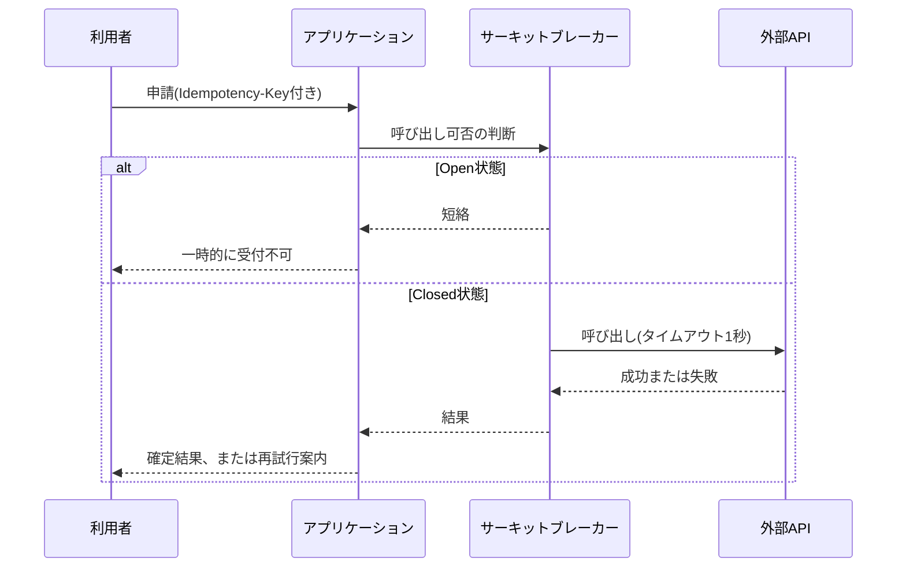

**採用理由**：再送耐性（冪等性）とカスケード抑止（サーキットブレーカー）を同時に満たせる。

**不採用案**：無制限リトライによる愚直な再試行。

**残存リスク**：サーキットが開いている間、該当機能は業務停止する。代替チャネルが必要かどうかは、事業継続計画（第8章）側で判断する。

障害分離の設計例として、次の対応がある。

| 障害の種類 | 分離の設計 |
|------------|------------|
| 部分障害（特定シャードの遅延） | シャード単位で接続プールを分離し、影響を局所化する |
| カスケード障害の予兆（外部API遅延） | サーキットブレーカーとバルクヘッドを併用し、遅延の伝播を止める |
| データ不整合 | 補償トランザクションまたは手動修復手順をあらかじめRunbook化しておく |

## 9. 代替案

| 方式 | 採用しうる条件 | 採用しにくい条件 |
|------|----------------|--------------------|
| 同期リトライ中心 | 依存先が短時間だけ不安定になる傾向がある | 依存先の障害が長時間に及ぶことが多い |
| キュー＋非同期後処理 | 即時確定が業務上不要 | 利用者が結果を即座に確認する必要がある |
| 手動受付停止 | 誤処理による損害が極めて大きい | 受付停止自体が業務に大きな影響を与える |
| 自動フェイルオーバー | 切替試験が十分に積まれ、監視体制が成熟している | 切替訓練の実績がなく、誤切替リスクを許容できない |

## 10. トレードオフ

| 対立 | 一方を優先すると | 他方に起きること |
|------|------------------|------------------|
| 可用性の継続 vs 安全性 | 処理を止めずに動かし続ける | 誤確定や二重処理のリスクが増える |
| 自動切替 vs 誤切替リスク | MTTRが短縮される | 誤検知による不要な切替が起こりうる |
| 強整合 vs 応答性能 | データの正しさを常に保証する | 分散環境では応答が遅くなりやすい |
| 障害分離の強化 vs 資源効率 | 影響範囲を細かく限定できる | プール分割によって資源利用効率が下がる |
| 縮退機能の充実 vs 開発コスト | 障害時の業務継続性が上がる | 縮退ロジック自体の実装・試験コストが増える |

## 11. 検証方法

- タイムアウト試験（意図的に応答を遅延させ、設定どおりに打ち切られるかを確認する）
- リトライ回数と間隔の試験
- 冪等鍵の再送試験（同一キーでの複数回リクエストが1回分の結果になるか）
- 依存障害注入とサーキットブレーカーの動作確認
- 部分障害時の外形監視・業務監視の検知確認
- カスケード障害を模した障害注入試験（依存先遅延によるスレッド枯渇の再現）
- 復旧後の整合性監査
- 手動切替・自動切替それぞれの切替訓練

## 12. よくある失敗

1. リトライだけを実装し、タイムアウトを設定していない
2. 非冪等な処理を、確認なしに自動で再実行してしまう
3. 全面死活監視だけを見て、部分障害を見逃す
4. 障害分離をせず、共有の接続プールですべての外部依存をまとめてしまう
5. 自動切替を、切替訓練を一度も行わないまま本番運用に投入する
6. 縮退時に利用者へメッセージを出さず、再入力や再送信を誘発してしまう
7. データ整合性の要求水準を業務ごとに分けず、すべて「整合性を保つ」で済ませる
8. カスケード障害の可能性を想定せず、単一の依存先障害試験しか行わない

## 13. レビュー観点

- [ ] タイムアウトとリトライ上限が、依存先ごとに具体的に設定されているか
- [ ] 冪等性が必要な操作に、キーまたは同等の一意性制御があるか
- [ ] サーキットブレーカーなど、カスケード障害への対策があるか
- [ ] 縮退時（Graceful Degradation）の業務ルールと利用者向け表示が定義されているか
- [ ] 障害分離とバルクヘッドの設計が、重要度の異なる依存先ごとに検討されているか
- [ ] データ整合性の要求水準（強整合か結果整合か）が業務ごとに明示されているか
- [ ] 切替の自動・手動の区分と、その判断基準が明示されているか
- [ ] 障害注入試験が計画され、実施実績があるか

## 14. 章末問題

### 問題1

決済確定APIに、間隔なしで10回リトライする実装がある。問題点を3つ挙げよ。

### 問題2

検索機能だけが外部API依存で遅い。Graceful Degradationの要件例を、測定可能な形で一文書け。

### 問題3

自動フェイルオーバーと手動フェイルオーバーの選び方を、MTTRと誤切替の観点で説明せよ。

### 問題4

部分障害とカスケード障害の違いを説明し、それぞれに有効な対策を1つずつ挙げよ。

## 15. 解答と解説

### 問題1

第一に、相手先の負荷をさらに増幅させ、カスケード障害を誘発しうる。

第二に、当該操作が非冪等であれば、多重確定（二重課金など）を引き起こす可能性がある。

第三に、タイムアウトやサーキットブレーカーが無いと、自システム側の資源（スレッド、接続）も枯渇しうる。

### 問題2

例：「外部検索APIの失敗率が1分間の観測窓で50%を超えたとき、10秒以内に検索欄を非表示にし、申請・承認の主要操作は応答時間目標を維持したまま継続すること。縮退状態は監視で重大度2として検知すること」

### 問題3

MTTRを分単位や秒単位に短縮したい場合は、自動フェイルオーバーを検討する。

ただし、誤切替による業務損害が大きい、またはデータの状態同期が弱い場合は、手動を基本とし、自動化する範囲を読み取り系など影響が限定的な部分に絞る。

### 問題4

部分障害は、システムの一部機能または一部利用者だけが影響を受ける障害であり、全体死活監視では見逃されやすい。

対策としては、機能単位・利用者セグメント単位の合成監視を導入する。

カスケード障害は、一部の失敗が連鎖して無関係な部分まで巻き込む障害であり、依存先の遅延が資源枯渇を通じて全体に波及する。

対策としては、サーキットブレーカーとバルクヘッドを併用し、影響の伝播を遮断する。

## 16. 実務演習

実務シナリオ（申請提出、承認確定、外部検索API連携、夜間バッチ）について、次を表にまとめよ。

1. 各処理のタイムアウト値とリトライ方針
2. 冪等性の確保方式（対象操作ごと）
3. 縮退時の業務ルールと利用者向け表示
4. 監視での検知重大度（部分障害・カスケード障害それぞれ）
5. 復旧処理における自動と手動の切り分け、および判断基準

---

## 次章予告

第7章ではバックアップとリストアを扱う。

取得成功ではなく復元成功を要件の中心に置き、RPOとの関係、リストア手順の検証方法を扱う。


---


<!-- SOURCE: 07_backup_restore.md -->

# 第7章 バックアップとリストア

## 1. 学習目標

本章を終えると、次ができる。

- バックアップ対象を業務データ、ファイル、設定、秘密情報、監査ログに分解して要件化できる
- フル、差分、増分、スナップショット、レプリケーションの違いと復元時の挙動を説明できる
- 保持世代、保管期間、保管場所、暗号化、オフライン保管、イミュータブルバックアップを要件に組み込める
- RPOと保管期間を混同せず、それぞれ別の要件として書ける
- 「取得成功」と「復元成功」を区別し、復旧テストを要件の中心に据えられる
- バックアップウィンドウと整合性の観点から、取得方式の制約を説明できる

## 2. 基本概念

### 2.1 バックアップ対象を分解する

**バックアップ対象**を「システム一式」とだけ書くと、設計者は何を、どの粒度で、どの頻度で取得すればよいか判断できない。

少なくとも次の観点で対象を分解する。

| 対象カテゴリ | 具体例 | 検討事項 |
|--------------|--------|----------|
| データベース | 業務データ、権限マスタ、シーケンス値 | 一貫性のある取得点、トランザクションログの扱い |
| オブジェクトストレージ | 添付ファイル、帳票PDF、画像 | バージョニングの要否、削除マーカーの扱い |
| 設定情報 | アプリ設定、インフラ構成、IaCコード | Gitリポジトリでの管理と、リポジトリ自体の保全 |
| 秘密情報 | 接続文字列、APIキー、証明書秘密鍵 | 秘密情報管理サービスのバックアップ方式（値そのものをバックアップに混在させない） |
| 監査ログ・アプリログ | 操作ログ、認証ログ、エラーログ | 保管期間が業務データと異なることが多い |
| 仮想マシン・コンテナイメージ | OSイメージ、コンテナレジストリ内容 | イメージから再構築できるなら対象外にできる場合がある |

**一般論**として、バックアップ対象の議論は「データベースを取ればよい」という結論に収束しがちである。

しかし、DBだけ復元できても、接続に必要な秘密情報や、アプリが参照するオブジェクトストレージ上のファイルが揃わなければ、業務は再開できない。

**推奨事項**：対象一覧は、復元後に業務が動く最小構成を基準に洗い出す。

秘密鍵や暗号鍵を、保護対象データと同じバックアップに平文で混在させてはならない。

鍵管理の方式（第9章）と整合させ、鍵の保管場所とバックアップの保管場所を分離する。

### 2.2 フル、差分、増分の違いと復元時の挙動

| 方式 | 取得内容 | 取得時間・容量 | 復元時の挙動 |
|------|----------|----------------|--------------|
| **フルバックアップ** | 対象全体 | 長い、大きい | 単体で復元可能 |
| **差分バックアップ** | 直前のフル以降に変更されたデータ全て | フルより短いが、時間経過とともに増大 | フル1つ＋最新差分1つで復元 |
| **増分バックアップ** | 直前のバックアップ（フルまたは増分）以降の変更 | 最も短い | フル1つ＋それ以降の全増分を順番に適用 |

**例示**：日次フル（日曜）＋日次増分（月〜土）の構成では、金曜のデータを復元するには、日曜のフルに加えて月〜金の5世代の増分を順に適用する必要がある。

このとき、増分のいずれか1世代が破損すると、それ以降の世代がすべて復元不能になる。

**推奨事項**：増分チェーンを長くしすぎない。定期的にフルを取り直し、チェーンの長さと復元所要時間のバランスを取る。

差分は増分よりチェーンが短く、復元は単純だが、日を追うごとに差分自体のサイズが増えるトレードオフがある。

### 2.3 スナップショットとレプリケーション

**スナップショット**は、ストレージやDBエンジンの機能を使い、ある時点の状態を高速に記録する方式である。

取得は速いが、多くの実装では元データと同一のストレージ基盤上に保持される。

**必須事項**：スナップショットのみを唯一のバックアップ手段にしない。基盤障害やアカウント侵害で、元データとスナップショットが同時に失われる経路がある。

**レプリケーション**は、データ更新をほぼリアルタイムに複製先へ反映する方式である。

高可用性やRPO短縮には有効だが、バックアップの代替にはならない。

理由は、誤った更新や削除、ランサムウェアによる暗号化も、そのまま複製先へ反映されてしまうためである。


レプリケーションは「止まらないため」の手段であり、「戻すため」の手段はバックアップである。

両者は目的が異なるため、片方だけで両方の要求を満たそうとしない。

### 2.4 保持世代と保管期間

**保持世代**は、何世代分のバックアップを残すかという数の概念である。

**保管期間**は、最も古いバックアップから最新まで、何日間または何年間さかのぼれるかという時間の概念である。

日次バックアップを35世代保持する場合、保管期間はおよそ35日である。

月次バックアップを13世代保持する場合、保管期間はおよそ13か月である。

**例示**：日次35世代＋月次13世代＋年次7世代という多段構成にすると、直近は日単位、中期は月単位、長期は年単位で粒度を落としながら保管期間を延ばせる。

監査要件で「7年間の記録保持」が求められる場合、これはバックアップではなくアーカイブの要件として別に扱うことが多い。

理由は、バックアップは「業務復旧のための直近データ」を主目的とし、アーカイブは「参照・監査のための長期データ」を主目的とするため、要求される可用性や検索性が異なるからである。

### 2.5 RPOと保管期間を混同しない

**RPO**（Recovery Point Objective）は、障害発生時に許容できる最大のデータ損失時間幅である。

**保管期間**は、過去どこまでさかのぼって取り出せるかという期間である。

この2つは軸が異なるため、片方が短くても、もう片方が長いとは限らない。

**例示**：RPO 15分を満たすために準同期レプリケーションを使っていても、そのレプリカは常に最新状態を反映するだけであり、35日前の状態を保持する仕組みではない。

逆に、35日分のバックアップを保持していても、直近の障害でRPO 15分を満たすには、バックアップとは別に高頻度の取得または複製が必要になる。

**必須事項**：RPO要件（第8章で扱うDR用の指標）と、バックアップの保管期間要件は、別の要件IDとして管理する。

同一の要件文に両方を混在させると、「RPO 15分のバックアップを7年保管する」のような、実現方式が矛盾した記述が生まれる。

### 2.6 保管場所、オフライン保管、暗号化、イミュータブルバックアップ

**保管場所**は、本番データと同一の障害領域に置くべきではない。

同一リージョン、同一データセンター、同一アカウントにしか保管しないと、その領域全体の障害や侵害で、本番とバックアップを同時に失う。

**推奨事項**：少なくとも1つのバックアップコピーを、本番とは別のリージョン、別のアカウント、別の管理権限領域に置く。

**オフライン保管**は、ネットワークから常時接続されていない状態でバックアップを保持することである。

攻撃者が本番環境の管理権限を奪取しても、オフライン媒体には到達できないため、改ざんや削除への耐性が高まる。

**暗号化**は、保管中（at rest）と転送中（in transit）の両方に適用する。

バックアップの暗号鍵は、バックアップ本体とは別の場所で管理し、鍵の紛失・漏洩シナリオを個別に検討する。

**イミュータブルバックアップ**は、設定した保持期間中、管理者権限を持つ者であっても削除・上書き・短縮ができない設定で保管するバックアップである。

ランサムウェア攻撃では、攻撃者が管理者権限を奪取した後、バックアップを先に削除してから本番データを暗号化する手口が確認されている。

イミュータブル設定は、この手口への直接的な対策になる。

**必須事項**：個人情報や重要業務データのバックアップは、少なくとも1世代以上をイミュータブルまたはオフラインで保持する。

### 2.7 リストアと整合性

**リストア**（復元）は、バックアップから元の状態、または利用可能な状態にデータを戻す行為である。

リストアの成功条件は、ファイルやレコードが物理的に戻ることだけではない。

アプリケーションが起動し、認証が通り、代表的な業務操作が実行できることまでを含める。

**整合性**は、複数のデータソースを組み合わせて復元する際、時点を揃え、参照関係を壊さないことである。

**例示**：DBと、DBが参照するオブジェクトストレージ上のファイルを別々のタイミングでバックアップしている場合、DBだけ古い時点に戻すと、DB上のレコードが参照するファイルIDが、まだ存在しないファイルを指す状態になりうる。

**推奨事項**：関連の強いデータソース間では、取得時点の整合を取るか、復元後に不整合を検出する仕組みを用意する。

### 2.8 復旧テスト（復元試験）

**復旧テスト**は、実際にバックアップから復元し、復元にかかった時間と結果を記録する試験である。

バックアップの価値は、取得できることではなく、復元できることで決まる。

**推奨事項**：復旧テストは、本番環境ではなく隔離された環境で実施し、本番への影響を避ける。

復旧テストで確認すべき項目の例は次のとおりである。

- データが指定した時点まで復元されているか
- アプリケーションが起動するか
- 認証が正常に機能するか
- 代表的な参照・更新操作が実行できるか
- 復元所要時間が目標値以内か
- 復元手順書どおりに実施でき、手順の齟齬が無いか

### 2.9 バックアップウィンドウ

**バックアップウィンドウ**は、バックアップ取得のために確保してよい時間帯である。

オンライン処理への性能影響を考慮し、業務影響が小さい時間帯に設定することが多い。

**例示**：夜間バッチと同じ時間帯にバックアップを実行すると、I/O競合でバッチが遅延することがある。

**推奨事項**：バックアップウィンドウは、夜間バッチ、月次締め処理、他システム連携のスケジュールと重ならないよう調整し、重なる場合は優先順位と許容遅延を事前に決める。

継続的なレプリケーションやスナップショット方式では、専用のウィンドウが不要になる場合もあるが、その場合も本番への性能影響を測定し、上限を要件化する。

### 2.10 取得成功と復元成功を区別する理由

バックアップジョブの実行ログに「成功」と表示されることは、復元可能であることを保証しない。

取得は成功しているのに復元できない典型的な原因は次のとおりである。

1. バックアップファイルが空、または一部だけしか書き込まれていない
2. 暗号化鍵が紛失または期限切れで、復号できない
3. 復元手順書が構成変更に追従しておらず、古い手順のまま
4. 復元先の容量やリソースが不足している
5. アプリケーションの起動確認まで検証しておらず、データは戻ってもアプリが動かない
6. 必要な時点の世代が、保持期間の設定ミスで既に削除されている
7. 差分・増分チェーンの一部が破損し、途中から復元できない

これらは、取得ジョブの監視だけでは検出できない。

**必須事項**：重要システムのバックアップ要件には、定期的な復元成功の検証（2.8の復旧テスト）を必ず含める。

「バックアップを取得すること」だけを要件にすると、復元できないバックアップが本番稼働の何年も後に発覚するリスクが残る。

## 3. 業務上の意味

バックアップは保険に似ているが、保険証券を持っているだけで家が建て直せないのと同様に、バックアップを取得しているだけでは業務は再開できない。

火災保険が実際に機能するのは、消火活動と再建手順が別途機能するときだけである。

バックアップも同様に、復元手順と復旧テストという「本体」が伴って初めて機能する。

バックアップが救うのは、災害だけではない。

誤削除、アプリケーションの不具合による論理破壊、運用ミスによる誤更新、そしてランサムウェアなどの攻撃からの回復手段になる。

第8章で扱うDRの複製（レプリケーション）だけでは、誤った更新や暗号化された状態もそのまま複製先へ伝播するため、これらの事象には対応できない。

したがって、バックアップとDRは補完関係にあり、どちらか一方で他方を代替できない。

業務側への説明では、「バックアップを取っています」ではなく、「何を、いつの時点まで、何時間以内に復元でき、それを毎月確認している」という形で伝える。

## 4. ヒアリング質問

- 戻したい最悪のシナリオは何か（誤削除、アプリ不具合、破損、サイバー攻撃、災害）
- どの時点のデータを、何時間以内に戻す必要があるか
- 何日前、何年前まで戻せる必要があるか。契約や法令による保存期間の定めはあるか
- バックアップ取得中の性能低下は、どの時間帯にどこまで許容できるか
- 復元訓練の実施頻度と、成功記録の保管先はどこか
- 個人情報を含むバックアップの保管地域とアクセス権限者は誰か
- ランサムウェアによる本番とバックアップの同時被害を、どこまで想定するか
- 秘密情報や暗号鍵のバックアップと復旧手順は誰が管理しているか

## 5. 要件例

### 要件例 NFR-BKP-001 業務データの日次バックアップと復元試験

- 要件ID：NFR-BKP-001
- 分類：バックアップ・リストア
- 対象：本番DBの業務データおよび権限設定テーブル
- 業務上の目的：運用ミスやアプリ不具合による論理障害から、業務データを回復できるようにする
- 前提条件：個人情報を含む。バックアップの保管領域は本番と分離したアカウント。暗号鍵は別管理サービスで管理
- 指標：取得成功率、復元成功率、復元所要時間、保持世代数
- 目標値：日次バックアップの取得成功率100%（自動リトライ込みで24時間以内に成功）。月1回の復元試験成功率100%。重要テーブルの復元をRTO 2時間以内で業務利用可能な状態まで完了。日次35世代、月次13世代を保持
- 測定条件：本番相当のデータ量を用いた隔離環境での復元試験。月末の高負荷時間帯を含む取得試験
- 測定方法：バックアップジョブの実行ログ、復元試験記録、アプリケーション起動確認チェックリストの突合
- 合否判定：月次で取得失敗の未回復件数が0件であること。復元試験の不合格が0件であること
- 例外条件：クラウド基盤側の障害で当日取得ができない場合は、障害復旧後24時間以内にフル取得を実施し、インシデント記録に理由を残す
- 実現方式：自動日次バックアップ、週次フル＋日次増分、保管中暗号化、別アカウントへのレプリカ保管、イミュータブル設定30日、復元Runbook整備
- 検証方法：月次リストア試験、年1回の大規模復元訓練（本番相当データ量）
- 根拠：ヒアリングで確認された誤削除からの回復需要、および社内監査基準による月次確認の要求。RPOはNFR-DR-001の15分と役割を分離し、本要件は世代保管による復旧を担う
- 関連要件：NFR-DR-001（RPO/RTO）、NFR-SEC-010（暗号化・鍵管理）、NFR-OPS-002（定型作業の自動化）
- 未確定事項：監査ログ7年保管要求とのアーカイブ役割分担が未確定

### 要件例 NFR-BKP-002 ランサムウェア対策としてのイミュータブル世代保管

- 要件ID：NFR-BKP-002
- 分類：バックアップ・リストア（改ざん耐性）
- 対象：本番DBおよび重要オブジェクトストレージのバックアップ
- 業務上の目的：管理者権限を奪取された場合でも、一定世代のバックアップから業務データを復旧できるようにする
- 前提条件：NFR-BKP-001の取得基盤を利用。イミュータブル設定はストレージ側の機能を用いる
- 指標：イミュータブル保持世代数、イミュータブル設定の適用率、隔離復旧試験の成功率
- 目標値：直近14世代以上をイミュータブル設定（削除・短縮不可）で保管。対象バックアップの100%に適用。年1回、本番と切り離した環境での隔離復旧試験に成功する
- 測定条件：本番の管理者権限では設定変更・削除ができないことを、実際の操作試験で確認する
- 測定方法：ストレージ側の設定監査ログ、削除試行試験の記録、隔離復旧試験の実施記録
- 合否判定：管理者権限での削除試行がすべて拒否されること。隔離復旧試験が目標復旧時間内に成功すること
- 例外条件：法的な削除義務（個人情報の削除請求等）が生じた場合は、別途承認プロセスを経た例外削除手順を用いる。通常運用からは除外する
- 実現方式：イミュータブルストレージ機能、バックアップ管理アカウントの権限分離、削除操作への追加承認
- 検証方法：削除試行試験（拒否されることの確認）、年次隔離復旧訓練
- 根拠：ランサムウェア攻撃で管理者権限を奪取後にバックアップを先に削除する手口が報告されているための対策
- 関連要件：NFR-BKP-001、NFR-DR-002（ランサムウェアシナリオ）、NFR-SEC-004（特権ID管理）
- 未確定事項：14世代保持に伴う追加ストレージコストの予算確保

### 要件例 NFR-BKP-003 秘密情報・鍵管理バックアップの分離

- 要件ID：NFR-BKP-003
- 分類：バックアップ・リストア（秘密情報）
- 対象：接続文字列、APIキー、証明書秘密鍵、暗号鍵
- 業務上の目的：秘密情報の消失によって復元作業自体が停止することを防ぐ
- 前提条件：秘密情報は秘密情報管理サービスで一元管理し、コードリポジトリへの直書きを禁止する
- 指標：秘密情報バックアップの取得成功率、鍵の複数拠点保管率、鍵紛失訓練の実施結果
- 目標値：秘密情報管理サービスのバックアップ取得成功率100%。暗号鍵は地理的に離れた2拠点以上で保管。年1回の鍵紛失訓練で代替手順による復旧に成功する
- 測定条件：秘密情報管理サービス側の障害を想定した訓練環境
- 測定方法：バックアップ取得ログ、鍵保管拠点の設定確認、訓練記録
- 合否判定：訓練において、主拠点の鍵にアクセスできない状態から、代替拠点の鍵で復号に成功すること
- 例外条件：一時的な開発環境用の秘密情報は対象外とし、本番相当環境のみを対象とする
- 実現方式：秘密情報管理サービスの複製機能、鍵管理サービスのマルチリージョン保管、鍵ローテーション手順との整合
- 検証方法：鍵紛失訓練、秘密情報管理サービスの設定監査
- 根拠：過去に他案件で、単一拠点の鍵喪失により復元作業自体が数日停止した事例への対策
- 関連要件：NFR-BKP-001、NFR-SEC-010、NFR-SEC-011（鍵管理）
- 未確定事項：鍵管理サービスの複数拠点対応にかかる追加費用の承認

## 6. 悪い要件例

次は要件として不合格である。

1. 「重要なデータは適切にバックアップすること」
2. 「バックアップを取得すること」
3. 「RPO 15分のバックアップを7年間保管すること」
4. 「クラウドの標準バックアップ機能を使うこと」
5. 「復元できるようにしておくこと」

不合格理由は共通している。

対象、方式、頻度、保持期間、保管場所、復元条件、測定方法、合否判定のいずれかが欠けている。

例3は、RPO（障害時に許容するデータ損失時間幅）と保管期間（さかのぼれる期間）という異なる軸の概念を混同しており、実現方式が矛盾する可能性が高い。

例4は、「標準機能」が具体的に何を、どの設定で行うかが不明であり、復元試験の有無にも触れていない。

## 7. 改善後の要件例

### 悪い例1・2の改善：「適切にバックアップすること」「バックアップを取得すること」

NFR-BKP-001（5節）が改善例である。

対象、方式、保持世代、復元試験の頻度と合否基準を数値で固定した点が改善の要点である。

### 悪い例3の改善：「RPO 15分のバックアップを7年間保管すること」

RPO 15分は、連続レプリケーションまたは高頻度スナップショットを用いるDR/継続性の要件（第8章NFR-DR-001）として分離する。

7年間の保管が必要な場合は、業務復旧用のバックアップとは別に、アーカイブ要件として新しい要件ID（例：NFR-ARC-001）を立てる。

アーカイブは検索性や参照頻度の要件がバックアップと異なるため、同一要件に混在させない。

### 悪い例4の改善：「クラウドの標準バックアップ機能を使うこと」

- 要件ID：NFR-BKP-010
- 分類：バックアップ・リストア
- 対象：本番オブジェクトストレージ上の添付ファイル
- 業務上の目的：誤削除された添付ファイルを、業務影響が出る前に復旧できるようにする
- 前提条件：クラウドのバージョニング機能とライフサイクル管理機能を利用する
- 指標：バージョニング有効化率、誤削除からの復旧所要時間
- 目標値：対象バケットのバージョニング有効化率100%。誤削除発生から30分以内に旧バージョンへ復旧できること
- 測定条件：誤削除を模擬した復旧試験
- 測定方法：設定監査、復旧試験の実施記録
- 合否判定：復旧試験で目標時間内に旧バージョンが復元できること
- 例外条件：一時ファイル用バケットは対象外とする
- 実現方式：オブジェクトストレージのバージョニング機能、削除マーカーの保持期間設定、ライフサイクルポリシーによる自動アーカイブ
- 検証方法：誤削除復旧試験の四半期実施
- 根拠：過去に添付ファイルの誤削除で問い合わせ対応が滞った事例への対策
- 関連要件：NFR-BKP-001
- 未確定事項：バージョニング保持期間の上限設定

「標準機能を使う」ではなく、機能の設定内容と復旧目標を明示した点が改善の要点である。

### 悪い例5の改善：「復元できるようにしておくこと」

NFR-BKP-001の復元試験項目（月次実施、成功率100%、RTO 2時間以内）へ接続する。

「できるようにしておく」という状態表現を、頻度・合否基準・所要時間という測定可能な形に変換した。

## 8. 設計への落とし込み

バックアップ設計書に落とし込む項目の例は次のとおりである。

| 項目 | 内容 |
|------|------|
| 対象一覧 | データベース、ファイル、設定、秘密情報、ログの別 |
| 取得方式 | フル、差分、増分、スナップショット、レプリケーションの組み合わせ |
| 保持世代・保管期間 | 日次・月次・年次の世代数と対応期間 |
| 保管場所 | 本番と異なるアカウント・リージョン |
| 暗号化・鍵管理 | 保管中・転送中の暗号化方式、鍵の保管場所 |
| イミュータブル設定 | 対象世代数、削除不可期間 |
| 復元手順 | Runbook、承認者、実行者、所要時間目標 |
| 復旧テスト計画 | 頻度、環境、合否基準、記録方法 |

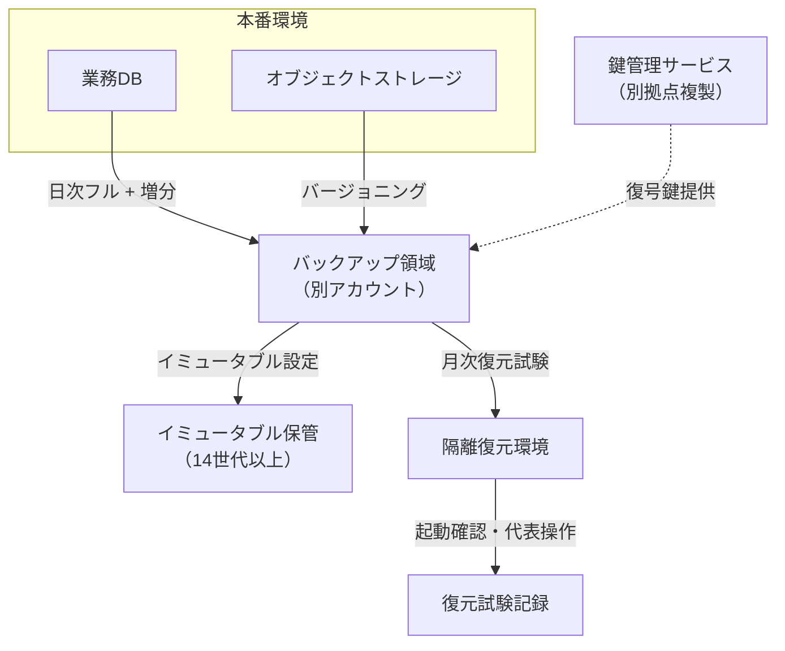

**採用**：週次フル＋日次増分バックアップに、別アカウントへのレプリカとイミュータブル設定14世代を組み合わせる方式。

**不採用**：スナップショットのみを同一アカウント内に保持する方式。

**理由**：復元試験を毎月実施することで復元可能性を継続的に検証でき、イミュータブル設定によりランサムウェア被害時にも一定世代を保護できる。

**残存リスク**：バックアップ取得から復元試験までの間（最大1か月）に生じた復元不能な破損は、次回試験まで発見が遅れる可能性がある。取得直後の整合性チェック（チェックサム検証等）で緩和する。

## 9. 代替案

| 方式 | 向く条件 | 向かない条件 |
|------|----------|--------------|
| バックアップ中心（世代保管） | RPOが数時間〜1日程度で許容できる、コストを抑えたい | 秒〜分単位のRPOが必要 |
| 複製（レプリケーション）中心 | RPOを短くしたい、高可用性も同時に満たしたい | 論理破壊・ランサムウェア対策も必要（単独では不足） |
| 両者併用 | RPOとランサムウェア耐性の両方が必要（多くの本番システムで推奨） | コストや運用負荷の許容度が極めて低い |
| オフライン媒体への追加保管 | 規制要件、極めて高い改ざん耐性が必要 | 復元にかかる時間の増加が許容できない |

**推奨事項**：個人情報や決済データを扱う本番システムでは、複製とバックアップの併用を基本形とする。

## 10. トレードオフ

| 対立 | 一方を優先すると | 他方に起きること |
|------|------------------|------------------|
| 短いRPO vs コスト | 高頻度取得・準同期複製を導入 | ストレージ費用、転送費用、性能影響が増える |
| 長期保管 vs 費用・機密管理 | 保管期間を延ばす | 保管コストが増え、漏洩対象範囲も広がる |
| オンライン取得 vs 性能影響 | 取得頻度を上げる | バックアップウィンドウの設計と業務影響調整が必要になる |
| イミュータブル設定 vs 運用柔軟性 | 削除不可の期間を長くする | 誤設定や不要データの削除も遅れ、ストレージ費用が増える |
| 復元試験の頻度 vs 運用負荷 | 試験を頻繁に行う | 試験環境の維持コストと工数が増える |

**一般論**として、「RPOを短くすればバックアップの重要性が下がる」と誤解されることがあるが、両者は目的が異なるため、この判断は誤りである。

## 11. 検証方法

- 取得ジョブの成否監視（自動アラート）
- 別環境へのリストア試験
- アプリケーション起動と代表業務操作の確認
- 暗号鍵紛失訓練（鍵管理手順の実効性確認）
- 保持世代・保管期間の棚卸し
- バックアップウィンドウ中の性能影響測定
- イミュータブル設定に対する削除試行試験（拒否されることの確認）
- チェックサムまたはハッシュ値によるバックアップファイルの整合性検証

## 12. よくある失敗

1. 取得成功のログだけを見て、復元成功とみなしてしまう
2. RPOとバックアップ保管期間を同一要件に混在させ、矛盾した記述になる
3. 本番と同じ管理者権限でバックアップも即座に削除できる状態のままにする
4. 復元に必要な容量や所要時間を事前に見積もらず、災害時に初めて不足に気付く
5. 設定情報や秘密情報のバックアップ方針が定義されず、DB以外が復元できない
6. 「年1回実施予定」の復元訓練が、実際には何年も実施されない
7. 差分・増分チェーンの途中破損を想定せず、復元不能リスクを見落とす
8. スナップショットのみに依存し、基盤障害やランサムウェアへの耐性を検討しない

## 13. レビュー観点

- [ ] バックアップ対象一覧が、DB以外（ファイル、設定、秘密情報、ログ）を含んでいるか
- [ ] 取得方式（フル・差分・増分・スナップショット・レプリケーション）が明記されているか
- [ ] 保持世代、保管期間、保管場所、暗号化が要件化されているか
- [ ] RPO要件と保管期間要件が別のIDで管理されているか
- [ ] 復元成功の定期試験が要件に含まれているか
- [ ] イミュータブルまたはオフライン保管がランサムウェア対策として含まれているか
- [ ] バックアップウィンドウと業務影響が調整されているか
- [ ] 個人情報を含むバックアップのアクセス制御が明記されているか

## 14. 章末問題

### 問題1

RPO 15分、バックアップ保管期間35日のシステムで、「40日前の状態に戻したい」という要求が発生した。
このバックアップ要件で対応できるか。理由も述べよ。

### 問題2

「レプリケーションを組んでいるからバックアップは不要」という主張の欠点を2つ挙げよ。

### 問題3

復元試験の合否判定に含めるべき確認項目を4つ挙げよ。

### 問題4

イミュータブルバックアップが対策になる攻撃シナリオを説明し、通常のバックアップだけでは不十分な理由を述べよ。

## 15. 解答と解説

### 問題1

対応できない。

保管期間が35日であるため、40日前のデータは既に保持範囲外である。

RPOは「障害発生時点からどれだけ遡って良いか」を示す直近の指標であり、長期の保管期間を意味するものではない。

長期保存が必要であれば、バックアップとは別にアーカイブ要件として保管期間を定義する必要がある。

### 問題2

1. 誤削除やアプリケーションの不具合による論理的なデータ破損が、複製先にもそのまま反映される
2. ランサムウェアによる暗号化などの攻撃を受けた場合、本番と複製の両方が同時に影響を受ける可能性がある

### 問題3

例：データが指定時点まで復元されていること、アプリケーションが正常に起動すること、認証が成功すること、代表的な参照・更新操作が実行できること、復元所要時間が目標値以内であること、実施記録が残っていること。

### 問題4

ランサムウェア攻撃では、攻撃者が管理者権限を奪取した後、まずバックアップを削除し、その後で本番データを暗号化する手口がある。

通常のバックアップは、その管理者権限を持つ者（正当な管理者であれ攻撃者であれ）が削除できる設定になっていることが多く、この手口に対して無力である。

イミュータブルバックアップは、設定した保持期間中、管理者権限であっても削除・変更ができないため、この手口への直接的な対策になる。

## 16. 実務演習

実務シナリオ（従業員5,000人のWeb業務システム、個人情報を含む）を題材に、次を作成せよ。

1. バックアップ対象一覧（DB、ファイル、設定、秘密情報、ログを含む6件以上）
2. 各対象の取得方式（フル・差分・増分・スナップショット・レプリケーションのいずれか）と選定理由
3. 保持世代・保管期間の設計（日次・月次・年次を含む多段構成）
4. 月次復元試験の手順骨子（対象、確認項目、合格基準）
5. ランサムウェア対策として、イミュータブルまたはオフライン保管をどこに適用するかの方針

提出の体裁は次でよい。

- 対象一覧表
- 方式選定表（対象、方式、理由）
- 保管設計表（世代、期間、場所、暗号化）
- 復元試験手順書（骨子）
- ランサムウェア対策方針（1ページ程度）

---

## 次章予告

第8章では災害対策と事業継続を扱う。
BCPとDRの関係、RTO・RPO・MTPDの区別、コールド・ウォーム・ホットスタンバイの選定、DR訓練、通信断や認証基盤停止まで含めた対策を接続する。


---


<!-- SOURCE: 08_dr_bcp.md -->

# 第8章 災害対策と事業継続

## 1. 学習目標

本章を終えると、次ができる。

- BCPとDRの関係、および両者の責任範囲の違いを説明できる
- RTO、RPO、MTPDを混同せずに使い分け、それぞれの目標値を独立に設定できる
- 業務影響分析から、災害シナリオごとの復旧目標を導出できる
- コールド、ウォーム、ホットスタンバイの違いをコストと復旧時間の両面から比較できる
- バックアップサイト、マルチリージョン、DNS切り替え、データ同期を組み合わせた設計を検討できる
- 切り替え判断、切り戻し、DR訓練を運用可能な手順として要件化できる
- 通信断や認証基盤の停止といった、アプリケーション以外の障害要因を対策に含められる

## 2. 基本概念

### 2.1 BCPとDR

**BCP**（Business Continuity Plan、事業継続計画）は、災害や重大インシデントが発生しても事業を継続するための、組織全体の計画である。

人員の安否確認、代替オフィスや在宅勤務体制、取引先への連絡、資金繰り、広報対応など、ITに限らない要素を含む。

**DR**（Disaster Recovery、災害復旧）は、BCPのうち、ITシステムの復旧に焦点を当てた計画と仕組みである。

DRはBCPの一部であり、DRだけを完成させても事業継続は保証されない。

**例示**：ITシステムが1時間で復旧しても、従業員が出社できず、取引先への連絡手段も断たれていれば、業務そのものは再開できない。

**一般論**として、IT部門は自部門の管掌範囲であるDRの整備に注力しがちであり、BCP全体との接続を見落としやすい。

**推奨事項**：DR要件を定義する際は、BCP全体の中でITがどの業務プロセスを支えているかを、業務影響分析（2.3節）で確認してから着手する。

### 2.2 RTO、RPO、MTPDを区別する

この3つの用語は、いずれも「時間」を扱うため混同されやすいが、意味する対象が異なる。

| 用語 | 正式名称 | 意味 | 軸 |
|------|----------|------|-----|
| **RTO** | Recovery Time Objective | 災害発生後、業務を再開するまでの目標時間 | いつまでに戻すか |
| **RPO** | Recovery Point Objective | 許容できる最大のデータ損失時間幅 | どこまで戻すか（時点） |
| **MTPD** | Maximum Tolerable Period of Disruption | 業務が存続不能になるまでの最大許容停止時間 | これを超えると事業継続が危ぶまれる境界 |

**必須事項**：RTOはMTPDより短く設定する。

RTOがMTPDを超える計画は、「業務再開が間に合う前に、事業継続そのものが危うくなる」ことを意味し、計画として成立しない。

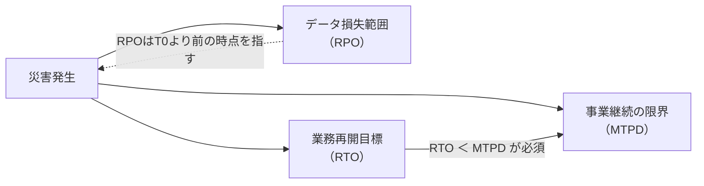

**例示**：RTO 24時間、RPO 15分、MTPD 72時間という設定は、次のように読む。

「災害発生から24時間以内に業務を再開する（RTO）。再開時点のデータは、災害直前から最大15分前の状態まで戻っている可能性がある（RPO）。仮に72時間業務が止まると、事業継続そのものが危ぶまれる（MTPD）」。

RTOとRPOを入れ替えて使う誤りが実務では頻発する。

**推奨事項**：要件文には必ず正式名称と定義文を併記し、略語だけに頼らない。

### 2.3 業務影響分析と災害シナリオ

**業務影響分析**（Business Impact Analysis、BIA）は、業務ごとに、停止した場合の影響の大きさと、時間経過による影響の増大を分析する活動である。

BIAを行わずにRTO・RPOを決めると、根拠のない数値が独り歩きする。

シナリオを1種類に限定すると、過大または過小なDR投資につながる。

少なくとも次のシナリオを検討する。

1. 単一AZ（アベイラビリティゾーン）障害
2. リージョン全体の障害
3. ランサムウェアなどによる論理的破壊（データ暗号化・改ざん）
4. IdP（認証基盤）の停止
5. 広域ネットワーク断（社内からクラウドへの経路断絶を含む）
6. 主要な外部API・外部サービスの長期停止

シナリオごとに、対象業務、RTO、RPO、代替手段が異なりうる。

**例示**：単一AZ障害はマルチAZ構成で自動的に吸収できることが多いが、リージョン障害は別リージョンへの切り替えが必要であり、復旧に要する時間の桁が変わる。

ランサムウェアのシナリオでは、通常のレプリケーションによる複製先も被害を受ける可能性があるため、第7章のイミュータブルバックアップと組み合わせた別の復旧手順が必要になる。

**推奨事項**：シナリオごとにRTO・RPOの一覧表を作成し、単一の数値だけで議論しない。

### 2.4 コールド、ウォーム、ホットスタンバイ

| 方式 | 概要 | RTOの目安感 | コスト感 |
|------|------|-------------|----------|
| **コールドスタンバイ** | バックアップからの再構築を前提とする。平常時は環境を起動しない | 長い（半日〜数日） | 低い |
| **ウォームスタンバイ** | 縮小構成の待機環境を常時起動しておき、必要時に拡張する | 中程度（数時間） | 中程度 |
| **ホットスタンバイ** | 本番同等の構成を常時稼働させ、即座に切り替えられる状態を保つ | 短い（分単位〜1時間未満のことも） | 高い |

上記のRTO目安とコスト感は例示であり、実際の値は実測とDR訓練の結果に基づいて決める。

**一般論**として、「DRサイトがあれば安心」という発言は、方式を明示していないため、コストとRTOのどちらを優先しているかが分からない。

**推奨事項**：BIAで求めた業務ごとのRTOに対して、コールド・ウォーム・ホットのどれが必要十分かを、コストと合わせて比較検討する。

すべての業務にホットスタンバイを適用することは、多くの場合、費用対効果に見合わない。

### 2.5 バックアップサイト、マルチリージョン、DNS切り替え、データ同期

**バックアップサイト**は、災害発生時に業務を引き継ぐ復旧先の環境である。

**マルチリージョン**は、地理的に離れた複数のリージョンに環境を分散させる構成であり、広域災害への耐性を高める代表的な手段である。

**DNS切り替え**は、利用者のアクセス先を、プライマリ環境からバックアップサイトへ誘導する手段の一つである。

**必須事項**：DNS切り替えだけでは業務は再開しない。

次の要素をセットで検討する必要がある。

- DNSのTTL（切り替えが利用者に反映されるまでの時間）
- クライアント側・中間キャッシュの影響
- アプリケーションの接続先設定（ハードコードされた接続文字列がないか）
- 証明書の有効性（バックアップサイト用の証明書が準備されているか）
- IdPのリダイレクト先設定
- データそのものがバックアップサイトに到達しているか

**データ同期**は、プライマリとバックアップサイト間でデータを反映する方式であり、同期、準同期、非同期の3種類に大別される。

| 同期方式 | 概要 | RPOへの影響 | 性能への影響 |
|----------|------|--------------|--------------|
| 同期 | 両サイトへの書き込み完了を待ってから応答する | RPO ≈ 0 | 距離に応じた遅延が常時発生 |
| 準同期 | 一定条件（例：一方の書き込み確認）で応答する | 数秒〜数十秒程度の損失可能性 | 同期よりは軽いが遅延あり |
| 非同期 | プライマリの書き込み後、非同期に反映する | 遅延分がそのままRPOの損失可能性になる | プライマリの性能への影響は最小 |

**推奨事項**：地理的に離れたリージョン間では、通信遅延の物理的制約上、同期方式の採用が性能に大きく影響することが多い。RPO要件と性能要件を突き合わせて選定する。

### 2.6 切り替え判断と切り戻し

**切り替え判断**は、誰が、どの情報を根拠に、どの権限でDRサイトへの切り替えを決定するかというプロセスである。

**必須事項**：切り替えの自動起動は、誤検知による誤切替（本来不要な切り替えを実行してしまうこと）のリスクを伴うため、少なくとも重大な切り替えは人による最終判断を経る設計を基本とする。

切り替え判断に必要な要素は次のとおりである。

- 障害の検知情報（監視アラート、外部からの報告）
- 障害の切り分け結果（プライマリ側の復旧見込み時間）
- 決裁者と、夜間・休日の代行者
- 判断のタイムリミット（判断に時間をかけすぎるとRTOを圧迫する）

**切り戻し**は、プライマリ側が復旧した後、DRサイトからプライマリへ業務を戻す手順である。

切り戻しは切り替えよりも軽視されがちだが、次の理由で慎重な設計が必要である。

- DRサイト側で発生したデータ更新分を、プライマリ側へ反映する必要がある（データ差分の統合）
- 切り戻し中に再度障害が起きた場合の対応（切り戻しの中断・再試行手順）
- 利用者への影響（切り戻し中の一時的な参照専用化など）

**推奨事項**：切り戻し手順は、切り替え手順と同じ水準で文書化し、訓練の対象に含める。

### 2.7 DR訓練

**DR訓練**は、DR計画が実際に機能するかを検証する活動であり、少なくとも次の段階がある。

| 訓練の種類 | 内容 | 実施頻度の目安 |
|------------|------|------------------|
| 机上訓練 | 手順書を関係者で読み合わせ、判断分岐を確認する | 四半期に1回程度 |
| 部分切替訓練 | 一部の業務またはコンポーネントのみを実際に切り替える | 半期に1回程度 |
| 総合切替訓練 | 対象業務全体を実際にDRサイトへ切り替え、業務が動くことを確認する | 年1回程度 |

訓練頻度は例示であり、業務の重要度とMTPDに応じて調整する。

**必須事項**：訓練しないDR計画は、文書上のDRである。

過去に一度も実際の切り替えを試していない手順は、記載漏れ、権限不足、証明書の期限切れなど、実行時に初めて判明する不備を含んでいる可能性が高い。

**推奨事項**：訓練の合否基準（RTO内に業務が再開できたか、RPO内のデータ損失に収まったか）を事前に定義し、訓練結果を記録として残す。

### 2.8 通信断や認証基盤停止を含めた対策

アプリケーションとデータベースを多重化しても、次の要素が単一障害点になっていると、業務は止まる。

- 社内ネットワークからクラウドへの通信経路の断絶
- IdP（認証基盤）の停止によるログイン不能
- DNSサービス自体の障害
- 証明書の失効と、更新対応の失敗
- 監視システムや遠隔運用回線の喪失（障害に気付けない、対応できない）

**例示**：認証基盤が単一のIdPに依存している場合、そのIdPが停止すると、バックアップサイトへ切り替えても誰もログインできない状態になる。

対策の例は次のとおりである。

- ネットワーク経路の代替手段（複数回線、迂回経路）の用意
- IdPの冗長化、または緊急時に限定した代替認証手段（厳格な監査ログを伴うブレイクグラス手順）
- 重要な参照系機能について、読み取り専用の退避手段を用意する
- 電話連絡網など、IT基盤に依存しない代替連絡手段の整備

**必須事項**：DR要件には、アプリケーション・データベースの障害シナリオだけでなく、通信断と認証基盤停止のシナリオを最低限含める。

## 3. 業務上の意味

災害対策の最終目標は、サーバやデータベースを復旧させることそのものではない。

給与計算、申請承認、顧客対応など、実際に守るべき業務プロセスを、許容できる時間内に再開することである。

経営層への説明では、RTOやRPOという技術的な数字だけを提示するのではなく、それらを達成できなかった場合の事業影響（機会損失、契約違反、信用低下など）と対にして示す。

**例示**：「RTO 24時間」という数字だけでは判断できないが、「リージョン障害時、24時間の業務停止により、想定される取引影響額は月商の約3%相当」という形にすると、投資判断の材料になる。

BCP全体の中でのDRの位置づけを共有し、IT部門だけで完結させないことが、実効性のある計画につながる。

## 4. ヒアリング質問

- 72時間業務が止まった場合、どの業務が事業継続上「アウト」と判断されるか（MTPDの把握）
- リージョン障害とサイバー攻撃（ランサムウェア）で、優先して復旧すべき業務は同じか、異なるか
- データ損失が15分の場合と1時間の場合で、業務にどのような違いが生じるか
- DR切り替えの決裁者は誰か。夜間・休日は誰が代行するか
- DR訓練は年何回実施しており、机上訓練と実切替のどちらまで行っているか
- IdPや社内ネットワークが停止した場合の代替手段は用意されているか
- 切り戻しの際、DRサイトで発生したデータ更新をどう扱うか、方針は決まっているか
- 監査や規制上、DR体制について求められる報告義務はあるか

## 5. 要件例

### 要件例 NFR-DR-001 リージョン障害時の業務継続

- 要件ID：NFR-DR-001
- 分類：災害対策（DR）
- 対象：重要オンライン業務（申請、承認、参照）および関連する権限設定
- 業務上の目的：リージョン障害後も、許容時間内に業務を再開できるようにする
- 前提条件：単一リージョン障害を対象とする。ランサムウェアによる論理破壊は別シナリオ（NFR-DR-002）として扱う
- 指標：RTO、RPO、障害検知から切替判断までの所要時間、DR訓練の成功率
- 目標値：RTO 24時間以内、RPO 15分以内。障害認定から切替判断までを1時間以内に完了する。年2回のDR訓練で、少なくとも1回はRTO内での復旧を実証する
- 測定条件：DR訓練または実際の災害発生時。データの整合性検証と代表業務の動作確認を、業務再開の判定条件に含める
- 測定方法：訓練実施記録、データ同期遅延の監視ログ、切替判断のタイムスタンプ記録
- 合否判定：訓練においてRTO・RPOの両方の目標を達成すること。未達の場合は是正計画を策定し、次回訓練で再検証する
- 例外条件：IdPが同時に利用不能となった場合は、緊急認証手順によるRTOを別途適用し、通常のRTO評価対象からは除外する
- 実現方式：別リージョンでのウォームスタンバイ、非同期または準同期のデータレプリケーション、DNS切り替え、切替・切り戻しRunbookの整備
- 検証方法：年2回のDR訓練（うち1回は部分切替、1回は机上または総合切替）、四半期ごとの同期遅延レビュー
- 根拠：業務影響分析でMTPD 72時間と判定。日中の短時間停止とは別に、広域災害時は24時間以内の再開を経営層が受容する仮置きとして設定
- 関連要件：NFR-AVL-001（平常時の可用性）、NFR-BKP-001（バックアップ）、NFR-OPS-040（運用体制）
- 未確定事項：ホットスタンバイ化に必要な追加予算の決裁状況

### 要件例 NFR-DR-002 ランサムウェアによる論理破壊シナリオへの対策

- 要件ID：NFR-DR-002
- 分類：災害対策（サイバー攻撃シナリオ）
- 対象：本番DBおよび重要オブジェクトストレージ
- 業務上の目的：ランサムウェアなどによりデータが暗号化・改ざんされた場合でも、影響を受けていない世代から業務を復旧できるようにする
- 前提条件：通常のレプリケーション先も被害を受ける可能性があると仮定する。第7章のイミュータブルバックアップ（NFR-BKP-002）を前提とする
- 指標：隔離復旧成功率、影響範囲特定に要する時間、復旧までのRTO
- 目標値：隔離環境での復旧試験を年1回実施し成功率100%を維持する。攻撃検知から影響範囲（感染していない直近世代の特定）の特定までを24時間以内に完了する。隔離復旧によるRTOを72時間以内とする
- 測定条件：本番環境から切り離した隔離環境での復旧訓練
- 測定方法：訓練記録、影響範囲特定にかかった時間の計測、復旧完了までの所要時間記録
- 合否判定：訓練において、感染していない世代からの復旧に成功し、目標RTO内に完了すること
- 例外条件：攻撃の規模が全社的なインフラ障害を伴う場合は、BCP全体の対応（IT以外の対応含む）と合わせて評価する
- 実現方式：イミュータブルバックアップからの隔離復旧手順、フォレンジック調査との連携手順、通常のDRサイトとは独立した復旧環境
- 検証方法：年1回の隔離復旧訓練、四半期のイミュータブル設定監査
- 根拠：通常のDR複製だけではランサムウェアの影響が複製先にも及ぶため、独立したシナリオとして扱う必要があると判断
- 関連要件：NFR-DR-001、NFR-BKP-002、NFR-SEC-013（インシデント対応）
- 未確定事項：隔離復旧環境の常設か、都度構築かの方式決定

### 要件例 NFR-DR-003 認証基盤・通信断への対策

- 要件ID：NFR-DR-003
- 分類：災害対策（アプリ以外の単一障害点）
- 対象：本番システムへのログイン機能および社内からクラウドへの通信経路
- 業務上の目的：IdP停止や通信断が発生しても、重要業務の参照または継続的な状況把握ができるようにする
- 前提条件：通常時は単一のIdPおよび単一の主回線を使用している
- 指標：IdP停止時の緊急認証手順の発動時間、通信断時の代替経路切替時間
- 目標値：IdP停止を検知してから緊急認証手順（ブレイクグラス）を発動するまで30分以内。主回線断絶時、代替回線への切替を15分以内に完了する
- 測定条件：IdPおよび主回線の障害を模擬した訓練
- 測定方法：訓練実施記録、緊急認証手順の発動ログ、回線切替の実施記録
- 合否判定：訓練において目標時間内に緊急手順が発動され、かつ発動後24時間以内に監査レビューが完了すること
- 例外条件：緊急認証手順の利用は、事前登録されたブレイクグラスアカウントに限定する。それ以外の代替認証は認めない
- 実現方式：ブレイクグラスアカウントの事前登録と厳格な監査、代替回線の契約、電話連絡網などIT基盤に依存しない連絡手段の整備
- 検証方法：年1回のIdP停止・通信断複合訓練
- 根拠：DR訓練で、アプリ・DBの復旧に成功してもIdP停止により誰もログインできなかった過去事例への対策
- 関連要件：NFR-DR-001、NFR-SEC-002（認証・認可）、NFR-OPS-001（障害対応）
- 未確定事項：代替回線の常時契約か、緊急時契約かのコスト比較

## 6. 悪い要件例

次は要件として不合格である。

1. 「災害時も業務が止まらないこと」
2. 「DRサイトを持つこと」
3. 「RTO/RPOを適切に設定すること」
4. 「クラウドの高可用性機能を使えば十分」
5. 「バックアップサイトへ自動的に切り替わること」

不合格理由は共通している。

対象業務、シナリオ、目標時間、判断プロセス、訓練計画のいずれかが欠けている。

例5は、自動切り替えのリスク（誤検知による誤切替）を検討せずに「自動」を前提としてしまっている点で、設計判断を要件に先取りしてしまっている。

## 7. 改善後の要件例

### 悪い例1の改善：「災害時も業務が止まらないこと」

NFR-DR-001（5節）が改善例である。

シナリオ、RTO、RPO、切替判断時間、訓練頻度を分けて数値化した。

### 悪い例2の改善：「DRサイトを持つこと」

DRサイトの有無だけでは、コールド・ウォーム・ホットのどれかが不明であり、RTOも定まらない。

NFR-DR-001のように、対象業務ごとのRTO・RPOを先に決め、それを満たす方式（本章2.4節の比較表）を設計側で選定する順序に直す。

### 悪い例3の改善：「RTO/RPOを適切に設定すること」

「適切に」は測定不能である。

業務影響分析の結果に基づき、NFR-DR-001のように具体的な時間数値と根拠を明示する。

### 悪い例4の改善：「クラウドの高可用性機能を使えば十分」

クラウドの高可用性機能（マルチAZなど）は、主に単一AZ障害への対策であり、リージョン全体の障害やランサムウェアには別の対策が必要である。

NFR-DR-001とNFR-DR-002のように、シナリオを分けて要件化する。

### 悪い例5の改善：「バックアップサイトへ自動的に切り替わること」

- 要件ID：NFR-DR-010
- 分類：災害対策（切替判断）
- 対象：重要オンライン業務のDR切替プロセス
- 業務上の目的：誤検知による不要な切り替えを防ぎつつ、必要な切り替えを迅速に判断できるようにする
- 前提条件：切替判断には人による最終確認を必須とする。監視アラートは判断材料として自動集約する
- 指標：切替判断に要する時間、誤切替の発生件数
- 目標値：障害認定から切替判断までを1時間以内。誤切替の発生件数を年0件とする
- 測定条件：DR訓練および実際の障害対応記録
- 測定方法：切替判断のタイムスタンプ記録、判断根拠となった監視データの保存
- 合否判定：目標時間内に判断が完了し、誤切替が発生していないこと
- 例外条件：夜間・休日は代行決裁者が判断する。代行者不在時のエスカレーション経路を別途定める
- 実現方式：監視アラートの自動集約ダッシュボード、決裁者への自動通知、判断基準を明文化したRunbook
- 検証方法：DR訓練での判断プロセスのレビュー
- 根拠：完全自動切替は誤検知時の業務影響が大きいため、人による最終判断を残す方針とした
- 関連要件：NFR-DR-001
- 未確定事項：夜間・休日の代行決裁者の指名

「自動的に切り替わること」を、判断プロセスと時間目標に分解し、自動化する範囲（情報集約）と人が判断する範囲（最終決定）を明確にした。

## 8. 設計への落とし込み

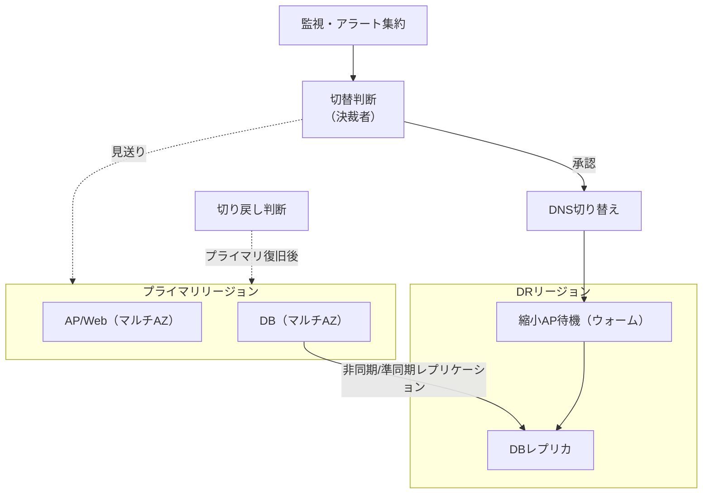

**採用**：別リージョンでのウォームスタンバイ構成に、非同期または準同期のデータレプリケーションを組み合わせる方式。

**不採用**：初期段階からのホットスタンバイによる常時マルチリージョン稼働。

**理由**：平常時の可用性は単一リージョン内のマルチAZ構成で十分に満たせる想定であり、広域災害時のみRTO 24時間で復旧する方が、常時稼働のコスト増分と比較して費用対効果が高いと判断した。

**残存リスク**：切替判断の遅延、データ同期の追従遅延、IdPなど外部依存先への依存が残る。これらはNFR-DR-002、NFR-DR-003で個別に手当てする。

## 9. 代替案

| 方式 | 向く条件 | 向かない条件 |
|------|----------|--------------|
| バックアップからのコールド復旧のみ | RTOが数日単位でも許容できる、コストを最小化したい | 数時間以内の業務再開が求められる |
| ウォームDR（本章の採用例） | RTOが数時間〜1日程度で、コストとのバランスを取りたい | 秒〜分単位のRTOが求められる |
| ホットなマルチリージョン常時稼働 | 極めて短いRTOが必須、コスト許容度が高い | コスト制約が厳しい、運用の複雑性を抑えたい |
| 重要参照機能のみ先行復旧 | 全機能停止よりも、参照だけでも継続する価値が高い業務 | 参照だけでは業務が成立しない場合 |

## 10. トレードオフ

| 対立 | 一方を優先すると | 他方に起きること |
|------|------------------|------------------|
| 短いRTO vs コスト | ホットスタンバイを採用する | 常時稼働分の費用が増大する |
| 短いRPO vs 性能・複雑性 | 同期レプリケーションを採用する | 距離に応じた遅延が常時発生し、障害の伝播経路も増える |
| 自動切替 vs 誤切替リスク | 判断を自動化する | 誤検知時に不要な切り替えを実行するリスクが増す |
| 訓練の現実性 vs 業務影響 | 実際の切替まで訓練する | 訓練中の業務影響や工数負担が増える |
| DR整備範囲 vs BCP全体との整合 | IT側のDRだけを厚くする | 人員・拠点・連絡網などBCP全体の不備が見過ごされる |

## 11. 検証方法

- 机上訓練（手順の読み合わせと判断分岐の確認）
- データ同期遅延の定常的な監視と記録
- DR環境への部分切替訓練
- 年次の総合切替訓練
- 切り戻し訓練
- IdP停止・通信断を想定した訓練（机上または実技）
- 訓練後のRunbook更新と是正記録の確認

## 12. よくある失敗

1. RTOとRPOを取り違えて記述する
2. システムの技術的復旧のみをもって「RTO達成」とみなし、業務が実際に動くかを確認しない
3. DR計画を策定したまま、一度も訓練を実施しない
4. 通信断や認証基盤の停止をシナリオから除外する
5. ランサムウェアなどの論理破壊に対して、通常のレプリケーションだけで備えたつもりになる
6. 切替の決裁者が夜間・休日に不在で、判断が翌営業日まで持ち越される
7. 切り戻し手順を用意せず、DRサイトへの切替後の運用が固定化してしまう
8. DRをBCP全体から切り離し、IT部門だけで完結させてしまう

## 13. レビュー観点

- [ ] BCPとDRの関係、および責任範囲が明記されているか
- [ ] シナリオ別（AZ障害、リージョン障害、ランサムウェア、IdP停止、通信断）に目標が設定されているか
- [ ] RTO、RPO、MTPDが混同されず、それぞれ独立に定義されているか
- [ ] RTO ＜ MTPD が満たされているか
- [ ] 切替・切り戻しの判断権限と手順が明文化されているか
- [ ] DR訓練の計画と合格基準が明示されているか
- [ ] 通信断、IdP停止を含む、アプリ以外の単一障害点が対策に含まれているか
- [ ] 経営層に事業影響として説明できる材料（金額換算等）があるか

## 14. 章末問題

### 問題1

MTPD 48時間、RTO 72時間という設定は妥当か。理由を述べよ。

### 問題2

RPO 15分の要件に対して、非同期レプリケーションの遅延実績が平均2分、最悪値40分だった場合、この要件に適合しているといえるか。

### 問題3

ランサムウェア対策として、ホットスタンバイのDR環境だけでは不十分な理由を述べよ。

### 問題4

DR訓練を「机上訓練のみ」で3年間続けているプロジェクトがある。この状態のリスクを指摘せよ。

## 15. 解答と解説

### 問題1

妥当ではない。

RTOがMTPDを超えているため、業務再開が完了する前に、事業継続そのものが危ぶまれる期間に突入してしまう。

RTOは常にMTPDより短く設定する必要がある。

### 問題2

適合しているとはいえない。

最悪値40分はRPO 15分の目標を超えており、平均値だけで判断すると実態を見誤る。

RPOの評価は平均ではなく、最悪値または一定パーセンタイル（例：99パーセンタイル）で管理すべきである。

### 問題3

ランサムウェアによる暗号化や改ざんは、通常のレプリケーション機構を通じてDR環境側にもそのまま反映される可能性が高い。

ホットスタンバイは可用性（止まらないこと）には有効だが、論理破壊への耐性を持たないため、イミュータブルまたはオフラインの世代バックアップと、本番から隔離された復旧手順が別途必要になる。

### 問題4

机上訓練だけでは、実際の切替時に発生する権限不足、証明書の期限切れ、DNS設定の誤り、手順書の記載漏れなどが検出されない。

3年間実切替を行っていない場合、DR計画が実際に機能するかどうかは未検証のままであり、実際の災害時に初めて不備が判明するリスクが高い。

## 16. 実務演習

実務シナリオ（従業員5,000人のWeb業務システム）を題材に、次のシナリオ表を作成せよ。

対象シナリオは、単一AZ障害、リージョン障害、ランサムウェア、IdP停止の4つとする。

各シナリオについて、次の列を持つ表を作成する。

- 対象業務
- RTO
- RPO
- 採用方式（コールド・ウォーム・ホットのいずれか、または個別対策）
- DR訓練の頻度と種類（机上・部分切替・総合切替）
- 切替の決裁者

作成後、各シナリオのRTOがMTPD（仮に72時間とする）を超えていないかを確認し、超えている場合は是正案を1つ添えよ。

---

## 次章予告

第9章ではセキュリティ設計を扱う。
「十分なセキュリティ」という表現を、認証、認可、暗号化、監査、脆弱性管理という測定可能な要件へ分解する。


---


<!-- SOURCE: 09_security.md -->

# 第9章 セキュリティ設計

## 1. 学習目標

本章を終えると、次ができる。

- 機密性、完全性、可用性の3要素でセキュリティ要件を分解できる
- 認証、認可、最小権限、職務分離、MFA、特権ID管理を、それぞれ独立した要件として書ける
- ネットワーク分離、暗号化、鍵管理、秘密情報管理を設計に落とし込める
- ログ監査、脆弱性管理、パッチ管理、マルウェア対策、インシデント対応を測定可能な要件にできる
- ゼロトラストの考え方を、状態要件（何を満たすか）として説明できる
- 法令・規制・社内規程を要件の根拠として参照し、検証方法まで設計できる
- 「十分なセキュリティを確保すること」を、複数の測定可能なNFRに分解できる

## 2. 基本概念

### 2.1 機密性、完全性、可用性

情報セキュリティの基本となる3つの属性である。

| 属性 | 定義 | 侵害された場合の例 |
|------|------|--------------------|
| **機密性**（Confidentiality） | 許可された者だけが情報にアクセスできる状態 | 個人情報の漏洩、権限外の閲覧 |
| **完全性**（Integrity） | 情報が正確であり、不正に改ざんされていない状態 | 取引金額の改ざん、ログの消去 |
| **可用性**（Availability） | 必要なときに情報やシステムを利用できる状態 | DDoS攻撃による停止、ランサムウェアによる暗号化 |

可用性は第3章・第6章とも重なるが、セキュリティ設計では「攻撃や不正操作による利用不能」という切り口を追加する。

**一般論**として、セキュリティ対策は機密性（漏洩対策）ばかりが注目されがちだが、完全性（改ざん対策）と可用性（攻撃耐性）も同じ重みで扱う必要がある。

### 2.2 認証と認可を分離して考える

**認証**（Authentication）は、利用者が「誰であるか」を確認する仕組みである。

**認可**（Authorization）は、認証された利用者が「何をしてよいか」を制御する仕組みである。

**必須事項**：認証成功は認可成功を意味しない。この2つを同じ機構で済ませず、それぞれ独立して検証する。

**例示**：社内IdPでログインできた（認証成功）としても、特定の個人情報画面を閲覧してよいかは、別途権限マスタで判定する必要がある。

認証だけを強化し、認可の設計（誰が何をできるか）を後回しにすると、ログインさえできれば何でも見えるシステムになりかねない。

### 2.3 最小権限と職務分離

**最小権限の原則**は、利用者や処理主体（サービスアカウント等）に対して、業務遂行に必要な最小限の権限だけを付与する考え方である。

**職務分離**は、不正や誤操作を防ぐため、一連の業務の中で相反する役割（申請と承認、変更と監査など）を同一人物に兼務させない考え方である。

| 兼務させるべきでない役割の組み合わせ | 理由 |
|--------------------------------------|------|
| 申請者と承認者 | 自己承認による不正な決裁を防ぐ |
| 本番変更の実施者と、その変更の承認者 | 未承認変更の混入を防ぐ |
| システム管理者と、そのログを監査する者 | 不正操作の痕跡隠蔽を防ぐ |

**悪い例**：「管理者はすべての操作ができる」という設計は、日常業務に不要な権限まで集中させ、侵害時の被害範囲を最大化する。

**推奨事項**：管理者権限も、日常運用（監視、定型作業）と非常時対応（緊急変更）で権限を分け、常時付与する範囲を最小化する。

### 2.4 多要素認証（MFA）と特権ID管理

**多要素認証（MFA）**は、パスワードなどの知識要素に加え、所持要素（トークン、スマートフォン）や生体要素を組み合わせて認証強度を上げる仕組みである。

**推奨事項**：一般利用者にはリスクベースでMFAを適用し、特権操作を行うアカウントには例外なくMFAを必須化する。

**特権ID管理**は、管理者権限を持つアカウントのライフサイクル（発行、利用、変更、無効化）と、利用時の統制を扱う領域である。

特権ID管理で決めるべき事項は次のとおりである。

- 特権IDの発行申請と承認プロセス
- 利用期間の限定（常時付与ではなく、必要時のみ有効化する仕組み）
- パスワードや鍵のローテーション
- 利用時の操作ログの記録と保管
- 緊急時の例外アカウント（ブレイクグラス）の統制

**必須事項**：緊急時の例外アカウントは、事前登録された専用アカウントに限定し、利用後は定められた期限内に監査レビューを行う。

### 2.5 ネットワーク分離

**ネットワーク分離**は、システムを構成する各層（公開層、アプリケーション層、データベース層、管理層）の間で通信を制御し、侵害の影響範囲を限定する設計である。

| 層 | 役割 | アクセス制御の例 |
|----|------|-------------------|
| 公開層 | 外部からのアクセスを受け付ける | WAF、DDoS対策、TLS終端 |
| アプリケーション層 | 業務ロジックを実行する | 公開層からのみ許可、DB層への出口制限 |
| データベース層 | データを保持する | アプリケーション層からのみ許可、直接の外部公開を禁止 |
| 管理層 | 運用・保守のためのアクセス | 踏み台経由、VPN経由、MFA必須 |

**悪い例**：DBを公開ネットワークに直接配置し、アプリケーション側の認証だけで守ろうとする構成は、アプリケーションの脆弱性が即座にデータベース侵害へ直結する。

**推奨事項**：層ごとに通信を許可リストで制御し、不要な経路を全て遮断する。

### 2.6 暗号化と鍵管理

**暗号化**は、保存中（at rest）と転送中（in transit）の両方に適用する。

要件には、対象データ範囲と適用箇所を明記する。

「暗号化する」とだけ書くと、アルゴリズムの強度、適用範囲（全データか、機微情報のみか）、鍵の管理方法が定まらない。

**鍵管理**は、暗号鍵の生成、保管、利用、ローテーション、廃棄までのライフサイクルを管理する領域である。

鍵管理で決めるべき事項は次のとおりである。

- 鍵の生成方法（専用のキー管理サービスを使うか、自前で生成するか）
- 鍵へのアクセス権限（暗号化対象データへのアクセス権と分離する）
- ローテーション周期
- 鍵の複数拠点保管（第7章のバックアップ要件とも関連する）
- 鍵の廃棄手順（不要になった鍵を確実に削除する）

**必須事項**：暗号鍵をコードリポジトリや設定ファイルに直接書き込まない。

### 2.7 秘密情報管理

**秘密情報**は、データベース接続文字列、APIキー、証明書の秘密鍵など、漏洩すると不正アクセスに直結する情報である。

**悪い例**：秘密情報をソースコードやコンテナイメージに埋め込む。

**推奨事項**：秘密情報は専用の秘密情報管理サービスで一元管理し、アプリケーションは実行時に取得する。

アクセスログを記録し、誰がいつどの秘密情報を取得したかを追跡できるようにする。

### 2.8 ログ監査

**監査ログ**は、誰が、いつ、何を、どのように操作したかを記録するログである。

監査ログの設計で決めるべき事項は次のとおりである。

- 記録対象イベント（ログイン成功・失敗、権限変更、データの参照・更新・削除、管理操作）
- 保管期間（法令や社内規程による定めを確認する）
- 改ざん耐性（ログ自体の書き換えや削除を防ぐ仕組み）
- 閲覧権限（ログに個人情報が含まれる場合、閲覧できる者を制限する）

**悪い例**：ログは取得しているが、閲覧権限が広く、誰でも他人の操作履歴を検索できる状態。

これは、監査ログ自体が新たな機密性侵害の原因になりうる。

**推奨事項**：ログの取得、保管、閲覧のそれぞれについて、独立したアクセス制御を設計する。

### 2.9 脆弱性管理とパッチ管理

**脆弱性管理**は、システムに存在する既知の脆弱性を発見し、リスクに応じて是正する活動である。

**悪い例**：「脆弱性がないこと」という要件は、ゼロデイ脆弱性の存在を否定できない以上、測定不能かつ非現実的である。

**推奨事項**：脆弱性の深刻度別に、是正期限を定義する。

| 深刻度 | 定義の例 | 是正期限の例 |
|--------|----------|----------------|
| Critical（緊急） | 遠隔から認証不要で任意コード実行が可能 | 72時間以内 |
| High（高） | 高い権限昇格や重要データへの不正アクセスが可能 | 2週間以内 |
| Medium（中） | 限定的な条件下でのみ悪用可能 | 定例パッチ窓（月次） |
| Low（低） | 悪用の実現性が低い | 次回計画的メンテナンス時 |

上記の期限は例示であり、社内規程や契約上の要求に合わせて調整する。

**パッチ管理**は、脆弱性是正だけでなく、機能改善や不具合修正のためのパッチ適用全般を扱う。

パッチ管理で決めるべき事項は、適用前の検証範囲、適用失敗時のロールバック手順、適用結果の記録である（詳細は第10章の運用性設計と連携する）。

### 2.10 マルウェア対策

**マルウェア対策**は、サーバ、エンドポイント、ネットワークの各層で、不正なプログラムの侵入・実行・拡散を防ぐ活動である。

対象範囲を明確にする必要がある。

- サーバ（本番・開発・検証環境の別）
- 開発者端末や運用担当者端末
- ファイルアップロード機能を持つアプリケーションでの、アップロードファイルのスキャン

**推奨事項**：利用者がファイルをアップロードする機能がある場合、アップロード時点でのマルウェアスキャンを要件に含める。

### 2.11 インシデント対応

**インシデント対応**は、セキュリティ上の異常を検知してから、封じ込め、根絶、復旧、再発防止までの一連の活動である。

典型的なフェーズは次のとおりである。


**必須事項**：個人情報の漏洩が疑われる場合、法令や社内規程で定められた期限内に、監督機関や本人への通知を検討する体制を整える。

通知の要否や期限の法的判断は法務部門の責任範囲であるが、技術側は影響範囲の特定に必要なログや証跡を保全する責任を持つ。

### 2.12 ゼロトラストの考え方

**ゼロトラスト**は、「社内ネットワークの内側だから安全」という境界防御の前提を置かず、すべてのアクセスを都度検証し、最小権限を徹底し、継続的にリスクを評価する考え方である。

ゼロトラストは特定の製品名ではない。

**悪い例**：「ゼロトラストを導入すること」という要件は、状態を定義していないため、特定製品の購入で終わってしまう可能性がある。

ゼロトラストを要件化する例は次のとおりである。

- 管理アクセスであっても、社内ネットワークからのアクセスかどうかに関わらずMFAと端末状態確認を要求する
- サービス間通信（東西トラフィック）についても、境界内だからと信頼せず、認証と認可を適用する
- 付与する権限の有効期間を短くし、常時フル権限を保持させない

**推奨事項**：ゼロトラストを導入する場合も、認証、認可、ネットワーク制御、継続的評価の各要素に分解し、それぞれを測定可能な要件にする。

### 2.13 法令、規制、社内規程

セキュリティ要件の根拠として、適用される法令名、規制、社内規程の条項を要件文に残す。

**推奨事項**：要件の「根拠」欄には、可能な限り具体的な文書名と条項番号を記載する。

法解釈そのものは法務部門の責任であり、アーキテクトの役割は、法務・規程が求める内容を技術要件へ正確に落とし込み、実装可能性を検証することである。

**一般論**として、「法令を遵守すること」だけを要件にすると、何を満たせば遵守とみなされるかが技術者に伝わらない。

具体的な項目（保管期間、暗号化、アクセス制御、通知義務など）に分解して初めて、設計とテストが可能になる。

### 2.14 セキュリティ要件の検証方法の考え方

セキュリティ要件は、機能要件と異なり「起きないこと」を証明する性質を持つものが多く、検証の設計が難しい。

**推奨事項**：次の3種類の検証を組み合わせる。

1. **能動的検証**：権限マトリクス試験、脆弱性診断、ペネトレーションテストなど、意図的に攻撃・不正操作を試みて防げるかを確認する
2. **設定監査**：暗号化、ネットワーク制御、ログ設定などが、意図した状態になっているかを確認する
3. **継続的モニタリング**：ログ監査、異常検知など、運用中に継続して確認する仕組み

いずれか1種類だけでは不十分である。

設定監査だけでは、設定どおりに動作しているかの実効性までは確認できない。

能動的検証だけでは、日々の設定変更によるドリフト（意図しない状態変化）を見逃す。

## 3. 業務上の意味

本シナリオで扱うシステムは個人情報を扱う。

情報漏洩、不正閲覧、改ざんが発生した場合、損害賠償、行政対応、社会的信用の低下に直結する。

セキュリティ要件は、多くの場合、機能リリースよりも優先されるMust要件になりやすい。

**例示**：新機能のリリースが1週間遅れることと、個人情報漏洩が発生することは、事業への影響の桁が異なる。

セキュリティ投資は「攻撃を受けなければ効果が見えない」という性質上、経営層の理解を得にくいことがある。

**推奨事項**：セキュリティ要件の説明では、対策のコストだけでなく、対策を怠った場合に想定される損害額や規制対応コストを併せて示す。

## 4. ヒアリング質問

- 扱う個人情報の項目は何か。保管地域の制約や、海外委託の有無はあるか
- 必須の認証強度、MFAの適用対象範囲、特権ID管理の基準はどうなっているか
- 監査で必ず確認されるログの種類は何か。保管年数はどの程度か
- 脆弱性の是正期限は、深刻度別にどう定められているか
- インシデント発生時、報告すべき期限と宛先（社内、監督機関、本人）はどこか
- 本番データへの開発者アクセスは許容されるか。許容される場合の統制は何か
- 委託先（外部ベンダー）に対するセキュリティ要件の適用範囲はどこまでか
- 過去にセキュリティインシデントや監査指摘があった場合、その内容と是正状況はどうか

## 5. 要件例

### 要件例 NFR-SEC-001 認証・認可

- 要件ID：NFR-SEC-001
- 分類：セキュリティ（認証・認可）
- 対象：個人情報を扱う全画面およびAPI
- 業務上の目的：権限外の閲覧・更新を防ぎ、操作を追跡可能にする
- 前提条件：社内IdPによる認証を利用する。職務権限マスタが常に最新に維持されている
- 指標：未認証アクセスの成功件数、権限外操作の成功件数、特権操作へのMFA適用率、監査ログの記録率
- 目標値：未認証アクセスの成功件数0件、権限外操作の成功件数0件、特権操作のMFA適用率100%、対象イベントの監査ログ記録率100%
- 測定条件：本番相当の権限マトリクスを用いた試験環境。四半期ごとのログ抜取検査を含む
- 測定方法：自動化されたE2E試験、ログ検索、設定監査
- 合否判定：未認証アクセスが成功しないこと。権限外操作が拒否され、かつ拒否がログに記録されること。特権操作でMFA未実施のまま成功した件数が0件であること
- 例外条件：障害時の緊急アカウント（ブレイクグラス）は、事前登録されたアカウントに限定し、利用後24時間以内に監査レビューを実施する
- 実現方式：IdP連携、ロールベースアクセス制御（RBAC）、TLSによる通信保護、暗号化、監査ログの改ざん耐性のある保管
- 検証方法：権限マトリクス試験、脆弱性診断、設定レビュー、監査ログの定期抜取検査
- 根拠：個人情報保護に関する社内情報セキュリティ規程の認証・認可・監査条項に対応
- 関連要件：NFR-SEC-010（暗号化）、NFR-SEC-012（ログ監査）
- 未確定事項：外部委託者に適用する権限モデルの最終合意

### 要件例 NFR-SEC-010 保存時・転送時の暗号化と鍵管理

- 要件ID：NFR-SEC-010
- 分類：セキュリティ（暗号化・鍵管理）
- 対象：DB上の個人情報項目、バックアップデータ、外部連携時の通信経路
- 業務上の目的：情報が漏洩した場合でも、復号されない限り内容を読み取れない状態にする
- 前提条件：暗号鍵は専用の鍵管理サービスで管理し、暗号化対象データへのアクセス権限と分離する
- 指標：対象データの暗号化適用率、通信経路のTLS適用率、鍵ローテーションの実施状況
- 目標値：保存時暗号化の適用率100%、外部通信のTLS 1.2以上での接続率100%、鍵ローテーションを年1回以上または規程で定める頻度で実施
- 測定条件：本番環境設定の定期監査、サンプルデータでの復号確認試験
- 測定方法：設定監査ツールによる自動チェック、手動によるサンプル確認
- 合否判定：未暗号化の対象データが0件であること。ローテーション未実施の鍵が0件であること
- 例外条件：レガシー連携先が旧TLSバージョンにしか対応していない場合は、代替の補償策（IPアドレス制限等）を講じた上で例外として個別管理する
- 実現方式：透過的暗号化またはアプリケーション層暗号化、鍵管理サービスの利用、TLS終端の統一
- 検証方法：設定レビュー、リストア後の暗号状態確認（第7章の復旧テストと連携）、外部通信のプロトコル監査
- 根拠：社内情報セキュリティ規程における保存時暗号化・通信暗号化の条項
- 関連要件：NFR-SEC-001、NFR-BKP-001、NFR-BKP-003（秘密情報バックアップ）
- 未確定事項：レガシー連携先の対応期限

### 要件例 NFR-SEC-011 脆弱性管理とパッチ適用

- 要件ID：NFR-SEC-011
- 分類：セキュリティ（脆弱性・パッチ管理）
- 対象：本番稼働中のOS、ミドルウェア、アプリケーション依存ライブラリ
- 業務上の目的：既知の脆弱性を放置せず、悪用される前に是正する
- 前提条件：四半期ごとに脆弱性診断を実施する。CVSSスコアまたは同等の指標で深刻度を判定する
- 指標：深刻度別の是正リードタイム、未是正の重大脆弱性の残存件数
- 目標値：Critical（緊急）は検出から72時間以内、High（高）は2週間以内、Medium（中）は月次パッチ窓内に是正する。本番稼働中のCritical未是正件数を常時0件に維持する
- 測定条件：四半期の脆弱性診断結果、および緊急脆弱性情報（ベンダー公表等）に基づく臨時診断
- 測定方法：脆弱性管理台帳と是正記録の突合、診断ツールの再スキャン結果
- 合否判定：期限超過の残存Critical/High脆弱性が0件であること。超過が発生した場合は是正計画と受容承認の記録が残っていること
- 例外条件：業務影響が大きく即時パッチが困難な場合は、代替の緩和策（アクセス制限、WAFルール追加等）を暫定適用し、リスク受容記録を残した上で期限を延長できる
- 実現方式：脆弱性診断ツールの定期実行、パッチ管理台帳、緊急パッチ適用手順（第10章と連携）
- 検証方法：四半期診断、パッチ適用結果の監査、リスク受容記録のレビュー
- 根拠：脆弱性放置による侵害事例の増加と、社内規程における是正期限の定め
- 関連要件：NFR-SEC-001、NFR-OPS-002（パッチ運用）、NFR-SEC-013（インシデント対応）
- 未確定事項：ゼロデイ脆弱性発生時の緊急診断プロセスの最終合意

### 要件例 NFR-SEC-012 監査ログ

- 要件ID：NFR-SEC-012
- 分類：セキュリティ（ログ監査）
- 対象：認証イベント、権限変更、個人情報の参照・更新・削除、管理操作
- 業務上の目的：不正操作や事故発生時に、原因調査と説明責任を果たせるようにする
- 前提条件：ログには個人情報の一部（アクセス対象者ID等）が含まれるため、閲覧権限を限定する
- 指標：対象イベントのログ記録率、ログの改ざん検知能力、閲覧権限の適正性
- 目標値：対象イベントの記録率100%。ログ保管期間は社内規程に基づき1年以上（個人情報関連は3年）。ログへの不正な書き換え・削除の試行を100%検知する
- 測定条件：四半期ごとのログサンプル抜取検査、改ざん試行試験
- 測定方法：ログ管理システムの設定監査、改ざん試行試験の実施記録
- 合否判定：対象イベントの記録漏れが0件であること。改ざん試行が検知され、かつ実際の改ざんが成立しないこと
- 例外条件：性能影響が大きい高頻度イベント（参照系の一部）は、サンプリング記録に代える場合があり、対象は個別に承認する
- 実現方式：改ざん耐性のあるログストレージへの転送、閲覧権限の分離、ログ保管期間のライフサイクル管理
- 検証方法：ログ抜取検査、改ざん試行試験、閲覧権限の棚卸し
- 根拠：社内情報セキュリティ規程の監査ログ条項、個人情報保護関連の保管期間要求
- 関連要件：NFR-SEC-001、NFR-SEC-013
- 未確定事項：高頻度イベントのサンプリング対象範囲の最終決定

### 要件例 NFR-SEC-013 インシデント対応

- 要件ID：NFR-SEC-013
- 分類：セキュリティ（インシデント対応）
- 対象：本番システム全体
- 業務上の目的：セキュリティインシデント発生時に、影響範囲を早期に特定し、被害拡大を防ぐ
- 前提条件：インシデント対応体制（第10章の運用体制と連携）が整備されていること
- 指標：検知から初動対応までの時間、封じ込めまでの時間、報告期限の遵守率
- 目標値：重大インシデントの検知から初動対応着手まで30分以内。封じ込め（アクセス遮断等）まで2時間以内。法令・規程で定める報告期限の遵守率100%
- 測定条件：年1回のインシデント対応訓練、および実インシデント発生時の記録
- 測定方法：インシデント管理チケットの時刻記録、訓練記録
- 合否判定：目標時間内の初動対応が行われること。報告期限の未達が0件であること
- 例外条件：フォレンジック調査のために一時的に証跡保全を優先し、復旧を遅らせる判断は、事前に定めた基準に従って実施する
- 実現方式：インシデント対応手順（Runbook）、証跡保全手順、法務・広報との連携フロー
- 検証方法：年1回のインシデント対応訓練、訓練結果に基づく手順の見直し
- 根拠：個人情報保護法制における漏洩時の報告義務、社内規程のインシデント対応条項
- 関連要件：NFR-SEC-012、NFR-DR-002（ランサムウェアシナリオ）、NFR-OPS-001
- 未確定事項：本人通知の要否判断基準の法務部門との最終合意

## 6. 悪い要件例

次は要件として不合格である。

1. 「十分なセキュリティを確保すること」
2. 「ゼロトラストを導入すること」
3. 「脆弱性がないこと」
4. 「不正アクセスを防ぐこと」
5. 「個人情報を厳重に管理すること」

不合格理由は共通している。

対象、指標、目標値、測定方法、合否判定のいずれかが欠けている。

例3は、ゼロデイ脆弱性の存在を否定できない以上、達成不可能な要求になっている。

例2は、状態ではなく製品導入や方針表明で終わっており、認証・認可・ネットワーク制御・継続評価のどれを、どの水準で満たすかが定義されていない。

## 7. 改善後の要件例

### 悪い例1の改善：「十分なセキュリティを確保すること」

「十分」を、認証・認可（NFR-SEC-001）、暗号化・鍵管理（NFR-SEC-010）、脆弱性・パッチ管理（NFR-SEC-011）、ログ監査（NFR-SEC-012）、インシデント対応（NFR-SEC-013）という、複数の独立した測定可能な要件へ分解する。

「セキュリティ」という単一の言葉を1つの要件にまとめようとすること自体が、曖昧さの原因である。

### 悪い例2の改善：「ゼロトラストを導入すること」

- 要件ID：NFR-SEC-020
- 分類：セキュリティ（ゼロトラスト）
- 対象：管理アクセスおよびサービス間通信（東西トラフィック）
- 業務上の目的：境界内アクセスであることを理由に検証を省略しない状態を実現する
- 前提条件：現状は社内ネットワークからの管理アクセスがIPアドレス制限のみで許可されている
- 指標：管理アクセスにおけるMFA適用率、端末状態確認の適用率、サービス間通信における認証適用率
- 目標値：管理アクセスのMFA適用率100%（社内・社外を問わない）。管理端末の状態確認（OS更新状況等）適用率100%。サービス間通信の認証適用率100%
- 測定条件：本番環境の設定監査、管理アクセスログのサンプル確認
- 測定方法：IdP設定監査、端末管理システムのポリシー適用状況確認、サービスメッシュまたは同等機構の設定確認
- 合否判定：MFA未適用のまま成功した管理アクセスが0件であること。認証なしで成立したサービス間通信が0件であること
- 例外条件：レガシーシステムとの連携で認証機構が未対応の場合は、ネットワークレベルの補償策を講じ、個別に期限付きで承認する
- 実現方式：IdPによるMFA必須化、端末管理システムとの連携、サービスメッシュまたは相互TLSによるサービス間認証
- 検証方法：設定監査、管理アクセスログレビュー、レガシー連携の棚卸し
- 根拠：境界内アクセスを前提とした従来の設計が、内部関係者による不正や、侵入後の水平展開に弱いという分析結果
- 関連要件：NFR-SEC-001、NFR-SEC-004（特権ID管理）
- 未確定事項：レガシー連携の移行期限

「ゼロトラットを導入する」という方針表明を、管理アクセスとサービス間通信という具体的な対象、MFA適用率や認証適用率という測定可能な指標へ分解した。

### 悪い例3の改善：「脆弱性がないこと」

NFR-SEC-011（5節）が改善例である。

「脆弱性ゼロ」という達成不可能な目標を、深刻度別の是正期限と、常時0件を維持する対象を「本番稼働中のCritical」に限定する形に置き換えた。

### 悪い例4・5の改善：「不正アクセスを防ぐこと」「個人情報を厳重に管理すること」

いずれも、NFR-SEC-001（認証・認可）とNFR-SEC-010（暗号化・鍵管理）へ接続する。

「防ぐ」「厳重に」という動詞・副詞を、成功件数0件、適用率100%という測定可能な指標に置き換えた点が共通の改善パターンである。

## 8. 設計への落とし込み

セキュリティ設計書に落とし込む項目の例は次のとおりである。

| 項目 | 内容 |
|------|------|
| ネットワーク構成図 | 公開層、AP層、DB層、管理層の分離と許可通信 |
| 認証・認可方式 | IdP連携方式、RBACの権限マトリクス |
| 暗号化・鍵管理方式 | 対象データ、アルゴリズム、鍵管理サービス |
| 秘密情報管理方式 | 秘密情報管理サービス、アクセスログ |
| ログ設計 | 記録対象イベント、保管期間、閲覧権限 |
| 脆弱性・パッチ運用 | 診断頻度、是正期限、緊急パッチ手順 |
| インシデント対応体制 | 検知、封じ込め、報告フロー、連携部門 |

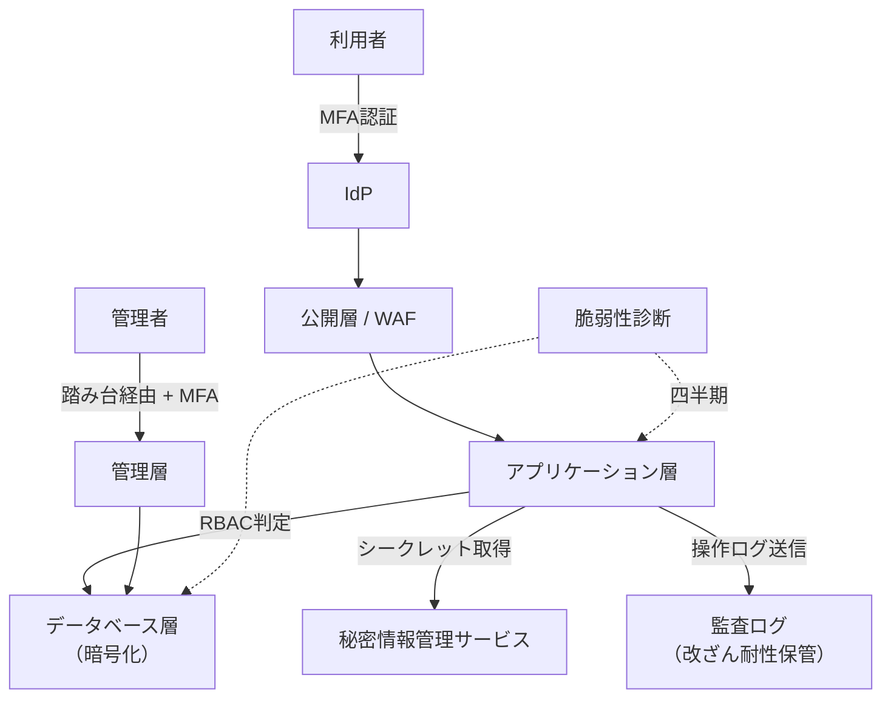

**採用**：公開層はHTTPS終端とWAFを配置し、アプリケーション層・データベース層は私有ネットワークに配置する構成。

**不採用**：データベースを公開ネットワークに配置し、アプリケーション側の認証のみで保護する構成。

**理由**：層ごとの分離により、アプリケーションの脆弱性が直接データベース侵害に至る経路を遮断できる。

**残存リスク**：アプリケーション層自体の脆弱性、設定ドリフト（意図しない設定変更）、新規追加リソースへの診断漏れが残る。定期的な設定監査と脆弱性診断で緩和する。

## 9. 代替案

| 方式 | 向く条件 | 向かない条件 |
|------|----------|--------------|
| 境界防御中心（従来型） | 短期的な構築、社内利用のみに限定されるシステム | 内部関係者による不正や、侵入後の水平展開への耐性が必要な場合 |
| IdP中心の強化＋段階的な東西制御 | 個人情報を扱う本番システムで、段階的にゼロトラスト化したい | 即座に全面的なゼロトラスト移行が求められる場合 |
| 高機密データを別システムへ隔離 | 一部の機微データのみ極めて高い保護レベルが必要 | システム全体が同等に機微な情報を扱う場合 |

## 10. トレードオフ

| 対立 | 一方を優先すると | 他方に起きること |
|------|------------------|------------------|
| セキュリティ強度 vs 利便性 | MFAやアクセス制限を強化する | 操作手順が増え、利用者の負担が増える |
| 詳細なログ vs 個人情報の過剰取得 | ログの記録範囲を広げる | ログ自体が新たな機微情報となり、保護対象が増える |
| 迅速なパッチ適用 vs 回帰リスク | 適用スピードを優先する | 検証不足による新たな不具合混入のリスクが増える |
| 厳格な遮断 vs 障害時の緊急アクセス | 通常時のアクセス制御を厳格にする | 障害対応時の迅速な対応が妨げられ、ブレイクグラス設計が必要になる |
| 監査ログの保管期間延長 vs コスト | 保管期間を延ばす | ストレージコストと管理対象の増大 |

## 11. 検証方法

- 権限マトリクス試験（意図しない権限で操作が成立しないことの確認）
- セッション固定、認可回避などを狙ったセキュリティ試験
- 脆弱性診断、必要に応じたペネトレーションテスト
- 設定監査（ネットワーク公開範囲、暗号化設定、ログ設定）
- パッチ適用の遵守率に関する定期報告
- インシデント対応の机上訓練・実技訓練
- ログ改ざん試行試験

## 12. よくある失敗

1. 「セキュアであること」という表現で要件を終わらせる
2. 認証だけを強化し、認可の設計を後回しにする
3. 暗号鍵をコードや設定ファイルと一緒に保管する
4. 監査ログは取得しているが、閲覧権限が広すぎる
5. 脆弱性診断の結果を残したまま本番リリースする
6. 緊急時の例外アカウントが、緊急対応後も無効化されず永続的に残る
7. ゼロトラストを製品導入だけの取り組みだと誤解する
8. インシデント対応の訓練を一度も実施しない

## 13. レビュー観点

- [ ] 機密性・完全性・可用性の観点で要件が分解されているか
- [ ] 認証と認可が別々の要件として定義されているか
- [ ] 暗号化と鍵管理が対象範囲を明示して定義されているか
- [ ] 監査ログの記録対象、保管期間、閲覧権限が定義されているか
- [ ] 脆弱性の深刻度別の是正期限が定義されているか
- [ ] インシデント対応の初動時間と報告期限が定義されているか
- [ ] ゼロトラストの要素が状態要件（適用率、成功件数等）に分解されているか
- [ ] 法令・規程の参照が要件の根拠として明記されているか
- [ ] 検証方法が能動的検証・設定監査・継続的モニタリングを含んでいるか

## 14. 章末問題

### 問題1

「管理者はすべての操作ができる」という権限設計の問題点を、最小権限の原則と職務分離の観点からそれぞれ指摘せよ。

### 問題2

「ゼロトラストを導入すること」を要件にした場合の欠点を述べ、測定可能な形に直せ。

### 問題3

個人情報を含む監査ログの保管要件で、確認すべき項目を4つ挙げよ。

### 問題4

「脆弱性がないこと」という要件がなぜ不合格なのか説明し、改善案を示せ。

## 15. 解答と解説

### 問題1

最小権限の観点では、日常運用に不要な権限まで常時集中しており、そのアカウントが侵害された場合の被害範囲が最大化される。

職務分離の観点では、変更の実施と承認、操作と監査が同一人物に集中すると、不正や誤操作の検知が働きにくくなる。

### 問題2

欠点は、アーキテクチャ上の考え方（境界を信頼しない）が、特定製品の導入という行為にすり替わってしまい、認証強度、権限の有効期間、ネットワークセグメント、継続的な評価といった状態要件が定義されないまま終わることである。

改善案は、本章7節のNFR-SEC-020のように、管理アクセスのMFA適用率、サービス間通信の認証適用率など、測定可能な指標に分解することである。

### 問題3

例：保管期間、暗号化の有無、アクセス権限の範囲、改ざん防止の仕組み、個人情報のマスキング有無、国外への転送有無。

### 問題4

ゼロデイ脆弱性の存在は事前に否定できないため、「脆弱性がないこと」は原理的に証明不可能であり、達成できたかどうかを判定する基準も存在しない。

改善案は、深刻度別の是正期限（Criticalは72時間以内等）を定義し、「期限内に是正されていない重大脆弱性が0件であること」という、期限内対応の有無を判定基準とする形に置き換えることである。

## 16. 実務演習

実務シナリオ（従業員5,000人のWeb業務システム、個人情報を扱う）を題材に、次を作成せよ。

1. 認証・認可、暗号化、脆弱性管理、ログ監査、インシデント対応の5領域について、それぞれ標準形式の要件を1件ずつ、合計5件作成する
2. 各要件について、能動的検証・設定監査・継続的モニタリングのうちどれを使うかを1行で示す
3. ゼロトラストの考え方を適用する対象を1つ選び、測定可能な要件に分解する
4. 「十分なセキュリティを確保すること」という発言を業務部門から受けたと仮定し、それを分解する過程を3ステップで示す
5. 残った未確定事項を課題一覧の形で3件作る

---

## 次章予告

第10章では運用性設計を扱う。
監視、Runbook、障害対応体制、夜間・休日対応、属人化防止を、測定可能な運用要件に落とし込む。


---


<!-- SOURCE: 10_operability.md -->

# 第10章 運用性設計

## 1. 学習目標

本章を終えると、次ができる。

- 運用時間、運用体制、運用負荷を前提にした運用性要件を定義できる
- 監視、アラート、ログ、ジョブ、バックアップ、パッチ、アカウント管理、構成管理を運用設計に対応付けられる
- 問い合わせ対応、障害対応、エスカレーションのプロセスを重大度別に設計できる
- 定型作業を洗い出し、自動化とRunbook整備の優先順位を判断できる
- 夜間・休日対応と属人化防止を、測定可能な要件として書ける

## 2. 基本概念

### 2.1 運用性の定義と範囲

**運用性**は、本番稼働後のシステムを、日々安定して動かし続けるための、人・手順・道具の整備度合いである。

構築時にどれほど高性能で高可用な構成を作っても、運用性が低ければその価値は維持できない。
監視が無ければ障害に気付けず、Runbookが無ければ復旧が担当者の記憶に依存し、体制が無ければ夜間の障害は翌朝まで放置される。

運用性は次の要素で構成される。

- 運用時間と運用体制
- 監視、アラート、ログ
- ジョブ、バックアップ、パッチ
- アカウント管理、構成管理
- 問い合わせ対応、障害対応、エスカレーション
- 定型作業、自動化
- 運用手順書、Runbook
- 運用負荷、夜間・休日対応
- 属人化防止

これらは独立ではない。
監視が不十分だと障害対応が後手に回り、Runbookが無いと障害対応の属人化が進み、属人化すると運用負荷が特定の担当者に偏る。

**一般論**として、運用性は「作った後で考えるもの」と誤解されやすい。
実際には、監視項目や運用手順は設計段階で決めるべき仕様であり、構築完了後に後付けするものではない。

### 2.2 運用時間と運用体制

**運用時間**は、システムを利用可能にしておく時間帯であり、可用性要件（第3章）と連動する。

**運用体制**は、運用時間中に誰がどの役割を担うかの取り決めである。
典型的には次の階層で構成する。

| 階層 | 役割 | 対応内容の例 |
|------|------|--------------|
| 一次受け | 監視アラートやユーザー問い合わせの最初の受付 | 事象確認、切り分けの初動、既知障害の一次対応 |
| 二次受け | 一次で解決しない事象の技術対応 | ログ調査、既知手順による復旧、構成変更 |
| 三次受け | アプリやインフラの設計知識が必要な対応 | 原因解析、恒久対策、ベンダーエスカレーション |
| 決裁者 | 業務影響の大きい判断 | 計画外停止の継続可否、DR起動、対外説明の可否 |

一次受けは、社内運用チームのこともあれば、監視サービスやSOC（Security Operation Center）相当の外部委託であることもある。
委託する場合は、権限範囲、エスカレーション条件、SLAを契約で明示する。

**推奨事項**：体制表には氏名ではなく役割とローテーションを記載し、個人名依存を避ける。

### 2.3 監視・アラート・ログの運用への組み込み

監視の設計自体は第11章で扱うが、運用性の観点では「誰が、いつ、何をするか」までを設計する必要がある。

監視は次の運用プロセスと接続して初めて機能する。

1. アラート発報
2. 一次受けの確認と初動
3. 重大度判定
4. 必要に応じたエスカレーション
5. 復旧作業
6. 事後記録とレビュー

アラートを受け取る仕組みがあっても、対応する人と手順が無ければ、監視は「記録」で終わり「対応」にならない。

ログについても同様である。
障害調査に使えるログの保管期間、検索手段、閲覧権限を運用設計として決めておかないと、障害発生時に「ログはあるが誰も見られない」状態になる。

### 2.4 ジョブ運用とバッチ管理

**ジョブ**は、定期的または条件に応じて実行される処理単位である。
夜間バッチ、日次集計、月次締め処理、外部連携ファイル転送などが該当する。

ジョブ運用で決めるべき事項は次である。

- 実行時刻、実行順序、依存関係
- 異常終了時の通知先と初動
- リトライ方針（自動リトライの回数、間隔、上限）
- 手動再実行の手順と承認者
- ジョブ完了の確認方法（完了ログ、後続処理への引き渡し）
- 遅延時の業務影響とエスカレーション基準

**必須事項**：本番の重要ジョブは、実行結果の成功・失敗を人手で毎回確認する運用ではなく、自動検知と自動通知を前提とする。

自動リトライを無制限に許可すると、原因を解消しないまま同じ失敗を繰り返し、後続ジョブの遅延やリソース枯渇を招くことがある。
**推奨事項**：自動リトライは上限回数を定め、上限到達後は人手による判断に切り替える。

### 2.5 バックアップ運用とパッチ運用

バックアップの設計（対象、方式、保持期間）は第7章で扱うが、運用性の観点では、取得の失敗検知と復元手順の維持が重要になる。

**推奨事項**：バックアップ取得の成否を毎回自動監視し、失敗を検知したら復旧可能性が失われる前にリトライまたはエスカレーションする。

パッチ運用では、次を運用手順として決める。

- 重大度別の適用期限（例：緊急脆弱性は72時間以内、通常は月次窓）
- 適用前の検証環境での確認範囲
- 適用失敗時のロールバック手順
- 適用結果の記録と監査対応

パッチ適用の遅延は、脆弱性放置というセキュリティリスクに直結する。
運用性要件とセキュリティ要件（第9章）は、パッチ運用において強く連携する。

### 2.6 アカウント管理と構成管理

**アカウント管理**は、利用者アカウントと管理者アカウントのライフサイクル（発行、変更、無効化）を扱う運用領域である。

退職や異動が発生してもアカウントが放置されると、不要な権限が残り、セキュリティリスクと監査指摘の原因になる。
**必須事項**：退職・異動後、定められた期限内にアカウントを無効化または権限変更する。

**構成管理**は、本番環境の構成情報（サーバ、ネットワーク、設定値、バージョン）を正確に維持する運用領域である。
構成管理台帳やIaC（第12章で詳述）と実環境が乖離すると、障害対応や監査で誤った前提に基づく判断をしてしまう。

### 2.7 問い合わせ対応と障害対応のプロセス

**問い合わせ対応**は、利用者からの操作方法や不具合報告を受け付け、回答または障害対応へつなぐプロセスである。

**障害対応**は、システムの異常を検知してから復旧までの一連の活動である。
典型的なフローは次のとおりである。

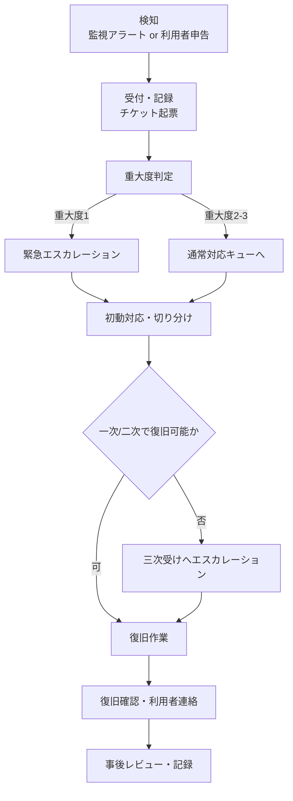

重大度は、業務影響の大きさに応じて事前に定義しておく。

| 重大度 | 定義例 | 初動目標時間の例 |
|--------|--------|------------------|
| 1（緊急） | 業務全体または主要機能が停止 | 15分以内 |
| 2（重大） | 一部機能が停止、代替手段あり | 1時間以内 |
| 3（軽微） | 影響が限定的、業務継続可能 | 当日中 |
| 4（問い合わせ） | 障害ではない照会 | 翌営業日以内 |

数値は例示であり、業務影響分析（第2章）の結果に応じて調整する。

### 2.8 エスカレーション設計

**エスカレーション**は、対応者の権限や知識で解決できない、または時間内に解決できない事象を、上位の役割へ引き継ぐ仕組みである。

エスカレーションが機能しない典型的な原因は次である。

- 誰が上位者かが明文化されていない
- 上位者の連絡先が古い、または夜間に更新されない
- エスカレーションの基準時間が定義されていない
- 上位者への連絡自体が一次受け担当者の裁量に委ねられ、遠慮して連絡が遅れる

**推奨事項**：エスカレーションは「時間経過による自動エスカレーション」と「重大度による即時エスカレーション」の両方を持つ。
一次受け担当者の判断だけに委ねない。

### 2.9 定型作業の洗い出しと自動化

**定型作業**は、手順が決まっており、繰り返し発生する運用作業である。
アカウント発行、証明書更新、日次レポート作成、リソース拡張の一次対応などが該当する。

定型作業は、自動化の第一候補である。
ただし、すべてを自動化することが常に正しいわけではない。

自動化を判断する観点は次である。

- 発生頻度（頻度が高いほど自動化の効果が大きい）
- 手順の一意性（分岐が多い作業は自動化コストが高い）
- 誤操作時の影響度（影響が大きい作業は自動化の検証コストも高くなる）
- 変更頻度（手順自体が頻繁に変わる作業は自動化の保守コストが増える）

**推奨事項**：発生頻度が高く、手順が一意で、誤操作影響が中程度までの作業から自動化する。
影響が極めて大きい作業（本番データ削除を伴う操作など）は、自動化しても承認ステップを残す。

### 2.10 運用手順書とRunbook

**運用手順書**は、平常時の定型作業や運用プロセス全般を記述した文書である。

**Runbook**は、特定の事象（障害、変更、復旧）に対して、判断分岐を含む実行手順を記述した文書である。
一般的な運用手順書より粒度が細かく、緊急時にその場で参照して実行できることを目的とする。

Runbookに含めるべき項目は次である。

- 対象事象（トリガーとなる症状やアラート）
- 前提確認（実施前に確認すべき状態）
- 実行手順（コマンド、操作画面、確認ポイント）
- 判断分岐（症状ごとの分岐先）
- 戻し手順（実施後に問題が起きた場合の切り戻し）
- 連絡先、エスカレーション条件
- 最終更新日と検証実績

**必須事項**：本番に影響しうる重要作業のRunbookは、作成者以外がレビューし、内容の正確性を確認する。

Runbookは作りっぱなしでは劣化する。
構成変更や手順変更のたびに更新しないと、障害時に「手順どおりにやったが失敗した」という事態を招く。

### 2.11 運用負荷の見積もりと管理

**運用負荷**は、定型作業、問い合わせ対応、障害対応、変更対応などにかかる工数の総量である。

運用負荷を見積もらずに体制を組むと、次のいずれかが起きる。

- 慢性的な残業や休日対応で担当者が疲弊する
- 定型作業が後回しになり、構成管理やパッチ適用が遅延する
- 障害対応に人員を割けず、復旧が遅れる

**推奨事項**：運用負荷は、定型作業の件数×平均所要時間、問い合わせ件数の実績、過去の障害対応時間の実績から見積もり、体制人数の根拠とする。

運用負荷の数値例は「5. 要件例」で示す。

### 2.12 夜間・休日対応の設計

夜間・休日は日中に比べて人員が薄く、判断できる人が限られる。
そのため、夜間・休日に許容する対応範囲を事前に決めておく必要がある。

決めるべき事項は次である。

- 夜間・休日に実施してよい変更の種類（緊急パッチのみ、等）
- オンコール対象者と呼び出し方法
- オンコール応答の目標時間
- 判断できない事象が発生した場合の翌営業日回しの基準
- オンコール対応の代休や手当などの労務上の取り扱い

**必須事項**：オンコール対応の労務上の扱いは、運用設計とは別に、労務管理部門と合意する。
技術設計だけで決めてはならない。

### 2.13 属人化防止

**属人化**は、特定の作業や知識が特定の担当者に依存し、その担当者がいないと業務が回らない状態である。

属人化の兆候は次である。

- Runbookが存在せず、担当者の頭の中にしか手順が無い
- 特定の担当者の休暇中、変更や障害対応が止まる
- 引き継ぎ資料が形骸化しており、実態と合っていない

属人化防止の実務手段は次である。

1. 重要作業について、実施者と別のレビュー担当者を必須にする
2. 定期的に、担当を入れ替えて手順を実行させる（訓練を兼ねる）
3. 休暇・異動・退職の前に、引き継ぎチェックリストの完了を必須にする
4. Runbookの最終更新日と実施実績を可視化し、放置を検知する

**推奨事項**：属人化防止は「その人が居なくなったら」ではなく、平常時から定期的に検証する。
退職が決まってからの引き継ぎでは、時間が足りないことが多い。

## 3. 業務上の意味

可用性要件で「月次稼働率99.9%」を定義しても、それを支えるのは最終的に運用の人と手順である。

障害発生から復旧完了までの時間は、次の要素の合計で決まる。

```text
復旧時間 = 検知時間 + 初動着手までの時間 + 切り分け時間 + 対応実施時間 + 確認時間
```

技術的な復旧作業（対応実施時間）だけを短縮しても、検知や初動着手が遅ければ、全体の復旧時間は短くならない。
運用性が低いと、可用性SLOは「達成できるはずの数値」ではなく「机上の数値」に留まる。

問い合わせ対応の質も業務に直結する。
利用者からの問い合わせに何日も回答が無ければ、業務側はシステムを信頼しなくなり、非公式な回避策（Excel運用の復活など）に流れることがある。

属人化は、平常時には見えにくいリスクである。
担当者が急病や退職で不在になった瞬間に、運用が止まるという形で顕在化する。

## 4. ヒアリング質問

運用体制について。

- 一次受け、二次受け、三次受け、決裁者の役割分担と連絡網は何か
- 監視やインシデント対応を外部委託している範囲はどこまでか
- 夜間・休日のオンコール対象者は誰で、何人体制か

運用作業について。

- 月間の定型作業量はどの程度で、そのうち自動化できていないものは何か
- 重要ジョブの異常終了時、誰が何分以内に気付く想定か
- アカウントの棚卸しや無効化は、どの頻度で誰が実施しているか

障害対応について。

- 重大度の定義と、重大度別の初動目標時間は決まっているか
- Runbookが無い作業で、本番に影響しうるものは何か
- 過去1年で最も長く復旧に時間がかかった障害の原因は何か

運用負荷と属人化について。

- 属人化していると自覚しているジョブや障害対応は何か
- 直近の運用受入で不合格となった条件は何か
- 運用担当者の月あたりの夜間呼び出し回数の実績はどの程度か

## 5. 要件例

### 要件例 NFR-OPS-001 障害初動とエスカレーション

- 要件ID：NFR-OPS-001
- 分類：運用性（障害対応）
- 対象：本番システムの運用業務一式
- 業務上の目的：障害時に役割が混乱せず、速やかに復旧作業へ着手できるようにする
- 前提条件：24時間の一次監視あり。社内運用は平日日中対応、夜間・休日はオンコール体制
- 指標：重大度1アラートの初動着手時間、Runbookカバー率、オンコール応答時間
- 目標値：重大度1の初動着手を15分以内。本番影響しうる重要定型作業のRunbookカバー率100%。オンコール電話応答を10分以内
- 測定条件：四半期ごとの障害対応訓練、および実インシデントの実績
- 測定方法：インシデント管理チケットの時刻記録、訓練記録、Runbook一覧と実作業の突合
- 合否判定：目標未達が連続2四半期続かないこと。重大度1で初動超過が発生した場合は個別に是正報告を必須とする
- 例外条件：社内外の通信が途絶した場合は、代替連絡手段（電話網など）での到達時間を別指標として扱う
- 実現方式：体制表、エスカレーション表、Runbook整備、監視アラートの自動チケット化
- 検証方法：運用受入試験、四半期の障害対応訓練
- 根拠：可用性要件NFR-AVL-001の月次稼働率99.9%を、運用面から支えるために初動15分を設定
- 関連要件：NFR-AVL-001、NFR-MON-001
- 未確定事項：監視の一次受けを外部委託する場合の契約上のSLA最終値

### 要件例 NFR-OPS-002 定型作業の自動化と属人化防止

- 要件ID：NFR-OPS-002
- 分類：運用性（定型作業・属人化防止）
- 対象：月次で発生する定型運用作業（アカウント管理、証明書更新、バックアップ確認、定期レポート作成を含む）
- 業務上の目的：担当者の不在によって定型作業が停止しないようにする
- 前提条件：定型作業一覧が運用設計書として整備されていること
- 指標：定型作業の自動化率、Runbook整備率、属人化リスク作業の件数（実施者が1名しかいない作業の件数）
- 目標値：発生頻度が月2回以上の定型作業について、自動化率60%以上。全定型作業のRunbook整備率100%。属人化リスク作業を0件にする
- 測定条件：半期ごとの運用作業棚卸し
- 測定方法：定型作業一覧と自動化実装、Runbook保有状況、実施者記録の突合
- 合否判定：属人化リスク作業が1件でも残る場合は是正計画の提出を必須とする
- 例外条件：セキュリティ上の理由で複数名への権限付与ができない特権作業は、承認者を含む二名体制での実施記録をもって代替とする
- 実現方式：自動化スクリプトまたはジョブ化、Runbook整備、定期的な担当ローテーション訓練
- 検証方法：棚卸しレビュー、ローテーション訓練の実施記録確認
- 根拠：過去の退職時に、引き継ぎ不足でパッチ適用手順が一時不明になった事例への対策
- 関連要件：NFR-OPS-001、NFR-MNTN-001
- 未確定事項：自動化対象の優先順位付け基準の最終合意

### 要件例 NFR-OPS-003 運用負荷とオンコール上限

- 要件ID：NFR-OPS-003
- 分類：運用性（運用負荷）
- 対象：本番運用に従事する運用チーム
- 業務上の目的：運用担当者の疲弊による品質低下と離職を防ぐ
- 前提条件：オンコール対象者は輪番制。月次でオンコール回数を集計する
- 指標：オンコール担当者一人あたりの月間呼び出し回数、深夜（0時〜6時）呼び出し回数
- 目標値：一人あたり月間呼び出し10回以内、うち深夜呼び出し3回以内。超過が2か月連続した場合は原因分析と対策を必須とする
- 測定条件：オンコール実施記録の月次集計
- 測定方法：インシデント管理システムのオンコール記録集計
- 合否判定：目標超過の有無、および超過時の是正計画の有無
- 例外条件：大規模障害やDR訓練など、単発の突発対応は集計から除外し別途記録する
- 実現方式：アラート閾値の見直し、行動不能アラートの削減（第11章参照）、輪番人数の拡大
- 検証方法：月次オンコール記録レビュー、運用担当者へのヒアリング
- 根拠：オンコール負荷の偏りが、過去に退職理由として複数回挙がったことへの対策
- 関連要件：NFR-OPS-001、NFR-MON-001
- 未確定事項：輪番人数拡大に伴う要員計画の予算確保

## 6. 悪い要件例

1. 「運用しやすいこと」
2. 「マニュアルを整備すること」
3. 「属人化しないこと」
4. 「24時間365日の運用体制を敷くこと」
5. 「アラートを見逃さないこと」

不合格の理由は共通している。
対象作業、測定指標、目標値、測定方法、合否判定のいずれかが欠けている。
加えて、例4は体制の目的（何のために24時間必要か）と、その費用対効果が示されていない。

## 7. 改善後の要件例

### 悪い例1・2の改善：「運用しやすいこと」「マニュアルを整備すること」

NFR-OPS-002へ分解する。
自動化率、Runbook整備率という測定可能な指標に置き換えた。

### 悪い例3の改善：「属人化しないこと」

NFR-OPS-002の属人化リスク作業件数へ分解する。
「実施者が1名しかいない作業の件数」という具体的な数え方を示した点が改善の要点である。

### 悪い例4の改善：「24時間365日の運用体制を敷くこと」

- 要件ID：NFR-OPS-010
- 分類：運用性（体制）
- 対象：本番システムの一次監視受付
- 業務上の目的：夜間・休日の重大障害を検知し、初動対応につなげる
- 前提条件：夜間・休日は最小人員体制とし、対応範囲を重大度1・2に限定する
- 指標：一次受け対応の時間帯カバー率
- 目標値：24時間365日、重大度1・2アラートに対して一次受け対応が可能な状態を100%維持する
- 測定条件：シフト表と実勤務記録の突合
- 測定方法：勤怠記録、オンコール記録
- 合否判定：カバーできない時間帯が発生していないこと
- 例外条件：計画停止時間帯は対象外とする
- 実現方式：日勤・夜勤シフト、または監視委託先との時間帯分担
- 検証方法：シフト運用の月次監査
- 根拠：可用性要件が夜間バッチの完了も含むため
- 関連要件：NFR-OPS-001、NFR-AVL-001
- 未確定事項：休日昼間の体制人数

「24時間365日体制」を漠然と求めるのではなく、対応範囲（重大度）とカバー率という測定可能な形にした。

### 悪い例5の改善：「アラートを見逃さないこと」

第11章のNFR-MON-001（監視カバー率、行動不能アラート数）へ接続する。
運用性の観点では、見逃し防止は監視設計と一次受け体制の両輪で扱う。

## 8. 設計への落とし込み

運用設計書に落とし込む項目の例は次のとおりである。

| 項目 | 内容 |
|------|------|
| 運用時間帯と役割分担 | 一次〜三次受け、決裁者の一覧 |
| 定型作業カレンダー | 日次・週次・月次作業と担当 |
| アカウントライフサイクル | 発行、変更、無効化のフローと期限 |
| パッチ窓と例外プロセス | 定例窓と緊急適用の手順 |
| 障害時の指揮系統 | 重大度別のエスカレーション経路 |
| 自動化対象一覧 | 取得、再実行、スケール、通知の自動化範囲 |
| Runbook一覧 | 対象事象、最終更新日、レビュー実績 |

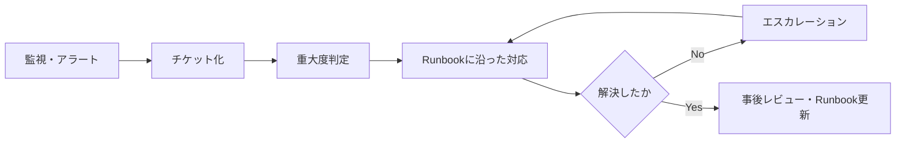

**採用**：重大ジョブの自動再実行は最大1回までとし、2回目以降は人手判断に切り替える。
**不採用**：全自動での無限リトライ。
**理由**：原因を解消しないまま繰り返すと、後続処理の遅延やリソース枯渇を招く。
**残存リスク**：夜間に人手判断が必要になった場合の対応遅延。オンコール訓練とエスカレーション表の整備で緩和する。

## 9. 代替案

| 方式 | 向く条件 | 向かない条件 |
|------|----------|--------------|
| フル内製運用 | 業務知識の蓄積を重視、委託予算が限られる | 24時間体制の要員確保が難しい |
| 監視一次受けを外部委託、二次以降内製 | 夜間人員を抑えつつ検知漏れを防ぎたい | 業務固有の判断が一次受けで頻発する |
| マネージドサービス中心で運用項目を削減 | クラウドの管理機能を最大限活用したい | 責任分界が曖昧になりやすい環境 |
| 完全外部委託（運用BPO） | 定型作業の比率が高い | ノウハウが社外に蓄積し内製化が困難になる |

## 10. トレードオフ

| 対立 | 一方を優先すると | 他方に起きること |
|------|------------------|------------------|
| 自動化投資 vs 初期開発費 | 自動化を進める | 初期の開発工数・費用が増える |
| 詳細なRunbook vs 更新負荷 | 手順を細かく書く | 変更のたびに更新負荷が増え、放置されると有害になる |
| 厳しい初動目標 vs 人員コスト | 初動を早くする | オンコール要員や委託費用が増える |
| 変更の承認厳格化 vs 変更速度 | 承認を増やす | リリースや復旧作業が遅くなる |
| 内製化 vs 外部委託 | 内製を選ぶ | ノウハウは残るが要員確保の負荷が増える |

24時間体制を敷くかどうかは、可用性要件と運用負荷の両方から判断する。
夜間のオンライン利用がほぼ無い業務であれば、監視は継続しつつ、対応は翌朝でよいという選択肢もある。

## 11. 検証方法

- 運用受入試験（運用手順どおりに一連の作業が実施できるかの確認）
- Runbookの机上ウォークスルー
- 障害対応訓練（模擬障害を用いた初動〜復旧の一連の実施）
- アカウント棚卸し
- パッチ適用リハーサル
- 問い合わせ対応のKPIレビュー（一次回答時間、解決時間）
- オンコール記録の月次レビュー

## 12. よくある失敗

1. 運用要件を定義せず、構築完了をもってプロジェクトを終える
2. Runbookが構築担当者の個人メモのまま共有されない
3. アラートの種類だけ増やし、対応する体制を用意しない
4. 休日や夜間の決裁者が不在で、障害判断が翌営業日まで持ち越される
5. 構成変更が記録されず、後の障害調査で正しい構成が分からなくなる
6. バックアップやパッチ適用が特定の担当者の善意で回っている
7. オンコール負荷を測定せず、離職まで気付かない
8. 属人化リスクを「そのうち直す」として放置する

## 13. レビュー観点

- [ ] 運用体制と運用時間が可用性要件と整合しているか
- [ ] 重大度別の初動時間とエスカレーション基準が数値化されているか
- [ ] 本番影響しうる重要作業にRunbookが存在するか
- [ ] 属人化の検出手段と引き継ぎプロセスがあるか
- [ ] 運用受入の合否基準が明示されているか
- [ ] オンコール対応の労務上の扱いが合意されているか
- [ ] 定型作業の自動化優先順位が根拠付きで決まっているか
- [ ] 監視、パッチ、アカウント管理の運用フローが相互に矛盾していないか

## 14. 章末問題

### 問題1

可用性目標が月次稼働率99.9%（許容停止14.4分/月）であっても、運用性が低いと目標が形骸化する理由を、復旧時間の構成要素を用いて説明せよ。

### 問題2

「Runbookを用意すること」という要件を、測定可能な形に直せ。

### 問題3

ある運用チームで、重大ジョブの自動リトライを無制限に設定していたところ、原因未解消のまま朝までリトライを繰り返し、後続の日次バッチが軒並み遅延した。
この事例から得られる教訓を、運用設計の観点で2つ述べよ。

### 問題4

属人化防止のために「担当者を複数名にする」以外に有効な施策を2つ挙げよ。

## 15. 解答と解説

### 問題1

復旧時間は、検知時間、初動着手までの時間、切り分け時間、対応実施時間、確認時間の合計で決まる。
運用性が低いと、検知や初動着手に時間がかかり、技術的な復旧作業自体が速くても全体の復旧時間は短縮されない。
その結果、稼働率計算上の短い停止予算（14.4分）を、初動の遅れだけで使い果たしてしまう。

### 問題2

例：「本番影響しうる重要度Aの運用作業20件について、実行手順、判断分岐、戻し手順、連絡先を含むRunbookを100%整備し、作成者以外によるレビューを完了する」。
対象件数、記載項目、レビュー要件を明示した点が改善の要点である。

### 問題3

第一に、自動リトライには上限回数を設け、上限到達後は人手判断に切り替える設計が必要である。
第二に、リトライが上限に達した場合は、後続処理への影響（遅延の連鎖）を考慮した通知とエスカレーションを組み込む必要がある。

### 問題4

例：定期的に担当をローテーションして手順を実際に実行させる訓練を行う。
Runbookの最終更新日と実施実績を可視化し、長期間実施されていない、または更新されていない手順を棚卸しの対象にする。

## 16. 実務演習

実務シナリオ（従業員5,000人のWeb業務システム）を題材に、次を作成せよ。

1. 日中・夜間・休日の運用体制図（一次〜三次受け、決裁者を含む）
2. 重大度1〜4のエスカレーション表（初動目標時間を含む）
3. 重要Runbook一覧（10件、対象事象と最終更新日の欄を含む）
4. 属人化リスクがあると想定される作業を3件挙げ、それぞれの対策を書く
5. NFR-OPS-001〜003について、関連する可用性・監視要件との対応関係を1行ずつ書く

---

## 次章予告

第11章では監視と可観測性を扱う。
死活、リソース、業務監視の使い分け、アラート疲れの防止、SLIとの連携、監視対象の欠落を防ぐ実務手順を扱う。


---


<!-- SOURCE: 11_observability.md -->

# 第11章 監視・可観測性設計

## 1. 学習目標

本章を終えると、次ができる。

- 死活、リソース、プロセス、ログ、外形、業務監視を目的別に使い分けられる
- メトリクス、ログ、トレースを組み合わせた可観測性を設計できる
- ベースライン、閾値、動的閾値を使い、アラート疲れを数値で把握し抑制できる
- 重大度、通知先、エスカレーションをSLIと連動させて定義できる
- ダッシュボードとアラートの役割を区別し、SLIを軸にした可視化ができる
- 監視対象の欠落を防ぐ実務手順（突合、棚卸し）を実行できる

## 2. 基本概念

### 2.1 監視の種類

**監視**は、システムの状態を継続的に観測し、異常を検知する仕組みである。
一口に監視といっても、見る対象によって性質が異なる。

| 種類 | 見るもの | 検知できること | 検知できないこと |
|------|----------|----------------|-------------------|
| 死活監視 | ホストやプロセスが応答するか | プロセス停止、疎通不可 | 応答はあるが処理が誤っている状態 |
| リソース監視 | CPU、メモリ、ディスク、ネットワーク使用率 | 資源枯渇の兆候 | アプリ固有のロジック不具合 |
| プロセス監視 | 必要なプロセス・サービスの起動状態 | プロセス異常終了 | 起動しているが応答が遅い状態 |
| ログ監視 | エラーパターン、監査イベント | アプリが記録した異常 | ログに出力されない異常 |
| 外形監視 | 外部から見た到達性、合成取引の成功可否 | 利用者視点での不通・失敗 | 内部のどこが原因かまでは分からない |
| 業務監視 | 業務KPI（受付件数、バッチ完了、滞留件数） | 業務として異常な状態 | 個々の技術要素の異常箇所 |

**一般論**として、死活監視だけで「監視している」と考えるのは危険である。
死活監視は「動いているか」しか見ておらず、部分障害や性能劣化、ロジック不具合を見逃す。
ping応答があってもアプリケーション層で例外が出続けている、という状態は珍しくない。

**例示**：ログイン画面は200 OKを返すが、認証基盤の応答が異常に遅く、実際にはログインが完了しない。
死活監視は「200 OKが返った」ことしか見ないため、この種の部分障害を正常と誤判定する。

**推奨事項**：死活・リソース・プロセスの技術監視に加えて、外形監視と業務監視を組み合わせ、利用者が実際に困っている状態を検知できるようにする。
技術監視は原因の絞り込みに強く、外形・業務監視は影響の有無を判断するのに強い。
両者は代替関係ではなく補完関係にある。

監視の粒度は監視対象の重要度に応じて変える。
すべての内部コンポーネントに同じ密度の監視を敷くと、監視自体の運用コストと、後述するアラート疲れの原因になる。

### 2.2 メトリクス、ログ、トレース、可観測性

観測可能性を支える三つのデータ種別がある。

- **メトリクス**：数値の時系列データ。CPU使用率、リクエスト数、エラー率など。集計や傾向把握に向く
- **ログ**：発生したイベントの記録。詳細な原因調査に向くが、量が多いと検索性が課題になる
- **トレース**：一つのリクエストが複数のサービスをまたいで処理される様子を追跡した記録。遅延がどこで発生しているかの分解に向く

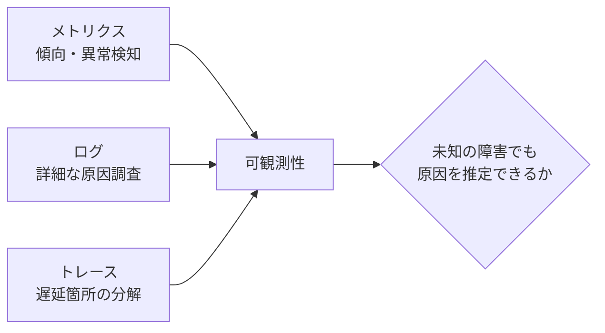

**可観測性**（Observability）は、未知の障害が起きたときでも、外部から観測できる出力（メトリクス、ログ、トレース）だけを手がかりに、システム内部の状態を推定できる度合いである。

可観測性は特定の製品を導入すれば得られるものではない。
必要な信号が、必要な粒度で、必要なタイミングで出力されているかどうかが本質である。
ログを大量に出しているだけで、障害原因の特定に必要な情報（リクエストID、処理時間、依存先呼び出し結果など）が欠けていれば、可観測性は低いままである。

ログの実務では、**構造化ログ**（JSON形式などキーと値が機械的に解析できる形式）と、リクエストをまたいで同じ値を持つ**相関ID**（トレースID、リクエストIDなど）が特に重要である。
自由記述の平文ログだけでは、大量のログの中から一つのリクエストに関する記録だけを抜き出すことが難しい。

トレースについては、全リクエストを記録すると保管コストとオーバーヘッドが増えるため、**サンプリング率**（記録するリクエストの割合）を決める必要がある。
**推奨事項**：エラーが発生したリクエストと、レイテンシが著しく大きいリクエストは、サンプリング対象から除外せず優先的に記録する。

### 2.3 ベースラインと閾値

**ベースライン**は、平常時の挙動の水準である。
CPU使用率が平常時30〜50%で推移する、といった実測に基づく基準を指す。
ベースラインは、少なくとも1〜2週間分の実測データから、平日・休日、繁忙期・閑散期の違いを含めて把握する。

**閾値**は、ベースラインから外れたと判断する境界値である。
統計的な出発点としては、平均値と標準偏差を使った次のような設定がある。

```text
警告閾値 = 平均値 + 2 × 標準偏差
重大閾値 = 平均値 + 3 × 標準偏差
```

固定閾値は単純だが、業務の周期性（月末、始業直後など）を考慮しないと、次のいずれかが起きる。

- 繁忙期に誤報が大量発生し、アラート疲れを招く
- 閑散期には正常に見えるが、実際には異常な水準を見逃す

**例示**：月末処理のCPU使用率は平常時の2倍になることが分かっているのに、平常時基準の閾値をそのまま使うと、月末の毎晩アラートが鳴り、担当者はそのアラートを無視するようになる。

### 2.4 動的閾値

**動的閾値**は、時間帯や曜日、季節性を踏まえて閾値を変動させる方式である。
固定閾値の限界を補うために導入する。

代表的な実現方法は次である。

1. **時間帯別の固定閾値**：平日日中、夜間、月末をそれぞれ別の固定閾値として設定する
2. **移動平均ベース**：直近N日間の同じ時間帯の実績平均から、一定の乖離幅を閾値とする
3. **統計的な外れ値検知**：季節性を除去したうえで標準偏差や分位点を使い、自動的に許容範囲を計算する

**例示**：過去4週間の「毎週月曜10時台」のリクエスト数平均が1,000件、標準偏差が100件だった場合、当該時間帯の警告閾値を「平均+2標準偏差＝1,200件」として、他の曜日・時間帯とは別に管理する。
翌週の実績が1,250件であれば、通常の閾値（例えば全日平均800件を基準にした閾値）では発報しない水準でも、当該時間帯としては異常として検知できる。

動的閾値には導入コストと説明可能性のトレードオフがある。
自動計算された閾値は、なぜその数値になったのかを担当者が即座に説明しにくい。

**推奨事項**：まず固定閾値と時間帯別の閾値から始め、誤報や見逃しの実績を見ながら動的閾値の導入を検討する。
最初から高度な統計モデルを導入すると、チューニングと説明の負荷が運用チームの能力を超えることがある。

### 2.5 アラート疲れの数値化

**アラート疲れ**（Alert Fatigue）は、重要でない通知が多すぎることで、担当者が通知に鈍感になり、本当に重要な通知を見逃す状態である。
アラート疲れは感覚ではなく、次のように数値で把握できる。

```text
行動不能アラート比率 = (発報件数 − 対応が必要だった件数) ÷ 発報件数
```

ある月の実績を例に示す。

| 重大度 | 発報件数 | 対応が必要だった件数 | 行動不能件数 | 行動不能比率 |
|--------|----------|----------------------|----------------|----------------|
| 1（緊急） | 40 | 38 | 2 | 5.0% |
| 2（重大） | 150 | 90 | 60 | 40.0% |
| 3（軽微） | 900 | 45 | 855 | 95.0% |
| 4（情報） | 410 | 5 | 405 | 98.8% |
| 合計 | 1,500 | 178 | 1,322 | 88.1% |

全体の行動不能比率が88.1%という状態は、担当者が10件の通知のうち9件近くを無視してよいと学習してしまう水準であり、重大度1・2に紛れて重大な兆候を見逃すリスクが高い。

原因の多くは重大度3・4に集中している。
そこで、次の是正を実施したとする。

- 重大度3・4の閾値を実績ベースラインに合わせて緩和する
- 同一原因から連鎖するアラートをグルーピングし、根本原因単位で1件に集約する
- 行動不要と判定され続けた監視項目を棚卸しし、無効化または重大度を引き下げる

是正後の翌月実績は次のようになった。

| 重大度 | 発報件数 | 対応が必要だった件数 | 行動不能比率 |
|--------|----------|----------------------|----------------|
| 1（緊急） | 38 | 36 | 5.3% |
| 2（重大） | 140 | 88 | 37.1% |
| 3（軽微） | 260 | 42 | 83.8% |
| 4（情報） | 90 | 6 | 93.3% |
| 合計 | 528 | 172 | 67.4% |

対応が必要な件数（172〜178件）はほぼ変わらないまま、発報の総数を1,500件から528件へ、行動不能比率を88.1%から67.4%へ減らせている。
**推奨事項**：アラート疲れの改善は「アラートを減らすこと」自体ではなく、対応が必要な件数を維持しながら不要な発報を減らすことを目標に置く。

### 2.6 重大度、通知先、エスカレーション設計

アラート疲れの対策として、重大度・通知・グルーピング・時間帯抑制・定期棚卸しの5つを組み合わせる。

1. **重大度**を定義し、通知チャネルや対応期限を変える（緊急はページャー、軽微はチャットのみ、など）
2. 行動できない（見ても何もしない）アラートを削除または通知対象から外す
3. 関連するアラートをグルーピングし、根本原因単位で通知する
4. 営業時間外は重大度の高いものだけ通知するなど、時間帯別の抑制方針を合意する
5. 定期的にアラート発報数と対応実績をレビューし、不要なアラートを棚卸しする

**必須事項**：重大度ごとに、通知先、通知手段、初動目標時間を定義する。
定義がない重大度区分は運用できない。

| 重大度 | 通知チャネル | 初動目標時間 | 未応答時のエスカレーション |
|--------|--------------|----------------|------------------------------|
| 1（緊急） | ページャー＋電話 | 15分以内 | 5分未応答で二次受けへ自動転送 |
| 2（重大） | ページャー | 1時間以内 | 15分未応答でチームリーダーへ転送 |
| 3（軽微） | チャット通知 | 当日中 | エスカレーションなし（翌日レビュー対象） |
| 4（情報） | ダッシュボード記録のみ | なし | 対象外 |

監視のエスカレーションは、第10章で扱う障害対応の重大度エスカレーションと役割が異なる。
第10章のエスカレーションは「対応者の権限や知識で解決できない事象」を上位者へ引き継ぐ仕組みであり、本章のエスカレーションは「アラートに誰も応答していない事象」を検知して次の担当者へ自動的に転送する仕組みである。
両者は連動するが、後者が機能しなければ前者の起点そのものが遅れる。

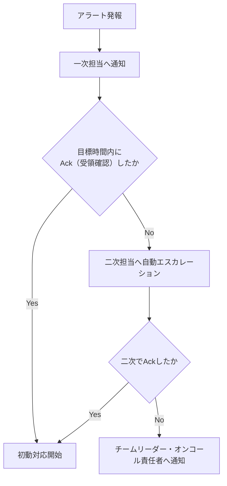

**推奨事項**：エスカレーションは応答（Ack）の有無で自動的に進める。
一次担当者が「連絡するかどうか」を判断する仕組みにすると、遠慮や見落としにより連絡が遅れる。

### 2.7 ダッシュボードとSLI連携

**ダッシュボード**は、状態を可視化し、傾向把握や振り返りに使う閲覧目的の画面である。
**アラート**は、行動を促す通知である。
この二つの役割を混同すると、ダッシュボードに全部を表示して満足し、実際に見るべきときに誰も見ていない、という状態になる。

ダッシュボードは、用途に応じて階層を分けると機能しやすい。

| 階層 | 主な閲覧者 | 内容の例 |
|------|------------|----------|
| 経営・SLOサマリ | 経営層、サービスオーナー | 月次稼働率、主要SLIの達成状況 |
| 運用オペレーション | 一次受け、オンコール担当 | アラート発報状況、重大度別件数、当日の異常兆候 |
| 詳細調査 | 二次・三次受け | コンポーネント別メトリクス、ログ検索、トレース |

SLO（第3章）で使うSLIは、監視の中でも特に重要な指標として扱う。
稼働率や応答時間の95パーセンタイルといったSLIは、月次集計だけでなく、日次・時間単位でも可視化し、SLOからの逸脱兆候を早期に把握できるようにする。

**推奨事項**：SLIはダッシュボードの最上段に固定表示し、他の技術指標と混在させない。
一つのダッシュボードに数十個のパネルを並べると、どの数値を見ればよいか分からなくなり、結局誰も見なくなる。

**必須事項**：ダッシュボードに表示する指標は、分母・分子・集計単位を定義書に明記する。
「稼働率」という同じ名前でも、計画停止を含むか除くかでダッシュボード上の数値が変わり、SLOレビューの場で認識が食い違う原因になる。

### 2.8 監視対象の欠落を防ぐ方法

監視の抜け漏れは、多くの場合「新しく作られた資源が監視対象に追加されない」ことで発生する。
構築時に完璧な監視を組んでも、その後の変更で欠落が生じれば意味がない。

欠落を防ぐ実務手段は次のとおりである。

1. 構成管理台帳またはIaC（第12章）のリソース一覧と、監視設定の対象一覧を定期的に突合する
2. 新規資源作成時に「監視対象」を示す必須ラベル・タグを付与するルールを設ける
3. 依存関係図（IdP、DNS、外部APIなど、自システム外の依存先を含む）を監視カタログに含める
4. リリースチェックリストに「監視追加の完了」を必須項目として入れる
5. 定期的に「一度もアラートが発報していない監視対象」を棚卸しし、監視設定自体が壊れていないか確認する
6. 障害の事後分析で「なぜ検知できなかったか」を必ず確認項目に含める

突合の具体的なやり方は次のとおりである。

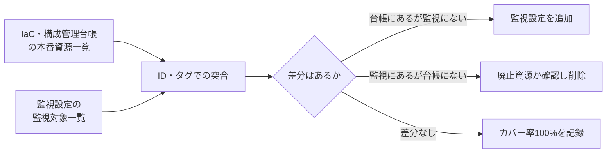

突合は月次または資源追加のたびに自動実行し、差分が0件であることをレポート化する。
**必須事項**：本番稼働に必須な資源については、監視カバー率100%を運用受入の合格条件に含める。

## 3. 業務上の意味

監視は運用者の作業効率のためだけに存在するのではない。
利用者からの申告より先に異常を検知し、業務影響が拡大する前に対応を始めるための仕組みである。

監視が無い、または不十分な状態では、障害検知が利用者からの問い合わせに依存する。
その場合、次のような事態が生じる。

- 異常発生から検知まで数時間、場合によっては翌営業日までかかる
- 複数の利用者から同時に問い合わせが殺到し、対応窓口が混乱する
- 「いつから発生していたか」が分からず、影響範囲の特定が遅れる

逆に、誤報の多い監視も業務に悪影響を及ぼす。
本物の障害通知が誤報の中に埋もれ、対応が遅れる、あるいは監視自体への信頼が失われ、担当者がアラートを軽視するようになる。

数値で見ると影響は明確である。
検知が利用者申告頼みで平均2時間かかっていたケースを、外形監視の導入で2分に短縮できれば、業務影響時間を理論上1時間58分短縮できる。
これは、可用性要件（第3章）や運用性要件（第10章）で置いた復旧時間目標を成立させる前提条件そのものである。

## 4. ヒアリング質問

監視の目的について。

- 業務が止まったと判断する信号は、システム的に何を指すか
- 過去に見逃した障害の典型例と、その原因は何か
- SLOに使う指標（SLI）はどれで、誰が承認したものか
- 業務KPI（受付件数、滞留件数など）で異常を判断する基準値はあるか

対応体制について。

- アラートを受け取ったら、誰が、どの重大度で、何分以内に動く想定か
- アラートに未応答の場合、何分後に誰へエスカレーションする想定か
- 夜間・休日に重大度の低いアラートまで通知が届くと、どのような支障があるか

可視化について。

- 経営層、運用担当者、開発者それぞれが見ているダッシュボードは分かれているか
- SLIとして扱う指標は、どのダッシュボードで、誰が確認しているか

制約について。

- 個人情報を含むログの取り扱いに、監視上どのような制約があるか
- 外部委託先の監視ツールで扱えないデータや制約はあるか
- 監視基盤自体が停止した場合の代替手段は用意されているか

## 5. 要件例

### 要件例 NFR-MON-001 代表シナリオの障害検知

- 要件ID：NFR-MON-001
- 分類：監視・可観測性
- 対象：オンライン代表シナリオ（ログイン、申請、承認、参照）およびその依存サービス
- 業務上の目的：利用者からの申告より先に重大障害を検知し、初動対応を開始できるようにする
- 前提条件：外形監視の対象にIdP、DNS、主要な外部APIを含む
- 指標：重大度1事象の検知時間、本番必須資源に対する監視カバー率、週あたりの行動不能アラート数
- 目標値：代表シナリオの失敗を2分以内に検知する。本番稼働に必須な資源の監視カバー率を100%とする。行動不能アラートを週5件未満に是正する
- 測定条件：障害注入試験、および月次の構成突合による棚卸し
- 測定方法：監視イベントの発報時刻記録、構成管理台帳との突合、アラート分類レビュー
- 合否判定：監視カバー率が100%であること。重大度1の検知遅延が目標を超えた場合は是正計画を必須とする
- 例外条件：監視基盤自体に障害が発生した場合は、代替の通知経路（別系統の死活監視など）を用いる
- 実現方式：合成監視（外形監視）、メトリクス収集、ログ集約、分散トレース、オンコール連携システム
- 検証方法：監視試験、障害注入試験、四半期の棚卸し
- 根拠：可用性要件（NFR-AVL-001）の月次稼働率と、運用性要件（NFR-OPS-001）の初動15分を成立させるための前提条件
- 関連要件：NFR-AVL-001、NFR-OPS-001
- 未確定事項：業務KPI監視（受付件数、滞留件数）の最終対象項目

### 要件例 NFR-MON-002 アラート品質と重大度運用

- 要件ID：NFR-MON-002
- 分類：監視・可観測性（アラート運用）
- 対象：本番監視全般のアラート設定
- 業務上の目的：アラート疲れを防ぎ、重大な通知を確実に対応者へ届ける
- 前提条件：重大度1〜4の定義が運用設計書として合意されていること
- 指標：重大度ごとの月間発報件数、行動不能アラート比率（発報のうち対応不要だったものの割合）
- 目標値：行動不能アラート比率を月次で70%未満に抑える。重大度1の誤報（実際には障害でなかったもの）を月2件以内とする
- 測定条件：月次のアラートレビュー会での分類結果
- 測定方法：アラート発報ログと対応記録の突合、対応者への聞き取り
- 合否判定：行動不能アラート比率が目標を超えた月は、翌月に閾値または通知設定の見直しを実施すること
- 例外条件：新規リリース直後1週間は、閾値調整期間として集計対象から除外できる
- 実現方式：重大度別通知チャネルの分離、関連アラートのグルーピング、閾値の定期チューニング
- 検証方法：月次アラートレビュー、閾値変更の履歴監査
- 根拠：運用担当者へのヒアリングで、通知の大半が行動不要という実態が判明したため。「2. 基本概念」2.5節の実績値（改善前88.1%、改善後67.4%）を踏まえ、当面の目標を70%未満に設定
- 関連要件：NFR-OPS-001、NFR-OPS-003
- 未確定事項：グルーピングに使う相関分析ツールの選定

### 要件例 NFR-MON-003 アラートエスカレーションとSLIダッシュボード

- 要件ID：NFR-MON-003
- 分類：監視・可観測性（エスカレーション・可視化）
- 対象：重大度1・2アラートの未応答エスカレーション、および主要SLIダッシュボード
- 業務上の目的：アラートへの応答が遅れた場合でも、担当者不在の状態を放置せず次の担当者へつなぐ
- 前提条件：オンコール担当者と連絡順序（一次・二次・チームリーダー）が定義されていること
- 指標：アラートAck（受領確認）までの時間、未応答エスカレーションの発動件数、SLIダッシュボードの更新遅延
- 目標値：重大度1のAckを5分以内、重大度2のAckを15分以内。未応答時は目標時間経過後100%自動エスカレーションする。SLIダッシュボードの更新遅延を5分以内に保つ
- 測定条件：本番アラート全件、および四半期のエスカレーション訓練
- 測定方法：アラート管理システムのAck記録、エスカレーション発動ログ、ダッシュボード基盤のデータ鮮度メトリクス
- 合否判定：自動エスカレーションが発動しなかった未応答事象が0件であること。ダッシュボード更新遅延の目標超過が月2回未満であること
- 例外条件：オンコール担当者交代直後30分は、引き継ぎ確認時間として個別に扱う
- 実現方式：アラート管理システムのエスカレーションポリシー設定、SLIダッシュボードの自動更新パイプライン
- 検証方法：エスカレーション訓練（意図的に一次担当を無応答にする）、ダッシュボード鮮度の定期確認
- 根拠：過去に一次担当者が離席中で重大度1アラートに30分以上気付かなかった事例への対策
- 関連要件：NFR-MON-001、NFR-OPS-001
- 未確定事項：オンコール担当者の連絡手段が到達しない場合の代替経路（衛星電話等）の要否

## 6. 悪い要件例

1. 「しっかり監視すること」
2. 「異常をすぐに検知すること」
3. 「可観測性を確保すること」
4. 「重要なアラートは必ず通知すること」
5. 「ダッシュボードを整備すること」
6. 「アラートは適切にエスカレーションすること」

いずれも、対象、検知時間、カバー率、判定基準のいずれかが欠けている。
例4は「重要」の定義が示されておらず、例5は閲覧目的と行動目的の区別がない。
例6は「適切に」が測定不能であり、Ack時間や未応答時の転送先が定義されていない。

## 7. 改善後の要件例

### 悪い例1・2の改善：「しっかり監視すること」「異常をすぐに検知すること」

NFR-MON-001が改善例である。
検知時間、カバー率という測定可能な指標へ分解した。

### 悪い例3の改善：「可観測性を確保すること」

可観測性は状態であって、単独では測定できない。
次のように、支える要素ごとに要件化する。

- メトリクス：主要コンポーネントのCPU、メモリ、エラー率、レイテンシを1分粒度で収集する
- ログ：重大イベントを構造化ログとして出力し、リクエストIDで横断検索できる
- トレース：オンライン主要APIについて、サービス間呼び出しをトレースIDで追跡できる

### 悪い例4・5の改善：「重要なアラートは必ず通知すること」「ダッシュボードを整備すること」

NFR-MON-002へ分解する。
重大度別の発報件数と行動不能比率という指標を置き、ダッシュボードとアラートの役割を分離した。

### 悪い例6の改善：「アラートは適切にエスカレーションすること」

NFR-MON-003へ分解する。
「適切に」を、Ack目標時間、自動エスカレーション発動率という測定可能な指標に置き換えた点が改善の要点である。

## 8. 設計への落とし込み

監視カタログに含める列の例は次のとおりである。

| 列 | 内容 |
|----|------|
| 対象 | 監視するコンポーネントまたはシナリオ |
| 目的 | 何を検知するための監視か |
| 信号種別 | 死活、リソース、外形、業務など |
| SLI該当可否 | SLOのSLIとして使うかどうか |
| 閾値 | 発報条件（固定/時間帯別/動的） |
| 重大度 | 1〜4などの区分 |
| 通知先 | 一次受け、チーム、エスカレーション先 |
| Runbook | 対応するRunbookの参照 |
| 所有者 | 監視設定のメンテナンス責任者 |

```mermaid
flowchart TB
  subgraph Signals["監視信号"]
    S1["死活/リソース/プロセス"]
    S2["外形監視（合成取引）"]
    S3["業務監視（KPI）"]
    S4["ログ/トレース"]
  end
  S1 --> AGG["集約・相関"]
  S2 --> AGG
  S3 --> AGG
  S4 --> AGG
  AGG --> SEV["重大度判定"]
  SEV --> NOTIFY["通知（チャネル別）"]
  NOTIFY --> DASH["ダッシュボード（閲覧）"]
  NOTIFY --> ONCALL["オンコール（行動）"]
```

**採用**：SLIは外形監視とAPMのレイテンシ指標を併用する。
**不採用**：サーバCPU使用率だけを可用性判定の指標にする。
**理由**：CPUが低くても、IdP停止やアプリロジック不具合で業務が止まりうる。
**残存リスク**：外部APIの性能劣化を自システムの障害と誤認する可能性がある。
依存先ごとの切り分け手順をRunbookに明記して緩和する。

## 9. 代替案

| 方式 | 向く条件 | 向かない条件 |
|------|----------|--------------|
| インフラ監視中心 | シンプルな構成、初期導入コストを抑えたい | 利用者視点の障害を見逃しやすい |
| 外形監視中心 | 利用者体験を優先して検知したい | 内部原因の特定に時間がかかる |
| インフラ+外形+業務監視の併用（推奨） | 検知の網羅性と原因特定の速さを両立したい | 導入・運用コストが相対的に高い |
| 商用APM/可観測性プラットフォーム一括導入 | トレースまで含めて早期に整備したい | ライセンス費用と学習コストが発生する |
| 固定閾値のみで運用開始し段階的に動的閾値へ移行 | 運用チームの成熟度がこれから上がる | 立ち上げ初期の誤報・見逃しをある程度許容する必要がある |

## 10. トレードオフ

| 対立 | 一方を優先すると | 他方に起きること |
|------|------------------|------------------|
| 高感度な閾値 vs 誤報 | 早期に気付ける | アラート疲れが進み、見逃しリスクが増える |
| 詳細なトレース vs コスト・機密性 | 原因特定が速くなる | データ量とライセンス費用が増え、個人情報混入のリスクも増える |
| 中央集権的な監視標準化 vs チームの自律性 | 標準化により品質が均一になる | チームごとの事情に合わせた柔軟性が下がる |
| 動的閾値の導入 vs 説明可能性 | 誤報・見逃しの精度が上がる | 閾値の根拠が担当者に説明しづらくなる |
| ダッシュボードの網羅性 vs 認知負荷 | 表示項目を増やす | どこを見ればよいか分からなくなり、結局見られなくなる |
| 厳格な自動エスカレーション vs 誤エスカレーション | 見逃しを防げる | 一時離席のたびに転送が発生し、上位者の負荷が増える |

## 11. 検証方法

- 意図的な障害注入による発報確認
- 通知チャネルへの到達確認（実際に受信できるかのテスト）
- エスカレーション訓練（一次担当を意図的に無応答にし、自動転送を確認する）
- ダッシュボードの指標定義レビュー（分母・分子・集計方法の確認）
- 構成管理台帳と監視対象の突合
- 月次のアラートレビュー会（発報件数、行動不能比率の確認）
- SLIとSLOの整合性レビュー

## 12. よくある失敗

1. 新規サービスをリリースする際、監視カタログへの登録を忘れる
2. 閾値を実測に基づかず感覚で設定する
3. 重大度の区分がすべて「緊急」になり、実質的に機能しない
4. ログは収集しているが、検索や相関付けができず調査に使えない
5. SLOで使う指標と、実際に監視しているメトリクスが一致していない
6. 監視基盤そのものの死活監視（監視の監視）が存在しない
7. 依存先（IdP、DNS、外部API）を監視対象から外してしまう
8. アラートレビューを一度も実施せず、不要な通知が蓄積し続ける
9. 未応答時の自動エスカレーションが設定されておらず、一次担当者の裁量に依存する
10. ダッシュボードにパネルを増やし続け、誰も定期的に見なくなる

## 13. レビュー観点

- [ ] 死活・リソースだけでなく、外形・業務監視が含まれているか
- [ ] SLOで使うSLIが明示され、監視設定と一致しているか
- [ ] 重大度と通知先、初動目標時間が対応しているか
- [ ] 未応答時の自動エスカレーション条件と転送先が定義されているか
- [ ] 監視対象の欠落防止の仕組み（突合、棚卸し）があるか
- [ ] アラート疲れを防ぐ具体策（グルーピング、時間帯抑制）と、その効果を測る指標があるか
- [ ] ダッシュボードとアラートの役割が区別され、階層別に設計されているか
- [ ] 個人情報を含むログの扱いが、セキュリティ要件と矛盾していないか
- [ ] 監視基盤自体の障害時の代替経路があるか

## 14. 章末問題

### 問題1

CPU使用率90%を超えたらアラートを出す設定だけがあるシステムで、ログイン不能障害を見逃した。
なぜ見逃したのか、監視の種類の観点から説明せよ。

### 問題2

「監視カバー率100%」を実際に測定する具体的な方法を書け。

### 問題3

ある監視システムで、月間のアラート発報件数が2,000件、そのうち実際に対応が必要だったものが150件だった。
行動不能アラート比率を計算し、この状態が引き起こす問題を述べよ。

### 問題4

固定閾値による監視で、月末は誤報が多発し、それ以外の時期は異常を見逃しがちだった。
考えられる改善策を2つ挙げよ。

### 問題5

重大度1のアラートについて、Ack目標時間を5分、未応答時のエスカレーション先をチームリーダーとする設計にした。
この設計だけでは不十分な理由を、オンコール担当者の不在パターンを踏まえて指摘せよ。

## 15. 解答と解説

### 問題1

CPU使用率は資源監視の一種であり、IdP停止、DNS障害、アプリケーションのロジック不具合など、リソース使用率が上がらない種類の障害を検知できない。
外形監視（実際にログインを試行する合成取引）を組み合わせていれば、利用者視点での不通を検知できた可能性が高い。

### 問題2

構成管理台帳またはIaCで管理している本番必須資源の一覧と、監視設定に登録されている対象の一覧をIDで突合し、両者の差分が0件であることを確認する。
依存する外部サービス（IdP、DNSなど）も一覧に含める。

### 問題3

```text
行動不能アラート比率 = (2,000 - 150) / 2,000 = 92.5%
```

この状態では、担当者が大半のアラートを「どうせ対応不要」とみなすようになり、本当に対応が必要な重大アラートも見逃されるアラート疲れが生じる。

### 問題4

例：時間帯別（平日日中、月末、夜間など）に異なる閾値を設定する。
または、過去の実績から自動的に許容範囲を算出する動的閾値の導入を検討する。
いずれの場合も、導入後は誤報・見逃しの実績を継続的にレビューする。

### 問題5

チームリーダーが単一の担当者であれば、チームリーダー自身が不在または対応中の場合にエスカレーションが行き止まりになる。
エスカレーション先は単一の個人ではなく、二次受けグループやオンコール責任者のローテーションのように複数名で構成し、さらにその先（三次受け、決裁者）への経路も定義しておく必要がある。

## 16. 実務演習

実務シナリオ（従業員5,000人のWeb業務システム）を題材に、次を作成せよ。

1. 監視カタログを12件作成する（対象、信号種別、閾値、重大度、通知先、Runbook参照を含む）
2. うち3件をSLOのSLIとして指定し、それぞれの目標値と紐づける
3. 依存先（IdP、DNS、外部API）を監視カタログに含め、切り分け手順の概要を1行ずつ書く
4. 月間アラート発報件数と行動不能比率の目標値を設定し、根拠を1文で書く
5. 重大度1・2の未応答エスカレーション経路を、一次受けから決裁者まで図示する
6. 経営・運用オペレーション・詳細調査の3階層でダッシュボードの掲載項目案を作成する

---

## 次章予告

第12章では保守性と変更容易性を扱う。
IaC、CI/CD、ロールバック、Blue-Green、Canary、Feature Flag、構成ドリフト、技術的負債を要件へ落とし込む方法を扱う。


---


<!-- SOURCE: 12_maintainability.md -->

# 第12章 保守性と変更容易性

## 1. 学習目標

本章を終えると、次ができる。

- モジュール化、疎結合、設定の外部化、IaCを保守性要件に接続できる
- 自動テスト、CI/CD、バージョン管理、ロールバックの目標値を定義できる
- Blue-Green、Canary、Feature Flagを変更リスクに応じて使い分けられる
- 構成ドリフト、技術的負債、サポート期限を管理する要件を書ける
- 変更作業時間と影響範囲を見積もり、リリース方式の選定に反映できる

## 2. 基本概念

### 2.1 保守性と変更容易性の定義

**保守性**は、システムに対する修正、機能追加、障害対応を、安全かつ迅速に行える性質である。
**変更容易性**は保守性の中核をなす要素であり、変更にかかる時間、リスク、影響範囲の小ささを指す。

保守性が低いシステムでは、次のような症状が現れる。

- 小さな修正のはずが、影響確認に長時間かかる
- 一度リリースすると、問題が起きても元に戻せない、または戻すのに長時間かかる
- 設定変更のたびに再ビルドや手作業が必要になる
- 誰も全体構造を把握しておらず、変更の影響範囲が予測できない

**一般論**として、保守性は機能要件と直接関係しないため、初期構築時には後回しにされやすい。
しかし、システムのライフサイクル全体で見ると、構築期間より運用期間の方が長いことがほとんどであり、保守性の不足は長期的なコストとして蓄積する。

### 2.2 モジュール化と疎結合

**モジュール化**は、システムを独立した機能単位に分割することである。
**疎結合**は、モジュール間の依存関係を最小限にし、一方の変更が他方に影響しにくい状態を指す。

疎結合を実現する代表的な手段は次である。

- 明確に定義されたインターフェース（API契約）を介した連携
- 直接のデータベース共有を避け、サービスごとにデータを所有する
- 非同期メッセージングによる時間的な結合の緩和

**推奨事項**：モジュール分割の単位は、業務上の変更理由が同じかどうかで判断する。
技術的な層（画面、ロジック、データ）だけで分割すると、一つの業務変更が複数レイヤーにまたがり、変更の影響範囲がかえって広がることがある。

### 2.3 設定の外部化とIaC

**設定の外部化**は、環境依存の値（接続先、認証情報、フラグなど）をコードから分離し、外部の設定ファイルや設定管理サービスで管理することである。
設定がコードに埋め込まれていると、環境ごとに再ビルドが必要になり、変更のたびにリリース作業が発生する。

**IaC**（Infrastructure as Code）は、インフラの構成をコードとして記述し、バージョン管理と自動適用の対象にする手法である。
IaCにより、次が可能になる。

- 構成変更の履歴管理（誰が、いつ、何を変更したか）
- レビューを経た変更適用（プルリクエストベースの変更管理）
- 環境間の構成差異の検出と是正

**必須事項**：本番環境の構成は、IaCまたはそれに準じる構成管理の仕組みを「正」とする。
手動変更を許容する場合でも、事後にコードへ反映する運用を定める。

### 2.4 自動テスト、CI/CD、バージョン管理

**自動テスト**は、単体テスト、結合テスト、E2Eテストなどを自動実行し、変更による意図しない影響（デグレード）を検出する仕組みである。

**CI/CD**（継続的インテグレーション/継続的デリバリー）は、コードの変更を自動的にビルド、テスト、デプロイまでつなげるパイプラインである。
CI/CDが整備されていないと、リリースのたびに手作業が発生し、作業者によって手順や品質がばらつく。

**バージョン管理**は、コードとインフラ構成の変更履歴を追跡可能にする仕組みである。
バージョン管理されていない変更は、いつ、誰が、何のために行ったかを後から追跡できない。

これらは相互に補完し合う。
自動テストが無ければCI/CDは「速く壊れたものを届ける」仕組みになりかねない。
バージョン管理が無ければCI/CDは何を元にデプロイしているのか不明確になる。

### 2.5 ロールバックと後方互換性

**ロールバック**は、リリースした変更を、問題発生時に安全に取り消し、直前の安定状態へ戻す操作である。

ロールバックが機能するためには、次を満たす必要がある。

- 直前バージョンへ戻す手順が自動化されている、または短時間で実行できる
- データベースのスキーマ変更が、ロールバック後の旧バージョンでも動作する（後方互換性）
- ロールバック実施の判断基準（どの異常が発生したら戻すか）が事前に定義されている

**後方互換性**は、新しいバージョンが、古いバージョンの利用者や連携先の期待する動作を維持する性質である。
APIのレスポンス形式を変更する、必須パラメータを追加する、といった変更は後方互換性を壊しうる。

**推奨事項**：データベースのスキーマ変更は、追加は先行し、削除は後続のリリースで行う「二段階リリース」を基本にする。
これにより、アプリのロールバックが必要になっても、スキーマ側が追従できる。

### 2.6 Blue-Green、Canary、Feature Flag

三つはいずれも変更リスクを下げるためのリリース手法だが、性質が異なる。

**Blue-Green Deployment**は、稼働中の環境（Blue）とは別に新環境（Green）を用意し、準備が整った時点で切り替える方式である。
切り替えは瞬時に行え、問題があれば旧環境へ戻すことも比較的速い。
ただし、環境を二重に持つためコストが増える。

**Canary Release**は、新バージョンを一部の利用者やトラフィックにだけ先行適用し、問題がなければ段階的に対象を広げる方式である。
問題を早期に、限定的な影響範囲で検出できる。
段階的な適用ロジックと、異常検知による自動停止の仕組みが必要になる。

**Feature Flag**は、コードのデプロイとは切り離して、機能の有効・無効を実行時に切り替える仕組みである。
リリースと機能公開を分離できるため、問題発生時にコードを戻さずフラグを切るだけで影響を止められる。

| 方式 | 主な利点 | 主な注意点 |
|------|----------|------------|
| Blue-Green | 切替・切り戻しが速い | 環境を二重に持つコスト |
| Canary | 影響範囲を限定して検証できる | 段階制御と自動判定の仕組みが要る |
| Feature Flag | コードデプロイと機能公開を分離できる | フラグの管理不備で技術的負債化しやすい |

**推奨事項**：三つは排他的ではなく組み合わせて使う。
Blue-Greenでインフラを切り替え、Canaryで一部トラフィックに適用し、Feature Flagで機能単位に制御する構成も一般的である。

### 2.7 構成ドリフトと技術的負債

**構成ドリフト**は、IaCなどで定義された「あるべき構成」と、実際の本番環境の構成が乖離した状態である。
緊急対応での手動変更がコードへ反映されないまま放置されると発生しやすい。

構成ドリフトが放置されると、次の問題が起きる。

- 障害時のフェイルオーバー先が、想定と異なる古い構成のままになっている
- IaCを再適用した際に、意図せず手動変更が上書きされ、別の障害を招く
- 監査時に「実際の構成」と「文書上の構成」が一致しない

**技術的負債**は、短期的な都合で選んだ実装や構成が、長期的な保守コストとして積み上がったものである。
負債自体が常に悪いわけではないが、返済計画を持たずに放置すると、変更のたびにコストが増加し、最終的には変更自体が困難になる。

**推奨事項**：構成ドリフトは定期的な自動検出の対象とし、技術的負債は一覧化して定期的に返済計画をレビューする。

### 2.8 サポート期限とバージョンアップ

OS、ミドルウェア、ライブラリ、フレームワークには、提供元が定めるサポート期限（EOL: End of Life）がある。
サポート期限を過ぎたコンポーネントは、脆弱性が発見されてもパッチが提供されなくなる。

**必須事項**：本番で使用するコンポーネントのサポート期限を一覧管理し、期限到来前に更新計画を立てる。

バージョンアップには、次の種類がある。

- パッチバージョンアップ（バグ修正、影響が小さいことが多い）
- マイナーバージョンアップ（機能追加、後方互換性が維持されることが多い）
- メジャーバージョンアップ（破壊的変更を含みうる、影響調査が必要）

**推奨事項**：メジャーバージョンアップは、専用の検証期間とロールバック手順を用意したうえで計画する。

### 2.9 変更作業時間と影響範囲

保守性を測る実務的な指標として、変更作業にかかる時間と、影響範囲の広さがある。

- **変更リードタイム**：変更の着手から本番反映までにかかる時間
- **変更失敗率**：本番変更のうち、ロールバックや緊急対応を要した割合
- **影響範囲**：一つの変更が波及するモジュール、サービス、チームの数

これらは、DevOpsの実務指標（デプロイ頻度、変更リードタイム、変更失敗率、復元時間）として広く参照される考え方と重なる。
**推奨事項**：これらの指標を継続的に測定し、保守性改善の投資判断に使う。

## 3. 業務上の意味

変更できないシステムは、セキュリティ上のパッチも、性能改善も、法改正への対応も、迅速に行えない。

例を示す。

- 脆弱性が公表されても、影響範囲が分からず、パッチ適用に数週間かかる
- 軽微な設定ミスをロールバックできず、業務が長時間停止する
- 法改正で計算ロジックの変更が必要でも、影響が広範囲に及び、リリースまでに数か月を要する

したがって保守性要件は、開発チームの生産性の話ではなく、法令対応やセキュリティ対応のスピードという業務リスクに直結する。

## 4. ヒアリング質問

- 月あたりの本番変更回数と、そのうち失敗（ロールバックや緊急対応を要したもの）した割合はどの程度か
- 変更が失敗した場合、ロールバックにかかる目標時間はどの程度か
- 後方互換性を壊す変更を行う場合、利用者や連携先への予告期間はどの程度必要か
- サポート期限が近い、またはすでに切れているコンポーネントは何か
- 変更承認から実装完了までのリードタイムはどの程度か
- 構成ドリフトが過去に障害の原因になったことはあるか

## 5. 要件例

### 要件例 NFR-MNTN-001 変更管理とロールバック

- 要件ID：NFR-MNTN-001
- 分類：保守性
- 対象：アプリケーション、インフラ構成、監視設定を含む本番変更全般
- 業務上の目的：欠陥修正やセキュリティパッチを、短い影響時間で安全に適用できるようにする
- 前提条件：CI/CDパイプラインを利用し、IaCを構成の正とする
- 指標：ロールバック完了時間、変更失敗率、構成ドリフト検出件数、パイプライン経由デプロイ率
- 目標値：オンライン変更のロールバックを30分以内に完了する。四半期の変更失敗率を5%未満に抑える。構成ドリフト検出後5営業日以内に是正する。本番デプロイの100%をパイプライン経由とする
- 測定条件：本番変更管理の全件を対象とする
- 測定方法：変更管理チケット、パイプライン実行ログの監査、ドリフト検出ツールのレポート
- 合否判定：目標未達の項目について是正計画があること。パイプラインを迂回した変更が、例外承認なしに0件であること
- 例外条件：緊急ホットフィックスはパイプライン外での適用を許容するが、事後24時間以内にIaC・リポジトリへ反映する
- 実現方式：IaC、CI/CD、Canary または Blue-Green、Feature Flag、自動テスト
- 検証方法：ロールバック訓練、パイプライン監査、ドリフト棚卸し
- 根拠：計画停止枠（NFR-MNT-001）を超えない変更と、パッチ適用期限（第9章）の遵守のため
- 関連要件：NFR-MNT-001、NFR-SEC-020、NFR-OPS-002
- 未確定事項：Canary適用比率の最終値

### 要件例 NFR-MNTN-002 サポート期限管理と技術的負債

- 要件ID：NFR-MNTN-002
- 分類：保守性（サポート期限・技術的負債）
- 対象：本番稼働するOS、ミドルウェア、主要ライブラリ、フレームワーク
- 業務上の目的：サポート切れコンポーネントによる脆弱性放置と、更新困難化を防ぐ
- 前提条件：コンポーネント一覧とサポート期限が構成管理台帳で維持されていること
- 指標：サポート期限切れコンポーネント件数、期限到来90日前時点での更新計画策定率
- 目標値：サポート期限切れコンポーネントを本番に0件とする。期限90日前までに、対象コンポーネントの100%について更新計画を策定する
- 測定条件：四半期ごとのコンポーネント棚卸し
- 測定方法：構成管理台帳とベンダー公開のサポート期限情報との突合
- 合否判定：期限切れが1件でもあれば是正必須。更新計画未策定が1件でもあれば是正必須
- 例外条件：業務上どうしても更新できないコンポーネントは、リスク受容の決裁を得たうえで代替の緩和策（ネットワーク隔離など）を講じる
- 実現方式：依存関係管理ツールによる自動検知、定期棚卸し、更新計画のロードマップ化
- 検証方法：四半期棚卸しレビュー、リスク受容記録の確認
- 根拠：過去にサポート切れのライブラリが原因で脆弱性診断の指摘を受けた事例への対策
- 関連要件：NFR-SEC-001、NFR-MNTN-001
- 未確定事項：メジャーバージョンアップに要する検証工数の見積もり基準

## 6. 悪い要件例

1. 「保守しやすい設計にすること」
2. 「CI/CDを導入すること」
3. 「技術的負債をなくすこと」
4. 「バージョンアップは適宜行うこと」
5. 「後方互換性を維持すること」

いずれも測定不能である。
例2は方式名を要件にしており、状態目標になっていない。
例3は「なくす」の定義と測定方法がなく、現実的でもない。
例5は対象範囲と維持期間が示されていない。

## 7. 改善後の要件例

### 悪い例1・2の改善：「保守しやすい設計にすること」「CI/CDを導入すること」

NFR-MNTN-001が改善例である。
ロールバック時間、変更失敗率、パイプライン経由率という測定可能な指標へ分解した。

### 悪い例3・4の改善：「技術的負債をなくすこと」「バージョンアップは適宜行うこと」

NFR-MNTN-002へ分解する。
「なくす」ではなく「サポート期限切れ0件」「期限90日前の計画策定率100%」という測定可能な状態にした。

### 悪い例5の改善：「後方互換性を維持すること」

- 要件ID：NFR-MNTN-010
- 分類：保守性（互換性）
- 対象：外部連携APIおよび主要な内部API
- 業務上の目的：連携先やクライアントの改修負荷を予測可能にする
- 前提条件：APIのバージョニング方針が合意されていること
- 指標：後方互換を壊す変更に対する事前告知期間、旧バージョンの提供継続期間
- 目標値：破壊的変更の告知は最低3か月前に行う。旧バージョンAPIは新バージョン提供開始から6か月間は並行提供する
- 測定条件：APIバージョン変更の全件
- 測定方法：変更履歴と告知記録の突合
- 合否判定：告知期間または並行提供期間のいずれかが不足した変更が0件であること
- 例外条件：セキュリティ上の緊急対応として即時に旧バージョンを停止する必要がある場合は、この限りでない
- 実現方式：APIバージョニング（URLまたはヘッダーによるバージョン指定）、非推奨化の通知機構
- 検証方法：互換性試験（旧クライアントに対する回帰試験）
- 根拠：外部連携先の改修リードタイムが平均2〜3か月であるという実績
- 関連要件：NFR-MIG-010（第13章）
- 未確定事項：内部APIも同一方針とするかの最終合意

## 8. 設計への落とし込み

変更リスクに応じたリリース方式の使い分け例は次のとおりである。

| 変更のリスク | リリース方式の例 |
|--------------|-------------------|
| 低（設定値の微調整など） | 通常のローリング更新 |
| 中（新機能追加） | Feature Flagで限定公開、問題なければ全体公開 |
| 高（主要ロジックの変更） | Canaryで段階的比率拡大、自動異常検知で停止 |
| 環境全体の切替 | Blue-Green Deployment |

```mermaid
flowchart LR
  DEV["開発・レビュー"] --> CI["CIビルド・自動テスト"]
  CI --> STG["ステージング検証"]
  STG --> CANARY["Canary 5%"]
  CANARY -->|"異常なし"| P25["25%"]
  CANARY -->|"異常検知"| ROLLBACK["自動ロールバック"]
  P25 -->|"異常なし"| P100["100%"]
  P25 -->|"異常検知"| ROLLBACK
```

**採用**：Canaryは5%→25%→100%の段階で拡大し、異常検知時は自動で前段階へ戻す。
**不採用**：週末に手動で一括上書きするリリースを常態化する。
**理由**：手動一括更新は失敗時の切り分けが難しく、影響範囲がリリース全体に及ぶ。
**残存リスク**：Feature Flagの整理を怠ると、使われなくなったフラグが技術的負債として蓄積する。
**推奨事項**：Feature Flagには有効期限を設定し、期限到来時に棚卸しする運用を組み込む。

## 9. 代替案

| 方式 | 向く条件 | 向かない条件 |
|------|----------|--------------|
| Blue-Green | 切替を高速に行いたい、環境二重化のコストを許容できる | インフラコストを最小化したい |
| ローリング更新 | 環境を二重に持てない、段階的な入れ替えで十分 | 瞬時の切り戻しが必要 |
| 計画停止での一括更新 | 停止時間の確保が可能、変更頻度が低い | 頻繁な変更や高可用性要件がある |
| Canary + Feature Flag併用 | 変更頻度が高く、影響を細かく制御したい | 小規模チームで運用が回らない |

## 10. トレードオフ

| 対立 | 一方を優先すると | 他方に起きること |
|------|------------------|------------------|
| リリース速度 vs 検証の深さ | 速度を優先する | 検証不足による障害リスクが増える |
| 互換性の長期維持 vs 内部改善速度 | 互換性を優先する | 古い実装を残すコストが積み上がる |
| IaCの厳格運用 vs 緊急対応の柔軟性 | 厳格にする | 緊急時の迂回路が必要になり、例外管理コストが生じる |
| 自動化投資 vs 初期開発コスト | 自動化を優先する | 初期の開発工数と学習コストが増える |

## 11. 検証方法

- ロールバック訓練（実際に直前バージョンへ戻す手順の実施確認）
- パイプライン経由デプロイの監査（迂回変更の有無の確認）
- 後方互換性試験（旧クライアント・旧バージョンに対する回帰試験）
- サポート期限一覧のレビュー
- Canaryの異常検知・自動停止のシミュレーション
- 構成ドリフトの検出と是正リードタイムの測定

## 12. よくある失敗

1. 本番環境だけ緊急対応で手動変更し、IaCへ反映されずドリフトする
2. 自動テストが形骸化し、失敗しても無視してマージする
3. ロールバック手順が古いままで、実際には動作しない
4. Feature Flagを消し忘れ、コードが複雑化し続ける
5. サポート切れのOSやライブラリを「今動いているから」という理由で放置する
6. Canaryの異常検知条件が緩く、問題のあるバージョンが全体展開されてしまう
7. 破壊的なAPI変更を、告知なしに実施する
8. 変更失敗率やリードタイムを測定せず、改善の優先順位が付けられない

## 13. レビュー観点

- [ ] ロールバックの目標時間と手順が定義されているか
- [ ] IaCを構成の正とする運用になっているか
- [ ] 後方互換性の方針と告知期間が明示されているか
- [ ] 構成ドリフトの検出手段と是正リードタイムがあるか
- [ ] サポート期限の一覧管理と更新計画があるか
- [ ] リリース方式が変更リスクに応じて使い分けられているか
- [ ] Feature Flagの棚卸し運用があるか

## 14. 章末問題

### 問題1

構成ドリフトが可用性へ与える悪影響の具体例を述べよ。

### 問題2

「Blue-Greenを採用すること」を要件として書くときに不足している点を指摘し、改善案を示せ。

### 問題3

APIのメジャーバージョンアップを、告知なしに即時反映した結果、複数の連携先で障害が発生した。
この事例から得られる教訓を、要件定義の観点で述べよ。

### 問題4

Feature Flagを導入したが、半年後にコードベースに未整理のフラグが50個以上残っていた。
この問題を防ぐための要件を1件、標準形式の主要項目（指標・目標値・測定方法）だけ簡潔に書け。

## 15. 解答と解説

### 問題1

手動でのみ修正されたノードが構成台帳と異なる状態のまま残り、フェイルオーバー発生時に古い設定のノードへ切り替わり、想定した挙動にならず障害が再発する。

### 問題2

方式名だけを要件にすると、切替時間、失敗時のロールバック手順、データ移行時の扱い、検証項目が抜け落ちる。
改善案は、切替時間の目標値、ロールバック完了時間、検証項目を状態要件として書き、Blue-Greenという方式自体は設計書側へ移すことである。

### 問題3

破壊的変更には、事前の告知期間と、旧バージョンとの並行提供期間を要件として定めておく必要がある。
「後方互換性を維持すること」という曖昧な記述ではなく、告知期間と並行提供期間を数値で合意しておくべきだった。

### 問題4

指標：有効なFeature Flagのうち、設定した有効期限を超過しているものの件数。
目標値：期限超過フラグを0件に維持する。
測定方法：Feature Flag管理ツールの一覧と有効期限の突合を月次で実施する。

## 16. 実務演習

実務シナリオ（従業員5,000人のWeb業務システム）を題材に、次を作成せよ。

1. 変更を低・中・高リスクの3分類に整理し、それぞれのリリース方式、承認者、ロールバック目標時間を表にする
2. 現行システムで想定されるサポート期限切れリスクのあるコンポーネントを3件挙げ、対応方針を書く
3. 外部連携APIのバージョニング方針案（告知期間、並行提供期間を含む）を作成する
4. NFR-MNTN-001について、関連するセキュリティ・運用性要件との対応関係を1行で書く

## 補足：変更影響範囲の見積もり手順

変更作業時間と影響範囲を感覚で置かないための手順を示す。

1. 変更対象のモジュールまたはリソースを列挙する
2. 直接依存（呼び出す側、呼ばれる側）を列挙する
3. データスキーマ、設定、監視、権限への波及を列挙する
4. 外部連携とバッチへの波及を列挙する
5. 試験範囲（単体、結合、性能、権限）を決める
6. ロールバック可否と所要時間を見積もる
7. 変更リスク（低・中・高）を判定し、リリース方式を選ぶ

数値例（例示）：

前提：承認ロジックの修正。直接依存が画面2、API1、バッチ1。スキーマ変更なし。外部APIなし。

```text
影響モジュール数 = 2 + 1 + 1 = 4
試験見積 = 単体4時間 + 結合8時間 + 回帰4時間 = 16時間
ロールバック見積 = Canary停止で15分（スキーマ変更なしのため）
リスク判定 = 中（業務コアだが切り戻し容易）
採用方式 = Canary 5%→25%→100% + Feature Flag
```

この見積もりを変更票に残す。
見積もりと実績の差分を四半期でレビューし、次の見積もり精度を上げる。

## 補足：構成ドリフト検出の合否例

- 要件ID：NFR-MNTN-020
- 分類：保守性（構成管理）
- 対象：本番のIaC管理対象リソース
- 業務上の目的：あるべき構成と実構成の乖離による障害再発を防ぐ
- 前提条件：IaCリポジトリが構成の正である
- 指標：ドリフト検出件数、是正完了日数、未是正の重大ドリフト件数
- 目標値：日次検出を実施する。重大ドリフトは検出後2営業日以内、その他は5営業日以内に是正。未是正の重大ドリフトを0件とする
- 測定条件：本番アカウント全体
- 測定方法：ドリフト検出ツールと是正チケットの突合
- 合否判定：四半期末時点で重大ドリフトの未是正が0件
- 例外条件：緊急手動変更は24時間以内にIaCへ反映すればドリフト違反としない
- 実現方式：ドリフト検出の定期実行、変更管理との連携、例外承認フロー
- 検証方法：意図的な手動変更を入れ、検出と是正を確認する
- 根拠：failover先の古い設定による再発障害を防ぐため
- 関連要件：NFR-MNTN-001、NFR-AVL-001
- 未確定事項：検出ツールの最終選定

---

## 次章予告

第13章では移行性と互換性を扱う。
データ移行、システム移行の停止時間と整合性、差分移行と並行稼働、文字コードやタイムゾーンの互換性、移行判定基準を扱う。


---


<!-- SOURCE: 13_migration_compatibility.md -->

# 第13章 移行性・互換性

## 1. 学習目標

本章を終えると、次ができる。

- データ移行とシステム移行を区別し、停止時間とデータ整合性を数値化した要件を書ける
- リハーサル、差分移行、並行稼働、切り戻しを組み合わせた移行計画を設計できる
- 文字コード、タイムゾーン、API・バージョン互換性を検証項目に落とし込める
- 移行判定基準（Go/No-Go基準）と移行後確認の責任分界を合意できる

## 2. 基本概念

### 2.1 移行性と互換性の定義

**移行性**は、あるシステムやデータを、別の環境や新しいシステムへ、安全かつ許容範囲内の影響で移す容易さである。

**互換性**は、既存の利用者、データ形式、連携先システムと齟齬なく動作し続ける性質である。
移行性は「移す行為」に関する性質であり、互換性は「移した後も期待どおり動くか」に関する性質である。
両者は関連するが同じではない。
互換性が高くても、移行手順自体が長時間の停止を要すれば移行性は低い。

扱う要素は次のとおりである。

- データ移行、システム移行
- リハーサル、移行時間、停止時間
- データ整合性、差分移行、並行稼働
- 切り戻し
- 文字コード、タイムゾーン、API互換性、バージョン互換性
- 移行判定基準、移行後確認

### 2.2 データ移行とシステム移行

**データ移行**は、既存データを新しい環境やスキーマへ移す作業である。
形式変換、名寄せ、欠損データの補完などが伴うことがある。

**システム移行**は、稼働環境そのものを移す作業である（オンプレミスからクラウドへ、旧バージョンから新バージョンへ、など）。
データ移行を包含することが多いが、システム移行にはアプリケーションの再構築や、ネットワーク・認証基盤の切替も含まれる。

**一般論**として、データ移行はシステム移行の中で最もやり直しが利かない工程になりやすい。
アプリケーションの不具合はデプロイのやり直しで直せるが、データが誤って移行され、かつ旧環境が破棄された後では、復旧が極めて困難になる。

### 2.3 移行方式の全体像

移行方式は大きく次のように分類できる。

| 方式 | 概要 | 停止時間の傾向 | 向く条件 |
|------|------|----------------|----------|
| 一括移行（ビッグバン） | ある時点で全データ・全機能を一度に切り替える | 短期集中で長め | 業務停止を確保しやすい、システム規模が小さい |
| 段階移行（部門・機能単位） | 対象を分割して順次切り替える | 各回は短いが期間全体は長い | 大規模、部門ごとに停止時間を分散したい |
| 並行稼働 | 新旧を一定期間同時稼働させ、結果を突合する | 個々の停止は小さいが運用負荷は高い | 高い信頼性検証が必要な基幹システム |

**推奨事項**：移行対象の規模やリスクに応じて方式を選び、複数の方式を組み合わせることも検討する。
例えば、参照系は並行稼働で検証しつつ、更新系は一括で切り替える、という組み合わせも一般的である。

### 2.4 リハーサルの位置づけ

**リハーサル**は、本番移行の前に、本番相当の環境と手順で移行作業を試行することである。

リハーサルを省略すると、次のリスクが顕在化する。

- 想定していた移行時間が、実際のデータ量では大幅に超過する
- 手順書に記載のないエラーが発生し、対応が場当たりになる
- 切り戻し手順が机上のみで、実際には動作しない

**必須事項**：本番相当のデータ量と構成で、最低1回の総合リハーサルを実施し、目標停止時間内に完了することを確認する。

リハーサルと本番の差異（データ量、ネットワーク帯域、同時実行者数など）は、必ず記録し、本番移行時の見積もりに反映する。

### 2.5 移行時間と停止時間

**移行時間**は、移行作業全体（準備、データ移行、検証、切替）にかかる時間である。
**停止時間**は、そのうち業務が利用できない時間である。

移行時間のすべてが停止時間になるとは限らない。
準備や事前のデータ移行を書込停止前に済ませておけば、停止時間は「差分移行」と「切替検証」の時間だけに縮小できる。

典型的な移行のタイムラインは次のとおりである。

```mermaid
gantt
    dateFormat  HH:mm
    title 移行タイムライン（例示）
    section 事前作業（停止前）
    フル初期移行           :a1, 00:00, 6h
    事前検証               :a2, after a1, 1h
    section 停止期間
    書込停止・最終差分移行  :b1, 06:00, 1h
    データ突合             :b2, after b1, 30m
    切替・スモーク試験      :b3, after b2, 30m
    Go/No-Go判定           :b4, after b3, 15m
    section 事後
    業務再開・監視強化      :c1, after b4, 3h
```

### 2.6 データ整合性の検証と差分移行

**データ整合性**は、移行元と移行先でデータの内容が一致していることである。
検証方法の代表例は次である。

- 件数突合（テーブルごとのレコード件数比較）
- 合計値突合（金額や数量などの合計値比較）
- ハッシュ突合（データ内容から算出したハッシュ値の比較）
- サンプル抽出による詳細照合

**差分移行**は、事前のフル移行後、書込停止までの間に発生した更新分だけを追加で移行する手法である。
差分移行を使うことで、フル移行にかかる長時間を停止時間の外に出すことができる。

差分移行が成立するための前提条件は次である。

- 更新日時や変更ログなど、差分を検知できる仕組みが移行元にあること
- 差分移行の実行中に、移行元への新たな書込が発生しない、または制御されていること

### 2.7 並行稼働と切り戻し

**並行稼働**は、新システムと旧システムを一定期間同時に稼働させ、結果を突合しながら移行の信頼性を確認する方式である。
基幹業務や金額を扱うシステムなど、誤りの許容度が低い場合に採用される。

並行稼働には次の課題がある。

- 二重入力や二重処理による運用負荷の増加
- 新旧のデータ不整合が発生した場合の原因切り分けの複雑さ
- 並行稼働終了の判断基準を曖昧にすると、いつまでも旧システムを止められない

**切り戻し**は、移行後に重大な問題が発覚した場合、旧環境へ戻す作業である。
切り戻しの判断基準（どのような事象が発生したら戻すか）と、戻すための所要時間の目標値を、移行計画の段階で決めておく。

**必須事項**：切り戻し手順は、本番移行のリハーサルと同様に、事前に試行し動作を確認する。

### 2.8 文字コードとタイムゾーンの互換性

**文字コード**の不一致は、移行後に文字化けや、特定の文字（外字、絵文字、機種依存文字）の欠落として現れる。
移行元と移行先の文字コード（Shift_JIS、UTF-8など）を明示的に確認し、変換ロジックを検証する。

**タイムゾーン**の扱いは、日時データにUTCを使うかローカルタイムを使うかが混在していると、移行後に時刻がずれる不具合を生む。
特に、サマータイムの扱いがある地域と連携する場合や、複数のタイムゾーンにまたがる利用者がいる場合は注意が必要である。

**推奨事項**：新システムでは、内部保存はUTCに統一し、表示のみ利用者のタイムゾーンに変換する設計を基本とする。

### 2.9 API互換性とバージョン互換性

システム移行に伴い、外部連携APIやアプリケーションのバージョンが変わる場合、互換性の維持方針を決める必要がある。

- **API互換性**：レスポンス形式、必須パラメータ、エラーコードの体系が維持されているか
- **バージョン互換性**：クライアントアプリやバッチ処理が、新バージョンでも動作するか

第12章で扱った後方互換性の考え方は、移行の文脈でも同様に適用される。
移行時に破壊的な変更を伴う場合は、告知期間と並行提供期間を確保する。

### 2.10 移行判定基準と移行後確認

**移行判定基準**（Go/No-Go基準）は、移行作業を予定どおり完了させ本番切替を実施するか、中止して切り戻すかを判断する基準である。

判定基準の例は次である。

- データ突合の一致率が目標を満たしているか
- 主要な業務シナリオのスモーク試験が成功しているか
- 想定していた停止時間の枠内に収まっているか、または延長が許容範囲内か

**移行後確認**は、切替直後だけでなく、一定期間（数営業日）にわたり、業務が正常に行えることを確認する活動である。
「ログインできた」だけでは不十分であり、代表的な更新・参照操作、バッチ処理、外部連携、権限、バックアップ、監視までを確認範囲に含める。

**推奨事項**：移行直後の一定期間は、監視の閾値を通常より厳しくする、または監視の重大度判定を強化する「移行後強化監視期間」を設ける。

## 3. 業務上の意味

移行の失敗は、新機能の提供以前に、現行の業務そのものを止める。

「システムの移行が完了した」ことと、「業務が正常に再開できた」ことは、必ずしも同じではない。
データが正しく移っていても、権限設定が漏れていれば承認業務ができず、バッチジョブの起動設定が漏れていれば夜間処理が止まる。

したがって、移行プロジェクトの完了条件は、システム的な切替の完了ではなく、業務側の代表シナリオが正常に動作することの確認をもって定義する。

## 4. ヒアリング質問

停止時間と業務影響について。

- 許容される停止時間は何分か。延長が必要になった場合、誰が判断するか
- 移行を実施できる曜日・時間帯の制約は何か（月末を避ける、等）

データ整合性について。

- 移行対象データの範囲と、除外してよい古いデータの基準は何か
- 金額や数量など、突合の精度が特に重要な項目は何か

互換性について。

- 現行の文字コード、日付形式、タイムゾーンの仕様はどうなっているか
- 外部連携先のうち、移行に合わせた改修が必要な相手はどこか

判定と体制について。

- 移行判定（Go/No-Go）に必須の確認者、承認者は誰か
- 移行失敗時、旧環境へ戻す判断は誰が、どの基準で行うか
- 移行後、通常監視に戻すまでの強化期間はどの程度必要か

## 5. 要件例

### 要件例 NFR-MIG-001 システム移行の停止時間と切り戻し

- 要件ID：NFR-MIG-001
- 分類：移行性
- 対象：現行システムから新クラウド環境への切替
- 業務上の目的：切替時の業務停止を許容範囲に収め、問題発生時には迅速に旧環境へ戻せるようにする
- 前提条件：事前のフル初期移行と差分移行が可能であること。旧環境は切替後72時間は維持すること
- 指標：計画停止時間、切り戻し完了時間、重要データの突合一致率、移行後3営業日の重大障害件数
- 目標値：オンライン停止を120分以内に収める。切り戻し判断から60分以内に旧環境で業務再開できる。重要テーブルの件数・金額・ハッシュ突合一致率100%。移行後3営業日の重大度1障害を0件とする
- 測定条件：本番相当のデータ量による総合リハーサルを最低1回実施し、その結果を含める
- 測定方法：切替作業のタイムチャート記録、突合結果帳票、インシデント管理記録
- 合否判定：リハーサルで目標未達の場合、本番切替を実施しない
- 例外条件：外部連携先側の移行対応が間に合わない場合、当該連携のみ別日程とする課題管理を行う
- 実現方式：フル初期移行、差分移行、短時間の書込停止、DNS切替、切り戻しRunbook
- 検証方法：総合リハーサル、移行後確認チェックリストの実施
- 根拠：年間の計画停止枠（NFR-MNT-001）と業務影響分析の結果に基づく
- 関連要件：NFR-MNT-001、NFR-BKP-001、NFR-MNTN-001
- 未確定事項：帳票系データの文字コード変換方針の最終決定

### 要件例 NFR-MIG-002 データ整合性検証

- 要件ID：NFR-MIG-002
- 分類：移行性（データ整合性）
- 対象：移行対象の全業務テーブルおよび関連ファイル
- 業務上の目的：移行によるデータ欠損・破損・重複を防ぎ、移行後の業務判断を誤らせない
- 前提条件：移行元・移行先の双方でデータ抽出クエリが実行可能であること
- 指標：テーブルごとの件数突合一致率、金額系項目の合計値突合一致率、サンプル詳細照合の一致率
- 目標値：件数突合一致率100%。金額系合計値突合一致率100%。無作為抽出1,000件のサンプル詳細照合で不一致0件
- 測定条件：本番相当データでのリハーサル、および本番移行直後の実施
- 測定方法：突合スクリプトによる自動比較、サンプル抽出による目視照合
- 合否判定：いずれかの指標で不一致が検出された場合、原因究明と再移行、または移行中止を判断する
- 例外条件：既知の重複データ（統廃合前の旧コードなど）は、事前に除外リストとして合意した範囲に限り対象外とする
- 実現方式：突合スクリプトの自動化、差分移行ログの保存
- 検証方法：リハーサルでの突合結果レビュー、本番移行直後の突合結果レビュー
- 根拠：金額を扱う申請・承認データの誤りは、決裁や監査に直接影響するため
- 関連要件：NFR-MIG-001
- 未確定事項：サンプル抽出件数の最終合意（業務オーナー確認中）

### 要件例 NFR-MIG-010 API互換性の維持

- 要件ID：NFR-MIG-010
- 分類：移行性（互換性）
- 対象：外部連携APIのうち、移行に伴い基盤が変更されるもの
- 業務上の目的：連携先の改修負荷を予測可能にし、移行に起因する連携障害を防ぐ
- 前提条件：連携先一覧と、各連携先の改修リードタイムが把握されていること
- 指標：API互換試験の合格率、破壊的変更に対する事前告知期間
- 目標値：既存連携先向けの回帰試験合格率100%。破壊的変更がある場合は移行の3か月前までに告知する
- 測定条件：本番相当環境での回帰試験
- 測定方法：既存クライアントを用いた自動回帰試験、告知記録の確認
- 合否判定：回帰試験で1件でも不合格があれば移行対象から除外し個別対応する
- 例外条件：連携先が既に廃止合意済みのAPIはこの限りでない
- 実現方式：APIバージョニング、レスポンス形式の互換維持、告知テンプレートの送付
- 検証方法：回帰試験、連携先への疎通確認
- 根拠：外部連携先の平均改修リードタイムが2〜3か月であるという実績
- 関連要件：NFR-MNTN-010
- 未確定事項：一部連携先の改修体制の確認中

## 6. 悪い要件例

1. 「スムーズに移行すること」
2. 「互換性を維持すること」
3. 「問題があれば切り戻すこと」
4. 「データはすべて正しく移行すること」
5. 「移行後に問題がないことを確認すること」

いずれも、対象範囲、時間、判定基準、測定方法のいずれかが欠けている。
例4は「すべて正しく」の判定方法（何をもって正しいとするか）が示されていない。
例5は確認範囲と期間が不明である。

## 7. 改善後の要件例

### 悪い例1の改善：「スムーズに移行すること」

NFR-MIG-001が改善例である。
停止時間、切り戻し時間、突合一致率、移行後障害件数を数値化した。

### 悪い例2の改善：「互換性を維持すること」

NFR-MIG-010へ分解する。
「既存連携API v1は、切替後6か月間、既存のレスポンス項目を維持する。削除する場合は3か月前に告知する」のように、対象、期間、告知条件を明示した。

### 悪い例3の改善：「問題があれば切り戻すこと」

「問題」の定義と判定基準が必要である。
NFR-MIG-001の合否判定に組み込み、「データ突合の不一致が検出された場合」「代表シナリオのスモーク試験が失敗した場合」など、切り戻しの発動条件を明示する。

### 悪い例4・5の改善：「データはすべて正しく移行すること」「移行後に問題がないことを確認すること」

NFR-MIG-002へ分解する。
件数突合、金額突合、サンプル照合という具体的な検証方法と、それぞれの目標一致率を定義した。

## 8. 設計への落とし込み

移行タイムボックスの標準的な流れは次のとおりである。

1. 事前：フル初期移行、事前検証
2. 開始：書込停止
3. 差分移行、データ突合
4. 切替、スモーク試験
5. 業務確認、Go/No-Go判定
6. 失敗時：切り戻し実施

```mermaid
flowchart TB
  A["フル初期移行（停止前）"] --> B["書込停止"]
  B --> C["差分移行"]
  C --> D["データ突合"]
  D --> E{"突合OK?"}
  E -->|No| F["原因調査・再移行 or 中止判断"]
  E -->|Yes| G["切替・スモーク試験"]
  G --> H{"Go/No-Go判定"}
  H -->|Go| I["業務再開・強化監視"]
  H -->|No-Go| J["切り戻し実施"]
  J --> K["旧環境で業務再開"]
```

**採用**：短時間の書込停止による一括切替方式。
**不採用**：長期間の並行稼働と二重入力運用。
**理由**：並行稼働は運用負荷と不整合リスクが高く、本シナリオの業務規模では割に合わない。
**残存リスク**：告知が行き届かなかった利用者による旧環境への書込が発生しうる。
メンテナンス画面の表示とアクセス制御を必須化して緩和する。

## 9. 代替案

| 方式 | 向く条件 | 向かない条件 |
|------|----------|--------------|
| 一括切替（本章採用例） | 停止時間を確保でき、対象規模が中程度 | 24時間稼働必須で停止を確保できない |
| 段階切替（部門・機能単位） | 大規模で、段階的にリスクを分散したい | 部門間でデータ連携が密結合な業務 |
| 並行稼働（新規は新システム、更新は旧参照） | 高い信頼性検証が必要な基幹業務 | 運用負荷の増加を許容できない体制 |
| 新規データのみ新システム、履歴は旧システム参照専用 | 履歴データ量が膨大で全件移行が非現実的 | 履歴への頻繁な更新要求がある業務 |

## 10. トレードオフ

| 対立 | 一方を優先すると | 他方に起きること |
|------|------------------|------------------|
| 停止時間の短縮 vs 突合の徹底度 | 停止を短くする | 突合が不十分になり、後日不整合が発覚するリスクが増える |
| 並行稼働による信頼性 vs 運用複雑性 | 並行稼働を選ぶ | 二重入力や不整合の運用負荷が増える |
| 互換性の長期維持 vs 新システムの改善速度 | 互換性を優先する | 古い仕様への対応コストが残り続ける |
| リハーサルの回数 vs スケジュールとコスト | リハーサルを増やす | プロジェクト期間と費用が増加する |

## 11. 検証方法

- 文字コード・タイムゾーンの変換試験
- 件数・金額・ハッシュによるデータ突合
- API互換性の回帰試験
- 本番相当データによる総合リハーサル
- 切り戻し訓練
- 移行後の強化監視期間における代表シナリオの継続確認

## 12. よくある失敗

1. リハーサルを実施せずに本番移行へ進む
2. 停止時間の見積もりに、データ突合や検証の時間を含めない
3. 切り戻し手順が机上のみで、実際には検証されていない
4. タイムゾーンをUTCとローカルタイムで混在させたまま移行する
5. 「システムが起動した」「ログインできた」だけで移行完了と判断する
6. 外部連携先への告知が遅れ、移行後に連携障害が発生する
7. 移行後の強化監視期間を設けず、通常監視のまま様子見にする
8. 除外データの基準を曖昧にしたまま移行し、後から必要なデータが欠落していたと判明する

## 13. レビュー観点

- [ ] 停止時間と切り戻し時間が数値目標として定義されているか
- [ ] データ整合性の検証方法（突合の種類と一致率目標）があるか
- [ ] 文字コード、タイムゾーンの方針が明示されているか
- [ ] API・バージョン互換の対象と告知期間が定義されているか
- [ ] Go/No-Go判定基準が明文化されているか
- [ ] 移行後確認の範囲（業務シナリオ、バッチ、連携、権限、監視）が網羅されているか
- [ ] リハーサルの実施計画があるか

## 14. 章末問題

### 問題1

差分移行を採用するための前提条件を2つ挙げよ。

### 問題2

移行後確認が「ログインできた」ことのみで完了とされていた場合、不足している確認項目を4つ挙げよ。

### 問題3

前提：オンライン停止許容時間は120分。書込停止からデータ突合完了までに75分、切替・スモーク試験に30分、Go/No-Go判定に10分を要する見積もりである。
この計画は許容時間内に収まるか、計算して判定せよ。

### 問題4

外部連携先への告知なしにAPIの破壊的変更を伴う移行を実施し、連携障害が発生した。
再発防止のために要件へ追加すべき項目を、標準形式の主要項目（指標・目標値）で簡潔に示せ。

## 15. 解答と解説

### 問題1

第一に、移行元システムに更新日時や変更ログなど、差分を検知できる仕組みが存在すること。
第二に、差分移行の実行中、移行元への新たな書込を制御（停止または限定）できることである。

### 問題2

代表的な更新操作（申請・承認）の実行確認、バッチ処理の正常起動確認、外部連携の疎通確認、権限設定の反映確認、バックアップ取得の再開確認、監視設定の反映確認などが不足している。

### 問題3

```text
所要時間合計 = 75分 + 30分 + 10分 = 115分
```

許容時間120分に対して115分であり、計算上は収まる。
ただし余裕が5分しかなく、リハーサルでの実測にばらつきがあれば超過するリスクが高い。
**推奨事項**として、想定外事象への対応時間を見込んだバッファ（例：15〜30分）を計画に含めるべきである。

### 問題4

指標：破壊的なAPI変更に対する事前告知期間。
目標値：告知期間3か月以上を100%の対象で確保する。
これにより、告知漏れによる連携障害の再発を防ぐ。

## 16. 実務演習

実務シナリオ（従業員5,000人のWeb業務システム）を題材に、次を作成せよ。

1. 移行判定チェックリスト（15項目、Go/No-Go判定に使う基準を含む）
2. No-Go時の切り戻しタイムチャート（判断から旧環境再開までの時間軸）
3. データ突合計画（対象テーブル、突合方法、目標一致率を含む表）
4. 外部連携先への告知スケジュール案（告知時期、内容、確認方法）

---

## 次章予告

第14章ではクラウド固有の非機能設計を扱う。
責任共有モデル、クォータ、マネージドサービスのSLA、ベンダーロックインへの対処を中心に扱う。


---


<!-- SOURCE: 14_cloud_nfr.md -->

# 第14章 クラウドにおける非機能設計

## 1. 学習目標

本章を終えると、次ができる。

- 責任共有モデルを前提に、平常時と障害時の責任分界を具体的な作業単位で説明できる
- サービスクォータ、AZ、リージョン、クラウドサービスSLAを、業務システム全体の非機能目標と混同せずに扱える
- オートスケーリング、従量課金、コスト上限、データ転送料、ベンダーロックインを設計判断とコスト判断の両方に反映できる
- オンプレミスとの違いを、調達、監視、運用、サービス廃止のリスクまで含めて対比できる

## 2. 基本概念

クラウド上のシステムは、非機能要件の種類が変わるわけではない。
可用性、性能、拡張性、セキュリティといった品質特性は第3章から第13章までの枠組みがそのまま適用できる。
変わるのは、誰がその品質を作り込み、誰が保証し、誰が障害時に責任を持つかという構造である。

本章はその構造を扱う。
クラウド事業者のマーケティング資料に書かれた数字を、そのまま自システムの非機能要件だと思い込むことが、実務で最も多い失敗である。

### 2.1 責任共有モデル

**責任共有モデル**とは、システムを支える要素を、クラウド事業者が担う範囲と、利用者が担う範囲に分けて考える枠組みである。
一般論として、境界線はサービスの提供形態によって変わる。

| サービス形態 | 事業者が担う傾向 | 利用者が担う傾向 |
|--------------|------------------|------------------|
| IaaS（仮想サーバなど） | 物理設備、仮想化基盤、ネットワーク基盤 | OS、ミドルウェア、アプリ、データ、権限設定 |
| PaaS・マネージドサービス | 上記に加えOSやミドルウェアの一部運用 | アプリ、データ、権限設定、利用方法 |
| SaaS | 上記に加えアプリそのものの運用 | データ、利用設定、権限、業務運用 |

```mermaid
flowchart TB
  subgraph IaaS["IaaS利用時の分担"]
    I1["利用者：OS以上すべて"]
    I2["事業者：物理・仮想化基盤・NW基盤"]
  end
  subgraph PaaS["マネージドサービス利用時の分担"]
    P1["利用者：データ・権限設定・アプリ・利用方法"]
    P2["事業者：OS・ミドルウェア・基盤の一部運用"]
  end
  subgraph SaaS["SaaS利用時の分担"]
    S1["利用者：データ・利用設定・業務運用"]
    S2["事業者：アプリ本体・基盤全般"]
  end
```

境界線を正確に理解しないと、次のような事故が起きる。

- ストレージの公開範囲設定を利用者が誤り、非公開のはずのデータが外部から参照できる状態になる
- 権限設定は事業者の責任範囲だと誤解し、最小権限化を怠る
- マネージドデータベースのバックアップ設定が既定でオフになっていることに気づかず、復元できない

**必須事項**：採用するサービスごとに、責任共有モデルの境界を文書化し、利用者側の作業項目を明示する。
「クラウドだから安全」「マネージドだから任せておける」は、責任分界の確認を省略する理由にならない。

### 2.2 マネージドサービスとサービスクォータ

**マネージドサービス**とは、ミドルウェアや基盤の運用作業の一部を事業者に委譲できるサービスである。
パッチ適用、冗長化、バックアップ取得の一部が自動化され、運用負荷が下がる。
一方で、設定できる項目、拡張できる方向、障害時に利用者が介入できる範囲には制約がある。

**サービスクォータ**とは、API呼び出し回数、同時接続数、インスタンス数、帯域幅など、クラウド事業者があらかじめ設定している上限値である。
既定値のまま設計すると、負荷試験や本番のピーク時に、性能要件を満たす前にクォータで頭打ちになることがある。

サービスクォータは、次の性質を持つ。

- 既定値はサービスや契約プランによって異なる
- 引き上げには申請が必要であり、即時反映されないことが多い
- 引き上げ後も、上位のさらに大きな上限（ハードリミット）が存在する場合がある

**推奨事項**：キャパシティ計画（第5章）で算出した設計ピークに対し、主要なクォータの現在値を突き合わせ、不足するクォータの引き上げリードタイムを増強計画に組み込む。
第5章の実務シナリオでは、設計ピーク同時利用者を1,872人相当としていた。
仮に、ある管理対象サービスの同時接続クォータの既定値が1,500であれば、この時点で設計ピークに対して不足している。

### 2.3 AZとリージョン

**可用性ゾーン（AZ）**は、同一リージョン内で、電源、空調、ネットワークなどの物理的な障害単位を分離した区画である。
**リージョン**は、地理的に離れた場所に設けられた独立したデータセンター群の単位である。

AZとリージョンの分離は、可用性設計（第3章）における冗長化の実現手段の一つである。
ただし、AZやリージョンをまたいで分散させれば自動的に高可用性になるわけではない。
データの複製方式、フェイルオーバーの自動化、アプリケーションのステートレス化が伴わなければ、分散構成は名目だけのものになる。

### 2.4 クラウドサービスSLA

**クラウドサービスSLA**とは、個々のクラウドサービス（仮想サーバ、マネージドデータベース、オブジェクトストレージなど）について、事業者が契約上約束する可用性等の水準である。

**必須事項**：個別サービスのSLAを、業務システム全体の可用性（エンドツーエンドの稼働率）としてそのまま報告書や要件書に転記しない。

理由は次の三点である。

1. SLAは個別サービス単位であり、複数サービスを組み合わせたシステム全体の可用性はそれぞれの積で近似され、単一サービスのSLAより低くなる
2. SLAの対象はサービス基盤の可用性であり、利用者の設定ミス、アプリ欠陥、権限誤設定による停止は対象外であることが多い
3. SLA未達時の救済は、多くの場合、利用料の一部返金（サービスクレジット）であり、業務損失を補填するものではない

数値例で確認する。

前提：オンライン処理が、マネージド仮想サーバ群（SLA 99.95%）、マネージドデータベース（SLA 99.99%）、マネージドメッセージキュー（SLA 99.9%）の三つに直列に依存するとみなす。
第3章の直列結合の式 `A_total = A1 × A2 × A3` を用いる。

```text
0.9995 × 0.9999 × 0.999 ≈ 0.9984 = 99.84%
```

結果は99.84%であり、依存する三サービスのうち最も低いSLAの99.9%よりもさらに低くなる。
「一番信頼できるサービスのSLAを使っているから大丈夫」という説明が成立しない理由はここにある。
さらに、この99.84%は契約上の数字の掛け合わせにすぎず、利用者側の設定不備やアプリ欠陥によるダウンタイムは含まれていない。
自システムのSLOは、この契約値を出発点にしつつ、依存関係の掛け算と利用者側リスクを加味して、独自に定義する必要がある。

SLA未達時の救済についても、規模感を例示しておく。

前提：あるマネージドサービスの月額利用料が20万円、SLA未達時のクレジットが利用料の10%とする。

```text
救済額 = 200,000円 × 10% = 20,000円/月
```

一方で、当該サービス停止により平日日中1時間の業務が止まった場合の損失は、第15章で試算する方法に従うと、これよりはるかに大きくなり得る。
SLAの補償は、業務影響を相殺する保険ではない。

### 2.5 オートスケーリング

**オートスケーリング**とは、負荷の増減に応じて、資源の数や大きさを自動的に調整する仕組みである。
性能要件（第4章）とキャパシティ要件（第5章）を、運用の自動化として実現する手段の一つである。

オートスケーリングを非機能要件として扱う際は、次を明示する。

- 何を指標にスケールするか（CPU使用率、キュー滞留数、応答時間など）
- 最小・最大の台数または容量
- スケールアウトとスケールインのそれぞれの反応時間
- スケールしても性能要件を満たせない場合の扱い

**必須事項**：オートスケーリングの上限を無制限に設定しない。
上限がないと、異常な負荷やバグによる再試行の連鎖（リトライストーム）が発生した際に、資源と費用が際限なく増加する。

### 2.6 従量課金とコスト上限

**従量課金**とは、利用した資源量に応じて費用が発生する課金方式である。
性能を上げる、可用性を上げる、拡張性を高めるといった非機能の強化は、多くの場合そのまま費用の増加に直結する。

クラウド特有の非機能要件として、次を検討する。

- 予算に対する使用率のアラート閾値
- 予算超過時に、誰が、何を、どこまで止めてよいか
- 異常課金（設定ミス、攻撃、無限ループ等）の検知方法

**推奨事項**：予算アラートは、予算の80%到達で警告、100%到達で関係者への通知と対応要否の判断を行う運用にする。
費用の詳細は第15章で扱う。

### 2.7 データ転送料

**データ転送料**とは、ネットワークを介したデータの送受信、特にクラウド外部への送信（アウトバウンド通信）に対して課金される費用である。

見落とされやすい発生源は次のとおりである。

- ディザスタリカバリ用のリージョン間レプリケーション
- バックアップデータの別リージョンまたは別クラウドへの保管
- ログやメトリクスの外部監視サービスへの転送
- 大量データを扱うバッチのファイル授受

**推奨事項**：可用性設計書やDR設計書でマルチリージョン構成を採用する際は、転送料を初期見積もりの段階でTCO（第15章）に含める。
移行時や障害時にだけ発生する転送料も、事前に概算しておく。

### 2.8 ベンダーロックイン

**ベンダーロックイン**とは、特定のクラウド事業者やその独自サービスへの依存が強くなり、他への移行が技術的または費用的に困難になる状態である。

ロックインは一般論として善悪の二択ではない。
独自サービスを使うことで得られる開発生産性や運用負荷の軽減と、移行困難性はトレードオフの関係にある。

**推奨事項**：ロックインの度合いが高い設計を採用する場合は、採用理由、得られる効果、移行困難性の見積もり、撤退基準を設計書に残す。
「気づいたら戻れなくなっていた」という状態を避けることが目的であり、独自サービスの利用そのものを禁止することが目的ではない。

### 2.9 障害時の責任分界

障害発生時、原因がクラウド事業者側の基盤にあるのか、利用者側の設定やアプリにあるのかを、初動の段階で切り分ける必要がある。

```mermaid
flowchart LR
  A["障害検知"] --> B{"原因の切り分け"}
  B -->|事業者基盤の障害| C["事業者ステータスページ確認\n問い合わせ窓口へ連絡"]
  B -->|自組織の設定・アプリ| D["自社インシデント対応\nRunbook起動"]
  C --> E["復旧まで代替手段/縮退運転を検討"]
  D --> F["自社手順で復旧・原因究明"]
  E --> G["復旧後レビュー"]
  F --> G
```

**推奨事項**：運用設計書（第17章）に、事業者側障害と自組織側障害それぞれの初動手順、エスカレーション先、代替手段を分けて記載する。
事業者側の障害だからといって、自組織の対応が不要になるわけではない。
利用者への状況説明、代替手段の提供、業務側への影響連絡は、原因の所在にかかわらず自組織の責任である。

### 2.10 サービス廃止

クラウド事業者は、サービスや機能を予告のうえ廃止（EOL、非推奨化）することがある。
オンプレミスの自社機器と異なり、廃止の判断は事業者側にあり、利用者は基本的に予告期間内の対応を求められる。

**推奨事項**：利用中のサービスについて、廃止予告の通知を受け取る窓口を明確にし、予告から移行完了までの標準リードタイムを運用体制に組み込む。
特定サービスへの依存度が高いほど、廃止時の影響と移行コストは大きくなる。

### 2.11 IaC

**IaC**（Infrastructure as Code）とは、インフラの構成をコードとして記述し、バージョン管理と自動適用の対象にする手法である。

IaCは、次の非機能特性を支える基盤になる。

- 再現性：同じ構成を、検証環境や障害復旧時に再現できる
- 監査性：変更履歴が残り、誰が何をいつ変更したかを追跡できる
- 一貫性：手動操作による設定ドリフト（構成のばらつき）を防ぐ

**推奨事項**：本番環境の構成変更は、手動のコンソール操作ではなくIaCを経由することを原則とし、例外操作は事後に構成へ反映する運用ルールを定める。

### 2.12 クラウド固有の監視

オンプレミスの監視項目（第11章）に加えて、クラウド環境では次を監視対象に含める。

- サービスクォータの使用率
- クラウド事業者側の稼働状況（ステータスページ、ヘルスAPI）
- 想定外の課金の兆候（急激な利用量増加）
- 権限設定や公開設定の変更（意図しない公開の検知）

これらはアプリケーションの死活監視だけでは検知できない。
クラウド固有の監視項目を欠くと、クォータ枯渇や誤公開の発見が利用者からの申告頼みになる。

### 2.13 オンプレミスとの違い

| 観点 | オンプレミスの傾向 | クラウドの傾向 |
|------|--------------------|----------------|
| 調達リードタイム | 数週間から数か月 | 短いが、サービスクォータの制約がある |
| 故障時の対応 | 自組織で機器を交換 | 基盤は事業者、設定と検知は自組織 |
| 費用構造 | 初期投資中心の固定費 | 従量課金中心、予約割引等の選択肢あり |
| 拡張の手段 | 事前の計画調達 | 自動または申請による伸縮 |
| 責任の所在 | 自組織に集中しやすい | 契約と設定内容に応じて分散する |
| 廃止のリスク | 自組織の判断でライフサイクル管理 | 事業者都合の廃止予告に従う必要がある |

一般論として、どちらか一方が常に優れているわけではない。
制約の形が異なるため、非機能要件を満たす手段の選択肢が変わる、と理解するのが実務的である。

## 3. 業務上の意味

クラウド移行は、運用責任の消失を意味しない。
誤設定による意図しない公開、過大な権限付与、バックアップの未設定は、いずれも利用者側の責任範囲で発生する。

「クラウドを使っているから可用性が高い」という説明は、設計と運用が伴わない限り成立しない。
逆に、クラウドの機能を正しく組み合わせれば、オンプレミスでは実現しにくかった水準の冗長化や自動復旧を、比較的短期間で実現できる場合もある。
重要なのは、クラウドを使うこと自体ではなく、責任分界を理解したうえでの設計と運用である。

## 4. ヒアリング質問

- 採用予定のマネージドサービスについて、責任共有モデルの境界を誰が確認し、文書化するか
- 主要なサービスクォータの引き上げにかかる標準的な日数は何日か
- データの保管場所について、国外リージョンの利用可否などの制約はあるか
- 月額のクラウド利用料に上限はあるか。超過時に誰がどう判断するか
- 利用中の特定サービスが廃止された場合、許容できる移行期間はどれくらいか
- クラウド事業者の障害時、代替手段や縮退運転の方針は決まっているか
- IaCによる構成管理を既に導入しているか。導入していない場合、導入の予定はあるか

## 5. 要件例

要件記述の標準形式に沿った例を三つ示す。
数値は例示であり、実務シナリオでは根拠の精緻化が必要である。

### 要件例 NFR-CLD-001（クォータと予算のガード）

- 要件ID：NFR-CLD-001
- 分類：クラウド非機能（クォータ・コスト管理）
- 対象：本番アカウントの主要マネージドサービス（コンピュート、データベース、メッセージキュー）
- 業務上の目的：クォータ不足によるピーク時の処理停止、および予算超過による緊急停止を防ぐ
- 前提条件：設計ピークはNFR-CAP-001（同時利用者1,872人相当）に従う
- 指標：主要クォータの使用率、クォータ引き上げ申請から反映までのリードタイム、月額費用の予算比
- 目標値：重要クォータの使用率が70%に到達した時点で引き上げ申請を起票する。引き上げ完了まで10営業日以内とする。月額費用は予算比80%で警告、100%到達で関係者へ自動通知し、追加拡張の可否を判断する
- 測定条件：本番環境における月次のクォータ使用率集計、および四半期ごとの負荷試験前点検
- 測定方法：クラウド事業者の使用量メトリクス、予算アラート機能、変更管理票の記録
- 合否判定：ピーク発生前に、クォータ不足に起因する処理停止または遅延が0件であること
- 例外条件：制度改正等による臨時のピークが判明した場合は、通常のリードタイムに関わらず緊急申請ルートを使用する
- 実現方式：クォータ使用率監視、予算アラート、IaCによる構成管理、マルチAZ構成
- 検証方法：負荷試験前のクォータ点検、予算アラートの発報試験
- 根拠：クラウド環境でも、クォータと費用は物理的・契約的な制約として存在するため
- 関連要件：NFR-CAP-001（キャパシティ）、NFR-COST-001（コスト上限）
- 未確定事項：予約割引や長期契約を用いる場合の最終的な費用方針

### 要件例 NFR-CLD-002（クラウドサービスSLAの取り扱い）

- 要件ID：NFR-CLD-002
- 分類：クラウド非機能（可用性の取り扱い）
- 対象：本番システムが依存する全マネージドサービス
- 業務上の目的：個別サービスのSLAを業務システム全体の可用性と混同せず、正しい前提でSLOを管理する
- 前提条件：依存するマネージドサービスの一覧とSLAが可用性設計書に記載されている
- 指標：依存サービスのSLA一覧の整備状況、合成可用性の試算値、自システムSLOとの整合
- 目標値：依存する全マネージドサービスのSLAを可用性設計書に記載し、直列結合として合成可用性を試算する。試算値と自システムSLOの差分を明示する
- 測定条件：基本設計完了時点、および依存サービス追加・変更時
- 測定方法：可用性設計書のレビュー、SLA一覧と合成計算の突合
- 合否判定：SLA一覧の未記載サービスが0件であること。合成可用性試算が自システムSLOの根拠資料に反映されていること
- 例外条件：試験提供中（プレビュー）のサービスはSLA対象外であるため、採用可否を別途セキュリティ・可用性の両面でレビューする
- 実現方式：依存サービス台帳の整備、可用性設計書のレビュー手順への組み込み
- 検証方法：設計レビュー、監査
- 根拠：SLAの単純転記による可用性目標の誤認を防ぐため
- 関連要件：NFR-AVL-001（第3章）
- 未確定事項：依存サービスの追加時に台帳を更新する運用ルールの最終確定

### 要件例 NFR-CLD-003（ベンダーロックインと撤退可能性）

- 要件ID：NFR-CLD-003
- 分類：クラウド非機能（移行性）
- 対象：本番システムの主要コンポーネント
- 業務上の目的：特定事業者への過度な依存によって将来の移行が不可能になる事態を避ける
- 前提条件：採用する独自サービスの一覧が保守設計書に記載される
- 指標：独自サービスへの依存度（代替手段の有無）、撤退時の想定移行工数
- 目標値：独自性の高いサービスを採用する場合、採用理由、得られる効果、代替手段の有無、想定移行工数を設計書に記載する。記載のない独自サービス採用を0件とする
- 測定条件：基本設計完了時点、および主要サービスの追加・変更時
- 測定方法：設計書レビュー、アーキテクチャ判断記録の確認
- 合否判定：主要な独自サービスすべてについて、採用理由と残存リスクの記載があること
- 例外条件：代替困難であっても、業務上の必要性が高く経営層が残存リスクを受容した場合は例外として記録する
- 実現方式：アーキテクチャ判断記録（ADR）の作成、設計レビューへの組み込み
- 検証方法：設計レビュー
- 根拠：後年の移行判断を、感覚ではなく記録に基づいて行うため
- 関連要件：NFR-CLD-001
- 未確定事項：将来のマルチクラウド化方針の有無

## 6. 悪い要件例

次は要件として不合格である。

1. 「クラウドの高可用性を利用すること」
2. 「マネージドサービスを積極的に活用すること」
3. 「SLA 99.99%のサービスを使うので可用性は問題ない」
4. 「クラウドのため拡張性は自動的に確保されている」
5. 「コストは適切な範囲に収めること」

不合格理由は共通している。
対象、条件、指標、目標値、測定方法、判定基準のいずれかが欠けている。
加えて、例3は個別サービスのSLAをシステム全体の可用性にすり替えており、例4はオートスケーリングの設定なしに拡張性が確保されるという誤った前提を持つ。

## 7. 改善後の要件例

### 悪い例1・2の改善：「高可用性」「マネージドサービスの活用」

高可用性という要求は、第3章のNFR-AVL-001（業務時間帯の計画外稼働率）へ分解する。
マネージドサービスの採用可否は、責任共有モデルの理解と、運用負荷削減効果、制約事項を設計書で比較したうえで判断する。
「活用すること」自体を要件にしない。

### 悪い例3の改善：「SLA 99.99%だから問題ない」

本章のNFR-CLD-002へ置き換える。
個別サービスのSLAは、可用性設計の入力情報の一つとして扱い、依存サービスを直列結合で合成した試算値と、自システムのSLO（第3章NFR-AVL-001）を別々に管理する。

### 悪い例4の改善：「拡張性は自動的に確保」

オートスケーリングの指標、最小・最大容量、反応時間を明示した要件へ置き換える。
第5章のNFR-CAP-001と組み合わせ、クォータの制約（本章2.2節）も明示する。

### 悪い例5の改善：「コストは適切な範囲」

本章のNFR-CLD-001、および第15章のNFR-COST-001へ置き換える。
「適切」を、予算比の警告閾値と超過時の判断プロセスに変換する。

## 8. 設計への落とし込み

責任分界とサービス選定は、設計判断の記録として残す。

採用例（実務シナリオ向け）：オンライン処理をマネージドデータベースとコンテナ実行基盤の組み合わせで構築し、マルチAZ配置とする。

不採用案：全層を素の仮想サーバで自前構築する方式。
理由：運用体制の人員が限られており、OSやミドルウェアのパッチ運用まで自組織で担うと、他の非機能項目（監視、セキュリティ対応）に手が回らなくなる。

残存リスク：マネージドサービスの仕様変更、クォータ制約、データ転送料、事業者側障害時のステータス依存。
これらは責任分界表として運用設計書に添付し、監視項目と対応付ける。

| 項目 | 事業者責任 | 利用者責任 | 監視項目 |
|------|------------|------------|----------|
| マネージドDB基盤の稼働 | ○ | - | 事業者ステータス |
| DBのバックアップ設定 | - | ○ | バックアップ成功率 |
| ネットワーク経路の暗号化設定 | - | ○ | 設定監査 |
| 仮想化基盤の物理障害対応 | ○ | - | 事業者ステータス |
| アプリの権限設定 | - | ○ | 権限変更ログ |

## 9. 代替案

| 方式 | 向く条件 | 向かない条件 |
|------|----------|--------------|
| IaaS中心（自前構築） | 運用体制が厚く、独自制御が必要 | 運用人員が少ない、リリース速度を優先したい |
| PaaS・マネージド中心 | 運用負荷を下げたい、標準的な要件が中心 | 極めて特殊な制御や既存資産との強い互換性が必要 |
| ハイブリッド（規制データのみオンプレ等） | 一部データに強い保管場所制約がある | 構成が複雑になり運用難度が上がる |

## 10. トレードオフ

| 対立 | 一方を選ぶと | 他方に起きること |
|------|--------------|-------------------|
| マネージドの利便性 vs ロックイン | 開発・運用が楽になる | 移行コストと依存度が増える |
| マルチリージョン耐性 vs 転送料・複雑性 | 広域災害への耐性が上がる | 費用と運用複雑性が増える |
| 即時のオートスケール vs 予算超過リスク | ピーク追従が速くなる | 予算ガードとFinOps体制が必要になる |
| 事業者依存 vs 自前運用 | 運用負荷が下がる | 事業者側の判断に振り回されるリスクが増える |

## 11. 検証方法

- 責任分界表のレビュー（サービスごとに事業者・利用者の担当が明記されているか）
- サービスクォータの到達試験（ステージング環境での上限到達確認）
- AZ障害を模擬した試験（インスタンス停止、サブネット遮断等）
- 予算アラートの発報試験
- サービス廃止を想定した机上訓練
- 誤公開設定の検知スキャン

## 12. よくある失敗

1. 個別サービスのSLAを、そのままシステム全体の稼働率として報告する
2. サービスクォータの存在を、負荷試験の前日になって初めて知る
3. データ転送料を初期の見積もりから外し、後で費用超過に気づく
4. ストレージやAPIの公開範囲を広く設定したまま放置し、事故につながる
5. サービス廃止の予告通知を見落とし、移行期限直前に対応する
6. IaCを導入せず、手動のコンソール操作で本番環境を変更し続ける
7. オートスケーリングの上限を設定せず、異常負荷で費用が急増する
8. 独自サービスへの依存度を記録せず、後年の移行判断材料がない

## 13. レビュー観点

- [ ] 採用サービスごとに責任共有モデルの境界が文書化されているか
- [ ] 主要なサービスクォータと、設計ピークとの突き合わせがあるか
- [ ] クォータ引き上げのリードタイムがキャパシティ計画に反映されているか
- [ ] 個別サービスのSLAが、システム全体の可用性として誤用されていないか
- [ ] データ転送料がTCOの見積もりに含まれているか
- [ ] 独自サービス採用の理由と残存リスクが記録されているか
- [ ] サービス廃止時の対応窓口とリードタイムが定義されているか
- [ ] IaCによる構成管理の方針があるか
- [ ] クラウド固有の監視項目（クォータ、課金異常、公開設定変更）があるか

## 14. 章末問題

### 問題1

マネージドデータベースの障害で業務が停止した。
利用者側で確認すべき責任範囲を、本章の内容に基づいて3つ挙げよ。

### 問題2

オートスケーリングの最大インスタンス数を無制限に設定することの危険性を、コストと非機能の両面から説明せよ。

### 問題3

依存する3つのマネージドサービスのSLAが、それぞれ99.9%、99.95%、99.99%であるとき、直列結合とみなした場合の概算の合成可用性を計算せよ。
また、この数字を業務システム全体の可用性としてそのまま報告することの問題点を述べよ。

## 15. 解答と解説

### 問題1

例：マルチAZ設定の有無、アプリ側の接続リトライ実装、バックアップ取得と復元手順の整備状況、障害時のアプリケーション縮退設計、監視とインシデント対応の自組織側手順。

### 問題2

コスト面：異常な負荷、攻撃、バグによる再試行の連鎖が発生した場合、資源と費用が際限なく増加し、他のシステムやサービス全体の予算を圧迫する。
非機能面：無制限のスケールアウトは、背後にある共有資源（データベース接続数やサービスクォータ）の上限に達し、かえって性能劣化や障害を招くことがある。

### 問題3

```text
0.999 × 0.9995 × 0.9999 ≈ 0.9984 = 99.84%
```

この数字を業務システム全体の可用性として報告することの問題点は、利用者側の設定ミスやアプリ欠陥によるダウンタイムが含まれておらず、実際の業務影響を過小評価する点である。
自システムのSLOは、この合成値を出発点として、利用者側リスクを加味したうえで独自に定義する必要がある。

## 16. 実務演習

実務シナリオ（従業員5,000人のWeb業務システム、クラウド上での構築を想定）を使い、次を実施せよ。

1. 主要な採用サービス（コンピュート、データベース、認証基盤等）ごとに、責任共有モデルの分担表を10行作成する
2. 各行に、対応する監視項目を1つ対応付ける
3. 依存するマネージドサービスのSLAを仮に3つ設定し、合成可用性を計算する
4. 独自性の高いサービスを1つ選び、採用理由、得られる効果、撤退困難性を100字程度でまとめる
5. サービスクォータ引き上げのリードタイムを仮置きし、キャパシティ計画（第5章）との整合を確認する

---

## 次章予告

第15章ではコストと非機能要件を扱う。
初期費用、運用費用、TCOの観点から非機能案を比較し、過剰品質と品質不足をどう見極めるかを、FinOpsの考え方とあわせて示す。


---


<!-- SOURCE: 15_cost_nfr.md -->

# 第15章 コストと非機能要件

## 1. 学習目標

本章を終えると、次ができる。

- 初期費用、運用費用、TCOの観点で非機能案を比較できる
- 冗長化、DR、バックアップ、ライセンス、人件費など、費用が発生する要因を項目ごとに説明できる
- 業務影響額と対策費用を突き合わせ、過剰品質と品質不足を数字で見極められる
- FinOpsの考え方を、設計判断と運用のフィードバックループとして使える

## 2. 基本概念

非機能要件の水準を上げることは、ほぼ例外なく費用を上げる。
可用性を一段上げれば冗長化と運用の費用が増え、性能目標を厳しくすれば資源とライセンスの費用が増え、セキュリティを強化すれば認証基盤や監査の費用が増える。
本章は、この費用の内訳を分解し、意思決定者が比較できる形にする方法を扱う。

### 2.1 初期費用と運用費用

**初期費用**とは、システムの設計、構築、試験、移行、初期導入研修などにかかる、稼働開始までの一時的な費用である。

**運用費用**とは、稼働開始後、継続的に発生する費用である。
クラウド利用料、ライセンス更新料、保守契約料、人件費、消耗品的な費用（バックアップ保管料等）が含まれる。

**推奨事項**：非機能案を比較する際は、初期費用だけで判断しない。
初期費用が低い案が、運用費用の増大によって数年で総費用が逆転することは珍しくない。

### 2.2 TCO

**TCO**（Total Cost of Ownership）とは、システムの取得から運用、将来の廃棄・移行までを含めた総費用である。

数値例で確認する。

前提：ある可用性強化案について、初期費用500万円、年間運用費用の増加分が180万円、評価期間を3年とする。

```text
3年TCO = 初期費用 + 年間運用費用の増加分 × 3年
       = 5,000,000 + 1,800,000 × 3
       = 10,400,000円
```

比較対象の案が、初期費用200万円、年間運用費用の増加分が280万円であれば、

```text
3年TCO = 2,000,000 + 2,800,000 × 3 = 10,400,000円
```

この例では3年TCOが同額になる。
評価期間を5年に延ばすと、年間費用が高い案の方が総額で上回る。
**推奨事項**：TCOを比較する際は、評価期間を明示し、評価期間を変えた場合の感応度も確認する。

### 2.3 冗長化コスト

**冗長化コスト**とは、単一障害点を減らすために追加する資源、ライセンス、運用にかかる費用である。
一般論として、冗長化は「同じものをもう一つ用意する」だけでは済まない。

- 資源そのものの追加費用
- 複製やレプリケーションによるデータ転送費用
- 切り替え（フェイルオーバー）の試験と訓練にかかる工数
- 監視対象が増えることによる運用費用の増加

### 2.4 ライセンス費用

ミドルウェアや商用ソフトウェアのライセンスは、非機能要件と結びつくことが多い。
冗長構成にすると、稼働台数分のライセンスが必要になる製品や、逆に稼働系のみ課金される製品など、課金体系は製品ごとに異なる。

**推奨事項**：冗長化やスケールアウトの設計を行う前に、対象製品のライセンス課金体系を確認する。
台数課金の製品を無計画にスケールアウトすると、性能要件は満たせても費用が急増する。

### 2.5 保守費用

**保守費用**とは、ハードウェアやソフトウェアのサポート契約、パッチ提供、問い合わせ対応などにかかる費用である。
保守契約のグレード（対応時間帯、復旧目標時間）は、可用性要件やDR要件と整合させる必要がある。

平日日中のみの保守契約しか結んでいないのに、24時間対応の可用性要件を掲げても、契約上の裏付けがない目標になる。

### 2.6 人件費

**人件費**は、非機能要件のコストの中で見落とされやすい項目である。
設計、構築、試験の工数だけでなく、稼働後の運用、監視、オンコール対応の人件費を含める。

数値例で確認する。

前提：オンコール当番を4人で輪番とし、当番1人あたり月2万円の手当を支給する。
加えて、夜間・休日の障害対応が月平均2件発生し、1件あたり平均2時間、時間単価5,000円（深夜割増込み）とする。

```text
月間の手当費用 = 20,000円 × 4人 = 80,000円
月間の対応実費 = 2件 × 2時間 × 5,000円 = 20,000円
月間合計 = 100,000円（年間120万円）
```

この120万円は、可用性を「24時間監視・対応」にすることで初めて発生する費用であり、平日日中のみの対応であれば不要になる。
**推奨事項**：24時間対応の要否は、業務影響と人件費を突き合わせて判断する。

### 2.7 クラウド利用料と転送料

クラウド利用料は従量課金が中心であり、性能要件やキャパシティ要件の水準に応じて変動する（第14章）。
データ転送料は、DR構成、バックアップの遠隔保管、監視データの外部送信などで発生し、見積もりから漏れやすい。

**推奨事項**：可用性設計書やDR設計書でリージョン間の構成を採用する場合は、転送料を初期段階からTCOに含める。

### 2.8 バックアップ費用とDR費用

バックアップ費用は、保管するデータ量、世代数、保管期間、保管場所（同一リージョンか別リージョンか）によって変わる。
DR費用は、待機系の方式（コールド、ウォーム、ホット）によって大きく変わる。

一般論として、待機系の即応性を上げるほど費用は非線形に増える。
コールドスタンバイからウォームスタンバイへの引き上げよりも、ウォームスタンバイからホットスタンバイ（常時稼働の二重化）への引き上げの方が、費用の増分は大きくなりやすい。

### 2.9 過剰品質

**過剰品質**とは、業務影響に対して不釣り合いに高い水準の非機能目標を掲げ、それに見合わない費用を投じている状態である。

例示：

- 業務影響が小さい参照系機能に、常時稼働のホットスタンバイ構成を要求する
- 根拠のない99.999%の可用性を要求する
- 復旧試験を一度も行わないまま、高価なDR環境だけを維持し続ける

過剰品質は、単に「お金の無駄」という問題にとどまらない。
過剰品質に投じた予算と運用工数は、他の本当に必要な品質特性（監視体制の強化やセキュリティ対応など）に振り向けられなくなる。

### 2.10 品質不足

**品質不足**とは、業務影響に対して必要な水準を満たしていない状態である。

例示：

- 個人情報を扱うのに、認可失敗の監査ログ要件がない
- バックアップは取得しているが、復元試験を一度も行っていない
- ピーク条件が未定義のまま、性能目標だけが存在する

品質不足は、平常時には表面化しない。
月末、障害時、監査対応時など、条件が重なった瞬間に露見し、その時点での対応コストは、事前対応より高くつくことが多い。

### 2.11 優先順位と費用対効果

品質特性のすべてを最高水準にすることはできない。
予算と工数の配分には優先順位が必要である。

**推奨事項**：優先順位付けは、業務影響（止まる・遅い・漏れるとどれだけ困るか）と、対策費用を並べて意思決定者に示す。
「技術的に望ましいから」という理由だけで優先順位を決めない。

### 2.12 FinOps

**FinOps**とは、クラウド費用を、エンジニアリング、財務、事業部門が共同で可視化し、継続的に最適化していく実践である。
値引き交渉や契約見直しだけを指す言葉ではない。
「何のために」「どれだけ」「いつまで」資源を使うのかを、組織横断で管理する考え方である。

一般に、FinOpsは次のサイクルを繰り返す活動として説明される。

```mermaid
flowchart LR
  A["Inform\n可視化・タグ付け・配賦"] --> B["Optimize\n最適化・不要資源削減"]
  B --> C["Operate\n継続運用・ガバナンス"]
  C --> A
```

- **Inform（可視化）**：誰が、どのサービスに、いくら使っているかを可視化する
- **Optimize（最適化）**：不要な資源の削減、予約割引の活用、サイジングの見直しを行う
- **Operate（運用）**：予算アラート、承認フロー、タグ付けルールなどのガバナンスを継続的に運用する

FinOpsは、非機能要件の目標値を下げるための活動ではない。
必要な非機能水準を、無駄なく実現するための運用である。

## 3. 業務上の意味

予算内で満たせない可用性目標は、絵に描いた餅である。
逆に、業務影響の小さいシステムに過大なDR投資をすれば、その分だけ、本来Mustであるはずのセキュリティ対策や監視体制への投資が細る。

コストは、単なる制約条件ではない。
品質特性の優先順位を決めるための、共通のものさしである。

## 4. ヒアリング質問

- 初期費用と年間運用費用について、それぞれ上限感はあるか
- 障害1時間あたりの業務損失について、概算はあるか。なければどう概算するか
- コスト超過時に、止めてよい自動拡張や機能はあるか
- ライセンス費用の計上部門と、更新のタイミングはいつか
- オンコール対応を含む人件費を、TCOの比較に含めるか
- 予算の承認権限者は誰か。段階承認のプロセスはあるか

## 5. 要件例

### 要件例 NFR-COST-001（予算のガード）

- 要件ID：NFR-COST-001
- 分類：コスト管理
- 対象：本番環境およびDR環境のクラウド費用一式
- 業務上の目的：非機能目標の達成が、予算超過によって突然中断されないようにする
- 前提条件：月額予算が財務部門の承認を得ている
- 指標：月額費用実績、予算比、単位業務あたりコスト（例：申請1件あたりの処理コスト）
- 目標値：通常月は予算の100%以内に収める。月次見込みが予算比80%に達した時点で警告する。連続2か月で予算比110%を超える場合は、経営層の例外承認を必須とする
- 測定条件：本番・DR環境の月次請求データ
- 測定方法：クラウド事業者の請求データ、コスト配賦タグの集計、月次FinOpsレビュー
- 合否判定：コスト配賦タグの付与率95%以上。未承認の予算超過が0件であること
- 例外条件：インシデント対応のための一時的な資源増強は、事後精算を可とする。ただし48時間以内に申告する
- 実現方式：タグ付けルールの必須化、予算アラート、環境分離、不要資源の定期削除
- 検証方法：月次FinOpsレビュー、予算アラートの発報試験
- 根拠：従量課金の環境下で、非機能目標と費用を同時に管理する必要があるため
- 関連要件：NFR-CLD-001（第14章）、NFR-CAP-001（第5章）
- 未確定事項：DR環境の常時稼働費用について、最終的な予算枠

### 要件例 NFR-COST-002（品質水準ごとの費用対効果記録）

- 要件ID：NFR-COST-002
- 分類：コスト管理（意思決定記録）
- 対象：可用性、性能、DRに関する主要な設計判断
- 業務上の目的：品質水準の選択を、費用対効果の記録に基づいて行い、後年の説明責任を果たせるようにする
- 前提条件：品質水準に複数の選択肢が存在する主要判断について、比較表を作成する運用がある
- 指標：比較表の作成率、比較表に費用差と業務影響の試算が含まれる割合
- 目標値：可用性・DRに関する主要な設計判断の100%について、少なくとも2案以上の費用対効果比較を残す
- 測定条件：基本設計完了時点
- 測定方法：設計レビュー記録の確認
- 合否判定：主要判断のうち、比較記録のないものが0件であること
- 例外条件：緊急対応としての暫定構成は、事後1か月以内に比較記録を補完する
- 実現方式：アーキテクチャ判断記録（ADR）テンプレートの活用、設計レビューへの組み込み
- 検証方法：設計レビュー、監査
- 根拠：技術的に望ましいという理由だけで高価格帯の構成が採用されることを防ぐため
- 関連要件：NFR-COST-001
- 未確定事項：比較記録の保存期間と保存場所

## 6. 悪い要件例

次は要件として不合格である。

1. 「コストを最適化すること」
2. 「できるだけ安く高可用性にすること」
3. 「予算内で最大限の性能を出すこと」
4. 「無駄なコストを削減すること」

不合格理由は共通している。
対象、指標、目標値、測定方法、判定基準のいずれかが欠けている。
加えて、例2は「安く」と「高可用性」という相反する要求を、優先順位もトレードオフも示さずに並べている。

## 7. 改善後の要件例

### 悪い例1・4の改善：「コストを最適化」「無駄を削減」

本章のNFR-COST-001へ置き換える。
予算比の警告閾値、超過時の承認プロセス、配賦タグの付与率という測定可能な指標に変換する。

### 悪い例2の改善：「安く高可用性に」

可用性目標を第3章のNFR-AVL-001として先に固定し、そのうえで実現方式を複数案比較する。
「安く」を、比較表における費用差の許容範囲として明示する。
例：「案Bの年間費用増加分180万円以内で、業務時間帯稼働率99.9%を満たすこと」のように書く。

### 悪い例3の改善：「予算内で最大限の性能」

性能目標を第4章のNFR-PERF-010として先に固定し、その達成に必要な資源の費用を見積もる。
予算超過が見込まれる場合は、目標値の見直しか、予算の追加承認のいずれかを意思決定者に求める。
「最大限」という表現を要件に残さない。

## 8. 設計への落とし込み

可用性水準ごとの費用対効果を、業務影響額とあわせて比較する。

まず、業務影響額（ダウンタイムコスト）の試算方法を示す。

前提：ピーク時の同時利用者を1,200人、利用者1人あたりの負担コスト（人件費按分）を1時間4,000円、システム停止時の生産性低下を50%とする。

```text
1時間あたりの業務影響額 = 1,200人 × 4,000円 × 50%
                     = 2,400,000円/時間
```

この前提のもと、可用性水準ごとの選択肢を比較する。

| 案 | 年額費用の増分（基準差分、例示） | 対応できる障害 | 復旧目安 |
|----|-----------------------------------|----------------|----------|
| A シングルAZ | 基準（0円） | なし | AZ障害で長時間停止 |
| B マルチAZ | +180万円/年 | AZ障害 | 数十分以内 |
| C マルチAZ＋ウォームDR | +540万円/年 | リージョン障害 | RTO 24時間 |
| D マルチリージョン常時稼働（ホット） | +1,800万円/年 | リージョン障害 | RTO 数分 |

AZ障害への対策（AからBへの投資）を期待値で評価する。

前提：AZ障害は3年に1回、発生時の影響時間を4時間とする。

```text
Aの場合の年間期待損失 = (1回 / 3年) × 4時間 × 2,400,000円
                    = 4 × 2,400,000 ÷ 3
                    ≈ 3,200,000円/年
```

Bへの投資額180万円/年に対し、期待損失の低減効果が約320万円/年であれば、Bへの投資は費用対効果が見込める。

リージョン障害への対策（BからCへの投資）も同様に試算する。

前提：リージョン障害は20年に1回、DRがない場合の復旧に1週間（168時間）、ウォームDR（案C）がある場合はRTO 24時間で復旧するとする。

```text
DRなしの年間期待損失 = (1回 / 20年) × 168時間 × 2,400,000円 ≈ 20,160,000円/年
ウォームDRありの年間期待損失 = (1回 / 20年) × 24時間 × 2,400,000円 ≈ 2,880,000円/年
低減効果 ≈ 20,160,000 − 2,880,000 = 17,280,000円/年
```

Cへの追加投資（Bとの差分360万円/年）に対し、期待損失の低減効果は約1,728万円/年であり、投資は妥当と判断できる。

一方、CからDへの投資（追加1,260万円/年）は、RTOを24時間からほぼ0時間に短縮する効果しか生まない。

```text
Dによる追加低減効果 ≈ 2,880,000円/年（Cの期待損失をほぼ解消）
```

追加投資1,260万円/年に対し、低減できる期待損失は288万円/年にとどまり、費用対効果は見合わない。
**採用はC、不採用はD**とする。
理由は、RTO 24時間という仮置き目標に対して、Dは過剰品質にあたるためである。
残存リスクは、経営層が将来RTOの短縮を求めた場合、Dへの再投資が必要になる点である。

この試算はすべて例示の前提に基づく。
実務では、業務影響額の前提（利用者単価、生産性低下率）と、障害発生頻度の前提を、実測またはリスク評価の専門部署と合意したうえで使用する。

## 9. 代替案

過剰でも不足でもない水準を選ぶために、次の代替案を検討する。

1. **品質を据え置き、費用を守る**：予算上限を優先し、非機能目標を現実的な水準に調整する
2. **費用を上げ、品質を守る**：業務影響が大きく、投資対効果が見込める場合に選ぶ
3. **対象範囲を絞り、Mustの範囲を狭める**：全業務ではなく、影響の大きい業務だけを高水準にする
4. **段階導入**：初年度はマルチAZ（案B）、翌年度以降にDRを追加検討する（案C）

## 10. トレードオフ

過剰品質と品質不足は、どちらも損失であるという前提を崩さない。

| 対立 | 一方を上げると | 他方に起きること |
|------|----------------|-------------------|
| 可用性 vs コスト | 冗長化・DR強化 | 初期費・運用費の増加 |
| 性能 vs コスト | 資源増強・設計複雑化 | 課金増・試験費用の増加 |
| セキュリティ vs コスト | 認証基盤・監査強化 | 導入・運用コストの増加 |
| 迅速な意思決定 vs 記録の厳密さ | 比較記録を省略 | 後年の説明責任が果たせない |

## 11. 検証方法

- 見積もりの前提条件（利用者数、負荷、障害頻度）のレビュー
- コスト配賦タグの付与率監査
- 月次予算レビューの実施記録確認
- 主要な設計判断について、比較記録（ADR等）の有無確認
- 期待値計算の前提（発生頻度、影響時間、業務影響額）の妥当性レビュー

## 12. よくある失敗

1. データ転送料やバックアップ費用を見積もりから外す
2. オンコール等の人件費をゼロとみなしてTCOを比較する
3. 割引契約ありきで、実際の使用量を超える契約を結ぶ
4. 非機能要件の水準を、費用の議論と切り離して決める
5. 開発環境や検証環境を、本番相当の構成のまま放置し費用が膨らむ
6. 期待値計算の前提を明示せず、結論だけを意思決定者に伝える
7. ライセンスの課金体系を確認せずにスケールアウト方針を決める

## 13. レビュー観点

- [ ] TCOの視点（初期費用・運用費用・評価期間）が明示されているか
- [ ] 方式比較に、費用差と業務影響額の両方が含まれているか
- [ ] 予算超過時のガードと承認プロセスがあるか
- [ ] 過剰品質・品質不足について、判断根拠が記録されているか
- [ ] 期待値計算の前提（頻度、影響時間、単価）が明示されているか
- [ ] 人件費、転送料、バックアップ・DR費用が見積もりに含まれているか

## 14. 章末問題

### 問題1

可用性目標を99.9%から99.99%へ引き上げるとき、費用以外に増える運用負荷を2つ挙げよ。

### 問題2

FinOpsのサイクルにおける3つの活動（Inform、Optimize、Operate）を、それぞれ1行で説明せよ。

### 問題3

前提：ピーク時同時利用者800人、利用者1人あたりの負担コスト1時間3,000円、生産性低下率40%とする。
1時間あたりの業務影響額を計算せよ。

## 15. 解答と解説

### 問題1

例：フェイルオーバー試験の頻度増加、監視・オンコール当番の緊張度の増加、変更管理プロセスの厳格化、障害発生時の説明責任の増加。

### 問題2

- Inform：誰が何にいくら使っているかを可視化する
- Optimize：不要資源の削減や割引活用でコストを最適化する
- Operate：予算アラートや承認フローを継続的に運用する

### 問題3

```text
1時間あたりの業務影響額 = 800人 × 3,000円 × 40% = 960,000円/時間
```

## 16. 実務演習

実務シナリオ（従業員5,000人のWeb業務システム）について、次を実施せよ。

1. 案B（マルチAZ）と案C（マルチAZ＋ウォームDR）について、費用対効果メモを作成する
2. 業務影響額の前提（利用者単価、生産性低下率）を自分で置き、根拠を明記する
3. 障害発生頻度の前提を仮置きし、期待値計算を行う
4. 過剰品質にあたると考えられる要求を1つ挙げ、その理由を説明する
5. 品質不足にあたると考えられる要求を1つ挙げ、その理由を説明する

## 補足：実務シナリオ向けTCO比較表（例示）

前提（例示）：

- 評価期間：3年
- 基準構成A（シングルAZ）の年額を0として差分のみ示す
- 人件費（オンコール）は案B以降に含む
- 転送料はDRとバックアップ遠隔保管に含む
- 金額は理解のための仮置きであり、見積もり根拠ではない

| 費目 | 案B マルチAZ | 案C +ウォームDR | 案D ホットMR |
|------|--------------|-----------------|--------------|
| 初期構築増分 | 120万円 | 280万円 | 650万円 |
| 年額インフラ増分 | 150万円 | 420万円 | 1,400万円 |
| 年額転送・保管増分 | 10万円 | 80万円 | 250万円 |
| 年額人件費・訓練増分 | 20万円 | 40万円 | 60万円 |
| 3年TCO増分 | 120 + (180×3) = 660万円 | 280 + (540×3) = 1,900万円 | 650 + (1,710×3) = 5,780万円 |

計算過程（案C）：

```text
年額増分 = 420 + 80 + 40 = 540万円
3年TCO増分 = 280 + 540 × 3 = 1,900万円
```

本章8節の期待損失低減（例示）と突き合わせると、案Cは費用対効果が見込みやすく、案Dは過剰品質になりやすい。
最終採否は、財務上限と経営のRTO受容で決める。

## 補足：FinOps運用の最低要件例

- 要件ID：NFR-COST-010
- 分類：コスト（FinOps）
- 対象：全クラウドアカウントの課金対象リソース
- 業務上の目的：誰が何に使っているかを可視化し、非機能水準を維持したまま浪費を減らす
- 前提条件：タグ付けルール（環境、システム、コストセンター）が定義されている
- 指標：必須タグ付与率、アイドル資源件数、月次レビュー実施率
- 目標値：必須タグ付与率95%以上。検知されたアイドル資源を検知後10営業日以内に削除または正当化。月次FinOpsレビュー実施率100%
- 測定条件：本番・検証・開発を含む全環境
- 測定方法：請求APIまたはコスト管理画面、タグ監査、レビュー議事録
- 合否判定：四半期で必須タグ付与率が95%未満なら是正計画必須。未実施レビュー月が0
- 例外条件：検証用の短期資源は、終了予定日タグがあればアイドル判定から除外する
- 実現方式：タグポリシー、予算アラート、不要資源レポート、月次レビュー
- 検証方法：タグ監査、レビュー記録確認
- 根拠：従量課金下で非機能と費用を同時に管理するため
- 関連要件：NFR-COST-001、NFR-CLD-001
- 未確定事項：コストセンターの最終マスタ

---

## 次章予告

第16章では非機能テストを扱う。
要件と試験項目の対応、合否判定、証跡、本番相当性の限界を具体的に示す。


---


<!-- SOURCE: 16_nfr_testing.md -->

# 第16章 非機能テスト

## 1. 学習目標

本章を終えると、次ができる。

- テスト可能な要件だけを残し、要件と試験項目を漏れなく対応付けられる
- 性能、負荷、障害、フェイルオーバー、バックアップ・リストア、DR、セキュリティ、長時間稼働、運用受け入れ、監視の各試験を計画できる
- 合否判定、証跡、本番相当性、テスト環境との差異を明示できる
- 「試験に通った」ことと「本番でも成り立つ」ことの差を、残存リスクとして扱える

## 2. 基本概念

非機能テストは、機能テストの延長ではない。
機能テストは「正しく動くか」を確認するが、非機能テストは「その条件のもとで、どこまで持ちこたえるか」「壊れたときにどう振る舞うか」を確認する。
この違いを理解しないまま計画すると、機能試験の片手間で済ませてしまい、本番で初めて限界を知ることになる。

### 2.1 テスト可能な要件

要件がテスト可能であるとは、次のすべてが揃っている状態を指す。

- 指標がある
- 目標値がある
- 測定条件がある
- 合否判定基準がある
- 測定手段がある

「高品質であること」「十分な性能を確保すること」は、これらのいずれも欠けており、試験できない。
**必須事項**：非機能テスト計画の対象は、標準形式（第1章）で書かれた要件に限定する。
測定不能な表現が残っている要件は、テスト計画を立てる前に要件定義へ差し戻す。

### 2.2 性能試験・負荷試験・ストレス試験・ソーク試験

四つの試験は目的が異なる。

| 種別 | 目的 | 典型的な観点 |
|------|------|--------------|
| **性能試験** | 想定負荷における応答時間やスループットを確認する | パーセンタイル応答時間、エラー率 |
| **負荷試験** | 設計ピーク相当の負荷をかけ、目標達成を確認する | 設計ピークでの合否判定 |
| **ストレス試験** | 設計ピークを超える負荷をかけ、限界点と壊れ方を確認する | どこで、どう劣化・停止するか |
| **ソーク試験** | 長時間の負荷を継続し、時間経過による劣化を確認する | メモリリーク、リソースリーク、ログ肥大 |

ストレス試験は「壊してよい」試験である。
限界を超えたときに、エラーを返して縮退するのか、無応答になるのか、他の機能まで巻き込んで停止するのかを観察する。

### 2.3 障害試験

**障害試験**とは、意図的に構成要素を停止・遅延・切断させ、システムの振る舞いを確認する試験である。
第6章の信頼性・耐障害性の設計（リトライ、タイムアウト、サーキットブレーカー等）が、実際に機能するかを確認する。

対象例：アプリケーションサーバの停止、データベース接続の切断、外部APIのタイムアウト、ネットワーク遅延の注入。

### 2.4 フェイルオーバー試験

**フェイルオーバー試験**とは、冗長構成の主系を意図的に停止させ、待機系や他ノードへの切り替えが、設計どおりの時間内に成功するかを確認する試験である。
第3章の可用性要件（NFR-AVL-001等）の実現方式が、実際に機能するかを裏付ける。

確認項目は、切り替えの成功可否だけでなく、切り替えにかかった時間、切り替え中のエラー率、利用者への影響時間である。

### 2.5 バックアップ・リストア試験

**バックアップ・リストア試験**とは、取得したバックアップから、実際にデータを復元し、業務で利用可能な状態に戻せるかを確認する試験である。
第7章で述べたとおり、取得成功と復元成功は別物である。

確認項目は、復元にかかった時間、復元後のデータ整合性、アプリケーションからの利用可否である。

### 2.6 DR試験

**DR試験**とは、災害シナリオを模擬し、RTO・RPOの目標を実際に達成できるかを確認する試験である。
第8章のDR設計書に記載された切り替え手順、切り戻し手順を、机上ではなく実地で検証する。

DR試験は、年に数回程度しか実施できないことが多い。
**推奨事項**：初回は部分的な範囲（一部業務のみ）から始め、段階的に対象範囲を広げる。

### 2.7 セキュリティ試験・脆弱性診断

**セキュリティ試験**とは、認証、認可、暗号化、監査ログなどのセキュリティ要件（第9章）が、設計どおりに機能するかを確認する試験である。
権限マトリクス試験、認証バイパスの試行、監査ログの記録確認などが含まれる。

**脆弱性診断**とは、既知の脆弱性やセキュリティ設定の不備を検出する診断である。
ツールによる自動診断と、専門家による手動診断（ペネトレーションテスト）を組み合わせることが多い。

**推奨事項**：脆弱性診断は、本番相当の構成に対して、リリース前と定期的な間隔（例えば年1回、または重要な構成変更のたび）に実施する。

### 2.8 長時間稼働試験

**長時間稼働試験**とは、通常の負荷レベルのまま、長期間にわたり稼働させ続け、メモリリーク、リソースリーク、ログの肥大化、証明書の期限切れなど、時間経過でのみ顕在化する不具合を検出する試験である。
ソーク試験と重なる部分があるが、長時間稼働試験は必ずしも高負荷を前提としない点が異なる。

### 2.9 運用受け入れ試験

**運用受け入れ試験**とは、監視、Runbook、エスカレーション手順、定型作業など、運用設計書（第10章、第17章）の内容が、実際の運用者によって実行可能かを確認する試験である。
構築担当者だけが手順を実行できても、運用担当者が実行できなければ、本番運用は成立しない。

### 2.10 監視試験

**監視試験**とは、監視設計書（第11章）で定義した監視項目が、実際に異常を検知し、正しい重大度で、正しい宛先へ通知されるかを確認する試験である。
「監視を入れた」ことと「監視が機能する」ことは別であり、疑似障害を注入して確認する。

### 2.11 証跡

**証跡**とは、試験の実施日時、実施条件、実施結果、実施者が記録され、後から検証可能な状態で残された記録である。
証跡がなければ、「実施した」という主張は、監査でも移行判定でも根拠にならない。

**必須事項**：Must要件に対応する試験は、証跡を残さない実施を合格として扱わない。

### 2.12 合否判定

**合否判定**とは、試験結果が、要件の目標値と測定条件を満たしているかどうかの判定である。
合否判定の基準は、要件定義時の合否判定基準と一致させる。

試験のときだけ合否基準を緩めたり、測定条件（負荷シナリオ、時間帯）を変えたりして「合格」にすることは、判定ではなく粉飾である。

### 2.13 本番相当性

**本番相当性**とは、試験環境が、データ量、負荷特性、構成、ネットワーク経路、外部依存の観点で、本番環境にどれだけ近いかの度合いである。

本番相当性が低いほど、試験結果の信頼性は下がる。
完全な本番相当性を実現するのは、コストと日程の制約上、多くの案件で困難である。
**推奨事項**：本番相当性を完全に一致させることを目指すのではなく、相当でない点を明示し、その差分がもたらすリスクを評価する。

### 2.14 テスト環境との差異

本番環境とテスト環境の代表的な差異は次のとおりである。

- データ量（件数、レコードサイズ、偏り）
- 個人情報のマスキングによるデータ分布の変化
- インスタンスサイズ、台数
- 外部APIの本番接続可否（スタブ・モックの使用）
- ネットワーク経路、遅延特性
- 同時に動く他のジョブや他システムの負荷
- 監視設定、アラート設定の有無

**必須事項**：試験計画書には、環境差分の一覧と、その差分によって生じうる残存リスクを明記する。
差分を隠した状態での合格報告は認めない。

## 3. 業務上の意味

非機能テストは、リリース可否を決める最後の防波堤である。
機能が正しく動いても、ピーク時に応答が返らない、障害時に業務データが壊れる、復元できないバックアップしかない、といった状態でリリースすれば、業務は本番で壊れる。

試験で見つかった不備は、リリース後に見つかった不備よりも、対応コストが低い。
非機能テストへの投資は、リリース後の障害対応コストを前倒しで減らす投資でもある。

## 4. ヒアリング質問

- どの非機能要件が、移行判定における必須（Must）試験に該当するか
- 本番相当のデータを試験環境で使用できるか。マスキング方針はどうなっているか
- 障害注入（意図的な停止・遅延）は、どの範囲まで許容されるか
- 外部APIの試験用スタブと、本番との挙動差はどの程度か
- 試験が不合格になった場合、リリース延期の判断権限者は誰か
- DR試験や脆弱性診断のように、頻繁には実施できない試験は、年何回まで実施できるか

## 5. 要件例

### 要件例 NFR-TEST-001（非機能テストの実施管理）

- 要件ID：NFR-TEST-001
- 分類：非機能テスト管理
- 対象：Mustに分類された非機能要件一式
- 業務上の目的：非機能要件が未検証のまま本番稼働することを防ぐ
- 前提条件：要件トレーサビリティ表（第17章）が維持されている
- 指標：Must要件に対する試験実施率、合格率、未承認の残存リスク件数
- 目標値：試験実施率100%、合格率100%、未承認の残存リスク0件
- 測定条件：移行判定会議の時点
- 測定方法：トレーサビリティ表と試験証跡の突合
- 合否判定：移行判定会議の時点で、未実施のMust試験が0件であること
- 例外条件：技術的に試験不可能な項目は、代替検証方法（設計レビュー等）を明示し、リスク受容の承認を得る
- 実現方式：非機能テスト計画書の作成、環境差分表の整備、合否判定会議の運営
- 検証方法：試験証跡の抜取監査
- 根拠：非機能要件がプロジェクト後半で問題化することを防ぐため（第1章）
- 関連要件：全Must非機能要件
- 未確定事項：外部APIの本番相当負荷を再現する方法

### 要件例 NFR-TEST-002（性能試験計画の具体化）

- 要件ID：NFR-TEST-002
- 分類：非機能テスト（性能）
- 対象：NFR-PERF-010（申請一覧・詳細・承認実行の応答時間、第4章）
- 業務上の目的：月末ピーク相当の負荷でも、性能要件を満たすことを本番稼働前に確認する
- 前提条件：設計ピーク同時利用者は1,872人相当（NFR-CAP-001）
- 指標：95パーセンタイル応答時間、エラー率、試験実施回数
- 目標値：平常負荷シナリオと月末ピークシナリオの両方で、95パーセンタイル応答時間2.0秒以内、エラー率0.1%未満。移行4週間前までに2回実施し、うち1回は8時間のソーク試験を含める
- 測定条件：本番相当のデータ量とインフラ構成（環境差分は別紙に明記）
- 測定方法：負荷試験ツールによる仮想利用者の発生、APMおよびアクセスログでの応答時間集計
- 合否判定：両シナリオで目標値を満たすこと。未達の場合はリリースを延期し、設計を見直す
- 例外条件：外部API依存箇所の遅延に起因する未達は、非同期化などの代替方式で個別評価する
- 実現方式：性能試験環境の構築、負荷シナリオスクリプトの作成、監視ダッシュボードとの連携
- 検証方法：試験結果レポートのレビュー
- 根拠：夜間バッチの稼働時間帯（22:00〜6:00、8時間）と同等の継続時間を、日中オンラインのソーク試験時間として採用し、長時間稼働時の劣化を検出する
- 関連要件：NFR-PERF-010、NFR-CAP-001
- 未確定事項：月末ピークシナリオの最終的な負荷分布

## 6. 悪い要件例

次は要件として不合格である。

1. 「必要に応じて非機能テストを実施すること」
2. 「十分な負荷試験を実施すること」
3. 「本番同等の環境で試験を行うこと」
4. 「セキュリティテストを行い、問題がないことを確認すること」

不合格理由は共通している。
対象、試験条件、合否判定基準のいずれかが欠けている。
例3は「本番同等」の定義（何をもって同等とするか）がなく、環境差分の扱いが示されていない。

## 7. 改善後の要件例

### 悪い例2の改善：「十分な負荷試験」

本章のNFR-TEST-002へ置き換える。
対象要件、設計ピーク、パーセンタイル指標、実施回数、実施時期を明示した。

### 悪い例3の改善：「本番同等の環境」

- 環境差分一覧を作成し、データ量、外部API、ネットワーク経路の差分を明記する
- 差分がもたらすリスクを個別に評価し、必要に応じて追加の検証方法（本番稼働後の実測レビュー等）を設ける
- 「同等」という言葉ではなく、「差分表に記載のない項目は本番と同一構成とする」のように定義する

### 悪い例4の改善：「セキュリティテストで問題がないこと」

第9章のNFR-SEC-001の合否判定基準（未認証アクセスの成功が0件、権限外操作の拒否とログ記録、特権操作のMFA未実施成功0件）を、そのままテストの合否判定基準として引用する。
「問題がない」という主観的な表現を、要件と同じ測定可能な基準に置き換える。

## 8. 設計への落とし込み

### 8.1 要件と試験の対応表

非機能テスト計画書の最小限の列は次のとおりである。

`要件ID / 試験ID / 種別 / 手順概要 / 使用データ / 環境差分 / 合否判定基準 / 証跡 / 実施予定日 / 担当`

要件から設計、試験までの対応関係を、途中で崩さない。

```mermaid
flowchart LR
  REQ["非機能要件\n(第1〜15章)"] --> DES["非機能設計書\n(各設計書)"]
  DES --> PLAN["非機能テスト計画書"]
  PLAN --> EXE["試験実施"]
  EXE --> RESULT{"合否判定"}
  RESULT -->|合格| REL["リリース判定へ"]
  RESULT -->|不合格| FIX["設計見直し or 要件再合意"]
  FIX --> DES
```

### 8.2 負荷試験の母数を見積もる

合否判定基準に含まれる指標を、統計的に意味のある精度で測定するには、十分な母数が必要である。

数値例で確認する。

前提：エラー率の合否判定基準を0.1%未満とする。
判定の信頼性を確保するため、閾値付近のエラー率を検出するには、期待されるエラー発生件数がある程度（ここでは20件を目安とする）確保できる母数が必要とする。

```text
必要リクエスト数 = 期待発生件数 ÷ 目標エラー率
              = 20 ÷ 0.001
              = 20,000件
```

設計ピーク同時利用者1,872人が、1人あたり1分間に3リクエストを発生させるシナリオであれば、

```text
1分あたりのリクエスト数 = 1,872 × 3 = 5,616件/分
20,000件に到達するまでの時間 ≈ 20,000 ÷ 5,616 ≈ 3.6分
```

この計算は、瞬間的なピーク再現だけでは母数が不足しないことを示す一例である。
実際には、応答時間のパーセンタイルを安定して測定するためにも、一定時間以上の継続負荷が必要になる。
**推奨事項**：負荷試験のシナリオ設計では、母数の妥当性を計算で示し、試験時間を「なんとなく1時間」で決めない。

### 8.3 ソーク試験の継続時間を決める

ソーク試験の継続時間は、検出したい劣化の進行速度と、監視のノイズ水準から逆算する。

数値例で確認する。

前提：疑わしいメモリリークの進行速度を、1時間あたり0.3%の使用率増加と仮定する。
監視上のノイズ（正常な変動幅）を±2%とし、ノイズに埋もれず検出するために、ノイズの3倍以上の累積増加を確認したいとする。

```text
必要な累積増加 = 2% × 3 = 6%
必要な試験時間 = 6% ÷ 0.3%/時間 = 20時間
```

この試算では20時間が必要になるが、実務シナリオの夜間バッチ時間帯（22:00〜6:00、8時間）を一つの目安として、最低でも8時間以上のソーク試験を実施し、劣化の兆候（傾き）が見えるかどうかを確認したうえで、必要に応じて延長する、という段階的な進め方も現実的である。
継続時間は、検出したい劣化速度と監視ノイズから逆算して決める。根拠なく「なんとなく1時間」と置かない。

## 9. 代替案

すべてを本番前に完全実証することが難しい場合の代替案を示す。

1. **本番前に全量実証する**：Must要件かつ影響が大きい項目に適する
2. **リスクの高い項目のみ実証し、低い項目は設計レビューと本番後の早期観測で補う**：日程が厳しい場合の折衷案
3. **段階的カナリアリリースで、本番トラフィックの一部を使って検証を補う**：ただし、個人情報の取り扱い、復元性、権限といったMust級の項目は、事前の実証を省略しない

## 10. トレードオフ

| 対立 | 内容 |
|------|------|
| 本番相当性 vs 費用・日程 | 完全な再現は費用と時間がかかる |
| 破壊的な障害試験 vs 環境の安定性 | 共有環境では他チームへの影響を避けにくい |
| 早期試験 vs 仕様の未確定 | 早期は手戻りの可能性があるが、発見の価値は高い |
| 試験範囲の広さ vs 日程 | 広げるほど精度は上がるが、リリースは遅れる |

## 11. 検証方法

非機能テスト計画そのものの妥当性を、次の観点で検証する。

- Must要件に対する試験の欠番がないか
- 合否判定基準が、要件定義時の基準と一致しているか
- 環境差分の一覧と、承認記録があるか
- 証跡のテンプレートと保管場所が定まっているか
- 母数や継続時間の根拠が、計算または実績に基づいているか

## 12. よくある失敗

1. 機能試験が終わった後の余った時間で、非機能試験を実施しようとする
2. 平均応答時間だけを見て合格と判断する
3. フェイルオーバー試験を一度成功させただけで、恒久的に成功すると見なす
4. バックアップの取得成功をもって、復元試験合格と見なす
5. 監視試験を一度も実施しない
6. 環境差分を試験報告書に記載しない
7. 負荷試験の母数や継続時間の根拠を示さない
8. 不合格が出た際、原因を追わずに合否基準の方を緩めてしまう

## 13. レビュー観点

- [ ] Must要件のすべてに、対応する試験項目があるか
- [ ] 合否判定基準が要件定義時と一致しているか
- [ ] 証跡の取得方法と保管場所が定義されているか
- [ ] 環境差分と、それによる残存リスクが明記されているか
- [ ] 不合格時の判断プロセス（延期権限者、代替案）が定義されているか
- [ ] 母数や継続時間の根拠が示されているか

## 14. 章末問題

### 問題1

本番相当性を下げる要因を5つ挙げよ。

### 問題2

バックアップ取得ジョブの成功をもって、リストア試験に合格したとみなす考え方の誤りを説明せよ。

### 問題3

エラー率の合否判定基準を0.05%未満とする場合、期待発生件数20件を確保するために必要なリクエスト数を計算せよ。

## 15. 解答と解説

### 問題1

例：データ量の差、個人情報マスキングによるデータ分布の偏り、外部APIのスタブ使用、ネットワーク経路の違い、インスタンスサイズの違い、他ジョブとの同時実行有無、監視設定の有無。

### 問題2

バックアップの取得成功は、ファイルが物理的に作成されたことしか保証しない。
暗号鍵の管理状況、復元手順の正確性、復元後のデータ整合性、アプリケーションからの利用可否は、いずれも未検証のままである。
復元して初めて、バックアップが機能することが確認できる。

### 問題3

```text
必要リクエスト数 = 20 ÷ 0.0005 = 40,000件
```

## 16. 実務演習

実務シナリオ（従業員5,000人のWeb業務システム）について、非機能テスト計画を、少なくとも12件の試験IDで作成せよ。

1. 各試験IDを、対応するMust要件のIDに紐づける
2. 各試験について、種別（性能・障害・DR等）、合否判定基準、環境差分を記載する
3. うち1件について、母数または継続時間の根拠を計算で示す
4. 不合格時のリリース判断プロセスを1つ定義する

## 補足：要件と試験の対応表（実務シナリオ抜粋）

| 要件ID | 試験ID | 種別 | 合否概要 | 証跡 |
|--------|--------|------|----------|------|
| NFR-PERF-010 | T-PERF-01 | 負荷 | ピーク1,200で95%tileとエラー率達成 | レポート、APM |
| NFR-PERF-010 | T-PERF-03 | ソーク | 8時間劣化なし | 時系列メトリクス |
| NFR-CAP-001 | T-PERF-02 | 負荷 | 1,872相当で許容内 | レポート |
| NFR-PERF-020 | T-BAT-01 | バッチ | 月末件数で6:00前成功 | ジョブ履歴 |
| NFR-AVL-001 | T-AVL-01 | failover | AZ障害模擬で継続または目標内回復 | 切替ログ |
| NFR-REL-010 | T-REL-01 | 障害注入 | 二重確定0、タイムアウト遵守 | 監査ログ |
| NFR-BKP-001 | T-BKP-01 | リストア | 復元＋代表業務成功 | 復元記録 |
| NFR-DR-001 | T-DR-01 | DR訓練 | RTO/RPO達成 | 訓練記録 |
| NFR-SEC-001 | T-SEC-01 | 権限/診断 | 権限マトリクス合格、重大脆弱性是正 | 診断票 |
| NFR-MON-001 | T-MON-01 | 監視 | 2分以内検知、通知到達 | 監視イベント |
| NFR-OPS-001 | T-OPS-01 | 運用受入 | 初動・Runbook実行可 | 受入サイン |
| NFR-CLD-001 | T-CLD-01 | クォータ | 上限・予算アラート動作 | 設定証跡 |

## 補足：環境差分と残存リスクの書き方

| 差分項目 | 試験環境 | 本番 | 残存リスク | 緩和 |
|----------|----------|------|------------|------|
| 外部API | スタブ比率あり | 実接続 | 本番遅延で性能未達 | 本番観測1か月、サーキット |
| データ | マスキング済み | 実データ | 分布偏りで見逃し | 件数・カーディナリティ合わせ |
| 同時他負荷 | 単独試験 | 他ジョブ共存 | 資源競合 | 夜間帯の併用試験を1回 |
| 監視設定 | 一部未接続 | フル | 試験中の検知漏れ | 本番前に監視試験必須 |

**必須事項**：差分表に載らない項目は「本番と同一」とみなす。曖昧な「ほぼ同等」は使わない。

## 補足：不合格時の判断プロセス要件

- 要件ID：NFR-TEST-010
- 分類：非機能テスト管理
- 対象：Must試験の不合格案件
- 業務上の目的：不合格を曖昧な条件付き合格で糊塗しない
- 前提条件：移行判定会議の議長と延期権限者が指名されている
- 指標：Must不合格の延期決定率、条件付き合格に付いた是正期限遵守率
- 目標値：Must不合格は原則リリース延期。条件付き合格はShould以下に限り、是正期限と担当を必須とする。是正期限超過0件
- 測定条件：移行判定会議の全件
- 測定方法：判定議事録と是正チケットの突合
- 合否判定：Must不合格のまま無条件リリースした件が0
- 例外条件：なし
- 実現方式：判定チェックリスト、エスカレーション、是正バックログ
- 検証方法：過去判定の監査
- 根拠：後半の非機能未達を日程圧力で握りつぶさないため
- 関連要件：NFR-TEST-001
- 未確定事項：条件付き合格の上限件数

---

## 次章予告

第17章では、非機能要件定義書と各種設計書について、成果物ごとの目的、記載項目、記載例、レビュー観点、よくある不備を整理する。


---


<!-- SOURCE: 17_documents.md -->

# 第17章 非機能要件定義書と設計書

## 1. 学習目標

本章を終えると、次ができる。

- 非機能に関わる16種類の主要成果物について、それぞれの目的と記載項目を説明できる
- 記載例を参考に、レビューで具体的な不備を指摘できる
- 成果物間のトレーサビリティを維持し、更新が滞った文書を見つけられる

## 2. 基本概念

非機能に関する文書は、数が多いほどよいわけではない。
意思決定、試験、運用に実際に使われる文書の組を揃えることが目的である。
本書の標準セットは、概要編（`00_overview.md`）の成果物一覧に従う。

文書どうしの関係は次のとおりである。

```mermaid
flowchart LR
  R["要求・ヒアリング結果"] --> N["非機能要件一覧"]
  N --> P["前提条件一覧"]
  N --> C["制約事項一覧"]
  N --> S["SLA・SLO一覧"]
  N --> D["各設計書\n(可用性/性能/キャパシティ/\nバックアップ/DR/セキュリティ/監視/運用)"]
  D --> T["非機能テスト計画書"]
  N --> TR["要件トレーサビリティ表"]
  D --> TR
  T --> TR
  P --> ISS["課題一覧"]
  D --> RSK["リスク一覧"]
  T --> RSK
```

**一般論**として、文書は「作って終わり」ではなく「更新され続けて初めて価値を持つ」道具である。
更新されない文書は、監査や障害対応の場面で、誤った前提を関係者に信じ込ませる害になりうる。
以下、16種類の成果物について、目的、記載項目、記載例、レビュー観点、よくある不備の順に説明する。

### 2.1 非機能要件一覧

**目的**：測定可能な非機能要件を、単一の正（シングルソースオブトゥルース）として管理する。

**記載項目**：標準形式の全16項目（要件ID、分類、対象、業務上の目的、前提条件、指標、目標値、測定条件、測定方法、合否判定、例外条件、実現方式、検証方法、根拠、関連要件、未確定事項）。

**記載例**：

| 要件ID | 分類 | 対象 | 指標 | 目標値 | 優先度 |
|--------|------|------|------|--------|--------|
| NFR-AVL-001 | 可用性 | オンライン機能全体 | 業務時間帯稼働率 | 99.9%以上/月 | Must |
| NFR-PERF-010 | 性能 | 申請一覧・承認 | 95パーセンタイル応答時間 | 2.0秒以内 | Must |
| NFR-CLD-001 | クラウド | 主要マネージドサービス | クォータ使用率 | 70%で申請起票 | Should |

一覧では全項目を詳細に書ききれないため、要約列（優先度、担当、ステータス等）を追加し、詳細は個票（本書の要件例のような形式）へのリンクとする運用も現実的である。

**レビュー観点**：測定不能な語（「適切に」「十分に」）が残っていないか。
目標値に根拠があるか。
MustとShouldが区別されているか。

**よくある不備**：業務側の要求文をそのまま転記している。
目標値だけがあり、測定方法が空欄になっている。
設計方式の説明が要件本文の大半を占め、要件そのものが埋もれている。

### 2.2 前提条件一覧

**目的**：崩れた場合に設計の再検討が必要になる仮定を、明示的に管理する。

**記載項目**：前提ID、内容、影響を受ける要件ID、確認方法、確認状態、見直し頻度、所有者。

**記載例**：

| 前提ID | 内容 | 影響要件 | 確認方法 | 確認状態 | 見直し頻度 |
|--------|------|----------|----------|----------|------------|
| PRE-01 | 同時利用者ピークは1,872人相当を超えない | NFR-PERF-010, NFR-CAP-001 | 四半期の実測レビュー | 確認中 | 四半期 |
| PRE-02 | 社内ネットワーク回線は1Gbps以上を維持する | NFR-PERF-010 | ネットワーク部門への確認 | 未確認 | 年次 |

**レビュー観点**：楽観的な前提ばかりになっていないか。
監視や実測で検証可能な前提になっているか。

**よくある不備**：前提条件と制約事項が混在している。
確認状態の欄が常に空欄のまま放置されている。

### 2.3 制約事項一覧

**目的**：容易には変更できない条件を、設計の境界として固定する。

**記載項目**：制約ID、内容、根拠文書、緩和可否、影響範囲、問い合わせ窓口。

**記載例**：

| 制約ID | 内容 | 根拠文書 | 緩和可否 |
|--------|------|----------|----------|
| CON-01 | 個人情報は国内リージョンにのみ保管する | 社内情報セキュリティ規程§4 | 緩和不可 |
| CON-02 | 認証は既存の社内IdPを利用する | 全社IT基盤方針 | 個別協議で緩和可 |

**レビュー観点**：制約と希望的観測が混ざっていないか。
それぞれの制約に根拠文書が明示されているか。

**よくある不備**：「なるべく国内」のように、制約なのか努力目標なのか判別できない書き方になっている。

### 2.4 SLA・SLO一覧

**目的**：対外的な契約上の約束（SLA）と、内部の管理目標（SLO）、測定指標（SLI）を混同せずに管理する。

**記載項目**：名称、種別（SLA/SLO/SLI）、対象、時間窓、目標値、測定方法、除外条件、報告先、未達時アクション。

**記載例**：

| 名称 | 種別 | 対象 | 目標値 | 測定方法(SLI) |
|------|------|------|--------|----------------|
| SLO-OL-01 | SLO | オンライン機能 | 業務時間帯稼働率99.9%/月 | 合成監視1分間隔 |
| SLA-CLOUD-COMPUTE | SLA（参考値） | クラウド事業者の仮想サーバ基盤 | 99.95%（事業者契約） | 事業者ステータスページ |

**レビュー観点**：SLAとSLOが明確に分離され、SLAが「参考値」として位置づけられているか。
除外条件（計画停止等）が定義と整合しているか。

**よくある不備**：クラウド事業者のSLAをそのまま自システムのSLOとして転記している。
SLA未達時の補償内容と、内部目標未達時のアクションが混同されている。

### 2.5 可用性設計書

**目的**：可用性要件を満たすための構成、方式、運用を定義する。

**記載項目**：対象範囲、対応するSLO、構成図、単一障害点（SPOF）一覧、フェイルオーバー方式、計画停止方式、稼働率の計算根拠、試験計画、残存リスク。

**記載例**：マルチAZ構成図（第3章参照）、許容計画外停止時間の計算（`14,400分 × (1 - 0.999) = 14.4分/月`）、SPOF一覧の抜粋（社内IdP、DNS設定担当者）。

**レビュー観点**：稼働率の計算過程が明記されているか。
SPOFが技術面と運用面の両方から洗い出されているか。
依存する外部サービスの扱いが明記されているか。

**よくある不備**：構成図だけがあり、稼働率の定義や計算根拠が書かれていない。
フェイルオーバー試験の計画が設計書に紐づいていない。

### 2.6 性能設計書

**目的**：性能要件を満たすための方式と、サイジングの根拠を残す。

**記載項目**：対象操作、ピーク条件、目標値、ボトルネックの仮説、実現方式、サイジング根拠、試験シナリオ、監視SLIとの対応。

**記載例**：申請一覧画面の95パーセンタイル応答時間2.0秒、月末ピークは平常時の1.5倍、AP層のインスタンス台数根拠（1台あたり処理能力×必要台数の計算式）。

**レビュー観点**：平均値だけで語られていないか。
外部API依存箇所の前提（応答時間、タイムアウト設定）が明記されているか。

**よくある不備**：試験シナリオが実際の業務利用パターンと無関係に作られている。
サイジング根拠が「経験則」としか書かれていない。

### 2.7 キャパシティ設計書

**目的**：将来の成長に対する増強計画を定義する。

**記載項目**：成長仮説（利用者・データそれぞれ）、余裕率、設計値、増強の閾値、増強リードタイム、増強手順、データのアーカイブ方針。

**記載例**：3年で利用者数+20%、余裕率30%、設計ピーク同時利用者1,872人相当、閾値到達（使用率70%）で増強申請起票、増強完了まで10営業日。

**レビュー観点**：利用者数の成長とデータ量の成長が別々に扱われているか。
増強のリードタイムから逆算した閾値になっているか。

**よくある不備**：現在値の記載だけで、将来値の欄が空欄になっている。
リードタイムを考慮せず、資源逼迫が発生してから増強申請している。

### 2.8 バックアップ設計書

**目的**：データの取得方式と復元方式を定義する。

**記載項目**：対象データ、取得方式、保持世代数、保管期間、保管場所、暗号化方式、バックアップウィンドウ、復元手順、復元試験計画。

**記載例**：日次バックアップ35世代、月次バックアップ13世代、別リージョンへのイミュータブル（改ざん不可）保管、月次の復元試験。

**レビュー観点**：復元試験が計画に含まれ、必須項目として扱われているか。
RPO（第8章）と、単なる保管期間が混同されていないか。

**よくある不備**：取得スケジュールの記載だけで終わり、復元手順が書かれていない。

### 2.9 DR設計書

**目的**：災害シナリオごとの復旧方式を定義する。

**記載項目**：想定シナリオ、RTO・RPO・MTPD、復旧方式、データ同期方式、切替判断基準、切り戻し手順、訓練計画、通信断・IdP停止時の対策。

**記載例**：リージョン障害シナリオでRTO 24時間以内、RPO 15分以内、年2回のDR訓練を実施し、少なくとも1回はRTO内での復旧を実証する。

**レビュー観点**：シナリオごとにRTO・RPOが分けて定義されているか。
訓練計画と、切替の意思決定権限者が明記されているか。

**よくある不備**：構成の説明だけで、訓練計画が存在しない。
切替の判断基準が曖昧で、誰がいつ切替を決めるか書かれていない。

### 2.10 セキュリティ設計書

**目的**：機密性・完全性・可用性を支える技術的・運用的な統制を定義する。

**記載項目**：脅威前提、認証・認可方式、暗号化と鍵管理、監査ログ、脆弱性診断計画、パッチ運用方針、インシデント対応手順、社内規程・法令との対応表。

**記載例**：RBAC（役割ベースアクセス制御）の権限マトリクス抜粋、特権操作へのMFA必須適用範囲、暗号鍵の90日ローテーション方針。

**レビュー観点**：各統制の検証方法が明記されているか。
緊急時の例外アカウント（ブレイクグラス手順）の管理方法が定義されているか。

**よくある不備**：「セキュリティを強化する」といった方針の宣言だけで、具体的な統制項目が書かれていない。

### 2.11 監視設計書

**目的**：異常の検知、通知、SLIとの連携を定義する。

**記載項目**：監視項目カタログ、閾値、重大度分類、通知先、ダッシュボード構成、監視対象の欠落防止策、ログの機密区分。

**記載例**：合成監視による2分間隔でのログイン〜代表操作の成功確認、重大度別の通知先一覧（重大：オンコール即時、警告：翌営業日確認）。

**レビュー観点**：アラートが受け取った人にとって行動可能な内容になっているか。
監視項目とSLIの対応関係が明示されているか。

**よくある不備**：メトリクスを羅列しているだけで、重大度や通知先が定義されていない。

### 2.12 運用設計書

**目的**：体制と手順によって、非機能要件を実際に運用可能な状態にする。

**記載項目**：運用体制、対応時間帯、定型作業一覧、Runbook一覧、障害対応フロー、アカウント管理方針、パッチ適用方針、引き継ぎ手順。

**記載例**：重大障害の初動対応目標15分以内、オンコール当番表（輪番4名）、重要Runbook一覧（DB復旧、フェイルオーバー手順等）。

**レビュー観点**：要件を実際に運用できる体制になっているか。
特定個人に依存した手順（属人化）が残っていないか。

**よくある不備**：構築担当者が個人的に作成したメモがそのまま運用設計書として扱われている。

### 2.13 非機能テスト計画書

**目的**：非機能要件の検証計画と合否判定を定義する。

**記載項目**：試験ID、対応する要件ID、試験種別、手順、使用データ、環境差分、合否判定基準、証跡、実施予定日、担当。

**記載例**：`T-PERF-01 ↔ NFR-PERF-010`（性能試験、月末ピークシナリオ、95パーセンタイル2.0秒以内）。

**レビュー観点**：Must要件に対応する試験の欠番がないか。
環境差分の承認記録があるか。

**よくある不備**：機能テスト計画書への一行追記だけで済まされ、独立した計画になっていない。

### 2.14 リスク一覧

**目的**：残存リスクを可視化し、受容するか対策するかを組織として決定する。

**記載項目**：リスクID、内容、影響度、発生尤度、対策、対策後の残存リスク、受容者、期限。

**記載例**：`RSK-01 リージョン障害時に最大24時間の業務停止が発生しうる／受容者：業務オーナー／期限：DR設計見直し時に再評価`。

**レビュー観点**：受容者として記載された人物が実在し、実際に受容の判断をしているか。
対策の内容が「注意する」「気をつける」のような具体性のない記述になっていないか。

**よくある不備**：リスク一覧と課題一覧の内容が混在している。

### 2.15 課題一覧

**目的**：未確定事項を、期限を決めて管理する。

**記載項目**：課題ID、内容、影響を受ける要件ID、担当、期限、暫定的な仮置き内容、ステータス。

**記載例**：`ISSUE-01 休日オンライン利用のSLO対象可否／期限：基本設計レビュー前／担当：業務部門`。

**レビュー観点**：期限を超過した課題を、エスカレーションする仕組みがあるか。

**よくある不備**：要件一覧に仮置きの目標値が書かれているのに、対応する課題が課題一覧に登録されていない。

### 2.16 要件トレーサビリティ表

**目的**：要求から要件、設計、試験までの対応関係の欠落を防ぐ。

**記載項目**：要求ID、要件ID、対応する設計書の節、試験ID、証跡、状態（未着手・設計中・試験中・完了等）。

**記載例**：`REQ-12（月末が遅い） → NFR-PERF-010 → 性能設計書§3.2 → T-PERF-01 → 完了`。

**レビュー観点**：要求から試験までの一方向だけの欠落（要件はあるが試験がない、など）がないか。
状態欄が最新の状況を反映しているか。

**よくある不備**：プロジェクト初期に一度作成しただけで、その後更新されていない。

## 3. 業務上の意味

これらの文書は、監査のためだけに存在するのではない。
障害発生後に「なぜその目標値だったのか」を説明し、変更が発生したときに影響範囲を特定するための、組織の記憶装置である。

文書がなければ、目標値の根拠は担当者の記憶にしか残らない。
担当者が異動・退職すれば、根拠は失われ、次に同じ議論を最初からやり直すことになる。

## 4. ヒアリング質問

- どの文書を、契約・監査・移行判定における正式な文書として扱うか
- 各文書の保管場所と、更新責任者は誰か
- 旧版の文書を参照してしまうことを防ぐ、版管理のルールはあるか
- 成果物のうち、案件の規模に対して省略してよいものはあるか

## 5. 要件例

### 要件例 NFR-DOC-001（文書の単一の正と変更管理）

- 要件ID：NFR-DOC-001
- 分類：文書管理
- 対象：Mustに分類された非機能要件一覧、および要件トレーサビリティ表
- 業務上の目的：要件の変更が、関連文書に反映されないまま放置される事態を防ぐ
- 前提条件：文書の保管場所と更新責任者が明確になっている
- 指標：変更票と文書更新の同時性、未承認差分の件数
- 目標値：Must要件の変更は、要件一覧とトレーサビリティ表を同一の変更票で更新し、承認後にのみ有効とする。承認のない差分を0件とする
- 測定条件：変更管理プロセスの各サイクル
- 測定方法：変更票と文書更新履歴の突合
- 合否判定：未承認の差分が0件であること
- 例外条件：緊急変更は事後48時間以内に変更票を整備する
- 実現方式：文書管理システムまたはバージョン管理システムでの一元管理、変更管理プロセスへの組み込み
- 検証方法：変更管理の監査、四半期レビュー
- 根拠：要件と設計、試験の対応関係を常に最新に保つため
- 関連要件：NFR-TEST-001（第16章）
- 未確定事項：文書管理ツールの最終選定

### 要件例 NFR-DOC-002（文書の新鮮度）

- 要件ID：NFR-DOC-002
- 分類：文書管理
- 対象：16種類の主要成果物一式
- 業務上の目的：移行判定の時点で、古い情報に基づく判断が行われることを防ぐ
- 前提条件：各文書に最終更新日が記録されている
- 指標：移行判定時点での各文書の最終更新日と、直近の要件変更日との差分
- 目標値：Must要件に関わる文書は、直近の要件変更から10営業日以内に更新されていること
- 測定条件：移行判定会議の直前
- 測定方法：文書の更新履歴確認
- 合否判定：更新遅延が10営業日を超える文書が0件であること
- 例外条件：担当部門の合意のもと、更新不要と判断された文書は対象外とする
- 実現方式：文書一覧の定期棚卸し、更新遅延のアラート化
- 検証方法：移行判定前のチェックリスト確認
- 根拠：文書が更新されないことによる誤った意思決定を防ぐため
- 関連要件：NFR-DOC-001
- 未確定事項：棚卸しの実施頻度

## 6. 悪い要件例

次は要件として不合格である。

1. 「ドキュメントを適切に管理すること」
2. 「必要な設計書を作成すること」
3. 「トレーサビリティを確保すること」

不合格理由は共通している。
対象文書、更新の指標、目標値、測定方法、判定基準のいずれかが欠けている。

## 7. 改善後の要件例

### 悪い例1の改善：「ドキュメントを適切に管理」

本章のNFR-DOC-001へ置き換える。
「適切に」を、変更票と文書更新の同時性という測定可能な指標に変換した。

### 悪い例3の改善：「トレーサビリティを確保」

要件トレーサビリティ表（本章2.16節）の整備を前提とし、NFR-DOC-002のように、更新の遅延許容日数を明示する要件へ置き換える。

## 8. 設計への落とし込み

文書のテンプレートは、リポジトリまたは文書管理システムに一元的に配置し、レビューチェックリストを添付する。
使用するツール（Wiki、Markdownリポジトリ、専用の要件管理ツール等）は問わないが、次の条件を満たすことを優先する。

- 版管理ができること（誰が、いつ、何を変更したかを追跡できる）
- 相互参照（要件ID、試験ID等）が壊れにくいこと
- 更新履歴が可視化されること

小規模案件では、Markdownファイルとバージョン管理システムの組み合わせでも十分に機能する。
大規模案件や、外部監査への提出が必要な案件では、専用の要件管理ツールの導入も選択肢になる。

## 9. 代替案

| 方式 | 向く条件 | 向かない条件 |
|------|----------|--------------|
| 統合設計書1冊にまとめる | 小規模、関係者が少ない | 成果物が多く、更新頻度がそれぞれ異なる |
| 本書のセットのように分冊する | 中〜大規模、複数チームが分担 | 文書間の整合を保つ工数が取れない |
| チケット中心で文書を最小化する | 更新規律が強いチーム、変更が頻繁 | 監査や契約で正式文書の提出が必要 |

## 10. トレードオフ

厚い文書は安心感を与えるが、更新されなければ害になる。
薄すぎる文書は、合意事項が口頭やチャットの記録にしか残らず、後から追跡できなくなる。

| 対立 | 内容 |
|------|------|
| 文書の網羅性 vs 更新負荷 | 詳細に書くほど、更新の手間が増える |
| 標準テンプレートの統一 vs 案件ごとの柔軟性 | 統一すると比較しやすいが、案件特性を反映しにくい |
| 正式文書としての重み vs 迅速な変更 | 正式化すると変更承認に時間がかかる |

案件の更新頻度と規模に見合う粒度を選ぶことが、実務上の判断になる。

## 11. 検証方法

- 成果物一覧に対するチェックリスト監査（16種類の要否判定を含む）
- 要件トレーサビリティ表の欠番検査
- 移行判定前における、各文書の最終更新日の確認
- 変更管理記録と文書更新履歴の突合

## 12. よくある失敗

1. 設計書の記載内容が、要件一覧の目標値を無断で上書きしている
2. 非機能テスト計画書が、成果物セットの管理対象から外れている
3. リスク一覧の受容者欄に、実在しない、または権限のない人物が記載されている
4. テンプレートの見出しだけが埋まり、中身が空欄のまま提出される
5. 版管理の仕組みがなく、古いバージョンの文書を参照して作業してしまう

## 13. レビュー観点（横断）

- [ ] 16種類の成果物それぞれについて、案件規模に対する要否判断が妥当か
- [ ] 成果物間の相互参照（要件ID、試験ID等）が生きているか
- [ ] 未確定事項が課題一覧として管理されているか
- [ ] 移行判定の入力として、必要な文書がすべて揃っているか
- [ ] 各文書の最終更新日が、直近の要件変更より新しいか

## 14. 章末問題

### 問題1

可用性設計書に構成図しか記載されていない。
追加すべき節を4つ挙げよ。

### 問題2

SLA・SLO一覧に、クラウド事業者の契約SLA 99.99%だけが記載されている。
問題点と、直し方を述べよ。

### 問題3

要件トレーサビリティ表が、プロジェクト初期に一度だけ作成され、その後半年間更新されていない。
どのようなリスクが生じるか説明せよ。

## 15. 解答と解説

### 問題1

稼働率の定義と計算根拠、SPOF一覧、フェイルオーバー方式と目標時間、試験計画、残存リスク、計画停止の方式などが該当する。

### 問題2

問題点は、自システムのエンドツーエンドのSLO・SLIが定義されていないことである。
直し方は、合成監視などに基づく内部SLOを追加し、クラウド事業者のSLAは「依存する入力情報」として別枠で管理することである。

### 問題3

半年間の間に発生した要件変更や設計変更が、トレーサビリティ表に反映されていない可能性が高い。
その結果、新たに追加された要件に対応する試験項目が欠落したまま移行判定を迎える、あるいは、すでに削除された要件に対する試験を無駄に実施する、といった不整合が生じるリスクがある。

## 16. 実務演習

実務シナリオ（従業員5,000人のWeb業務システム）について、次を実施せよ。

1. 16種類の成果物それぞれについて、目次案と、1ページ目に書く要約文を作成する
2. 可用性設計書とバックアップ設計書について、記載例に相当する具体的な数値入りの節を1つずつ書く
3. 要件トレーサビリティ表に、Must要件を少なくとも10行登録する
4. リスク一覧に、少なくとも3件のリスクを、受容者を明記して登録する

---

## 次章予告

実務シナリオ編（第18章）では、従業員5,000人が利用するクラウド上のWeb業務システムを題材に、ステークホルダー整理からヒアリング、要件定義、設計、非機能テスト、文書化、運用引き継ぎ、残存リスクの経営報告までを、一連の流れとして実施する。
本章までに学んだ標準形式、計算方法、成果物のセットを、実際に手を動かして組み立てる回である。


---


<!-- SOURCE: 18_practical_scenario.md -->

# 実務シナリオ編 従業員5,000人のクラウドWeb業務システム

本編では、概要編で定義した通貫シナリオについて、ステークホルダー整理から残存リスクの受容まで、非機能要件定義の一連の流れを実施する。
続けて、要求から試験までのトレーサビリティ表を作成する。

数値は例示である。
実案件ではヒアリングと実測で置き換える。
本編内では前提を使い回し、章をまたいで矛盾が出ないようにしている。

対象システムの条件再掲：

- 従業員5,000人が利用するWeb業務システム
- 平日日中に利用が集中
- 外部サービスとのAPI連携あり
- 個人情報を扱う
- 夜間バッチあり
- 月末に処理量が増加
- 年数回の計画停止が可能
- クラウド上に構築、複数AZ利用
- バックアップと災害対策が必要
- 24時間監視
- 将来3年間の利用者増加を考慮

---

## 1. ステークホルダー整理

| 役割 | 関心 | 承認権限 |
|------|------|----------|
| 業務オーナー（総務/人事系） | 申請承認の継続、月末ピーク | 可用性・性能・計画停止の業務合意 |
| 情報システム部長 | 予算内での安定稼働 | 方式と投資の最終提案承認 |
| 運用リーダー | 監視、障害、夜間負荷 | 運用受入合否 |
| セキュリティ責任者 | 個人情報、監査、インシデント | セキュリティMustの承認 |
| アプリ開発リーダー | 実装制約、外部API、冪等性 | 性能・耐障害の実装可否 |
| クラウドインフラリーダー | 構成、クォータ、費用、キャパシティ | 可用性/DR/監視/キャパシティ設計 |
| 財務/経営補佐 | TCO、障害時信用、投資判断 | 高コスト案の採否 |
| 監視委託（一次受け） | 通知品質、エスカレーション | 契約範囲内の手順遵守 |
| 個人情報保護担当（法務） | 規程適合、漏洩時対応 | 個人情報関連要件の適合確認 |

合意の型は次のとおりとする。
Must要件は、業務オーナー、運用リーダー、セキュリティ責任者の三者承認を必須とする。
Should要件は、業務オーナーと情報システム部長の合意で決定してよい。

三者承認が揃わない要件は、Mustへ昇格させない。
仮のMustとして扱い、課題一覧で決裁待ちにする。

---

## 2. ヒアリング項目

部門別に、本シナリオで最低限聞く項目に絞る。
一般論としては、業務・運用・セキュリティ・開発・インフラ・経営の6方向から聞くと抜けが減る。

### 業務部門

- 止めてよい最大時間（平日日中、夜間、休日）
- 月末のピーク日と、遅いと感じる秒数
- 計画停止の告知期限と回数
- 個人情報を扱う画面一覧
- 外部連携の締め時刻
- 二重申請や二重承認が起きたときの業務上の実害

### 運用部門

- オンコール体制と初動目標
- 現行アラートのノイズ
- バックアップ復元の最終実施日
- 属人化ジョブと、対応できる人数
- 運用受入の不合格条件
- 引き継ぎ資料の最終更新日

### セキュリティ部門

- 適用規程と監査項目
- MFA、特権、ログ保管年数
- 脆弱性是正期限
- 本番データアクセス可否
- インシデント報告期限
- ブレイクグラス（緊急時の一時的な権限昇格）の運用可否

### 開発部門

- 外部APIのタイムアウトと冪等性の対応状況
- ステートフル要素の有無
- バッチ依存関係と再実行の安全性
- 性能劣化の既知箇所
- ロールバック手段
- 一覧系画面のキャッシュ許容鮮度

### クラウドインフラ部門

- 現行のクォータ（インスタンス数、IP、API呼び出し回数など）と余裕
- オートスケールの上限設定と根拠
- リージョン間のデータ転送料の見積もり有無
- 増強の申請から反映までのリードタイム
- 開発・検証環境の起動時間帯と削除ルール

### 経営層

- リージョン障害24時間停止の受容可否
- 初期/年額の上限感
- 情報漏洩の残存リスク受容者
- 3年後の組織規模見通し
- 費用超過時に自動停止してよい機能の有無

---

## 3. 前提条件と制約条件

一般論として、前提条件は「崩れたら再設計が必要な仮定」、制約条件は「変更困難な境界」として区別する。
両者を同じ表に混ぜると、後で見直すべき項目が埋もれる。

### 前提条件（抜粋）

| ID | 内容 | 確認状態 |
|----|------|----------|
| PRE-01 | 登録利用者は3年後6,000人まで（現状5,000人の+20%） | 経営計画の仮置き |
| PRE-02 | 同時利用者率は現状相当（ピーク1,200→3年後1,440、設計余裕込み1,872） | 要実測補正 |
| PRE-03 | 外部APIの95パーセンタイルは平常500ms、悪化時1,000msまで | 連携先SLA未確定 |
| PRE-04 | 計画停止を年4回・各4時間まで取得できる | 業務合意済み |
| PRE-05 | 平日8〜20時をオンラインSLO対象とする | 業務部門ヒアリング済み |
| PRE-06 | 休日オンラインはベストエフォート（課題で再確認） | 未確定 |
| PRE-07 | 月末3営業日はオンライン件数・バッチ件数とも通常の1.5倍 | 現行システムのログから仮置き |
| PRE-08 | 年間クラウド予算は前年度実績の120%を上限枠とする | 財務確認中 |

### 制約条件（抜粋）

| ID | 内容 | 緩和可否 |
|----|------|----------|
| CON-01 | 個人情報は国内リージョンに保存 | 緩和不可 |
| CON-02 | 認証は社内IdPを利用 | 原則不可（代替は経営判断） |
| CON-03 | 監査ログの保管期間は規程どおり（例：1年以上、要確認） | 規程改定時のみ |
| CON-04 | 本番変更は変更管理必須 | 緊急変更手順内でのみ例外 |
| CON-05 | 年度クラウド予算の上限あり（額は財務確認） | 補正予算申請のみ |
| CON-06 | 監視の一次受けは外部委託契約範囲内で実施 | 契約更改時のみ |

前提と制約を混同した典型の悪い例は、「予算はおそらく十分にある」という記述である。
これは前提でも制約でもなく、確認していないだけの希望である。
課題一覧へ回し、期限内に確認する。

---

## 4. 業務影響分析

| 業務 | 影響開始 | 影響内容 | 代替 | 許容停止（仮） | 許容データ損失（仮） |
|------|----------|----------|------|----------------|----------------------|
| 申請・承認 | 15分 | 決裁遅延、催促増 | メール申請（限定） | 日中30分（目標はより厳しく） | 再入力可能な下書き除き15分 |
| 参照（通知・状況） | 30分 | 問い合わせ増 | 前日データ印刷 | 2時間 | 15分 |
| 夜間バッチ反映 | 翌8:00未反映 | 当日判断を誤る | 手動集計（一部） | 朝までに回復 | ジョブ再実行で回復優先 |
| 個人情報更新 | 即時 | 誤情報、監査指摘 | なし | 短い | 損失より二重更新防止優先 |
| 外部連携送信 | 締め時刻超過 | 取引先影響 | 再送窓 | 締め前回復 | 重複送信防止必須 |
| 月末承認集中処理 | 当日中 | 月次締めの遅延、経理影響 | 翌営業日繰越（限定） | 当日中に回復 | 二重計上防止必須 |

MTPDの仮置き：重要申請承認が72時間不能なら、事業継続上の重大事態として経営判断とする。
この72時間という数字は、業務部門ヒアリングでの「1週間の勤務サイクルの半分」という発言を根拠に仮置きしたものであり、確定値ではない。

---

## 5. 非機能要求

ヒアリングから得た要求を、そのまま要件にせず、まず要求として一覧化する。
要求は自然言語のままでよいが、後続の数値化で品質特性ごとに分解する。

| 要求ID | 発言/要求 | 品質特性 | 優先度 |
|--------|-----------|----------|--------|
| REQ-01 | 月末でもオンラインが遅くならないでほしい | 性能（オンライン） | Must |
| REQ-02 | 日中は止めないでほしい | 可用性 | Must |
| REQ-03 | 個人情報をしっかり守ってほしい | セキュリティ | Must |
| REQ-04 | 壊れたら戻せるようにしてほしい | バックアップ | Must |
| REQ-05 | 大災害でも事業を続けたい | DR/BCP | Must |
| REQ-06 | 夜間や休日でも異常に自動で気づいてほしい | 監視 | Must |
| REQ-07 | 3年は利用者が増えても耐えられるようにしてほしい | 拡張性/キャパシティ | Should |
| REQ-08 | 障害時に二重申請などのおかしなことが起きないでほしい | 信頼性 | Must |
| REQ-09 | 費用とクラウド利用枠を使いすぎないでほしい | コスト | Must（制約） |
| REQ-10 | 年に数回なら止めてメンテしてよい | 可用性（保守） | Must |
| REQ-11 | 夜間バッチも月末を含めて時間内に終えてほしい | 性能（バッチ） | Must |
| REQ-12 | 特定の人しか対応できない状態をなくしてほしい | 運用性 | Should |

優先度の付け方は一般論として次のとおりである。
業務が止まる、または情報が漏れる要求はMustにしやすい。
使い勝手や効率化の要求はShouldに置き、Mustの実現を阻害しない範囲で追う。

本シナリオではREQ-02/03/04/08をMust、REQ-05はRTO付きでMust、REQ-09は全案の制約として扱う。
REQ-07とREQ-12はShouldとするが、キャパシティ超過と属人化はいずれも後半で顕在化しやすいため、早期に着手する。

---

## 6. 数値化した非機能要件

REQ-01からREQ-12までを、標準形式に従って要件化する。
標準形式は、要件ID、分類、対象、業務上の目的、前提条件、指標、目標値、測定条件、測定方法、合否判定、例外条件、実現方式、検証方法、根拠、関連要件、未確定事項の16項目である。

一般論として、目標値だけを書いて測定条件を書かない要件は、合否をめぐって後で揉める。
本節ではすべての項目を埋める。

### NFR-AVL-001 業務時間帯の計画外稼働率

- 要件ID：NFR-AVL-001
- 分類：可用性
- 対象：Web業務システムのオンライン機能（ログイン、申請、承認、参照）
- 業務上の目的：平日日中の申請承認業務を継続し、決裁遅延による業務停滞を避ける
- 前提条件：計画停止は年4回・各4時間以内・14日前告知（NFR-MNT-001に従う）。休日はSLO対象外（PRE-06、課題ISSUE-01として要確認）
- 指標：SLIとして外形監視（代表シナリオ：ログイン→一覧表示→詳細表示→承認操作）の分単位成功率
- 目標値：SLOとして平日8:00〜20:00の月次稼働率99.9%以上（計画停止除外）
- 測定条件：1分間隔の合成監視。HTTP 2xx/3xxかつ代表操作が完了することを成功とみなす。3分連続失敗を1障害単位として計上する
- 測定方法：監視基盤の月次集計。失敗連続は停止時間として加算し、部分機能不全（承認のみ不可等）は業務影響度で重み付けする
- 合否判定：当該月の算出稼働率が99.9%以上であること
- 例外条件：リージョン障害はNFR-DR-001で評価する。測定システム自体の障害時間は、事後に別途補正手順で除外する
- 実現方式：マルチAZ構成、ロードバランサーのヘルスチェック連動、自動復旧、IdP・外部APIなど依存先の冗長化状況の可視化
- 検証方法：AZ障害模擬試験（T-AVL-01）、DBフェイルオーバー試験（T-AVL-02）、月次レポートレビュー
- 根拠：月間業務時間は20営業日×12時間=240時間=14,400分。目標稼働率99.9%から許容計画外停止時間を算出すると、14,400×(1-0.999)=14.4分/月となる。業務影響分析で「日中30分超の停止で決裁遅延が多発する」とされたため、これより厳しい14.4分/月を目標値とした
- 関連要件：NFR-MNT-001、NFR-MON-001、NFR-DR-001、NFR-REL-010
- 未確定事項：代表シナリオの最終確定、休日オンラインのSLO対象可否（ISSUE-01）

### NFR-MNT-001 計画停止

- 要件ID：NFR-MNT-001
- 分類：可用性（保守）
- 対象：本番オンライン機能全体
- 業務上の目的：必要な保守を、業務影響を制御しながら計画的に実施する
- 前提条件：業務オーナーの事前承認を得ること。計画停止はNFR-AVL-001の稼働率分母から除外する
- 指標：計画停止の回数、1回あたり停止時間、告知リードタイム
- 目標値：年4回以内、各回240分以内、告知は14日前まで
- 測定条件：本番変更管理上、計画停止として登録された作業のみを対象とする
- 測定方法：変更管理票と実施記録の突合
- 合否判定：回数・時間・告知期限のいずれも目標内であること
- 例外条件：緊急脆弱性対応は緊急変更手順で実施してよいが、事後に回数へ計上し、四半期レビューで振り返る
- 実現方式：メンテナンスウィンドウの設定、ローリング更新またはBlue-Green展開の検討、事前告知テンプレートの整備
- 検証方法：計画停止リハーサル（T-MNT-01）、告知プロセスの監査
- 根拠：業務合意（PRE-04）である「年数回の計画停止が可能」を、回数・時間・告知期限の三点に数値化した
- 関連要件：NFR-AVL-001
- 未確定事項：緊急変更の月次上限回数

### NFR-PERF-010 オンライン性能

- 要件ID：NFR-PERF-010
- 分類：性能（オンライン）
- 対象：申請一覧、申請詳細、承認操作の各画面・API
- 業務上の目的：月末を含めて操作待ちのストレスを一定水準以下に抑え、業務の停滞を防ぐ
- 前提条件：外部APIの応答はPRE-03（平常500ms、悪化時1,000ms）を前提とする。ピーク同時利用者はPRE-02に従う
- 指標：操作別の応答時間パーセンタイル（95パーセンタイル、99パーセンタイル）、エラー率
- 目標値：申請一覧95パーセンタイル2.0秒以内、申請詳細95パーセンタイル1.5秒以内、承認操作95パーセンタイル2.0秒以内。いずれも99パーセンタイルは目標値の1.5倍以内。サーバ起因エラー率0.1%未満
- 測定条件：ピーク同時利用者1,200人（月次通常ピーク）、および設計ピーク1,872人（NFR-CAP-001）の双方で計測する。月末は件数を1.5倍にした条件でも計測する（PRE-07）
- 測定方法：負荷試験ツールによるシナリオ実行、本番同等構成での計測、APM等によるサーバ内訳計測
- 合否判定：通常ピーク条件で目標値を満たすこと。設計ピーク条件では目標値の1.3倍までの劣化を許容し、それ以上はキャパシティ増強計画の見直し対象とする
- 例外条件：外部APIが悪化条件（1,000ms）に達している間の応答時間は、外部要因として別集計する。ただし業務側への通知は行う
- 実現方式：APのステートレス化と水平スケール、一覧系のみ短いTTLのキャッシュ許容（承認状態は強整合を維持）、外部API呼び出しの非同期化検討
- 検証方法：負荷試験（T-PERF-01、T-PERF-02）、8時間ソーク試験（T-PERF-03）
- 根拠：業務部門ヒアリングで「2秒を超えると遅いと感じる」という発言があり、詳細表示は操作頻度が高いためより厳しい1.5秒とした
- 関連要件：NFR-CAP-001、NFR-REL-010
- 未確定事項：一覧のキャッシュ鮮度の最終許容値

### NFR-PERF-020 バッチ性能

- 要件ID：NFR-PERF-020
- 分類：性能（バッチ）
- 対象：夜間バッチ（勤怠集計、承認結果反映、外部連携送信を含む一連のジョブ）
- 業務上の目的：翌朝の業務開始までにデータを確定させ、当日の業務判断を誤らせない
- 前提条件：バッチ時間帯は平日22:00〜6:00（8時間）。月末3営業日は処理件数が通常の1.5倍になる（PRE-07）
- 指標：ジョブ群全体の完了時刻、リトライ込みの完了時刻、失敗ジョブ数
- 目標値：通常日は5:30までに正常完了。リトライを含めても6:00までに完了。月末の1.5倍件数条件でも6:00までに完了すること
- 測定条件：本番相当データ量（直近3か月分の実績相当）で計測する。外部連携APIは本番接続または本番相当のスタブで計測する
- 測定方法：ジョブスケジューラの実行ログ集計、完了時刻とリトライ回数の記録
- 合否判定：通常日・月末日ともに6:00までに全ジョブが正常完了していること
- 例外条件：外部連携先の障害による遅延は、外部要因として記録し、再送窓内での回復可否で別途評価する
- 実現方式：ジョブの並列化、依存関係の見直し、失敗時の自動リトライと冪等な再実行（NFR-REL-010と連動）
- 検証方法：通常バッチ試験（T-BAT-01）、月末相当件数でのバッチ試験（T-BAT-02）
- 根拠：業務影響分析で「翌8:00未反映は当日判断を誤る」とされたため、余裕を持たせて6:00を上限とした
- 関連要件：NFR-REL-010、NFR-CAP-001
- 未確定事項：3年後のデータ量増加時のジョブ分割方針

### NFR-CAP-001 キャパシティ

- 要件ID：NFR-CAP-001
- 分類：拡張性/キャパシティ
- 対象：Web/APサーバ層、DB層、バッチ実行基盤
- 業務上の目的：3年間の利用者増加に対し、性能要件を維持したまま計画的に増強できる状態を保つ
- 前提条件：登録利用者は3年後6,000人（PRE-01）。同時利用率は現状相当を据え置く（PRE-02）
- 指標：設計ピーク時の同時利用者数、リソース使用率（CPU、メモリ、DB接続数）、増強申請から反映までのリードタイム
- 目標値：設計ピーク1,872人相当まで、NFR-PERF-010の目標値を満たすこと。平常時のリソース使用率は70%を閾値とし、超過が続く場合は増強を申請する。増強リードタイムは10営業日以内
- 測定条件：月次のリソース使用率トレンドと、四半期ごとの負荷試験結果を用いる
- 測定方法：監視基盤のリソースメトリクス集計、四半期負荷試験
- 合否判定：設計ピーク条件での負荷試験に合格し、かつ増強手順のリハーサルが10営業日以内で完了すること
- 例外条件：突発的なキャンペーン等、通常の伸び率を超える事象は別途キャパシティ計画を見直す
- 実現方式：オートスケーリング（上限付き）、DB接続プーリング、水平分割の検討、四半期ごとのキャパシティレビュー
- 検証方法：設計ピーク負荷試験（T-PERF-02）、増強手順リハーサル
- 根拠：登録利用者+20%（5,000人→6,000人）に対し、同時利用率を現状比率で据え置くと、ピークは1,200人→1,440人となる。サイジング上の余裕30%を掛け合わせ、1,440×1.3=1,872人を設計ピークとした
- 関連要件：NFR-PERF-010、NFR-PERF-020、NFR-COST-001
- 未確定事項：4年目以降の伸び率の見通し

### NFR-REL-010 信頼性・冪等性

- 要件ID：NFR-REL-010
- 分類：信頼性/耐障害性
- 対象：外部API連携、申請・承認の更新系処理、夜間バッチの再実行
- 業務上の目的：一時的な障害があっても、二重申請や二重送信のような業務上の誤りを起こさない
- 前提条件：外部APIのタイムアウトはPRE-03に従う
- 指標：外部API呼び出しのタイムアウト設定値、リトライ回数、二重確定（同一処理の重複成立）の件数
- 目標値：外部API呼び出しのタイムアウトは1,000ms、リトライは最大2回まで。サーキットブレーカーがオープンした場合は、利用者に明確なエラーを返す。二重確定は0件
- 測定条件：障害注入試験（意図的なタイムアウト、接続断、遅延）を用いる
- 測定方法：冪等キーによる重複検知ログの集計、障害注入シナリオごとの結果記録
- 合否判定：全シナリオで二重確定が0件であり、サーキットオープン時にあいまいなエラー（無応答、汎用エラーのみ等）が出ないこと
- 例外条件：利用者が意図的に二重操作を行った場合の抑止（二重クリック防止等）は、UI側の別要件として扱う
- 実現方式：冪等キーの付与、リトライ上限とバックオフ、サーキットブレーカー、バッチの再実行可能な設計（NFR-PERF-020と連動）
- 検証方法：障害注入試験（T-REL-01）
- 根拠：REQ-08「障害時に二重申請などのおかしなことが起きないでほしい」を、タイムアウト・リトライ・冪等性の三点に分解した
- 関連要件：NFR-PERF-010、NFR-PERF-020、NFR-AVL-001
- 未確定事項：外部API側が冪等性キーに対応していない場合の代替設計

### NFR-BKP-001 バックアップと復元試験

- 要件ID：NFR-BKP-001
- 分類：バックアップ
- 対象：業務DB、個人情報を含むオブジェクトストレージ
- 業務上の目的：論理障害、誤操作、ランサムウェア等でデータが壊れても、業務を再開できる状態に戻す
- 前提条件：日次バックアップの取得ウィンドウはバッチ時間帯内に収める
- 指標：バックアップ取得成功率、復元試験の成功率、復元に要する時間
- 目標値：日次バックアップは取得成功（再実行込みで24時間以内に成功）。日次35世代、月次13世代を保持し、暗号化のうえ本番とは別の保管領域に置く。月次復元試験は100%成功
- 測定条件：復元試験は隔離環境で実施し、代表業務（申請一覧表示、承認操作）が正常に動作することまで確認する
- 測定方法：バックアップジョブの実行ログ、復元試験の手順書と結果記録
- 合否判定：当月の復元試験で、データ整合性確認と代表業務確認の両方に合格すること
- 例外条件：スキーマ変更直後の月は、変更後データでの復元試験に切り替える
- 実現方式：日次フルバックアップまたは差分バックアップ、暗号化、イミュータブル設定（変更・削除不可期間の設定）、別リージョンまたは別アカウントへの保管
- 検証方法：隔離環境での復元試験（T-BKP-01）、四半期ごとの本番相当規模での復元訓練（T-BKP-02）
- 根拠：REQ-04「壊れたら戻せるようにしてほしい」に対し、取得成功だけでなく復元成功を合否基準に含めた。バックアップ取得成功は復元可能性を保証しないため、両者を分離している
- 関連要件：NFR-DR-001、NFR-SEC-001
- 未確定事項：月次13世代で十分かどうかの監査要件との突合

### NFR-DR-001 災害対策（DR）

- 要件ID：NFR-DR-001
- 分類：DR/BCP
- 対象：システム全体（本番リージョン）
- 業務上の目的：リージョン規模の災害が発生しても、事業継続上致命的な期間（MTPD 72時間）に収まる形で業務を再開する
- 前提条件：MTPDの仮置きは72時間（業務影響分析より）。DR方式はウォームスタンバイとする
- 指標：RTO（復旧目標時間）、RPO（許容データ損失時間）、DR訓練の実施回数と実証結果
- 目標値：リージョン障害時のRTOは24時間以内、RPOは15分以内。DR訓練は年2回実施し、うち1回以上は実際の切り替えを伴う実証訓練とする
- 測定条件：DR訓練は、本番と同等のデータ量・構成で実施することを原則とする
- 測定方法：DR訓練の実施記録、切り替えから業務再開確認までの経過時間計測
- 合否判定：実証訓練でRTO 24時間以内、RPO 15分以内を満たすこと
- 例外条件：通信基盤やIdPなど、自システムの対策だけでは復旧できない外部要因による遅延は、残存リスクとして別管理する
- 実現方式：DBの非同期または準同期レプリケーションによるDRリージョンへの複製、縮小構成のAPをDRリージョンに準備、DNS切り替えによる誘導、切り替え判断は手動（誤切替の影響が大きいため）
- 検証方法：DR訓練（T-DR-01）
- 根拠：MTPD 72時間に対し、判断・調整の時間を差し引いてRTOを24時間とした。RPO 15分は、個人情報更新の許容データ損失（業務影響分析で「短い」とされた項目）を踏まえ、レプリケーション方式で実現可能な水準とした
- 関連要件：NFR-AVL-001、NFR-BKP-001
- 未確定事項：切り替え判断者の最終決定、通信断シナリオの扱い

### NFR-SEC-001 セキュリティ（認証・認可）

- 要件ID：NFR-SEC-001
- 分類：セキュリティ
- 対象：全機能への認証・認可、個人情報を扱う画面とAPI
- 業務上の目的：個人情報および業務データへの不正アクセスを防止し、規程・監査要件に適合する
- 前提条件：認証は社内IdPを利用（CON-02）。個人情報は国内リージョンに保存（CON-01）
- 指標：未認証アクセスの成功件数、権限外操作の成功件数、特権アカウントのMFA適用率、監査ログの記録率
- 目標値：未認証アクセスの成功は0件。権限外操作の成功は0件。特権アカウントのMFA適用率100%。監査ログの記録率100%（欠落0件）
- 測定条件：四半期ごとの権限マトリクス監査、年1回以上の脆弱性診断を含む
- 測定方法：認可テスト（権限マトリクスに基づく網羅試験）、脆弱性診断報告書、ログ基盤の記録率集計
- 合否判定：診断で検出した重大・高リスクの脆弱性が是正期限内に是正されていること。権限マトリクス監査で不整合0件
- 例外条件：ブレイクグラス（緊急時の一時的権限昇格）は例外的に許容するが、使用は全件監査ログに記録し、事後承認を必須とする
- 実現方式：RBACによる最小権限設計、特権アカウントのMFA必須化、通信・保管データの暗号化、監査ログの改ざん防止保管
- 検証方法：権限マトリクス監査と侵入テスト（T-SEC-01）、脆弱性診断と是正確認（T-SEC-02）
- 根拠：REQ-03「個人情報をしっかり守ってほしい」を、認証・認可・暗号化・監査ログという測定可能な単位に分解した
- 関連要件：NFR-BKP-001、NFR-OPS-001
- 未確定事項：脆弱性是正期限の規程上の正式な日数

### NFR-MON-001 監視

- 要件ID：NFR-MON-001
- 分類：監視/可観測性
- 対象：オンライン機能、夜間バッチ、インフラリソース、依存サービス（IdP、外部API）
- 業務上の目的：障害を利用者からの問い合わせより先に検知し、初動を早める
- 前提条件：24時間監視体制（一次受けは監視委託）が前提
- 指標：重大シナリオの検知時間、一次通知までの時間、監視カバー率
- 目標値：重大シナリオ（ログイン不可、承認不可、バッチ未完了など）の検知は2分以内、一次通知は3分以内。監視カバー率は重要コンポーネントに対して100%
- 測定条件：意図的な障害注入（合成監視の失敗を誘発する構成変更等）による検知時間計測
- 測定方法：監視基盤のアラート発報時刻とインシデント記録の突合、月次の監視カバー率棚卸し
- 合否判定：意図障害の注入試験で目標時間内に検知・通知されること。カバー率棚卸しで欠落0件
- 例外条件：メンテナンスウィンドウ中のアラートは抑制してよいが、抑制解除漏れを月次で確認する
- 実現方式：外形監視（合成監視）、リソース監視、ログベースの異常検知、依存サービスの死活監視、重大度に応じたエスカレーション経路
- 検証方法：意図障害検知試験（T-MON-01）、アラートノイズ・誤検知率の確認（T-MON-02）
- 根拠：REQ-06「夜間や休日でも異常に自動で気づいてほしい」を、検知時間と通知時間という測定可能な指標に分解した
- 関連要件：NFR-AVL-001、NFR-OPS-001
- 未確定事項：休日オンラインの監視対象範囲（ISSUE-01と連動）

### NFR-OPS-001 運用性

- 要件ID：NFR-OPS-001
- 分類：運用性
- 対象：障害対応、定型運用作業（パッチ適用、アカウント管理、ジョブ監視を含む）
- 業務上の目的：特定個人に依存せず、誰が対応してもインシデントと定型作業を回せる状態を保つ
- 前提条件：オンコール体制が整備されていること
- 指標：重大度1インシデントの初動時間、Runbookのカバー率、属人化ジョブの件数
- 目標値：重大度1インシデントの初動（一次対応着手）は15分以内。重要作業（障害対応、failover、復元、DR切り替えを含む）のRunbookカバー率100%。属人化ジョブ（対応可能者1名のみ）は0件
- 測定条件：四半期ごとの運用体制棚卸しとRunbook突合
- 測定方法：インシデント記録の初動時間集計、Runbook一覧と実施可能者の突合表
- 合否判定：初動15分以内の達成率が目標水準（例：95%以上）であり、属人化ジョブが0件であること
- 例外条件：新規導入直後の3か月間は、属人化の是正猶予期間とする
- 実現方式：オンコール表とエスカレーション経路の整備、Runbookの作成と定期更新、定型作業の自動化またはチェックリスト化
- 検証方法：運用受入試験（T-OPS-01）、重大度1の机上または実技訓練
- 根拠：REQ-12「特定の人しか対応できない状態をなくしてほしい」を、初動時間とRunbookカバー率という測定可能な指標に分解した
- 関連要件：NFR-MON-001、NFR-SEC-001、NFR-DR-001
- 未確定事項：初動達成率の目標水準の最終合意

### NFR-COST-001 コスト・クォータのガードレール

- 要件ID：NFR-COST-001
- 分類：コスト/クラウド非機能
- 対象：本番およびDR環境のクラウド費用、主要クォータ（インスタンス数、API呼び出し回数等）
- 業務上の目的：非機能目標の達成を、予算超過やクォータ枯渇で破綻させない
- 前提条件：年間クラウド予算は前年度実績の120%を上限枠とする（PRE-08、財務確認中）
- 指標：月額実績の予算比、主要クォータの使用率、増枠申請から反映までのリードタイム
- 目標値：月次予測が予算の80%に達した時点で警告。連続2か月で予算110%を超える場合は例外承認を必須とする。主要クォータの使用率が70%に達した時点で増枠を申請する。増枠のリードタイムは10営業日以内
- 測定条件：請求データとタグ付け集計、クォータ使用状況の月次棚卸し
- 測定方法：FinOpsレビュー（月次）、クォータダッシュボードの確認
- 合否判定：タグ付け率95%以上。未承認の予算超過0件。クォータ枯渇によるサービス影響0件
- 例外条件：インシデント対応による一時的なリソース増強は事後精算を可とするが、48時間以内に申告する
- 実現方式：タグ必須化、予算アラート、環境ごとのオートスケール上限設定、未使用リソースの月次棚卸しと削除
- 検証方法：予算・クォータアラート試験（T-COST-01）
- 根拠：REQ-09「費用とクラウド利用枠を使いすぎないでほしい」を、予算閾値とクォータ閾値という測定可能な指標に分解した。閾値を80%と70%で分けているのは、クォータ枯渇の方が業務影響（サービス停止）に直結しやすく、より早い段階での対応を必要とするためである
- 関連要件：NFR-CAP-001
- 未確定事項：年間予算上限の最終額（PRE-08の財務確認待ち）

---

## 7. アーキテクチャ案

```mermaid
flowchart TB
  subgraph Users["利用者"]
    EMP["従業員ブラウザ"]
  end
  subgraph Edge["入口"]
    DNS["DNS"]
    WAF["WAF/入口制御"]
    LB["LB マルチAZ"]
  end
  subgraph App["アプリ層"]
    AP_A["Web/AP AZ-a"]
    AP_B["Web/AP AZ-b"]
  end
  subgraph Data["データ層"]
    DB_P["DB Primary AZ-a"]
    DB_S["DB Standby AZ-b"]
    OBJ["暗号化オブジェクト保管"]
  end
  subgraph Deps["依存"]
    IDP["社内IdP"]
    EXT["外部API"]
    MON["監視/通知"]
  end
  subgraph DR["DRリージョン"]
    DR_AP["縮小AP"]
    DR_DB["DBレプリカ"]
    BKP["イミュータブルバックアップ"]
  end
  EMP --> DNS --> WAF --> LB
  LB --> AP_A
  LB --> AP_B
  AP_A --> DB_P
  AP_B --> DB_P
  DB_P --> DB_S
  AP_A --> OBJ
  AP_A --> IDP
  AP_A --> EXT
  AP_A --> MON
  DB_P -->|"非同期/準同期"| DR_DB
  OBJ --> BKP
  DB_S --> BKP
```

採用の要点は次のとおりである。

- 平常の可用性は同一リージョンのマルチAZ構成で支える（NFR-AVL-001）
- APはステートレス化し、水平スケールでピークとキャパシティ増加に対応する（NFR-PERF-010、NFR-CAP-001）
- DBはマルチAZ構成とし、RPOはレプリケーションで接近させる（NFR-DR-001）
- 論理障害とランサムウェア対策には、レプリケーションとは別にイミュータブルバックアップを用いる（NFR-BKP-001）
- リージョン規模の災害はウォームDRで対応し、RTO 24時間を狙う（NFR-DR-001）
- 監視は外形・資源・ログの三系統を組み合わせ、24時間一次受けにつなぐ（NFR-MON-001）

この構成は、REQ-02（日中は止めない）、REQ-05（大災害でも継続）、REQ-04（壊れたら戻せる）を同時に満たすための土台であり、単独の技術要素で説明できるものではない。

---

## 8. 代替案

| 案 | 概要 | 評価 |
|----|------|------|
| A | シングルAZ + バックアップ | 安価。日中99.9%目標に対し残存リスクが大きい。不採用 |
| B | マルチAZのみ（DRなし） | AZ障害には強いが、リージョン障害で長期停止しうる。経営がRTO 24時間を求めるなら不足 |
| C | マルチAZ + ウォームDR（採用） | 費用とRTOのバランスがよく、MTPD 72時間に対して十分な余裕を残す |
| D | ホットマルチリージョン常時稼働 | RTOは短いが費用・複雑性が高い。現状の要件（RTO 24時間で足りる）では過剰投資になりやすい |

アプリケーション耐障害性についての代替は次のとおりである。

- 外部API呼び出しを同期のまま維持し、厳格なタイムアウトとサーキットブレーカーで守る（採用）
- 全面的に非同期化する（将来の課題とし、今回は見送り。理由は開発コストと納期の制約）

一般論として、代替案は「なぜ選ばなかったか」を残さないと、後任者が同じ検討を繰り返すことになる。

---

## 9. トレードオフ

1. **可用性 vs コスト**
   案Dは可用性面で強いが、年額増が予算を圧迫し、結果として監視やセキュリティ試験の予算が痩せる危険がある。

2. **性能 vs 整合性**
   一覧表示をキャッシュで速くすると、データの鮮度が落ちる。
   承認状態は強整合を維持し、一覧の件数表示のみ短いTTLのキャッシュを許容する。

3. **自動failover vs 誤切替**
   AP/LBの切り替えは自動化する。
   DRリージョンへの切り替えは、業務影響が大きいため手動判断とする。

4. **短いRPO vs バックアップ世代**
   レプリケーションはRPOを短くするが、誤削除や論理破壊への対策にはならない。
   このため両方の仕組みを併存させる。

5. **セキュリティ強度 vs 緊急時の利便性**
   MFAと最小権限をMustとしつつ、ブレイクグラスを例外として、監査ログ付きで残す。

6. **キャパシティの余裕 vs コスト**
   余裕率30%は、増強リードタイム10営業日の間の伸びを吸収するための水準であり、これ以上余裕を積むとコストが目に見えて増える。

---

## 10. コストへの影響

### 費用ドライバー（一般論）

- マルチAZの常時二重化
- ウォームDRの待機資源とデータ複製・転送
- バックアップ保管とイミュータブル化
- 24時間監視委託
- 負荷試験・DR訓練・脆弱性診断の年間費用
- オンコール人件費

### コスト比較表（例示・架空の指数）

次の表は、案Aのコンピュート費用を100とした指数であり、実額ではない。
前提として、いずれの案も本番環境1式分の月額費用として比較し、開発・検証環境の費用は含めない。

| 費用項目 | 案A シングルAZ | 案B マルチAZ | 案C マルチAZ+ウォームDR（採用） | 案D ホットマルチリージョン |
|----------|----------------|--------------|-------------------------------|----------------------------|
| コンピュート | 100 | 140 | 155 | 260 |
| ストレージ/バックアップ | 10 | 12 | 20 | 30 |
| DR待機資源 | 0 | 0 | 15 | 90 |
| データ転送料 | 5 | 8 | 15 | 40 |
| 監視/運用委託 | 20 | 20 | 22 | 25 |
| 年間試験/訓練費用（月割り） | 5 | 8 | 15 | 25 |
| 月額合計（指数） | 140 | 188 | 242 | 470 |
| 年額合計（指数） | 1,680 | 2,256 | 2,904 | 5,640 |
| 案Aとの年額差分 | ±0 | +576 | +1,224 | +3,960 |
| 得られるRTOの目安 | 数日〜不定 | 数時間（AZ内障害まで） | 24時間（リージョン障害） | 数十分 |

意思決定は次のとおりである。

- 案Cを採用する。案Dとの年額差分（指数で約2,736相当）は、「RTOを1時間台に短縮したい場合の追加投資オプション」として明示し、必要になった時点で再提案する
- オートスケールに上限と予算アラートを付与し、NFR-COST-001の閾値運用につなげる
- 開発/検証環境は本番の縮小比率を固定し、夜間・休日の起動停止と、放置リソースの月次削除を運用手順に組み込む

一般論として、コスト比較表は「安い/高い」だけでなく、「その差額で何が買えているか」を併記しないと、後で費用削減の対象として真っ先に削られる。

---

## 11. 非機能テスト計画

| 試験ID | 対応要件 | 種別 | 合否概要 |
|--------|----------|------|----------|
| T-PERF-01 | NFR-PERF-010 | 負荷試験 | 通常ピーク1,200人で応答時間目標とエラー率目標を満たす |
| T-PERF-02 | NFR-PERF-010、NFR-CAP-001 | 負荷試験 | 設計ピーク1,872人相当で、劣化が許容範囲（目標値の1.3倍以内）に収まる |
| T-PERF-03 | NFR-PERF-010 | ソーク試験 | 8時間の連続稼働で性能劣化やメモリリークが見られない |
| T-BAT-01 | NFR-PERF-020 | バッチ試験 | 通常件数で5:30までに正常完了する |
| T-BAT-02 | NFR-PERF-020 | バッチ試験 | 月末相当（1.5倍件数）でも6:00までに完了する |
| T-AVL-01 | NFR-AVL-001 | フェイルオーバー試験 | AZ障害を模擬しても、目標時間内にサービスが継続または回復する |
| T-AVL-02 | NFR-AVL-001 | フェイルオーバー試験 | DBのプライマリ/スタンバイ切替時間が許容範囲内である |
| T-REL-01 | NFR-REL-010 | 障害注入試験 | タイムアウト・リトライ・サーキットブレーカーが設計どおり動作し、二重確定が0件 |
| T-BKP-01 | NFR-BKP-001 | リストア試験 | 隔離環境での復元と代表業務動作の確認に成功する |
| T-BKP-02 | NFR-BKP-001 | リストア訓練 | 四半期ごとに本番相当規模での復元訓練を実施し、所要時間を記録する |
| T-DR-01 | NFR-DR-001 | DR訓練 | 実証訓練でRTO 24時間以内、RPO 15分以内を達成する |
| T-SEC-01 | NFR-SEC-001 | 権限監査/侵入テスト | 権限マトリクスの不整合0件、侵入テストで重大指摘0件 |
| T-SEC-02 | NFR-SEC-001 | 脆弱性診断 | 検出した重大・高リスク脆弱性が是正期限内に是正される |
| T-MON-01 | NFR-MON-001 | 監視試験 | 意図的な障害注入から2分以内に検知、3分以内に通知される |
| T-MON-02 | NFR-MON-001 | 監視試験 | アラートの誤検知率が一定水準以下であり、監視カバー率棚卸しで欠落が0件 |
| T-MNT-01 | NFR-MNT-001 | 計画停止リハーサル | 告知手順と停止・復旧作業が240分以内に完了する |
| T-OPS-01 | NFR-OPS-001 | 運用受入試験 | 初動時間、Runbook網羅性、エスカレーション経路が要件を満たす |
| T-COST-01 | NFR-COST-001 | アラート試験 | 予算80%警告、クォータ70%申請のアラートが意図どおり発報する |

環境差分の明示は次のとおりである。

- 外部APIはスタブ比率があるため、本番稼働後の観測値で補完する
- 試験データはマスキング済みであり、実データ特有の偏りは残存リスクとして扱う
- 開発・検証環境はインスタンスサイズが本番より小さいため、絶対値ではなく相対劣化率で判断する試験を含む

不合格時の扱いは次のとおりとする。
Must要件の未達は移行延期とする。
Should要件の未達は、是正計画を付けたうえで、経営承認を条件に条件付き合格とすることができる。

---

## 12. 運用引き継ぎ

引き継ぎパッケージは次のとおりである。

1. 非機能要件一覧（承認済み、本書6節の内容を転記）
2. SLA/SLO一覧と月次レポート手順
3. 可用性/性能/キャパシティ/バックアップ/DR/セキュリティ/監視/運用の各設計書
4. Runbook一式（障害対応、failover、復元、DR切替、ブレイクグラス）
5. 監視カタログと通知先一覧
6. オンコール表とエスカレーション経路
7. 非機能テスト証跡と残存リスク一覧
8. 課題一覧（未クローズの項目、期限、担当）
9. 四半期レビュー予定（キャパシティ、費用、SLO、復元試験、権限監査）

引き継ぎ完了条件は次のとおりである。

- 運用リーダーが運用受入試験（T-OPS-01）に合格のサインをする
- 重大度1の机上または実技訓練を1回以上実施する
- 監視カタログと実際の監視設定との突合差分が0件である
- 残存リスク一覧の各項目に、受容者の記名がある

一般論として、引き継ぎパッケージは「渡した」ではなく「受け取った側が独力で対応できる」ことを完了条件にする。

---

## 13. 残存リスク

| ID | 内容 | 対策後の残存 | 受容者 |
|----|------|--------------|--------|
| RSK-01 | リージョン障害で最大24時間の業務停止 | ウォームDRでも切替判断の遅延で延長しうる | 業務オーナー/経営 |
| RSK-02 | 社内IdPの全停止でログイン不能 | アプリ側の冗長化では防げない。緊急手順は限定的 | セキュリティ責任者/業務オーナー |
| RSK-03 | 外部APIの長時間劣化 | サーキットブレーカーで自壊は防ぐが、機能が縮退する | 業務オーナー |
| RSK-04 | 負荷試験と本番の外部API応答の差分 | 本番で想定外の遅延が発生する可能性がある | アプリ開発リーダー/運用リーダー |
| RSK-05 | 休日利用の公式サポート範囲が未確定 | SLO対象外のまま苦情が出る可能性がある（ISSUE-01） | 業務オーナー |
| RSK-06 | ランサムウェア等のゼロデイ的拡大 | イミュータブルバックアップがあっても復旧時間は長い | 経営/セキュリティ責任者 |
| RSK-07 | 予算制約による試験縮小の圧力 | Must試験は縮小不可と明記済みだが、繰り返し提起されうる | PM/経営 |
| RSK-08 | クラウドクォータの申請リードタイムが実際は10営業日を超える可能性 | 急な増強ニーズに間に合わない場合がある | クラウドインフラリーダー |

---

## 要件トレーサビリティ表

要求から試験までの対応を一覧化する。
本シナリオ編では、要求・要件・設計対応・試験IDまでを定義済みとし、状態はすべて「済」とする。
実案件では、この表を単一の正として更新し、証跡（試験報告書、承認記録）へのリンクを併記する。

| 要求ID | 要件ID | 設計書節（対応先） | 試験ID | 状態 |
|--------|--------|---------------------|--------|------|
| REQ-01 | NFR-PERF-010 | 性能設計書§2（オンライン目標） | T-PERF-01、T-PERF-02、T-PERF-03 | 済 |
| REQ-02 | NFR-AVL-001 | 可用性設計書§2（SLO定義） | T-AVL-01 | 済 |
| REQ-03 | NFR-SEC-001 | セキュリティ設計書§3（認可統制） | T-SEC-01、T-SEC-02 | 済 |
| REQ-04 | NFR-BKP-001 | バックアップ設計書§4（復元試験） | T-BKP-01、T-BKP-02 | 済 |
| REQ-05 | NFR-DR-001 | DR設計書§2（RTO/RPO定義） | T-DR-01 | 済 |
| REQ-06 | NFR-MON-001 | 監視設計書§2（検知/通知設計） | T-MON-01、T-MON-02 | 済 |
| REQ-07 | NFR-CAP-001 | キャパシティ設計書§3（設計ピークとリードタイム） | T-PERF-02 | 済 |
| REQ-08 | NFR-REL-010 | 可用性設計書§5（耐障害設計） | T-REL-01 | 済 |
| REQ-09 | NFR-COST-001 | コスト設計メモ§1（予算/クォータガードレール） | T-COST-01 | 済 |
| REQ-10 | NFR-MNT-001 | 可用性設計書§4（計画停止設計） | T-MNT-01 | 済 |
| REQ-11 | NFR-PERF-020 | 性能設計書§3（バッチ目標） | T-BAT-01、T-BAT-02 | 済 |
| REQ-12 | NFR-OPS-001 | 運用設計書§2（体制/Runbook） | T-OPS-01 | 済 |

---

## 成果物への展開チェック

本シナリオ編としての定義作業は、次のとおり完了している。

- [x] 非機能要件一覧にMust/Shouldを登録した
- [x] 前提・制約・リスク・課題を分離した
- [x] SLOをSLA（ベンダー）と混在させていない
- [x] 設計書に採用理由、不採用案、残存リスクを書いた
- [x] テスト計画にMustを全対応した
- [x] トレーサビリティ表を更新した
- [x] コスト比較表の前提（例示か実額か）を明記した
- [x] 運用引き継ぎ完了条件を定義した
---

## 締め

曖昧な要求「速く、止まらず、安全に」は、本シナリオでは次へ分解された。

- 速さ：操作別95パーセンタイルとピーク条件（NFR-PERF-010、NFR-PERF-020）
- 止まらなさ：業務時間帯99.9%、計画停止枠、DRのRTO/RPO（NFR-AVL-001、NFR-MNT-001、NFR-DR-001）
- 安全：認証認可、暗号、監査、復元成功、監視と初動（NFR-SEC-001、NFR-BKP-001、NFR-MON-001、NFR-OPS-001）
- 増える利用者と使いすぎる費用への備え：キャパシティとコストのガードレール（NFR-CAP-001、NFR-COST-001）

非機能要件定義の成果は、きれいな文言ではない。
測定でき、設計でき、試験でき、運用できる状態である。
そして、その状態を維持し続けるための、トレーサビリティと引き継ぎの仕組みである。


---


<!-- SOURCE: 19_templates_and_glossary.md -->

# 付録 テンプレート集と用語集

本編（第1章〜第17章、実務シナリオ編）で使った型を、そのまま複製して使えるようにまとめる。
用語集は、混同されやすい用語を並べて区別できる形にしている。

本付録の使い方は次のとおりである。

1. 新しい要件を書くときは、2節のテンプレートを複製する
2. 迷ったら3節のサンプルを見本にする
3. 成果物間の対応が崩れていないか、4節のトレーサビリティ表テンプレートで確認する
4. レビュー前に5節のチェックリストで自己点検する
5. 用語の使い方に自信がなければ6節を引く
6. 稼働率の議論をするときは7節の早見表を使う
7. 要件文をレビューで指摘するときは8節の言い換え表を使う

---

## 1. 本付録の位置づけ

一般論として、テンプレートは「埋める欄を思い出す道具」であり、「考えなくても良い状態にする道具」ではない。
欄を埋めても、指標と目標値と測定方法が対応していなければ、テスト可能な要件にはならない。

---

## 2. 非機能要件 空テンプレート

次をそのまま複製し、案件の値で埋める。

```text
### NFR-XXX-000 （要件名）

- 要件ID：
- 分類：
- 対象：
- 業務上の目的：
- 前提条件：
- 指標：
- 目標値：
- 測定条件：
- 測定方法：
- 合否判定：
- 例外条件：
- 実現方式：
- 検証方法：
- 根拠：
- 関連要件：
- 未確定事項：
```

各項目を埋める際の最低限の自己チェックは次のとおりである。

- 「指標」は数値または明確な状態で測れるか
- 「目標値」は「十分」「適切」など測定不能語を含まないか
- 「測定条件」に負荷条件・時間帯・環境が入っているか
- 「合否判定」は目標値と同じ定義を使っているか
- 「根拠」は要求文やヒアリング結果、計算過程に遡れるか
- 「未確定事項」を空欄のまま放置していないか（無ければ「なし」と明記する）

分類は、可用性、性能（オンライン）、性能（バッチ）、拡張性/キャパシティ、信頼性、バックアップ、DR/BCP、セキュリティ、監視/可観測性、運用性、保守性、移行性/互換性、クラウド非機能、コストのいずれかに寄せると、既存の章と対応付けやすい。

---

## 3. 記入済みサンプル

テンプレートを埋めた例を1件示す。
実務シナリオ編（18章）とは別の例として、問い合わせフォームという小さな機能を題材にする。

### NFR-PERF-090 問い合わせフォームのオンライン性能（サンプル）

- 要件ID：NFR-PERF-090
- 分類：性能（オンライン）
- 対象：社外向け問い合わせフォームの送信API
- 業務上の目的：送信時の待ち時間による離脱を減らし、問い合わせ機会を逃さない
- 前提条件：フォーム送信時に外部メール配信サービスを同期呼び出しする。配信サービスの95パーセンタイル応答は300ms（ベンダー資料、要実測確認）
- 指標：送信APIの応答時間パーセンタイル（95、99）、送信成功率
- 目標値：95パーセンタイル1.0秒以内、99パーセンタイル2.0秒以内、送信成功率99.5%以上
- 測定条件：通常時同時アクセス50、キャンペーン時想定300で計測する
- 測定方法：負荷試験ツールによるシナリオ実行。外部配信サービスは本番相当のスタブ応答時間を用いる
- 合否判定：通常時条件で目標値を満たすこと。キャンペーン時条件では99パーセンタイル3.0秒以内まで許容する
- 例外条件：外部配信サービス側の障害時は、フォームの下書き保存機能へフォールバックし、この要件の評価対象から除外する
- 実現方式：送信処理の非同期化（受付は即時応答、配信は非同期ジョブ化）を検討。当面は同期のままタイムアウト2秒で運用
- 検証方法：負荷試験、外部サービス障害時のフォールバック動作確認
- 根拠：一般的なWebフォームの離脱率調査（社内アンケート、n=32、簡易調査）で「2秒を超えると離脱を感じる」という回答が多かったため、余裕を持たせて1.0秒を目標にした
- 関連要件：なし（独立した小機能のため）
- 未確定事項：非同期化の実施時期

この例のポイントは次のとおりである。

- 前提条件にある「ベンダー資料、要実測確認」のように、未検証の情報はそのまま断定せず出典を残している
- 根拠にある「簡易調査、n=32」のように、根拠の強さを誇張していない
- 例外条件で、外部要因による評価除外の範囲を限定している

---

## 4. トレーサビリティ表テンプレート

要求から試験までの対応を管理する表の型を示す。
列は最低限これだけ揃える。

| 要求ID | 要件ID | 設計書節 | 試験ID | 証跡リンク | 状態 | 最終更新日 |
|--------|--------|----------|--------|------------|------|------------|
| REQ-〇〇 | NFR-〇〇〇-〇〇〇 | （設計書名§節番号） | T-〇〇〇-〇〇 | （報告書やチケットへのリンク） | 未着手/設計中/試験中/済 | YYYY-MM-DD |

運用ルールの例は次のとおりである。

- 1要求が複数要件に分解される場合は行を分ける（1行1対応を守る）
- 1要件が複数試験に対応する場合も行を分けるか、試験ID欄を複数記載する
- 「状態」は自己申告にせず、証跡リンクの有無で機械的に判定できるようにする
- 要件が変更されたら、同じ変更票の中でこの表も更新する
- 四半期に一度、欠番（要求はあるが要件がない、要件はあるが試験がない等）を棚卸しする

欠落の典型パターンは次のとおりである。

- 要求はあるが要件化されていない（ヒアリングメモのまま止まっている）
- 要件はあるが設計書に反映されていない
- 設計はあるが試験項目がない
- 試験はしたが証跡（報告書）が残っていない
- 表自体が更新されず、実態と乖離している

---

## 5. レビューチェックリスト（マスター）

各章末のレビュー観点を、成果物レビュー時に使える形でひとつにまとめる。
案件やレビュー対象に応じて、該当する項目だけを使ってよい。

### 5.1 要件記述そのもの

- [ ] 測定不能語（十分、適切、迅速、安全、高い、低い等）だけで終わっていないか
- [ ] 指標・目標値・測定条件・測定方法・合否判定が揃っているか
- [ ] 目標値に根拠があるか
- [ ] Must/Shouldの区別があるか
- [ ] 一般論・例示・推奨事項・必須事項の区別がついているか

### 5.2 可用性

- [ ] 稼働率の分母、除外条件、測定点が定義されているか
- [ ] SLA/SLO/SLIが区別されているか
- [ ] 計画停止と計画外停止が別管理になっているか
- [ ] SPOF一覧があるか（技術と運用の両方）

### 5.3 性能・キャパシティ

- [ ] 平均値だけでなくパーセンタイルがあるか
- [ ] ピーク条件（月末、キャンペーン等）が明記されているか
- [ ] 将来の成長率と余裕率、増強リードタイムがあるか

### 5.4 信頼性

- [ ] タイムアウト、リトライ、サーキットブレーカーの設定値があるか
- [ ] 冪等性の担保方法があるか
- [ ] 部分障害時の振る舞い（縮退か停止か）が明記されているか

### 5.5 バックアップ・DR

- [ ] 取得成功と復元成功が別の合否基準になっているか
- [ ] RTO、RPO、MTPD、バックアップ保持期間が混同されていないか
- [ ] 実証訓練（机上でなく実際の切り替え）が計画されているか

### 5.6 セキュリティ

- [ ] 認証と認可が別項目になっているか
- [ ] 例外アカウント（ブレイクグラス等）の統制があるか
- [ ] 是正期限が明記されているか

### 5.7 監視・運用

- [ ] アラートが行動可能か（受け取った人が何をすべきか分かるか）
- [ ] 監視カバー率の棚卸し方法があるか
- [ ] 属人化ジョブの洗い出しと是正計画があるか

### 5.8 コスト

- [ ] TCO（初期・運用・転送・人件費）で比較しているか
- [ ] 予算ガードとクォータガードが分かれているか
- [ ] 比較表の数値が例示か実額かを明記しているか

### 5.9 テスト計画

- [ ] Must要件に欠番がないか
- [ ] 合否判定が要件本文と同じ定義か
- [ ] 環境差分（データ量、外部APIスタブ等）が明記されているか
- [ ] 不合格時の判断プロセスがあるか

### 5.10 文書・トレーサビリティ

- [ ] 要求から試験までの表に欠落がないか
- [ ] 前提・制約・リスク・課題が分離されているか
- [ ] 受容者や承認者が実名または実職位で書かれているか
- [ ] 文書の最終更新日が古すぎないか

---

## 6. 用語集

似た言葉を並べ、区別できる形で定義する。
定義は本書内での使い方に統一しており、業界や規格によって細部の定義が異なる場合がある。

### 6.1 SLA、SLO、SLI

| 用語 | 定義 | 混同しやすい誤り |
|------|------|-------------------|
| **SLI**（Service Level Indicator） | 実際に測定する指標そのもの（例：外形監視の成功率、応答時間） | SLIを決めずにSLOだけ議論してしまう |
| **SLO**（Service Level Objective） | 内部で追いかける目標値（例：月次稼働率99.9%） | SLO未達を「SLA違反」と呼んでしまう |
| **SLA**（Service Level Agreement） | 契約上の約束。未達時の補償や罰則を伴うことが多い | クラウドベンダーのSLAを自システムの可用性とみなす |

区別のコツ：SLIは「ものさし」、SLOは「自分たちの目標線」、SLAは「相手との約束」である。

### 6.2 RTO、RPO、MTPD

| 用語 | 定義 | 混同しやすい誤り |
|------|------|-------------------|
| **RTO**（Recovery Time Objective） | 災害・障害発生後、業務を再開するまでの目標時間 | バックアップの保持期間と混同する |
| **RPO**（Recovery Point Objective） | 許容できる最大のデータ損失時間幅 | RTOと同じ意味で使ってしまう |
| **MTPD**（Maximum Tolerable Period of Disruption） | 業務が存続不能になるまでの最大許容停止時間 | RTOと同一視し、余裕のない計画を立てる |

関係の目安：RTOはMTPDより短く設定する。
RPOは「どこまで戻せるか」であり、RTOの「いつまでに戻すか」とは軸が違う。

### 6.3 MTBF、MTTR

| 用語 | 定義 | 混同しやすい誤り |
|------|------|-------------------|
| **MTBF**（Mean Time Between Failures） | 故障と故障の平均間隔。長いほど故障しにくい | 個別事象の保証値だと誤解する（あくまで平均） |
| **MTTR**（Mean Time To Repair） | 復旧にかかる平均時間。短いほど早く戻る | 検知時間を含めずに算出し、実態より短く見せる |

近似式：稼働率 ≈ MTBF ÷ (MTBF + MTTR)。
この式は平均の関係であり、単発の長時間障害一件で月次SLOが割れることを防げない。

### 6.4 SPOF、冗長化、フェイルオーバー

| 用語 | 定義 |
|------|------|
| **SPOF**（Single Point of Failure） | その一点が止まると系全体が止まる箇所。技術要素だけでなく、手順を知る人が一人しかいない状態も含む |
| **冗長化** | 同じ役割の資源を多重化し、一部障害でも継続できるようにすること |
| **フェイルオーバー** | 障害時に待機系や他ノードへ切り替えること。自動と手動がある |

### 6.5 信頼性まわりの用語

| 用語 | 定義 |
|------|------|
| **フォールトトレランス** | 障害が起きても機能を維持し続ける性質 |
| **フェイルセーフ** | 障害時に安全側へ倒れる設計思想（止まっても安全を優先） |
| **フェイルソフト** | 障害時に機能を落としても稼働を継続する設計思想 |
| **グレースフルデグラデーション** | 負荷や障害時に、一部機能を意図的に縮退させ、全体停止を避ける振る舞い |
| **冪等性** | 同じ処理を複数回実行しても、結果が1回実行したときと変わらない性質 |
| **サーキットブレーカー** | 依存先の連続失敗を検知し、一定時間呼び出しを遮断してカスケード障害を防ぐ仕組み |
| **バルクヘッド** | 障害の影響範囲を区画に分けて閉じ込め、他区画への波及を防ぐ設計 |

### 6.6 バックアップ・DR方式の用語

| 用語 | 定義 |
|------|------|
| **コールドスタンバイ** | バックアップからの再構築を前提とする方式。RTOは長いがコストは低い |
| **ウォームスタンバイ** | 縮小構成を常時起動しておき、必要時に拡張する方式。RTOとコストの中間 |
| **ホットスタンバイ** | 本番同等の構成を常時稼働させておく方式。RTOは短いがコストは高い |
| **イミュータブルバックアップ** | 一定期間、変更・削除ができない設定で保管するバックアップ。ランサムウェア等の論理破壊対策に用いる |

### 6.7 コスト関連の用語

| 用語 | 定義 |
|------|------|
| **TCO**（Total Cost of Ownership） | 取得から運用、廃棄までの総費用 |
| **FinOps** | クラウド費用をエンジニアリング・財務・事業が共同で可視化し、最適化する実践 |

### 6.8 混同しやすい表現の整理

- 「稼働率」と「可用性」は近い概念だが、稼働率は測定値、可用性はより広い性質を指すことが多い。要件文では稼働率を使い、数値の定義を明示する
- 「バックアップ保持期間」と「RPO」は別物である。保持期間は「過去どこまで遡って取り出せるか」、RPOは「障害時にどこまでデータを失ってよいか」である
- 「監視」と「可観測性」は同じではない。監視は既知の異常を検知する活動、可観測性は未知の異常の原因を調査できる能力を指す

---

## 7. 稼働率→許容停止時間 早見表

計算式は次のとおりである。

```text
許容停止時間 = 総時間 × (1 - 稼働率)
```

早見表を使うときは、必ず「どの総時間に対する稼働率か」を明示する。
本表は2種類の総時間を前提とする。

### 7.1 前提A：年間24時間365日（総時間8,760時間）

| 稼働率 | 許容停止時間/年 | 分換算 |
|--------|------------------|--------|
| 99% | 87.6時間 | 5,256分 |
| 99.5% | 43.8時間 | 2,628分 |
| 99.9% | 8.76時間 | 525.6分 |
| 99.95% | 4.38時間 | 262.8分 |
| 99.99% | 0.876時間 | 52.56分 |
| 99.999% | 0.0876時間 | 5.256分 |

### 7.2 前提B：月間の平日業務時間帯のみ（平日20日×12時間=240時間=14,400分）

| 稼働率 | 許容停止時間/月 |
|--------|------------------|
| 99% | 144分 |
| 99.5% | 72分 |
| 99.9% | 14.4分 |
| 99.95% | 7.2分 |
| 99.99% | 1.44分 |

計算例（前提Bの99.9%）：

```text
14,400 × (1 - 0.999) = 14.4分/月
```

早見表を使う際の注意は次のとおりである。

- 分母（年間か業務時間帯か）が違う稼働率同士は比較できない
- 計画停止を分母から除外するかどうかで、同じ実績でも算出結果が変わる
- 部分障害（一部機能不全）を停止時間としてカウントするかどうかも事前に決める

---

## 8. 悪い表現→書き換え 早見表

要件レビューで頻出する、測定不能な表現とその書き換え例をまとめる。
書き換え例の数値はすべて例示であり、案件ごとに置き換える。

| 悪い表現 | 何が問題か | 書き換え例 |
|----------|------------|------------|
| 十分な性能を確保すること | 「十分」の基準が読み手ごとに異なる | オンライン一覧表示の95パーセンタイル応答時間を2.0秒以内とする（ピーク同時1,200） |
| 24時間365日止まらないこと | 分母、除外、部分障害の扱いが不明。事実上達成不可能 | 平日8-20時の月次計画外稼働率99.9%以上とし、計画停止は年4回・各240分以内で別管理する |
| できるだけ安全にすること | 「できるだけ」は投資判断の基準にならない | 未認証アクセス成功0件、特権アカウントのMFA適用率100%とする |
| 遅延なく処理すること | ゼロ遅延は物理的に不可能。基準が曖昧 | バッチは通常日5:30、月末含め6:00までに完了することとする |
| 障害に強いシステムにすること | 「強い」の測定方法がない | 外部API呼び出しのタイムアウトを1,000ms、リトライ上限2回とし、二重確定0件を合否基準とする |
| 高可用性を実現すること | 可用性の水準と測定条件がない | 業務時間帯の月次稼働率99.9%以上を、外形監視の合成シナリオで測定する |
| 適切にバックアップを取得すること | 取得成功のみで復元可能性は担保されない | 日次バックアップを24時間以内に取得成功させ、月次で復元試験に100%成功する |
| 迅速に障害対応すること | 「迅速」の基準時間がない | 重大度1インシデントの初動を15分以内とする |
| クラウドのSLAに準拠すること | ベンダーSLAは自システム全体の可用性ではない | 自システムのSLOを合成監視のSLIで独自に定義し、ベンダーSLAは依存先の入力条件として別管理する |
| 費用を最適化すること | 目標水準と測定方法がない | 月次予算比80%で警告、連続2か月110%超は例外承認を必須とする |
| セキュリティを強化すること | 強化の中身と完了基準がない | 検出した重大・高リスク脆弱性を、規程で定める是正期限内に是正する |
| 使いやすい運用にすること | 運用性の評価軸がない | 重要作業のRunbookカバー率100%とし、属人化ジョブ（対応可能者1名のみ）を0件とする |

書き換えの共通パターンは次のとおりである。

1. 形容詞（十分、適切、迅速、強い、安全）を数値または明確な状態に置き換える
2. 測定条件（負荷、時間帯、対象範囲）を追加する
3. 合否の境界線を明示する
4. 例外条件がある場合は分けて書く

---

## 次の使い方

新しい案件では、まず2節のテンプレートを複製し、実務シナリオ編（18章）の該当する要件を出発点に数値を置き換えることを勧める。
ゼロから書き始めるより、既存の型を修正するほうが、項目の抜け漏れが少ない。


---

