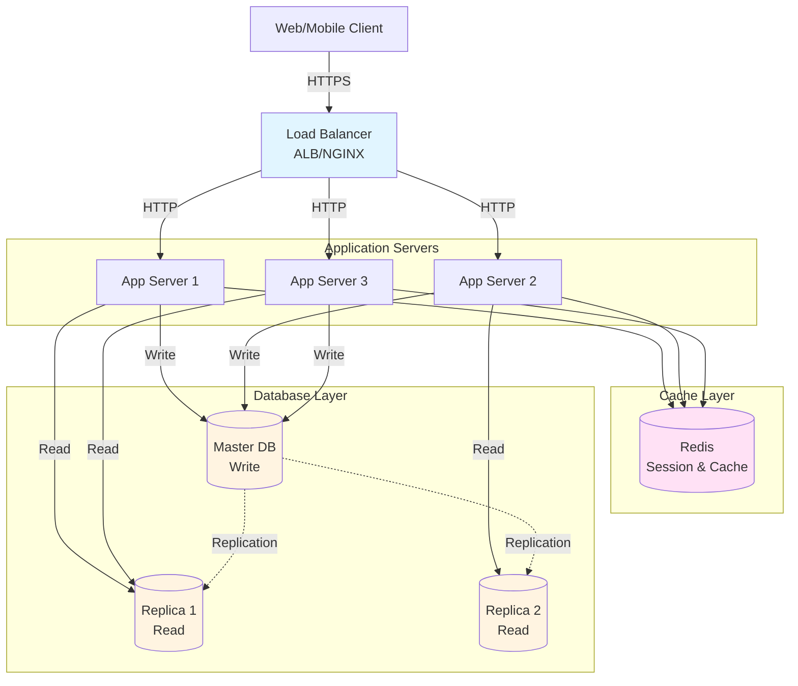

# 段階2: 1,000-10,000ユーザー - 初期成長

## 1. この段階の特徴

### ユーザー数範囲
- **1,000-10,000ユーザー**
- 日間アクティブユーザー（DAU）: 約500-5,000人
- 1日のリクエスト数: 約10,000-100,000リクエスト
- ピーク時の同時接続数: 約50-500接続

### 典型的な課題
- **可用性の確保**: 単一サーバーの障害がサービス全体に影響
- **パフォーマンスの低下**: トラフィック増加によるレスポンス時間の増加
- **データベースのボトルネック**: 読み取りクエリの増加によるデータベース負荷
- **セッション管理**: 複数サーバー間でのセッション共有

### 実例サービス
- **成長期のInstagram（2011年）**: ユーザー数が急増し、複数サーバーとロードバランサーを導入
- **成長期のTwitter（2007-2008年）**: 可用性向上のため、アプリケーションサーバーの複数化を実施

## 2. 追加すべき技術・設計

### 2.1 インフラ

**アプリケーションサーバーの複数化**
- 2-3台のアプリケーションサーバーを配置
- 自動スケーリングの設定（必要に応じて）

**ロードバランサーの導入**
- アプリケーションロードバランサー（ALB）またはNGINX/HAProxy
- ヘルスチェックの設定
- セッションアフィニティ（必要に応じて）

**推奨構成**
- **AWS**: Application Load Balancer + EC2（2-3インスタンス）
- **Heroku**: 2-3 Dynos + Heroku Load Balancer
- **GCP**: Cloud Load Balancing + Compute Engine（2-3インスタンス）

### 2.2 データベース

**読み取りレプリカの導入**
- マスターデータベース（書き込み専用）
- 1-2台の読み取りレプリカ（読み取り専用）
- 読み取りクエリをレプリカにルーティング

**データベース接続プール**
- 接続プールの最適化（max connections: 20-50）
- 読み取り/書き込みの分離

**推奨サービス**
- **AWS RDS**: マスター + 読み取りレプリカ（1-2台）
- **PostgreSQL**: Streaming Replication
- **MySQL**: Master-Slave Replication

### 2.3 キャッシング

**Redisの導入**
- セッションストレージとして使用
- 頻繁にアクセスされるデータのキャッシュ
- レート制限の実装

**キャッシュ戦略**
- **Cache-Aside（Lazy Loading）**: アプリケーションがキャッシュを管理
- **TTL（Time To Live）**: キャッシュの有効期限を設定

**推奨サービス**
- **Redis**: AWS ElastiCache、Redis Cloud、Upstash
- **メモリサイズ**: 1-2GBで十分

### 2.4 負荷分散

**ロードバランサーの設定**
- **Round Robin**: デフォルトのアルゴリズム
- **Least Connections**: 長時間接続がある場合
- **ヘルスチェック**: 30秒間隔、3回連続失敗でアウト

**セッションアフィニティ**
- ステートレス設計を推奨
- 必要に応じて、セッションをRedisに保存

### 2.5 モニタリング

**ログの集約**
- ログを中央集約（CloudWatch Logs、Datadog、Loggly）
- 構造化ログの使用（JSON形式）

**メトリクスの収集**
- アプリケーションメトリクス（レスポンス時間、エラー率）
- インフラメトリクス（CPU、メモリ、ディスク）
- データベースメトリクス（接続数、クエリ時間）

**アラートの設定**
- エラー率が5%を超えた場合
- レスポンス時間が1秒を超えた場合
- データベース接続数が上限に近づいた場合

**推奨サービス**
- **Datadog**: 包括的なモニタリング（無料枠あり）
- **New Relic**: APMとインフラモニタリング
- **Sentry**: エラートラッキング

### 2.6 セキュリティ

**レート制限**
- APIエンドポイントごとのレート制限
- Redisを使用した分散レート制限
- IPアドレスベースのレート制限

**セッションセキュリティ**
- セッションIDのランダム化
- HTTPSの強制
- セッションタイムアウトの設定

**データベースセキュリティ**
- 接続の暗号化（SSL/TLS）
- 最小権限の原則（読み取り専用ユーザー）

### 2.7 アーキテクチャ

**ステートレス設計**
- セッションをRedisに保存
- アプリケーションサーバー間で状態を共有しない

**読み取り/書き込みの分離**
- 読み取りクエリをレプリカにルーティング
- 書き込みクエリをマスターにルーティング

## 3. アーキテクチャ図



**説明**:
- ロードバランサーが複数のアプリケーションサーバーにトラフィックを分散
- Redisでセッションとキャッシュを共有
- マスターデータベースが書き込みを処理し、読み取りレプリカが読み取りを処理

## 4. 実例ケーススタディ

### 4.1 Instagramの成長期（2011年）

**背景**:
- 2011年初頭にユーザー数が急増（10,000ユーザーを突破）
- 単一サーバーでは対応できなくなり、可用性の問題が発生

**導入した技術**:
- **アプリケーションサーバーの複数化**: 2-3台のEC2インスタンス
- **ロードバランサー**: AWS ELB（Elastic Load Balancer）
- **読み取りレプリカ**: PostgreSQLの読み取りレプリカを1台追加
- **Redis**: セッション管理とキャッシュ

**効果**:
- 可用性が向上（単一サーバーの障害がサービス全体に影響しない）
- レスポンス時間が30%改善
- データベースの負荷が分散

**学び**:
- ステートレス設計により、サーバーの追加が容易
- 読み取りレプリカにより、データベースのボトルネックを解消

### 4.2 Twitterの成長期（2007-2008年）

**背景**:
- 2007年にユーザー数が急増
- 単一サーバーでは対応できなくなり、頻繁にダウンタイムが発生

**導入した技術**:
- **アプリケーションサーバーの複数化**: 複数のMongrelサーバー
- **ロードバランサー**: HAProxy
- **Memcached**: キャッシュ層の追加
- **データベースの最適化**: クエリの最適化とインデックスの追加

**効果**:
- ダウンタイムが大幅に減少
- レスポンス時間が改善
- スケーラビリティが向上

**学び**:
- 早期の段階で可用性を確保することが重要
- キャッシュの導入により、データベースの負荷を軽減

## 5. 実装のヒント

### 5.1 設定例

**ロードバランサー設定（NGINX）**

```nginx
upstream app_servers {
    least_conn;
    server app1.example.com:3000;
    server app2.example.com:3000;
    server app3.example.com:3000;
}

server {
    listen 80;
    server_name example.com;

    location / {
        proxy_pass http://app_servers;
        proxy_set_header Host $host;
        proxy_set_header X-Real-IP $remote_addr;
        proxy_set_header X-Forwarded-For $proxy_add_x_forwarded_for;
        
        # ヘルスチェック
        proxy_connect_timeout 5s;
        proxy_send_timeout 10s;
        proxy_read_timeout 10s;
    }
}
```

**Redis接続設定（Node.js）**

```javascript
const redis = require('redis');
const client = redis.createClient({
  host: process.env.REDIS_HOST,
  port: process.env.REDIS_PORT,
  password: process.env.REDIS_PASSWORD,
});

// セッションストア
const session = require('express-session');
const RedisStore = require('connect-redis')(session);

app.use(session({
  store: new RedisStore({ client }),
  secret: process.env.SESSION_SECRET,
  resave: false,
  saveUninitialized: false,
  cookie: { secure: true, httpOnly: true, maxAge: 86400000 }
}));
```

**データベース読み取り/書き込みの分離（Node.js）**

```javascript
const { Pool } = require('pg');

// マスターデータベース（書き込み）
const masterPool = new Pool({
  connectionString: process.env.DATABASE_MASTER_URL,
});

// 読み取りレプリカ（読み取り）
const replicaPool = new Pool({
  connectionString: process.env.DATABASE_REPLICA_URL,
});

// 読み取りクエリ
async function getUsers() {
  const result = await replicaPool.query('SELECT * FROM users');
  return result.rows;
}

// 書き込みクエリ
async function createUser(userData) {
  const result = await masterPool.query(
    'INSERT INTO users (name, email) VALUES ($1, $2) RETURNING *',
    [userData.name, userData.email]
  );
  return result.rows[0];
}
```

### 5.2 コード例（簡略）

**レート制限（Redis使用）**

```javascript
const rateLimit = require('express-rate-limit');
const RedisStore = require('rate-limit-redis');
const redis = require('redis');

const client = redis.createClient({
  host: process.env.REDIS_HOST,
  port: process.env.REDIS_PORT,
});

const limiter = rateLimit({
  store: new RedisStore({
    client: client,
  }),
  windowMs: 15 * 60 * 1000, // 15分
  max: 100, // 15分間に100リクエスト
  message: 'Too many requests from this IP, please try again later.'
});

app.use('/api/', limiter);
```

**キャッシュ実装（Cache-Aside）**

```javascript
async function getUser(userId) {
  // キャッシュから取得を試みる
  const cacheKey = `user:${userId}`;
  const cached = await client.get(cacheKey);
  
  if (cached) {
    return JSON.parse(cached);
  }
  
  // データベースから取得
  const user = await replicaPool.query(
    'SELECT * FROM users WHERE id = $1',
    [userId]
  );
  
  // キャッシュに保存（TTL: 1時間）
  await client.setex(cacheKey, 3600, JSON.stringify(user.rows[0]));
  
  return user.rows[0];
}
```

## 6. コスト見積もり

### 6.1 典型的なコスト

**AWSの場合**
- **Application Load Balancer**: $20-30/月
- **EC2インスタンス（t3.small × 3）**: $30-45/月
- **RDS（db.t3.small + 読み取りレプリカ）**: $60-80/月
- **ElastiCache（cache.t3.micro）**: $15-20/月
- **合計**: 約$125-175/月

**Herokuの場合**
- **Dynos（Standard-1X × 3）**: $75/月
- **PostgreSQL（Standard-0 + 読み取りレプリカ）**: $50-100/月
- **Redis（Premium-0）**: $15/月
- **合計**: 約$140-190/月

**GCPの場合**
- **Cloud Load Balancing**: $20-30/月
- **Compute Engine（n1-standard-1 × 3）**: $45-60/月
- **Cloud SQL（db-n1-standard-1 + 読み取りレプリカ）**: $60-80/月
- **Memorystore（Redis Basic）**: $30-40/月
- **合計**: 約$155-210/月

### 6.2 コスト最適化

1. **自動スケーリング**: トラフィックに応じてサーバー数を調整
2. **リザーブドインスタンス**: 長期契約で20-30%の割引
3. **Spotインスタンス**: 開発環境で使用（最大90%の割引）
4. **キャッシュの最適化**: キャッシュヒット率を向上させ、データベース負荷を軽減

## 7. 次の段階への準備

次の段階（10,000-100,000ユーザー）では、以下の技術が必要になります：

1. **CDNの導入**: 静的コンテンツの配信を最適化
2. **セッション管理の完全な外部化**: ステートレス設計の徹底
3. **非同期処理（メッセージキュー）**: バックグラウンドジョブの処理
4. **モニタリングとログの強化**: より詳細なメトリクスとアラート

**準備すべきこと**:
- 静的コンテンツの分離（画像、CSS、JavaScript）
- 非同期処理が必要なタスクの特定（メール送信、画像処理など）
- ログの構造化と集約の準備
- パフォーマンステストの実施

---

**次のステップ**: [段階3: 10,000-100,000ユーザー](./stage_03_10k_to_100k_users.md)でパフォーマンス最適化を学ぶ

