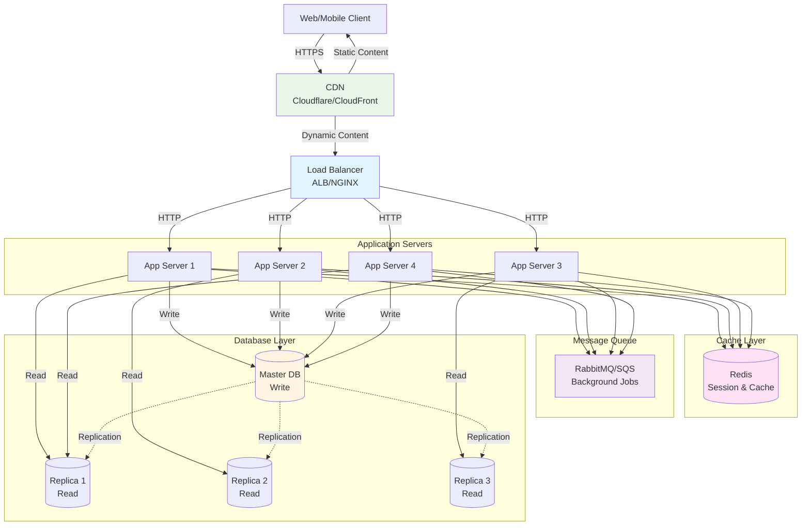

# 段階3: 10,000-100,000ユーザー - 本格成長

## 1. この段階の特徴

### ユーザー数範囲
- **10,000-100,000ユーザー**
- 日間アクティブユーザー（DAU）: 約5,000-50,000人
- 1日のリクエスト数: 約100,000-1,000,000リクエスト
- ピーク時の同時接続数: 約500-5,000接続

### 典型的な課題
- **静的コンテンツの配信**: 画像、CSS、JavaScriptの配信がボトルネック
- **セッション管理**: 複数サーバー間でのセッション共有の最適化
- **非同期処理**: メール送信、画像処理などのバックグラウンドジョブ
- **モニタリング**: より詳細なメトリクスとアラートが必要

### 実例サービス
- **成長期のTwitter（2008-2009年）**: CDNの導入とメッセージキューの活用
- **成長期のInstagram（2011-2012年）**: 画像配信の最適化と非同期処理の導入

## 2. 追加すべき技術・設計

### 2.1 インフラ

**CDNの導入**
- 静的コンテンツ（画像、CSS、JavaScript）をCDNで配信
- グローバルな配信により、レイテンシを削減
- アプリケーションサーバーの負荷を軽減

**推奨サービス**
- **Cloudflare**: 無料枠あり、簡単な設定
- **AWS CloudFront**: AWS環境との統合
- **Fastly**: 高性能なCDN

**アプリケーションサーバーの拡張**
- 4-6台のアプリケーションサーバー
- 自動スケーリングの設定（CPU使用率70%を超えた場合）

### 2.2 データベース

**読み取りレプリカの拡張**
- 読み取りレプリカを2-4台に増やす
- 読み取りクエリをレプリカに分散
- レプリケーションラグの監視

**データベース接続プールの最適化**
- 接続プールのサイズを調整（max connections: 50-100）
- 接続の再利用を最適化

**クエリの最適化**
- スロークエリログの分析
- インデックスの追加と最適化
- クエリのキャッシュ

### 2.3 キャッシング

**キャッシュ戦略の高度化**
- **Write-Through**: 書き込み時にキャッシュとデータベースの両方に書き込み
- **Write-Behind**: 非同期でデータベースに書き込み
- **Cache Warming**: よくアクセスされるデータを事前にキャッシュ

**キャッシュの階層化**
- **L1 Cache**: アプリケーション内キャッシュ（メモリ）
- **L2 Cache**: Redis（分散キャッシュ）
- **L3 Cache**: CDN（静的コンテンツ）

**キャッシュの無効化**
- TTLベースの無効化
- イベントベースの無効化（データ更新時）

### 2.4 負荷分散

**CDNの設定**
- 静的コンテンツをCDNで配信
- 動的コンテンツはアプリケーションサーバーで処理
- キャッシュポリシーの設定（Cache-Controlヘッダー）

**ロードバランサーの最適化**
- ヘルスチェックの間隔を短縮（10秒）
- 接続の再利用（Keep-Alive）
- SSL/TLS終端処理

### 2.5 モニタリング

**ログの集約と分析**
- 構造化ログ（JSON形式）の使用
- ログの集約（ELK Stack、Datadog、New Relic）
- ログの検索と分析

**メトリクスの収集**
- **アプリケーションメトリクス**: レスポンス時間、エラー率、スループット
- **インフラメトリクス**: CPU、メモリ、ディスク、ネットワーク
- **データベースメトリクス**: 接続数、クエリ時間、レプリケーションラグ
- **キャッシュメトリクス**: ヒット率、ミス率、レイテンシ

**アラートの設定**
- エラー率が3%を超えた場合
- レスポンス時間が500msを超えた場合
- データベース接続数が上限の80%を超えた場合
- キャッシュヒット率が70%を下回った場合

**ダッシュボードの作成**
- リアルタイムダッシュボード（Grafana、Datadog）
- 主要なメトリクスの可視化
- トレンド分析

### 2.6 セキュリティ

**レート制限の強化**
- APIエンドポイントごとのレート制限
- ユーザーごとのレート制限
- IPアドレスベースのレート制限

**セッションセキュリティ**
- セッションIDのランダム化と暗号化
- セッションタイムアウトの設定（30分）
- セッション固定攻撃の対策

**DDoS対策**
- CDNによるDDoS対策（Cloudflare、AWS Shield）
- レート制限による保護
- IPホワイトリスト/ブラックリスト

### 2.7 アーキテクチャ

**非同期処理の導入**
- メッセージキュー（RabbitMQ、AWS SQS、Redis Queue）
- バックグラウンドジョブの処理
- イベント駆動アーキテクチャの導入

**セッション管理の完全な外部化**
- セッションをRedisに保存
- ステートレスなアプリケーション設計
- セッションの共有と同期

## 3. アーキテクチャ図



**説明**:
- CDNが静的コンテンツを配信し、動的コンテンツはロードバランサー経由でアプリケーションサーバーにルーティング
- メッセージキューでバックグラウンドジョブを処理
- 読み取りレプリカが3台に増加し、読み取りクエリを分散

## 4. 実例ケーススタディ

### 4.1 Twitterの成長期（2008-2009年）

**背景**:
- 2008年にユーザー数が急増（100,000ユーザーを突破）
- 静的コンテンツの配信がボトルネック
- メール送信などのバックグラウンドジョブがアプリケーションサーバーをブロック

**導入した技術**:
- **CDN**: CloudFrontを導入し、静的コンテンツを配信
- **メッセージキュー**: RabbitMQを導入し、バックグラウンドジョブを処理
- **読み取りレプリカ**: MySQLの読み取りレプリカを2台に増加
- **キャッシュ**: Memcachedのクラスターを構築

**効果**:
- 静的コンテンツの配信速度が50%向上
- バックグラウンドジョブによるブロッキングが解消
- データベースの負荷が分散され、レスポンス時間が改善

**学び**:
- CDNの導入により、アプリケーションサーバーの負荷を大幅に軽減
- 非同期処理により、ユーザー体験が向上

### 4.2 Instagramの成長期（2011-2012年）

**背景**:
- 2011年にユーザー数が急増（100,000ユーザーを突破）
- 画像のアップロードと配信がボトルネック
- 画像処理（リサイズ、フィルター適用）がアプリケーションサーバーをブロック

**導入した技術**:
- **CDN**: CloudFrontを導入し、画像を配信
- **メッセージキュー**: Celery（Python）とRabbitMQを導入
- **画像処理**: バックグラウンドワーカーで画像処理を実行
- **S3**: 画像をS3に保存し、CDN経由で配信

**効果**:
- 画像のアップロード時間が70%短縮
- 画像処理によるブロッキングが解消
- 画像の配信速度が向上

**学び**:
- 重い処理は非同期で実行することで、ユーザー体験が向上
- CDNとオブジェクトストレージの組み合わせが効果的

## 5. 実装のヒント

### 5.1 設定例

**CDN設定（Cloudflare）**

```javascript
// Cache-Controlヘッダーの設定
app.use(express.static('public', {
  maxAge: '1y', // 1年間キャッシュ
  etag: true,
  lastModified: true
}));

// 動的コンテンツのキャッシュ設定
app.get('/api/posts', (req, res) => {
  res.set('Cache-Control', 'public, max-age=300'); // 5分間キャッシュ
  // ...
});
```

**メッセージキュー設定（RabbitMQ）**

```javascript
const amqp = require('amqplib');

// 接続
const connection = await amqp.connect('amqp://localhost');
const channel = await connection.createChannel();

// キューを宣言
await channel.assertQueue('email_queue', { durable: true });
await channel.assertQueue('image_processing_queue', { durable: true });

// メッセージを送信
async function sendEmail(emailData) {
  await channel.sendToQueue('email_queue', Buffer.from(JSON.stringify(emailData)), {
    persistent: true
  });
}

// ワーカーでメッセージを受信
channel.consume('email_queue', async (msg) => {
  const emailData = JSON.parse(msg.content.toString());
  await sendEmailToUser(emailData);
  channel.ack(msg);
}, { noAck: false });
```

**AWS SQSの使用**

```javascript
const AWS = require('aws-sdk');
const sqs = new AWS.SQS();

// メッセージを送信
async function sendMessage(queueUrl, message) {
  const params = {
    QueueUrl: queueUrl,
    MessageBody: JSON.stringify(message)
  };
  await sqs.sendMessage(params).promise();
}

// メッセージを受信
async function receiveMessages(queueUrl) {
  const params = {
    QueueUrl: queueUrl,
    MaxNumberOfMessages: 10,
    WaitTimeSeconds: 20 // Long Polling
  };
  const result = await sqs.receiveMessage(params).promise();
  return result.Messages || [];
}
```

### 5.2 コード例（簡略）

**非同期画像処理**

```javascript
// 画像アップロードAPI
app.post('/api/images', upload.single('image'), async (req, res) => {
  // 画像をS3にアップロード
  const s3Key = await uploadToS3(req.file);
  
  // メッセージキューに画像処理ジョブを追加
  await sendMessage('image_processing_queue', {
    s3Key: s3Key,
    userId: req.user.id,
    originalSize: req.file.size
  });
  
  // すぐにレスポンスを返す
  res.json({ 
    imageId: s3Key,
    status: 'processing'
  });
});

// 画像処理ワーカー
channel.consume('image_processing_queue', async (msg) => {
  const { s3Key, userId, originalSize } = JSON.parse(msg.content.toString());
  
  // 画像をダウンロード
  const image = await downloadFromS3(s3Key);
  
  // 複数のサイズにリサイズ
  const thumbnails = await resizeImage(image, [150, 300, 600]);
  
  // リサイズした画像をS3にアップロード
  await uploadThumbnailsToS3(s3Key, thumbnails);
  
  // データベースを更新
  await updateImageMetadata(s3Key, thumbnails);
  
  channel.ack(msg);
});
```

**キャッシュの無効化**

```javascript
async function updatePost(postId, updates) {
  // データベースを更新
  await masterPool.query(
    'UPDATE posts SET title = $1, content = $2 WHERE id = $3',
    [updates.title, updates.content, postId]
  );
  
  // キャッシュを無効化
  await client.del(`post:${postId}`);
  await client.del(`user:${updates.userId}:posts`);
  
  // メッセージキューにイベントを送信（他のサービスに通知）
  await sendMessage('post_updated_queue', { postId, updates });
}
```

## 6. コスト見積もり

### 6.1 典型的なコスト

**AWSの場合**
- **CloudFront（CDN）**: $50-100/月（転送量による）
- **Application Load Balancer**: $20-30/月
- **EC2インスタンス（t3.medium × 4）**: $120-160/月
- **RDS（db.t3.medium + 読み取りレプリカ × 3）**: $200-300/月
- **ElastiCache（cache.t3.small）**: $30-40/月
- **SQS（メッセージキュー）**: $1-5/月
- **S3（ストレージ）**: $10-50/月
- **合計**: 約$430-685/月

**GCPの場合**
- **Cloud CDN**: $50-100/月
- **Cloud Load Balancing**: $20-30/月
- **Compute Engine（n1-standard-2 × 4）**: $180-240/月
- **Cloud SQL（db-n1-standard-2 + 読み取りレプリカ × 3）**: $300-400/月
- **Memorystore（Redis Standard）**: $60-80/月
- **Cloud Pub/Sub**: $5-10/月
- **Cloud Storage**: $10-50/月
- **合計**: 約$625-910/月

### 6.2 コスト最適化

1. **CDNキャッシュの最適化**: キャッシュヒット率を向上させ、転送量を削減
2. **メッセージキューの最適化**: バッチ処理により、メッセージ数を削減
3. **自動スケーリング**: トラフィックに応じてサーバー数を調整
4. **リザーブドインスタンス**: 長期契約で20-30%の割引

## 7. 次の段階への準備

次の段階（100,000-1,000,000ユーザー）では、以下の技術が必要になります：

1. **データベースシャーディング**: データベースを複数のシャードに分割
2. **読み取り専用レプリカの拡張**: より多くの読み取りレプリカを追加
3. **キャッシュ戦略の高度化**: より複雑なキャッシュ戦略の実装
4. **APIレート制限**: より細かいレート制限の実装

**準備すべきこと**:
- データベースのシャーディング戦略の検討
- キャッシュの階層化の最適化
- APIレート制限の設計
- パフォーマンステストの実施

---

**次のステップ**: [段階4: 100,000-1,000,000ユーザー](./stage_04_100k_to_1m_users.md)でデータベーススケーリングを学ぶ

